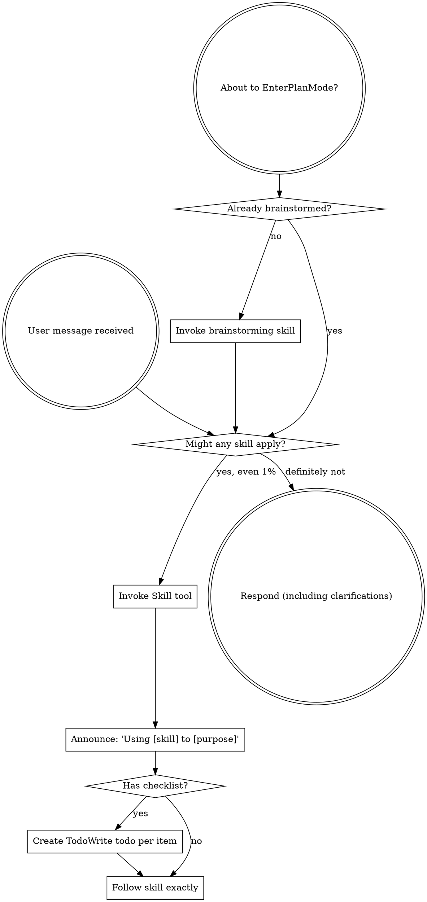

# Boundary Review — pair#123 (whole-issue close)

| field | value |
|-------|-------|
| issue | 123 — Split the right terminal pane with Alt+Shift+d |
| repo | pair |
| issue file | workshop/issues/000123-split-the-right-terminal-pane-with-alt-shift-d.md |
| boundary | whole-issue close |
| milestone | — |
| window | 1245357ec1fbf8a15d00466661a48929ce6ddd63..HEAD |
| command | sdlc close --issue 123 |
| reviewer | codex |
| timestamp | 2026-07-27T17:43:02-07:00 |
| verdict | FIX-THEN-SHIP |

## Review

Reading additional input from stdin...
OpenAI Codex v0.145.0
--------
workdir: /Users/xianxu/workspace/pair
model: gpt-5.5
provider: openai
approval: never
sandbox: workspace-write [workdir, /tmp, $TMPDIR, /tmp] (network access enabled)
reasoning effort: medium
reasoning summaries: none
session id: 019fa62a-a3af-76e0-86f2-2d80f6d01ca4
--------
user
# Code review — the one SDLC boundary review

You are conducting a fresh-context code review at a development boundary —
whole-issue close — in the **pair** repository.

- repository: pair   (root: /Users/xianxu/workspace/pair)
- issue:      pair#123   (file: workshop/issues/000123-split-the-right-terminal-pane-with-alt-shift-d.md)
- window:     Base: 1245357ec1fbf8a15d00466661a48929ce6ddd63   Head: HEAD

Review the **pair** repo and its tracker — the ariadne base-layer repo itself (changes here propagate to dependent repos). Do not assume any
other repository or apply another repo's conventions.

You have no prior session context — that is the anti-collusion property. Verify
behavior against the issue's documented Spec/Plan and the code itself; do NOT
take the implementor's word in commit messages or docs at face value. Tools are
read-only: report findings precisely; the main agent (which has session context)
applies the fixes, commits, and re-runs.

Read the diff against the issue's Spec + Plan, then work the checklist below.
Categorize every finding by severity — not everything is Critical; a nitpick
marked Critical is noise.

  Critical (must fix before crossing the boundary)
    - correctness bugs; crashes / panics on unexpected input
    - behavior drift from stated contracts (for ports of existing code where
      byte-faithfulness was promised, diff against the source)
    - silent error swallowing where the source raised
  Important (fix before the boundary if cheap)
    - API design of newly-introduced internal packages (downstream work will
      consume them; is the surface stable?)
    - missing test coverage that would catch the kind of bug shipped
    - inconsistent error handling across the diff
  Minor (note for future)
    - style nits, naming, comment density; performance only if hot-path

## Review checklist

Code quality
  - Clean separation of concerns; edge cases handled (empty / nil / unexpected).
  - Proper error handling — no silent swallowing where the source raised.
  - No duplicated logic / copy-paste that should be a shared helper.

Testing
  - Tests pin real logic, not mocks reasserting the implementation.
  - The kind of bug this diff could ship is covered.
  - PURE entities tested without IO; INTEGRATION via injected fakes (see below).

Requirements traceability
  - Every Plan checklist item this boundary claims is actually delivered.
  - Implementation matches the Spec; no undeclared scope creep.
  - Breaking changes documented.

Production readiness
  - Migration / backward-compatibility considered where state or formats change.
  - Docs / atlas updated for new surface (see the Docs update gate).

## Core concepts cross-check (if the plan has a Core concepts table)

The plan should list entities in a greppable table — name, kind
(PURE/INTEGRATION), file location, status (new/modified/deleted). For each row:
  - Verify the entity exists at the stated path (grep the diff or filesystem).
  - PURE: tests run without IO (no exec, net, mutable fs). If tests need mocks
    to run, it isn't really PURE — flag Critical and recommend promoting it to
    INTEGRATION.
  - INTEGRATION: injected into pure callers, not invoked directly from business
    logic.
  - "modified" / "deleted": the diff shows the expected change/removal at the
    stated location.
Any contradiction between table and code = Critical finding, plus a plan-revision
recommendation (a "## Revisions" entry so the plan stops claiming what the code
doesn't deliver).

## Docs update gate (atlas + README, per AGENTS.md §8)

The boundary should update user-facing docs for any new surface introduced:

  - **atlas/** — new architectural surface, flow, or terminology. Scan the diff
    for new entity types, subcommands, conventions, file-tree locations. Any
    present without corresponding atlas/ changes in the same range = Important
    finding ("atlas update appears missing for <surface>").
  - **README.md** — new user-facing surface a reader runs or types: subcommands,
    flags, keybindings, config keys, install/usage steps. If the diff adds or
    changes such surface and README.md is not updated in the same range =
    Important finding ("README update appears missing for <surface>"). This is the
    class of gap that used to surface only at the merge-time `specs` judge (#142);
    catch it here, at the earliest gate, before the close verdict is recorded.

## Architecture (the at-review backstop — these matter most long-term)

Work through each of ARCH-DRY, ARCH-PURE, ARCH-PURPOSE explicitly, applying its at-review lens. The
full principle definitions are delivered in the ARCHITECTURE PRINCIPLES block
right after this prompt — for EACH marker, state pass or flag, and cite the
marker (e.g. ARCH-DRY) in any finding. Architecture is where review has the
least training signal and the longest-delayed payoff, so be deliberate here, not
holistic.

## Verdict + output

Begin your response with this fenced verdict block — the machine-read handoff:

```verdict
verdict: <SHIP | FIX-THEN-SHIP | REWORK>
confidence: <high | medium | low>
```

  SHIP           ready; ship it
  FIX-THEN-SHIP  ship after addressing the findings (non-blocking at the gate)
  REWORK         blocking; needs rework before shipping — fix + re-run

The fenced ```` ```verdict ```` block above is the **authoritative machine-read
handoff** — emit it as the first thing in your response. (A prose
`VERDICT: <TOKEN>` first line still satisfies the legacy contract as a fallback,
but the block is what the binary trusts.)

After the verdict block: a 1-paragraph summary — what worked, what blocks SHIP if
it isn't — followed by:
  1. Strengths: 2-5 specific things done well (file:line where useful). Affirm
     validated approaches so the operator knows what's confirmed-good ground.
     Empty acceptable for trivial boundaries.
  2. Critical findings (file:line + fix sketch); empty if none.
  3. Important findings (same format).
  4. Minor findings (terse one-liners).
  5. Test coverage notes.
  6. Architectural notes for upcoming work.
  7. Plan revision recommendations: specific "## Revisions" entries the plan
     needs (empty if the plan still matches the code).


ARCHITECTURE PRINCIPLES — work through each of the 3 entries below explicitly, applying its `at-review` lens; cite the marker (e.g. ARCH-DRY) in any finding.

# Architecture principles (ARCH-*)

Injected architectural taste — the structural decisions whose payoff (or cost)
shows up many turns, often months, down the road. Agents are strong at local
tactics and weak here, so these are checked **at-plan** (when the design is being
made — highest leverage) and **at-review** (backstop, on the diff). Cite the
marker (e.g. `ARCH-DRY`) in plans, `## Log` entries, and review findings.

This file is the single source; it is embedded into the planning, plan-quality,
and code-review prompts. The human narrative lives in AGENTS.md "Core Design
Principles"; this is its machine-delivered companion.

## ARCH-DRY — Don't Repeat Yourself

- **principle:** Reuse before adding. One source of truth per fact/behavior; no
  duplicated logic, copy-pasted blocks, or parallel functions that should be one
  shared helper.
- **at-plan:** Flag a plan that re-implements something the codebase already has,
  or that will obviously duplicate logic across the new files instead of
  extracting a shared helper. Name the existing thing it should reuse.
- **at-review:** Flag duplicated logic / copy-pasted blocks / near-identical
  functions in the diff; point at the consolidation (file:line + the shared
  helper they should become).

## ARCH-PURE — Pure core, thin IO shell

- **principle:** The majority of code is pure functions (deterministic, no side
  effects); a thin "glue" layer at the boundary touches IO/UI/network/clock. Pure
  functions are unit-tested directly; the glue is kept small and injected.
- **at-plan:** Flag a design that buries business logic inside IO/handlers, or
  that will only be testable with heavy mocks (a sign logic isn't separated from
  IO). The plan should name what's pure vs the thin IO seam.
- **at-review:** Flag business logic mixed with IO in the diff; logic that should
  be a pure function injected into a thin caller. If a test needs mocks to run a
  "pure" entity, it isn't pure — recommend extracting the IO to the boundary.

## ARCH-PURPOSE — Serve the issue's actual purpose

- **principle:** Deliver the issue's stated purpose, not the easy subset of it. A
  single-source / "compiled to consumers" change is not done until **every
  consumer derives** from the source — the source is *enforced*, not just
  documentation a surface happens to restate; a hand-maintained restatement of the
  model is a deferred consumer, not a finished one. "Follow-up" is for separable
  extensions, never for the thing that is the point. This is the *opposite axis*
  from Simplicity-First/YAGNI: not "build for an imagined future," but "don't
  **under**-deliver the purpose you already committed to."
- **at-plan:** Flag a plan whose scope is a strict subset of the issue's stated
  goal / Done-when where the part deferred as "follow-up" *is* the purpose (e.g.
  wires one consumer + enforcement but leaves the consumers that motivated the
  issue as documentation that doesn't derive). Ask: does the plan fulfill the
  purpose, or just the cheap win? Name the deferred purpose.
- **at-review:** Does the diff *fulfill* the purpose or settle for the easy win?
  For a single-source change, run the **shadow-sweep** — enumerate the consumers,
  confirm each derives from the source, flag any remaining hand-maintained
  restatement of the model. A "follow-up" that is actually the deferred point of
  the issue is a finding, not a deferral.


OUTPUT CONTRACT (machine-read — do not deviate). LEAD your response with the
fenced ```verdict block shown above — that is the authoritative handoff the binary
reads (its `verdict:` value is one of the listed tokens). Everything after the block
is advisory: a non-blocking verdict WITH findings still PASSES the gate. A bare
`VERDICT: <TOKEN>` line is accepted only as a FALLBACK when the block is absent.

Diff:
diff --git a/README.md b/README.md
index 218d25c..a612e42 100644
--- a/README.md
+++ b/README.md
@@ -72,7 +72,8 @@ Select something with mouse on agent's pane, the selection is inserted at curren
 | **Alt+k** | layout 3 agent/draft/terminal | Move between the last-focused left Pair pane and the right terminal. |
 | **Alt+t** | layout 3 terminal | Create a Pair-owned local terminal tab. |
 | **Alt+w** | layout 3 terminal | Close the active local terminal tab. |
-| **Alt+r** | layout 3 terminal | Rename the active local terminal tab. |
+| **Alt+r** | layout 3 terminal | Rename the active local terminal tab in the pane frame; Enter commits, Escape cancels, and Cmd+Delete deletes to the beginning. |
+| **Alt+Shift+d** | layout 3 terminal | Split the right terminal downward into Zellij panes; the new lower pane runs `pair term` and is mouse-resizable at the boundary. |
 | **Alt+←** / **Alt+→** | layout 3 terminal | Switch local terminal tabs. |
 | **Alt+c** | any pane | Open/show/hide the review collaboration pane. If no review target exists, starts `:PairReview`. |
 | **Shift+Alt+d** | review pane (visual) | Define the selected term inline. The pair agent answers through `pair review definition`, and the pane stores the result as a durable footnote. |
diff --git a/atlas/architecture.md b/atlas/architecture.md
index 0eb52ab..58d67ef 100644
--- a/atlas/architecture.md
+++ b/atlas/architecture.md
@@ -2,7 +2,7 @@
 
 ## What pair is
 
-A launcher that starts a zellij workbench with a left Pair stack and a right user terminal. The left stack runs a TUI coding agent above Neovim on a persistent draft file; the right pane is an ordinary shell where the user can run commands or launch `nvim`. Keystrokes — and mouse-up after a selection — drive bidirectional flow between the Pair-owned panes via `zellij action write-chars` and `zellij action focus-pane-id`, while the terminal pane stays user-owned.
+A launcher that starts a zellij workbench with a left Pair stack and a right user terminal area. The left stack runs a TUI coding agent above Neovim on a persistent draft file; the right area is an ordinary shell surface where the user can run commands or launch `nvim`, and it can split into multiple Zellij panes while each pane still runs `pair term`. Keystrokes — and mouse-up after a selection — drive bidirectional flow between the Pair-owned panes via `zellij action write-chars` and `zellij action focus-pane-id`, while the terminal area stays user-owned.
 
 The whole thing is deliberately small — a handful of shell scripts, one nvim init, and two zellij KDL files. Required deps: `zellij`, `nvim`, `fzf`, `jq`, `par`, plus the agent itself.
 
@@ -363,7 +363,7 @@ Keybinds added on top of zellij defaults (`clear-defaults=false`):
 
 - `unbind "Alt i"` — release Alt+i (zellij's default binds it to MoveTab; we want nvim to see it for image attach).
 - `unbind "Alt n"` — release Alt+n (zellij's default `NewPane` would break pair's managed workbench shape; we rebind it below for restart).
-- `unbind "Alt j"`, `Alt k`, `Alt t`, `Alt w`, `Alt r`, `Alt /`, `Alt C`, and `Ctrl Alt c` — release pane-local workbench chords so the focused pane process owns them. `pair wrap` handles left-agent shortcuts, `nvim/init.lua` handles draft shortcuts, and `pair term` handles right-terminal shortcuts.
+- `unbind "Alt j"`, `Alt k`, `Alt t`, `Alt w`, `Alt r`, `Alt /`, `Alt D`, `Alt C`, and `Ctrl Alt c` — release pane-local workbench chords so the focused pane process owns them. `pair wrap` handles left-agent shortcuts, `nvim/init.lua` handles draft shortcuts, and `pair term` handles right-terminal shortcuts.
 - Mode-locking — every default chord that would switch zellij modes (`Ctrl+g/p/t/n/h/s/o/b`) is unbound, and `Ctrl+q` (zellij's resurrect-leaving Quit) is unbound too — Alt+x is the only quit path.
 - Draft-routed globals (`Alt+d`, `Alt+x`, `Alt+n` / `Ctrl+Alt+n`,
   `Shift+Alt+N`, `Alt+↑`, `Alt+↓`, and `Alt+c`) are encoded by KDL as one
@@ -382,7 +382,7 @@ Keybinds added on top of zellij defaults (`clear-defaults=false`):
 - `Shift+Alt+N` invokes `PairConfirmAgentRestart()` — Y/N modal then signal the stable `pair wrap` supervisor to replace only its coding-agent child with the same user args and no restoration token. See "Reload / restart in place" under the launcher section.
 - `Alt+h` — `Run "pair-help" { floating true; close_on_exit true; ... }` — pops a floating pane running `pair -h | less`.
 - `Alt+↑` / `Alt+↓` — route to nvim's `PairLayoutBigger` / `PairLayoutSmaller` — step the nvim pane along the swap-layout ladder (`minimized ↔ small (12 rows) ↔ third`).
-- Pane-local shortcuts (#116): `Alt+j` toggles vertically only in the left stack; `Alt+k` bridges left/right, returning from the terminal to the last focused left pane via `$PAIR_DATA_DIR/last-left-pane-<tag>`; `Alt+t`/`Alt+w`/`Alt+r` create, close, and rename tabs only in the right terminal; `Alt+/` and `Alt+Shift+C` / `Ctrl+Alt+c` work only in the left stack.
+- Pane-local shortcuts (#116/#123): `Alt+j` toggles vertically only in the left stack; `Alt+k` bridges left/right, returning from the terminal to the last focused left pane via `$PAIR_DATA_DIR/last-left-pane-<tag>`; `Alt+t`/`Alt+w` create and close tabs only in the right terminal; `Alt+r` enters the terminal wrapper's frame-title rename editor (#118), whose pure rune editor and streaming decoder consume all edit/control bytes before the child PTY and use `rename-pane` as the sole title IO boundary; `Alt+Shift+d` in the right terminal runs `zellij action new-pane --direction down --name terminal -- sh -c 'zellij action rename-pane --pane-id "$ZELLIJ_PANE_ID" terminal 2>/dev/null; exec pair term'`, leaving the new lower pane bordered so Zellij owns mouse boundary resizing; `Alt+/` and `Alt+Shift+C` / `Ctrl+Alt+c` work only in the left stack.
 
 The Alt+x/d/n confirms execute in draft Neovim rather than running directly so a single fat-finger doesn't tear the session down (Alt+x in particular is unrecoverable). The lua side also auto-grows out of `minimized` before showing the modal, since otherwise the prompt would land on a 1-row pane where nothing is visible.
 
diff --git a/cmd/internal/termcmd/rename.go b/cmd/internal/termcmd/rename.go
new file mode 100644
index 0000000..5a8eed2
--- /dev/null
+++ b/cmd/internal/termcmd/rename.go
@@ -0,0 +1,104 @@
+package termcmd
+
+import "strings"
+
+type RenameEventKind int
+
+const (
+	RenameConsume RenameEventKind = iota
+	RenameInsert
+	RenameMoveLeft
+	RenameMoveRight
+	RenameHome
+	RenameEnd
+	RenameBackspace
+	RenameDelete
+	RenameDeleteToStart
+	RenameCommit
+	RenameCancel
+)
+
+type RenameEvent struct {
+	Kind RenameEventKind
+	Rune rune
+}
+
+type RenameOutcomeKind int
+
+const (
+	RenameOutcomeNone RenameOutcomeKind = iota
+	RenameOutcomeCommit
+	RenameOutcomeCancel
+)
+
+type RenameOutcome struct {
+	Kind RenameOutcomeKind
+	Name string
+}
+
+type RenameEditor struct {
+	original string
+	text     []rune
+	cursor   int
+}
+
+func NewRenameEditor(name string) RenameEditor {
+	text := []rune(name)
+	return RenameEditor{original: name, text: text, cursor: len(text)}
+}
+
+func (e RenameEditor) Text() string {
+	return string(e.text)
+}
+
+func (e RenameEditor) Cursor() int {
+	return e.cursor
+}
+
+func (e RenameEditor) Original() string {
+	return e.original
+}
+
+func (e RenameEditor) Apply(event RenameEvent) (RenameEditor, RenameOutcome) {
+	e.text = append([]rune(nil), e.text...)
+	switch event.Kind {
+	case RenameInsert:
+		e.text = append(e.text, 0)
+		copy(e.text[e.cursor+1:], e.text[e.cursor:])
+		e.text[e.cursor] = event.Rune
+		e.cursor++
+	case RenameMoveLeft:
+		if e.cursor > 0 {
+			e.cursor--
+		}
+	case RenameMoveRight:
+		if e.cursor < len(e.text) {
+			e.cursor++
+		}
+	case RenameHome:
+		e.cursor = 0
+	case RenameEnd:
+		e.cursor = len(e.text)
+	case RenameBackspace:
+		if e.cursor > 0 {
+			e.text = append(e.text[:e.cursor-1], e.text[e.cursor:]...)
+			e.cursor--
+		}
+	case RenameDelete:
+		if e.cursor < len(e.text) {
+			e.text = append(e.text[:e.cursor], e.text[e.cursor+1:]...)
+		}
+	case RenameDeleteToStart:
+		e.text = append([]rune(nil), e.text[e.cursor:]...)
+		e.cursor = 0
+	case RenameCommit:
+		name := strings.TrimSpace(string(e.text))
+		if name == "" {
+			name = e.original
+		}
+		return e, RenameOutcome{Kind: RenameOutcomeCommit, Name: name}
+	case RenameCancel:
+		return e, RenameOutcome{Kind: RenameOutcomeCancel, Name: e.original}
+	}
+	return e, RenameOutcome{}
+}
diff --git a/cmd/internal/termcmd/rename_input.go b/cmd/internal/termcmd/rename_input.go
new file mode 100644
index 0000000..ba64032
--- /dev/null
+++ b/cmd/internal/termcmd/rename_input.go
@@ -0,0 +1,235 @@
+package termcmd
+
+import (
+	"bytes"
+	"unicode/utf8"
+
+	"github.com/xianxu/pair/cmd/internal/workbenchshortcut"
+)
+
+type RenameDecoderState struct {
+	Pending []byte
+	InPaste bool
+}
+
+var renameControlSequences = []struct {
+	sequence string
+	event    RenameEventKind
+}{
+	{"\x1b[D", RenameMoveLeft},
+	{"\x1bOD", RenameMoveLeft},
+	{"\x1b[C", RenameMoveRight},
+	{"\x1bOC", RenameMoveRight},
+	{"\x1b[H", RenameHome},
+	{"\x1bOH", RenameHome},
+	{"\x1b[1~", RenameHome},
+	{"\x1b[F", RenameEnd},
+	{"\x1bOF", RenameEnd},
+	{"\x1b[4~", RenameEnd},
+	{"\x1b[3~", RenameDelete},
+	{"\x1b[127;9u", RenameDeleteToStart},
+}
+
+var (
+	bracketedPasteStart = []byte("\x1b[200~")
+	bracketedPasteEnd   = []byte("\x1b[201~")
+)
+
+func DecodeRenameInput(state RenameDecoderState, data []byte, flushEscape, eof bool) (RenameDecoderState, []RenameEvent, bool) {
+	input := append(append([]byte(nil), state.Pending...), data...)
+	state.Pending = nil
+	var events []RenameEvent
+
+	for len(input) > 0 {
+		if state.InPaste {
+			if end := bytes.Index(input, bracketedPasteEnd); end >= 0 {
+				input = input[end+len(bracketedPasteEnd):]
+				state.InPaste = false
+				events = append(events, RenameEvent{Kind: RenameConsume})
+				continue
+			}
+			keep := longestSuffixPrefix(input, bracketedPasteEnd)
+			state.Pending = append(state.Pending, input[len(input)-keep:]...)
+			input = nil
+			break
+		}
+
+		switch input[0] {
+		case '\r', '\n':
+			events = append(events, RenameEvent{Kind: RenameCommit})
+			state.Pending = nil
+			return state, events, true
+		case 0x7f, '\b':
+			events = append(events, RenameEvent{Kind: RenameBackspace})
+			input = input[1:]
+			continue
+		case 0x1b:
+			if len(input) == 1 {
+				if flushEscape || eof {
+					events = append(events, RenameEvent{Kind: RenameCancel})
+					return RenameDecoderState{}, events, true
+				}
+				state.Pending = append(state.Pending, input...)
+				return state, events, false
+			}
+			if bytes.HasPrefix(input, bracketedPasteStart) {
+				events = append(events, RenameEvent{Kind: RenameConsume})
+				state.InPaste = true
+				input = input[len(bracketedPasteStart):]
+				continue
+			}
+			if !eof && bytes.HasPrefix(bracketedPasteStart, input) {
+				state.Pending = append(state.Pending, input...)
+				return state, events, false
+			}
+			if event, size, ok := completeRenameControl(input); ok {
+				events = append(events, RenameEvent{Kind: event})
+				input = input[size:]
+				continue
+			}
+			if !eof && renameControlPrefix(input) {
+				state.Pending = append(state.Pending, input...)
+				return state, events, false
+			}
+			if _, rest, ok := workbenchshortcut.DecodeChordPrefix(input); ok {
+				size := len(input) - len(rest)
+				events = append(events, RenameEvent{Kind: RenameConsume})
+				input = input[size:]
+				continue
+			}
+			if !eof && workbenchshortcut.IsChordPrefix(input) {
+				state.Pending = append(state.Pending, input...)
+				return state, events, false
+			}
+			if size, complete := sgrMouseSize(input); complete {
+				events = append(events, RenameEvent{Kind: RenameConsume})
+				input = input[size:]
+				continue
+			}
+			if !eof && escapeSequenceIncomplete(input) {
+				state.Pending = append(state.Pending, input...)
+				return state, events, false
+			}
+			if flushEscape {
+				events = append(events, RenameEvent{Kind: RenameCancel})
+				return RenameDecoderState{}, events, true
+			}
+			size := malformedEscapeSize(input)
+			events = append(events, RenameEvent{Kind: RenameConsume})
+			input = input[size:]
+			continue
+		}
+
+		if input[0] < utf8.RuneSelf {
+			if input[0] >= 0x20 {
+				events = append(events, RenameEvent{Kind: RenameInsert, Rune: rune(input[0])})
+			} else {
+				events = append(events, RenameEvent{Kind: RenameConsume})
+			}
+			input = input[1:]
+			continue
+		}
+		if !utf8.FullRune(input) {
+			state.Pending = append(state.Pending, input...)
+			input = nil
+			break
+		}
+		r, size := utf8.DecodeRune(input)
+		if r == utf8.RuneError && size == 1 {
+			events = append(events, RenameEvent{Kind: RenameConsume})
+			input = input[1:]
+			continue
+		}
+		events = append(events, RenameEvent{Kind: RenameInsert, Rune: r})
+		input = input[size:]
+	}
+
+	if eof {
+		state.Pending = nil
+		state.InPaste = false
+		events = append(events, RenameEvent{Kind: RenameCancel})
+		return state, events, true
+	}
+	return state, events, false
+}
+
+func completeRenameControl(input []byte) (RenameEventKind, int, bool) {
+	for _, candidate := range renameControlSequences {
+		if bytes.HasPrefix(input, []byte(candidate.sequence)) {
+			return candidate.event, len(candidate.sequence), true
+		}
+	}
+	return RenameConsume, 0, false
+}
+
+func renameControlPrefix(input []byte) bool {
+	for _, candidate := range renameControlSequences {
+		if len(input) < len(candidate.sequence) && bytes.HasPrefix([]byte(candidate.sequence), input) {
+			return true
+		}
+	}
+	return false
+}
+
+func sgrMouseSize(input []byte) (int, bool) {
+	if !bytes.HasPrefix(input, []byte("\x1b[<")) {
+		return 0, false
+	}
+	for i := 3; i < len(input); i++ {
+		if input[i] == 'M' || input[i] == 'm' {
+			return i + 1, true
+		}
+	}
+	return 0, false
+}
+
+func escapeSequenceIncomplete(input []byte) bool {
+	if len(input) < 2 {
+		return bytes.Equal(input, []byte{0x1b})
+	}
+	switch input[1] {
+	case '[':
+		for i := 2; i < len(input); i++ {
+			if isTerminalFinalByte(input[i]) {
+				return false
+			}
+		}
+		return true
+	case 'O':
+		return len(input) < 3
+	default:
+		return false
+	}
+}
+
+func malformedEscapeSize(input []byte) int {
+	if len(input) < 2 {
+		return len(input)
+	}
+	if input[1] != '[' && input[1] != 'O' {
+		return 2
+	}
+	for i := 2; i < len(input); i++ {
+		if isTerminalFinalByte(input[i]) {
+			return i + 1
+		}
+	}
+	return len(input)
+}
+
+func isTerminalFinalByte(c byte) bool {
+	return c >= 0x40 && c <= 0x7e
+}
+
+func longestSuffixPrefix(input, prefix []byte) int {
+	max := len(input)
+	if max >= len(prefix) {
+		max = len(prefix) - 1
+	}
+	for size := max; size > 0; size-- {
+		if bytes.Equal(input[len(input)-size:], prefix[:size]) {
+			return size
+		}
+	}
+	return 0
+}
diff --git a/cmd/internal/termcmd/rename_input_test.go b/cmd/internal/termcmd/rename_input_test.go
new file mode 100644
index 0000000..b4bb5b7
--- /dev/null
+++ b/cmd/internal/termcmd/rename_input_test.go
@@ -0,0 +1,184 @@
+package termcmd
+
+import (
+	"fmt"
+	"reflect"
+	"testing"
+
+	"github.com/xianxu/pair/cmd/internal/workbenchshortcut"
+)
+
+func decodeRenameChunks(chunks ...[]byte) ([]RenameEvent, RenameDecoderState, bool) {
+	var state RenameDecoderState
+	var events []RenameEvent
+	var exited bool
+	for _, chunk := range chunks {
+		var got []RenameEvent
+		state, got, exited = DecodeRenameInput(state, chunk, false, false)
+		events = append(events, got...)
+		if exited {
+			break
+		}
+	}
+	return events, state, exited
+}
+
+func TestDecodeRenameInputControlsAtEverySplit(t *testing.T) {
+	tests := []struct {
+		name string
+		seq  string
+		want RenameEventKind
+	}{
+		{"enter cr", "\r", RenameCommit},
+		{"enter lf", "\n", RenameCommit},
+		{"backspace del", "\x7f", RenameBackspace},
+		{"backspace bs", "\b", RenameBackspace},
+		{"left csi", "\x1b[D", RenameMoveLeft},
+		{"left ss3", "\x1bOD", RenameMoveLeft},
+		{"right csi", "\x1b[C", RenameMoveRight},
+		{"right ss3", "\x1bOC", RenameMoveRight},
+		{"home csi", "\x1b[H", RenameHome},
+		{"home ss3", "\x1bOH", RenameHome},
+		{"home tilde", "\x1b[1~", RenameHome},
+		{"end csi", "\x1b[F", RenameEnd},
+		{"end ss3", "\x1bOF", RenameEnd},
+		{"end tilde", "\x1b[4~", RenameEnd},
+		{"delete", "\x1b[3~", RenameDelete},
+		{"super backspace", "\x1b[127;9u", RenameDeleteToStart},
+	}
+	for _, tt := range tests {
+		t.Run(tt.name, func(t *testing.T) {
+			for split := 0; split <= len(tt.seq); split++ {
+				events, state, exited := decodeRenameChunks([]byte(tt.seq[:split]), []byte(tt.seq[split:]))
+				if exited != (tt.want == RenameCommit) {
+					t.Fatalf("split %d exited=%v", split, exited)
+				}
+				want := []RenameEvent{{Kind: tt.want}}
+				if !reflect.DeepEqual(events, want) {
+					t.Fatalf("split %d events=%#v, want %#v (pending %q)", split, events, want, state.Pending)
+				}
+				if len(state.Pending) != 0 {
+					t.Fatalf("split %d pending=%q, want empty", split, state.Pending)
+				}
+			}
+		})
+	}
+}
+
+func TestDecodeRenameInputUTF8AtEverySplit(t *testing.T) {
+	for _, text := range []string{"é", "界", "🙂"} {
+		t.Run(text, func(t *testing.T) {
+			for split := 0; split <= len(text); split++ {
+				events, state, exited := decodeRenameChunks([]byte(text[:split]), []byte(text[split:]))
+				want := []RenameEvent{{Kind: RenameInsert, Rune: []rune(text)[0]}}
+				if exited || !reflect.DeepEqual(events, want) || len(state.Pending) != 0 {
+					t.Fatalf("split %d = events %#v pending %q exited %v; want %#v", split, events, state.Pending, exited, want)
+				}
+			}
+		})
+	}
+}
+
+func TestDecodeRenameInputConsumesWorkbenchShortcutsAndMouse(t *testing.T) {
+	for _, seq := range workbenchshortcut.ChordSequences() {
+		t.Run(fmt.Sprintf("%q", seq), func(t *testing.T) {
+			for split := 0; split <= len(seq); split++ {
+				events, state, exited := decodeRenameChunks([]byte(seq[:split]), []byte(seq[split:]))
+				if exited || !reflect.DeepEqual(events, []RenameEvent{{Kind: RenameConsume}}) || len(state.Pending) != 0 {
+					t.Fatalf("%q split %d = %#v pending %q exited=%v", seq, split, events, state.Pending, exited)
+				}
+			}
+		})
+	}
+	for _, seq := range []string{"\x1b[<0;12;4M", "\x1b[<0;12;4m"} {
+		t.Run(fmt.Sprintf("%q", seq), func(t *testing.T) {
+			for split := 0; split <= len(seq); split++ {
+				events, state, exited := decodeRenameChunks([]byte(seq[:split]), []byte(seq[split:]))
+				if exited || !reflect.DeepEqual(events, []RenameEvent{{Kind: RenameConsume}}) || len(state.Pending) != 0 {
+					t.Fatalf("%q split %d = %#v pending %q exited=%v", seq, split, events, state.Pending, exited)
+				}
+			}
+		})
+	}
+}
+
+func TestDecodeRenameInputConsumesBracketedPastePayload(t *testing.T) {
+	seq := "\x1b[200~hello🙂\x1b[201~x"
+	want := []RenameEvent{{Kind: RenameConsume}, {Kind: RenameConsume}, {Kind: RenameInsert, Rune: 'x'}}
+	for split := 0; split <= len(seq); split++ {
+		events, state, exited := decodeRenameChunks([]byte(seq[:split]), []byte(seq[split:]))
+		if exited || state.InPaste || len(state.Pending) != 0 {
+			t.Fatalf("split %d state=%#v exited=%v", split, state, exited)
+		}
+		if !reflect.DeepEqual(events, want) {
+			t.Fatalf("split %d events=%#v, want %#v", split, events, want)
+		}
+	}
+}
+
+func TestDecodeRenameInputEscapeTimeoutAndEOF(t *testing.T) {
+	state, events, exited := DecodeRenameInput(RenameDecoderState{}, []byte{0x1b}, false, false)
+	if exited || len(events) != 0 || string(state.Pending) != "\x1b" {
+		t.Fatalf("held escape = %#v %#v %v", state, events, exited)
+	}
+	state, events, exited = DecodeRenameInput(state, nil, true, false)
+	if !exited || !reflect.DeepEqual(events, []RenameEvent{{Kind: RenameCancel}}) || len(state.Pending) != 0 {
+		t.Fatalf("flushed escape = %#v %#v %v", state, events, exited)
+	}
+
+	state, _, _ = DecodeRenameInput(RenameDecoderState{}, []byte("\x1b["), false, false)
+	state, events, exited = DecodeRenameInput(state, nil, false, true)
+	if !exited || !reflect.DeepEqual(events, []RenameEvent{{Kind: RenameConsume}, {Kind: RenameCancel}}) || len(state.Pending) != 0 {
+		t.Fatalf("EOF incomplete = %#v %#v %v", state, events, exited)
+	}
+}
+
+func TestDecodeRenameInputConsumesInvalidAndPreservesFollowingRune(t *testing.T) {
+	events, state, exited := decodeRenameChunks([]byte{0xff, 'x'})
+	want := []RenameEvent{{Kind: RenameConsume}, {Kind: RenameInsert, Rune: 'x'}}
+	if exited || !reflect.DeepEqual(events, want) || len(state.Pending) != 0 {
+		t.Fatalf("invalid = %#v pending=%q exited=%v, want %#v", events, state.Pending, exited, want)
+	}
+
+	events, state, exited = decodeRenameChunks([]byte("\x1b[?;xz"))
+	want = []RenameEvent{{Kind: RenameConsume}, {Kind: RenameInsert, Rune: 'z'}}
+	if exited || !reflect.DeepEqual(events, want) || len(state.Pending) != 0 {
+		t.Fatalf("malformed = %#v pending=%q exited=%v, want %#v", events, state.Pending, exited, want)
+	}
+}
+
+func TestDecodeRenameInputConsumesUnknownEscapeTerminators(t *testing.T) {
+	for _, seq := range []string{
+		"\x1b[1;5D",
+		"\x1b[999~",
+		"\x1bOX",
+		"\x1b[<0;12;4X",
+		"\x1b[@",
+		"\x1bO@",
+	} {
+		t.Run(fmt.Sprintf("%q", seq), func(t *testing.T) {
+			for split := 0; split <= len(seq); split++ {
+				events, state, exited := decodeRenameChunks([]byte(seq[:split]), []byte(seq[split:]+"z"))
+				want := []RenameEvent{{Kind: RenameConsume}, {Kind: RenameInsert, Rune: 'z'}}
+				if exited || !reflect.DeepEqual(events, want) || len(state.Pending) != 0 {
+					t.Fatalf("split %d events=%#v pending=%q exited=%v, want %#v", split, events, state.Pending, exited, want)
+				}
+			}
+		})
+	}
+}
+
+func TestDecodeRenameInputExitConsumesSameReadSuffix(t *testing.T) {
+	for _, seq := range []string{"x\ry", "x\x1by"} {
+		state, events, exited := DecodeRenameInput(RenameDecoderState{}, []byte(seq), true, false)
+		if !exited || len(state.Pending) != 0 {
+			t.Fatalf("%q state=%#v exited=%v", seq, state, exited)
+		}
+		if len(events) != 2 || events[0] != (RenameEvent{Kind: RenameInsert, Rune: 'x'}) {
+			t.Fatalf("%q events=%#v", seq, events)
+		}
+		if events[1].Kind != RenameCommit && events[1].Kind != RenameCancel {
+			t.Fatalf("%q exit event=%#v", seq, events[1])
+		}
+	}
+}
diff --git a/cmd/internal/termcmd/rename_test.go b/cmd/internal/termcmd/rename_test.go
new file mode 100644
index 0000000..08f8e49
--- /dev/null
+++ b/cmd/internal/termcmd/rename_test.go
@@ -0,0 +1,107 @@
+package termcmd
+
+import "testing"
+
+func TestRenameEditorTransitions(t *testing.T) {
+	tests := []struct {
+		name       string
+		start      string
+		events     []RenameEvent
+		wantText   string
+		wantCursor int
+		wantKind   RenameOutcomeKind
+		wantName   string
+	}{
+		{
+			name:       "inserts rune at cursor",
+			start:      "ac",
+			events:     []RenameEvent{{Kind: RenameMoveLeft}, {Kind: RenameInsert, Rune: '界'}},
+			wantText:   "a界c",
+			wantCursor: 2,
+		},
+		{
+			name:       "moves by unicode rune",
+			start:      "a🙂界",
+			events:     []RenameEvent{{Kind: RenameMoveLeft}, {Kind: RenameMoveLeft}},
+			wantText:   "a🙂界",
+			wantCursor: 1,
+		},
+		{
+			name:       "home end and boundary moves",
+			start:      "abc",
+			events:     []RenameEvent{{Kind: RenameHome}, {Kind: RenameMoveLeft}, {Kind: RenameEnd}, {Kind: RenameMoveRight}},
+			wantText:   "abc",
+			wantCursor: 3,
+		},
+		{
+			name:       "backspace and delete remove corresponding runes",
+			start:      "a🙂界z",
+			events:     []RenameEvent{{Kind: RenameMoveLeft}, {Kind: RenameBackspace}, {Kind: RenameDelete}},
+			wantText:   "a🙂",
+			wantCursor: 2,
+		},
+		{
+			name:       "boundary deletion is consumed no-op",
+			start:      "x",
+			events:     []RenameEvent{{Kind: RenameHome}, {Kind: RenameBackspace}, {Kind: RenameEnd}, {Kind: RenameDelete}, {Kind: RenameConsume}},
+			wantText:   "x",
+			wantCursor: 1,
+		},
+		{
+			name:       "delete to start preserves unicode suffix",
+			start:      "ab🙂cd",
+			events:     []RenameEvent{{Kind: RenameMoveLeft}, {Kind: RenameMoveLeft}, {Kind: RenameDeleteToStart}},
+			wantText:   "cd",
+			wantCursor: 0,
+		},
+		{
+			name:       "commit trims nonempty text",
+			start:      "old",
+			events:     []RenameEvent{{Kind: RenameHome}, {Kind: RenameInsert, Rune: ' '}, {Kind: RenameEnd}, {Kind: RenameInsert, Rune: ' '}, {Kind: RenameCommit}},
+			wantText:   " old ",
+			wantCursor: 5,
+			wantKind:   RenameOutcomeCommit,
+			wantName:   "old",
+		},
+		{
+			name:       "empty commit retains original name",
+			start:      "old",
+			events:     []RenameEvent{{Kind: RenameHome}, {Kind: RenameDelete}, {Kind: RenameDelete}, {Kind: RenameDelete}, {Kind: RenameCommit}},
+			wantText:   "",
+			wantCursor: 0,
+			wantKind:   RenameOutcomeCommit,
+			wantName:   "old",
+		},
+		{
+			name:       "cancel preserves original name",
+			start:      "old",
+			events:     []RenameEvent{{Kind: RenameInsert, Rune: '!'}, {Kind: RenameCancel}},
+			wantText:   "old!",
+			wantCursor: 4,
+			wantKind:   RenameOutcomeCancel,
+			wantName:   "old",
+		},
+	}
+
+	for _, tt := range tests {
+		t.Run(tt.name, func(t *testing.T) {
+			editor := NewRenameEditor(tt.start)
+			var outcome RenameOutcome
+			for _, event := range tt.events {
+				editor, outcome = editor.Apply(event)
+			}
+			if got := editor.Text(); got != tt.wantText {
+				t.Fatalf("Text() = %q, want %q", got, tt.wantText)
+			}
+			if got := editor.Cursor(); got != tt.wantCursor {
+				t.Fatalf("Cursor() = %d, want %d", got, tt.wantCursor)
+			}
+			if outcome.Kind != tt.wantKind || outcome.Name != tt.wantName {
+				t.Fatalf("outcome = %#v, want kind=%v name=%q", outcome, tt.wantKind, tt.wantName)
+			}
+			if got := editor.Original(); got != tt.start {
+				t.Fatalf("Original() = %q, want immutable %q", got, tt.start)
+			}
+		})
+	}
+}
diff --git a/cmd/internal/termcmd/run.go b/cmd/internal/termcmd/run.go
index e9e5c7c..f44b236 100644
--- a/cmd/internal/termcmd/run.go
+++ b/cmd/internal/termcmd/run.go
@@ -13,6 +13,7 @@ import (
 	"strings"
 	"sync"
 	"syscall"
+	"time"
 
 	"github.com/creack/pty"
 	"github.com/xianxu/pair/cmd/internal/draftroute"
@@ -32,6 +33,8 @@ type Runtime interface {
 	ShellCommand() (string, []string)
 }
 
+const rightTerminalPaneShell = `zellij action rename-pane --pane-id "$ZELLIJ_PANE_ID" terminal 2>/dev/null; exec pair term`
+
 func Run(args []string, stdin io.Reader, stdout, stderr io.Writer) int {
 	return RunWithRuntime(args, stdin, stdout, stderr, OSRuntime{})
 }
@@ -74,6 +77,8 @@ func namedChord(name string) (workbenchshortcut.Chord, bool) {
 		return workbenchshortcut.ChordAltW, true
 	case "alt+r":
 		return workbenchshortcut.ChordAltR, true
+	case "alt+shift+d":
+		return workbenchshortcut.ChordAltShiftD, true
 	case "alt+x":
 		return workbenchshortcut.ChordAltX, true
 	case "alt+/":
@@ -169,6 +174,8 @@ func runDecision(decision workbenchshortcut.ShortcutDecision, panes workbenchPan
 			return nil
 		}
 		return rt.RunZellijAction("focus-pane-id", panes.terminal.ID)
+	case workbenchshortcut.ActionSplitTerminalDown:
+		return splitTerminalDown(rt)
 	case workbenchshortcut.ActionToggleFocusedLayout:
 		if layoutcmd.RunToggleFocused(nil, rt, io.Discard) != 0 {
 			return fmt.Errorf("toggle focused layout failed")
@@ -230,76 +237,211 @@ type ptyWriter interface {
 	writeActive([]byte)
 	newTab() error
 	closeActive()
-	renameActive(string)
+	beginRename() (int, RenameEditor, error)
+	refreshRename(int, RenameEditor) error
+	finishRename(int, RenameOutcome) error
 	previousTab()
 	nextTab()
 	appMouseMode() bool
 }
 
+type RenameTimer interface {
+	C() <-chan time.Time
+	Reset(time.Duration)
+	StopAndDrain()
+}
+
+type realRenameTimer struct {
+	timer *time.Timer
+}
+
+func newRealRenameTimer() *realRenameTimer {
+	timer := time.NewTimer(time.Hour)
+	if !timer.Stop() {
+		<-timer.C
+	}
+	return &realRenameTimer{timer: timer}
+}
+
+func (t *realRenameTimer) C() <-chan time.Time {
+	return t.timer.C
+}
+
+func (t *realRenameTimer) Reset(after time.Duration) {
+	t.StopAndDrain()
+	t.timer.Reset(after)
+}
+
+func (t *realRenameTimer) StopAndDrain() {
+	if !t.timer.Stop() {
+		select {
+		case <-t.timer.C:
+		default:
+		}
+	}
+}
+
+type stdinResult struct {
+	data []byte
+	err  error
+}
+
+type renameSession struct {
+	tabID   int
+	editor  RenameEditor
+	decoder RenameDecoderState
+}
+
 func pumpStdin(stdin io.Reader, mux ptyWriter, rt Runtime, stdout io.Writer) {
-	buf := make([]byte, 4096)
+	pumpStdinWithTimer(stdin, mux, rt, stdout, newRealRenameTimer())
+}
+
+func pumpStdinWithTimer(stdin io.Reader, mux ptyWriter, rt Runtime, stdout io.Writer, timer RenameTimer) {
+	results := make(chan stdinResult, 1)
+	go func() {
+		buf := make([]byte, 4096)
+		for {
+			n, err := stdin.Read(buf)
+			result := stdinResult{err: err}
+			if n > 0 {
+				result.data = append([]byte(nil), buf[:n]...)
+			}
+			results <- result
+			if err != nil {
+				return
+			}
+		}
+	}()
+
 	var held []byte
+	var rename *renameSession
+
+	applyRename := func(data []byte, flushEscape, eof bool) {
+		if rename == nil {
+			return
+		}
+		var events []RenameEvent
+		var exited bool
+		rename.decoder, events, exited = DecodeRenameInput(rename.decoder, data, flushEscape, eof)
+		for _, event := range events {
+			if event.Kind == RenameConsume {
+				continue
+			}
+			var outcome RenameOutcome
+			rename.editor, outcome = rename.editor.Apply(event)
+			if outcome.Kind != RenameOutcomeNone {
+				if err := mux.finishRename(rename.tabID, outcome); err != nil {
+					rt.ReportShortcutError(err)
+				}
+				timer.StopAndDrain()
+				rename = nil
+				return
+			}
+			if err := mux.refreshRename(rename.tabID, rename.editor); err != nil {
+				rt.ReportShortcutError(err)
+			}
+		}
+		if exited {
+			timer.StopAndDrain()
+			rename = nil
+			return
+		}
+		if len(rename.decoder.Pending) == 1 && rename.decoder.Pending[0] == 0x1b {
+			timer.Reset(50 * time.Millisecond)
+		} else {
+			timer.StopAndDrain()
+		}
+	}
+
 	for {
-		n, err := stdin.Read(buf)
-		if n > 0 {
-			data := append(held, buf[:n]...)
-			held = nil
-			for len(data) > 0 {
-				chordBefore, chord, _, chordRest, chordOK := workbenchshortcut.FindChord(data)
-				mouseBefore, event, rawMouse, mouseRest, mouseOK := findSGRMousePress(data)
-				if chordOK && (!mouseOK || len(chordBefore) <= len(mouseBefore)) {
-					if len(chordBefore) > 0 {
-						mux.writeActive(chordBefore)
-					}
-					if !handleTerminalChord(chord, mux, rt, stdin, stdout) {
-						if err := handleChord(chord, rt, stdin, stdout); err != nil {
-							rt.ReportShortcutError(err)
+		select {
+		case <-timer.C():
+			applyRename(nil, true, false)
+		case result := <-results:
+			if len(result.data) > 0 {
+				if rename != nil {
+					applyRename(result.data, false, false)
+					if result.err != nil {
+						if rename != nil {
+							applyRename(nil, false, true)
 						}
+						return
 					}
-					data = chordRest
 					continue
 				}
-				if mouseOK {
-					if len(mouseBefore) > 0 {
-						mux.writeActive(mouseBefore)
+				data := append(held, result.data...)
+				held = nil
+				for len(data) > 0 {
+					chordBefore, chord, _, chordRest, chordOK := workbenchshortcut.FindChord(data)
+					mouseBefore, event, rawMouse, mouseRest, mouseOK := findSGRMousePress(data)
+					if chordOK && (!mouseOK || len(chordBefore) <= len(mouseBefore)) {
+						if len(chordBefore) > 0 {
+							mux.writeActive(chordBefore)
+						}
+						if chord == workbenchshortcut.ChordAltR {
+							tabID, editor, err := mux.beginRename()
+							if err != nil {
+								rt.ReportShortcutError(err)
+								data = nil
+								continue
+							}
+							rename = &renameSession{tabID: tabID, editor: editor}
+							applyRename(chordRest, false, false)
+							data = nil
+							continue
+						}
+						if !handleTerminalChord(chord, mux, rt) {
+							if err := handleChord(chord, rt, stdin, stdout); err != nil {
+								rt.ReportShortcutError(err)
+							}
+						}
+						data = chordRest
+						continue
 					}
-					switch event.button {
-					case 64:
-						if mux.appMouseMode() {
-							mux.writeActive(rawMouse)
-						} else {
-							_ = rt.RunZellijAction("scroll-up")
+					if mouseOK {
+						if len(mouseBefore) > 0 {
+							mux.writeActive(mouseBefore)
 						}
-					case 65:
-						if mux.appMouseMode() {
+						switch event.button {
+						case 64:
+							if mux.appMouseMode() {
+								mux.writeActive(rawMouse)
+							} else {
+								_ = rt.RunZellijAction("scroll-up")
+							}
+						case 65:
+							if mux.appMouseMode() {
+								mux.writeActive(rawMouse)
+							} else {
+								_ = rt.RunZellijAction("scroll-down")
+							}
+						default:
 							mux.writeActive(rawMouse)
-						} else {
-							_ = rt.RunZellijAction("scroll-down")
 						}
-					default:
-						mux.writeActive(rawMouse)
+						data = mouseRest
+						continue
 					}
-					data = mouseRest
-					continue
-				}
-				if workbenchshortcut.IsChordPrefix(data) || isSGRMousePrefix(data) {
-					held = append(held, data...)
-					break
+					if workbenchshortcut.IsChordPrefix(data) || isSGRMousePrefix(data) {
+						held = append(held, data...)
+						break
+					}
+					mux.writeActive(data)
+					data = nil
 				}
-				mux.writeActive(data)
-				data = nil
 			}
-		}
-		if err != nil {
-			if len(held) > 0 {
-				mux.writeActive(held)
+			if result.err != nil {
+				if rename != nil {
+					applyRename(nil, false, true)
+				} else if len(held) > 0 {
+					mux.writeActive(held)
+				}
+				return
 			}
-			return
 		}
 	}
 }
 
-func handleTerminalChord(chord workbenchshortcut.Chord, mux ptyWriter, rt Runtime, stdin io.Reader, stdout io.Writer) bool {
+func handleTerminalChord(chord workbenchshortcut.Chord, mux ptyWriter, rt Runtime) bool {
 	switch chord {
 	case workbenchshortcut.ChordAltT:
 		_ = mux.newTab()
@@ -307,17 +449,17 @@ func handleTerminalChord(chord workbenchshortcut.Chord, mux ptyWriter, rt Runtim
 	case workbenchshortcut.ChordAltW:
 		mux.closeActive()
 		return true
-	case workbenchshortcut.ChordAltR:
-		if name := readRawPrompt(stdin, stdout, "tab name: "); strings.TrimSpace(name) != "" {
-			mux.renameActive(strings.TrimSpace(name))
-		}
-		return true
 	case workbenchshortcut.ChordAltLeft:
 		mux.previousTab()
 		return true
 	case workbenchshortcut.ChordAltRight:
 		mux.nextTab()
 		return true
+	case workbenchshortcut.ChordAltShiftD:
+		if err := splitTerminalDown(rt); err != nil {
+			rt.ReportShortcutError(err)
+		}
+		return true
 	case workbenchshortcut.ChordAltShiftEnter:
 		_ = layoutcmd.RunToggleFocused(nil, rt, io.Discard)
 		return true
@@ -326,6 +468,10 @@ func handleTerminalChord(chord workbenchshortcut.Chord, mux ptyWriter, rt Runtim
 	}
 }
 
+func splitTerminalDown(rt Runtime) error {
+	return rt.RunZellijAction("new-pane", "--direction", "down", "--name", "terminal", "--", "sh", "-c", rightTerminalPaneShell)
+}
+
 type mousePressEvent struct {
 	button int
 	x      int
@@ -377,36 +523,6 @@ func isSGRMousePrefix(data []byte) bool {
 		(bytes.HasPrefix(data, []byte("\x1b[<")) && bytes.IndexByte(data, 'M') < 0)
 }
 
-func readRawPrompt(stdin io.Reader, stdout io.Writer, prompt string) string {
-	_, _ = io.WriteString(stdout, "\r\n"+prompt)
-	var b strings.Builder
-	buf := make([]byte, 1)
-	for {
-		n, err := stdin.Read(buf)
-		if n > 0 {
-			c := buf[0]
-			switch c {
-			case '\r', '\n':
-				_, _ = io.WriteString(stdout, "\r\n")
-				return b.String()
-			case 0x7f, '\b':
-				s := b.String()
-				if len(s) > 0 {
-					b.Reset()
-					b.WriteString(s[:len(s)-1])
-					_, _ = io.WriteString(stdout, "\b \b")
-				}
-			default:
-				b.WriteByte(c)
-				_, _ = stdout.Write(buf[:1])
-			}
-		}
-		if err != nil {
-			return b.String()
-		}
-	}
-}
-
 type OSRuntime struct{}
 
 type terminalTab struct {
@@ -431,6 +547,7 @@ type terminalMux struct {
 	stdout    io.Writer
 	stderr    io.Writer
 	rt        Runtime
+	paneID    string
 	tabs      []*terminalTab
 	active    int
 	nextID    int
@@ -438,6 +555,12 @@ type terminalMux struct {
 	done      chan struct{}
 	rows      uint16
 	cols      uint16
+	rename    *activeRename
+}
+
+type activeRename struct {
+	tabID  int
+	editor RenameEditor
 }
 
 func newTerminalMux(shellName string, shellArgs []string, stdout, stderr io.Writer, rt Runtime) *terminalMux {
@@ -447,6 +570,7 @@ func newTerminalMux(shellName string, shellArgs []string, stdout, stderr io.Writ
 		stdout:    stdout,
 		stderr:    stderr,
 		rt:        rt,
+		paneID:    os.Getenv("ZELLIJ_PANE_ID"),
 		active:    -1,
 		output:    make(chan ptyChunk, 64),
 		done:      make(chan struct{}),
@@ -474,6 +598,7 @@ func (m *terminalMux) newTab() error {
 	m.active = len(m.tabs) - 1
 	m.mu.Unlock()
 	m.renamePane()
+	m.redrawTab(tab)
 
 	go m.readPTY(tab)
 	return nil
@@ -586,13 +711,54 @@ func (m *terminalMux) closeActive() {
 	_ = tab.cmd.Process.Kill()
 }
 
-func (m *terminalMux) renameActive(name string) {
+func (m *terminalMux) beginRename() (int, RenameEditor, error) {
 	m.mu.Lock()
-	if tab := m.activeTabLocked(); tab != nil {
-		tab.name = name
+	tab := m.activeTabLocked()
+	if tab == nil {
+		m.mu.Unlock()
+		return 0, RenameEditor{}, fmt.Errorf("rename terminal tab: no active tab")
 	}
+	editor := NewRenameEditor(tab.name)
+	tabID := tab.id
+	m.rename = &activeRename{tabID: tabID, editor: editor}
+	title := m.renamePaneTitleLocked(tabID, editor)
 	m.mu.Unlock()
-	m.renamePane()
+	if err := m.setPaneTitle(title); err != nil {
+		m.mu.Lock()
+		if m.rename != nil && m.rename.tabID == tabID {
+			m.rename = nil
+		}
+		m.mu.Unlock()
+		return 0, RenameEditor{}, fmt.Errorf("start terminal tab rename: %w", err)
+	}
+	return tabID, editor, nil
+}
+
+func (m *terminalMux) refreshRename(tabID int, editor RenameEditor) error {
+	m.mu.Lock()
+	m.rename = &activeRename{tabID: tabID, editor: editor}
+	title := m.renamePaneTitleLocked(tabID, editor)
+	m.mu.Unlock()
+	if err := m.setPaneTitle(title); err != nil {
+		return fmt.Errorf("refresh terminal tab rename: %w", err)
+	}
+	return nil
+}
+
+func (m *terminalMux) finishRename(tabID int, outcome RenameOutcome) error {
+	m.mu.Lock()
+	if outcome.Kind == RenameOutcomeCommit {
+		if tab := m.tabByIDLocked(tabID); tab != nil {
+			tab.name = outcome.Name
+		}
+	}
+	m.rename = nil
+	title := m.paneTitleLocked()
+	m.mu.Unlock()
+	if err := m.setPaneTitle(title); err != nil {
+		return fmt.Errorf("finish terminal tab rename: %w", err)
+	}
+	return nil
 }
 
 func (m *terminalMux) previousTab() {
@@ -629,6 +795,8 @@ func (m *terminalMux) removeTab(id int) {
 	var active *terminalTab
 	empty := false
 	activeID := 0
+	title := ""
+	preserveRename := false
 	if tab := m.activeTabLocked(); tab != nil {
 		activeID = tab.id
 	}
@@ -654,6 +822,12 @@ func (m *terminalMux) removeTab(id int) {
 			}
 		}
 		active = m.activeTabLocked()
+		if m.rename != nil {
+			title = m.renamePaneTitleLocked(m.rename.tabID, m.rename.editor)
+			preserveRename = true
+		} else {
+			title = m.paneTitleLocked()
+		}
 		break
 	}
 	m.mu.Unlock()
@@ -666,8 +840,10 @@ func (m *terminalMux) removeTab(id int) {
 		close(m.done)
 		return
 	}
-	m.renamePane()
-	m.redrawTab(active)
+	_ = m.setPaneTitle(title)
+	if !preserveRename {
+		m.redrawTab(active)
+	}
 }
 
 func (m *terminalMux) activeTabLocked() *terminalTab {
@@ -677,6 +853,15 @@ func (m *terminalMux) activeTabLocked() *terminalTab {
 	return m.tabs[m.active]
 }
 
+func (m *terminalMux) tabByIDLocked(id int) *terminalTab {
+	for _, tab := range m.tabs {
+		if tab.id == id {
+			return tab
+		}
+	}
+	return nil
+}
+
 func (m *terminalMux) inheritSize(stdinFile *os.File) {
 	m.captureSize(stdinFile)
 	m.mu.Lock()
@@ -742,7 +927,14 @@ func (m *terminalMux) renamePane() {
 	if title == "" {
 		return
 	}
-	_ = m.rt.RunZellijAction("rename-pane", title)
+	_ = m.setPaneTitle(title)
+}
+
+func (m *terminalMux) setPaneTitle(title string) error {
+	if m.paneID != "" {
+		return m.rt.RunZellijAction("rename-pane", "--pane-id", m.paneID, title)
+	}
+	return m.rt.RunZellijAction("rename-pane", title)
 }
 
 func (m *terminalMux) paneTitleLocked() string {
@@ -760,6 +952,35 @@ func (m *terminalMux) paneTitleLocked() string {
 	return strings.Join(parts, " ")
 }
 
+func (m *terminalMux) renamePaneTitleLocked(tabID int, editor RenameEditor) string {
+	if len(m.tabs) == 0 {
+		return ""
+	}
+	text := []rune(editor.Text())
+	cursor := editor.Cursor()
+	if cursor < 0 {
+		cursor = 0
+	}
+	if cursor > len(text) {
+		cursor = len(text)
+	}
+	field := string(text[:cursor]) + "│" + string(text[cursor:])
+	parts := make([]string, 0, len(m.tabs))
+	found := false
+	for _, tab := range m.tabs {
+		if tab.id == tabID {
+			found = true
+			parts = append(parts, "[rename: "+field+"]")
+		} else {
+			parts = append(parts, tab.name)
+		}
+	}
+	if !found {
+		parts = append(parts, "[rename: "+field+"]")
+	}
+	return strings.Join(parts, " ")
+}
+
 func (m *terminalMux) redrawTab(tab *terminalTab) {
 	if tab == nil {
 		return
diff --git a/cmd/internal/termcmd/run_test.go b/cmd/internal/termcmd/run_test.go
index 3c09788..65c0243 100644
--- a/cmd/internal/termcmd/run_test.go
+++ b/cmd/internal/termcmd/run_test.go
@@ -3,11 +3,14 @@ package termcmd
 import (
 	"bytes"
 	"errors"
+	"fmt"
 	"io"
 	"os"
 	"os/exec"
+	"path/filepath"
 	"strings"
 	"testing"
+	"time"
 )
 
 func TestRunTestShortcutRightTerminalActions(t *testing.T) {
@@ -26,6 +29,9 @@ func TestRunTestShortcutRightTerminalActions(t *testing.T) {
 		{name: "new tab stays local", chord: "Alt+t"},
 		{name: "close tab stays local", chord: "Alt+w"},
 		{name: "rename tab stays local", chord: "Alt+r"},
+		{name: "alt shift d splits terminal down", chord: "Alt+Shift+d", wantOps: []string{
+			`new-pane --direction down --name terminal -- sh -c zellij action rename-pane --pane-id "$ZELLIJ_PANE_ID" terminal 2>/dev/null; exec pair term`,
+		}},
 		{name: "alt x routes quit to draft", chord: "Alt+x", wantOps: []string{
 			"focus-pane-id 2",
 			"write --pane-id 2 28",
@@ -65,14 +71,18 @@ func TestRunTestShortcutIgnoresNonTerminalPane(t *testing.T) {
 		{"id":2,"is_focused":false,"is_floating":false,"is_plugin":false,"title":"draft","terminal_command":"nvim -u /pair/nvim/init.lua /data/draft-t.md"},
 		{"id":4,"is_focused":true,"is_floating":true,"is_plugin":false,"title":"review","terminal_command":"nvim -u /pair/nvim/review.lua /tmp/review.md"}
 	]`
-	rt := &fakeRuntime{panesJSON: panes}
-	var stderr bytes.Buffer
-	code := RunWithRuntime([]string{"--test-shortcut", "Alt+r"}, strings.NewReader(""), &bytes.Buffer{}, &stderr, rt)
-	if code != 0 {
-		t.Fatalf("code = %d stderr=%q", code, stderr.String())
-	}
-	if len(rt.ops) != 0 {
-		t.Fatalf("ops = %v, want none", rt.ops)
+	for _, chord := range []string{"Alt+r", "Alt+Shift+d"} {
+		t.Run(chord, func(t *testing.T) {
+			rt := &fakeRuntime{panesJSON: panes}
+			var stderr bytes.Buffer
+			code := RunWithRuntime([]string{"--test-shortcut", chord}, strings.NewReader(""), &bytes.Buffer{}, &stderr, rt)
+			if code != 0 {
+				t.Fatalf("code = %d stderr=%q", code, stderr.String())
+			}
+			if len(rt.ops) != 0 {
+				t.Fatalf("ops = %v, want none", rt.ops)
+			}
+		})
 	}
 }
 
@@ -133,10 +143,12 @@ func TestPumpStdinHandlesTerminalTabActions(t *testing.T) {
 		wantRTOps string
 	}{
 		{name: "new tab", chunks: [][]byte{{0x1b, 't'}}, wantMux: "new-tab"},
+		{name: "new tab kkp", chunks: [][]byte{[]byte("\x1b[116;3u")}, wantMux: "new-tab"},
 		{name: "close tab", chunks: [][]byte{{0x1b, 'w'}}, wantMux: "close-tab"},
-		{name: "rename tab", chunks: [][]byte{{0x1b, 'r'}, []byte("work\r")}, wantMux: "rename:work"},
+		{name: "rename tab", chunks: [][]byte{{0x1b, 'r'}, []byte("work\r")}, wantMux: "rename-begin:,rename-preview:w:1,rename-preview:wo:2,rename-preview:wor:3,rename-preview:work:4,rename-finish:1:work"},
 		{name: "previous tab", chunks: [][]byte{[]byte("\x1b[1;3D")}, wantMux: "prev-tab"},
 		{name: "next tab", chunks: [][]byte{[]byte("\x1b[1;3C")}, wantMux: "next-tab"},
+		{name: "split terminal down", chunks: [][]byte{[]byte("\x1b[68;4u")}, wantRTOps: `new-pane --direction down --name terminal -- sh -c zellij action rename-pane --pane-id "$ZELLIJ_PANE_ID" terminal 2>/dev/null; exec pair term`},
 		{name: "alt d routes detach to draft", chunks: [][]byte{[]byte("\x1b[100;3u")}, wantRTOps: "focus-pane-id 2,write --pane-id 2 28,write --pane-id 2 14,write-chars --pane-id 2 :lua PairConfirmDetach(),write --pane-id 2 13"},
 		{name: "alt x routes quit to draft", chunks: [][]byte{[]byte("\x1b[120;3u")}, wantRTOps: "focus-pane-id 2,write --pane-id 2 28,write --pane-id 2 14,write-chars --pane-id 2 :lua PairConfirmQuit(),write --pane-id 2 13"},
 		{name: "alt n routes restart to draft", chunks: [][]byte{[]byte("\x1b[110;3u")}, wantRTOps: "focus-pane-id 2,write --pane-id 2 28,write --pane-id 2 14,write-chars --pane-id 2 :lua PairConfirmRestart(),write --pane-id 2 13"},
@@ -173,6 +185,25 @@ func TestPumpStdinHandlesTerminalTabActions(t *testing.T) {
 	}
 }
 
+func TestPumpStdinTerminalShortcutsDoNotLeakWhenSplit(t *testing.T) {
+	for _, seq := range []string{"\x1bt", "\x1b[116;3u"} {
+		t.Run(fmt.Sprintf("%q", seq), func(t *testing.T) {
+			for split := 1; split < len(seq); split++ {
+				rt := &fakeRuntime{}
+				mux := &fakeMux{}
+				pumpStdin(&splitReader{chunks: [][]byte{
+					[]byte(seq[:split]),
+					[]byte(seq[split:]),
+				}}, mux, rt, io.Discard)
+
+				if got := strings.Join(mux.ops, ","); got != "new-tab" {
+					t.Fatalf("split %d ops = %q, want new-tab without residue", split, got)
+				}
+			}
+		})
+	}
+}
+
 func TestPumpStdinReportsFocusFailureWithoutWriting(t *testing.T) {
 	rt := &fakeRuntime{cachedDraft: "2", failFocus: true}
 	mux := &fakeMux{}
@@ -201,6 +232,282 @@ func TestPumpStdinConsumesGlobalChordWhenDraftMissing(t *testing.T) {
 	}
 }
 
+func TestPumpStdinRenameCommitsInFrameWithoutChildPrompt(t *testing.T) {
+	rt := &fakeRuntime{}
+	mux := &fakeMux{activeName: "work"}
+	var stdout bytes.Buffer
+
+	pumpStdin(&splitReader{chunks: [][]byte{
+		[]byte("\x1br"),
+		[]byte("界\r"),
+		[]byte("ls\n"),
+	}}, mux, rt, &stdout)
+
+	want := "rename-begin:work,rename-preview:work界:5,rename-finish:1:work界,write:ls\n"
+	if got := strings.Join(mux.ops, ","); got != want {
+		t.Fatalf("ops = %q, want %q", got, want)
+	}
+	if stdout.Len() != 0 {
+		t.Fatalf("stdout = %q, want no content-area prompt", stdout.String())
+	}
+}
+
+func TestPumpStdinRenameConsumesSameReadSuffix(t *testing.T) {
+	rt := &fakeRuntime{}
+	mux := &fakeMux{activeName: "work"}
+
+	pumpStdin(&splitReader{chunks: [][]byte{[]byte("\x1brx\rls\n")}}, mux, rt, io.Discard)
+
+	want := "rename-begin:work,rename-preview:workx:5,rename-finish:1:workx"
+	if got := strings.Join(mux.ops, ","); got != want {
+		t.Fatalf("ops = %q, want %q", got, want)
+	}
+}
+
+func TestPumpStdinRenameCmdDeleteDeletesToStart(t *testing.T) {
+	rt := &fakeRuntime{}
+	mux := &fakeMux{activeName: "work"}
+
+	pumpStdin(&splitReader{chunks: [][]byte{
+		[]byte("\x1br\x1b[D"),
+		[]byte("\x1b[127;9u\r"),
+	}}, mux, rt, io.Discard)
+
+	want := "rename-begin:work,rename-preview:work:3,rename-preview:k:0,rename-finish:1:k"
+	if got := strings.Join(mux.ops, ","); got != want {
+		t.Fatalf("ops = %q, want %q", got, want)
+	}
+}
+
+func TestPumpStdinRenameCancelsOnEOF(t *testing.T) {
+	rt := &fakeRuntime{}
+	mux := &fakeMux{activeName: "work"}
+
+	pumpStdin(&splitReader{chunks: [][]byte{[]byte("\x1br"), []byte("x")}}, mux, rt, io.Discard)
+
+	want := "rename-begin:work,rename-preview:workx:5,rename-finish:2:work"
+	if got := strings.Join(mux.ops, ","); got != want {
+		t.Fatalf("ops = %q, want %q", got, want)
+	}
+}
+
+func TestPumpStdinRenameEntryFailureConsumesInput(t *testing.T) {
+	rt := &fakeRuntime{}
+	mux := &fakeMux{activeName: "work", beginRenameErr: exec.ErrNotFound}
+
+	pumpStdin(&splitReader{chunks: [][]byte{[]byte("\x1brx\r")}}, mux, rt, io.Discard)
+
+	if got := strings.Join(mux.ops, ","); got != "rename-begin:work" {
+		t.Fatalf("ops = %q, want failed begin only", got)
+	}
+	if len(rt.reported) != 1 {
+		t.Fatalf("reported = %v, want one rename error", rt.reported)
+	}
+}
+
+func TestPumpStdinRenameRefreshAndFinishFailuresPreserveOutcome(t *testing.T) {
+	rt := &fakeRuntime{}
+	mux := &fakeMux{
+		activeName:       "work",
+		refreshRenameErr: exec.ErrNotFound,
+		finishRenameErr:  exec.ErrNotFound,
+	}
+
+	pumpStdin(&splitReader{chunks: [][]byte{[]byte("\x1brx\r")}}, mux, rt, io.Discard)
+
+	if mux.activeName != "workx" {
+		t.Fatalf("active name = %q, want committed workx", mux.activeName)
+	}
+	if len(rt.reported) != 2 {
+		t.Fatalf("reported = %v, want refresh and finish errors", rt.reported)
+	}
+}
+
+func TestPumpStdinRenameConsumesShortcutMouseAndPaste(t *testing.T) {
+	rt := &fakeRuntime{}
+	mux := &fakeMux{activeName: "work"}
+	input := "\x1br\x1b[110;3u\x1b[<0;3;2M\x1b[200~hidden\x1b[201~\r"
+
+	pumpStdin(&splitReader{chunks: [][]byte{[]byte(input)}}, mux, rt, io.Discard)
+
+	want := "rename-begin:work,rename-finish:1:work"
+	if got := strings.Join(mux.ops, ","); got != want {
+		t.Fatalf("ops = %q, want %q", got, want)
+	}
+}
+
+func TestTerminalMuxChildOutputDoesNotRestoreTitleDuringRename(t *testing.T) {
+	var stdout bytes.Buffer
+	rt := &fakeRuntime{}
+	mux := &terminalMux{
+		stdout: &stdout,
+		rt:     rt,
+		output: make(chan ptyChunk, 1),
+		done:   make(chan struct{}),
+		tabs: []*terminalTab{
+			{id: 1, name: "work"},
+		},
+		active: 0,
+	}
+	copied := make(chan struct{})
+	go func() {
+		mux.copyActiveOutput()
+		close(copied)
+	}()
+
+	tabID, editor, err := mux.beginRename()
+	if err != nil {
+		t.Fatal(err)
+	}
+	mux.output <- ptyChunk{id: 1, data: []byte("child redraw\n")}
+
+	deadline := time.After(time.Second)
+	for stdout.String() != "child redraw\n" {
+		select {
+		case <-deadline:
+			t.Fatalf("stdout = %q, want child output copied", stdout.String())
+		default:
+			time.Sleep(time.Millisecond)
+		}
+	}
+	if got := strings.Join(rt.ops, ","); got != "rename-pane [rename: work│]" {
+		t.Fatalf("runtime ops after child output = %q, want only rename preview", got)
+	}
+	if err := mux.finishRename(tabID, RenameOutcome{Kind: RenameOutcomeCancel, Name: editor.Original()}); err != nil {
+		t.Fatal(err)
+	}
+	close(mux.done)
+	<-copied
+	if got := strings.Join(rt.ops, ","); got != "rename-pane [rename: work│],rename-pane [work]" {
+		t.Fatalf("runtime ops after finish = %q, want restore only on finish", got)
+	}
+}
+
+func TestPumpStdinRenameBareEscapeCancelsOnTimer(t *testing.T) {
+	rt := &fakeRuntime{}
+	finished := make(chan RenameOutcome, 1)
+	mux := &fakeMux{activeName: "work", renameFinished: finished}
+	reader := &gatedEOFReader{data: []byte("\x1br\x1b"), release: make(chan struct{})}
+	timer := newFiringRenameTimer()
+	done := make(chan struct{})
+
+	go func() {
+		pumpStdinWithTimer(reader, mux, rt, io.Discard, timer)
+		close(done)
+	}()
+
+	select {
+	case outcome := <-finished:
+		if outcome.Kind != RenameOutcomeCancel || outcome.Name != "work" {
+			t.Fatalf("outcome = %#v, want cancel work", outcome)
+		}
+	case <-time.After(time.Second):
+		t.Fatal("rename timer did not cancel")
+	}
+	close(reader.release)
+	select {
+	case <-done:
+	case <-time.After(time.Second):
+		t.Fatal("stdin pump did not finish after EOF")
+	}
+}
+
+func TestPumpStdinRenameEscapeTimeoutThenNextReadForwards(t *testing.T) {
+	rt := &fakeRuntime{}
+	finished := make(chan RenameOutcome, 1)
+	releaseNext := make(chan struct{})
+	mux := &fakeMux{activeName: "work", renameFinished: finished}
+	reader := &gatedChunksReader{
+		chunks:  [][]byte{[]byte("\x1brx\x1b"), []byte("ls\n")},
+		release: releaseNext,
+	}
+	timer := newFiringRenameTimer()
+	done := make(chan struct{})
+
+	go func() {
+		pumpStdinWithTimer(reader, mux, rt, io.Discard, timer)
+		close(done)
+	}()
+
+	select {
+	case outcome := <-finished:
+		if outcome.Kind != RenameOutcomeCancel || outcome.Name != "work" {
+			t.Fatalf("outcome = %#v, want cancel work", outcome)
+		}
+	case <-time.After(time.Second):
+		t.Fatal("rename timer did not cancel")
+	}
+	close(releaseNext)
+	select {
+	case <-done:
+	case <-time.After(time.Second):
+		t.Fatal("stdin pump did not finish after second chunk")
+	}
+	want := "rename-begin:work,rename-preview:workx:5,rename-finish:2:work,write:ls\n"
+	if got := strings.Join(mux.ops, ","); got != want {
+		t.Fatalf("ops = %q, want %q", got, want)
+	}
+}
+
+func TestPumpStdinRenameEscapeContinuationBeatsTimer(t *testing.T) {
+	rt := &fakeRuntime{}
+	mux := &fakeMux{activeName: "work"}
+	timer := newFiringRenameTimer()
+	timer.autoFire = false
+
+	pumpStdinWithTimer(&splitReader{chunks: [][]byte{
+		[]byte("\x1br\x1b"),
+		[]byte("[D"),
+		[]byte("\r"),
+	}}, mux, rt, io.Discard, timer)
+
+	want := "rename-begin:work,rename-preview:work:3,rename-finish:1:work"
+	if got := strings.Join(mux.ops, ","); got != want {
+		t.Fatalf("ops = %q, want %q", got, want)
+	}
+	if timer.resets == 0 || timer.stops == 0 {
+		t.Fatalf("timer resets=%d stops=%d, want both exercised", timer.resets, timer.stops)
+	}
+}
+
+func TestRenamePaneTitlePlacesCursorInActiveFrameField(t *testing.T) {
+	mux := &terminalMux{
+		tabs: []*terminalTab{
+			{id: 1, name: "terminal 1"},
+			{id: 2, name: "work"},
+			{id: 3, name: "terminal 3"},
+		},
+		active: 1,
+	}
+	editor := NewRenameEditor("work")
+	editor, _ = editor.Apply(RenameEvent{Kind: RenameMoveLeft})
+	if got := mux.renamePaneTitleLocked(2, editor); got != "terminal 1 [rename: wor│k] terminal 3" {
+		t.Fatalf("rename title = %q", got)
+	}
+}
+
+func TestTerminalMuxSetPaneTitleTargetsOwnPane(t *testing.T) {
+	rt := &fakeRuntime{}
+	mux := &terminalMux{rt: rt, paneID: "7"}
+	if err := mux.setPaneTitle("[rename: work│]"); err != nil {
+		t.Fatal(err)
+	}
+	if got := strings.Join(rt.ops, ","); got != "rename-pane --pane-id 7 [rename: work│]" {
+		t.Fatalf("runtime ops = %q, want own-pane rename", got)
+	}
+}
+
+func TestRightTerminalPaneShellMatchesLayout3(t *testing.T) {
+	data, err := os.ReadFile(filepath.Join("..", "..", "..", "zellij", "layouts", "main-3.kdl"))
+	if err != nil {
+		t.Fatal(err)
+	}
+	want := `args "-c" "` + strings.ReplaceAll(rightTerminalPaneShell, `"`, `\"`) + `"`
+	if !strings.Contains(string(data), want) {
+		t.Fatalf("layout3 terminal shell drifted from Go split action\nwant KDL line containing: %s", want)
+	}
+}
+
 func TestParseSGRMousePress(t *testing.T) {
 	event, ok := parseSGRMousePress([]byte("\x1b[<64;12;1M"))
 	if !ok || event.button != 64 || event.x != 12 || event.y != 1 {
@@ -283,6 +590,19 @@ func TestTerminalMuxSwitchTabAtColumn(t *testing.T) {
 	}
 }
 
+func TestTerminalMuxNewTabClearsPreviousTabViewport(t *testing.T) {
+	var stdout bytes.Buffer
+	mux := newTerminalMux("/bin/sh", []string{"-c", "sleep 1"}, &stdout, io.Discard, &fakeRuntime{})
+	if err := mux.newTab(); err != nil {
+		t.Fatal(err)
+	}
+	mux.closeAll()
+
+	if got := stdout.String(); !strings.HasPrefix(got, "\x1b[1;1H\x1b[J") {
+		t.Fatalf("stdout = %q, want new active tab to clear stale viewport", got)
+	}
+}
+
 func TestTerminalMuxBackgroundExitPreservesActiveTab(t *testing.T) {
 	pty1, peer1, err := os.Pipe()
 	if err != nil {
@@ -321,6 +641,107 @@ func TestTerminalMuxBackgroundExitPreservesActiveTab(t *testing.T) {
 	}
 }
 
+func TestTerminalMuxRenameCommitDoesNotRenameReplacementActiveTab(t *testing.T) {
+	pty1, peer1, err := os.Pipe()
+	if err != nil {
+		t.Fatal(err)
+	}
+	defer peer1.Close()
+	defer pty1.Close()
+	pty2, peer2, err := os.Pipe()
+	if err != nil {
+		t.Fatal(err)
+	}
+	defer peer2.Close()
+	defer pty2.Close()
+
+	rt := &fakeRuntime{}
+	mux := &terminalMux{
+		stdout: io.Discard,
+		rt:     rt,
+		done:   make(chan struct{}),
+		tabs: []*terminalTab{
+			{id: 1, name: "one", cmd: exec.Command("true"), pty: pty1},
+			{id: 2, name: "two", cmd: exec.Command("true"), pty: pty2},
+		},
+		active: 0,
+	}
+	tabID, editor, err := mux.beginRename()
+	if err != nil {
+		t.Fatal(err)
+	}
+	editor, outcome := editor.Apply(RenameEvent{Kind: RenameInsert, Rune: 'x'})
+	if outcome.Kind != RenameOutcomeNone {
+		t.Fatalf("insert outcome = %#v, want none", outcome)
+	}
+	if err := mux.refreshRename(tabID, editor); err != nil {
+		t.Fatal(err)
+	}
+	_, outcome = editor.Apply(RenameEvent{Kind: RenameCommit})
+	rt.ops = nil
+
+	mux.removeTab(1)
+	if got := strings.Join(rt.ops, ","); got != "rename-pane two [rename: onex│]" {
+		t.Fatalf("runtime ops after target removal = %q, want visible detached rename field", got)
+	}
+	if err := mux.finishRename(tabID, outcome); err != nil {
+		t.Fatal(err)
+	}
+
+	if got := mux.tabs[0].name; got != "two" {
+		t.Fatalf("remaining tab name = %q, want original two", got)
+	}
+}
+
+func TestTerminalMuxBackgroundExitPreservesRenameTitleAndViewport(t *testing.T) {
+	pty1, peer1, err := os.Pipe()
+	if err != nil {
+		t.Fatal(err)
+	}
+	defer peer1.Close()
+	pty2, peer2, err := os.Pipe()
+	if err != nil {
+		t.Fatal(err)
+	}
+	defer peer2.Close()
+	defer pty2.Close()
+
+	var stdout bytes.Buffer
+	rt := &fakeRuntime{}
+	mux := &terminalMux{
+		stdout: stdoutWriter{&stdout},
+		rt:     rt,
+		done:   make(chan struct{}),
+		tabs: []*terminalTab{
+			{id: 1, name: "one", cmd: exec.Command("true"), pty: pty1},
+			{id: 2, name: "two", cmd: exec.Command("true"), pty: pty2, buffer: []byte("active output")},
+		},
+		active: 1,
+	}
+	tabID, editor, err := mux.beginRename()
+	if err != nil {
+		t.Fatal(err)
+	}
+	editor, outcome := editor.Apply(RenameEvent{Kind: RenameInsert, Rune: 'x'})
+	if outcome.Kind != RenameOutcomeNone {
+		t.Fatalf("insert outcome = %#v, want none", outcome)
+	}
+	if err := mux.refreshRename(tabID, editor); err != nil {
+		t.Fatal(err)
+	}
+	stdout.Reset()
+	rt.ops = nil
+
+	mux.removeTab(1)
+
+	if got := strings.Join(rt.ops, ","); got != "rename-pane [rename: twox│]" {
+		t.Fatalf("runtime ops = %q, want rename title preserved without removed tab", got)
+	}
+	if got := stdout.String(); got != "" {
+		t.Fatalf("stdout = %q, want no active viewport redraw during rename", got)
+	}
+}
+
 type stdoutWriter struct {
 	*bytes.Buffer
 }
@@ -400,8 +821,13 @@ func (f *fakeRuntime) ShellCommand() (string, []string) {
 }
 
 type fakeMux struct {
-	ops      []string
-	appMouse bool
+	ops              []string
+	appMouse         bool
+	activeName       string
+	beginRenameErr   error
+	refreshRenameErr error
+	finishRenameErr  error
+	renameFinished   chan RenameOutcome
 }
 
 func (f *fakeMux) writeActive(data []byte) {
@@ -417,8 +843,25 @@ func (f *fakeMux) closeActive() {
 	f.ops = append(f.ops, "close-tab")
 }
 
-func (f *fakeMux) renameActive(name string) {
-	f.ops = append(f.ops, "rename:"+name)
+func (f *fakeMux) beginRename() (int, RenameEditor, error) {
+	f.ops = append(f.ops, "rename-begin:"+f.activeName)
+	return 1, NewRenameEditor(f.activeName), f.beginRenameErr
+}
+
+func (f *fakeMux) refreshRename(_ int, editor RenameEditor) error {
+	f.ops = append(f.ops, fmt.Sprintf("rename-preview:%s:%d", editor.Text(), editor.Cursor()))
+	return f.refreshRenameErr
+}
+
+func (f *fakeMux) finishRename(_ int, outcome RenameOutcome) error {
+	f.ops = append(f.ops, fmt.Sprintf("rename-finish:%d:%s", outcome.Kind, outcome.Name))
+	if outcome.Kind == RenameOutcomeCommit {
+		f.activeName = outcome.Name
+	}
+	if f.renameFinished != nil {
+		f.renameFinished <- outcome
+	}
+	return f.finishRenameErr
 }
 
 func (f *fakeMux) previousTab() {
@@ -437,6 +880,72 @@ type splitReader struct {
 	chunks [][]byte
 }
 
+type gatedEOFReader struct {
+	data    []byte
+	sent    bool
+	release chan struct{}
+}
+
+func (r *gatedEOFReader) Read(p []byte) (int, error) {
+	if !r.sent {
+		r.sent = true
+		return copy(p, r.data), nil
+	}
+	<-r.release
+	return 0, io.EOF
+}
+
+type gatedChunksReader struct {
+	chunks  [][]byte
+	release <-chan struct{}
+}
+
+func (r *gatedChunksReader) Read(p []byte) (int, error) {
+	if len(r.chunks) == 0 {
+		return 0, io.EOF
+	}
+	if len(r.chunks) == 1 {
+		<-r.release
+	}
+	chunk := r.chunks[0]
+	r.chunks = r.chunks[1:]
+	return copy(p, chunk), nil
+}
+
+type firingRenameTimer struct {
+	ch       chan time.Time
+	autoFire bool
+	resets   int
+	stops    int
+}
+
+func newFiringRenameTimer() *firingRenameTimer {
+	return &firingRenameTimer{ch: make(chan time.Time, 1), autoFire: true}
+}
+
+func (t *firingRenameTimer) C() <-chan time.Time {
+	return t.ch
+}
+
+func (t *firingRenameTimer) Reset(time.Duration) {
+	t.resets++
+	if !t.autoFire {
+		return
+	}
+	select {
+	case t.ch <- time.Now():
+	default:
+	}
+}
+
+func (t *firingRenameTimer) StopAndDrain() {
+	t.stops++
+	select {
+	case <-t.ch:
+	default:
+	}
+}
+
 func (r *splitReader) Read(p []byte) (int, error) {
 	if len(r.chunks) == 0 {
 		return 0, io.EOF
diff --git a/cmd/internal/workbenchshortcut/shortcut.go b/cmd/internal/workbenchshortcut/shortcut.go
index 8811dd2..470fb4e 100644
--- a/cmd/internal/workbenchshortcut/shortcut.go
+++ b/cmd/internal/workbenchshortcut/shortcut.go
@@ -31,6 +31,7 @@ const (
 	ChordAltW
 	ChordAltR
 	ChordAltD
+	ChordAltShiftD
 	ChordAltX
 	ChordAltN
 	ChordCtrlAltN
@@ -71,6 +72,7 @@ const (
 	ActionConfirmQuit
 	ActionRestartPair
 	ActionRestartAgent
+	ActionSplitTerminalDown
 	ActionGrowDraft
 	ActionShrinkDraft
 	ActionToggleReview
@@ -150,6 +152,8 @@ func Decide(in ShortcutInput) ShortcutDecision {
 			return handle(ActionCloseTab)
 		case ChordAltR:
 			return handle(ActionRenameTab)
+		case ChordAltShiftD:
+			return handle(ActionSplitTerminalDown)
 		case ChordAltK:
 			target := in.LastLeftPaneID
 			if target == "" {
@@ -228,6 +232,7 @@ var chordSequences = []struct {
 	{"\x1bw", ChordAltW}, {"\x1b[119;3u", ChordAltW},
 	{"\x1br", ChordAltR}, {"\x1b[114;3u", ChordAltR},
 	{"\x1b[100;3u", ChordAltD},
+	{"\x1bD", ChordAltShiftD}, {"\x1b[68;4u", ChordAltShiftD},
 	{"\x1bx", ChordAltX}, {"\x1b[120;3u", ChordAltX},
 	{"\x1b[110;3u", ChordAltN},
 	{"\x1b[110;7u", ChordCtrlAltN},
@@ -243,6 +248,14 @@ var chordSequences = []struct {
 	{"\x1b[13;4u", ChordAltShiftEnter},
 }
 
+func ChordSequences() []string {
+	sequences := make([]string, 0, len(chordSequences))
+	for _, candidate := range chordSequences {
+		sequences = append(sequences, candidate.sequence)
+	}
+	return sequences
+}
+
 func DecodeChord(data []byte) (Chord, bool) {
 	for _, candidate := range chordSequences {
 		if string(data) == candidate.sequence {
@@ -287,6 +300,8 @@ func ChordName(chord Chord) string {
 		return "Alt+r"
 	case ChordAltD:
 		return "Alt+d"
+	case ChordAltShiftD:
+		return "Alt+Shift+d"
 	case ChordAltX:
 		return "Alt+x"
 	case ChordAltN:
diff --git a/cmd/internal/workbenchshortcut/shortcut_test.go b/cmd/internal/workbenchshortcut/shortcut_test.go
index 3e5200b..59c7f91 100644
--- a/cmd/internal/workbenchshortcut/shortcut_test.go
+++ b/cmd/internal/workbenchshortcut/shortcut_test.go
@@ -98,6 +98,12 @@ func TestShortcutDecision(t *testing.T) {
 			chord: ChordAltR,
 			want:  ShortcutDecision{Disposition: DispositionHandle, Action: ActionRenameTab},
 		},
+		{
+			name:  "right terminal split down",
+			role:  PaneRoleRightTerminal,
+			chord: ChordAltShiftD,
+			want:  ShortcutDecision{Disposition: DispositionHandle, Action: ActionSplitTerminalDown},
+		},
 		{
 			name:  "right terminal alt x handles quit outside shell",
 			role:  PaneRoleRightTerminal,
@@ -209,6 +215,7 @@ func TestDecodeChord(t *testing.T) {
 		{name: "legacy alt shift c", in: []byte("\x1bC"), want: ChordAltShiftC, ok: true},
 		{name: "kkp alt t", in: []byte("\x1b[116;3u"), want: ChordAltT, ok: true},
 		{name: "kkp alt x", in: []byte("\x1b[120;3u"), want: ChordAltX, ok: true},
+		{name: "kkp alt shift d", in: []byte("\x1b[68;4u"), want: ChordAltShiftD, ok: true},
 		{name: "kkp ctrl alt c", in: []byte("\x1b[99;7u"), want: ChordCtrlAltC, ok: true},
 		{name: "kkp alt shift enter", in: []byte("\x1b[13;4u"), want: ChordAltShiftEnter, ok: true},
 		{name: "ordinary text", in: []byte("t"), ok: false},
diff --git a/tests/term-pane-shortcuts-test.sh b/tests/term-pane-shortcuts-test.sh
index efbf730..fd397cd 100644
--- a/tests/term-pane-shortcuts-test.sh
+++ b/tests/term-pane-shortcuts-test.sh
@@ -90,6 +90,10 @@ write_panes terminal
 run_shortcut "Alt+r"
 check_eq "right Alt+r stays local to pair term" "$(actions)" ""
 
+write_panes terminal
+run_shortcut "Alt+Shift+d"
+check_eq "right Alt+Shift+d splits terminal down" "$(actions)" 'new-pane --direction down --name terminal -- sh -c zellij action rename-pane --pane-id "$ZELLIJ_PANE_ID" terminal 2>/dev/null; exec pair term'
+
 write_panes terminal
 run_shortcut "Alt+x"
 check_eq "right Alt+x focuses then routes quit to draft" "$(actions)" "focus-pane-id 2
@@ -98,6 +102,13 @@ write --pane-id 2 14
 write-chars --pane-id 2 :lua PairConfirmQuit()
 write --pane-id 2 13"
 
+if grep -Fq "readRawPrompt" "$ROOT/cmd/internal/termcmd/run.go"; then
+  printf 'FAIL Alt+r still uses a content-area prompt\n'
+  fail=1
+else
+  printf 'PASS Alt+r no longer uses a content-area prompt\n'
+fi
+
 write_panes terminal
 run_shortcut "Alt+j"
 check_eq "right Alt+j is no-op" "$(actions)" ""
@@ -126,10 +137,18 @@ write_panes review
 run_shortcut "Alt+r"
 check_eq "review Alt+r does not rename tab" "$(actions)" ""
 
+write_panes review
+run_shortcut "Alt+Shift+d"
+check_eq "review Alt+Shift+d is not hijacked by terminal split" "$(actions)" ""
+
 grep -Fq 'bind "Alt Shift Enter" { WriteChars "\u{1b}[13;4u"; }' "$ROOT/zellij/config.kdl" \
   && pass "Alt+Shift+Enter forwards distinct KKP sequence" \
   || { printf 'FAIL Alt+Shift+Enter bind missing\n'; fail=1; }
 
+grep -Fq 'bind "Alt D" { WriteChars "\u{1b}[68;4u"; }' "$ROOT/zellij/config.kdl" \
+  && pass "Alt+Shift+d forwards distinct KKP sequence" \
+  || { printf 'FAIL Alt+Shift+d bind missing\n'; fail=1; }
+
 grep -Fq 'bind "Alt x" { WriteChars "\u{1b}[120;3u"; }' "$ROOT/zellij/config.kdl" \
   && pass "Alt+x forwards distinct KKP sequence" \
   || { printf 'FAIL Alt+x bind missing\n'; fail=1; }
@@ -184,5 +203,28 @@ grep -Fq 'focus_follows_mouse false' "$ROOT/zellij/config.kdl" \
   && pass "Zellij focus does not follow the mouse across asymmetric layers" \
   || { printf 'FAIL Zellij focus-follows-mouse is enabled\n'; fail=1; }
 
+if grep -Fq 'mouse_mode false' "$ROOT/zellij/config.kdl"; then
+  printf 'FAIL Zellij mouse mode is disabled\n'
+  fail=1
+else
+  pass "Zellij mouse mode remains enabled for pane boundary dragging"
+fi
+
+if grep -Fq 'new-pane --direction down --borderless true' "$ROOT/cmd/internal/termcmd/run.go"; then
+  printf 'FAIL right terminal split creates a borderless pane\n'
+  fail=1
+else
+  pass "right terminal split keeps pane borders for mouse resizing"
+fi
+
+layout_terminal_shell=$(grep 'exec pair term' "$ROOT/zellij/layouts/main-3.kdl" | sed 's/^[[:space:]]*args "-c" "//; s/"$//; s/\\"/"/g')
+grep -Fq "$layout_terminal_shell" "$ROOT/cmd/internal/termcmd/run.go" \
+  && pass "right terminal split command matches layout3 terminal command" \
+  || { printf 'FAIL right terminal split command drifted from layout3 terminal command\n'; fail=1; }
+
+grep -Fq 'support_kitty_keyboard_protocol true' "$ROOT/zellij/config.kdl" \
+  && pass "Zellij explicitly enables Kitty keyboard protocol" \
+  || { printf 'FAIL Zellij Kitty keyboard protocol is not enabled\n'; fail=1; }
+
 [ "$fail" -eq 0 ] || { printf 'term-pane-shortcuts-test FAILED\n'; exit 1; }
 printf 'term-pane-shortcuts-test ok\n'
diff --git a/workshop/lessons.md b/workshop/lessons.md
index c7c4080..01569ea 100644
--- a/workshop/lessons.md
+++ b/workshop/lessons.md
@@ -1,5 +1,56 @@
 # Lessons
 
+## Activating an empty terminal tab must still redraw
+
+`Alt+t` created a new terminal tab and made it active, but `newTab` only updated
+the pane title and waited for async child PTY output. The old tab's viewport
+stayed visible until the new shell wrote over part of it, leaving confusing
+residue in the newly selected tab.
+
+**Rule.** Any terminal-tab activation path must redraw the selected tab
+immediately, even when its buffer is empty. The clear-screen prefix is the
+observable behavior; child output arriving later is not a substitute for the
+activation redraw. Add a regression that creates a fresh tab and asserts stdout
+starts with the redraw clear sequence. Caught after #000118 close.
+
+## Async terminal modes must keep target identity
+
+Terminal tab rename originally looked up `activeTabLocked()` again at commit
+time. If the tab being renamed exited while rename mode was open, `removeTab`
+could promote another tab to active and Enter would rename that replacement tab.
+
+**Rule.** When an async mode starts against a terminal tab, capture the tab's
+stable ID at mode entry and pass that ID through every refresh/finish path.
+Never re-resolve by "current active" after an async boundary. Add a regression
+where the target tab exits mid-mode and the replacement active tab keeps its
+original name. Caught in #000118 re-close review.
+
+## Zellij pane self-mutations must pass `--pane-id`
+
+Terminal tab rename originally called `zellij action rename-pane <title>` from
+inside `pair term`, relying on Zellij's focused pane. Live layout-3 smoke showed
+the floating terminal and draft pane can both appear focused in `list-panes`, and
+the implicit rename targeted the draft pane instead of the terminal pane.
+
+**Rule.** Any process running inside a Zellij pane that mutates its own pane
+state must pass `--pane-id "$ZELLIJ_PANE_ID"` when the action supports it
+(`rename-pane`, geometry, close/focus variants, etc.). Add a fake-runtime test
+asserting the exact `--pane-id` action shape, then run a live smoke for focus
+ambiguity when floating panes are involved. Caught in #000118 close review.
+
+## Unknown escape terminators are part of the escape sequence
+
+Rename-mode input first treated some unknown CSI sequences as malformed prefixes
+and preserved their final byte for reprocessing. `ESC[1;5D` then consumed the
+escape prefix but inserted `D` into the tab name, violating the "unknown
+controls are consumed" contract.
+
+**Rule.** When consuming an unknown terminal control sequence, consume through
+the protocol terminator (`A`-`Z`, `a`-`z`, `~`, etc.) and reprocess only bytes
+after that terminator. Add regression cases with known-looking but unsupported
+controls such as `ESC[1;5D`; recognized-control tests alone do not prove the
+malformed/unknown path. Caught in #000118 close review.
+
 ## Global keymaps need post-setup buffer-local shadow tests
 
 Pair installed shared workbench-global mappings before scrollback buffer setup,
@@ -906,3 +957,29 @@ display key. Readers may support old one-field files as legacy, but new writes
 must include the canonical id and liveness probes must use it. Add a regression
 where the display key and runtime id deliberately differ. Caught in #107 close
 review.
+
+## Async lifecycle paths must respect active modal ownership
+
+#118's terminal rename mode correctly consumed stdin bytes in the frame-title
+editor, but PTY-exit cleanup still called the ordinary title redraw and active
+viewport redraw path. A background tab exit could erase the rename title while
+stdin stayed in rename mode.
+
+**Rule.** When adding a modal interaction, audit async lifecycle callbacks
+separately from the direct input path. The mode owner needs enough shared state
+for cleanup/repaint code to preserve the mode's visible surface, and tests
+should trigger the lifecycle event while the mode is active.
+
+## Escape decoders must distinguish prefixes from unknown complete controls
+
+#118's rename decoder treated every `ESC[<...` byte string without `M`/`m` as an
+incomplete SGR mouse report. A malformed complete sequence such as
+`ESC[<0;12;4X` could then stay pending and swallow later input.
+
+**Rule.** For terminal escape parsing, buffer only when the byte string is still
+a real prefix with no final byte. Once a CSI/SS3 final byte arrives, unsupported
+or malformed controls must be consumed as complete input. Add split-boundary
+tests where the final byte arrives in a later read. Use the same final-byte
+predicate for both "is this sequence complete?" and "how much malformed input
+should be consumed?" so a control like `ESC[@z` cannot swallow the following
+printable `z`.
diff --git a/workshop/plans/000118-rename-terminal-tabs-in-the-pane-frame-close-review.md b/workshop/plans/000118-rename-terminal-tabs-in-the-pane-frame-close-review.md
new file mode 100644
index 0000000..282f89e
--- /dev/null
+++ b/workshop/plans/000118-rename-terminal-tabs-in-the-pane-frame-close-review.md
@@ -0,0 +1,60 @@
+# Boundary Review — pair#118 (whole-issue close)
+
+| field | value |
+|-------|-------|
+| issue | 118 — Rename terminal tabs in the pane frame |
+| repo | pair |
+| issue file | `workshop/issues/000118-rename-terminal-tabs-in-the-pane-frame.md` |
+| boundary | whole-issue close |
+| window | `1245357..HEAD` |
+| reviewer | codex |
+| timestamp | 2026-07-27 |
+| verdict | SHIP |
+
+## Summary
+
+The final close review accepted the frame-title rename implementation and found
+no Critical, Important, or Minor findings. Earlier rework during close addressed
+the `Alt+t` stale viewport residue, rename target drift across tab removal,
+rename-title preservation during tab lifecycle cleanup, and malformed CSI/SS3
+decoder handling.
+
+## Strengths
+
+- `RenameEditor` remains a pure rune/cursor state machine.
+- `RenameDecoderState` cleanly separates streaming byte decoding from editor
+  transitions.
+- Rename sessions carry the target tab ID through begin/refresh/finish.
+- `terminalMux` tracks the active rename preview so async tab lifecycle events
+  preserve the frame-title editor.
+- README and atlas document the new `Alt+r` frame-title behavior.
+
+## Prior Rework Resolved
+
+- `Alt+t` now redraws the new active tab immediately so old-tab viewport content
+  is cleared before child output arrives.
+- Rename commit/cancel uses the captured tab ID, not the active tab at finish
+  time.
+- Tab removal during rename preserves the visible rename field and suppresses
+  active viewport redraw.
+- Malformed SGR-like and unknown CSI/SS3 controls consume through the terminal
+  final byte and preserve following printable input.
+
+## Verification
+
+- `go test ./cmd/internal/termcmd -count=1`
+- `go test ./... -count=1`
+- `make test-lua`
+- `bash tests/term-pane-shortcuts-test.sh`
+- `bash tests/review-toggle-test.sh`
+- `zellij --config-dir zellij setup --check`
+- `git diff --check`
+- Live temporary `./bin/pair term` smoke verified `Alt+t` new tab clears the
+  old-tab marker residue before child output.
+
+## Close Trailers
+
+```text
+Review-Verdict: SHIP
+Review-Window: 1245357..HEAD
+```
diff --git a/workshop/plans/000118-rename-terminal-tabs-in-the-pane-frame-plan.md b/workshop/plans/000118-rename-terminal-tabs-in-the-pane-frame-plan.md
index 52d98e5..f9b1d88 100644
--- a/workshop/plans/000118-rename-terminal-tabs-in-the-pane-frame-plan.md
+++ b/workshop/plans/000118-rename-terminal-tabs-in-the-pane-frame-plan.md
@@ -24,6 +24,53 @@ and EOF behavior, add an injected reset/stop/drain timer plus one lifetime
 reader-result channel, and pin same-read Alt+r transition semantics. Add the
 missing task-to-estimate mapping. The implementation scope is unchanged.
 
+### 2026-07-24 — Reconcile estimate vocabulary
+
+The implementation gate rejected the non-canonical `ux-iteration` estimate
+label. Map that unchanged live terminal/title risk to a second
+`api-integration` row from the closed vocabulary; no hours or implementation
+scope change.
+
+### 2026-07-24 — Add KKP Cmd+Delete editing
+
+Extend the existing pure editor/decoder rather than adding an input special
+case in the terminal loop. Decode KKP Super+Backspace (`ESC[127;9u`) into a
+delete-to-start event; cover Unicode suffix preservation, every split boundary,
+and production-stream non-leakage. Do not enable or alter a terminal protocol.
+
+### 2026-07-24 — Enable KKP for the Pair session
+
+The KKP-only decoder passed but live Zellij emitted no matching sequence.
+Explicitly set `support_kitty_keyboard_protocol true` in `zellij/config.kdl`
+and pin it in the terminal shortcut configuration regression. Preserve every
+mouse option unchanged; this experiment requires a fresh Zellij session.
+
+### 2026-07-27 — Target terminal frame title by pane ID
+
+Whole-issue close review caught the unchecked live-smoke requirement and a
+missing child-output-during-rename assertion. Running the smoke exposed the
+reason the manual check mattered: implicit `rename-pane` targeted the draft pane
+when Pair's floating terminal and draft both appeared focused. Keep the existing
+title boundary, but pass `$ZELLIJ_PANE_ID` explicitly and pin both child-output
+and own-pane title targeting with tests.
+
+### 2026-07-27 — Consume unknown escape terminators
+
+The second close review found unknown CSI/SS3 sequences could preserve their
+final byte as printable rename text. The decoder contract is stricter: consume
+the complete unknown escape sequence, including its final terminator, and only
+reprocess bytes after that terminator as candidate text. Rename shortcut tests
+now iterate `workbenchshortcut.ChordSequences()` so the decoder coverage follows
+the authoritative shortcut registry.
+
+### 2026-07-27 — Clarify Escape suffix production behavior
+
+Bare Escape cancellation is timeout-driven, so same-read suffix bytes after a
+bare Escape are still rename-mode input until the 50ms timer fires. The
+production boundary to pin is Escape timeout canceling rename input, then only a
+subsequent stdin read resuming child forwarding. The decoder still has a
+flush-mode suffix test for the pure state transition.
+
 ## Core concepts
 
 ### Pure entities
@@ -111,8 +158,8 @@ missing task-to-estimate mapping. The implementation scope is unchanged.
 - Issue authoring/spec work maps to `issue-spec`.
 - Task 1's rune/cursor state machine maps to `tui-screen`.
 - Task 2's pure streaming decoder maps to `smaller-go-module`.
-- Task 3's single-reader/timer loop and Zellij title boundary map to
-  `api-integration`; live feel/revision risk maps to `ux-iteration`.
+- Task 3's single-reader/timer loop, Zellij title boundary, and live
+  feel/revision risk map to two `api-integration` rows.
 - Task 4 maps to `atlas-docs`; the one issue-close fresh review maps to
   `milestone-review`.
 - The v3.1 total is `Σdesign×1.30 + Σimpl×0.90 = 2.476`, rounded to 2.48.
@@ -125,14 +172,14 @@ missing task-to-estimate mapping. The implementation scope is unchanged.
 - Create: `cmd/internal/termcmd/rename.go`
 - Create: `cmd/internal/termcmd/rename_test.go`
 
-- [ ] **Step 1: Write failing table-driven editor tests**
+- [x] **Step 1: Write failing table-driven editor tests**
 
 Cover insertion at the cursor, Unicode rune movement, Home/End,
 Backspace/Delete boundaries, whitespace-trimmed non-empty commit,
 empty-commit retention, cancel, and consumed no-op events. Assert the original
 name is never mutated before commit.
 
-- [ ] **Step 2: Verify RED**
+- [x] **Step 2: Verify RED**
 
 Run:
 
@@ -142,16 +189,16 @@ go test ./cmd/internal/termcmd -run 'TestRenameEditor' -count=1
 
 Expected: build failure because the editor types/functions do not exist.
 
-- [ ] **Step 3: Implement the minimal pure editor**
+- [x] **Step 3: Implement the minimal pure editor**
 
 Use `[]rune` and a cursor index. Keep transition input/output value-like; do not
 call terminal or Zellij code.
 
-- [ ] **Step 4: Verify GREEN**
+- [x] **Step 4: Verify GREEN**
 
 Run the focused command above; expected PASS.
 
-- [ ] **Step 5: Commit**
+- [x] **Step 5: Commit**
 
 ```bash
 git add cmd/internal/termcmd/rename.go cmd/internal/termcmd/rename_test.go
@@ -164,27 +211,27 @@ git commit -m "#118: model terminal tab rename editing"
 - Create: `cmd/internal/termcmd/rename_input.go`
 - Create: `cmd/internal/termcmd/rename_input_test.go`
 
-- [ ] **Step 1: Write failing decoder matrices**
+- [x] **Step 1: Write failing decoder matrices**
 
 Accept Enter (`CR`, `LF`), Backspace (`DEL`, `BS`), Left (`ESC [ D`, `ESC O D`),
 Right (`ESC [ C`, `ESC O C`), Home (`ESC [ H`, `ESC O H`, `ESC [ 1 ~`), End
 (`ESC [ F`, `ESC O F`, `ESC [ 4 ~`), Delete (`ESC [ 3 ~`), and bare Escape.
 Consume SGR mouse (`ESC [ < … M/m`), bracketed-paste start/end
 (`ESC [ 200 ~` / `ESC [ 201 ~`) and all enclosed payload, and every sequence in
-the authoritative workbench shortcut registry (including `ESC`+letter and KKP
-forms).
+the authoritative `cmd/internal/workbenchshortcut/shortcut.go` registry through
+`FindChord`/`IsChordPrefix` (including `ESC`+letter and KKP forms).
 
 Split every recognized multi-byte control sequence at every byte boundary and
 assert equivalence with unsplit input. Do the same for representative 2-, 3-,
 and 4-byte UTF-8 (`é`, `界`, `🙂`). Cover bare Escape before/after
-`flushEscape=true`, invalid UTF-8, and both `edit+Enter+suffix` /
-`edit+Escape+suffix`. At EOF, a held bare Escape cancels; any other incomplete
-control/UTF-8 prefix is consumed and EOF cancels/restores the rename mode. For
-an unknown/malformed control sequence, consume only the longest prefix proven
-invalid, then reprocess the first later byte that can begin printable input so
-a following rune is not lost.
+`flushEscape=true`, invalid UTF-8, `edit+Enter+suffix`, and
+flush-mode `edit+Escape+suffix`. At EOF, a held bare Escape cancels; any other
+incomplete control/UTF-8 prefix is consumed and EOF cancels/restores the rename
+mode. For an unknown/malformed control sequence, consume through the sequence
+terminator, then reprocess the first later byte that can begin printable input
+so a following rune is not lost.
 
-- [ ] **Step 2: Verify RED**
+- [x] **Step 2: Verify RED**
 
 ```bash
 go test ./cmd/internal/termcmd -run 'TestDecodeRenameInput' -count=1
@@ -192,17 +239,17 @@ go test ./cmd/internal/termcmd -run 'TestDecodeRenameInput' -count=1
 
 Expected: build failure for the missing decoder.
 
-- [ ] **Step 3: Implement the pure streaming transition**
+- [x] **Step 3: Implement the pure streaming transition**
 
 Recognize complete sequences before treating Escape as cancel; buffer every
 valid prefix and incomplete UTF-8. Flush a lone Escape only when explicitly
 requested by the caller. Once commit/cancel occurs, consume the batch suffix.
 
-- [ ] **Step 4: Verify GREEN**
+- [x] **Step 4: Verify GREEN**
 
 Run the focused decoder suite; expected PASS.
 
-- [ ] **Step 5: Commit**
+- [x] **Step 5: Commit**
 
 ```bash
 git add cmd/internal/termcmd/rename_input.go cmd/internal/termcmd/rename_input_test.go
@@ -218,7 +265,7 @@ git commit -m "#118: decode streaming rename input"
 - Modify: `cmd/internal/termcmd/run_test.go`
 - Modify: `tests/term-pane-shortcuts-test.sh`
 
-- [ ] **Step 1: Write failing production-stream tests**
+- [x] **Step 1: Write failing production-stream tests**
 
 Drive Alt+r through `pumpStdinWithTimer` with a fake mux/runtime and manually
 fired timer. Assert:
@@ -231,13 +278,15 @@ fired timer. Assert:
 - entry-title failure aborts mode; refresh failure retains it; commit/cancel
   restoration failures preserve the specified name/mode outcome and report.
 - bare Escape cancels on timeout; a recognized continuation before timeout
-  edits without cancellation; a continuation after timeout is handled by the
+  edits without cancellation; a subsequent read after timeout is handled by the
   now-normal stream; EOF flushes a held prefix; and the sole reader remains
   active without stealing bytes across rename exit.
-- one read containing `Alt+r + edits + Enter/Escape + suffix` feeds the bytes
-  after Alt+r directly into rename decoding and consumes the suffix.
+- one read containing `Alt+r + edits + Enter + suffix` feeds the bytes after
+  Alt+r directly into rename decoding and consumes the suffix; bare Escape is
+  timeout-driven, so its production suffix boundary is timeout cancel followed
+  by a subsequent read.
 
-- [ ] **Step 2: Verify RED**
+- [x] **Step 2: Verify RED**
 
 ```bash
 go test ./cmd/internal/termcmd -run 'TestPumpStdinRename|TestRenameTitleFailure' -count=1
@@ -245,7 +294,7 @@ go test ./cmd/internal/termcmd -run 'TestPumpStdinRename|TestRenameTitleFailure'
 
 Expected: failures because Alt+r still calls `readRawPrompt`.
 
-- [ ] **Step 3: Implement one rename-aware input loop**
+- [x] **Step 3: Implement one rename-aware input loop**
 
 Remove `readRawPrompt`. Add rename state to `pumpStdin`; use one lifetime
 reader goroutine that copies each read into:
@@ -273,7 +322,7 @@ active-name, preview-title, commit, and restore operations. Keep
 `RunZellijAction` as the only title IO boundary and report errors through
 `ReportShortcutError`.
 
-- [ ] **Step 4: Verify GREEN**
+- [x] **Step 4: Verify GREEN**
 
 ```bash
 go test ./cmd/internal/termcmd -count=1
@@ -283,7 +332,7 @@ bash tests/term-pane-shortcuts-test.sh
 
 Expected: PASS; the shell inventory still classifies Alt+r as terminal-local.
 
-- [ ] **Step 5: Commit**
+- [x] **Step 5: Commit**
 
 ```bash
 git add cmd/internal/termcmd/run.go cmd/internal/termcmd/run_test.go tests/term-pane-shortcuts-test.sh
@@ -297,12 +346,12 @@ git commit -m "#118: rename terminal tabs in the pane frame"
 - Modify: `atlas/architecture.md`
 - Modify: `workshop/issues/000118-rename-terminal-tabs-in-the-pane-frame.md`
 
-- [ ] **Step 1: Update docs and issue evidence**
+- [x] **Step 1: Update docs and issue evidence**
 
 Document Alt+r's frame editor and its child-independent input ownership. Check
 completed plan rows and record red/green evidence.
 
-- [ ] **Step 2: Run complete verification**
+- [x] **Step 2: Run complete verification**
 
 ```bash
 go test ./... -count=1
@@ -316,14 +365,21 @@ git diff --check
 
 Expected: all commands exit 0.
 
-- [ ] **Step 3: Manual smoke**
+- [x] **Step 3: Manual smoke**
 
 In a fresh layout-3 `pair-dev`, run Neovim in the right terminal, press Alt+r,
 edit a Unicode tab name with cursor/Delete/Backspace, cancel once, then commit.
 Confirm the Neovim screen receives no bytes and the frame returns to ordinary
 inventory. Operator verification is required before close/landing.
 
-- [ ] **Step 4: Commit**
+Evidence: 2026-07-27 smoke used a fresh temporary `./bin/pair term` pane in the
+active layout-3 Zellij session. `Alt+r` rendered `[rename: terminal 1│]` on the
+terminal pane; Unicode insertion, Left, Backspace, and Delete changed only the
+frame title; Escape restored `[terminal 1]`; a second edit committed
+`[terminal 1smok]`; `dump-screen --pane-id 4` showed the Neovim child viewport
+unchanged throughout.
+
+- [x] **Step 4: Commit**
 
 ```bash
 git add README.md atlas/architecture.md workshop/issues/000118-rename-terminal-tabs-in-the-pane-frame.md workshop/plans/000118-rename-terminal-tabs-in-the-pane-frame-plan.md
diff --git a/workshop/plans/000123-split-the-right-terminal-pane-with-alt-shift-d-plan.md b/workshop/plans/000123-split-the-right-terminal-pane-with-alt-shift-d-plan.md
new file mode 100644
index 0000000..ba2b871
--- /dev/null
+++ b/workshop/plans/000123-split-the-right-terminal-pane-with-alt-shift-d-plan.md
@@ -0,0 +1,134 @@
+# Split Right Terminal Pane Implementation Plan
+
+> **For agentic workers:** Consult AGENTS.md Section 3 (Subagent Strategy) to determine the appropriate execution approach: use superpowers-subagent-driven-development (if subagents are suitable per AGENTS.md) or superpowers-executing-plans to implement this plan. Steps use checkbox (`- [ ]`) syntax for tracking.
+
+**Goal:** Add `Alt+Shift+d` as a terminal-local layout-3 shortcut that creates a Zellij top/bottom split in the right terminal area and focuses the new lower pane.
+
+**Architecture:** Reuse the existing terminal-local shortcut pipeline (`workbenchshortcut` → `pair term` stdin pump → injected `Runtime.RunZellijAction`) so the behavior stays inside the current shortcut ownership model (`ARCH-DRY`). Use Zellij-native panes for the split, not Pair's internal terminal-tab mux, so Zellij owns mouse boundary resizing (`ARCH-PURPOSE`). The split action must create the same Pair terminal command shape as `zellij/layouts/main-3.kdl`: `zellij action new-pane --direction down --name terminal -- sh -c 'zellij action rename-pane --pane-id "$ZELLIJ_PANE_ID" terminal 2>/dev/null; exec pair term'`.
+
+**Tech Stack:** Go terminal command routing, generated workbench shortcut registry, Zellij KDL config/layouts, shell integration tests.
+
+---
+
+## Core Concepts
+
+### Pure Entities
+
+| Name | Lives in | Status |
+|------|----------|--------|
+| `ChordAltShiftD` | `cmd/internal/workbenchshortcut/shortcut.go` | new |
+
+- **ChordAltShiftD** — canonical representation of the `Alt+Shift+d` byte sequence.
+  - **Relationships:** N:1 with terminal routing tests and generated Neovim action metadata.
+  - **DRY rationale:** Keeps shortcut bytes in the existing registry instead of duplicating raw escape sequences in each consumer.
+  - **Future extensions:** Other right-pane management shortcuts should join this registry.
+
+### Integration Points
+
+| Name | Lives in | Status | Wraps |
+|------|----------|--------|-------|
+| `TerminalSplitDownAction` | `cmd/internal/termcmd/run.go` | new | `zellij action new-pane` |
+| `ZellijMouseResizeConfig` | `zellij/config.kdl` | modified | Zellij mouse pane resize behavior |
+
+- **TerminalSplitDownAction** — terminal-local handler that invokes Zellij to split the focused right terminal pane downward.
+  - **Injected into:** `pumpStdinWithTimer` through the existing `Runtime` fake.
+  - **Action contract:** `RunZellijAction("new-pane", "--direction", "down", "--name", "terminal", "--", "sh", "-c", rightTerminalPaneShell)`.
+  - **Command contract:** `rightTerminalPaneShell` is the same shell string used by layout 3's right terminal pane: `zellij action rename-pane --pane-id "$ZELLIJ_PANE_ID" terminal 2>/dev/null; exec pair term`.
+  - **Mouse contract:** do not pass `--borderless true`; Zellij pane borders must remain available for mouse boundary dragging.
+  - **Future extensions:** Adjacent right-pane management actions such as close split or move focus between split panes.
+- **ZellijMouseResizeConfig** — the minimal config needed so real Zellij pane boundaries remain mouse-draggable.
+  - **Injected into:** Zellij at session start through the existing config file.
+  - **Config contract:** do not set `mouse_mode false`; keep `focus_follows_mouse false`. `advanced_mouse_actions false` may remain because the default config documents it as hover/grouping behavior, not basic pane-boundary resizing.
+  - **Future extensions:** Only widen if a live smoke proves boundary drag still cannot work.
+
+## Task 1: Pin Shortcut Routing
+
+**Files:**
+- Modify: `cmd/internal/workbenchshortcut/shortcut.go`
+- Modify: `cmd/internal/workbenchshortcut/shortcut_test.go`
+- Modify: `cmd/internal/termcmd/run_test.go`
+- Modify: `tests/term-pane-shortcuts-test.sh`
+
+- [x] **Step 1: Write failing registry/routing tests**
+
+Add coverage that `Alt+Shift+d` decodes through the shared shortcut registry and that `pair term` maps it to `RunZellijAction("new-pane", "--direction", "down", "--name", "terminal", "--", "sh", "-c", rightTerminalPaneShell)`.
+
+- [x] **Step 2: Verify RED**
+
+Run:
+
+```bash
+go test ./cmd/internal/workbenchshortcut ./cmd/internal/termcmd -count=1
+bash tests/term-pane-shortcuts-test.sh
+```
+
+Expected: fail because the chord/action is not registered or routed.
+
+- [x] **Step 3: Implement minimal routing**
+
+Add the chord to the registry, define the right-terminal shell command once in `cmd/internal/termcmd/run.go`, and route it in `handleTerminalChord` to the injected Zellij runtime action.
+
+- [x] **Step 4: Verify GREEN**
+
+Run the same commands. Expected: pass.
+
+## Task 2: Preserve Layout And Mouse Resize Behavior
+
+**Files:**
+- Modify: `zellij/config.kdl`
+- Modify: `zellij/layouts/main-3.kdl` if the split action needs a command-compatible terminal pane shape.
+- Modify: `tests/term-pane-shortcuts-test.sh`
+
+- [x] **Step 1: Write failing config/layout assertions**
+
+Add shell assertions that `Alt+Shift+d` is terminal-local, the split action creates a named `pair term` pane rather than a raw shell, no split pane is borderless, and the config leaves Zellij pane boundary dragging enabled without enabling focus-follows-mouse.
+
+- [x] **Step 2: Verify RED**
+
+Run:
+
+```bash
+bash tests/term-pane-shortcuts-test.sh
+zellij --config-dir zellij setup --check
+```
+
+Expected: fail until the config/action is updated.
+
+- [x] **Step 3: Implement minimal config/layout changes**
+
+Prefer Zellij's normal pane splitting and mouse boundary resizing. Keep `focus_follows_mouse false`, keep the new pane bordered, and avoid setting `mouse_mode false`.
+
+- [x] **Step 4: Verify GREEN**
+
+Run the same commands. Expected: pass.
+
+## Task 3: Docs And Final Verification
+
+**Files:**
+- Modify: `README.md`
+- Modify: `atlas/architecture.md`
+- Modify: `workshop/issues/000123-split-the-right-terminal-pane-with-alt-shift-d.md`
+
+- [x] **Step 1: Document the keybinding**
+
+Add the new `Alt+Shift+d` right-terminal split behavior to README and atlas.
+
+- [x] **Step 2: Run complete verification**
+
+Run:
+
+```bash
+go test ./cmd/internal/workbenchshortcut ./cmd/internal/termcmd -count=1
+go test ./... -count=1
+make test-lua
+bash tests/term-pane-shortcuts-test.sh
+bash tests/review-toggle-test.sh
+zellij --config-dir zellij setup --check
+git diff --check
+```
+
+Expected: all pass.
+
+- [x] **Step 3: Record evidence and commit**
+
+Update the issue log with test evidence and commit the implementation.
diff --git a/zellij/config.kdl b/zellij/config.kdl
index 844042f..94d1a82 100644
--- a/zellij/config.kdl
+++ b/zellij/config.kdl
@@ -16,6 +16,7 @@
 mouse_hover_effects false
 advanced_mouse_actions false
 focus_follows_mouse false
+support_kitty_keyboard_protocol true
 show_release_notes false
 show_startup_tips false
 pane_frames true
@@ -77,6 +78,7 @@ keybinds clear-defaults=false {
         unbind "Alt r"
         unbind "Alt x"
         unbind "Alt /"
+        unbind "Alt D"
         unbind "Alt C"
         unbind "Ctrl Alt c"
         unbind "Alt Shift Enter"
@@ -93,6 +95,7 @@ keybinds clear-defaults=false {
         unbind "Alt r"
         unbind "Alt x"
         unbind "Alt /"
+        unbind "Alt D"
         unbind "Alt C"
         unbind "Ctrl Alt c"
         bind "Alt j" { Write 27; Write 106; }
@@ -102,6 +105,7 @@ keybinds clear-defaults=false {
         bind "Alt r" { Write 27; Write 114; }
         bind "Alt x" { WriteChars "\u{1b}[120;3u"; }
         bind "Alt /" { Write 27; Write 47; }
+        bind "Alt D" { WriteChars "\u{1b}[68;4u"; }
         bind "Alt C" { Write 27; Write 67; }
         bind "Ctrl Alt c" { WriteChars "\u{1b}[99;7u"; }
         bind "Alt Shift Enter" { WriteChars "\u{1b}[13;4u"; }


codex
I’ll use the required workflow skill first, then inspect the issue/plan and the actual diff window before giving the boundary verdict.
exec
/bin/zsh -lc "sed -n '1,220p' /Users/xianxu/workspace/ariadne/construct/adapted/superpowers-using-superpowers/SKILL.md && sdlc --help | sed -n '1,220p' && sed -n '1,220p' workshop/lessons.md" in /Users/xianxu/workspace/pair
 succeeded in 0ms:
---
name: superpowers-using-superpowers
description: Use when starting any conversation - establishes how to find and use skills, requiring Skill tool invocation before ANY response including clarifying questions
---

<SUBAGENT-STOP>
If you were dispatched as a subagent to execute a specific task, skip this skill.
</SUBAGENT-STOP>

<EXTREMELY-IMPORTANT>
If you think there is even a 1% chance a skill might apply to what you are doing, you ABSOLUTELY MUST invoke the skill.

IF A SKILL APPLIES TO YOUR TASK, YOU DO NOT HAVE A CHOICE. YOU MUST USE IT.

This is not negotiable. This is not optional. You cannot rationalize your way out of this.
</EXTREMELY-IMPORTANT>

## Instruction Priority

> **Ariadne note:** AGENTS.md Section 3 governs subagent strategy and overrides skills that mandate subagent-driven-development as the default execution path.

Superpowers skills override default system prompt behavior, but **user instructions always take precedence**:

1. **User's explicit instructions** (CLAUDE.md, GEMINI.md, AGENTS.md, direct requests) — highest priority
2. **Superpowers skills** — override default system behavior where they conflict
3. **Default system prompt** — lowest priority

If CLAUDE.md, GEMINI.md, or AGENTS.md says "don't use TDD" and a skill says "always use TDD," follow the user's instructions. The user is in control.

## How to Access Skills

**In Claude Code:** Use the `Skill` tool. When you invoke a skill, its content is loaded and presented to you—follow it directly. Never use the Read tool on skill files.

**In Gemini CLI:** Skills activate via the `activate_skill` tool. Gemini loads skill metadata at session start and activates the full content on demand.

**In other environments:** Check your platform's documentation for how skills are loaded.

## Platform Adaptation

Skills use Claude Code tool names. Non-CC platforms: see `references/codex-tools.md` (Codex) for tool equivalents. Gemini CLI users get the tool mapping loaded automatically via GEMINI.md.

# Using Skills

## The Rule

**Invoke relevant or requested skills BEFORE any response or action.** Even a 1% chance a skill might apply means that you should invoke the skill to check. If an invoked skill turns out to be wrong for the situation, you don't need to use it.



## Red Flags

These thoughts mean STOP—you're rationalizing:

| Thought | Reality |
|---------|---------|
| "This is just a simple question" | Questions are tasks. Check for skills. |
| "I need more context first" | Skill check comes BEFORE clarifying questions. |
| "Let me explore the codebase first" | Skills tell you HOW to explore. Check first. |
| "I can check git/files quickly" | Files lack conversation context. Check for skills. |
| "Let me gather information first" | Skills tell you HOW to gather information. |
| "This doesn't need a formal skill" | If a skill exists, use it. |
| "I remember this skill" | Skills evolve. Read current version. |
| "This doesn't count as a task" | Action = task. Check for skills. |
| "The skill is overkill" | Simple things become complex. Use it. |
| "I'll just do this one thing first" | Check BEFORE doing anything. |
| "This feels productive" | Undisciplined action wastes time. Skills prevent this. |
| "I know what that means" | Knowing the concept ≠ using the skill. Invoke it. |

## Skill Priority

When multiple skills could apply, use this order:

1. **Process skills first** (brainstorming, debugging) - these determine HOW to approach the task
2. **Implementation skills second** (frontend-design, mcp-builder) - these guide execution

"Let's build X" → brainstorming first, then implementation skills.
"Fix this bug" → debugging first, then domain-specific skills.

## Skill Types

**Rigid** (TDD, debugging): Follow exactly. Don't adapt away discipline.

**Flexible** (patterns): Adapt principles to context.

The skill itself tells you which.

## User Instructions

Instructions say WHAT, not HOW. "Add X" or "Fix Y" doesn't mean skip workflows.
sdlc collects ariadne's SDLC checkpoint guards into one binary. Each subcommand
owns one checkpoint: it requires evidence at the gate, mutates state, logs the
transition, and refuses transitions that lack it. We don't model the SDLC as a
state machine — stages stay prose; we codify the gates between them where drift
recurs. `sdlc` manages the development life cycle; prefer it over `git`/`gh`.

BEFORE WORK
  - `sdlc claim --issue N` — the single start-of-work gesture, a CHEAP LOCK.
    Flips an *open* issue to `working` and publishes the claim to origin/main so
    peer agents see it. No estimate demanded (#113) — claim early, the moment an
    idea crystallizes. `--no-start` suppresses the flip.
  - Do NOT hand-edit an issue's `status:` — let `sdlc claim` or `sdlc issue
    set-status` own that transition (it carries the reopen/`→ done` guards).

ENTER IMPLEMENTATION
  - After plan approval, before editing code, run `sdlc change-code`. It owns the
    branching decision (in-place branch by default; `--worktree=yes` for an
    isolated worktree), the plan-quality check, and the `estimate_hours` gate
    (relocated here from claim, #113). Don't start coding without it.

PUBLISH
  - Publishing goes through a PR: `sdlc pr` → `sdlc merge`. Direct `sdlc push`
    if working directly on main.
  - Publish ONCE at issue close, not per milestone — and do NOT reuse a branch
    name that already has a merged PR. `sdlc merge` refuses (#148) when a branch
    has commits not in main despite a merged PR (a reused name would otherwise
    silently strand the new commits); rename to a fresh branch, `sdlc pr`, retry.

RECOVER
  - After a compaction or session resume, run `sdlc state` to recover where you
    are instead of re-inferring from issue files.

LOCAL REPO TRANSACTION LOCK
  - Mutating verbs take an SDLC-owned repo transaction lock at
    `.git/sdlc.lock` before reading/writing issue state, committing, changing
    branches, or pushing. The lock is local to the Git common dir, so linked
    worktrees of the same repo serialize with each other.
  - Wait messages identify the holder pid and command when metadata is
    available. `close` and `milestone-close` release the lock while the external
    boundary-review subprocess runs, then reacquire before finalization; if HEAD
    or the issue/project file state they prepared changed meanwhile, they refuse
    to finalize and tell you to rerun. `change-code`, `merge`, and `push` can still hold the lock during
    long-running review/ship transactions; wait or retry rather than removing
    the lock while that process is alive.
  - A dead same-host holder is reclaimed automatically; initializing metadata
    is waited through. Other stale/timeout errors tell you how to inspect
    `.git/sdlc.lock`. Remote push/ref races are separate: the local lock
    serializes this checkout, not another machine or clone.

WHEN A VERB ERRORS
  Do NOT route around it with hand-rolled `git`/`gh`. Its errors are next-action
  specs. The fix is one of two things:
    (a) satisfy the precondition it names and re-run the same verb (e.g. `sdlc
        merge` saying "no upstream" → run `sdlc pr` first, then `sdlc merge`); or
    (b) if the error is a genuine gap in `sdlc` itself, fix that edge case in the
        source and re-run. We're still ironing out edge cases.
  Only drop to manual when a verb genuinely cannot express the need — say so.

These gates sit inside a wider prose arc the binary does NOT own: ideation
(parley/pensive) → brainstorm → plan → build → milestone review (`sdlc judge`,
auto-dispatched) → close/ship → postmortem.

CONVENTIONS

  --issue vs --github-issue — `--issue N` always means workshop/issues
  (6-digit ID). `--github-issue N` means a GitHub issue number. Bare `--issue`
  never means a GitHub issue.

  Form vs essence — checkpoint guards (close, milestone-close, push, merge)
  defend against *omission* via required-evidence flags; `sdlc judge` defends
  against *theater* via fresh-context review. Form runs first; judge second.

The verb list + per-verb help (`sdlc <verb> --help`) follow below.

Usage:
  sdlc [flags]
  sdlc [command]

Available Commands:
  claim           Start work: flip an open issue to working + broadcast the claim
  start-plan      Enter planning: deliver the architecture principles to design against (#75)
  change-code     Enter implementation after the structural + plan-quality gates
  issue           Create + manage issues (new / set-status / list / show)
  project         Create + manage projects (new / list / show / set-status / validate)
  actual          Compute an issue's focused dev-hours via active-time-v3 (#68)
  active-time     Per-issue active-time attribution table (the v3 engine, standalone)
  close           Close an issue or milestone (ACTUAL + VERIFIED + atlas/project sweep)
  milestone-close Close one milestone + auto-dispatch its review
  pr              Open a pull request from a feature branch
  merge           Merge the PR, archive done issues, clean up
  push            Ship from main (clean tree + pre-merge judges + archive)
  state           Inspect workflow state (branch, working issues, drift)
  resolve         Resolve a symbolic artifact ref (ariadne#11, #15 M4) to its current path(s) — read-only
  open            Resolve a ref and open the primary artifact in $EDITOR
  migrate         Move a markdown artifact to a peer repo, rewriting refs (#179)
  judge           Run an LLM-judge check against the diff (fresh-context)
  arch-principles Print the ARCH-* architecture principles (single source; pull for non-gate work)
  estimate-source Name the shared estimate method + the repo-local calibration source (pull)
  process-manual  Unroll every injection source into a linked process manual (#153)
  propagate-base  Re-weave every recursive dependent of this repo (foundation-first)
  help            Help about any command

Flags:
  -h, --help   help for sdlc

Use "sdlc [command] --help" for more information about a command.
# Lessons

## Activating an empty terminal tab must still redraw

`Alt+t` created a new terminal tab and made it active, but `newTab` only updated
the pane title and waited for async child PTY output. The old tab's viewport
stayed visible until the new shell wrote over part of it, leaving confusing
residue in the newly selected tab.

**Rule.** Any terminal-tab activation path must redraw the selected tab
immediately, even when its buffer is empty. The clear-screen prefix is the
observable behavior; child output arriving later is not a substitute for the
activation redraw. Add a regression that creates a fresh tab and asserts stdout
starts with the redraw clear sequence. Caught after #000118 close.

## Async terminal modes must keep target identity

Terminal tab rename originally looked up `activeTabLocked()` again at commit
time. If the tab being renamed exited while rename mode was open, `removeTab`
could promote another tab to active and Enter would rename that replacement tab.

**Rule.** When an async mode starts against a terminal tab, capture the tab's
stable ID at mode entry and pass that ID through every refresh/finish path.
Never re-resolve by "current active" after an async boundary. Add a regression
where the target tab exits mid-mode and the replacement active tab keeps its
original name. Caught in #000118 re-close review.

## Zellij pane self-mutations must pass `--pane-id`

Terminal tab rename originally called `zellij action rename-pane <title>` from
inside `pair term`, relying on Zellij's focused pane. Live layout-3 smoke showed
the floating terminal and draft pane can both appear focused in `list-panes`, and
the implicit rename targeted the draft pane instead of the terminal pane.

**Rule.** Any process running inside a Zellij pane that mutates its own pane
state must pass `--pane-id "$ZELLIJ_PANE_ID"` when the action supports it
(`rename-pane`, geometry, close/focus variants, etc.). Add a fake-runtime test
asserting the exact `--pane-id` action shape, then run a live smoke for focus
ambiguity when floating panes are involved. Caught in #000118 close review.

## Unknown escape terminators are part of the escape sequence

Rename-mode input first treated some unknown CSI sequences as malformed prefixes
and preserved their final byte for reprocessing. `ESC[1;5D` then consumed the
escape prefix but inserted `D` into the tab name, violating the "unknown
controls are consumed" contract.

**Rule.** When consuming an unknown terminal control sequence, consume through
the protocol terminator (`A`-`Z`, `a`-`z`, `~`, etc.) and reprocess only bytes
after that terminator. Add regression cases with known-looking but unsupported
controls such as `ESC[1;5D`; recognized-control tests alone do not prove the
malformed/unknown path. Caught in #000118 close review.

## Global keymaps need post-setup buffer-local shadow tests

Pair installed shared workbench-global mappings before scrollback buffer setup,
but older buffer-local safety maps later replaced Alt+x and Alt+Up/Down. Pure
router tests and static “module loaded” checks stayed green while the live
buffer used the wrong callbacks.

**Rule.** For a global Neovim mapping consumed by specialized buffers, open a
real representative buffer after every setup autocmd and inspect `maparg(...,
false, true)`. Assert the resolved description/callback and that no unintended
buffer-local mapping shadows it. Static source greps do not prove effective
mapping precedence. Caught in #000117 close review.

## Plan entity tables must name implemented symbols

The #117 plan described conceptual entities (`DraftLuaTarget`,
`OverlayRoutePlan`, then `draftroute.Router`) that never existed as named code
symbols. The implementation was sound, but the boundary review repeatedly had
to reconcile the durable design record with the actual API.

**Rule.** Before a boundary review, mechanically walk every Core concepts table
row: `rg` the exact entity name at the declared path, and either point to the
real symbol or revise the row to the implemented function/type. Conceptual
groupings must be explicitly labeled as such, not formatted like nonexistent
APIs. Also search completed task prose and unchecked rows—the revisions section
does not cancel stale contradictory instructions elsewhere in the same plan.
Caught in #000117 close review.

## Cross-language cache tests must use the producer's exact JSON types

Draft Neovim wrote its PID with `vim.fn.getpid()`, producing a JSON number.
The Go cache reader modeled PID as a string, so decoding failed and quietly
re-enabled the slow fallback. Tests passed because they marshaled the Go
consumer struct—thereby generating the consumer’s preferred string shape,
not the producer’s real numeric shape.

**Rule.** For a cache or sidecar crossing language boundaries, keep at least
one consumer fixture as literal output in the producer’s exact schema,
including number-vs-string types. Producer-derived fixtures catch wire-format
drift; consumer-self-marshaled fixtures do not. Caught in #000117 close review.

## Async buffer requests need live anchors, not saved coordinates

Pair review definitions originally stored the selected line/column range while
the agent produced an answer. If the user inserted text before the selected term
before the result arrived, the response applied to stale coordinates and inserted
the footnote reference into the wrong text.

**Rule.** Any Neovim request that crosses an async boundary and later mutates the
same buffer must anchor the target with an extmark (or re-locate/validate the
target from content) before applying the result. Raw row/column pairs are only a
snapshot. Add an integration regression that mutates text before the target while
the request is pending, then verifies the result follows the target or aborts
cleanly. Caught in #000112 close review.

## Generated review sidecars must stay bounded

`sdlc close` writes a review sidecar, and that sidecar becomes part of later
diffs. If it stores the full raw prompt/transcript, it can bloat the reviewed
diff and carry whitespace-sensitive embedded patches.

**Rule.** Keep committed review sidecars to the durable facts: verdict, window,
findings, verification, and resolution. Avoid committing full prompt/diff
transcripts unless the generator normalizes them and they remain small enough
for future review prompts.

Caught while closing #000108.

## Path precedence contracts need explicit divergent-env tests

#90's embedded runtime implementation documented extraction under
`$PAIR_DATA_DIR/runtime/<digest>/pair-home`, but the first OS-backed
implementation only used the XDG/home resolver. The copied-binary smoke unset
`PAIR_DATA_DIR`, so the bug survived until boundary review tried
`PAIR_DATA_DIR` and `XDG_DATA_HOME` with different roots.

**Rule.** When a feature promises environment-variable precedence, add a test
where the higher-priority and fallback variables are both set to different
directories, then assert the selected path. Also include every Go source file
that can change build output in Make prerequisites; a generated or embedded
artifact path should have a dependency test or an explicit review checklist
entry. Caught in #000090 boundary review.

## Lua patterns: `\0` is empty-position match, not NUL byte

The unescape function in `nvim/scrollback.lua` first attempt used a
placeholder dance: `s:gsub('\\\\', '\0')` to swap `\\` for NUL,
then `gsub('\\(.)', '%1')` to strip remaining `\X`, then
`gsub('\0', '\\')` to restore the NUL → `\`. The result was
absurd: `unescape("plain")` returned `\p\l\a\i\n\` — the NUL pattern
matches between every byte (empty-position match), not the NUL byte
character. Each "match" inserted a `\` between every char.

**Rule.** When you need to match a literal NUL byte in a Lua pattern,
use `%z` or wrap as a character class `[%z]`. But the cleaner answer
is usually to skip patterns entirely for character-by-character
walks: a tiny while-loop with `s:sub(i, i)` is unambiguous and avoids
all the pattern-syntax footguns. Caught in #000018 review.

## Escape on insert, scan-with-parity on extract — for delimited markers

When user-supplied content is embedded in a delimited container
(e.g. `🤖<X>[Y]`), and X or Y can contain the delimiter chars,
the choice is "escape at insert + unescape at extract" vs "find
the closing delimiter cleverly." The first attempt at `🤖<X>[Y]`
parsing tried the latter — find first `>`, peek for `[`, give up
otherwise. Result: any selection with `>` was silently dropped on
extract, since the user couldn't tell the marker had been written
malformed.

**Rule.** Escape the delimiter chars in user-supplied fields at
insert time; have the parser walk byte-by-byte counting backslash
parity to find the *next unescaped* delimiter; unescape the
extracted content. The escape→walk→unescape chain handles every
delimiter-collision case uniformly, including `\\>` (literal `\`
followed by `>`). Don't try to be clever with "find first `>[`
adjacent" patterns — they fail when X contains `>[` literally,
and the failure mode is silent data loss. Caught in #000018 review.

## Shared delimiter codecs beat subsystem-local marker parsing

M4b's review pane added `Alt+q` visual wrapping as `🤖<selection>[]` but initially
embedded the selected text raw, even though annotate already had delimiter escaping for
the same marker family. A selection containing `>` or `]` could truncate the parsed marker
and make accept/reject leave stray syntax in the document.

**Rule.** When a second feature writes the same delimited marker format, reuse or extract
the existing codec before adding parser/writer code. Add tests for delimiter collisions
(`>`, `]`, backslash) at the write path and the consume path. A parser unit test alone is
not enough; the UI wrapper that inserts the marker must also be covered. Caught in #000066
M4b review.

## Shell scripts should use JSON builders, not `printf` JSON

`pair-review-readiness` originally printed JSON with `printf` and unescaped string fields.
A review branch named `review/a"b` produced invalid JSON, even though all the boolean
fields were correct.

**Rule.** In shell seams that emit JSON, use `jq -n --arg/--argjson` (or an equivalent
structured encoder) for every field. Do not hand-build JSON with `printf` unless every
string field is impossible by construction — and then document why. Guard it with a test
using quotes in a branch/path/name. Caught in #000066 M4b review.

## `#table` is 0 on string-keyed tables — never use it for ID generation

Adding nvim/scrollback.lua's hl-group cache: `local name = 'PairScrollback_' .. (#hl_cache + 1)` was meant to give each new (state→hl-group) entry a unique numeric suffix. `hl_cache` is a string-keyed dict (cache key is `(fg|bg|attrs)`), and Lua's `#` on a non-array table returns 0. Result: every group resolved to `PairScrollback_1`, `nvim_set_hl(0, "PairScrollback_1", def)` overwrote on each call, and all extmarks ended up sharing whatever the last-written attrs were. Caught only by an end-to-end test that checked extmark hl_groups against expected fg/bg ints.

**Rule.** When you need monotonic IDs in Lua, use an explicit counter (`local counter = 0; ... counter = counter + 1`). Do not use `#table` unless `table` is provably array-shaped (`{[1]=..., [2]=..., ...}`). The bug is silent — `nvim_set_hl` doesn't error on overwrite, it just wins-last. Filed during #000017 M4.

## Empty fields in delimited parsing — `[^;]+` drops them; semantics may differ

ECMA-48 SGR semantics: an omitted field is `0` (reset). So `\x1b[;1m` = "reset; bold". The first SGR parser pass used `params:gmatch('[^;]+')`, which silently skips empty fields — `[;1m` produced just `1` (bold), and any standing fg/bg/decoration leaked through. Caught in code review of #000017 (no real input from pair-scrollback-render's output would have triggered it, but it's a correctness footgun for any future caller pointing the viewer at non-pair-rendered ANSI).

**Rule.** When the protocol says "empty field has meaning," parse with `([^;]*);` on a `string + ';'` so the trailing-delimiter trick yields every field including empties. Generally true for any delimiter-separated format where omission has semantic value (CSV with empty cells, env-var lists, SGR, etc.).

## Sparse data structures: iterate by index, not by `.keys()`, when count must be exact

pyte's `screen.buffer` is a `StaticDefaultDict` — accessing `buffer[y][x]` lazily creates a default Char, but `buffer.keys()` only contains rows that were *written to*. The renderer originally did `for y in sorted(screen.buffer.keys())`, which silently dropped trailing blank rows when the agent cleared and paused mid-redraw. That shifts every subsequent line number — directly breaking the feature's core promise that `:880` lands where zellij showed line 880. Caught in code review of #000017.

**Rule.** When iterating over a sparse-by-design structure where every slot has a logical existence (even if unwritten), use `range(0, total)` and let the structure's `__getitem__` materialize defaults. `.keys()` is only correct when "absent" really means "doesn't exist." Same shape applies to anything with lazy materialization: defaultdicts, JS Maps with default fallbacks, sparse arrays.

## Atomic write for files a feature can race on its own

`bin/pair-scrollback-render` initially opened `<out.ansi>` with `'w'` (truncate-then-write). Two `Alt+/` presses in quick succession would race on the same path; whichever finished second left a half-interleaved file for nvim to open. Fixed by writing to `<out.ansi>.tmp` and `os.replace()`-ing at the end.

**Rule.** Any output file that a user-triggered keybind (or any concurrently-fireable mechanism) writes to should use the tempfile + atomic rename pattern. The cost is one extra file path; the gain is that readers see only "old complete file" or "new complete file," never "torn file." Apply uniformly even when a race is unlikely — discipline reduces the cognitive load for future readers.


codex
Using `superpowers-using-superpowers` for the session contract. I’ve also read the SDLC help and current lessons; now I’m checking the tracker against the actual base-to-HEAD code instead of relying on the supplied diff.
exec
/bin/zsh -lc "sed -n '1,240p' workshop/issues/000123-split-the-right-terminal-pane-with-alt-shift-d.md" in /Users/xianxu/workspace/pair
 succeeded in 0ms:
---
id: 000123
status: working
deps: []
github_issue:
created: 2026-07-27
updated: 2026-07-27
estimate_hours: 0.8
started: 2026-07-27T17:29:35-07:00
---

# Split the right terminal pane with Alt+Shift+d

## Problem

Layout 3 has a Pair-owned right-side terminal area, but it only supports
terminal tabs inside one floating pane. When two live terminal views are needed
side-by-side in the right area, the user has to leave Pair's keybinding model and
manually invoke Zellij splitting. The desired workflow is one terminal shortcut:
`Alt+Shift+d` creates a top/bottom split in the right-side terminal area.

## Spec

- In layout 3, `Alt+Shift+d` while focus is in the right-side terminal context
  creates a Zellij-native horizontal split inside that right terminal area.
- The existing terminal pane remains above; the newly created terminal pane is
  below and receives focus.
- The new pane runs the same right-terminal command shape as the original
  terminal pane, so it is a real Pair terminal process and remains inside
  Pair/Zellij lifecycle management.
- The split uses Zellij panes, not `pair term` internal tabs, so Zellij owns the
  pane boundary and mouse drag resizing works where Zellij supports it.
- The shortcut is terminal-local: left-stack draft/agent/review behavior must not
  be hijacked by the new binding.
- Mouse focus behavior remains unchanged. Only mouse behavior needed for Zellij
  boundary drag resizing may be enabled.
- `ARCH-DRY`: reuse the existing terminal-local shortcut routing patterns and
  layout command strings; do not introduce an unrelated split subsystem.
- `ARCH-PURPOSE`: deliver the actual pane split and draggable boundary, not just
  another `pair term` tab.

## Done when

- `Alt+Shift+d` in the right terminal creates a top/bottom Zellij split and
  focuses the new lower pane.
- The boundary between the two right terminal panes can be resized with the
  mouse under Zellij's normal pane-resize behavior.
- Existing terminal shortcuts (`Alt+t`, `Alt+w`, `Alt+r`, tab switching,
  geometry toggle) still behave as before.
- Tests cover the shortcut routing/action shape and prove left/review contexts do
  not claim `Alt+Shift+d` unexpectedly.

## Estimate

Produced via `brain/data/life/42shots/velocity/estimate-logic-v3.1.md` against
`baseline-v3.1.md`. Method A only. `sdlc estimate-source` reports the calibration
source as stale, so the number is provisional but uses the required method.

```estimate
model: estimate-logic-v3.1
familiarity: 1.0
item: issue-spec design=0.08 impl=0.04
item: smaller-go-module design=0.27 impl=0.25
item: atlas-docs design=0.05 impl=0.05
design-buffer: 0.15
total: 0.80
```

## Plan

- [x] Add failing shortcut/config tests for right-terminal `Alt+Shift+d`.
- [x] Implement the minimal Zellij action routing and config updates.
- [x] Update docs/atlas for the new keybinding.
- [x] Run focused and full verification.

## Log

### 2026-07-27
- Claimed locally. Broadcast failed because this checkout has no `main` worktree.
- Design approved: Zellij-native top/bottom split in the right terminal area,
  focus the new bottom pane, preserve mouse boundary resizing.
- Plan-quality found the split action command shape under-specified. Refined the
  durable plan to pin `new-pane --direction down --name terminal -- sh -c ...`,
  require the layout-3 `pair term` shell command shape, keep pane borders, and
  avoid disabling Zellij mouse mode while preserving `focus_follows_mouse false`.
- Implemented `Alt+Shift+d` as a right-terminal-local split action. Verified RED
  before code with focused Go compile failures for missing chord/action symbols
  and shell failure `term: unknown shortcut "Alt+Shift+d"`.
- Verified GREEN/full: `go test ./cmd/internal/workbenchshortcut ./cmd/internal/termcmd -count=1`;
  `go test ./... -count=1`; `make test-lua`; `bash tests/term-pane-shortcuts-test.sh`;
  `bash tests/review-toggle-test.sh`; `zellij --config-dir zellij setup --check`;
  `git diff --check`.

exec
/bin/zsh -lc 'git diff --stat 1245357ec1fbf8a15d00466661a48929ce6ddd63..HEAD && git diff --name-only 1245357ec1fbf8a15d00466661a48929ce6ddd63..HEAD' in /Users/xianxu/workspace/pair
exec
/bin/zsh -lc 'git diff 1245357ec1fbf8a15d00466661a48929ce6ddd63..HEAD -- zellij/layouts/main-3.kdl zellij/config.kdl cmd/internal/termcmd/run.go cmd/internal/workbenchshortcut/shortcut.go' in /Users/xianxu/workspace/pair
 succeeded in 0ms:
 README.md                                          |   3 +-
 atlas/architecture.md                              |   6 +-
 cmd/internal/termcmd/rename.go                     | 104 ++++
 cmd/internal/termcmd/rename_input.go               | 235 +++++++++
 cmd/internal/termcmd/rename_input_test.go          | 184 +++++++
 cmd/internal/termcmd/rename_test.go                | 107 +++++
 cmd/internal/termcmd/run.go                        | 397 +++++++++++----
 cmd/internal/termcmd/run_test.go                   | 535 ++++++++++++++++++++-
 cmd/internal/workbenchshortcut/shortcut.go         |  15 +
 cmd/internal/workbenchshortcut/shortcut_test.go    |   7 +
 tests/term-pane-shortcuts-test.sh                  |  42 ++
 ...00118-rename-terminal-tabs-in-the-pane-frame.md | 146 +++++-
 ...lit-the-right-terminal-pane-with-alt-shift-d.md |  92 ++++
 workshop/lessons.md                                |  77 +++
 ...terminal-tabs-in-the-pane-frame-close-review.md |  60 +++
 ...-rename-terminal-tabs-in-the-pane-frame-plan.md | 120 +++--
 ...he-right-terminal-pane-with-alt-shift-d-plan.md | 134 ++++++
 zellij/config.kdl                                  |   4 +
 18 files changed, 2123 insertions(+), 145 deletions(-)
README.md
atlas/architecture.md
cmd/internal/termcmd/rename.go
cmd/internal/termcmd/rename_input.go
cmd/internal/termcmd/rename_input_test.go
cmd/internal/termcmd/rename_test.go
cmd/internal/termcmd/run.go
cmd/internal/termcmd/run_test.go
cmd/internal/workbenchshortcut/shortcut.go
cmd/internal/workbenchshortcut/shortcut_test.go
tests/term-pane-shortcuts-test.sh
workshop/issues/000118-rename-terminal-tabs-in-the-pane-frame.md
workshop/issues/000123-split-the-right-terminal-pane-with-alt-shift-d.md
workshop/lessons.md
workshop/plans/000118-rename-terminal-tabs-in-the-pane-frame-close-review.md
workshop/plans/000118-rename-terminal-tabs-in-the-pane-frame-plan.md
workshop/plans/000123-split-the-right-terminal-pane-with-alt-shift-d-plan.md
zellij/config.kdl

 succeeded in 0ms:
diff --git a/cmd/internal/termcmd/run.go b/cmd/internal/termcmd/run.go
index e9e5c7c..f44b236 100644
--- a/cmd/internal/termcmd/run.go
+++ b/cmd/internal/termcmd/run.go
@@ -13,6 +13,7 @@ import (
 	"strings"
 	"sync"
 	"syscall"
+	"time"
 
 	"github.com/creack/pty"
 	"github.com/xianxu/pair/cmd/internal/draftroute"
@@ -32,6 +33,8 @@ type Runtime interface {
 	ShellCommand() (string, []string)
 }
 
+const rightTerminalPaneShell = `zellij action rename-pane --pane-id "$ZELLIJ_PANE_ID" terminal 2>/dev/null; exec pair term`
+
 func Run(args []string, stdin io.Reader, stdout, stderr io.Writer) int {
 	return RunWithRuntime(args, stdin, stdout, stderr, OSRuntime{})
 }
@@ -74,6 +77,8 @@ func namedChord(name string) (workbenchshortcut.Chord, bool) {
 		return workbenchshortcut.ChordAltW, true
 	case "alt+r":
 		return workbenchshortcut.ChordAltR, true
+	case "alt+shift+d":
+		return workbenchshortcut.ChordAltShiftD, true
 	case "alt+x":
 		return workbenchshortcut.ChordAltX, true
 	case "alt+/":
@@ -169,6 +174,8 @@ func runDecision(decision workbenchshortcut.ShortcutDecision, panes workbenchPan
 			return nil
 		}
 		return rt.RunZellijAction("focus-pane-id", panes.terminal.ID)
+	case workbenchshortcut.ActionSplitTerminalDown:
+		return splitTerminalDown(rt)
 	case workbenchshortcut.ActionToggleFocusedLayout:
 		if layoutcmd.RunToggleFocused(nil, rt, io.Discard) != 0 {
 			return fmt.Errorf("toggle focused layout failed")
@@ -230,76 +237,211 @@ type ptyWriter interface {
 	writeActive([]byte)
 	newTab() error
 	closeActive()
-	renameActive(string)
+	beginRename() (int, RenameEditor, error)
+	refreshRename(int, RenameEditor) error
+	finishRename(int, RenameOutcome) error
 	previousTab()
 	nextTab()
 	appMouseMode() bool
 }
 
+type RenameTimer interface {
+	C() <-chan time.Time
+	Reset(time.Duration)
+	StopAndDrain()
+}
+
+type realRenameTimer struct {
+	timer *time.Timer
+}
+
+func newRealRenameTimer() *realRenameTimer {
+	timer := time.NewTimer(time.Hour)
+	if !timer.Stop() {
+		<-timer.C
+	}
+	return &realRenameTimer{timer: timer}
+}
+
+func (t *realRenameTimer) C() <-chan time.Time {
+	return t.timer.C
+}
+
+func (t *realRenameTimer) Reset(after time.Duration) {
+	t.StopAndDrain()
+	t.timer.Reset(after)
+}
+
+func (t *realRenameTimer) StopAndDrain() {
+	if !t.timer.Stop() {
+		select {
+		case <-t.timer.C:
+		default:
+		}
+	}
+}
+
+type stdinResult struct {
+	data []byte
+	err  error
+}
+
+type renameSession struct {
+	tabID   int
+	editor  RenameEditor
+	decoder RenameDecoderState
+}
+
 func pumpStdin(stdin io.Reader, mux ptyWriter, rt Runtime, stdout io.Writer) {
-	buf := make([]byte, 4096)
+	pumpStdinWithTimer(stdin, mux, rt, stdout, newRealRenameTimer())
+}
+
+func pumpStdinWithTimer(stdin io.Reader, mux ptyWriter, rt Runtime, stdout io.Writer, timer RenameTimer) {
+	results := make(chan stdinResult, 1)
+	go func() {
+		buf := make([]byte, 4096)
+		for {
+			n, err := stdin.Read(buf)
+			result := stdinResult{err: err}
+			if n > 0 {
+				result.data = append([]byte(nil), buf[:n]...)
+			}
+			results <- result
+			if err != nil {
+				return
+			}
+		}
+	}()
+
 	var held []byte
+	var rename *renameSession
+
+	applyRename := func(data []byte, flushEscape, eof bool) {
+		if rename == nil {
+			return
+		}
+		var events []RenameEvent
+		var exited bool
+		rename.decoder, events, exited = DecodeRenameInput(rename.decoder, data, flushEscape, eof)
+		for _, event := range events {
+			if event.Kind == RenameConsume {
+				continue
+			}
+			var outcome RenameOutcome
+			rename.editor, outcome = rename.editor.Apply(event)
+			if outcome.Kind != RenameOutcomeNone {
+				if err := mux.finishRename(rename.tabID, outcome); err != nil {
+					rt.ReportShortcutError(err)
+				}
+				timer.StopAndDrain()
+				rename = nil
+				return
+			}
+			if err := mux.refreshRename(rename.tabID, rename.editor); err != nil {
+				rt.ReportShortcutError(err)
+			}
+		}
+		if exited {
+			timer.StopAndDrain()
+			rename = nil
+			return
+		}
+		if len(rename.decoder.Pending) == 1 && rename.decoder.Pending[0] == 0x1b {
+			timer.Reset(50 * time.Millisecond)
+		} else {
+			timer.StopAndDrain()
+		}
+	}
+
 	for {
-		n, err := stdin.Read(buf)
-		if n > 0 {
-			data := append(held, buf[:n]...)
-			held = nil
-			for len(data) > 0 {
-				chordBefore, chord, _, chordRest, chordOK := workbenchshortcut.FindChord(data)
-				mouseBefore, event, rawMouse, mouseRest, mouseOK := findSGRMousePress(data)
-				if chordOK && (!mouseOK || len(chordBefore) <= len(mouseBefore)) {
-					if len(chordBefore) > 0 {
-						mux.writeActive(chordBefore)
-					}
-					if !handleTerminalChord(chord, mux, rt, stdin, stdout) {
-						if err := handleChord(chord, rt, stdin, stdout); err != nil {
-							rt.ReportShortcutError(err)
+		select {
+		case <-timer.C():
+			applyRename(nil, true, false)
+		case result := <-results:
+			if len(result.data) > 0 {
+				if rename != nil {
+					applyRename(result.data, false, false)
+					if result.err != nil {
+						if rename != nil {
+							applyRename(nil, false, true)
 						}
+						return
 					}
-					data = chordRest
 					continue
 				}
-				if mouseOK {
-					if len(mouseBefore) > 0 {
-						mux.writeActive(mouseBefore)
+				data := append(held, result.data...)
+				held = nil
+				for len(data) > 0 {
+					chordBefore, chord, _, chordRest, chordOK := workbenchshortcut.FindChord(data)
+					mouseBefore, event, rawMouse, mouseRest, mouseOK := findSGRMousePress(data)
+					if chordOK && (!mouseOK || len(chordBefore) <= len(mouseBefore)) {
+						if len(chordBefore) > 0 {
+							mux.writeActive(chordBefore)
+						}
+						if chord == workbenchshortcut.ChordAltR {
+							tabID, editor, err := mux.beginRename()
+							if err != nil {
+								rt.ReportShortcutError(err)
+								data = nil
+								continue
+							}
+							rename = &renameSession{tabID: tabID, editor: editor}
+							applyRename(chordRest, false, false)
+							data = nil
+							continue
+						}
+						if !handleTerminalChord(chord, mux, rt) {
+							if err := handleChord(chord, rt, stdin, stdout); err != nil {
+								rt.ReportShortcutError(err)
+							}
+						}
+						data = chordRest
+						continue
 					}
-					switch event.button {
-					case 64:
-						if mux.appMouseMode() {
-							mux.writeActive(rawMouse)
-						} else {
-							_ = rt.RunZellijAction("scroll-up")
+					if mouseOK {
+						if len(mouseBefore) > 0 {
+							mux.writeActive(mouseBefore)
 						}
-					case 65:
-						if mux.appMouseMode() {
+						switch event.button {
+						case 64:
+							if mux.appMouseMode() {
+								mux.writeActive(rawMouse)
+							} else {
+								_ = rt.RunZellijAction("scroll-up")
+							}
+						case 65:
+							if mux.appMouseMode() {
+								mux.writeActive(rawMouse)
+							} else {
+								_ = rt.RunZellijAction("scroll-down")
+							}
+						default:
 							mux.writeActive(rawMouse)
-						} else {
-							_ = rt.RunZellijAction("scroll-down")
 						}
-					default:
-						mux.writeActive(rawMouse)
+						data = mouseRest
+						continue
 					}
-					data = mouseRest
-					continue
-				}
-				if workbenchshortcut.IsChordPrefix(data) || isSGRMousePrefix(data) {
-					held = append(held, data...)
-					break
+					if workbenchshortcut.IsChordPrefix(data) || isSGRMousePrefix(data) {
+						held = append(held, data...)
+						break
+					}
+					mux.writeActive(data)
+					data = nil
 				}
-				mux.writeActive(data)
-				data = nil
 			}
-		}
-		if err != nil {
-			if len(held) > 0 {
-				mux.writeActive(held)
+			if result.err != nil {
+				if rename != nil {
+					applyRename(nil, false, true)
+				} else if len(held) > 0 {
+					mux.writeActive(held)
+				}
+				return
 			}
-			return
 		}
 	}
 }
 
-func handleTerminalChord(chord workbenchshortcut.Chord, mux ptyWriter, rt Runtime, stdin io.Reader, stdout io.Writer) bool {
+func handleTerminalChord(chord workbenchshortcut.Chord, mux ptyWriter, rt Runtime) bool {
 	switch chord {
 	case workbenchshortcut.ChordAltT:
 		_ = mux.newTab()
@@ -307,17 +449,17 @@ func handleTerminalChord(chord workbenchshortcut.Chord, mux ptyWriter, rt Runtim
 	case workbenchshortcut.ChordAltW:
 		mux.closeActive()
 		return true
-	case workbenchshortcut.ChordAltR:
-		if name := readRawPrompt(stdin, stdout, "tab name: "); strings.TrimSpace(name) != "" {
-			mux.renameActive(strings.TrimSpace(name))
-		}
-		return true
 	case workbenchshortcut.ChordAltLeft:
 		mux.previousTab()
 		return true
 	case workbenchshortcut.ChordAltRight:
 		mux.nextTab()
 		return true
+	case workbenchshortcut.ChordAltShiftD:
+		if err := splitTerminalDown(rt); err != nil {
+			rt.ReportShortcutError(err)
+		}
+		return true
 	case workbenchshortcut.ChordAltShiftEnter:
 		_ = layoutcmd.RunToggleFocused(nil, rt, io.Discard)
 		return true
@@ -326,6 +468,10 @@ func handleTerminalChord(chord workbenchshortcut.Chord, mux ptyWriter, rt Runtim
 	}
 }
 
+func splitTerminalDown(rt Runtime) error {
+	return rt.RunZellijAction("new-pane", "--direction", "down", "--name", "terminal", "--", "sh", "-c", rightTerminalPaneShell)
+}
+
 type mousePressEvent struct {
 	button int
 	x      int
@@ -377,36 +523,6 @@ func isSGRMousePrefix(data []byte) bool {
 		(bytes.HasPrefix(data, []byte("\x1b[<")) && bytes.IndexByte(data, 'M') < 0)
 }
 
-func readRawPrompt(stdin io.Reader, stdout io.Writer, prompt string) string {
-	_, _ = io.WriteString(stdout, "\r\n"+prompt)
-	var b strings.Builder
-	buf := make([]byte, 1)
-	for {
-		n, err := stdin.Read(buf)
-		if n > 0 {
-			c := buf[0]
-			switch c {
-			case '\r', '\n':
-				_, _ = io.WriteString(stdout, "\r\n")
-				return b.String()
-			case 0x7f, '\b':
-				s := b.String()
-				if len(s) > 0 {
-					b.Reset()
-					b.WriteString(s[:len(s)-1])
-					_, _ = io.WriteString(stdout, "\b \b")
-				}
-			default:
-				b.WriteByte(c)
-				_, _ = stdout.Write(buf[:1])
-			}
-		}
-		if err != nil {
-			return b.String()
-		}
-	}
-}
-
 type OSRuntime struct{}
 
 type terminalTab struct {
@@ -431,6 +547,7 @@ type terminalMux struct {
 	stdout    io.Writer
 	stderr    io.Writer
 	rt        Runtime
+	paneID    string
 	tabs      []*terminalTab
 	active    int
 	nextID    int
@@ -438,6 +555,12 @@ type terminalMux struct {
 	done      chan struct{}
 	rows      uint16
 	cols      uint16
+	rename    *activeRename
+}
+
+type activeRename struct {
+	tabID  int
+	editor RenameEditor
 }
 
 func newTerminalMux(shellName string, shellArgs []string, stdout, stderr io.Writer, rt Runtime) *terminalMux {
@@ -447,6 +570,7 @@ func newTerminalMux(shellName string, shellArgs []string, stdout, stderr io.Writ
 		stdout:    stdout,
 		stderr:    stderr,
 		rt:        rt,
+		paneID:    os.Getenv("ZELLIJ_PANE_ID"),
 		active:    -1,
 		output:    make(chan ptyChunk, 64),
 		done:      make(chan struct{}),
@@ -474,6 +598,7 @@ func (m *terminalMux) newTab() error {
 	m.active = len(m.tabs) - 1
 	m.mu.Unlock()
 	m.renamePane()
+	m.redrawTab(tab)
 
 	go m.readPTY(tab)
 	return nil
@@ -586,13 +711,54 @@ func (m *terminalMux) closeActive() {
 	_ = tab.cmd.Process.Kill()
 }
 
-func (m *terminalMux) renameActive(name string) {
+func (m *terminalMux) beginRename() (int, RenameEditor, error) {
 	m.mu.Lock()
-	if tab := m.activeTabLocked(); tab != nil {
-		tab.name = name
+	tab := m.activeTabLocked()
+	if tab == nil {
+		m.mu.Unlock()
+		return 0, RenameEditor{}, fmt.Errorf("rename terminal tab: no active tab")
 	}
+	editor := NewRenameEditor(tab.name)
+	tabID := tab.id
+	m.rename = &activeRename{tabID: tabID, editor: editor}
+	title := m.renamePaneTitleLocked(tabID, editor)
 	m.mu.Unlock()
-	m.renamePane()
+	if err := m.setPaneTitle(title); err != nil {
+		m.mu.Lock()
+		if m.rename != nil && m.rename.tabID == tabID {
+			m.rename = nil
+		}
+		m.mu.Unlock()
+		return 0, RenameEditor{}, fmt.Errorf("start terminal tab rename: %w", err)
+	}
+	return tabID, editor, nil
+}
+
+func (m *terminalMux) refreshRename(tabID int, editor RenameEditor) error {
+	m.mu.Lock()
+	m.rename = &activeRename{tabID: tabID, editor: editor}
+	title := m.renamePaneTitleLocked(tabID, editor)
+	m.mu.Unlock()
+	if err := m.setPaneTitle(title); err != nil {
+		return fmt.Errorf("refresh terminal tab rename: %w", err)
+	}
+	return nil
+}
+
+func (m *terminalMux) finishRename(tabID int, outcome RenameOutcome) error {
+	m.mu.Lock()
+	if outcome.Kind == RenameOutcomeCommit {
+		if tab := m.tabByIDLocked(tabID); tab != nil {
+			tab.name = outcome.Name
+		}
+	}
+	m.rename = nil
+	title := m.paneTitleLocked()
+	m.mu.Unlock()
+	if err := m.setPaneTitle(title); err != nil {
+		return fmt.Errorf("finish terminal tab rename: %w", err)
+	}
+	return nil
 }
 
 func (m *terminalMux) previousTab() {
@@ -629,6 +795,8 @@ func (m *terminalMux) removeTab(id int) {
 	var active *terminalTab
 	empty := false
 	activeID := 0
+	title := ""
+	preserveRename := false
 	if tab := m.activeTabLocked(); tab != nil {
 		activeID = tab.id
 	}
@@ -654,6 +822,12 @@ func (m *terminalMux) removeTab(id int) {
 			}
 		}
 		active = m.activeTabLocked()
+		if m.rename != nil {
+			title = m.renamePaneTitleLocked(m.rename.tabID, m.rename.editor)
+			preserveRename = true
+		} else {
+			title = m.paneTitleLocked()
+		}
 		break
 	}
 	m.mu.Unlock()
@@ -666,8 +840,10 @@ func (m *terminalMux) removeTab(id int) {
 		close(m.done)
 		return
 	}
-	m.renamePane()
-	m.redrawTab(active)
+	_ = m.setPaneTitle(title)
+	if !preserveRename {
+		m.redrawTab(active)
+	}
 }
 
 func (m *terminalMux) activeTabLocked() *terminalTab {
@@ -677,6 +853,15 @@ func (m *terminalMux) activeTabLocked() *terminalTab {
 	return m.tabs[m.active]
 }
 
+func (m *terminalMux) tabByIDLocked(id int) *terminalTab {
+	for _, tab := range m.tabs {
+		if tab.id == id {
+			return tab
+		}
+	}
+	return nil
+}
+
 func (m *terminalMux) inheritSize(stdinFile *os.File) {
 	m.captureSize(stdinFile)
 	m.mu.Lock()
@@ -742,7 +927,14 @@ func (m *terminalMux) renamePane() {
 	if title == "" {
 		return
 	}
-	_ = m.rt.RunZellijAction("rename-pane", title)
+	_ = m.setPaneTitle(title)
+}
+
+func (m *terminalMux) setPaneTitle(title string) error {
+	if m.paneID != "" {
+		return m.rt.RunZellijAction("rename-pane", "--pane-id", m.paneID, title)
+	}
+	return m.rt.RunZellijAction("rename-pane", title)
 }
 
 func (m *terminalMux) paneTitleLocked() string {
@@ -760,6 +952,35 @@ func (m *terminalMux) paneTitleLocked() string {
 	return strings.Join(parts, " ")
 }
 
+func (m *terminalMux) renamePaneTitleLocked(tabID int, editor RenameEditor) string {
+	if len(m.tabs) == 0 {
+		return ""
+	}
+	text := []rune(editor.Text())
+	cursor := editor.Cursor()
+	if cursor < 0 {
+		cursor = 0
+	}
+	if cursor > len(text) {
+		cursor = len(text)
+	}
+	field := string(text[:cursor]) + "│" + string(text[cursor:])
+	parts := make([]string, 0, len(m.tabs))
+	found := false
+	for _, tab := range m.tabs {
+		if tab.id == tabID {
+			found = true
+			parts = append(parts, "[rename: "+field+"]")
+		} else {
+			parts = append(parts, tab.name)
+		}
+	}
+	if !found {
+		parts = append(parts, "[rename: "+field+"]")
+	}
+	return strings.Join(parts, " ")
+}
+
 func (m *terminalMux) redrawTab(tab *terminalTab) {
 	if tab == nil {
 		return
diff --git a/cmd/internal/workbenchshortcut/shortcut.go b/cmd/internal/workbenchshortcut/shortcut.go
index 8811dd2..470fb4e 100644
--- a/cmd/internal/workbenchshortcut/shortcut.go
+++ b/cmd/internal/workbenchshortcut/shortcut.go
@@ -31,6 +31,7 @@ const (
 	ChordAltW
 	ChordAltR
 	ChordAltD
+	ChordAltShiftD
 	ChordAltX
 	ChordAltN
 	ChordCtrlAltN
@@ -71,6 +72,7 @@ const (
 	ActionConfirmQuit
 	ActionRestartPair
 	ActionRestartAgent
+	ActionSplitTerminalDown
 	ActionGrowDraft
 	ActionShrinkDraft
 	ActionToggleReview
@@ -150,6 +152,8 @@ func Decide(in ShortcutInput) ShortcutDecision {
 			return handle(ActionCloseTab)
 		case ChordAltR:
 			return handle(ActionRenameTab)
+		case ChordAltShiftD:
+			return handle(ActionSplitTerminalDown)
 		case ChordAltK:
 			target := in.LastLeftPaneID
 			if target == "" {
@@ -228,6 +232,7 @@ var chordSequences = []struct {
 	{"\x1bw", ChordAltW}, {"\x1b[119;3u", ChordAltW},
 	{"\x1br", ChordAltR}, {"\x1b[114;3u", ChordAltR},
 	{"\x1b[100;3u", ChordAltD},
+	{"\x1bD", ChordAltShiftD}, {"\x1b[68;4u", ChordAltShiftD},
 	{"\x1bx", ChordAltX}, {"\x1b[120;3u", ChordAltX},
 	{"\x1b[110;3u", ChordAltN},
 	{"\x1b[110;7u", ChordCtrlAltN},
@@ -243,6 +248,14 @@ var chordSequences = []struct {
 	{"\x1b[13;4u", ChordAltShiftEnter},
 }
 
+func ChordSequences() []string {
+	sequences := make([]string, 0, len(chordSequences))
+	for _, candidate := range chordSequences {
+		sequences = append(sequences, candidate.sequence)
+	}
+	return sequences
+}
+
 func DecodeChord(data []byte) (Chord, bool) {
 	for _, candidate := range chordSequences {
 		if string(data) == candidate.sequence {
@@ -287,6 +300,8 @@ func ChordName(chord Chord) string {
 		return "Alt+r"
 	case ChordAltD:
 		return "Alt+d"
+	case ChordAltShiftD:
+		return "Alt+Shift+d"
 	case ChordAltX:
 		return "Alt+x"
 	case ChordAltN:
diff --git a/zellij/config.kdl b/zellij/config.kdl
index 844042f..94d1a82 100644
--- a/zellij/config.kdl
+++ b/zellij/config.kdl
@@ -16,6 +16,7 @@
 mouse_hover_effects false
 advanced_mouse_actions false
 focus_follows_mouse false
+support_kitty_keyboard_protocol true
 show_release_notes false
 show_startup_tips false
 pane_frames true
@@ -77,6 +78,7 @@ keybinds clear-defaults=false {
         unbind "Alt r"
         unbind "Alt x"
         unbind "Alt /"
+        unbind "Alt D"
         unbind "Alt C"
         unbind "Ctrl Alt c"
         unbind "Alt Shift Enter"
@@ -93,6 +95,7 @@ keybinds clear-defaults=false {
         unbind "Alt r"
         unbind "Alt x"
         unbind "Alt /"
+        unbind "Alt D"
         unbind "Alt C"
         unbind "Ctrl Alt c"
         bind "Alt j" { Write 27; Write 106; }
@@ -102,6 +105,7 @@ keybinds clear-defaults=false {
         bind "Alt r" { Write 27; Write 114; }
         bind "Alt x" { WriteChars "\u{1b}[120;3u"; }
         bind "Alt /" { Write 27; Write 47; }
+        bind "Alt D" { WriteChars "\u{1b}[68;4u"; }
         bind "Alt C" { Write 27; Write 67; }
         bind "Ctrl Alt c" { WriteChars "\u{1b}[99;7u"; }
         bind "Alt Shift Enter" { WriteChars "\u{1b}[13;4u"; }

codex
The #123 tracker says the intended surface is narrow: terminal-local `Alt+Shift+d`, Zellij-native down split, same `pair term` command shape, and no left/review hijack. I’m checking the runtime path and config details now, especially whether the new pane really starts as another managed right terminal.
exec
/bin/zsh -lc "nl -ba cmd/internal/workbenchshortcut/shortcut.go | sed -n '20,90p;130,170p;220,255p;292,306p'" in /Users/xianxu/workspace/pair
exec
/bin/zsh -lc "nl -ba cmd/internal/termcmd/run.go | sed -n '60,110p;160,190p;430,475p'" in /Users/xianxu/workspace/pair
 succeeded in 0ms:
    20		PaneRoleLeftDraft
    21		PaneRoleRightTerminal
    22	)
    23	
    24	type Chord int
    25	
    26	const (
    27		ChordUnknown Chord = iota
    28		ChordAltJ
    29		ChordAltK
    30		ChordAltT
    31		ChordAltW
    32		ChordAltR
    33		ChordAltD
    34		ChordAltShiftD
    35		ChordAltX
    36		ChordAltN
    37		ChordCtrlAltN
    38		ChordAltShiftN
    39		ChordAltUp
    40		ChordAltDown
    41		ChordAltC
    42		ChordAltSlash
    43		ChordAltShiftC
    44		ChordCtrlAltC
    45		ChordAltLeft
    46		ChordAltRight
    47		ChordAltShiftEnter
    48	)
    49	
    50	type Disposition int
    51	
    52	const (
    53		DispositionPass Disposition = iota
    54		DispositionSwallow
    55		DispositionHandle
    56	)
    57	
    58	type ShortcutAction int
    59	
    60	const (
    61		ActionNone ShortcutAction = iota
    62		ActionNewTab
    63		ActionCloseTab
    64		ActionRenameTab
    65		ActionFocusPane
    66		ActionFocusLeftAgent
    67		ActionFocusLeftDraft
    68		ActionFocusRightTerminal
    69		ActionOpenScrollback
    70		ActionConfirmCompact
    71		ActionConfirmDetach
    72		ActionConfirmQuit
    73		ActionRestartPair
    74		ActionRestartAgent
    75		ActionSplitTerminalDown
    76		ActionGrowDraft
    77		ActionShrinkDraft
    78		ActionToggleReview
    79		ActionToggleFocusedLayout
    80	)
    81	
    82	type ShortcutInput struct {
    83		Role           PaneRole
    84		Chord          Chord
    85		FocusedPaneID  string
    86		LastLeftPaneID string
    87		DraftPaneID    string
    88	}
    89	
    90	type ShortcutDecision struct {
   130			return PaneRoleLeftAgent
   131		case strings.Contains(cmd, "nvim") && strings.Contains(cmd, "/nvim/init.lua"):
   132			return PaneRoleLeftDraft
   133		case strings.Contains(cmd, "pair term"), title == "terminal", strings.HasPrefix(title, "terminal "):
   134			return PaneRoleRightTerminal
   135		default:
   136			return PaneRoleOther
   137		}
   138	}
   139	
   140	func Decide(in ShortcutInput) ShortcutDecision {
   141		if in.Role == PaneRoleLeftAgent || in.Role == PaneRoleLeftDraft || in.Role == PaneRoleRightTerminal {
   142			if decision, ok := DecideGlobal(in.Chord); ok {
   143				return decision
   144			}
   145		}
   146		switch in.Role {
   147		case PaneRoleRightTerminal:
   148			switch in.Chord {
   149			case ChordAltT:
   150				return handle(ActionNewTab)
   151			case ChordAltW:
   152				return handle(ActionCloseTab)
   153			case ChordAltR:
   154				return handle(ActionRenameTab)
   155			case ChordAltShiftD:
   156				return handle(ActionSplitTerminalDown)
   157			case ChordAltK:
   158				target := in.LastLeftPaneID
   159				if target == "" {
   160					target = in.DraftPaneID
   161				}
   162				return ShortcutDecision{Disposition: DispositionHandle, Action: ActionFocusPane, TargetPaneID: target}
   163			case ChordAltShiftEnter:
   164				return handle(ActionToggleFocusedLayout)
   165			case ChordAltJ, ChordAltSlash, ChordAltShiftC, ChordCtrlAltC:
   166				return ShortcutDecision{Disposition: DispositionSwallow}
   167			default:
   168				return ShortcutDecision{Disposition: DispositionPass}
   169			}
   170		case PaneRoleLeftAgent, PaneRoleLeftDraft:
   220	
   221	func handle(action ShortcutAction) ShortcutDecision {
   222		return ShortcutDecision{Disposition: DispositionHandle, Action: action}
   223	}
   224	
   225	var chordSequences = []struct {
   226		sequence string
   227		chord    Chord
   228	}{
   229		{"\x1bj", ChordAltJ}, {"\x1b[106;3u", ChordAltJ},
   230		{"\x1bk", ChordAltK}, {"\x1b[107;3u", ChordAltK},
   231		{"\x1bt", ChordAltT}, {"\x1b[116;3u", ChordAltT},
   232		{"\x1bw", ChordAltW}, {"\x1b[119;3u", ChordAltW},
   233		{"\x1br", ChordAltR}, {"\x1b[114;3u", ChordAltR},
   234		{"\x1b[100;3u", ChordAltD},
   235		{"\x1bD", ChordAltShiftD}, {"\x1b[68;4u", ChordAltShiftD},
   236		{"\x1bx", ChordAltX}, {"\x1b[120;3u", ChordAltX},
   237		{"\x1b[110;3u", ChordAltN},
   238		{"\x1b[110;7u", ChordCtrlAltN},
   239		{"\x1b[78;4u", ChordAltShiftN},
   240		{"\x1b[1;3A", ChordAltUp},
   241		{"\x1b[1;3B", ChordAltDown},
   242		{"\x1b[99;3u", ChordAltC},
   243		{"\x1b/", ChordAltSlash}, {"\x1b[47;3u", ChordAltSlash},
   244		{"\x1bC", ChordAltShiftC}, {"\x1b[67;3u", ChordAltShiftC},
   245		{"\x1b[99;7u", ChordCtrlAltC},
   246		{"\x1b[1;3D", ChordAltLeft}, {"\x1b[1;9D", ChordAltLeft}, {"\x1b[3D", ChordAltLeft},
   247		{"\x1b[1;3C", ChordAltRight}, {"\x1b[1;9C", ChordAltRight}, {"\x1b[3C", ChordAltRight},
   248		{"\x1b[13;4u", ChordAltShiftEnter},
   249	}
   250	
   251	func ChordSequences() []string {
   252		sequences := make([]string, 0, len(chordSequences))
   253		for _, candidate := range chordSequences {
   254			sequences = append(sequences, candidate.sequence)
   255		}
   292			return "Alt+j"
   293		case ChordAltK:
   294			return "Alt+k"
   295		case ChordAltT:
   296			return "Alt+t"
   297		case ChordAltW:
   298			return "Alt+w"
   299		case ChordAltR:
   300			return "Alt+r"
   301		case ChordAltD:
   302			return "Alt+d"
   303		case ChordAltShiftD:
   304			return "Alt+Shift+d"
   305		case ChordAltX:
   306			return "Alt+x"

 succeeded in 0ms:
    60				fmt.Fprintf(stderr, "term: %v\n", err)
    61				return 1
    62			}
    63			return 0
    64		}
    65		return runShell(stdin, stdout, stderr, rt)
    66	}
    67	
    68	func namedChord(name string) (workbenchshortcut.Chord, bool) {
    69		switch strings.ToLower(strings.TrimSpace(name)) {
    70		case "alt+j":
    71			return workbenchshortcut.ChordAltJ, true
    72		case "alt+k":
    73			return workbenchshortcut.ChordAltK, true
    74		case "alt+t":
    75			return workbenchshortcut.ChordAltT, true
    76		case "alt+w":
    77			return workbenchshortcut.ChordAltW, true
    78		case "alt+r":
    79			return workbenchshortcut.ChordAltR, true
    80		case "alt+shift+d":
    81			return workbenchshortcut.ChordAltShiftD, true
    82		case "alt+x":
    83			return workbenchshortcut.ChordAltX, true
    84		case "alt+/":
    85			return workbenchshortcut.ChordAltSlash, true
    86		case "alt+shift+c":
    87			return workbenchshortcut.ChordAltShiftC, true
    88		case "ctrl+alt+c":
    89			return workbenchshortcut.ChordCtrlAltC, true
    90		case "alt+left", "alt+left-arrow":
    91			return workbenchshortcut.ChordAltLeft, true
    92		case "alt+right", "alt+right-arrow":
    93			return workbenchshortcut.ChordAltRight, true
    94		case "alt+shift+enter", "alt+shift+return":
    95			return workbenchshortcut.ChordAltShiftEnter, true
    96		default:
    97			return workbenchshortcut.ChordUnknown, false
    98		}
    99	}
   100	
   101	func handleChord(chord workbenchshortcut.Chord, rt Runtime, stdin io.Reader, stdout io.Writer) error {
   102		if decision, ok := workbenchshortcut.DecideGlobal(chord); ok {
   103			return runDecision(decision, workbenchPanes{}, rt, stdin, stdout)
   104		}
   105		panes, err := focusedWorkbenchPanes(rt)
   106		if err != nil {
   107			return err
   108		}
   109		lastLeft, err := rt.LastLeftPaneID()
   110		if err != nil {
   160		}
   161		if decision.DraftLuaFunction != "" {
   162			return draftroute.RouteLua(rt, decision.DraftLuaFunction, decision.FocusDraft)
   163		}
   164		switch decision.Action {
   165		case workbenchshortcut.ActionNewTab, workbenchshortcut.ActionCloseTab, workbenchshortcut.ActionRenameTab:
   166			return nil
   167		case workbenchshortcut.ActionFocusPane:
   168			if decision.TargetPaneID == "" {
   169				return nil
   170			}
   171			return rt.RunZellijAction("focus-pane-id", decision.TargetPaneID)
   172		case workbenchshortcut.ActionFocusRightTerminal:
   173			if panes.terminal.ID == "" {
   174				return nil
   175			}
   176			return rt.RunZellijAction("focus-pane-id", panes.terminal.ID)
   177		case workbenchshortcut.ActionSplitTerminalDown:
   178			return splitTerminalDown(rt)
   179		case workbenchshortcut.ActionToggleFocusedLayout:
   180			if layoutcmd.RunToggleFocused(nil, rt, io.Discard) != 0 {
   181				return fmt.Errorf("toggle focused layout failed")
   182			}
   183			return nil
   184		default:
   185			return nil
   186		}
   187	}
   188	
   189	func runShell(stdin io.Reader, stdout, stderr io.Writer, rt Runtime) int {
   190		name, args := rt.ShellCommand()
   430					}
   431				}
   432				if result.err != nil {
   433					if rename != nil {
   434						applyRename(nil, false, true)
   435					} else if len(held) > 0 {
   436						mux.writeActive(held)
   437					}
   438					return
   439				}
   440			}
   441		}
   442	}
   443	
   444	func handleTerminalChord(chord workbenchshortcut.Chord, mux ptyWriter, rt Runtime) bool {
   445		switch chord {
   446		case workbenchshortcut.ChordAltT:
   447			_ = mux.newTab()
   448			return true
   449		case workbenchshortcut.ChordAltW:
   450			mux.closeActive()
   451			return true
   452		case workbenchshortcut.ChordAltLeft:
   453			mux.previousTab()
   454			return true
   455		case workbenchshortcut.ChordAltRight:
   456			mux.nextTab()
   457			return true
   458		case workbenchshortcut.ChordAltShiftD:
   459			if err := splitTerminalDown(rt); err != nil {
   460				rt.ReportShortcutError(err)
   461			}
   462			return true
   463		case workbenchshortcut.ChordAltShiftEnter:
   464			_ = layoutcmd.RunToggleFocused(nil, rt, io.Discard)
   465			return true
   466		default:
   467			return false
   468		}
   469	}
   470	
   471	func splitTerminalDown(rt Runtime) error {
   472		return rt.RunZellijAction("new-pane", "--direction", "down", "--name", "terminal", "--", "sh", "-c", rightTerminalPaneShell)
   473	}
   474	
   475	type mousePressEvent struct {

exec
/bin/zsh -lc "nl -ba zellij/config.kdl | sed -n '1,120p'; nl -ba zellij/layouts/main-3.kdl | sed -n '1,140p'" in /Users/xianxu/workspace/pair
 succeeded in 0ms:
     1	// pair zellij config — adds two custom binds on top of zellij's defaults.
     2	// Loaded via `zellij --config-dir <pair>/zellij`.
     3	
     4	// pair uses zellij like a library — keep its own UI quiet.
     5	// - Disable hover help-text tooltips on pane frames.
     6	// - Disable advanced mouse actions (pane grouping, etc.) to keep mouse
     7	//   behavior predictable for selection and our copy_command flow.
     8	// - Suppress "what's new" release-notes popup on version bumps.
     9	// - Enable pane frames globally so the agent pane shows zellij's
    10	//   scroll-position indicator (top-right) when scrolled — the only way
    11	//   to surface scrollback position, since zellij doesn't expose pane
    12	//   scroll offset to plugins or the CLI. The draft pane opts out via
    13	//   `borderless=true` in both zellij/layouts/main-{2,3}.kdl so the "minimized"
    14	//   layout rung can still collapse to 1 row (framed minimum is ~3
    15	//   rows). Cost on the agent pane: ~2 rows + 2 cols of frame chrome.
    16	mouse_hover_effects false
    17	advanced_mouse_actions false
    18	focus_follows_mouse false
    19	support_kitty_keyboard_protocol true
    20	show_release_notes false
    21	show_startup_tips false
    22	pane_frames true
    23	
    24	// Cap zellij's per-pane scroll-back at 2000 rows. Matches the
    25	// pair-scrollback-render historyRows cap so PageUp inside the agent
    26	// pane and Alt+/ both reach back the same distance. Default is 10000;
    27	// 2000 keeps memory pressure modest on long-running sessions while
    28	// still preserving enough history for "scroll up to find that thing
    29	// the agent said a few turns ago" without dropping into Alt+/.
    30	scroll_buffer_size 2000
    31	
    32	// When clicking an unfocused pane, send the click into the pane (so a
    33	// click-and-drag starts selecting text in one motion) rather than only
    34	// changing focus and swallowing the click.
    35	mouse_click_through true
    36	
    37	// On selection finalize (mouse up), pipe the selected text to our wrapper.
    38	// The wrapper mirrors to the OS clipboard AND, if the selection was in a
    39	// pane other than the nvim draft, runs the Alt+n flow: reflow, >-prefix,
    40	// focus nvim, insert at cursor.
    41	//
    42	// the launcher prepends $PAIR_HOME/bin to PATH (RunLaunch, restored #95) so the
    43	// binary is resolvable by bare name — avoids the fragile `sh -c '$PAIR_HOME/...'`
    44	// quoting dance.
    45	copy_command "pair clip copy-on-select"
    46	
    47	keybinds clear-defaults=false {
    48	    // Release Alt+i so nvim sees it (zellij's default binds Alt+i to MoveTab
    49	    // "Left"; we want Alt+i to mean "attach image" inside the nvim draft).
    50	    // Same logic for any other Alt-letter key we want to pass through.
    51	    //
    52	    // Alt+Left / Alt+Right are zellij's default MoveFocus bindings; we use
    53	    // them in nvim for the prompt-history navigation (issue #000015), and
    54	    // pair's two-pane layout doesn't need pane-focus arrows anyway —
    55	    // Alt+Up / Alt+Down (rebound below to step the layout ladder) cover
    56	    // the only useful agent ↔ draft size change.
    57	    shared {
    58	        unbind "Alt i"
    59	        unbind "Alt Left"
    60	        unbind "Alt Right"
    61	        // Alt Up / Alt Down default to MoveFocus; pair only has two panes
    62	        // (agent ↔ draft) so focus-shift is redundant. Reclaim them as
    63	        // step-up / step-down through the layout sizes (minimized/1-3/2-3).
    64	        unbind "Alt Up"
    65	        unbind "Alt Down"
    66	        // Alt+n default is NewPane; Alt+o default is MoveTab "Right". pair
    67	        // manages its own two-pane/single-tab layout, so both are disabled or
    68	        // reclaimed by pair-specific flows.
    69	        unbind "Alt n"
    70	        unbind "Alt N"
    71	        unbind "Alt o"
    72	        // Workbench-local keys are handled by the focused pane process:
    73	        // pair wrap (agent), nvim/init.lua (draft), or pair term (right shell).
    74	        unbind "Alt j"
    75	        unbind "Alt k"
    76	        unbind "Alt t"
    77	        unbind "Alt w"
    78	        unbind "Alt r"
    79	        unbind "Alt x"
    80	        unbind "Alt /"
    81	        unbind "Alt D"
    82	        unbind "Alt C"
    83	        unbind "Ctrl Alt c"
    84	        unbind "Alt Shift Enter"
    85	    }
    86	
    87	    shared_except "locked" {
    88	        // Workbench-local shortcuts are forwarded as ordinary Meta bytes to
    89	        // the focused pane process. pair wrap, nvim/init.lua, pair term, and
    90	        // nvim/review.lua then decide locally what the chord means.
    91	        unbind "Alt j"
    92	        unbind "Alt k"
    93	        unbind "Alt t"
    94	        unbind "Alt w"
    95	        unbind "Alt r"
    96	        unbind "Alt x"
    97	        unbind "Alt /"
    98	        unbind "Alt D"
    99	        unbind "Alt C"
   100	        unbind "Ctrl Alt c"
   101	        bind "Alt j" { Write 27; Write 106; }
   102	        bind "Alt k" { Write 27; Write 107; }
   103	        bind "Alt t" { Write 27; Write 116; }
   104	        bind "Alt w" { Write 27; Write 119; }
   105	        bind "Alt r" { Write 27; Write 114; }
   106	        bind "Alt x" { WriteChars "\u{1b}[120;3u"; }
   107	        bind "Alt /" { Write 27; Write 47; }
   108	        bind "Alt D" { WriteChars "\u{1b}[68;4u"; }
   109	        bind "Alt C" { Write 27; Write 67; }
   110	        bind "Ctrl Alt c" { WriteChars "\u{1b}[99;7u"; }
   111	        bind "Alt Shift Enter" { WriteChars "\u{1b}[13;4u"; }
   112	
   113	        // Disable Ctrl+q — zellij's default Quit leaves the session in the
   114	        // resurrect list with dead processes inside, which is a confusing
   115	        // half-state for pair's "long-lived agent session" model. Alt+x is
   116	        // the only quit path; it tears down cleanly via `pair quit`.
   117	        unbind "Ctrl q"
   118	
   119	        // Lock pair into Normal mode. pair uses zellij as a pane manager,
   120	        // never as a multi-mode TUI, so every default Ctrl-chord that
     1	// pair main layout — left: TUI agent above nvim draft, right: user terminal.
     2	//
     3	// Agent, tag, and pair home resolved from environment at exec time:
     4	//   $PAIR_AGENT       — agent command to exec (claude, codex, agy, ...)
     5	//   $PAIR_AGENT_ARGS  — extra args after `--` on the pair command line
     6	//   $PAIR_TAG         — namespace ID for files (e.g. "claude" or "bugfix")
     7	//   $PAIR_HOME        — pair install location (for nvim init)
     8	// All four are exported by bin/pair before invoking zellij.
     9	//
    10	// We wrap the commands in `sh -c` so the shell does the env interpolation.
    11	// zellij itself does not expand env vars in `command`/`args` fields.
    12	//
    13	// The agent runs under pair-wrap, a transparent PTY proxy that translates
    14	// the agent's BEL/OSC notifications into an OSC 9 written directly to pair's
    15	// outer TTY, so outer wrappers (e.g. cmux) see attention markers despite
    16	// zellij's escape filtering. #000011
    17	//
    18	// LAYOUT RUNGS — the left column's draft pane has three sizes: minimized
    19	// (1 row, statusline only) ↔ small (fixed 12 rows, initial) ↔ third (1/3).
    20	// Alt+Up / Alt+Down step the ladder via zellij's swap layouts (defined below).
    21	// Swap layouts re-tile existing panes — the agent, nvim, and terminal
    22	// processes are preserved across rung changes; zellij maps existing panes onto
    23	// the new layout positionally.
    24	
    25	layout {
    26	    pane split_direction="vertical" {
    27	        pane size="50%" split_direction="horizontal" {
    28	            pane name="agent" {
    29	                command "sh"
    30	                // --scrollback-log captures the raw PTY stream + a resize
    31	                // sidecar so Alt+/ can render an ANSI-colored, line-numbered
    32	                // view of scrollback on demand (#000017). DATA_DIR/PAIR_*
    33	                // are exported by bin/pair before zellij launches, so the
    34	                // sh -c form below resolves them at exec time.
    35	                //
    36	                // The leading `zellij action rename-pane` overrides the
    37	                // layout's literal pane name ("agent") with the agent's
    38	                // binary name (PAIR_PANE_TITLE — claude / codex / agy),
    39	                // so the pane frame reads as that instead of the generic
    40	                // "agent". `--pane-id $ZELLIJ_PANE_ID` is required because
    41	                // `rename-pane` defaults to the focused pane, and the
    42	                // layout focuses the draft pane (focus=true) — without
    43	                // explicit targeting, this would silently rename draft.
    44	                // Errors swallowed: if the IPC call fails we still launch
    45	                // the agent.
    46	                args "-c" "_pdd=\"${PAIR_DATA_DIR:-${XDG_DATA_HOME:-$HOME/.local/share}/pair}\"; printf '{\"pane_id\":\"%s\",\"cwd\":\"%s\",\"cwd_display\":\"%s\"}\\n' \"$ZELLIJ_PANE_ID\" \"$PWD\" \"${PAIR_PANE_CWD:-$PWD}\" > \"$_pdd/pane-${PAIR_TAG:-${PAIR_AGENT:-claude}}-${PAIR_AGENT:-claude}.json\" 2>/dev/null; zellij action rename-pane --pane-id \"$ZELLIJ_PANE_ID\" \"${PAIR_PANE_TITLE:-agent}\" 2>/dev/null; exec pair wrap --scrollback-log \"${PAIR_DATA_DIR:-${XDG_DATA_HOME:-$HOME/.local/share}/pair}/scrollback-${PAIR_TAG:-${PAIR_AGENT:-claude}}-${PAIR_AGENT:-claude}.raw\" ${PAIR_AGENT:-claude} ${PAIR_AGENT_ARGS:-}"
    47	            }
    48	            // Pane name "draft" appears in zellij's OSC 0 terminal title
    49	            // ("<session>: draft") and propagates to the user's terminal /
    50	            // multiplexer tab title. The draft is borderless (the agent
    51	            // pane is framed for the scroll indicator; the draft must stay
    52	            // borderless so the `minimized` rung can collapse to 1 row),
    53	            // so it has no frame title slot — the name exists only for OSC
    54	            // 0 propagation.
    55	            //
    56	            // size=12 (integer) is the middle rung ("small") — a fixed
    57	            // 12-row draft pane is enough for ~9-10 lines of prompt with
    58	            // the statusline. zellij tags integer sizes as FIXED (refusing
    59	            // `resize` actions), but pair drives all rung changes through
    60	            // swap layouts, not resize, so FIXED is harmless here.
    61	            pane size=12 name="draft" borderless=true focus=true {
    62	                command "sh"
    63	                // PAIR_NVIM_PID_FILE: nvim/init.lua's VimEnter autocmd writes the
    64	                // embed pid here so cleanup_quit_marker in bin/pair can reap
    65	                // deterministically on Alt+x. Without this, the embed nvim
    66	                // (forked off the TUI) can survive zellij's kill-session and
    67	                // accumulate as PPID=1 orphans across quits.
    68	                args "-c" "DATA_DIR=\"${PAIR_DATA_DIR:-${XDG_DATA_HOME:-$HOME/.local/share}/pair}\" && mkdir -p \"$DATA_DIR\" && export PAIR_NVIM_PID_FILE=\"$DATA_DIR/nvim-pid-${PAIR_TAG:-${PAIR_AGENT:-claude}}-draft\" && exec nvim -u \"$PAIR_HOME/nvim/init.lua\" \"$DATA_DIR/draft-${PAIR_TAG:-${PAIR_AGENT:-claude}}.md\""
    69	            }
    70	        }
    71	        // Keep the tiled split tree at the visible left-stack width. The
    72	        // permanently floating terminal covers this inert right-side filler
    73	        // in both of its coordinate states, so the filler is never visible or
    74	        // part of Pair's focus navigation.
    75	        pane name="terminal-filler" borderless=true {
    76	            command "sh"
    77	            args "-c" "exec tail -f /dev/null"
    78	        }
    79	    }
    80	
    81	    // The user terminal stays floating for its entire lifetime. Normal width
    82	    // exactly covers the tiled filler; expanded width overlays the rightmost
    83	    // third of the left stack as well. Because the pane never embeds, changing
    84	    // its coordinates cannot alter the tiled split tree or recreate processes.
    85	    floating_panes {
    86	        pane name="terminal" x="50%" y="0%" width="50%" height="100%" pinned=true {
    87	            command "sh"
    88	            args "-c" "zellij action rename-pane --pane-id \"$ZELLIJ_PANE_ID\" terminal 2>/dev/null; exec pair term"
    89	        }
    90	    }
    91	
    92	    // Swap layouts: zellij's `next-swap-layout` / `previous-swap-layout`
    93	    // actions cycle through these alongside the default layout above,
    94	    // re-tiling existing panes positionally. Pane processes (pair-wrap,
    95	    // nvim) survive each swap.
    96	    //
    97	    // Cycle from default(small) — assuming swap order [minimized, third]:
    98	    //   default → next → minimized → next → third → next → default
    99	    //   default → prev → third → prev → minimized → prev → default
   100	    //
   101	    // nvim/init.lua maps Alt+Down → next-swap-layout (smaller rung) and
   102	    // Alt+Up → prev-swap-layout (bigger rung), with a state-machine clamp
   103	    // at each end so we never call past the rung extremes.
   104	    //
   105	    // exact_panes=3 constrains each tiled swap layout to the agent, draft, and
   106	    // filler panes. The permanently floating terminal is outside this tree.
   107	    //
   108	    // Leaf panes carry only structural attributes (name, size,
   109	    // borderless) — no `command` block. zellij maps existing panes onto
   110	    // these leaf positions; if we repeated the command, there's a risk
   111	    // zellij would treat that as a request to spawn a new pane rather
   112	    // than match an existing one.
   113	    //
   114	    // The draft pane carries `borderless=true` in every rung so it can
   115	    // collapse to size=1 in `minimized`; the agent pane stays framed so
   116	    // its scroll indicator (top-right) is visible.
   117	
   118	    swap_tiled_layout name="minimized" {
   119	        tab exact_panes=3 {
   120	            pane split_direction="vertical" {
   121	                pane size="50%" split_direction="horizontal" {
   122	                    pane name="agent"
   123	                    pane size=1 name="draft" borderless=true
   124	                }
   125	                pane name="terminal-filler" borderless=true
   126	            }
   127	        }
   128	    }
   129	
   130	    swap_tiled_layout name="third" {
   131	        tab exact_panes=3 {
   132	            pane split_direction="vertical" {
   133	                pane size="50%" split_direction="horizontal" {
   134	                    pane name="agent"
   135	                    pane size="33%" name="draft" borderless=true
   136	                }
   137	                pane name="terminal-filler" borderless=true
   138	            }
   139	        }
   140	    }

exec
/bin/zsh -lc "nl -ba tests/term-pane-shortcuts-test.sh | sed -n '80,150p;180,225p'" in /Users/xianxu/workspace/pair
 succeeded in 0ms:
    80	
    81	write_panes terminal
    82	run_shortcut "Alt+t"
    83	check_eq "right Alt+t stays local to pair term" "$(actions)" ""
    84	
    85	write_panes terminal
    86	run_shortcut "Alt+w"
    87	check_eq "right Alt+w stays local to pair term" "$(actions)" ""
    88	
    89	write_panes terminal
    90	run_shortcut "Alt+r"
    91	check_eq "right Alt+r stays local to pair term" "$(actions)" ""
    92	
    93	write_panes terminal
    94	run_shortcut "Alt+Shift+d"
    95	check_eq "right Alt+Shift+d splits terminal down" "$(actions)" 'new-pane --direction down --name terminal -- sh -c zellij action rename-pane --pane-id "$ZELLIJ_PANE_ID" terminal 2>/dev/null; exec pair term'
    96	
    97	write_panes terminal
    98	run_shortcut "Alt+x"
    99	check_eq "right Alt+x focuses then routes quit to draft" "$(actions)" "focus-pane-id 2
   100	write --pane-id 2 28
   101	write --pane-id 2 14
   102	write-chars --pane-id 2 :lua PairConfirmQuit()
   103	write --pane-id 2 13"
   104	
   105	if grep -Fq "readRawPrompt" "$ROOT/cmd/internal/termcmd/run.go"; then
   106	  printf 'FAIL Alt+r still uses a content-area prompt\n'
   107	  fail=1
   108	else
   109	  printf 'PASS Alt+r no longer uses a content-area prompt\n'
   110	fi
   111	
   112	write_panes terminal
   113	run_shortcut "Alt+j"
   114	check_eq "right Alt+j is no-op" "$(actions)" ""
   115	
   116	write_panes terminal
   117	run_shortcut "Alt+Shift+Enter"
   118	check_eq "right Alt+Shift+Enter changes floating geometry once" "$(actions)" "change-floating-pane-coordinates --pane-id 4 --x 37 --y 0 --width 113 --height 51 --borderless false --pinned true"
   119	
   120	write_panes terminal
   121	rm -f "$PAIR_DATA_DIR/last-left-pane-t"
   122	run_shortcut "Alt+k"
   123	check_eq "right Alt+k falls back to draft" "$(actions)" "focus-pane-id 2"
   124	
   125	printf '1\n' > "$PAIR_DATA_DIR/last-left-pane-t"
   126	run_shortcut "Alt+k"
   127	check_eq "right Alt+k returns to last left pane" "$(actions)" "focus-pane-id 1"
   128	
   129	write_panes agent
   130	rm -f "$tmp/actions.log" "$PAIR_DATA_DIR/last-left-pane-t"
   131	ZELLIJ_PANE_ID=2 nvim --headless -u "$ROOT/nvim/init.lua" "$tmp/draft.md" \
   132	  -c 'lua vim.g.pair_test_has_ui = true; PairFocusTerminal()' -c 'qa!' >/dev/null 2>&1
   133	check_eq "draft Alt+k production path moves right" "$(actions)" "move-focus right"
   134	check_eq "draft Alt+k production path records pane" "$(cat "$PAIR_DATA_DIR/last-left-pane-t")" "2"
   135	
   136	write_panes review
   137	run_shortcut "Alt+r"
   138	check_eq "review Alt+r does not rename tab" "$(actions)" ""
   139	
   140	write_panes review
   141	run_shortcut "Alt+Shift+d"
   142	check_eq "review Alt+Shift+d is not hijacked by terminal split" "$(actions)" ""
   143	
   144	grep -Fq 'bind "Alt Shift Enter" { WriteChars "\u{1b}[13;4u"; }' "$ROOT/zellij/config.kdl" \
   145	  && pass "Alt+Shift+Enter forwards distinct KKP sequence" \
   146	  || { printf 'FAIL Alt+Shift+Enter bind missing\n'; fail=1; }
   147	
   148	grep -Fq 'bind "Alt D" { WriteChars "\u{1b}[68;4u"; }' "$ROOT/zellij/config.kdl" \
   149	  && pass "Alt+Shift+d forwards distinct KKP sequence" \
   150	  || { printf 'FAIL Alt+Shift+d bind missing\n'; fail=1; }
   180	  || { printf 'FAIL layered terminal layout missing\n'; fail=1; }
   181	
   182	test ! -e "$ROOT/zellij/layouts/main.kdl" \
   183	  && ! grep -Fq 'pair term' "$ROOT/zellij/layouts/main-2.kdl" \
   184	  && pass "layout2 stays agent and draft only" \
   185	  || { printf 'FAIL layout2 contains terminal topology\n'; fail=1; }
   186	
   187	shared2="$(grep 'args "-c"' "$ROOT/zellij/layouts/main-2.kdl" | sed 's/^[[:space:]]*//' | head -n 2)"
   188	shared3="$(grep 'args "-c"' "$ROOT/zellij/layouts/main-3.kdl" | sed 's/^[[:space:]]*//' | head -n 2)"
   189	test "$shared2" = "$shared3" \
   190	  && pass "layout2 and layout3 share agent and draft launch commands" \
   191	  || { printf 'FAIL shared layout commands drifted\n'; fail=1; }
   192	
   193	grep -Fq 'bind "Alt N" { WriteChars "\u{1b}[78;4u"; }' "$ROOT/zellij/config.kdl" \
   194	  && grep -Fq 'function _G.PairConfirmAgentRestart()' "$ROOT/nvim/init.lua" \
   195	  && pass "Alt+Shift+N restarts only supervised agent" \
   196	  || { printf 'FAIL agent-only restart binding missing\n'; fail=1; }
   197	
   198	grep -Fq 'show_startup_tips false' "$ROOT/zellij/config.kdl" \
   199	  && pass "Zellij startup tips are disabled" \
   200	  || { printf 'FAIL Zellij startup tips are enabled\n'; fail=1; }
   201	
   202	grep -Fq 'focus_follows_mouse false' "$ROOT/zellij/config.kdl" \
   203	  && pass "Zellij focus does not follow the mouse across asymmetric layers" \
   204	  || { printf 'FAIL Zellij focus-follows-mouse is enabled\n'; fail=1; }
   205	
   206	if grep -Fq 'mouse_mode false' "$ROOT/zellij/config.kdl"; then
   207	  printf 'FAIL Zellij mouse mode is disabled\n'
   208	  fail=1
   209	else
   210	  pass "Zellij mouse mode remains enabled for pane boundary dragging"
   211	fi
   212	
   213	if grep -Fq 'new-pane --direction down --borderless true' "$ROOT/cmd/internal/termcmd/run.go"; then
   214	  printf 'FAIL right terminal split creates a borderless pane\n'
   215	  fail=1
   216	else
   217	  pass "right terminal split keeps pane borders for mouse resizing"
   218	fi
   219	
   220	layout_terminal_shell=$(grep 'exec pair term' "$ROOT/zellij/layouts/main-3.kdl" | sed 's/^[[:space:]]*args "-c" "//; s/"$//; s/\\"/"/g')
   221	grep -Fq "$layout_terminal_shell" "$ROOT/cmd/internal/termcmd/run.go" \
   222	  && pass "right terminal split command matches layout3 terminal command" \
   223	  || { printf 'FAIL right terminal split command drifted from layout3 terminal command\n'; fail=1; }
   224	
   225	grep -Fq 'support_kitty_keyboard_protocol true' "$ROOT/zellij/config.kdl" \

codex
One risk I’m validating is Zellij semantics: this feature depends on `new-pane --direction down` splitting the currently focused floating terminal, not creating a separate tiled pane or losing the managed terminal wrapper. I’m checking local command/help and then I’ll run the targeted tests if available.
exec
/bin/zsh -lc "zellij action new-pane --help | sed -n '1,220p'" in /Users/xianxu/workspace/pair
 succeeded in 0ms:
zellij-action-new-pane 
Open a new pane in the specified direction [right|down] If no direction is specified, will try to
use the biggest available space. Returns: Created pane ID (format: terminal_<id> or plugin_<id>)

USAGE:
    zellij action new-pane [OPTIONS] [-- <COMMAND>...]

ARGS:
    <COMMAND>...    

OPTIONS:
    -b, --blocking
            Block until the command has finished and its pane has been closed

        --block-until-exit
            Block until the command exits (regardless of exit status) OR its pane has been closed

        --block-until-exit-failure
            Block until the command exits with failure (non-zero exit status) OR its pane has been
            closed

        --block-until-exit-success
            Block until the command exits successfully (exit status 0) OR its pane has been closed

        --borderless <BORDERLESS>
            start this pane without a border (warning: will make it impossible to move with the
            mouse) [possible values: true, false]

    -c, --close-on-exit
            Close the pane immediately when its command exits

        --close-replaced-pane
            Close the replaced pane instead of suspending it (only effective with --in-place)

        --configuration <CONFIGURATION>
            

        --cwd <CWD>
            Change the working directory of the new pane

    -d, --direction <DIRECTION>
            Direction to open the new pane in

    -f, --floating
            Open the new pane in floating mode

    -h, --help
            Print help information

        --height <HEIGHT>
            The height if the pane is floating as a bare integer (eg. 1) or percent (eg. 10%)

    -i, --in-place
            Open the new pane in place of the current pane, temporarily suspending it

    -n, --name <NAME>
            Name of the new pane

        --near-current-pane
            if set, will open the pane near the current one rather than following the user's focus

    -p, --plugin <PLUGIN>
            

        --pinned <PINNED>
            Whether to pin a floating pane so that it is always on top

    -s, --start-suspended
            Start the command suspended, only running it after the you first press ENTER

        --skip-plugin-cache
            

        --stacked
            

        --tab-id <TAB_ID>
            Target a specific tab by ID

        --width <WIDTH>
            The width if the pane is floating as a bare integer (eg. 1) or percent (eg. 10%)

    -x, --x <X>
            The x coordinates if the pane is floating as a bare integer (eg. 1) or percent (eg. 10%)

    -y, --y <Y>
            The y coordinates if the pane is floating as a bare integer (eg. 1) or percent (eg. 10%)

exec
/bin/zsh -lc 'go test ./cmd/internal/workbenchshortcut ./cmd/internal/termcmd -count=1' in /Users/xianxu/workspace/pair
exec
/bin/zsh -lc 'bash tests/term-pane-shortcuts-test.sh' in /Users/xianxu/workspace/pair
 succeeded in 970ms:
ok  	github.com/xianxu/pair/cmd/internal/workbenchshortcut	0.257s
ok  	github.com/xianxu/pair/cmd/internal/termcmd	0.408s

 succeeded in 1214ms:
PASS right Alt+t stays local to pair term
PASS right Alt+w stays local to pair term
PASS right Alt+r stays local to pair term
PASS right Alt+Shift+d splits terminal down
PASS right Alt+x focuses then routes quit to draft
PASS Alt+r no longer uses a content-area prompt
PASS right Alt+j is no-op
PASS right Alt+Shift+Enter changes floating geometry once
PASS right Alt+k falls back to draft
PASS right Alt+k returns to last left pane
PASS draft Alt+k production path moves right
PASS draft Alt+k production path records pane
PASS review Alt+r does not rename tab
PASS review Alt+Shift+d is not hijacked by terminal split
PASS Alt+Shift+Enter forwards distinct KKP sequence
PASS Alt+Shift+d forwards distinct KKP sequence
PASS Alt+x forwards distinct KKP sequence
PASS all draft-routed globals forward one distinct sequence
PASS global KDL contains no draft Lua injection
PASS terminal uses permanent floating layer over filler
PASS layout2 stays agent and draft only
PASS layout2 and layout3 share agent and draft launch commands
PASS Alt+Shift+N restarts only supervised agent
PASS Zellij startup tips are disabled
PASS Zellij focus does not follow the mouse across asymmetric layers
PASS Zellij mouse mode remains enabled for pane boundary dragging
PASS right terminal split keeps pane borders for mouse resizing
PASS right terminal split command matches layout3 terminal command
PASS Zellij explicitly enables Kitty keyboard protocol
term-pane-shortcuts-test ok

codex
The focused Go and shell shortcut tests pass. The implementation is largely aligned, but I’m still doing the review pass for traceability: core concept table rows, docs gate, and the three architecture markers before I issue the machine-readable verdict.
exec
/bin/zsh -lc "nl -ba cmd/internal/workbenchshortcut/shortcut_test.go | sed -n '80,120p;200,225p'" in /Users/xianxu/workspace/pair
exec
/bin/zsh -lc "nl -ba workshop/plans/000123-split-the-right-terminal-pane-with-alt-shift-d-plan.md | sed -n '1,170p'" in /Users/xianxu/workspace/pair
 succeeded in 0ms:
    80			draft    string
    81			want     ShortcutDecision
    82		}{
    83			{
    84				name:  "right terminal new tab",
    85				role:  PaneRoleRightTerminal,
    86				chord: ChordAltT,
    87				want:  ShortcutDecision{Disposition: DispositionHandle, Action: ActionNewTab},
    88			},
    89			{
    90				name:  "right terminal close tab",
    91				role:  PaneRoleRightTerminal,
    92				chord: ChordAltW,
    93				want:  ShortcutDecision{Disposition: DispositionHandle, Action: ActionCloseTab},
    94			},
    95			{
    96				name:  "right terminal rename tab",
    97				role:  PaneRoleRightTerminal,
    98				chord: ChordAltR,
    99				want:  ShortcutDecision{Disposition: DispositionHandle, Action: ActionRenameTab},
   100			},
   101			{
   102				name:  "right terminal split down",
   103				role:  PaneRoleRightTerminal,
   104				chord: ChordAltShiftD,
   105				want:  ShortcutDecision{Disposition: DispositionHandle, Action: ActionSplitTerminalDown},
   106			},
   107			{
   108				name:  "right terminal alt x handles quit outside shell",
   109				role:  PaneRoleRightTerminal,
   110				chord: ChordAltX,
   111				want: ShortcutDecision{
   112					Disposition:      DispositionHandle,
   113					Action:           ActionConfirmQuit,
   114					DraftLuaFunction: "PairConfirmQuit",
   115					FocusDraft:       true,
   116				},
   117			},
   118			{
   119				name:  "right terminal alt j is no-op",
   120				role:  PaneRoleRightTerminal,
   200			})
   201		}
   202	}
   203	
   204	func TestDecodeChord(t *testing.T) {
   205		tests := []struct {
   206			name string
   207			in   []byte
   208			want Chord
   209			ok   bool
   210		}{
   211			{name: "legacy alt j", in: []byte("\x1bj"), want: ChordAltJ, ok: true},
   212			{name: "legacy alt k", in: []byte("\x1bk"), want: ChordAltK, ok: true},
   213			{name: "legacy alt x", in: []byte("\x1bx"), want: ChordAltX, ok: true},
   214			{name: "legacy alt slash", in: []byte("\x1b/"), want: ChordAltSlash, ok: true},
   215			{name: "legacy alt shift c", in: []byte("\x1bC"), want: ChordAltShiftC, ok: true},
   216			{name: "kkp alt t", in: []byte("\x1b[116;3u"), want: ChordAltT, ok: true},
   217			{name: "kkp alt x", in: []byte("\x1b[120;3u"), want: ChordAltX, ok: true},
   218			{name: "kkp alt shift d", in: []byte("\x1b[68;4u"), want: ChordAltShiftD, ok: true},
   219			{name: "kkp ctrl alt c", in: []byte("\x1b[99;7u"), want: ChordCtrlAltC, ok: true},
   220			{name: "kkp alt shift enter", in: []byte("\x1b[13;4u"), want: ChordAltShiftEnter, ok: true},
   221			{name: "ordinary text", in: []byte("t"), ok: false},
   222		}
   223	
   224		for _, tt := range tests {
   225			t.Run(tt.name, func(t *testing.T) {

 succeeded in 0ms:
     1	# Split Right Terminal Pane Implementation Plan
     2	
     3	> **For agentic workers:** Consult AGENTS.md Section 3 (Subagent Strategy) to determine the appropriate execution approach: use superpowers-subagent-driven-development (if subagents are suitable per AGENTS.md) or superpowers-executing-plans to implement this plan. Steps use checkbox (`- [ ]`) syntax for tracking.
     4	
     5	**Goal:** Add `Alt+Shift+d` as a terminal-local layout-3 shortcut that creates a Zellij top/bottom split in the right terminal area and focuses the new lower pane.
     6	
     7	**Architecture:** Reuse the existing terminal-local shortcut pipeline (`workbenchshortcut` → `pair term` stdin pump → injected `Runtime.RunZellijAction`) so the behavior stays inside the current shortcut ownership model (`ARCH-DRY`). Use Zellij-native panes for the split, not Pair's internal terminal-tab mux, so Zellij owns mouse boundary resizing (`ARCH-PURPOSE`). The split action must create the same Pair terminal command shape as `zellij/layouts/main-3.kdl`: `zellij action new-pane --direction down --name terminal -- sh -c 'zellij action rename-pane --pane-id "$ZELLIJ_PANE_ID" terminal 2>/dev/null; exec pair term'`.
     8	
     9	**Tech Stack:** Go terminal command routing, generated workbench shortcut registry, Zellij KDL config/layouts, shell integration tests.
    10	
    11	---
    12	
    13	## Core Concepts
    14	
    15	### Pure Entities
    16	
    17	| Name | Lives in | Status |
    18	|------|----------|--------|
    19	| `ChordAltShiftD` | `cmd/internal/workbenchshortcut/shortcut.go` | new |
    20	
    21	- **ChordAltShiftD** — canonical representation of the `Alt+Shift+d` byte sequence.
    22	  - **Relationships:** N:1 with terminal routing tests and generated Neovim action metadata.
    23	  - **DRY rationale:** Keeps shortcut bytes in the existing registry instead of duplicating raw escape sequences in each consumer.
    24	  - **Future extensions:** Other right-pane management shortcuts should join this registry.
    25	
    26	### Integration Points
    27	
    28	| Name | Lives in | Status | Wraps |
    29	|------|----------|--------|-------|
    30	| `TerminalSplitDownAction` | `cmd/internal/termcmd/run.go` | new | `zellij action new-pane` |
    31	| `ZellijMouseResizeConfig` | `zellij/config.kdl` | modified | Zellij mouse pane resize behavior |
    32	
    33	- **TerminalSplitDownAction** — terminal-local handler that invokes Zellij to split the focused right terminal pane downward.
    34	  - **Injected into:** `pumpStdinWithTimer` through the existing `Runtime` fake.
    35	  - **Action contract:** `RunZellijAction("new-pane", "--direction", "down", "--name", "terminal", "--", "sh", "-c", rightTerminalPaneShell)`.
    36	  - **Command contract:** `rightTerminalPaneShell` is the same shell string used by layout 3's right terminal pane: `zellij action rename-pane --pane-id "$ZELLIJ_PANE_ID" terminal 2>/dev/null; exec pair term`.
    37	  - **Mouse contract:** do not pass `--borderless true`; Zellij pane borders must remain available for mouse boundary dragging.
    38	  - **Future extensions:** Adjacent right-pane management actions such as close split or move focus between split panes.
    39	- **ZellijMouseResizeConfig** — the minimal config needed so real Zellij pane boundaries remain mouse-draggable.
    40	  - **Injected into:** Zellij at session start through the existing config file.
    41	  - **Config contract:** do not set `mouse_mode false`; keep `focus_follows_mouse false`. `advanced_mouse_actions false` may remain because the default config documents it as hover/grouping behavior, not basic pane-boundary resizing.
    42	  - **Future extensions:** Only widen if a live smoke proves boundary drag still cannot work.
    43	
    44	## Task 1: Pin Shortcut Routing
    45	
    46	**Files:**
    47	- Modify: `cmd/internal/workbenchshortcut/shortcut.go`
    48	- Modify: `cmd/internal/workbenchshortcut/shortcut_test.go`
    49	- Modify: `cmd/internal/termcmd/run_test.go`
    50	- Modify: `tests/term-pane-shortcuts-test.sh`
    51	
    52	- [x] **Step 1: Write failing registry/routing tests**
    53	
    54	Add coverage that `Alt+Shift+d` decodes through the shared shortcut registry and that `pair term` maps it to `RunZellijAction("new-pane", "--direction", "down", "--name", "terminal", "--", "sh", "-c", rightTerminalPaneShell)`.
    55	
    56	- [x] **Step 2: Verify RED**
    57	
    58	Run:
    59	
    60	```bash
    61	go test ./cmd/internal/workbenchshortcut ./cmd/internal/termcmd -count=1
    62	bash tests/term-pane-shortcuts-test.sh
    63	```
    64	
    65	Expected: fail because the chord/action is not registered or routed.
    66	
    67	- [x] **Step 3: Implement minimal routing**
    68	
    69	Add the chord to the registry, define the right-terminal shell command once in `cmd/internal/termcmd/run.go`, and route it in `handleTerminalChord` to the injected Zellij runtime action.
    70	
    71	- [x] **Step 4: Verify GREEN**
    72	
    73	Run the same commands. Expected: pass.
    74	
    75	## Task 2: Preserve Layout And Mouse Resize Behavior
    76	
    77	**Files:**
    78	- Modify: `zellij/config.kdl`
    79	- Modify: `zellij/layouts/main-3.kdl` if the split action needs a command-compatible terminal pane shape.
    80	- Modify: `tests/term-pane-shortcuts-test.sh`
    81	
    82	- [x] **Step 1: Write failing config/layout assertions**
    83	
    84	Add shell assertions that `Alt+Shift+d` is terminal-local, the split action creates a named `pair term` pane rather than a raw shell, no split pane is borderless, and the config leaves Zellij pane boundary dragging enabled without enabling focus-follows-mouse.
    85	
    86	- [x] **Step 2: Verify RED**
    87	
    88	Run:
    89	
    90	```bash
    91	bash tests/term-pane-shortcuts-test.sh
    92	zellij --config-dir zellij setup --check
    93	```
    94	
    95	Expected: fail until the config/action is updated.
    96	
    97	- [x] **Step 3: Implement minimal config/layout changes**
    98	
    99	Prefer Zellij's normal pane splitting and mouse boundary resizing. Keep `focus_follows_mouse false`, keep the new pane bordered, and avoid setting `mouse_mode false`.
   100	
   101	- [x] **Step 4: Verify GREEN**
   102	
   103	Run the same commands. Expected: pass.
   104	
   105	## Task 3: Docs And Final Verification
   106	
   107	**Files:**
   108	- Modify: `README.md`
   109	- Modify: `atlas/architecture.md`
   110	- Modify: `workshop/issues/000123-split-the-right-terminal-pane-with-alt-shift-d.md`
   111	
   112	- [x] **Step 1: Document the keybinding**
   113	
   114	Add the new `Alt+Shift+d` right-terminal split behavior to README and atlas.
   115	
   116	- [x] **Step 2: Run complete verification**
   117	
   118	Run:
   119	
   120	```bash
   121	go test ./cmd/internal/workbenchshortcut ./cmd/internal/termcmd -count=1
   122	go test ./... -count=1
   123	make test-lua
   124	bash tests/term-pane-shortcuts-test.sh
   125	bash tests/review-toggle-test.sh
   126	zellij --config-dir zellij setup --check
   127	git diff --check
   128	```
   129	
   130	Expected: all pass.
   131	
   132	- [x] **Step 3: Record evidence and commit**
   133	
   134	Update the issue log with test evidence and commit the implementation.

exec
/bin/zsh -lc "nl -ba cmd/internal/termcmd/run_test.go | sed -n '20,45p;135,165p;565,585p'" in /Users/xianxu/workspace/pair
 succeeded in 0ms:
    20			{"id":3,"is_focused":false,"is_floating":false,"is_plugin":false,"pane_x":75,"pane_columns":75,"pane_rows":51,"title":"terminal-filler","terminal_command":"tail -f /dev/null"},
    21			{"id":4,"is_focused":true,"is_floating":true,"is_plugin":false,"pane_x":75,"pane_columns":75,"pane_rows":51,"title":"terminal","terminal_command":"pair term"}
    22		]`
    23		tests := []struct {
    24			name    string
    25			chord   string
    26			last    string
    27			wantOps []string
    28		}{
    29			{name: "new tab stays local", chord: "Alt+t"},
    30			{name: "close tab stays local", chord: "Alt+w"},
    31			{name: "rename tab stays local", chord: "Alt+r"},
    32			{name: "alt shift d splits terminal down", chord: "Alt+Shift+d", wantOps: []string{
    33				`new-pane --direction down --name terminal -- sh -c zellij action rename-pane --pane-id "$ZELLIJ_PANE_ID" terminal 2>/dev/null; exec pair term`,
    34			}},
    35			{name: "alt x routes quit to draft", chord: "Alt+x", wantOps: []string{
    36				"focus-pane-id 2",
    37				"write --pane-id 2 28",
    38				"write --pane-id 2 14",
    39				"write-chars --pane-id 2 :lua PairConfirmQuit()",
    40				"write --pane-id 2 13",
    41			}},
    42			{name: "alt j swallowed", chord: "Alt+j"},
    43			{name: "alt k last left", chord: "Alt+k", last: "1", wantOps: []string{"focus-pane-id 1"}},
    44			{name: "alt k draft fallback", chord: "Alt+k", wantOps: []string{"focus-pane-id 2"}},
    45			{name: "alt shift enter changes floating geometry once", chord: "Alt+Shift+Enter", wantOps: []string{
   135	}
   136	
   137	func TestPumpStdinHandlesTerminalTabActions(t *testing.T) {
   138		tests := []struct {
   139			name      string
   140			chunks    [][]byte
   141			appMouse  bool
   142			wantMux   string
   143			wantRTOps string
   144		}{
   145			{name: "new tab", chunks: [][]byte{{0x1b, 't'}}, wantMux: "new-tab"},
   146			{name: "new tab kkp", chunks: [][]byte{[]byte("\x1b[116;3u")}, wantMux: "new-tab"},
   147			{name: "close tab", chunks: [][]byte{{0x1b, 'w'}}, wantMux: "close-tab"},
   148			{name: "rename tab", chunks: [][]byte{{0x1b, 'r'}, []byte("work\r")}, wantMux: "rename-begin:,rename-preview:w:1,rename-preview:wo:2,rename-preview:wor:3,rename-preview:work:4,rename-finish:1:work"},
   149			{name: "previous tab", chunks: [][]byte{[]byte("\x1b[1;3D")}, wantMux: "prev-tab"},
   150			{name: "next tab", chunks: [][]byte{[]byte("\x1b[1;3C")}, wantMux: "next-tab"},
   151			{name: "split terminal down", chunks: [][]byte{[]byte("\x1b[68;4u")}, wantRTOps: `new-pane --direction down --name terminal -- sh -c zellij action rename-pane --pane-id "$ZELLIJ_PANE_ID" terminal 2>/dev/null; exec pair term`},
   152			{name: "alt d routes detach to draft", chunks: [][]byte{[]byte("\x1b[100;3u")}, wantRTOps: "focus-pane-id 2,write --pane-id 2 28,write --pane-id 2 14,write-chars --pane-id 2 :lua PairConfirmDetach(),write --pane-id 2 13"},
   153			{name: "alt x routes quit to draft", chunks: [][]byte{[]byte("\x1b[120;3u")}, wantRTOps: "focus-pane-id 2,write --pane-id 2 28,write --pane-id 2 14,write-chars --pane-id 2 :lua PairConfirmQuit(),write --pane-id 2 13"},
   154			{name: "alt n routes restart to draft", chunks: [][]byte{[]byte("\x1b[110;3u")}, wantRTOps: "focus-pane-id 2,write --pane-id 2 28,write --pane-id 2 14,write-chars --pane-id 2 :lua PairConfirmRestart(),write --pane-id 2 13"},
   155			{name: "ctrl alt n routes restart to draft", chunks: [][]byte{[]byte("\x1b[110;7u")}, wantRTOps: "focus-pane-id 2,write --pane-id 2 28,write --pane-id 2 14,write-chars --pane-id 2 :lua PairConfirmRestart(),write --pane-id 2 13"},
   156			{name: "shift alt n routes agent restart to draft", chunks: [][]byte{[]byte("\x1b[78;4u")}, wantRTOps: "focus-pane-id 2,write --pane-id 2 28,write --pane-id 2 14,write-chars --pane-id 2 :lua PairConfirmAgentRestart(),write --pane-id 2 13"},
   157			{name: "alt up routes grow to draft", chunks: [][]byte{[]byte("\x1b[1;3A")}, wantRTOps: "write --pane-id 2 28,write --pane-id 2 14,write-chars --pane-id 2 :lua PairLayoutBigger(),write --pane-id 2 13"},
   158			{name: "alt down routes shrink to draft", chunks: [][]byte{[]byte("\x1b[1;3B")}, wantRTOps: "write --pane-id 2 28,write --pane-id 2 14,write-chars --pane-id 2 :lua PairLayoutSmaller(),write --pane-id 2 13"},
   159			{name: "alt c routes review toggle to draft", chunks: [][]byte{[]byte("\x1b[99;3u")}, wantRTOps: "write --pane-id 2 28,write --pane-id 2 14,write-chars --pane-id 2 :lua PairReviewToggle(),write --pane-id 2 13"},
   160			{name: "layout toggle", chunks: [][]byte{[]byte("\x1b[13;4u")}, wantRTOps: "change-floating-pane-coordinates --pane-id 4 --x 37 --y 0 --width 113 --height 51 --borderless false --pinned true"},
   161			{name: "mouse top row passes to child", chunks: [][]byte{[]byte("\x1b[<0;8;1M")}, wantMux: "write:\x1b[<0;8;1M"},
   162			{name: "mouse shell row passes through", chunks: [][]byte{[]byte("\x1b[<0;8;2M")}, wantMux: "write:\x1b[<0;8;2M"},
   163			{name: "mouse wheel up scrolls zellij viewport", chunks: [][]byte{[]byte("\x1b[<64;8;5M")}, wantRTOps: "scroll-up"},
   164			{name: "mouse wheel down scrolls zellij viewport", chunks: [][]byte{[]byte("\x1b[<65;8;5M")}, wantRTOps: "scroll-down"},
   165			{name: "mouse wheel passes through when app enabled mouse", chunks: [][]byte{[]byte("\x1b[<64;8;5M")}, appMouse: true, wantMux: "write:\x1b[<64;8;5M"},
   565	func TestTerminalMuxSwitchTabAtColumn(t *testing.T) {
   566		var stdout bytes.Buffer
   567		rt := &fakeRuntime{}
   568		mux := &terminalMux{
   569			stdout: stdoutWriter{&stdout},
   570			rt:     rt,
   571			tabs: []*terminalTab{
   572				{id: 1, name: "terminal 1", buffer: []byte("one")},
   573				{id: 2, name: "work", buffer: []byte("two")},
   574			},
   575			active: 0,
   576			cols:   40,
   577		}
   578		mux.nextTab()
   579		if mux.active != 1 {
   580			t.Fatalf("active = %d, want 1", mux.active)
   581		}
   582		if !strings.Contains(strings.Join(rt.ops, ","), "rename-pane terminal 1 [work]") {
   583			t.Fatalf("ops = %v", rt.ops)
   584		}
   585		if !strings.Contains(stdout.String(), "two") {

exec
/bin/zsh -lc "nl -ba README.md | sed -n '68,82p'; nl -ba atlas/architecture.md | sed -n '1,12p;360,386p'" in /Users/xianxu/workspace/pair
 succeeded in 0ms:
    68	| **Alt+Return** | nvim (normal/insert) | Send buffer to agent. Note for consistency, claude's keybinding also changed to Alt+return as send, and return as newline |
    69	| **Alt+Shift+Return** | nvim (normal/insert) | Append buffer to the agent's composer followed by a newline, but do **not** submit — leaves the cursor on a fresh line in the agent input for more typing. Logs + clears the draft like Alt+Return. |
    70	| **Alt+Shift+Return** | layout 3 terminal | Toggle the floating terminal between 1/2 and 3/4 width without recreating its processes. |
    71	| **Alt+j** | left Pair stack | Move vertically between the agent and draft panes. No-op in the user terminal. |
    72	| **Alt+k** | layout 3 agent/draft/terminal | Move between the last-focused left Pair pane and the right terminal. |
    73	| **Alt+t** | layout 3 terminal | Create a Pair-owned local terminal tab. |
    74	| **Alt+w** | layout 3 terminal | Close the active local terminal tab. |
    75	| **Alt+r** | layout 3 terminal | Rename the active local terminal tab in the pane frame; Enter commits, Escape cancels, and Cmd+Delete deletes to the beginning. |
    76	| **Alt+Shift+d** | layout 3 terminal | Split the right terminal downward into Zellij panes; the new lower pane runs `pair term` and is mouse-resizable at the boundary. |
    77	| **Alt+←** / **Alt+→** | layout 3 terminal | Switch local terminal tabs. |
    78	| **Alt+c** | any pane | Open/show/hide the review collaboration pane. If no review target exists, starts `:PairReview`. |
    79	| **Shift+Alt+d** | review pane (visual) | Define the selected term inline. The pair agent answers through `pair review definition`, and the pane stores the result as a durable footnote. |
    80	| **Ctrl+C** | nvim (normal/insert) | Send ESC (0x1b) to the agent pane — interrupts claude's in-flight stream without leaving the draft |
    81	| **Alt+←** / **Alt+→** | nvim (normal/insert) | Walk through prompt history (`-N`) and queued prompts (`+N`) one slot at a time. |
    82	| **Alt+↑** / **Alt+↓** | any pane | Step the nvim pane along a `minimized` ↔ `12 lines` ↔ `1/3` ladder one rung at a time. When minimized, claude pane always have focus |
     1	# Architecture
     2	
     3	## What pair is
     4	
     5	A launcher that starts a zellij workbench with a left Pair stack and a right user terminal area. The left stack runs a TUI coding agent above Neovim on a persistent draft file; the right area is an ordinary shell surface where the user can run commands or launch `nvim`, and it can split into multiple Zellij panes while each pane still runs `pair term`. Keystrokes — and mouse-up after a selection — drive bidirectional flow between the Pair-owned panes via `zellij action write-chars` and `zellij action focus-pane-id`, while the terminal area stays user-owned.
     6	
     7	The whole thing is deliberately small — a handful of shell scripts, one nvim init, and two zellij KDL files. Required deps: `zellij`, `nvim`, `fzf`, `jq`, `par`, plus the agent itself.
     8	
     9	## Pieces
    10	
    11	This section is the narrative map. The exhaustive artifact/caller/runtime
    12	contract for the Go packaging migration lives in
   360	- `pane_frames true` — frames are enabled globally so the agent pane shows zellij's scroll-position indicator (top-right of the frame) when scrolled. The draft pane opts out via `borderless=true` in both `zellij/layouts/main-{2,3}.kdl` assets so the `minimized` rung can still collapse to 1 row (a framed pane's minimum is ~3 rows). The cheatsheet still renders in nvim's statusline rather than a frame title — the draft has no frame to hold one.
   361	
   362	Keybinds added on top of zellij defaults (`clear-defaults=false`):
   363	
   364	- `unbind "Alt i"` — release Alt+i (zellij's default binds it to MoveTab; we want nvim to see it for image attach).
   365	- `unbind "Alt n"` — release Alt+n (zellij's default `NewPane` would break pair's managed workbench shape; we rebind it below for restart).
   366	- `unbind "Alt j"`, `Alt k`, `Alt t`, `Alt w`, `Alt r`, `Alt /`, `Alt D`, `Alt C`, and `Ctrl Alt c` — release pane-local workbench chords so the focused pane process owns them. `pair wrap` handles left-agent shortcuts, `nvim/init.lua` handles draft shortcuts, and `pair term` handles right-terminal shortcuts.
   367	- Mode-locking — every default chord that would switch zellij modes (`Ctrl+g/p/t/n/h/s/o/b`) is unbound, and `Ctrl+q` (zellij's resurrect-leaving Quit) is unbound too — Alt+x is the only quit path.
   368	- Draft-routed globals (`Alt+d`, `Alt+x`, `Alt+n` / `Ctrl+Alt+n`,
   369	  `Shift+Alt+N`, `Alt+↑`, `Alt+↓`, and `Alt+c`) are encoded by KDL as one
   370	  distinctive sequence sent to the focused process. `pair wrap`, `pair term`,
   371	  and Pair-owned Neovim overlays consume it, discover the draft through
   372	  `list-panes --json --command --state`, and address every
   373	  `<C-\><C-n>:lua …<CR>` write with the draft pane id. Draft Neovim executes
   374	  the same mapping locally. This keeps the action independent of focus,
   375	  floating layers, and split topology and prevents control/Lua bytes from
   376	  leaking into a shell. The shared Go registry is
   377	  `cmd/internal/workbenchshortcut`; the shared overlay router is
   378	  `nvim/workbench_route.lua`.
   379	- `Alt+d` invokes `PairConfirmDetach()` — Y/N modal then detach.
   380	- `Alt+x` invokes `PairConfirmQuit()` — Y/N modal then `pair quit` (full quit).
   381	- `Alt+n` invokes `PairConfirmRestart()` — Y/N modal then `pair restart` (reload pair, keep agent session).
   382	- `Shift+Alt+N` invokes `PairConfirmAgentRestart()` — Y/N modal then signal the stable `pair wrap` supervisor to replace only its coding-agent child with the same user args and no restoration token. See "Reload / restart in place" under the launcher section.
   383	- `Alt+h` — `Run "pair-help" { floating true; close_on_exit true; ... }` — pops a floating pane running `pair -h | less`.
   384	- `Alt+↑` / `Alt+↓` — route to nvim's `PairLayoutBigger` / `PairLayoutSmaller` — step the nvim pane along the swap-layout ladder (`minimized ↔ small (12 rows) ↔ third`).
   385	- Pane-local shortcuts (#116/#123): `Alt+j` toggles vertically only in the left stack; `Alt+k` bridges left/right, returning from the terminal to the last focused left pane via `$PAIR_DATA_DIR/last-left-pane-<tag>`; `Alt+t`/`Alt+w` create and close tabs only in the right terminal; `Alt+r` enters the terminal wrapper's frame-title rename editor (#118), whose pure rune editor and streaming decoder consume all edit/control bytes before the child PTY and use `rename-pane` as the sole title IO boundary; `Alt+Shift+d` in the right terminal runs `zellij action new-pane --direction down --name terminal -- sh -c 'zellij action rename-pane --pane-id "$ZELLIJ_PANE_ID" terminal 2>/dev/null; exec pair term'`, leaving the new lower pane bordered so Zellij owns mouse boundary resizing; `Alt+/` and `Alt+Shift+C` / `Ctrl+Alt+c` work only in the left stack.
   386	

codex
A real compatibility concern is emerging around `Alt+Shift+d`: README already documents the same physical chord as `Shift+Alt+d` in the review pane. I’m checking whether the new KDL forwarding sequence is still recognized by the review-pane Neovim mapping, because “not hijacked” has to include preserving that existing behavior, not just avoiding a split action.
exec
/bin/zsh -lc "rg -n \"Alt\\+Shift\\+d|Shift\\+Alt\\+d|Alt D|68;4u|Pair.*Define|definition|M-D|<M-D>|<A-D>|AltShiftD|ShiftD\" nvim cmd tests README.md atlas workshop/issues/000123-split-the-right-terminal-pane-with-alt-shift-d.md" in /Users/xianxu/workspace/pair
 succeeded in 0ms:
workshop/issues/000123-split-the-right-terminal-pane-with-alt-shift-d.md:12:# Split the right terminal pane with Alt+Shift+d
workshop/issues/000123-split-the-right-terminal-pane-with-alt-shift-d.md:20:`Alt+Shift+d` creates a top/bottom split in the right-side terminal area.
workshop/issues/000123-split-the-right-terminal-pane-with-alt-shift-d.md:24:- In layout 3, `Alt+Shift+d` while focus is in the right-side terminal context
workshop/issues/000123-split-the-right-terminal-pane-with-alt-shift-d.md:44:- `Alt+Shift+d` in the right terminal creates a top/bottom Zellij split and
workshop/issues/000123-split-the-right-terminal-pane-with-alt-shift-d.md:51:  not claim `Alt+Shift+d` unexpectedly.
workshop/issues/000123-split-the-right-terminal-pane-with-alt-shift-d.md:71:- [x] Add failing shortcut/config tests for right-terminal `Alt+Shift+d`.
workshop/issues/000123-split-the-right-terminal-pane-with-alt-shift-d.md:86:- Implemented `Alt+Shift+d` as a right-terminal-local split action. Verified RED
workshop/issues/000123-split-the-right-terminal-pane-with-alt-shift-d.md:88:  and shell failure `term: unknown shortcut "Alt+Shift+d"`.
README.md:76:| **Alt+Shift+d** | layout 3 terminal | Split the right terminal downward into Zellij panes; the new lower pane runs `pair term` and is mouse-resizable at the boundary. |
README.md:79:| **Shift+Alt+d** | review pane (visual) | Define the selected term inline. The pair agent answers through `pair review definition`, and the pane stores the result as a durable footnote. |
README.md:243:`pair review definition`, `pair scrollback render`, `pair clip copy-on-select`, …), reached inside a
atlas/architecture.md:290:**Startup orphan sweep.** The Alt+x reaper only runs when the user quit through pair. External terminations (`zellij kill-session`, host reboot during a session, pair upgrade mid-session) leave the embed orphaned with no marker. `SweepOrphanNvim` runs once per `pair` invocation, just after the live session list is computed: it resolves live public session names through `session-names.jsonl` for the current scope, keeps legacy unindexed `pair-<tag>` rows as legacy live tags, collects candidate tags from both pidfiles and the argv of every running `nvim --embed` referencing `$PAIR_DATA_DIR/`, then calls `ReapNvim` on any tag with no live current-scope session. The argv walk is what catches embeds with no pidfile (autocmd errored before VimEnter, or panes that predate the autocmd). The same reaper is shared with `runCleanup`, so there's exactly one reaper definition; adding a new nvim surface in pair means routing it through `$PAIR_NVIM_PID_FILE` and naming it under `$PAIR_DATA_DIR/{draft,scrollback}-<tag>...`, not extending the reaper.
atlas/architecture.md:366:- `unbind "Alt j"`, `Alt k`, `Alt t`, `Alt w`, `Alt r`, `Alt /`, `Alt D`, `Alt C`, and `Ctrl Alt c` — release pane-local workbench chords so the focused pane process owns them. `pair wrap` handles left-agent shortcuts, `nvim/init.lua` handles draft shortcuts, and `pair term` handles right-terminal shortcuts.
atlas/architecture.md:385:- Pane-local shortcuts (#116/#123): `Alt+j` toggles vertically only in the left stack; `Alt+k` bridges left/right, returning from the terminal to the last focused left pane via `$PAIR_DATA_DIR/last-left-pane-<tag>`; `Alt+t`/`Alt+w` create and close tabs only in the right terminal; `Alt+r` enters the terminal wrapper's frame-title rename editor (#118), whose pure rune editor and streaming decoder consume all edit/control bytes before the child PTY and use `rename-pane` as the sole title IO boundary; `Alt+Shift+d` in the right terminal runs `zellij action new-pane --direction down --name terminal -- sh -c 'zellij action rename-pane --pane-id "$ZELLIJ_PANE_ID" terminal 2>/dev/null; exec pair term'`, leaving the new lower pane bordered so Zellij owns mouse boundary resizing; `Alt+/` and `Alt+Shift+C` / `Ctrl+Alt+c` work only in the left stack.
atlas/architecture.md:709:  **Dated by real change-time (#59).** #58 first *removed* `## YYYY-MM-DD` headers
atlas/architecture.md:760:  plain markdown; `## YYYY-MM-DD` day headers from real change-time when the
atlas/review-workbench.md:195:- **inline definitions** (`nvim/review/define.lua`,
atlas/review-workbench.md:196:  `nvim/review/definition_seam.lua`, `pair review definition`; #112) —
atlas/review-workbench.md:197:  visual-select a term in the review pane and press `Shift+Alt+d` to ask the existing
atlas/review-workbench.md:198:  pair agent for a concise definition. The pane writes
atlas/review-workbench.md:199:  `review-definition-request-<tag>.json` with the selected term, byte range, file,
atlas/review-workbench.md:200:  request id, and document context after stripping only the managed definition
atlas/review-workbench.md:202:  `pair review definition --term <term> <request-id> <definition>`, which writes
atlas/review-workbench.md:203:  `review-definition-result-<tag>.json`. On result, the pane rewrites the selected
atlas/review-workbench.md:208:  display works; projection snapshots include the definition extmarks so undo/redo
nvim/scrollback_test.lua:37:      ['<M-Down>'] = 'PairLayoutSmaller',
tests/term-pane-shortcuts-test.sh:94:run_shortcut "Alt+Shift+d"
tests/term-pane-shortcuts-test.sh:95:check_eq "right Alt+Shift+d splits terminal down" "$(actions)" 'new-pane --direction down --name terminal -- sh -c zellij action rename-pane --pane-id "$ZELLIJ_PANE_ID" terminal 2>/dev/null; exec pair term'
tests/term-pane-shortcuts-test.sh:141:run_shortcut "Alt+Shift+d"
tests/term-pane-shortcuts-test.sh:142:check_eq "review Alt+Shift+d is not hijacked by terminal split" "$(actions)" ""
tests/term-pane-shortcuts-test.sh:148:grep -Fq 'bind "Alt D" { WriteChars "\u{1b}[68;4u"; }' "$ROOT/zellij/config.kdl" \
tests/term-pane-shortcuts-test.sh:149:  && pass "Alt+Shift+d forwards distinct KKP sequence" \
tests/term-pane-shortcuts-test.sh:150:  || { printf 'FAIL Alt+Shift+d bind missing\n'; fail=1; }
tests/term-pane-shortcuts-test.sh:162:  'bind "Alt Down" { WriteChars "\u{1b}[1;3B"; }' \
tests/review-definition-test.sh:2:# tests/review-definition-test.sh — review-pane inline definitions persist as
tests/review-definition-test.sh:7:RT="$(mktemp -d "${TMPDIR:-/tmp}/pair-definition-test.XXXXXX")"
tests/review-definition-test.sh:42:local visual_req = _G.PairReviewPane.request_visual_definition(buf, file, { poke = false })
tests/review-definition-test.sh:44:  'visual definition normalizes 1-based inclusive marks to selected term')
tests/review-definition-test.sh:45:local visual_result = os.getenv('PAIR_DATA_DIR') .. '/review-definition-result-def.json'
tests/review-definition-test.sh:50:    definition = 'Visual path definition.',
tests/review-definition-test.sh:54:ok(_G.PairReviewPane.apply_definition_result(buf) == true, 'visual result applies')
tests/review-definition-test.sh:56:  'visual definition inserts ref immediately after selected term')
tests/review-definition-test.sh:61:local stale_req = _G.PairReviewPane.request_definition(buf, file, { 1, 8 }, { 1, 11 }, { poke = false })
tests/review-definition-test.sh:63:local stale_result = os.getenv('PAIR_DATA_DIR') .. '/review-definition-result-def.json'
tests/review-definition-test.sh:68:    definition = 'Shifted definition.',
tests/review-definition-test.sh:72:ok(_G.PairReviewPane.apply_definition_result(buf) == true, 'shifted pending result applies')
tests/review-definition-test.sh:74:  'pending definition follows inserted text before selection')
tests/review-definition-test.sh:79:local req = _G.PairReviewPane.request_definition(buf, file, { 1, 8 }, { 1, 11 }, { poke = false })
tests/review-definition-test.sh:81:local req_path = os.getenv('PAIR_DATA_DIR') .. '/review-definition-request-def.json'
tests/review-definition-test.sh:86:local result_path = os.getenv('PAIR_DATA_DIR') .. '/review-definition-result-def.json'
tests/review-definition-test.sh:91:    definition = 'Amazon Standard Identification Number.',
tests/review-definition-test.sh:95:ok(_G.PairReviewPane.apply_definition_result(buf) == true, 'result applies')
tests/review-definition-test.sh:102:}, '\n'), 'definition persisted as managed footnote')
tests/review-definition-test.sh:106:  'definition highlight spans only term plus footnote ref')
tests/review-definition-test.sh:110:  'definition diagnostic uses exact span and stored definition')
tests/review-definition-test.sh:113:ok(content(buf) == 'here is ASIN in context', 'undo removes definition text')
tests/review-definition-test.sh:115:  'undo clears definition highlights through projection')
tests/review-definition-test.sh:117:  'undo clears definition diagnostics through projection')
tests/review-definition-test.sh:126:}, '\n'), 'redo restores definition text')
tests/review-definition-test.sh:129:  'redo restores definition highlight through projection')
tests/review-definition-test.sh:131:local req2 = _G.PairReviewPane.request_definition(buf, file, { 1, 8 }, { 1, 11 }, { poke = false })
tests/review-definition-test.sh:134:  'definition request context strips managed footnote footer')
tests/review-definition-test.sh:139:    definition = 'Updated definition.',
tests/review-definition-test.sh:143:ok(_G.PairReviewPane.apply_definition_result(buf) == true, 'redefinition applies')
tests/review-definition-test.sh:149:  '[^asin]: Updated definition.',
tests/review-definition-test.sh:150:}, '\n'), 'redefinition updates existing footnote without duplicate ref')
tests/review-definition-test.sh:153:  'clear_all removes definition highlights before rehydrate')
tests/review-definition-test.sh:154:_G.PairReviewPane.rehydrate_definitions(buf)
tests/review-definition-test.sh:157:  'rehydrate_definitions redraws exact span from durable footnote')
tests/review-definition-test.sh:161:  'continued-review context artifact strips managed definition footer')
tests/review-definition-test.sh:169:OUT:write(fails == 0 and 'definition_test ok\n' or ('FAILED ' .. fails .. '\n'))
tests/review-definition-test.sh:177:if grep -q FAIL "$RESULT" || ! grep -q 'definition_test ok' "$RESULT"; then
tests/review-definition-test.sh:178:  echo "review-definition-test FAILED"; exit 1
tests/review-definition-test.sh:180:echo "review-definition-test ok"
nvim/annotate.lua:382:-- into <M-BS>/<M-Del>, and the trailing byte then leaks into normal
nvim/annotate.lua:493:  vim.keymap.set('i', '<M-Del>', '<C-U>', opts)
tests/review-window-test.sh:99:  local mapdefine = vim.fn.maparg('<M-D>', 'x') ~= ''
tests/review-window-test.sh:113:  OUT:write((mapdefine and 'definition-map\n') or 'NO-definition-map\n')
tests/review-window-test.sh:409:grep -q '^definition-map$' "$RT/r3" && pass "Shift+Alt+d definition map wired" || fail "definition map missing"
cmd/internal/dispatcher/dispatcher.go:65:		{Name: "review definition", Summary: "record a review-pane definition result", Status: "implemented"},
cmd/internal/dispatcher/dispatcher.go:196:	case "review definition":
cmd/internal/dispatcher/dispatcher_test.go:52:		{[]string{"review", "definition", "req", "text"}, "review definition", []string{"req", "text"}, true},
cmd/internal/reviewcmd/run_test.go:123:func definitionOf(t *testing.T, rt *fakeRuntime, tag string) definitionDoc {
cmd/internal/reviewcmd/run_test.go:125:	var d definitionDoc
cmd/internal/reviewcmd/run_test.go:126:	path := "/dd/review-definition-result-" + tag + ".json"
cmd/internal/reviewcmd/run_test.go:128:		t.Fatalf("definition json: %v (%q)", err, rt.wrote[path])
cmd/internal/reviewcmd/run_test.go:147:	d := definitionOf(t, rt, "t")
cmd/internal/reviewcmd/run_test.go:149:		t.Fatalf("definition = %+v", d)
cmd/internal/reviewcmd/run_test.go:160:		{name: "missing definition", opts: DefinitionOptions{DataDir: "/dd", RequestID: "r"}},
cmd/internal/scrollbackcmd/scrollbackcmd.go:62:// dateOf extracts the YYYY-MM-DD day from an RFC3339 timestamp; "" on a
cmd/internal/reviewcmd/reviewcmd.go:42:// definitionDoc is the review-definition-result-<tag>.json shape. The request
cmd/internal/reviewcmd/reviewcmd.go:44:type definitionDoc struct {
cmd/internal/reviewcmd/reviewcmd.go:47:	Definition string `json:"definition"`
cmd/internal/reviewcmd/reviewcmd.go:51:func definitionJSON(requestID, term, definition, session string) string {
cmd/internal/reviewcmd/reviewcmd.go:52:	b, _ := json.Marshal(definitionDoc{
cmd/internal/reviewcmd/reviewcmd.go:55:		Definition: definition,
cmd/internal/termcmd/run_test.go:32:		{name: "alt shift d splits terminal down", chord: "Alt+Shift+d", wantOps: []string{
cmd/internal/termcmd/run_test.go:74:	for _, chord := range []string{"Alt+r", "Alt+Shift+d"} {
cmd/internal/termcmd/run_test.go:151:		{name: "split terminal down", chunks: [][]byte{[]byte("\x1b[68;4u")}, wantRTOps: `new-pane --direction down --name terminal -- sh -c zellij action rename-pane --pane-id "$ZELLIJ_PANE_ID" terminal 2>/dev/null; exec pair term`},
cmd/internal/reviewcmd/run.go:73:// ── definition ────────────────────────────────────────────────────────────
cmd/internal/reviewcmd/run.go:84:		fmt.Fprintf(stderr, "pair-review-definition: PAIR_DATA_DIR not set\n")
cmd/internal/reviewcmd/run.go:88:		fmt.Fprintf(stderr, "pair-review-definition: request id is required\n")
cmd/internal/reviewcmd/run.go:92:		fmt.Fprintf(stderr, "pair-review-definition: definition is required\n")
cmd/internal/reviewcmd/run.go:98:	out := filepath.Join(opts.DataDir, "review-definition-result-"+tag+".json")
cmd/internal/reviewcmd/run.go:99:	if err := rt.WriteAtomic(out, definitionJSON(opts.RequestID, opts.Term, opts.Definition, sid)); err != nil {
cmd/internal/reviewcmd/run.go:100:		fmt.Fprintf(stderr, "pair-review-definition: write %s: %v\n", out, err)
cmd/internal/reviewcmd/run.go:103:	fmt.Fprintf(stdout, "review definition %s: %s (session %s)\n", opts.RequestID, orDefault(opts.Term, "definition"), orDefault(sid, "none"))
cmd/internal/reviewcmd/runcli.go:27:// RunDefinitionCLI is the pair-review-definition command body.
cmd/internal/reviewcmd/runcli.go:35:		fmt.Fprintf(stderr, "usage: pair-review-definition [--term TERM] <request-id> <definition...>\n")
cmd/internal/termcmd/run.go:81:		return workbenchshortcut.ChordAltShiftD, true
cmd/internal/termcmd/run.go:458:	case workbenchshortcut.ChordAltShiftD:
nvim/review/define.lua:1:-- nvim/review/define.lua -- pure helpers for durable review-pane definitions.
nvim/review/define.lua:39:  if id == '' then id = 'definition' end
nvim/review/define.lua:43:function M.format_footnote_line(id, definition)
nvim/review/define.lua:44:  definition = trim(definition)
nvim/review/define.lua:45:  if definition == '' then definition = '(no definition)' end
nvim/review/define.lua:46:  return string.format('[^%s]: %s', id, definition)
nvim/review/define.lua:93:  local id, definition = trim(line):match('^%[%^([^%]]+)%]:%s*(.-)%s*$')
nvim/review/define.lua:95:  definition = trim(definition)
nvim/review/define.lua:96:  if definition == '' then definition = '(no definition)' end
nvim/review/define.lua:97:  return id, definition
nvim/review/define.lua:100:function M.strip_definition_footnote_footer(text)
nvim/review/define.lua:111:local function replace_or_append_footnote(lines, id, definition)
nvim/review/define.lua:114:  local footnote_line = M.format_footnote_line(id, definition)
nvim/review/define.lua:135:function M.apply_definition_footnote(lines, l1, c1, l2, c2, term, definition)
nvim/review/define.lua:145:  out = replace_or_append_footnote(out, id, definition)
nvim/review/define.lua:146:  local normalized = trim(definition)
nvim/review/define.lua:147:  if normalized == '' then normalized = '(no definition)' end
nvim/review/define.lua:151:    definition = normalized,
nvim/review/define.lua:179:  local definitions = {}
nvim/review/define.lua:181:    local id, definition = parse_footnote_line(lines[i] or '')
nvim/review/define.lua:182:    if id then definitions[id] = definition end
nvim/review/define.lua:192:      local definition = definitions[id]
nvim/review/define.lua:193:      if definition then
nvim/review/define.lua:199:          definition = definition,
nvim/review/poke_bodies_test.lua:36:  'human_finished with stripped definition context')
nvim/review/poke_bodies_test.lua:42:do -- definition_requested: the body names the result command and request artifact, not document content
nvim/review/poke_bodies_test.lua:43:  local s = M.definition_requested('/a/doc.md', 'req-1', 'ASIN')
nvim/review/poke_bodies_test.lua:45:    io.stderr:write('FAIL definition_requested ' .. msg .. ': ' .. s .. '\n'); fails = fails + 1 end end
nvim/review/poke_bodies_test.lua:48:  has('review-definition-request', 'points at request artifact')
nvim/review/poke_bodies_test.lua:49:  has('pair review definition --term "ASIN" req-1 <definition>', 'names the response command')
cmd/internal/changelogcmd/distill.go:261:// headerDateRe matches a "## YYYY-MM-DD" day header. Change-log entries are dated
cmd/internal/changelogcmd/distill.go:265:// lastHeaderDate returns the date of the last "## YYYY-MM-DD" header in log, or
cmd/internal/workbenchshortcut/shortcut.go:34:	ChordAltShiftD
cmd/internal/workbenchshortcut/shortcut.go:114:	{ChordAltDown, ActionShrinkDraft, "PairLayoutSmaller", "<M-Down>", false},
cmd/internal/workbenchshortcut/shortcut.go:155:		case ChordAltShiftD:
cmd/internal/workbenchshortcut/shortcut.go:235:	{"\x1bD", ChordAltShiftD}, {"\x1b[68;4u", ChordAltShiftD},
cmd/internal/workbenchshortcut/shortcut.go:303:	case ChordAltShiftD:
cmd/internal/workbenchshortcut/shortcut.go:304:		return "Alt+Shift+d"
cmd/internal/changelogcmd/run_test.go:160:// markers) dates each day's entries under its own ## YYYY-MM-DD header — real
cmd/internal/workbenchshortcut/shortcut_test.go:104:			chord: ChordAltShiftD,
cmd/internal/workbenchshortcut/shortcut_test.go:218:		{name: "kkp alt shift d", in: []byte("\x1b[68;4u"), want: ChordAltShiftD, ok: true},
nvim/review/definition_seam.lua:1:-- nvim/review/definition_seam.lua -- tag-scoped definition request/result files.
nvim/review/definition_seam.lua:8:  return data_dir .. '/review-definition-request-' .. seam.tag(env_tag) .. '.json'
nvim/review/definition_seam.lua:13:  return data_dir .. '/review-definition-result-' .. seam.tag(env_tag) .. '.json'
nvim/review/define_test.lua:38:eq(define.footnote_id(''), 'definition', 'empty footnote id falls back')
nvim/review/define_test.lua:45:local applied = define.apply_definition_footnote(
nvim/review/define_test.lua:57:}, 'apply_definition_footnote inserts inline ref and managed footer')
nvim/review/define_test.lua:63:}, 'apply_definition_footnote returns exact selected-ref span')
nvim/review/define_test.lua:65:local redefined = define.apply_definition_footnote(applied.lines, 1, 8, 1, 11, 'ASIN', 'Updated.')
nvim/review/define_test.lua:81:eq(define.strip_definition_footnote_footer(ordinary), ordinary,
nvim/review/define_test.lua:82:  'strip_definition_footnote_footer preserves ordinary trailing divider prose')
nvim/review/define_test.lua:89:eq(define.strip_definition_footnote_footer(ordinary_footnotes), ordinary_footnotes,
nvim/review/define_test.lua:90:  'strip_definition_footnote_footer preserves ordinary divider footnotes without managed blank')
nvim/review/define_test.lua:91:eq(define.strip_definition_footnote_footer(table.concat(redefined.lines, '\n')),
nvim/review/define_test.lua:93:  'strip_definition_footnote_footer removes only final managed footnote footer')
nvim/review/define_test.lua:99:    definition = 'Updated.',
nvim/review/define_test.lua:105:}, 'footnote_diagnostics derives exact span and stored definition')
nvim/review/define_test.lua:106:local phrase = define.apply_definition_footnote(
nvim/review/define_test.lua:116:    definition = 'A product identifier.',
nvim/review/init.lua:159:function M.rehydrate_definitions(buf)
nvim/review/init.lua:161:  apply.place_definitions(buf, define.footnote_diagnostics(lines))
nvim/review/init.lua:188:  M.rehydrate_definitions(buf)
nvim/review/init.lua:207:  pcall(M.rehydrate_definitions, buf)
nvim/workbench_actions.lua:9:  ["<M-Down>"] = { fn = "PairLayoutSmaller", focus = false },
nvim/workbench_route_test.lua:28:  ['<M-Down>'] = { fn = 'PairLayoutSmaller', focus = false },
nvim/review/poke_bodies.lua:39:function M.definition_requested(file, request_id, term)
nvim/review/poke_bodies.lua:41:    'Definition requested in %s for %q. Read the tag-scoped review-definition-request artifact for context, answer concisely, then run: pair review definition --term %q %s <definition>',
nvim/review/apply.lua:223:local function definition_message(d)
nvim/review/apply.lua:224:  local term = d.term or d.id or 'definition'
nvim/review/apply.lua:225:  local definition = d.definition or '(no definition)'
nvim/review/apply.lua:226:  return term .. ' — ' .. definition
nvim/review/apply.lua:229:local function is_definition_diag(d)
nvim/review/apply.lua:233:function M.place_definitions(buf, definitions)
nvim/review/apply.lua:237:    if not is_definition_diag(d) then
nvim/review/apply.lua:246:  for _, d in ipairs(definitions or {}) do
nvim/review/apply.lua:252:      message = definition_message(d),
nvim/scrollback.lua:488:    --   • <M-Up> / <M-Down>: nvim's defaults bind these to "move line
nvim/scrollback.lua:508:    for _, key in ipairs({ '<M-Up>', '<M-Down>' }) do
nvim/review.lua:226:local definition_seam = dofile(here .. 'review/definition_seam.lua')
nvim/review.lua:439:local pending_definition = nil
nvim/review.lua:440:local definition_timer = nil
nvim/review.lua:442:local DEF_PENDING = vim.api.nvim_create_namespace('review_definition_pending')
nvim/review.lua:478:  review.rehydrate_definitions(buf)
nvim/review.lua:536:  local body = define.strip_definition_footnote_footer(buf_content(buf))
nvim/review.lua:551:local function stop_definition_poll()
nvim/review.lua:552:  if definition_timer then
nvim/review.lua:553:    pcall(definition_timer.stop, definition_timer)
nvim/review.lua:554:    pcall(definition_timer.close, definition_timer)
nvim/review.lua:555:    definition_timer = nil
nvim/review.lua:559:local function clear_pending_definition(buf)
nvim/review.lua:560:  if pending_definition and pending_definition.mark_id then
nvim/review.lua:561:    pcall(vim.api.nvim_buf_del_extmark, buf, DEF_PENDING, pending_definition.mark_id)
nvim/review.lua:563:  pending_definition = nil
nvim/review.lua:566:local function pending_definition_range(buf)
nvim/review.lua:567:  if pending_definition and pending_definition.mark_id then
nvim/review.lua:568:    local mark = vim.api.nvim_buf_get_extmark_by_id(buf, DEF_PENDING, pending_definition.mark_id, { details = true })
nvim/review.lua:573:  return pending_definition.l1, pending_definition.c1, pending_definition.l2, pending_definition.c2
nvim/review.lua:576:local function apply_definition_result(buf)
nvim/review.lua:577:  local result = definition_seam.read_result(vim.env.PAIR_DATA_DIR, vim.env.PAIR_TAG)
nvim/review.lua:578:  if not result or not pending_definition then return false end
nvim/review.lua:579:  if result.request_id ~= pending_definition.request_id then return false end
nvim/review.lua:582:  local l1, c1, l2, c2 = pending_definition_range(buf)
nvim/review.lua:584:  if current_term ~= pending_definition.term then
nvim/review.lua:585:    vim.notify('review: definition selection changed; request ignored', vim.log.levels.WARN)
nvim/review.lua:586:    clear_pending_definition(buf)
nvim/review.lua:587:    definition_seam.clear_result(vim.env.PAIR_DATA_DIR, vim.env.PAIR_TAG)
nvim/review.lua:589:    stop_definition_poll()
nvim/review.lua:592:  local applied = define.apply_definition_footnote(
nvim/review.lua:598:    result.term or pending_definition.term,
nvim/review.lua:599:    result.definition
nvim/review.lua:606:    review.rehydrate_definitions(buf)
nvim/review.lua:609:  clear_pending_definition(buf)
nvim/review.lua:610:  definition_seam.clear_result(vim.env.PAIR_DATA_DIR, vim.env.PAIR_TAG)
nvim/review.lua:612:  stop_definition_poll()
nvim/review.lua:617:local function start_definition_poll(buf)
nvim/review.lua:618:  stop_definition_poll()
nvim/review.lua:619:  definition_timer = vim.loop.new_timer()
nvim/review.lua:620:  if not definition_timer then return end
nvim/review.lua:621:  definition_timer:start(500, 500, vim.schedule_wrap(function()
nvim/review.lua:622:    pcall(apply_definition_result, buf)
nvim/review.lua:626:local function request_definition(buf, file, start_pos, end_pos, opts)
nvim/review.lua:644:    context = define.strip_definition_footnote_footer(buf_content(buf)),
nvim/review.lua:646:  if not definition_seam.write_request(vim.env.PAIR_DATA_DIR, vim.env.PAIR_TAG, request) then
nvim/review.lua:647:    vim.notify('review: could not write definition request', vim.log.levels.ERROR)
nvim/review.lua:650:  clear_pending_definition(buf)
nvim/review.lua:657:  pending_definition = {
nvim/review.lua:667:    if poke.send(poke_bodies.definition_requested(request.file, request.request_id, term)) then
nvim/review.lua:669:      start_definition_poll(buf)
nvim/review.lua:675:local function request_visual_definition(buf, file, opts)
nvim/review.lua:678:  return request_definition(buf, file, { a[2], math.max(a[3] - 1, 0) }, { b[2], math.max(b[3] - 1, 0) }, opts)
nvim/review.lua:738:  vim.keymap.set('x', '<M-D>', function() request_visual_definition(buf, file) end,
nvim/review.lua:782:      stop_definition_poll()
nvim/review.lua:796:  request_definition = request_definition,
nvim/review.lua:797:  request_visual_definition = request_visual_definition,
nvim/review.lua:798:  apply_definition_result = apply_definition_result,
nvim/review.lua:800:  rehydrate_definitions = function(buf) return review.rehydrate_definitions(buf or vim.api.nvim_get_current_buf()) end,
nvim/init.lua:529:-- Entry shape (per append_log): "## YYYY-MM-DD HH:MM:SS\n\n<body>\n\n---\n\n".
nvim/init.lua:3691:-- uses for <M-BS>/<M-Del>) — keeping that editing convenience on the * draft and

exec
/bin/zsh -lc "git grep -n \"Alt D\\|68;4u\\|Shift+Alt+d\\|Alt+Shift+d\\|M-D\\|<A-D>\\|<M-D>\" 1245357ec1fbf8a15d00466661a48929ce6ddd63 -- ." in /Users/xianxu/workspace/pair
 succeeded in 0ms:
1245357ec1fbf8a15d00466661a48929ce6ddd63:README.md:78:| **Shift+Alt+d** | review pane (visual) | Define the selected term inline. The pair agent answers through `pair review definition`, and the pane stores the result as a durable footnote. |
1245357ec1fbf8a15d00466661a48929ce6ddd63:atlas/architecture.md:709:  **Dated by real change-time (#59).** #58 first *removed* `## YYYY-MM-DD` headers
1245357ec1fbf8a15d00466661a48929ce6ddd63:atlas/architecture.md:760:  plain markdown; `## YYYY-MM-DD` day headers from real change-time when the
1245357ec1fbf8a15d00466661a48929ce6ddd63:atlas/review-workbench.md:197:  visual-select a term in the review pane and press `Shift+Alt+d` to ask the existing
1245357ec1fbf8a15d00466661a48929ce6ddd63:cmd/internal/changelogcmd/distill.go:261:// headerDateRe matches a "## YYYY-MM-DD" day header. Change-log entries are dated
1245357ec1fbf8a15d00466661a48929ce6ddd63:cmd/internal/changelogcmd/distill.go:265:// lastHeaderDate returns the date of the last "## YYYY-MM-DD" header in log, or
1245357ec1fbf8a15d00466661a48929ce6ddd63:cmd/internal/changelogcmd/run_test.go:160:// markers) dates each day's entries under its own ## YYYY-MM-DD header — real
1245357ec1fbf8a15d00466661a48929ce6ddd63:cmd/internal/scrollbackcmd/scrollbackcmd.go:62:// dateOf extracts the YYYY-MM-DD day from an RFC3339 timestamp; "" on a
1245357ec1fbf8a15d00466661a48929ce6ddd63:cmd/internal/workbenchshortcut/shortcut.go:112:	{ChordAltDown, ActionShrinkDraft, "PairLayoutSmaller", "<M-Down>", false},
1245357ec1fbf8a15d00466661a48929ce6ddd63:nvim/annotate.lua:382:-- into <M-BS>/<M-Del>, and the trailing byte then leaks into normal
1245357ec1fbf8a15d00466661a48929ce6ddd63:nvim/annotate.lua:493:  vim.keymap.set('i', '<M-Del>', '<C-U>', opts)
1245357ec1fbf8a15d00466661a48929ce6ddd63:nvim/init.lua:529:-- Entry shape (per append_log): "## YYYY-MM-DD HH:MM:SS\n\n<body>\n\n---\n\n".
1245357ec1fbf8a15d00466661a48929ce6ddd63:nvim/init.lua:3691:-- uses for <M-BS>/<M-Del>) — keeping that editing convenience on the * draft and
1245357ec1fbf8a15d00466661a48929ce6ddd63:nvim/review.lua:738:  vim.keymap.set('x', '<M-D>', function() request_visual_definition(buf, file) end,
1245357ec1fbf8a15d00466661a48929ce6ddd63:nvim/scrollback.lua:488:    --   • <M-Up> / <M-Down>: nvim's defaults bind these to "move line
1245357ec1fbf8a15d00466661a48929ce6ddd63:nvim/scrollback.lua:508:    for _, key in ipairs({ '<M-Up>', '<M-Down>' }) do
1245357ec1fbf8a15d00466661a48929ce6ddd63:nvim/scrollback_test.lua:37:      ['<M-Down>'] = 'PairLayoutSmaller',
1245357ec1fbf8a15d00466661a48929ce6ddd63:nvim/workbench_actions.lua:9:  ["<M-Down>"] = { fn = "PairLayoutSmaller", focus = false },
1245357ec1fbf8a15d00466661a48929ce6ddd63:nvim/workbench_route_test.lua:28:  ['<M-Down>'] = { fn = 'PairLayoutSmaller', focus = false },
1245357ec1fbf8a15d00466661a48929ce6ddd63:tests/review-window-test.sh:99:  local mapdefine = vim.fn.maparg('<M-D>', 'x') ~= ''
1245357ec1fbf8a15d00466661a48929ce6ddd63:tests/review-window-test.sh:409:grep -q '^definition-map$' "$RT/r3" && pass "Shift+Alt+d definition map wired" || fail "definition map missing"
1245357ec1fbf8a15d00466661a48929ce6ddd63:tests/term-pane-shortcuts-test.sh:143:  'bind "Alt Down" { WriteChars "\u{1b}[1;3B"; }' \
1245357ec1fbf8a15d00466661a48929ce6ddd63:workshop/history/issues/000053-create-visualization-of-change-log-in-a-pair-session.md:144:line plus its indented continuations; blank-line separated). `## YYYY-MM-DD`
1245357ec1fbf8a15d00466661a48929ce6ddd63:workshop/history/issues/000053-create-visualization-of-change-log-in-a-pair-session.md:168:Plain markdown under per-day `## YYYY-MM-DD` headers. **No precise per-entry
1245357ec1fbf8a15d00466661a48929ce6ddd63:workshop/history/issues/000058-changelog-footer-anchor-bug.md:215:- Operator follow-up (remove dates): the `## YYYY-MM-DD` headers were
1245357ec1fbf8a15d00466661a48929ce6ddd63:workshop/history/issues/000059-changelog-tty-timestamps.md:16:#58 **removed** the change log's `## YYYY-MM-DD` headers because they were the
1245357ec1fbf8a15d00466661a48929ce6ddd63:workshop/history/issues/000059-changelog-tty-timestamps.md:53:   `## YYYY-MM-DD` headers (day-level) sourced from those dates. (Bringing back
1245357ec1fbf8a15d00466661a48929ce6ddd63:workshop/history/issues/000059-changelog-tty-timestamps.md:62:Granularity: **day-level** display (`## YYYY-MM-DD`). Cadence: **minute**.
1245357ec1fbf8a15d00466661a48929ce6ddd63:workshop/history/issues/000059-changelog-tty-timestamps.md:73:  log carries the correct `## YYYY-MM-DD` headers for each day's entries — not
1245357ec1fbf8a15d00466661a48929ce6ddd63:workshop/history/issues/000059-changelog-tty-timestamps.md:87:  re-introduce day-level `## YYYY-MM-DD` headers from real dates, no-date →
1245357ec1fbf8a15d00466661a48929ce6ddd63:workshop/history/issues/000112-review-pane-inline-definitions.md:117:  `Shift+Alt+d` visual binding (avoiding the existing global `Alt+d` detach).
1245357ec1fbf8a15d00466661a48929ce6ddd63:workshop/history/issues/000112-review-pane-inline-definitions.md:146:  definition request/result seam, visual `Shift+Alt+d` request handling, result
1245357ec1fbf8a15d00466661a48929ce6ddd63:workshop/history/plans/000015-prompt-history-queue-plan.md:37:  -- "## YYYY-MM-DD HH:MM:SS\n\n" — strip that header to recover the body.
1245357ec1fbf8a15d00466661a48929ce6ddd63:workshop/history/plans/000053-changelog-plan.md:42:- **`lastHeaderDate(log) string`** — the date of the last `## YYYY-MM-DD` header (`""` if none).
1245357ec1fbf8a15d00466661a48929ce6ddd63:workshop/history/plans/000053-changelog-plan.md:657:and `assemble`'s day-rollover `## YYYY-MM-DD` insertion. **All removed in #58**:
1245357ec1fbf8a15d00466661a48929ce6ddd63:workshop/history/plans/000059-changelog-tty-timestamps-plan.md:5:**Goal:** Capture wall-clock timestamps in the scrollback sidecar so the change log dates entries by **real change-time** (`## YYYY-MM-DD` day headers), reversing #58's date removal — but now fed honest dates instead of distill-time.
1245357ec1fbf8a15d00466661a48929ce6ddd63:workshop/history/plans/000059-changelog-tty-timestamps-plan.md:36:- **`dateOf(ts string) string`** — RFC3339 → `YYYY-MM-DD` (the `ts[:10]` day, parsed defensively; `""` on a malformed ts so a corrupt event degrades to undated, never panics).
1245357ec1fbf8a15d00466661a48929ce6ddd63:workshop/history/plans/000059-changelog-tty-timestamps-plan.md:312:- **Marker collision:** `⟦pair:ts YYYY-MM-DD⟧` is a deliberately unlikely sentinel; `tsMarkerRe` anchors the whole line. If an agent ever printed it verbatim it'd be mis-stripped — acceptable, vanishingly unlikely.
1245357ec1fbf8a15d00466661a48929ce6ddd63:workshop/history/plans/000076-go-helper-dispatch-close-review.md:720:+// dateOf extracts the YYYY-MM-DD day from an RFC3339 timestamp; "" on a
1245357ec1fbf8a15d00466661a48929ce6ddd63:workshop/history/plans/000076-go-helper-dispatch-close-review.md:1383:-// dateOf extracts the YYYY-MM-DD day from an RFC3339 timestamp; "" on a
1245357ec1fbf8a15d00466661a48929ce6ddd63:workshop/history/plans/000076-go-helper-dispatch-close-review.md:3232:    62	// dateOf extracts the YYYY-MM-DD day from an RFC3339 timestamp; "" on a
1245357ec1fbf8a15d00466661a48929ce6ddd63:workshop/history/plans/000076-go-helper-dispatch-close-review.md:5019:+// dateOf extracts the YYYY-MM-DD day from an RFC3339 timestamp; "" on a
1245357ec1fbf8a15d00466661a48929ce6ddd63:workshop/history/plans/000076-go-helper-dispatch-close-review.md:5682:-// dateOf extracts the YYYY-MM-DD day from an RFC3339 timestamp; "" on a
1245357ec1fbf8a15d00466661a48929ce6ddd63:workshop/history/plans/000076-go-helper-dispatch-close-review.md:7603:    62	// dateOf extracts the YYYY-MM-DD day from an RFC3339 timestamp; "" on a
1245357ec1fbf8a15d00466661a48929ce6ddd63:workshop/history/plans/000112-review-pane-inline-definitions-close-review.md:46:- Documents `Shift+Alt+d` and `pair review definition` in README and atlas.
1245357ec1fbf8a15d00466661a48929ce6ddd63:workshop/history/plans/000113-review-footnote-question-boundary-close-review.md:948:./README.md:62:| **Shift+Alt+d** | review pane (visual) | Define the selected term inline. The pair agent answers through `pair review definition`, and the pane stores the result as a durable footnote. |
1245357ec1fbf8a15d00466661a48929ce6ddd63:zellij/config.kdl:60:        // Alt Up / Alt Down default to MoveFocus; pair only has two panes
1245357ec1fbf8a15d00466661a48929ce6ddd63:zellij/config.kdl:64:        unbind "Alt Down"
1245357ec1fbf8a15d00466661a48929ce6ddd63:zellij/config.kdl:142:        bind "Alt Down" { WriteChars "\u{1b}[1;3B"; }

exec
/bin/zsh -lc "nvim --headless -u NONE +'lua local hit=false; vim.keymap.set(\"x\", \"<M-D>\", function() hit=true end); vim.api.nvim_buf_set_lines(0,0,-1,false,{\"abc\"}); vim.cmd(\"normal"'! gg0v"); vim.api.nvim_feedkeys("'"\\027[68;4u\", \"xt\", false); vim.cmd(\"redraw\"); if hit then print(\"hit\") else print(\"miss\") end' +qa"'!' in /Users/xianxu/workspace/pair
 succeeded in 2003ms:
Error detected while processing command line:
E5108: Error executing lua [string ":lua"]:1: Vim:E303: Unable to open swap file for "[No Name]", recovery impossible
stack traceback:
	[C]: in function 'nvim_buf_set_lines'
	[string ":lua"]:1: in main chunk
E886: System error while opening temporary ShaDa file /Users/xianxu/.local/state/nvim/shada/main.shada.tmp.x for writing: operation not permitted
codex
The quick Neovim input probe hit sandboxed state-file permissions, so I’m rerunning it with Neovim state redirected into `/tmp`. This is only to determine whether the new KKP byte sequence still triggers the existing `<M-D>` visual mapping.
exec
/bin/zsh -lc "mkdir -p /tmp/pair-review-nvim-state /tmp/pair-review-nvim-data /tmp/pair-review-nvim-cache && XDG_STATE_HOME=/tmp/pair-review-nvim-state XDG_DATA_HOME=/tmp/pair-review-nvim-data XDG_CACHE_HOME=/tmp/pair-review-nvim-cache nvim --headless -u NONE +'set nomore' +'lua local hit=false; vim.keymap.set(\"x\", \"<M-D>\", function() hit=true end); vim.api.nvim_buf_set_lines(0,0,-1,false,{\"abc\"}); vim.cmd(\"normal"'! gg0v"); vim.api.nvim_feedkeys("'"\\027[68;4u\", \"xt\", false); vim.cmd(\"redraw\"); if hit then print(\"hit\") else print(\"miss\") end' +qa"'!' in /Users/xianxu/workspace/pair
 succeeded in 0ms:
1 line less; before #1  0 seconds agomiss
exec
/bin/zsh -lc 'zellij --config-dir zellij setup --check' in /Users/xianxu/workspace/pair
 succeeded in 0ms:
[Version]: "0.44.3"
[CONFIG DIR]: "zellij"
[LOOKING FOR CONFIG FILE FROM]: "zellij/config.kdl"
[CONFIG FILE]: Well defined.
[CACHE DIR]: /Users/xianxu/Library/Caches/org.Zellij-Contributors.Zellij
[DATA DIR]: "/Users/xianxu/Library/Application Support/org.Zellij-Contributors.Zellij"
[PLUGIN DIR]: "/Users/xianxu/Library/Application Support/org.Zellij-Contributors.Zellij/plugins"
 Builtin, default plugins will not be loaded from disk.
 Create a custom layout if you require this behavior.
[LAYOUT DIR]: "zellij/layouts"
[SYSTEM DATA DIR]: "/usr/share/zellij"
[ARROW SEPARATOR]: 
 Is the [ARROW_SEPARATOR] displayed correctly?
 If not you may want to either start zellij with a compatible mode: 'zellij options --simplified-ui true'
 Or check the font that is in use:
 ]8;;https://zellij.dev/documentation/compatibility.html#the-status-bar-fonts-dont-render-correctly\https://zellij.dev/documentation/compatibility.html#the-status-bar-fonts-dont-render-correctly]8;;\
[MOUSE INTERACTION]: 
 Can be temporarily disabled through pressing the [SHIFT] key.
 If that doesn't fix any issues consider to disable the mouse handling of zellij: 'zellij options --disable-mouse-mode'
[DEFAULT EDITOR]: nvim
[FEATURES]: []
[DOCUMENTATION]: ]8;;https://www.zellij.dev/documentation/\zellij.dev/documentation]8;;\

exec
/bin/zsh -lc "XDG_STATE_HOME=/tmp/pair-review-nvim-state XDG_DATA_HOME=/tmp/pair-review-nvim-data XDG_CACHE_HOME=/tmp/pair-review-nvim-cache nvim --headless -u NONE +'set nomore' +'lua local hit=false; vim.keymap.set(\"x\", \"<M-D>\", function() hit=true end); vim.api.nvim_buf_set_lines(0,0,-1,false,{\"abc\"}); vim.cmd(\"normal"'! gg0v"); vim.api.nvim_feedkeys("'"\\027[68;4u\", \"xt\", false); vim.cmd(\"redraw\"); if hit then print(\"hit\") else print(\"miss\") end' +qa"'!' in /Users/xianxu/workspace/pair
 succeeded in 0ms:
1 line less; before #1  0 seconds agomiss
exec
/bin/zsh -lc "XDG_STATE_HOME=/tmp/pair-review-nvim-state XDG_DATA_HOME=/tmp/pair-review-nvim-data XDG_CACHE_HOME=/tmp/pair-review-nvim-cache nvim --headless -u NONE +'set nomore' +'lua local hit=false; vim.keymap.set(\"x\", \"<M-D>\", function() hit=true end); vim.api.nvim_buf_set_lines(0,0,-1,false,{\"abc\"}); vim.cmd(\"normal"'! gg0v"); vim.api.nvim_feedkeys("'"\\027D\", \"xt\", false); vim.cmd(\"redraw\"); if hit then print(\"hit\") else print(\"miss\") end' +qa"'!' in /Users/xianxu/workspace/pair
 succeeded in 0ms:
miss
exec
/bin/zsh -lc "nvim --version | sed -n '1,8p'" in /Users/xianxu/workspace/pair
 succeeded in 0ms:
NVIM v0.11.7
Build type: Release
LuaJIT 2.1.1741730670
Run "nvim -V1 -v" for more info

codex
```verdict
verdict: FIX-THEN-SHIP
confidence: high
```

The #123 split path is implemented in the existing shortcut pipeline and the focused tests pass, but one cheap compatibility gap remains: the same physical `Shift+Alt+d` chord is already a review-pane feature, and this diff changes the Zellij forwarding bytes without proving the review mapping still receives it.

1. Strengths:
- `cmd/internal/workbenchshortcut/shortcut.go:147` keeps `ActionSplitTerminalDown` terminal-role scoped.
- `cmd/internal/termcmd/run.go:471` uses the injected `Runtime.RunZellijAction`, so routing stays testable.
- `cmd/internal/termcmd/run_test.go:32` and `:151` pin both `--test-shortcut` and live stdin-pump action shapes.
- README and atlas document the new terminal split surface.

2. Critical findings:
- None.

3. Important findings:
- `zellij/config.kdl:108`, `nvim/review.lua:738`, `README.md:79` — `Shift+Alt+d` already drives review-pane visual definitions via `<M-D>`, but the new global Zellij bind forwards `ESC[68;4u` and the tests only assert review panes do not split (`tests/term-pane-shortcuts-test.sh:140`). Add coverage that the effective forwarded bytes still trigger the review definition request, or forward a sequence already known to preserve `<M-D>`. This is an `ARCH-PURPOSE` gap: terminal-local must not regress the existing review-local purpose.

4. Minor findings:
- None.

5. Test coverage notes:
- I ran `go test ./cmd/internal/workbenchshortcut ./cmd/internal/termcmd -count=1`, `bash tests/term-pane-shortcuts-test.sh`, and `zellij --config-dir zellij setup --check`; all passed.
- Missing coverage is specifically cross-surface key compatibility for the existing review `Shift+Alt+d` behavior.

6. Architectural notes for upcoming work:
- `ARCH-DRY`: Pass. The new chord/action follows the shared shortcut registry and existing terminal routing.
- `ARCH-PURE`: Pass. The new behavior remains a thin IO action behind `Runtime`; no business logic is buried in Zellij calls.
- `ARCH-PURPOSE`: Flagged above. The split purpose is delivered, but “terminal-local” needs proof it did not damage the existing review-local chord.

7. Plan revision recommendations:
- None required if the compatibility test/fix is added under the existing Task 1/Task 2 scope.
tokens used
97,675
```verdict
verdict: FIX-THEN-SHIP
confidence: high
```

The #123 split path is implemented in the existing shortcut pipeline and the focused tests pass, but one cheap compatibility gap remains: the same physical `Shift+Alt+d` chord is already a review-pane feature, and this diff changes the Zellij forwarding bytes without proving the review mapping still receives it.

1. Strengths:
- `cmd/internal/workbenchshortcut/shortcut.go:147` keeps `ActionSplitTerminalDown` terminal-role scoped.
- `cmd/internal/termcmd/run.go:471` uses the injected `Runtime.RunZellijAction`, so routing stays testable.
- `cmd/internal/termcmd/run_test.go:32` and `:151` pin both `--test-shortcut` and live stdin-pump action shapes.
- README and atlas document the new terminal split surface.

2. Critical findings:
- None.

3. Important findings:
- `zellij/config.kdl:108`, `nvim/review.lua:738`, `README.md:79` — `Shift+Alt+d` already drives review-pane visual definitions via `<M-D>`, but the new global Zellij bind forwards `ESC[68;4u` and the tests only assert review panes do not split (`tests/term-pane-shortcuts-test.sh:140`). Add coverage that the effective forwarded bytes still trigger the review definition request, or forward a sequence already known to preserve `<M-D>`. This is an `ARCH-PURPOSE` gap: terminal-local must not regress the existing review-local purpose.

4. Minor findings:
- None.

5. Test coverage notes:
- I ran `go test ./cmd/internal/workbenchshortcut ./cmd/internal/termcmd -count=1`, `bash tests/term-pane-shortcuts-test.sh`, and `zellij --config-dir zellij setup --check`; all passed.
- Missing coverage is specifically cross-surface key compatibility for the existing review `Shift+Alt+d` behavior.

6. Architectural notes for upcoming work:
- `ARCH-DRY`: Pass. The new chord/action follows the shared shortcut registry and existing terminal routing.
- `ARCH-PURE`: Pass. The new behavior remains a thin IO action behind `Runtime`; no business logic is buried in Zellij calls.
- `ARCH-PURPOSE`: Flagged above. The split purpose is delivered, but “terminal-local” needs proof it did not damage the existing review-local chord.

7. Plan revision recommendations:
- None required if the compatibility test/fix is added under the existing Task 1/Task 2 scope.

---

## Re-review — 2026-07-28T00:23:14-07:00 (FIX-THEN-SHIP)

| field | value |
|-------|-------|
| issue | 123 — Split the right terminal pane with Alt+Shift+d |
| repo | pair |
| issue file | workshop/issues/000123-split-the-right-terminal-pane-with-alt-shift-d.md |
| boundary | whole-issue close |
| milestone | — |
| window | 1245357ec1fbf8a15d00466661a48929ce6ddd63..HEAD |
| command | sdlc close --issue 123 |
| reviewer | claude |
| timestamp | 2026-07-28T00:23:14-07:00 |
| verdict | FIX-THEN-SHIP |

## Review

All verification is done. Writing up the review now.

```verdict
verdict: FIX-THEN-SHIP
confidence: high
```

This boundary delivers the issue's real purpose the hard way and it holds up: after three rounds of floating-layer mitigation each traded something away, the tiled pivot makes drag-immunity architectural (no floating workbench pane exists for zellij's drag-move path to grab), and every relaxation of the original Spec is honestly reconciled in `## Revisions` rather than silently dropped. The prior close-review's Important finding (review-pane `Shift+Alt+d` regression) is fixed with byte-level coverage (`nvim/review.lua:738` maps the raw `ESC[68;4u` alias; `tests/review-window-test.sh` pins it — verified passing). I independently ran the six touched Go packages, `tests/term-pane-shortcuts-test.sh`, and `tests/review-window-test.sh`: all green (two initial failures were my sandbox blocking PTY allocation, not regressions). What keeps this at FIX-THEN-SHIP rather than SHIP: a checked-off plan step (`resizeplan_test.go` with direct planner tests) that was never delivered, and a 5,733-line review sidecar that violates the repo's own bounded-sidecar lesson. Both are cheap; neither blocks the gate.

**1. Strengths**

- **The TerminalPaneRegistry is the right root-cause fix** (`cmd/internal/workbenchshortcut/shortcut.go`, `TerminalPaneRegistry`): zellij 0.44.3 genuinely cannot identify `--direction`-created panes (no `terminal_command`, user-renamable titles), so self-registration with pid-liveness filtering is the only sound identity signal. Injected liveness keeps the filter testable; the `RoleForPaneWith` overlay applies the registry only when the base heuristic returns `Other`, so a review pane can't be misclassified even if its id somehow leaked into the sidecar (pinned by `TestRoleForPaneWithRegisteredTerminals`).
- **One picker for every left→right jump** (`layoutcmd.FocusRightTerminal`, consumed by draft nvim via `pair layout focus-terminal`, `pair wrap`, and `pair term`): the id-based rule that fixed the #123 focus lockout is now a single shared helper, with layout2's relative-move fallback preserved. Strong ARCH-DRY consolidation.
- **The stateful resize fake models the real dependency** (`layoutcmd_test.go` `fakeRuntime`): each `resize` op mutates the geometry the next `ListPanesJSON` read reports, so convergence, no-progress, and step-cap paths are all genuinely exercised — plus an env-gated live conformance probe (`launcher/live_classify_probe_test.go`) checks the classifier against a real pane dump. Exactly the ARCH-MOCK shape.
- **Backward-compatible classification** (`launcher/layoutflow.go` `ClassifyLiveLayout`): the legacy filler+floating signature is still recognized with a comment explaining why, so probing a session started by an older binary can't misclassify as Layout2 and corrupt attach/resume records.
- **`focusedWorkbenchPanes` own-pane-first resolution** (`termcmd/run.go`) encodes a subtle zellij truth — bytes on stdin can only mean the process's own pane is the input target, outranking multi-client `is_focused` — and `TestChordRoleResolvesOwnPaneUnderAmbiguousFocus` pins it.

**2. Critical findings** — none.

**3. Important findings**

- **Plan claims a test file that doesn't exist** — `workshop/plans/000123-...-plan.md` Task 7 Step 1 (checked `[x]`) says "Create: `cmd/internal/layoutcmd/resizeplan_test.go`" with specific direct planner cases (grow/shrink targets, tolerance, absurd geometry) and a RED verification step. No such file exists; `terminalResizeTarget`/`terminalResizeStep` are covered only indirectly through the executor-loop tests with the stateful fake. The pure planner is trivially unit-testable with zero IO (ARCH-PURE at-review: a pure entity should be tested directly). Fix: either add the small direct test file (a few table cases, ~5 minutes) or revise the plan step to state the tests were folded into `layoutcmd_test.go`'s executor coverage. Either way the checked step must match reality.
- **Review sidecar violates the repo's own bounded-sidecar rule** — `workshop/plans/000123-...-close-review.md` is 5,733 lines: its `## Review` section embeds the entire prior codex transcript, including a full copy of the reviewed diff. `workshop/lessons.md` ("Generated review sidecars must stay bounded", caught at #108) says to keep sidecars to verdict/window/findings/verification and avoid full prompt/diff transcripts, precisely because they bloat later review windows — this very review's diff carries all 5,733 lines. The #118 sidecar in the same range shows the correct bounded shape (60 lines). If the `sdlc close` generator wrote this, the fix belongs in the generator; either way, trim the committed artifact to the durable facts before this compounds at the next boundary.

**4. Minor findings**

- ARCH-DRY: `workbenchshortcut.DataDirFromEnv` duplicates `adapt.DataDir` (identical PAIR_DATA_DIR → XDG → ~/.local/share/pair chain; `wrapcmd` still writes the last-left store via `adapt.DataDir` while `termcmd` reads via `DataDirFromEnv`). They agree today; one should delegate to the other so the resolution order has a single source.
- `TerminalPaneRegistry.LiveIDs` doc comment says "newest first deduplicated" but iteration is file order — the *oldest* live entry wins per id. Behavior is fine (dead pids don't block newer entries); the comment is wrong. Also the sidecar is append-only with no compaction — harmless at this scale, worth a note.
- `TestSplitHalfChordsWorkViaRegistry` fixture assigns pane id `1` to both the agent and a split half — zellij ids are unique per session; the fixture is misleading even though the assertion targets id 4.
- `FocusRightTerminal`/`RunToggleFocused` silently blank out `LastTerminalPaneID`/`TerminalPaneIDs` errors into fallback behavior. Deliberate graceful degradation and consistent across the diff, but a one-line comment on the intent would prevent a future "add error return" refactor from breaking the jump.

**5. Test coverage notes**

Verified green by running them: `go test` on `termcmd`, `layoutcmd`, `workbenchshortcut`, `launcher`, `wrapcmd`, `dispatcher`; `tests/term-pane-shortcuts-test.sh` (25 assertions incl. the tiled-layout, swap-variant-ordering, mouse-stays-enabled, and shell-command-parity pins); `tests/review-window-test.sh` (both `<M-D>` and forwarded-KKP definition maps). Coverage is notably strong on exactly the bug classes this issue shipped earlier: ambiguous multi-client focus, registry-only pane identity, stale recorded ids, chord split-boundary leaks, and the drift guard tying `rightTerminalPaneShell` to the KDL layout. The one gap is the direct planner tests above. The live-smoke items that can't be automated (mouse drag, real client focus) are recorded with evidence in the issue Log and partially pinned by the env-gated live probe — a reasonable ceiling for zellij-dependent behavior.

**6. Architectural notes (per-marker)**

- **ARCH-DRY: pass** (with the minor DataDir duplication). The chord joins the shared registry; the split command is one constant with a drift test against the KDL; the pane-id stores share `paneIDPath`/`readPaneID`/`writePaneID` helpers; the focus jump is one shared function across three consumers.
- **ARCH-PURE: pass, one flag.** The resize planner, rename editor, and rename decoder are pure and IO-free; the 80ms settle pause correctly lives in the IO executor with a comment saying exactly that. Flag: the pure planner lacks direct unit tests (Important finding above).
- **ARCH-PURPOSE: pass.** The diff delivers the hard purpose (structural drag-immunity) instead of the previously-accepted easy subset (residual drag exposure), and the shadow-sweep holds: `floating_panes`, `terminal-filler`, `AlignFloatingTerminal`, `floatingTerminalCoordinates`, `terminalFillerX` are all actually deleted, with shell assertions preventing their return; the prior round's review-pane chord regression was fixed, not deferred. Done-when relaxations went through `## Revisions` with reasons.
- **ARCH-MOCK: pass.** The zellij dependency stays behind the injected `Runtime` seam in all three packages; the toggle's fake is stateful (models zellij's per-step resize across calls); the registry's liveness is injected; and a live conformance probe plus documented PTY-attached smoke check the modeled behavior against the real binary — including the lesson-worthy discovery that CLI-driven smokes are themselves untrustworthy.

**7. Plan revision recommendations**

- Add a `## Revisions` entry to `000123-...-plan.md` under Task 7: either "planner tests folded into `layoutcmd_test.go` executor coverage; `resizeplan_test.go` not created" (if taking the plan-revision route) or note the file's late addition (if adding the direct tests). The current checked-off Step 1 claims a RED-verified file that was never written.
