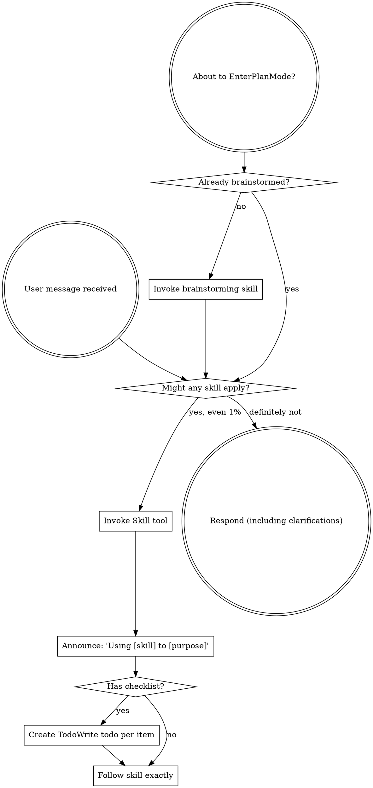

# Boundary Review — pair#136 (whole-issue close)

| field | value |
|-------|-------|
| issue | 136 — Codex menu selection should accept Return |
| repo | pair |
| issue file | workshop/issues/000136-codex-menu-selection-should-accept-return.md |
| boundary | whole-issue close |
| milestone | — |
| window | f56342e502948f7d037865f99623952c7b3a8c48..HEAD |
| command | sdlc close --issue 136 |
| reviewer | codex |
| timestamp | 2026-08-16T21:07:06-07:00 |
| verdict | SHIP |

## Review

Reading additional input from stdin...
OpenAI Codex v0.147.0
--------
workdir: /Users/xianxu/workspace/pair
model: gpt-5.5
provider: openai
approval: never
sandbox: workspace-write [workdir, /tmp, $TMPDIR, /tmp] (network access enabled)
reasoning effort: medium
reasoning summaries: none
session id: 01a00de5-d8a3-78c3-89e7-057f394b9de2
--------
user
# Code review — the one SDLC boundary review

You are conducting a fresh-context code review at a development boundary —
whole-issue close — in the **pair** repository.

- repository: pair   (root: /Users/xianxu/workspace/pair)
- issue:      pair#136   (file: workshop/issues/000136-codex-menu-selection-should-accept-return.md)
- window:     Base: f56342e502948f7d037865f99623952c7b3a8c48   Head: HEAD

Review the **pair** repo and its tracker — the ariadne base-layer repo itself (changes here propagate to dependent repos). Do not assume any
other repository or apply another repo's conventions.

You have no prior session context — that is the anti-collusion property. Verify
behavior against the issue's documented Spec/Plan and the code itself; do NOT
take the implementor's word in commit messages or docs at face value. Tools are
read-only: report findings precisely; the main agent (which has session context)
applies the fixes, commits, and re-runs.

Read the diff against the issue's Spec + Plan, then work the checklist below.
Categorize every finding by severity — not everything is Critical; a nitpick
marked Critical is noise.

  Critical (must fix before crossing the boundary)
    - correctness bugs; crashes / panics on unexpected input
    - behavior drift from stated contracts (for ports of existing code where
      byte-faithfulness was promised, diff against the source)
    - silent error swallowing where the source raised
  Important (fix before the boundary if cheap)
    - API design of newly-introduced internal packages (downstream work will
      consume them; is the surface stable?)
    - missing test coverage that would catch the kind of bug shipped
    - inconsistent error handling across the diff
  Minor (note for future)
    - style nits, naming, comment density; performance only if hot-path

## Review checklist

Code quality
  - Clean separation of concerns; edge cases handled (empty / nil / unexpected).
  - Proper error handling — no silent swallowing where the source raised.
  - No duplicated logic / copy-paste that should be a shared helper.

Testing
  - Tests pin real logic, not mocks reasserting the implementation.
  - The kind of bug this diff could ship is covered.
  - PURE entities tested without IO; INTEGRATION via injected fakes (see below).

Requirements traceability
  - Every Plan checklist item this boundary claims is actually delivered.
  - Implementation matches the Spec; no undeclared scope creep.
  - Breaking changes documented.

Production readiness
  - Migration / backward-compatibility considered where state or formats change.
  - Docs / atlas updated for new surface (see the Docs update gate).

## Plan-gate carry-forward (ariadne#187)

Read `workshop/plans/<issue-stem>-plan-gate.md` if it exists — the durable ledger of the
pre-implementation plan gate. It holds the findings that gate raised but deliberately did
NOT block on: Minor findings, and blocking ones demoted once the round cap was reached.
They were deferred to THIS boundary by design — that deferral is only safe because you
pick them up.

For each finding still listed under `## Open findings`, confirm the code either addresses
it or that it no longer applies. A still-valid deferred finding is a finding here, at its
original severity.

## Core concepts cross-check (if the plan has a Core concepts table)

The plan should list entities in a greppable table — name, kind
(PURE/INTEGRATION), file location, status (new/modified/deleted). For each row:
  - Verify the entity exists at the stated path (grep the diff or filesystem).
  - PURE: tests run without IO (no exec, net, mutable fs). If tests need mocks
    to run, it isn't really PURE — flag Critical and recommend promoting it to
    INTEGRATION.
  - INTEGRATION: injected into pure callers, not invoked directly from business
    logic.
  - "modified" / "deleted": the diff shows the expected change/removal at the
    stated location.
Any contradiction between table and code = Critical finding, plus a plan-revision
recommendation (a "## Revisions" entry so the plan stops claiming what the code
doesn't deliver).

## Docs update gate (atlas + README, per AGENTS.md §8)

The boundary should update user-facing docs for any new surface introduced:

  - **atlas/** — new architectural surface, flow, or terminology. Scan the diff
    for new entity types, subcommands, conventions, file-tree locations. Any
    present without corresponding atlas/ changes in the same range = Important
    finding ("atlas update appears missing for <surface>").
  - **README.md** — new user-facing surface a reader runs or types: subcommands,
    flags, keybindings, config keys, install/usage steps. If the diff adds or
    changes such surface and README.md is not updated in the same range =
    Important finding ("README update appears missing for <surface>"). This is the
    class of gap that used to surface only at the merge-time `specs` judge (#142);
    catch it here, at the earliest gate, before the close verdict is recorded.

## Architecture (the at-review backstop — these matter most long-term)

Work through each of ARCH-DRY, ARCH-PURE, ARCH-PURPOSE, ARCH-MOCK explicitly, applying its at-review lens. The
full principle definitions are delivered in the ARCHITECTURE PRINCIPLES block
right after this prompt — for EACH marker, state pass or flag, and cite the
marker (e.g. ARCH-DRY) in any finding. Architecture is where review has the
least training signal and the longest-delayed payoff, so be deliberate here, not
holistic.

## Verdict + output

Begin your response with this fenced verdict block — the machine-read handoff:

```verdict
verdict: <SHIP | FIX-THEN-SHIP | REWORK>
confidence: <high | medium | low>
```

  SHIP           ready; ship it
  FIX-THEN-SHIP  ship after addressing the findings (non-blocking at the gate)
  REWORK         blocking; needs rework before shipping — fix + re-run

The fenced ```` ```verdict ```` block above is the **authoritative machine-read
handoff** — emit it as the first thing in your response. (A prose
`VERDICT: <TOKEN>` first line still satisfies the legacy contract as a fallback,
but the block is what the binary trusts.)

After the verdict block: a 1-paragraph summary — what worked, what blocks SHIP if
it isn't — followed by:
  1. Strengths: 2-5 specific things done well (file:line where useful). Affirm
     validated approaches so the operator knows what's confirmed-good ground.
     Empty acceptable for trivial boundaries.
  2. Critical findings (file:line + fix sketch); empty if none.
  3. Important findings (same format).
  4. Minor findings (terse one-liners).
  5. Test coverage notes.
  6. Architectural notes for upcoming work.
  7. Plan revision recommendations: specific "## Revisions" entries the plan
     needs (empty if the plan still matches the code).


ARCHITECTURE PRINCIPLES — work through each of the 4 entries below explicitly, applying its `at-review` lens; cite the marker (e.g. ARCH-DRY) in any finding.

# Architecture principles (ARCH-*)

Injected architectural taste — the structural decisions whose payoff (or cost)
shows up many turns, often months, down the road. Agents are strong at local
tactics and weak here, so these are checked **at-plan** (when the design is being
made — highest leverage) and **at-review** (backstop, on the diff). Cite the
marker (e.g. `ARCH-DRY`) in plans, `## Log` entries, and review findings.

This file is the single source; it is embedded into the planning, plan-quality,
and code-review prompts. The human narrative lives in AGENTS.md "Core Design
Principles"; this is its machine-delivered companion.

## ARCH-DRY — Don't Repeat Yourself

- **principle:** Reuse before adding. One source of truth per fact/behavior; no
  duplicated logic, copy-pasted blocks, or parallel functions that should be one
  shared helper.
- **at-plan:** Flag a plan that re-implements something the codebase already has,
  or that will obviously duplicate logic across the new files instead of
  extracting a shared helper. Name the existing thing it should reuse.
- **at-review:** Flag duplicated logic / copy-pasted blocks / near-identical
  functions in the diff; point at the consolidation (file:line + the shared
  helper they should become).

## ARCH-PURE — Pure core, thin IO shell

- **principle:** The majority of code is pure functions (deterministic, no side
  effects); a thin "glue" layer at the boundary touches IO/UI/network/clock. Pure
  functions are unit-tested directly; the glue is kept small and injected.
- **at-plan:** Flag a design that buries business logic inside IO/handlers, or
  that will only be testable with heavy mocks (a sign logic isn't separated from
  IO). The plan should name what's pure vs the thin IO seam.
- **at-review:** Flag business logic mixed with IO in the diff; logic that should
  be a pure function injected into a thin caller. If a test needs mocks to run a
  "pure" entity, it isn't pure — recommend extracting the IO to the boundary.

## ARCH-PURPOSE — Serve the issue's actual purpose

- **principle:** Deliver the issue's stated purpose, not the easy subset of it. A
  single-source / "compiled to consumers" change is not done until **every
  consumer derives** from the source — the source is *enforced*, not just
  documentation a surface happens to restate; a hand-maintained restatement of the
  model is a deferred consumer, not a finished one. "Follow-up" is for separable
  extensions, never for the thing that is the point. This is the *opposite axis*
  from Simplicity-First/YAGNI: not "build for an imagined future," but "don't
  **under**-deliver the purpose you already committed to."
- **at-plan:** Flag a plan whose scope is a strict subset of the issue's stated
  goal / Done-when where the part deferred as "follow-up" *is* the purpose (e.g.
  wires one consumer + enforcement but leaves the consumers that motivated the
  issue as documentation that doesn't derive). Ask: does the plan fulfill the
  purpose, or just the cheap win? Name the deferred purpose.
- **at-review:** Does the diff *fulfill* the purpose or settle for the easy win?
  For a single-source change, run the **shadow-sweep** — enumerate the consumers,
  confirm each derives from the source, flag any remaining hand-maintained
  restatement of the model. A "follow-up" that is actually the deferred point of
  the issue is a finding, not a deferral.

## ARCH-MOCK — Stateful external doubles

- **principle:** Every external binary or service dependency the system relies on
  has a stateful fake behind the same seam, modeling our current understanding of
  the dependency's behavior across calls. For libraries, services, and binaries we
  own, the storage/backend layer is backed by a portable folder of files and/or
  database configuration, so the component can be spun up without depending on
  production configuration or production databases. Integration and end-to-end
  tests run against the fake; scheduled/live conformance checks compare the
  fake's modeled behavior with the real binary or service so drift is detected
  and corrected.
- **at-plan:** Flag a design that shells out to, or calls, an external binary or
  service without naming the seam and stateful fake. For owned libraries, services,
  and binaries, also flag any design whose storage/backend depends on production
  configuration or databases instead of a portable file folder and/or database
  configuration. The plan should identify the dependency surface consumed, the
  fake's persisted state model, the owned component's portable backend shape,
  the integration or end-to-end tests that run against it, and the live
  conformance check cadence.
  Examples include `git`, GitHub/`gh`, and Google OAuth.
- **at-review:** Flag direct external calls outside the seam, stateless mocks for
  stateful interactions, tests that cannot run the stack against the fake, owned
  components that cannot boot from portable non-production storage/backend
  configuration, or a missing live conformance check for behavior we depend on. A
  fake satisfies this only when production flow and test flow share the same
  boundary.


OUTPUT CONTRACT (machine-read — do not deviate). LEAD your response with the
fenced ```verdict block shown above — that is the authoritative handoff the binary
reads (its `verdict:` value is one of the listed tokens). Everything after the block
is advisory: a non-blocking verdict WITH findings still PASSES the gate. A bare
`VERDICT: <TOKEN>` line is accepted only as a FALLBACK when the block is absent.

Diff:
diff --git a/atlas/how-to-bring-up-a-new-harness-cli.md b/atlas/how-to-bring-up-a-new-harness-cli.md
index f777c56..2dde965 100644
--- a/atlas/how-to-bring-up-a-new-harness-cli.md
+++ b/atlas/how-to-bring-up-a-new-harness-cli.md
@@ -46,6 +46,7 @@ If the agent presents blocking overlays, pickers (like file autocompletes), yes/
   }
   ```
 - Implement the detector. Detectors can scan the rolling output stream for custom OSC escape sequences (e.g. Claude's permission OSC `OSC 777;notify;...`, or Codex's `OSC 9;Plan mode prompt:...`) or fallback to visible text substring matches (e.g., watching for `"Press enter to confirm"`).
+- **For `codex`:** Codex uses both OSC 9 plan/question bodies and visible-text picker footers. Keep `codexPickerMarkers` current for every visible confirmation footer observed in Pair's adapt log, including variants like `"Press enter to confirm or esc to go back"` and `"Press enter to confirm or esc to cancel"`; otherwise plain Enter inserts a textarea newline and Alt+Enter becomes required to select.
 - **For `agy`:** Antigravity *does* render its permission picker in the PTY ("Do you want to proceed?", "Yes, and always allow", …), so `detectAgyOverlayOpen` matches those visible-text markers (no OSC) to arm `pickerActive` — without it, the remapped Enter can't confirm the picker and a stray newline leaks into the prompt (#000042).
 - **For `muse`:** Muse renders both tool-permission pickers ("Permissions required", "Allow execution", …) **and** user selection menus (AskUserQuestion via `request_user_input` — "Select an option", "Use arrow keys", "Press Enter to select", …). Both families must be in `musePickerMarkers`; a missing selection marker reproduces as "Enter inserts newline, Alt+Enter required to select".

diff --git a/cmd/internal/wrapcmd/overlay_test.go b/cmd/internal/wrapcmd/overlay_test.go
index 4016e32..c752100 100644
--- a/cmd/internal/wrapcmd/overlay_test.go
+++ b/cmd/internal/wrapcmd/overlay_test.go
@@ -47,6 +47,13 @@ func TestOverlayDetectorByAgent(t *testing.T) {
			wantOpen:  true,
			wantMatch: "Press enter to confirm or esc to go back",
		},
+		{
+			name:      "codex permission picker cancel footer opens overlay",
+			agent:     "codex",
+			raw:       []byte("\x1b[38;2;137;180;250m1. Yes, proceed (y)  2. No, and tell Codex what to do differently (esc)\r\n\x1b[2mPress enter to confirm or esc to cancel\x1b[0m"),
+			wantOpen:  true,
+			wantMatch: "Press enter to confirm or esc to cancel",
+		},
		{
			name:      "codex request user input OSC opens overlay",
			agent:     "codex",
diff --git a/cmd/internal/wrapcmd/wrap.go b/cmd/internal/wrapcmd/wrap.go
index 5c3d6af..691d1fa 100644
--- a/cmd/internal/wrapcmd/wrap.go
+++ b/cmd/internal/wrapcmd/wrap.go
@@ -692,6 +692,11 @@ var codexPickerMarkers = []string{
	// Quota/model-fallback picker footer observed when Codex suggests
	// switching to a smaller model near rate limits.
	"Press enter to confirm or esc to go back",
+
+	// Permission picker footer observed in Codex 0.147.0. Without this
+	// exact marker, plain Enter leaks as a textarea newline and Alt+Enter
+	// is required to confirm the highlighted choice.
+	"Press enter to confirm or esc to cancel",
 }

 func detectClaudeOverlayOpen(_ *proxy, _ []byte, rolling []byte) (bool, string) {
diff --git a/workshop/plans/000136-codex-menu-selection-should-accept-return-plan-gate.md b/workshop/plans/000136-codex-menu-selection-should-accept-return-plan-gate.md
new file mode 100644
index 0000000..dfeab6d
--- /dev/null
+++ b/workshop/plans/000136-codex-menu-selection-should-accept-return-plan-gate.md
@@ -0,0 +1,60 @@
+---
+gate: plan-quality
+issue: 136
+id_prefix: PQ
+rounds:
+    - "n": 1
+      timestamp: "2026-08-16T21:02:26-07:00"
+      agent: codex
+      findings:
+        - id: PQ-1
+          severity: Important
+          title: Test plan does not name the unit-tested function or risky-input strategy
+          detail: The plan says “Add a failing Codex overlay detector test” but this gate requires the functions that will be unit-tested by name plus one strategy line per risky function. Name `detectCodexOverlayOpen` or `detectCodexOverlayText` and the strategy, e.g. stripped/ANSI-wrapped visible Codex footer text must match the exact marker while preserving the existing one-shot `emitPlainCR` behavior.
+          round: 1
+        - id: PQ-2
+          severity: Important
+          title: Plan has no stated non-goals for the overlay detector change
+          detail: The issue is a narrow marker drift fix, but the plan never says what it is deliberately not changing. Add non-goals such as no generic `promptShape` broadening, no change to the `pickerActive` one-shot contract, and no new external/live harness dependency; that keeps ARCH-PURPOSE scoped to the current Codex footer rather than a broader overlay redesign.
+          round: 1
+      blocked: true
+    - "n": 2
+      timestamp: "2026-08-16T21:03:33-07:00"
+      agent: codex
+      dispose:
+        - id: PQ-1
+          disposition: addressed
+          note: The plan names `detectCodexOverlayOpen` and gives the ANSI/stripped visible-footer strategy while preserving existing `emitPlainCR` one-shot coverage.
+          round: 2
+        - id: PQ-2
+          disposition: addressed
+          note: The Spec now states non-goals for no promptShape broadening, no pickerActive lifecycle change, and no live Codex dependency.
+          round: 2
+      blocked: false
+content_hash: a8bf7f16ef942ab68a91bad25b36f07ff9ad21f1918243d5617c1ca448976fd4
+---
+
+# Gate ledger — pair#136 (plan-quality)
+
+Findings this gate raised, the stable ids the binary assigned them, and how
+later rounds disposed of them. Generated — edit the gate, not this file.
+
+## Round 1 — 2026-08-16T21:02:26-07:00 (codex) — BLOCKED
+
+### Raised
+
+- **PQ-1** [Important] Test plan does not name the unit-tested function or risky-input strategy
+  The plan says “Add a failing Codex overlay detector test” but this gate requires the functions that will be unit-tested by name plus one strategy line per risky function. Name `detectCodexOverlayOpen` or `detectCodexOverlayText` and the strategy, e.g. stripped/ANSI-wrapped visible Codex footer text must match the exact marker while preserving the existing one-shot `emitPlainCR` behavior.
+- **PQ-2** [Important] Plan has no stated non-goals for the overlay detector change
+  The issue is a narrow marker drift fix, but the plan never says what it is deliberately not changing. Add non-goals such as no generic `promptShape` broadening, no change to the `pickerActive` one-shot contract, and no new external/live harness dependency; that keeps ARCH-PURPOSE scoped to the current Codex footer rather than a broader overlay redesign.
+
+## Round 2 — 2026-08-16T21:03:33-07:00 (codex) — passed
+
+### Disposed
+
+- PQ-1 — addressed — The plan names `detectCodexOverlayOpen` and gives the ANSI/stripped visible-footer strategy while preserving existing `emitPlainCR` one-shot coverage.
+- PQ-2 — addressed — The Spec now states non-goals for no promptShape broadening, no pickerActive lifecycle change, and no live Codex dependency.
+
+## Open findings
+
+(none — every finding has been disposed)


exec
/bin/zsh -lc "sed -n '1,240p' /Users/xianxu/workspace/pair/.agents/skills/superpowers-using-superpowers/SKILL.md" in /Users/xianxu/workspace/pair
 succeeded in 0ms:
---
name: superpowers-using-superpowers
description: Use when starting any conversation - establishes how to find and use skills, requiring Skill tool invocation before ANY response including clarifying questions
---

<SUBAGENT-STOP>
If you were dispatched as a subagent to execute a specific task, skip this skill.
</SUBAGENT-STOP>

<EXTREMELY-IMPORTANT>
If you think there is even a 1% chance a skill might apply to what you are doing, you ABSOLUTELY MUST invoke the skill.

IF A SKILL APPLIES TO YOUR TASK, YOU DO NOT HAVE A CHOICE. YOU MUST USE IT.

This is not negotiable. This is not optional. You cannot rationalize your way out of this.
</EXTREMELY-IMPORTANT>

## Instruction Priority

> **Ariadne note:** AGENTS.md Section 3 governs subagent strategy and overrides skills that mandate subagent-driven-development as the default execution path.

Superpowers skills override default system prompt behavior, but **user instructions always take precedence**:

1. **User's explicit instructions** (CLAUDE.md, GEMINI.md, AGENTS.md, direct requests) — highest priority
2. **Superpowers skills** — override default system behavior where they conflict
3. **Default system prompt** — lowest priority

If CLAUDE.md, GEMINI.md, or AGENTS.md says "don't use TDD" and a skill says "always use TDD," follow the user's instructions. The user is in control.

## How to Access Skills

**In Claude Code:** Use the `Skill` tool. When you invoke a skill, its content is loaded and presented to you—follow it directly. Never use the Read tool on skill files.

**In Gemini CLI:** Skills activate via the `activate_skill` tool. Gemini loads skill metadata at session start and activates the full content on demand.

**In other environments:** Check your platform's documentation for how skills are loaded.

## Platform Adaptation

Skills use Claude Code tool names. Non-CC platforms: see `references/codex-tools.md` (Codex) for tool equivalents. Gemini CLI users get the tool mapping loaded automatically via GEMINI.md.

# Using Skills

## The Rule

**Invoke relevant or requested skills BEFORE any response or action.** Even a 1% chance a skill might apply means that you should invoke the skill to check. If an invoked skill turns out to be wrong for the situation, you don't need to use it.



## Red Flags

These thoughts mean STOP—you're rationalizing:

| Thought | Reality |
|---------|---------|
| "This is just a simple question" | Questions are tasks. Check for skills. |
| "I need more context first" | Skill check comes BEFORE clarifying questions. |
| "Let me explore the codebase first" | Skills tell you HOW to explore. Check first. |
| "I can check git/files quickly" | Files lack conversation context. Check for skills. |
| "Let me gather information first" | Skills tell you HOW to gather information. |
| "This doesn't need a formal skill" | If a skill exists, use it. |
| "I remember this skill" | Skills evolve. Read current version. |
| "This doesn't count as a task" | Action = task. Check for skills. |
| "The skill is overkill" | Simple things become complex. Use it. |
| "I'll just do this one thing first" | Check BEFORE doing anything. |
| "This feels productive" | Undisciplined action wastes time. Skills prevent this. |
| "I know what that means" | Knowing the concept ≠ using the skill. Invoke it. |

## Skill Priority

When multiple skills could apply, use this order:

1. **Process skills first** (brainstorming, debugging) - these determine HOW to approach the task
2. **Implementation skills second** (frontend-design, mcp-builder) - these guide execution

"Let's build X" → brainstorming first, then implementation skills.
"Fix this bug" → debugging first, then domain-specific skills.

## Skill Types

**Rigid** (TDD, debugging): Follow exactly. Don't adapt away discipline.

**Flexible** (patterns): Adapt principles to context.

The skill itself tells you which.

## User Instructions

Instructions say WHAT, not HOW. "Add X" or "Fix Y" doesn't mean skip workflows.

exec
/bin/zsh -lc "sed -n '1,240p' /Users/xianxu/workspace/pair/.agents/skills/xx-sdlc/SKILL.md" in /Users/xianxu/workspace/pair
 succeeded in 0ms:
---
name: sdlc
description: Use when at an SDLC checkpoint — starting work, closing an issue or milestone, opening/merging a PR, or recovering workflow state after compaction. The `sdlc` binary owns the gates between workflow stages and refuses transitions that lack required evidence.
---

# sdlc — SDLC checkpoint binary

`sdlc` owns the gates between SDLC workflow stages (claim → change-code → pr →
merge, plus close, milestone-close, judge). It requires evidence at each gate,
mutates state, logs the transition, and refuses transitions that lack the
evidence — that is the shape of a "checkpoint guard."

The binary is the single source of truth. This skill is a static pointer and
intentionally carries no copy of the contract, so it can never drift:

- **`sdlc --help`** — the workflow contract: the start-of-work runbook,
  conventions, and the verb list.
- **`sdlc <verb> --help`** — one checkpoint's full contract, flags, and examples.

Read those instead of relying on memory; the binary's help is always current.

codex
Using `superpowers-using-superpowers` and `sdlc` because this is an SDLC boundary review. I’m going to read the workflow contract, the issue/plan, and the actual diff before giving the machine-readable verdict.
exec
/bin/zsh -lc 'sdlc --help' in /Users/xianxu/workspace/pair
exec
/bin/zsh -lc "sed -n '1,260p' workshop/issues/000136-codex-menu-selection-should-accept-return.md" in /Users/xianxu/workspace/pair
 succeeded in 0ms:
sdlc collects ariadne's SDLC checkpoint guards into one binary. Each subcommand
owns one checkpoint: it requires evidence at the gate, mutates state, logs the
transition, and refuses transitions that lack it. We don't model the SDLC as a
state machine — stages stay prose; we codify the gates between them where drift
recurs. `sdlc` manages the development life cycle; prefer it over `git`/`gh`.

BEFORE WORK
  - `sdlc claim --issue N` — the single start-of-work gesture, a CHEAP LOCK.
    Flips an *open* issue to `working` and publishes the claim to origin/main so
    peer agents see it. No estimate demanded (#113) — claim early, the moment an
    idea crystallizes. `--no-start` suppresses the flip.
  - Do NOT hand-edit an issue's `status:` — let `sdlc claim` or `sdlc issue
    set-status` own that transition (it carries the reopen/`→ done` guards).

ENTER IMPLEMENTATION
  - After plan approval, before editing code, run `sdlc change-code`. It owns the
    branching decision (in-place branch by default; `--worktree=yes` for an
    isolated worktree), the plan-quality check, and the `estimate_hours` gate
    (relocated here from claim, #113). Don't start coding without it.

PUBLISH
  - Publishing goes through a PR: `sdlc pr` → `sdlc merge`. Direct `sdlc push`
    if working directly on main.
  - Publish ONCE at issue close, not per milestone — and do NOT reuse a branch
    name that already has a merged PR. `sdlc merge` refuses (#148) when a branch
    has commits not in main despite a merged PR (a reused name would otherwise
    silently strand the new commits); rename to a fresh branch, `sdlc pr`, retry.

RECOVER
  - After a compaction or session resume, run `sdlc state` to recover where you
    are instead of re-inferring from issue files.

LOCAL REPO TRANSACTION LOCK
  - Mutating verbs take an SDLC-owned repo transaction lock at
    `.git/sdlc.lock` before reading/writing issue state, committing, changing
    branches, or pushing. The lock is local to the Git common dir, so linked
    worktrees of the same repo serialize with each other.
  - Wait messages identify the holder pid and command when metadata is
    available. `close` and `milestone-close` release the lock while the external
    boundary-review subprocess runs, then reacquire before finalization; if HEAD
    or the issue/project file state they prepared changed meanwhile, they refuse
    to finalize and tell you to rerun. `change-code`, `merge`, and `push` can still hold the lock during
    long-running review/ship transactions; wait or retry rather than removing
    the lock while that process is alive.
  - A dead same-host holder is reclaimed automatically; initializing metadata
    is waited through. Other stale/timeout errors tell you how to inspect
    `.git/sdlc.lock`. Remote push/ref races are separate: the local lock
    serializes this checkout, not another machine or clone.

WHEN A VERB ERRORS
  Do NOT route around it with hand-rolled `git`/`gh`. Its errors are next-action
  specs. The fix is one of two things:
    (a) satisfy the precondition it names and re-run the same verb (e.g. `sdlc
        merge` saying "no upstream" → run `sdlc pr` first, then `sdlc merge`); or
    (b) if the error is a genuine gap in `sdlc` itself, fix that edge case in the
        source and re-run. We're still ironing out edge cases.
  Only drop to manual when a verb genuinely cannot express the need — say so.

These gates sit inside a wider prose arc the binary does NOT own: ideation
(parley/pensive) → brainstorm → plan → build → milestone review (`sdlc judge`,
auto-dispatched) → close/ship → postmortem.

CONVENTIONS

  --issue vs --github-issue — `--issue N` always means workshop/issues
  (6-digit ID). `--github-issue N` means a GitHub issue number. Bare `--issue`
  never means a GitHub issue.

  Form vs essence — checkpoint guards (close, milestone-close, push, merge)
  defend against *omission* via required-evidence flags; `sdlc judge` defends
  against *theater* via fresh-context review. Form runs first; judge second.

The verb list + per-verb help (`sdlc <verb> --help`) follow below.

Usage:
  sdlc [flags]
  sdlc [command]

Available Commands:
  claim           Start work: flip an open issue to working + broadcast the claim
  start-plan      Enter planning: deliver the architecture principles to design against (#75)
  change-code     Enter implementation after the structural + plan-quality gates
  issue           Create + manage issues (new / set-status / list / show)
  project         Create + manage projects (new / list / show / set-status / validate)
  actual          Compute an issue's focused dev-hours via active-time-v3 (#68)
  active-time     Per-issue active-time attribution table (the v3 engine, standalone)
  close           Close an issue or milestone (ACTUAL + VERIFIED + atlas/project sweep)
  milestone-close Close one milestone + auto-dispatch its review
  pr              Open a pull request from a feature branch
  merge           Merge the PR, archive done issues, clean up
  push            Ship from main (clean tree + pre-merge judges + archive)
  state           Inspect workflow state (branch, working issues, drift)
  resolve         Resolve a symbolic artifact ref (ariadne#11, #15 M4) to its current path(s) — read-only
  open            Resolve a ref and open the primary artifact in $EDITOR
  migrate         Move a markdown artifact to a peer repo, rewriting refs (#179)
  judge           Run an LLM-judge check against the diff (fresh-context)
  arch-principles Print the ARCH-* architecture principles (single source; pull for non-gate work)
  estimate-source Name the shared estimate method + the repo-local calibration source (pull)
  process-manual  Unroll every injection source into a linked process manual (#153)
  propagate-base  Re-weave every recursive dependent of this repo (foundation-first)
  help            Help about any command

Flags:
  -h, --help   help for sdlc

Use "sdlc [command] --help" for more information about a command.

 succeeded in 0ms:
---
id: 000136
status: working
deps: []
github_issue:
created: 2026-08-16
updated: 2026-08-16
estimate_hours: 0.4
started: 2026-08-16T21:01:01-07:00
---

# Codex menu selection should accept Return

## Problem

Codex selection/permission menus can require Alt+Return to confirm because Pair
does not recognize the current menu footer as a blocking overlay. When
`pickerActive` is not armed, plain Return follows the Codex textarea remap and
sends LF instead of the bare CR Codex expects for menu confirmation.

## Spec

- Detect the current Codex footer string observed in Pair's adapt log:
  `Press enter to confirm or esc to cancel`.
- Preserve the existing overlay bypass behavior: while a picker is active, one
  plain Return sends bare CR, then normal textarea remapping resumes.
- Keep the harness bring-up guide aligned with the regression so future harness
  integrations include visible selection-menu footer strings.
- Non-goals: do not broaden `promptShape` into a generic arming heuristic, do
  not change the one-shot `pickerActive` lifecycle, and do not add a live Codex
  dependency for this marker-drift fix.

## Done when

- Plain Return confirms Codex menus with the current footer; Alt+Return is not
  required.
- A regression test covers the current Codex footer string from the adapt log.
- The harness bring-up guide explicitly covers Codex visible selection-menu
  markers.

## Estimate

```estimate
model: estimate-logic-v3.1
familiarity: 1.0
item: smaller-go-module design=0.05 impl=0.15
item: atlas-docs design=0.03 impl=0.05
item: milestone-review design=0.02 impl=0.10
total: 0.40
```

## Plan

- [x] Add a failing Codex overlay detector test for `Press enter to confirm or esc to cancel`.
  Unit-test `detectCodexOverlayOpen`: ANSI-wrapped visible Codex footer text
  must match the exact registered marker after terminal controls are stripped.
  Keep the existing `emitPlainCR` one-shot bypass coverage as the guard for
  Return behavior.
- [x] Add the marker to the existing Codex picker detector (ARCH-DRY, ARCH-PURE).
- [x] Update `atlas/how-to-bring-up-a-new-harness-cli.md` with the Codex selection-menu drift note.
- [x] Verify the wrapcmd tests and whitespace.

## Log

### 2026-08-16

- Adapt evidence: `adapt-pair.jsonl` recorded Codex near-misses with
  `Press enter to confirm or esc to cancel`, confirming the detector drifted
  while the telemetry path worked as intended.
- Plan-quality round 1 blocked on explicit test-surface and non-goal wording;
  updated the plan to name `detectCodexOverlayOpen` and rule out broader overlay
  lifecycle or heuristic changes.
- TDD red: `go test ./cmd/internal/wrapcmd -run TestOverlayDetectorByAgent/codex_permission_picker_cancel_footer_opens_overlay -count=1`
  failed with `open = false`.
- Green verification: focused overlay/Return tests and the full `wrapcmd`
  package pass after adding the current Codex footer marker.

exec
/bin/zsh -lc "sed -n '1,220p' workshop/lessons.md" in /Users/xianxu/workspace/pair
 succeeded in 0ms:
# Lessons

## Release smokes must use clean archive inputs

The Homebrew v1.24/v1.25 publish path first looked fine from the working tree:
ignored generated runtime-bundle assets were present locally, and formula syntax
and style passed. The real Homebrew source build failed only when it built from
GitHub's clean tarball, where ignored assets were absent and the generator's
import cycle/order assumptions became visible.

**Rule.** For release/package work, run the same clean source path the package
manager uses before treating the release as published: generated ignored assets
must be regenerated from tracked inputs, and install recipes must run generators
before moving source trees into their install location. Add a clean-source
regression for any generator that package builds depend on. Caught in #000131
Homebrew publish.

## Sidecar filenames do not validate sidecar identity

`config-<tag>-<agent>.json` names the intended lookup axis, but the JSON still
has its own `agent` field. Treating the filename as sufficient let a mismatched
config reach the tag-restart picker, and stale saved session IDs were silently
downgraded to fresh sessions despite the spec requiring a warning.

**Rule.** When consuming persisted sidecars that duplicate identity in their
filename and body, validate the body identity before offering UI/actions. On
malformed or mismatched persisted state, warn and fall through to the next
source of truth; on stale resumable IDs, warn before using saved args for a fresh
launch. Add integration-level regressions at the consuming flow, not only pure
policy tests. Caught in #000115 close review.

## Zellij's pane report cannot identify action-created panes

The tiled split (`action new-pane --direction down`) creates panes for which
zellij 0.44.3 reports `terminal_command: null`, and pane titles are pair-owned
mutable UI (#118 tab strips, user-renamable). Classifying workbench panes from
the zellij report alone therefore silently fails for exactly the panes pair
creates at runtime — live smoke showed split halves invisible to chord routing
and to the focus picker.

**Rule.** Pair-owned pane identity comes from self-registration (the process
writes its own `$ZELLIJ_PANE_ID` + pid to a sidecar; readers filter by pid
liveness), never from report heuristics. When adding a new pair-owned pane
kind, register it and overlay the registry onto `RoleForPane`
(`RoleForPaneWith`). Zellij `is_focused` is per-client and stale for
unfocused-side panes — a pair-authored record outranks it. Caught in #123
tiled-pivot smoke.

## Drive zellij live smokes through a real attached client

CLI actions (`zellij --session X action write|focus-pane-id|new-pane`) run as
ephemeral clients: their focus state diverges from the attached client, writes
land on stale focus, splits target the wrong pane, and `--near-current-pane`
creates invisible orphan panes. Results look like product bugs but are harness
artifacts.

**Rule.** Smoke zellij interactively via a PTY-attached client (expect spawn +
fifo-fed keystrokes) sending the real byte encodings (`\x1bk`, `\x1bD`, SGR
mouse). Use CLI `list-panes` only for observation. Restart the session after
every rebuild — resident pair processes do not pick up new binaries. Caught in
#123 tiled-pivot smoke.

## Zellij forwarded bytes must preserve every focused surface using the chord

`Alt+Shift+d` was added as a right-terminal split shortcut by rebinding Zellij
to forward the KKP sequence `ESC[68;4u`. The terminal wrapper understood that
sequence, but the review pane already used the same physical chord as `<M-D>` for
visual definitions, and Neovim did not treat the forwarded KKP bytes as `<M-D>`.

**Rule.** When changing a Zellij binding for a physical chord, inventory every
focused surface that already uses that chord and test the exact forwarded bytes
against each consumer. For Neovim surfaces, add a map for the raw forwarded byte
sequence when KKP does not resolve to the existing `<M-...>` mapping. Caught in
#000123 close review.

## Activating an empty terminal tab must still redraw

`Alt+t` created a new terminal tab and made it active, but `newTab` only updated
the pane title and waited for async child PTY output. The old tab's viewport
stayed visible until the new shell wrote over part of it, leaving confusing
residue in the newly selected tab.

**Rule.** Any terminal-tab activation path must redraw the selected tab
immediately, even when its buffer is empty. The clear-screen prefix is the
observable behavior; child output arriving later is not a substitute for the
activation redraw. Add a regression that creates a fresh tab and asserts stdout
starts with the redraw clear sequence. Caught after #000118 close.

## Async terminal modes must keep target identity

Terminal tab rename originally looked up `activeTabLocked()` again at commit
time. If the tab being renamed exited while rename mode was open, `removeTab`
could promote another tab to active and Enter would rename that replacement tab.

**Rule.** When an async mode starts against a terminal tab, capture the tab's
stable ID at mode entry and pass that ID through every refresh/finish path.
Never re-resolve by "current active" after an async boundary. Add a regression
where the target tab exits mid-mode and the replacement active tab keeps its
original name. Caught in #000118 re-close review.

## Zellij pane self-mutations must pass `--pane-id`

Terminal tab rename originally called `zellij action rename-pane <title>` from
inside `pair term`, relying on Zellij's focused pane. Live layout-3 smoke showed
the floating terminal and draft pane can both appear focused in `list-panes`, and
the implicit rename targeted the draft pane instead of the terminal pane.

**Rule.** Any process running inside a Zellij pane that mutates its own pane
state must pass `--pane-id "$ZELLIJ_PANE_ID"` when the action supports it
(`rename-pane`, geometry, close/focus variants, etc.). Add a fake-runtime test
asserting the exact `--pane-id` action shape, then run a live smoke for focus
ambiguity when floating panes are involved. Caught in #000118 close review.

## Unknown escape terminators are part of the escape sequence

Rename-mode input first treated some unknown CSI sequences as malformed prefixes
and preserved their final byte for reprocessing. `ESC[1;5D` then consumed the
escape prefix but inserted `D` into the tab name, violating the "unknown
controls are consumed" contract.

**Rule.** When consuming an unknown terminal control sequence, consume through
the protocol terminator (`A`-`Z`, `a`-`z`, `~`, etc.) and reprocess only bytes
after that terminator. Add regression cases with known-looking but unsupported
controls such as `ESC[1;5D`; recognized-control tests alone do not prove the
malformed/unknown path. Caught in #000118 close review.

## Global keymaps need post-setup buffer-local shadow tests

Pair installed shared workbench-global mappings before scrollback buffer setup,
but older buffer-local safety maps later replaced Alt+x and Alt+Up/Down. Pure
router tests and static “module loaded” checks stayed green while the live
buffer used the wrong callbacks.

**Rule.** For a global Neovim mapping consumed by specialized buffers, open a
real representative buffer after every setup autocmd and inspect `maparg(...,
false, true)`. Assert the resolved description/callback and that no unintended
buffer-local mapping shadows it. Static source greps do not prove effective
mapping precedence. Caught in #000117 close review.

## Plan entity tables must name implemented symbols

The #117 plan described conceptual entities (`DraftLuaTarget`,
`OverlayRoutePlan`, then `draftroute.Router`) that never existed as named code
symbols. The implementation was sound, but the boundary review repeatedly had
to reconcile the durable design record with the actual API.

**Rule.** Before a boundary review, mechanically walk every Core concepts table
row: `rg` the exact entity name at the declared path, and either point to the
real symbol or revise the row to the implemented function/type. Conceptual
groupings must be explicitly labeled as such, not formatted like nonexistent
APIs. Also search completed task prose and unchecked rows—the revisions section
does not cancel stale contradictory instructions elsewhere in the same plan.
Caught in #000117 close review.

## Cross-language cache tests must use the producer's exact JSON types

Draft Neovim wrote its PID with `vim.fn.getpid()`, producing a JSON number.
The Go cache reader modeled PID as a string, so decoding failed and quietly
re-enabled the slow fallback. Tests passed because they marshaled the Go
consumer struct—thereby generating the consumer’s preferred string shape,
not the producer’s real numeric shape.

**Rule.** For a cache or sidecar crossing language boundaries, keep at least
one consumer fixture as literal output in the producer’s exact schema,
including number-vs-string types. Producer-derived fixtures catch wire-format
drift; consumer-self-marshaled fixtures do not. Caught in #000117 close review.

## Async buffer requests need live anchors, not saved coordinates

Pair review definitions originally stored the selected line/column range while
the agent produced an answer. If the user inserted text before the selected term
before the result arrived, the response applied to stale coordinates and inserted
the footnote reference into the wrong text.

**Rule.** Any Neovim request that crosses an async boundary and later mutates the
same buffer must anchor the target with an extmark (or re-locate/validate the
target from content) before applying the result. Raw row/column pairs are only a
snapshot. Add an integration regression that mutates text before the target while
the request is pending, then verifies the result follows the target or aborts
cleanly. Caught in #000112 close review.

## Generated review sidecars must stay bounded

`sdlc close` writes a review sidecar, and that sidecar becomes part of later
diffs. If it stores the full raw prompt/transcript, it can bloat the reviewed
diff and carry whitespace-sensitive embedded patches.

**Rule.** Keep committed review sidecars to the durable facts: verdict, window,
findings, verification, and resolution. Avoid committing full prompt/diff
transcripts unless the generator normalizes them and they remain small enough
for future review prompts.

Caught while closing #000108.

## Path precedence contracts need explicit divergent-env tests

#90's embedded runtime implementation documented extraction under
`$PAIR_DATA_DIR/runtime/<digest>/pair-home`, but the first OS-backed
implementation only used the XDG/home resolver. The copied-binary smoke unset
`PAIR_DATA_DIR`, so the bug survived until boundary review tried
`PAIR_DATA_DIR` and `XDG_DATA_HOME` with different roots.

**Rule.** When a feature promises environment-variable precedence, add a test
where the higher-priority and fallback variables are both set to different
directories, then assert the selected path. Also include every Go source file
that can change build output in Make prerequisites; a generated or embedded
artifact path should have a dependency test or an explicit review checklist
entry. Caught in #000090 boundary review.

## Lua patterns: `\0` is empty-position match, not NUL byte

The unescape function in `nvim/scrollback.lua` first attempt used a
placeholder dance: `s:gsub('\\\\', '\0')` to swap `\\` for NUL,
then `gsub('\\(.)', '%1')` to strip remaining `\X`, then
`gsub('\0', '\\')` to restore the NUL → `\`. The result was
absurd: `unescape("plain")` returned `\p\l\a\i\n\` — the NUL pattern
matches between every byte (empty-position match), not the NUL byte
character. Each "match" inserted a `\` between every char.

**Rule.** When you need to match a literal NUL byte in a Lua pattern,

exec
/bin/zsh -lc "sed -n '1,220p' workshop/plans/000136-codex-menu-selection-should-accept-return-plan-gate.md" in /Users/xianxu/workspace/pair
 succeeded in 0ms:
---
gate: plan-quality
issue: 136
id_prefix: PQ
rounds:
    - "n": 1
      timestamp: "2026-08-16T21:02:26-07:00"
      agent: codex
      findings:
        - id: PQ-1
          severity: Important
          title: Test plan does not name the unit-tested function or risky-input strategy
          detail: The plan says “Add a failing Codex overlay detector test” but this gate requires the functions that will be unit-tested by name plus one strategy line per risky function. Name `detectCodexOverlayOpen` or `detectCodexOverlayText` and the strategy, e.g. stripped/ANSI-wrapped visible Codex footer text must match the exact marker while preserving the existing one-shot `emitPlainCR` behavior.
          round: 1
        - id: PQ-2
          severity: Important
          title: Plan has no stated non-goals for the overlay detector change
          detail: The issue is a narrow marker drift fix, but the plan never says what it is deliberately not changing. Add non-goals such as no generic `promptShape` broadening, no change to the `pickerActive` one-shot contract, and no new external/live harness dependency; that keeps ARCH-PURPOSE scoped to the current Codex footer rather than a broader overlay redesign.
          round: 1
      blocked: true
    - "n": 2
      timestamp: "2026-08-16T21:03:33-07:00"
      agent: codex
      dispose:
        - id: PQ-1
          disposition: addressed
          note: The plan names `detectCodexOverlayOpen` and gives the ANSI/stripped visible-footer strategy while preserving existing `emitPlainCR` one-shot coverage.
          round: 2
        - id: PQ-2
          disposition: addressed
          note: The Spec now states non-goals for no promptShape broadening, no pickerActive lifecycle change, and no live Codex dependency.
          round: 2
      blocked: false
content_hash: a8bf7f16ef942ab68a91bad25b36f07ff9ad21f1918243d5617c1ca448976fd4
---

# Gate ledger — pair#136 (plan-quality)

Findings this gate raised, the stable ids the binary assigned them, and how
later rounds disposed of them. Generated — edit the gate, not this file.

## Round 1 — 2026-08-16T21:02:26-07:00 (codex) — BLOCKED

### Raised

- **PQ-1** [Important] Test plan does not name the unit-tested function or risky-input strategy
  The plan says “Add a failing Codex overlay detector test” but this gate requires the functions that will be unit-tested by name plus one strategy line per risky function. Name `detectCodexOverlayOpen` or `detectCodexOverlayText` and the strategy, e.g. stripped/ANSI-wrapped visible Codex footer text must match the exact marker while preserving the existing one-shot `emitPlainCR` behavior.
- **PQ-2** [Important] Plan has no stated non-goals for the overlay detector change
  The issue is a narrow marker drift fix, but the plan never says what it is deliberately not changing. Add non-goals such as no generic `promptShape` broadening, no change to the `pickerActive` one-shot contract, and no new external/live harness dependency; that keeps ARCH-PURPOSE scoped to the current Codex footer rather than a broader overlay redesign.

## Round 2 — 2026-08-16T21:03:33-07:00 (codex) — passed

### Disposed

- PQ-1 — addressed — The plan names `detectCodexOverlayOpen` and gives the ANSI/stripped visible-footer strategy while preserving existing `emitPlainCR` one-shot coverage.
- PQ-2 — addressed — The Spec now states non-goals for no promptShape broadening, no pickerActive lifecycle change, and no live Codex dependency.

## Open findings

(none — every finding has been disposed)

codex
The issue and plan-gate ledger line up: both plan-gate findings are marked disposed, and there are no open carry-forward findings. I’m checking the implementation paths and running the focused tests now so the verdict is based on the tree, not just the supplied diff.
exec
/bin/zsh -lc "nl -ba cmd/internal/wrapcmd/overlay_test.go | sed -n '1,120p'" in /Users/xianxu/workspace/pair
 succeeded in 0ms:
     1	package wrapcmd
     2
     3	import (
     4		"bytes"
     5		"testing"
     6	)
     7
     8	func TestOverlayDetectorByAgent(t *testing.T) {
     9		cases := []struct {
    10			name      string
    11			agent     string
    12			raw       []byte
    13			wantOpen  bool
    14			wantMatch string
    15		}{
    16			{
    17				name:      "claude permission OSC opens overlay",
    18				agent:     "claude",
    19				raw:       []byte("\x1b]777;" + pickerOpenOSCBody + "\x07"),
    20				wantOpen:  true,
    21				wantMatch: pickerOpenOSCBody,
    22			},
    23			{
    24				name:     "claude waiting OSC is not overlay",
    25				agent:    "claude",
    26				raw:      []byte("\x1b]777;notify;Claude Code;Claude is waiting for your input\x07"),
    27				wantOpen: false,
    28			},
    29			{
    30				name:      "codex resume cwd picker opens overlay",
    31				agent:     "codex",
    32				raw:       []byte("\x1b[2m%Session = latest cwd\x1b[0m\r\n\x1b[7mUse session directory (/tmp/old)\x1b[0m"),
    33				wantOpen:  true,
    34				wantMatch: "Use session directory (",
    35			},
    36			{
    37				name:      "codex generic enter footer opens overlay",
    38				agent:     "codex",
    39				raw:       []byte("\x1b[?25lPress enter to continue\x1b[?25h"),
    40				wantOpen:  true,
    41				wantMatch: "Press enter to continue",
    42			},
    43			{
    44				name:      "codex quota model picker opens overlay",
    45				agent:     "codex",
    46				raw:       []byte("\x1b[2mPress enter to confirm or esc to go back\x1b[0m"),
    47				wantOpen:  true,
    48				wantMatch: "Press enter to confirm or esc to go back",
    49			},
    50			{
    51				name:      "codex permission picker cancel footer opens overlay",
    52				agent:     "codex",
    53				raw:       []byte("\x1b[38;2;137;180;250m1. Yes, proceed (y)  2. No, and tell Codex what to do differently (esc)\r\n\x1b[2mPress enter to confirm or esc to cancel\x1b[0m"),
    54				wantOpen:  true,
    55				wantMatch: "Press enter to confirm or esc to cancel",
    56			},
    57			{
    58				name:      "codex request user input OSC opens overlay",
    59				agent:     "codex",
    60				raw:       []byte("\x1b]9;Plan mode prompt: Probe\x07"),
    61				wantOpen:  true,
    62				wantMatch: "Plan mode prompt: Probe",
    63			},
    64			{
    65				name:     "codex normal textarea does not open overlay",
    66				agent:    "codex",
    67				raw:      []byte("+----------------------------------------+\r\n| > write a message                       |"),
    68				wantOpen: false,
    69			},
    70		}
    71		for _, c := range cases {
    72			t.Run(c.name, func(t *testing.T) {
    73				detect, ok := overlayDetectorByAgent[c.agent]
    74				if !ok {
    75					t.Fatalf("missing detector for %s", c.agent)
    76				}
    77				open, match := detect(&proxy{}, c.raw, c.raw)
    78				if open != c.wantOpen {
    79					t.Fatalf("open = %v, want %v (match %q)", open, c.wantOpen, match)
    80				}
    81				if c.wantMatch != "" && match != c.wantMatch {
    82					t.Fatalf("match = %q, want %q", match, c.wantMatch)
    83				}
    84			})
    85		}
    86	}
    87
    88	func TestTranslateChunk_CodexPickerPlainEnterSelectsOnce(t *testing.T) {
    89		p := &proxy{agentBasename: "codex", sendKM: sendKeymapByAgent["codex"]}
    90		p.pickerActive.Store(true)
    91
    92		got, leftover, inPaste := p.translateChunk([]byte("\r\r"), false)
    93		if len(leftover) != 0 {
    94			t.Fatalf("leftover = %q, want none", leftover)
    95		}
    96		if inPaste {
    97			t.Fatal("inPaste = true, want false")
    98		}
    99		if want := []byte("\r\n"); !bytes.Equal(got, want) {
   100			t.Fatalf("got %q, want %q", got, want)
   101		}
   102		if p.pickerActive.Load() {
   103			t.Fatal("pickerActive still set after first plain Enter")
   104		}
   105	}
   106
   107	func TestArmCapture_CodexArmsImagePickerEnter(t *testing.T) {
   108		p := &proxy{
   109			agentBasename:  "codex",
   110			sendKM:         sendKeymapByAgent["codex"],
   111			captureOutPath: "capture",
   112		}
   113
   114		p.armCapture()
   115		if !p.pickerActive.Load() {
   116			t.Fatal("pickerActive should be true after Codex image capture starts")
   117		}
   118		got := p.emitPlainCR(nil)
   119		if want := []byte{'\r'}; !bytes.Equal(got, want) {
   120			t.Fatalf("got %q, want bare CR for image picker confirm", got)

exec
/bin/zsh -lc "nl -ba cmd/internal/wrapcmd/wrap.go | sed -n '660,730p'" in /Users/xianxu/workspace/pair
 succeeded in 0ms:
   660			return
   661		}
   662		defer unix.Close(fd)
   663		osc := fmt.Sprintf("\x1b]9;%s\x07", msg)
   664		if _, err := unix.Write(fd, []byte(osc)); err != nil {
   665			p.debug("EMIT-fail", fmt.Sprintf("%s: %v", path, err))
   666			return
   667		}
   668		p.lastEmit = now
   669		p.debug("EMIT", "wrote OSC 9 to "+path)
   670	}
   671
   672	// pickerOpenOSCBody is the OSC 777 body claude emits when a blocking
   673	// overlay (AskUserQuestion picker or tool-permission prompt) opens.
   674	// Distinct from the end-of-turn body "Claude is waiting for your
   675	// input" — only this variant means "Enter routes to the overlay, not
   676	// the textarea." Used to suspend the textarea-aware Enter remap.
   677	const pickerOpenOSCBody = "notify;Claude Code;Claude needs your permission"
   678
   679	const codexQuestionOSC9Prefix = "Plan mode prompt:"
   680
   681	var codexPickerMarkers = []string{
   682		// Codex 0.134.0 resume-CWD picker. Both labels are visible in the
   683		// overlay; either is enough to know Enter should select, not insert
   684		// a textarea newline.
   685		"Use session directory (",
   686		"Use current directory (",
   687
   688		// Generic picker footer observed in Codex blocking prompts. Keep as
   689		// a fallback for picker variants that do not include cwd choices.
   690		"Press enter to continue",
   691
   692		// Quota/model-fallback picker footer observed when Codex suggests
   693		// switching to a smaller model near rate limits.
   694		"Press enter to confirm or esc to go back",
   695
   696		// Permission picker footer observed in Codex 0.147.0. Without this
   697		// exact marker, plain Enter leaks as a textarea newline and Alt+Enter
   698		// is required to confirm the highlighted choice.
   699		"Press enter to confirm or esc to cancel",
   700	}
   701
   702	func detectClaudeOverlayOpen(_ *proxy, _ []byte, rolling []byte) (bool, string) {
   703		matches := oscRe.FindAllSubmatch(rolling, -1)
   704		for _, m := range matches {
   705			if len(m) >= 3 && string(m[1]) == "777" && string(m[2]) == pickerOpenOSCBody {
   706				return true, string(m[2])
   707			}
   708		}
   709		return false, ""
   710	}
   711
   712	func detectCodexOverlayOpen(p *proxy, data, rolling []byte) (bool, string) {
   713		if open, reason := detectCodexQuestionOSC(rolling); open {
   714			return true, reason
   715		}
   716		visible := stripTerminalControls(data)
   717		if p != nil {
   718			p.overlayMu.Lock()
   719			defer p.overlayMu.Unlock()
   720			visible = p.overlayTextTail + visible
   721			p.overlayTextTail = textSuffix(visible, rollingTailLen)
   722		}
   723		return detectCodexOverlayText(visible)
   724	}
   725
   726	func detectCodexQuestionOSC(rolling []byte) (bool, string) {
   727		matches := oscRe.FindAllSubmatch(rolling, -1)
   728		for _, m := range matches {
   729			if len(m) >= 3 && string(m[1]) == "9" && strings.HasPrefix(string(m[2]), codexQuestionOSC9Prefix) {
   730				return true, string(m[2])

exec
/bin/zsh -lc 'git diff --stat f56342e502948f7d037865f99623952c7b3a8c48..HEAD' in /Users/xianxu/workspace/pair
 succeeded in 0ms:
 atlas/how-to-bring-up-a-new-harness-cli.md         |  1 +
 cmd/internal/wrapcmd/overlay_test.go               |  7 +++
 cmd/internal/wrapcmd/wrap.go                       |  5 ++
 ...36-codex-menu-selection-should-accept-return.md | 54 +++++++++++++++++--
 ...enu-selection-should-accept-return-plan-gate.md | 60 ++++++++++++++++++++++
 5 files changed, 124 insertions(+), 3 deletions(-)

exec
/bin/zsh -lc 'git diff --find-renames f56342e502948f7d037865f99623952c7b3a8c48..HEAD -- cmd/internal/wrapcmd/wrap.go cmd/internal/wrapcmd/overlay_test.go atlas/how-to-bring-up-a-new-harness-cli.md workshop/issues/000136-codex-menu-selection-should-accept-return.md workshop/plans/000136-codex-menu-selection-should-accept-return-plan-gate.md' in /Users/xianxu/workspace/pair
 succeeded in 0ms:
diff --git a/atlas/how-to-bring-up-a-new-harness-cli.md b/atlas/how-to-bring-up-a-new-harness-cli.md
index f777c56..2dde965 100644
--- a/atlas/how-to-bring-up-a-new-harness-cli.md
+++ b/atlas/how-to-bring-up-a-new-harness-cli.md
@@ -46,6 +46,7 @@ If the agent presents blocking overlays, pickers (like file autocompletes), yes/
   }
   ```
 - Implement the detector. Detectors can scan the rolling output stream for custom OSC escape sequences (e.g. Claude's permission OSC `OSC 777;notify;...`, or Codex's `OSC 9;Plan mode prompt:...`) or fallback to visible text substring matches (e.g., watching for `"Press enter to confirm"`).
+- **For `codex`:** Codex uses both OSC 9 plan/question bodies and visible-text picker footers. Keep `codexPickerMarkers` current for every visible confirmation footer observed in Pair's adapt log, including variants like `"Press enter to confirm or esc to go back"` and `"Press enter to confirm or esc to cancel"`; otherwise plain Enter inserts a textarea newline and Alt+Enter becomes required to select.
 - **For `agy`:** Antigravity *does* render its permission picker in the PTY ("Do you want to proceed?", "Yes, and always allow", …), so `detectAgyOverlayOpen` matches those visible-text markers (no OSC) to arm `pickerActive` — without it, the remapped Enter can't confirm the picker and a stray newline leaks into the prompt (#000042).
 - **For `muse`:** Muse renders both tool-permission pickers ("Permissions required", "Allow execution", …) **and** user selection menus (AskUserQuestion via `request_user_input` — "Select an option", "Use arrow keys", "Press Enter to select", …). Both families must be in `musePickerMarkers`; a missing selection marker reproduces as "Enter inserts newline, Alt+Enter required to select".

diff --git a/cmd/internal/wrapcmd/overlay_test.go b/cmd/internal/wrapcmd/overlay_test.go
index 4016e32..c752100 100644
--- a/cmd/internal/wrapcmd/overlay_test.go
+++ b/cmd/internal/wrapcmd/overlay_test.go
@@ -47,6 +47,13 @@ func TestOverlayDetectorByAgent(t *testing.T) {
			wantOpen:  true,
			wantMatch: "Press enter to confirm or esc to go back",
		},
+		{
+			name:      "codex permission picker cancel footer opens overlay",
+			agent:     "codex",
+			raw:       []byte("\x1b[38;2;137;180;250m1. Yes, proceed (y)  2. No, and tell Codex what to do differently (esc)\r\n\x1b[2mPress enter to confirm or esc to cancel\x1b[0m"),
+			wantOpen:  true,
+			wantMatch: "Press enter to confirm or esc to cancel",
+		},
		{
			name:      "codex request user input OSC opens overlay",
			agent:     "codex",
diff --git a/cmd/internal/wrapcmd/wrap.go b/cmd/internal/wrapcmd/wrap.go
index 5c3d6af..691d1fa 100644
--- a/cmd/internal/wrapcmd/wrap.go
+++ b/cmd/internal/wrapcmd/wrap.go
@@ -692,6 +692,11 @@ var codexPickerMarkers = []string{
	// Quota/model-fallback picker footer observed when Codex suggests
	// switching to a smaller model near rate limits.
	"Press enter to confirm or esc to go back",
+
+	// Permission picker footer observed in Codex 0.147.0. Without this
+	// exact marker, plain Enter leaks as a textarea newline and Alt+Enter
+	// is required to confirm the highlighted choice.
+	"Press enter to confirm or esc to cancel",
 }

 func detectClaudeOverlayOpen(_ *proxy, _ []byte, rolling []byte) (bool, string) {
diff --git a/workshop/issues/000136-codex-menu-selection-should-accept-return.md b/workshop/issues/000136-codex-menu-selection-should-accept-return.md
index f319196..bedccd8 100644
--- a/workshop/issues/000136-codex-menu-selection-should-accept-return.md
+++ b/workshop/issues/000136-codex-menu-selection-should-accept-return.md
@@ -5,7 +5,7 @@ deps: []
 github_issue:
 created: 2026-08-16
 updated: 2026-08-16
-estimate_hours:
+estimate_hours: 0.4
 started: 2026-08-16T21:01:01-07:00
 ---

@@ -13,16 +13,64 @@ started: 2026-08-16T21:01:01-07:00

 ## Problem

+Codex selection/permission menus can require Alt+Return to confirm because Pair
+does not recognize the current menu footer as a blocking overlay. When
+`pickerActive` is not armed, plain Return follows the Codex textarea remap and
+sends LF instead of the bare CR Codex expects for menu confirmation.
+
 ## Spec

+- Detect the current Codex footer string observed in Pair's adapt log:
+  `Press enter to confirm or esc to cancel`.
+- Preserve the existing overlay bypass behavior: while a picker is active, one
+  plain Return sends bare CR, then normal textarea remapping resumes.
+- Keep the harness bring-up guide aligned with the regression so future harness
+  integrations include visible selection-menu footer strings.
+- Non-goals: do not broaden `promptShape` into a generic arming heuristic, do
+  not change the one-shot `pickerActive` lifecycle, and do not add a live Codex
+  dependency for this marker-drift fix.
+
 ## Done when

--
+- Plain Return confirms Codex menus with the current footer; Alt+Return is not
+  required.
+- A regression test covers the current Codex footer string from the adapt log.
+- The harness bring-up guide explicitly covers Codex visible selection-menu
+  markers.
+
+## Estimate
+
+```estimate
+model: estimate-logic-v3.1
+familiarity: 1.0
+item: smaller-go-module design=0.05 impl=0.15
+item: atlas-docs design=0.03 impl=0.05
+item: milestone-review design=0.02 impl=0.10
+total: 0.40
+```

 ## Plan

-- [ ]
+- [x] Add a failing Codex overlay detector test for `Press enter to confirm or esc to cancel`.
+  Unit-test `detectCodexOverlayOpen`: ANSI-wrapped visible Codex footer text
+  must match the exact registered marker after terminal controls are stripped.
+  Keep the existing `emitPlainCR` one-shot bypass coverage as the guard for
+  Return behavior.
+- [x] Add the marker to the existing Codex picker detector (ARCH-DRY, ARCH-PURE).
+- [x] Update `atlas/how-to-bring-up-a-new-harness-cli.md` with the Codex selection-menu drift note.
+- [x] Verify the wrapcmd tests and whitespace.

 ## Log

 ### 2026-08-16
+
+- Adapt evidence: `adapt-pair.jsonl` recorded Codex near-misses with
+  `Press enter to confirm or esc to cancel`, confirming the detector drifted
+  while the telemetry path worked as intended.
+- Plan-quality round 1 blocked on explicit test-surface and non-goal wording;
+  updated the plan to name `detectCodexOverlayOpen` and rule out broader overlay
+  lifecycle or heuristic changes.
+- TDD red: `go test ./cmd/internal/wrapcmd -run TestOverlayDetectorByAgent/codex_permission_picker_cancel_footer_opens_overlay -count=1`
+  failed with `open = false`.
+- Green verification: focused overlay/Return tests and the full `wrapcmd`
+  package pass after adding the current Codex footer marker.
diff --git a/workshop/plans/000136-codex-menu-selection-should-accept-return-plan-gate.md b/workshop/plans/000136-codex-menu-selection-should-accept-return-plan-gate.md
new file mode 100644
index 0000000..dfeab6d
--- /dev/null
+++ b/workshop/plans/000136-codex-menu-selection-should-accept-return-plan-gate.md
@@ -0,0 +1,60 @@
+---
+gate: plan-quality
+issue: 136
+id_prefix: PQ
+rounds:
+    - "n": 1
+      timestamp: "2026-08-16T21:02:26-07:00"
+      agent: codex
+      findings:
+        - id: PQ-1
+          severity: Important
+          title: Test plan does not name the unit-tested function or risky-input strategy
+          detail: The plan says “Add a failing Codex overlay detector test” but this gate requires the functions that will be unit-tested by name plus one strategy line per risky function. Name `detectCodexOverlayOpen` or `detectCodexOverlayText` and the strategy, e.g. stripped/ANSI-wrapped visible Codex footer text must match the exact marker while preserving the existing one-shot `emitPlainCR` behavior.
+          round: 1
+        - id: PQ-2
+          severity: Important
+          title: Plan has no stated non-goals for the overlay detector change
+          detail: The issue is a narrow marker drift fix, but the plan never says what it is deliberately not changing. Add non-goals such as no generic `promptShape` broadening, no change to the `pickerActive` one-shot contract, and no new external/live harness dependency; that keeps ARCH-PURPOSE scoped to the current Codex footer rather than a broader overlay redesign.
+          round: 1
+      blocked: true
+    - "n": 2
+      timestamp: "2026-08-16T21:03:33-07:00"
+      agent: codex
+      dispose:
+        - id: PQ-1
+          disposition: addressed
+          note: The plan names `detectCodexOverlayOpen` and gives the ANSI/stripped visible-footer strategy while preserving existing `emitPlainCR` one-shot coverage.
+          round: 2
+        - id: PQ-2
+          disposition: addressed
+          note: The Spec now states non-goals for no promptShape broadening, no pickerActive lifecycle change, and no live Codex dependency.
+          round: 2
+      blocked: false
+content_hash: a8bf7f16ef942ab68a91bad25b36f07ff9ad21f1918243d5617c1ca448976fd4
+---
+
+# Gate ledger — pair#136 (plan-quality)
+
+Findings this gate raised, the stable ids the binary assigned them, and how
+later rounds disposed of them. Generated — edit the gate, not this file.
+
+## Round 1 — 2026-08-16T21:02:26-07:00 (codex) — BLOCKED
+
+### Raised
+
+- **PQ-1** [Important] Test plan does not name the unit-tested function or risky-input strategy
+  The plan says “Add a failing Codex overlay detector test” but this gate requires the functions that will be unit-tested by name plus one strategy line per risky function. Name `detectCodexOverlayOpen` or `detectCodexOverlayText` and the strategy, e.g. stripped/ANSI-wrapped visible Codex footer text must match the exact marker while preserving the existing one-shot `emitPlainCR` behavior.
+- **PQ-2** [Important] Plan has no stated non-goals for the overlay detector change
+  The issue is a narrow marker drift fix, but the plan never says what it is deliberately not changing. Add non-goals such as no generic `promptShape` broadening, no change to the `pickerActive` one-shot contract, and no new external/live harness dependency; that keeps ARCH-PURPOSE scoped to the current Codex footer rather than a broader overlay redesign.
+
+## Round 2 — 2026-08-16T21:03:33-07:00 (codex) — passed
+
+### Disposed
+
+- PQ-1 — addressed — The plan names `detectCodexOverlayOpen` and gives the ANSI/stripped visible-footer strategy while preserving existing `emitPlainCR` one-shot coverage.
+- PQ-2 — addressed — The Spec now states non-goals for no promptShape broadening, no pickerActive lifecycle change, and no live Codex dependency.
+
+## Open findings
+
+(none — every finding has been disposed)

codex
The code change is very small: it extends the existing Codex marker list and pins the new ANSI-wrapped footer in the existing detector table. I don’t see new surface beyond the documented harness guidance, but I’m checking detector internals and the exact test command before closing the review.
exec
/bin/zsh -lc "nl -ba cmd/internal/wrapcmd/wrap.go | sed -n '724,790p'" in /Users/xianxu/workspace/pair
 succeeded in 0ms:
   724	}
   725
   726	func detectCodexQuestionOSC(rolling []byte) (bool, string) {
   727		matches := oscRe.FindAllSubmatch(rolling, -1)
   728		for _, m := range matches {
   729			if len(m) >= 3 && string(m[1]) == "9" && strings.HasPrefix(string(m[2]), codexQuestionOSC9Prefix) {
   730				return true, string(m[2])
   731			}
   732		}
   733		return false, ""
   734	}
   735
   736	func detectCodexOverlayText(visible string) (bool, string) {
   737		for _, marker := range codexPickerMarkers {
   738			if strings.Contains(visible, marker) {
   739				return true, marker
   740			}
   741		}
   742		return false, ""
   743	}
   744
   745	var agyPickerMarkers = []string{
   746		"Do you want to proceed?",
   747		"Yes, and always allow",
   748		"always allow in this conversation",
   749		"Navigate · tab Amend",
   750		"ctrl+r Review",
   751	}
   752
   753	func detectAgyOverlayOpen(p *proxy, data, rolling []byte) (bool, string) {
   754		visible := stripTerminalControls(data)
   755		if p != nil {
   756			p.overlayMu.Lock()
   757			defer p.overlayMu.Unlock()
   758			visible = p.overlayTextTail + visible
   759			p.overlayTextTail = textSuffix(visible, rollingTailLen)
   760		}
   761		return detectAgyOverlayText(visible)
   762	}
   763
   764	func detectAgyOverlayText(visible string) (bool, string) {
   765		for _, marker := range agyPickerMarkers {
   766			if strings.Contains(visible, marker) {
   767				return true, marker
   768			}
   769		}
   770		return false, ""
   771	}
   772
   773	var musePickerMarkers = []string{
   774		"Do you want to proceed?",
   775		"Allow execution",
   776		"Permissions required",
   777		"Proceed?",
   778		"Approve",
   779		"tool approval",
   780		// User selection menu (AskUserQuestion / request_user_input) — plain Enter
   781		// must confirm the highlighted option, not insert a newline. These strings
   782		// cover the picker chrome; the generic prompt shapes ("select an option")
   783		// remain the drift tripwire via near-miss.
   784		"Select an option",
   785		"Select:",
   786		"Please select",
   787		"Choose an option",
   788		"Use arrow keys",
   789		"Press Enter to select",
   790		"Enter to select",

exec
/bin/zsh -lc 'rg -n "codexPickerMarkers|detectCodexOverlayText|overlayDetectorByAgent|Press enter to confirm or esc to cancel|pickerActive|promptShape" cmd/internal/wrapcmd atlas README.md workshop/issues/000136-codex-menu-selection-should-accept-return.md' in /Users/xianxu/workspace/pair
 succeeded in 0ms:
workshop/issues/000136-codex-menu-selection-should-accept-return.md:18:`pickerActive` is not armed, plain Return follows the Codex textarea remap and
workshop/issues/000136-codex-menu-selection-should-accept-return.md:24:  `Press enter to confirm or esc to cancel`.
workshop/issues/000136-codex-menu-selection-should-accept-return.md:29:- Non-goals: do not broaden `promptShape` into a generic arming heuristic, do
workshop/issues/000136-codex-menu-selection-should-accept-return.md:30:  not change the one-shot `pickerActive` lifecycle, and do not add a live Codex
workshop/issues/000136-codex-menu-selection-should-accept-return.md:54:- [x] Add a failing Codex overlay detector test for `Press enter to confirm or esc to cancel`.
workshop/issues/000136-codex-menu-selection-should-accept-return.md:68:  `Press enter to confirm or esc to cancel`, confirming the detector drifted
cmd/internal/wrapcmd/wrap.go:190:var overlayDetectorByAgent = map[string]overlayDetector{
cmd/internal/wrapcmd/wrap.go:257:	// pickerActive is set when the active agent's output stream signals
cmd/internal/wrapcmd/wrap.go:265:	pickerActive atomic.Bool
cmd/internal/wrapcmd/wrap.go:271:	// pickerActive.
cmd/internal/wrapcmd/wrap.go:681:var codexPickerMarkers = []string{
cmd/internal/wrapcmd/wrap.go:699:	"Press enter to confirm or esc to cancel",
cmd/internal/wrapcmd/wrap.go:723:	return detectCodexOverlayText(visible)
cmd/internal/wrapcmd/wrap.go:736:func detectCodexOverlayText(visible string) (bool, string) {
cmd/internal/wrapcmd/wrap.go:737:	for _, marker := range codexPickerMarkers {
cmd/internal/wrapcmd/wrap.go:1175:		p.pickerActive.Store(true)
cmd/internal/wrapcmd/wrap.go:1610:// checkOverlayOpen flips pickerActive when the current agent's output
cmd/internal/wrapcmd/wrap.go:1614:	detect, ok := overlayDetectorByAgent[p.agentBasename]
cmd/internal/wrapcmd/wrap.go:1620:		if !p.pickerActive.Load() {
cmd/internal/wrapcmd/wrap.go:1621:			p.pickerActive.Store(true)
cmd/internal/wrapcmd/wrap.go:1635:	if p.adapt != nil && !p.pickerActive.Load() {
cmd/internal/wrapcmd/wrap.go:1636:		if snippet, ok := promptShape(stripTerminalControls(data)); ok && snippet != p.lastNearMiss {
cmd/internal/wrapcmd/wrap.go:1645:// (codexPickerMarkers / agyPickerMarkers). They are the drift tripwire, not a
cmd/internal/wrapcmd/wrap.go:1659:// promptShape reports whether stripped visible output looks like an
cmd/internal/wrapcmd/wrap.go:1668:func promptShape(visible string) (string, bool) {
cmd/internal/wrapcmd/wrap.go:1711:// the overlay-active state. While pickerActive is set, Enter goes
cmd/internal/wrapcmd/wrap.go:1714:// See the pickerActive field doc for the open/close protocol.
cmd/internal/wrapcmd/wrap.go:1716:	if p.pickerActive.Load() {
cmd/internal/wrapcmd/wrap.go:1717:		p.pickerActive.Store(false)
atlas/how-to-bring-up-a-new-harness-cli.md:36:`pair-wrap` suspends remapping by registering an overlay detector function which arms a temporary `pickerActive` flag. The next plain Enter is bypass-translated to a bare `\r`, and the flag is immediately cleared.
atlas/how-to-bring-up-a-new-harness-cli.md:40:- Register the detector in `overlayDetectorByAgent`:
atlas/how-to-bring-up-a-new-harness-cli.md:42:  var overlayDetectorByAgent = map[string]overlayDetector{
atlas/how-to-bring-up-a-new-harness-cli.md:49:- **For `codex`:** Codex uses both OSC 9 plan/question bodies and visible-text picker footers. Keep `codexPickerMarkers` current for every visible confirmation footer observed in Pair's adapt log, including variants like `"Press enter to confirm or esc to go back"` and `"Press enter to confirm or esc to cancel"`; otherwise plain Enter inserts a textarea newline and Alt+Enter becomes required to select.
atlas/how-to-bring-up-a-new-harness-cli.md:50:- **For `agy`:** Antigravity *does* render its permission picker in the PTY ("Do you want to proceed?", "Yes, and always allow", …), so `detectAgyOverlayOpen` matches those visible-text markers (no OSC) to arm `pickerActive` — without it, the remapped Enter can't confirm the picker and a stray newline leaks into the prompt (#000042).
atlas/how-to-bring-up-a-new-harness-cli.md:53:**Telemetry Signal** (aspect `2`, see §3): `overlay-detect` — `fired` when a registered marker arms `pickerActive` (the detail carries the matched marker); **`near-miss`** when the output looks like a confirm/permission prompt (`promptShape` heuristic in `checkOverlayOpen`) but *no* registered marker matched. A `near-miss` is the drift fingerprint: the harness renamed its picker wording, the detector went silent, and the next plain Enter will leak a newline (#000042). The `detail` field carries the unrecognized line verbatim — that's the new string to add to `codexPickerMarkers`/`agyPickerMarkers`/`musePickerMarkers` (or the OSC body for claude).
atlas/how-to-bring-up-a-new-harness-cli.md:140:2. [ ] **Check for blocking TUI overlays** (permission pickers **and** user selection / AskUserQuestion menus) and implement a PTY overlay detector in `overlayDetectorByAgent` if needed — verify plain Enter confirms the picker and Alt+Enter is not required.
cmd/internal/wrapcmd/overlay_test.go:53:			raw:       []byte("\x1b[38;2;137;180;250m1. Yes, proceed (y)  2. No, and tell Codex what to do differently (esc)\r\n\x1b[2mPress enter to confirm or esc to cancel\x1b[0m"),
cmd/internal/wrapcmd/overlay_test.go:55:			wantMatch: "Press enter to confirm or esc to cancel",
cmd/internal/wrapcmd/overlay_test.go:73:			detect, ok := overlayDetectorByAgent[c.agent]
cmd/internal/wrapcmd/overlay_test.go:90:	p.pickerActive.Store(true)
cmd/internal/wrapcmd/overlay_test.go:102:	if p.pickerActive.Load() {
cmd/internal/wrapcmd/overlay_test.go:103:		t.Fatal("pickerActive still set after first plain Enter")
cmd/internal/wrapcmd/overlay_test.go:115:	if !p.pickerActive.Load() {
cmd/internal/wrapcmd/overlay_test.go:116:		t.Fatal("pickerActive should be true after Codex image capture starts")
cmd/internal/wrapcmd/overlay_test.go:122:	if p.pickerActive.Load() {
cmd/internal/wrapcmd/overlay_test.go:123:		t.Fatal("pickerActive should clear after confirming Enter")
cmd/internal/wrapcmd/overlay_test.go:132:	if !p.pickerActive.Load() {
cmd/internal/wrapcmd/overlay_test.go:133:		t.Fatal("pickerActive should be true after codex picker text")
cmd/internal/wrapcmd/overlay_test.go:137:	if p.pickerActive.Load() {
cmd/internal/wrapcmd/overlay_test.go:138:		t.Fatal("pickerActive should clear after confirming Enter")
cmd/internal/wrapcmd/overlay_test.go:145:	if p.pickerActive.Load() {
cmd/internal/wrapcmd/overlay_test.go:146:		t.Fatal("pickerActive rearmed from stale rolling picker text")
cmd/internal/wrapcmd/adapt_drift_test.go:39:	// A plausible future codex picker that matches none of codexPickerMarkers.
cmd/internal/wrapcmd/adapt_drift_test.go:42:	if ok, _ := detectCodexOverlayText(string(drifted)); ok {
cmd/internal/wrapcmd/adapt_drift_test.go:48:	if p.pickerActive.Load() {
cmd/internal/wrapcmd/adapt_drift_test.go:49:		t.Fatal("near-miss must not arm pickerActive — it is diagnostic only")
cmd/internal/wrapcmd/adapt_drift_test.go:90:	if !p.pickerActive.Load() {
cmd/internal/wrapcmd/adapt_drift_test.go:91:		t.Fatal("known marker should arm pickerActive")
cmd/internal/wrapcmd/adapt_drift_test.go:109:	p.pickerActive.Store(true)
cmd/internal/wrapcmd/adapt_drift_test.go:157:	snippet, ok := promptShape(in)
cmd/internal/wrapcmd/adapt_drift_test.go:179:		if _, ok := promptShape(c.in); ok != c.want {
cmd/internal/wrapcmd/adapt_drift_test.go:180:			t.Errorf("promptShape(%q) = %v, want %v", c.in, ok, c.want)
cmd/internal/wrapcmd/picker_overlay_test.go:12:// overlays trips pickerActive. This is the open half of the
cmd/internal/wrapcmd/picker_overlay_test.go:17:	if !p.pickerActive.Load() {
cmd/internal/wrapcmd/picker_overlay_test.go:18:		t.Fatalf("pickerActive should be true after picker-open OSC")
cmd/internal/wrapcmd/picker_overlay_test.go:29:	if p.pickerActive.Load() {
cmd/internal/wrapcmd/picker_overlay_test.go:30:		t.Fatalf("pickerActive should stay false for end-of-turn OSC")
cmd/internal/wrapcmd/picker_overlay_test.go:40:		if p.pickerActive.Load() {
cmd/internal/wrapcmd/picker_overlay_test.go:41:			t.Fatalf("agent %q: pickerActive should stay false (no detector)", name)
cmd/internal/wrapcmd/picker_overlay_test.go:47:// contains any agy picker markers, pickerActive is set to true.
cmd/internal/wrapcmd/picker_overlay_test.go:51:	if !p.pickerActive.Load() {
cmd/internal/wrapcmd/picker_overlay_test.go:52:		t.Fatalf("pickerActive should be true after seeing agy picker marker")
cmd/internal/wrapcmd/picker_overlay_test.go:72:		if p.pickerActive.Load() {
cmd/internal/wrapcmd/picker_overlay_test.go:73:			t.Fatalf("ps=%q body=%q: should not flip pickerActive", c.ps, c.body)
cmd/internal/wrapcmd/picker_overlay_test.go:83:// of the contract: while pickerActive is set, the user's plain Enter
cmd/internal/wrapcmd/picker_overlay_test.go:89:	p.pickerActive.Store(true)
cmd/internal/wrapcmd/picker_overlay_test.go:95:	if p.pickerActive.Load() {
cmd/internal/wrapcmd/picker_overlay_test.go:96:		t.Fatalf("pickerActive should clear after consuming one Enter")
cmd/internal/wrapcmd/picker_overlay_test.go:120:// production path uses. With pickerActive set before the user's
cmd/internal/wrapcmd/picker_overlay_test.go:127:	p.pickerActive.Store(true)
cmd/internal/wrapcmd/picker_overlay_test.go:139:	if p.pickerActive.Load() {
cmd/internal/wrapcmd/picker_overlay_test.go:140:		t.Fatalf("pickerActive should clear after the confirming Enter")
atlas/architecture.md:525:     **Overlay-aware suspension (per-agent).** Textarea Enter remaps are wrong while a blocking overlay / picker has focus: the overlay needs a bare `\r` to confirm the highlighted option. pair-wrap registers per-agent overlay detectors in `overlayDetectorByAgent`, sets `pickerActive` when one fires, and emits a bare `\r` for the next plain Enter only. The flag clears after that one Enter, so normal textarea remapping resumes for the following keystroke. Claude uses the stable `OSC 777;notify;Claude Code;Claude needs your permission` body. Codex question prompts use `OSC 9;Plan mode prompt:...`; other Codex pickers fall back to stripped visible output plus a short text carryover watching for labels such as `Use session directory (` / `Use current directory (`, `Press enter to continue`, and `Press enter to confirm or esc to go back`. Codex image attach uses a stronger local signal: Alt+i arms pair-wrap capture immediately before Ctrl+V, and that capture arm also enables the next-Enter overlay bypass. The carryover is cleared when the confirming Enter is consumed so stale picker text cannot re-arm the flag. Known edge inherited from the one-shot design: dismissing an overlay without Enter leaves the flag set until the next plain Enter.

exec
/bin/zsh -lc "go test ./cmd/internal/wrapcmd -run 'TestOverlayDetectorByAgent|TestTranslateChunk_CodexPickerPlainEnterSelectsOnce' -count=1" in /Users/xianxu/workspace/pair
exec
/bin/zsh -lc 'go test ./cmd/internal/wrapcmd -count=1' in /Users/xianxu/workspace/pair
 succeeded in 439ms:
ok  	github.com/xianxu/pair/cmd/internal/wrapcmd	0.341s

 succeeded in 632ms:
ok  	github.com/xianxu/pair/cmd/internal/wrapcmd	0.536s

codex
Focused and package-level `wrapcmd` tests pass. I’m doing one broader `go test ./...` pass because this package is internal but the behavior sits in a shared terminal wrapper used across Pair.
exec
/bin/zsh -lc 'go test ./...' in /Users/xianxu/workspace/pair
 succeeded in 9257ms:
ok  	github.com/xianxu/pair/cmd/internal/adapt	(cached)
ok  	github.com/xianxu/pair/cmd/internal/agentcmd	(cached)
ok  	github.com/xianxu/pair/cmd/internal/ansi	(cached)
ok  	github.com/xianxu/pair/cmd/internal/changelogcmd	8.041s
ok  	github.com/xianxu/pair/cmd/internal/clipcmd	(cached)
ok  	github.com/xianxu/pair/cmd/internal/codexsid	(cached)
ok  	github.com/xianxu/pair/cmd/internal/contextcmd	5.704s
ok  	github.com/xianxu/pair/cmd/internal/continuationcmd	1.054s
ok  	github.com/xianxu/pair/cmd/internal/ctxmeter	(cached)
ok  	github.com/xianxu/pair/cmd/internal/dispatcher	(cached)
ok  	github.com/xianxu/pair/cmd/internal/draftroute	0.164s
ok  	github.com/xianxu/pair/cmd/internal/entrypoint	(cached)
ok  	github.com/xianxu/pair/cmd/internal/keyhelp	(cached)
ok  	github.com/xianxu/pair/cmd/internal/keyscmd	3.972s
ok  	github.com/xianxu/pair/cmd/internal/launcher	4.705s
ok  	github.com/xianxu/pair/cmd/internal/layoutcmd	(cached)
ok  	github.com/xianxu/pair/cmd/internal/model	4.313s
ok  	github.com/xianxu/pair/cmd/internal/opener	(cached)
ok  	github.com/xianxu/pair/cmd/internal/osfs	(cached)
ok  	github.com/xianxu/pair/cmd/internal/procutil	1.333s
ok  	github.com/xianxu/pair/cmd/internal/readiness	(cached)
ok  	github.com/xianxu/pair/cmd/internal/reviewcmd	(cached)
ok  	github.com/xianxu/pair/cmd/internal/runtimebundle	(cached)
?   	github.com/xianxu/pair/cmd/internal/runtimebundle/generatecmd	[no test files]
?   	github.com/xianxu/pair/cmd/internal/runtimebundle/manifestmodel	[no test files]
ok  	github.com/xianxu/pair/cmd/internal/runtimebundlegen	5.795s
ok  	github.com/xianxu/pair/cmd/internal/scribecmd	1.483s
ok  	github.com/xianxu/pair/cmd/internal/scrollbackcmd	(cached)
ok  	github.com/xianxu/pair/cmd/internal/sessionwatch	(cached)
ok  	github.com/xianxu/pair/cmd/internal/slugcmd	4.505s
ok  	github.com/xianxu/pair/cmd/internal/termcmd	1.924s
ok  	github.com/xianxu/pair/cmd/internal/textwidth	(cached)
ok  	github.com/xianxu/pair/cmd/internal/titlepoller	(cached)
ok  	github.com/xianxu/pair/cmd/internal/transcript	(cached)
ok  	github.com/xianxu/pair/cmd/internal/workbenchshortcut	(cached)
?   	github.com/xianxu/pair/cmd/internal/workbenchshortcut/generatecmd	[no test files]
ok  	github.com/xianxu/pair/cmd/internal/wrapcmd	3.391s
ok  	github.com/xianxu/pair/cmd/internal/zellijpane	(cached)
ok  	github.com/xianxu/pair/cmd/pair-go	7.837s

codex
```verdict
verdict: SHIP
confidence: high
```

The diff satisfies pair#136: the current Codex footer is registered, ANSI-wrapped detector coverage was added, existing one-shot Enter behavior remains covered, and the harness guide now calls out Codex visible picker footer drift. No blocking or non-blocking findings.

**Strengths**
- Added the new footer in the existing `codexPickerMarkers` source of truth: [wrap.go](/Users/xianxu/workspace/pair/cmd/internal/wrapcmd/wrap.go:681).
- Regression test uses the observed ANSI-wrapped Codex picker output and asserts the exact matched marker: [overlay_test.go](/Users/xianxu/workspace/pair/cmd/internal/wrapcmd/overlay_test.go:50).
- Existing one-shot `pickerActive` behavior remains covered by `TestTranslateChunk_CodexPickerPlainEnterSelectsOnce`: [overlay_test.go](/Users/xianxu/workspace/pair/cmd/internal/wrapcmd/overlay_test.go:88).
- Atlas guide was updated for the Codex visible-footer maintenance rule: [how-to-bring-up-a-new-harness-cli.md](/Users/xianxu/workspace/pair/atlas/how-to-bring-up-a-new-harness-cli.md:49).

**Critical Findings**
None.

**Important Findings**
None.

**Minor Findings**
None.

**Test Coverage Notes**
Verified with:
- `go test ./cmd/internal/wrapcmd -run 'TestOverlayDetectorByAgent|TestTranslateChunk_CodexPickerPlainEnterSelectsOnce' -count=1`
- `go test ./cmd/internal/wrapcmd -count=1`
- `go test ./...`

**Architectural Notes**
- `ARCH-DRY`: Pass. The change extends the existing marker list instead of adding parallel detector logic.
- `ARCH-PURE`: Pass. Detection remains pure string matching behind the existing thin output/overlay boundary.
- `ARCH-PURPOSE`: Pass. Scope matches the issue’s narrow marker-drift purpose and does not broaden `promptShape` or lifecycle semantics.
- `ARCH-MOCK`: Pass. No new external dependency was introduced; unit tests exercise the boundary with captured terminal bytes.

**Plan Revision Recommendations**
None. The plan-gate ledger has no open findings, and the issue plan matches the implemented code.
tokens used
32,366
```verdict
verdict: SHIP
confidence: high
```

The diff satisfies pair#136: the current Codex footer is registered, ANSI-wrapped detector coverage was added, existing one-shot Enter behavior remains covered, and the harness guide now calls out Codex visible picker footer drift. No blocking or non-blocking findings.

**Strengths**
- Added the new footer in the existing `codexPickerMarkers` source of truth: [wrap.go](/Users/xianxu/workspace/pair/cmd/internal/wrapcmd/wrap.go:681).
- Regression test uses the observed ANSI-wrapped Codex picker output and asserts the exact matched marker: [overlay_test.go](/Users/xianxu/workspace/pair/cmd/internal/wrapcmd/overlay_test.go:50).
- Existing one-shot `pickerActive` behavior remains covered by `TestTranslateChunk_CodexPickerPlainEnterSelectsOnce`: [overlay_test.go](/Users/xianxu/workspace/pair/cmd/internal/wrapcmd/overlay_test.go:88).
- Atlas guide was updated for the Codex visible-footer maintenance rule: [how-to-bring-up-a-new-harness-cli.md](/Users/xianxu/workspace/pair/atlas/how-to-bring-up-a-new-harness-cli.md:49).

**Critical Findings**
None.

**Important Findings**
None.

**Minor Findings**
None.

**Test Coverage Notes**
Verified with:
- `go test ./cmd/internal/wrapcmd -run 'TestOverlayDetectorByAgent|TestTranslateChunk_CodexPickerPlainEnterSelectsOnce' -count=1`
- `go test ./cmd/internal/wrapcmd -count=1`
- `go test ./...`

**Architectural Notes**
- `ARCH-DRY`: Pass. The change extends the existing marker list instead of adding parallel detector logic.
- `ARCH-PURE`: Pass. Detection remains pure string matching behind the existing thin output/overlay boundary.
- `ARCH-PURPOSE`: Pass. Scope matches the issue’s narrow marker-drift purpose and does not broaden `promptShape` or lifecycle semantics.
- `ARCH-MOCK`: Pass. No new external dependency was introduced; unit tests exercise the boundary with captured terminal bytes.

**Plan Revision Recommendations**
None. The plan-gate ledger has no open findings, and the issue plan matches the implemented code.
