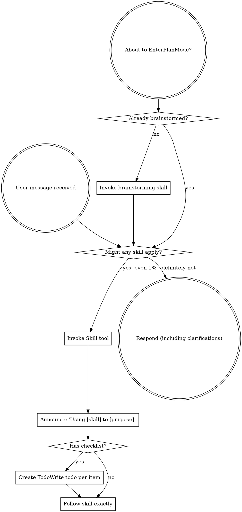

# Boundary Review — pair#146 (milestone M3)

| field | value |
|-------|-------|
| issue | 146 — couch: tty switching and attach |
| repo | pair |
| issue file | workshop/issues/000146-couch-tty-switching-and-attach.md |
| boundary | milestone M3 |
| milestone | M3 |
| window | 7b800e1960633def33f51b723233ae00faf593df..a14700d88c69b0f1d40a53ae4dc0e683beed7a07 |
| command | sdlc milestone-close --issue 146 --milestone M3 |
| reviewer | codex |
| timestamp | 2026-08-23T22:32:43-07:00 |
| verdict | REWORK |

## Review

Reading additional input from stdin...
OpenAI Codex v0.149.1
--------
workdir: /Users/xianxu/workspace/pair
model: gpt-5.6-sol
provider: openai
approval: never
sandbox: workspace-write [workdir, /tmp, $TMPDIR, /tmp] (network access enabled)
reasoning effort: medium
reasoning summaries: none
session id: 01a0323a-db7f-7673-ba73-e8b60105aa41
--------
user
# Code review — the one SDLC boundary review

You are conducting a fresh-context code review at a development boundary —
milestone M3 close — in the **pair** repository.

- repository: pair   (root: /Users/xianxu/workspace/pair)
- issue:      pair#146 M3   (file: workshop/issues/000146-couch-tty-switching-and-attach.md)
- window:     Base: 7b800e1960633def33f51b723233ae00faf593df   Head: a14700d88c69b0f1d40a53ae4dc0e683beed7a07

Review the **pair** repo and its tracker — the ariadne base-layer repo itself (changes here propagate to dependent repos). Do not assume any
other repository or apply another repo's conventions.

You have no prior session context — that is the anti-collusion property. Verify
behavior against the issue's documented Spec/Plan and the code itself; do NOT
take the implementor's word in commit messages or docs at face value. Tools are
read-only: report findings precisely; the main agent (which has session context)
applies the fixes, commits, and re-runs.

Read the diff against the issue's Spec + Plan, then work the checklist below.
Categorize every finding by severity — not everything is Critical; a nitpick
marked Critical is noise.

  Critical (must fix before crossing the boundary)
    - correctness bugs; crashes / panics on unexpected input
    - behavior drift from stated contracts (for ports of existing code where
      byte-faithfulness was promised, diff against the source)
    - silent error swallowing where the source raised
  Important (fix before the boundary if cheap)
    - API design of newly-introduced internal packages (downstream work will
      consume them; is the surface stable?)
    - missing test coverage that would catch the kind of bug shipped
    - inconsistent error handling across the diff
  Minor (note for future)
    - style nits, naming, comment density; performance only if hot-path

## Review checklist

Code quality
  - Clean separation of concerns; edge cases handled (empty / nil / unexpected).
  - Proper error handling — no silent swallowing where the source raised.
  - No duplicated logic / copy-paste that should be a shared helper.

Testing
  - Tests pin real logic, not mocks reasserting the implementation.
  - The kind of bug this diff could ship is covered.
  - PURE entities tested without IO; INTEGRATION via injected fakes (see below).

Requirements traceability
  - Every Plan checklist item this boundary claims is actually delivered.
  - Implementation matches the Spec; no undeclared scope creep.
  - Breaking changes documented.

Production readiness
  - Migration / backward-compatibility considered where state or formats change.
  - Docs / atlas updated for new surface (see the Docs update gate).

## Claimed fixes (ariadne#194)

For each prior finding this round disposes `addressed`, check the claim rather than the
commit message. A fix is complete only when a test FAILS WITHOUT IT.

  - Locate the test the fix is supposed to be pinned by. If there is none, the
    disposition is `not-addressed`, however plausible the diff looks.
  - Check the fix is reachable — a field set at zero call sites, an assertion nested in a
    runtime guard that never fires, a branch no fixture enters. These pass every test
    suite while doing nothing, and read as protection.
  - Where cheap, verify by reverting: undo the fix in a scratch copy and confirm the test
    goes red. A test written from the same mental model as the fix will happily assert
    whatever the fix happens to do, including nothing.

This check exists because the rule was written down and then violated by the very commit
that closed the findings which produced it. A reviewer that takes "fixed in <sha>" at face
value cannot catch that; one that looks for the failing test can.

## Core concepts cross-check (if the plan has a Core concepts table)

The plan should list entities in a greppable table — name, kind
(PURE/INTEGRATION), file location, status (new/modified/deleted). For each row:
  - Verify the entity exists at the stated path (grep the diff or filesystem).
  - PURE: tests run without IO (no exec, net, mutable fs). If tests need mocks
    to run, it isn't really PURE — flag Critical and recommend promoting it to
    INTEGRATION.
  - INTEGRATION: injected into pure callers, not invoked directly from business
    logic.
  - "modified" / "deleted": the diff shows the expected change/removal at the
    stated location.
Any contradiction between table and code = Critical finding, plus a plan-revision
recommendation (a "## Revisions" entry so the plan stops claiming what the code
doesn't deliver).

## Docs update gate (atlas + README, per AGENTS.md §8)

The boundary should update user-facing docs for any new surface introduced:

  - **atlas/** — new architectural surface, flow, or terminology. Scan the diff
    for new entity types, subcommands, conventions, file-tree locations. Any
    present without corresponding atlas/ changes in the same range = Important
    finding ("atlas update appears missing for <surface>").
  - **README.md** — new user-facing surface a reader runs or types: subcommands,
    flags, keybindings, config keys, install/usage steps. If the diff adds or
    changes such surface and README.md is not updated in the same range =
    Important finding ("README update appears missing for <surface>"). This is the
    class of gap that used to surface only at the merge-time `specs` judge (#142);
    catch it here, at the earliest gate, before the close verdict is recorded.

## Architecture (the at-review backstop — these matter most long-term)

Work through each of ARCH-DRY, ARCH-PURE, ARCH-PURPOSE, ARCH-MOCK explicitly, applying its at-review lens. The
full principle definitions are delivered in the ARCHITECTURE PRINCIPLES block
right after this prompt — for EACH marker, state pass or flag, and cite the
marker (e.g. ARCH-DRY) in any finding. Architecture is where review has the
least training signal and the longest-delayed payoff, so be deliberate here, not
holistic.

## Verdict + output

Begin your response with this fenced verdict block — the machine-read handoff:

```verdict
verdict: <SHIP | FIX-THEN-SHIP | REWORK>
confidence: <high | medium | low>
```

  SHIP           ready; ship it
  FIX-THEN-SHIP  ship after addressing the findings (non-blocking at the gate)
  REWORK         blocking; needs rework before shipping — fix + re-run

The fenced ```` ```verdict ```` block above is the **authoritative machine-read
handoff** — emit it as the first thing in your response. (A prose
`VERDICT: <TOKEN>` first line still satisfies the legacy contract as a fallback,
but the block is what the binary trusts.)

After the verdict block: a 1-paragraph summary — what worked, what blocks SHIP if
it isn't — followed by:
  1. Strengths: 2-5 specific things done well (file:line where useful). Affirm
     validated approaches so the operator knows what's confirmed-good ground.
     Empty acceptable for trivial boundaries.
  2. Critical findings (file:line + fix sketch); empty if none.
  3. Important findings (same format).
  4. Minor findings (terse one-liners).
  5. Test coverage notes.
  6. Architectural notes for upcoming work.
  7. Plan revision recommendations: specific "## Revisions" entries the plan
     needs (empty if the plan still matches the code).


ARCHITECTURE PRINCIPLES — work through each of the 4 entries below explicitly, applying its `at-review` lens; cite the marker (e.g. ARCH-DRY) in any finding.

# Architecture principles (ARCH-*)

Injected architectural taste — the structural decisions whose payoff (or cost)
shows up many turns, often months, down the road. Agents are strong at local
tactics and weak here, so these are checked **at-plan** (when the design is being
made — highest leverage) and **at-review** (backstop, on the diff). Cite the
marker (e.g. `ARCH-DRY`) in plans, `## Log` entries, and review findings.

This file is the single source; it is embedded into the planning, plan-quality,
and code-review prompts. The human narrative lives in AGENTS.md "Core Design
Principles"; this is its machine-delivered companion.

## ARCH-DRY — Don't Repeat Yourself

- **principle:** Reuse before adding. One source of truth per fact/behavior; no
  duplicated logic, copy-pasted blocks, or parallel functions that should be one
  shared helper.
- **at-plan:** Flag a plan that re-implements something the codebase already has,
  or that will obviously duplicate logic across the new files instead of
  extracting a shared helper. Name the existing thing it should reuse.
- **at-review:** Flag duplicated logic / copy-pasted blocks / near-identical
  functions in the diff; point at the consolidation (file:line + the shared
  helper they should become).

## ARCH-PURE — Pure core, thin IO shell

- **principle:** The majority of code is pure functions (deterministic, no side
  effects); a thin "glue" layer at the boundary touches IO/UI/network/clock. Pure
  functions are unit-tested directly; the glue is kept small and injected.
- **at-plan:** Flag a design that buries business logic inside IO/handlers, or
  that will only be testable with heavy mocks (a sign logic isn't separated from
  IO). The plan should name what's pure vs the thin IO seam.
- **at-review:** Flag business logic mixed with IO in the diff; logic that should
  be a pure function injected into a thin caller. If a test needs mocks to run a
  "pure" entity, it isn't pure — recommend extracting the IO to the boundary.

## ARCH-PURPOSE — Serve the issue's actual purpose

- **principle:** Deliver the issue's stated purpose, not the easy subset of it. A
  single-source / "compiled to consumers" change is not done until **every
  consumer derives** from the source — the source is *enforced*, not just
  documentation a surface happens to restate; a hand-maintained restatement of the
  model is a deferred consumer, not a finished one. "Follow-up" is for separable
  extensions, never for the thing that is the point. This is the *opposite axis*
  from Simplicity-First/YAGNI: not "build for an imagined future," but "don't
  **under**-deliver the purpose you already committed to."
  The same axis governs how a *finding* is answered: a finding names one
  instance; the deliverable is the CLASS it belongs to. Name the class, write
  the enumeration it implies, and sweep that enumeration in the SAME round —
  fixing only the site the finding named is the easy subset again. A gate
  ledger's `family:` slug names the class for you, and a family that repeats
  across rounds is the ledger reporting that the enumeration was never written.
- **at-plan:** Flag a plan whose scope is a strict subset of the issue's stated
  goal / Done-when where the part deferred as "follow-up" *is* the purpose (e.g.
  wires one consumer + enforcement but leaves the consumers that motivated the
  issue as documentation that doesn't derive). Ask: does the plan fulfill the
  purpose, or just the cheap win? Name the deferred purpose.
  Also flag a plan that answers a prior finding by fixing the instance it named
  when the class is enumerable — ask for the enumeration in the plan, and for the
  sweep in the same round rather than the round after.
- **at-review:** Does the diff *fulfill* the purpose or settle for the easy win?
  For a single-source change, run the **shadow-sweep** — enumerate the consumers,
  confirm each derives from the source, flag any remaining hand-maintained
  restatement of the model. A "follow-up" that is actually the deferred point of
  the issue is a finding, not a deferral. Likewise a fix that resolves the site a
  prior finding named while enumerable siblings of the same class remain in the
  tree: that is the instance, not the class, and it is a finding.

## ARCH-MOCK — Stateful external doubles

- **principle:** Every external binary or service dependency the system relies on
  has a stateful fake behind the same seam, modeling our current understanding of
  the dependency's behavior across calls. For libraries, services, and binaries we
  own, the storage/backend layer is backed by a portable folder of files and/or
  database configuration, so the component can be spun up without depending on
  production configuration or production databases. Integration and end-to-end
  tests run against the fake; scheduled/live conformance checks compare the
  fake's modeled behavior with the real binary or service so drift is detected
  and corrected.
- **at-plan:** Flag a design that shells out to, or calls, an external binary or
  service without naming the seam and stateful fake. For owned libraries, services,
  and binaries, also flag any design whose storage/backend depends on production
  configuration or databases instead of a portable file folder and/or database
  configuration. The plan should identify the dependency surface consumed, the
  fake's persisted state model, the owned component's portable backend shape,
  the integration or end-to-end tests that run against it, and the live
  conformance check cadence.
  Examples include `git`, GitHub/`gh`, and Google OAuth.
- **at-review:** Flag direct external calls outside the seam, stateless mocks for
  stateful interactions, tests that cannot run the stack against the fake, owned
  components that cannot boot from portable non-production storage/backend
  configuration, or a missing live conformance check for behavior we depend on. A
  fake satisfies this only when production flow and test flow share the same
  boundary.


## Prior rounds — dispose of these BEFORE raising anything new

This is the FIRST round of this gate at this boundary — there are no prior
findings to dispose of. Review the work on its merits.

Families already in play on this issue — REUSE one of these slugs when a
finding belongs to it, and coin a new slug only when it genuinely does not:

  docs-lag-the-surface                 4 new findings
  plan-table-drift                     4 new findings
  fix-not-pinned-by-failing-test       3 new findings
  probe-hygiene                        3 new findings
  dead-field-and-leaked-consumer       2 new findings
  fake-diverges-from-production        2 new findings
  needless-indirection                 2 new findings
  signal-goroutine-outlives-close      2 new findings
  stale-comment-reference              2 new findings
  uncovered-negative-assertion         2 new findings
  undelivered-plan-step                2 new findings
  chunking-invariance                  1 new finding
  derived-id-not-unique                1 new finding
  framing-omits-sequence-class         1 new finding
  guard-reads-wrong-stream-position    1 new finding
  latch-consumed-by-wrong-consumer     1 new finding
  prefix-parks-a-complete-key          1 new finding
  replay-duplicates-live-output        1 new finding
  seam-untested-on-the-real-side       1 new finding
  stale-build-target                   1 new finding
  swallowed-seam-error                 1 new finding
  test-harness-races                   1 new finding
  unrecoverable-silent-drop            1 new finding
  unsynchronised-shared-state          1 new finding

Each of these already has at least one finding, so a further one is a REPEAT.
If a finding you are about to raise belongs to one, say so explicitly and
change your recommendation:

  > **This is the 5th finding in family `docs-lag-the-surface`.** Earlier rounds fixed
  > instances. Do NOT fix this instance — state the rule that covers all of
  > them, and fix that. If the rule cannot be stated, say why and record the
  > family, with its measured prevalence, in the finding's own detail.
  > **This is the 5th finding in family `plan-table-drift`.** Earlier rounds fixed
  > instances. Do NOT fix this instance — state the rule that covers all of
  > them, and fix that. If the rule cannot be stated, say why and record the
  > family, with its measured prevalence, in the finding's own detail.
  > **This is the 4th finding in family `fix-not-pinned-by-failing-test`.** Earlier rounds fixed
  > instances. Do NOT fix this instance — state the rule that covers all of
  > them, and fix that. If the rule cannot be stated, say why and record the
  > family, with its measured prevalence, in the finding's own detail.
  > **This is the 4th finding in family `probe-hygiene`.** Earlier rounds fixed
  > instances. Do NOT fix this instance — state the rule that covers all of
  > them, and fix that. If the rule cannot be stated, say why and record the
  > family, with its measured prevalence, in the finding's own detail.
  > **This is the 3rd finding in family `dead-field-and-leaked-consumer`.** Earlier rounds fixed
  > instances. Do NOT fix this instance — state the rule that covers all of
  > them, and fix that. If the rule cannot be stated, say why and record the
  > family, with its measured prevalence, in the finding's own detail.
  > **This is the 3rd finding in family `fake-diverges-from-production`.** Earlier rounds fixed
  > instances. Do NOT fix this instance — state the rule that covers all of
  > them, and fix that. If the rule cannot be stated, say why and record the
  > family, with its measured prevalence, in the finding's own detail.
  > **This is the 3rd finding in family `needless-indirection`.** Earlier rounds fixed
  > instances. Do NOT fix this instance — state the rule that covers all of
  > them, and fix that. If the rule cannot be stated, say why and record the
  > family, with its measured prevalence, in the finding's own detail.
  > **This is the 3rd finding in family `signal-goroutine-outlives-close`.** Earlier rounds fixed
  > instances. Do NOT fix this instance — state the rule that covers all of
  > them, and fix that. If the rule cannot be stated, say why and record the
  > family, with its measured prevalence, in the finding's own detail.
  > **This is the 3rd finding in family `stale-comment-reference`.** Earlier rounds fixed
  > instances. Do NOT fix this instance — state the rule that covers all of
  > them, and fix that. If the rule cannot be stated, say why and record the
  > family, with its measured prevalence, in the finding's own detail.
  > **This is the 3rd finding in family `uncovered-negative-assertion`.** Earlier rounds fixed
  > instances. Do NOT fix this instance — state the rule that covers all of
  > them, and fix that. If the rule cannot be stated, say why and record the
  > family, with its measured prevalence, in the finding's own detail.
  > **This is the 3rd finding in family `undelivered-plan-step`.** Earlier rounds fixed
  > instances. Do NOT fix this instance — state the rule that covers all of
  > them, and fix that. If the rule cannot be stated, say why and record the
  > family, with its measured prevalence, in the finding's own detail.
  > **This is the 2nd finding in family `chunking-invariance`.** Earlier rounds fixed
  > instances. Do NOT fix this instance — state the rule that covers all of
  > them, and fix that. If the rule cannot be stated, say why and record the
  > family, with its measured prevalence, in the finding's own detail.
  > **This is the 2nd finding in family `derived-id-not-unique`.** Earlier rounds fixed
  > instances. Do NOT fix this instance — state the rule that covers all of
  > them, and fix that. If the rule cannot be stated, say why and record the
  > family, with its measured prevalence, in the finding's own detail.
  > **This is the 2nd finding in family `framing-omits-sequence-class`.** Earlier rounds fixed
  > instances. Do NOT fix this instance — state the rule that covers all of
  > them, and fix that. If the rule cannot be stated, say why and record the
  > family, with its measured prevalence, in the finding's own detail.
  > **This is the 2nd finding in family `guard-reads-wrong-stream-position`.** Earlier rounds fixed
  > instances. Do NOT fix this instance — state the rule that covers all of
  > them, and fix that. If the rule cannot be stated, say why and record the
  > family, with its measured prevalence, in the finding's own detail.
  > **This is the 2nd finding in family `latch-consumed-by-wrong-consumer`.** Earlier rounds fixed
  > instances. Do NOT fix this instance — state the rule that covers all of
  > them, and fix that. If the rule cannot be stated, say why and record the
  > family, with its measured prevalence, in the finding's own detail.
  > **This is the 2nd finding in family `prefix-parks-a-complete-key`.** Earlier rounds fixed
  > instances. Do NOT fix this instance — state the rule that covers all of
  > them, and fix that. If the rule cannot be stated, say why and record the
  > family, with its measured prevalence, in the finding's own detail.
  > **This is the 2nd finding in family `replay-duplicates-live-output`.** Earlier rounds fixed
  > instances. Do NOT fix this instance — state the rule that covers all of
  > them, and fix that. If the rule cannot be stated, say why and record the
  > family, with its measured prevalence, in the finding's own detail.
  > **This is the 2nd finding in family `seam-untested-on-the-real-side`.** Earlier rounds fixed
  > instances. Do NOT fix this instance — state the rule that covers all of
  > them, and fix that. If the rule cannot be stated, say why and record the
  > family, with its measured prevalence, in the finding's own detail.
  > **This is the 2nd finding in family `stale-build-target`.** Earlier rounds fixed
  > instances. Do NOT fix this instance — state the rule that covers all of
  > them, and fix that. If the rule cannot be stated, say why and record the
  > family, with its measured prevalence, in the finding's own detail.
  > **This is the 2nd finding in family `swallowed-seam-error`.** Earlier rounds fixed
  > instances. Do NOT fix this instance — state the rule that covers all of
  > them, and fix that. If the rule cannot be stated, say why and record the
  > family, with its measured prevalence, in the finding's own detail.
  > **This is the 2nd finding in family `test-harness-races`.** Earlier rounds fixed
  > instances. Do NOT fix this instance — state the rule that covers all of
  > them, and fix that. If the rule cannot be stated, say why and record the
  > family, with its measured prevalence, in the finding's own detail.
  > **This is the 2nd finding in family `unrecoverable-silent-drop`.** Earlier rounds fixed
  > instances. Do NOT fix this instance — state the rule that covers all of
  > them, and fix that. If the rule cannot be stated, say why and record the
  > family, with its measured prevalence, in the finding's own detail.
  > **This is the 2nd finding in family `unsynchronised-shared-state`.** Earlier rounds fixed
  > instances. Do NOT fix this instance — state the rule that covers all of
  > them, and fix that. If the rule cannot be stated, say why and record the
  > family, with its measured prevalence, in the finding's own detail.


Do NOT re-raise a finding listed as already disposed — not at the same severity,
and not at a lower one. If a disposed finding is genuinely still wrong, dispose it
`not-addressed` and say what remains, rather than raising it again under a new id.

Emit your findings as this fenced block — the machine-read handoff the
binary parses. `dispose:` first (every prior finding), then `findings:`
(anything newly raised). Use `id: new` for a new finding — the binary
assigns the stable id. Omit a key entirely when it has no entries.

```findings
dispose:
  - id: <a prior finding's id>
    disposition: <addressed | withdrawn | not-addressed>
    note: |
      <optional, one line>
findings:
  - id: new
    severity: <Critical | Important | Minor>
    family: <slug>
    title: |
      <one line>
    detail: |
      <a sentence or two, optional>
```

`family` is a short slug naming the underlying RULE a finding is an instance of,
not its symptom — `block-opener-rule`, not `bracket-depth-bug`. If the prior-round
block above lists families already in play, REUSE the matching slug verbatim;
coin a new one only when the finding genuinely belongs to no existing family.

Slug the RULE, because a symptom-slug will not match the next instance and the
escalation will silently fail to fire. Ask: "if this recurs in a different file
with different symptoms, would I still reach for this slug?" If not, it names the
symptom. `boundary-scope-strands-reads` survives that test; `family-counts-filtered`
does not — it describes one site, and the same rule broke a second read elsewhere.

Use the `|` block form for title, detail and note exactly as shown, and indent
their text by six spaces. In plain YAML a ` #` starts a comment, so an
unquoted `## Estimate` or `issue #187` would silently truncate your finding.

  Critical       must fix before the gate is crossed
  Important      fix before the gate if cheap; blocks until disposed
  Minor          note for the close review; never blocks a gate

  addressed      the plan changed to satisfy this finding
  withdrawn      the judge retracts it (mistaken, or overtaken by a design change)
  not-addressed  still open — the judge re-raises it this round

OUTPUT CONTRACT (machine-read — do not deviate). LEAD your response with the
fenced ```verdict block shown above — that is the authoritative handoff the binary
reads (its `verdict:` value is one of the listed tokens). Everything after the block
is advisory: a non-blocking verdict WITH findings still PASSES the gate. A bare
`VERDICT: <TOKEN>` line is accepted only as a FALLBACK when the block is absent.

Diff:
diff --git a/atlas/couch.md b/atlas/couch.md
index 47fa703..9082c65 100644
--- a/atlas/couch.md
+++ b/atlas/couch.md
@@ -6,7 +6,8 @@ is **not** an extension of `pair`. pair is what the operator sits inside, so a
 supervisor bug must not break the ability to fix it; the fallback is always to
 launch pair the old way.
 
-Project: `workshop/projects/couch.md`. Built in `pair#145`.
+Project: `workshop/projects/couch.md`. Registry/spawn shipped in `pair#145`;
+the console and switcher through the actor panel shipped in `pair#146` M1-M3.
 
 ## What exists today
 
@@ -19,9 +20,9 @@ are identical -- so any list in prose is a second copy that drifts. It already
 did: this file named six operations while seven shipped. Run `couch --help`,
 which renders the declared set.
 
-**couch hosts `pair` whole.** The stack is couch → pair → zellij → claude+nvim.
-couch spawns `pair --layout2` and hands it couch's own stdio, so `couch start`
-blocks for the child's lifetime. Verified by operator smoke on 2026-08-21; the
+**couch hosts `pair` whole.** The stack is couch → pair → zellij → agent+nvim.
+couch starts `pair resume <tag> --layout2` inside a child pty and owns the
+operator tty until the console exits. Verified by operator smoke; the
 alternative (couch absorbing zellij's role) was considered and rejected because
 the agent child is never spawned by Go — zellij spawns it from a KDL layout, and
 `entrypoint.ValidRootMarkers` *defines* a valid pair install as having those
@@ -95,6 +96,23 @@ because a concatenated buffer cannot say which child the tail belongs to. It
 suspends inside a bracketed paste: a pasted NUL that switched actors and ate a
 byte would be untraceable data loss.
 
+The focus ladder is deliberately small: a non-root child goes to the root
+actor, the root actor goes to couch's panel, and the panel stays put. Liveness
+is consulted before going home so a dead root cannot become a frozen landing.
+
+The panel is couch's own screen. It owns input while visible, suppresses
+background-child painting, and supports arrows + Enter, digits 1-9, Escape,
+typeahead, and the declared start/stop/name/describe operations. Every action
+dispatches through `couchcore.Operations()`; `start`'s returned `StartResult` is
+load-bearing because the console consumes it to attach the new terminal child.
+
+A panel row carries two identities that must not be conflated: the canonical
+worktree feeds the shared human resolver, while the console-local child id is
+the deterministic switch and bell target. `Couch.LookupTrees` is the one match
+rule for the panel, CLI and future advisor; it searches the displayed repo-name
+fallback, operator name/description, and agent-published description. This is
+why a row displayed as `pair` is findable by typing `pair`.
+
 ## Spawning: `pair resume <tag> --layout2`
 
 The tag derives from the worktree root, so re-entry is deterministic and a
@@ -191,6 +209,6 @@ not fidelity to Erlang.
 
 ## Planned, not built
 
-`pair#146` tty switching · `pair#147` cluster transport and queries ·
+`pair#146` M4 exits/detach/notices · `pair#147` cluster transport and queries ·
 `pair#148` brain as advisor. Cross-repo enablers: `ariadne#199` (exposed query
 API), `ariadne#200` (fleet inventory).
diff --git a/cmd/internal/couchcmd/run.go b/cmd/internal/couchcmd/run.go
index eb54c4b..54ce554 100644
--- a/cmd/internal/couchcmd/run.go
+++ b/cmd/internal/couchcmd/run.go
@@ -151,7 +151,7 @@ func RunWithRuntime(args []string, stdin io.Reader, stdout, stderr io.Writer, rt
 	}
 	if console != nil {
 		if start, ok := result.(couchcore.StartResult); ok {
-			return runConsole(console, start, stdout)
+			return runConsole(console, c, start, stdout)
 		}
 	}
 	return render(stdout, op, result)
@@ -212,7 +212,13 @@ func consoleRunnerFor(name string, args map[string]string, stdin io.Reader, hasT
 // runConsole attaches the spawned child and hands the terminal over. This
 // displaces render's StartResult branch, which printed a line and then blocked
 // on Handle.Wait for the child's lifetime.
-func runConsole(console *couchtty.Console, start couchcore.StartResult, stdout io.Writer) int {
+func runConsole(console *couchtty.Console, c *couchcore.Couch, start couchcore.StartResult, stdout io.Writer) int {
+	// Wire the panel's match rule HERE, on the path that actually runs a
+	// console -- not at a call site a test can bypass. An injection seam
+	// nothing passes is a seam that does nothing (Decision 12's wiring check),
+	// and the panel would silently degrade to "show everything".
+	wireResolver(console, c)
+
 	th, ok := start.Handle.(couchcore.TerminalHandle)
 	if !ok {
 		// A runner that cannot offer a terminal: fall back rather than crash.
@@ -223,10 +229,31 @@ func runConsole(console *couchtty.Console, start couchcore.StartResult, stdout i
 		return 1
 	}
 	label := start.Record.Args.Worktree.Repo()
-	console.Attach(start.Handle.ID(), label, th.Terminal())
+	console.AttachTree(start.Handle.ID(), start.Record.Args.Worktree, label, th.Terminal())
 	return console.Run()
 }
 
+// wireResolver gives the panel couch's OWN match rule.
+//
+// Without this the injection seam exists and nothing uses it, which is the
+// failure mode Decision 12's wiring check names: the panel would silently fall
+// back to "show everything" and typeahead would do nothing.
+func wireResolver(console *couchtty.Console, c *couchcore.Couch) {
+	console.SetResolver(c.LookupTrees)
+
+	// The panel's actions run through the SAME declared table the CLI
+	// dispatches: the console names an operation and couchcore performs it, so
+	// there is no operator action the advisor cannot also perform (#148's
+	// design test) and no way for the panel to grow a private verb.
+	console.SetOps(func(name string, args map[string]string) (any, error) {
+		op, ok := Resolve(name)
+		if !ok {
+			return nil, fmt.Errorf("unknown operation %q", name)
+		}
+		return op.Invoke(c, args)
+	})
+}
+
 // bindArgs maps positional argv onto the operation's declared ArgSpecs, plus
 // --flag=value form for the optional ones.
 func bindArgs(op couchcore.Operation, argv []string) (map[string]string, error) {
@@ -362,14 +389,21 @@ func renderError(w io.Writer, err error) {
 		fmt.Fprintf(w, "  %s (pid %d)\n", a.ID, a.PID)
 	}
 	fmt.Fprintf(w, "They would share a branch and index.\n")
-	switch occ.Mode {
-	case couchcore.WorktreeParallel:
-		fmt.Fprintf(w, "  -> new worktree (cheap here), or switch to it, or --same-tree\n")
-	case couchcore.HeavyLocalState:
-		fmt.Fprintf(w, "  -> switch to it, or --same-tree (worktrees are expensive in this repo)\n")
-	default:
-		fmt.Fprintf(w, "  -> switch to it, or --same-tree (this repo runs one agent at a time)\n")
+
+	// Offer COMMANDS, not intentions.
+	//
+	// This used to say "switch to it", which names a remedy couch has no verb
+	// for: attaching to a session hosted by another couch process needs the
+	// transport in pair#147. An operator who follows unactionable advice ends up
+	// reaching for --same-tree, which is the one option that bypasses the guard.
+	// A refusal is a next-action spec.
+	ref := occ.Tree.Repo()
+	fmt.Fprintf(w, "  -> couch stop %s        end it, then start again\n", ref)
+	fmt.Fprintf(w, "  -> couch start %s --same-tree   run a second agent anyway (recorded)\n", ref)
+	if occ.Mode == couchcore.WorktreeParallel {
+		fmt.Fprintf(w, "  -> or start in a new worktree, which is cheap in this repo\n")
 	}
+	fmt.Fprintf(w, "  (attaching to a session another couch is hosting needs pair#147)\n")
 }
 
 func usage(w io.Writer, table map[string]couchcore.Operation) {
diff --git a/cmd/internal/couchcmd/run_test.go b/cmd/internal/couchcmd/run_test.go
index b81eeea..effbb7f 100644
--- a/cmd/internal/couchcmd/run_test.go
+++ b/cmd/internal/couchcmd/run_test.go
@@ -465,3 +465,125 @@ func TestConsoleRunnerDeclinesWithoutATerminalWiring(t *testing.T) {
 		t.Fatalf("runner = %T, want couchcore.ExecRunner", runner)
 	}
 }
+
+// The panel's resolver must be couch's own rule, not left nil.
+//
+// Decision 12's wiring check: an injection seam nothing passes is a seam that
+// does nothing, and the panel would silently degrade to "show everything" with
+// typeahead inert. Asserting the FUNCTION IDENTITY is the only way to catch
+// that, since a nil resolver still renders a panel.
+func TestConsoleGetsCouchsOwnResolver(t *testing.T) {
+	rt := newRT(t, "/repo")
+	c, err := rt.NewCouch()
+	if err != nil {
+		t.Fatalf("NewCouch: %v", err)
+	}
+	console, _ := consoleRunnerFor("start", map[string]string{}, strings.NewReader(""), true, nil, nil)
+	if console == nil {
+		t.Fatal("no console to wire")
+	}
+	if console.Resolver() != nil {
+		t.Fatal("a resolver was set before the run path; this test would prove nothing")
+	}
+
+	// Drive the REAL path. The child has already exited, so Run returns at once
+	// instead of blocking -- which is what AutoExit models.
+	rec, h, err := c.Spawn(couchcore.StartArgs{Cwd: "/repo"})
+	if err != nil {
+		t.Fatalf("Spawn: %v", err)
+	}
+	runConsole(console, c, couchcore.StartResult{Record: rec, Handle: h}, &bytes.Buffer{})
+
+	if console.Resolver() == nil {
+		t.Fatal("the run path left the panel's resolver nil — typeahead would be inert")
+	}
+	if got := console.Resolver()("anything"); len(got) != 0 {
+		t.Fatalf("resolver returned %v for an empty registry", got)
+	}
+}
+
+// The panel's action dispatcher must be wired on the run path, not left nil --
+// the first cut declared four panel actions with nothing behind them, so the
+// operator could not start a second child at all.
+func TestConsoleGetsAnActionDispatcher(t *testing.T) {
+	rt := newRT(t, "/repo")
+	c, err := rt.NewCouch()
+	if err != nil {
+		t.Fatalf("NewCouch: %v", err)
+	}
+	console, _ := consoleRunnerFor("start", map[string]string{}, strings.NewReader(""), true, nil, nil)
+	if console == nil {
+		t.Fatal("no console to wire")
+	}
+	if console.Ops() != nil {
+		t.Fatal("a dispatcher was set before the run path; this test would prove nothing")
+	}
+
+	rec, h, err := c.Spawn(couchcore.StartArgs{Cwd: "/repo"})
+	if err != nil {
+		t.Fatalf("Spawn: %v", err)
+	}
+	runConsole(console, c, couchcore.StartResult{Record: rec, Handle: h}, &bytes.Buffer{})
+
+	ops := console.Ops()
+	if ops == nil {
+		t.Fatal("the run path left the panel's dispatcher nil — its actions would refuse")
+	}
+	// It must reach couch's own table: an unknown name is refused rather than
+	// silently succeeding.
+	if _, err := ops("no-such-operation", nil); err == nil {
+		t.Fatal("the dispatcher accepted an operation couch does not declare")
+	}
+	// And a real one is accepted.
+	if _, err := ops("list", nil); err != nil {
+		t.Fatalf("list through the panel dispatcher: %v", err)
+	}
+}
+
+// A refusal is a next-action spec: every remedy it names must be a command the
+// operator can run.
+//
+// It used to say "switch to it", which couch has no verb for -- attaching to a
+// session another couch process hosts needs pair#147's transport. Advice that
+// cannot be followed pushes the operator to --same-tree, the one option that
+// bypasses the guard.
+func TestTreeOccupiedRefusalNamesRunnableCommands(t *testing.T) {
+	rt := newRT(t, "/repo")
+	if _, errw, code := runRT(rt, "start", "/repo"); code != 0 {
+		t.Fatalf("first start failed: %d %q", code, errw)
+	}
+	rt.markLive(t) // the guard needs a live incumbent to refuse for
+	_, errw, code := runRT(rt, "start", "/repo")
+	if code == 0 {
+		t.Fatal("a second start on an occupied tree was allowed")
+	}
+
+	if strings.Contains(errw, "switch to it") {
+		t.Errorf("the refusal still offers an action couch cannot perform: %q", errw)
+	}
+	// Every `couch <verb>` it suggests must be a declared operation.
+	declared := map[string]bool{}
+	for _, n := range couchcore.OperationNames() {
+		declared[n] = true
+	}
+	// Only the SUGGESTION lines (`  -> couch <verb> ...`) are commands; the
+	// rest is prose and may legitimately mention couch.
+	found := 0
+	for _, line := range strings.Split(errw, "\n") {
+		line = strings.TrimSpace(line)
+		if !strings.HasPrefix(line, "-> couch ") {
+			continue
+		}
+		fields := strings.Fields(strings.TrimPrefix(line, "-> couch "))
+		if len(fields) == 0 {
+			continue
+		}
+		found++
+		if !declared[fields[0]] {
+			t.Errorf("the refusal suggests `couch %s`, which is not a declared operation", fields[0])
+		}
+	}
+	if found == 0 {
+		t.Errorf("the refusal names no runnable command at all: %q", errw)
+	}
+}
diff --git a/cmd/internal/couchcore/couch.go b/cmd/internal/couchcore/couch.go
index 9b3b7e7..f39a7bb 100644
--- a/cmd/internal/couchcore/couch.go
+++ b/cmd/internal/couchcore/couch.go
@@ -229,10 +229,11 @@ func (c *Couch) knownTrees() []Worktree {
 
 // LookupTrees resolves a fuzzy human reference to every tree it could mean.
 //
-// It matches the operator's name, the operator's typed description, AND the
-// agent's own published line. All three answer "what is this thread called",
-// so all three derive from one lookup -- displaying the agent's description
-// while resolving only the operator's delivers half the behaviour.
+// It matches the repo basename rendered as an unnamed tree's fallback label,
+// the operator's name and typed description, AND the agent's own published
+// line. All four answer "what is this thread called", so all four derive from
+// one lookup -- displaying a label while making it unsearchable delivers half
+// the behaviour.
 func (c *Couch) LookupTrees(ref string) []Worktree {
 	needle := strings.ToLower(strings.TrimSpace(ref))
 	if needle == "" {
@@ -250,7 +251,8 @@ func (c *Couch) LookupTrees(ref string) []Worktree {
 		if seen[w.Key()] {
 			continue
 		}
-		if strings.Contains(strings.ToLower(c.Describe(w)), needle) {
+		if strings.Contains(strings.ToLower(w.Repo()), needle) ||
+			strings.Contains(strings.ToLower(c.Describe(w)), needle) {
 			seen[w.Key()] = true
 			out = append(out, w)
 		}
diff --git a/cmd/internal/couchcore/couch_test.go b/cmd/internal/couchcore/couch_test.go
index dcce543..ee22733 100644
--- a/cmd/internal/couchcore/couch_test.go
+++ b/cmd/internal/couchcore/couch_test.go
@@ -176,6 +176,19 @@ func TestResolveRefFindsActorsByOperatorName(t *testing.T) {
 	}
 }
 
+// The panel renders Worktree.Repo() when a tree has no explicit name. A label
+// that is visible but cannot be typed back into the shared resolver makes
+// typeahead lie: it shows "pair" and returns no match for "pair".
+func TestLookupTreesMatchesTheDisplayedRepoFallback(t *testing.T) {
+	env := newTestEnv(t, "/w/pair")
+	env.spawn(t, StartArgs{Worktree: "/w/pair"})
+
+	got := env.Couch.LookupTrees("pair")
+	if len(got) != 1 || got[0] != "/w/pair" {
+		t.Fatalf("LookupTrees(pair) = %v, want [/w/pair]", got)
+	}
+}
+
 func TestNameAndDescriptionChangeMidSession(t *testing.T) {
 	env := newTestEnv(t, "/repo")
 	env.spawn(t, StartArgs{Worktree: "/repo"})
diff --git a/cmd/internal/couchtty/console.go b/cmd/internal/couchtty/console.go
index 375360c..de4a39d 100644
--- a/cmd/internal/couchtty/console.go
+++ b/cmd/internal/couchtty/console.go
@@ -6,6 +6,7 @@ import (
 	"os"
 	"sync"
 
+	"github.com/xianxu/pair/cmd/internal/couchcore"
 	"github.com/xianxu/pair/cmd/internal/hostty"
 	"github.com/xianxu/pair/cmd/internal/ptychild"
 )
@@ -17,7 +18,9 @@ type chunk struct {
 }
 
 type pane struct {
+	tree  couchcore.Worktree
 	label string
+	desc  string
 	child *ptychild.Child
 
 	// bell is sticky until the operator looks at this actor. The row's job is
@@ -48,6 +51,42 @@ type Console struct {
 	panes  map[string]*pane
 	order  []string
 	active string
+
+	// root is the actor `ctrl-space` goes home to: the FIRST child attached,
+	// which is "whatever session couch launched in" delivered by convention
+	// (Decision 1). Nothing here knows what brain is.
+	root string
+
+	// focus is what the terminal is pointed at. It is not the same as `active`:
+	// the panel is a focus with no actor behind it.
+	focus Focus
+
+	// query is the panel's typeahead buffer, and resolve is the match rule --
+	// INJECTED rather than implemented, so the panel resolves exactly what the
+	// CLI and #148's advisor resolve (Decision 12). Nil degrades to showing
+	// everything rather than to a private match rule.
+	query   string
+	resolve func(string) []couchcore.Worktree
+
+	// panel is live state, not rebuilt per keystroke: the highlight has to
+	// survive typing, or the cursor resets under the operator's fingers.
+	panel *PanelModel
+
+	// prompt is non-empty while the panel is collecting an argument for an
+	// action -- a path for `start`, say. Actions that need input cannot be a
+	// single keystroke.
+	prompt      string
+	promptLabel string
+	promptArg   string
+	promptFn    func(string)
+
+	// panelHeld carries a partial escape sequence across reads.
+	panelHeld []byte
+
+	// Ops dispatches an operator action. Injected so the console never learns
+	// what an operation IS -- it names one and couchcore runs it, which is
+	// what keeps the panel from growing a private verb (#148's design test).
+	ops    func(name string, args map[string]string) (any, error)
 	notice string
 	size   ptychild.Size
 
@@ -74,11 +113,13 @@ type Console struct {
 	// the writer singular removes the class rather than the two instances:
 	// there is no longer a way to reach the screen except through the loop that
 	// tracks where the stream is.
-	chunks  chan chunk
-	resized chan struct{}
-	hotkeys chan struct{}
-	stop    chan struct{}
-	once    sync.Once
+	chunks    chan chunk
+	resized   chan struct{}
+	hotkeys   chan struct{}
+	switching chan string
+	panelKeys chan []byte
+	stop      chan struct{}
+	once      sync.Once
 }
 
 // errw is where the console reports its own failures. Separate from the host
@@ -92,13 +133,15 @@ func (c *Console) errw() io.Writer {
 
 func New(host hostty.Host, stdin io.Reader) *Console {
 	c := &Console{
-		host:    host,
-		stdin:   stdin,
-		panes:   map[string]*pane{},
-		chunks:  make(chan chunk, 256),
-		resized: make(chan struct{}, 1),
-		hotkeys: make(chan struct{}, 8),
-		stop:    make(chan struct{}),
+		host:      host,
+		stdin:     stdin,
+		panes:     map[string]*pane{},
+		chunks:    make(chan chunk, 256),
+		resized:   make(chan struct{}, 1),
+		switching: make(chan string, 8),
+		panelKeys: make(chan []byte, 64),
+		hotkeys:   make(chan struct{}, 8),
+		stop:      make(chan struct{}),
 	}
 	if s, err := host.Size(); err == nil {
 		c.size = s
@@ -106,6 +149,40 @@ func New(host hostty.Host, stdin io.Reader) *Console {
 	return c
 }
 
+// SetOps injects the action dispatcher: `couchcmd` passes one that runs
+// couchcore.Operations(). Without it the panel can still switch -- which is
+// read-only -- but its actions refuse loudly rather than doing nothing.
+func (c *Console) SetOps(f func(string, map[string]string) (any, error)) {
+	c.mu.Lock()
+	defer c.mu.Unlock()
+	c.ops = f
+}
+
+// Ops returns the injected dispatcher, so a wiring test can assert one was
+// passed -- the panel renders identically without it.
+func (c *Console) Ops() func(string, map[string]string) (any, error) {
+	c.mu.Lock()
+	defer c.mu.Unlock()
+	return c.ops
+}
+
+// SetResolver injects the panel's match rule. Production passes
+// `couch.LookupTrees`; without it the seam is one nothing uses.
+func (c *Console) SetResolver(f func(string) []couchcore.Worktree) {
+	c.mu.Lock()
+	defer c.mu.Unlock()
+	c.resolve = f
+}
+
+// Resolver returns the injected match rule, so a wiring test can assert one was
+// actually passed -- a nil resolver still renders a panel, so nothing else
+// would notice.
+func (c *Console) Resolver() func(string) []couchcore.Worktree {
+	c.mu.Lock()
+	defer c.mu.Unlock()
+	return c.resolve
+}
+
 // SetErrorWriter redirects the console's own diagnostics, so a test can read
 // them instead of the process's stderr.
 func (c *Console) SetErrorWriter(w io.Writer) { c.stderr = w }
@@ -139,15 +216,24 @@ func (c *Console) Deliver(id string, data []byte) {
 	}
 }
 
-// Attach registers a child. The first one attached is the active one -- and in
-// M2 the only one.
+// Attach registers a child using its actor id as a synthetic tree. It remains
+// as a test/helper convenience; production must call AttachTree so typeahead
+// resolves against the real worktree identity.
 func (c *Console) Attach(id, label string, child *ptychild.Child) {
+	c.AttachTree(id, couchcore.Worktree(id), label, child)
+}
+
+// AttachTree registers a child with both identities the panel needs: worktree
+// for human resolution, actor id for deterministic switching.
+func (c *Console) AttachTree(id string, tree couchcore.Worktree, label string, child *ptychild.Child) {
 	c.mu.Lock()
 	defer c.mu.Unlock()
-	c.panes[id] = &pane{label: label, child: child}
+	c.panes[id] = &pane{tree: tree, label: label, child: child}
 	c.order = append(c.order, id)
 	if c.active == "" {
 		c.active = id
+		c.root = id
+		c.focus = FocusActor(id)
 	}
 }
 
@@ -163,6 +249,56 @@ func (c *Console) PaneRowDirty(id string) bool {
 	return false
 }
 
+// Switch points the operator's terminal at another hosted actor.
+//
+// A request, not an action: it lands on the Run goroutine, which is the only
+// one allowed to write to the host. Callers may be the panel, the hotkey path,
+// or (in #148) the advisor's tool layer -- none of them get to touch the screen
+// directly.
+func (c *Console) Switch(id string) {
+	select {
+	case c.switching <- id:
+	case <-c.stop:
+	}
+}
+
+// onSwitch lands the operator on another child, running on the Run goroutine.
+//
+// Order is the whole contract: clear, replay the child's own screen, THEN the
+// status row. Painting the row first means the landing paints over it.
+func (c *Console) onSwitch(id string) { c.switchTo(id, false) }
+
+// forceSwitch repaints even when the actor is already active -- which is the
+// case when returning from the panel, where the SCREEN changed but the active
+// actor did not.
+func (c *Console) forceSwitch(id string) { c.switchTo(id, true) }
+
+func (c *Console) switchTo(id string, force bool) {
+	c.mu.Lock()
+	p, known := c.panes[id]
+	already := c.active == id && !force
+	if known {
+		c.active = id
+		c.focus = FocusActor(id)
+		// Landing on an actor is looking at it: whatever it wanted is now the
+		// operator's problem rather than a pending flag.
+		p.bell = false
+		p.rowDirty = false
+	}
+	c.mu.Unlock()
+	if !known || already {
+		// An unknown actor is not a reason to blank the operator's screen.
+		return
+	}
+
+	// The replay is Replay(), not Snapshot(): a raw one still carries whatever
+	// capability queries the child emitted at startup, and re-asking the host
+	// terminal lands the ANSWER in the newly active child's stdin -- #127's bug
+	// arriving at a new site.
+	c.takeOverScreen(p.child.Replay())
+	c.paintNow()
+}
+
 // Stop tears the console down. Safe to call more than once, and from any
 // goroutine.
 func (c *Console) Stop() { c.once.Do(func() { close(c.stop) }) }
@@ -201,6 +337,10 @@ func (c *Console) Run() int {
 			c.onResize()
 		case <-c.hotkeys:
 			c.onHotkey()
+		case id := <-c.switching:
+			c.onSwitch(id)
+		case raw := <-c.panelKeys:
+			c.onPanelInput(raw)
 		case code := <-exited:
 			return code
 		case <-c.stop:
@@ -276,6 +416,27 @@ func (c *Console) writeChild(p []byte) {
 	_, _ = c.host.Write(p)
 }
 
+// takeOverScreen replaces what is on the screen wholesale -- a switch landing,
+// or the panel opening.
+//
+// Distinct from writeOwn on purpose. An interleaved paint must WAIT for a
+// sequence boundary because it is inserted into a stream that continues; a
+// takeover ENDS that stream's relevance, so waiting would strand the operator
+// on the previous child's screen. It resets the framing state for the same
+// reason: whatever partial sequence the old child left is no longer on screen
+// to be corrupted.
+//
+// It is still Run-goroutine-only, like every other writer.
+func (c *Console) takeOverScreen(body []byte) {
+	c.mu.Lock()
+	c.hostScan = ptychild.Screen{}
+	c.paintPending = false
+	c.mu.Unlock()
+
+	_, _ = io.WriteString(c.host, hostty.HomeAndClear)
+	_, _ = c.host.Write(body)
+}
+
 // writeOwn emits the console's OWN bytes, and is the only way they reach the
 // screen. It refuses while the child's stream is mid-sequence and records the
 // debt; the next chunk that lands on a boundary pays it.
@@ -318,7 +479,10 @@ func (c *Console) paintNow() {
 func (c *Console) onChunk(ch chunk) {
 	c.mu.Lock()
 	p, known := c.panes[ch.id]
-	isActive := ch.id == c.active
+	// "Active" means the operator is looking at this child. With the panel up
+	// nobody is, so a child that keeps streaming must not paint over couch's
+	// own screen.
+	isActive := ch.id == c.active && !c.focus.IsPanel()
 	c.mu.Unlock()
 	if !known {
 		return
@@ -408,7 +572,20 @@ func (c *Console) pumpStdin() {
 			for {
 				before, hit, rest := it.Feed(in)
 				if len(before) > 0 {
-					if child := c.activeChild(); child != nil {
+					c.mu.Lock()
+					toPanel := c.focus.IsPanel()
+					c.mu.Unlock()
+					if toPanel {
+						// The panel owns the keyboard while it is up, or a
+						// child would act on keys aimed at couch. Raw bytes:
+						// DECODING happens on the Run goroutine, which is
+						// where the carried partial sequence lives.
+						select {
+						case c.panelKeys <- append([]byte(nil), before...):
+						case <-c.stop:
+							return
+						}
+					} else if child := c.activeChild(); child != nil {
 						_, _ = child.Write(before)
 					}
 				}
@@ -434,15 +611,315 @@ func (c *Console) pumpStdin() {
 	}
 }
 
-// onHotkey handles ctrl-space.
+// onHotkey handles ctrl-space: up one level.
 //
-// M2 has one child and no panel, so "up one level" has nowhere to go and the
-// row says so. M3 replaces this with the focus model -- the point of doing it
-// here is that the INTERCEPTION is proven end to end before there is anywhere
-// to land.
+// Runs on the Run goroutine. Liveness is passed to Up rather than assumed --
+// landing on a dead root actor gives the operator a frozen screen with no way
+// to tell it is frozen.
 func (c *Console) onHotkey() {
 	c.mu.Lock()
-	c.notice = "ctrl-space: no other actors yet"
+	cur, root := c.focus, c.root
+	c.mu.Unlock()
+
+	next := Up(cur, root, c.actorAlive)
+	if next == cur {
+		return // already at the top
+	}
+
+	c.mu.Lock()
+	c.focus = next
+	c.mu.Unlock()
+
+	if next.IsPanel() {
+		c.showPanel()
+		return
+	}
+	c.onSwitch(next.Actor())
+}
+
+// actorAlive is the liveness predicate Up consults.
+func (c *Console) actorAlive(id string) bool {
+	c.mu.Lock()
+	defer c.mu.Unlock()
+	p, ok := c.panes[id]
+	return ok && !p.child.Done()
+}
+
+// rebuildPanel refreshes the panel's ROWS from what the console is hosting,
+// preserving the cursor. Called when the panel opens and when the fleet
+// changes -- not on every keystroke, or the highlight would reset as the
+// operator types.
+func (c *Console) rebuildPanel() {
+	c.mu.Lock()
+	rows := make([]PanelRow, 0, len(c.order))
+	for _, id := range c.order {
+		p := c.panes[id]
+		rows = append(rows, PanelRow{
+			Target: id, Tree: p.tree, Label: p.label, Desc: p.desc, Live: !p.child.Done(),
+		})
+	}
+	bells := map[string]bool{}
+	for id, p := range c.panes {
+		bells[id] = p.bell
+	}
+	cursor := 0
+	if c.panel != nil {
+		cursor = c.panel.Cursor()
+	}
+	m := &PanelModel{all: rows, shown: rows}
+	for i := range m.all {
+		m.all[i].Bell = bells[m.all[i].Target]
+	}
+	m.shown = m.all
+	m.cursor = cursor
+	m.clampCursor()
+	c.panel = m
+	c.mu.Unlock()
+}
+
+// showPanel draws couch's own screen.
+func (c *Console) showPanel() {
+	c.mu.Lock()
+	if c.panel == nil {
+		c.mu.Unlock()
+		c.rebuildPanel()
+		c.mu.Lock()
+	}
+	m, query, resolve, prompt := c.panel, c.query, c.resolve, c.prompt
+	c.mu.Unlock()
+
+	rows := m.Filter(query, resolve)
+	body := RenderPanelWithQuery(query, rows, m.Cursor())
+	if prompt != "" {
+		body += "\r\n  " + prompt + "\r\n"
+	}
+	c.takeOverScreen([]byte(body))
+	c.paintNow()
+}
+
+// onPanelInput decodes a chunk of operator input into keystrokes.
+//
+// The carried partial lives here, on the Run goroutine, so a sequence split
+// across reads is framed rather than decaying into typed runes -- which is how
+// a mouse move filled the filter with `[<;0;M`.
+func (c *Console) onPanelInput(raw []byte) {
+	buf := raw
+	if len(c.panelHeld) > 0 {
+		buf = append(c.panelHeld, raw...)
+		c.panelHeld = nil
+	}
+	keys, held := DecodePanelKeys(buf)
+	c.panelHeld = held
+	for _, k := range keys {
+		c.onPanelKey(k)
+	}
+	if len(keys) == 0 {
+		// Nothing actionable arrived (a mouse report, say). Redraw anyway so a
+		// notice set elsewhere still lands.
+		c.showPanel()
+	}
+}
+
+// onPanelKey handles one decoded keystroke while the panel is up.
+func (c *Console) onPanelKey(k PanelKey) {
+	c.mu.Lock()
+	prompting := c.promptFn != nil
+	c.mu.Unlock()
+	if prompting {
+		c.onPromptKey(k)
+		return
+	}
+
+	switch k.Kind {
+	case KeyUp, KeyDown:
+		delta := -1
+		if k.Kind == KeyDown {
+			delta = 1
+		}
+		c.mu.Lock()
+		if c.panel != nil {
+			c.panel.Move(delta)
+		}
+		c.mu.Unlock()
+	case KeyEscape:
+		// Escape backs OUT: it clears a filter if there is one, otherwise it
+		// returns to the actor. A panel with no way back is a trap, which is
+		// what the first cut shipped.
+		c.mu.Lock()
+		hadQuery := c.query != ""
+		c.query = ""
+		c.mu.Unlock()
+		if !hadQuery {
+			c.returnToActor()
+			return
+		}
+	case KeyEnter:
+		if row, ok := c.selectedRow(); ok {
+			c.clearQuery()
+			c.onSwitch(row.Target)
+			return
+		}
+	case KeyRune:
+		switch {
+		case k.Rune >= '1' && k.Rune <= '9':
+			// A DIRECT jump: no resolution, no model turn. Only when nothing
+			// is typed -- otherwise a digit is part of the filter.
+			c.mu.Lock()
+			typing := c.query != ""
+			m := c.panel
+			c.mu.Unlock()
+			if !typing && m != nil {
+				if row, ok := m.Pick(int(k.Rune - '0')); ok {
+					c.onSwitch(row.Target)
+					return
+				}
+			}
+			c.appendQuery(k.Rune)
+		case k.Rune == 's' && c.queryEmpty():
+			c.startPrompt("start in path: ", func(path string) {
+				c.runOp("start", map[string]string{"path": path})
+			})
+		case k.Rune == 'x' && c.queryEmpty():
+			if row, ok := c.selectedRow(); ok {
+				c.runOp("stop", map[string]string{"ref": string(row.Tree)})
+			}
+		case k.Rune == 'n' && c.queryEmpty():
+			if row, ok := c.selectedRow(); ok {
+				ref := string(row.Tree)
+				c.startPrompt("name: ", func(name string) {
+					c.runOp("name", map[string]string{"ref": ref, "name": name})
+				})
+			}
+		case k.Rune == 'd' && c.queryEmpty():
+			if row, ok := c.selectedRow(); ok {
+				ref := string(row.Tree)
+				c.startPrompt("describe: ", func(desc string) {
+					c.runOp("describe", map[string]string{"ref": ref, "description": desc})
+				})
+			}
+		default:
+			c.appendQuery(k.Rune)
+		}
+	case KeyBackspace:
+		c.mu.Lock()
+		if n := len(c.query); n > 0 {
+			c.query = c.query[:n-1]
+		}
+		c.mu.Unlock()
+	}
+	c.showPanel()
+}
+
+// onPromptKey collects an action's argument.
+func (c *Console) onPromptKey(k PanelKey) {
+	switch k.Kind {
+	case KeyEscape:
+		c.mu.Lock()
+		c.prompt, c.promptFn = "", nil
+		c.mu.Unlock()
+	case KeyEnter:
+		c.mu.Lock()
+		fn, text := c.promptFn, c.promptArg
+		c.prompt, c.promptFn, c.promptArg = "", nil, ""
+		c.mu.Unlock()
+		if fn != nil {
+			fn(text)
+		}
+	case KeyBackspace:
+		c.mu.Lock()
+		if n := len(c.promptArg); n > 0 {
+			c.promptArg = c.promptArg[:n-1]
+		}
+		c.prompt = c.promptLabel + c.promptArg
+		c.mu.Unlock()
+	case KeyRune:
+		c.mu.Lock()
+		c.promptArg += string(k.Rune)
+		c.prompt = c.promptLabel + c.promptArg
+		c.mu.Unlock()
+	}
+	c.showPanel()
+}
+
+func (c *Console) startPrompt(label string, fn func(string)) {
+	c.mu.Lock()
+	c.promptLabel, c.promptArg, c.prompt, c.promptFn = label, "", label, fn
+	c.mu.Unlock()
+}
+
+// runOp dispatches an operator action through the INJECTED table -- the same
+// one the CLI and the advisor use. The console never implements an operation.
+func (c *Console) runOp(name string, args map[string]string) {
+	c.mu.Lock()
+	fn := c.ops
+	c.mu.Unlock()
+	if fn == nil {
+		c.setNotice("no action dispatcher wired")
+		return
+	}
+	result, err := fn(name, args)
+	if err != nil {
+		c.setNotice(name + ": " + err.Error())
+		return
+	}
+	if start, ok := result.(couchcore.StartResult); ok {
+		th, terminal := start.Handle.(couchcore.TerminalHandle)
+		if !terminal {
+			c.setNotice("start: child has no terminal to attach")
+			return
+		}
+		c.AttachTree(start.Handle.ID(), start.Record.Args.Worktree,
+			start.Record.Args.Worktree.Repo(), th.Terminal())
+	}
+	c.setNotice(name + ": done")
+	c.rebuildPanel()
+}
+
+func (c *Console) setNotice(text string) {
+	c.mu.Lock()
+	c.notice = text
+	c.mu.Unlock()
+}
+
+func (c *Console) selectedRow() (PanelRow, bool) {
+	c.mu.Lock()
+	m := c.panel
+	c.mu.Unlock()
+	if m == nil {
+		return PanelRow{}, false
+	}
+	return m.Selected()
+}
+
+func (c *Console) queryEmpty() bool {
+	c.mu.Lock()
+	defer c.mu.Unlock()
+	return c.query == ""
+}
+
+func (c *Console) appendQuery(b byte) {
+	c.mu.Lock()
+	c.query += string(b)
+	c.mu.Unlock()
+}
+
+// returnToActor leaves the panel for whatever the operator was last looking at.
+func (c *Console) returnToActor() {
+	c.mu.Lock()
+	id := c.active
+	c.mu.Unlock()
+	if id == "" {
+		c.showPanel()
+		return
+	}
+	c.mu.Lock()
+	c.focus = FocusActor(id)
+	c.mu.Unlock()
+	c.forceSwitch(id)
+}
+
+func (c *Console) clearQuery() {
+	c.mu.Lock()
+	c.query = ""
 	c.mu.Unlock()
-	c.repaint()
 }
diff --git a/cmd/internal/couchtty/console_test.go b/cmd/internal/couchtty/console_test.go
index 728ac68..f8d6abf 100644
--- a/cmd/internal/couchtty/console_test.go
+++ b/cmd/internal/couchtty/console_test.go
@@ -6,9 +6,11 @@ import (
 	"fmt"
 	"io"
 	"strings"
+	"sync"
 	"testing"
 	"time"
 
+	"github.com/xianxu/pair/cmd/internal/couchcore"
 	"github.com/xianxu/pair/cmd/internal/hostty"
 	"github.com/xianxu/pair/cmd/internal/ptychild"
 )
@@ -289,7 +291,7 @@ func TestConsoleMarksAnInactiveActorThatRangTheBell(t *testing.T) {
 	f := newFixture(t, 24, 80)
 	other := ptychild.NewFakeChild(nil)
 	other.SetSink(func(chunk []byte) { f.con.Deliver("c2", chunk) })
-	f.con.Attach("c2", "ariadne", other)
+	f.con.AttachTree("c2", "/w/ariadne", "ariadne", other)
 	waitFor(t, "the console to start", func() bool { return len(f.child.Resizes()) > 0 })
 	f.host.Reset()
 
@@ -354,11 +356,16 @@ func TestConsoleNeverSplicesFromAnyPath(t *testing.T) {
 	waitFor(t, "the console to start", func() bool { return len(f.child.Resizes()) > 0 })
 	f.host.Reset()
 
-	// Park the stream mid-sequence, then hammer every other writer.
+	// Park the stream mid-sequence, then hammer the INTERLEAVING writers.
+	//
+	// Resizes are the case: they paint the row into a stream that continues.
+	// The hotkey is deliberately not hammered here -- since M3 it opens the
+	// panel, which is a screen TAKEOVER rather than an interleaved paint, and a
+	// takeover legitimately ends the child's stream's claim on the screen.
+	// TestPanelIsNotPaintedOverByABackgroundChild covers that path instead.
 	f.child.Feed([]byte("\x1b[2J\x1b[38;2;76"))
 	for i := 0; i < 20; i++ {
 		f.host.SetSize(ptychild.Size{Rows: uint16(24 + i%3), Cols: 80})
-		_, _ = f.stdin.Write([]byte("\x00"))
 	}
 	f.child.Feed([]byte(";82;88mCOLOURED"))
 
@@ -416,3 +423,517 @@ func TestConsoleKeepsAnInactivePanesRowDamage(t *testing.T) {
 		t.Fatal("the active pane kept damage it had already repaired")
 	}
 }
+
+// A switcher that loses what was said while you were away is not a switcher.
+// An inactive child's output must reach its ring even though it does not reach
+// the screen.
+func TestConsoleKeepsInactiveChildOutputOffScreenButInItsRing(t *testing.T) {
+	f := newFixture(t, 24, 80)
+	other := ptychild.NewFakeChild(nil)
+	other.SetSink(func(chunk []byte) { f.con.Deliver("c2", chunk) })
+	f.con.Attach("c2", "ariadne", other)
+	waitFor(t, "the console to start", func() bool { return len(f.child.Resizes()) > 0 })
+	f.host.Reset()
+
+	other.Feed([]byte("background progress"))
+	// Order behind a marker from the ACTIVE child. The chunk channel is FIFO,
+	// so seeing this on the host proves the console has already drained past
+	// the inactive child's chunk.
+	//
+	// Polling the inactive child's own Snapshot does not work: Feed is
+	// synchronous, so it is true before the console has looked at anything, and
+	// the assertion below then runs too early. That produced a test which
+	// passed with the isActive guard DELETED -- caught by the deletion check
+	// not firing, which is the fourth time this shape has appeared here.
+	f.child.Feed([]byte("MARKER-FROM-ACTIVE"))
+	waitFor(t, "the console to drain past both chunks", func() bool {
+		return strings.Contains(f.host.Written(), "MARKER-FROM-ACTIVE")
+	})
+
+	if strings.Contains(f.host.Written(), "background progress") {
+		t.Fatal("an inactive child's output reached the screen")
+	}
+	if !strings.Contains(string(other.Snapshot()), "background progress") {
+		t.Fatal("an inactive child's output was lost instead of buffered")
+	}
+}
+
+// Landing on a child must repaint it from its ring -- otherwise switching lands
+// on a blank screen and the operator has to press a key to see where they are.
+func TestConsoleReplaysOnAttach(t *testing.T) {
+	f := newFixture(t, 24, 80)
+	other := ptychild.NewFakeChild([]byte("earlier output from ariadne"))
+	other.SetSink(func(chunk []byte) { f.con.Deliver("c2", chunk) })
+	f.con.Attach("c2", "ariadne", other)
+	waitFor(t, "the console to start", func() bool { return len(f.child.Resizes()) > 0 })
+	f.host.Reset()
+
+	f.con.Switch("c2")
+	waitFor(t, "the replay to reach the host", func() bool {
+		return strings.Contains(f.host.Written(), "earlier output from ariadne")
+	})
+	if !strings.Contains(f.host.Written(), hostty.HomeAndClear) {
+		t.Fatal("the replay did not clear first; it would land on top of the previous child's screen")
+	}
+}
+
+// #127 arriving at a new site: a raw replay re-ASKS the host terminal for its
+// capabilities, and the answer arrives as the newly active child's input.
+func TestConsoleStripsQueriesFromTheReplay(t *testing.T) {
+	f := newFixture(t, 24, 80)
+	other := ptychild.NewFakeChild([]byte("prompt \x1b[c\x1b[?1006h done"))
+	other.SetSink(func(chunk []byte) { f.con.Deliver("c2", chunk) })
+	f.con.Attach("c2", "ariadne", other)
+	waitFor(t, "the console to start", func() bool { return len(f.child.Resizes()) > 0 })
+	f.host.Reset()
+
+	f.con.Switch("c2")
+	waitFor(t, "the replay", func() bool {
+		return strings.Contains(f.host.Written(), "done")
+	})
+	got := f.host.Written()
+	if strings.Contains(got, "\x1b[c") {
+		t.Fatalf("the replay re-asked the host terminal: %q", got)
+	}
+	if !strings.Contains(got, "\x1b[?1006h") {
+		t.Fatal("the replay dropped a legitimate DECSET — mouse mode would be lost on every switch")
+	}
+}
+
+// The status row must be repainted AFTER the child's screen, or the landing
+// paints over it.
+func TestConsoleRepaintsTheRowAfterTheReplay(t *testing.T) {
+	f := newFixture(t, 24, 80)
+	other := ptychild.NewFakeChild([]byte("ariadne screen"))
+	other.SetSink(func(chunk []byte) { f.con.Deliver("c2", chunk) })
+	f.con.Attach("c2", "ariadne", other)
+	waitFor(t, "the console to start", func() bool { return len(f.child.Resizes()) > 0 })
+	f.host.Reset()
+
+	f.con.Switch("c2")
+	waitFor(t, "the row", func() bool { return strings.Contains(f.host.Written(), "[ariadne]") })
+
+	got := f.host.Written()
+	if strings.LastIndex(got, "ariadne screen") > strings.LastIndex(got, "[ariadne]") {
+		t.Fatal("the child's replay landed after the row and painted over it")
+	}
+}
+
+// Switching to an actor the console does not host must not blank the screen.
+func TestConsoleIgnoresASwitchToAnUnknownActor(t *testing.T) {
+	f := newFixture(t, 24, 80)
+	waitFor(t, "the console to start", func() bool { return len(f.child.Resizes()) > 0 })
+	f.host.Reset()
+
+	f.con.Switch("nope")
+	f.child.Feed([]byte("still here"))
+	waitFor(t, "the active child to keep the screen", func() bool {
+		return strings.Contains(f.host.Written(), "still here")
+	})
+}
+
+// With the panel up, nobody is looking at the child -- so a child that keeps
+// streaming must not paint over couch's own screen.
+func TestPanelIsNotPaintedOverByABackgroundChild(t *testing.T) {
+	f := newFixture(t, 24, 80)
+	waitFor(t, "the console to start", func() bool { return len(f.child.Resizes()) > 0 })
+
+	// ctrl-space from the root actor opens the panel.
+	_, _ = f.stdin.Write([]byte("\x00"))
+	waitFor(t, "the panel to open", func() bool {
+		return strings.Contains(f.host.Written(), "couch — actors")
+	})
+	f.host.Reset()
+
+	f.child.Feed([]byte("still streaming in the background"))
+	// Order behind a marker the CONSOLE sets, not one the child sets.
+	//
+	// With the panel up nothing reaches the host, so a host marker is
+	// unavailable -- and polling the child's own Snapshot is satisfied
+	// synchronously by Feed, before the console has looked at anything. An
+	// erase sets the pane's row-dirty latch when the console drains it, and the
+	// chunk channel is FIFO, so seeing it proves both chunks were processed.
+	f.child.Feed([]byte("\x1b[2J"))
+	waitFor(t, "the console to drain both chunks", func() bool {
+		return f.con.PaneRowDirty("c1")
+	})
+
+	if strings.Contains(f.host.Written(), "still streaming") {
+		t.Fatal("a background child painted over the panel")
+	}
+}
+
+// ctrl-space from the root actor reaches the panel, and the panel lists the
+// actors -- including a parked one.
+func TestHotkeyFromTheRootActorOpensThePanel(t *testing.T) {
+	f := newFixture(t, 24, 80)
+	other := ptychild.NewFakeChild(nil)
+	other.SetSink(func(chunk []byte) { f.con.Deliver("c2", chunk) })
+	f.con.Attach("c2", "ariadne", other)
+	waitFor(t, "the console to start", func() bool { return len(f.child.Resizes()) > 0 })
+	f.host.Reset()
+
+	_, _ = f.stdin.Write([]byte("\x00"))
+	waitFor(t, "the panel", func() bool {
+		return strings.Contains(f.host.Written(), "couch — actors")
+	})
+	got := f.host.Written()
+	for _, want := range []string{"1", "brain", "2", "ariadne"} {
+		if !strings.Contains(got, want) {
+			t.Fatalf("the panel does not list %q: %q", want, got)
+		}
+	}
+}
+
+// The property the whole project rests on: from a NON-root child, one key goes
+// home to the root actor -- not to the panel.
+func TestHotkeyFromANonRootChildGoesHome(t *testing.T) {
+	f := newFixture(t, 24, 80)
+	other := ptychild.NewFakeChild([]byte("ariadne screen"))
+	other.SetSink(func(chunk []byte) { f.con.Deliver("c2", chunk) })
+	f.con.Attach("c2", "ariadne", other)
+	waitFor(t, "the console to start", func() bool { return len(f.child.Resizes()) > 0 })
+
+	f.con.Switch("c2")
+	waitFor(t, "the switch", func() bool { return strings.Contains(f.host.Written(), "[ariadne]") })
+	f.host.Reset()
+
+	_, _ = f.stdin.Write([]byte("\x00"))
+	waitFor(t, "to land back on the root actor", func() bool {
+		return strings.Contains(f.host.Written(), "[brain]")
+	})
+	if strings.Contains(f.host.Written(), "couch — actors") {
+		t.Fatal("ctrl-space from a non-root child opened the panel instead of going home")
+	}
+}
+
+// A digit is a DIRECT switch: no typeahead, no resolution, no model turn. The
+// Spec requires a route that always exists and never waits on anything.
+func TestPanelDigitSwitchesDirectly(t *testing.T) {
+	f := newFixture(t, 24, 80)
+	other := ptychild.NewFakeChild([]byte("ariadne screen"))
+	other.SetSink(func(chunk []byte) { f.con.Deliver("c2", chunk) })
+	f.con.Attach("c2", "ariadne", other)
+	waitFor(t, "the console to start", func() bool { return len(f.child.Resizes()) > 0 })
+
+	_, _ = f.stdin.Write([]byte("\x00")) // panel
+	waitFor(t, "the panel", func() bool {
+		return strings.Contains(f.host.Written(), "couch — actors")
+	})
+	f.host.Reset()
+
+	_, _ = f.stdin.Write([]byte("2"))
+	waitFor(t, "the digit to switch", func() bool {
+		return strings.Contains(f.host.Written(), "[ariadne]")
+	})
+}
+
+// Typeahead filters through the INJECTED resolver, so the panel finds a child
+// by whatever couchcore matches on -- including an agent-published description.
+func TestPanelTypeaheadUsesTheInjectedResolver(t *testing.T) {
+	f := newFixture(t, 24, 80)
+	other := ptychild.NewFakeChild(nil)
+	other.SetSink(func(chunk []byte) { f.con.Deliver("c2", chunk) })
+	f.con.AttachTree("c2", "/w/ariadne", "ariadne", other)
+
+	asked := ""
+	f.con.SetResolver(func(q string) []couchcore.Worktree {
+		asked = q
+		// Production resolves human text to the child's WORKTREE, not to its
+		// per-incarnation actor id. The panel must retain both identities:
+		// worktree for matching, actor id for switching.
+		return []couchcore.Worktree{"/w/ariadne"}
+	})
+	waitFor(t, "the console to start", func() bool { return len(f.child.Resizes()) > 0 })
+
+	_, _ = f.stdin.Write([]byte("\x00"))
+	waitFor(t, "the panel", func() bool {
+		return strings.Contains(f.host.Written(), "couch — actors")
+	})
+	f.host.Reset()
+
+	_, _ = f.stdin.Write([]byte("ari"))
+	waitFor(t, "the filter to narrow", func() bool {
+		return strings.Contains(f.host.Written(), "filter: ari")
+	})
+	if asked != "ari" {
+		t.Fatalf("the resolver was asked %q, want the typed query", asked)
+	}
+	// And Enter takes the single filtered row.
+	_, _ = f.stdin.Write([]byte("\r"))
+	waitFor(t, "Enter to switch", func() bool {
+		return strings.Contains(f.host.Written(), "[ariadne]")
+	})
+}
+
+// A successful panel `start` is not complete when the process merely exists in
+// couchcore's registry: its terminal must join THIS running console, or the
+// actors menu still contains one row and there is nothing to switch to.
+func TestPanelStartAttachesTheReturnedTerminalChild(t *testing.T) {
+	f := newFixture(t, 24, 80)
+	runner := couchcore.NewFakeRunner()
+	h, err := runner.Start("/w/pair", []string{"pair"}, nil)
+	if err != nil {
+		t.Fatalf("start fake child: %v", err)
+	}
+	terminal := h.(couchcore.TerminalHandle).Terminal()
+	terminal.SetSink(func(chunk []byte) { f.con.Deliver(h.ID(), chunk) })
+
+	f.con.SetOps(func(name string, args map[string]string) (any, error) {
+		if name != "start" || args["path"] != "/w/pair" {
+			t.Fatalf("operation = %q %+v, want start /w/pair", name, args)
+		}
+		return couchcore.StartResult{
+			Record: couchcore.ActorRecord{Args: couchcore.StartArgs{Worktree: "/w/pair"}},
+			Handle: h,
+		}, nil
+	})
+	waitFor(t, "the console to start", func() bool { return len(f.child.Resizes()) > 0 })
+
+	_, _ = f.stdin.Write([]byte("\x00"))
+	waitFor(t, "the panel", func() bool {
+		return strings.Contains(f.host.Written(), "couch — actors")
+	})
+	_, _ = f.stdin.Write([]byte("s"))
+	waitFor(t, "the start prompt", func() bool {
+		return strings.Contains(f.host.Written(), "start in path:")
+	})
+	_, _ = f.stdin.Write([]byte("/w/pair\r"))
+	waitFor(t, "the started child to join the panel", func() bool {
+		f.con.mu.Lock()
+		defer f.con.mu.Unlock()
+		return len(f.con.panes) == 2 && f.con.panes[h.ID()] != nil
+	})
+}
+
+// Keys typed at the panel must not reach the child behind it.
+func TestPanelKeysDoNotReachTheChild(t *testing.T) {
+	f := newFixture(t, 24, 80)
+	waitFor(t, "the console to start", func() bool { return len(f.child.Resizes()) > 0 })
+
+	_, _ = f.stdin.Write([]byte("\x00"))
+	waitFor(t, "the panel", func() bool {
+		return strings.Contains(f.host.Written(), "couch — actors")
+	})
+	before := len(f.child.Writes())
+
+	_, _ = f.stdin.Write([]byte("typing at the panel"))
+	waitFor(t, "the query to render", func() bool {
+		return strings.Contains(f.host.Written(), "filter: typing")
+	})
+	if len(f.child.Writes()) != before {
+		t.Fatalf("keys aimed at the panel reached the child: %q", f.child.Writes()[before:])
+	}
+}
+
+// The bug the operator hit: a mouse move over the panel typed `[<;0;M[<;;M...`
+// into the filter, which matched nothing, showed "(no match)", and left no way
+// back because Escape did nothing either.
+func TestPanelIgnoresMouseReports(t *testing.T) {
+	f := newFixture(t, 24, 80)
+	waitFor(t, "the console to start", func() bool { return len(f.child.Resizes()) > 0 })
+	_, _ = f.stdin.Write([]byte("\x00"))
+	waitFor(t, "the panel", func() bool {
+		return strings.Contains(f.host.Written(), "couch — actors")
+	})
+	f.host.Reset()
+
+	// A burst of SGR mouse reports, as a mouse move produces.
+	_, _ = f.stdin.Write([]byte("\x1b[<0;12;4M\x1b[<0;13;4M\x1b[<0;14;5m"))
+	// Order behind a real keystroke: FIFO on the same path.
+	_, _ = f.stdin.Write([]byte("z"))
+	waitFor(t, "the real keystroke to land", func() bool {
+		return strings.Contains(f.host.Written(), "filter: z")
+	})
+
+	if strings.Contains(f.host.Written(), "filter: [<") {
+		t.Fatalf("mouse bytes were typed into the filter: %q", f.host.Written())
+	}
+}
+
+// Escape must back out: clear the filter if there is one, otherwise return to
+// the actor. A panel with no way back is a trap.
+func TestPanelEscapeClearsThenReturns(t *testing.T) {
+	f := newFixture(t, 24, 80)
+	waitFor(t, "the console to start", func() bool { return len(f.child.Resizes()) > 0 })
+	_, _ = f.stdin.Write([]byte("\x00"))
+	waitFor(t, "the panel", func() bool {
+		return strings.Contains(f.host.Written(), "couch — actors")
+	})
+
+	_, _ = f.stdin.Write([]byte("zz"))
+	waitFor(t, "the filter", func() bool {
+		return strings.Contains(f.host.Written(), "filter: zz")
+	})
+	f.host.Reset()
+
+	_, _ = f.stdin.Write([]byte("\x1b")) // first Escape clears the filter
+	waitFor(t, "the filter to clear", func() bool {
+		return strings.Contains(f.host.Written(), "couch — actors") &&
+			!strings.Contains(f.host.Written(), "filter:")
+	})
+	f.host.Reset()
+
+	_, _ = f.stdin.Write([]byte("\x1b")) // second Escape leaves the panel
+	waitFor(t, "to return to the actor", func() bool {
+		return strings.Contains(f.host.Written(), "[brain]") &&
+			!strings.Contains(f.host.Written(), "couch — actors")
+	})
+}
+
+// Arrows move the highlight, and Enter takes the highlighted row -- the panel
+// has to be navigable, not just filterable.
+func TestPanelArrowsMoveTheSelection(t *testing.T) {
+	f := newFixture(t, 24, 80)
+	other := ptychild.NewFakeChild([]byte("ariadne screen"))
+	other.SetSink(func(chunk []byte) { f.con.Deliver("c2", chunk) })
+	f.con.Attach("c2", "ariadne", other)
+	waitFor(t, "the console to start", func() bool { return len(f.child.Resizes()) > 0 })
+
+	_, _ = f.stdin.Write([]byte("\x00"))
+	waitFor(t, "the panel", func() bool {
+		return strings.Contains(f.host.Written(), "▸ 1")
+	})
+	f.host.Reset()
+
+	_, _ = f.stdin.Write([]byte("\x1b[B")) // down
+	waitFor(t, "the highlight to move", func() bool {
+		return strings.Contains(f.host.Written(), "▸ 2")
+	})
+	f.host.Reset()
+
+	_, _ = f.stdin.Write([]byte("\r"))
+	waitFor(t, "Enter to switch to the highlighted actor", func() bool {
+		return strings.Contains(f.host.Written(), "[ariadne]")
+	})
+}
+
+// The panel shows WHICH actor wants attention -- the reason it is a place to
+// look rather than a list.
+func TestPanelShowsTheBellMarker(t *testing.T) {
+	f := newFixture(t, 24, 80)
+	other := ptychild.NewFakeChild(nil)
+	other.SetSink(func(chunk []byte) { f.con.Deliver("c2", chunk) })
+	f.con.AttachTree("c2", "/w/ariadne", "ariadne", other)
+	waitFor(t, "the console to start", func() bool { return len(f.child.Resizes()) > 0 })
+
+	other.Feed([]byte("\x07"))
+	waitFor(t, "the bell to register", func() bool {
+		return strings.Contains(f.host.Written(), "ariadne*")
+	})
+
+	_, _ = f.stdin.Write([]byte("\x00"))
+	waitFor(t, "the panel to mark it", func() bool {
+		return strings.Contains(f.host.Written(), "* ariadne")
+	})
+}
+
+// `s` opens a prompt and dispatches `start` through the INJECTED table. The
+// first cut declared the action and wired nothing, so the operator had no way
+// to start a second child at all.
+func TestPanelStartDispatchesThroughOps(t *testing.T) {
+	f := newFixture(t, 24, 80)
+	// The dispatcher runs on the Run goroutine; the assertions run here.
+	var mu sync.Mutex
+	var gotName string
+	var gotArgs map[string]string
+	f.con.SetOps(func(name string, args map[string]string) (any, error) {
+		mu.Lock()
+		defer mu.Unlock()
+		gotName, gotArgs = name, args
+		return nil, nil
+	})
+	waitFor(t, "the console to start", func() bool { return len(f.child.Resizes()) > 0 })
+
+	_, _ = f.stdin.Write([]byte("\x00"))
+	waitFor(t, "the panel", func() bool {
+		return strings.Contains(f.host.Written(), "couch — actors")
+	})
+
+	_, _ = f.stdin.Write([]byte("s"))
+	waitFor(t, "the prompt", func() bool {
+		return strings.Contains(f.host.Written(), "start in path:")
+	})
+	_, _ = f.stdin.Write([]byte("../ariadne\r"))
+	waitFor(t, "the dispatch", func() bool {
+		mu.Lock()
+		defer mu.Unlock()
+		return gotName != ""
+	})
+
+	mu.Lock()
+	defer mu.Unlock()
+	if gotName != "start" {
+		t.Fatalf("dispatched %q, want start", gotName)
+	}
+	if gotArgs["path"] != "../ariadne" {
+		t.Fatalf("path = %q, want ../ariadne", gotArgs["path"])
+	}
+}
+
+// With no dispatcher wired, an action must SAY so rather than doing nothing.
+func TestPanelActionWithoutOpsSaysSo(t *testing.T) {
+	f := newFixture(t, 24, 80)
+	waitFor(t, "the console to start", func() bool { return len(f.child.Resizes()) > 0 })
+
+	_, _ = f.stdin.Write([]byte("\x00"))
+	waitFor(t, "the panel", func() bool {
+		return strings.Contains(f.host.Written(), "couch — actors")
+	})
+	_, _ = f.stdin.Write([]byte("x")) // stop the selected row
+	waitFor(t, "the refusal", func() bool {
+		return strings.Contains(f.host.Written(), "no action dispatcher")
+	})
+}
+
+// The operator's report: Escape in the panel did nothing. Under the Kitty
+// keyboard protocol -- which zellij enables, so it is what a real session
+// leaves the terminal in -- Escape arrives as `\x1b[27u`.
+func TestPanelEscapeWorksInBothEncodings(t *testing.T) {
+	for _, esc := range []string{"\x1b", "\x1b[27u", "\x1b[27;1u"} {
+		t.Run(fmt.Sprintf("%q", esc), func(t *testing.T) {
+			f := newFixture(t, 24, 80)
+			waitFor(t, "the console to start", func() bool { return len(f.child.Resizes()) > 0 })
+			_, _ = f.stdin.Write([]byte("\x00"))
+			waitFor(t, "the panel", func() bool {
+				return strings.Contains(f.host.Written(), "couch — actors")
+			})
+			f.host.Reset()
+
+			_, _ = f.stdin.Write([]byte(esc))
+			waitFor(t, "to return to the actor", func() bool {
+				return strings.Contains(f.host.Written(), "[brain]") &&
+					!strings.Contains(f.host.Written(), "couch — actors")
+			})
+		})
+	}
+}
+
+// Same for the keys that move and commit.
+func TestPanelNavigationWorksInBothEncodings(t *testing.T) {
+	for _, keys := range []struct{ down, enter string }{
+		{"\x1b[B", "\r"},
+		{"\x1b[1;1B", "\x1b[13u"},
+	} {
+		t.Run(fmt.Sprintf("%q", keys.down), func(t *testing.T) {
+			f := newFixture(t, 24, 80)
+			other := ptychild.NewFakeChild([]byte("ariadne screen"))
+			other.SetSink(func(chunk []byte) { f.con.Deliver("c2", chunk) })
+			f.con.Attach("c2", "ariadne", other)
+			waitFor(t, "the console to start", func() bool { return len(f.child.Resizes()) > 0 })
+
+			_, _ = f.stdin.Write([]byte("\x00"))
+			waitFor(t, "the panel", func() bool {
+				return strings.Contains(f.host.Written(), "▸ 1")
+			})
+			_, _ = f.stdin.Write([]byte(keys.down))
+			waitFor(t, "the highlight to move", func() bool {
+				return strings.Contains(f.host.Written(), "▸ 2")
+			})
+			_, _ = f.stdin.Write([]byte(keys.enter))
+			waitFor(t, "Enter to switch", func() bool {
+				return strings.Contains(f.host.Written(), "[ariadne]")
+			})
+		})
+	}
+}
diff --git a/cmd/internal/couchtty/focus.go b/cmd/internal/couchtty/focus.go
new file mode 100644
index 0000000..2a4d648
--- /dev/null
+++ b/cmd/internal/couchtty/focus.go
@@ -0,0 +1,75 @@
+package couchtty
+
+// Focus is where the operator's terminal is pointed: at one actor, or at
+// couch's panel.
+//
+// A comparable value type, not an interface, so a caller can `==` two focuses
+// and switch on one. The zero value is the panel, which is the safe default:
+// couch with nothing attached shows the operator a list rather than a blank
+// screen.
+type Focus struct {
+	// kind is what makes FocusActor("") distinguishable from FocusPanel().
+	//
+	// Without it the two compare EQUAL, so a bug that produced an empty actor
+	// id would silently become "show the panel" -- a wrong screen that looks
+	// deliberate. With it, the zero value is still the panel (the safe default
+	// for a console with nothing attached) while an empty-id actor stays a
+	// detectable state.
+	kind  focusKind
+	actor string
+}
+
+type focusKind uint8
+
+const (
+	focusPanel focusKind = iota
+	focusActor
+)
+
+// FocusPanel is couch's own screen.
+func FocusPanel() Focus { return Focus{kind: focusPanel} }
+
+// FocusActor is one hosted session.
+func FocusActor(id string) Focus { return Focus{kind: focusActor, actor: id} }
+
+// IsPanel reports whether the focus is couch's panel.
+func (f Focus) IsPanel() bool { return f.kind == focusPanel }
+
+// Actor returns the focused actor's id, empty for the panel.
+func (f Focus) Actor() string { return f.actor }
+
+func (f Focus) String() string {
+	if f.IsPanel() {
+		return "panel"
+	}
+	return "actor:" + f.actor
+}
+
+// Up moves the focus one level toward couch: a child goes HOME to the root
+// actor, the root actor goes to the panel, the panel stays.
+//
+// The child -> root-actor step is the property the whole project rests on. The
+// obvious wrong version is "up = panel", which costs the operator a second
+// keystroke every time they come home -- and they come home constantly, so a
+// switcher that charges two keys for it is one they stop using. Richer
+// navigation lives in the panel, where there is typeahead and a screen to read.
+//
+// alive is consulted rather than assumed: landing on a dead actor gives the
+// operator a frozen screen with no way to tell it is frozen, which is worse
+// than landing on the panel. Passed in rather than looked up so this stays pure
+// -- liveness is the console's to know.
+func Up(cur Focus, rootActor string, alive func(string) bool) Focus {
+	if cur.IsPanel() {
+		return FocusPanel()
+	}
+	// The root actor's own step is UP to the panel, including when it is the
+	// only child -- otherwise couch's first session could never reach the
+	// panel and the operator would have no way to start a second one.
+	if cur.Actor() == rootActor {
+		return FocusPanel()
+	}
+	if rootActor == "" || alive == nil || !alive(rootActor) {
+		return FocusPanel()
+	}
+	return FocusActor(rootActor)
+}
diff --git a/cmd/internal/couchtty/focus_test.go b/cmd/internal/couchtty/focus_test.go
new file mode 100644
index 0000000..a3dcaf9
--- /dev/null
+++ b/cmd/internal/couchtty/focus_test.go
@@ -0,0 +1,70 @@
+package couchtty
+
+import "testing"
+
+// The single most important property in the project: from anywhere inside a
+// child, ONE key goes home. The easy wrong implementation is "up = panel",
+// which would make the operator take two keys to reach the session they roam
+// back to constantly -- and the whole design rests on getting home being free.
+func TestUpFromANonRootChildGoesToTheRootActor(t *testing.T) {
+	got := Up(FocusActor("worker"), "root", aliveExcept())
+	if got != FocusActor("root") {
+		t.Fatalf("Up(worker) = %v, want the root actor — not the panel", got)
+	}
+}
+
+func TestUpFromTheRootActorGoesToThePanel(t *testing.T) {
+	if got := Up(FocusActor("root"), "root", aliveExcept()); got != FocusPanel() {
+		t.Fatalf("Up(root) = %v, want the panel", got)
+	}
+}
+
+// The panel is the top. Pressing again must not cycle back into a child --
+// "up" that wraps is a trapdoor, not a ladder.
+func TestUpFromThePanelStays(t *testing.T) {
+	if got := Up(FocusPanel(), "root", aliveExcept()); got != FocusPanel() {
+		t.Fatalf("Up(panel) = %v, want the panel", got)
+	}
+}
+
+// Landing on a dead actor is worse than landing on the panel: the operator gets
+// a frozen screen with no way to tell it is frozen.
+func TestUpSkipsADeadRootActor(t *testing.T) {
+	if got := Up(FocusActor("worker"), "root", aliveExcept("root")); got != FocusPanel() {
+		t.Fatalf("Up(worker) with a dead root = %v, want the panel", got)
+	}
+}
+
+// With no root actor at all -- couch started, its first child already gone --
+// there is nowhere to go but the panel.
+func TestUpWithNoRootActorGoesToThePanel(t *testing.T) {
+	if got := Up(FocusActor("worker"), "", aliveExcept()); got != FocusPanel() {
+		t.Fatalf("Up(worker) with no root = %v, want the panel", got)
+	}
+}
+
+// A child that IS the root actor takes the root branch, not the child branch --
+// otherwise the very first session couch starts can never reach the panel.
+func TestUpFromTheOnlyChildReachesThePanel(t *testing.T) {
+	if got := Up(FocusActor("root"), "root", aliveExcept()); got != FocusPanel() {
+		t.Fatalf("Up(root-as-only-child) = %v, want the panel", got)
+	}
+}
+
+func TestFocusEquality(t *testing.T) {
+	if FocusActor("a") == FocusActor("b") {
+		t.Fatal("different actors compare equal")
+	}
+	if FocusPanel() == FocusActor("") {
+		t.Fatal("the panel compares equal to an empty actor — a switch on Focus would confuse them")
+	}
+}
+
+// aliveExcept builds the liveness predicate Up consults.
+func aliveExcept(dead ...string) func(string) bool {
+	gone := map[string]bool{}
+	for _, d := range dead {
+		gone[d] = true
+	}
+	return func(id string) bool { return !gone[id] }
+}
diff --git a/cmd/internal/couchtty/panel.go b/cmd/internal/couchtty/panel.go
new file mode 100644
index 0000000..8387e25
--- /dev/null
+++ b/cmd/internal/couchtty/panel.go
@@ -0,0 +1,230 @@
+package couchtty
+
+import (
+	"fmt"
+	"strings"
+
+	"github.com/xianxu/pair/cmd/internal/couchcore"
+)
+
+// PanelRow is one line of couch's own screen.
+type PanelRow struct {
+	// Target is the console-local child id to switch to. It is deliberately
+	// separate from Tree: a worktree is human-resolvable, while terminal
+	// routing addresses one hosted child.
+	Target string
+	// Tree is the stable human-resolution identity. It must not be replaced
+	// with Actor: couch.LookupTrees returns worktrees, not actor ids.
+	Tree  couchcore.Worktree
+	Label string
+	Desc  string
+	Live  bool
+	// Bell is the point of the panel being a place to LOOK: an actor that
+	// wants attention says so here, not only on the status row where it
+	// competes for one line.
+	Bell bool
+}
+
+// PanelModel is the panel as DATA: what to show, filtered, in a stable order.
+//
+// Pure. The console renders it and #148's advisor can read the same rows, which
+// is the "no state the operator can see that an LLM cannot" property stated in
+// the project.
+type PanelModel struct {
+	all []PanelRow
+
+	// shown is the last filtered result, and it is what Pick indexes.
+	// Numbered selection has to mean "the Nth thing on screen"; indexing the
+	// underlying set instead is how an operator types 2 and lands somewhere
+	// else.
+	shown []PanelRow
+
+	// cursor is the highlighted row, 0-based into shown. A list with no
+	// highlight is a list you cannot navigate -- the operator has no way to
+	// tell what Enter will do.
+	cursor int
+}
+
+// Cursor is the highlighted row index.
+func (m *PanelModel) Cursor() int { return m.cursor }
+
+// Move steps the highlight, clamping rather than wrapping. Wrapping in a short
+// list makes "press down twice" unpredictable.
+func (m *PanelModel) Move(delta int) {
+	if len(m.shown) == 0 {
+		m.cursor = 0
+		return
+	}
+	m.cursor += delta
+	if m.cursor < 0 {
+		m.cursor = 0
+	}
+	if m.cursor >= len(m.shown) {
+		m.cursor = len(m.shown) - 1
+	}
+}
+
+// Selected is the highlighted row.
+func (m *PanelModel) Selected() (PanelRow, bool) {
+	if m.cursor < 0 || m.cursor >= len(m.shown) {
+		return PanelRow{}, false
+	}
+	return m.shown[m.cursor], true
+}
+
+// NewPanelModel builds the rows from couch's own summaries, so a tree that is
+// PARKED -- named, no live actor -- is listed exactly as `couch list` lists it.
+// That thread is the one this project exists to stop losing, so it is not
+// filtered out for being idle.
+func NewPanelModel(trees []couchcore.TreeSummary) *PanelModel {
+	m := &PanelModel{all: make([]PanelRow, 0, len(trees))}
+	for _, t := range trees {
+		label := t.Name
+		if label == "" {
+			// An unnamed tree still has to be identifiable; an empty chip is
+			// unusable. Same fallback `couch list` renders.
+			label = t.Tree.Repo()
+		}
+		m.all = append(m.all, PanelRow{
+			Tree:  t.Tree,
+			Label: label,
+			Desc:  t.Desc,
+			Live:  t.Live(),
+		})
+	}
+	m.shown = m.all
+	return m
+}
+
+// Rows is everything the panel knows about, unfiltered.
+func (m *PanelModel) Rows() []PanelRow { return m.all }
+
+// Shown is the current filtered view -- what the operator is looking at.
+func (m *PanelModel) Shown() []PanelRow { return m.shown }
+
+// Filter narrows the rows by INJECTING the match rule rather than restating it.
+//
+// resolve is `couch.LookupTrees` in production: one rule serving the CLI, the
+// panel, and #148's advisor. Restating it here is the drift Decision 12 exists
+// to prevent -- and the earlier plan text got the rule's own field list wrong,
+// which is what a second copy does.
+//
+// An empty query is not a resolution: it means "show everything", and asking
+// the resolver would make the panel's DEFAULT view depend on a match rule.
+func (m *PanelModel) Filter(query string, resolve func(string) []couchcore.Worktree) []PanelRow {
+	if query == "" || resolve == nil {
+		m.shown = m.all
+		m.clampCursor()
+		return m.shown
+	}
+	want := map[string]bool{}
+	for _, w := range resolve(query) {
+		want[w.Key()] = true
+	}
+	// Filtered in the ORIGINAL order rather than the resolver's: numbered
+	// selection is only safe if rows do not move under the operator's fingers,
+	// and a resolver is free to return whatever order it likes.
+	out := make([]PanelRow, 0, len(want))
+	for _, r := range m.all {
+		if want[r.Tree.Key()] {
+			out = append(out, r)
+		}
+	}
+	m.shown = out
+	m.clampCursor()
+	return out
+}
+
+// clampCursor keeps the highlight on a row that exists: filtering can shrink
+// the list under it, and a cursor past the end selects nothing.
+func (m *PanelModel) clampCursor() {
+	if m.cursor >= len(m.shown) {
+		m.cursor = len(m.shown) - 1
+	}
+	if m.cursor < 0 {
+		m.cursor = 0
+	}
+}
+
+// Pick resolves a 1-based keystroke to a row the operator can currently SEE.
+func (m *PanelModel) Pick(n int) (PanelRow, bool) {
+	if n < 1 || n > len(m.shown) {
+		return PanelRow{}, false
+	}
+	return m.shown[n-1], true
+}
+
+// RenderPanel draws the panel for the operator.
+//
+// Deliberately plain -- a list to read, not chrome. But it MUST show three
+// things or it is not usable: which row is selected, which actors want
+// attention, and what the keys are. The first cut showed a bare list and the
+// operator had no way to tell that arrows, Enter or Escape did anything.
+func RenderPanel(rows []PanelRow, cursor int) string {
+	var b strings.Builder
+	b.WriteString("couch — actors\r\n\r\n")
+	if len(rows) == 0 {
+		b.WriteString("  (no match)\r\n")
+		return b.String()
+	}
+	for i, r := range rows {
+		marker := "  "
+		if i == cursor {
+			marker = "▸ "
+		}
+		state := " "
+		if !r.Live {
+			// A parked thread stays listed: it is exactly the one an operator
+			// loses track of.
+			state = "·"
+		}
+		bell := " "
+		if r.Bell {
+			bell = "*"
+		}
+		fmt.Fprintf(&b, "%s%d%s%s %s", marker, i+1, state, bell, sanitize(r.Label))
+		if r.Desc != "" {
+			fmt.Fprintf(&b, "  — %s", sanitize(r.Desc))
+		}
+		b.WriteString("\r\n")
+	}
+	return b.String()
+}
+
+// RenderPanelWithQuery draws the panel plus the typeahead buffer and the keys,
+// so the operator can see why the list narrowed and what to press.
+func RenderPanelWithQuery(query string, rows []PanelRow, cursor int) string {
+	var b strings.Builder
+	b.WriteString(RenderPanel(rows, cursor))
+	b.WriteString("\r\n")
+	if query != "" {
+		fmt.Fprintf(&b, "  filter: %s\r\n", sanitize(query))
+	}
+	b.WriteString("  ↑↓ select · 1-9 jump · enter switch · s start · x stop · esc back\r\n")
+	return b.String()
+}
+
+// PanelActions is what the operator can do from the panel.
+//
+// Names only, and every one must be a name in couchcore.Operations(): the panel
+// DISPATCHES through that table rather than implementing anything, so there is
+// no operator action the advisor cannot also perform (#148's design test).
+//
+// It lists what is WIRED, not what is planned. The first version returned four
+// names with nothing behind them and the audit passed anyway -- a subset check
+// is satisfied by a list that does nothing, which is why the audit now also
+// requires each name to be reachable from a keystroke.
+func PanelActions() []string {
+	return []string{"start", "stop", "name", "describe"}
+}
+
+// PanelActionKeys maps each action to the key that invokes it, so the audit can
+// check the action is reachable rather than merely declared.
+func PanelActionKeys() map[string]byte {
+	return map[string]byte{
+		"start":    's',
+		"stop":     'x',
+		"name":     'n',
+		"describe": 'd',
+	}
+}
diff --git a/cmd/internal/couchtty/panel_test.go b/cmd/internal/couchtty/panel_test.go
new file mode 100644
index 0000000..0e3b208
--- /dev/null
+++ b/cmd/internal/couchtty/panel_test.go
@@ -0,0 +1,213 @@
+package couchtty
+
+import (
+	"strings"
+	"testing"
+
+	"github.com/xianxu/pair/cmd/internal/couchcore"
+)
+
+func summaries() []couchcore.TreeSummary {
+	return []couchcore.TreeSummary{
+		{Tree: "/w/brain", Name: "brain", Desc: "the advisor"},
+		{Tree: "/w/pair", Name: "pair", Desc: "couch tty switching",
+			Actors: []couchcore.ActorView{{Live: true}}},
+		{Tree: "/w/ariadne", Desc: "sdlc gates"},
+	}
+}
+
+// Filter DELEGATES the match rule; it does not restate it. Decision 12: the
+// same resolution serves the CLI, the panel and (in #148) the advisor, so a
+// second copy here would drift from the one couchcore owns.
+func TestPanelFilterUsesTheInjectedResolver(t *testing.T) {
+	m := NewPanelModel(summaries())
+	called := ""
+	resolve := func(q string) []couchcore.Worktree {
+		called = q
+		return []couchcore.Worktree{"/w/ariadne"}
+	}
+
+	rows := m.Filter("anything", resolve)
+	if called != "anything" {
+		t.Fatalf("the resolver was not consulted (got %q)", called)
+	}
+	if len(rows) != 1 || rows[0].Tree != "/w/ariadne" {
+		t.Fatalf("rows = %+v, want exactly what the resolver named", rows)
+	}
+}
+
+// An empty query is not a resolution -- it is "show everything", and asking the
+// resolver would make the panel's default view depend on a match rule.
+func TestPanelFilterWithAnEmptyQueryShowsEverything(t *testing.T) {
+	m := NewPanelModel(summaries())
+	asked := false
+	rows := m.Filter("", func(string) []couchcore.Worktree { asked = true; return nil })
+	if asked {
+		t.Fatal("an empty query consulted the resolver")
+	}
+	if len(rows) != 3 {
+		t.Fatalf("rows = %d, want all 3", len(rows))
+	}
+}
+
+// A parked tree -- named, no live actor -- is exactly the thread this project
+// exists to stop losing, so it must be listed.
+func TestPanelListsParkedTrees(t *testing.T) {
+	m := NewPanelModel(summaries())
+	rows := m.Filter("", nil)
+	for _, r := range rows {
+		if r.Tree == "/w/ariadne" {
+			if r.Live {
+				t.Fatal("a tree with no actors is marked live")
+			}
+			return
+		}
+	}
+	t.Fatal("the parked tree was omitted")
+}
+
+// Numbered selection is only safe if the list does not reorder under the
+// operator's fingers.
+func TestPanelOrderingIsStable(t *testing.T) {
+	m := NewPanelModel(summaries())
+	first := m.Filter("", nil)
+	for i := 0; i < 5; i++ {
+		again := m.Filter("", nil)
+		for j := range first {
+			if first[j].Tree != again[j].Tree {
+				t.Fatalf("row %d moved between refreshes: %q then %q", j, first[j].Tree, again[j].Tree)
+			}
+		}
+	}
+}
+
+// Pick indexes the DISPLAYED rows. Picking from the underlying set after a
+// filter is the classic off-by-list bug: the operator types 2 and lands on
+// something that is not the second thing they can see.
+func TestPickIndexesTheFilteredRows(t *testing.T) {
+	m := NewPanelModel(summaries())
+	rows := m.Filter("x", func(string) []couchcore.Worktree {
+		return []couchcore.Worktree{"/w/pair", "/w/ariadne"}
+	})
+	if len(rows) != 2 {
+		t.Fatalf("setup: rows = %d", len(rows))
+	}
+
+	got, ok := m.Pick(2)
+	if !ok {
+		t.Fatal("Pick(2) found nothing among 2 filtered rows")
+	}
+	if got.Tree != "/w/ariadne" {
+		t.Fatalf("Pick(2) = %q, want the second FILTERED row", got.Tree)
+	}
+}
+
+func TestPickRejectsOutOfRange(t *testing.T) {
+	m := NewPanelModel(summaries())
+	m.Filter("", nil)
+	for _, n := range []int{0, -1, 4, 99} {
+		if _, ok := m.Pick(n); ok {
+			t.Fatalf("Pick(%d) succeeded against 3 rows", n)
+		}
+	}
+}
+
+// The label is what the operator reads; an unnamed tree must still be
+// identifiable rather than showing an empty chip.
+func TestPanelRowLabelFallsBackToTheRepo(t *testing.T) {
+	m := NewPanelModel(summaries())
+	rows := m.Filter("", nil)
+	for _, r := range rows {
+		if r.Tree == "/w/ariadne" && !strings.Contains(r.Label, "ariadne") {
+			t.Fatalf("an unnamed tree rendered as %q", r.Label)
+		}
+	}
+}
+
+// The resolver is free to return matches in any order it likes -- it is a
+// lookup, not a view. The panel must impose ITS order, or the numbers under the
+// operator's fingers depend on a map iteration somewhere in couchcore.
+//
+// Found by a deletion check that failed to fire: filtering in the resolver's
+// order left every ordering test green, because the fixtures happened to agree.
+func TestPanelFilterKeepsTheModelsOrderNotTheResolvers(t *testing.T) {
+	m := NewPanelModel(summaries())
+	rows := m.Filter("x", func(string) []couchcore.Worktree {
+		// Deliberately reversed relative to the model.
+		return []couchcore.Worktree{"/w/ariadne", "/w/pair", "/w/brain"}
+	})
+	want := []couchcore.Worktree{"/w/brain", "/w/pair", "/w/ariadne"}
+	for i := range want {
+		if rows[i].Tree != want[i] {
+			t.Fatalf("row %d = %q, want %q — the panel took the resolver's order",
+				i, rows[i].Tree, want[i])
+		}
+	}
+	// And the numbers follow the displayed order.
+	if got, _ := m.Pick(1); got.Tree != "/w/brain" {
+		t.Fatalf("Pick(1) = %q, want the first DISPLAYED row", got.Tree)
+	}
+}
+
+// The panel may not grow a private verb. Every action it offers must be one
+// couch already declares, so the operator's surface and the advisor's cannot
+// drift -- the same audit the CLI has.
+func TestPanelActionsAreDeclaredOperations(t *testing.T) {
+	declared := map[string]bool{}
+	for _, n := range couchcore.OperationNames() {
+		declared[n] = true
+	}
+	for _, a := range PanelActions() {
+		if !declared[a] {
+			t.Errorf("the panel offers %q, which couch does not declare as an operation", a)
+		}
+	}
+}
+
+// And the panel must actually offer the actions the operator needs from it --
+// an empty set would pass the audit above vacuously.
+func TestPanelOffersTheOperatorActions(t *testing.T) {
+	got := map[string]bool{}
+	for _, a := range PanelActions() {
+		got[a] = true
+	}
+	for _, want := range []string{"start", "stop", "name", "describe"} {
+		if !got[want] {
+			t.Errorf("the panel does not offer %q", want)
+		}
+	}
+}
+
+// Every declared action must be REACHABLE from a keystroke.
+//
+// A subset check is satisfied by a list that does nothing -- which is exactly
+// what shipped: four action names with no dispatch behind them, so the operator
+// had no way to start a second child and the audit passed anyway.
+func TestEveryPanelActionHasAKey(t *testing.T) {
+	keys := PanelActionKeys()
+	for _, a := range PanelActions() {
+		k, ok := keys[a]
+		if !ok {
+			t.Errorf("action %q has no key; it is declared but unreachable", a)
+			continue
+		}
+		if k < 0x20 || k >= 0x7f {
+			t.Errorf("action %q is bound to a non-printable key %#x", a, k)
+		}
+	}
+	// And no key may be claimed by two actions.
+	seen := map[byte]string{}
+	for a, k := range keys {
+		if prev, dup := seen[k]; dup {
+			t.Errorf("key %q is claimed by both %q and %q", k, prev, a)
+		}
+		seen[k] = a
+	}
+	// A key that also means "type this into the filter" would be ambiguous
+	// with a digit jump.
+	for a, k := range keys {
+		if k >= '1' && k <= '9' {
+			t.Errorf("action %q uses a digit (%q), which collides with the direct jump", a, k)
+		}
+	}
+}
diff --git a/cmd/internal/couchtty/panelkeys.go b/cmd/internal/couchtty/panelkeys.go
new file mode 100644
index 0000000..98a8b3b
--- /dev/null
+++ b/cmd/internal/couchtty/panelkeys.go
@@ -0,0 +1,195 @@
+package couchtty
+
+import (
+	"bytes"
+
+	"github.com/xianxu/pair/cmd/internal/ansi"
+)
+
+// PanelKeyKind is what a keystroke MEANS to the panel.
+type PanelKeyKind uint8
+
+const (
+	KeyRune PanelKeyKind = iota
+	KeyUp
+	KeyDown
+	KeyEnter
+	KeyEscape
+	KeyBackspace
+)
+
+// PanelKey is one decoded keystroke.
+type PanelKey struct {
+	Kind PanelKeyKind
+	Rune byte // set when Kind == KeyRune
+}
+
+// DecodePanelKeys turns raw terminal input into keystrokes the panel
+// understands, returning any trailing PARTIAL sequence for the next read.
+//
+// Framing is the whole point. The first version of the panel took any printable
+// byte as typeahead -- and an SGR mouse report is `\x1b[<0;12;4M`, whose bytes
+// after the ESC are all printable. Moving the mouse over the panel typed
+// `[<;0;M[<;;M...` into the filter, which then matched nothing and showed
+// "(nothing running)" with no way back. Sequences are consumed WHOLE and the
+// ones the panel does not use are DROPPED, rather than decaying into text.
+//
+// Framing goes through cmd/internal/ansi -- one scanner per package, and this
+// is that package's second caller after Screen.
+func DecodePanelKeys(in []byte) (keys []PanelKey, held []byte) {
+	for i := 0; i < len(in); {
+		b := in[i]
+		if b == 0x1b {
+			// SS3 first: ansi.Frame follows the regex order it replaced, where
+			// `O` (0x4f) falls in the two-byte class -- so `\x1bOA` frames as
+			// `\x1bO` and leaks the `A` as a typed rune. Application-cursor
+			// mode is not exotic: it is whatever mode the previous child left
+			// the terminal in, and couch does not get to assume.
+			if len(in)-i >= 3 && in[i+1] == 'O' {
+				if k, ok := decodeSequence(in[i : i+3]); ok {
+					keys = append(keys, k)
+				}
+				i += 3
+				continue
+			}
+			// A BARE ESC that is the whole remainder is the Escape KEY, not a
+			// truncated sequence. Same discriminator the Interceptor uses: a
+			// keystroke arrives as its own read, and holding it would make
+			// Escape do nothing until the operator pressed something else.
+			if len(in)-i == 1 {
+				keys = append(keys, PanelKey{Kind: KeyEscape})
+				i++
+				continue
+			}
+			size, status := ansi.Frame(in[i:])
+			switch status {
+			case ansi.Incomplete:
+				// A real prefix: carry it. Bounded by construction -- an
+				// escape sequence is short, and a stream of them is consumed
+				// as it completes.
+				return keys, append([]byte(nil), in[i:]...)
+			case ansi.Complete:
+				if k, ok := decodeSequence(in[i : i+size]); ok {
+					keys = append(keys, k)
+				}
+				// An unrecognised sequence (mouse, focus event, a chord the
+				// workbench owns) is DROPPED. The panel is not a child; input
+				// it has no meaning for is noise, not text.
+				i += size
+				continue
+			}
+			// ansi.None on an ESC: not a sequence this package frames. Drop
+			// the ESC and carry on rather than typing it in.
+			i++
+			continue
+		}
+		switch {
+		case b == '\r' || b == '\n':
+			keys = append(keys, PanelKey{Kind: KeyEnter})
+		case b == 0x7f || b == 0x08:
+			keys = append(keys, PanelKey{Kind: KeyBackspace})
+		case b >= 0x20 && b < 0x7f:
+			keys = append(keys, PanelKey{Kind: KeyRune, Rune: b})
+		default:
+			// Other control bytes are ignored rather than filtered on.
+		}
+		i++
+	}
+	return keys, nil
+}
+
+// decodeSequence maps the escape sequences the panel acts on.
+//
+// EVERY key has two encodings and both are handled, because which one arrives
+// depends on the keyboard mode the previous child left the terminal in -- and
+// couch does not get to assume. zellij enables the Kitty keyboard protocol, so
+// a real session's Escape is `\x1b[27u`, not `\x1b`.
+//
+// This generalises a fix that was applied to ONE key in M2: ctrl-space had the
+// same problem, and handling only that one left Escape, Enter and the arrows
+// dead in the panel. pair's own chord table carries both encodings for every
+// chord for exactly this reason.
+func decodeSequence(seq []byte) (PanelKey, bool) {
+	switch {
+	case bytes.Equal(seq, []byte("\x1b\x1b")):
+		// ESC ESC: a pressed Escape while an app mode is on.
+		return PanelKey{Kind: KeyEscape}, true
+	case bytes.HasSuffix(seq, []byte("A")):
+		if isCSI(seq) {
+			return PanelKey{Kind: KeyUp}, true
+		}
+	case bytes.HasSuffix(seq, []byte("B")):
+		if isCSI(seq) {
+			return PanelKey{Kind: KeyDown}, true
+		}
+	case bytes.HasSuffix(seq, []byte("u")):
+		return decodeCSIu(seq)
+	}
+	if bytes.Equal(seq, []byte("\x1bOA")) {
+		return PanelKey{Kind: KeyUp}, true
+	}
+	if bytes.Equal(seq, []byte("\x1bOB")) {
+		return PanelKey{Kind: KeyDown}, true
+	}
+	return PanelKey{}, false
+}
+
+// isCSI reports whether seq is `ESC [ <params> <final>`. Params are ignored:
+// an arrow with a modifier is still an arrow, and the panel has no use for the
+// modifier.
+func isCSI(seq []byte) bool {
+	return len(seq) >= 3 && seq[0] == 0x1b && seq[1] == '['
+}
+
+// decodeCSIu reads the Kitty protocol's `CSI <codepoint> [;<modifiers>] u`.
+//
+// The codepoint is the key; the modifiers are deliberately dropped except to
+// refuse a MODIFIED printable, which is a chord rather than a character --
+// typing `a` and pressing ctrl+a must not both insert an `a`.
+func decodeCSIu(seq []byte) (PanelKey, bool) {
+	if !isCSI(seq) {
+		return PanelKey{}, false
+	}
+	body := seq[2 : len(seq)-1]
+	code, mods := body, []byte(nil)
+	if i := bytes.IndexByte(body, ';'); i >= 0 {
+		code, mods = body[:i], body[i+1:]
+	}
+	n, ok := atoiBytes(code)
+	if !ok {
+		return PanelKey{}, false
+	}
+	// Modifier bitmask 1 means "none" in this protocol; anything else is a
+	// chord.
+	modified := len(mods) > 0 && !bytes.Equal(mods, []byte("1"))
+
+	switch n {
+	case 27:
+		return PanelKey{Kind: KeyEscape}, true
+	case 13:
+		return PanelKey{Kind: KeyEnter}, true
+	case 127, 8:
+		return PanelKey{Kind: KeyBackspace}, true
+	}
+	if !modified && n >= 0x20 && n < 0x7f {
+		return PanelKey{Kind: KeyRune, Rune: byte(n)}, true
+	}
+	return PanelKey{}, false
+}
+
+func atoiBytes(b []byte) (int, bool) {
+	if len(b) == 0 {
+		return 0, false
+	}
+	n := 0
+	for _, c := range b {
+		if c < '0' || c > '9' {
+			return 0, false
+		}
+		n = n*10 + int(c-'0')
+		if n > 0x10FFFF {
+			return 0, false
+		}
+	}
+	return n, true
+}
diff --git a/cmd/internal/couchtty/panelkeys_test.go b/cmd/internal/couchtty/panelkeys_test.go
new file mode 100644
index 0000000..ec4576a
--- /dev/null
+++ b/cmd/internal/couchtty/panelkeys_test.go
@@ -0,0 +1,143 @@
+package couchtty
+
+import "testing"
+
+// The bug this decoder exists for: an SGR mouse report's bytes after the ESC
+// are ALL printable, so a panel that took printable bytes as typeahead had
+// `[<;0;M[<;;M...` typed into its filter by a mouse move -- which then matched
+// nothing and showed "(nothing running)" with no way back.
+func TestDecodeDropsMouseReports(t *testing.T) {
+	keys, held := DecodePanelKeys([]byte("\x1b[<0;12;4M\x1b[<0;12;4m"))
+	if len(keys) != 0 {
+		t.Fatalf("mouse reports produced %d keystrokes: %+v", len(keys), keys)
+	}
+	if len(held) != 0 {
+		t.Fatalf("held = %q, want nothing", held)
+	}
+}
+
+func TestDecodeArrowsInBothModes(t *testing.T) {
+	for _, seq := range []string{"\x1b[A", "\x1bOA"} {
+		keys, _ := DecodePanelKeys([]byte(seq))
+		if len(keys) != 1 || keys[0].Kind != KeyUp {
+			t.Fatalf("%q decoded to %+v, want one KeyUp", seq, keys)
+		}
+	}
+	for _, seq := range []string{"\x1b[B", "\x1bOB"} {
+		keys, _ := DecodePanelKeys([]byte(seq))
+		if len(keys) != 1 || keys[0].Kind != KeyDown {
+			t.Fatalf("%q decoded to %+v, want one KeyDown", seq, keys)
+		}
+	}
+}
+
+func TestDecodeBareEscape(t *testing.T) {
+	keys, _ := DecodePanelKeys([]byte("\x1b"))
+	if len(keys) != 1 || keys[0].Kind != KeyEscape {
+		t.Fatalf("a bare ESC decoded to %+v", keys)
+	}
+}
+
+func TestDecodeTypingAndEditing(t *testing.T) {
+	keys, _ := DecodePanelKeys([]byte("ab\x7f\r"))
+	want := []PanelKeyKind{KeyRune, KeyRune, KeyBackspace, KeyEnter}
+	if len(keys) != len(want) {
+		t.Fatalf("decoded %+v", keys)
+	}
+	for i := range want {
+		if keys[i].Kind != want[i] {
+			t.Fatalf("key %d = %v, want %v", i, keys[i].Kind, want[i])
+		}
+	}
+}
+
+// A sequence split across reads must be carried, not decayed into runes --
+// otherwise half a mouse report is typed in.
+func TestDecodeCarriesAPartialSequence(t *testing.T) {
+	keys, held := DecodePanelKeys([]byte("x\x1b[<0;12"))
+	if len(keys) != 1 || keys[0].Kind != KeyRune || keys[0].Rune != 'x' {
+		t.Fatalf("keys = %+v, want just the x", keys)
+	}
+	if string(held) != "\x1b[<0;12" {
+		t.Fatalf("held = %q, want the partial sequence", held)
+	}
+
+	keys2, held2 := DecodePanelKeys(append(held, []byte(";4My")...))
+	if len(held2) != 0 {
+		t.Fatalf("held2 = %q", held2)
+	}
+	if len(keys2) != 1 || keys2[0].Rune != 'y' {
+		t.Fatalf("keys2 = %+v, want just the y — the mouse report should be dropped", keys2)
+	}
+}
+
+func FuzzDecodePanelKeys(f *testing.F) {
+	for _, s := range []string{"", "\x1b", "\x1b[A", "\x1b[<0;1;1M", "abc", "\x1b[", "\x7f\r\n"} {
+		f.Add([]byte(s))
+	}
+	f.Fuzz(func(t *testing.T, in []byte) {
+		keys, held := DecodePanelKeys(in) // must not panic
+		if len(keys)+len(held) > len(in)+8 {
+			t.Fatalf("decode grew the input: %d keys + %d held from %d", len(keys), len(held), len(in))
+		}
+	})
+}
+
+// Under the Kitty keyboard protocol -- which zellij enables, so it is what a
+// real session leaves the terminal in -- keys arrive as CSI-u rather than as
+// their legacy bytes. Escape is `\x1b[27u`, not `\x1b`.
+//
+// This is the SECOND time this class has bitten #146: ctrl-space had the same
+// problem in M2 and the fix was applied only to that one key. The operator
+// reported Escape doing nothing in the panel.
+func TestDecodeKittyProtocolKeys(t *testing.T) {
+	cases := []struct {
+		name string
+		seq  string
+		want PanelKeyKind
+	}{
+		{"escape", "\x1b[27u", KeyEscape},
+		{"escape with modifier", "\x1b[27;1u", KeyEscape},
+		{"enter", "\x1b[13u", KeyEnter},
+		{"enter with modifier", "\x1b[13;1u", KeyEnter},
+		{"backspace", "\x1b[127u", KeyBackspace},
+		{"up with modifier", "\x1b[1;1A", KeyUp},
+		{"down with modifier", "\x1b[1;1B", KeyDown},
+	}
+	for _, c := range cases {
+		t.Run(c.name, func(t *testing.T) {
+			keys, held := DecodePanelKeys([]byte(c.seq))
+			if len(held) != 0 {
+				t.Fatalf("held %q", held)
+			}
+			if len(keys) != 1 || keys[0].Kind != c.want {
+				t.Fatalf("%q decoded to %+v, want one %v", c.seq, keys, c.want)
+			}
+		})
+	}
+}
+
+// A printable key reported as CSI-u must still type. With the "report all keys"
+// flag set, `a` arrives as `\x1b[97u`.
+func TestDecodeKittyPrintableKeys(t *testing.T) {
+	keys, _ := DecodePanelKeys([]byte("\x1b[97u\x1b[98;1u"))
+	if len(keys) != 2 {
+		t.Fatalf("decoded %+v", keys)
+	}
+	for i, want := range []byte{'a', 'b'} {
+		if keys[i].Kind != KeyRune || keys[i].Rune != want {
+			t.Fatalf("key %d = %+v, want the rune %q", i, keys[i], want)
+		}
+	}
+}
+
+// ctrl-space is couch's, and it is intercepted BEFORE the panel -- but if one
+// ever reaches the decoder it must not be typed in as a rune.
+func TestDecodeDoesNotTypeControlCodepoints(t *testing.T) {
+	keys, _ := DecodePanelKeys([]byte("\x1b[32;5u"))
+	for _, k := range keys {
+		if k.Kind == KeyRune {
+			t.Fatalf("a modified key was typed as the rune %q", k.Rune)
+		}
+	}
+}
diff --git a/workshop/lessons.md b/workshop/lessons.md
index b056f92..6740010 100644
--- a/workshop/lessons.md
+++ b/workshop/lessons.md
@@ -1828,6 +1828,19 @@ until the row is gone, then poll until it returns") is flaky by construction:
 when the repair is fast the damaged state may never be visible at all, and the
 case that was already handled (RIS) started failing for the wrong reason.
 
+**The marker must be set by the CONSUMER, not the producer.** This recurred five
+times across #146 M2/M3 despite the rule below, and every recurrence had the
+same shape: the wait condition polled something the PRODUCER sets synchronously
+(`child.Feed` updates the ring immediately), so it was already true before the
+consumer had looked at anything. Twice that produced a false PASS on a live bug;
+twice a deletion check failed to fire and the test was proving nothing; once a
+false FAIL.
+
+Ask of every wait condition: **could this be true before the code under test
+ran?** If yes, it is not a marker. Reach for something only the consumer can
+set — output it emits, or state it records — and remember the queue is FIFO, so
+a later marker proves the earlier item was drained.
+
 **Rule.** For a poll-based assertion over an async pipeline, establish ordering
 with a MARKER rather than with timing. Send the stimulus, then send something
 whose arrival is observable and ordered behind it; wait for the marker, then
@@ -1865,3 +1878,76 @@ Corollary for tests: the bug lives in the SKEW between producer and consumer, so
 a test that synchronises them cannot see it. A reviewer's phrase for the version
 that waited for the console to catch up before continuing: "avoids the window
 rather than covering it."
+
+## A capability audit that checks DECLARATION passes on a list that does nothing
+
+`#146` M3 shipped a panel whose `PanelActions()` returned `start, stop, name,
+describe`, with an audit asserting every name is a declared `couchcore`
+operation. It passed. Nothing was wired: no keystroke reached any of them, so
+the operator opened the panel and had no way to start a second child. The audit
+was satisfied by a string slice.
+
+Same shape as a gated-only pin, one level up: the check tested that the CLAIM was
+well-formed, never that the claim was true.
+
+**Rule.** When a component declares what it can do, the audit must check the
+declaration is REACHABLE, not merely consistent. For a keyboard surface that
+means every declared action maps to a key and no two share one; for an API it
+means every declared operation has a call path a test exercises. Pair the
+subset check ("nothing undeclared") with a coverage check ("nothing declared
+that cannot be invoked") — the first alone is passed by an empty implementation.
+
+Corollary, and it is the cheaper detector: if a feature is declared and the
+operator asks *"how do I actually do this?"*, the audit that should have caught
+it was checking the wrong direction.
+
+## Framing input is not optional once you accept keystrokes
+
+The same `#146` panel took any printable byte as typeahead. An SGR mouse report
+is `\x1b[<0;12;4M` — every byte after the ESC is printable — so moving the
+mouse over the panel typed `[<;0;M[<;;M…` into the filter, which then matched
+nothing, rendered "(nothing running)", and left no way back because Escape was
+not handled either.
+
+**Rule.** Any surface that consumes terminal input must FRAME escape sequences
+before interpreting bytes, and drop the ones it does not use rather than letting
+them decay into text. Route it through the repo's existing scanner
+(`cmd/internal/ansi`) — a second framing decision is the bug this repo has paid
+for repeatedly. And decide explicitly what the ESCAPE key does: a picker with no
+way out is a trap, and "nothing happens" is what the operator sees.
+
+## A key encoding fix must cover EVERY key, not the one that was reported
+
+`#146` M2: ctrl-space never reached couch, because zellij enables the Kitty
+keyboard protocol and the terminal sends `\x1b[32;5u` rather than NUL. Fixed —
+for ctrl-space. M3 then shipped a panel whose Escape, Enter and arrows were all
+dead for the identical reason, and the operator reported the same class of bug a
+second time.
+
+The evidence was in the tree both times: pair's own chord table carries BOTH
+encodings for every chord (`workbenchshortcut/shortcut.go`), which is what a
+keyboard surface in this repo is supposed to look like.
+
+**Rule.** Terminal key encoding is a property of the MODE the terminal is in,
+not of a particular key. When one key turns out to arrive in an unexpected
+encoding, enumerate every key the surface consumes and handle both forms for all
+of them in the same change — a per-key fix guarantees the next key reports the
+same bug. Decode the codepoint (`CSI <n> ; <mods> u`) rather than listing byte
+strings, so a key nobody thought about still decodes.
+
+Corollary: a surface that takes over the screen inherits whatever keyboard mode
+the previous occupant set. It does not get to assume the default.
+
+## A refusal that names an action you cannot perform pushes the operator to the bypass
+
+`#146`'s one-agent-per-tree guard refused correctly and then advised "switch to
+it, or --same-tree". couch has no switch verb -- attaching to a session another
+process hosts is a different issue's work. So the only followable half of the
+advice was the flag that turns the guard OFF.
+
+**Rule.** Every remedy a refusal offers must be a command that exists today. If
+the natural remedy is not built yet, say so explicitly ("attaching needs X")
+rather than naming it as an option -- an operator who cannot follow the safe
+advice will follow the unsafe one. Where the surface has a declared verb set,
+assert in a test that each suggested command is in it, so the advice cannot
+drift from the implementation.
diff --git a/workshop/plans/000146-couch-tty-switching-and-attach-plan.md b/workshop/plans/000146-couch-tty-switching-and-attach-plan.md
index 52e7be7..bfbf718 100644
--- a/workshop/plans/000146-couch-tty-switching-and-attach-plan.md
+++ b/workshop/plans/000146-couch-tty-switching-and-attach-plan.md
@@ -594,3 +594,32 @@ that asserts EXTERNAL behaviour must be measured before it is written — Decisi
 11's false claim about `resume` cost a wrong design and then misdirected the
 implementer — and a boundary that reverses a Decision writes its `## Revisions`
 entry in the SAME window, not the next one.
+
+### 2026-08-23 — M3 smoke round 3: operation results and panel identities are load-bearing
+
+**Reason:** the operator started a second actor from the panel, but it did not
+appear; filtering for either `brain` or `pair` returned no match. Task 3.4 said
+panel actions dispatch through `Operations()`, but did not say that the caller
+must consume `start`'s `StartResult`. Task 3.2 said rows carry worktrees, while
+the console implementation substituted child ids so switching happened to work.
+
+**Delta:** the operation dispatcher now returns the declared result to the
+console; a `StartResult` attaches its terminal child to the live console. A
+console panel row carries two non-interchangeable identities: the real worktree
+for `LookupTrees` filtering and the console-local child id for direct switching.
+Bell state follows the child id as well. This is the minimal boundary fix for
+the whole failure class (ARCH-PURPOSE), while keeping matching in
+`couch.LookupTrees` rather than copying it into the panel (ARCH-DRY).
+
+### 2026-08-23 — M3 smoke round 4: the rendered repo fallback joins the shared match rule
+
+**Reason:** after the identity repair, typing the visible `pair` label still
+returned no match. The plan-quality gate accurately recorded that
+`LookupTrees` did not match repo basenames, but the later panel design chose
+`Worktree.Repo()` as the fallback label without revising the resolver contract.
+
+**Delta:** `LookupTrees` now includes the repo basename alongside operator name,
+operator description, and agent-published description. The panel continues to
+inject that one resolver (ARCH-DRY); no UI-local matcher was added. A focused
+domain test pins the user-visible invariant: an unnamed `/w/pair` row rendered
+as `pair` must resolve from `pair` (ARCH-PURPOSE).
diff --git a/workshop/projects/couch.md b/workshop/projects/couch.md
index 63873b0..89875bd 100644
--- a/workshop/projects/couch.md
+++ b/workshop/projects/couch.md
@@ -6,7 +6,7 @@ done_when: The operator works inside a single terminal window, managing a fleet
 status: defined
 mvp_scope: [pair#145, pair#146, pair#147, pair#148, ariadne#199, ariadne#200]
 created: 2026-08-21
-updated: 2026-08-21
+updated: 2026-08-23
 sources: [brain/workshop/pensive/2026-08-20-01-pensive-couch-agent-switcher.md]
 ---
 
@@ -167,6 +167,26 @@ gate `#147` and `#148` respectively; `#145` and `#146` do not depend on them.
 - [ ] cluster transport and queries [pair#147]
 - [ ] brain advisor role [pair#148]
 
+<a id="pair-146-m3"></a>
+### pair#146 M3 — many children and the panel
+
+**est:** 10.32 (whole issue)
+**actual:** 9.17h
+**closed:** 2026-08-23
+
+Couch now hosts multiple warm Pair children and switches the operator among
+them through a deterministic panel: `ctrl-space` climbs child → root → panel;
+arrows/Enter, digits and typeahead select a destination; panel actions reuse the
+same operation table the CLI and future advisor consume. Panel rows keep
+worktree identity for human resolution separate from console-local child
+identity for routing.
+
+The real smoke was the milestone's design review. It found that key decoding
+worked only in legacy encoding, actions were declared but initially inert, a
+started actor never joined the live console, and the panel displayed repo-name
+fallbacks its resolver could not search. The fixes addressed those classes at
+their shared boundaries; the operator confirmed the final two-actor smoke.
+
 <a id="pair-146-m2"></a>
 ### pair#146 M2 — console over one child, with the reserved row
 
@@ -404,3 +424,4 @@ naming doubles as the retention signal that makes cleanup decidable.
 
 [pair#146 M1]: #pair-146-m1
 [pair#146 M2]: #pair-146-m2
+[pair#146 M3]: #pair-146-m3


codex
I’m applying the repository’s SDLC boundary-review workflow and fresh-context review discipline. I’ll keep the workspace read-only and verify the stated M3 scope against the exact commit window, tests, and tracker.
exec
/bin/zsh -lc "sed -n '1,240p' .agents/skills/superpowers-using-superpowers/SKILL.md && sed -n '1,280p' .agents/skills/xx-sdlc/SKILL.md && sdlc --help && sed -n '1,240p' workshop/issues/000146-couch-tty-switching-and-attach.md && sed -n '1,220p' workshop/lessons.md" in /Users/xianxu/workspace/pair
 succeeded in 0ms:
---
name: superpowers-using-superpowers
description: Use when starting any conversation - establishes how to find and use skills, requiring Skill tool invocation before ANY response including clarifying questions
---

<SUBAGENT-STOP>
If you were dispatched as a subagent to execute a specific task, skip this skill.
</SUBAGENT-STOP>

<EXTREMELY-IMPORTANT>
If you think there is even a 1% chance a skill might apply to what you are doing, you ABSOLUTELY MUST invoke the skill.

IF A SKILL APPLIES TO YOUR TASK, YOU DO NOT HAVE A CHOICE. YOU MUST USE IT.

This is not negotiable. This is not optional. You cannot rationalize your way out of this.
</EXTREMELY-IMPORTANT>

## Instruction Priority

> **Ariadne note:** AGENTS.md Section 3 governs subagent strategy and overrides skills that mandate subagent-driven-development as the default execution path.

Superpowers skills override default system prompt behavior, but **user instructions always take precedence**:

1. **User's explicit instructions** (CLAUDE.md, GEMINI.md, AGENTS.md, direct requests) — highest priority
2. **Superpowers skills** — override default system behavior where they conflict
3. **Default system prompt** — lowest priority

If CLAUDE.md, GEMINI.md, or AGENTS.md says "don't use TDD" and a skill says "always use TDD," follow the user's instructions. The user is in control.

## How to Access Skills

**In Claude Code:** Use the `Skill` tool. When you invoke a skill, its content is loaded and presented to you—follow it directly. Never use the Read tool on skill files.

**In Gemini CLI:** Skills activate via the `activate_skill` tool. Gemini loads skill metadata at session start and activates the full content on demand.

**In other environments:** Check your platform's documentation for how skills are loaded.

## Platform Adaptation

Skills use Claude Code tool names. Non-CC platforms: see `references/codex-tools.md` (Codex) for tool equivalents. Gemini CLI users get the tool mapping loaded automatically via GEMINI.md.

# Using Skills

## The Rule

**Invoke relevant or requested skills BEFORE any response or action.** Even a 1% chance a skill might apply means that you should invoke the skill to check. If an invoked skill turns out to be wrong for the situation, you don't need to use it.



## Red Flags

These thoughts mean STOP—you're rationalizing:

| Thought | Reality |
|---------|---------|
| "This is just a simple question" | Questions are tasks. Check for skills. |
| "I need more context first" | Skill check comes BEFORE clarifying questions. |
| "Let me explore the codebase first" | Skills tell you HOW to explore. Check first. |
| "I can check git/files quickly" | Files lack conversation context. Check for skills. |
| "Let me gather information first" | Skills tell you HOW to gather information. |
| "This doesn't need a formal skill" | If a skill exists, use it. |
| "I remember this skill" | Skills evolve. Read current version. |
| "This doesn't count as a task" | Action = task. Check for skills. |
| "The skill is overkill" | Simple things become complex. Use it. |
| "I'll just do this one thing first" | Check BEFORE doing anything. |
| "This feels productive" | Undisciplined action wastes time. Skills prevent this. |
| "I know what that means" | Knowing the concept ≠ using the skill. Invoke it. |

## Skill Priority

When multiple skills could apply, use this order:

1. **Process skills first** (brainstorming, debugging) - these determine HOW to approach the task
2. **Implementation skills second** (frontend-design, mcp-builder) - these guide execution

"Let's build X" → brainstorming first, then implementation skills.
"Fix this bug" → debugging first, then domain-specific skills.

## Skill Types

**Rigid** (TDD, debugging): Follow exactly. Don't adapt away discipline.

**Flexible** (patterns): Adapt principles to context.

The skill itself tells you which.

## User Instructions

Instructions say WHAT, not HOW. "Add X" or "Fix Y" doesn't mean skip workflows.
---
name: sdlc
description: Use when at an SDLC checkpoint — starting work, closing an issue or milestone, opening/merging a PR, or recovering workflow state after compaction. The `sdlc` binary owns the gates between workflow stages and refuses transitions that lack required evidence.
---

# sdlc — SDLC checkpoint binary

`sdlc` owns the gates between SDLC workflow stages (claim → change-code → pr →
merge, plus close, milestone-close, judge). It requires evidence at each gate,
mutates state, logs the transition, and refuses transitions that lack the
evidence — that is the shape of a "checkpoint guard."

The binary is the single source of truth. This skill is a static pointer and
intentionally carries no copy of the contract, so it can never drift:

- **`sdlc --help`** — the workflow contract: the start-of-work runbook,
  conventions, and the verb list.
- **`sdlc <verb> --help`** — one checkpoint's full contract, flags, and examples.

Read those instead of relying on memory; the binary's help is always current.
sdlc collects ariadne's SDLC checkpoint guards into one binary. Each subcommand
owns one checkpoint: it requires evidence at the gate, mutates state, logs the
transition, and refuses transitions that lack it. We don't model the SDLC as a
state machine — stages stay prose; we codify the gates between them where drift
recurs. `sdlc` manages the development life cycle; prefer it over `git`/`gh`.

BEFORE WORK
  - `sdlc claim --issue N` — the single start-of-work gesture, a CHEAP LOCK.
    Flips an *open* issue to `working` and publishes the claim to origin/main so
    peer agents see it. No estimate demanded (#113) — claim early, the moment an
    idea crystallizes. `--no-start` suppresses the flip.
  - Do NOT hand-edit an issue's `status:` — let `sdlc claim` or `sdlc issue
    set-status` own that transition (it carries the reopen/`→ done` guards).

ENTER IMPLEMENTATION
  - After plan approval, before editing code, run `sdlc change-code`. It owns the
    branching decision (in-place branch by default; `--worktree=yes` for an
    isolated worktree), the plan-quality check, and the `estimate_hours` gate
    (relocated here from claim, #113). Don't start coding without it.

PUBLISH
  - Publishing goes through a PR: `sdlc pr` → `sdlc merge`. Direct `sdlc push`
    if working directly on main.
  - Publish ONCE at issue close, not per milestone — and do NOT reuse a branch
    name that already has a merged PR. `sdlc merge` refuses (#148) when a branch
    has commits not in main despite a merged PR (a reused name would otherwise
    silently strand the new commits); rename to a fresh branch, `sdlc pr`, retry.

RECOVER
  - After a compaction or session resume, run `sdlc state` to recover where you
    are instead of re-inferring from issue files.

LOCAL REPO TRANSACTION LOCK
  - Mutating verbs take an SDLC-owned repo transaction lock at
    `.git/sdlc.lock` before reading/writing issue state, committing, changing
    branches, or pushing. The lock is local to the Git common dir, so linked
    worktrees of the same repo serialize with each other.
  - Wait messages identify the holder pid and command when metadata is
    available. `close` and `milestone-close` release the lock while the external
    boundary-review subprocess runs, then reacquire before finalization; if HEAD
    or the issue/project file state they prepared changed meanwhile, they refuse
    to finalize and tell you to rerun. `change-code`, `merge`, and `push` can still hold the lock during
    long-running review/ship transactions; wait or retry rather than removing
    the lock while that process is alive.
  - A dead same-host holder is reclaimed automatically; initializing metadata
    is waited through. Other stale/timeout errors tell you how to inspect
    `.git/sdlc.lock`. Remote push/ref races are separate: the local lock
    serializes this checkout, not another machine or clone.

WHEN A VERB ERRORS
  Do NOT route around it with hand-rolled `git`/`gh`. Its errors are next-action
  specs. The fix is one of two things:
    (a) satisfy the precondition it names and re-run the same verb (e.g. `sdlc
        merge` saying "no upstream" → run `sdlc pr` first, then `sdlc merge`); or
    (b) if the error is a genuine gap in `sdlc` itself, fix that edge case in the
        source and re-run. We're still ironing out edge cases.
  Only drop to manual when a verb genuinely cannot express the need — say so.

These gates sit inside a wider prose arc the binary does NOT own: ideation
(parley/pensive) → brainstorm → plan → build → milestone review (`sdlc judge`,
auto-dispatched) → close/ship → postmortem.

CONVENTIONS

  --issue vs --github-issue — `--issue N` always means workshop/issues
  (6-digit ID). `--github-issue N` means a GitHub issue number. Bare `--issue`
  never means a GitHub issue.

  Form vs essence — checkpoint guards (close, milestone-close, push, merge)
  defend against *omission* via required-evidence flags; `sdlc judge` defends
  against *theater* via fresh-context review. Form runs first; judge second.

The verb list + per-verb help (`sdlc <verb> --help`) follow below.

Usage:
  sdlc [flags]
  sdlc [command]

Available Commands:
  claim           Start work: flip an open issue to working + broadcast the claim
  start-plan      Enter planning: deliver the architecture principles to design against (#75)
  change-code     Enter implementation after the structural + plan-quality gates
  issue           Create + manage issues (new / set-status / list / show)
  project         Create + manage projects (new / list / show / set-status / validate)
  actual          Compute an issue's focused dev-hours via active-time-v3 (#68)
  active-time     Per-issue active-time attribution table (the v3 engine, standalone)
  close           Close an issue or milestone (ACTUAL + VERIFIED + atlas/project sweep)
  milestone-close Close one milestone + auto-dispatch its review
  pr              Open a pull request from a feature branch
  merge           Merge the PR, archive done issues, clean up
  push            Ship from main (clean tree + pre-merge judges + archive)
  state           Inspect workflow state (branch, working issues, drift)
  resolve         Resolve a symbolic artifact ref (ariadne#11, #15 M4) to its current path(s) — read-only
  open            Resolve a ref and open the primary artifact in $EDITOR
  migrate         Move a markdown artifact to a peer repo, rewriting refs (#179)
  judge           Run an LLM-judge check against the diff (fresh-context)
  arch-principles Print the ARCH-* architecture principles (single source; pull for non-gate work)
  estimate-source Name the shared estimate method + the repo-local calibration source (pull)
  process-manual  Unroll every injection source into a linked process manual (#153)
  propagate-base  Re-weave every recursive dependent of this repo (foundation-first)
  help            Help about any command

Flags:
  -h, --help   help for sdlc

Use "sdlc [command] --help" for more information about a command.
---
id: 000146
status: working
deps: []
github_issue:
created: 2026-08-21
updated: 2026-08-22
estimate_hours: 10.32
started: 2026-08-22T12:14:19-07:00
---

# couch: tty switching and attach

Project: `workshop/projects/couch.md` — architecture and non-goals live there;
this issue is task 2.

## Problem

With a registry of named actors (`#145`), the operator still has no way to move
between them except terminal tabs, which know nothing about what a session is.
The switching experience is what determines whether couch gets used at all: if
getting back to a known place is ever slow or flaky, the operator reverts to tabs
and everything above it is dead weight.

## Spec

**A switcher, not a multiplexer.** One operator tty attached to one child at a
time, a key-sequence interceptor, and a per-child buffer replayed on attach so
the screen is not blank on landing. Explicitly NOT built: splits, layouts,
floating panes, simultaneous rendering, a plugin system. The failure mode to
avoid is reimplementing tmux badly — the complexity there lives in compositing
panes nobody is looking at.

**One keystroke home to the root actor, from anywhere, always.** The root actor
is whatever session couch launched in — usually brain, by convention rather than
mechanism; couch can start anywhere and nothing here knows about brain
specifically. This is the single most important property in the whole project:
if it is reliable the operator roams freely because getting back is free.

**`ctrl-space` moves up one level** — child → root actor, root actor → couch's
control panel. Bare key, acts immediately, no prefix keymap and no timing
window. Double-ESC was considered and rejected: ESC is already interrupt/cancel
in Claude Code and mode-switch in nvim, and a double-tap must either delay every
legitimate ESC or forward one it cannot retract. Richer navigation lives inside
couch's TUI with typeahead rather than in a chord table — one key to memorize,
then read a screen. Direct jumps (to actor N, to the latest notifier) are
deliberately deferred until the operator catches themselves wanting one.

**Switching is deterministic and LLM-free in the critical path.** Resolution of a
fuzzy reference sits *above* the switch (`#148`); the switch itself is a direct
call. A model turn inside this path reintroduces exactly the latency that sends
the operator back to tabs, so a direct route that skips resolution entirely —
hotkey home, a numbered list — must always exist.

**Detach and reattach without killing children.** A detached actor keeps running;
its child harness stays warm. Reuse what already exists rather than writing
terminal handling from scratch: `wrapcmd`'s terminal model over
`charmbracelet/x/vt` + `creack/pty`, and `scrollbackcmd`.

**couch does not composite — it reserves a row.** The child is given a terminal
one row shorter and couch owns the last row. The child never knows, so this is a
resize rather than compositing, and it works identically in the root actor and
while attached to any child. That row carries rolling notifications, so there is
exactly one place to look. Children that redraw on resize (nvim, zellij) handle
it natively.

Notification *detail* is not drawn there and not injected into the transcript as
system messages — transcript injection would burn the LLM's context every turn.
The row says something happened; `ctrl-space` and the advisor supply the rest.

**Agent children only.** couch does not host plain shells, log tails or test
runs; the operator leaves the window for those. The project's "single terminal
window" criterion means one window for *agent* work, and this is what keeps the
switcher from drifting into general child hosting.

Attachment is an **output routing decision**, not the actor's identity — messages
addressed to the operator route to the console when one is attached, and are
simply not rendered when none is.

## Done when

- couch supervises N sessions and switches the operator tty between them.
- `ctrl-space` reaches the root actor from inside every child, including one that
  is mid-output, and is measurably instant (no model turn, no network).
- A reserved status row is visible in the root actor and in every attached child,
  and the child renders correctly at the reduced height.
- An attached child that exits lands the operator in couch's TUI with which actor
  exited and why — never on a dead pane.
- Landing on a session shows recent context rather than a blank screen.
- Detach and reattach leave children running and warm.
- A numbered/direct switch path exists that requires no natural-language
  resolution.

## Plan

Design of record: `workshop/plans/000146-couch-tty-switching-and-attach-plan.md`.
Four review boundaries; the smoke steps stay where they were sequenced (risk
first) but are folded into the milestone whose risk they answer.

- [x] M1 — **shared pty-child core.** Extract `ptychild` (ring, replay
      query-strip, output scanner, pty child) out of `termcmd`'s multiplexer and
      migrate `pair term` onto it. Ships no couch behaviour; the migration is
      what validates the extraction (ARCH-DRY).
- [x] M2 — **console over one child, with the reserved row.** `PtyRunner` behind
      the existing `Runner` seam (+ fake + live conformance), `couch start`
      becomes the console, `ctrl-space` interceptor, one-row-shorter child pty
      with a pinned scrolling region, and `Spawn` forced onto `pair resume
      <tag> --layout2` so a console restart reattaches instead of landing on a
      picker. **Smoke step 1** (one real `pair` + claude child, resize, nvim in
      and out) lands here; the `kill -9` reattach moved to M3 — see the
      2026-08-23 carry note.
- [ ] M3 — **many children and the panel.** Up-one-level focus, per-child ring
      replay (or a resize nudge for alt-screen children), typeahead + numbered
      direct switch, panel actions dispatching through `couchcore.Operations()`.
      **Smoke step 2** (two real children, switching, `ctrl-space` from a
      mid-output child) lands here.
- [ ] M4 — **exits, detach, and what the row says.** Child exit lands in the
      panel with actor + code, detach/reattach stays warm, notices over
      `couchcore.Enqueue`, terminal restored on every exit path including
      signals, atlas reconciled.

## Estimate

Derived after the plan cleared plan-quality (round 2, CLEAN), against the four
milestones in `workshop/plans/000146-couch-tty-switching-and-attach-plan.md`.

```estimate
model: estimate-logic-v3.1
familiarity: 1.0
design-buffer: 0.15
item: pensive                 design=0.8  impl=0.08
item: greenfield-go-module    design=0.2  impl=0.32
item: greenfield-go-module    design=0.2  impl=0.2
item: cross-cutting-refactor  design=0.3  impl=0.2
item: real-api-discovery      design=0.0  impl=0.2
item: milestone-review        design=0.0  impl=0.2
item: greenfield-go-module    design=0.5  impl=0.32
item: smaller-go-module       design=0.1  impl=0.16
item: smaller-go-module       design=0.1  impl=0.16
item: greenfield-go-module    design=0.1  impl=0.2
item: smaller-go-module       design=0.1  impl=0.08
item: smaller-go-module       design=0.1  impl=0.16
item: real-api-discovery      design=0.0  impl=0.24
item: real-api-discovery      design=0.0  impl=0.24
item: milestone-review        design=0.0  impl=0.2
item: tui-screen              design=0.3  impl=0.28
item: smaller-go-module       design=0.1  impl=0.08
item: smaller-go-module       design=0.1  impl=0.2
item: smaller-go-module       design=0.0  impl=0.08
item: real-api-discovery      design=0.0  impl=0.24
item: milestone-review        design=0.0  impl=0.2
item: smaller-go-module       design=0.1  impl=0.12
item: smaller-go-module       design=0.1  impl=0.16
item: atlas-docs              design=0.1  impl=0.06
item: real-api-discovery      design=0.0  impl=0.16
item: milestone-review        design=0.0  impl=0.2
item: cross-cutting-refactor  design=0.0  impl=0.2
item: ux-rename-iteration     design=0.4  impl=0.1
item: ux-rename-iteration     design=0.4  impl=0.1
item: scope-pivot             design=0.3  impl=0.12
total: 10.32
```

*Produced via `brain/data/life/42shots/velocity/estimate-logic-v3.1.md` against
`baseline-v3.1.md`. Method A only.*

**What each item is**, in plan order — the mapping is the derivation, so it is
written down rather than left implied:

| Item | Covers | Why that primitive |
|---|---|---|
| `pensive` | this planning session: code survey, plan doc, two plan-gate rounds | design 0.8 takes the upper half of the 0.3–1 band — the survey spanned `couchcore`, `termcmd`, `wrapcmd` and `launcher`, and round 1 returned four Important findings. **Not** spec-discounted: no plan pre-resolved this work, it *is* the plan. |
| `greenfield-go-module` ×1 | M1 `ptychild` — `Ring`, `StripQueries`, `Screen`, `Child` | new package, single concern (a child on a pty). Design ×0.2-discounted: the plan fixes the contract and the test surface. |
| `greenfield-go-module` ×1 | M1 `hostty` — `Host`, `OSHost`, `FakeHost`, control constants | same shape, one concern (the operator's terminal), same discount. |
| `cross-cutting-refactor` | M1 migration of `pair term` onto **both** packages | multi-file, behaviour-preserving, with an existing suite as the net. Design 0.3 is not discounted to zero: where the seam falls in `runShell` is a live decision. |
| `greenfield-go-module` ×1 | M2 `couchtty` — `Console` + `Interceptor` | design 0.5 rather than the ×0.2 floor: DECSTBM's behaviour under real children is the one thing the plan cannot pre-resolve, and Decision 4 carries a named fallback that would cost redesign. |
| `smaller-go-module` ×2 | M2 `Reserve`/`RenderStatusRow` (Task 2.4); `PtyRunner`/`TerminalHandle` (Task 2.1) | well-specced extensions of shapes that exist — the `Runner` seam, `termcmd`'s escapes. |
| `greenfield-go-module` ×1 | M2 Task 2.2 — `FakeRunner`'s scripted in-memory terminal **plus** the live conformance pin against a real pty | split out of Task 2.1 on the second pass: a stateful behavioural fake with a real-vs-fake conformance check is not a mirror of an existing shape, it is the ARCH-MOCK work, across three files. |
| `smaller-go-module` ×1 | M2 Task 2.6a — `Spawn` forced onto `pair resume <tag>` | argv plus a derivation that reuses `launcher.DefaultTag`; small because the lever already exists. |
| `tui-screen` | M3 the panel — rows, typeahead, numbered pick | literally the primitive's description: a screen plus a state machine plus tests. |
| `smaller-go-module` ×2 | M3 `Focus`; N-children routing + replay in `Console` | pure model, then wiring onto seams M2 built. |
| `smaller-go-module` ×2 | M4 `Notice`/`Feed` + row content; exits + restore-on-signal | `Feed` delegates to `couchcore.Enqueue`, so it is an extension rather than new logic. |
| `atlas-docs` | M4 `atlas/couch.md` reconciliation | the atlas's "there is no pty yet" paragraphs are falsified by this issue. |
| `smaller-go-module` ×1 | M2 Task 2.6 — `NewCouchWith`, the `no-console` `FlagOnly` arg, `path` defaulting to `.`, displacing `couchcmd/run.go:169-178` | two files nothing else in this table claims. |
| `smaller-go-module` ×1 | M3 Task 3.4 — the panel-actions-are-a-subset-of-`Operations()` audit | design 0.0: the rule is already decided, this is the assertion. |
| `real-api-discovery` ×5 | one per operator smoke, plus the reattach/park experiments | **the closest primitive to what a smoke actually is** — a budget for discovering how an external system really behaves, the external systems here being Ghostty, zellij and nvim rather than an HTTP API. Task 1.5's `pair term` smoke (M1 migrates the daily driver; a repaint regression surfaces nowhere else); Task 2.7's rendering smoke incl. DECSTBM survival across alt-screen transitions; Task 2.7's **`kill -9` reattach + park-vs-kill determination** (a separate discovery — zellij's session lifecycle, not terminal rendering, and it ends in a correction to `workshop/projects/couch.md`); Task 3.5's real-configuration smoke, where Decision 5's replay-vs-nudge fallback is decided; Task 4.6's full-session smoke. |
| `ux-rename-iteration` ×2 | two iteration rounds on the status row, the panel and the navigation feel | v2.1's known-limitations section says TUI features take 3–5 rounds, not 1. Two is budgeted rather than five because the Spec pre-settled the navigation rule (one key, up one level) — the rounds left are how the row and panel *read*. |
| `scope-pivot` ×1 | Decision 4's disclosed DECSTBM fallback | expected-value budget for a **named, already-disclosed** risk, not a generic contingency: if the reserved row does not survive real children, the plan's own instruction is to take the fallback, which is a scope event. |
| `milestone-review` ×4 | the M1/M2/M3 boundaries plus the issue close | one per `sdlc milestone-close` / `sdlc close` — exactly the four boundaries the Plan commits to. At the band ceiling (0.2), because each one runs more than a review: whole-tree `go test`, `-race`, and at M2/M4 `make test-live` and the shell suites. |
| `cross-cutting-refactor` ×1 | fixing what the four boundary reviews hand back | a review gate returns findings — this issue's own plan-quality round 1 returned four Important ones — and ARCH-PURPOSE requires fixing the *class*, which is by definition a sweep across files. Budgeting the review while budgeting no rework is the gap the second estimate pass closed. |

**Read this as ship wall-clock, not calendar.** v3.1 writes `impl=` at 40% of the
v2 table because post-#118 actuals came in near half of v2's implementation
hours; the design column is unscaled.

**The number moved by decomposition, not by picking one.** Round 1 of this block
totalled 6.75 and the estimate-quality gate was right that it was thin: two of
three operator smokes were budgeted at zero, Task 2.6 had no item, and a TUI
issue carried no iteration rounds. Adding the items the work actually contains
took it to 9.33. The total was never the input — had the missing items summed to
less, the number would have gone down.

**Calibration signal, recorded now rather than argued at close.**
`calibration-ledger.tsv:376` has `pair#145` — the immediate predecessor, same
project, same operator, closed the same day — at **8.51h actual** with no
estimate recorded. `:357` has `pair#139` at **5.83 estimated → 22.37 actual
(ratio 0.26)** under this same v3.1 model, and `baseline-v3.1.md`'s open
question 3 already flags the under-estimation direction. #146 is materially
larger than #145 along every axis, so a total below 8.51 was not credible; 9.33
is barely above it, and if this repo's terminal work keeps landing near #139's
ratio the honest expectation is a miss on the high side. That is a v3.1
calibration input, not a reason to inflate the block — the ledger learns from
the gap, and hand-tuning the estimate to be right destroys exactly that signal.

**Step 2.5 (library availability) answered, for the one item where it bites.**
v2.1 requires the check on every `greenfield-go-module`. Three of the four have
design already ×0.2-discounted, so it is near-moot there. `couchtty`'s 0.5 is
deliberately undiscounted, and the check's answer is the plan's Tech Stack line:
**no TUI framework** — bubbletea/lipgloss would not short-circuit this, because
the console's job is to *pass bytes through* and reserve one row, not to render
a frame tree. pair writes raw escapes directly and couch must too. Design stands
undiscounted.

**`familiarity: 1.0` is kept, with the caveat named.** `termcmd` already does
pty, raw mode, `SIGWINCH` and replay, so the tree is familiar for M1 and most of
M3/M4. The scrolling-region reservation and the paste-aware interceptor are not,
and v3.1 applies familiarity to *impl* — which is where a DECSTBM surprise would
land. The block compensates on the design side (`couchtty design=0.5`,
undiscounted) plus the `scope-pivot` item, rather than bending a global
multiplier that would also lift the parts that genuinely are familiar.

## Log

### 2026-08-21

Split out of the former root ticket on promotion to a project.

**Layering fork — SETTLED 2026-08-21, host `pair` whole.** The operator ran
`./bin/couch start ../pair` against `#145`'s spawn path and pair came up
correctly, so couch does **not** absorb zellij's role: the stack stays
# Lessons

## Compound event state needs one synchronization owner

An overlay used an atomic boolean plus a separately locked text tail. Enter
loaded the boolean, a new overlay re-armed it, and Enter then stored false and
cleared carryover—losing the newer event without any data race.

**Rule.** When one logical event spans a flag, carryover, generation, or other
fields, mutate and consume the whole state under one owner. Atomic primitives
do not make a multi-step protocol atomic. Add a deterministic re-arm-during-
consume interleaving that proves both the new flag and its associated data
survive. Caught in #000139 Task 5 review.

## Cross-system resize needs an exclusive transaction token

The terminal model and child PTY could temporarily or permanently disagree on
geometry. A simple validity boolean fixed one resize but failed when two
prepare/commit sequences overlapped; an earlier commit could reopen
authorization while the later resize remained incomplete.

**Rule.** For a state transition spanning two systems, validate first and hold
exclusive transaction ownership across prepare, external mutation, and exactly
one commit or abort. Prepared and aborted states must stay fail-closed; commit
must discard pre-transaction authorization and require fresh evidence. Test
overlapping transactions through both commit and abort, external failure, and
recovery. Caught in #000139 Task 5 review.

## Panic recovery must not strand a critical section

`handleChunk` intentionally recovered detector panics, but the detector wrapper
manually unlocked its mutex after the call. A panic skipped the unlock, so the
process survived while the next Return deadlocked.

**Rule.** Any callback invoked inside a critical section must be wrapped by a
helper that defers unlock before calling it. If an outer boundary recovers
panics, add a regression that injects a panic and then proves the next operation
using the same lock completes. Caught in #000139 Task 5 review.

## Differential migrations must transform every state axis

The first Muse snapshot oracle covered an empty composer at the captured cursor
column but omitted typed text and the legacy tracker's cursor-row ±1 behavior.
Both omissions produced unallowlisted old-true/new-false transitions even
though the literal startup fixture stayed positive.

**Rule.** A differential migration must enumerate transformations of every
state axis the old predicate consumes: content, style, locality, cursor row,
cursor column, visibility, and lifecycle mutation. Include representative
positive transforms—not only the captured empty state—and reject any behavior
change not named by the contract. Caught in #000139 Task 3 review.

## Process cleanup is one observable transaction

The first live-harness capture helper hid cleanup errors behind a primary
timeout, could skip its final reap after a kill error, and requested reader
cancellation without joining the goroutine. Happy-path child tests still
passed, but callers could not know whether capture had actually finished.

**Rule.** A subprocess/PTY helper must have one teardown owner: cancel and
close IO, signal, reuse one wait-result channel, continue through bounded
kill/reap even after operation failures, and boundedly join every reader.
Return `errors.Join(primary, cleanup)` so the original failure and cleanup
failure are both observable. Pair injected operation-failure tests with a real
controlled child on the same seam. Caught in #000139 Task 2A review.

## Capacity tests must finish on capacity, not elapsed throughput

A 1 MiB retention test waited 100 ms and then required all 1 MiB to have
arrived. Under concurrent load it retained only 377,856 bytes, even though the
cap implementation was correct.

**Rule.** Test a byte/item cap by completing when the observed retained count
reaches the cap, with time only as a generous safety bound. Keep timeout
behavior in a separate test. Never make scheduler throughput the oracle for a
capacity invariant. Caught in #000139 Task 2A review.

## Authorization enums need a fail-safe zero value

The first Return gate enum assigned its legacy remap policy to zero. An absent
or corrupt profile therefore fell through as authorized; an all-zero keymap
could report `Fired` while emitting no bytes and swallow Enter.

**Rule.** For any enum controlling a rewrite, permission, route, or destructive
action, reserve zero for unknown/disabled and switch exhaustively. Only named
authorizing values may reach configured behavior; zero and invalid values must
take the safe observable fallback. Test both an all-zero owner struct and an
out-of-range enum. Caught in #000139 Task 2 review.

## Terminal observers must share the parser's state model

A raw C1 CSI byte can be a control in terminal ground state and ordinary data
inside UTF-8, OSC, or DCS. A side observer that scans framed escapes without
the terminal parser's state therefore authorizes controls the screen owner did
not parse, especially across caller chunk boundaries.

**Rule.** When security- or routing-relevant evidence shadows a terminal
parser, use the same bounded parser state semantics as the screen owner. Test
the same control byte in ground, UTF-8, OSC, and DCS contexts at every split;
do not infer controls from raw byte values alone. Caught in #000139 Task 1
review.

## Dependency boundaries define the property-test oracle

x/vt flushes extended graphemes at each `Write`, so one-shot and chunked writes
of the same valid ZWJ stream can produce different cell grids. Requiring grid
equality would force Pair to become a second grapheme renderer without proving
the Return-routing behavior the issue exists to protect.

**Rule.** Before asserting chunk-equivalent representations, prove the owning
dependency promises that representation invariant. If it does not, keep
boundary tests to safety, bounds, and coherent state, then assert equivalence at
the product decision seam using literal production streams. Seed fuzzers with a
deterministic multi-codepoint grapheme such as `👩‍💻`. Caught in #000139 Task 1
review.

## Validate dimensions before allocation boundaries

Rejecting only zero and negative dimensions still allowed huge positive PTY
sizes to panic inside x/vt allocation and made snapshot multiplication unsafe.

**Rule.** Any externally influenced width/height pair must pass one shared,
overflow-safe per-axis and total-area validator before construction, resize, or
`width*height` allocation. Rejected mutations must preserve the prior complete
state. Include max-int-shaped rejection tests. Caught in #000139 Task 1 review.

## Local predicates must count local evidence

The #142 close review caught a composer detector that required one painted row
near the cursor but counted the second required row anywhere on screen. That
kept the reported Codex composer bug fixed, but it weakened the positive
detection contract with a sparse-row false positive.

**Rule.** When a predicate is anchored to proximity, selection, cursor position,
or any other local evidence, count only evidence inside that same local window.
Add a negative regression with one local match plus one far-away match so global
aggregation cannot accidentally satisfy a local threshold. Caught in #000142
close review.

## OS command helpers need one reusable seam

The #141 close review caught duplicated `ps` process-tree and `lsof` parsing in
two command paths (`pair slug` and launcher restart recovery). Both paths were
correct locally, but parallel shell-output parsers drift easily and tests tend to
cover only one consumer.

**Rule.** When two features consume the same external command shape (`ps`,
`lsof`, `git`, `zellij`, etc.), extract the command parser/traversal into a
shared internal package before adding the second consumer. Keep one fake-command
test at the real OS seam for each production consumer that depends on environment
or filesystem inputs.

## Release smokes must use clean archive inputs

The Homebrew v1.24/v1.25 publish path first looked fine from the working tree:
ignored generated runtime-bundle assets were present locally, and formula syntax
and style passed. The real Homebrew source build failed only when it built from
GitHub's clean tarball, where ignored assets were absent and the generator's
import cycle/order assumptions became visible.

**Rule.** For release/package work, run the same clean source path the package
manager uses before treating the release as published: generated ignored assets
must be regenerated from tracked inputs, and install recipes must run generators
before moving source trees into their install location. Add a clean-source
regression for any generator that package builds depend on. Caught in #000131
Homebrew publish.

## Sidecar filenames do not validate sidecar identity

`config-<tag>-<agent>.json` names the intended lookup axis, but the JSON still
has its own `agent` field. Treating the filename as sufficient let a mismatched
config reach the tag-restart picker, and stale saved session IDs were silently
downgraded to fresh sessions despite the spec requiring a warning.

**Rule.** When consuming persisted sidecars that duplicate identity in their
filename and body, validate the body identity before offering UI/actions. On
malformed or mismatched persisted state, warn and fall through to the next
source of truth; on stale resumable IDs, warn before using saved args for a fresh
launch. Add integration-level regressions at the consuming flow, not only pure
policy tests. Caught in #000115 close review.

## Zellij's pane report cannot identify action-created panes

The tiled split (`action new-pane --direction down`) creates panes for which
zellij 0.44.3 reports `terminal_command: null`, and pane titles are pair-owned
mutable UI (#118 tab strips, user-renamable). Classifying workbench panes from
the zellij report alone therefore silently fails for exactly the panes pair
creates at runtime — live smoke showed split halves invisible to chord routing
and to the focus picker.

**Rule.** Pair-owned pane identity comes from self-registration (the process
writes its own `$ZELLIJ_PANE_ID` + pid to a sidecar; readers filter by pid
liveness), never from report heuristics. When adding a new pair-owned pane
kind, register it and overlay the registry onto `RoleForPane`
(`RoleForPaneWith`). Zellij `is_focused` is per-client and stale for
unfocused-side panes — a pair-authored record outranks it. Caught in #123
tiled-pivot smoke.

## Drive zellij live smokes through a real attached client

CLI actions (`zellij --session X action write|focus-pane-id|new-pane`) run as
ephemeral clients: their focus state diverges from the attached client, writes
land on stale focus, splits target the wrong pane, and `--near-current-pane`
creates invisible orphan panes. Results look like product bugs but are harness
artifacts.

**Rule.** Smoke zellij interactively via a PTY-attached client (expect spawn +
fifo-fed keystrokes) sending the real byte encodings (`\x1bk`, `\x1bD`, SGR
mouse). Use CLI `list-panes` only for observation. Restart the session after
every rebuild — resident pair processes do not pick up new binaries. Caught in
#123 tiled-pivot smoke.

## Zellij forwarded bytes must preserve every focused surface using the chord

`Alt+Shift+d` was added as a right-terminal split shortcut by rebinding Zellij
to forward the KKP sequence `ESC[68;4u`. The terminal wrapper understood that
sequence, but the review pane already used the same physical chord as `<M-D>` for
visual definitions, and Neovim did not treat the forwarded KKP bytes as `<M-D>`.

**Rule.** When changing a Zellij binding for a physical chord, inventory every

codex
The tracker confirms M3 claims multi-child routing, replay, the focus ladder, a typeahead/numbered panel, operation-table actions, and a two-real-child smoke. I’m now checking each claim against the exact base/head snapshots, including the plan’s core-concepts table and real-side seams.
exec
/bin/zsh -lc "sed -n '1,320p' .agents/skills/superpowers-requesting-code-review/SKILL.md && git status --short --branch && git rev-parse HEAD && git diff --stat 7b800e1960633def33f51b723233ae00faf593df a14700d88c69b0f1d40a53ae4dc0e683beed7a07 && rg -n \"Core concepts|Task 3|M3|Smoke step 2|Decision 12|Panel|Focus\" workshop/plans/000146-couch-tty-switching-and-attach-plan.md workshop/issues/000146-couch-tty-switching-and-attach.md && sed -n '1,220p' workshop/plans/000146-couch-tty-switching-and-attach-plan.md && sed -n '360,620p' workshop/plans/000146-couch-tty-switching-and-attach-plan.md && git diff --name-status 7b800e1960633def33f51b723233ae00faf593df a14700d88c69b0f1d40a53ae4dc0e683beed7a07" in /Users/xianxu/workspace/pair
 succeeded in 0ms:
---
name: superpowers-requesting-code-review
description: Use when completing tasks, implementing major features, or before merging to verify work meets requirements
---

# Requesting Code Review

Dispatch superpowers-code-reviewer subagent to catch issues before they cascade. The reviewer gets precisely crafted context for evaluation — never your session's history. This keeps the reviewer focused on the work product, not your thought process, and preserves your own context for continued work.

**Core principle:** Review early, review often.

> **Ariadne note (#69):** SDLC *boundary* reviews — every `sdlc milestone-close`
> and `sdlc close` — are **binary-owned**: the binary dispatches the one
> fresh-context review itself (its reviewer is `cmd/sdlc/internal/judge/code-review.md`,
> which folds this checklist together with ariadne's atlas/core-concepts/VERDICT
> tweaks). **Do NOT run this skill as a second pass at an SDLC boundary** — that
> was the redundant double-review #69 removed. This skill remains for *ad-hoc* and
> *in-session* reviews outside the SDLC gates (e.g. the per-task reviews in
> superpowers-subagent-driven-development, or a quick fresh-eyes pass when stuck).

## When to Request Review

**Mandatory:**
- After each task in subagent-driven development
- After completing major feature
- Before merge to main

**Optional but valuable:**
- When stuck (fresh perspective)
- Before refactoring (baseline check)
- After fixing complex bug

## How to Request

**1. Get git SHAs:**
```bash
BASE_SHA=$(git rev-parse HEAD~1)  # or origin/main
HEAD_SHA=$(git rev-parse HEAD)
```

**2. Dispatch code-reviewer subagent:**

Use Task tool with superpowers-code-reviewer type, fill template at `code-reviewer.md`

**Placeholders:**
- `{WHAT_WAS_IMPLEMENTED}` - What you just built
- `{PLAN_OR_REQUIREMENTS}` - What it should do
- `{BASE_SHA}` - Starting commit
- `{HEAD_SHA}` - Ending commit
- `{DESCRIPTION}` - Brief summary

**3. Act on feedback:**
- For each item, name the CLASS it is an instance of and enumerate that class —
  the item names one site, the deliverable is the class (**ARCH-PURPOSE**,
  `sdlc arch-principles`)
- Fix Critical classes immediately
- Fix Important classes before proceeding
- Note Minor issues for later
- Push back if reviewer is wrong (with reasoning)

## Example

```
[Just completed Task 2: Add verification function]

You: Let me request code review before proceeding.

BASE_SHA=$(git log --oneline | grep "Task 1" | head -1 | awk '{print $1}')
HEAD_SHA=$(git rev-parse HEAD)

[Dispatch superpowers-code-reviewer subagent]
  WHAT_WAS_IMPLEMENTED: Verification and repair functions for conversation index
  PLAN_OR_REQUIREMENTS: Task 2 from workshop/plans/deployment-plan.md
  BASE_SHA: a7981ec
  HEAD_SHA: 3df7661
  DESCRIPTION: Added verifyIndex() and repairIndex() with 4 issue types

[Subagent returns]:
  Strengths: Clean architecture, real tests
  Issues:
    Important: Missing progress indicators
    Minor: Magic number (100) for reporting interval
  Assessment: Ready to proceed

You: [Fix progress indicators]
[Continue to Task 3]
```

## Integration with Workflows

**Subagent-Driven Development:**
- Review after EACH task
- Catch issues before they compound
- Fix before moving to next task

**Executing Plans:**
- Review after each batch (3 tasks)
- Get feedback, apply, continue

**Ad-Hoc Development:**
- Review before merge
- Review when stuck

## Red Flags

**Never:**
- Skip review because "it's simple"
- Ignore Critical issues
- Proceed with unfixed Important issues
- Argue with valid technical feedback

**If reviewer wrong:**
- Push back with technical reasoning
- Show code/tests that prove it works
- Request clarification

See template at: requesting-code-review/code-reviewer.md
## 000146-couch-tty-switching-and-attach
a14700d88c69b0f1d40a53ae4dc0e683beed7a07
 atlas/couch.md                                     |  28 +-
 cmd/internal/couchcmd/run.go                       |  54 ++-
 cmd/internal/couchcmd/run_test.go                  | 122 +++++
 cmd/internal/couchcore/couch.go                    |  12 +-
 cmd/internal/couchcore/couch_test.go               |  13 +
 cmd/internal/couchtty/console.go                   | 525 +++++++++++++++++++-
 cmd/internal/couchtty/console_test.go              | 527 ++++++++++++++++++++-
 cmd/internal/couchtty/focus.go                     |  75 +++
 cmd/internal/couchtty/focus_test.go                |  70 +++
 cmd/internal/couchtty/panel.go                     | 230 +++++++++
 cmd/internal/couchtty/panel_test.go                | 213 +++++++++
 cmd/internal/couchtty/panelkeys.go                 | 195 ++++++++
 cmd/internal/couchtty/panelkeys_test.go            | 143 ++++++
 .../000146-couch-tty-switching-and-attach.md       | 174 +++++++
 workshop/lessons.md                                |  86 ++++
 .../000146-couch-tty-switching-and-attach-plan.md  |  29 ++
 workshop/projects/couch.md                         |  23 +-
 17 files changed, 2471 insertions(+), 48 deletions(-)
workshop/issues/000146-couch-tty-switching-and-attach.md:110:      and out) lands here; the `kill -9` reattach moved to M3 — see the
workshop/issues/000146-couch-tty-switching-and-attach.md:112:- [ ] M3 — **many children and the panel.** Up-one-level focus, per-child ring
workshop/issues/000146-couch-tty-switching-and-attach.md:115:      **Smoke step 2** (two real children, switching, `ctrl-space` from a
workshop/issues/000146-couch-tty-switching-and-attach.md:180:| `tui-screen` | M3 the panel — rows, typeahead, numbered pick | literally the primitive's description: a screen plus a state machine plus tests. |
workshop/issues/000146-couch-tty-switching-and-attach.md:181:| `smaller-go-module` ×2 | M3 `Focus`; N-children routing + replay in `Console` | pure model, then wiring onto seams M2 built. |
workshop/issues/000146-couch-tty-switching-and-attach.md:185:| `smaller-go-module` ×1 | M3 Task 3.4 — the panel-actions-are-a-subset-of-`Operations()` audit | design 0.0: the rule is already decided, this is the assertion. |
workshop/issues/000146-couch-tty-switching-and-attach.md:186:| `real-api-discovery` ×5 | one per operator smoke, plus the reattach/park experiments | **the closest primitive to what a smoke actually is** — a budget for discovering how an external system really behaves, the external systems here being Ghostty, zellij and nvim rather than an HTTP API. Task 1.5's `pair term` smoke (M1 migrates the daily driver; a repaint regression surfaces nowhere else); Task 2.7's rendering smoke incl. DECSTBM survival across alt-screen transitions; Task 2.7's **`kill -9` reattach + park-vs-kill determination** (a separate discovery — zellij's session lifecycle, not terminal rendering, and it ends in a correction to `workshop/projects/couch.md`); Task 3.5's real-configuration smoke, where Decision 5's replay-vs-nudge fallback is decided; Task 4.6's full-session smoke. |
workshop/issues/000146-couch-tty-switching-and-attach.md:189:| `milestone-review` ×4 | the M1/M2/M3 boundaries plus the issue close | one per `sdlc milestone-close` / `sdlc close` — exactly the four boundaries the Plan commits to. At the band ceiling (0.2), because each one runs more than a review: whole-tree `go test`, `-race`, and at M2/M4 `make test-live` and the shell suites. |
workshop/issues/000146-couch-tty-switching-and-attach.md:226:M3/M4. The scrolling-region reservation and the paste-aware interceptor are not,
workshop/issues/000146-couch-tty-switching-and-attach.md:437:  M2/M3 rather than fail. The doc was wrong, not the code: a fresh fake is
workshop/issues/000146-couch-tty-switching-and-attach.md:581:  about what a repaint may contain -- and M3 Task 3.3 spells it out a third time
workshop/issues/000146-couch-tty-switching-and-attach.md:791:- 2026-08-23: closed M2 — Round 4. All 3 Criticals disposed at round 3. The four remaining Importants fixed at the class: BR-24 consoleRunnerFor pins the WIRING without a pty (forcing it to decline now goes red in-sandbox) and the path default is pinned by EFFECT -- which surfaced that the explicit default was dead weight since filepath.Abs(empty) returns cwd, so Spawn refuses an empty path and the default is load-bearing. BR-26 all five named sites actually changed (Decision 11s false resume claim, Task 2.6as inverted test, statusrow.go which does not exist, TerminalHandles location and interface-vs-concrete contract, MarginsDirty at two sites) with a Revisions entry that does not overclaim. BR-36 Task 2.7 recorded item by item, separating operator-confirmed from automated, naming what is carried to M3 and why, and explicitly NOT claiming the row-while-claude-streams case. BR-38 fixed as an enumeration: readme_test.go derives from couchcore.Operations() and every FlagOnly arg, and immediately caught two gaps I had not thought to write. Verified: go test ./cmd/... green; make test-race DATA RACE clean; make test-live green; make test-smoke green via the probes/*/ enumeration; make build. Operator smoke on the real stack passed 2026-08-23.; review verdict: FIX-THEN-SHIP
workshop/issues/000146-couch-tty-switching-and-attach.md:857:What the smoke did NOT separately exercise, and is therefore carried to M3
workshop/issues/000146-couch-tty-switching-and-attach.md:930:  repaint-from-ring that does not exist until M3 -- so a drop was silent,
workshop/issues/000146-couch-tty-switching-and-attach.md:1020:**Carried to M3, deliberately, with the reason:**
workshop/issues/000146-couch-tty-switching-and-attach.md:1025:  COMPOSITION is untested. It needs a second couch process, which is M3's shape
workshop/issues/000146-couch-tty-switching-and-attach.md:1029:  specifically was not driven in-and-out by hand. M3's smoke has the operator in
workshop/issues/000146-couch-tty-switching-and-attach.md:1063:  carried to M3 with the reason -- and one item explicitly NOT claimed (the row
workshop/issues/000146-couch-tty-switching-and-attach.md:1085:  on a screen with no status row -- a bug that would first appear in M3, where
workshop/issues/000146-couch-tty-switching-and-attach.md:1107:### 2026-08-23 -- M3 built: couch is a switcher
workshop/issues/000146-couch-tty-switching-and-attach.md:1109:`Focus` + `PanelModel` + N children in the console + the panel dispatching
workshop/issues/000146-couch-tty-switching-and-attach.md:1115:- **`Focus` carries an explicit kind.** Without it `FocusActor("")` compares
workshop/issues/000146-couch-tty-switching-and-attach.md:1116:  EQUAL to `FocusPanel()`, so a bug producing an empty id would silently render
workshop/issues/000146-couch-tty-switching-and-attach.md:1145:**The async-marker trap hit twice more** (five times across M2/M3): a wait
workshop/issues/000146-couch-tty-switching-and-attach.md:1151:Still owed for M3: Task 3.5's operator smoke.
workshop/issues/000146-couch-tty-switching-and-attach.md:1153:### 2026-08-23 -- M3 smoke round 1: the panel was not usable, and one gap was a claim I never built
workshop/issues/000146-couch-tty-switching-and-attach.md:1162:  printable. New `DecodePanelKeys` frames sequences through
workshop/issues/000146-couch-tty-switching-and-attach.md:1172:  and no way to tell what Enter would do. `PanelModel` carries one, clamped
workshop/issues/000146-couch-tty-switching-and-attach.md:1177:  `PanelActions()` returned four names; the audit asserted each is a declared
workshop/issues/000146-couch-tty-switching-and-attach.md:1193:### 2026-08-23 -- M3 smoke round 2: Escape was dead, for the reason ctrl-space was
workshop/issues/000146-couch-tty-switching-and-attach.md:1233:### 2026-08-23 -- M3 smoke round 3: starting worked below the panel but never joined it
workshop/issues/000146-couch-tty-switching-and-attach.md:1239:The two symptoms were one boundary failure. Panel actions erased the value
workshop/issues/000146-couch-tty-switching-and-attach.md:1242:`rebuildPanel` put the console-local child id in `PanelRow.Tree`; production
workshop/issues/000146-couch-tty-switching-and-attach.md:1252:shadow-sweep. Targeted `couchtty` + `couchcmd` suites are green. Task 3.5 remains
workshop/issues/000146-couch-tty-switching-and-attach.md:1255:### 2026-08-23 -- M3 smoke round 4: the panel displayed a label its resolver did not know
workshop/issues/000146-couch-tty-switching-and-attach.md:1260:agent-published description. `PanelModel` independently displayed
workshop/issues/000146-couch-tty-switching-and-attach.md:1269:label must be typeable back into its typeahead. Task 3.5 remains open for the
workshop/issues/000146-couch-tty-switching-and-attach.md:1272:### 2026-08-23 -- M3 operator smoke passed
workshop/issues/000146-couch-tty-switching-and-attach.md:1276:M3 smoke now passes. Earlier rounds separately confirmed `ctrl-space` and
workshop/issues/000146-couch-tty-switching-and-attach.md:1278:navigation. This supplies Task 3.5's missing external behavior evidence; M3 is
workshop/plans/000146-couch-tty-switching-and-attach-plan.md:29:   - **Home is chosen by which tree you start first, not by couch's cwd**, and the two coincide only because the default does. `couch start ../pair` from brain deliberately makes *pair* home; that is a legitimate invocation and it is what the M2 single-child smoke uses, but M3's smoke must run the real configuration — couch from brain with no path, pair added as a second child — or the project's headline property is verified against a stand-in.
workshop/plans/000146-couch-tty-switching-and-attach-plan.md:40:   - **The nudge is a documented fallback, not the default.** If the M3 smoke lands garbled on zellij, add it — and accept its real cost, which the plan-quality gate named: `TIOCSWINSZ` raises `SIGWINCH` only when the winsize actually *differs*, so a nudge is a `rows-1 → rows-2 → rows-1` round trip and a visible double reflow of the whole workbench. That is a price worth paying to fix a broken landing and not worth paying speculatively.
workshop/plans/000146-couch-tty-switching-and-attach-plan.md:67:12. **Resolution has one implementation, and the panel injects it.** The first draft had `PanelModel.Filter` match "name, description and repo — the same three fields `couchcore.LookupTrees` matches". That was wrong on the facts and wrong on the principle: `NamingTable.Lookup` matches **Name and Description** only (`naming.go:44-57`), `LookupTrees` adds the agent-published description via `Describe` (`couch.go:196-220`), and **repo is matched nowhere** — path resolution lives a layer up in `ResolveRef`, behind an `ActorID` exact-match branch (`couch.go:228-250`; the exact branch at `:231-235`, the path fallback at `:237-241`). A restated filter would either grow a match the CLI does not have or duplicate two-thirds of a rule that exists, and it would falsify the claim that `#148`'s advisor calls the same resolution (PQ-3).
workshop/plans/000146-couch-tty-switching-and-attach-plan.md:68:    - **Shape:** `PanelModel.Filter(query string, resolve func(string) []Worktree)`. The model stays pure and unit-testable with a stub resolver; production passes `couch.LookupTrees`. One rule, three callers (CLI, panel, advisor), no restatement.
workshop/plans/000146-couch-tty-switching-and-attach-plan.md:69:    - This is the same guard Task 3.4 applies to *actions*, applied to *resolution*. The panel is not allowed a private verb; it is not allowed a private match rule either.
workshop/plans/000146-couch-tty-switching-and-attach-plan.md:73:## Core concepts
workshop/plans/000146-couch-tty-switching-and-attach-plan.md:83:| `Focus` / `Up` / `Home` | `cmd/internal/couchtty/focus.go` | new |
workshop/plans/000146-couch-tty-switching-and-attach-plan.md:84:| `PanelModel` / `Filter` / `Pick` | `cmd/internal/couchtty/panel.go` | new |
workshop/plans/000146-couch-tty-switching-and-attach-plan.md:118:- **Focus** — `FocusPanel` or `FocusActor(ActorID)`, plus `Up(cur, root) Focus`: a non-root child goes home to the root actor; the root actor goes to the panel; the panel stays. Pure; the whole navigation rule is one function.
workshop/plans/000146-couch-tty-switching-and-attach-plan.md:122:- **PanelModel / Filter / Pick** — the panel as data: rows built from `couchcore.TreeSummary`, and `Pick(digit)` resolving a keystroke to a displayed row. `Filter(query, resolve func(string) []Worktree)` **injects** the match rule rather than restating it; production passes `couch.LookupTrees` (Decision 12). Pure, so a stub resolver tests it and `#148`'s advisor genuinely shares the resolution rather than being claimed to.
workshop/plans/000146-couch-tty-switching-and-attach-plan.md:327:- [ ] **Reattach across a console death (Decision 7/11).** `kill -9` the couch process, then re-run `couch start` on the same tree. Confirm and log: the same zellij session comes back with claude still mid-thread — **not** an fzf picker, and **not** a second session. This is the property that makes a daemon unnecessary; if it does not hold, Decision 7 is wrong and the daemon question reopens before M3.
workshop/plans/000146-couch-tty-switching-and-attach-plan.md:336:## Chunk 3: M3 — many children, and the panel
workshop/plans/000146-couch-tty-switching-and-attach-plan.md:338:### Task 3.1 — `Focus`
workshop/plans/000146-couch-tty-switching-and-attach-plan.md:346:### Task 3.2 — `PanelModel`
workshop/plans/000146-couch-tty-switching-and-attach-plan.md:350:**Contract:** rows from `couchcore.TreeSummary` — so parked trees stay listed, dimmed, exactly as `couch list` already renders them. `Filter(query, resolve func(string) []Worktree)` **injects** the match rule and keeps the rows it returns (Decision 12); production passes `couch.LookupTrees`. `Pick(digit)` selects the Nth **displayed** row.
workshop/plans/000146-couch-tty-switching-and-attach-plan.md:353:- [ ] **Deletion check:** have `Filter` do its own `strings.Contains` on `Name` and ignore the resolver → (a) red. That is the exact regression Decision 12 exists to prevent, so the test must fail on it.
workshop/plans/000146-couch-tty-switching-and-attach-plan.md:357:### Task 3.3 — N children in the console
workshop/plans/000146-couch-tty-switching-and-attach-plan.md:367:### Task 3.4 — the panel dispatches through `Operations()`
workshop/plans/000146-couch-tty-switching-and-attach-plan.md:377:### Task 3.5 — operator smoke: two real children, in the real configuration
workshop/plans/000146-couch-tty-switching-and-attach-plan.md:383:- [ ] Commit + `sdlc milestone-close --issue 146 --milestone M3`.
workshop/plans/000146-couch-tty-switching-and-attach-plan.md:480:- **PQ-3 `resolution-single-source` — addressed.** The stated field list was wrong (`LookupTrees` matches name + operator description + agent description; repo is matched nowhere). New Decision 12: `Filter` **injects** the resolver rather than restating the rule, production passes `couch.LookupTrees`, and Task 3.2's deletion check now fails on a re-implemented `strings.Contains`. Generalised beyond the panel: the guard Task 3.4 applies to actions now applies to resolution too.
workshop/plans/000146-couch-tty-switching-and-attach-plan.md:481:- **PQ-4 `home-actor-contract` — addressed.** Decision 1 now states the definition (root actor = first child; `start`'s path defaults to `.`), the ordering it implies (`cd brain && couch start` is what makes brain home), and the launching shell's fate (spent for couch's lifetime; no key leaves couch). Task 3.5's smoke moves to that real configuration instead of verifying the project's headline property against pair-as-root.
workshop/plans/000146-couch-tty-switching-and-attach-plan.md:482:- **PQ-5 `resize-nudge-mechanism` — addressed by removal.** `TIOCSWINSZ` only raises `SIGWINCH` on an actual size change, so the nudge cost a `rows-1 → rows-2 → rows-1` double reflow. Rather than accept that, Decision 5 drops the branch: `pair term` already replays a raw buffer to land on an `nvim` tab daily, so replay is the one mechanism for every child and the nudge is a documented fallback if M3's smoke lands garbled. Task 3.3's alt-screen test is replaced by one pinning that the replay is `StripQueries`'d — #127's bug arriving at a new site is the real hazard on that path.
workshop/plans/000146-couch-tty-switching-and-attach-plan.md:564:`--layout2`. Two of its items are deliberately carried to M3 rather than
workshop/plans/000146-couch-tty-switching-and-attach-plan.md:598:### 2026-08-23 — M3 smoke round 3: operation results and panel identities are load-bearing
workshop/plans/000146-couch-tty-switching-and-attach-plan.md:601:appear; filtering for either `brain` or `pair` returned no match. Task 3.4 said
workshop/plans/000146-couch-tty-switching-and-attach-plan.md:603:must consume `start`'s `StartResult`. Task 3.2 said rows carry worktrees, while
workshop/plans/000146-couch-tty-switching-and-attach-plan.md:614:### 2026-08-23 — M3 smoke round 4: the rendered repo fallback joins the shared match rule
# couch: tty switching and attach — Implementation Plan

> **For agentic workers:** Consult AGENTS.md Section 3 (Subagent Strategy) to determine the appropriate execution approach: use superpowers-subagent-driven-development (if subagents are suitable per AGENTS.md) or superpowers-executing-plans to implement this plan. Steps use checkbox (`- [ ]`) syntax for tracking.

**Goal:** One `couch` process owns the operator's tty and routes it to one agent child at a time — `ctrl-space` goes up one level, a reserved bottom row says what happened, a per-child buffer means landing is never a blank screen, and a child that exits lands the operator in the panel rather than on a dead pane.

**Architecture:** `couch start` stops inheriting stdio and becomes **the console**: it allocates a pty per child, puts the real tty in raw mode, and pumps bytes. Child output is passed through verbatim — couch **does not composite**; it reserves the last row by sizing children one row shorter and pinning the host's scrolling region above it. The pty-child mechanics (pty + replay ring + stream scanner) are extracted from `termcmd`'s existing multiplexer into a shared `ptychild` package, so `pair term` and `couch` share the *structure* and keep their own *policy* — the same split `cmd/internal/ansi` already makes (ARCH-DRY). Everything the panel can do dispatches through `couchcore.Operations()`; there is no second implementation for the operator's surface (ARCH-PURPOSE).

**Tech Stack:** Go 1.26, `creack/pty`, `golang.org/x/term`, `cmd/internal/ansi`. No TUI framework — pair writes raw escapes directly, and this follows that.

**Issue:** pair#146. **Project:** `workshop/projects/couch.md`. **Predecessor:** pair#145 (registry, spawn, seams).

## How to read this plan

Same convention as `000145-couch-spawn-and-registry-plan.md`, for the same reason: **contracts and test intent, not finished code.** Hand-written Go in markdown cannot be validated without executing it. Each task states the **contract**, **what each test must catch**, and the **deletion check** — the line you remove to prove the test is load-bearing (`workshop/lessons.md`: "A test that survives deleting the seam it names tests nothing").

Terminal code has its own standing moves, all of them lessons already paid for in this repo:

- **One scanner per package.** Framing a CSI is `cmd/internal/ansi`'s job. Do not write a third scanner (lessons: "Paired protocol terminators need one constant, not one per site").
- **Every pure byte-scanner gets a `Fuzz*`** asserting no-panic plus `len(out) <= len(in)`, seeded with malformed forms — not just valid sequences (lessons: "Any pure byte-scanner gets a fuzz test").
- **Buffer only real prefixes.** A complete-but-unsupported control is consumed, never held (lessons: "Escape decoders must distinguish prefixes from unknown complete controls"). Add split-boundary tests where the final byte arrives in the next read.
- **Terminal behaviour is not provable from unit tests.** Every milestone that changes what the operator sees ends with an operator smoke against a *real* `pair` + `claude` child. Fakes prove the wiring; the smoke proves the terminal.

---

## Decisions

1. **`couch start` becomes the console. No new verb.** `couchcmd`'s dispatch table is asserted *identical* to `couchcore.Operations()` (`run_test.go`), so a console-only verb would need an exception to the invariant that keeps the operator's surface and the advisor's from drifting. `start` already blocks for the child's lifetime and already returns a `Handle` the CLI drives — "blocks and owns the tty" narrows that contract rather than inventing one. **The root actor is the first child couch starts**, and `start`'s path argument **defaults to `.`** — so `cd brain && couch start` makes brain home, which is the Spec's "whatever session couch launched in" delivered by convention, with nothing in couch knowing about brain (PQ-4).
   - **Home is chosen by which tree you start first, not by couch's cwd**, and the two coincide only because the default does. `couch start ../pair` from brain deliberately makes *pair* home; that is a legitimate invocation and it is what the M2 single-child smoke uses, but M3's smoke must run the real configuration — couch from brain with no path, pair added as a second child — or the project's headline property is verified against a stand-in.
   - **The launching shell does not come back until couch exits.** couch owns that tty for its lifetime and no key leaves couch — by design, since a switcher that can be escaped into an unmanaged shell is a fourth place to lose track of work. Stated because it is operator-visible: the terminal you type `couch` in is spent.

2. **`--no-console` is the escape hatch, and it announces itself.** It keeps today's `ExecRunner` path (inherit stdio, block, no pty). If the tty layer misbehaves the operator is never stranded — and per the escape-hatch rule the fallback prints a loud line saying the console is off, rather than silently degrading. This also keeps `ExecRunner` a live production path, so its live conformance check stays honest rather than pinning dead code.

3. **The pty is a capability on `Handle`, not a new signature on `Runner`.** `Runner.Start(dir, argv, env) (Handle, error)` is unchanged; a handle from `PtyRunner` additionally satisfies `TerminalHandle`. Rationale: two runners genuinely differ in what they can offer, and widening `Start` would churn every existing caller and fake for a capability only one of them has. The console type-asserts once, at its own boundary.

4. **The reserved row is a scrolling-region reservation, not compositing.** The child pty is `rows-1` tall; the host's scrolling region is pinned to `1..rows-1` (DECSTBM) so a child scrolling at *its* bottom line scrolls inside the region and cannot walk onto the reserved row. The row is painted with save-cursor / absolute-move / paint / restore-cursor so the child's cursor is never disturbed. **This is the design the Spec chose** ("couch does not composite — it reserves a row"); compositing every frame through a `vt.Emulator` is explicitly the rejected alternative.
   - **Known risk, and why it is scheduled early:** apps that set or reset margins themselves (`nvim` emits `\x1b[r` on exit) can drop the reservation. Mitigation is to re-assert the region whenever the row is painted, and to re-assert immediately when the stream scanner sees a margin reset or an alt-screen transition. If real children defeat this, the fallback is to drop the row to an on-demand overlay rather than to start compositing — recorded here so the fallback is a decision, not an improvisation.

5. **Landing repaints from the ring. One mechanism, for every child.** `pair term` already replays a raw buffer to land on a tab running `nvim`, daily, and it works — so the plan's first answer (branch on alt-screen, replay line-mode children and *nudge* alt-screen ones with a resize) invented a second mechanism to solve a problem the existing one has not shown.
   - **The nudge is a documented fallback, not the default.** If the M3 smoke lands garbled on zellij, add it — and accept its real cost, which the plan-quality gate named: `TIOCSWINSZ` raises `SIGWINCH` only when the winsize actually *differs*, so a nudge is a `rows-1 → rows-2 → rows-1` round trip and a visible double reflow of the whole workbench. That is a price worth paying to fix a broken landing and not worth paying speculatively.
   - `Screen.AltScreen` is still tracked — Decision 4 needs it to re-assert margins across an alt-screen transition. It simply stops being an attach-path branch.

6. **Both halves of the terminal plumbing are extracted from `termcmd`, and `pair term` migrates onto both in M1 (ARCH-DRY).** The first draft extracted only the *child* half and left `couchtty.Console` to re-implement the *host* half — `term.MakeRaw` (`termcmd/run.go:222`), `signal.Notify(SIGWINCH)` → `pty.GetsizeFull` (`:244`, `:975-983`), `term.Restore`, and the `\x1b[r` region reset `termcmd.restoreTerminal` already writes (`:1107-1109`). That last one would have put one escape sequence in two packages, against this plan's own one-constant rule, and it is why the first draft's "test the console with fakes, no real tty" and "test the signal path" tasks were unbuildable: there was no injectable host in the type inventory (PQ-2, ARCH-PURE/ARCH-MOCK).
   - **Two packages, one responsibility each.** `ptychild` owns a child on a pty (ring, replay strip, output scanner). `hostty` owns the operator's terminal (size, raw mode, resize notifications, and the terminal-control constants — DECSTBM, save/restore cursor, region reset). `couchtty` and `termcmd` are both clients of both.
   - Original rationale, unchanged: `termcmd.terminalMux` already is a switcher: pty-backed tabs, a 128KB replay ring, redraw-from-snapshot on switch, resize propagation, EOF-driven removal. Building couch's a second time is the duplication ARCH-DRY exists to stop.
   - **What is shared is structure; what stays is policy.** `cmd/internal/ansi`'s doc makes exactly this split, and it applies again: `pair term` cycles numbered tabs and exits when empty; couch switches named actors and falls back to a panel. Those policies stay with their callers.
   - **`stripTerminalQueries` moves and is shared** — both callers replay a raw buffer *to a real terminal*, so the deny-list is one policy with two sites, not two opposed policies (contrast `wrapcmd`, which strips `\x1b[>7u` while `termcmd` requires `\x1b[>1u` to survive; those stay apart).
   - **The migration is the test.** Extracted code with no second consumer is unvalidated new code; `termcmd`'s 1137 lines of existing tests are the regression net that proves the extraction is faithful. That is why M1 migrates rather than deferring it — and why M1 comes first even though it ships no couch behaviour.

7. **Detach is console-scoped, because durability is zellij's, not couch's.** couch's child is `pair` → a zellij **client**; the work (claude, nvim) lives in the zellij **server** session. Killing the console kills the client, and the session survives *detached* — so a fleet already outlives any terminal window one layer below couch, with no daemon involved. Within a console, switching away from a child leaves it running and warm: pty open, ring filling, replay on return.
   - **What `#146` owes is determinism on the way back in**, not durability. See Decision 11 — today a console restart lands on an fzf picker rather than on the session.
   - A daemon (couch's own supervisor plus pty handoff over a socket) is `#147`'s transport and is **not** required by the Done-when's "running and warm". Confirmed by the operator, 2026-08-22.
   - **A claim in the project file this milestone should settle:** `workshop/projects/couch.md` records "`couch stop` is a kill, not a park." If `Stop` SIGTERMs the pair/zellij *client*, the session detaches and the work survives — which is a park. Verified in the M2 smoke (Task 2.7) and the project record corrected either way.

8. **The status row carries the one real activity signal available today: `BEL`.** With no transport (`#147`) the row could only report attach/exit, which makes it decorative — and a row that never says anything useful is dead weight that still costs a terminal row. A child's `\x07` is a genuine "the agent wants you" signal, it is already in the byte stream the scanner reads, and it costs one field. Anything richer (per-actor mailbox depth, git staleness) is `#147`/`#148` and is deliberately absent.

9. **Notices reuse `couchcore.Enqueue`, they do not re-implement it.** The row's rolling feed wants exactly Enqueue's policy: collapse by kind (a second bell from the same actor replaces the first), bounded, never drop control (an exit is control). Keyed as `bell:<ActorID>` / `exit:<ActorID>` so collapse is per-actor rather than global (ARCH-DRY).

10. **`ctrl-space` (`0x00`) is intercepted before the child sees it, and the interceptor returns a SPLIT, not a filtered buffer.** The first draft's `(in []byte) (forward []byte, hits int)` concatenated the bytes either side of the hotkey — but in `x<ctrl-space>y`, `x` belongs to the child the operator is leaving and `y` to the one they land on, and one buffer cannot say that (PQ-1). The repo already has the right shape: `workbenchshortcut.FindChord` returns `(before, chord, raw, rest, ok)` (`shortcut.go:342-352`). couch reuses that **shape**, not that table — the chord set is workbench policy, and merging opposed tables is the bug rather than the cleanup (`cmd/internal/ansi`'s doc makes the same split).
    - **Bracketed paste is the one place this needs state.** A keyboard cannot put `0x00` inside an escape sequence, but a paste can carry arbitrary bytes — and a pasted NUL that silently switches actors *and eats a byte* is a data-loss bug the operator would never diagnose. So the interceptor suspends between `\x1b[200~` and `\x1b[201~`. That is real framing state, and it inherits the repo's rule: buffer only a genuine prefix, consume a complete-but-unsupported control, and test the boundary where the marker splits across two reads. `ansi.Frame`'s `Incomplete` status is what distinguishes the two; the two markers are one constant pair, not one per site. The Spec settled the key; what this plan owes is the audit the repo's own lesson demands ("Never disable an input layer without auditing the escape hatches it provides"). `zellij/config.kdl` binds no Space chord, so nothing in the workbench loses a path. The audit for `claude` and `nvim` is a step in M2, and its result is recorded in the issue `## Log` — including, if something does ride on it, how a literal `ctrl-space` reaches a child.

11. **`Spawn` forces a tag: `pair resume <tag>`, with `tag = launcher.DefaultTag(<worktree root>)`.** `resume` takes `DecideLaunch`'s `ForcedTag` branch — attach when the session is live or detached, create otherwise — and skips the name prompt (`launcher/decision.go:33-37`, `help.go:15`). Today `Spawn` runs `pair --layout2` with **no** tag, and `DecideLaunch` with no tag and a detached session present returns `ActionPick`: an fzf picker inside couch's pty, waiting on the operator. That is what the first minute after a console restart looks like right now.
    - **`--layout2` is PINNED** (operator decision 2026-08-22): couch owns terminal switching, so layout3's third pane is the layer couch replaces. An earlier version of this decision said the flag was *impossible* because "`resume` refuses any third argv element" — **that was false and was never measured before being written**. `resume` refuses stray POSITIONALS only; `ParseArgs` runs `extractLayoutRequest` first, so a layout flag never reaches the guard. Both properties are pinned in `launcher/args_test.go`.
    - **The derivation is reused, not re-invented.** `launcher.DefaultTag(path)` is exported and already computes pair's create-flow default from a path (ARCH-DRY).
    - **This is a deliberate slice of `#149`, not a collision with it.** `#149` decides that the tag *is* the space — durable, opaque, several per tree, names as a mutable attribute layer — and supersedes this derivation. What `#146` needs is only that going back in is deterministic; recorded here so the overlap is chosen rather than discovered at `#149`'s plan.

12. **Resolution has one implementation, and the panel injects it.** The first draft had `PanelModel.Filter` match "name, description and repo — the same three fields `couchcore.LookupTrees` matches". That was wrong on the facts and wrong on the principle: `NamingTable.Lookup` matches **Name and Description** only (`naming.go:44-57`), `LookupTrees` adds the agent-published description via `Describe` (`couch.go:196-220`), and **repo is matched nowhere** — path resolution lives a layer up in `ResolveRef`, behind an `ActorID` exact-match branch (`couch.go:228-250`; the exact branch at `:231-235`, the path fallback at `:237-241`). A restated filter would either grow a match the CLI does not have or duplicate two-thirds of a rule that exists, and it would falsify the claim that `#148`'s advisor calls the same resolution (PQ-3).
    - **Shape:** `PanelModel.Filter(query string, resolve func(string) []Worktree)`. The model stays pure and unit-testable with a stub resolver; production passes `couch.LookupTrees`. One rule, three callers (CLI, panel, advisor), no restatement.
    - This is the same guard Task 3.4 applies to *actions*, applied to *resolution*. The panel is not allowed a private verb; it is not allowed a private match rule either.

---

## Core concepts

### Pure entities

| Name | Lives in | Status |
|------|----------|--------|
| `Ring` | `cmd/internal/ptychild/ring.go` | new |
| `StripQueries` + query deny-list | `cmd/internal/ptychild/replay.go` | new (moved from `termcmd/queries.go`) |
| `Screen` | `cmd/internal/ptychild/screen.go` | new |
| `updateMouseMode` | `cmd/internal/termcmd/run.go` | deleted (folded into `Screen`) |
| `Focus` / `Up` / `Home` | `cmd/internal/couchtty/focus.go` | new |
| `PanelModel` / `Filter` / `Pick` | `cmd/internal/couchtty/panel.go` | new |
| `StatusModel` / `RenderStatusRow` | `cmd/internal/couchtty/reserve.go` | new |
| `Interceptor` | `cmd/internal/couchtty/keys.go` | new |
| `Console` | `cmd/internal/couchtty/console.go` | new (thin IO shell; see the source for its shape) |
| `Reserve` / `Release` / `PaintRow` | `cmd/internal/couchtty/reserve.go` | new |
| terminal-control constants (DECSTBM, cursor save/restore, region reset) | `cmd/internal/hostty/control.go` | new (`\x1b[r` moved from `termcmd/run.go`) |
| `termcmd.restoreTerminal` | `cmd/internal/termcmd/run.go` | modified (now writes `hostty.ResetRegion`; the method stays, the constant moved) |
| `Notice` / `Feed` | `cmd/internal/couchtty/notice.go` | new |

- **Ring** — a bounded byte buffer with a snapshot. `Append([]byte)`, `Snapshot() []byte` (an independent copy). Cap 128KB, lifted from `termcmd.appendBuffer`.
  - **Relationships:** 1:1 with `ptychild.Child`.
  - **DRY rationale:** removes the buffer-trim policy from `termcmd` so one place owns "how much scrollback a detached child keeps".
  - **Future extensions:** a byte cap is a proxy for "enough to land on". If landing proves thin, this widens to a line- or screen-aware cap without any caller changing.

- **StripQueries** — the replay deny-list from `termcmd/queries.go` (#127), moved verbatim with its tests. Removes capability queries from a *replayed* buffer so the repaint cannot re-ask the host terminal and have the answer land in another child's stdin.
  - **DRY rationale:** couch's repaint-on-attach is the same operation `redrawTab` performs. Without the move, couch either re-earns #127's bug or copies its table.
  - **Future extensions:** stays a best-effort deny-list; a missed query degrades to the old behaviour, exactly as documented today.

- **Screen** — the single scanner over a child's output stream. It answers the
  questions the console asks of a child: is it on the alternate screen, does it
  want mouse reporting, has it done something that can drop the reserved row,
  has it rung the bell. Framing goes through `ansi.TerminatorScan`; it does
  **not** frame CSIs itself.
  - **The field list deliberately lives in the code, not here.** Two rounds of
    review caught this table drifting from the shapes it restated
    (`restoreTerminal`, then these accessors), which is the same failure mode
    `atlas/couch.md` records for enumerating couch's operation set in prose: a
    hand-maintained restatement is a second source that drifts. Read
    `ptychild/screen.go`.
  - **DRY rationale:** `termcmd.updateMouseMode` is today's half of this and gets
    folded in — one scanner per package, per the paired-terminator lesson.
  - **Future extensions:** title (OSC 0/2) and OSC 777 notifications are the
    natural next answers; the console's status row is already where they surface.

- **Focus** — `FocusPanel` or `FocusActor(ActorID)`, plus `Up(cur, root) Focus`: a non-root child goes home to the root actor; the root actor goes to the panel; the panel stays. Pure; the whole navigation rule is one function.
  - **DRY rationale:** first occurrence, but the rule is stated in three places (project, issue, atlas) and must have exactly one implementation.
  - **Future extensions:** direct jumps ("to actor N", "to the latest notifier") are deliberately deferred by the Spec; they widen `Up` into a `Move(cur, intent)` without touching the console.

- **PanelModel / Filter / Pick** — the panel as data: rows built from `couchcore.TreeSummary`, and `Pick(digit)` resolving a keystroke to a displayed row. `Filter(query, resolve func(string) []Worktree)` **injects** the match rule rather than restating it; production passes `couch.LookupTrees` (Decision 12). Pure, so a stub resolver tests it and `#148`'s advisor genuinely shares the resolution rather than being claimed to.

- **StatusModel / RenderStatusRow** — the row as data plus a pure renderer: actor chips, which one is active, which have asked for attention, and the newest notice, fitted to the width in terminal columns. Untrusted text (an agent publishes its own description) is stripped before it can reach the screen.

- **Interceptor** — splits the operator's keystrokes around the hotkey, returning the bytes for the current focus and the bytes for the one landed on. Recognises BOTH encodings of ctrl-space and suspends inside a bracketed paste; the signature and the state it holds live in `couchtty/keys.go`, which is the only place they cannot drift from.
  - **DRY rationale:** the return shape is `workbenchshortcut.FindChord`'s, deliberately. If a third site ever needs "find a key in a stream and split around it", that is the moment to extract one scanner rather than write a third.
  - **Future extensions:** a second hotkey (the Spec defers direct jumps) widens `hit bool` to a small enum without changing any caller's shape.

- **Reserve / Release / PaintRow** — the reserved row's escape sequences, composed from `hostty`'s constants rather than spelled here. One constant per sequence, per the paired-terminator lesson; the compositions are in `couchtty/reserve.go`.

- **Notice / Feed** — `Notice{Kind, Body, Control}` and a feed that delegates to `couchcore.Enqueue`. `Feed` holds the capacity and the key convention (`bell:<id>`, `exit:<id>`); the policy stays in Enqueue.

### Integration points

| Name | Lives in | Status | Wraps |
|------|----------|--------|-------|
| `ptychild.Child` | `cmd/internal/ptychild/child.go` | new | `creack/pty` + `os/exec` |
| `couchcore.TerminalHandle` | `cmd/internal/couchcore/ptyrunner.go` | new | pty capability on a `Handle` |
| `couchcore.PtyRunner` | `cmd/internal/couchcore/ptyrunner.go` | new | `ptychild.Child` behind `Runner` |
| `FakeRunner` terminal double | `cmd/internal/couchcore/runner_fake.go` | modified | in-memory stand-in for a pty |
| `hostty.Host` | `cmd/internal/hostty/host.go` | new | the operator's terminal: size, raw mode, resize signal |
| `hostty.OSHost` / `hostty.FakeHost` | `cmd/internal/hostty/os.go`, `fake.go` | new | `x/term`, `creack/pty` sizing, `SIGWINCH` |
| `couchtty.Console` | `cmd/internal/couchtty/console.go` | new | drives `hostty.Host` + N `ptychild.Child` |
| `termcmd` host half | `cmd/internal/termcmd/run.go` | modified | `runShell`'s raw/`SIGWINCH`/restore move behind `hostty.Host` |
| `termcmd.terminalTab` | `cmd/internal/termcmd/run.go` | modified | now holds a `ptychild.Child` |
| `couchcmd` wiring | `cmd/internal/couchcmd/run.go` | modified | picks `PtyRunner` vs `ExecRunner` |
| live conformance | `cmd/internal/couchcore/conformance_live_test.go` | modified | `PtyRunner` vs `FakeRunner` |

- **ptychild.Child** — one process on a pty: `Start`, `Write`, `Resize(rows, cols)`, `Snapshot`, `AltScreen`, `Bell`, `Wait`, `Close`. Owns the read pump that feeds `Ring` and `Screen`.
  - **Injected into:** `termcmd.terminalMux` and `couchtty.Console`, both of which keep their own switching policy.
  - **Future extensions:** a `Tee(io.Writer)` for on-disk scrollback (pair already tees `scrollback-<tag>-<agent>.raw`; couch would reuse that file rather than invent a second).

- **couchcore.PtyRunner** — `Runner` whose handles are pty-backed. Constructed with an initial winsize supplier so the first frame is already the right size rather than 80x24-then-resize.
  - **Injected into:** `couchcore.Couch` through the existing seam. Nothing in the domain learns about ptys.

- **FakeRunner terminal double** — the fake's children gain an in-memory terminal: writes are recorded and echoed per a scripted behaviour, resizes are recorded, and exit closes the read side (EOF). ARCH-MOCK: the fake models behaviour across calls, and the live check compares it against a real pty rather than asserting whatever each produces separately.

- **hostty.Host** — the seam over the operator's own terminal: `Size() (rows, cols)`, `MakeRaw() (restore, error)`, `Resized() <-chan struct{}`, and `io.Writer` to the screen. `OSHost` wraps `x/term` + `pty.GetsizeFull` + `signal.Notify(SIGWINCH)`; `FakeHost` is scriptable — a settable size, a resize channel a test can fire, and a captured output buffer.
  - **Injected into:** `couchtty.Console` and `termcmd.runShell`. This is what makes "test the console with no real tty" and "test the signal path" writable at all (PQ-2).
  - **Future extensions:** a remote host (`#120`'s terminal stream) is the same interface over a socket rather than a tty — worth noting, not worth building.

- **couchtty.Console** — the thin IO shell: it drives `hostty.Host` and the per-child pumps and holds **no policy**. Every decision it makes is a call into a pure function above.

---

## Milestones

Four review boundaries, each a real stopping point. Value is front-loaded after M2; risk is answered in M1–M2.

## Chunk 1: M1 — the shared pty-child core

Ships no couch behaviour. It exists so that couch's console and `pair term` are one mechanism, and so `ptychild` arrives already validated by an existing suite.

### Task 1.1 — `Ring`

**Files:** Create `cmd/internal/ptychild/ring.go`, `cmd/internal/ptychild/ring_test.go`.

**Contract:** `Append` never grows past the cap; `Snapshot` returns a copy the caller may retain while `Append` continues.

- [ ] **Tests must catch:** (a) a buffer that grows unbounded — append past the cap, assert length; (b) **aliasing** — take a snapshot, append more, assert the snapshot is unchanged (today's `bufferSnapshotLocked` copies for exactly this reason, and the copy is invisible to a length assertion); (c) an append larger than the cap keeps the *tail*, not the head.
- [ ] **Deletion check:** remove the trim in `Append` → (a) goes red. Change `Snapshot` to return the slice directly → (b) goes red.
- [ ] Commit.

### Task 1.2 — `StripQueries` moves

**Files:** Create `cmd/internal/ptychild/replay.go` (+ `replay_test.go`); delete `cmd/internal/termcmd/queries.go` (+ its test) after moving both.

**Contract:** byte-identical behaviour to today. The doc comment moves with it — it is the record of *why* replay is filtered and the live path is not.

- [ ] Move the file and its tests verbatim, rename the package, export `StripQueries`.
- [ ] **Add `FuzzStripQueries`** — no panic, `len(out) <= len(in)`, seeded with the overlapping-prefix forms #127's review found (`\x1b]4;?`, a bare `\x1b[`, a CSI with no final byte). This is the repo's standing rule for byte-scanners and the original bug was exactly this shape.
- [ ] **Deletion check:** `termcmd`'s existing replay test must still pin the behaviour through the new call. If it passes with `StripQueries` replaced by `func(b []byte) []byte { return b }`, it was never pinning it — fix the test.
- [ ] Commit.

### Task 1.3 — `Screen`

**Files:** Create `cmd/internal/ptychild/screen.go`, `screen_test.go`. Delete `updateMouseMode` from `cmd/internal/termcmd/run.go`.

**Contract:** `Feed([]byte)` maintains `AltScreen`, `Mouse`, `TakeRowDirty`, `Bell`. Framing uses `ansi.TerminatorScan` — no new CSI scanner.

- [ ] **Tests must catch:** (a) mouse-mode set/reset across `1000/1002/1003/1006` — port `termcmd`'s existing cases so the migration cannot silently lose them; (b) alt-screen enter/leave via `?1049`, `?1047`, `?47`; (c) `\x1b[r` and `\x1b[1;24r` both marking margins dirty, and `\x1b[3;4H` *not* doing so (a final byte is not enough — the introducer discriminates); (d) **split boundaries**: the same sequence delivered one byte per `Feed` reaches the same state; (e) a malformed complete control (`\x1b[@z`) is consumed, not held, and the following `z` is not swallowed.
- [ ] **Add `FuzzScreenFeed`** — no panic, and feeding a byte stream in one chunk equals feeding it split at every boundary.
- [ ] **Deletion check:** remove the `?1049` case → (b) red. Remove the introducer discrimination → (c) red.
- [ ] Commit.

### Task 1.4 — `Child`

**Files:** Create `cmd/internal/ptychild/child.go`, `child_test.go`.

**Contract:** `Start(dir, argv, env, size)` → a child on a pty with a running read pump; `Write`, `Resize`, `Snapshot`, `AltScreen`, `TakeBell`, `Wait() int`, `Close`. The pump feeds `Ring` and `Screen` and forwards each chunk to an injected sink (the console writes it to stdout only when that child is active).

- [ ] **Tests must catch (real child, `sh -c`, in-package integration):** (a) `Write` reaches the child — echo something back and read it from the snapshot; (b) `Resize` is *observed by the child* — the child prints `stty size` on `SIGWINCH`; a test that only asserts the ioctl returned nil proves nothing; (c) child exit closes the pump and `Wait` returns the code; (d) a `\x07` in the child's output latches `Bell` and `TakeBell` clears it.
- [ ] **Deletion check:** drop the `pty.Setsize` call → (b) red.
- [ ] Commit.

### Task 1.4a — `hostty`, the host half

**Files:** Create `cmd/internal/hostty/host.go`, `os.go`, `fake.go`, `control.go` (+ tests). Modify `cmd/internal/termcmd/run.go` (`runShell`'s raw-mode block, the `SIGWINCH` goroutine, `captureSize`, `restoreTerminal`).


**Contract:** the console holds a map of `ActorID` → child. Only the active child's chunks reach the host; every child's chunks reach its own `Ring` and `Screen`. Attach = `Reserve`, then **replay** — `StripQueries(Snapshot())` after a clear, for every child alike (Decision 5) — then repaint the row.

- [ ] **Tests must catch:** (a) an inactive child's output does not reach the host but does reach its ring — the bug this prevents is a switcher that loses everything said while you were away; (b) the replayed bytes are `StripQueries`'d — a raw replay re-asks the host terminal and the answer lands in the *newly active* child's stdin, which is #127's bug arriving at a new site; (c) attach repaints the status row *after* the child's repaint, so the row is not overwritten by the landing.
- [ ] **Deletion check:** replay `Snapshot()` unstripped → (b) red.
- [ ] Commit.

### Task 3.4 — the panel dispatches through `Operations()`

**Files:** Modify `cmd/internal/couchtty/panel.go`, `console.go`.

**Contract:** `start`, `stop`, `name`, `describe` from the panel call `couchcore.Operations()` — the same table the CLI and (in `#148`) the advisor use. **No second implementation of an operator action.**

- [ ] **Tests must catch:** the panel's action set is a **subset of** `couchcore.OperationNames()`, asserted by name. The existing CLI audit proves the same thing for the CLI; without this one the panel is free to grow a private verb, which is precisely the drift the ops table exists to stop.
- [ ] **Deletion check:** add a panel-only action → the audit goes red.
- [ ] Commit.

### Task 3.5 — operator smoke: two real children, in the real configuration

**Run couch from `brain` with no path** (`cd ~/workspace/brain && couch start`), so the root actor is genuinely brain and "home" is the session `#148` will make the advisor — not the pair-as-root stand-in M2 used (Decision 1, PQ-4).

- [ ] From the root actor, start a second child on another peer repo via the panel.
- [ ] Confirm and log: switching between them is instant with no model turn; `ctrl-space` from the *second* child lands on the root actor; `ctrl-space` again reaches the panel; typeahead finds a child by its agent-published description; a digit jumps to it; **`ctrl-space` works while a child is mid-output** (start a long stream first — this is the Done-when clause most likely to fail, because a blocked stdout pump would stall the interceptor).
- [ ] Commit + `sdlc milestone-close --issue 146 --milestone M3`.

## Chunk 4: M4 — exits, detach, and what the row says

### Task 4.1 — a child that exits never leaves a dead pane

**Files:** Modify `cmd/internal/couchtty/console.go`; create `cmd/internal/couchtty/notice.go` (+ test).

**Contract:** on child exit — focus the panel, emit `exit:<id>` as a **control** notice carrying the actor and the exit code, and unregister through `couchcore` so the tree is freed (`Couch.Forget`, the path `PruneDead` already models).

- [ ] **Tests must catch:** (a) exit while that child is **active** focuses the panel; (b) exit while it is **inactive** does not steal focus but does record the notice — a switcher that yanks the operator out of the child they are typing in is worse than the dead pane; (c) the notice names the actor and the code; (d) the registry entry is gone afterwards.
- [ ] **Deletion check:** drop the Forget call → (d) red.
- [ ] Commit.

### Task 4.2 — `Feed` over `couchcore.Enqueue`, and the row says something

**Files:** Modify `cmd/internal/couchtty/notice.go`, `reserve.go`, `console.go`.

- [ ] **Tests must catch:** (a) two bells from the *same* actor collapse to one entry; (b) bells from *different* actors do **not** collapse (the key is per-actor — a global `bell` kind would merge the fleet into one notice); (c) an exit notice is never dropped under capacity pressure; (d) the row marks an actor with a pending bell distinctly from the active one.
- [ ] **Deletion check:** key notices as bare `bell` → (b) red.
- [ ] Commit.

### Task 4.3 — detach and reattach stay warm

**Files:** Modify `cmd/internal/couchtty/console.go` (+ test).

- [ ] **Tests must catch:** (a) after switching away, the child's process is still alive and its ring is still growing; (b) reattaching replays what accumulated; (c) going to the panel and back is the same path as switching between children — one mechanism, not two.
- [ ] Record in the issue `## Log` what the layering actually delivers: couch's child is a zellij *client*, so the console's death costs the view and not the work; warmth beyond the console belongs to zellij's server session plus the forced tag from Task 2.6a, and `#147`'s daemon is not on the path to it.
- [ ] Commit.

### Task 4.4 — restore the terminal on every exit path

**Files:** Modify `cmd/internal/couchtty/console.go`.

- [ ] Region reset, cursor restored, raw mode restored, alt screen left — on normal quit, on last-child exit, and on `SIGTERM`/`SIGHUP` to couch itself.
- [ ] **Tests must catch:** the signal path specifically, driven through `hostty.FakeHost` (which is why Task 1.4a exists). A `defer` covers the happy path and does not run on a signal; a console that leaves the operator's terminal with a pinned scroll region after a `kill` is the worst failure this milestone can ship.
- [ ] Commit.

### Task 4.5 — docs and the map

**Files:** Modify `atlas/couch.md`; verify `couch --help` renders the new arg.

- [ ] Rewrite the atlas's **"There is no pty yet"** and **"Planned, not built"** paragraphs — they are current-state claims that this issue falsifies, and the atlas holds only current state.
- [ ] Add the console and the reserved row to `atlas/couch.md`, and describe `ptychild` **and `hostty`** as shared with `pair term` — name the second consumer in both cases, or the next reader re-derives it. `pair term` is now a client of two extracted packages; `atlas/` must say so, since a reader of `termcmd` alone would not guess it.
- [ ] Do **not** enumerate the operation set in prose — the atlas already records why that drifts.
- [ ] Commit.

### Task 4.6 — close

- [ ] Whole-tree tests, `-race`, `make test-live`, `make test` for the shell suites that touch `pair term`.
- [ ] Final operator smoke: a full session — start, roam, get paged by the row, come home, exit.
- [ ] `sdlc close --issue 146 --verified '<evidence>'` (let it measure `--actual`; do not hand-type hours).

---

## Acceptance mapping

| Done-when (issue #146) | Where it is met | How it is proven |
|---|---|---|
| couch supervises N sessions and switches the tty | 3.3 | unit (routing) + 3.5 smoke |
| `ctrl-space` reaches the root actor from every child, mid-output, instantly | 3.1, 2.3 | unit (focus) + 3.5 smoke (mid-output) |
| reserved row visible in root and attached child; child renders at reduced height | 2.4, 2.5 | unit (off-by-one, restore) + 2.7 smoke |
| an exited child lands the operator in the TUI with which actor and why | 4.1 | unit (active/inactive, code) |
| landing shows recent context, not a blank screen | 3.3 | unit (replay vs nudge) + 3.5 smoke |
| detach/reattach leave children running and warm | 4.3, 2.6a | unit (warm across a switch) + 2.7 smoke (warm across a console death) |
| a numbered/direct switch path with no natural-language resolution | 3.2 | unit (`Pick` after filter) + 3.5 smoke |

## Verification before close

- `go build ./...`; `go test ./cmd/... -count=1`; `go test ./cmd/... -race -count=1` (whole tree — a race in the pumps will not show in one package).
- `make test-live` (`PAIR_LIVE_COUCH=1`) — the fake-vs-real pty conformance.
- `make test-term-pane-shortcuts` and the `pair term` smoke from 1.5 — the regression net for **both** migrations (child half in 1.5, host half in 1.4a).
- The operator smokes from 2.7, 3.5 and 4.6, each logged with what was observed rather than "verified".
- `atlas/couch.md` reconciled to what exists (4.5).

## Settled by the operator — 2026-08-22

1. **Detach scope:** console-scoped (Decision 7), with the observation that made it cheap — zellij's server session already outlives the console, so couch needed determinism on re-entry rather than a daemon. Folded in as Decision 11 + Task 2.6a.
2. **`pair term` migration:** extract and migrate in M1 (Decision 6). Its suite is the regression net.
3. **Status row content:** include the BEL activity signal (Decision 8).

## Revisions

_(Append here: timestamp + reason + delta. Do not overwrite.)_

### 2026-08-22 — reattach reframed; three scope calls settled

**Reason:** the operator pointed out that couch hosts `pair`, which runs zellij — so a session is already reattachable beyond a console's lifespan, and the plan's Decision 7 was reasoning about the wrong durability boundary.

**Delta:** Decision 7 rewritten (durability is the zellij server's, not couch's; a daemon is not on the path). New Decision 11 and Task 2.6a: `Spawn` forces `pair resume <tag>` and drops `--layout2`, so a console restart reattaches instead of landing on an fzf picker. Task 2.7 grows two smoke items — reattach across a `kill -9`, and settling whether `couch stop` parks or kills (the project file currently asserts "kill"). Task 4.3 and the acceptance mapping updated to match. Open questions replaced by the operator's answers.

### 2026-08-22 — plan-quality round 1: four blocking findings, fixed at the class

**Reason:** `sdlc change-code`'s plan-quality gate raised PQ-1..PQ-4 (Important) and PQ-5 (Minor). Every factual correction it made was checked against the source and was right. Dispositions, each aimed at the class rather than the named site:

- **PQ-1 `stream-split-contract` — addressed.** `Intercept` becomes `Interceptor.Feed(in) (before, hit, rest)`, adopting `workbenchshortcut.FindChord`'s return shape so the split point is expressible. The class the finding pointed at is bigger than the signature: a *stateless* interceptor could not honour the plan's own split-boundary rule either, so Decision 10 now names bracketed paste as the one place state is real, and Task 2.3 tests the split-read marker and the pasted-NUL data-loss case.
- **PQ-2 `io-seam-unnamed` — addressed.** The class is "one half of the terminal plumbing was extracted and the other left duplicated". Decision 6 now extracts **both**: new `hostty` package (Host seam + `OSHost`/`FakeHost` + the terminal-control constants, `\x1b[r` among them) with `pair term`'s host half migrated onto it in new Task 1.4a. That is what makes Task 2.5's fake-driven tests and Task 4.4's signal-path test writable. Task 2.6 now names `couchcmd/run.go:171-178` as what the console displaces, and says `couchcmd` constructs and drives the `Console`.
- **PQ-3 `resolution-single-source` — addressed.** The stated field list was wrong (`LookupTrees` matches name + operator description + agent description; repo is matched nowhere). New Decision 12: `Filter` **injects** the resolver rather than restating the rule, production passes `couch.LookupTrees`, and Task 3.2's deletion check now fails on a re-implemented `strings.Contains`. Generalised beyond the panel: the guard Task 3.4 applies to actions now applies to resolution too.
- **PQ-4 `home-actor-contract` — addressed.** Decision 1 now states the definition (root actor = first child; `start`'s path defaults to `.`), the ordering it implies (`cd brain && couch start` is what makes brain home), and the launching shell's fate (spent for couch's lifetime; no key leaves couch). Task 3.5's smoke moves to that real configuration instead of verifying the project's headline property against pair-as-root.
- **PQ-5 `resize-nudge-mechanism` — addressed by removal.** `TIOCSWINSZ` only raises `SIGWINCH` on an actual size change, so the nudge cost a `rows-1 → rows-2 → rows-1` double reflow. Rather than accept that, Decision 5 drops the branch: `pair term` already replays a raw buffer to land on an `nvim` tab daily, so replay is the one mechanism for every child and the nudge is a documented fallback if M3's smoke lands garbled. Task 3.3's alt-screen test is replaced by one pinning that the replay is `StripQueries`'d — #127's bug arriving at a new site is the real hazard on that path.

### 2026-08-22 — M1 boundary review: table corrected, one claim retracted

**Reason:** `sdlc milestone-close --milestone M1` returned FIX-THEN-SHIP with five
Important findings. Two of them are about this document rather than the code.

**Delta:**

- **BR-5 `plan-table-drift`.** The Core-concepts table and Task 1.4a both said
  `termcmd.restoreTerminal` is *deleted*. It is not — the method survives at
  `termcmd/run.go` and writes `hostty.ResetRegion`. The behaviour the row was
  about (one escape constant, one site) *is* delivered, so this was a
  table-accuracy defect rather than missing work. Both rows now say `modified`
  and describe what actually happened. Recorded here rather than silently
  edited, per the artifact rule: a table that quietly rewrites itself to match
  the code teaches the next reader nothing.
- **BR-4 `fix-not-pinned-by-failing-test`** is the one worth remembering. M1's
  Log claimed the `Ring` copy-vs-re-slice change fixed unbounded growth and that
  a deletion check pinned it. Neither holds: reverting to the re-slice leaves
  `TestRingDoesNotGrowWithoutBound` green, and measured, re-slicing peaks *lower*
  than copying (cap 48 vs 64) because it forces the next append to reallocate.
  The deletion check I actually ran removed the trim entirely — a different
  mutation, proving a different thing. The code comment and the issue Log are
  corrected; the copy stays as a clarity choice, stated as one.

### 2026-08-22 — M1 boundary review round 2: the Screen row stops restating shapes

**Reason:** `plan-table-drift` came back a second time on this issue (third
counting `pair#145`'s BR-41) — the Core-concepts entry for `Screen` declared
`TakeRowDirty` and `Bell`, while the code has `regionLost` and `bell` behind
`Take*` readers.

**Delta:** renaming two words would have been the instance fix and the family
would have returned a third time. The row now describes what `Screen` *answers*
and points at the source for the shapes, which is the rule `atlas/couch.md`
already applies to couch's operation set: stop maintaining a second copy of a
code shape in prose. The same treatment stands ready for any other row that
starts enumerating identifiers.

### 2026-08-23 — M2 boundary review: Decision 11 corrected, and the tables stop restating shapes

**Reason:** the M2 review found this document contradicting the code in four
places (BR-26), one round after the same family was closed for M1 by making the
`Screen` row stop enumerating identifiers.

**Delta:**

- **Decision 11's central claim was wrong and is corrected.** It said `resume`
  refuses any third argv element, and dropped `--layout2` on that basis. Only
  POSITIONALS are refused: `ParseArgs` runs `extractLayoutRequest` first, so
  layout flags never reach the guard. Measured, and now pinned in
  `launcher/args_test.go`. `--layout2` is back, by operator decision — couch
  owns terminal switching, so layout3's third pane is the layer couch replaces.
- **Decision 11 is also narrower than it claimed.** It said the forced tag
  removes pair's prompts. It removes the NAME prompt and `DecideLaunch`'s session
  picker; `runConfigPicker`'s saved-config prompt still fires on a cold start of
  a tag with a saved config. Left deliberately (operator, 2026-08-22) and
  recorded on `pair#149`, which owns the identity model that would let couch skip
  it.
- **Decision 5's "one mechanism" held, and Decision 4's fallback was not
  needed** — confirmed by operator smoke on the real stack 2026-08-23.
- **The `Screen` row's treatment is extended to the rest of the table.** Rows
  now name what an entity ANSWERS and point at the source rather than
  restating field lists, which is what kept this family recurring. The register
  of what shipped is the code plus the issue `## Log`; this document records the
  DECISIONS and stops competing with the source for the shapes.

### 2026-08-23 — M2 boundary review round 2: the sweep the previous entry claimed

**Reason:** the previous Revisions entry asserted that the Core-concepts rows
had stopped restating code shapes. They had not — the review found five sites
still doing it (BR-26 round 2). Claiming a sweep is worse than not doing one,
because it tells the next reader the drift has been dealt with.

**Delta:** the `Interceptor`, `Reserve`/`Release`/`PaintRow` and
`StatusModel`/`RenderStatusRow` rows now describe what each entity ANSWERS and
name the file that owns the shape. A `Console` row was added rather than left
absent, on the same terms.

**Task 2.7's disposition, which was also unrecorded (BR-36):** the operator
smoke passed on the real stack 2026-08-23 for the row, `ctrl-space` and
`--layout2`. Two of its items are deliberately carried to M3 rather than
dropped: the `kill -9` reattach (both halves measured separately — the zellij
session surviving client death, and the tag determinism — but not composed) and
the clean-terminal-after-quit check (unit-covered on both the child-exit and
teardown paths plus a vt check that the bottom row is usable after release).
Recorded here so the carry is a decision with a reason rather than an omission.

### 2026-08-23 — M2 boundary review round 3: the five sites, actually changed

**Reason:** the round-2 entry claimed a sweep that touched only prose bullets;
**0 of the 5 sites the review named had changed**. Two consecutive entries
asserting a sweep they did not perform is worse than the drift itself, because
each one tells the next reader the problem is handled.

**Delta — each site, individually:**

1. Decision 11 and Task 2.6a said `--layout2` was *removed* and that `resume`
   refuses any third argv element. Both corrected; Task 2.6a's test (b), which
   asserted the flag's absence, now asserts its presence.
2. `StatusModel`/`RenderStatusRow` were declared at `couchtty/statusrow.go`,
   which does not exist — they are in `reserve.go`.
3. `couchcore.TerminalHandle` was declared at `runner.go`; it is in
   `ptyrunner.go`, and Task 2.1's contract specified `Terminal()` returning an
   interface where the code deliberately returns the concrete
   `*ptychild.Child`.
4. `MarginsDirty` → `TakeRowDirty` at both sites, with the signal now including
   ED.

**The rule this repeats under, stated so it stops recurring:** a plan statement
that asserts EXTERNAL behaviour must be measured before it is written — Decision
11's false claim about `resume` cost a wrong design and then misdirected the
implementer — and a boundary that reverses a Decision writes its `## Revisions`
entry in the SAME window, not the next one.

### 2026-08-23 — M3 smoke round 3: operation results and panel identities are load-bearing

**Reason:** the operator started a second actor from the panel, but it did not
appear; filtering for either `brain` or `pair` returned no match. Task 3.4 said
panel actions dispatch through `Operations()`, but did not say that the caller
must consume `start`'s `StartResult`. Task 3.2 said rows carry worktrees, while
the console implementation substituted child ids so switching happened to work.

**Delta:** the operation dispatcher now returns the declared result to the
console; a `StartResult` attaches its terminal child to the live console. A
console panel row carries two non-interchangeable identities: the real worktree
for `LookupTrees` filtering and the console-local child id for direct switching.
Bell state follows the child id as well. This is the minimal boundary fix for
the whole failure class (ARCH-PURPOSE), while keeping matching in
`couch.LookupTrees` rather than copying it into the panel (ARCH-DRY).

### 2026-08-23 — M3 smoke round 4: the rendered repo fallback joins the shared match rule

**Reason:** after the identity repair, typing the visible `pair` label still
returned no match. The plan-quality gate accurately recorded that
`LookupTrees` did not match repo basenames, but the later panel design chose
`Worktree.Repo()` as the fallback label without revising the resolver contract.

M	atlas/couch.md
M	cmd/internal/couchcmd/run.go
M	cmd/internal/couchcmd/run_test.go
M	cmd/internal/couchcore/couch.go
M	cmd/internal/couchcore/couch_test.go
M	cmd/internal/couchtty/console.go
M	cmd/internal/couchtty/console_test.go
A	cmd/internal/couchtty/focus.go
A	cmd/internal/couchtty/focus_test.go
A	cmd/internal/couchtty/panel.go
A	cmd/internal/couchtty/panel_test.go
A	cmd/internal/couchtty/panelkeys.go
A	cmd/internal/couchtty/panelkeys_test.go
M	workshop/issues/000146-couch-tty-switching-and-attach.md
M	workshop/lessons.md
M	workshop/plans/000146-couch-tty-switching-and-attach-plan.md
M	workshop/projects/couch.md

exec
/bin/zsh -lc "nl -ba cmd/internal/couchtty/console.go | sed -n '1,760p'
nl -ba cmd/internal/couchcore/ptyrunner.go | sed -n '1,320p'
nl -ba cmd/internal/couchcore/fakerunner.go | sed -n '1,320p'
nl -ba cmd/internal/couchcmd/run.go | sed -n '120,280p'
nl -ba workshop/plans/000146-couch-tty-switching-and-attach-plan.md | sed -n '70,135p;330,390p'
nl -ba workshop/issues/000146-couch-tty-switching-and-attach.md | sed -n '1090,1300p'" in /Users/xianxu/workspace/pair
 succeeded in 0ms:
     1	package couchtty
     2	
     3	import (
     4		"fmt"
     5		"io"
     6		"os"
     7		"sync"
     8	
     9		"github.com/xianxu/pair/cmd/internal/couchcore"
    10		"github.com/xianxu/pair/cmd/internal/hostty"
    11		"github.com/xianxu/pair/cmd/internal/ptychild"
    12	)
    13	
    14	// chunk is one child write on its way to the screen.
    15	type chunk struct {
    16		id   string
    17		data []byte
    18	}
    19	
    20	type pane struct {
    21		tree  couchcore.Worktree
    22		label string
    23		desc  string
    24		child *ptychild.Child
    25	
    26		// bell is sticky until the operator looks at this actor. The row's job is
    27		// to say who wants attention, so a signal that cleared itself on the next
    28		// repaint would be invisible in practice.
    29		bell bool
    30	
    31		// rowDirty is the same shape for the reserved row: an INACTIVE pane's
    32		// erase or margin reset is real, it just cannot be acted on yet. The first
    33		// version consumed the child's latch for every pane and acted on it only
    34		// for the active one, so a background child's damage was thrown away and
    35		// attaching to it would land on a screen with no status row.
    36		rowDirty bool
    37	}
    38	
    39	// Console routes the operator's terminal to one child at a time.
    40	//
    41	// It is the THIN IO SHELL and holds no policy: every decision it makes is a
    42	// call into a pure function in this package. It drives hostty.Host rather than
    43	// x/term and os/signal directly, which is what makes the resize path and the
    44	// restore-on-teardown path testable without a terminal.
    45	type Console struct {
    46		host   hostty.Host
    47		stdin  io.Reader
    48		stderr io.Writer
    49	
    50		mu     sync.Mutex
    51		panes  map[string]*pane
    52		order  []string
    53		active string
    54	
    55		// root is the actor `ctrl-space` goes home to: the FIRST child attached,
    56		// which is "whatever session couch launched in" delivered by convention
    57		// (Decision 1). Nothing here knows what brain is.
    58		root string
    59	
    60		// focus is what the terminal is pointed at. It is not the same as `active`:
    61		// the panel is a focus with no actor behind it.
    62		focus Focus
    63	
    64		// query is the panel's typeahead buffer, and resolve is the match rule --
    65		// INJECTED rather than implemented, so the panel resolves exactly what the
    66		// CLI and #148's advisor resolve (Decision 12). Nil degrades to showing
    67		// everything rather than to a private match rule.
    68		query   string
    69		resolve func(string) []couchcore.Worktree
    70	
    71		// panel is live state, not rebuilt per keystroke: the highlight has to
    72		// survive typing, or the cursor resets under the operator's fingers.
    73		panel *PanelModel
    74	
    75		// prompt is non-empty while the panel is collecting an argument for an
    76		// action -- a path for `start`, say. Actions that need input cannot be a
    77		// single keystroke.
    78		prompt      string
    79		promptLabel string
    80		promptArg   string
    81		promptFn    func(string)
    82	
    83		// panelHeld carries a partial escape sequence across reads.
    84		panelHeld []byte
    85	
    86		// Ops dispatches an operator action. Injected so the console never learns
    87		// what an operation IS -- it names one and couchcore runs it, which is
    88		// what keeps the panel from growing a private verb (#148's design test).
    89		ops    func(name string, args map[string]string) (any, error)
    90		notice string
    91		size   ptychild.Size
    92	
    93		// paintPending means a repaint was wanted while the host stream was
    94		// mid-sequence, and is owed as soon as it is safe.
    95		paintPending bool
    96	
    97		// hostScan frames the bytes the console has WRITTEN to the host.
    98		//
    99		// It has to be this stream, not the child's. Asking the child was the first
   100		// shape of this fix and it was unsound (M2 BR-21): ptychild's pump feeds its
   101		// Screen before calling the sink, and the console drains a buffered channel
   102		// later, so by the time it asked about the chunk it had just written, the
   103		// answer described a LATER chunk the child had since read. Framing what we
   104		// write is race-free by construction -- there is exactly one writer.
   105		hostScan ptychild.Screen
   106	
   107		// Run is the ONLY goroutine that writes to the host. Everything that wants
   108		// the screen sends here instead of writing.
   109		//
   110		// The first fix for BR-21 framed the console's own output but left
   111		// applyLayout and the hotkey path writing from other goroutines, so a
   112		// SIGWINCH or a keypress could still splice into the child's stream. Making
   113		// the writer singular removes the class rather than the two instances:
   114		// there is no longer a way to reach the screen except through the loop that
   115		// tracks where the stream is.
   116		chunks    chan chunk
   117		resized   chan struct{}
   118		hotkeys   chan struct{}
   119		switching chan string
   120		panelKeys chan []byte
   121		stop      chan struct{}
   122		once      sync.Once
   123	}
   124	
   125	// errw is where the console reports its own failures. Separate from the host
   126	// because a host that cannot go raw may equally be unable to render.
   127	func (c *Console) errw() io.Writer {
   128		if c.stderr != nil {
   129			return c.stderr
   130		}
   131		return os.Stderr
   132	}
   133	
   134	func New(host hostty.Host, stdin io.Reader) *Console {
   135		c := &Console{
   136			host:      host,
   137			stdin:     stdin,
   138			panes:     map[string]*pane{},
   139			chunks:    make(chan chunk, 256),
   140			resized:   make(chan struct{}, 1),
   141			switching: make(chan string, 8),
   142			panelKeys: make(chan []byte, 64),
   143			hotkeys:   make(chan struct{}, 8),
   144			stop:      make(chan struct{}),
   145		}
   146		if s, err := host.Size(); err == nil {
   147			c.size = s
   148		}
   149		return c
   150	}
   151	
   152	// SetOps injects the action dispatcher: `couchcmd` passes one that runs
   153	// couchcore.Operations(). Without it the panel can still switch -- which is
   154	// read-only -- but its actions refuse loudly rather than doing nothing.
   155	func (c *Console) SetOps(f func(string, map[string]string) (any, error)) {
   156		c.mu.Lock()
   157		defer c.mu.Unlock()
   158		c.ops = f
   159	}
   160	
   161	// Ops returns the injected dispatcher, so a wiring test can assert one was
   162	// passed -- the panel renders identically without it.
   163	func (c *Console) Ops() func(string, map[string]string) (any, error) {
   164		c.mu.Lock()
   165		defer c.mu.Unlock()
   166		return c.ops
   167	}
   168	
   169	// SetResolver injects the panel's match rule. Production passes
   170	// `couch.LookupTrees`; without it the seam is one nothing uses.
   171	func (c *Console) SetResolver(f func(string) []couchcore.Worktree) {
   172		c.mu.Lock()
   173		defer c.mu.Unlock()
   174		c.resolve = f
   175	}
   176	
   177	// Resolver returns the injected match rule, so a wiring test can assert one was
   178	// actually passed -- a nil resolver still renders a panel, so nothing else
   179	// would notice.
   180	func (c *Console) Resolver() func(string) []couchcore.Worktree {
   181		c.mu.Lock()
   182		defer c.mu.Unlock()
   183		return c.resolve
   184	}
   185	
   186	// SetErrorWriter redirects the console's own diagnostics, so a test can read
   187	// them instead of the process's stderr.
   188	func (c *Console) SetErrorWriter(w io.Writer) { c.stderr = w }
   189	
   190	// ChildSize is what a new child should be sized to: the host, minus the
   191	// reserved row. Handed to PtyRunner so the FIRST frame is already right --
   192	// spawning at the host height and reflowing is a whole redraw for a full-screen
   193	// agent harness.
   194	func (c *Console) ChildSize() ptychild.Size {
   195		c.mu.Lock()
   196		defer c.mu.Unlock()
   197		return ptychild.Size{Rows: ChildRows(c.size.Rows), Cols: c.size.Cols}
   198	}
   199	
   200	// Deliver is the sink handed to the runner: it hands a child's output to the
   201	// console loop.
   202	//
   203	// It BLOCKS when the buffer is full rather than dropping, and that reversal is
   204	// deliberate. The first version dropped, justified by "the ring still has it,
   205	// so the next repaint is correct" -- but nothing repaints from the ring at this
   206	// milestone (that arrives with M3's attach path), so a drop was silent, permanent
   207	// output loss on a slow screen (M2 BR-29). Blocking applies back-pressure to the
   208	// pty instead, which is what a terminal does anyway.
   209	//
   210	// It still yields to stop, so teardown cannot deadlock behind a child that is
   211	// mid-write.
   212	func (c *Console) Deliver(id string, data []byte) {
   213		select {
   214		case c.chunks <- chunk{id: id, data: data}:
   215		case <-c.stop:
   216		}
   217	}
   218	
   219	// Attach registers a child using its actor id as a synthetic tree. It remains
   220	// as a test/helper convenience; production must call AttachTree so typeahead
   221	// resolves against the real worktree identity.
   222	func (c *Console) Attach(id, label string, child *ptychild.Child) {
   223		c.AttachTree(id, couchcore.Worktree(id), label, child)
   224	}
   225	
   226	// AttachTree registers a child with both identities the panel needs: worktree
   227	// for human resolution, actor id for deterministic switching.
   228	func (c *Console) AttachTree(id string, tree couchcore.Worktree, label string, child *ptychild.Child) {
   229		c.mu.Lock()
   230		defer c.mu.Unlock()
   231		c.panes[id] = &pane{tree: tree, label: label, child: child}
   232		c.order = append(c.order, id)
   233		if c.active == "" {
   234			c.active = id
   235			c.root = id
   236			c.focus = FocusActor(id)
   237		}
   238	}
   239	
   240	// PaneRowDirty reports whether a pane still owes a row repaint. Exported for
   241	// the test that pins an inactive pane's damage surviving -- a latch thrown away
   242	// is invisible from every other accessor.
   243	func (c *Console) PaneRowDirty(id string) bool {
   244		c.mu.Lock()
   245		defer c.mu.Unlock()
   246		if p, ok := c.panes[id]; ok {
   247			return p.rowDirty
   248		}
   249		return false
   250	}
   251	
   252	// Switch points the operator's terminal at another hosted actor.
   253	//
   254	// A request, not an action: it lands on the Run goroutine, which is the only
   255	// one allowed to write to the host. Callers may be the panel, the hotkey path,
   256	// or (in #148) the advisor's tool layer -- none of them get to touch the screen
   257	// directly.
   258	func (c *Console) Switch(id string) {
   259		select {
   260		case c.switching <- id:
   261		case <-c.stop:
   262		}
   263	}
   264	
   265	// onSwitch lands the operator on another child, running on the Run goroutine.
   266	//
   267	// Order is the whole contract: clear, replay the child's own screen, THEN the
   268	// status row. Painting the row first means the landing paints over it.
   269	func (c *Console) onSwitch(id string) { c.switchTo(id, false) }
   270	
   271	// forceSwitch repaints even when the actor is already active -- which is the
   272	// case when returning from the panel, where the SCREEN changed but the active
   273	// actor did not.
   274	func (c *Console) forceSwitch(id string) { c.switchTo(id, true) }
   275	
   276	func (c *Console) switchTo(id string, force bool) {
   277		c.mu.Lock()
   278		p, known := c.panes[id]
   279		already := c.active == id && !force
   280		if known {
   281			c.active = id
   282			c.focus = FocusActor(id)
   283			// Landing on an actor is looking at it: whatever it wanted is now the
   284			// operator's problem rather than a pending flag.
   285			p.bell = false
   286			p.rowDirty = false
   287		}
   288		c.mu.Unlock()
   289		if !known || already {
   290			// An unknown actor is not a reason to blank the operator's screen.
   291			return
   292		}
   293	
   294		// The replay is Replay(), not Snapshot(): a raw one still carries whatever
   295		// capability queries the child emitted at startup, and re-asking the host
   296		// terminal lands the ANSWER in the newly active child's stdin -- #127's bug
   297		// arriving at a new site.
   298		c.takeOverScreen(p.child.Replay())
   299		c.paintNow()
   300	}
   301	
   302	// Stop tears the console down. Safe to call more than once, and from any
   303	// goroutine.
   304	func (c *Console) Stop() { c.once.Do(func() { close(c.stop) }) }
   305	
   306	// Run owns the operator's terminal until the active child exits or Stop is
   307	// called. It returns the child's exit code.
   308	func (c *Console) Run() int {
   309		restore, err := c.host.MakeRaw()
   310		if err != nil {
   311			// Say why. Returning a bare 1 was the other half of BR-23: the
   312			// operator saw an exit code and nothing else.
   313			fmt.Fprintf(c.errw(), "couch: cannot take the terminal: %v\n", err)
   314			return 1
   315		}
   316		// Restoration is deferred FIRST so it runs LAST, after the region reset
   317		// below -- the escapes have to reach a terminal that is still ours.
   318		defer func() { _ = restore() }()
   319		defer c.release()
   320	
   321		c.applyLayout()
   322		c.paintNow()
   323	
   324		go c.pumpStdin()
   325		go c.watchResize()
   326	
   327		exited := make(chan int, 1)
   328		if child := c.activeChild(); child != nil {
   329			go func() { exited <- child.Wait() }()
   330		}
   331	
   332		for {
   333			select {
   334			case ch := <-c.chunks:
   335				c.onChunk(ch)
   336			case <-c.resized:
   337				c.onResize()
   338			case <-c.hotkeys:
   339				c.onHotkey()
   340			case id := <-c.switching:
   341				c.onSwitch(id)
   342			case raw := <-c.panelKeys:
   343				c.onPanelInput(raw)
   344			case code := <-exited:
   345				return code
   346			case <-c.stop:
   347				return 0
   348			}
   349		}
   350	}
   351	
   352	// release puts the terminal back: region reset, then the reserved row cleared,
   353	// so the operator's shell does not inherit a pinned region or a stale row.
   354	func (c *Console) release() {
   355		c.mu.Lock()
   356		rows := c.size.Rows
   357		c.mu.Unlock()
   358		// Teardown writes UNCONDITIONALLY: a half-restored terminal is worse than a
   359		// spliced sequence, and the child is finished with the screen by now.
   360		_, _ = io.WriteString(c.host, Release()+PaintRow(rows, ""))
   361	}
   362	
   363	func (c *Console) activeChild() *ptychild.Child {
   364		c.mu.Lock()
   365		defer c.mu.Unlock()
   366		if p, ok := c.panes[c.active]; ok {
   367			return p.child
   368		}
   369		return nil
   370	}
   371	
   372	// applyLayout sizes every child to fit above the reserved row. The row itself
   373	// is drawn by the paint, so there is one gated path to the screen rather than
   374	// two.
   375	func (c *Console) applyLayout() {
   376		c.mu.Lock()
   377		size := ptychild.Size{Rows: ChildRows(c.size.Rows), Cols: c.size.Cols}
   378		children := make([]*ptychild.Child, 0, len(c.panes))
   379		for _, p := range c.panes {
   380			children = append(children, p.child)
   381		}
   382		c.mu.Unlock()
   383	
   384		// The resize always happens; only the SCREEN write is gated, and it goes
   385		// through the paint below so there is one gated path rather than two.
   386		for _, child := range children {
   387			_ = child.Resize(size)
   388		}
   389	}
   390	
   391	// repaint draws the status row when it is SAFE to do so, and defers when it is
   392	// not.
   393	//
   394	// Safety here is about the child's stream, not about locking: a pty read
   395	// boundary falls wherever the kernel puts it, so a paint written between two
   396	// chunks can land inside one of the child's escape sequences. A real nvim under
   397	// the console produced exactly that -- `\x1b7\x1b[12;1H\x1b[2K[brain]\x1b8`
   398	// spliced into the middle of `\x1b[38;2;76;82;88m`, corrupting the child's
   399	// colours and losing the row. The debt is remembered and paid by the next chunk
   400	// that leaves the stream at a sequence boundary.
   401	func (c *Console) repaint() { c.paintNow() }
   402	
   403	// writeChild passes the active child's output through, tracking where the
   404	// CHILD's stream sits. Called only from the Run goroutine.
   405	//
   406	// Only child bytes are fed to the scanner. Feeding our own escapes into it was
   407	// the second shape of this bug: appending `\x1b[1;23r` to a pending
   408	// `\x1b[38;2;76` let the scanner frame the two together as one complete
   409	// sequence, so it reported "safe" precisely when it was not. The question the
   410	// scanner answers is "where is the child's stream", and our writes are not part
   411	// of it.
   412	func (c *Console) writeChild(p []byte) {
   413		c.mu.Lock()
   414		c.hostScan.Feed(p)
   415		c.mu.Unlock()
   416		_, _ = c.host.Write(p)
   417	}
   418	
   419	// takeOverScreen replaces what is on the screen wholesale -- a switch landing,
   420	// or the panel opening.
   421	//
   422	// Distinct from writeOwn on purpose. An interleaved paint must WAIT for a
   423	// sequence boundary because it is inserted into a stream that continues; a
   424	// takeover ENDS that stream's relevance, so waiting would strand the operator
   425	// on the previous child's screen. It resets the framing state for the same
   426	// reason: whatever partial sequence the old child left is no longer on screen
   427	// to be corrupted.
   428	//
   429	// It is still Run-goroutine-only, like every other writer.
   430	func (c *Console) takeOverScreen(body []byte) {
   431		c.mu.Lock()
   432		c.hostScan = ptychild.Screen{}
   433		c.paintPending = false
   434		c.mu.Unlock()
   435	
   436		_, _ = io.WriteString(c.host, hostty.HomeAndClear)
   437		_, _ = c.host.Write(body)
   438	}
   439	
   440	// writeOwn emits the console's OWN bytes, and is the only way they reach the
   441	// screen. It refuses while the child's stream is mid-sequence and records the
   442	// debt; the next chunk that lands on a boundary pays it.
   443	func (c *Console) writeOwn(p string) {
   444		c.mu.Lock()
   445		if c.hostScan.MidSequence() {
   446			c.paintPending = true
   447			c.mu.Unlock()
   448			return
   449		}
   450		c.mu.Unlock()
   451		_, _ = io.WriteString(c.host, p)
   452	}
   453	
   454	// paintNow draws the row unconditionally, re-asserting the region first.
   455	//
   456	// The re-assertion is not belt-and-braces: a child that reset margins may have
   457	// dropped it a moment ago, and painting into an unreserved screen is what puts
   458	// the row where the child's content should be.
   459	func (c *Console) paintNow() {
   460		c.mu.Lock()
   461		c.paintPending = false
   462		rows := c.size.Rows
   463		cols := int(c.size.Cols)
   464		model := StatusModel{Notice: c.notice}
   465		for _, id := range c.order {
   466			p := c.panes[id]
   467			model.Actors = append(model.Actors, StatusActor{
   468				Label:  p.label,
   469				Active: id == c.active,
   470				Bell:   p.bell,
   471			})
   472		}
   473		c.mu.Unlock()
   474	
   475		c.writeOwn(Reserve(rows) + PaintRow(rows, RenderStatusRow(cols, model)))
   476	}
   477	
   478	// onChunk routes one child write.
   479	func (c *Console) onChunk(ch chunk) {
   480		c.mu.Lock()
   481		p, known := c.panes[ch.id]
   482		// "Active" means the operator is looking at this child. With the panel up
   483		// nobody is, so a child that keeps streaming must not paint over couch's
   484		// own screen.
   485		isActive := ch.id == c.active && !c.focus.IsPanel()
   486		c.mu.Unlock()
   487		if !known {
   488			return
   489		}
   490	
   491		if isActive {
   492			c.writeChild(ch.data)
   493		}
   494		// A paint deferred while the stream was mid-sequence is owed as soon as
   495		// the stream is whole again.
   496		c.mu.Lock()
   497		owed := c.paintPending && !c.hostScan.MidSequence()
   498		c.mu.Unlock()
   499		if owed {
   500			c.paintNow()
   501		}
   502		// Derived state is consumed whether or not the child is on screen: an
   503		// inactive child that rings still has something to say.
   504		// The child's latch is per-chunk, so it is consumed for every pane -- but
   505		// KEPT on the pane, so an inactive child's damage survives until the
   506		// operator lands on it.
   507		if p.child.TakeRowDirty() {
   508			c.mu.Lock()
   509			p.rowDirty = true
   510			c.mu.Unlock()
   511		}
   512		if p.child.TakeBell() {
   513			c.mu.Lock()
   514			// An actor the operator is already looking at is not "wanting" them.
   515			if !isActive {
   516				p.bell = true
   517				c.notice = p.label + " wants you"
   518			}
   519			c.mu.Unlock()
   520			c.repaint()
   521			return
   522		}
   523		c.mu.Lock()
   524		dirty := p.rowDirty && isActive
   525		if dirty {
   526			p.rowDirty = false
   527		}
   528		c.mu.Unlock()
   529		if dirty {
   530			c.repaint()
   531		}
   532	}
   533	
   534	// watchResize turns host resizes into events for the Run loop. It deliberately
   535	// does NOT touch the screen: see the note on the channel fields.
   536	func (c *Console) watchResize() {
   537		for {
   538			select {
   539			case _, ok := <-c.host.Resized():
   540				if !ok {
   541					return
   542				}
   543				select {
   544				case c.resized <- struct{}{}: // coalesced; one pending is enough
   545				default:
   546				}
   547			case <-c.stop:
   548				return
   549			}
   550		}
   551	}
   552	
   553	// onResize runs on the Run goroutine.
   554	func (c *Console) onResize() {
   555		if s, err := c.host.Size(); err == nil {
   556			c.mu.Lock()
   557			c.size = s
   558			c.mu.Unlock()
   559		}
   560		c.applyLayout()
   561		c.repaint()
   562	}
   563	
   564	// pumpStdin routes the operator's keystrokes, splitting around the hotkey.
   565	func (c *Console) pumpStdin() {
   566		var it Interceptor
   567		buf := make([]byte, 4096)
   568		for {
   569			n, err := c.stdin.Read(buf)
   570			if n > 0 {
   571				in := append([]byte(nil), buf[:n]...)
   572				for {
   573					before, hit, rest := it.Feed(in)
   574					if len(before) > 0 {
   575						c.mu.Lock()
   576						toPanel := c.focus.IsPanel()
   577						c.mu.Unlock()
   578						if toPanel {
   579							// The panel owns the keyboard while it is up, or a
   580							// child would act on keys aimed at couch. Raw bytes:
   581							// DECODING happens on the Run goroutine, which is
   582							// where the carried partial sequence lives.
   583							select {
   584							case c.panelKeys <- append([]byte(nil), before...):
   585							case <-c.stop:
   586								return
   587							}
   588						} else if child := c.activeChild(); child != nil {
   589							_, _ = child.Write(before)
   590						}
   591					}
   592					if !hit {
   593						break
   594					}
   595					select {
   596					case c.hotkeys <- struct{}{}:
   597					case <-c.stop:
   598						return
   599					}
   600					in = rest
   601				}
   602			}
   603			if err != nil {
   604				return
   605			}
   606			select {
   607			case <-c.stop:
   608				return
   609			default:
   610			}
   611		}
   612	}
   613	
   614	// onHotkey handles ctrl-space: up one level.
   615	//
   616	// Runs on the Run goroutine. Liveness is passed to Up rather than assumed --
   617	// landing on a dead root actor gives the operator a frozen screen with no way
   618	// to tell it is frozen.
   619	func (c *Console) onHotkey() {
   620		c.mu.Lock()
   621		cur, root := c.focus, c.root
   622		c.mu.Unlock()
   623	
   624		next := Up(cur, root, c.actorAlive)
   625		if next == cur {
   626			return // already at the top
   627		}
   628	
   629		c.mu.Lock()
   630		c.focus = next
   631		c.mu.Unlock()
   632	
   633		if next.IsPanel() {
   634			c.showPanel()
   635			return
   636		}
   637		c.onSwitch(next.Actor())
   638	}
   639	
   640	// actorAlive is the liveness predicate Up consults.
   641	func (c *Console) actorAlive(id string) bool {
   642		c.mu.Lock()
   643		defer c.mu.Unlock()
   644		p, ok := c.panes[id]
   645		return ok && !p.child.Done()
   646	}
   647	
   648	// rebuildPanel refreshes the panel's ROWS from what the console is hosting,
   649	// preserving the cursor. Called when the panel opens and when the fleet
   650	// changes -- not on every keystroke, or the highlight would reset as the
   651	// operator types.
   652	func (c *Console) rebuildPanel() {
   653		c.mu.Lock()
   654		rows := make([]PanelRow, 0, len(c.order))
   655		for _, id := range c.order {
   656			p := c.panes[id]
   657			rows = append(rows, PanelRow{
   658				Target: id, Tree: p.tree, Label: p.label, Desc: p.desc, Live: !p.child.Done(),
   659			})
   660		}
   661		bells := map[string]bool{}
   662		for id, p := range c.panes {
   663			bells[id] = p.bell
   664		}
   665		cursor := 0
   666		if c.panel != nil {
   667			cursor = c.panel.Cursor()
   668		}
   669		m := &PanelModel{all: rows, shown: rows}
   670		for i := range m.all {
   671			m.all[i].Bell = bells[m.all[i].Target]
   672		}
   673		m.shown = m.all
   674		m.cursor = cursor
   675		m.clampCursor()
   676		c.panel = m
   677		c.mu.Unlock()
   678	}
   679	
   680	// showPanel draws couch's own screen.
   681	func (c *Console) showPanel() {
   682		c.mu.Lock()
   683		if c.panel == nil {
   684			c.mu.Unlock()
   685			c.rebuildPanel()
   686			c.mu.Lock()
   687		}
   688		m, query, resolve, prompt := c.panel, c.query, c.resolve, c.prompt
   689		c.mu.Unlock()
   690	
   691		rows := m.Filter(query, resolve)
   692		body := RenderPanelWithQuery(query, rows, m.Cursor())
   693		if prompt != "" {
   694			body += "\r\n  " + prompt + "\r\n"
   695		}
   696		c.takeOverScreen([]byte(body))
   697		c.paintNow()
   698	}
   699	
   700	// onPanelInput decodes a chunk of operator input into keystrokes.
   701	//
   702	// The carried partial lives here, on the Run goroutine, so a sequence split
   703	// across reads is framed rather than decaying into typed runes -- which is how
   704	// a mouse move filled the filter with `[<;0;M`.
   705	func (c *Console) onPanelInput(raw []byte) {
   706		buf := raw
   707		if len(c.panelHeld) > 0 {
   708			buf = append(c.panelHeld, raw...)
   709			c.panelHeld = nil
   710		}
   711		keys, held := DecodePanelKeys(buf)
   712		c.panelHeld = held
   713		for _, k := range keys {
   714			c.onPanelKey(k)
   715		}
   716		if len(keys) == 0 {
   717			// Nothing actionable arrived (a mouse report, say). Redraw anyway so a
   718			// notice set elsewhere still lands.
   719			c.showPanel()
   720		}
   721	}
   722	
   723	// onPanelKey handles one decoded keystroke while the panel is up.
   724	func (c *Console) onPanelKey(k PanelKey) {
   725		c.mu.Lock()
   726		prompting := c.promptFn != nil
   727		c.mu.Unlock()
   728		if prompting {
   729			c.onPromptKey(k)
   730			return
   731		}
   732	
   733		switch k.Kind {
   734		case KeyUp, KeyDown:
   735			delta := -1
   736			if k.Kind == KeyDown {
   737				delta = 1
   738			}
   739			c.mu.Lock()
   740			if c.panel != nil {
   741				c.panel.Move(delta)
   742			}
   743			c.mu.Unlock()
   744		case KeyEscape:
   745			// Escape backs OUT: it clears a filter if there is one, otherwise it
   746			// returns to the actor. A panel with no way back is a trap, which is
   747			// what the first cut shipped.
   748			c.mu.Lock()
   749			hadQuery := c.query != ""
   750			c.query = ""
   751			c.mu.Unlock()
   752			if !hadQuery {
   753				c.returnToActor()
   754				return
   755			}
   756		case KeyEnter:
   757			if row, ok := c.selectedRow(); ok {
   758				c.clearQuery()
   759				c.onSwitch(row.Target)
   760				return
     1	package couchcore
     2	
     3	import (
     4		"fmt"
     5		"os"
     6		"strconv"
     7		"sync/atomic"
     8	
     9		"github.com/xianxu/pair/cmd/internal/procutil"
    10		"github.com/xianxu/pair/cmd/internal/ptychild"
    11	)
    12	
    13	// PtyRunner is the Runner whose children get their own pty, so a console can
    14	// route the operator's terminal between them.
    15	//
    16	// It sits behind the SAME seam as ExecRunner rather than replacing it: the two
    17	// genuinely differ in what they can offer, and `--no-console` needs the
    18	// stdio-inheriting one to stay a live production path (Decision 2). Which one a
    19	// Couch gets is the composition root's decision; nothing in the domain learns
    20	// that a terminal exists.
    21	type PtyRunner struct {
    22		// Size supplies a new child's dimensions, called at Start. A func rather
    23		// than a value because the console's size changes: the reserved row means
    24		// a child is one row shorter than the host, and the host is resizable.
    25		Size func() ptychild.Size
    26	
    27		// Sink receives every chunk a child writes, tagged with its handle id.
    28		// Installed INSIDE Start so a child that writes immediately cannot lose
    29		// chunks from the live path to a race with the caller wiring it up.
    30		Sink func(id string, chunk []byte)
    31	}
    32	
    33	var _ Runner = (*PtyRunner)(nil)
    34	
    35	// Terminal is the pty capability a Handle may expose.
    36	//
    37	// It is deliberately the CONCRETE *ptychild.Child rather than an interface:
    38	// FakeRunner's terminal double is a ptychild.NewFakeChild, which is the same
    39	// type, so production flow and test flow share this boundary exactly. An
    40	// interface here would let the fake drift into a different shape, which is the
    41	// ARCH-MOCK failure the seam exists to prevent.
    42	type TerminalHandle interface {
    43		Handle
    44		Terminal() *ptychild.Child
    45	}
    46	
    47	func (r *PtyRunner) Start(dir string, argv, env []string) (Handle, error) {
    48		if len(argv) == 0 {
    49			return nil, fmt.Errorf("start: empty argv")
    50		}
    51		size := ptychild.Size{Rows: 24, Cols: 80}
    52		if r.Size != nil {
    53			size = r.Size()
    54		}
    55	
    56		// The id is minted BEFORE the child exists and is never derived from the
    57		// pid.
    58		//
    59		// The pump can call the sink before ptychild.Start has even returned, so a
    60		// handle whose ID() reads a field Start assigns afterwards is a genuine
    61		// data race -- caught by -race, and in production it would have tagged the
    62		// first chunks of every session with a zero id. ExecRunner can use the pid
    63		// because nothing reads ITS id from another goroutine; this one is read
    64		// from the pump.
    65		h := &ptyHandle{id: fmt.Sprintf("couch-pty-%d", ptySeq.Add(1))}
    66		child, err := ptychild.Start(ptychild.Options{
    67			Dir:  dir,
    68			Argv: argv,
    69			Env:  env,
    70			Size: size,
    71			Sink: func(chunk []byte) {
    72				if r.Sink != nil {
    73					r.Sink(h.ID(), chunk)
    74				}
    75			},
    76		})
    77		if err != nil {
    78			return nil, fmt.Errorf("start %s in %s: %w", argv[0], dir, err)
    79		}
    80		h.child = child
    81		h.pid = child.PID()
    82		h.identity = procutil.Identity(strconv.Itoa(h.pid))
    83		return h, nil
    84	}
    85	
    86	// ptySeq numbers pty handles. Package-level so ids stay unique across runners,
    87	// which matters once #147 puts more than one console in a process.
    88	var ptySeq atomic.Uint64
    89	
    90	type ptyHandle struct {
    91		id       string
    92		child    *ptychild.Child
    93		pid      int
    94		identity string
    95	}
    96	
    97	var _ TerminalHandle = (*ptyHandle)(nil)
    98	
    99	func (h *ptyHandle) ID() string                 { return h.id }
   100	func (h *ptyHandle) PID() int                   { return h.pid }
   101	func (h *ptyHandle) Identity() string           { return h.identity }
   102	func (h *ptyHandle) Terminal() *ptychild.Child  { return h.child }
   103	func (h *ptyHandle) Alive() bool                { return !h.child.Done() }
   104	func (h *ptyHandle) Signal(sig os.Signal) error { return h.child.Signal(sig) }
   105	func (h *ptyHandle) Wait() int                  { return h.child.Wait() }
nl: cmd/internal/couchcore/fakerunner.go: No such file or directory
   120		}
   121	
   122		parsed, err := bindArgs(op, args[1:])
   123		// $COUCH_TREE is how a spawned child knows which tree it is, so an agent
   124		// can publish a description without being told twice.
   125		if op.Name == "publish-description" && parsed != nil && parsed["tree"] == "" {
   126			parsed["tree"] = rt.Getenv("COUCH_TREE")
   127		}
   128		if err != nil {
   129			fmt.Fprintf(stderr, "couch %s: %v\n", op.Name, err)
   130			return 2
   131		}
   132	
   133		// `start` without --no-console becomes THE CONSOLE: it allocates a pty per
   134		// child and owns the operator's terminal for its lifetime. Everything else
   135		// -- and --no-console -- keeps the stdio-inheriting runner.
   136		//
   137		// couchcmd constructs and drives the Console; couchcore never learns that a
   138		// terminal exists.
   139		console, runner := consoleRunner(op.Name, parsed, stdin, stdout)
   140	
   141		c, err := rt.NewCouchWith(runner)
   142		if err != nil {
   143			fmt.Fprintf(stderr, "couch: %v\n", err)
   144			return 1
   145		}
   146	
   147		result, err := op.Invoke(c, parsed)
   148		if err != nil {
   149			renderError(stderr, err)
   150			return 1
   151		}
   152		if console != nil {
   153			if start, ok := result.(couchcore.StartResult); ok {
   154				return runConsole(console, c, start, stdout)
   155			}
   156		}
   157		return render(stdout, op, result)
   158	}
   159	
   160	// consoleRunner decides which Runner this invocation gets, and builds the
   161	// Console when it is the pty one.
   162	//
   163	// Returning (nil, ExecRunner{}) is the fallback path: `--no-console` and every
   164	// non-start operation. The escape hatch announces itself at render time rather
   165	// than degrading silently.
   166	// WantsConsole is the console DECISION, separated from building one.
   167	//
   168	// Pure, and that is the point: the previous pins for this needed a real pty and
   169	// so skipped in the sandbox this issue documents as its environment -- meaning
   170	// the mutation "disable the console entirely" stayed green, which is the
   171	// gated-only-pin lesson for the third time. The decision is the thing worth
   172	// pinning; constructing a Console is plumbing.
   173	//
   174	// hasTerminal must be true for BOTH directions. couch measures the input fd and
   175	// draws on the output fd, so a redirected stdout with a tty stdin would
   176	// otherwise build a console that paints into a file.
   177	func WantsConsole(name string, args map[string]string, hasTerminal bool) bool {
   178		return name == "start" && args["no-console"] != "true" && hasTerminal
   179	}
   180	
   181	func consoleRunner(name string, args map[string]string, stdin io.Reader, stdout io.Writer) (*couchtty.Console, couchcore.Runner) {
   182		inFile, _ := stdin.(*os.File)
   183		outFile, _ := stdout.(*os.File)
   184	
   185		// No terminal, no console. Piped, redirected, or run from a script, the
   186		// console cannot measure a size or go raw -- and the first cut of this
   187		// spawned the child anyway, sized it to a ZERO-ROW pty, then exited 1 with
   188		// nothing printed (M2 BR-23). Falling back means the operator gets a working
   189		// session and a reason, instead of a registered actor they cannot see.
   190		return consoleRunnerFor(name, args, stdin, isTerminal(inFile) && isTerminal(outFile), inFile, outFile)
   191	}
   192	
   193	// consoleRunnerFor is consoleRunner with the terminal question already answered,
   194	// so the WIRING can be pinned without a pty.
   195	//
   196	// Splitting it is not decoration: pinning only WantsConsole left "does
   197	// consoleRunner actually use it" uncovered, and forcing consoleRunner to return
   198	// (nil, ExecRunner) kept the whole suite green (M2 BR-24, twice).
   199	func consoleRunnerFor(name string, args map[string]string, stdin io.Reader, hasTerminal bool, inFile, outFile *os.File) (*couchtty.Console, couchcore.Runner) {
   200		if !WantsConsole(name, args, hasTerminal) {
   201			return nil, couchcore.ExecRunner{}
   202		}
   203	
   204		host := hostty.NewOSHost(inFile, outFile)
   205		console := couchtty.New(host, stdin)
   206		return console, &couchcore.PtyRunner{
   207			Size: console.ChildSize,
   208			Sink: console.Deliver,
   209		}
   210	}
   211	
   212	// runConsole attaches the spawned child and hands the terminal over. This
   213	// displaces render's StartResult branch, which printed a line and then blocked
   214	// on Handle.Wait for the child's lifetime.
   215	func runConsole(console *couchtty.Console, c *couchcore.Couch, start couchcore.StartResult, stdout io.Writer) int {
   216		// Wire the panel's match rule HERE, on the path that actually runs a
   217		// console -- not at a call site a test can bypass. An injection seam
   218		// nothing passes is a seam that does nothing (Decision 12's wiring check),
   219		// and the panel would silently degrade to "show everything".
   220		wireResolver(console, c)
   221	
   222		th, ok := start.Handle.(couchcore.TerminalHandle)
   223		if !ok {
   224			// A runner that cannot offer a terminal: fall back rather than crash.
   225			fmt.Fprintf(stdout, "couch: no terminal available; running without a console\n")
   226			if start.Handle != nil {
   227				return start.Handle.Wait()
   228			}
   229			return 1
   230		}
   231		label := start.Record.Args.Worktree.Repo()
   232		console.AttachTree(start.Handle.ID(), start.Record.Args.Worktree, label, th.Terminal())
   233		return console.Run()
   234	}
   235	
   236	// wireResolver gives the panel couch's OWN match rule.
   237	//
   238	// Without this the injection seam exists and nothing uses it, which is the
   239	// failure mode Decision 12's wiring check names: the panel would silently fall
   240	// back to "show everything" and typeahead would do nothing.
   241	func wireResolver(console *couchtty.Console, c *couchcore.Couch) {
   242		console.SetResolver(c.LookupTrees)
   243	
   244		// The panel's actions run through the SAME declared table the CLI
   245		// dispatches: the console names an operation and couchcore performs it, so
   246		// there is no operator action the advisor cannot also perform (#148's
   247		// design test) and no way for the panel to grow a private verb.
   248		console.SetOps(func(name string, args map[string]string) (any, error) {
   249			op, ok := Resolve(name)
   250			if !ok {
   251				return nil, fmt.Errorf("unknown operation %q", name)
   252			}
   253			return op.Invoke(c, args)
   254		})
   255	}
   256	
   257	// bindArgs maps positional argv onto the operation's declared ArgSpecs, plus
   258	// --flag=value form for the optional ones.
   259	func bindArgs(op couchcore.Operation, argv []string) (map[string]string, error) {
   260		out := map[string]string{}
   261		var positional []string
   262		for _, a := range argv {
   263			if strings.HasPrefix(a, "--") {
   264				name, value, found := strings.Cut(strings.TrimPrefix(a, "--"), "=")
   265				if !found {
   266					value = "true"
   267				}
   268				out[name] = value
   269				continue
   270			}
   271			positional = append(positional, a)
   272		}
   273		i := 0
   274		for _, spec := range op.Args {
   275			if _, already := out[spec.Name]; already {
   276				continue
   277			}
   278			// FlagOnly arguments never bind positionally -- they gate something, so
   279			// a stray positional word must not be able to set them.
   280			if spec.FlagOnly {
    70	
    71	---
    72	
    73	## Core concepts
    74	
    75	### Pure entities
    76	
    77	| Name | Lives in | Status |
    78	|------|----------|--------|
    79	| `Ring` | `cmd/internal/ptychild/ring.go` | new |
    80	| `StripQueries` + query deny-list | `cmd/internal/ptychild/replay.go` | new (moved from `termcmd/queries.go`) |
    81	| `Screen` | `cmd/internal/ptychild/screen.go` | new |
    82	| `updateMouseMode` | `cmd/internal/termcmd/run.go` | deleted (folded into `Screen`) |
    83	| `Focus` / `Up` / `Home` | `cmd/internal/couchtty/focus.go` | new |
    84	| `PanelModel` / `Filter` / `Pick` | `cmd/internal/couchtty/panel.go` | new |
    85	| `StatusModel` / `RenderStatusRow` | `cmd/internal/couchtty/reserve.go` | new |
    86	| `Interceptor` | `cmd/internal/couchtty/keys.go` | new |
    87	| `Console` | `cmd/internal/couchtty/console.go` | new (thin IO shell; see the source for its shape) |
    88	| `Reserve` / `Release` / `PaintRow` | `cmd/internal/couchtty/reserve.go` | new |
    89	| terminal-control constants (DECSTBM, cursor save/restore, region reset) | `cmd/internal/hostty/control.go` | new (`\x1b[r` moved from `termcmd/run.go`) |
    90	| `termcmd.restoreTerminal` | `cmd/internal/termcmd/run.go` | modified (now writes `hostty.ResetRegion`; the method stays, the constant moved) |
    91	| `Notice` / `Feed` | `cmd/internal/couchtty/notice.go` | new |
    92	
    93	- **Ring** — a bounded byte buffer with a snapshot. `Append([]byte)`, `Snapshot() []byte` (an independent copy). Cap 128KB, lifted from `termcmd.appendBuffer`.
    94	  - **Relationships:** 1:1 with `ptychild.Child`.
    95	  - **DRY rationale:** removes the buffer-trim policy from `termcmd` so one place owns "how much scrollback a detached child keeps".
    96	  - **Future extensions:** a byte cap is a proxy for "enough to land on". If landing proves thin, this widens to a line- or screen-aware cap without any caller changing.
    97	
    98	- **StripQueries** — the replay deny-list from `termcmd/queries.go` (#127), moved verbatim with its tests. Removes capability queries from a *replayed* buffer so the repaint cannot re-ask the host terminal and have the answer land in another child's stdin.
    99	  - **DRY rationale:** couch's repaint-on-attach is the same operation `redrawTab` performs. Without the move, couch either re-earns #127's bug or copies its table.
   100	  - **Future extensions:** stays a best-effort deny-list; a missed query degrades to the old behaviour, exactly as documented today.
   101	
   102	- **Screen** — the single scanner over a child's output stream. It answers the
   103	  questions the console asks of a child: is it on the alternate screen, does it
   104	  want mouse reporting, has it done something that can drop the reserved row,
   105	  has it rung the bell. Framing goes through `ansi.TerminatorScan`; it does
   106	  **not** frame CSIs itself.
   107	  - **The field list deliberately lives in the code, not here.** Two rounds of
   108	    review caught this table drifting from the shapes it restated
   109	    (`restoreTerminal`, then these accessors), which is the same failure mode
   110	    `atlas/couch.md` records for enumerating couch's operation set in prose: a
   111	    hand-maintained restatement is a second source that drifts. Read
   112	    `ptychild/screen.go`.
   113	  - **DRY rationale:** `termcmd.updateMouseMode` is today's half of this and gets
   114	    folded in — one scanner per package, per the paired-terminator lesson.
   115	  - **Future extensions:** title (OSC 0/2) and OSC 777 notifications are the
   116	    natural next answers; the console's status row is already where they surface.
   117	
   118	- **Focus** — `FocusPanel` or `FocusActor(ActorID)`, plus `Up(cur, root) Focus`: a non-root child goes home to the root actor; the root actor goes to the panel; the panel stays. Pure; the whole navigation rule is one function.
   119	  - **DRY rationale:** first occurrence, but the rule is stated in three places (project, issue, atlas) and must have exactly one implementation.
   120	  - **Future extensions:** direct jumps ("to actor N", "to the latest notifier") are deliberately deferred by the Spec; they widen `Up` into a `Move(cur, intent)` without touching the console.
   121	
   122	- **PanelModel / Filter / Pick** — the panel as data: rows built from `couchcore.TreeSummary`, and `Pick(digit)` resolving a keystroke to a displayed row. `Filter(query, resolve func(string) []Worktree)` **injects** the match rule rather than restating it; production passes `couch.LookupTrees` (Decision 12). Pure, so a stub resolver tests it and `#148`'s advisor genuinely shares the resolution rather than being claimed to.
   123	
   124	- **StatusModel / RenderStatusRow** — the row as data plus a pure renderer: actor chips, which one is active, which have asked for attention, and the newest notice, fitted to the width in terminal columns. Untrusted text (an agent publishes its own description) is stripped before it can reach the screen.
   125	
   126	- **Interceptor** — splits the operator's keystrokes around the hotkey, returning the bytes for the current focus and the bytes for the one landed on. Recognises BOTH encodings of ctrl-space and suspends inside a bracketed paste; the signature and the state it holds live in `couchtty/keys.go`, which is the only place they cannot drift from.
   127	  - **DRY rationale:** the return shape is `workbenchshortcut.FindChord`'s, deliberately. If a third site ever needs "find a key in a stream and split around it", that is the moment to extract one scanner rather than write a third.
   128	  - **Future extensions:** a second hotkey (the Spec defers direct jumps) widens `hit bool` to a small enum without changing any caller's shape.
   129	
   130	- **Reserve / Release / PaintRow** — the reserved row's escape sequences, composed from `hostty`'s constants rather than spelled here. One constant per sequence, per the paired-terminator lesson; the compositions are in `couchtty/reserve.go`.
   131	
   132	- **Notice / Feed** — `Notice{Kind, Body, Control}` and a feed that delegates to `couchcore.Enqueue`. `Feed` holds the capacity and the key convention (`bell:<id>`, `exit:<id>`); the policy stays in Enqueue.
   133	
   134	### Integration points
   135	
   330	
   331	### Task 2.8 — close M2
   332	
   333	- [ ] Whole-tree `go test ./cmd/... -count=1` and `-race`; `make test-live`.
   334	- [ ] `sdlc milestone-close --issue 146 --milestone M2`.
   335	
   336	## Chunk 3: M3 — many children, and the panel
   337	
   338	### Task 3.1 — `Focus`
   339	
   340	**Files:** Create `cmd/internal/couchtty/focus.go` (+ test).
   341	
   342	- [ ] **Tests must catch:** (a) a non-root child goes to the **root actor**, not the panel — the single most important property in the project, and the easy wrong implementation is "up = panel"; (b) the root actor goes to the panel; (c) the panel stays on the panel; (d) `Up` from a child whose root actor has **died** does not land on a dead actor — it goes to the panel.
   343	- [ ] **Deletion check:** collapse (a) into (b) → (a) red.
   344	- [ ] Commit.
   345	
   346	### Task 3.2 — `PanelModel`
   347	
   348	**Files:** Create `cmd/internal/couchtty/panel.go` (+ test).
   349	
   350	**Contract:** rows from `couchcore.TreeSummary` — so parked trees stay listed, dimmed, exactly as `couch list` already renders them. `Filter(query, resolve func(string) []Worktree)` **injects** the match rule and keeps the rows it returns (Decision 12); production passes `couch.LookupTrees`. `Pick(digit)` selects the Nth **displayed** row.
   351	
   352	- [ ] **Tests must catch:** (a) `Filter` returns exactly the rows the injected resolver named — with a stub resolver, so the test pins *delegation* rather than re-testing `LookupTrees`; (b) `Pick(2)` after filtering picks the second *filtered* row, not the second underlying one; (c) a parked tree (no live actor) is listed; (d) ordering is stable across refreshes — a list that reorders under the operator's fingers makes numbered selection a hazard.
   353	- [ ] **Deletion check:** have `Filter` do its own `strings.Contains` on `Name` and ignore the resolver → (a) red. That is the exact regression Decision 12 exists to prevent, so the test must fail on it.
   354	- [ ] **Wiring check (one line, in the console):** production passes `couch.LookupTrees` — assert it, or the injection is a seam nothing uses.
   355	- [ ] Commit.
   356	
   357	### Task 3.3 — N children in the console
   358	
   359	**Files:** Modify `cmd/internal/couchtty/console.go`.
   360	
   361	**Contract:** the console holds a map of `ActorID` → child. Only the active child's chunks reach the host; every child's chunks reach its own `Ring` and `Screen`. Attach = `Reserve`, then **replay** — `StripQueries(Snapshot())` after a clear, for every child alike (Decision 5) — then repaint the row.
   362	
   363	- [ ] **Tests must catch:** (a) an inactive child's output does not reach the host but does reach its ring — the bug this prevents is a switcher that loses everything said while you were away; (b) the replayed bytes are `StripQueries`'d — a raw replay re-asks the host terminal and the answer lands in the *newly active* child's stdin, which is #127's bug arriving at a new site; (c) attach repaints the status row *after* the child's repaint, so the row is not overwritten by the landing.
   364	- [ ] **Deletion check:** replay `Snapshot()` unstripped → (b) red.
   365	- [ ] Commit.
   366	
   367	### Task 3.4 — the panel dispatches through `Operations()`
   368	
   369	**Files:** Modify `cmd/internal/couchtty/panel.go`, `console.go`.
   370	
   371	**Contract:** `start`, `stop`, `name`, `describe` from the panel call `couchcore.Operations()` — the same table the CLI and (in `#148`) the advisor use. **No second implementation of an operator action.**
   372	
   373	- [ ] **Tests must catch:** the panel's action set is a **subset of** `couchcore.OperationNames()`, asserted by name. The existing CLI audit proves the same thing for the CLI; without this one the panel is free to grow a private verb, which is precisely the drift the ops table exists to stop.
   374	- [ ] **Deletion check:** add a panel-only action → the audit goes red.
   375	- [ ] Commit.
   376	
   377	### Task 3.5 — operator smoke: two real children, in the real configuration
   378	
   379	**Run couch from `brain` with no path** (`cd ~/workspace/brain && couch start`), so the root actor is genuinely brain and "home" is the session `#148` will make the advisor — not the pair-as-root stand-in M2 used (Decision 1, PQ-4).
   380	
   381	- [ ] From the root actor, start a second child on another peer repo via the panel.
   382	- [ ] Confirm and log: switching between them is instant with no model turn; `ctrl-space` from the *second* child lands on the root actor; `ctrl-space` again reaches the panel; typeahead finds a child by its agent-published description; a digit jumps to it; **`ctrl-space` works while a child is mid-output** (start a long stream first — this is the Done-when clause most likely to fail, because a blocked stdout pump would stall the interceptor).
   383	- [ ] Commit + `sdlc milestone-close --issue 146 --milestone M3`.
   384	
   385	## Chunk 4: M4 — exits, detach, and what the row says
   386	
   387	### Task 4.1 — a child that exits never leaves a dead pane
   388	
   389	**Files:** Modify `cmd/internal/couchtty/console.go`; create `cmd/internal/couchtty/notice.go` (+ test).
   390	
  1090	  as one.
  1091	- **My README exemption named a home it had not checked.** The enumeration
  1092	  exempted `publish-description` as agent-facing with a comment pointing at
  1093	  `atlas/couch.md` -- which did not document it either. The atlas now describes
  1094	  it, and a second test enforces the exemption's other half: an exempted
  1095	  operation must be documented in the atlas, and the exemption list may not name
  1096	  an operation couch no longer declares. An exemption that names another home
  1097	  has to check that home.
  1098	
  1099	**One recurring miss of mine worth recording separately:** the test for the
  1100	inactive-pane latch failed on its first run because it asserted immediately
  1101	after `Feed`, before the console's loop had processed the chunk. `Feed` is
  1102	synchronous, the console is not. That is the third time this session I have
  1103	written an assertion that races the consumer -- twice it produced a false PASS
  1104	(a live bug reported fixed), and here a false FAIL. It is already in
  1105	`workshop/lessons.md`; what it needs is applying, not recording again.
  1106	
  1107	### 2026-08-23 -- M3 built: couch is a switcher
  1108	
  1109	`Focus` + `PanelModel` + N children in the console + the panel dispatching
  1110	through `Operations()`. `ctrl-space` now goes somewhere: child -> root actor ->
  1111	panel, with liveness consulted so it never lands on a dead actor.
  1112	
  1113	**Design points worth keeping:**
  1114	
  1115	- **`Focus` carries an explicit kind.** Without it `FocusActor("")` compares
  1116	  EQUAL to `FocusPanel()`, so a bug producing an empty id would silently render
  1117	  the wrong screen and look deliberate. The zero value is still the panel, which
  1118	  is the right default for a console with nothing attached.
  1119	- **A screen TAKEOVER is a different write from an interleaved paint.** M2's
  1120	  mid-sequence gate is correct for a paint inserted into a continuing stream;
  1121	  a switch landing or the panel opening REPLACES that stream's screen, so
  1122	  deferring would strand the operator on the previous child. `takeOverScreen`
  1123	  resets the framing state for the same reason. The M2 splice test caught this
  1124	  distinction by failing on my first cut -- the guard I built then is what
  1125	  flagged the new code.
  1126	- **The panel owns the keyboard while it is up**, and a background child's
  1127	  output stops painting -- otherwise a streaming child paints over couch's own
  1128	  screen and keys aimed at the panel reach a child.
  1129	- **A digit is a direct switch**: no typeahead, no resolution, no model turn.
  1130	  The Spec requires a route that always exists, and this is it.
  1131	- **`Filter` keeps the MODEL's order, not the resolver's.** A lookup may return
  1132	  any order; numbered selection is only safe if rows do not move under the
  1133	  operator's fingers.
  1134	
  1135	**Two tests were fixed after deletion checks failed to FIRE**, which is the
  1136	useful half of running them:
  1137	
  1138	- `Filter` in the resolver's order left every ordering test green, because the
  1139	  fixtures happened to agree. The test that catches it reverses the resolver.
  1140	- The resolver wiring test called `wireResolver` directly, so it pinned the
  1141	  FUNCTION and not that anything calls it -- the same shape as M2's BR-24. The
  1142	  wiring moved onto the path that actually runs a console, and is now driven
  1143	  through it.
  1144	
  1145	**The async-marker trap hit twice more** (five times across M2/M3): a wait
  1146	condition polling something the PRODUCER sets synchronously is true before the
  1147	consumer has run. `lessons.md` now leads with the question that catches it --
  1148	*could this be true before the code under test ran?* -- because the rule alone
  1149	was not enough to stop me repeating it.
  1150	
  1151	Still owed for M3: Task 3.5's operator smoke.
  1152	
  1153	### 2026-08-23 -- M3 smoke round 1: the panel was not usable, and one gap was a claim I never built
  1154	
  1155	Operator opened the panel and found it inert: arrows and Escape did nothing,
  1156	a mouse move filled the filter with `[<;0;M[<;;M...` until the list read
  1157	"(nothing running)" with no way back, and there was no way to start a second
  1158	child at all. Four bugs and a scope gap, all mine.
  1159	
  1160	- **Mouse reports were typed into the filter.** `panelKey` took any printable
  1161	  byte as typeahead -- and every byte of `\x1b[<0;12;4M` after the ESC is
  1162	  printable. New `DecodePanelKeys` frames sequences through
  1163	  `cmd/internal/ansi` and DROPS the ones the panel does not use, rather than
  1164	  letting them decay into text. Two framing details it had to learn: `ansi.Frame`
  1165	  puts `O` in the two-byte class, so `\x1bOA` leaked its `A` as a rune until
  1166	  SS3 was handled first; and a bare ESC reports Incomplete, so the Escape KEY
  1167	  needed the same "a keystroke arrives as its own read" discriminator the
  1168	  Interceptor uses.
  1169	- **Escape did nothing.** It now backs out: clears the filter if there is one,
  1170	  otherwise returns to the actor. A picker with no way out is a trap.
  1171	- **Arrows did nothing.** The panel had no cursor at all -- so no highlight,
  1172	  and no way to tell what Enter would do. `PanelModel` carries one, clamped
  1173	  rather than wrapped, and preserved across filtering.
  1174	- **No notification in the panel.** The bell showed only on the status row,
  1175	  competing for one line. The panel is the place to LOOK, so it marks the actor.
  1176	- **`start` was declared and never wired -- and my audit passed anyway.**
  1177	  `PanelActions()` returned four names; the audit asserted each is a declared
  1178	  `couchcore` operation, which a list that does nothing satisfies. All four are
  1179	  now reachable (`s`/`x`/`n`/`d`, with a prompt for the ones needing an
  1180	  argument) and dispatch through the injected `Operations()` table, and the
  1181	  audit checks REACHABILITY as well as declaration.
  1182	
  1183	Two lessons recorded: a capability audit that checks declaration passes on a
  1184	list that does nothing; and framing input is not optional once you accept
  1185	keystrokes.
  1186	
  1187	**What the operator asked for that is now built:** a panel you can arrow
  1188	through, type-ahead to filter, jump into by number, and that shows which actor
  1189	wants you. What is deliberately still absent: mouse selection (couch drops
  1190	mouse reports rather than acting on them) -- worth revisiting only if the
  1191	operator wants it.
  1192	
  1193	### 2026-08-23 -- M3 smoke round 2: Escape was dead, for the reason ctrl-space was
  1194	
  1195	Operator: "after ctrl-space, esc doesn't get back to previous screen".
  1196	
  1197	Same root cause as M2's ctrl-space bug, which I fixed for ONE key. zellij
  1198	enables the Kitty keyboard protocol, so a real session's Escape arrives as
  1199	`\x1b[27u` -- and the panel's Escape, Enter and arrows were all decoded only in
  1200	their legacy forms. My tests fed the legacy bytes, so they passed.
  1201	
  1202	Fixed generally rather than per-key: `decodeCSIu` reads the protocol's
  1203	`CSI <codepoint> [;<mods>] u` and maps by CODEPOINT, so a key nobody enumerated
  1204	still decodes. Modified printables are refused -- ctrl+a must not insert an `a`.
  1205	Arrows accept parameters, since a modifier does not stop an arrow being an
  1206	arrow. Both encodings are pinned end to end through the console, and dropping
  1207	CSI-u decoding turns 12 assertions red.
  1208	
  1209	Lesson recorded: a key-encoding fix must cover every key the surface consumes,
  1210	because a per-key fix guarantees the next key reports the same bug.
  1211	
  1212	### 2026-08-23 -- the tree-occupied refusal named an action couch cannot perform
  1213	
  1214	Operator hit `couch start` in brain and got the one-agent-per-tree refusal. The
  1215	GUARD was correct -- a couch from the earlier smoke was still alive, and a
  1216	pruning test confirms a dead incumbent does not refuse. The ADVICE was not:
  1217	
  1218	```
  1219	  -> switch to it, or --same-tree (this repo runs one agent at a time)
  1220	```
  1221	
  1222	"switch to it" names a remedy couch has no verb for: attaching to a session
  1223	another couch process hosts needs `pair#147`'s transport. An operator who tries
  1224	to follow it finds nothing, and reaches for `--same-tree` -- the one option that
  1225	BYPASSES the guard. A refusal that pushes the operator toward the escape hatch is
  1226	worse than no advice.
  1227	
  1228	It now offers commands that exist (`couch stop <ref>`, `couch start <ref>
  1229	--same-tree`), says plainly that attaching needs `#147`, and a test asserts every
  1230	`-> couch <verb>` it prints is a DECLARED operation -- so the advice cannot drift
  1231	from the verb set the way it just did.
  1232	
  1233	### 2026-08-23 -- M3 smoke round 3: starting worked below the panel but never joined it
  1234	
  1235	Operator confirmation: `ctrl-space`, Escape, and switching during child output
  1236	work. The panel still showed only one actor after `s` started another, and
  1237	typeahead returned no match for both `brain` and `pair`.
  1238	
  1239	The two symptoms were one boundary failure. Panel actions erased the value
  1240	returned by `couchcore.Operations()`, so `start` registered and spawned a child
  1241	but its `StartResult` never reached `Console.Attach`. At the same time,
  1242	`rebuildPanel` put the console-local child id in `PanelRow.Tree`; production
  1243	typeahead delegates to `Couch.LookupTrees`, which correctly returns real
  1244	worktrees, so the keys could never match.
  1245	
  1246	Fixed the class (ARCH-PURPOSE): operation results now cross the injected
  1247	dispatcher and a returned terminal child joins the live console; panel rows
  1248	carry worktree identity for matching separately from child identity for
  1249	switching and bell state. The typeahead regression was proven RED against a
  1250	real-worktree resolver, the panel-start regression was proven RED at the
  1251	operation-result boundary, and the bell join was found by the same identity
  1252	shadow-sweep. Targeted `couchtty` + `couchcmd` suites are green. Task 3.5 remains
  1253	open pending the repeated real two-actor smoke.
  1254	
  1255	### 2026-08-23 -- M3 smoke round 4: the panel displayed a label its resolver did not know
  1256	
  1257	Operator typed `pair`, exactly the fallback label on screen, and still got
  1258	`(no match)`. The prior fix made the row carry the real worktree, but the shared
  1259	`LookupTrees` rule searched only operator names/descriptions and the
  1260	agent-published description. `PanelModel` independently displayed
  1261	`Worktree.Repo()` when no operator name existed. The plan-quality gate had even
  1262	documented "Repo is not matched"; the later fallback-label decision failed to
  1263	revise that contract.
  1264	
  1265	Fixed at the shared source (ARCH-DRY): `LookupTrees` now matches repo basename
  1266	as well. The regression test models `/w/pair` with no explicit name and was
  1267	observed RED (`LookupTrees(pair) = []`) before the change, then GREEN. This is
  1268	the user-visible class (ARCH-PURPOSE): text rendered as the panel's identifying
  1269	label must be typeable back into its typeahead. Task 3.5 remains open for the
  1270	real rerun.
  1271	
  1272	### 2026-08-23 -- M3 operator smoke passed
  1273	
  1274	Operator confirmed the repeated real-stack smoke after `4e0a1ad`: the second
  1275	actor appears in the panel, repo-label typeahead resolves it, and the complete
  1276	M3 smoke now passes. Earlier rounds separately confirmed `ctrl-space` and
  1277	Escape, deterministic switching during child output, and the panel's keyboard
  1278	navigation. This supplies Task 3.5's missing external behavior evidence; M3 is
  1279	ready for its SDLC-owned boundary review.

exec
/bin/zsh -lc "nl -ba cmd/internal/couchtty/console.go | sed -n '470,760p'
nl -ba cmd/internal/couchcore/ptyrunner.go | sed -n '1,260p'
nl -ba cmd/internal/couchcore/fakerunner.go | sed -n '1,280p'
rg -n \"SetSink|Deliver\\(|NewPtyRunner|NewFakeRunner|NewPanelModel|TreeSummary|rebuildPanel|AttachTree\" cmd/internal/couchcore cmd/internal/couchtty cmd/internal/couchcmd
rg -n \"func \\(.*List|TreeSummary|knownTrees|LookupTrees\" cmd/internal/couchcore/*.go" in /Users/xianxu/workspace/pair
 succeeded in 0ms:
   470				Bell:   p.bell,
   471			})
   472		}
   473		c.mu.Unlock()
   474	
   475		c.writeOwn(Reserve(rows) + PaintRow(rows, RenderStatusRow(cols, model)))
   476	}
   477	
   478	// onChunk routes one child write.
   479	func (c *Console) onChunk(ch chunk) {
   480		c.mu.Lock()
   481		p, known := c.panes[ch.id]
   482		// "Active" means the operator is looking at this child. With the panel up
   483		// nobody is, so a child that keeps streaming must not paint over couch's
   484		// own screen.
   485		isActive := ch.id == c.active && !c.focus.IsPanel()
   486		c.mu.Unlock()
   487		if !known {
   488			return
   489		}
   490	
   491		if isActive {
   492			c.writeChild(ch.data)
   493		}
   494		// A paint deferred while the stream was mid-sequence is owed as soon as
   495		// the stream is whole again.
   496		c.mu.Lock()
   497		owed := c.paintPending && !c.hostScan.MidSequence()
   498		c.mu.Unlock()
   499		if owed {
   500			c.paintNow()
   501		}
   502		// Derived state is consumed whether or not the child is on screen: an
   503		// inactive child that rings still has something to say.
   504		// The child's latch is per-chunk, so it is consumed for every pane -- but
   505		// KEPT on the pane, so an inactive child's damage survives until the
   506		// operator lands on it.
   507		if p.child.TakeRowDirty() {
   508			c.mu.Lock()
   509			p.rowDirty = true
   510			c.mu.Unlock()
   511		}
   512		if p.child.TakeBell() {
   513			c.mu.Lock()
   514			// An actor the operator is already looking at is not "wanting" them.
   515			if !isActive {
   516				p.bell = true
   517				c.notice = p.label + " wants you"
   518			}
   519			c.mu.Unlock()
   520			c.repaint()
   521			return
   522		}
   523		c.mu.Lock()
   524		dirty := p.rowDirty && isActive
   525		if dirty {
   526			p.rowDirty = false
   527		}
   528		c.mu.Unlock()
   529		if dirty {
   530			c.repaint()
   531		}
   532	}
   533	
   534	// watchResize turns host resizes into events for the Run loop. It deliberately
   535	// does NOT touch the screen: see the note on the channel fields.
   536	func (c *Console) watchResize() {
   537		for {
   538			select {
   539			case _, ok := <-c.host.Resized():
   540				if !ok {
   541					return
   542				}
   543				select {
   544				case c.resized <- struct{}{}: // coalesced; one pending is enough
   545				default:
   546				}
   547			case <-c.stop:
   548				return
   549			}
   550		}
   551	}
   552	
   553	// onResize runs on the Run goroutine.
   554	func (c *Console) onResize() {
   555		if s, err := c.host.Size(); err == nil {
   556			c.mu.Lock()
   557			c.size = s
   558			c.mu.Unlock()
   559		}
   560		c.applyLayout()
   561		c.repaint()
   562	}
   563	
   564	// pumpStdin routes the operator's keystrokes, splitting around the hotkey.
   565	func (c *Console) pumpStdin() {
   566		var it Interceptor
   567		buf := make([]byte, 4096)
   568		for {
   569			n, err := c.stdin.Read(buf)
   570			if n > 0 {
   571				in := append([]byte(nil), buf[:n]...)
   572				for {
   573					before, hit, rest := it.Feed(in)
   574					if len(before) > 0 {
   575						c.mu.Lock()
   576						toPanel := c.focus.IsPanel()
   577						c.mu.Unlock()
   578						if toPanel {
   579							// The panel owns the keyboard while it is up, or a
   580							// child would act on keys aimed at couch. Raw bytes:
   581							// DECODING happens on the Run goroutine, which is
   582							// where the carried partial sequence lives.
   583							select {
   584							case c.panelKeys <- append([]byte(nil), before...):
   585							case <-c.stop:
   586								return
   587							}
   588						} else if child := c.activeChild(); child != nil {
   589							_, _ = child.Write(before)
   590						}
   591					}
   592					if !hit {
   593						break
   594					}
   595					select {
   596					case c.hotkeys <- struct{}{}:
   597					case <-c.stop:
   598						return
   599					}
   600					in = rest
   601				}
   602			}
   603			if err != nil {
   604				return
   605			}
   606			select {
   607			case <-c.stop:
   608				return
   609			default:
   610			}
   611		}
   612	}
   613	
   614	// onHotkey handles ctrl-space: up one level.
   615	//
   616	// Runs on the Run goroutine. Liveness is passed to Up rather than assumed --
   617	// landing on a dead root actor gives the operator a frozen screen with no way
   618	// to tell it is frozen.
   619	func (c *Console) onHotkey() {
   620		c.mu.Lock()
   621		cur, root := c.focus, c.root
   622		c.mu.Unlock()
   623	
   624		next := Up(cur, root, c.actorAlive)
   625		if next == cur {
   626			return // already at the top
   627		}
   628	
   629		c.mu.Lock()
   630		c.focus = next
   631		c.mu.Unlock()
   632	
   633		if next.IsPanel() {
   634			c.showPanel()
   635			return
   636		}
   637		c.onSwitch(next.Actor())
   638	}
   639	
   640	// actorAlive is the liveness predicate Up consults.
   641	func (c *Console) actorAlive(id string) bool {
   642		c.mu.Lock()
   643		defer c.mu.Unlock()
   644		p, ok := c.panes[id]
   645		return ok && !p.child.Done()
   646	}
   647	
   648	// rebuildPanel refreshes the panel's ROWS from what the console is hosting,
   649	// preserving the cursor. Called when the panel opens and when the fleet
   650	// changes -- not on every keystroke, or the highlight would reset as the
   651	// operator types.
   652	func (c *Console) rebuildPanel() {
   653		c.mu.Lock()
   654		rows := make([]PanelRow, 0, len(c.order))
   655		for _, id := range c.order {
   656			p := c.panes[id]
   657			rows = append(rows, PanelRow{
   658				Target: id, Tree: p.tree, Label: p.label, Desc: p.desc, Live: !p.child.Done(),
   659			})
   660		}
   661		bells := map[string]bool{}
   662		for id, p := range c.panes {
   663			bells[id] = p.bell
   664		}
   665		cursor := 0
   666		if c.panel != nil {
   667			cursor = c.panel.Cursor()
   668		}
   669		m := &PanelModel{all: rows, shown: rows}
   670		for i := range m.all {
   671			m.all[i].Bell = bells[m.all[i].Target]
   672		}
   673		m.shown = m.all
   674		m.cursor = cursor
   675		m.clampCursor()
   676		c.panel = m
   677		c.mu.Unlock()
   678	}
   679	
   680	// showPanel draws couch's own screen.
   681	func (c *Console) showPanel() {
   682		c.mu.Lock()
   683		if c.panel == nil {
   684			c.mu.Unlock()
   685			c.rebuildPanel()
   686			c.mu.Lock()
   687		}
   688		m, query, resolve, prompt := c.panel, c.query, c.resolve, c.prompt
   689		c.mu.Unlock()
   690	
   691		rows := m.Filter(query, resolve)
   692		body := RenderPanelWithQuery(query, rows, m.Cursor())
   693		if prompt != "" {
   694			body += "\r\n  " + prompt + "\r\n"
   695		}
   696		c.takeOverScreen([]byte(body))
   697		c.paintNow()
   698	}
   699	
   700	// onPanelInput decodes a chunk of operator input into keystrokes.
   701	//
   702	// The carried partial lives here, on the Run goroutine, so a sequence split
   703	// across reads is framed rather than decaying into typed runes -- which is how
   704	// a mouse move filled the filter with `[<;0;M`.
   705	func (c *Console) onPanelInput(raw []byte) {
   706		buf := raw
   707		if len(c.panelHeld) > 0 {
   708			buf = append(c.panelHeld, raw...)
   709			c.panelHeld = nil
   710		}
   711		keys, held := DecodePanelKeys(buf)
   712		c.panelHeld = held
   713		for _, k := range keys {
   714			c.onPanelKey(k)
   715		}
   716		if len(keys) == 0 {
   717			// Nothing actionable arrived (a mouse report, say). Redraw anyway so a
   718			// notice set elsewhere still lands.
   719			c.showPanel()
   720		}
   721	}
   722	
   723	// onPanelKey handles one decoded keystroke while the panel is up.
   724	func (c *Console) onPanelKey(k PanelKey) {
   725		c.mu.Lock()
   726		prompting := c.promptFn != nil
   727		c.mu.Unlock()
   728		if prompting {
   729			c.onPromptKey(k)
   730			return
   731		}
   732	
   733		switch k.Kind {
   734		case KeyUp, KeyDown:
   735			delta := -1
   736			if k.Kind == KeyDown {
   737				delta = 1
   738			}
   739			c.mu.Lock()
   740			if c.panel != nil {
   741				c.panel.Move(delta)
   742			}
   743			c.mu.Unlock()
   744		case KeyEscape:
   745			// Escape backs OUT: it clears a filter if there is one, otherwise it
   746			// returns to the actor. A panel with no way back is a trap, which is
   747			// what the first cut shipped.
   748			c.mu.Lock()
   749			hadQuery := c.query != ""
   750			c.query = ""
   751			c.mu.Unlock()
   752			if !hadQuery {
   753				c.returnToActor()
   754				return
   755			}
   756		case KeyEnter:
   757			if row, ok := c.selectedRow(); ok {
   758				c.clearQuery()
   759				c.onSwitch(row.Target)
   760				return
     1	package couchcore
     2	
     3	import (
     4		"fmt"
     5		"os"
     6		"strconv"
     7		"sync/atomic"
     8	
     9		"github.com/xianxu/pair/cmd/internal/procutil"
    10		"github.com/xianxu/pair/cmd/internal/ptychild"
    11	)
    12	
    13	// PtyRunner is the Runner whose children get their own pty, so a console can
    14	// route the operator's terminal between them.
    15	//
    16	// It sits behind the SAME seam as ExecRunner rather than replacing it: the two
    17	// genuinely differ in what they can offer, and `--no-console` needs the
    18	// stdio-inheriting one to stay a live production path (Decision 2). Which one a
    19	// Couch gets is the composition root's decision; nothing in the domain learns
    20	// that a terminal exists.
    21	type PtyRunner struct {
    22		// Size supplies a new child's dimensions, called at Start. A func rather
    23		// than a value because the console's size changes: the reserved row means
    24		// a child is one row shorter than the host, and the host is resizable.
    25		Size func() ptychild.Size
    26	
    27		// Sink receives every chunk a child writes, tagged with its handle id.
    28		// Installed INSIDE Start so a child that writes immediately cannot lose
    29		// chunks from the live path to a race with the caller wiring it up.
    30		Sink func(id string, chunk []byte)
    31	}
    32	
    33	var _ Runner = (*PtyRunner)(nil)
    34	
    35	// Terminal is the pty capability a Handle may expose.
    36	//
    37	// It is deliberately the CONCRETE *ptychild.Child rather than an interface:
    38	// FakeRunner's terminal double is a ptychild.NewFakeChild, which is the same
    39	// type, so production flow and test flow share this boundary exactly. An
    40	// interface here would let the fake drift into a different shape, which is the
    41	// ARCH-MOCK failure the seam exists to prevent.
    42	type TerminalHandle interface {
    43		Handle
    44		Terminal() *ptychild.Child
    45	}
    46	
    47	func (r *PtyRunner) Start(dir string, argv, env []string) (Handle, error) {
    48		if len(argv) == 0 {
    49			return nil, fmt.Errorf("start: empty argv")
    50		}
    51		size := ptychild.Size{Rows: 24, Cols: 80}
    52		if r.Size != nil {
    53			size = r.Size()
    54		}
    55	
    56		// The id is minted BEFORE the child exists and is never derived from the
    57		// pid.
    58		//
    59		// The pump can call the sink before ptychild.Start has even returned, so a
    60		// handle whose ID() reads a field Start assigns afterwards is a genuine
    61		// data race -- caught by -race, and in production it would have tagged the
    62		// first chunks of every session with a zero id. ExecRunner can use the pid
    63		// because nothing reads ITS id from another goroutine; this one is read
    64		// from the pump.
    65		h := &ptyHandle{id: fmt.Sprintf("couch-pty-%d", ptySeq.Add(1))}
    66		child, err := ptychild.Start(ptychild.Options{
    67			Dir:  dir,
    68			Argv: argv,
    69			Env:  env,
    70			Size: size,
    71			Sink: func(chunk []byte) {
    72				if r.Sink != nil {
    73					r.Sink(h.ID(), chunk)
    74				}
    75			},
    76		})
    77		if err != nil {
    78			return nil, fmt.Errorf("start %s in %s: %w", argv[0], dir, err)
    79		}
    80		h.child = child
    81		h.pid = child.PID()
    82		h.identity = procutil.Identity(strconv.Itoa(h.pid))
    83		return h, nil
    84	}
    85	
    86	// ptySeq numbers pty handles. Package-level so ids stay unique across runners,
    87	// which matters once #147 puts more than one console in a process.
    88	var ptySeq atomic.Uint64
    89	
    90	type ptyHandle struct {
    91		id       string
    92		child    *ptychild.Child
    93		pid      int
    94		identity string
    95	}
    96	
    97	var _ TerminalHandle = (*ptyHandle)(nil)
    98	
    99	func (h *ptyHandle) ID() string                 { return h.id }
   100	func (h *ptyHandle) PID() int                   { return h.pid }
   101	func (h *ptyHandle) Identity() string           { return h.identity }
   102	func (h *ptyHandle) Terminal() *ptychild.Child  { return h.child }
   103	func (h *ptyHandle) Alive() bool                { return !h.child.Done() }
   104	func (h *ptyHandle) Signal(sig os.Signal) error { return h.child.Signal(sig) }
   105	func (h *ptyHandle) Wait() int                  { return h.child.Wait() }
nl: cmd/internal/couchcore/fakerunner.go: No such file or directory
cmd/internal/couchcore/runner_test.go:14:	r := NewFakeRunner()
cmd/internal/couchcore/runner_test.go:31:	r := NewFakeRunner()
cmd/internal/couchcore/runner_test.go:61:	r := NewFakeRunner()
cmd/internal/couchcore/runner_test.go:71:	r := NewFakeRunner()
cmd/internal/couchcore/runner_test.go:96:	f := NewFakeRunner()
cmd/internal/couchcore/runner_test.go:122:	f := NewFakeRunner()
cmd/internal/couchcore/couch_test.go:31:	r := NewFakeRunner()
cmd/internal/couchcmd/run_test.go:53:	runner := couchcore.NewFakeRunner()
cmd/internal/couchtty/panel.go:75:// NewPanelModel builds the rows from couch's own summaries, so a tree that is
cmd/internal/couchtty/panel.go:79:func NewPanelModel(trees []couchcore.TreeSummary) *PanelModel {
cmd/internal/couchcore/runner_fake.go:49:func NewFakeRunner() *FakeRunner {
cmd/internal/couchcmd/run.go:232:	console.AttachTree(start.Handle.ID(), start.Record.Args.Worktree, label, th.Terminal())
cmd/internal/couchcmd/run.go:312:	case []couchcore.TreeSummary:
cmd/internal/couchcmd/run.go:337:func renderTrees(w io.Writer, trees []couchcore.TreeSummary) {
cmd/internal/couchcore/conformance_live_test.go:73:	f := NewFakeRunner()
cmd/internal/couchcore/conformance_live_test.go:109:	f := NewFakeRunner()
cmd/internal/couchcore/conformance_live_test.go:145:	f := NewFakeRunner()
cmd/internal/couchcore/conformance_live_test.go:281:	f := NewFakeRunner()
cmd/internal/couchtty/console_live_test.go:54:		Sink: func(chunk []byte) { con.Deliver("c1", chunk) },
cmd/internal/couchtty/console.go:212:func (c *Console) Deliver(id string, data []byte) {
cmd/internal/couchtty/console.go:220:// as a test/helper convenience; production must call AttachTree so typeahead
cmd/internal/couchtty/console.go:223:	c.AttachTree(id, couchcore.Worktree(id), label, child)
cmd/internal/couchtty/console.go:226:// AttachTree registers a child with both identities the panel needs: worktree
cmd/internal/couchtty/console.go:228:func (c *Console) AttachTree(id string, tree couchcore.Worktree, label string, child *ptychild.Child) {
cmd/internal/couchtty/console.go:648:// rebuildPanel refreshes the panel's ROWS from what the console is hosting,
cmd/internal/couchtty/console.go:652:func (c *Console) rebuildPanel() {
cmd/internal/couchtty/console.go:685:		c.rebuildPanel()
cmd/internal/couchtty/console.go:871:		c.AttachTree(start.Handle.ID(), start.Record.Args.Worktree,
cmd/internal/couchtty/console.go:875:	c.rebuildPanel()
cmd/internal/couchtty/console_test.go:60:	child.SetSink(func(chunk []byte) { con.Deliver("c1", chunk) })
cmd/internal/couchtty/console_test.go:293:	other.SetSink(func(chunk []byte) { f.con.Deliver("c2", chunk) })
cmd/internal/couchtty/console_test.go:294:	f.con.AttachTree("c2", "/w/ariadne", "ariadne", other)
cmd/internal/couchtty/console_test.go:409:	other.SetSink(func(chunk []byte) { f.con.Deliver("c2", chunk) })
cmd/internal/couchtty/console_test.go:433:	other.SetSink(func(chunk []byte) { f.con.Deliver("c2", chunk) })
cmd/internal/couchtty/console_test.go:466:	other.SetSink(func(chunk []byte) { f.con.Deliver("c2", chunk) })
cmd/internal/couchtty/console_test.go:485:	other.SetSink(func(chunk []byte) { f.con.Deliver("c2", chunk) })
cmd/internal/couchtty/console_test.go:508:	other.SetSink(func(chunk []byte) { f.con.Deliver("c2", chunk) })
cmd/internal/couchtty/console_test.go:571:	other.SetSink(func(chunk []byte) { f.con.Deliver("c2", chunk) })
cmd/internal/couchtty/console_test.go:593:	other.SetSink(func(chunk []byte) { f.con.Deliver("c2", chunk) })
cmd/internal/couchtty/console_test.go:615:	other.SetSink(func(chunk []byte) { f.con.Deliver("c2", chunk) })
cmd/internal/couchtty/console_test.go:636:	other.SetSink(func(chunk []byte) { f.con.Deliver("c2", chunk) })
cmd/internal/couchtty/console_test.go:637:	f.con.AttachTree("c2", "/w/ariadne", "ariadne", other)
cmd/internal/couchtty/console_test.go:674:	runner := couchcore.NewFakeRunner()
cmd/internal/couchtty/console_test.go:680:	terminal.SetSink(func(chunk []byte) { f.con.Deliver(h.ID(), chunk) })
cmd/internal/couchtty/console_test.go:789:	other.SetSink(func(chunk []byte) { f.con.Deliver("c2", chunk) })
cmd/internal/couchtty/console_test.go:816:	other.SetSink(func(chunk []byte) { f.con.Deliver("c2", chunk) })
cmd/internal/couchtty/console_test.go:817:	f.con.AttachTree("c2", "/w/ariadne", "ariadne", other)
cmd/internal/couchtty/console_test.go:921:			other.SetSink(func(chunk []byte) { f.con.Deliver("c2", chunk) })
cmd/internal/couchtty/vtscreen_test.go:100:	child.SetSink(func(chunk []byte) { con.Deliver("c1", chunk) })
cmd/internal/couchtty/panel_test.go:10:func summaries() []couchcore.TreeSummary {
cmd/internal/couchtty/panel_test.go:11:	return []couchcore.TreeSummary{
cmd/internal/couchtty/panel_test.go:23:	m := NewPanelModel(summaries())
cmd/internal/couchtty/panel_test.go:42:	m := NewPanelModel(summaries())
cmd/internal/couchtty/panel_test.go:56:	m := NewPanelModel(summaries())
cmd/internal/couchtty/panel_test.go:72:	m := NewPanelModel(summaries())
cmd/internal/couchtty/panel_test.go:88:	m := NewPanelModel(summaries())
cmd/internal/couchtty/panel_test.go:106:	m := NewPanelModel(summaries())
cmd/internal/couchtty/panel_test.go:118:	m := NewPanelModel(summaries())
cmd/internal/couchtty/panel_test.go:134:	m := NewPanelModel(summaries())
cmd/internal/couchcore/couch.go:336:// TreeSummary is a worktree and whatever couch knows about it. A tree with no
cmd/internal/couchcore/couch.go:339:type TreeSummary struct {
cmd/internal/couchcore/couch.go:348:func (s TreeSummary) Live() bool {
cmd/internal/couchcore/couch.go:359:func (c *Couch) Summarize(trees []Worktree) []TreeSummary {
cmd/internal/couchcore/couch.go:360:	seen := map[string]*TreeSummary{}
cmd/internal/couchcore/couch.go:363:	add := func(w Worktree) *TreeSummary {
cmd/internal/couchcore/couch.go:368:		s := &TreeSummary{Tree: w, Name: e.Name, Desc: c.Describe(w), Mode: c.policy.Mode(w.Repo())}
cmd/internal/couchcore/couch.go:395:	out := make([]TreeSummary, 0, len(order))
cmd/internal/couchcore/couch.go:183:func (c *Couch) List() []ActorRecord {
cmd/internal/couchcore/couch.go:209:// knownTrees is every tree couch knows about: those with actors and those with
cmd/internal/couchcore/couch.go:212:func (c *Couch) knownTrees() []Worktree {
cmd/internal/couchcore/couch.go:230:// LookupTrees resolves a fuzzy human reference to every tree it could mean.
cmd/internal/couchcore/couch.go:237:func (c *Couch) LookupTrees(ref string) []Worktree {
cmd/internal/couchcore/couch.go:250:	for _, w := range c.knownTrees() {
cmd/internal/couchcore/couch.go:279:	trees := c.LookupTrees(trimmed)
cmd/internal/couchcore/couch.go:328:	if trees := c.LookupTrees(ref); len(trees) == 1 {
cmd/internal/couchcore/couch.go:336:// TreeSummary is a worktree and whatever couch knows about it. A tree with no
cmd/internal/couchcore/couch.go:339:type TreeSummary struct {
cmd/internal/couchcore/couch.go:348:func (s TreeSummary) Live() bool {
cmd/internal/couchcore/couch.go:359:func (c *Couch) Summarize(trees []Worktree) []TreeSummary {
cmd/internal/couchcore/couch.go:360:	seen := map[string]*TreeSummary{}
cmd/internal/couchcore/couch.go:363:	add := func(w Worktree) *TreeSummary {
cmd/internal/couchcore/couch.go:368:		s := &TreeSummary{Tree: w, Name: e.Name, Desc: c.Describe(w), Mode: c.policy.Mode(w.Repo())}
cmd/internal/couchcore/couch.go:395:	out := make([]TreeSummary, 0, len(order))
cmd/internal/couchcore/couch_test.go:182:func TestLookupTreesMatchesTheDisplayedRepoFallback(t *testing.T) {
cmd/internal/couchcore/couch_test.go:186:	got := env.Couch.LookupTrees("pair")
cmd/internal/couchcore/couch_test.go:188:		t.Fatalf("LookupTrees(pair) = %v, want [/w/pair]", got)

exec
/bin/zsh -lc "rg -n \"split|same read|after.*hotkey|hotkey.*rest|NUL|\\x00|ctrl-space\" cmd/internal/couchtty/*test.go workshop/plans/000146-couch-tty-switching-and-attach-plan.md | head -160
nl -ba cmd/internal/couchtty/console_test.go | sed -n '180,290p;930,1010p'
nl -ba cmd/internal/couchtty/keys.go | sed -n '1,280p'
nl -ba cmd/internal/couchtty/keys_test.go | sed -n '1,340p'" in /Users/xianxu/workspace/pair
 succeeded in 0ms:
rg: pattern contains "\0" but it is impossible to match

Consider enabling text mode with the --text flag (or -a for short). Otherwise,
binary detection is enabled and matching a NUL byte is impossible.
   180	func TestConsoleRestoresTheTerminalOnTeardownMidStream(t *testing.T) {
   181		f := newFixture(t, 24, 80)
   182		waitFor(t, "the console to start", func() bool { return len(f.child.Resizes()) > 0 })
   183	
   184		f.con.Stop()
   185		select {
   186		case <-f.done:
   187		case <-time.After(3 * time.Second):
   188			t.Fatal("Run() did not return after Stop")
   189		}
   190		if !strings.Contains(f.host.Written(), hostty.ResetRegion) {
   191			t.Fatalf("the scrolling region was not reset on teardown: %q", f.host.Written())
   192		}
   193		if f.host.RawDepth() != 0 {
   194			t.Fatalf("raw mode left on after teardown: RawDepth = %d", f.host.RawDepth())
   195		}
   196	}
   197	
   198	// A pty read boundary falls wherever the kernel puts it -- including inside one
   199	// of the child's escape sequences. The console must never write its own bytes
   200	// into that gap.
   201	//
   202	// Found by running a REAL nvim under the console: the emitted stream contained
   203	//
   204	//	\x1b7\x1b[12;1H\x1b[2K[brain]\x1b8;82;88m
   205	//
   206	// -- a status-row paint spliced into the middle of nvim's `\x1b[38;2;76;82;88m`,
   207	// which corrupts the child's colours AND loses the row.
   208	//
   209	// THE ORDERING IS THE TEST. An earlier version fed chunk 1, waited for the
   210	// console to process it, then fed chunk 2 -- which made the bug unreproducible,
   211	// because the console's view was momentarily in step with the child's. The M2
   212	// boundary review called that "avoiding the window rather than covering it",
   213	// and it was right: production's window is exactly the case where the child has
   214	// ALREADY read more while the console is still writing an earlier chunk. This
   215	// version reproduces that by completing the sequence at the child before the
   216	// console has drained the first chunk.
   217	func TestConsoleNeverInjectsInsideAChildEscapeSequence(t *testing.T) {
   218		f := newFixture(t, 24, 80)
   219		waitFor(t, "the console to start", func() bool { return len(f.child.Resizes()) > 0 })
   220		f.host.Reset()
   221	
   222		// Both chunks reach the child (and its Screen) back to back. The console
   223		// drains them afterwards, so when it writes chunk 1 the child's own state
   224		// already reflects chunk 2 -- the exact skew that made asking the child
   225		// unsound.
   226		f.child.Feed([]byte("\x1b[2J\x1b[38;2;76"))
   227		f.child.Feed([]byte(";82;88mCOLOURED"))
   228	
   229		waitFor(t, "the child's output to reach the host", func() bool {
   230			return strings.Contains(f.host.Written(), "COLOURED")
   231		})
   232		if got := f.host.Written(); !strings.Contains(got, "\x1b[38;2;76;82;88m") {
   233			t.Fatalf("the child's escape sequence was split by an injected paint: %q", got)
   234		}
   235	}
   236	
   237	// The same hazard during an OVER-LONG sequence, which the first fix missed for
   238	// a second reason: Pending() reads 0 while such a sequence is being skipped
   239	// rather than held, so a check built on it reported "safe" mid-sequence.
   240	func TestConsoleNeverInjectsInsideAnOverLongSequence(t *testing.T) {
   241		f := newFixture(t, 24, 80)
   242		waitFor(t, "the console to start", func() bool { return len(f.child.Resizes()) > 0 })
   243		f.host.Reset()
   244	
   245		huge := strings.Repeat("A", 70*1024)
   246		f.child.Feed([]byte("\x1b[2J\x1b]52;c;" + huge))
   247		f.child.Feed([]byte("\x07DONE"))
   248	
   249		waitFor(t, "the child's output to reach the host", func() bool {
   250			return strings.Contains(f.host.Written(), "DONE")
   251		})
   252		got := f.host.Written()
   253		body := strings.Index(got, "\x1b]52;c;")
   254		term := strings.Index(got, "\x07")
   255		if body < 0 || term < 0 {
   256			t.Fatalf("the OSC did not reach the host intact: %q", trimForLog(got))
   257		}
   258		if paint := strings.Index(got[body:term], "\x1b7"); paint >= 0 {
   259			t.Fatalf("a paint was injected inside an over-long sequence at +%d", paint)
   260		}
   261	}
   262	
   263	func trimForLog(s string) string {
   264		if len(s) > 300 {
   265			return s[:150] + "…" + s[len(s)-150:]
   266		}
   267		return s
   268	}
   269	
   270	// The deferred paint must still HAPPEN once the stream is safe again -- a
   271	// console that avoids corrupting the child by never painting has traded one bug
   272	// for another.
   273	func TestConsoleRepaintsOnceTheChildStreamIsSafeAgain(t *testing.T) {
   274		f := newFixture(t, 24, 80)
   275		waitFor(t, "the console to start", func() bool { return len(f.child.Resizes()) > 0 })
   276		f.host.Reset()
   277	
   278		f.child.Feed([]byte("\x1b[2J\x1b[38;2;76"))
   279		f.child.Feed([]byte(";82;88mdone"))
   280	
   281		waitFor(t, "the row to be repainted after the sequence completed", func() bool {
   282			return strings.Contains(f.host.Written(), "\x1b[24;1H")
   283		})
   284	}
   285	
   286	// The row must say WHICH actor wants attention -- that is Decision 8's whole
   287	// justification for spending a permanent terminal row before #147's transport
   288	// exists. StatusActor.Bell shipped with no writer at M2's boundary (BR-27), so
   289	// the row could never have said it.
   290	func TestConsoleMarksAnInactiveActorThatRangTheBell(t *testing.T) {
   930				waitFor(t, "the highlight to move", func() bool {
   931					return strings.Contains(f.host.Written(), "▸ 2")
   932				})
   933				_, _ = f.stdin.Write([]byte(keys.enter))
   934				waitFor(t, "Enter to switch", func() bool {
   935					return strings.Contains(f.host.Written(), "[ariadne]")
   936				})
   937			})
   938		}
   939	}
     1	// Package couchtty is couch's console: the operator's terminal routed to one
     2	// agent child at a time.
     3	//
     4	// The pure model lives here -- what a keystroke means, what the reserved row
     5	// says, where "up one level" goes -- and the IO shell (console.go) does nothing
     6	// but drive it against hostty.Host and ptychild.Child. Nothing in couchcore
     7	// learns that a terminal exists.
     8	package couchtty
     9	
    10	import "bytes"
    11	
    12	// hotkeyByte is ctrl-space in the LEGACY encoding: ctrl-@ is NUL.
    13	const hotkeyByte = 0x00
    14	
    15	type seqKind uint8
    16	
    17	const (
    18		seqNone seqKind = iota
    19		seqPartial
    20		seqPasteStart
    21		seqPasteEnd
    22		seqHotkey
    23	)
    24	
    25	// knownSequences is every multi-byte sequence the console must recognise in the
    26	// operator's input. Everything else is forwarded untouched -- couch does not
    27	// frame the child's keyboard.
    28	//
    29	// The Kitty row is the one an M2 operator smoke had to teach us. zellij enables
    30	// the Kitty keyboard protocol, so the terminal stops sending NUL for ctrl-space
    31	// and sends CSI-u instead: space is codepoint 32, ctrl is modifier bitmask 4
    32	// encoded as 4+1. Knowing only the legacy byte meant ctrl-space sailed through
    33	// to the child and landed in draft nvim. pair's own chord table carries both
    34	// encodings for every chord (workbenchshortcut/shortcut.go:294-312); this is the
    35	// same lesson arriving one layer up.
    36	//
    37	// Exact strings, matching how workbenchshortcut does it. A tolerant parser for
    38	// CSI-u variants would also have to decide what `\x1b[32;5:3u` (key RELEASE)
    39	// means, and guessing there is how a switcher fires twice per keypress.
    40	var knownSequences = []struct {
    41		bytes []byte
    42		kind  seqKind
    43	}{
    44		{[]byte("\x1b[200~"), seqPasteStart},
    45		{[]byte("\x1b[201~"), seqPasteEnd},
    46		{[]byte("\x1b[32;5u"), seqHotkey},
    47	}
    48	
    49	// Interceptor splits the operator's keystrokes around the hotkey.
    50	//
    51	// It returns a SPLIT rather than a filtered buffer because the bytes either
    52	// side of the hotkey belong to different children: in `x<ctrl-space>y`, x goes
    53	// to the child being left and y to the one landed on. The shape is
    54	// workbenchshortcut.FindChord's, deliberately -- that is the repo's existing
    55	// answer to "find a key in a stream and split around it". The chord TABLE is
    56	// not shared: couch has one key, the workbench has a dozen, and merging opposed
    57	// tables is the bug rather than the cleanup.
    58	//
    59	// One piece of state, and it earns its place: a bracketed paste can carry
    60	// arbitrary bytes, and a pasted NUL that silently switches actors while eating a
    61	// byte is data loss the operator would never trace back.
    62	type Interceptor struct {
    63		inPaste bool
    64	
    65		// held is a partial paste marker straddling a read boundary. Bounded by
    66		// construction: a marker is six bytes.
    67		held []byte
    68	}
    69	
    70	// Feed consumes a chunk of operator input.
    71	//
    72	// before is for the current focus; hit says the hotkey fired; rest is for the
    73	// focus landed on and is fed back in by the caller after switching. With no
    74	// hotkey, before is everything and rest is empty -- one place to look.
    75	func (i *Interceptor) Feed(in []byte) (before []byte, hit bool, rest []byte) {
    76		buf := in
    77		if len(i.held) > 0 {
    78			buf = append(i.held, in...)
    79			i.held = nil
    80		}
    81	
    82		out := make([]byte, 0, len(buf))
    83		for idx := 0; idx < len(buf); {
    84			if !i.inPaste && buf[idx] == hotkeyByte {
    85				return out, true, buf[idx+1:]
    86			}
    87			if buf[idx] == 0x1b {
    88				n, kind := sequenceAt(buf[idx:])
    89				switch kind {
    90				case seqPartial:
    91					// A real prefix -- hold it for the next read, UNLESS it is a
    92					// lone ESC that arrived as its own read.
    93					//
    94					// ESC prefixes both paste markers and the CSI-u hotkey, so
    95					// holding every prefix buffers a pressed ESC until the
    96					// operator's next keystroke and then delivers the two glued
    97					// together -- which a terminal reads as Alt+<key>. ESC would
    98					// appear to do nothing in nvim or claude, and then do the wrong
    99					// thing (M2 BR-22).
   100					//
   101					// A BARE trailing ESC is never held, whatever preceded it.
   102					//
   103					// The first attempt only exempted a sole-byte read, which the
   104					// review took apart with two cases that still glued: an ESC at
   105					// the end of a longer chunk (`abc\x1b` then `i` -> `\x1bi`,
   106					// read as Alt+i), and `\x1b\x1b` where the second was held.
   107					// The length of the chunk is not the discriminator; the length
   108					// of the PARTIAL is.
   109					//
   110					// Residual, accepted and stated: a real sequence whose read
   111					// boundary falls IMMEDIATELY after its ESC is forwarded rather
   112					// than held, costing one unrecognised paste marker. The
   113					// alternative costs the ESC key itself -- interrupt in claude,
   114					// mode-switch in nvim, pressed constantly -- and a wrong ESC is
   115					// both more likely and more damaging than a missed marker.
   116					if len(buf)-idx == 1 {
   117						out = append(out, buf[idx])
   118						idx++
   119						continue
   120					}
   121					i.held = append([]byte(nil), buf[idx:]...)
   122					return out, false, nil
   123				case seqPasteStart, seqPasteEnd:
   124					i.inPaste = kind == seqPasteStart
   125					out = append(out, buf[idx:idx+n]...)
   126					idx += n
   127					continue
   128				case seqHotkey:
   129					if !i.inPaste {
   130						return out, true, buf[idx+n:]
   131					}
   132					// Inside a paste it is content, like any other byte.
   133					out = append(out, buf[idx:idx+n]...)
   134					idx += n
   135					continue
   136				}
   137				// seqNone: an ordinary escape sequence -- one of the workbench's
   138				// own chords, an arrow key, anything. Fall through and copy its
   139				// bytes; couch does not frame the child's keyboard beyond the
   140				// sequences it must recognise.
   141			}
   142			out = append(out, buf[idx])
   143			idx++
   144		}
   145		return out, false, nil
   146	}
   147	
   148	// sequenceAt classifies the bytes at buf[0] against knownSequences.
   149	//
   150	// The distinction that matters is PARTIAL versus NONE. `\x1b[2~` is the Insert
   151	// key and shares three bytes with `\x1b[200~`; treating it as an unfinished
   152	// sequence would park it, and every keystroke behind it, exactly as #127's dead
   153	// keyboard did. A run is partial only while it is a genuine PREFIX of something
   154	// known; once it diverges from all of them it is ordinary input.
   155	func sequenceAt(buf []byte) (int, seqKind) {
   156		for _, s := range knownSequences {
   157			if bytes.HasPrefix(buf, s.bytes) {
   158				return len(s.bytes), s.kind
   159			}
   160		}
   161		for _, s := range knownSequences {
   162			// buf shorter than s and matching so far: still a real prefix.
   163			if len(buf) < len(s.bytes) && bytes.HasPrefix(s.bytes, buf) {
   164				return 0, seqPartial
   165			}
   166		}
   167		return 0, seqNone
   168	}
     1	package couchtty
     2	
     3	import (
     4		"bytes"
     5		"strings"
     6		"testing"
     7	)
     8	
     9	// The split point IS the contract: in `x<ctrl-space>y`, x belongs to the child
    10	// being left and y to the one landed on. A concatenated buffer cannot say that,
    11	// and would send y to the wrong child.
    12	func TestInterceptorSplitsAroundTheHotkey(t *testing.T) {
    13		var it Interceptor
    14		before, hit, rest := it.Feed([]byte("x\x00y"))
    15	
    16		if !hit {
    17			t.Fatal("hit = false for a bare NUL")
    18		}
    19		if string(before) != "x" {
    20			t.Fatalf("before = %q, want %q", before, "x")
    21		}
    22		if string(rest) != "y" {
    23			t.Fatalf("rest = %q, want %q", rest, "y")
    24		}
    25	}
    26	
    27	// The caller loops on rest, so two hotkeys in one read fire twice with the
    28	// middle segment routed to the intermediate focus.
    29	func TestInterceptorFiresTwiceInOneChunk(t *testing.T) {
    30		var it Interceptor
    31		var segments []string
    32		hits := 0
    33	
    34		buf := []byte("a\x00b\x00c")
    35		for {
    36			before, hit, rest := it.Feed(buf)
    37			segments = append(segments, string(before))
    38			if !hit {
    39				break
    40			}
    41			hits++
    42			buf = rest
    43		}
    44	
    45		if hits != 2 {
    46			t.Fatalf("hits = %d, want 2", hits)
    47		}
    48		want := []string{"a", "b", "c"}
    49		for i := range want {
    50			if i >= len(segments) || segments[i] != want[i] {
    51				t.Fatalf("segments = %q, want %q", segments, want)
    52			}
    53		}
    54	}
    55	
    56	// A paste can carry arbitrary bytes. A pasted NUL that silently switches actors
    57	// AND eats a byte is a data-loss bug the operator would never diagnose.
    58	func TestInterceptorIgnoresNULInsideABracketedPaste(t *testing.T) {
    59		var it Interceptor
    60		in := []byte("\x1b[200~before\x00after\x1b[201~tail")
    61	
    62		before, hit, rest := it.Feed(in)
    63		if hit {
    64			t.Fatalf("a NUL inside a bracketed paste fired the hotkey (rest=%q)", rest)
    65		}
    66		if !bytes.Contains(before, []byte("before\x00after")) {
    67			t.Fatalf("the pasted NUL did not reach the child: %q", before)
    68		}
    69		if !bytes.Contains(before, []byte("tail")) {
    70			t.Fatalf("bytes after the paste were lost: %q", before)
    71		}
    72	}
    73	
    74	// After the paste ends, the hotkey works again -- the suspension must not latch.
    75	func TestInterceptorResumesAfterAPaste(t *testing.T) {
    76		var it Interceptor
    77		if _, hit, _ := it.Feed([]byte("\x1b[200~x\x1b[201~")); hit {
    78			t.Fatal("paste content fired the hotkey")
    79		}
    80		if _, hit, _ := it.Feed([]byte("\x00")); !hit {
    81			t.Fatal("the hotkey did not fire after the paste closed")
    82		}
    83	}
    84	
    85	// A pty read boundary falls wherever the kernel puts it, including inside a
    86	// six-byte paste marker.
    87	func TestInterceptorHandlesAPasteMarkerSplitAcrossReads(t *testing.T) {
    88		var it Interceptor
    89		if _, hit, _ := it.Feed([]byte("\x1b[20")); hit {
    90			t.Fatal("a partial marker fired the hotkey")
    91		}
    92		if _, hit, _ := it.Feed([]byte("0~data\x00still-pasting")); hit {
    93			t.Fatal("the paste was not recognised across the read boundary")
    94		}
    95	}
    96	
    97	// Buffer only a REAL prefix. `\x1b[2~` is the Insert key, not a paste marker:
    98	// holding it would swallow a keystroke, and the repo has a lesson saying so.
    99	func TestInterceptorDoesNotSwallowASequenceThatMerelyLooksLikeAMarker(t *testing.T) {
   100		var it Interceptor
   101		before, hit, _ := it.Feed([]byte("\x1b[2~"))
   102		if hit {
   103			t.Fatal("Insert fired the hotkey")
   104		}
   105		if string(before) != "\x1b[2~" {
   106			t.Fatalf("before = %q, want the Insert key forwarded intact", before)
   107		}
   108		// And the hotkey must still work afterwards -- nothing latched.
   109		if _, hit, _ := it.Feed([]byte("\x00")); !hit {
   110			t.Fatal("the hotkey stopped working after a marker-shaped non-marker")
   111		}
   112	}
   113	
   114	// With no hotkey, the caller must have exactly one place to look.
   115	func TestInterceptorWithNoHotkeyReturnsEverythingInBefore(t *testing.T) {
   116		var it Interceptor
   117		before, hit, rest := it.Feed([]byte("ordinary typing"))
   118		if hit {
   119			t.Fatal("hit = true with no NUL present")
   120		}
   121		if string(before) != "ordinary typing" {
   122			t.Fatalf("before = %q", before)
   123		}
   124		if len(rest) != 0 {
   125			t.Fatalf("rest = %q, want empty", rest)
   126		}
   127	}
   128	
   129	func FuzzInterceptorFeed(f *testing.F) {
   130		for _, s := range []string{
   131			"", "\x00", "x\x00y", "\x1b[200~\x00\x1b[201~", "\x1b[2~", "\x1b[20",
   132			"\x1b", "\x1b[201~", "\x00\x00", "\x1b[200~",
   133		} {
   134			f.Add([]byte(s))
   135		}
   136		f.Fuzz(func(t *testing.T, in []byte) {
   137			var it Interceptor
   138			before, _, rest := it.Feed(in) // must not panic
   139			if len(before)+len(rest) > len(in)+6 {
   140				t.Fatalf("Feed grew the input: %d + %d from %d", len(before), len(rest), len(in))
   141			}
   142		})
   143	}
   144	
   145	// Reported from the M2 smoke: ctrl-space reached draft nvim instead of couch.
   146	//
   147	// zellij explicitly enables the Kitty keyboard protocol, so the terminal stops
   148	// sending the legacy NUL for ctrl-space and sends CSI-u instead: `\x1b[32;5u`
   149	// (space is 32, ctrl is modifier bitmask 4, encoded as 4+1). An interceptor
   150	// that knows only 0x00 forwards it to the child, which is exactly what the
   151	// operator saw. pair's own chord table carries both encodings for every chord
   152	// (workbenchshortcut/shortcut.go:294-312) -- couch has to as well.
   153	func TestInterceptorFiresOnTheKittyProtocolEncoding(t *testing.T) {
   154		var it Interceptor
   155		before, hit, rest := it.Feed([]byte("x\x1b[32;5uy"))
   156	
   157		if !hit {
   158			t.Fatal("the Kitty-protocol ctrl-space did not fire the hotkey")
   159		}
   160		if string(before) != "x" || string(rest) != "y" {
   161			t.Fatalf("split = (%q, %q), want (x, y)", before, rest)
   162		}
   163	}
   164	
   165	// Both encodings, since which one arrives depends on whether the child has
   166	// enabled the protocol -- and that can change mid-session.
   167	func TestInterceptorFiresOnBothEncodings(t *testing.T) {
   168		for _, seq := range []string{"\x00", "\x1b[32;5u"} {
   169			var it Interceptor
   170			if _, hit, _ := it.Feed([]byte(seq)); !hit {
   171				t.Fatalf("%q did not fire the hotkey", seq)
   172			}
   173		}
   174	}
   175	
   176	// couch must not eat the WORKBENCH's chords. Alt+j and friends are pair's, and
   177	// they arrive in the same CSI-u shape.
   178	func TestInterceptorForwardsOtherKittyChordsUntouched(t *testing.T) {
   179		for _, seq := range []string{
   180			"\x1b[106;3u", // Alt+j
   181			"\x1b[119;3u", // Alt+w
   182			"\x1b[32;3u",  // Alt+space, not ctrl
   183			"\x1b[32;2u",  // Shift+space
   184			"\x1b[33;5u",  // ctrl+!, adjacent codepoint
   185		} {
   186			var it Interceptor
   187			before, hit, _ := it.Feed([]byte(seq))
   188			if hit {
   189				t.Fatalf("%q fired couch's hotkey; it belongs to the child", seq)
   190			}
   191			if string(before) != seq {
   192				t.Fatalf("%q was mangled to %q", seq, before)
   193			}
   194		}
   195	}
   196	
   197	func TestInterceptorHandlesTheKittyHotkeySplitAcrossReads(t *testing.T) {
   198		var it Interceptor
   199		if _, hit, _ := it.Feed([]byte("\x1b[32;")); hit {
   200			t.Fatal("a partial CSI-u fired the hotkey")
   201		}
   202		before, hit, rest := it.Feed([]byte("5utail"))
   203		if !hit {
   204			t.Fatal("the hotkey did not fire once the sequence completed")
   205		}
   206		if len(before) != 0 || string(rest) != "tail" {
   207			t.Fatalf("split = (%q, %q), want ('', tail)", before, rest)
   208		}
   209	}
   210	
   211	// The paste suspension covers both encodings: a CSI-u ctrl-space inside pasted
   212	// content is content.
   213	func TestInterceptorIgnoresTheKittyHotkeyInsideAPaste(t *testing.T) {
   214		var it Interceptor
   215		before, hit, _ := it.Feed([]byte("\x1b[200~a\x1b[32;5ub\x1b[201~"))
   216		if hit {
   217			t.Fatal("a Kitty-protocol ctrl-space inside a paste fired the hotkey")
   218		}
   219		if !strings.Contains(string(before), "\x1b[32;5u") {
   220			t.Fatalf("the pasted sequence did not reach the child: %q", before)
   221		}
   222	}
   223	
   224	// A lone ESC keystroke must reach the child IMMEDIATELY.
   225	//
   226	// ESC is a prefix of both paste markers and of the CSI-u hotkey, so a naive
   227	// "hold every real prefix" rule buffers it until the operator's NEXT keystroke
   228	// -- and then delivers the two glued together, which a terminal reads as
   229	// Alt+<key>. In practice that means ESC does nothing in nvim or claude until
   230	// you press something else, and then does the wrong thing (M2 BR-22).
   231	//
   232	// The discriminator is that a keystroke arrives as its own read. A split escape
   233	// sequence has bytes BEFORE the ESC in the same chunk; a pressed ESC does not.
   234	func TestInterceptorDoesNotHoldALoneEscKeystroke(t *testing.T) {
   235		var it Interceptor
   236		before, hit, _ := it.Feed([]byte("\x1b"))
   237		if hit {
   238			t.Fatal("a lone ESC fired the hotkey")
   239		}
   240		if string(before) != "\x1b" {
   241			t.Fatalf("a lone ESC was held instead of forwarded: before=%q", before)
   242		}
   243	
   244		// And the following keystroke must arrive on its own, not glued to the ESC.
   245		before, _, _ = it.Feed([]byte("i"))
   246		if string(before) != "i" {
   247			t.Fatalf("the next keystroke was glued to the held ESC: %q", before)
   248		}
   249	}
   250	
   251	// ESC pressed twice in a row -- interrupt in claude, and a normal-mode escape
   252	// hatch in nvim -- must deliver two ESCs.
   253	func TestInterceptorForwardsRepeatedEscKeystrokes(t *testing.T) {
   254		var it Interceptor
   255		for i := 0; i < 3; i++ {
   256			before, _, _ := it.Feed([]byte("\x1b"))
   257			if string(before) != "\x1b" {
   258				t.Fatalf("ESC %d was not forwarded: %q", i+1, before)
   259			}
   260		}
   261	}
   262	
   263	// The other half: a genuine sequence split across reads is still recognised,
   264	// because its ESC arrives with earlier bytes in the same chunk.
   265	func TestInterceptorStillHoldsASplitSequenceAfterOtherBytes(t *testing.T) {
   266		var it Interceptor
   267		before, hit, _ := it.Feed([]byte("abc\x1b[32;"))
   268		if hit {
   269			t.Fatal("a partial hotkey fired early")
   270		}
   271		if string(before) != "abc" {
   272			t.Fatalf("before = %q, want the bytes ahead of the partial", before)
   273		}
   274		if _, hit, _ := it.Feed([]byte("5u")); !hit {
   275			t.Fatal("the split hotkey was not recognised once completed")
   276		}
   277	}
   278	
   279	// The cases the first ESC fix still glued (M2 BR-22 round 2). The length of the
   280	// CHUNK is not the discriminator; the length of the PARTIAL is.
   281	func TestInterceptorNeverHoldsABareTrailingEsc(t *testing.T) {
   282		cases := []struct {
   283			name  string
   284			first string
   285			then  string
   286			want  string // what the child must receive across both feeds
   287		}{
   288			{"ESC after other bytes", "abc\x1b", "i", "abc\x1bi"},
   289			{"two ESCs in one read", "\x1b\x1b", "", "\x1b\x1b"},
   290			{"ESC ending a long chunk", "hello world\x1b", "x", "hello world\x1bx"},
   291			{"lone ESC", "\x1b", "", "\x1b"},
   292		}
   293		for _, c := range cases {
   294			t.Run(c.name, func(t *testing.T) {
   295				var it Interceptor
   296				var got []byte
   297				before, _, _ := it.Feed([]byte(c.first))
   298				got = append(got, before...)
   299				if c.then != "" {
   300					before, _, _ = it.Feed([]byte(c.then))
   301					got = append(got, before...)
   302				}
   303				if string(got) != c.want {
   304					t.Fatalf("child received %q, want %q — an ESC was held and glued", got, c.want)
   305				}
   306			})
   307		}
   308	}
   309	
   310	// Nothing may be left stranded in the hold buffer for a completed input.
   311	func TestInterceptorHoldsNothingAfterACompleteChunk(t *testing.T) {
   312		var it Interceptor
   313		for _, in := range []string{"abc\x1b", "\x1b\x1b", "plain", "\x1b[32;5u"} {
   314			it.Feed([]byte(in))
   315			if len(it.held) != 0 {
   316				t.Fatalf("after %q the interceptor still holds %q", in, it.held)
   317			}
   318		}
   319	}

codex
Two implementation-level risks have emerged beyond the happy-path smoke: production constructs panel rows through a different path than the planned `TreeSummary` model, and input after a hotkey is processed before the Run loop acknowledges the focus transition. I’m validating their full class impact and whether existing tests would actually catch them, then I’ll run the relevant suites.
exec
/bin/zsh -lc "rg -n \"couch|ctrl-space|actors|panel|typeahead|1-9|s start|x stop|n name|d describe\" README.md atlas cmd -g 'README.md' -g '*.md'
rg -n \"NewPanelModel\\(\" --glob '*.go'
rg -n \"\\.desc|Desc:\" cmd/internal/couchtty cmd/internal/couchcmd | head -100
rg -n \"name|describe|parked|TreeSummary|panel\" cmd/internal/couchtty/*test.go | tail -160
nl -ba cmd/internal/couchcore/operations.go | sed -n '1,360p'
nl -ba README.md | sed -n '1,260p'" in /Users/xianxu/workspace/pair
 succeeded in 0ms:
README.md:36:3. typeahead and search local file path, just type `./`, useful to pick a local file
README.md:37:4. typeahead from highlighted terms in agent's response
README.md:38:5. spell-fix typeahead — mistype a word and a menu of likely corrections pops up as you type (built on nvim's `spellsuggest`; pick like any completion, or use `z=` for an on-demand fix). It only kicks in when path/word typeahead have nothing, so it never crowds out real completions.
README.md:94:`📁pair | claude (970k)`: zellij prepends the session name, so the pane half
README.md:181:Lines starting with `===` (leading whitespace allowed) are **stripped from the prompt at send time** but **kept in draft, queue, and log files**. Useful for "remember what this is for" notes that travel with a queued prompt and survive history navigation.
README.md:260:`make install` also installs a second binary, **`couch`** — a supervisor that
README.md:264:directly always still works. See [atlas/couch.md](atlas/couch.md).
README.md:267:couch start [<repo>]     host a session in this terminal (default: .)
README.md:268:couch start . --no-console   spawn without taking the terminal (no pty, no row)
README.md:269:couch list               every registered actor across all worktrees
README.md:270:couch show <ref>         the actors on one tree, by path or name
README.md:271:couch stop <ref>         signal an actor's child and forget it
README.md:272:couch name <ref> <name>  give a tree a short human name
README.md:273:couch describe <ref> [<text>]  read or set a tree's one-line description
README.md:276:`couch start` refuses a second agent on a tree that already has one — two agents
README.md:280:`couch start` allocates a pty for the session and **reserves the bottom row of
README.md:282:`.`, so `cd <repo> && couch start` is the usual form — the first session you
README.md:285:**`ctrl-space` belongs to couch while a session is hosted.** It is intercepted
README.md:288:agent inside a couch-hosted session. Every other chord — `Alt+j`, `Alt+k`,
README.md:332:Pair gives Zellij a separate public session name because Zellij's session
README.md:343:tag, not a public session name.
README.md:352:unavailable, and different-agent historical rows start the requested agent under
README.md:361:When the create flow runs, it prompts for the session name with the auto-suggested name as the default:
README.md:364:Session name [claude]: <Enter to accept, or type a custom name>
README.md:373:Pair captures each new session's startup args plus the agent's own session id, keyed by tag. After `Alt+x` you'll see:
README.md:398:public session names show the readable repo/tag instead. Tag-specific
atlas/how-to-bring-up-a-new-harness-cli.md:77:- Since TUI agents do not always expose session IDs on stdout, `pair session-watch` runs in the background. Both whole-workbench launch/restart and agent-only Shift+Alt+N serialize the command through `sessionwatch.CommandArgs` with a generation lower bound captured before spawn. The watcher accepts the new `$PAIR_DATA_DIR/agent-pid-<tag>` even if the detached process starts later, captures that process incarnation's kernel start token, walks its descendants, and inspects files held open via `lsof -p <pid>`. Slow polls revalidate the token so PID reuse cannot transfer watcher ownership.
atlas/couch.md:1:# couch — the session supervisor
atlas/couch.md:3:`couch` is a second binary in this repo (`cmd/couch`) that supervises agent
atlas/couch.md:9:Project: `workshop/projects/couch.md`. Registry/spawn shipped in `pair#145`;
atlas/couch.md:10:the console and switcher through the actor panel shipped in `pair#146` M1-M3.
atlas/couch.md:14:A registry persisted to `~/.local/share/pair/couch/registry.json`, and a set of
atlas/couch.md:17:**The operation set is deliberately not listed here.** `couchcore.Operations()`
atlas/couch.md:20:did: this file named six operations while seven shipped. Run `couch --help`,
atlas/couch.md:23:**couch hosts `pair` whole.** The stack is couch → pair → zellij → agent+nvim.
atlas/couch.md:24:couch starts `pair resume <tag> --layout2` inside a child pty and owns the
atlas/couch.md:26:alternative (couch absorbing zellij's role) was considered and rejected because
atlas/couch.md:31:**`couch start` IS the console (`pair#146` M2).** It allocates a pty per child,
atlas/couch.md:38:plumbing is shared with couch".
atlas/couch.md:85:operator smoke on the full Ghostty -> couch -> pair -> zellij -> claude stack
atlas/couch.md:90:`ctrl-space` is intercepted before the child sees it. It arrives in TWO
atlas/couch.md:96:suspends inside a bracketed paste: a pasted NUL that switched actors and ate a
atlas/couch.md:100:actor, the root actor goes to couch's panel, and the panel stays put. Liveness
atlas/couch.md:103:The panel is couch's own screen. It owns input while visible, suppresses
atlas/couch.md:104:background-child painting, and supports arrows + Enter, digits 1-9, Escape,
atlas/couch.md:105:typeahead, and the declared start/stop/name/describe operations. Every action
atlas/couch.md:106:dispatches through `couchcore.Operations()`; `start`'s returned `StartResult` is
atlas/couch.md:109:A panel row carries two identities that must not be conflated: the canonical
atlas/couch.md:112:rule for the panel, CLI and future advisor; it searches the displayed repo-name
atlas/couch.md:120:session picker. Layout is pinned to layout2 for now: couch owns terminal
atlas/couch.md:121:switching, so layout3's third pane is the layer couch replaces.
atlas/couch.md:129:`couch publish-description` is run BY a session, inside its own tree, not by the
atlas/couch.md:131:spawned child is told `$COUCH_TREE`, so the agent can name what it is working on
atlas/couch.md:150:- `ActorID` (`couch-ah8d`) identifies an *incarnation*, not an address —
atlas/couch.md:159:`Couch`'s struct fields in `cmd/internal/couchcore/couch.go` -- read it there
atlas/couch.md:175:Because `couch start` blocks, every read command runs in a **second process**
atlas/couch.md:188:between actors begin to exist. Described here because the design constraints are
atlas/couch.md:189:the interesting part, not because a running couch has one.
atlas/index.md:12:- [couch](couch.md) — the session supervisor (`cmd/couch`): actors keyed on a worktree, name registration as the collision guard, recomputed liveness.
atlas/session-identity.md:42:## Public session names
atlas/session-identity.md:44:Zellij session names are globally visible, so Pair assigns a readable public
atlas/session-identity.md:73:global list routinely contains foreign names. Discovery accepts **both** `📁` and
atlas/session-identity.md:78:A session name is a **socket filename**. On the machine this was measured on,
atlas/session-identity.md:126:### Session names are also filename components
atlas/architecture.md:274:- Bare `pair` with ≥1 detached or ≥1 historical → fzf picker over current-scope detached sessions, then historical rows annotated `(Nd ago, no live session)`, then a `+ new <agent> session` sentinel. Pick a detached row → attach its public session name. Pick a historical row → create by repo-local tag (same path as `pair resume <tag>`, which re-uses scoped `draft-<tag>.md`, `ledger-<tag>.jsonl`, and saved config cache). Pick the sentinel → fall through to create with `free_slot_tag`. `PAIR_DEBUG_HISTORY=1 pair` exits early printing the scan results. A historical row also gets an amber `[⏎ N queued]` badge when `queue_count_for` finds N `<digits>.md` items under `$PAIR_DATA_DIR/queue-<tag>/`, so a forgotten queue is visible before resume.
atlas/architecture.md:282:**Tag reuse & stale-EXITED residue (#67).** A repo-local Pair tag maps to a public zellij session name assigned by `session-names.jsonl` (`pair-<repo>-<tag>` with suffixes when needed). `Alt+x` can leave a resurrect record like `pair-pair-work (EXITED - attach to resurrect)`; that row still shows in `list-sessions`, so collision checks run against the assigned public name, not a reconstructed `pair-<tag>`. The single helper `session_blocks_reuse <session>` centralizes the decision (`ARCH-DRY`): an `EXITED` row is stale full-quit residue — it deletes the zellij record (`delete-session --force`) and reports the session name reusable; a running/detached row still blocks; an absent session never blocks. `pair rename` keeps its own offline-only resurrectable-session contract and gates by current-scope tag ownership.
atlas/architecture.md:292:**Terminal tab title — two halves, one of them not ours (#133).** zellij composes the outer terminal tab title as `<session name> | <focused pane title>` (hardcoded in `zellij-utils/src/shared.rs`; no config option, upstream request open since 2022 — zellij-org/zellij#1495). The **session half is zellij's** and unreachable from Pair; since #130 it reads `📁{repo}[-{tag}]`, so it already names the folder and the tag. The **pane half is entirely Pair's**, set at runtime via `zellij action rename-pane`, and therefore carries *only the pane's own identity*: `claude (629k)` for the agent, `draft` for the draft (straight from the layout `name=`), `terminal 1 [a] terminal 3` for the right terminal's tab strip. A cwd in the pane half would name the folder twice, so **no title anywhere carries a cwd** and no cwd-abbreviating function exists in the tree — `launcher.TildeAbbrev` and `titlepoller.abbrevCwd` were byte-identical twins and both were deleted rather than consolidated (`ARCH-DRY` resolved by subtraction). `pane-<tag>-<agent>.json` still records a raw `cwd`, but for `contextcmd.paneCwd` and `launcher`'s legacy scope matching — not for display. Pane titles survive `next-swap-layout` (measured), so a startup rename is not undone by a draft-height rung change.
atlas/architecture.md:298:- **Per-pane context meter in the zellij FRAME (#71).** Each agent pane's frame title reads `<agent> (<count>)`, where `<count>` is the agent's current context-window occupancy — an absolute humanized token count (`970k`), so no model→window catalog is needed. Source of truth is the agent's own session transcript: the pure `cmd/internal/ctxmeter` reader (`ContextTokens` sums the last *real* claude `message.usage`, skipping `isSidechain`/`<synthetic>` records; codex `last_token_usage.input_tokens` of the last `token_count` event; agy none) + `Humanize`, over the path from the shared `cmd/internal/transcript` resolver (extracted from `pair-slug`, ARCH-DRY). The one-shot `cmd/pair-context <tag> <agent>` wires it (tolerant: any failure prints nothing). The agent pane records `{pane_id, cwd}` to a single-writer `pane-<tag>-<agent>.json` at startup (`main-{2,3}.kdl`, beside the startup rename — dodges the 3-writer race on `config-*`); the poller resolves the count **in-process** via `contextcmd` (the same resolver `pair context` uses — no subprocess, #93 M1 ARCH-DRY), and renames the pane through the actual public zellij session name passed from the launcher, gated on recent activity with a per-pane unchanged-skip cache. The glob `pane-<tag>-*.json` can also match a **stale twin** left by a prior session that paired the tag with a different agent (same recycled `pane_id`); the poller renders only the pane whose `Agent == opts.Agent` — the active agent, resolved fresh from `agent-<tag>` on each respawn, so Pair's one-agent invariant guarantees exactly one current match (#97, ignoring the twin rather than alphabetical last-wins). The twin is also cleaned at its source: `runCleanup` removes `pane-<tag>-<agent>.json` on Alt+x quit alongside the other per-(tag,agent) sidecars. Always-on (the frame exists with or without cmux). Carried through `pair rename` like `config-*`.
atlas/architecture.md:300:- **cmux workspace-title activity heat-ramp & ownership (#69, cmux-only).** Inside cmux (block-local gate), the workspace title mirrors the public zellij session name with an activity-heat prefix (🔴 <1d / 🟠 <3d / 🟡 <10d / 🔵 <21d / none). The name is used verbatim: #130 retired the word→emoji convention (and deleted `cmd/internal/titlefmt` with it), because a `📁`-prefixed session name already carries its own glyph. Ownership of a shared workspace is recorded in `$PAIR_DATA_DIR/cmux-owner-<CMUX_WORKSPACE_ID>` as `tag<TAB>public-session`; older one-field `tag` files are read as legacy and probed as `pair-<tag>`. A poller defers to a foreign owner while that stored public session is still alive, reclaims stale owners, and writes its own repo-local tag plus public session name when it claims the workspace.
atlas/architecture.md:304:**Naming prompt.** When the create flow runs, the launcher prompts the user with the auto-suggested tag as the default — the cwd basename, sanitized (so `~/workspace/pair` → `Session name: pair`). The prompt is editable inline (delegated to zsh's `vared` since bash 3.2 has no `read -i`). The `pair-` prefix is implicit — the prompt shows just the tag, since `pair-` is always prepended. Pressing Enter accepts; typing a custom name (`bugfix`, or `pair-bugfix` — leading `pair-` is stripped) overrides it. `pair resume <tag>` skips this prompt entirely.
atlas/architecture.md:308:**Title.** The launcher emits an OSC 0 escape sequence right before invoking zellij, so the terminal title shows the session name on both create and attach paths (zellij itself only sets it on create).
atlas/architecture.md:312:**Startup orphan sweep.** The Alt+x reaper only runs when the user quit through pair. External terminations (`zellij kill-session`, host reboot during a session, pair upgrade mid-session) leave the embed orphaned with no marker. `SweepOrphanNvim` runs once per `pair` invocation, just after the live session list is computed: it resolves live public session names through `session-names.jsonl` for the current scope, keeps legacy unindexed `pair-<tag>` rows as legacy live tags, collects candidate tags from both pidfiles and the argv of every running `nvim --embed` referencing `$PAIR_DATA_DIR/`, then calls `ReapNvim` on any tag with no live current-scope session. The argv walk is what catches embeds with no pidfile (autocmd errored before VimEnter, or panes that predate the autocmd). The same reaper is shared with `runCleanup`, so there's exactly one reaper definition; adding a new nvim surface in pair means routing it through `$PAIR_NVIM_PID_FILE` and naming it under `$PAIR_DATA_DIR/{draft,scrollback}-<tag>...`, not extending the reaper.
atlas/architecture.md:437:**The terminal plumbing is shared with `couch` (#146).** `pair term` is a
atlas/architecture.md:439:switch, resize propagation — and so is `couch`. Rather than a second copy, the
atlas/architecture.md:452:tabs, rename, the zellij pane title, and exit-when-empty; `couch` switches named
atlas/architecture.md:453:actors and falls back to a panel. That is the same split `cmd/internal/ansi`
atlas/architecture.md:460:erasing, so a full-screen app's startup clear takes the row while the region
atlas/architecture.md:1014:Internal: `${XDG_DATA_HOME:-~/.local/share}/pair/agent-<tag>` — single-line file recording which agent binary was launched in the session (`claude`, `codex`, ...). Written once at session create; read by `pair list` to display the agent column, and by the launcher's tag-restart agent-inference. Removed on full quit. The agent isn't otherwise recoverable post-create — env vars are frozen in pane shells, and custom session names (e.g. `pair-bugfix`) don't carry the agent in the name.
cmd/internal/couchtty/panel.go:79:func NewPanelModel(trees []couchcore.TreeSummary) *PanelModel {
cmd/internal/couchtty/panel_test.go:23:	m := NewPanelModel(summaries())
cmd/internal/couchtty/panel_test.go:42:	m := NewPanelModel(summaries())
cmd/internal/couchtty/panel_test.go:56:	m := NewPanelModel(summaries())
cmd/internal/couchtty/panel_test.go:72:	m := NewPanelModel(summaries())
cmd/internal/couchtty/panel_test.go:88:	m := NewPanelModel(summaries())
cmd/internal/couchtty/panel_test.go:106:	m := NewPanelModel(summaries())
cmd/internal/couchtty/panel_test.go:118:	m := NewPanelModel(summaries())
cmd/internal/couchtty/panel_test.go:134:	m := NewPanelModel(summaries())
cmd/internal/couchtty/panel.go:91:			Desc:  t.Desc,
cmd/internal/couchtty/console.go:658:			Target: id, Tree: p.tree, Label: p.label, Desc: p.desc, Live: !p.child.Done(),
cmd/internal/couchtty/panel_test.go:12:		{Tree: "/w/brain", Name: "brain", Desc: "the advisor"},
cmd/internal/couchtty/panel_test.go:13:		{Tree: "/w/pair", Name: "pair", Desc: "couch tty switching",
cmd/internal/couchtty/panel_test.go:15:		{Tree: "/w/ariadne", Desc: "sdlc gates"},
cmd/internal/couchtty/vtscreen_test.go:190:		name string
cmd/internal/couchtty/vtscreen_test.go:199:		t.Run(clear.name, func(t *testing.T) {
cmd/internal/couchtty/keys_test.go:283:		name  string
cmd/internal/couchtty/keys_test.go:294:		t.Run(c.name, func(t *testing.T) {
cmd/internal/couchtty/focus_test.go:6:// child, ONE key goes home. The easy wrong implementation is "up = panel",
cmd/internal/couchtty/focus_test.go:12:		t.Fatalf("Up(worker) = %v, want the root actor — not the panel", got)
cmd/internal/couchtty/focus_test.go:18:		t.Fatalf("Up(root) = %v, want the panel", got)
cmd/internal/couchtty/focus_test.go:22:// The panel is the top. Pressing again must not cycle back into a child --
cmd/internal/couchtty/focus_test.go:26:		t.Fatalf("Up(panel) = %v, want the panel", got)
cmd/internal/couchtty/focus_test.go:30:// Landing on a dead actor is worse than landing on the panel: the operator gets
cmd/internal/couchtty/focus_test.go:34:		t.Fatalf("Up(worker) with a dead root = %v, want the panel", got)
cmd/internal/couchtty/focus_test.go:39:// there is nowhere to go but the panel.
cmd/internal/couchtty/focus_test.go:42:		t.Fatalf("Up(worker) with no root = %v, want the panel", got)
cmd/internal/couchtty/focus_test.go:47:// otherwise the very first session couch starts can never reach the panel.
cmd/internal/couchtty/focus_test.go:50:		t.Fatalf("Up(root-as-only-child) = %v, want the panel", got)
cmd/internal/couchtty/focus_test.go:59:		t.Fatal("the panel compares equal to an empty actor — a switch on Focus would confuse them")
cmd/internal/couchtty/panelkeys_test.go:6:// are ALL printable, so a panel that took printable bytes as typeahead had
cmd/internal/couchtty/panelkeys_test.go:92:// reported Escape doing nothing in the panel.
cmd/internal/couchtty/panelkeys_test.go:95:		name string
cmd/internal/couchtty/panelkeys_test.go:108:		t.Run(c.name, func(t *testing.T) {
cmd/internal/couchtty/panelkeys_test.go:134:// ctrl-space is couch's, and it is intercepted BEFORE the panel -- but if one
cmd/internal/couchtty/panel_test.go:10:func summaries() []couchcore.TreeSummary {
cmd/internal/couchtty/panel_test.go:11:	return []couchcore.TreeSummary{
cmd/internal/couchtty/panel_test.go:20:// same resolution serves the CLI, the panel and (in #148) the advisor, so a
cmd/internal/couchtty/panel_test.go:35:		t.Fatalf("rows = %+v, want exactly what the resolver named", rows)
cmd/internal/couchtty/panel_test.go:40:// resolver would make the panel's default view depend on a match rule.
cmd/internal/couchtty/panel_test.go:53:// A parked tree -- named, no live actor -- is exactly the thread this project
cmd/internal/couchtty/panel_test.go:66:	t.Fatal("the parked tree was omitted")
cmd/internal/couchtty/panel_test.go:115:// The label is what the operator reads; an unnamed tree must still be
cmd/internal/couchtty/panel_test.go:122:			t.Fatalf("an unnamed tree rendered as %q", r.Label)
cmd/internal/couchtty/panel_test.go:128:// lookup, not a view. The panel must impose ITS order, or the numbers under the
cmd/internal/couchtty/panel_test.go:142:			t.Fatalf("row %d = %q, want %q — the panel took the resolver's order",
cmd/internal/couchtty/panel_test.go:152:// The panel may not grow a private verb. Every action it offers must be one
cmd/internal/couchtty/panel_test.go:162:			t.Errorf("the panel offers %q, which couch does not declare as an operation", a)
cmd/internal/couchtty/panel_test.go:167:// And the panel must actually offer the actions the operator needs from it --
cmd/internal/couchtty/panel_test.go:174:	for _, want := range []string{"start", "stop", "name", "describe"} {
cmd/internal/couchtty/panel_test.go:176:			t.Errorf("the panel does not offer %q", want)
cmd/internal/couchtty/panel_test.go:184:// what shipped: four action names with no dispatch behind them, so the operator
cmd/internal/couchtty/console_test.go:353:// that is parked mid-sequence.
cmd/internal/couchtty/console_test.go:363:	// panel, which is a screen TAKEOVER rather than an interleaved paint, and a
cmd/internal/couchtty/console_test.go:535:// With the panel up, nobody is looking at the child -- so a child that keeps
cmd/internal/couchtty/console_test.go:541:	// ctrl-space from the root actor opens the panel.
cmd/internal/couchtty/console_test.go:543:	waitFor(t, "the panel to open", func() bool {
cmd/internal/couchtty/console_test.go:551:	// With the panel up nothing reaches the host, so a host marker is
cmd/internal/couchtty/console_test.go:562:		t.Fatal("a background child painted over the panel")
cmd/internal/couchtty/console_test.go:566:// ctrl-space from the root actor reaches the panel, and the panel lists the
cmd/internal/couchtty/console_test.go:567:// actors -- including a parked one.
cmd/internal/couchtty/console_test.go:577:	waitFor(t, "the panel", func() bool {
cmd/internal/couchtty/console_test.go:583:			t.Fatalf("the panel does not list %q: %q", want, got)
cmd/internal/couchtty/console_test.go:589:// home to the root actor -- not to the panel.
cmd/internal/couchtty/console_test.go:606:		t.Fatal("ctrl-space from a non-root child opened the panel instead of going home")
cmd/internal/couchtty/console_test.go:619:	_, _ = f.stdin.Write([]byte("\x00")) // panel
cmd/internal/couchtty/console_test.go:620:	waitFor(t, "the panel", func() bool {
cmd/internal/couchtty/console_test.go:631:// Typeahead filters through the INJECTED resolver, so the panel finds a child
cmd/internal/couchtty/console_test.go:643:		// per-incarnation actor id. The panel must retain both identities:
cmd/internal/couchtty/console_test.go:650:	waitFor(t, "the panel", func() bool {
cmd/internal/couchtty/console_test.go:669:// A successful panel `start` is not complete when the process merely exists in
cmd/internal/couchtty/console_test.go:682:	f.con.SetOps(func(name string, args map[string]string) (any, error) {
cmd/internal/couchtty/console_test.go:683:		if name != "start" || args["path"] != "/w/pair" {
cmd/internal/couchtty/console_test.go:684:			t.Fatalf("operation = %q %+v, want start /w/pair", name, args)
cmd/internal/couchtty/console_test.go:694:	waitFor(t, "the panel", func() bool {
cmd/internal/couchtty/console_test.go:702:	waitFor(t, "the started child to join the panel", func() bool {
cmd/internal/couchtty/console_test.go:709:// Keys typed at the panel must not reach the child behind it.
cmd/internal/couchtty/console_test.go:715:	waitFor(t, "the panel", func() bool {
cmd/internal/couchtty/console_test.go:720:	_, _ = f.stdin.Write([]byte("typing at the panel"))
cmd/internal/couchtty/console_test.go:725:		t.Fatalf("keys aimed at the panel reached the child: %q", f.child.Writes()[before:])
cmd/internal/couchtty/console_test.go:729:// The bug the operator hit: a mouse move over the panel typed `[<;0;M[<;;M...`
cmd/internal/couchtty/console_test.go:736:	waitFor(t, "the panel", func() bool {
cmd/internal/couchtty/console_test.go:755:// the actor. A panel with no way back is a trap.
cmd/internal/couchtty/console_test.go:760:	waitFor(t, "the panel", func() bool {
cmd/internal/couchtty/console_test.go:777:	_, _ = f.stdin.Write([]byte("\x1b")) // second Escape leaves the panel
cmd/internal/couchtty/console_test.go:784:// Arrows move the highlight, and Enter takes the highlighted row -- the panel
cmd/internal/couchtty/console_test.go:794:	waitFor(t, "the panel", func() bool {
cmd/internal/couchtty/console_test.go:811:// The panel shows WHICH actor wants attention -- the reason it is a place to
cmd/internal/couchtty/console_test.go:826:	waitFor(t, "the panel to mark it", func() bool {
cmd/internal/couchtty/console_test.go:840:	f.con.SetOps(func(name string, args map[string]string) (any, error) {
cmd/internal/couchtty/console_test.go:843:		gotName, gotArgs = name, args
cmd/internal/couchtty/console_test.go:849:	waitFor(t, "the panel", func() bool {
cmd/internal/couchtty/console_test.go:880:	waitFor(t, "the panel", func() bool {
cmd/internal/couchtty/console_test.go:889:// The operator's report: Escape in the panel did nothing. Under the Kitty
cmd/internal/couchtty/console_test.go:898:			waitFor(t, "the panel", func() bool {
cmd/internal/couchtty/console_test.go:926:			waitFor(t, "the panel", func() bool {
nl: cmd/internal/couchcore/operations.go: No such file or directory
     1	# pair
     2	
     3	A small launcher that gives any TUI coding agent (Claude Code, Codex, Antigravity) a real input field — backed by Neovim. Pair wraps around TTY terminal, and with that, has access to all input/output from the agents and can customize everything.
     4	
     5	Pair's 100% [AI generated](https://xianxu.dev/2026/05/a-saturday-coding-session/).
     6	
     7	## What it does
     8	
     9	Launches a `zellij` workbench in one of two layouts:
    10	
    11	- **Layout 2 (default)** — the original coding-agent pane above Neovim on a
    12	  persistent draft file.
    13	- **Layout 3 (`--layout3`)** — the same Pair-owned stack on the left plus a
    14	  user-owned terminal on the right, where you can run a shell or full Neovim.
    15	  It has its own tabs (`Alt+t` / `Alt+w` / `Alt+r`) and can split (`Alt+Shift+d`).
    16	
    17	Layout flags are Pair-owned and may appear before or after the agent name but
    18	before `--`, for example `pair codex --layout3` or
    19	`pair claude --layout2 -- --other-claude-flag`. Pair records the selected
    20	layout per tag; omitting the flag reuses that record. Explicitly changing a
    21	live tag's layout asks before recreating the workbench because arbitrary
    22	terminal state cannot be recovered.
    23	
    24	You compose prompts with full editor power, scrolling the agent output independently. When you are done, `Alt+Return` to send your text to the agent.
    25	
    26	Works on Mac, probably on Linux, but haven't tested. I use this with `claude` everyday, tested with `codex` and `agy` as well.
    27	
    28	## What do you get
    29	
    30	**Full `nvim` support in draft**
    31	
    32	For example:
    33	
    34	1. mouse support
    35	2. syntax color, spelling check (z=) etc.
    36	3. typeahead and search local file path, just type `./`, useful to pick a local file
    37	4. typeahead from highlighted terms in agent's response
    38	5. spell-fix typeahead — mistype a word and a menu of likely corrections pops up as you type (built on nvim's `spellsuggest`; pick like any completion, or use `z=` for an on-demand fix). It only kicks in when path/word typeahead have nothing, so it never crowds out real completions.
    39	
    40	**Much better scroll back experience**
    41	
    42	For example:
    43	
    44	1. search in the scroll back buffer and / or ? to search
    45	2. comment (select then Alt+q) on agent's response, which is inserted upon exit from scroll back buffer. A much smoother experience to reply to different portion of agent's response
    46	
    47	**Prompt history & draft queue** 
    48	
    49	You can use `Alt+←` and `Alt+→` to move among history of prompts you issued. You can `Alt+q` to enqueue a prompt to be parked on the side. You can use `===` at start of a line, to write comments to remind you about what this prompt is for (comment in draft window's not sent to agent). First line comment === is automatically generated by agent to indicate where we are in the session.
    50	
    51	I use `Alt+q` extensively to park small things I notice while I work with coding agent, but not yet to the level that I want to create an issue to track separately. Then, when I finish current task, I'd go pick up from the queue and work in the same session. 
    52	
    53	`===` is also sticky, so it stays on after you submit a prompt, thus create a stable area for sticky notes.
    54	
    55	All of those prompts are persisted on disk, keyed on the session's name. So next time you start up `pair` with same tag name, you recover all prompt history and future queue. 
    56	
    57	**Copy on select from Claude, and insert into draft nvim as quotation**
    58	
    59	Select something with mouse on agent's pane, the selection is inserted at current mouse location in nvim, like: 
    60	
    61	```
    62	> Copied text from agent's window, reflowed to remove extra line breaks
    63	```
    64	
    65	**A distilled change log of the session (`Alt+l`)**
    66	
    67	The raw scrollback (`Alt+/`) is everything the agent said; the change log is the
    68	LLM-summarized version — milestones and decisions, dated by when they actually
    69	happened. It opens instantly on what's already been distilled and refreshes in
    70	the background, so a long session stays reviewable. `Alt+q` drops a 🤖 question
    71	on a line and ships it to the draft on exit, same as the scrollback viewer.
    72	
    73	**A review pane for documents (`Alt+c`)**
    74	
    75	An embedded Neovim pane for reviewing a markdown document *with* the agent: the
    76	agent proposes edits as records, nvim applies them undo-ably, and each round is
    77	journaled. Select a term and `Shift+Alt+d` to have the agent define it inline as
    78	a durable footnote. Useful for specs, plans, and prose where a diff is the wrong
    79	unit of collaboration.
    80	
    81	**Session continuity, at three scopes**
    82	
    83	`Alt+n` reloads the workbench in place (same tag, agent, args, agent session).
    84	`pair resume <tag>` picks a tag back up days later. `Alt+Shift+C` /
    85	`pair continue <slug>` distill the session into a portable, version-controlled
    86	doc you can resume from on another machine — or under another agent. See
    87	[`resume` vs `continue`](#resume-vs-continue).
    88	
    89	**Context meter in the pane frame**
    90	
    91	The agent pane's frame reads `<agent> (<count>)` — `<count>` is the agent's live
    92	context-window occupancy (e.g. `970k`), read from its own transcript, so you can
    93	watch the window fill without asking. The terminal tab shows it as
    94	`📁pair | claude (970k)`: zellij prepends the session name, so the pane half
    95	carries only the pane's own identity and never repeats the folder.
    96	
    97	## Keybindings
    98	
    99	`Alt+h` in a session pops up the live list, and `pair keys` prints the same thing
   100	from a shell. That list is **derived** from the bindings themselves — each row's
   101	wording comes from the keymap or chord that implements it — so it cannot drift out
   102	of date. The table below is the narrative version, with the extra context a
   103	one-line description can't carry.
   104	
   105	| Key | Scope | Action |
   106	|---|---|---|
   107	| **Alt+h** | any pane | Pop up the keybinding list in a floating pane (`q` or `Esc` to dismiss). Same content as `pair keys`. |
   108	| **Alt+Return** | nvim (normal/insert) | Send buffer to agent. Note for consistency, claude's keybinding also changed to Alt+return as send, and return as newline |
   109	| **Return** | agent pane | Insert a newline in the agent's composer, matching the draft pane. The rewrite is *positively gated* for every agent: Pair rewrites Return only while it can see a live composer on screen, so in a permission picker, a selection menu, or any state it doesn't recognize, Return stays a plain Enter and the dialog confirms. Set `PAIR_WRAP_REMAP_RETURN=0` to turn the rewrite off entirely (that also disables overlay detection and its telemetry). |
   110	| **Alt+Return** | agent pane | Always submits, in every state. |
   111	| **Alt+Shift+Return** | nvim (normal/insert) | Append buffer to the agent's composer followed by a newline, but do **not** submit — leaves the cursor on a fresh line in the agent input for more typing. Logs + clears the draft like Alt+Return. |
   112	| **Alt+Shift+Return** | layout 3 terminal | Re-tile the terminal column between 1/2 and 2/3 width (the left stack narrows and reflows while expanded) without recreating any processes. |
   113	| **Alt+j** | left Pair stack | Move vertically between the agent and draft panes. No-op in the user terminal. |
   114	| **Alt+k** | layout 3 agent/draft/terminal | Move between the last-focused left Pair pane and the right terminal. |
   115	| **Alt+t** | layout 3 terminal | Create a Pair-owned local terminal tab. |
   116	| **Alt+w** | layout 3 terminal | Close the active local terminal tab. |
   117	| **Alt+r** | layout 3 terminal | Rename the active local terminal tab in the pane frame; Enter commits, Escape cancels, and Cmd+Delete deletes to the beginning. |
   118	| **Alt+Shift+d** | layout 3 terminal | Split the right terminal downward; the new lower pane takes focus. `Alt+k` from the left returns to the split pane last used. |
   119	| **Alt+←** / **Alt+→** | layout 3 terminal | Switch local terminal tabs. |
   120	| **Alt+c** | any pane | Open/show/hide the review collaboration pane. If no review target exists, starts `:PairReview`. |
   121	| **Shift+Alt+d** | review pane (visual) | Define the selected term inline. The pair agent answers through `pair review definition`, and the pane stores the result as a durable footnote. |
   122	| **Ctrl+C** | nvim (normal/insert) | Send ESC (0x1b) to the agent pane — interrupts claude's in-flight stream without leaving the draft |
   123	| **Alt+←** / **Alt+→** | nvim (normal/insert) | Walk through prompt history (`-N`) and queued prompts (`+N`) one slot at a time. |
   124	| **Alt+↑** / **Alt+↓** | any pane | Step the nvim pane along a `minimized` ↔ `12 lines` ↔ `1/3` ladder one rung at a time. When minimized, claude pane always have focus |
   125	| **Alt+i** | nvim (normal/insert) | Attach clipboard image to the agent and insert anchor text at cursor location |
   126	| **Alt+1**…**Alt+9** | nvim (insert, popup visible) | Quick-pick the Nth visible completion item (counting from the top of the popup). |
   127	| **1**…**9** | nvim (z= spell popup visible) | Pick the Nth spell suggestion. `z=` opens the popup for the word under the cursor (tagged `1`…`9`); picking — or `Esc` to dismiss — leaves you in normal mode |
   128	| **Shift+Alt+←** / **Shift+Alt+→** | nvim (normal/insert) | Jump to the next region boundary: oldest-history, newest-history, `*`, front-of-queue, back-of-queue. |
   129	| **Alt+q** | nvim (normal/insert) | Push current buffer to the front of the queue (`+1`). From `*` clears the draft; from `+N` it's move-to-front. |
   130	| **Alt+/** | left Pair stack | Enter the scrollback viewer at the agent pane's current scroll position. Search is smart-case (`/foo` = case-insensitive, `/Foo` = case-sensitive). `Esc` exits (confirms if markers are pending). |
   131	| **Alt+q** | scrollback viewer | Insert comment for the line, or selection |
   132	| **Alt+b** / **Alt+B** | scrollback viewer | Jump to previous / next prompt boundary — hop between turns instead of scrolling line-by-line |
   133	| **G** | scrollback viewer | Re-render the backing capture and jump to the refreshed bottom, preserving pending `Alt+q` markers and the overall comment. |
   134	| **Alt+l** | any pane | Open the session's distilled **change log** in a read-only viewer — the summarized counterpart to `Alt+/`. Opens instantly, refreshes in the background; `Esc` / `q` to dismiss. |
   135	| **Alt+q** | change-log viewer | Drop a 🤖 question on a line/selection; on exit it ships to the draft tagged `[change log]` (the same annotate flow as the scrollback viewer) |
   136	| **Alt+Backspace** | nvim (normal/insert), at `+N` | Delete the current queued prompt. |
   137	| **Alt+Backspace** | agent pane | Delete to start of line — forwarded to the agent as Ctrl+U, matching its Cmd+Delete. |
   138	| **Shift+Alt+Backspace** | nvim (normal/insert) | Erase history, draft, and queue for this session to "start anew". |
   139	| **Alt+d** | any pane | Detach from the current session (re-attach later via `pair`). |
   140	| **Alt+x** | any pane | Full quit — kill the session and everything in it. The agent's session id is saved, so it's resumable via `pair resume <tag>`; before discarding the scrollback pair offers to **park** it for a later `pair continue`. |
   141	| **Alt+n** (or **Ctrl+Alt+n**) | any pane | Reload pair — re-launch with the same tag, agent, args, AND agent session. Ctrl+Alt+n is the macOS alias (Option+n is a dead-tilde composer on newer macOS); pressing Alt+n twice also works. |
   142	| **Shift+Alt+N** | any pane | Restart only the coding agent, with a new conversation. Pair, Zellij, the draft, and terminal tabs stay alive. |
   143	| **Alt+Shift+C** (or **Ctrl+Alt+c**) | any pane | Compact in place: distill this session into a `continuation` doc (folding in the parked draft), then reincarnate the tag with a clean conversation seeded from it. Scrollback is parked first as a recovery net. |
   144	
   145	“Any pane” includes Pair’s review, scrollback, and change-log Neovim overlays.
   146	These global chords are consumed by the focused Pair process, which addresses
   147	the draft pane directly and never type command text into the focused shell.
   148	Confirmation chords focus the draft so their modal is visible; resize and
   149	review chords preserve the current focus.
   150	
   151	## Prompt history & queue
   152	
   153	The nvim pane is a virtual cursor over `[ ... -2 -1 ] * [ +1 +2 ... ]`.
   154	
   155	**Status line:**
   156	
   157	```
   158	Alt: <- history 17 < * [q=queue] > 3 queued -> 
   159	Alt: <- history 17 < -2 [q=queue] > 3 queued -> 
   160	Alt: <- history 17 < -2* [q=queue] > 3 queued -> 
   161	Alt: <- history 17 < +1 [⌫=del] > 3 queued -> 
   162	```
   163	
   164	`17` and `3` are total history and queue counts. `pos` is one of `*`, `-N`, `+N`. The flanking `<-` and `->` hint the Alt+← / Alt+→ navigation. The `[key=action]` hint inside the brackets is contextual: `[q=queue]` on `*`/`-N`, `[⌫=del]` on `+N`. A trailing `*` on `-N` means you've edited that history entry and have an unsent fork.
   165	
   166	History is immutable. If you edit a `-N` slot, the position label shows the dirty mark (`-2*`) and navigating away pops a single-line prompt:
   167	
   168	```
   169	(S)end, (Q)ueue, (D)iscard, [S]tay:
   170	```
   171	
   172	- `s/S` — append the fork to history and return to `*`.
   173	- `q/Q` — push to queue front and return to `*`.
   174	- `d/D` — drop the edit and continue navigating.
   175	- Enter / ESC / anything else — stay where you are.
   176	
   177	queue `+N` and draft `*` are mutable: edits autosave to disk on navigate-away or focus loss, no prompt. `Alt+q` from draft `*` parks the current draft for later; from history `-N` it forks the history entry into the queue; from `+N` it bumps the item to the front. `Alt+Backspace` deletes the current `+N` (no-op anywhere else). When you mouse-select text in the agent pane, the selection always goes to the OS clipboard, but the auto-quote-into-nvim only fires when nvim is in **insert mode** — so browsing history in normal mode doesn't get its buffer overwritten.
   178	
   179	## Draft comments (`===`)
   180	
   181	Lines starting with `===` (leading whitespace allowed) are **stripped from the prompt at send time** but **kept in draft, queue, and log files**. Useful for "remember what this is for" notes that travel with a queued prompt and survive history navigation.
   182	
   183	```
   184	=== queued for after the build passes — re-check Auth.tsx imports
   185	fix the token-rotation bug in src/auth/session.ts
   186	```
   187	
   188	Only the second line reaches the agent.
   189	
   190	- Whole-line only — mid-line `===` is unaffected (`a === b` ships as-is).
   191	- A prompt that's all comments is a no-op send (no log entry, no queue item consumed, no flash).
   192	- Comment-only edits to a `-N` history entry **autosave back into the log** — annotating an old prompt isn't a fork (the agent's view is unchanged), so it doesn't trigger the dirty prompt and the note is preserved across navigation and nvim restarts.
   193	
   194	## Mouse
   195	
   196	- **Click-and-drag in agent pane** → starts selecting immediately. 
   197	- **Release mouse to finish the selection** → the selection is inserted as quotes into `nvim`: 
   198	
   199	1. If cursor is at beginning of line, insert with format `> and selected text`.
   200	2. Otherwise, just insert selected text. 
   201	
   202	Visual feedback is provided on inserted text.
   203	
   204	Selecting in the layout-3 **user terminal** only copies to the OS clipboard — it
   205	does not flash, steal focus, or insert into the draft. A selection made just to
   206	grab a path shouldn't hijack what you're writing.
   207	
   208	## Dependencies
   209	
   210	**Required** — automatically installed with `homebrew`.
   211	
   212	| Tool | Purpose |
   213	|---|---|
   214	| [`zellij`](https://zellij.dev/) | terminal multiplexer hosting the workbench |
   215	| [`nvim`](https://neovim.io/) | the input/drafting pane |
   216	| [`fzf`](https://github.com/junegunn/fzf) | session picker |
   217	| an agent | `claude`, `codex`, `agy`, or any TUI agent you want to drive |
   218	
   219	**Optional** — features degrade quietly if absent.
   220	
   221	| Tool | Purpose |
   222	|---|---|
   223	| [`par`](https://www.nicemice.net/par/) | paragraph reflow when quoting from the agent pane (without it, text is quoted unreflowed) |
   224	| [`jq`](https://jqlang.github.io/jq/) | adaptation telemetry and `pair-doctor` |
   225	
   226	## Terminal setup
   227	
   228	Pair leans on `Alt+<key>` chords for almost every action — `Alt+Return` to send, `Alt+x/d/n/N` to quit/detach/restart, `Alt+↑/↓` for layout, `Alt+i` for image attach, `Alt+/` for scrollback, `Alt+l` for the change log, `Alt+q` for marker comments. macOS terminals don't all forward Option as a meta-prefix by default, so the chords silently insert macOS special characters (`Alt+x` → `≈`, `Alt+e` → ``` ` ```, etc.) instead of reaching pair. One-time per-terminal setup:
   229	
   230	| Terminal | Setting | Default | Required |
   231	|---|---|---|---|
   232	| **Ghostty** | `macos-option-as-alt = true` | already `true` | nothing — works out of the box |
   233	| **iTerm2** | Settings → Profiles → Keys → General → Left/Right Option Key → **Esc+** | Normal | flip both Option-key dropdowns to **Esc+** |
   234	| **Terminal.app** | Settings → Profiles → Keyboard → **Use Option as Meta key** | unchecked | check the box |
   235	
   236	Symptom when not configured: `Alt+Return` may still send (since that chord doesn't have a macOS special character), but `Alt+x` prints `≈` in nvim, `Alt+n` prints `˜`, `Alt+d` prints `∂`, etc. — the literal Unicode insertions tell you the chord was eaten by macOS before reaching pair.
   237	
   238	Newer MacOS `Alt+n` sends dead-tilda. You can use [Ukelele](https://software.sil.org/ukelele/) to create a Mac keyboard configuration without those dead-letter.
   239	
   240	## Install
   241	
   242	**Homebrew (recommended).** 
   243	
   244	```sh
   245	# install
   246	brew tap xianxu/pair && brew install pair
   247	
   248	# upgrade
   249	brew update; brew upgrade pair
   250	```
   251	
   252	That installs `zellij`, `neovim`, `fzf`, `jq`, and `par` if they aren't already present. The agent (`claude`, `codex`, `agy`) you install separately.
   253	
   254	`pair` is a **single Go binary** — the launcher and every helper (`pair wrap`,
   255	`pair review …`, `pair scrollback …`, `pair clip …`, …) live in one executable,
   256	with Neovim and Zellij config carried alongside it. There is no Python and no
   257	shell runtime; `zellij`, `nvim`, `fzf`, and the agent CLIs are the only external
   258	programs.
   259	
   260	`make install` also installs a second binary, **`couch`** — a supervisor that

exec
/bin/zsh -lc "nl -ba README.md | sed -n '258,305p'
rg -n \"func Operations|OperationNames|NameOperation|DescribeOperation|ListOperation\" cmd/internal/couchcore
nl -ba cmd/internal/couchcore/operation.go | sed -n '1,380p'
nl -ba cmd/internal/couchcore/runner_fake.go | sed -n '1,220p'" in /Users/xianxu/workspace/pair
 succeeded in 0ms:
   258	programs.
   259	
   260	`make install` also installs a second binary, **`couch`** — a supervisor that
   261	registers agent sessions one-per-worktree, spawns them, and hosts one in your
   262	terminal. It is separate from `pair` on purpose: pair is what you sit inside, so
   263	a supervisor bug must not break your ability to fix it, and launching pair
   264	directly always still works. See [atlas/couch.md](atlas/couch.md).
   265	
   266	```
   267	couch start [<repo>]     host a session in this terminal (default: .)
   268	couch start . --no-console   spawn without taking the terminal (no pty, no row)
   269	couch list               every registered actor across all worktrees
   270	couch show <ref>         the actors on one tree, by path or name
   271	couch stop <ref>         signal an actor's child and forget it
   272	couch name <ref> <name>  give a tree a short human name
   273	couch describe <ref> [<text>]  read or set a tree's one-line description
   274	```
   275	
   276	`couch start` refuses a second agent on a tree that already has one — two agents
   277	sharing one branch and index is what the registry exists to prevent. `--same-tree`
   278	overrides it, and the override is recorded.
   279	
   280	`couch start` allocates a pty for the session and **reserves the bottom row of
   281	your screen** for a status line. The path argument is optional and defaults to
   282	`.`, so `cd <repo> && couch start` is the usual form — the first session you
   283	start is "home".
   284	
   285	**`ctrl-space` belongs to couch while a session is hosted.** It is intercepted
   286	before the child sees it, in both encodings a terminal may send it (the legacy
   287	NUL and the Kitty protocol's `CSI 32;5u`), so it will not reach your editor or
   288	agent inside a couch-hosted session. Every other chord — `Alt+j`, `Alt+k`,
   289	`Alt+t` and the rest — passes through untouched. Use `--no-console` if you want
   290	the old spawn-and-inherit-stdio behaviour with no interception at all.
   291	
   292	## Command Usage
   293	
   294	```sh
   295	pair                             # default: claude
   296	pair <agent>                     # claude / codex / agy
   297	pair <agent> --layout3           # workbench with the user terminal on the right
   298	pair resume <tag>                # restart a tag with its saved config (native session)
   299	pair continue                    # list saved continuations (durable session handoffs)
   300	pair continue <slug> [agent]     # new session seeded from a continuation doc; prompts
   301	                                 # for the tag, and forwards -- <args> to the agent
   302	                                 # e.g. pair continue port claude -- --dangerously-skip-permissions
   303	pair [<agent>] -- <args...>      # forward args to agent on create
   304	                                 # e.g. pair claude -- --resume
   305	                                 #      pair -- --dangerously-skip-permissions
cmd/internal/couchcore/ops.go:58:func Operations() []Operation {
cmd/internal/couchcore/ops.go:197:// OperationNames is the sorted set of declared operations. The CLI's dispatch
cmd/internal/couchcore/ops.go:201:func OperationNames() []string {
nl: cmd/internal/couchcore/operation.go: No such file or directory
     1	package couchcore
     2	
     3	import (
     4		"fmt"
     5		"os"
     6		"sync"
     7	
     8		"github.com/xianxu/pair/cmd/internal/ptychild"
     9	)
    10	
    11	// FakeChild is the fake's per-child state, modelled across calls.
    12	type FakeChild struct {
    13		Dir     string
    14		Argv    []string
    15		Env     []string
    16		Signals []os.Signal
    17		diesOn  map[os.Signal]int
    18		alive   bool
    19		code    int
    20		done    chan struct{}
    21	
    22		// terminal is the pty double. It is a real *ptychild.Child in its fake
    23		// mode -- the SAME type PtyRunner hands out -- so the console cannot be
    24		// exercising a different shape in tests than in production (ARCH-MOCK).
    25		terminal *ptychild.Child
    26	}
    27	
    28	// FakeRunner is the stateful double ARCH-MOCK requires.
    29	//
    30	// Contract, fixed here rather than inferred from tests:
    31	//   - Start records {argv, dir, env}, marks the child alive, and returns a
    32	//     handle with a deterministic id (couch-fake-N).
    33	//   - Signal appends to the child's signal log and does NOT kill it.
    34	//   - SetExited(id, code) is the only thing that ends a child; it unblocks Wait.
    35	//   - Wait blocks until exited; returns immediately if already exited.
    36	//   - Handles record into the Runner's Ops log, not their own, so ordering
    37	//     across children is assertable.
    38	type FakeRunner struct {
    39		mu       sync.Mutex
    40		children map[string]*FakeChild
    41		order    []string
    42		failNext error
    43		autoExit *int
    44		Ops      []string
    45	}
    46	
    47	var _ Runner = (*FakeRunner)(nil)
    48	
    49	func NewFakeRunner() *FakeRunner {
    50		return &FakeRunner{children: map[string]*FakeChild{}}
    51	}
    52	
    53	// FailNextStart makes the next Start return err, so a caller's cleanup path
    54	// can be exercised without a real process failure.
    55	func (f *FakeRunner) FailNextStart(err error) {
    56		f.mu.Lock()
    57		defer f.mu.Unlock()
    58		f.failNext = err
    59	}
    60	
    61	func (f *FakeRunner) Start(dir string, argv, env []string) (Handle, error) {
    62		f.mu.Lock()
    63		defer f.mu.Unlock()
    64		if f.failNext != nil {
    65			err := f.failNext
    66			f.failNext = nil
    67			return nil, err
    68		}
    69		id := fmt.Sprintf("couch-fake-%d", len(f.order)+1)
    70		// The terminal double is a real *ptychild.Child in fake mode, so a test
    71		// that needs this child to produce output calls Feed on it directly --
    72		// there is no second emit path to keep in step.
    73		child := ptychild.NewFakeChild(nil)
    74		f.children[id] = &FakeChild{
    75			Dir: dir, Argv: argv, Env: env,
    76			diesOn: map[os.Signal]int{},
    77			alive:  true, done: make(chan struct{}),
    78			terminal: child,
    79		}
    80		f.order = append(f.order, id)
    81		f.Ops = append(f.Ops, "start "+dir+": "+joinArgs(argv))
    82		if f.autoExit != nil {
    83			c := f.children[id]
    84			c.alive, c.code = false, *f.autoExit
    85			close(c.done)
    86			// The TERMINAL double ends with the child. A fake with two notions of
    87			// "exited" -- one for the handle, one for its pty -- lets a console
    88			// test hang forever waiting on the half that never ends, which is
    89			// exactly how this was found.
    90			c.terminal.Exit(*f.autoExit)
    91		}
    92		return &fakeHandle{runner: f, id: id}, nil
    93	}
    94	
    95	// AutoExit makes every subsequent Start return an already-exited child.
    96	//
    97	// It exists because `couch start` blocks on Handle.Wait for the child's
    98	// lifetime, which is right in production and makes a CLI test hang forever
    99	// against a fake that never finishes. Modelling "the child ran and exited" is
   100	// the honest way to drive that path.
   101	func (f *FakeRunner) AutoExit(code int) {
   102		f.mu.Lock()
   103		defer f.mu.Unlock()
   104		f.autoExit = &code
   105	}
   106	
   107	// SetDiesOn scripts a child's disposition for one signal: receiving it exits
   108	// the child with code.
   109	//
   110	// The default is that NO signal kills, which is the conservative model -- a
   111	// real process may catch, ignore or delay one, and pair's own restart loop
   112	// depends on catching SIGUSR2. Scripting the other disposition explicitly is
   113	// what lets the live conformance check compare both against real processes
   114	// rather than assuming one.
   115	func (f *FakeRunner) SetDiesOn(id string, sig os.Signal, code int) {
   116		f.mu.Lock()
   117		defer f.mu.Unlock()
   118		if c, ok := f.children[id]; ok {
   119			c.diesOn[sig] = code
   120		}
   121	}
   122	
   123	// SetExited ends a child and unblocks any Wait on it.
   124	func (f *FakeRunner) SetExited(id string, code int) {
   125		f.mu.Lock()
   126		defer f.mu.Unlock()
   127		c, ok := f.children[id]
   128		if !ok || !c.alive {
   129			return
   130		}
   131		c.alive, c.code = false, code
   132		close(c.done)
   133		// End the terminal double with it. One child, one notion of "exited": a
   134		// fake whose handle has exited while its pty is still running lets a
   135		// console test hang forever on the half that never ends.
   136		c.terminal.Exit(code)
   137	}
   138	
   139	func (f *FakeRunner) Child(id string) FakeChild {
   140		f.mu.Lock()
   141		defer f.mu.Unlock()
   142		if c, ok := f.children[id]; ok {
   143			return *c
   144		}
   145		return FakeChild{}
   146	}
   147	
   148	func (f *FakeRunner) Signals(id string) []os.Signal {
   149		f.mu.Lock()
   150		defer f.mu.Unlock()
   151		if c, ok := f.children[id]; ok {
   152			return append([]os.Signal(nil), c.Signals...)
   153		}
   154		return nil
   155	}
   156	
   157	type fakeHandle struct {
   158		runner *FakeRunner
   159		id     string
   160	}
   161	
   162	func (h *fakeHandle) ID() string { return h.id }
   163	
   164	// Terminal makes the fake handle a TerminalHandle, exactly as PtyRunner's is.
   165	// A console test that type-asserts the capability therefore takes the same
   166	// branch production takes.
   167	func (h *fakeHandle) Terminal() *ptychild.Child { return h.runner.Terminal(h.id) }
   168	
   169	var _ TerminalHandle = (*fakeHandle)(nil)
   170	
   171	func (h *fakeHandle) PID() int {
   172		h.runner.mu.Lock()
   173		defer h.runner.mu.Unlock()
   174		for i, id := range h.runner.order {
   175			if id == h.id {
   176				return 1000 + i
   177			}
   178		}
   179		return 0
   180	}
   181	
   182	func (h *fakeHandle) Identity() string { return "fake-identity-" + h.id }
   183	
   184	func (h *fakeHandle) Alive() bool {
   185		h.runner.mu.Lock()
   186		defer h.runner.mu.Unlock()
   187		c, ok := h.runner.children[h.id]
   188		return ok && c.alive
   189	}
   190	
   191	func (h *fakeHandle) Signal(sig os.Signal) error {
   192		h.runner.mu.Lock()
   193		defer h.runner.mu.Unlock()
   194		c, ok := h.runner.children[h.id]
   195		if !ok {
   196			return fmt.Errorf("fake runner: no child %s", h.id)
   197		}
   198		c.Signals = append(c.Signals, sig)
   199		h.runner.Ops = append(h.runner.Ops, "signal "+h.id+": "+sig.String())
   200		if code, fatal := c.diesOn[sig]; fatal && c.alive {
   201			c.alive, c.code = false, code
   202			close(c.done)
   203		}
   204		return nil
   205	}
   206	
   207	func (h *fakeHandle) Wait() int {
   208		h.runner.mu.Lock()
   209		c, ok := h.runner.children[h.id]
   210		h.runner.mu.Unlock()
   211		if !ok {
   212			return -1
   213		}
   214		<-c.done
   215		h.runner.mu.Lock()
   216		defer h.runner.mu.Unlock()
   217		return c.code
   218	}
   219	
   220	// Terminal exposes the pty double, so a fakeHandle can satisfy TerminalHandle.

exec
/bin/zsh -lc "nl -ba cmd/internal/couchcore/conformance_live_test.go | sed -n '1,360p'
nl -ba cmd/internal/couchcmd/run.go | sed -n '180,245p'
nl -ba cmd/internal/couchcmd/runtime.go | sed -n '1,300p' 2>/dev/null || true
rg -n \"PtyRunner\\{|Sink:\" cmd/internal/couchcmd cmd/internal/couchcore | head -80
nl -ba cmd/internal/couchcore/ops.go | sed -n '1,260p'" in /Users/xianxu/workspace/pair
 succeeded in 0ms:
     1	package couchcore
     2	
     3	// Live conformance: does FakeRunner's MODEL match what real processes and real
     4	// git actually do?
     5	//
     6	// ARCH-MOCK asks for a stateful fake behind the seam PLUS a live check that
     7	// detects drift. The distinction that matters here is that conformance means
     8	// comparing two implementations against one shared scenario -- not running each
     9	// separately and asserting whatever each happens to produce. A check that drives
    10	// the fake by hand to the value it then asserts tests nothing.
    11	//
    12	// Gated on PAIR_LIVE_COUCH=1 with t.Skip and deliberately NO build tag, matching
    13	// harness_tty_live_test.go. A //go:build tag would stop this file compiling
    14	// under `go test ./cmd/...`, so it would rot invisibly -- the exact failure the
    15	// check exists to prevent.
    16	
    17	import (
    18		"os"
    19		"os/exec"
    20		"path/filepath"
    21		"testing"
    22		"time"
    23	
    24		"github.com/xianxu/pair/cmd/internal/ptychild"
    25	)
    26	
    27	func liveOnly(t *testing.T) {
    28		t.Helper()
    29		if os.Getenv("PAIR_LIVE_COUCH") != "1" {
    30			t.Skip("set PAIR_LIVE_COUCH=1 to run against real processes and real git")
    31		}
    32	}
    33	
    34	// waitFile polls for a readiness marker. ExecRunner.Start returns as soon as
    35	// cmd.Start() succeeds, which is BEFORE the shell has reached its trap -- so
    36	// signalling immediately is a genuine race, not a slow machine. A sleep would
    37	// paper over it; a marker file does not.
    38	func waitFile(t *testing.T, path string) {
    39		t.Helper()
    40		deadline := time.Now().Add(5 * time.Second)
    41		for time.Now().Before(deadline) {
    42			if _, err := os.Stat(path); err == nil {
    43				return
    44			}
    45			time.Sleep(2 * time.Millisecond)
    46		}
    47		t.Fatalf("child never became ready (%s)", path)
    48	}
    49	
    50	func waitUntil(t *testing.T, what string, cond func() bool) {
    51		t.Helper()
    52		deadline := time.Now().Add(5 * time.Second)
    53		for time.Now().Before(deadline) {
    54			if cond() {
    55				return
    56			}
    57			time.Sleep(2 * time.Millisecond)
    58		}
    59		t.Fatalf("timed out waiting for %s", what)
    60	}
    61	
    62	// TestRunnerConformance_ExitCode: both implementations must report the same
    63	// exit code and the same post-exit liveness.
    64	func TestRunnerConformance_ExitCode(t *testing.T) {
    65		liveOnly(t)
    66	
    67		real, err := ExecRunner{}.Start(t.TempDir(), []string{"sh", "-c", "exit 3"}, nil)
    68		if err != nil {
    69			t.Fatalf("real Start: %v", err)
    70		}
    71		realCode, realAlive := real.Wait(), real.Alive()
    72	
    73		f := NewFakeRunner()
    74		fh, _ := f.Start(t.TempDir(), []string{"sh", "-c", "exit 3"}, nil)
    75		f.SetExited(fh.ID(), 3)
    76		fakeCode, fakeAlive := fh.Wait(), fh.Alive()
    77	
    78		if realCode != fakeCode {
    79			t.Errorf("exit code: real %d, fake %d", realCode, fakeCode)
    80		}
    81		if realAlive != fakeAlive {
    82			t.Errorf("alive after exit: real %v, fake %v", realAlive, fakeAlive)
    83		}
    84		if realCode != 3 {
    85			t.Errorf("real exit code = %d, want 3 -- the scenario itself is wrong", realCode)
    86		}
    87	}
    88	
    89	// TestRunnerConformance_SignalIgnored is the important one: it validates the
    90	// fake's most opinionated modelling choice, that a signal alone does not kill.
    91	// A real child that traps INT must stay alive, and so must the fake's default.
    92	func TestRunnerConformance_SignalIgnored(t *testing.T) {
    93		liveOnly(t)
    94	
    95		dir := t.TempDir()
    96		ready := filepath.Join(dir, "ready")
    97		real, err := ExecRunner{}.Start(dir,
    98			[]string{"sh", "-c", "trap '' INT; touch " + ready + "; sleep 5"}, nil)
    99		if err != nil {
   100			t.Fatalf("real Start: %v", err)
   101		}
   102		waitFile(t, ready)
   103		if err := real.Signal(os.Interrupt); err != nil {
   104			t.Fatalf("real Signal: %v", err)
   105		}
   106		time.Sleep(100 * time.Millisecond) // give a wrong implementation time to die
   107		realAlive := real.Alive()
   108	
   109		f := NewFakeRunner()
   110		fh, _ := f.Start(dir, []string{"sh", "-c", "trap '' INT; sleep 5"}, nil)
   111		_ = fh.Signal(os.Interrupt)
   112		fakeAlive := fh.Alive()
   113	
   114		if realAlive != fakeAlive {
   115			t.Errorf("alive after ignored SIGINT: real %v, fake %v", realAlive, fakeAlive)
   116		}
   117		if !realAlive {
   118			t.Error("a child trapping INT died -- the fake's model would be wrong, not the test")
   119		}
   120		_ = real.Signal(os.Kill)
   121		_ = real.Wait()
   122	}
   123	
   124	// TestRunnerConformance_SignalFatal is the complementary disposition: a child
   125	// with the default handler DOES die. The fake must be scripted to model it,
   126	// and scripting it is the point -- the fake cannot know a child's disposition,
   127	// so it has to be told, and this check proves the told version matches reality.
   128	func TestRunnerConformance_SignalFatal(t *testing.T) {
   129		liveOnly(t)
   130	
   131		dir := t.TempDir()
   132		ready := filepath.Join(dir, "ready")
   133		real, err := ExecRunner{}.Start(dir,
   134			[]string{"sh", "-c", "touch " + ready + "; exec sleep 5"}, nil)
   135		if err != nil {
   136			t.Fatalf("real Start: %v", err)
   137		}
   138		waitFile(t, ready)
   139		if err := real.Signal(os.Interrupt); err != nil {
   140			t.Fatalf("real Signal: %v", err)
   141		}
   142		waitUntil(t, "real child to die on SIGINT", func() bool { return !real.Alive() })
   143		_ = real.Wait()
   144	
   145		f := NewFakeRunner()
   146		fh, _ := f.Start(dir, []string{"sh", "-c", "sleep 5"}, nil)
   147		f.SetDiesOn(fh.ID(), os.Interrupt, 130)
   148		_ = fh.Signal(os.Interrupt)
   149	
   150		if real.Alive() != fh.Alive() {
   151			t.Errorf("alive after fatal SIGINT: real %v, fake %v", real.Alive(), fh.Alive())
   152		}
   153	}
   154	
   155	// TestGitConformance_LinkedWorktree exercises the case the whole identity model
   156	// rests on: a primary checkout and a linked worktree of the SAME repo must
   157	// resolve to distinct Worktrees, and a subdirectory of either must resolve to
   158	// its own root.
   159	func TestGitConformance_LinkedWorktree(t *testing.T) {
   160		liveOnly(t)
   161	
   162		base := t.TempDir()
   163		primary := filepath.Join(base, "repo")
   164		linked := filepath.Join(base, "wt")
   165	
   166		run := func(dir string, args ...string) {
   167			t.Helper()
   168			cmd := exec.Command("git", args...)
   169			cmd.Dir = dir
   170			if out, err := cmd.CombinedOutput(); err != nil {
   171				t.Fatalf("git %v in %s: %v\n%s", args, dir, err, out)
   172			}
   173		}
   174		if err := os.MkdirAll(filepath.Join(primary, "sub"), 0o755); err != nil {
   175			t.Fatal(err)
   176		}
   177		run(base, "init", "-q", "-b", "main", primary)
   178		run(primary, "config", "user.email", "t@example.com")
   179		run(primary, "config", "user.name", "t")
   180		if err := os.WriteFile(filepath.Join(primary, "f"), []byte("x"), 0o644); err != nil {
   181			t.Fatal(err)
   182		}
   183		run(primary, "add", ".")
   184		run(primary, "commit", "-qm", "init")
   185		run(primary, "worktree", "add", "-q", "-b", "side", linked)
   186	
   187		git, pathOps := ExecGit{}, OSPathOps{}
   188	
   189		primaryRoot, err := Resolve(filepath.Join(primary, "sub"), git, pathOps)
   190		if err != nil {
   191			t.Fatalf("resolve primary subdirectory: %v", err)
   192		}
   193		linkedRoot, err := Resolve(linked, git, pathOps)
   194		if err != nil {
   195			t.Fatalf("resolve linked worktree: %v", err)
   196		}
   197	
   198		wantPrimary, _ := pathOps.Physical(NormalizePath(primary))
   199		if string(primaryRoot) != wantPrimary {
   200			t.Errorf("primary subdirectory resolved to %q, want %q", primaryRoot, wantPrimary)
   201		}
   202		if primaryRoot == linkedRoot {
   203			t.Fatalf("primary and linked worktree collapsed to one identity (%q) -- "+
   204				"both could then never host agents concurrently", primaryRoot)
   205		}
   206	
   207		// The registry must treat them as two trees, which is what makes
   208		// worktree-parallel work at all.
   209		reg, err := NewRegistry().Register(ActorRecord{ID: "a", Args: StartArgs{Worktree: primaryRoot}})
   210		if err != nil {
   211			t.Fatalf("register primary: %v", err)
   212		}
   213		if _, err := reg.Register(ActorRecord{ID: "b", Args: StartArgs{Worktree: linkedRoot}}); err != nil {
   214			t.Fatalf("linked worktree refused against a real repo: %v", err)
   215		}
   216	
   217		// And FakeGit, canned from the real answers, must agree.
   218		fake := NewFakeGit(map[GitCall]string{
   219			{Dir: wantPrimary, Args: "rev-parse --show-toplevel"}: wantPrimary,
   220		})
   221		fakeRoot, err := Resolve(wantPrimary, fake, pathOps)
   222		if err != nil {
   223			t.Fatalf("fake resolve: %v", err)
   224		}
   225		if fakeRoot != primaryRoot {
   226			t.Errorf("fake resolved %q, real resolved %q", fakeRoot, primaryRoot)
   227		}
   228	}
   229	
   230	// Terminal conformance: does FakeRunner's pty double behave like a real pty?
   231	//
   232	// The comparison is over CONTRACT PREDICATES that neither side is told -- does
   233	// a write succeed while running and fail after exit, does a resize, does Done
   234	// flip, does Wait report the scripted code. The first draft of this compared
   235	// snapshot CONTENT, which the fake side had to be hand-fed with Emit; a check
   236	// that drives the fake to the value it then asserts tests nothing, and this repo
   237	// has a lesson saying so. Content is the wrong axis anyway: a fake has no shell,
   238	// so making it produce shell output proves only that Emit works.
   239	//
   240	// The property that content WOULD have covered -- "the child actually observed
   241	// the resize", the drift a silently-accepting fake would hide -- is pinned on
   242	// the real side where it is meaningful, by
   243	// ptychild.TestChildResizeIsObservedByTheChild.
   244	func TestTerminalConformance_LifecyclePredicates(t *testing.T) {
   245		liveOnly(t)
   246	
   247		type predicates struct {
   248			writeWhileRunningOK  bool
   249			resizeWhileRunningOK bool
   250			doneBeforeExit       bool
   251			doneAfterExit        bool
   252			waitCode             int
   253			writeAfterExitErrors bool
   254		}
   255	
   256		observe := func(child *ptychild.Child, end func()) predicates {
   257			var p predicates
   258			_, err := child.Write([]byte("ping\n"))
   259			p.writeWhileRunningOK = err == nil
   260			p.resizeWhileRunningOK = child.Resize(ptychild.Size{Rows: 40, Cols: 100}) == nil
   261			p.doneBeforeExit = child.Done()
   262	
   263			end()
   264			p.waitCode = child.Wait()
   265			p.doneAfterExit = child.Done()
   266			_, err = child.Write([]byte("after"))
   267			p.writeAfterExitErrors = err != nil
   268			return p
   269		}
   270	
   271		r := &PtyRunner{Size: func() ptychild.Size { return ptychild.Size{Rows: 24, Cols: 80} }}
   272		rh, err := r.Start(t.TempDir(), []string{"sh", "-c", "read line; exit 3"}, nil)
   273		if err != nil {
   274			t.Fatalf("real Start: %v", err)
   275		}
   276		realChild := rh.(TerminalHandle).Terminal()
   277		realPreds := observe(realChild, func() {
   278			// The child exits on its own once it has read the line written above.
   279		})
   280	
   281		f := NewFakeRunner()
   282		fh, err := f.Start(t.TempDir(), []string{"sh"}, nil)
   283		if err != nil {
   284			t.Fatalf("fake Start: %v", err)
   285		}
   286		fakeChild := fh.(TerminalHandle).Terminal()
   287		fakePreds := observe(fakeChild, func() { fakeChild.Exit(3) })
   288	
   289		if realPreds != fakePreds {
   290			t.Fatalf("terminal conformance drift:\n  real = %+v\n  fake = %+v", realPreds, fakePreds)
   291		}
   292		// A scenario where nothing was running and nothing exited would compare two
   293		// sets of zeroes and pass.
   294		if !realPreds.writeWhileRunningOK || realPreds.doneBeforeExit || !realPreds.doneAfterExit {
   295			t.Fatalf("the shared scenario never exercised a running-then-exited child: %+v", realPreds)
   296		}
   297	}
   180	
   181	func consoleRunner(name string, args map[string]string, stdin io.Reader, stdout io.Writer) (*couchtty.Console, couchcore.Runner) {
   182		inFile, _ := stdin.(*os.File)
   183		outFile, _ := stdout.(*os.File)
   184	
   185		// No terminal, no console. Piped, redirected, or run from a script, the
   186		// console cannot measure a size or go raw -- and the first cut of this
   187		// spawned the child anyway, sized it to a ZERO-ROW pty, then exited 1 with
   188		// nothing printed (M2 BR-23). Falling back means the operator gets a working
   189		// session and a reason, instead of a registered actor they cannot see.
   190		return consoleRunnerFor(name, args, stdin, isTerminal(inFile) && isTerminal(outFile), inFile, outFile)
   191	}
   192	
   193	// consoleRunnerFor is consoleRunner with the terminal question already answered,
   194	// so the WIRING can be pinned without a pty.
   195	//
   196	// Splitting it is not decoration: pinning only WantsConsole left "does
   197	// consoleRunner actually use it" uncovered, and forcing consoleRunner to return
   198	// (nil, ExecRunner) kept the whole suite green (M2 BR-24, twice).
   199	func consoleRunnerFor(name string, args map[string]string, stdin io.Reader, hasTerminal bool, inFile, outFile *os.File) (*couchtty.Console, couchcore.Runner) {
   200		if !WantsConsole(name, args, hasTerminal) {
   201			return nil, couchcore.ExecRunner{}
   202		}
   203	
   204		host := hostty.NewOSHost(inFile, outFile)
   205		console := couchtty.New(host, stdin)
   206		return console, &couchcore.PtyRunner{
   207			Size: console.ChildSize,
   208			Sink: console.Deliver,
   209		}
   210	}
   211	
   212	// runConsole attaches the spawned child and hands the terminal over. This
   213	// displaces render's StartResult branch, which printed a line and then blocked
   214	// on Handle.Wait for the child's lifetime.
   215	func runConsole(console *couchtty.Console, c *couchcore.Couch, start couchcore.StartResult, stdout io.Writer) int {
   216		// Wire the panel's match rule HERE, on the path that actually runs a
   217		// console -- not at a call site a test can bypass. An injection seam
   218		// nothing passes is a seam that does nothing (Decision 12's wiring check),
   219		// and the panel would silently degrade to "show everything".
   220		wireResolver(console, c)
   221	
   222		th, ok := start.Handle.(couchcore.TerminalHandle)
   223		if !ok {
   224			// A runner that cannot offer a terminal: fall back rather than crash.
   225			fmt.Fprintf(stdout, "couch: no terminal available; running without a console\n")
   226			if start.Handle != nil {
   227				return start.Handle.Wait()
   228			}
   229			return 1
   230		}
   231		label := start.Record.Args.Worktree.Repo()
   232		console.AttachTree(start.Handle.ID(), start.Record.Args.Worktree, label, th.Terminal())
   233		return console.Run()
   234	}
   235	
   236	// wireResolver gives the panel couch's OWN match rule.
   237	//
   238	// Without this the injection seam exists and nothing uses it, which is the
   239	// failure mode Decision 12's wiring check names: the panel would silently fall
   240	// back to "show everything" and typeahead would do nothing.
   241	func wireResolver(console *couchtty.Console, c *couchcore.Couch) {
   242		console.SetResolver(c.LookupTrees)
   243	
   244		// The panel's actions run through the SAME declared table the CLI
   245		// dispatches: the console names an operation and couchcore performs it, so
nl: cmd/internal/couchcmd/runtime.go: No such file or directory
cmd/internal/couchcore/ptyrunner_test.go:41:	r := &PtyRunner{Size: func() ptychild.Size { return ptychild.Size{Rows: 24, Cols: 80} }}
cmd/internal/couchcore/ptyrunner_test.go:61:	r := &PtyRunner{Size: func() ptychild.Size { return ptychild.Size{Rows: 31, Cols: 99} }}
cmd/internal/couchcore/ptyrunner_test.go:80:	r := &PtyRunner{
cmd/internal/couchcore/ptyrunner_test.go:82:		Sink: func(id string, chunk []byte) {
cmd/internal/couchcore/ptyrunner_test.go:109:	r := &PtyRunner{Size: func() ptychild.Size { return ptychild.Size{Rows: 24, Cols: 80} }}
cmd/internal/couchcmd/run.go:206:	return console, &couchcore.PtyRunner{
cmd/internal/couchcmd/run.go:208:		Sink: console.Deliver,
cmd/internal/couchcore/conformance_live_test.go:271:	r := &PtyRunner{Size: func() ptychild.Size { return ptychild.Size{Rows: 24, Cols: 80} }}
cmd/internal/couchcore/ptyrunner.go:71:		Sink: func(chunk []byte) {
     1	package couchcore
     2	
     3	import (
     4		"fmt"
     5		"sort"
     6		"strings"
     7	)
     8	
     9	// ArgSpec describes one argument of an operation, so a caller that is not a
    10	// human -- the advisor's tool layer in #148 -- can construct a call without
    11	// hardcoding couch's CLI.
    12	type ArgSpec struct {
    13		Name     string `json:"name"`
    14		Summary  string `json:"summary"`
    15		Required bool   `json:"required"`
    16		// FlagOnly arguments never bind positionally; they must be named with
    17		// --name. Set it on anything that bypasses a guard, so a stray positional
    18		// word cannot disable a refusal -- `couch start /repo true` silently
    19		// turned off the one-agent-per-tree guard before this existed.
    20		FlagOnly bool `json:"flag_only,omitempty"`
    21	}
    22	
    23	// Operation is one thing couch can do. The terminal UI and the advisor are
    24	// both clients of this set; there is deliberately no second dispatch path, so
    25	// the operator's surface and the advisor's cannot drift apart.
    26	type Operation struct {
    27		Name    string
    28		Summary string
    29		Args    []ArgSpec
    30		Invoke  func(c *Couch, args map[string]string) (any, error)
    31	}
    32	
    33	// StartResult is what `start` returns before the caller waits on the child.
    34	type StartResult struct {
    35		Record ActorRecord
    36		Handle Handle
    37	}
    38	
    39	// StopResult reports what stopping actually did: a record for an already-dead
    40	// actor is forgotten without a signal, and saying so avoids implying a running
    41	// agent was terminated.
    42	type StopResult struct {
    43		Record    ActorRecord
    44		Signalled bool
    45	}
    46	
    47	// ActorView is a record plus the state that must be computed rather than
    48	// stored -- liveness, and whatever the operator or the agent has called it.
    49	type ActorView struct {
    50		Record ActorRecord `json:"record"`
    51		Live   bool        `json:"live"`
    52		State  Liveness    `json:"state"`
    53		Name   string      `json:"name,omitempty"`
    54		Desc   string      `json:"description,omitempty"`
    55		Mode   Mode        `json:"mode"`
    56	}
    57	
    58	func Operations() []Operation {
    59		return []Operation{
    60			{
    61				Name:    "start",
    62				Summary: "Start an agent on a peer repo (or a subdirectory of one)",
    63				Args: []ArgSpec{
    64					// Optional, defaulting to "." at the CLI: `cd brain && couch
    65					// start` is what makes brain home, which is the Spec's
    66					// "whatever session couch launched in" delivered by convention
    67					// rather than by couch knowing about brain (Decision 1).
    68					{Name: "path", Summary: "repo or subdirectory to start in (default: .)", Required: false},
    69					{Name: "same-tree", Summary: "override the one-agent-per-tree guard (--same-tree)", Required: false, FlagOnly: true},
    70					// FlagOnly for the same reason same-tree is: it bypasses the
    71					// console, and a stray positional word must not be able to
    72					// turn off a whole layer.
    73					{Name: "no-console", Summary: "inherit couch's stdio instead of allocating a pty (--no-console)", Required: false, FlagOnly: true},
    74				},
    75				Invoke: func(c *Couch, a map[string]string) (any, error) {
    76					path := a["path"]
    77					if path == "" {
    78						path = "."
    79					}
    80					rec, h, err := c.Spawn(StartArgs{
    81						Cwd:      path,
    82						SameTree: a["same-tree"] == "true",
    83					})
    84					if err != nil {
    85						return nil, err
    86					}
    87					return StartResult{Record: rec, Handle: h}, nil
    88				},
    89			},
    90			{
    91				Name:    "list",
    92				Summary: "List every registered actor across all worktrees",
    93				Invoke: func(c *Couch, _ map[string]string) (any, error) {
    94					return c.Summarize(nil), nil
    95				},
    96			},
    97			{
    98				Name:    "show",
    99				Summary: "Show the actors on one tree, by path or by name",
   100				Args:    []ArgSpec{{Name: "ref", Summary: "path or operator-assigned name", Required: true}},
   101				Invoke: func(c *Couch, a map[string]string) (any, error) {
   102					_, trees, err := c.ResolveRef(a["ref"])
   103					if err != nil {
   104						return nil, err
   105					}
   106					return c.Summarize(trees), nil
   107				},
   108			},
   109			{
   110				Name:    "stop",
   111				Summary: "Signal an actor's child and forget it",
   112				Args:    []ArgSpec{{Name: "ref", Summary: "path or operator-assigned name", Required: true}},
   113				Invoke: func(c *Couch, a map[string]string) (any, error) {
   114					recs, _, err := c.ResolveRef(a["ref"])
   115					if err != nil {
   116						return nil, err
   117					}
   118					switch {
   119					case len(recs) == 0:
   120						// Absence is not ambiguity. A parked tree used to produce
   121						// "matches 0 actors; be specific", which reads as a
   122						// disambiguation problem it is not.
   123						return nil, fmt.Errorf("%q has no running actor to stop", a["ref"])
   124					case len(recs) > 1:
   125						// --same-tree co-tenants share a path and a label, so the
   126						// ActorID is the only handle that separates them. Name it,
   127						// or the escape hatch creates a state couch cannot exit.
   128						ids := make([]string, 0, len(recs))
   129						for _, r := range recs {
   130							ids = append(ids, string(r.ID))
   131						}
   132						return nil, fmt.Errorf("%q matches %d actors; stop one by id: %s",
   133							a["ref"], len(recs), strings.Join(ids, " "))
   134					}
   135					signalled, err := c.Stop(recs[0])
   136					if err != nil {
   137						return nil, err
   138					}
   139					return StopResult{Record: recs[0], Signalled: signalled}, nil
   140				},
   141			},
   142			{
   143				Name:    "name",
   144				Summary: "Give a tree a short human name",
   145				Args: []ArgSpec{
   146					{Name: "ref", Summary: "path or existing name", Required: true},
   147					{Name: "name", Summary: "the new short name", Required: true},
   148				},
   149				Invoke: func(c *Couch, a map[string]string) (any, error) {
   150					w, err := c.treeFor(a["ref"])
   151					if err != nil {
   152						return nil, err
   153					}
   154					return w, c.SetName(w, a["name"])
   155				},
   156			},
   157			{
   158				Name:    "describe",
   159				Summary: "Read or set a tree's one-line description",
   160				Args: []ArgSpec{
   161					{Name: "ref", Summary: "path or name", Required: true},
   162					{Name: "description", Summary: "omit to read the cached value", Required: false},
   163				},
   164				Invoke: func(c *Couch, a map[string]string) (any, error) {
   165					w, err := c.treeFor(a["ref"])
   166					if err != nil {
   167						return nil, err
   168					}
   169					if d := a["description"]; d != "" {
   170						return w, c.SetDescription(w, d)
   171					}
   172					return c.Describe(w), nil
   173				},
   174			},
   175			{
   176				Name:    "publish-description",
   177				Summary: "Publish this session's own one-line description (run by the agent, inside its tree)",
   178				Args: []ArgSpec{
   179					{Name: "description", Summary: "what this session is working on", Required: true},
   180					{Name: "tree", Summary: "tree to publish for; defaults to $COUCH_TREE", Required: false},
   181				},
   182				Invoke: func(c *Couch, a map[string]string) (any, error) {
   183					ref := a["tree"]
   184					if ref == "" {
   185						return nil, fmt.Errorf("no tree given and $COUCH_TREE is unset -- run this inside a couch-spawned session")
   186					}
   187					w, err := c.treeFor(ref)
   188					if err != nil {
   189						return nil, err
   190					}
   191					return w, c.PublishDescription(w, a["description"])
   192				},
   193			},
   194		}
   195	}
   196	
   197	// OperationNames is the sorted set of declared operations. The CLI's dispatch
   198	// table is built from Operations(), and its audit asserts identity with this
   199	// set -- not overlap with a hand-written list, which would not catch an
   200	// operation reachable from the CLI but never declared.
   201	func OperationNames() []string {
   202		var out []string
   203		for _, op := range Operations() {
   204			out = append(out, op.Name)
   205		}
   206		sort.Strings(out)
   207		return out
   208	}

exec
/bin/zsh -lc 'go test ./cmd/internal/couchtty ./cmd/internal/couchcmd ./cmd/internal/couchcore -count=1 && go test -race ./cmd/internal/couchtty ./cmd/internal/couchcmd ./cmd/internal/couchcore -count=1 && go build ./cmd/couch' in /Users/xianxu/workspace/pair
 succeeded in 3530ms:
ok  	github.com/xianxu/pair/cmd/internal/couchtty	0.463s
ok  	github.com/xianxu/pair/cmd/internal/couchcmd	0.460s
ok  	github.com/xianxu/pair/cmd/internal/couchcore	0.872s
ok  	github.com/xianxu/pair/cmd/internal/couchtty	1.763s
ok  	github.com/xianxu/pair/cmd/internal/couchcmd	1.262s
ok  	github.com/xianxu/pair/cmd/internal/couchcore	1.940s
go: writing stat cache: open /Users/xianxu/go/pkg/mod/cache/download/github.com/xianxu/pair/@v/v0.0.0-20260824052508-a14700d88c69.info645821241.tmp: operation not permitted

exec
/bin/zsh -lc "nl -ba workshop/plans/000146-couch-tty-switching-and-attach-plan.md | sed -n '70,125p'
nl -ba cmd/internal/couchtty/panel.go | sed -n '70,150p'
nl -ba cmd/internal/couchtty/panelkeys.go | sed -n '30,110p'
nl -ba cmd/internal/couchtty/console.go | sed -n '560,610p;648,698p;820,890p'
git diff --check 7b800e1960633def33f51b723233ae00faf593df a14700d88c69b0f1d40a53ae4dc0e683beed7a07
git status --short" in /Users/xianxu/workspace/pair
 succeeded in 0ms:
    70	
    71	---
    72	
    73	## Core concepts
    74	
    75	### Pure entities
    76	
    77	| Name | Lives in | Status |
    78	|------|----------|--------|
    79	| `Ring` | `cmd/internal/ptychild/ring.go` | new |
    80	| `StripQueries` + query deny-list | `cmd/internal/ptychild/replay.go` | new (moved from `termcmd/queries.go`) |
    81	| `Screen` | `cmd/internal/ptychild/screen.go` | new |
    82	| `updateMouseMode` | `cmd/internal/termcmd/run.go` | deleted (folded into `Screen`) |
    83	| `Focus` / `Up` / `Home` | `cmd/internal/couchtty/focus.go` | new |
    84	| `PanelModel` / `Filter` / `Pick` | `cmd/internal/couchtty/panel.go` | new |
    85	| `StatusModel` / `RenderStatusRow` | `cmd/internal/couchtty/reserve.go` | new |
    86	| `Interceptor` | `cmd/internal/couchtty/keys.go` | new |
    87	| `Console` | `cmd/internal/couchtty/console.go` | new (thin IO shell; see the source for its shape) |
    88	| `Reserve` / `Release` / `PaintRow` | `cmd/internal/couchtty/reserve.go` | new |
    89	| terminal-control constants (DECSTBM, cursor save/restore, region reset) | `cmd/internal/hostty/control.go` | new (`\x1b[r` moved from `termcmd/run.go`) |
    90	| `termcmd.restoreTerminal` | `cmd/internal/termcmd/run.go` | modified (now writes `hostty.ResetRegion`; the method stays, the constant moved) |
    91	| `Notice` / `Feed` | `cmd/internal/couchtty/notice.go` | new |
    92	
    93	- **Ring** — a bounded byte buffer with a snapshot. `Append([]byte)`, `Snapshot() []byte` (an independent copy). Cap 128KB, lifted from `termcmd.appendBuffer`.
    94	  - **Relationships:** 1:1 with `ptychild.Child`.
    95	  - **DRY rationale:** removes the buffer-trim policy from `termcmd` so one place owns "how much scrollback a detached child keeps".
    96	  - **Future extensions:** a byte cap is a proxy for "enough to land on". If landing proves thin, this widens to a line- or screen-aware cap without any caller changing.
    97	
    98	- **StripQueries** — the replay deny-list from `termcmd/queries.go` (#127), moved verbatim with its tests. Removes capability queries from a *replayed* buffer so the repaint cannot re-ask the host terminal and have the answer land in another child's stdin.
    99	  - **DRY rationale:** couch's repaint-on-attach is the same operation `redrawTab` performs. Without the move, couch either re-earns #127's bug or copies its table.
   100	  - **Future extensions:** stays a best-effort deny-list; a missed query degrades to the old behaviour, exactly as documented today.
   101	
   102	- **Screen** — the single scanner over a child's output stream. It answers the
   103	  questions the console asks of a child: is it on the alternate screen, does it
   104	  want mouse reporting, has it done something that can drop the reserved row,
   105	  has it rung the bell. Framing goes through `ansi.TerminatorScan`; it does
   106	  **not** frame CSIs itself.
   107	  - **The field list deliberately lives in the code, not here.** Two rounds of
   108	    review caught this table drifting from the shapes it restated
   109	    (`restoreTerminal`, then these accessors), which is the same failure mode
   110	    `atlas/couch.md` records for enumerating couch's operation set in prose: a
   111	    hand-maintained restatement is a second source that drifts. Read
   112	    `ptychild/screen.go`.
   113	  - **DRY rationale:** `termcmd.updateMouseMode` is today's half of this and gets
   114	    folded in — one scanner per package, per the paired-terminator lesson.
   115	  - **Future extensions:** title (OSC 0/2) and OSC 777 notifications are the
   116	    natural next answers; the console's status row is already where they surface.
   117	
   118	- **Focus** — `FocusPanel` or `FocusActor(ActorID)`, plus `Up(cur, root) Focus`: a non-root child goes home to the root actor; the root actor goes to the panel; the panel stays. Pure; the whole navigation rule is one function.
   119	  - **DRY rationale:** first occurrence, but the rule is stated in three places (project, issue, atlas) and must have exactly one implementation.
   120	  - **Future extensions:** direct jumps ("to actor N", "to the latest notifier") are deliberately deferred by the Spec; they widen `Up` into a `Move(cur, intent)` without touching the console.
   121	
   122	- **PanelModel / Filter / Pick** — the panel as data: rows built from `couchcore.TreeSummary`, and `Pick(digit)` resolving a keystroke to a displayed row. `Filter(query, resolve func(string) []Worktree)` **injects** the match rule rather than restating it; production passes `couch.LookupTrees` (Decision 12). Pure, so a stub resolver tests it and `#148`'s advisor genuinely shares the resolution rather than being claimed to.
   123	
   124	- **StatusModel / RenderStatusRow** — the row as data plus a pure renderer: actor chips, which one is active, which have asked for attention, and the newest notice, fitted to the width in terminal columns. Untrusted text (an agent publishes its own description) is stripped before it can reach the screen.
   125	
    70			return PanelRow{}, false
    71		}
    72		return m.shown[m.cursor], true
    73	}
    74	
    75	// NewPanelModel builds the rows from couch's own summaries, so a tree that is
    76	// PARKED -- named, no live actor -- is listed exactly as `couch list` lists it.
    77	// That thread is the one this project exists to stop losing, so it is not
    78	// filtered out for being idle.
    79	func NewPanelModel(trees []couchcore.TreeSummary) *PanelModel {
    80		m := &PanelModel{all: make([]PanelRow, 0, len(trees))}
    81		for _, t := range trees {
    82			label := t.Name
    83			if label == "" {
    84				// An unnamed tree still has to be identifiable; an empty chip is
    85				// unusable. Same fallback `couch list` renders.
    86				label = t.Tree.Repo()
    87			}
    88			m.all = append(m.all, PanelRow{
    89				Tree:  t.Tree,
    90				Label: label,
    91				Desc:  t.Desc,
    92				Live:  t.Live(),
    93			})
    94		}
    95		m.shown = m.all
    96		return m
    97	}
    98	
    99	// Rows is everything the panel knows about, unfiltered.
   100	func (m *PanelModel) Rows() []PanelRow { return m.all }
   101	
   102	// Shown is the current filtered view -- what the operator is looking at.
   103	func (m *PanelModel) Shown() []PanelRow { return m.shown }
   104	
   105	// Filter narrows the rows by INJECTING the match rule rather than restating it.
   106	//
   107	// resolve is `couch.LookupTrees` in production: one rule serving the CLI, the
   108	// panel, and #148's advisor. Restating it here is the drift Decision 12 exists
   109	// to prevent -- and the earlier plan text got the rule's own field list wrong,
   110	// which is what a second copy does.
   111	//
   112	// An empty query is not a resolution: it means "show everything", and asking
   113	// the resolver would make the panel's DEFAULT view depend on a match rule.
   114	func (m *PanelModel) Filter(query string, resolve func(string) []couchcore.Worktree) []PanelRow {
   115		if query == "" || resolve == nil {
   116			m.shown = m.all
   117			m.clampCursor()
   118			return m.shown
   119		}
   120		want := map[string]bool{}
   121		for _, w := range resolve(query) {
   122			want[w.Key()] = true
   123		}
   124		// Filtered in the ORIGINAL order rather than the resolver's: numbered
   125		// selection is only safe if rows do not move under the operator's fingers,
   126		// and a resolver is free to return whatever order it likes.
   127		out := make([]PanelRow, 0, len(want))
   128		for _, r := range m.all {
   129			if want[r.Tree.Key()] {
   130				out = append(out, r)
   131			}
   132		}
   133		m.shown = out
   134		m.clampCursor()
   135		return out
   136	}
   137	
   138	// clampCursor keeps the highlight on a row that exists: filtering can shrink
   139	// the list under it, and a cursor past the end selects nothing.
   140	func (m *PanelModel) clampCursor() {
   141		if m.cursor >= len(m.shown) {
   142			m.cursor = len(m.shown) - 1
   143		}
   144		if m.cursor < 0 {
   145			m.cursor = 0
   146		}
   147	}
   148	
   149	// Pick resolves a 1-based keystroke to a row the operator can currently SEE.
   150	func (m *PanelModel) Pick(n int) (PanelRow, bool) {
    30	// Framing is the whole point. The first version of the panel took any printable
    31	// byte as typeahead -- and an SGR mouse report is `\x1b[<0;12;4M`, whose bytes
    32	// after the ESC are all printable. Moving the mouse over the panel typed
    33	// `[<;0;M[<;;M...` into the filter, which then matched nothing and showed
    34	// "(nothing running)" with no way back. Sequences are consumed WHOLE and the
    35	// ones the panel does not use are DROPPED, rather than decaying into text.
    36	//
    37	// Framing goes through cmd/internal/ansi -- one scanner per package, and this
    38	// is that package's second caller after Screen.
    39	func DecodePanelKeys(in []byte) (keys []PanelKey, held []byte) {
    40		for i := 0; i < len(in); {
    41			b := in[i]
    42			if b == 0x1b {
    43				// SS3 first: ansi.Frame follows the regex order it replaced, where
    44				// `O` (0x4f) falls in the two-byte class -- so `\x1bOA` frames as
    45				// `\x1bO` and leaks the `A` as a typed rune. Application-cursor
    46				// mode is not exotic: it is whatever mode the previous child left
    47				// the terminal in, and couch does not get to assume.
    48				if len(in)-i >= 3 && in[i+1] == 'O' {
    49					if k, ok := decodeSequence(in[i : i+3]); ok {
    50						keys = append(keys, k)
    51					}
    52					i += 3
    53					continue
    54				}
    55				// A BARE ESC that is the whole remainder is the Escape KEY, not a
    56				// truncated sequence. Same discriminator the Interceptor uses: a
    57				// keystroke arrives as its own read, and holding it would make
    58				// Escape do nothing until the operator pressed something else.
    59				if len(in)-i == 1 {
    60					keys = append(keys, PanelKey{Kind: KeyEscape})
    61					i++
    62					continue
    63				}
    64				size, status := ansi.Frame(in[i:])
    65				switch status {
    66				case ansi.Incomplete:
    67					// A real prefix: carry it. Bounded by construction -- an
    68					// escape sequence is short, and a stream of them is consumed
    69					// as it completes.
    70					return keys, append([]byte(nil), in[i:]...)
    71				case ansi.Complete:
    72					if k, ok := decodeSequence(in[i : i+size]); ok {
    73						keys = append(keys, k)
    74					}
    75					// An unrecognised sequence (mouse, focus event, a chord the
    76					// workbench owns) is DROPPED. The panel is not a child; input
    77					// it has no meaning for is noise, not text.
    78					i += size
    79					continue
    80				}
    81				// ansi.None on an ESC: not a sequence this package frames. Drop
    82				// the ESC and carry on rather than typing it in.
    83				i++
    84				continue
    85			}
    86			switch {
    87			case b == '\r' || b == '\n':
    88				keys = append(keys, PanelKey{Kind: KeyEnter})
    89			case b == 0x7f || b == 0x08:
    90				keys = append(keys, PanelKey{Kind: KeyBackspace})
    91			case b >= 0x20 && b < 0x7f:
    92				keys = append(keys, PanelKey{Kind: KeyRune, Rune: b})
    93			default:
    94				// Other control bytes are ignored rather than filtered on.
    95			}
    96			i++
    97		}
    98		return keys, nil
    99	}
   100	
   101	// decodeSequence maps the escape sequences the panel acts on.
   102	//
   103	// EVERY key has two encodings and both are handled, because which one arrives
   104	// depends on the keyboard mode the previous child left the terminal in -- and
   105	// couch does not get to assume. zellij enables the Kitty keyboard protocol, so
   106	// a real session's Escape is `\x1b[27u`, not `\x1b`.
   107	//
   108	// This generalises a fix that was applied to ONE key in M2: ctrl-space had the
   109	// same problem, and handling only that one left Escape, Enter and the arrows
   110	// dead in the panel. pair's own chord table carries both encodings for every
   560		c.applyLayout()
   561		c.repaint()
   562	}
   563	
   564	// pumpStdin routes the operator's keystrokes, splitting around the hotkey.
   565	func (c *Console) pumpStdin() {
   566		var it Interceptor
   567		buf := make([]byte, 4096)
   568		for {
   569			n, err := c.stdin.Read(buf)
   570			if n > 0 {
   571				in := append([]byte(nil), buf[:n]...)
   572				for {
   573					before, hit, rest := it.Feed(in)
   574					if len(before) > 0 {
   575						c.mu.Lock()
   576						toPanel := c.focus.IsPanel()
   577						c.mu.Unlock()
   578						if toPanel {
   579							// The panel owns the keyboard while it is up, or a
   580							// child would act on keys aimed at couch. Raw bytes:
   581							// DECODING happens on the Run goroutine, which is
   582							// where the carried partial sequence lives.
   583							select {
   584							case c.panelKeys <- append([]byte(nil), before...):
   585							case <-c.stop:
   586								return
   587							}
   588						} else if child := c.activeChild(); child != nil {
   589							_, _ = child.Write(before)
   590						}
   591					}
   592					if !hit {
   593						break
   594					}
   595					select {
   596					case c.hotkeys <- struct{}{}:
   597					case <-c.stop:
   598						return
   599					}
   600					in = rest
   601				}
   602			}
   603			if err != nil {
   604				return
   605			}
   606			select {
   607			case <-c.stop:
   608				return
   609			default:
   610			}
   648	// rebuildPanel refreshes the panel's ROWS from what the console is hosting,
   649	// preserving the cursor. Called when the panel opens and when the fleet
   650	// changes -- not on every keystroke, or the highlight would reset as the
   651	// operator types.
   652	func (c *Console) rebuildPanel() {
   653		c.mu.Lock()
   654		rows := make([]PanelRow, 0, len(c.order))
   655		for _, id := range c.order {
   656			p := c.panes[id]
   657			rows = append(rows, PanelRow{
   658				Target: id, Tree: p.tree, Label: p.label, Desc: p.desc, Live: !p.child.Done(),
   659			})
   660		}
   661		bells := map[string]bool{}
   662		for id, p := range c.panes {
   663			bells[id] = p.bell
   664		}
   665		cursor := 0
   666		if c.panel != nil {
   667			cursor = c.panel.Cursor()
   668		}
   669		m := &PanelModel{all: rows, shown: rows}
   670		for i := range m.all {
   671			m.all[i].Bell = bells[m.all[i].Target]
   672		}
   673		m.shown = m.all
   674		m.cursor = cursor
   675		m.clampCursor()
   676		c.panel = m
   677		c.mu.Unlock()
   678	}
   679	
   680	// showPanel draws couch's own screen.
   681	func (c *Console) showPanel() {
   682		c.mu.Lock()
   683		if c.panel == nil {
   684			c.mu.Unlock()
   685			c.rebuildPanel()
   686			c.mu.Lock()
   687		}
   688		m, query, resolve, prompt := c.panel, c.query, c.resolve, c.prompt
   689		c.mu.Unlock()
   690	
   691		rows := m.Filter(query, resolve)
   692		body := RenderPanelWithQuery(query, rows, m.Cursor())
   693		if prompt != "" {
   694			body += "\r\n  " + prompt + "\r\n"
   695		}
   696		c.takeOverScreen([]byte(body))
   697		c.paintNow()
   698	}
   820		case KeyEnter:
   821			c.mu.Lock()
   822			fn, text := c.promptFn, c.promptArg
   823			c.prompt, c.promptFn, c.promptArg = "", nil, ""
   824			c.mu.Unlock()
   825			if fn != nil {
   826				fn(text)
   827			}
   828		case KeyBackspace:
   829			c.mu.Lock()
   830			if n := len(c.promptArg); n > 0 {
   831				c.promptArg = c.promptArg[:n-1]
   832			}
   833			c.prompt = c.promptLabel + c.promptArg
   834			c.mu.Unlock()
   835		case KeyRune:
   836			c.mu.Lock()
   837			c.promptArg += string(k.Rune)
   838			c.prompt = c.promptLabel + c.promptArg
   839			c.mu.Unlock()
   840		}
   841		c.showPanel()
   842	}
   843	
   844	func (c *Console) startPrompt(label string, fn func(string)) {
   845		c.mu.Lock()
   846		c.promptLabel, c.promptArg, c.prompt, c.promptFn = label, "", label, fn
   847		c.mu.Unlock()
   848	}
   849	
   850	// runOp dispatches an operator action through the INJECTED table -- the same
   851	// one the CLI and the advisor use. The console never implements an operation.
   852	func (c *Console) runOp(name string, args map[string]string) {
   853		c.mu.Lock()
   854		fn := c.ops
   855		c.mu.Unlock()
   856		if fn == nil {
   857			c.setNotice("no action dispatcher wired")
   858			return
   859		}
   860		result, err := fn(name, args)
   861		if err != nil {
   862			c.setNotice(name + ": " + err.Error())
   863			return
   864		}
   865		if start, ok := result.(couchcore.StartResult); ok {
   866			th, terminal := start.Handle.(couchcore.TerminalHandle)
   867			if !terminal {
   868				c.setNotice("start: child has no terminal to attach")
   869				return
   870			}
   871			c.AttachTree(start.Handle.ID(), start.Record.Args.Worktree,
   872				start.Record.Args.Worktree.Repo(), th.Terminal())
   873		}
   874		c.setNotice(name + ": done")
   875		c.rebuildPanel()
   876	}
   877	
   878	func (c *Console) setNotice(text string) {
   879		c.mu.Lock()
   880		c.notice = text
   881		c.mu.Unlock()
   882	}
   883	
   884	func (c *Console) selectedRow() (PanelRow, bool) {
   885		c.mu.Lock()
   886		m := c.panel
   887		c.mu.Unlock()
   888		if m == nil {
   889			return PanelRow{}, false
   890		}
?? couch

codex
The test suites and race detector pass, but the build command emitted an untracked `couch` binary at the repository root. That file was created by my verification command, so I’m removing that exact generated artifact to restore the requested read-only state.
exec
/bin/zsh -lc 'rm /Users/xianxu/workspace/pair/couch && git status --short' in /Users/xianxu/workspace/pair
 succeeded in 0ms:
exec
/bin/zsh -lc 'rg -n "kill -9|reattach|clean-terminal|terminal after|composition" workshop/issues/000146-couch-tty-switching-and-attach.md | tail -80
rg -n "''^- '"\\[[ x]\\]\" workshop/plans/000146-couch-tty-switching-and-attach-plan.md | sed -n '1,180p'
rg -n \""'^- '"\\[[ x]\\] M\" workshop/issues/000146-couch-tty-switching-and-attach.md" in /Users/xianxu/workspace/pair
 succeeded in 0ms:
55:**Detach and reattach without killing children.** A detached actor keeps running;
90:- Detach and reattach leave children running and warm.
108:      <tag> --layout2` so a console restart reattaches instead of landing on a
110:      and out) lands here; the `kill -9` reattach moved to M3 — see the
118:      panel with actor + code, detach/reattach stays warm, notices over
186:| `real-api-discovery` ×5 | one per operator smoke, plus the reattach/park experiments | **the closest primitive to what a smoke actually is** — a budget for discovering how an external system really behaves, the external systems here being Ghostty, zellij and nvim rather than an HTTP API. Task 1.5's `pair term` smoke (M1 migrates the daily driver; a repaint regression surfaces nowhere else); Task 2.7's rendering smoke incl. DECSTBM survival across alt-screen transitions; Task 2.7's **`kill -9` reattach + park-vs-kill determination** (a separate discovery — zellij's session lifecycle, not terminal rendering, and it ends in a correction to `workshop/projects/couch.md`); Task 3.5's real-configuration smoke, where Decision 5's replay-vs-nudge fallback is decided; Task 4.6's full-session smoke. |
196:**The number moved by decomposition, not by picking one.** Round 1 of this block
275:### 2026-08-22 -- reattach is zellij's, and Spawn must stop hitting the picker
278:couch hosts `pair`, which runs zellij, so a session is *already* reattachable
585:  hand-feeding raw bytes would assert a composition production no longer does.
788:leaves a clean terminal; and the `kill -9` reattach.
858:rather than claimed here: the `kill -9` reattach (both halves are covered --
861:determinism -- but their composition is untested); and quitting couch leaving a
1022:- **The `kill -9` reattach.** Both halves are measured separately -- the zellij
181:- [ ] **Tests must catch:** (a) a buffer that grows unbounded — append past the cap, assert length; (b) **aliasing** — take a snapshot, append more, assert the snapshot is unchanged (today's `bufferSnapshotLocked` copies for exactly this reason, and the copy is invisible to a length assertion); (c) an append larger than the cap keeps the *tail*, not the head.
182:- [ ] **Deletion check:** remove the trim in `Append` → (a) goes red. Change `Snapshot` to return the slice directly → (b) goes red.
183:- [ ] Commit.
191:- [ ] Move the file and its tests verbatim, rename the package, export `StripQueries`.
192:- [ ] **Add `FuzzStripQueries`** — no panic, `len(out) <= len(in)`, seeded with the overlapping-prefix forms #127's review found (`\x1b]4;?`, a bare `\x1b[`, a CSI with no final byte). This is the repo's standing rule for byte-scanners and the original bug was exactly this shape.
193:- [ ] **Deletion check:** `termcmd`'s existing replay test must still pin the behaviour through the new call. If it passes with `StripQueries` replaced by `func(b []byte) []byte { return b }`, it was never pinning it — fix the test.
194:- [ ] Commit.
202:- [ ] **Tests must catch:** (a) mouse-mode set/reset across `1000/1002/1003/1006` — port `termcmd`'s existing cases so the migration cannot silently lose them; (b) alt-screen enter/leave via `?1049`, `?1047`, `?47`; (c) `\x1b[r` and `\x1b[1;24r` both marking margins dirty, and `\x1b[3;4H` *not* doing so (a final byte is not enough — the introducer discriminates); (d) **split boundaries**: the same sequence delivered one byte per `Feed` reaches the same state; (e) a malformed complete control (`\x1b[@z`) is consumed, not held, and the following `z` is not swallowed.
203:- [ ] **Add `FuzzScreenFeed`** — no panic, and feeding a byte stream in one chunk equals feeding it split at every boundary.
204:- [ ] **Deletion check:** remove the `?1049` case → (b) red. Remove the introducer discrimination → (c) red.
205:- [ ] Commit.
213:- [ ] **Tests must catch (real child, `sh -c`, in-package integration):** (a) `Write` reaches the child — echo something back and read it from the snapshot; (b) `Resize` is *observed by the child* — the child prints `stty size` on `SIGWINCH`; a test that only asserts the ioctl returned nil proves nothing; (c) child exit closes the pump and `Wait` returns the code; (d) a `\x07` in the child's output latches `Bell` and `TakeBell` clears it.
214:- [ ] **Deletion check:** drop the `pty.Setsize` call → (b) red.
215:- [ ] Commit.
223:- [ ] **Tests must catch:** (a) `FakeHost` can report a size, fire a resize, and capture writes — if it cannot, no console test in M2/M4 can be written, which is the finding this task answers; (b) `restore` is idempotent — a console that restores on both the child-exit path and a deferred teardown must not double-restore into a broken state; (c) `Resized()` delivers a *coalesced* signal, not one per syscall — a burst during a window drag must not queue N resizes.
224:- [ ] **Deletion check:** make `FakeHost.Resized()` a nil channel → (a) red in M2's console test, which is where it matters.
225:- [ ] Migrate `termcmd`: `runShell` takes a `Host`; `restoreTerminal` keeps its place in the mux and writes `hostty.ResetRegion` instead of a literal. `pair term`'s existing suite is the net, same rule as Task 1.5 — a test that needed editing is a behaviour change, not a fix.
226:- [ ] Commit.
234:- [ ] Replace the tab's `cmd`/`pty`/`buffer`/`mouse` fields with a `*ptychild.Child`; route `readPTY`'s chunks through the child's sink into the existing `output` channel so `copyActiveOutput` is untouched.
235:- [ ] **Tests must catch:** the existing `run_test.go` suite is the net. Run `go test ./cmd/internal/termcmd/ -count=1` and `make test-term-pane-shortcuts`. Any test that needed editing to pass is a **behaviour change** — stop and justify it in the plan's Revisions rather than editing the test.
236:- [ ] **Operator smoke:** `pair` → right terminal → open two tabs, switch, resize the window, run `nvim` in one and switch away and back. This is the daily driver; unit tests do not cover the repaint.
237:- [ ] Commit.
241:- [ ] `go build ./... && go test ./cmd/... -count=1` and `go test ./cmd/... -race -count=1` (whole tree, not just the touched package).
242:- [ ] `sdlc milestone-close --issue 146 --milestone M1`; fix Critical/Important before crossing; record the verdict in `## Log`.
254:- [ ] **Tests must catch:** (a) `ExecRunner`'s handle does **not** satisfy `TerminalHandle` — the capability check is meaningful only if one runner fails it; (b) `PtyRunner`'s does; (c) `PtyRunner` honours its initial size supplier at spawn (assert via the child, as in 1.4b).
255:- [ ] **Deletion check:** make `execHandle` satisfy the interface with stubs → (a) red.
256:- [ ] Commit.
264:- [ ] **The live check compares implementations against one shared scenario** — write, resize, emit, exit — asserting the same observable sequence from both. A check that drives the fake by hand to the value it then asserts tests nothing; this is a named lesson, not a style note.
265:- [ ] **Tests must catch:** the drift that actually matters — a real pty delivers `SIGWINCH` and a fake that silently accepts a resize would hide a broken `Resize`; a real pty returns EOF on child exit and a fake that blocks forever would hide a hung pump.
266:- [ ] Gated on `PAIR_LIVE_COUCH=1`, no build tag (so it still compiles under `go test ./cmd/...`), reachable via `make test-live` — a gated-only pin nothing runs is not a pin.
267:- [ ] Commit.
275:- [ ] **Tests must catch:** (a) `x\x00y` returns `before="x"`, `hit`, `rest="y"` — the split point is the contract, and a concatenated buffer would send `y` to the child being left; (b) two hotkeys in one chunk fire twice with the middle segment routed to the intermediate focus; (c) a `0x00` **inside a bracketed paste** is forwarded, not intercepted — the silent data-loss case; (d) a paste marker split across two `Feed` calls is still recognised, and a **complete-but-unsupported** control is consumed rather than held (the repo's prefix-vs-complete rule); (e) no hotkey → `before` is the whole input and `rest` is empty, so the caller has exactly one place to look.
276:- [ ] **Add `FuzzInterceptorFeed`** — no panic; `len(before)+len(rest) <= len(in)`; and feeding a stream one byte at a time reaches the same state as feeding it whole.
277:- [ ] **Deletion check:** drop the paste suspension → (c) red. Return `append(before, rest...)` as one buffer → (a) red.
278:- [ ] **Audit step (lesson: never disable an input layer without auditing what rides on it):** check `claude` and `nvim` for a `ctrl-space` binding (`zellij/config.kdl` already confirmed clear). Record the result in the issue `## Log`. If something does ride on it, say in the Log how a literal `ctrl-space` reaches a child — do not silently shadow it.
279:- [ ] Commit.
287:- [ ] **Tests must catch:** (a) the region is `rows-1`, not `rows` — an off-by-one here is the whole bug; (b) `PaintRow` restores the cursor (assert the save/restore pair brackets the paint — without it the child's cursor lands on the status row); (c) `RenderStatusRow` truncates to width without splitting an escape sequence; (d) the active actor is marked distinctly from an actor with pending activity.
288:- [ ] **Deletion check:** drop the restore from `PaintRow` → (b) red.
289:- [ ] Commit.
297:- [ ] Re-assert `Reserve` whenever the row is painted, and immediately when `Screen` reports `TakeRowDirty` or an alt-screen transition (Decision 4).
298:- [ ] **Tests must catch (driven by `hostty.FakeHost` + `FakeRunner`, no real tty):** (a) a child resized to `rows-1`, never `rows`; (b) an intercepted `ctrl-space` is **not** forwarded to the child; (c) restoration runs when the child exits *and* when the console is torn down mid-stream — a restore that only happens on the happy path leaves the operator's terminal with a broken scroll region; (d) firing `FakeHost`'s resize channel propagates to the child, so the `SIGWINCH` path is covered by a test rather than by the smoke alone.
299:- [ ] **Deletion check:** remove the `-1` → (a) red. Remove the deferred `Release` → (c) red.
300:- [ ] Commit.
310:- [ ] **Tests must catch:** (a) the declared-operations audit still passes (the arg is declared, not smuggled); (b) `couch start x --no-console` takes the `ExecRunner` path and prints the loud fallback line; (c) `couch start x no-console` does **not** — the guard-bypass-never-binds-positionally rule has a test in this repo already; mirror it.
311:- [ ] Commit.
319:- [ ] **Tests must catch:** (a) the argv is `resume <tag>` and the tag derives from the **worktree root**, not from `args.Cwd` — a spawn from `kbench/competition/arc-agi-3/` must resume `kbench`'s tag, since that is the tree couch keyed on; (b) the layout is pinned to layout2; (c) the same tree spawned twice produces the same tag (determinism is the whole point).
320:- [ ] **Deletion check:** derive the tag from `args.Cwd` instead of the tree → (a) red.
321:- [ ] Commit.
325:- [ ] `make build` then `./bin/couch start ../pair` from `brain`.
326:- [ ] Confirm, and record each in the issue `## Log` with what was observed: pair + zellij + claude come up inside the pty; the layout is correct at `rows-1`; resizing the terminal reflows the child; the reserved row stays visible while claude streams output; `nvim` opens **and exits** without eating the row (the margin-reset case from Decision 4); `ctrl-space` is intercepted and does not reach the child; quitting restores the terminal (`echo $LINES`, scroll region reset, no raw-mode residue).
327:- [ ] **Reattach across a console death (Decision 7/11).** `kill -9` the couch process, then re-run `couch start` on the same tree. Confirm and log: the same zellij session comes back with claude still mid-thread — **not** an fzf picker, and **not** a second session. This is the property that makes a daemon unnecessary; if it does not hold, Decision 7 is wrong and the daemon question reopens before M3.
328:- [ ] **Settle park-vs-kill.** From a second shell, `couch stop <ref>` while the console runs. Record what actually happens to the zellij session: gone (kill) or detached-and-resumable (park). Correct `workshop/projects/couch.md`'s "`couch stop` is a kill, not a park" line to match, in the same commit.
329:- [ ] If the row does not survive, take the Decision 4 fallback and record it as a Revision — do not start compositing.
333:- [ ] Whole-tree `go test ./cmd/... -count=1` and `-race`; `make test-live`.
334:- [ ] `sdlc milestone-close --issue 146 --milestone M2`.
342:- [ ] **Tests must catch:** (a) a non-root child goes to the **root actor**, not the panel — the single most important property in the project, and the easy wrong implementation is "up = panel"; (b) the root actor goes to the panel; (c) the panel stays on the panel; (d) `Up` from a child whose root actor has **died** does not land on a dead actor — it goes to the panel.
343:- [ ] **Deletion check:** collapse (a) into (b) → (a) red.
344:- [ ] Commit.
352:- [ ] **Tests must catch:** (a) `Filter` returns exactly the rows the injected resolver named — with a stub resolver, so the test pins *delegation* rather than re-testing `LookupTrees`; (b) `Pick(2)` after filtering picks the second *filtered* row, not the second underlying one; (c) a parked tree (no live actor) is listed; (d) ordering is stable across refreshes — a list that reorders under the operator's fingers makes numbered selection a hazard.
353:- [ ] **Deletion check:** have `Filter` do its own `strings.Contains` on `Name` and ignore the resolver → (a) red. That is the exact regression Decision 12 exists to prevent, so the test must fail on it.
354:- [ ] **Wiring check (one line, in the console):** production passes `couch.LookupTrees` — assert it, or the injection is a seam nothing uses.
355:- [ ] Commit.
363:- [ ] **Tests must catch:** (a) an inactive child's output does not reach the host but does reach its ring — the bug this prevents is a switcher that loses everything said while you were away; (b) the replayed bytes are `StripQueries`'d — a raw replay re-asks the host terminal and the answer lands in the *newly active* child's stdin, which is #127's bug arriving at a new site; (c) attach repaints the status row *after* the child's repaint, so the row is not overwritten by the landing.
364:- [ ] **Deletion check:** replay `Snapshot()` unstripped → (b) red.
365:- [ ] Commit.
373:- [ ] **Tests must catch:** the panel's action set is a **subset of** `couchcore.OperationNames()`, asserted by name. The existing CLI audit proves the same thing for the CLI; without this one the panel is free to grow a private verb, which is precisely the drift the ops table exists to stop.
374:- [ ] **Deletion check:** add a panel-only action → the audit goes red.
375:- [ ] Commit.
381:- [ ] From the root actor, start a second child on another peer repo via the panel.
382:- [ ] Confirm and log: switching between them is instant with no model turn; `ctrl-space` from the *second* child lands on the root actor; `ctrl-space` again reaches the panel; typeahead finds a child by its agent-published description; a digit jumps to it; **`ctrl-space` works while a child is mid-output** (start a long stream first — this is the Done-when clause most likely to fail, because a blocked stdout pump would stall the interceptor).
383:- [ ] Commit + `sdlc milestone-close --issue 146 --milestone M3`.
393:- [ ] **Tests must catch:** (a) exit while that child is **active** focuses the panel; (b) exit while it is **inactive** does not steal focus but does record the notice — a switcher that yanks the operator out of the child they are typing in is worse than the dead pane; (c) the notice names the actor and the code; (d) the registry entry is gone afterwards.
394:- [ ] **Deletion check:** drop the Forget call → (d) red.
395:- [ ] Commit.
401:- [ ] **Tests must catch:** (a) two bells from the *same* actor collapse to one entry; (b) bells from *different* actors do **not** collapse (the key is per-actor — a global `bell` kind would merge the fleet into one notice); (c) an exit notice is never dropped under capacity pressure; (d) the row marks an actor with a pending bell distinctly from the active one.
402:- [ ] **Deletion check:** key notices as bare `bell` → (b) red.
403:- [ ] Commit.
409:- [ ] **Tests must catch:** (a) after switching away, the child's process is still alive and its ring is still growing; (b) reattaching replays what accumulated; (c) going to the panel and back is the same path as switching between children — one mechanism, not two.
410:- [ ] Record in the issue `## Log` what the layering actually delivers: couch's child is a zellij *client*, so the console's death costs the view and not the work; warmth beyond the console belongs to zellij's server session plus the forced tag from Task 2.6a, and `#147`'s daemon is not on the path to it.
411:- [ ] Commit.
417:- [ ] Region reset, cursor restored, raw mode restored, alt screen left — on normal quit, on last-child exit, and on `SIGTERM`/`SIGHUP` to couch itself.
418:- [ ] **Tests must catch:** the signal path specifically, driven through `hostty.FakeHost` (which is why Task 1.4a exists). A `defer` covers the happy path and does not run on a signal; a console that leaves the operator's terminal with a pinned scroll region after a `kill` is the worst failure this milestone can ship.
419:- [ ] Commit.
425:- [ ] Rewrite the atlas's **"There is no pty yet"** and **"Planned, not built"** paragraphs — they are current-state claims that this issue falsifies, and the atlas holds only current state.
426:- [ ] Add the console and the reserved row to `atlas/couch.md`, and describe `ptychild` **and `hostty`** as shared with `pair term` — name the second consumer in both cases, or the next reader re-derives it. `pair term` is now a client of two extracted packages; `atlas/` must say so, since a reader of `termcmd` alone would not guess it.
427:- [ ] Do **not** enumerate the operation set in prose — the atlas already records why that drifts.
428:- [ ] Commit.
432:- [ ] Whole-tree tests, `-race`, `make test-live`, `make test` for the shell suites that touch `pair term`.
433:- [ ] Final operator smoke: a full session — start, roam, get paged by the row, come home, exit.
434:- [ ] `sdlc close --issue 146 --verified '<evidence>'` (let it measure `--actual`; do not hand-type hours).
100:- [x] M1 — **shared pty-child core.** Extract `ptychild` (ring, replay
104:- [x] M2 — **console over one child, with the reserved row.** `PtyRunner` behind
112:- [ ] M3 — **many children and the panel.** Up-one-level focus, per-child ring
117:- [ ] M4 — **exits, detach, and what the row says.** Child exit lands in the

exec
/bin/zsh -lc "nl -ba workshop/issues/000146-couch-tty-switching-and-attach.md | sed -n '1008,1045p;1270,1285p'
nl -ba workshop/projects/couch.md | sed -n '150,210p'" in /Users/xianxu/workspace/pair
 succeeded in 0ms:
  1008	the difference is visible:
  1009	
  1010	- The child renders at `rows-1` and reflows on resize -- unit-pinned
  1011	  (`TestConsoleSizesTheChildOneRowShort`,
  1012	  `TestConsolePropagatesAHostResizeToTheChild`) and exercised against a real pty
  1013	  child.
  1014	- The row survives a scrolling child, a margin reset, and every ED form --
  1015	  verified against a real terminal emulator reading the SCREEN, plus a real pty
  1016	  child for the scrolling case.
  1017	- Quitting restores the terminal -- unit-pinned on the child-exit AND teardown
  1018	  paths, plus a vt check that the bottom row is usable again after release.
  1019	
  1020	**Carried to M3, deliberately, with the reason:**
  1021	
  1022	- **The `kill -9` reattach.** Both halves are measured separately -- the zellij
  1023	  session surviving SIGTERM and SIGKILL to its client (`probes/zellijpark`), and
  1024	  the tag determinism (`TestSpawnProducesTheSameTagForTheSameTree`) -- but their
  1025	  COMPOSITION is untested. It needs a second couch process, which is M3's shape
  1026	  anyway.
  1027	- **`nvim` in-and-out under the real stack.** The margin-reset case is
  1028	  emulator-verified and the row survived the operator's session, but nvim
  1029	  specifically was not driven in-and-out by hand. M3's smoke has the operator in
  1030	  a full session again.
  1031	
  1032	**Not observed and not claimed:** the row while claude STREAMS a long response.
  1033	The operator confirmed the row stays through startup and normal use; a long
  1034	streaming response was not called out, and the automated scrolling coverage is
  1035	the nearest evidence rather than the same thing.
  1036	
  1037	### 2026-08-23 -- M2 boundary review round 3: FIX-THEN-SHIP, and the doc findings turn into enumerations
  1038	
  1039	Verdict moved to FIX-THEN-SHIP; all three Criticals disposed. Four Importants
  1040	remained, and the two that had already come back twice are the interesting ones.
  1041	
  1042	- **BR-24, third time.** I had pinned `WantsConsole` but not that
  1043	  `consoleRunner` USES it -- forcing it to decline still left the suite green.
  1044	  Split into `consoleRunnerFor(..., hasTerminal bool, ...)` so the WIRING is
  1045	  pinned without a pty. And `TestStartDefaultsItsPathToCwd` asserted on
  1270	real rerun.
  1271	
  1272	### 2026-08-23 -- M3 operator smoke passed
  1273	
  1274	Operator confirmed the repeated real-stack smoke after `4e0a1ad`: the second
  1275	actor appears in the panel, repo-label typeahead resolves it, and the complete
  1276	M3 smoke now passes. Earlier rounds separately confirmed `ctrl-space` and
  1277	Escape, deterministic switching during child output, and the panel's keyboard
  1278	navigation. This supplies Task 3.5's missing external behavior evidence; M3 is
  1279	ready for its SDLC-owned boundary review.
   150	project has already killed silent collisions; after `#146` the operator has a
   151	switcher they would use daily. If it stalls there, most of the original value is
   152	banked. Value front-loaded, risk back-loaded — the terminal work in `#146` and
   153	the cross-stack work in `#147` are where risk concentrates.
   154	
   155	`ariadne#199` and `#200` are enablers, not couch work: `sdlc` owns the inventory
   156	(what work exists, measured git facts, per-repo concurrency policy), couch owns
   157	the runtime (bringing actors up, tty routing, transport, live registry). They
   158	gate `#147` and `#148` respectively; `#145` and `#146` do not depend on them.
   159	
   160	- [x] spawn + registry [pair#145]
   161	- [x] shared pty-child core [pair#146 M1]
   162	- [x] console over one child, with the reserved row [pair#146 M2]
   163	- [ ] many children and the panel [pair#146 M3]
   164	- [ ] exits, detach, and what the row says [pair#146 M4]
   165	- [ ] expose query API to peer actors [ariadne#199]
   166	- [ ] fleet thread inventory [ariadne#200]
   167	- [ ] cluster transport and queries [pair#147]
   168	- [ ] brain advisor role [pair#148]
   169	
   170	<a id="pair-146-m3"></a>
   171	### pair#146 M3 — many children and the panel
   172	
   173	**est:** 10.32 (whole issue)
   174	**actual:** 9.17h
   175	**closed:** 2026-08-23
   176	
   177	Couch now hosts multiple warm Pair children and switches the operator among
   178	them through a deterministic panel: `ctrl-space` climbs child → root → panel;
   179	arrows/Enter, digits and typeahead select a destination; panel actions reuse the
   180	same operation table the CLI and future advisor consume. Panel rows keep
   181	worktree identity for human resolution separate from console-local child
   182	identity for routing.
   183	
   184	The real smoke was the milestone's design review. It found that key decoding
   185	worked only in legacy encoding, actions were declared but initially inert, a
   186	started actor never joined the live console, and the panel displayed repo-name
   187	fallbacks its resolver could not search. The fixes addressed those classes at
   188	their shared boundaries; the operator confirmed the final two-actor smoke.
   189	
   190	<a id="pair-146-m2"></a>
   191	### pair#146 M2 — console over one child, with the reserved row
   192	
   193	**est:** 10.32 (whole issue)
   194	**actual:** 9.35h
   195	**closed:** 2026-08-23
   196	
   197	`couch start` became the console: a pty per child, the operator's terminal in
   198	raw mode, and a status row reserved by pinning the scrolling region. `PtyRunner`
   199	sits behind the existing `Runner` seam as a capability on the handle, so
   200	`--no-console` keeps the stdio path alive rather than leaving it as dead code.
   201	
   202	**The milestone's value was in what the verification found, not in the code
   203	being hard.** Four real bugs, each invisible to the layer above it:
   204	
   205	- The reserved row is destroyed by an ERASE, not just by scrolling. DECSTBM
   206	  covers scrolling only, and every full-screen app clears on startup. Found by
   207	  operator smoke; the emulator tests were green because a scrolling child never
   208	  clears.
   209	- The console spliced its row paint into the middle of the child's escape
   210	  sequences, corrupting output. Found by putting a REAL pty child under the

codex
The targeted unit, integration, and race suites are green. That evidence is useful but not sufficient: the uncovered failures sit at composition boundaries the current tests do not exercise (production panel construction and focus-transition ordering). I’m doing one whole-tree command-suite pass and then will return the machine-readable verdict with exact findings.
exec
/bin/zsh -lc 'go test ./cmd/... -count=1 && go test -race ./cmd/... -count=1' in /Users/xianxu/workspace/pair
codex
The non-race whole-tree suite is green. The race run has also cleared the changed couch packages and most of `cmd/...`; one slower remaining package is still completing, with no race report so far.
 succeeded in 112987ms:
?   	github.com/xianxu/pair/cmd/couch	[no test files]
ok  	github.com/xianxu/pair/cmd/internal/adapt	0.234s
ok  	github.com/xianxu/pair/cmd/internal/agentcmd	0.434s
ok  	github.com/xianxu/pair/cmd/internal/ansi	0.638s
ok  	github.com/xianxu/pair/cmd/internal/changelogcmd	14.395s
ok  	github.com/xianxu/pair/cmd/internal/clipcmd	0.991s
ok  	github.com/xianxu/pair/cmd/internal/codexsid	5.691s
ok  	github.com/xianxu/pair/cmd/internal/contextcmd	10.401s
ok  	github.com/xianxu/pair/cmd/internal/continuationcmd	2.383s
ok  	github.com/xianxu/pair/cmd/internal/couchcmd	1.743s
ok  	github.com/xianxu/pair/cmd/internal/couchcore	2.151s
ok  	github.com/xianxu/pair/cmd/internal/couchtty	2.208s
ok  	github.com/xianxu/pair/cmd/internal/ctxmeter	2.181s
ok  	github.com/xianxu/pair/cmd/internal/dispatcher	2.341s
ok  	github.com/xianxu/pair/cmd/internal/draftroute	2.351s
ok  	github.com/xianxu/pair/cmd/internal/entrypoint	2.336s
ok  	github.com/xianxu/pair/cmd/internal/hostty	2.593s
ok  	github.com/xianxu/pair/cmd/internal/keyhelp	2.089s
ok  	github.com/xianxu/pair/cmd/internal/keyscmd	6.591s
ok  	github.com/xianxu/pair/cmd/internal/launcher	10.261s
ok  	github.com/xianxu/pair/cmd/internal/layoutcmd	2.081s
ok  	github.com/xianxu/pair/cmd/internal/model	7.014s
ok  	github.com/xianxu/pair/cmd/internal/opener	2.332s
ok  	github.com/xianxu/pair/cmd/internal/osfs	2.364s
ok  	github.com/xianxu/pair/cmd/internal/procutil	2.374s
ok  	github.com/xianxu/pair/cmd/internal/ptychild	2.887s
ok  	github.com/xianxu/pair/cmd/internal/readiness	2.295s
ok  	github.com/xianxu/pair/cmd/internal/reviewcmd	2.227s
ok  	github.com/xianxu/pair/cmd/internal/runtimebundle	2.190s
?   	github.com/xianxu/pair/cmd/internal/runtimebundle/generatecmd	[no test files]
?   	github.com/xianxu/pair/cmd/internal/runtimebundle/manifestmodel	[no test files]
ok  	github.com/xianxu/pair/cmd/internal/runtimebundlegen	7.197s
ok  	github.com/xianxu/pair/cmd/internal/scribecmd	2.218s
ok  	github.com/xianxu/pair/cmd/internal/scrollbackcmd	2.209s
ok  	github.com/xianxu/pair/cmd/internal/sessionwatch	2.082s
ok  	github.com/xianxu/pair/cmd/internal/slugcmd	5.310s
ok  	github.com/xianxu/pair/cmd/internal/termcmd	2.452s
ok  	github.com/xianxu/pair/cmd/internal/textwidth	2.455s
ok  	github.com/xianxu/pair/cmd/internal/titlepoller	2.167s
ok  	github.com/xianxu/pair/cmd/internal/transcript	2.255s
ok  	github.com/xianxu/pair/cmd/internal/workbenchshortcut	2.124s
?   	github.com/xianxu/pair/cmd/internal/workbenchshortcut/generatecmd	[no test files]
ok  	github.com/xianxu/pair/cmd/internal/wrapcmd	14.852s
ok  	github.com/xianxu/pair/cmd/internal/zellijpane	1.917s
ok  	github.com/xianxu/pair/cmd/pair-go	6.816s
?   	github.com/xianxu/pair/cmd/couch	[no test files]
ok  	github.com/xianxu/pair/cmd/internal/adapt	1.253s
ok  	github.com/xianxu/pair/cmd/internal/agentcmd	1.480s
ok  	github.com/xianxu/pair/cmd/internal/ansi	1.691s
ok  	github.com/xianxu/pair/cmd/internal/changelogcmd	15.844s
ok  	github.com/xianxu/pair/cmd/internal/clipcmd	2.138s
ok  	github.com/xianxu/pair/cmd/internal/codexsid	5.366s
ok  	github.com/xianxu/pair/cmd/internal/contextcmd	9.969s
ok  	github.com/xianxu/pair/cmd/internal/continuationcmd	3.515s
ok  	github.com/xianxu/pair/cmd/internal/couchcmd	2.875s
ok  	github.com/xianxu/pair/cmd/internal/couchcore	3.319s
ok  	github.com/xianxu/pair/cmd/internal/couchtty	3.410s
ok  	github.com/xianxu/pair/cmd/internal/ctxmeter	3.284s
ok  	github.com/xianxu/pair/cmd/internal/dispatcher	2.946s
ok  	github.com/xianxu/pair/cmd/internal/draftroute	2.922s
ok  	github.com/xianxu/pair/cmd/internal/entrypoint	3.015s
ok  	github.com/xianxu/pair/cmd/internal/hostty	2.964s
ok  	github.com/xianxu/pair/cmd/internal/keyhelp	2.265s
ok  	github.com/xianxu/pair/cmd/internal/keyscmd	5.847s
ok  	github.com/xianxu/pair/cmd/internal/launcher	10.373s
ok  	github.com/xianxu/pair/cmd/internal/layoutcmd	2.542s
ok  	github.com/xianxu/pair/cmd/internal/model	6.296s
ok  	github.com/xianxu/pair/cmd/internal/opener	2.720s
ok  	github.com/xianxu/pair/cmd/internal/osfs	2.914s
ok  	github.com/xianxu/pair/cmd/internal/procutil	2.830s
ok  	github.com/xianxu/pair/cmd/internal/ptychild	3.773s
ok  	github.com/xianxu/pair/cmd/internal/readiness	2.677s
ok  	github.com/xianxu/pair/cmd/internal/reviewcmd	3.055s
ok  	github.com/xianxu/pair/cmd/internal/runtimebundle	2.849s
?   	github.com/xianxu/pair/cmd/internal/runtimebundle/generatecmd	[no test files]
?   	github.com/xianxu/pair/cmd/internal/runtimebundle/manifestmodel	[no test files]
ok  	github.com/xianxu/pair/cmd/internal/runtimebundlegen	8.318s
ok  	github.com/xianxu/pair/cmd/internal/scribecmd	2.696s
ok  	github.com/xianxu/pair/cmd/internal/scrollbackcmd	2.881s
ok  	github.com/xianxu/pair/cmd/internal/sessionwatch	2.555s
ok  	github.com/xianxu/pair/cmd/internal/slugcmd	4.844s
ok  	github.com/xianxu/pair/cmd/internal/termcmd	2.050s
ok  	github.com/xianxu/pair/cmd/internal/textwidth	2.237s
ok  	github.com/xianxu/pair/cmd/internal/titlepoller	2.322s
ok  	github.com/xianxu/pair/cmd/internal/transcript	2.554s
ok  	github.com/xianxu/pair/cmd/internal/workbenchshortcut	2.330s
?   	github.com/xianxu/pair/cmd/internal/workbenchshortcut/generatecmd	[no test files]
ok  	github.com/xianxu/pair/cmd/internal/wrapcmd	77.509s
ok  	github.com/xianxu/pair/cmd/internal/zellijpane	2.515s
ok  	github.com/xianxu/pair/cmd/pair-go	7.675s

codex
```verdict
verdict: REWORK
confidence: high
```

M3’s core focus, replay, resolver, and operation-dispatch foundations are sound, and both the full test suite and race suite pass. The boundary is nevertheless blocked: production bypasses the planned panel model, hotkey routing violates its same-chunk contract, several characters cannot begin a typeahead query, and the Core concepts table materially contradicts the implementation.

## 1. Strengths

- `Focus` and `Up` are genuinely PURE and directly test the full focus ladder, including dead-root behavior (`couchtty/focus.go:52`, `focus_test.go:6`).
- Switching replays the destination child’s query-stripped buffer before repainting the status row (`console.go:276-299`).
- Resolver and operation dispatch are wired through the real console path, avoiding private panel implementations (`couchcmd/run.go:215-257`).
- Background output is retained without painting over the panel (`console.go:478-531`), with meaningful integration coverage.
- `go test ./cmd/... -count=1` and `go test -race ./cmd/... -count=1` both passed.

## 2. Critical findings

### Input after a hotkey can reach the focus being left

At `console.go:573-600`, `pumpStdin` queues the hotkey and immediately processes `rest`. Only the separate Run goroutine changes focus (`console.go:338-343`), so `x<ctrl-space>y` can send `y` to the old child. The pure interceptor test asserts the split but never verifies end-to-end routing.

This is the second finding in family `chunking-invariance`. Establish a rule that terminal behavior is invariant across every legal read split. Serialize interception and focus transition on the Run goroutine, or acknowledge the transition before routing `rest`; test both encodings, multiple hotkeys, and every split point. The panel decoder’s bare-ESC decision (`panelkeys.go:55-62`) belongs in the same sweep because `ESC [ B` changes meaning when split after ESC.

### Production bypasses the panel’s source of truth

`NewPanelModel` correctly consumes `TreeSummary` and retains parked trees, names, and descriptions (`panel.go:75-97`), but production never calls it. `rebuildPanel` constructs a parallel model only from hosted panes (`console.go:652-676`); `pane.desc` is never populated. Consequently parked trees disappear, and successful `name`/`describe` actions leave displayed metadata stale.

This is the third finding in family `dead-field-and-leaked-consumer`. Do not patch individual missing fields. Make every production panel refresh derive from Couch summaries, then join live child IDs for routing. Add integration tests proving a parked tree appears and name/description changes visibly refresh.

### Action keys shadow valid typeahead queries

At `console.go:765-807`, `s`, `x`, `n`, and `d` invoke actions whenever the query is empty; digits jump directly. Therefore no name or description beginning with those characters can be entered as a filter. Existing coverage uses `ari`, avoiding every collision.

Give commands a distinct input namespace—such as a command mode or modified keys—and test queries beginning with every reserved rune. Family: `input-namespace-collision`.

### Core concepts contradict the architecture

The plan places `Console` under “Pure entities” (`plan.md:75-91`), although the source calls it the IO shell and its tests require host/child fakes. It also lists nonexistent `Home` and omits the new `PanelKey`/`DecodePanelKeys` entity.

This is the fifth finding in family `plan-table-drift`. Do not rename isolated cells. Add a validation rule that every table entity resolves and its PURE/INTEGRATION classification agrees with its tests. Classify the thin Console as INTEGRATION and extract its substantial panel/prompt transition policy into a PURE controller.

## 3. Important findings

### Carried M3 smoke work has no recorded evidence

The tracker explicitly carried the composed `kill -9` reattach and real `nvim` in/out checks to M3 (`issue.md:1020-1030`). The M3 completion entry records only the two-actor panel smoke (`issue.md:1272-1279`). The composition previously described as untested remains unaccounted for.

This is the third finding in family `undelivered-plan-step`. Re-audit every M3 and carried checkbox as one enumeration, run the missing checks, and record concrete observations.

### README omits the new interactive surface

README documents only the earlier `ctrl-space` interception (`README.md:280-290`). It does not explain the child→root→panel ladder or the panel’s arrows, Enter, digits, Escape, typeahead, and action keys.

This is the fifth finding in family `docs-lag-the-surface`. Establish the rule that every user-entered key surface must derive or be checked against a README home, rather than patching this one paragraph manually.

## 4. Minor findings

None.

## 5. Test coverage notes

The current suite thoroughly covers isolated focus, panel-model, decoder, replay, resolver, and action-dispatch behavior. Missing composition tests are exactly where the findings live:

- Same-read hotkey plus trailing input routed through a running Console.
- Every legal input chunking around hotkeys and escape sequences.
- Production panel refresh from Couch state, including parked and renamed trees.
- Typeahead beginning with every command or jump key.
- The carried real-stack reattach and nvim smoke.

## 6. Architectural notes

- **ARCH-DRY — flag:** production duplicates the `NewPanelModel` construction rule.
- **ARCH-PURE — flag:** Console is mislabeled PURE and contains panel/prompt policy that should be extracted from its IO duties.
- **ARCH-PURPOSE — flag:** parked-tree visibility, unrestricted typeahead, and correct post-hotkey routing are committed switcher behavior, not optional follow-ups.
- **ARCH-MOCK — pass:** M3 adds no new external dependency; the PTY path continues through `TerminalHandle`, the stateful fake, and live conformance coverage.

## 7. Plan revision recommendations

Append revisions recording:

- The production PanelModel wiring correction and the invariant that every refresh derives from `TreeSummary`.
- The input-arbitration correction and split-point test enumeration.
- The collision-free command/typeahead key design.
- Core concepts corrections: Console → INTEGRATION, add `PanelKey`/`DecodePanelKeys`, remove or implement `Home`.
- Concrete evidence for the carried reattach and nvim smoke, or an explicit scope decision if they move again.

```findings
findings:
  - id: new
    severity: Critical
    family: chunking-invariance
    title: |
      Input after a hotkey can be routed to the focus being left
    detail: |
      console.go:573-600 queues the hotkey but processes rest before the Run goroutine acknowledges the focus change. This is the 2nd finding in family chunking-invariance; enumerate both input framers and test every legal read split rather than fixing one byte grouping.
  - id: new
    severity: Critical
    family: dead-field-and-leaked-consumer
    title: |
      Production bypasses NewPanelModel and loses parked or updated tree metadata
    detail: |
      panel.go:75-97 implements the planned TreeSummary model, but console.go:652-676 rebuilds rows only from hosted panes and pane.desc is never populated. This is the 3rd finding in family dead-field-and-leaked-consumer; make all production refreshes consume the shared summary source and join routing IDs afterward.
  - id: new
    severity: Critical
    family: input-namespace-collision
    title: |
      Panel action keys make valid typeahead prefixes unreachable
    detail: |
      console.go:765-807 consumes s, x, n, d and digits as commands when the query is empty, so names and descriptions beginning with those characters cannot be searched. Separate command input from filter text and test every reserved prefix.
  - id: new
    severity: Critical
    family: plan-table-drift
    title: |
      The Core concepts table misclassifies and misstates M3 entities
    detail: |
      The plan's Pure entities table classifies Console as PURE despite its IO dependencies, lists nonexistent Home, and omits DecodePanelKeys. This is the 5th finding in family plan-table-drift; enforce entity existence and kind classification across the complete table, then append a Revisions entry.
  - id: new
    severity: Important
    family: undelivered-plan-step
    title: |
      M3 completion evidence omits the smoke work explicitly carried into this milestone
    detail: |
      issue lines 1020-1030 carry the composed kill -9 reattach and real nvim in-and-out checks to M3, while lines 1272-1279 record only the two-actor panel smoke. This is the 3rd finding in family undelivered-plan-step; enumerate every M3 and carried checkbox and supply evidence for each.
  - id: new
    severity: Important
    family: docs-lag-the-surface
    title: |
      README does not document the M3 focus ladder or panel controls
    detail: |
      README.md:280-290 documents only ctrl-space interception, not child-to-root-to-panel navigation or the keys a user types in the panel. This is the 5th finding in family docs-lag-the-surface; establish an enforced documentation home for every user-entered key surface.
```
tokens used
156,220
```verdict
verdict: REWORK
confidence: high
```

M3’s core focus, replay, resolver, and operation-dispatch foundations are sound, and both the full test suite and race suite pass. The boundary is nevertheless blocked: production bypasses the planned panel model, hotkey routing violates its same-chunk contract, several characters cannot begin a typeahead query, and the Core concepts table materially contradicts the implementation.

## 1. Strengths

- `Focus` and `Up` are genuinely PURE and directly test the full focus ladder, including dead-root behavior (`couchtty/focus.go:52`, `focus_test.go:6`).
- Switching replays the destination child’s query-stripped buffer before repainting the status row (`console.go:276-299`).
- Resolver and operation dispatch are wired through the real console path, avoiding private panel implementations (`couchcmd/run.go:215-257`).
- Background output is retained without painting over the panel (`console.go:478-531`), with meaningful integration coverage.
- `go test ./cmd/... -count=1` and `go test -race ./cmd/... -count=1` both passed.

## 2. Critical findings

### Input after a hotkey can reach the focus being left

At `console.go:573-600`, `pumpStdin` queues the hotkey and immediately processes `rest`. Only the separate Run goroutine changes focus (`console.go:338-343`), so `x<ctrl-space>y` can send `y` to the old child. The pure interceptor test asserts the split but never verifies end-to-end routing.

This is the second finding in family `chunking-invariance`. Establish a rule that terminal behavior is invariant across every legal read split. Serialize interception and focus transition on the Run goroutine, or acknowledge the transition before routing `rest`; test both encodings, multiple hotkeys, and every split point. The panel decoder’s bare-ESC decision (`panelkeys.go:55-62`) belongs in the same sweep because `ESC [ B` changes meaning when split after ESC.

### Production bypasses the panel’s source of truth

`NewPanelModel` correctly consumes `TreeSummary` and retains parked trees, names, and descriptions (`panel.go:75-97`), but production never calls it. `rebuildPanel` constructs a parallel model only from hosted panes (`console.go:652-676`); `pane.desc` is never populated. Consequently parked trees disappear, and successful `name`/`describe` actions leave displayed metadata stale.

This is the third finding in family `dead-field-and-leaked-consumer`. Do not patch individual missing fields. Make every production panel refresh derive from Couch summaries, then join live child IDs for routing. Add integration tests proving a parked tree appears and name/description changes visibly refresh.

### Action keys shadow valid typeahead queries

At `console.go:765-807`, `s`, `x`, `n`, and `d` invoke actions whenever the query is empty; digits jump directly. Therefore no name or description beginning with those characters can be entered as a filter. Existing coverage uses `ari`, avoiding every collision.

Give commands a distinct input namespace—such as a command mode or modified keys—and test queries beginning with every reserved rune. Family: `input-namespace-collision`.

### Core concepts contradict the architecture

The plan places `Console` under “Pure entities” (`plan.md:75-91`), although the source calls it the IO shell and its tests require host/child fakes. It also lists nonexistent `Home` and omits the new `PanelKey`/`DecodePanelKeys` entity.

This is the fifth finding in family `plan-table-drift`. Do not rename isolated cells. Add a validation rule that every table entity resolves and its PURE/INTEGRATION classification agrees with its tests. Classify the thin Console as INTEGRATION and extract its substantial panel/prompt transition policy into a PURE controller.

## 3. Important findings

### Carried M3 smoke work has no recorded evidence

The tracker explicitly carried the composed `kill -9` reattach and real `nvim` in/out checks to M3 (`issue.md:1020-1030`). The M3 completion entry records only the two-actor panel smoke (`issue.md:1272-1279`). The composition previously described as untested remains unaccounted for.

This is the third finding in family `undelivered-plan-step`. Re-audit every M3 and carried checkbox as one enumeration, run the missing checks, and record concrete observations.

### README omits the new interactive surface

README documents only the earlier `ctrl-space` interception (`README.md:280-290`). It does not explain the child→root→panel ladder or the panel’s arrows, Enter, digits, Escape, typeahead, and action keys.

This is the fifth finding in family `docs-lag-the-surface`. Establish the rule that every user-entered key surface must derive or be checked against a README home, rather than patching this one paragraph manually.

## 4. Minor findings

None.

## 5. Test coverage notes

The current suite thoroughly covers isolated focus, panel-model, decoder, replay, resolver, and action-dispatch behavior. Missing composition tests are exactly where the findings live:

- Same-read hotkey plus trailing input routed through a running Console.
- Every legal input chunking around hotkeys and escape sequences.
- Production panel refresh from Couch state, including parked and renamed trees.
- Typeahead beginning with every command or jump key.
- The carried real-stack reattach and nvim smoke.

## 6. Architectural notes

- **ARCH-DRY — flag:** production duplicates the `NewPanelModel` construction rule.
- **ARCH-PURE — flag:** Console is mislabeled PURE and contains panel/prompt policy that should be extracted from its IO duties.
- **ARCH-PURPOSE — flag:** parked-tree visibility, unrestricted typeahead, and correct post-hotkey routing are committed switcher behavior, not optional follow-ups.
- **ARCH-MOCK — pass:** M3 adds no new external dependency; the PTY path continues through `TerminalHandle`, the stateful fake, and live conformance coverage.

## 7. Plan revision recommendations

Append revisions recording:

- The production PanelModel wiring correction and the invariant that every refresh derives from `TreeSummary`.
- The input-arbitration correction and split-point test enumeration.
- The collision-free command/typeahead key design.
- Core concepts corrections: Console → INTEGRATION, add `PanelKey`/`DecodePanelKeys`, remove or implement `Home`.
- Concrete evidence for the carried reattach and nvim smoke, or an explicit scope decision if they move again.

```findings
findings:
  - id: new
    severity: Critical
    family: chunking-invariance
    title: |
      Input after a hotkey can be routed to the focus being left
    detail: |
      console.go:573-600 queues the hotkey but processes rest before the Run goroutine acknowledges the focus change. This is the 2nd finding in family chunking-invariance; enumerate both input framers and test every legal read split rather than fixing one byte grouping.
  - id: new
    severity: Critical
    family: dead-field-and-leaked-consumer
    title: |
      Production bypasses NewPanelModel and loses parked or updated tree metadata
    detail: |
      panel.go:75-97 implements the planned TreeSummary model, but console.go:652-676 rebuilds rows only from hosted panes and pane.desc is never populated. This is the 3rd finding in family dead-field-and-leaked-consumer; make all production refreshes consume the shared summary source and join routing IDs afterward.
  - id: new
    severity: Critical
    family: input-namespace-collision
    title: |
      Panel action keys make valid typeahead prefixes unreachable
    detail: |
      console.go:765-807 consumes s, x, n, d and digits as commands when the query is empty, so names and descriptions beginning with those characters cannot be searched. Separate command input from filter text and test every reserved prefix.
  - id: new
    severity: Critical
    family: plan-table-drift
    title: |
      The Core concepts table misclassifies and misstates M3 entities
    detail: |
      The plan's Pure entities table classifies Console as PURE despite its IO dependencies, lists nonexistent Home, and omits DecodePanelKeys. This is the 5th finding in family plan-table-drift; enforce entity existence and kind classification across the complete table, then append a Revisions entry.
  - id: new
    severity: Important
    family: undelivered-plan-step
    title: |
      M3 completion evidence omits the smoke work explicitly carried into this milestone
    detail: |
      issue lines 1020-1030 carry the composed kill -9 reattach and real nvim in-and-out checks to M3, while lines 1272-1279 record only the two-actor panel smoke. This is the 3rd finding in family undelivered-plan-step; enumerate every M3 and carried checkbox and supply evidence for each.
  - id: new
    severity: Important
    family: docs-lag-the-surface
    title: |
      README does not document the M3 focus ladder or panel controls
    detail: |
      README.md:280-290 documents only ctrl-space interception, not child-to-root-to-panel navigation or the keys a user types in the panel. This is the 5th finding in family docs-lag-the-surface; establish an enforced documentation home for every user-entered key surface.
```
