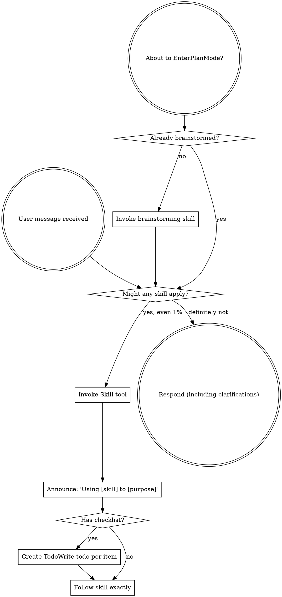

# Boundary Review — pair#146 (milestone M3)

| field | value |
|-------|-------|
| issue | 146 — couch: tty switching and attach |
| repo | pair |
| issue file | workshop/issues/000146-couch-tty-switching-and-attach.md |
| boundary | milestone M3 |
| milestone | M3 |
| window | 7b800e1960633def33f51b723233ae00faf593df..a14700d88c69b0f1d40a53ae4dc0e683beed7a07 |
| command | sdlc milestone-close --issue 146 --milestone M3 |
| reviewer | codex |
| timestamp | 2026-08-23T22:32:43-07:00 |
| verdict | REWORK |

## Review

Reading additional input from stdin...
OpenAI Codex v0.149.1
--------
workdir: /Users/xianxu/workspace/pair
model: gpt-5.6-sol
provider: openai
approval: never
sandbox: workspace-write [workdir, /tmp, $TMPDIR, /tmp] (network access enabled)
reasoning effort: medium
reasoning summaries: none
session id: 01a0323a-db7f-7673-ba73-e8b60105aa41
--------
user
# Code review — the one SDLC boundary review

You are conducting a fresh-context code review at a development boundary —
milestone M3 close — in the **pair** repository.

- repository: pair   (root: /Users/xianxu/workspace/pair)
- issue:      pair#146 M3   (file: workshop/issues/000146-couch-tty-switching-and-attach.md)
- window:     Base: 7b800e1960633def33f51b723233ae00faf593df   Head: a14700d88c69b0f1d40a53ae4dc0e683beed7a07

Review the **pair** repo and its tracker — the ariadne base-layer repo itself (changes here propagate to dependent repos). Do not assume any
other repository or apply another repo's conventions.

You have no prior session context — that is the anti-collusion property. Verify
behavior against the issue's documented Spec/Plan and the code itself; do NOT
take the implementor's word in commit messages or docs at face value. Tools are
read-only: report findings precisely; the main agent (which has session context)
applies the fixes, commits, and re-runs.

Read the diff against the issue's Spec + Plan, then work the checklist below.
Categorize every finding by severity — not everything is Critical; a nitpick
marked Critical is noise.

  Critical (must fix before crossing the boundary)
    - correctness bugs; crashes / panics on unexpected input
    - behavior drift from stated contracts (for ports of existing code where
      byte-faithfulness was promised, diff against the source)
    - silent error swallowing where the source raised
  Important (fix before the boundary if cheap)
    - API design of newly-introduced internal packages (downstream work will
      consume them; is the surface stable?)
    - missing test coverage that would catch the kind of bug shipped
    - inconsistent error handling across the diff
  Minor (note for future)
    - style nits, naming, comment density; performance only if hot-path

## Review checklist

Code quality
  - Clean separation of concerns; edge cases handled (empty / nil / unexpected).
  - Proper error handling — no silent swallowing where the source raised.
  - No duplicated logic / copy-paste that should be a shared helper.

Testing
  - Tests pin real logic, not mocks reasserting the implementation.
  - The kind of bug this diff could ship is covered.
  - PURE entities tested without IO; INTEGRATION via injected fakes (see below).

Requirements traceability
  - Every Plan checklist item this boundary claims is actually delivered.
  - Implementation matches the Spec; no undeclared scope creep.
  - Breaking changes documented.

Production readiness
  - Migration / backward-compatibility considered where state or formats change.
  - Docs / atlas updated for new surface (see the Docs update gate).

## Claimed fixes (ariadne#194)

For each prior finding this round disposes `addressed`, check the claim rather than the
commit message. A fix is complete only when a test FAILS WITHOUT IT.

  - Locate the test the fix is supposed to be pinned by. If there is none, the
    disposition is `not-addressed`, however plausible the diff looks.
  - Check the fix is reachable — a field set at zero call sites, an assertion nested in a
    runtime guard that never fires, a branch no fixture enters. These pass every test
    suite while doing nothing, and read as protection.
  - Where cheap, verify by reverting: undo the fix in a scratch copy and confirm the test
    goes red. A test written from the same mental model as the fix will happily assert
    whatever the fix happens to do, including nothing.

This check exists because the rule was written down and then violated by the very commit
that closed the findings which produced it. A reviewer that takes "fixed in <sha>" at face
value cannot catch that; one that looks for the failing test can.

## Core concepts cross-check (if the plan has a Core concepts table)

The plan should list entities in a greppable table — name, kind
(PURE/INTEGRATION), file location, status (new/modified/deleted). For each row:
  - Verify the entity exists at the stated path (grep the diff or filesystem).
  - PURE: tests run without IO (no exec, net, mutable fs). If tests need mocks
    to run, it isn't really PURE — flag Critical and recommend promoting it to
    INTEGRATION.
  - INTEGRATION: injected into pure callers, not invoked directly from business
    logic.
  - "modified" / "deleted": the diff shows the expected change/removal at the
    stated location.
Any contradiction between table and code = Critical finding, plus a plan-revision
recommendation (a "## Revisions" entry so the plan stops claiming what the code
doesn't deliver).

## Docs update gate (atlas + README, per AGENTS.md §8)

The boundary should update user-facing docs for any new surface introduced:

  - **atlas/** — new architectural surface, flow, or terminology. Scan the diff
    for new entity types, subcommands, conventions, file-tree locations. Any
    present without corresponding atlas/ changes in the same range = Important
    finding ("atlas update appears missing for <surface>").
  - **README.md** — new user-facing surface a reader runs or types: subcommands,
    flags, keybindings, config keys, install/usage steps. If the diff adds or
    changes such surface and README.md is not updated in the same range =
    Important finding ("README update appears missing for <surface>"). This is the
    class of gap that used to surface only at the merge-time `specs` judge (#142);
    catch it here, at the earliest gate, before the close verdict is recorded.

## Architecture (the at-review backstop — these matter most long-term)

Work through each of ARCH-DRY, ARCH-PURE, ARCH-PURPOSE, ARCH-MOCK explicitly, applying its at-review lens. The
full principle definitions are delivered in the ARCHITECTURE PRINCIPLES block
right after this prompt — for EACH marker, state pass or flag, and cite the
marker (e.g. ARCH-DRY) in any finding. Architecture is where review has the
least training signal and the longest-delayed payoff, so be deliberate here, not
holistic.

## Verdict + output

Begin your response with this fenced verdict block — the machine-read handoff:

```verdict
verdict: <SHIP | FIX-THEN-SHIP | REWORK>
confidence: <high | medium | low>
```

  SHIP           ready; ship it
  FIX-THEN-SHIP  ship after addressing the findings (non-blocking at the gate)
  REWORK         blocking; needs rework before shipping — fix + re-run

The fenced ```` ```verdict ```` block above is the **authoritative machine-read
handoff** — emit it as the first thing in your response. (A prose
`VERDICT: <TOKEN>` first line still satisfies the legacy contract as a fallback,
but the block is what the binary trusts.)

After the verdict block: a 1-paragraph summary — what worked, what blocks SHIP if
it isn't — followed by:
  1. Strengths: 2-5 specific things done well (file:line where useful). Affirm
     validated approaches so the operator knows what's confirmed-good ground.
     Empty acceptable for trivial boundaries.
  2. Critical findings (file:line + fix sketch); empty if none.
  3. Important findings (same format).
  4. Minor findings (terse one-liners).
  5. Test coverage notes.
  6. Architectural notes for upcoming work.
  7. Plan revision recommendations: specific "## Revisions" entries the plan
     needs (empty if the plan still matches the code).


ARCHITECTURE PRINCIPLES — work through each of the 4 entries below explicitly, applying its `at-review` lens; cite the marker (e.g. ARCH-DRY) in any finding.

# Architecture principles (ARCH-*)

Injected architectural taste — the structural decisions whose payoff (or cost)
shows up many turns, often months, down the road. Agents are strong at local
tactics and weak here, so these are checked **at-plan** (when the design is being
made — highest leverage) and **at-review** (backstop, on the diff). Cite the
marker (e.g. `ARCH-DRY`) in plans, `## Log` entries, and review findings.

This file is the single source; it is embedded into the planning, plan-quality,
and code-review prompts. The human narrative lives in AGENTS.md "Core Design
Principles"; this is its machine-delivered companion.

## ARCH-DRY — Don't Repeat Yourself

- **principle:** Reuse before adding. One source of truth per fact/behavior; no
  duplicated logic, copy-pasted blocks, or parallel functions that should be one
  shared helper.
- **at-plan:** Flag a plan that re-implements something the codebase already has,
  or that will obviously duplicate logic across the new files instead of
  extracting a shared helper. Name the existing thing it should reuse.
- **at-review:** Flag duplicated logic / copy-pasted blocks / near-identical
  functions in the diff; point at the consolidation (file:line + the shared
  helper they should become).

## ARCH-PURE — Pure core, thin IO shell

- **principle:** The majority of code is pure functions (deterministic, no side
  effects); a thin "glue" layer at the boundary touches IO/UI/network/clock. Pure
  functions are unit-tested directly; the glue is kept small and injected.
- **at-plan:** Flag a design that buries business logic inside IO/handlers, or
  that will only be testable with heavy mocks (a sign logic isn't separated from
  IO). The plan should name what's pure vs the thin IO seam.
- **at-review:** Flag business logic mixed with IO in the diff; logic that should
  be a pure function injected into a thin caller. If a test needs mocks to run a
  "pure" entity, it isn't pure — recommend extracting the IO to the boundary.

## ARCH-PURPOSE — Serve the issue's actual purpose

- **principle:** Deliver the issue's stated purpose, not the easy subset of it. A
  single-source / "compiled to consumers" change is not done until **every
  consumer derives** from the source — the source is *enforced*, not just
  documentation a surface happens to restate; a hand-maintained restatement of the
  model is a deferred consumer, not a finished one. "Follow-up" is for separable
  extensions, never for the thing that is the point. This is the *opposite axis*
  from Simplicity-First/YAGNI: not "build for an imagined future," but "don't
  **under**-deliver the purpose you already committed to."
  The same axis governs how a *finding* is answered: a finding names one
  instance; the deliverable is the CLASS it belongs to. Name the class, write
  the enumeration it implies, and sweep that enumeration in the SAME round —
  fixing only the site the finding named is the easy subset again. A gate
  ledger's `family:` slug names the class for you, and a family that repeats
  across rounds is the ledger reporting that the enumeration was never written.
- **at-plan:** Flag a plan whose scope is a strict subset of the issue's stated
  goal / Done-when where the part deferred as "follow-up" *is* the purpose (e.g.
  wires one consumer + enforcement but leaves the consumers that motivated the
  issue as documentation that doesn't derive). Ask: does the plan fulfill the
  purpose, or just the cheap win? Name the deferred purpose.
  Also flag a plan that answers a prior finding by fixing the instance it named
  when the class is enumerable — ask for the enumeration in the plan, and for the
  sweep in the same round rather than the round after.
- **at-review:** Does the diff *fulfill* the purpose or settle for the easy win?
  For a single-source change, run the **shadow-sweep** — enumerate the consumers,
  confirm each derives from the source, flag any remaining hand-maintained
  restatement of the model. A "follow-up" that is actually the deferred point of
  the issue is a finding, not a deferral. Likewise a fix that resolves the site a
  prior finding named while enumerable siblings of the same class remain in the
  tree: that is the instance, not the class, and it is a finding.

## ARCH-MOCK — Stateful external doubles

- **principle:** Every external binary or service dependency the system relies on
  has a stateful fake behind the same seam, modeling our current understanding of
  the dependency's behavior across calls. For libraries, services, and binaries we
  own, the storage/backend layer is backed by a portable folder of files and/or
  database configuration, so the component can be spun up without depending on
  production configuration or production databases. Integration and end-to-end
  tests run against the fake; scheduled/live conformance checks compare the
  fake's modeled behavior with the real binary or service so drift is detected
  and corrected.
- **at-plan:** Flag a design that shells out to, or calls, an external binary or
  service without naming the seam and stateful fake. For owned libraries, services,
  and binaries, also flag any design whose storage/backend depends on production
  configuration or databases instead of a portable file folder and/or database
  configuration. The plan should identify the dependency surface consumed, the
  fake's persisted state model, the owned component's portable backend shape,
  the integration or end-to-end tests that run against it, and the live
  conformance check cadence.
  Examples include `git`, GitHub/`gh`, and Google OAuth.
- **at-review:** Flag direct external calls outside the seam, stateless mocks for
  stateful interactions, tests that cannot run the stack against the fake, owned
  components that cannot boot from portable non-production storage/backend
  configuration, or a missing live conformance check for behavior we depend on. A
  fake satisfies this only when production flow and test flow share the same
  boundary.


## Prior rounds — dispose of these BEFORE raising anything new

This is the FIRST round of this gate at this boundary — there are no prior
findings to dispose of. Review the work on its merits.

Families already in play on this issue — REUSE one of these slugs when a
finding belongs to it, and coin a new slug only when it genuinely does not:

  docs-lag-the-surface                 4 new findings
  plan-table-drift                     4 new findings
  fix-not-pinned-by-failing-test       3 new findings
  probe-hygiene                        3 new findings
  dead-field-and-leaked-consumer       2 new findings
  fake-diverges-from-production        2 new findings
  needless-indirection                 2 new findings
  signal-goroutine-outlives-close      2 new findings
  stale-comment-reference              2 new findings
  uncovered-negative-assertion         2 new findings
  undelivered-plan-step                2 new findings
  chunking-invariance                  1 new finding
  derived-id-not-unique                1 new finding
  framing-omits-sequence-class         1 new finding
  guard-reads-wrong-stream-position    1 new finding
  latch-consumed-by-wrong-consumer     1 new finding
  prefix-parks-a-complete-key          1 new finding
  replay-duplicates-live-output        1 new finding
  seam-untested-on-the-real-side       1 new finding
  stale-build-target                   1 new finding
  swallowed-seam-error                 1 new finding
  test-harness-races                   1 new finding
  unrecoverable-silent-drop            1 new finding
  unsynchronised-shared-state          1 new finding

Each of these already has at least one finding, so a further one is a REPEAT.
If a finding you are about to raise belongs to one, say so explicitly and
change your recommendation:

  > **This is the 5th finding in family `docs-lag-the-surface`.** Earlier rounds fixed
  > instances. Do NOT fix this instance — state the rule that covers all of
  > them, and fix that. If the rule cannot be stated, say why and record the
  > family, with its measured prevalence, in the finding's own detail.
  > **This is the 5th finding in family `plan-table-drift`.** Earlier rounds fixed
  > instances. Do NOT fix this instance — state the rule that covers all of
  > them, and fix that. If the rule cannot be stated, say why and record the
  > family, with its measured prevalence, in the finding's own detail.
  > **This is the 4th finding in family `fix-not-pinned-by-failing-test`.** Earlier rounds fixed
  > instances. Do NOT fix this instance — state the rule that covers all of
  > them, and fix that. If the rule cannot be stated, say why and record the
  > family, with its measured prevalence, in the finding's own detail.
  > **This is the 4th finding in family `probe-hygiene`.** Earlier rounds fixed
  > instances. Do NOT fix this instance — state the rule that covers all of
  > them, and fix that. If the rule cannot be stated, say why and record the
  > family, with its measured prevalence, in the finding's own detail.
  > **This is the 3rd finding in family `dead-field-and-leaked-consumer`.** Earlier rounds fixed
  > instances. Do NOT fix this instance — state the rule that covers all of
  > them, and fix that. If the rule cannot be stated, say why and record the
  > family, with its measured prevalence, in the finding's own detail.
  > **This is the 3rd finding in family `fake-diverges-from-production`.** Earlier rounds fixed
  > instances. Do NOT fix this instance — state the rule that covers all of
  > them, and fix that. If the rule cannot be stated, say why and record the
  > family, with its measured prevalence, in the finding's own detail.
  > **This is the 3rd finding in family `needless-indirection`.** Earlier rounds fixed
  > instances. Do NOT fix this instance — state the rule that covers all of
  > them, and fix that. If the rule cannot be stated, say why and record the
  > family, with its measured prevalence, in the finding's own detail.
  > **This is the 3rd finding in family `signal-goroutine-outlives-close`.** Earlier rounds fixed
  > instances. Do NOT fix this instance — state the rule that covers all of
  > them, and fix that. If the rule cannot be stated, say why and record the
  > family, with its measured prevalence, in the finding's own detail.
  > **This is the 3rd finding in family `stale-comment-reference`.** Earlier rounds fixed
  > instances. Do NOT fix this instance — state the rule that covers all of
  > them, and fix that. If the rule cannot be stated, say why and record the
  > family, with its measured prevalence, in the finding's own detail.
  > **This is the 3rd finding in family `uncovered-negative-assertion`.** Earlier rounds fixed
  > instances. Do NOT fix this instance — state the rule that covers all of
  > them, and fix that. If the rule cannot be stated, say why and record the
  > family, with its measured prevalence, in the finding's own detail.
  > **This is the 3rd finding in family `undelivered-plan-step`.** Earlier rounds fixed
  > instances. Do NOT fix this instance — state the rule that covers all of
  > them, and fix that. If the rule cannot be stated, say why and record the
  > family, with its measured prevalence, in the finding's own detail.
  > **This is the 2nd finding in family `chunking-invariance`.** Earlier rounds fixed
  > instances. Do NOT fix this instance — state the rule that covers all of
  > them, and fix that. If the rule cannot be stated, say why and record the
  > family, with its measured prevalence, in the finding's own detail.
  > **This is the 2nd finding in family `derived-id-not-unique`.** Earlier rounds fixed
  > instances. Do NOT fix this instance — state the rule that covers all of
  > them, and fix that. If the rule cannot be stated, say why and record the
  > family, with its measured prevalence, in the finding's own detail.
  > **This is the 2nd finding in family `framing-omits-sequence-class`.** Earlier rounds fixed
  > instances. Do NOT fix this instance — state the rule that covers all of
  > them, and fix that. If the rule cannot be stated, say why and record the
  > family, with its measured prevalence, in the finding's own detail.
  > **This is the 2nd finding in family `guard-reads-wrong-stream-position`.** Earlier rounds fixed
  > instances. Do NOT fix this instance — state the rule that covers all of
  > them, and fix that. If the rule cannot be stated, say why and record the
  > family, with its measured prevalence, in the finding's own detail.
  > **This is the 2nd finding in family `latch-consumed-by-wrong-consumer`.** Earlier rounds fixed
  > instances. Do NOT fix this instance — state the rule that covers all of
  > them, and fix that. If the rule cannot be stated, say why and record the
  > family, with its measured prevalence, in the finding's own detail.
  > **This is the 2nd finding in family `prefix-parks-a-complete-key`.** Earlier rounds fixed
  > instances. Do NOT fix this instance — state the rule that covers all of
  > them, and fix that. If the rule cannot be stated, say why and record the
  > family, with its measured prevalence, in the finding's own detail.
  > **This is the 2nd finding in family `replay-duplicates-live-output`.** Earlier rounds fixed
  > instances. Do NOT fix this instance — state the rule that covers all of
  > them, and fix that. If the rule cannot be stated, say why and record the
  > family, with its measured prevalence, in the finding's own detail.
  > **This is the 2nd finding in family `seam-untested-on-the-real-side`.** Earlier rounds fixed
  > instances. Do NOT fix this instance — state the rule that covers all of
  > them, and fix that. If the rule cannot be stated, say why and record the
  > family, with its measured prevalence, in the finding's own detail.
  > **This is the 2nd finding in family `stale-build-target`.** Earlier rounds fixed
  > instances. Do NOT fix this instance — state the rule that covers all of
  > them, and fix that. If the rule cannot be stated, say why and record the
  > family, with its measured prevalence, in the finding's own detail.
  > **This is the 2nd finding in family `swallowed-seam-error`.** Earlier rounds fixed
  > instances. Do NOT fix this instance — state the rule that covers all of
  > them, and fix that. If the rule cannot be stated, say why and record the
  > family, with its measured prevalence, in the finding's own detail.
  > **This is the 2nd finding in family `test-harness-races`.** Earlier rounds fixed
  > instances. Do NOT fix this instance — state the rule that covers all of
  > them, and fix that. If the rule cannot be stated, say why and record the
  > family, with its measured prevalence, in the finding's own detail.
  > **This is the 2nd finding in family `unrecoverable-silent-drop`.** Earlier rounds fixed
  > instances. Do NOT fix this instance — state the rule that covers all of
  > them, and fix that. If the rule cannot be stated, say why and record the
  > family, with its measured prevalence, in the finding's own detail.
  > **This is the 2nd finding in family `unsynchronised-shared-state`.** Earlier rounds fixed
  > instances. Do NOT fix this instance — state the rule that covers all of
  > them, and fix that. If the rule cannot be stated, say why and record the
  > family, with its measured prevalence, in the finding's own detail.


Do NOT re-raise a finding listed as already disposed — not at the same severity,
and not at a lower one. If a disposed finding is genuinely still wrong, dispose it
`not-addressed` and say what remains, rather than raising it again under a new id.

Emit your findings as this fenced block — the machine-read handoff the
binary parses. `dispose:` first (every prior finding), then `findings:`
(anything newly raised). Use `id: new` for a new finding — the binary
assigns the stable id. Omit a key entirely when it has no entries.

```findings
dispose:
  - id: <a prior finding's id>
    disposition: <addressed | withdrawn | not-addressed>
    note: |
      <optional, one line>
findings:
  - id: new
    severity: <Critical | Important | Minor>
    family: <slug>
    title: |
      <one line>
    detail: |
      <a sentence or two, optional>
```

`family` is a short slug naming the underlying RULE a finding is an instance of,
not its symptom — `block-opener-rule`, not `bracket-depth-bug`. If the prior-round
block above lists families already in play, REUSE the matching slug verbatim;
coin a new one only when the finding genuinely belongs to no existing family.

Slug the RULE, because a symptom-slug will not match the next instance and the
escalation will silently fail to fire. Ask: "if this recurs in a different file
with different symptoms, would I still reach for this slug?" If not, it names the
symptom. `boundary-scope-strands-reads` survives that test; `family-counts-filtered`
does not — it describes one site, and the same rule broke a second read elsewhere.

Use the `|` block form for title, detail and note exactly as shown, and indent
their text by six spaces. In plain YAML a ` #` starts a comment, so an
unquoted `## Estimate` or `issue #187` would silently truncate your finding.

  Critical       must fix before the gate is crossed
  Important      fix before the gate if cheap; blocks until disposed
  Minor          note for the close review; never blocks a gate

  addressed      the plan changed to satisfy this finding
  withdrawn      the judge retracts it (mistaken, or overtaken by a design change)
  not-addressed  still open — the judge re-raises it this round

OUTPUT CONTRACT (machine-read — do not deviate). LEAD your response with the
fenced ```verdict block shown above — that is the authoritative handoff the binary
reads (its `verdict:` value is one of the listed tokens). Everything after the block
is advisory: a non-blocking verdict WITH findings still PASSES the gate. A bare
`VERDICT: <TOKEN>` line is accepted only as a FALLBACK when the block is absent.

Diff:
diff --git a/atlas/couch.md b/atlas/couch.md
index 47fa703..9082c65 100644
--- a/atlas/couch.md
+++ b/atlas/couch.md
@@ -6,7 +6,8 @@ is **not** an extension of `pair`. pair is what the operator sits inside, so a
 supervisor bug must not break the ability to fix it; the fallback is always to
 launch pair the old way.

-Project: `workshop/projects/couch.md`. Built in `pair#145`.
+Project: `workshop/projects/couch.md`. Registry/spawn shipped in `pair#145`;
+the console and switcher through the actor panel shipped in `pair#146` M1-M3.

 ## What exists today

@@ -19,9 +20,9 @@ are identical -- so any list in prose is a second copy that drifts. It already
 did: this file named six operations while seven shipped. Run `couch --help`,
 which renders the declared set.

-**couch hosts `pair` whole.** The stack is couch → pair → zellij → claude+nvim.
-couch spawns `pair --layout2` and hands it couch's own stdio, so `couch start`
-blocks for the child's lifetime. Verified by operator smoke on 2026-08-21; the
+**couch hosts `pair` whole.** The stack is couch → pair → zellij → agent+nvim.
+couch starts `pair resume <tag> --layout2` inside a child pty and owns the
+operator tty until the console exits. Verified by operator smoke; the
 alternative (couch absorbing zellij's role) was considered and rejected because
 the agent child is never spawned by Go — zellij spawns it from a KDL layout, and
 `entrypoint.ValidRootMarkers` *defines* a valid pair install as having those
@@ -95,6 +96,23 @@ because a concatenated buffer cannot say which child the tail belongs to. It
 suspends inside a bracketed paste: a pasted NUL that switched actors and ate a
 byte would be untraceable data loss.

+The focus ladder is deliberately small: a non-root child goes to the root
+actor, the root actor goes to couch's panel, and the panel stays put. Liveness
+is consulted before going home so a dead root cannot become a frozen landing.
+
+The panel is couch's own screen. It owns input while visible, suppresses
+background-child painting, and supports arrows + Enter, digits 1-9, Escape,
+typeahead, and the declared start/stop/name/describe operations. Every action
+dispatches through `couchcore.Operations()`; `start`'s returned `StartResult` is
+load-bearing because the console consumes it to attach the new terminal child.
+
+A panel row carries two identities that must not be conflated: the canonical
+worktree feeds the shared human resolver, while the console-local child id is
+the deterministic switch and bell target. `Couch.LookupTrees` is the one match
+rule for the panel, CLI and future advisor; it searches the displayed repo-name
+fallback, operator name/description, and agent-published description. This is
+why a row displayed as `pair` is findable by typing `pair`.
+
 ## Spawning: `pair resume <tag> --layout2`

 The tag derives from the worktree root, so re-entry is deterministic and a
@@ -191,6 +209,6 @@ not fidelity to Erlang.

 ## Planned, not built

-`pair#146` tty switching · `pair#147` cluster transport and queries ·
+`pair#146` M4 exits/detach/notices · `pair#147` cluster transport and queries ·
 `pair#148` brain as advisor. Cross-repo enablers: `ariadne#199` (exposed query
 API), `ariadne#200` (fleet inventory).
diff --git a/cmd/internal/couchcmd/run.go b/cmd/internal/couchcmd/run.go
index eb54c4b..54ce554 100644
--- a/cmd/internal/couchcmd/run.go
+++ b/cmd/internal/couchcmd/run.go
@@ -151,7 +151,7 @@ func RunWithRuntime(args []string, stdin io.Reader, stdout, stderr io.Writer, rt
	}
	if console != nil {
		if start, ok := result.(couchcore.StartResult); ok {
-			return runConsole(console, start, stdout)
+			return runConsole(console, c, start, stdout)
		}
	}
	return render(stdout, op, result)
@@ -212,7 +212,13 @@ func consoleRunnerFor(name string, args map[string]string, stdin io.Reader, hasT
 // runConsole attaches the spawned child and hands the terminal over. This
 // displaces render's StartResult branch, which printed a line and then blocked
 // on Handle.Wait for the child's lifetime.
-func runConsole(console *couchtty.Console, start couchcore.StartResult, stdout io.Writer) int {
+func runConsole(console *couchtty.Console, c *couchcore.Couch, start couchcore.StartResult, stdout io.Writer) int {
+	// Wire the panel's match rule HERE, on the path that actually runs a
+	// console -- not at a call site a test can bypass. An injection seam
+	// nothing passes is a seam that does nothing (Decision 12's wiring check),
+	// and the panel would silently degrade to "show everything".
+	wireResolver(console, c)
+
	th, ok := start.Handle.(couchcore.TerminalHandle)
	if !ok {
		// A runner that cannot offer a terminal: fall back rather than crash.
@@ -223,10 +229,31 @@ func runConsole(console *couchtty.Console, start couchcore.StartResult, stdout i
		return 1
	}
	label := start.Record.Args.Worktree.Repo()
-	console.Attach(start.Handle.ID(), label, th.Terminal())
+	console.AttachTree(start.Handle.ID(), start.Record.Args.Worktree, label, th.Terminal())
	return console.Run()
 }

+// wireResolver gives the panel couch's OWN match rule.
+//
+// Without this the injection seam exists and nothing uses it, which is the
+// failure mode Decision 12's wiring check names: the panel would silently fall
+// back to "show everything" and typeahead would do nothing.
+func wireResolver(console *couchtty.Console, c *couchcore.Couch) {
+	console.SetResolver(c.LookupTrees)
+
+	// The panel's actions run through the SAME declared table the CLI
+	// dispatches: the console names an operation and couchcore performs it, so
+	// there is no operator action the advisor cannot also perform (#148's
+	// design test) and no way for the panel to grow a private verb.
+	console.SetOps(func(name string, args map[string]string) (any, error) {
+		op, ok := Resolve(name)
+		if !ok {
+			return nil, fmt.Errorf("unknown operation %q", name)
+		}
+		return op.Invoke(c, args)
+	})
+}
+
 // bindArgs maps positional argv onto the operation's declared ArgSpecs, plus
 // --flag=value form for the optional ones.
 func bindArgs(op couchcore.Operation, argv []string) (map[string]string, error) {
@@ -362,14 +389,21 @@ func renderError(w io.Writer, err error) {
		fmt.Fprintf(w, "  %s (pid %d)\n", a.ID, a.PID)
	}
	fmt.Fprintf(w, "They would share a branch and index.\n")
-	switch occ.Mode {
-	case couchcore.WorktreeParallel:
-		fmt.Fprintf(w, "  -> new worktree (cheap here), or switch to it, or --same-tree\n")
-	case couchcore.HeavyLocalState:
-		fmt.Fprintf(w, "  -> switch to it, or --same-tree (worktrees are expensive in this repo)\n")
-	default:
-		fmt.Fprintf(w, "  -> switch to it, or --same-tree (this repo runs one agent at a time)\n")
+
+	// Offer COMMANDS, not intentions.
+	//
+	// This used to say "switch to it", which names a remedy couch has no verb
+	// for: attaching to a session hosted by another couch process needs the
+	// transport in pair#147. An operator who follows unactionable advice ends up
+	// reaching for --same-tree, which is the one option that bypasses the guard.
+	// A refusal is a next-action spec.
+	ref := occ.Tree.Repo()
+	fmt.Fprintf(w, "  -> couch stop %s        end it, then start again\n", ref)
+	fmt.Fprintf(w, "  -> couch start %s --same-tree   run a second agent anyway (recorded)\n", ref)
+	if occ.Mode == couchcore.WorktreeParallel {
+		fmt.Fprintf(w, "  -> or start in a new worktree, which is cheap in this repo\n")
	}
+	fmt.Fprintf(w, "  (attaching to a session another couch is hosting needs pair#147)\n")
 }

 func usage(w io.Writer, table map[string]couchcore.Operation) {
diff --git a/cmd/internal/couchcmd/run_test.go b/cmd/internal/couchcmd/run_test.go
index b81eeea..effbb7f 100644
--- a/cmd/internal/couchcmd/run_test.go
+++ b/cmd/internal/couchcmd/run_test.go
@@ -465,3 +465,125 @@ func TestConsoleRunnerDeclinesWithoutATerminalWiring(t *testing.T) {
		t.Fatalf("runner = %T, want couchcore.ExecRunner", runner)
	}
 }
+
+// The panel's resolver must be couch's own rule, not left nil.
+//
+// Decision 12's wiring check: an injection seam nothing passes is a seam that
+// does nothing, and the panel would silently degrade to "show everything" with
+// typeahead inert. Asserting the FUNCTION IDENTITY is the only way to catch
+// that, since a nil resolver still renders a panel.
+func TestConsoleGetsCouchsOwnResolver(t *testing.T) {
+	rt := newRT(t, "/repo")
+	c, err := rt.NewCouch()
+	if err != nil {
+		t.Fatalf("NewCouch: %v", err)
+	}
+	console, _ := consoleRunnerFor("start", map[string]string{}, strings.NewReader(""), true, nil, nil)
+	if console == nil {
+		t.Fatal("no console to wire")
+	}
+	if console.Resolver() != nil {
+		t.Fatal("a resolver was set before the run path; this test would prove nothing")
+	}
+
+	// Drive the REAL path. The child has already exited, so Run returns at once
+	// instead of blocking -- which is what AutoExit models.
+	rec, h, err := c.Spawn(couchcore.StartArgs{Cwd: "/repo"})
+	if err != nil {
+		t.Fatalf("Spawn: %v", err)
+	}
+	runConsole(console, c, couchcore.StartResult{Record: rec, Handle: h}, &bytes.Buffer{})
+
+	if console.Resolver() == nil {
+		t.Fatal("the run path left the panel's resolver nil — typeahead would be inert")
+	}
+	if got := console.Resolver()("anything"); len(got) != 0 {
+		t.Fatalf("resolver returned %v for an empty registry", got)
+	}
+}
+
+// The panel's action dispatcher must be wired on the run path, not left nil --
+// the first cut declared four panel actions with nothing behind them, so the
+// operator could not start a second child at all.
+func TestConsoleGetsAnActionDispatcher(t *testing.T) {
+	rt := newRT(t, "/repo")
+	c, err := rt.NewCouch()
+	if err != nil {
+		t.Fatalf("NewCouch: %v", err)
+	}
+	console, _ := consoleRunnerFor("start", map[string]string{}, strings.NewReader(""), true, nil, nil)
+	if console == nil {
+		t.Fatal("no console to wire")
+	}
+	if console.Ops() != nil {
+		t.Fatal("a dispatcher was set before the run path; this test would prove nothing")
+	}
+
+	rec, h, err := c.Spawn(couchcore.StartArgs{Cwd: "/repo"})
+	if err != nil {
+		t.Fatalf("Spawn: %v", err)
+	}
+	runConsole(console, c, couchcore.StartResult{Record: rec, Handle: h}, &bytes.Buffer{})
+
+	ops := console.Ops()
+	if ops == nil {
+		t.Fatal("the run path left the panel's dispatcher nil — its actions would refuse")
+	}
+	// It must reach couch's own table: an unknown name is refused rather than
+	// silently succeeding.
+	if _, err := ops("no-such-operation", nil); err == nil {
+		t.Fatal("the dispatcher accepted an operation couch does not declare")
+	}
+	// And a real one is accepted.
+	if _, err := ops("list", nil); err != nil {
+		t.Fatalf("list through the panel dispatcher: %v", err)
+	}
+}
+
+// A refusal is a next-action spec: every remedy it names must be a command the
+// operator can run.
+//
+// It used to say "switch to it", which couch has no verb for -- attaching to a
+// session another couch process hosts needs pair#147's transport. Advice that
+// cannot be followed pushes the operator to --same-tree, the one option that
+// bypasses the guard.
+func TestTreeOccupiedRefusalNamesRunnableCommands(t *testing.T) {
+	rt := newRT(t, "/repo")
+	if _, errw, code := runRT(rt, "start", "/repo"); code != 0 {
+		t.Fatalf("first start failed: %d %q", code, errw)
+	}
+	rt.markLive(t) // the guard needs a live incumbent to refuse for
+	_, errw, code := runRT(rt, "start", "/repo")
+	if code == 0 {
+		t.Fatal("a second start on an occupied tree was allowed")
+	}
+
+	if strings.Contains(errw, "switch to it") {
+		t.Errorf("the refusal still offers an action couch cannot perform: %q", errw)
+	}
+	// Every `couch <verb>` it suggests must be a declared operation.
+	declared := map[string]bool{}
+	for _, n := range couchcore.OperationNames() {
+		declared[n] = true
+	}
+	// Only the SUGGESTION lines (`  -> couch <verb> ...`) are commands; the
+	// rest is prose and may legitimately mention couch.
+	found := 0
+	for _, line := range strings.Split(errw, "\n") {
+		line = strings.TrimSpace(line)
+		if !strings.HasPrefix(line, "-> couch ") {
+			continue
+		}
+		fields := strings.Fields(strings.TrimPrefix(line, "-> couch "))
+		if len(fields) == 0 {
+			continue
+		}
+		found++
+		if !declared[fields[0]] {
+			t.Errorf("the refusal suggests `couch %s`, which is not a declared operation", fields[0])
+		}
+	}
+	if found == 0 {
+		t.Errorf("the refusal names no runnable command at all: %q", errw)
+	}
+}
diff --git a/cmd/internal/couchcore/couch.go b/cmd/internal/couchcore/couch.go
index 9b3b7e7..f39a7bb 100644
--- a/cmd/internal/couchcore/couch.go
+++ b/cmd/internal/couchcore/couch.go
@@ -229,10 +229,11 @@ func (c *Couch) knownTrees() []Worktree {

 // LookupTrees resolves a fuzzy human reference to every tree it could mean.
 //
-// It matches the operator's name, the operator's typed description, AND the
-// agent's own published line. All three answer "what is this thread called",
-// so all three derive from one lookup -- displaying the agent's description
-// while resolving only the operator's delivers half the behaviour.
+// It matches the repo basename rendered as an unnamed tree's fallback label,
+// the operator's name and typed description, AND the agent's own published
+// line. All four answer "what is this thread called", so all four derive from
+// one lookup -- displaying a label while making it unsearchable delivers half
+// the behaviour.
 func (c *Couch) LookupTrees(ref string) []Worktree {
	needle := strings.ToLower(strings.TrimSpace(ref))
	if needle == "" {
@@ -250,7 +251,8 @@ func (c *Couch) LookupTrees(ref string) []Worktree {
		if seen[w.Key()] {
			continue
		}
-		if strings.Contains(strings.ToLower(c.Describe(w)), needle) {
+		if strings.Contains(strings.ToLower(w.Repo()), needle) ||
+			strings.Contains(strings.ToLower(c.Describe(w)), needle) {
			seen[w.Key()] = true
			out = append(out, w)
		}
diff --git a/cmd/internal/couchcore/couch_test.go b/cmd/internal/couchcore/couch_test.go
index dcce543..ee22733 100644
--- a/cmd/internal/couchcore/couch_test.go
+++ b/cmd/internal/couchcore/couch_test.go
@@ -176,6 +176,19 @@ func TestResolveRefFindsActorsByOperatorName(t *testing.T) {
	}
 }

+// The panel renders Worktree.Repo() when a tree has no explicit name. A label
+// that is visible but cannot be typed back into the shared resolver makes
+// typeahead lie: it shows "pair" and returns no match for "pair".
+func TestLookupTreesMatchesTheDisplayedRepoFallback(t *testing.T) {
+	env := newTestEnv(t, "/w/pair")
+	env.spawn(t, StartArgs{Worktree: "/w/pair"})
+
+	got := env.Couch.LookupTrees("pair")
+	if len(got) != 1 || got[0] != "/w/pair" {
+		t.Fatalf("LookupTrees(pair) = %v, want [/w/pair]", got)
+	}
+}
+
 func TestNameAndDescriptionChangeMidSession(t *testing.T) {
	env := newTestEnv(t, "/repo")
	env.spawn(t, StartArgs{Worktree: "/repo"})
diff --git a/cmd/internal/couchtty/console.go b/cmd/internal/couchtty/console.go
index 375360c..de4a39d 100644
--- a/cmd/internal/couchtty/console.go
+++ b/cmd/internal/couchtty/console.go
@@ -6,6 +6,7 @@ import (
	"os"
	"sync"

+	"github.com/xianxu/pair/cmd/internal/couchcore"
	"github.com/xianxu/pair/cmd/internal/hostty"
	"github.com/xianxu/pair/cmd/internal/ptychild"
 )
@@ -17,7 +18,9 @@ type chunk struct {
 }

 type pane struct {
+	tree  couchcore.Worktree
	label string
+	desc  string
	child *ptychild.Child

	// bell is sticky until the operator looks at this actor. The row's job is
@@ -48,6 +51,42 @@ type Console struct {
	panes  map[string]*pane
	order  []string
	active string
+
+	// root is the actor `ctrl-space` goes home to: the FIRST child attached,
+	// which is "whatever session couch launched in" delivered by convention
+	// (Decision 1). Nothing here knows what brain is.
+	root string
+
+	// focus is what the terminal is pointed at. It is not the same as `active`:
+	// the panel is a focus with no actor behind it.
+	focus Focus
+
+	// query is the panel's typeahead buffer, and resolve is the match rule --
+	// INJECTED rather than implemented, so the panel resolves exactly what the
+	// CLI and #148's advisor resolve (Decision 12). Nil degrades to showing
+	// everything rather than to a private match rule.
+	query   string
+	resolve func(string) []couchcore.Worktree
+
+	// panel is live state, not rebuilt per keystroke: the highlight has to
+	// survive typing, or the cursor resets under the operator's fingers.
+	panel *PanelModel
+
+	// prompt is non-empty while the panel is collecting an argument for an
+	// action -- a path for `start`, say. Actions that need input cannot be a
+	// single keystroke.
+	prompt      string
+	promptLabel string
+	promptArg   string
+	promptFn    func(string)
+
+	// panelHeld carries a partial escape sequence across reads.
+	panelHeld []byte
+
+	// Ops dispatches an operator action. Injected so the console never learns
+	// what an operation IS -- it names one and couchcore runs it, which is
+	// what keeps the panel from growing a private verb (#148's design test).
+	ops    func(name string, args map[string]string) (any, error)
	notice string
	size   ptychild.Size

@@ -74,11 +113,13 @@ type Console struct {
	// the writer singular removes the class rather than the two instances:
	// there is no longer a way to reach the screen except through the loop that
	// tracks where the stream is.
-	chunks  chan chunk
-	resized chan struct{}
-	hotkeys chan struct{}
-	stop    chan struct{}
-	once    sync.Once
+	chunks    chan chunk
+	resized   chan struct{}
+	hotkeys   chan struct{}
+	switching chan string
+	panelKeys chan []byte
+	stop      chan struct{}
+	once      sync.Once
 }

 // errw is where the console reports its own failures. Separate from the host
@@ -92,13 +133,15 @@ func (c *Console) errw() io.Writer {

 func New(host hostty.Host, stdin io.Reader) *Console {
	c := &Console{
-		host:    host,
-		stdin:   stdin,
-		panes:   map[string]*pane{},
-		chunks:  make(chan chunk, 256),
-		resized: make(chan struct{}, 1),
-		hotkeys: make(chan struct{}, 8),
-		stop:    make(chan struct{}),
+		host:      host,
+		stdin:     stdin,
+		panes:     map[string]*pane{},
+		chunks:    make(chan chunk, 256),
+		resized:   make(chan struct{}, 1),
+		switching: make(chan string, 8),
+		panelKeys: make(chan []byte, 64),
+		hotkeys:   make(chan struct{}, 8),
+		stop:      make(chan struct{}),
	}
	if s, err := host.Size(); err == nil {
		c.size = s
@@ -106,6 +149,40 @@ func New(host hostty.Host, stdin io.Reader) *Console {
	return c
 }

+// SetOps injects the action dispatcher: `couchcmd` passes one that runs
+// couchcore.Operations(). Without it the panel can still switch -- which is
+// read-only -- but its actions refuse loudly rather than doing nothing.
+func (c *Console) SetOps(f func(string, map[string]string) (any, error)) {
+	c.mu.Lock()
+	defer c.mu.Unlock()
+	c.ops = f
+}
+
+// Ops returns the injected dispatcher, so a wiring test can assert one was
+// passed -- the panel renders identically without it.
+func (c *Console) Ops() func(string, map[string]string) (any, error) {
+	c.mu.Lock()
+	defer c.mu.Unlock()
+	return c.ops
+}
+
+// SetResolver injects the panel's match rule. Production passes
+// `couch.LookupTrees`; without it the seam is one nothing uses.
+func (c *Console) SetResolver(f func(string) []couchcore.Worktree) {
+	c.mu.Lock()
+	defer c.mu.Unlock()
+	c.resolve = f
+}
+
+// Resolver returns the injected match rule, so a wiring test can assert one was
+// actually passed -- a nil resolver still renders a panel, so nothing else
+// would notice.
+func (c *Console) Resolver() func(string) []couchcore.Worktree {
+	c.mu.Lock()
+	defer c.mu.Unlock()
+	return c.resolve
+}
+
 // SetErrorWriter redirects the console's own diagnostics, so a test can read
 // them instead of the process's stderr.
 func (c *Console) SetErrorWriter(w io.Writer) { c.stderr = w }
@@ -139,15 +216,24 @@ func (c *Console) Deliver(id string, data []byte) {
	}
 }

-// Attach registers a child. The first one attached is the active one -- and in
-// M2 the only one.
+// Attach registers a child using its actor id as a synthetic tree. It remains
+// as a test/helper convenience; production must call AttachTree so typeahead
+// resolves against the real worktree identity.
 func (c *Console) Attach(id, label string, child *ptychild.Child) {
+	c.AttachTree(id, couchcore.Worktree(id), label, child)
+}
+
+// AttachTree registers a child with both identities the panel needs: worktree
+// for human resolution, actor id for deterministic switching.
+func (c *Console) AttachTree(id string, tree couchcore.Worktree, label string, child *ptychild.Child) {
	c.mu.Lock()
	defer c.mu.Unlock()
-	c.panes[id] = &pane{label: label, child: child}
+	c.panes[id] = &pane{tree: tree, label: label, child: child}
	c.order = append(c.order, id)
	if c.active == "" {
		c.active = id
+		c.root = id
+		c.focus = FocusActor(id)
	}
 }

@@ -163,6 +249,56 @@ func (c *Console) PaneRowDirty(id string) bool {
	return false
 }

+// Switch points the operator's terminal at another hosted actor.
+//
+// A request, not an action: it lands on the Run goroutine, which is the only
+// one allowed to write to the host. Callers may be the panel, the hotkey path,
+// or (in #148) the advisor's tool layer -- none of them get to touch the screen
+// directly.
+func (c *Console) Switch(id string) {
+	select {
+	case c.switching <- id:
+	case <-c.stop:
+	}
+}
+
+// onSwitch lands the operator on another child, running on the Run goroutine.
+//
+// Order is the whole contract: clear, replay the child's own screen, THEN the
+// status row. Painting the row first means the landing paints over it.
+func (c *Console) onSwitch(id string) { c.switchTo(id, false) }
+
+// forceSwitch repaints even when the actor is already active -- which is the
+// case when returning from the panel, where the SCREEN changed but the active
+// actor did not.
+func (c *Console) forceSwitch(id string) { c.switchTo(id, true) }
+
+func (c *Console) switchTo(id string, force bool) {
+	c.mu.Lock()
+	p, known := c.panes[id]
+	already := c.active == id && !force
+	if known {
+		c.active = id
+		c.focus = FocusActor(id)
+		// Landing on an actor is looking at it: whatever it wanted is now the
+		// operator's problem rather than a pending flag.
+		p.bell = false
+		p.rowDirty = false
+	}
+	c.mu.Unlock()
+	if !known || already {
+		// An unknown actor is not a reason to blank the operator's screen.
+		return
+	}
+
+	// The replay is Replay(), not Snapshot(): a raw one still carries whatever
+	// capability queries the child emitted at startup, and re-asking the host
+	// terminal lands the ANSWER in the newly active child's stdin -- #127's bug
+	// arriving at a new site.
+	c.takeOverScreen(p.child.Replay())
+	c.paintNow()
+}
+
 // Stop tears the console down. Safe to call more than once, and from any
 // goroutine.
 func (c *Console) Stop() { c.once.Do(func() { close(c.stop) }) }
@@ -201,6 +337,10 @@ func (c *Console) Run() int {
			c.onResize()
		case <-c.hotkeys:
			c.onHotkey()
+		case id := <-c.switching:
+			c.onSwitch(id)
+		case raw := <-c.panelKeys:
+			c.onPanelInput(raw)
		case code := <-exited:
			return code
		case <-c.stop:
@@ -276,6 +416,27 @@ func (c *Console) writeChild(p []byte) {
	_, _ = c.host.Write(p)
 }

+// takeOverScreen replaces what is on the screen wholesale -- a switch landing,
+// or the panel opening.
+//
+// Distinct from writeOwn on purpose. An interleaved paint must WAIT for a
+// sequence boundary because it is inserted into a stream that continues; a
+// takeover ENDS that stream's relevance, so waiting would strand the operator
+// on the previous child's screen. It resets the framing state for the same
+// reason: whatever partial sequence the old child left is no longer on screen
+// to be corrupted.
+//
+// It is still Run-goroutine-only, like every other writer.
+func (c *Console) takeOverScreen(body []byte) {
+	c.mu.Lock()
+	c.hostScan = ptychild.Screen{}
+	c.paintPending = false
+	c.mu.Unlock()
+
+	_, _ = io.WriteString(c.host, hostty.HomeAndClear)
+	_, _ = c.host.Write(body)
+}
+
 // writeOwn emits the console's OWN bytes, and is the only way they reach the
 // screen. It refuses while the child's stream is mid-sequence and records the
 // debt; the next chunk that lands on a boundary pays it.
@@ -318,7 +479,10 @@ func (c *Console) paintNow() {
 func (c *Console) onChunk(ch chunk) {
	c.mu.Lock()
	p, known := c.panes[ch.id]
-	isActive := ch.id == c.active
+	// "Active" means the operator is looking at this child. With the panel up
+	// nobody is, so a child that keeps streaming must not paint over couch's
+	// own screen.
+	isActive := ch.id == c.active && !c.focus.IsPanel()
	c.mu.Unlock()
	if !known {
		return
@@ -408,7 +572,20 @@ func (c *Console) pumpStdin() {
			for {
				before, hit, rest := it.Feed(in)
				if len(before) > 0 {
-					if child := c.activeChild(); child != nil {
+					c.mu.Lock()
+					toPanel := c.focus.IsPanel()
+					c.mu.Unlock()
+					if toPanel {
+						// The panel owns the keyboard while it is up, or a
+						// child would act on keys aimed at couch. Raw bytes:
+						// DECODING happens on the Run goroutine, which is
+						// where the carried partial sequence lives.
+						select {
+						case c.panelKeys <- append([]byte(nil), before...):
+						case <-c.stop:
+							return
+						}
+					} else if child := c.activeChild(); child != nil {
						_, _ = child.Write(before)
					}
				}
@@ -434,15 +611,315 @@ func (c *Console) pumpStdin() {
	}
 }

-// onHotkey handles ctrl-space.
+// onHotkey handles ctrl-space: up one level.
 //
-// M2 has one child and no panel, so "up one level" has nowhere to go and the
-// row says so. M3 replaces this with the focus model -- the point of doing it
-// here is that the INTERCEPTION is proven end to end before there is anywhere
-// to land.
+// Runs on the Run goroutine. Liveness is passed to Up rather than assumed --
+// landing on a dead root actor gives the operator a frozen screen with no way
+// to tell it is frozen.
 func (c *Console) onHotkey() {
	c.mu.Lock()
-	c.notice = "ctrl-space: no other actors yet"
+	cur, root := c.focus, c.root
+	c.mu.Unlock()
+
+	next := Up(cur, root, c.actorAlive)
+	if next == cur {
+		return // already at the top
+	}
+
+	c.mu.Lock()
+	c.focus = next
+	c.mu.Unlock()
+
+	if next.IsPanel() {
+		c.showPanel()
+		return
+	}
+	c.onSwitch(next.Actor())
+}
+
+// actorAlive is the liveness predicate Up consults.
+func (c *Console) actorAlive(id string) bool {
+	c.mu.Lock()
+	defer c.mu.Unlock()
+	p, ok := c.panes[id]
+	return ok && !p.child.Done()
+}
+
+// rebuildPanel refreshes the panel's ROWS from what the console is hosting,
+// preserving the cursor. Called when the panel opens and when the fleet
+// changes -- not on every keystroke, or the highlight would reset as the
+// operator types.
+func (c *Console) rebuildPanel() {
+	c.mu.Lock()
+	rows := make([]PanelRow, 0, len(c.order))
+	for _, id := range c.order {
+		p := c.panes[id]
+		rows = append(rows, PanelRow{
+			Target: id, Tree: p.tree, Label: p.label, Desc: p.desc, Live: !p.child.Done(),
+		})
+	}
+	bells := map[string]bool{}
+	for id, p := range c.panes {
+		bells[id] = p.bell
+	}
+	cursor := 0
+	if c.panel != nil {
+		cursor = c.panel.Cursor()
+	}
+	m := &PanelModel{all: rows, shown: rows}
+	for i := range m.all {
+		m.all[i].Bell = bells[m.all[i].Target]
+	}
+	m.shown = m.all
+	m.cursor = cursor
+	m.clampCursor()
+	c.panel = m
+	c.mu.Unlock()
+}
+
+// showPanel draws couch's own screen.
+func (c *Console) showPanel() {
+	c.mu.Lock()
+	if c.panel == nil {
+		c.mu.Unlock()
+		c.rebuildPanel()
+		c.mu.Lock()
+	}
+	m, query, resolve, prompt := c.panel, c.query, c.resolve, c.prompt
+	c.mu.Unlock()
+
+	rows := m.Filter(query, resolve)
+	body := RenderPanelWithQuery(query, rows, m.Cursor())
+	if prompt != "" {
+		body += "\r\n  " + prompt + "\r\n"
+	}
+	c.takeOverScreen([]byte(body))
+	c.paintNow()
+}
+
+// onPanelInput decodes a chunk of operator input into keystrokes.
+//
+// The carried partial lives here, on the Run goroutine, so a sequence split
+// across reads is framed rather than decaying into typed runes -- which is how
+// a mouse move filled the filter with `[<;0;M`.
+func (c *Console) onPanelInput(raw []byte) {
+	buf := raw
+	if len(c.panelHeld) > 0 {
+		buf = append(c.panelHeld, raw...)
+		c.panelHeld = nil
+	}
+	keys, held := DecodePanelKeys(buf)
+	c.panelHeld = held
+	for _, k := range keys {
+		c.onPanelKey(k)
+	}
+	if len(keys) == 0 {
+		// Nothing actionable arrived (a mouse report, say). Redraw anyway so a
+		// notice set elsewhere still lands.
+		c.showPanel()
+	}
+}
+
+// onPanelKey handles one decoded keystroke while the panel is up.
+func (c *Console) onPanelKey(k PanelKey) {
+	c.mu.Lock()
+	prompting := c.promptFn != nil
+	c.mu.Unlock()
+	if prompting {
+		c.onPromptKey(k)
+		return
+	}
+
+	switch k.Kind {
+	case KeyUp, KeyDown:
+		delta := -1
+		if k.Kind == KeyDown {
+			delta = 1
+		}
+		c.mu.Lock()
+		if c.panel != nil {
+			c.panel.Move(delta)
+		}
+		c.mu.Unlock()
+	case KeyEscape:
+		// Escape backs OUT: it clears a filter if there is one, otherwise it
+		// returns to the actor. A panel with no way back is a trap, which is
+		// what the first cut shipped.
+		c.mu.Lock()
+		hadQuery := c.query != ""
+		c.query = ""
+		c.mu.Unlock()
+		if !hadQuery {
+			c.returnToActor()
+			return
+		}
+	case KeyEnter:
+		if row, ok := c.selectedRow(); ok {
+			c.clearQuery()
+			c.onSwitch(row.Target)
+			return
+		}
+	case KeyRune:
+		switch {
+		case k.Rune >= '1' && k.Rune <= '9':
+			// A DIRECT jump: no resolution, no model turn. Only when nothing
+			// is typed -- otherwise a digit is part of the filter.
+			c.mu.Lock()
+			typing := c.query != ""
+			m := c.panel
+			c.mu.Unlock()
+			if !typing && m != nil {
+				if row, ok := m.Pick(int(k.Rune - '0')); ok {
+					c.onSwitch(row.Target)
+					return
+				}
+			}
+			c.appendQuery(k.Rune)
+		case k.Rune == 's' && c.queryEmpty():
+			c.startPrompt("start in path: ", func(path string) {
+				c.runOp("start", map[string]string{"path": path})
+			})
+		case k.Rune == 'x' && c.queryEmpty():
+			if row, ok := c.selectedRow(); ok {
+				c.runOp("stop", map[string]string{"ref": string(row.Tree)})
+			}
+		case k.Rune == 'n' && c.queryEmpty():
+			if row, ok := c.selectedRow(); ok {
+				ref := string(row.Tree)
+				c.startPrompt("name: ", func(name string) {
+					c.runOp("name", map[string]string{"ref": ref, "name": name})
+				})
+			}
+		case k.Rune == 'd' && c.queryEmpty():
+			if row, ok := c.selectedRow(); ok {
+				ref := string(row.Tree)
+				c.startPrompt("describe: ", func(desc string) {
+					c.runOp("describe", map[string]string{"ref": ref, "description": desc})
+				})
+			}
+		default:
+			c.appendQuery(k.Rune)
+		}
+	case KeyBackspace:
+		c.mu.Lock()
+		if n := len(c.query); n > 0 {
+			c.query = c.query[:n-1]
+		}
+		c.mu.Unlock()
+	}
+	c.showPanel()
+}
+
+// onPromptKey collects an action's argument.
+func (c *Console) onPromptKey(k PanelKey) {
+	switch k.Kind {
+	case KeyEscape:
+		c.mu.Lock()
+		c.prompt, c.promptFn = "", nil
+		c.mu.Unlock()
+	case KeyEnter:
+		c.mu.Lock()
+		fn, text := c.promptFn, c.promptArg
+		c.prompt, c.promptFn, c.promptArg = "", nil, ""
+		c.mu.Unlock()
+		if fn != nil {
+			fn(text)
+		}
+	case KeyBackspace:
+		c.mu.Lock()
+		if n := len(c.promptArg); n > 0 {
+			c.promptArg = c.promptArg[:n-1]
+		}
+		c.prompt = c.promptLabel + c.promptArg
+		c.mu.Unlock()
+	case KeyRune:
+		c.mu.Lock()
+		c.promptArg += string(k.Rune)
+		c.prompt = c.promptLabel + c.promptArg
+		c.mu.Unlock()
+	}
+	c.showPanel()
+}
+
+func (c *Console) startPrompt(label string, fn func(string)) {
+	c.mu.Lock()
+	c.promptLabel, c.promptArg, c.prompt, c.promptFn = label, "", label, fn
+	c.mu.Unlock()
+}
+
+// runOp dispatches an operator action through the INJECTED table -- the same
+// one the CLI and the advisor use. The console never implements an operation.
+func (c *Console) runOp(name string, args map[string]string) {
+	c.mu.Lock()
+	fn := c.ops
+	c.mu.Unlock()
+	if fn == nil {
+		c.setNotice("no action dispatcher wired")
+		return
+	}
+	result, err := fn(name, args)
+	if err != nil {
+		c.setNotice(name + ": " + err.Error())
+		return
+	}
+	if start, ok := result.(couchcore.StartResult); ok {
+		th, terminal := start.Handle.(couchcore.TerminalHandle)
+		if !terminal {
+			c.setNotice("start: child has no terminal to attach")
+			return
+		}
+		c.AttachTree(start.Handle.ID(), start.Record.Args.Worktree,
+			start.Record.Args.Worktree.Repo(), th.Terminal())
+	}
+	c.setNotice(name + ": done")
+	c.rebuildPanel()
+}
+
+func (c *Console) setNotice(text string) {
+	c.mu.Lock()
+	c.notice = text
+	c.mu.Unlock()
+}
+
+func (c *Console) selectedRow() (PanelRow, bool) {
+	c.mu.Lock()
+	m := c.panel
+	c.mu.Unlock()
+	if m == nil {
+		return PanelRow{}, false
+	}
+	return m.Selected()
+}
+
+func (c *Console) queryEmpty() bool {
+	c.mu.Lock()
+	defer c.mu.Unlock()
+	return c.query == ""
+}
+
+func (c *Console) appendQuery(b byte) {
+	c.mu.Lock()
+	c.query += string(b)
+	c.mu.Unlock()
+}
+
+// returnToActor leaves the panel for whatever the operator was last looking at.
+func (c *Console) returnToActor() {
+	c.mu.Lock()
+	id := c.active
+	c.mu.Unlock()
+	if id == "" {
+		c.showPanel()
+		return
+	}
+	c.mu.Lock()
+	c.focus = FocusActor(id)
+	c.mu.Unlock()
+	c.forceSwitch(id)
+}
+
+func (c *Console) clearQuery() {
+	c.mu.Lock()
+	c.query = ""
	c.mu.Unlock()
-	c.repaint()
 }
diff --git a/cmd/internal/couchtty/console_test.go b/cmd/internal/couchtty/console_test.go
index 728ac68..f8d6abf 100644
--- a/cmd/internal/couchtty/console_test.go
+++ b/cmd/internal/couchtty/console_test.go
@@ -6,9 +6,11 @@ import (
	"fmt"
	"io"
	"strings"
+	"sync"
	"testing"
	"time"

+	"github.com/xianxu/pair/cmd/internal/couchcore"
	"github.com/xianxu/pair/cmd/internal/hostty"
	"github.com/xianxu/pair/cmd/internal/ptychild"
 )
@@ -289,7 +291,7 @@ func TestConsoleMarksAnInactiveActorThatRangTheBell(t *testing.T) {
	f := newFixture(t, 24, 80)
	other := ptychild.NewFakeChild(nil)
	other.SetSink(func(chunk []byte) { f.con.Deliver("c2", chunk) })
-	f.con.Attach("c2", "ariadne", other)
+	f.con.AttachTree("c2", "/w/ariadne", "ariadne", other)
	waitFor(t, "the console to start", func() bool { return len(f.child.Resizes()) > 0 })
	f.host.Reset()

@@ -354,11 +356,16 @@ func TestConsoleNeverSplicesFromAnyPath(t *testing.T) {
	waitFor(t, "the console to start", func() bool { return len(f.child.Resizes()) > 0 })
	f.host.Reset()

-	// Park the stream mid-sequence, then hammer every other writer.
+	// Park the stream mid-sequence, then hammer the INTERLEAVING writers.
+	//
+	// Resizes are the case: they paint the row into a stream that continues.
+	// The hotkey is deliberately not hammered here -- since M3 it opens the
+	// panel, which is a screen TAKEOVER rather than an interleaved paint, and a
+	// takeover legitimately ends the child's stream's claim on the screen.
+	// TestPanelIsNotPaintedOverByABackgroundChild covers that path instead.
	f.child.Feed([]byte("\x1b[2J\x1b[38;2;76"))
	for i := 0; i < 20; i++ {
		f.host.SetSize(ptychild.Size{Rows: uint16(24 + i%3), Cols: 80})
-		_, _ = f.stdin.Write([]byte("\x00"))
	}
	f.child.Feed([]byte(";82;88mCOLOURED"))

@@ -416,3 +423,517 @@ func TestConsoleKeepsAnInactivePanesRowDamage(t *testing.T) {
		t.Fatal("the active pane kept damage it had already repaired")
	}
 }
+
+// A switcher that loses what was said while you were away is not a switcher.
+// An inactive child's output must reach its ring even though it does not reach
+// the screen.
+func TestConsoleKeepsInactiveChildOutputOffScreenButInItsRing(t *testing.T) {
+	f := newFixture(t, 24, 80)
+	other := ptychild.NewFakeChild(nil)
+	other.SetSink(func(chunk []byte) { f.con.Deliver("c2", chunk) })
+	f.con.Attach("c2", "ariadne", other)
+	waitFor(t, "the console to start", func() bool { return len(f.child.Resizes()) > 0 })
+	f.host.Reset()
+
+	other.Feed([]byte("background progress"))
+	// Order behind a marker from the ACTIVE child. The chunk channel is FIFO,
+	// so seeing this on the host proves the console has already drained past
+	// the inactive child's chunk.
+	//
+	// Polling the inactive child's own Snapshot does not work: Feed is
+	// synchronous, so it is true before the console has looked at anything, and
+	// the assertion below then runs too early. That produced a test which
+	// passed with the isActive guard DELETED -- caught by the deletion check
+	// not firing, which is the fourth time this shape has appeared here.
+	f.child.Feed([]byte("MARKER-FROM-ACTIVE"))
+	waitFor(t, "the console to drain past both chunks", func() bool {
+		return strings.Contains(f.host.Written(), "MARKER-FROM-ACTIVE")
+	})
+
+	if strings.Contains(f.host.Written(), "background progress") {
+		t.Fatal("an inactive child's output reached the screen")
+	}
+	if !strings.Contains(string(other.Snapshot()), "background progress") {
+		t.Fatal("an inactive child's output was lost instead of buffered")
+	}
+}
+
+// Landing on a child must repaint it from its ring -- otherwise switching lands
+// on a blank screen and the operator has to press a key to see where they are.
+func TestConsoleReplaysOnAttach(t *testing.T) {
+	f := newFixture(t, 24, 80)
+	other := ptychild.NewFakeChild([]byte("earlier output from ariadne"))
+	other.SetSink(func(chunk []byte) { f.con.Deliver("c2", chunk) })
+	f.con.Attach("c2", "ariadne", other)
+	waitFor(t, "the console to start", func() bool { return len(f.child.Resizes()) > 0 })
+	f.host.Reset()
+
+	f.con.Switch("c2")
+	waitFor(t, "the replay to reach the host", func() bool {
+		return strings.Contains(f.host.Written(), "earlier output from ariadne")
+	})
+	if !strings.Contains(f.host.Written(), hostty.HomeAndClear) {
+		t.Fatal("the replay did not clear first; it would land on top of the previous child's screen")
+	}
+}
+
+// #127 arriving at a new site: a raw replay re-ASKS the host terminal for its
+// capabilities, and the answer arrives as the newly active child's input.
+func TestConsoleStripsQueriesFromTheReplay(t *testing.T) {
+	f := newFixture(t, 24, 80)
+	other := ptychild.NewFakeChild([]byte("prompt \x1b[c\x1b[?1006h done"))
+	other.SetSink(func(chunk []byte) { f.con.Deliver("c2", chunk) })
+	f.con.Attach("c2", "ariadne", other)
+	waitFor(t, "the console to start", func() bool { return len(f.child.Resizes()) > 0 })
+	f.host.Reset()
+
+	f.con.Switch("c2")
+	waitFor(t, "the replay", func() bool {
+		return strings.Contains(f.host.Written(), "done")
+	})
+	got := f.host.Written()
+	if strings.Contains(got, "\x1b[c") {
+		t.Fatalf("the replay re-asked the host terminal: %q", got)
+	}
+	if !strings.Contains(got, "\x1b[?1006h") {
+		t.Fatal("the replay dropped a legitimate DECSET — mouse mode would be lost on every switch")
+	}
+}
+
+// The status row must be repainted AFTER the child's screen, or the landing
+// paints over it.
+func TestConsoleRepaintsTheRowAfterTheReplay(t *testing.T) {
+	f := newFixture(t, 24, 80)
+	other := ptychild.NewFakeChild([]byte("ariadne screen"))
+	other.SetSink(func(chunk []byte) { f.con.Deliver("c2", chunk) })
+	f.con.Attach("c2", "ariadne", other)
+	waitFor(t, "the console to start", func() bool { return len(f.child.Resizes()) > 0 })
+	f.host.Reset()
+
+	f.con.Switch("c2")
+	waitFor(t, "the row", func() bool { return strings.Contains(f.host.Written(), "[ariadne]") })
+
+	got := f.host.Written()
+	if strings.LastIndex(got, "ariadne screen") > strings.LastIndex(got, "[ariadne]") {
+		t.Fatal("the child's replay landed after the row and painted over it")
+	}
+}
+
+// Switching to an actor the console does not host must not blank the screen.
+func TestConsoleIgnoresASwitchToAnUnknownActor(t *testing.T) {
+	f := newFixture(t, 24, 80)
+	waitFor(t, "the console to start", func() bool { return len(f.child.Resizes()) > 0 })
+	f.host.Reset()
+
+	f.con.Switch("nope")
+	f.child.Feed([]byte("still here"))
+	waitFor(t, "the active child to keep the screen", func() bool {
+		return strings.Contains(f.host.Written(), "still here")
+	})
+}
+
+// With the panel up, nobody is looking at the child -- so a child that keeps
+// streaming must not paint over couch's own screen.
+func TestPanelIsNotPaintedOverByABackgroundChild(t *testing.T) {
+	f := newFixture(t, 24, 80)
+	waitFor(t, "the console to start", func() bool { return len(f.child.Resizes()) > 0 })
+
+	// ctrl-space from the root actor opens the panel.
+	_, _ = f.stdin.Write([]byte("\x00"))
+	waitFor(t, "the panel to open", func() bool {
+		return strings.Contains(f.host.Written(), "couch — actors")
+	})
+	f.host.Reset()
+
+	f.child.Feed([]byte("still streaming in the background"))
+	// Order behind a marker the CONSOLE sets, not one the child sets.
+	//
+	// With the panel up nothing reaches the host, so a host marker is
+	// unavailable -- and polling the child's own Snapshot is satisfied
+	// synchronously by Feed, before the console has looked at anything. An
+	// erase sets the pane's row-dirty latch when the console drains it, and the
+	// chunk channel is FIFO, so seeing it proves both chunks were processed.
+	f.child.Feed([]byte("\x1b[2J"))
+	waitFor(t, "the console to drain both chunks", func() bool {
+		return f.con.PaneRowDirty("c1")
+	})
+
+	if strings.Contains(f.host.Written(), "still streaming") {
+		t.Fatal("a background child painted over the panel")
+	}
+}
+
+// ctrl-space from the root actor reaches the panel, and the panel lists the
+// actors -- including a parked one.
+func TestHotkeyFromTheRootActorOpensThePanel(t *testing.T) {
+	f := newFixture(t, 24, 80)
+	other := ptychild.NewFakeChild(nil)
+	other.SetSink(func(chunk []byte) { f.con.Deliver("c2", chunk) })
+	f.con.Attach("c2", "ariadne", other)
+	waitFor(t, "the console to start", func() bool { return len(f.child.Resizes()) > 0 })
+	f.host.Reset()
+
+	_, _ = f.stdin.Write([]byte("\x00"))
+	waitFor(t, "the panel", func() bool {
+		return strings.Contains(f.host.Written(), "couch — actors")
+	})
+	got := f.host.Written()
+	for _, want := range []string{"1", "brain", "2", "ariadne"} {
+		if !strings.Contains(got, want) {
+			t.Fatalf("the panel does not list %q: %q", want, got)
+		}
+	}
+}
+
+// The property the whole project rests on: from a NON-root child, one key goes
+// home to the root actor -- not to the panel.
+func TestHotkeyFromANonRootChildGoesHome(t *testing.T) {
+	f := newFixture(t, 24, 80)
+	other := ptychild.NewFakeChild([]byte("ariadne screen"))
+	other.SetSink(func(chunk []byte) { f.con.Deliver("c2", chunk) })
+	f.con.Attach("c2", "ariadne", other)
+	waitFor(t, "the console to start", func() bool { return len(f.child.Resizes()) > 0 })
+
+	f.con.Switch("c2")
+	waitFor(t, "the switch", func() bool { return strings.Contains(f.host.Written(), "[ariadne]") })
+	f.host.Reset()
+
+	_, _ = f.stdin.Write([]byte("\x00"))
+	waitFor(t, "to land back on the root actor", func() bool {
+		return strings.Contains(f.host.Written(), "[brain]")
+	})
+	if strings.Contains(f.host.Written(), "couch — actors") {
+		t.Fatal("ctrl-space from a non-root child opened the panel instead of going home")
+	}
+}
+
+// A digit is a DIRECT switch: no typeahead, no resolution, no model turn. The
+// Spec requires a route that always exists and never waits on anything.
+func TestPanelDigitSwitchesDirectly(t *testing.T) {
+	f := newFixture(t, 24, 80)
+	other := ptychild.NewFakeChild([]byte("ariadne screen"))
+	other.SetSink(func(chunk []byte) { f.con.Deliver("c2", chunk) })
+	f.con.Attach("c2", "ariadne", other)
+	waitFor(t, "the console to start", func() bool { return len(f.child.Resizes()) > 0 })
+
+	_, _ = f.stdin.Write([]byte("\x00")) // panel
+	waitFor(t, "the panel", func() bool {
+		return strings.Contains(f.host.Written(), "couch — actors")
+	})
+	f.host.Reset()
+
+	_, _ = f.stdin.Write([]byte("2"))
+	waitFor(t, "the digit to switch", func() bool {
+		return strings.Contains(f.host.Written(), "[ariadne]")
+	})
+}
+
+// Typeahead filters through the INJECTED resolver, so the panel finds a child
+// by whatever couchcore matches on -- including an agent-published description.
+func TestPanelTypeaheadUsesTheInjectedResolver(t *testing.T) {
+	f := newFixture(t, 24, 80)
+	other := ptychild.NewFakeChild(nil)
+	other.SetSink(func(chunk []byte) { f.con.Deliver("c2", chunk) })
+	f.con.AttachTree("c2", "/w/ariadne", "ariadne", other)
+
+	asked := ""
+	f.con.SetResolver(func(q string) []couchcore.Worktree {
+		asked = q
+		// Production resolves human text to the child's WORKTREE, not to its
+		// per-incarnation actor id. The panel must retain both identities:
+		// worktree for matching, actor id for switching.
+		return []couchcore.Worktree{"/w/ariadne"}
+	})
+	waitFor(t, "the console to start", func() bool { return len(f.child.Resizes()) > 0 })
+
+	_, _ = f.stdin.Write([]byte("\x00"))
+	waitFor(t, "the panel", func() bool {
+		return strings.Contains(f.host.Written(), "couch — actors")
+	})
+	f.host.Reset()
+
+	_, _ = f.stdin.Write([]byte("ari"))
+	waitFor(t, "the filter to narrow", func() bool {
+		return strings.Contains(f.host.Written(), "filter: ari")
+	})
+	if asked != "ari" {
+		t.Fatalf("the resolver was asked %q, want the typed query", asked)
+	}
+	// And Enter takes the single filtered row.
+	_, _ = f.stdin.Write([]byte("\r"))
+	waitFor(t, "Enter to switch", func() bool {
+		return strings.Contains(f.host.Written(), "[ariadne]")
+	})
+}
+
+// A successful panel `start` is not complete when the process merely exists in
+// couchcore's registry: its terminal must join THIS running console, or the
+// actors menu still contains one row and there is nothing to switch to.
+func TestPanelStartAttachesTheReturnedTerminalChild(t *testing.T) {
+	f := newFixture(t, 24, 80)
+	runner := couchcore.NewFakeRunner()
+	h, err := runner.Start("/w/pair", []string{"pair"}, nil)
+	if err != nil {
+		t.Fatalf("start fake child: %v", err)
+	}
+	terminal := h.(couchcore.TerminalHandle).Terminal()
+	terminal.SetSink(func(chunk []byte) { f.con.Deliver(h.ID(), chunk) })
+
+	f.con.SetOps(func(name string, args map[string]string) (any, error) {
+		if name != "start" || args["path"] != "/w/pair" {
+			t.Fatalf("operation = %q %+v, want start /w/pair", name, args)
+		}
+		return couchcore.StartResult{
+			Record: couchcore.ActorRecord{Args: couchcore.StartArgs{Worktree: "/w/pair"}},
+			Handle: h,
+		}, nil
+	})
+	waitFor(t, "the console to start", func() bool { return len(f.child.Resizes()) > 0 })
+
+	_, _ = f.stdin.Write([]byte("\x00"))
+	waitFor(t, "the panel", func() bool {
+		return strings.Contains(f.host.Written(), "couch — actors")
+	})
+	_, _ = f.stdin.Write([]byte("s"))
+	waitFor(t, "the start prompt", func() bool {
+		return strings.Contains(f.host.Written(), "start in path:")
+	})
+	_, _ = f.stdin.Write([]byte("/w/pair\r"))
+	waitFor(t, "the started child to join the panel", func() bool {
+		f.con.mu.Lock()
+		defer f.con.mu.Unlock()
+		return len(f.con.panes) == 2 && f.con.panes[h.ID()] != nil
+	})
+}
+
+// Keys typed at the panel must not reach the child behind it.
+func TestPanelKeysDoNotReachTheChild(t *testing.T) {
+	f := newFixture(t, 24, 80)
+	waitFor(t, "the console to start", func() bool { return len(f.child.Resizes()) > 0 })
+
+	_, _ = f.stdin.Write([]byte("\x00"))
+	waitFor(t, "the panel", func() bool {
+		return strings.Contains(f.host.Written(), "couch — actors")
+	})
+	before := len(f.child.Writes())
+
+	_, _ = f.stdin.Write([]byte("typing at the panel"))
+	waitFor(t, "the query to render", func() bool {
+		return strings.Contains(f.host.Written(), "filter: typing")
+	})
+	if len(f.child.Writes()) != before {
+		t.Fatalf("keys aimed at the panel reached the child: %q", f.child.Writes()[before:])
+	}
+}
+
+// The bug the operator hit: a mouse move over the panel typed `[<;0;M[<;;M...`
+// into the filter, which matched nothing, showed "(no match)", and left no way
+// back because Escape did nothing either.
+func TestPanelIgnoresMouseReports(t *testing.T) {
+	f := newFixture(t, 24, 80)
+	waitFor(t, "the console to start", func() bool { return len(f.child.Resizes()) > 0 })
+	_, _ = f.stdin.Write([]byte("\x00"))
+	waitFor(t, "the panel", func() bool {
+		return strings.Contains(f.host.Written(), "couch — actors")
+	})
+	f.host.Reset()
+
+	// A burst of SGR mouse reports, as a mouse move produces.
+	_, _ = f.stdin.Write([]byte("\x1b[<0;12;4M\x1b[<0;13;4M\x1b[<0;14;5m"))
+	// Order behind a real keystroke: FIFO on the same path.
+	_, _ = f.stdin.Write([]byte("z"))
+	waitFor(t, "the real keystroke to land", func() bool {
+		return strings.Contains(f.host.Written(), "filter: z")
+	})
+
+	if strings.Contains(f.host.Written(), "filter: [<") {
+		t.Fatalf("mouse bytes were typed into the filter: %q", f.host.Written())
+	}
+}
+
+// Escape must back out: clear the filter if there is one, otherwise return to
+// the actor. A panel with no way back is a trap.
+func TestPanelEscapeClearsThenReturns(t *testing.T) {
+	f := newFixture(t, 24, 80)
+	waitFor(t, "the console to start", func() bool { return len(f.child.Resizes()) > 0 })
+	_, _ = f.stdin.Write([]byte("\x00"))
+	waitFor(t, "the panel", func() bool {
+		return strings.Contains(f.host.Written(), "couch — actors")
+	})
+
+	_, _ = f.stdin.Write([]byte("zz"))
+	waitFor(t, "the filter", func() bool {
+		return strings.Contains(f.host.Written(), "filter: zz")
+	})
+	f.host.Reset()
+
+	_, _ = f.stdin.Write([]byte("\x1b")) // first Escape clears the filter
+	waitFor(t, "the filter to clear", func() bool {
+		return strings.Contains(f.host.Written(), "couch — actors") &&
+			!strings.Contains(f.host.Written(), "filter:")
+	})
+	f.host.Reset()
+
+	_, _ = f.stdin.Write([]byte("\x1b")) // second Escape leaves the panel
+	waitFor(t, "to return to the actor", func() bool {
+		return strings.Contains(f.host.Written(), "[brain]") &&
+			!strings.Contains(f.host.Written(), "couch — actors")
+	})
+}
+
+// Arrows move the highlight, and Enter takes the highlighted row -- the panel
+// has to be navigable, not just filterable.
+func TestPanelArrowsMoveTheSelection(t *testing.T) {
+	f := newFixture(t, 24, 80)
+	other := ptychild.NewFakeChild([]byte("ariadne screen"))
+	other.SetSink(func(chunk []byte) { f.con.Deliver("c2", chunk) })
+	f.con.Attach("c2", "ariadne", other)
+	waitFor(t, "the console to start", func() bool { return len(f.child.Resizes()) > 0 })
+
+	_, _ = f.stdin.Write([]byte("\x00"))
+	waitFor(t, "the panel", func() bool {
+		return strings.Contains(f.host.Written(), "▸ 1")
+	})
+	f.host.Reset()
+
+	_, _ = f.stdin.Write([]byte("\x1b[B")) // down
+	waitFor(t, "the highlight to move", func() bool {
+		return strings.Contains(f.host.Written(), "▸ 2")
+	})
+	f.host.Reset()
+
+	_, _ = f.stdin.Write([]byte("\r"))
+	waitFor(t, "Enter to switch to the highlighted actor", func() bool {
+		return strings.Contains(f.host.Written(), "[ariadne]")
+	})
+}
+
+// The panel shows WHICH actor wants attention -- the reason it is a place to
+// look rather than a list.
+func TestPanelShowsTheBellMarker(t *testing.T) {
+	f := newFixture(t, 24, 80)
+	other := ptychild.NewFakeChild(nil)
+	other.SetSink(func(chunk []byte) { f.con.Deliver("c2", chunk) })
+	f.con.AttachTree("c2", "/w/ariadne", "ariadne", other)
+	waitFor(t, "the console to start", func() bool { return len(f.child.Resizes()) > 0 })
+
+	other.Feed([]byte("\x07"))
+	waitFor(t, "the bell to register", func() bool {
+		return strings.Contains(f.host.Written(), "ariadne*")
+	})
+
+	_, _ = f.stdin.Write([]byte("\x00"))
+	waitFor(t, "the panel to mark it", func() bool {
+		return strings.Contains(f.host.Written(), "* ariadne")
+	})
+}
+
+// `s` opens a prompt and dispatches `start` through the INJECTED table. The
+// first cut declared the action and wired nothing, so the operator had no way
+// to start a second child at all.
+func TestPanelStartDispatchesThroughOps(t *testing.T) {
+	f := newFixture(t, 24, 80)
+	// The dispatcher runs on the Run goroutine; the assertions run here.
+	var mu sync.Mutex
+	var gotName string
+	var gotArgs map[string]string
+	f.con.SetOps(func(name string, args map[string]string) (any, error) {
+		mu.Lock()
+		defer mu.Unlock()
+		gotName, gotArgs = name, args
+		return nil, nil
+	})
+	waitFor(t, "the console to start", func() bool { return len(f.child.Resizes()) > 0 })
+
+	_, _ = f.stdin.Write([]byte("\x00"))
+	waitFor(t, "the panel", func() bool {
+		return strings.Contains(f.host.Written(), "couch — actors")
+	})
+
+	_, _ = f.stdin.Write([]byte("s"))
+	waitFor(t, "the prompt", func() bool {
+		return strings.Contains(f.host.Written(), "start in path:")
+	})
+	_, _ = f.stdin.Write([]byte("../ariadne\r"))
+	waitFor(t, "the dispatch", func() bool {
+		mu.Lock()
+		defer mu.Unlock()
+		return gotName != ""
+	})
+
+	mu.Lock()
+	defer mu.Unlock()
+	if gotName != "start" {
+		t.Fatalf("dispatched %q, want start", gotName)
+	}
+	if gotArgs["path"] != "../ariadne" {
+		t.Fatalf("path = %q, want ../ariadne", gotArgs["path"])
+	}
+}
+
+// With no dispatcher wired, an action must SAY so rather than doing nothing.
+func TestPanelActionWithoutOpsSaysSo(t *testing.T) {
+	f := newFixture(t, 24, 80)
+	waitFor(t, "the console to start", func() bool { return len(f.child.Resizes()) > 0 })
+
+	_, _ = f.stdin.Write([]byte("\x00"))
+	waitFor(t, "the panel", func() bool {
+		return strings.Contains(f.host.Written(), "couch — actors")
+	})
+	_, _ = f.stdin.Write([]byte("x")) // stop the selected row
+	waitFor(t, "the refusal", func() bool {
+		return strings.Contains(f.host.Written(), "no action dispatcher")
+	})
+}
+
+// The operator's report: Escape in the panel did nothing. Under the Kitty
+// keyboard protocol -- which zellij enables, so it is what a real session
+// leaves the terminal in -- Escape arrives as `\x1b[27u`.
+func TestPanelEscapeWorksInBothEncodings(t *testing.T) {
+	for _, esc := range []string{"\x1b", "\x1b[27u", "\x1b[27;1u"} {
+		t.Run(fmt.Sprintf("%q", esc), func(t *testing.T) {
+			f := newFixture(t, 24, 80)
+			waitFor(t, "the console to start", func() bool { return len(f.child.Resizes()) > 0 })
+			_, _ = f.stdin.Write([]byte("\x00"))
+			waitFor(t, "the panel", func() bool {
+				return strings.Contains(f.host.Written(), "couch — actors")
+			})
+			f.host.Reset()
+
+			_, _ = f.stdin.Write([]byte(esc))
+			waitFor(t, "to return to the actor", func() bool {
+				return strings.Contains(f.host.Written(), "[brain]") &&
+					!strings.Contains(f.host.Written(), "couch — actors")
+			})
+		})
+	}
+}
+
+// Same for the keys that move and commit.
+func TestPanelNavigationWorksInBothEncodings(t *testing.T) {
+	for _, keys := range []struct{ down, enter string }{
+		{"\x1b[B", "\r"},
+		{"\x1b[1;1B", "\x1b[13u"},
+	} {
+		t.Run(fmt.Sprintf("%q", keys.down), func(t *testing.T) {
+			f := newFixture(t, 24, 80)
+			other := ptychild.NewFakeChild([]byte("ariadne screen"))
+			other.SetSink(func(chunk []byte) { f.con.Deliver("c2", chunk) })
+			f.con.Attach("c2", "ariadne", other)
+			waitFor(t, "the console to start", func() bool { return len(f.child.Resizes()) > 0 })
+
+			_, _ = f.stdin.Write([]byte("\x00"))
+			waitFor(t, "the panel", func() bool {
+				return strings.Contains(f.host.Written(), "▸ 1")
+			})
+			_, _ = f.stdin.Write([]byte(keys.down))
+			waitFor(t, "the highlight to move", func() bool {
+				return strings.Contains(f.host.Written(), "▸ 2")
+			})
+			_, _ = f.stdin.Write([]byte(keys.enter))
+			waitFor(t, "Enter to switch", func() bool {
+				return strings.Contains(f.host.Written(), "[ariadne]")
+			})
+		})
+	}
+}
diff --git a/cmd/internal/couchtty/focus.go b/cmd/internal/couchtty/focus.go
new file mode 100644
index 0000000..2a4d648
--- /dev/null
+++ b/cmd/internal/couchtty/focus.go
@@ -0,0 +1,75 @@
+package couchtty
+
+// Focus is where the operator's terminal is pointed: at one actor, or at
+// couch's panel.
+//
+// A comparable value type, not an interface, so a caller can `==` two focuses
+// and switch on one. The zero value is the panel, which is the safe default:
+// couch with nothing attached shows the operator a list rather than a blank
+// screen.
+type Focus struct {
+	// kind is what makes FocusActor("") distinguishable from FocusPanel().
+	//
+	// Without it the two compare EQUAL, so a bug that produced an empty actor
+	// id would silently become "show the panel" -- a wrong screen that looks
+	// deliberate. With it, the zero value is still the panel (the safe default
+	// for a console with nothing attached) while an empty-id actor stays a
+	// detectable state.
+	kind  focusKind
+	actor string
+}
+
+type focusKind uint8
+
+const (
+	focusPanel focusKind = iota
+	focusActor
+)
+
+// FocusPanel is couch's own screen.
+func FocusPanel() Focus { return Focus{kind: focusPanel} }
+
+// FocusActor is one hosted session.
+func FocusActor(id string) Focus { return Focus{kind: focusActor, actor: id} }
+
+// IsPanel reports whether the focus is couch's panel.
+func (f Focus) IsPanel() bool { return f.kind == focusPanel }
+
+// Actor returns the focused actor's id, empty for the panel.
+func (f Focus) Actor() string { return f.actor }
+
+func (f Focus) String() string {
+	if f.IsPanel() {
+		return "panel"
+	}
+	return "actor:" + f.actor
+}
+
+// Up moves the focus one level toward couch: a child goes HOME to the root
+// actor, the root actor goes to the panel, the panel stays.
+//
+// The child -> root-actor step is the property the whole project rests on. The
+// obvious wrong version is "up = panel", which costs the operator a second
+// keystroke every time they come home -- and they come home constantly, so a
+// switcher that charges two keys for it is one they stop using. Richer
+// navigation lives in the panel, where there is typeahead and a screen to read.
+//
+// alive is consulted rather than assumed: landing on a dead actor gives the
+// operator a frozen screen with no way to tell it is frozen, which is worse
+// than landing on the panel. Passed in rather than looked up so this stays pure
+// -- liveness is the console's to know.
+func Up(cur Focus, rootActor string, alive func(string) bool) Focus {
+	if cur.IsPanel() {
+		return FocusPanel()
+	}
+	// The root actor's own step is UP to the panel, including when it is the
+	// only child -- otherwise couch's first session could never reach the
+	// panel and the operator would have no way to start a second one.
+	if cur.Actor() == rootActor {
+		return FocusPanel()
+	}
+	if rootActor == "" || alive == nil || !alive(rootActor) {
+		return FocusPanel()
+	}
+	return FocusActor(rootActor)
+}
diff --git a/cmd/internal/couchtty/focus_test.go b/cmd/internal/couchtty/focus_test.go
new file mode 100644
index 0000000..a3dcaf9
--- /dev/null
+++ b/cmd/internal/couchtty/focus_test.go
@@ -0,0 +1,70 @@
+package couchtty
+
+import "testing"
+
+// The single most important property in the project: from anywhere inside a
+// child, ONE key goes home. The easy wrong implementation is "up = panel",
+// which would make the operator take two keys to reach the session they roam
+// back to constantly -- and the whole design rests on getting home being free.
+func TestUpFromANonRootChildGoesToTheRootActor(t *testing.T) {
+	got := Up(FocusActor("worker"), "root", aliveExcept())
+	if got != FocusActor("root") {
+		t.Fatalf("Up(worker) = %v, want the root actor — not the panel", got)
+	}
+}
+
+func TestUpFromTheRootActorGoesToThePanel(t *testing.T) {
+	if got := Up(FocusActor("root"), "root", aliveExcept()); got != FocusPanel() {
+		t.Fatalf("Up(root) = %v, want the panel", got)
+	}
+}
+
+// The panel is the top. Pressing again must not cycle back into a child --
+// "up" that wraps is a trapdoor, not a ladder.
+func TestUpFromThePanelStays(t *testing.T) {
+	if got := Up(FocusPanel(), "root", aliveExcept()); got != FocusPanel() {
+		t.Fatalf("Up(panel) = %v, want the panel", got)
+	}
+}
+
+// Landing on a dead actor is worse than landing on the panel: the operator gets
+// a frozen screen with no way to tell it is frozen.
+func TestUpSkipsADeadRootActor(t *testing.T) {
+	if got := Up(FocusActor("worker"), "root", aliveExcept("root")); got != FocusPanel() {
+		t.Fatalf("Up(worker) with a dead root = %v, want the panel", got)
+	}
+}
+
+// With no root actor at all -- couch started, its first child already gone --
+// there is nowhere to go but the panel.
+func TestUpWithNoRootActorGoesToThePanel(t *testing.T) {
+	if got := Up(FocusActor("worker"), "", aliveExcept()); got != FocusPanel() {
+		t.Fatalf("Up(worker) with no root = %v, want the panel", got)
+	}
+}
+
+// A child that IS the root actor takes the root branch, not the child branch --
+// otherwise the very first session couch starts can never reach the panel.
+func TestUpFromTheOnlyChildReachesThePanel(t *testing.T) {
+	if got := Up(FocusActor("root"), "root", aliveExcept()); got != FocusPanel() {
+		t.Fatalf("Up(root-as-only-child) = %v, want the panel", got)
+	}
+}
+
+func TestFocusEquality(t *testing.T) {
+	if FocusActor("a") == FocusActor("b") {
+		t.Fatal("different actors compare equal")
+	}
+	if FocusPanel() == FocusActor("") {
+		t.Fatal("the panel compares equal to an empty actor — a switch on Focus would confuse them")
+	}
+}
+
+// aliveExcept builds the liveness predicate Up consults.
+func aliveExcept(dead ...string) func(string) bool {
+	gone := map[string]bool{}
+	for _, d := range dead {
+		gone[d] = true
+	}
+	return func(id string) bool { return !gone[id] }
+}
diff --git a/cmd/internal/couchtty/panel.go b/cmd/internal/couchtty/panel.go
new file mode 100644
index 0000000..8387e25
--- /dev/null
+++ b/cmd/internal/couchtty/panel.go
@@ -0,0 +1,230 @@
+package couchtty
+
+import (
+	"fmt"
+	"strings"
+
+	"github.com/xianxu/pair/cmd/internal/couchcore"
+)
+
+// PanelRow is one line of couch's own screen.
+type PanelRow struct {
+	// Target is the console-local child id to switch to. It is deliberately
+	// separate from Tree: a worktree is human-resolvable, while terminal
+	// routing addresses one hosted child.
+	Target string
+	// Tree is the stable human-resolution identity. It must not be replaced
+	// with Actor: couch.LookupTrees returns worktrees, not actor ids.
+	Tree  couchcore.Worktree
+	Label string
+	Desc  string
+	Live  bool
+	// Bell is the point of the panel being a place to LOOK: an actor that
+	// wants attention says so here, not only on the status row where it
+	// competes for one line.
+	Bell bool
+}
+
+// PanelModel is the panel as DATA: what to show, filtered, in a stable order.
+//
+// Pure. The console renders it and #148's advisor can read the same rows, which
+// is the "no state the operator can see that an LLM cannot" property stated in
+// the project.
+type PanelModel struct {
+	all []PanelRow
+
+	// shown is the last filtered result, and it is what Pick indexes.
+	// Numbered selection has to mean "the Nth thing on screen"; indexing the
+	// underlying set instead is how an operator types 2 and lands somewhere
+	// else.
+	shown []PanelRow
+
+	// cursor is the highlighted row, 0-based into shown. A list with no
+	// highlight is a list you cannot navigate -- the operator has no way to
+	// tell what Enter will do.
+	cursor int
+}
+
+// Cursor is the highlighted row index.
+func (m *PanelModel) Cursor() int { return m.cursor }
+
+// Move steps the highlight, clamping rather than wrapping. Wrapping in a short
+// list makes "press down twice" unpredictable.
+func (m *PanelModel) Move(delta int) {
+	if len(m.shown) == 0 {
+		m.cursor = 0
+		return
+	}
+	m.cursor += delta
+	if m.cursor < 0 {
+		m.cursor = 0
+	}
+	if m.cursor >= len(m.shown) {
+		m.cursor = len(m.shown) - 1
+	}
+}
+
+// Selected is the highlighted row.
+func (m *PanelModel) Selected() (PanelRow, bool) {
+	if m.cursor < 0 || m.cursor >= len(m.shown) {
+		return PanelRow{}, false
+	}
+	return m.shown[m.cursor], true
+}
+
+// NewPanelModel builds the rows from couch's own summaries, so a tree that is
+// PARKED -- named, no live actor -- is listed exactly as `couch list` lists it.
+// That thread is the one this project exists to stop losing, so it is not
+// filtered out for being idle.
+func NewPanelModel(trees []couchcore.TreeSummary) *PanelModel {
+	m := &PanelModel{all: make([]PanelRow, 0, len(trees))}
+	for _, t := range trees {
+		label := t.Name
+		if label == "" {
+			// An unnamed tree still has to be identifiable; an empty chip is
+			// unusable. Same fallback `couch list` renders.
+			label = t.Tree.Repo()
+		}
+		m.all = append(m.all, PanelRow{
+			Tree:  t.Tree,
+			Label: label,
+			Desc:  t.Desc,
+			Live:  t.Live(),
+		})
+	}
+	m.shown = m.all
+	return m
+}
+
+// Rows is everything the panel knows about, unfiltered.
+func (m *PanelModel) Rows() []PanelRow { return m.all }
+
+// Shown is the current filtered view -- what the operator is looking at.
+func (m *PanelModel) Shown() []PanelRow { return m.shown }
+
+// Filter narrows the rows by INJECTING the match rule rather than restating it.
+//
+// resolve is `couch.LookupTrees` in production: one rule serving the CLI, the
+// panel, and #148's advisor. Restating it here is the drift Decision 12 exists
+// to prevent -- and the earlier plan text got the rule's own field list wrong,
+// which is what a second copy does.
+//
+// An empty query is not a resolution: it means "show everything", and asking
+// the resolver would make the panel's DEFAULT view depend on a match rule.
+func (m *PanelModel) Filter(query string, resolve func(string) []couchcore.Worktree) []PanelRow {
+	if query == "" || resolve == nil {
+		m.shown = m.all
+		m.clampCursor()
+		return m.shown
+	}
+	want := map[string]bool{}
+	for _, w := range resolve(query) {
+		want[w.Key()] = true
+	}
+	// Filtered in the ORIGINAL order rather than the resolver's: numbered
+	// selection is only safe if rows do not move under the operator's fingers,
+	// and a resolver is free to return whatever order it likes.
+	out := make([]PanelRow, 0, len(want))
+	for _, r := range m.all {
+		if want[r.Tree.Key()] {
+			out = append(out, r)
+		}
+	}
+	m.shown = out
+	m.clampCursor()
+	return out
+}
+
+// clampCursor keeps the highlight on a row that exists: filtering can shrink
+// the list under it, and a cursor past the end selects nothing.
+func (m *PanelModel) clampCursor() {
+	if m.cursor >= len(m.shown) {
+		m.cursor = len(m.shown) - 1
+	}
+	if m.cursor < 0 {
+		m.cursor = 0
+	}
+}
+
+// Pick resolves a 1-based keystroke to a row the operator can currently SEE.
+func (m *PanelModel) Pick(n int) (PanelRow, bool) {
+	if n < 1 || n > len(m.shown) {
+		return PanelRow{}, false
+	}
+	return m.shown[n-1], true
+}
+
+// RenderPanel draws the panel for the operator.
+//
+// Deliberately plain -- a list to read, not chrome. But it MUST show three
+// things or it is not usable: which row is selected, which actors want
+// attention, and what the keys are. The first cut showed a bare list and the
+// operator had no way to tell that arrows, Enter or Escape did anything.
+func RenderPanel(rows []PanelRow, cursor int) string {
+	var b strings.Builder
+	b.WriteString("couch — actors\r\n\r\n")
+	if len(rows) == 0 {
+		b.WriteString("  (no match)\r\n")
+		return b.String()
+	}
+	for i, r := range rows {
+		marker := "  "
+		if i == cursor {
+			marker = "▸ "
+		}
+		state := " "
+		if !r.Live {
+			// A parked thread stays listed: it is exactly the one an operator
+			// loses track of.
+			state = "·"
+		}
+		bell := " "
+		if r.Bell {
+			bell = "*"
+		}
+		fmt.Fprintf(&b, "%s%d%s%s %s", marker, i+1, state, bell, sanitize(r.Label))
+		if r.Desc != "" {
+			fmt.Fprintf(&b, "  — %s", sanitize(r.Desc))
+		}
+		b.WriteString("\r\n")
+	}
+	return b.String()
+}
+
+// RenderPanelWithQuery draws the panel plus the typeahead buffer and the keys,
+// so the operator can see why the list narrowed and what to press.
+func RenderPanelWithQuery(query string, rows []PanelRow, cursor int) string {
+	var b strings.Builder
+	b.WriteString(RenderPanel(rows, cursor))
+	b.WriteString("\r\n")
+	if query != "" {
+		fmt.Fprintf(&b, "  filter: %s\r\n", sanitize(query))
+	}
+	b.WriteString("  ↑↓ select · 1-9 jump · enter switch · s start · x stop · esc back\r\n")
+	return b.String()
+}
+
+// PanelActions is what the operator can do from the panel.
+//
+// Names only, and every one must be a name in couchcore.Operations(): the panel
+// DISPATCHES through that table rather than implementing anything, so there is
+// no operator action the advisor cannot also perform (#148's design test).
+//
+// It lists what is WIRED, not what is planned. The first version returned four
+// names with nothing behind them and the audit passed anyway -- a subset check
+// is satisfied by a list that does nothing, which is why the audit now also
+// requires each name to be reachable from a keystroke.
+func PanelActions() []string {
+	return []string{"start", "stop", "name", "describe"}
+}
+
+// PanelActionKeys maps each action to the key that invokes it, so the audit can
+// check the action is reachable rather than merely declared.
+func PanelActionKeys() map[string]byte {
+	return map[string]byte{
+		"start":    's',
+		"stop":     'x',
+		"name":     'n',
+		"describe": 'd',
+	}
+}
diff --git a/cmd/internal/couchtty/panel_test.go b/cmd/internal/couchtty/panel_test.go
new file mode 100644
index 0000000..0e3b208
--- /dev/null
+++ b/cmd/internal/couchtty/panel_test.go
@@ -0,0 +1,213 @@
+package couchtty
+
+import (
+	"strings"
+	"testing"
+
+	"github.com/xianxu/pair/cmd/internal/couchcore"
+)
+
+func summaries() []couchcore.TreeSummary {
+	return []couchcore.TreeSummary{
+		{Tree: "/w/brain", Name: "brain", Desc: "the advisor"},
+		{Tree: "/w/pair", Name: "pair", Desc: "couch tty switching",
+			Actors: []couchcore.ActorView{{Live: true}}},
+		{Tree: "/w/ariadne", Desc: "sdlc gates"},
+	}
+}
+
+// Filter DELEGATES the match rule; it does not restate it. Decision 12: the
+// same resolution serves the CLI, the panel and (in #148) the advisor, so a
+// second copy here would drift from the one couchcore owns.
+func TestPanelFilterUsesTheInjectedResolver(t *testing.T) {
+	m := NewPanelModel(summaries())
+	called := ""
+	resolve := func(q string) []couchcore.Worktree {
+		called = q
+		return []couchcore.Worktree{"/w/ariadne"}
+	}
+
+	rows := m.Filter("anything", resolve)
+	if called != "anything" {
+		t.Fatalf("the resolver was not consulted (got %q)", called)
+	}
+	if len(rows) != 1 || rows[0].Tree != "/w/ariadne" {
+		t.Fatalf("rows = %+v, want exactly what the resolver named", rows)
+	}
+}
+
+// An empty query is not a resolution -- it is "show everything", and asking the
+// resolver would make the panel's default view depend on a match rule.
+func TestPanelFilterWithAnEmptyQueryShowsEverything(t *testing.T) {
+	m := NewPanelModel(summaries())
+	asked := false
+	rows := m.Filter("", func(string) []couchcore.Worktree { asked = true; return nil })
+	if asked {
+		t.Fatal("an empty query consulted the resolver")
+	}
+	if len(rows) != 3 {
+		t.Fatalf("rows = %d, want all 3", len(rows))
+	}
+}
+
+// A parked tree -- named, no live actor -- is exactly the thread this project
+// exists to stop losing, so it must be listed.
+func TestPanelListsParkedTrees(t *testing.T) {
+	m := NewPanelModel(summaries())
+	rows := m.Filter("", nil)
+	for _, r := range rows {
+		if r.Tree == "/w/ariadne" {
+			if r.Live {
+				t.Fatal("a tree with no actors is marked live")
+			}
+			return
+		}
+	}
+	t.Fatal("the parked tree was omitted")
+}
+
+// Numbered selection is only safe if the list does not reorder under the
+// operator's fingers.
+func TestPanelOrderingIsStable(t *testing.T) {
+	m := NewPanelModel(summaries())
+	first := m.Filter("", nil)
+	for i := 0; i < 5; i++ {
+		again := m.Filter("", nil)
+		for j := range first {
+			if first[j].Tree != again[j].Tree {
+				t.Fatalf("row %d moved between refreshes: %q then %q", j, first[j].Tree, again[j].Tree)
+			}
+		}
+	}
+}
+
+// Pick indexes the DISPLAYED rows. Picking from the underlying set after a
+// filter is the classic off-by-list bug: the operator types 2 and lands on
+// something that is not the second thing they can see.
+func TestPickIndexesTheFilteredRows(t *testing.T) {
+	m := NewPanelModel(summaries())
+	rows := m.Filter("x", func(string) []couchcore.Worktree {
+		return []couchcore.Worktree{"/w/pair", "/w/ariadne"}
+	})
+	if len(rows) != 2 {
+		t.Fatalf("setup: rows = %d", len(rows))
+	}
+
+	got, ok := m.Pick(2)
+	if !ok {
+		t.Fatal("Pick(2) found nothing among 2 filtered rows")
+	}
+	if got.Tree != "/w/ariadne" {
+		t.Fatalf("Pick(2) = %q, want the second FILTERED row", got.Tree)
+	}
+}
+
+func TestPickRejectsOutOfRange(t *testing.T) {
+	m := NewPanelModel(summaries())
+	m.Filter("", nil)
+	for _, n := range []int{0, -1, 4, 99} {
+		if _, ok := m.Pick(n); ok {
+			t.Fatalf("Pick(%d) succeeded against 3 rows", n)
+		}
+	}
+}
+
+// The label is what the operator reads; an unnamed tree must still be
+// identifiable rather than showing an empty chip.
+func TestPanelRowLabelFallsBackToTheRepo(t *testing.T) {
+	m := NewPanelModel(summaries())
+	rows := m.Filter("", nil)
+	for _, r := range rows {
+		if r.Tree == "/w/ariadne" && !strings.Contains(r.Label, "ariadne") {
+			t.Fatalf("an unnamed tree rendered as %q", r.Label)
+		}
+	}
+}
+
+// The resolver is free to return matches in any order it likes -- it is a
+// lookup, not a view. The panel must impose ITS order, or the numbers under the
+// operator's fingers depend on a map iteration somewhere in couchcore.
+//
+// Found by a deletion check that failed to fire: filtering in the resolver's
+// order left every ordering test green, because the fixtures happened to agree.
+func TestPanelFilterKeepsTheModelsOrderNotTheResolvers(t *testing.T) {
+	m := NewPanelModel(summaries())
+	rows := m.Filter("x", func(string) []couchcore.Worktree {
+		// Deliberately reversed relative to the model.
+		return []couchcore.Worktree{"/w/ariadne", "/w/pair", "/w/brain"}
+	})
+	want := []couchcore.Worktree{"/w/brain", "/w/pair", "/w/ariadne"}
+	for i := range want {
+		if rows[i].Tree != want[i] {
+			t.Fatalf("row %d = %q, want %q — the panel took the resolver's order",
+				i, rows[i].Tree, want[i])
+		}
+	}
+	// And the numbers follow the displayed order.
+	if got, _ := m.Pick(1); got.Tree != "/w/brain" {
+		t.Fatalf("Pick(1) = %q, want the first DISPLAYED row", got.Tree)
+	}
+}
+
+// The panel may not grow a private verb. Every action it offers must be one
+// couch already declares, so the operator's surface and the advisor's cannot
+// drift -- the same audit the CLI has.
+func TestPanelActionsAreDeclaredOperations(t *testing.T) {
+	declared := map[string]bool{}
+	for _, n := range couchcore.OperationNames() {
+		declared[n] = true
+	}
+	for _, a := range PanelActions() {
+		if !declared[a] {
+			t.Errorf("the panel offers %q, which couch does not declare as an operation", a)
+		}
+	}
+}
+
+// And the panel must actually offer the actions the operator needs from it --
+// an empty set would pass the audit above vacuously.
+func TestPanelOffersTheOperatorActions(t *testing.T) {
+	got := map[string]bool{}
+	for _, a := range PanelActions() {
+		got[a] = true
+	}
+	for _, want := range []string{"start", "stop", "name", "describe"} {
+		if !got[want] {
+			t.Errorf("the panel does not offer %q", want)
+		}
+	}
+}
+
+// Every declared action must be REACHABLE from a keystroke.
+//
+// A subset check is satisfied by a list that does nothing -- which is exactly
+// what shipped: four action names with no dispatch behind them, so the operator
+// had no way to start a second child and the audit passed anyway.
+func TestEveryPanelActionHasAKey(t *testing.T) {
+	keys := PanelActionKeys()
+	for _, a := range PanelActions() {
+		k, ok := keys[a]
+		if !ok {
+			t.Errorf("action %q has no key; it is declared but unreachable", a)
+			continue
+		}
+		if k < 0x20 || k >= 0x7f {
+			t.Errorf("action %q is bound to a non-printable key %#x", a, k)
+		}
+	}
+	// And no key may be claimed by two actions.
+	seen := map[byte]string{}
+	for a, k := range keys {
+		if prev, dup := seen[k]; dup {
+			t.Errorf("key %q is claimed by both %q and %q", k, prev, a)
+		}
+		seen[k] = a
+	}
+	// A key that also means "type this into the filter" would be ambiguous
+	// with a digit jump.
+	for a, k := range keys {
+		if k >= '1' && k <= '9' {
+			t.Errorf("action %q uses a digit (%q), which collides with the direct jump", a, k)
+		}
+	}
+}
diff --git a/cmd/internal/couchtty/panelkeys.go b/cmd/internal/couchtty/panelkeys.go
new file mode 100644
index 0000000..98a8b3b
--- /dev/null
+++ b/cmd/internal/couchtty/panelkeys.go
@@ -0,0 +1,195 @@
+package couchtty
+
+import (
+	"bytes"
+
+	"github.com/xianxu/pair/cmd/internal/ansi"
+)
+
+// PanelKeyKind is what a keystroke MEANS to the panel.
+type PanelKeyKind uint8
+
+const (
+	KeyRune PanelKeyKind = iota
+	KeyUp
+	KeyDown
+	KeyEnter
+	KeyEscape
+	KeyBackspace
+)
+
+// PanelKey is one decoded keystroke.
+type PanelKey struct {
+	Kind PanelKeyKind
+	Rune byte // set when Kind == KeyRune
+}
+
+// DecodePanelKeys turns raw terminal input into keystrokes the panel
+// understands, returning any trailing PARTIAL sequence for the next read.
+//
+// Framing is the whole point. The first version of the panel took any printable
+// byte as typeahead -- and an SGR mouse report is `\x1b[<0;12;4M`, whose bytes
+// after the ESC are all printable. Moving the mouse over the panel typed
+// `[<;0;M[<;;M...` into the filter, which then matched nothing and showed
+// "(nothing running)" with no way back. Sequences are consumed WHOLE and the
+// ones the panel does not use are DROPPED, rather than decaying into text.
+//
+// Framing goes through cmd/internal/ansi -- one scanner per package, and this
+// is that package's second caller after Screen.
+func DecodePanelKeys(in []byte) (keys []PanelKey, held []byte) {
+	for i := 0; i < len(in); {
+		b := in[i]
+		if b == 0x1b {
+			// SS3 first: ansi.Frame follows the regex order it replaced, where
+			// `O` (0x4f) falls in the two-byte class -- so `\x1bOA` frames as
+			// `\x1bO` and leaks the `A` as a typed rune. Application-cursor
+			// mode is not exotic: it is whatever mode the previous child left
+			// the terminal in, and couch does not get to assume.
+			if len(in)-i >= 3 && in[i+1] == 'O' {
+				if k, ok := decodeSequence(in[i : i+3]); ok {
+					keys = append(keys, k)
+				}
+				i += 3
+				continue
+			}
+			// A BARE ESC that is the whole remainder is the Escape KEY, not a
+			// truncated sequence. Same discriminator the Interceptor uses: a
+			// keystroke arrives as its own read, and holding it would make
+			// Escape do nothing until the operator pressed something else.
+			if len(in)-i == 1 {
+				keys = append(keys, PanelKey{Kind: KeyEscape})
+				i++
+				continue
+			}
+			size, status := ansi.Frame(in[i:])
+			switch status {
+			case ansi.Incomplete:
+				// A real prefix: carry it. Bounded by construction -- an
+				// escape sequence is short, and a stream of them is consumed
+				// as it completes.
+				return keys, append([]byte(nil), in[i:]...)
+			case ansi.Complete:
+				if k, ok := decodeSequence(in[i : i+size]); ok {
+					keys = append(keys, k)
+				}
+				// An unrecognised sequence (mouse, focus event, a chord the
+				// workbench owns) is DROPPED. The panel is not a child; input
+				// it has no meaning for is noise, not text.
+				i += size
+				continue
+			}
+			// ansi.None on an ESC: not a sequence this package frames. Drop
+			// the ESC and carry on rather than typing it in.
+			i++
+			continue
+		}
+		switch {
+		case b == '\r' || b == '\n':
+			keys = append(keys, PanelKey{Kind: KeyEnter})
+		case b == 0x7f || b == 0x08:
+			keys = append(keys, PanelKey{Kind: KeyBackspace})
+		case b >= 0x20 && b < 0x7f:
+			keys = append(keys, PanelKey{Kind: KeyRune, Rune: b})
+		default:
+			// Other control bytes are ignored rather than filtered on.
+		}
+		i++
+	}
+	return keys, nil
+}
+
+// decodeSequence maps the escape sequences the panel acts on.
+//
+// EVERY key has two encodings and both are handled, because which one arrives
+// depends on the keyboard mode the previous child left the terminal in -- and
+// couch does not get to assume. zellij enables the Kitty keyboard protocol, so
+// a real session's Escape is `\x1b[27u`, not `\x1b`.
+//
+// This generalises a fix that was applied to ONE key in M2: ctrl-space had the
+// same problem, and handling only that one left Escape, Enter and the arrows
+// dead in the panel. pair's own chord table carries both encodings for every
+// chord for exactly this reason.
+func decodeSequence(seq []byte) (PanelKey, bool) {
+	switch {
+	case bytes.Equal(seq, []byte("\x1b\x1b")):
+		// ESC ESC: a pressed Escape while an app mode is on.
+		return PanelKey{Kind: KeyEscape}, true
+	case bytes.HasSuffix(seq, []byte("A")):
+		if isCSI(seq) {
+			return PanelKey{Kind: KeyUp}, true
+		}
+	case bytes.HasSuffix(seq, []byte("B")):
+		if isCSI(seq) {
+			return PanelKey{Kind: KeyDown}, true
+		}
+	case bytes.HasSuffix(seq, []byte("u")):
+		return decodeCSIu(seq)
+	}
+	if bytes.Equal(seq, []byte("\x1bOA")) {
+		return PanelKey{Kind: KeyUp}, true
+	}
+	if bytes.Equal(seq, []byte("\x1bOB")) {
+		return PanelKey{Kind: KeyDown}, true
+	}
+	return PanelKey{}, false
+}
+
+// isCSI reports whether seq is `ESC [ <params> <final>`. Params are ignored:
+// an arrow with a modifier is still an arrow, and the panel has no use for the
+// modifier.
+func isCSI(seq []byte) bool {
+	return len(seq) >= 3 && seq[0] == 0x1b && seq[1] == '['
+}
+
+// decodeCSIu reads the Kitty protocol's `CSI <codepoint> [;<modifiers>] u`.
+//
+// The codepoint is the key; the modifiers are deliberately dropped except to
+// refuse a MODIFIED printable, which is a chord rather than a character --
+// typing `a` and pressing ctrl+a must not both insert an `a`.
+func decodeCSIu(seq []byte) (PanelKey, bool) {
+	if !isCSI(seq) {
+		return PanelKey{}, false
+	}
+	body := seq[2 : len(seq)-1]
+	code, mods := body, []byte(nil)
+	if i := bytes.IndexByte(body, ';'); i >= 0 {
+		code, mods = body[:i], body[i+1:]
+	}
+	n, ok := atoiBytes(code)
+	if !ok {
+		return PanelKey{}, false
+	}
+	// Modifier bitmask 1 means "none" in this protocol; anything else is a
+	// chord.
+	modified := len(mods) > 0 && !bytes.Equal(mods, []byte("1"))
+
+	switch n {
+	case 27:
+		return PanelKey{Kind: KeyEscape}, true
+	case 13:
+		return PanelKey{Kind: KeyEnter}, true
+	case 127, 8:
+		return PanelKey{Kind: KeyBackspace}, true
+	}
+	if !modified && n >= 0x20 && n < 0x7f {
+		return PanelKey{Kind: KeyRune, Rune: byte(n)}, true
+	}
+	return PanelKey{}, false
+}
+
+func atoiBytes(b []byte) (int, bool) {
+	if len(b) == 0 {
+		return 0, false
+	}
+	n := 0
+	for _, c := range b {
+		if c < '0' || c > '9' {
+			return 0, false
+		}
+		n = n*10 + int(c-'0')
+		if n > 0x10FFFF {
+			return 0, false
+		}
+	}
+	return n, true
+}
diff --git a/cmd/internal/couchtty/panelkeys_test.go b/cmd/internal/couchtty/panelkeys_test.go
new file mode 100644
index 0000000..ec4576a
--- /dev/null
+++ b/cmd/internal/couchtty/panelkeys_test.go
@@ -0,0 +1,143 @@
+package couchtty
+
+import "testing"
+
+// The bug this decoder exists for: an SGR mouse report's bytes after the ESC
+// are ALL printable, so a panel that took printable bytes as typeahead had
+// `[<;0;M[<;;M...` typed into its filter by a mouse move -- which then matched
+// nothing and showed "(nothing running)" with no way back.
+func TestDecodeDropsMouseReports(t *testing.T) {
+	keys, held := DecodePanelKeys([]byte("\x1b[<0;12;4M\x1b[<0;12;4m"))
+	if len(keys) != 0 {
+		t.Fatalf("mouse reports produced %d keystrokes: %+v", len(keys), keys)
+	}
+	if len(held) != 0 {
+		t.Fatalf("held = %q, want nothing", held)
+	}
+}
+
+func TestDecodeArrowsInBothModes(t *testing.T) {
+	for _, seq := range []string{"\x1b[A", "\x1bOA"} {
+		keys, _ := DecodePanelKeys([]byte(seq))
+		if len(keys) != 1 || keys[0].Kind != KeyUp {
+			t.Fatalf("%q decoded to %+v, want one KeyUp", seq, keys)
+		}
+	}
+	for _, seq := range []string{"\x1b[B", "\x1bOB"} {
+		keys, _ := DecodePanelKeys([]byte(seq))
+		if len(keys) != 1 || keys[0].Kind != KeyDown {
+			t.Fatalf("%q decoded to %+v, want one KeyDown", seq, keys)
+		}
+	}
+}
+
+func TestDecodeBareEscape(t *testing.T) {
+	keys, _ := DecodePanelKeys([]byte("\x1b"))
+	if len(keys) != 1 || keys[0].Kind != KeyEscape {
+		t.Fatalf("a bare ESC decoded to %+v", keys)
+	}
+}
+
+func TestDecodeTypingAndEditing(t *testing.T) {
+	keys, _ := DecodePanelKeys([]byte("ab\x7f\r"))
+	want := []PanelKeyKind{KeyRune, KeyRune, KeyBackspace, KeyEnter}
+	if len(keys) != len(want) {
+		t.Fatalf("decoded %+v", keys)
+	}
+	for i := range want {
+		if keys[i].Kind != want[i] {
+			t.Fatalf("key %d = %v, want %v", i, keys[i].Kind, want[i])
+		}
+	}
+}
+
+// A sequence split across reads must be carried, not decayed into runes --
+// otherwise half a mouse report is typed in.
+func TestDecodeCarriesAPartialSequence(t *testing.T) {
+	keys, held := DecodePanelKeys([]byte("x\x1b[<0;12"))
+	if len(keys) != 1 || keys[0].Kind != KeyRune || keys[0].Rune != 'x' {
+		t.Fatalf("keys = %+v, want just the x", keys)
+	}
+	if string(held) != "\x1b[<0;12" {
+		t.Fatalf("held = %q, want the partial sequence", held)
+	}
+
+	keys2, held2 := DecodePanelKeys(append(held, []byte(";4My")...))
+	if len(held2) != 0 {
+		t.Fatalf("held2 = %q", held2)
+	}
+	if len(keys2) != 1 || keys2[0].Rune != 'y' {
+		t.Fatalf("keys2 = %+v, want just the y — the mouse report should be dropped", keys2)
+	}
+}
+
+func FuzzDecodePanelKeys(f *testing.F) {
+	for _, s := range []string{"", "\x1b", "\x1b[A", "\x1b[<0;1;1M", "abc", "\x1b[", "\x7f\r\n"} {
+		f.Add([]byte(s))
+	}
+	f.Fuzz(func(t *testing.T, in []byte) {
+		keys, held := DecodePanelKeys(in) // must not panic
+		if len(keys)+len(held) > len(in)+8 {
+			t.Fatalf("decode grew the input: %d keys + %d held from %d", len(keys), len(held), len(in))
+		}
+	})
+}
+
+// Under the Kitty keyboard protocol -- which zellij enables, so it is what a
+// real session leaves the terminal in -- keys arrive as CSI-u rather than as
+// their legacy bytes. Escape is `\x1b[27u`, not `\x1b`.
+//
+// This is the SECOND time this class has bitten #146: ctrl-space had the same
+// problem in M2 and the fix was applied only to that one key. The operator
+// reported Escape doing nothing in the panel.
+func TestDecodeKittyProtocolKeys(t *testing.T) {
+	cases := []struct {
+		name string
+		seq  string
+		want PanelKeyKind
+	}{
+		{"escape", "\x1b[27u", KeyEscape},
+		{"escape with modifier", "\x1b[27;1u", KeyEscape},
+		{"enter", "\x1b[13u", KeyEnter},
+		{"enter with modifier", "\x1b[13;1u", KeyEnter},
+		{"backspace", "\x1b[127u", KeyBackspace},
+		{"up with modifier", "\x1b[1;1A", KeyUp},
+		{"down with modifier", "\x1b[1;1B", KeyDown},
+	}
+	for _, c := range cases {
+		t.Run(c.name, func(t *testing.T) {
+			keys, held := DecodePanelKeys([]byte(c.seq))
+			if len(held) != 0 {
+				t.Fatalf("held %q", held)
+			}
+			if len(keys) != 1 || keys[0].Kind != c.want {
+				t.Fatalf("%q decoded to %+v, want one %v", c.seq, keys, c.want)
+			}
+		})
+	}
+}
+
+// A printable key reported as CSI-u must still type. With the "report all keys"
+// flag set, `a` arrives as `\x1b[97u`.
+func TestDecodeKittyPrintableKeys(t *testing.T) {
+	keys, _ := DecodePanelKeys([]byte("\x1b[97u\x1b[98;1u"))
+	if len(keys) != 2 {
+		t.Fatalf("decoded %+v", keys)
+	}
+	for i, want := range []byte{'a', 'b'} {
+		if keys[i].Kind != KeyRune || keys[i].Rune != want {
+			t.Fatalf("key %d = %+v, want the rune %q", i, keys[i], want)
+		}
+	}
+}
+
+// ctrl-space is couch's, and it is intercepted BEFORE the panel -- but if one
+// ever reaches the decoder it must not be typed in as a rune.
+func TestDecodeDoesNotTypeControlCodepoints(t *testing.T) {
+	keys, _ := DecodePanelKeys([]byte("\x1b[32;5u"))
+	for _, k := range keys {
+		if k.Kind == KeyRune {
+			t.Fatalf("a modified key was typed as the rune %q", k.Rune)
+		}
+	}
+}
diff --git a/workshop/lessons.md b/workshop/lessons.md
index b056f92..6740010 100644
--- a/workshop/lessons.md
+++ b/workshop/lessons.md
@@ -1828,6 +1828,19 @@ until the row is gone, then poll until it returns") is flaky by construction:
 when the repair is fast the damaged state may never be visible at all, and the
 case that was already handled (RIS) started failing for the wrong reason.

+**The marker must be set by the CONSUMER, not the producer.** This recurred five
+times across #146 M2/M3 despite the rule below, and every recurrence had the
+same shape: the wait condition polled something the PRODUCER sets synchronously
+(`child.Feed` updates the ring immediately), so it was already true before the
+consumer had looked at anything. Twice that produced a false PASS on a live bug;
+twice a deletion check failed to fire and the test was proving nothing; once a
+false FAIL.
+
+Ask of every wait condition: **could this be true before the code under test
+ran?** If yes, it is not a marker. Reach for something only the consumer can
+set — output it emits, or state it records — and remember the queue is FIFO, so
+a later marker proves the earlier item was drained.
+
 **Rule.** For a poll-based assertion over an async pipeline, establish ordering
 with a MARKER rather than with timing. Send the stimulus, then send something
 whose arrival is observable and ordered behind it; wait for the marker, then
@@ -1865,3 +1878,76 @@ Corollary for tests: the bug lives in the SKEW between producer and consumer, so
 a test that synchronises them cannot see it. A reviewer's phrase for the version
 that waited for the console to catch up before continuing: "avoids the window
 rather than covering it."
+
+## A capability audit that checks DECLARATION passes on a list that does nothing
+
+`#146` M3 shipped a panel whose `PanelActions()` returned `start, stop, name,
+describe`, with an audit asserting every name is a declared `couchcore`
+operation. It passed. Nothing was wired: no keystroke reached any of them, so
+the operator opened the panel and had no way to start a second child. The audit
+was satisfied by a string slice.
+
+Same shape as a gated-only pin, one level up: the check tested that the CLAIM was
+well-formed, never that the claim was true.
+
+**Rule.** When a component declares what it can do, the audit must check the
+declaration is REACHABLE, not merely consistent. For a keyboard surface that
+means every declared action maps to a key and no two share one; for an API it
+means every declared operation has a call path a test exercises. Pair the
+subset check ("nothing undeclared") with a coverage check ("nothing declared
+that cannot be invoked") — the first alone is passed by an empty implementation.
+
+Corollary, and it is the cheaper detector: if a feature is declared and the
+operator asks *"how do I actually do this?"*, the audit that should have caught
+it was checking the wrong direction.
+
+## Framing input is not optional once you accept keystrokes
+
+The same `#146` panel took any printable byte as typeahead. An SGR mouse report
+is `\x1b[<0;12;4M` — every byte after the ESC is printable — so moving the
+mouse over the panel typed `[<;0;M[<;;M…` into the filter, which then matched
+nothing, rendered "(nothing running)", and left no way back because Escape was
+not handled either.
+
+**Rule.** Any surface that consumes terminal input must FRAME escape sequences
+before interpreting bytes, and drop the ones it does not use rather than letting
+them decay into text. Route it through the repo's existing scanner
+(`cmd/internal/ansi`) — a second framing decision is the bug this repo has paid
+for repeatedly. And decide explicitly what the ESCAPE key does: a picker with no
+way out is a trap, and "nothing happens" is what the operator sees.
+
+## A key encoding fix must cover EVERY key, not the one that was reported
+
+`#146` M2: ctrl-space never reached couch, because zellij enables the Kitty
+keyboard protocol and the terminal sends `\x1b[32;5u` rather than NUL. Fixed —
+for ctrl-space. M3 then shipped a panel whose Escape, Enter and arrows were all
+dead for the identical reason, and the operator reported the same class of bug a
+second time.
+
+The evidence was in the tree both times: pair's own chord table carries BOTH
+encodings for every chord (`workbenchshortcut/shortcut.go`), which is what a
+keyboard surface in this repo is supposed to look like.
+
+**Rule.** Terminal key encoding is a property of the MODE the terminal is in,
+not of a particular key. When one key turns out to arrive in an unexpected
+encoding, enumerate every key the surface consumes and handle both forms for all
+of them in the same change — a per-key fix guarantees the next key reports the
+same bug. Decode the codepoint (`CSI <n> ; <mods> u`) rather than listing byte
+strings, so a key nobody thought about still decodes.
+
+Corollary: a surface that takes over the screen inherits whatever keyboard mode
+the previous occupant set. It does not get to assume the default.
+
+## A refusal that names an action you cannot perform pushes the operator to the bypass
+
+`#146`'s one-agent-per-tree guard refused correctly and then advised "switch to
+it, or --same-tree". couch has no switch verb -- attaching to a session another
+process hosts is a different issue's work. So the only followable half of the
+advice was the flag that turns the guard OFF.
+
+**Rule.** Every remedy a refusal offers must be a command that exists today. If
+the natural remedy is not built yet, say so explicitly ("attaching needs X")
+rather than naming it as an option -- an operator who cannot follow the safe
+advice will follow the unsafe one. Where the surface has a declared verb set,
+assert in a test that each suggested command is in it, so the advice cannot
+drift from the implementation.
diff --git a/workshop/plans/000146-couch-tty-switching-and-attach-plan.md b/workshop/plans/000146-couch-tty-switching-and-attach-plan.md
index 52e7be7..bfbf718 100644
--- a/workshop/plans/000146-couch-tty-switching-and-attach-plan.md
+++ b/workshop/plans/000146-couch-tty-switching-and-attach-plan.md
@@ -594,3 +594,32 @@ that asserts EXTERNAL behaviour must be measured before it is written — Decisi
 11's false claim about `resume` cost a wrong design and then misdirected the
 implementer — and a boundary that reverses a Decision writes its `## Revisions`
 entry in the SAME window, not the next one.
+
+### 2026-08-23 — M3 smoke round 3: operation results and panel identities are load-bearing
+
+**Reason:** the operator started a second actor from the panel, but it did not
+appear; filtering for either `brain` or `pair` returned no match. Task 3.4 said
+panel actions dispatch through `Operations()`, but did not say that the caller
+must consume `start`'s `StartResult`. Task 3.2 said rows carry worktrees, while
+the console implementation substituted child ids so switching happened to work.
+
+**Delta:** the operation dispatcher now returns the declared result to the
+console; a `StartResult` attaches its terminal child to the live console. A
+console panel row carries two non-interchangeable identities: the real worktree
+for `LookupTrees` filtering and the console-local child id for direct switching.
+Bell state follows the child id as well. This is the minimal boundary fix for
+the whole failure class (ARCH-PURPOSE), while keeping matching in
+`couch.LookupTrees` rather than copying it into the panel (ARCH-DRY).
+
+### 2026-08-23 — M3 smoke round 4: the rendered repo fallback joins the shared match rule
+
+**Reason:** after the identity repair, typing the visible `pair` label still
+returned no match. The plan-quality gate accurately recorded that
+`LookupTrees` did not match repo basenames, but the later panel design chose
+`Worktree.Repo()` as the fallback label without revising the resolver contract.
+
+**Delta:** `LookupTrees` now includes the repo basename alongside operator name,
+operator description, and agent-published description. The panel continues to
+inject that one resolver (ARCH-DRY); no UI-local matcher was added. A focused
+domain test pins the user-visible invariant: an unnamed `/w/pair` row rendered
+as `pair` must resolve from `pair` (ARCH-PURPOSE).
diff --git a/workshop/projects/couch.md b/workshop/projects/couch.md
index 63873b0..89875bd 100644
--- a/workshop/projects/couch.md
+++ b/workshop/projects/couch.md
@@ -6,7 +6,7 @@ done_when: The operator works inside a single terminal window, managing a fleet
 status: defined
 mvp_scope: [pair#145, pair#146, pair#147, pair#148, ariadne#199, ariadne#200]
 created: 2026-08-21
-updated: 2026-08-21
+updated: 2026-08-23
 sources: [brain/workshop/pensive/2026-08-20-01-pensive-couch-agent-switcher.md]
 ---

@@ -167,6 +167,26 @@ gate `#147` and `#148` respectively; `#145` and `#146` do not depend on them.
 - [ ] cluster transport and queries [pair#147]
 - [ ] brain advisor role [pair#148]

+<a id="pair-146-m3"></a>
+### pair#146 M3 — many children and the panel
+
+**est:** 10.32 (whole issue)
+**actual:** 9.17h
+**closed:** 2026-08-23
+
+Couch now hosts multiple warm Pair children and switches the operator among
+them through a deterministic panel: `ctrl-space` climbs child → root → panel;
+arrows/Enter, digits and typeahead select a destination; panel actions reuse the
+same operation table the CLI and future advisor consume. Panel rows keep
+worktree identity for human resolution separate from console-local child
+identity for routing.
+
+The real smoke was the milestone's design review. It found that key decoding
+worked only in legacy encoding, actions were declared but initially inert, a
+started actor never joined the live console, and the panel displayed repo-name
+fallbacks its resolver could not search. The fixes addressed those classes at
+their shared boundaries; the operator confirmed the final two-actor smoke.
+
 <a id="pair-146-m2"></a>
 ### pair#146 M2 — console over one child, with the reserved row

@@ -404,3 +424,4 @@ naming doubles as the retention signal that makes cleanup decidable.

 [pair#146 M1]: #pair-146-m1
 [pair#146 M2]: #pair-146-m2
+[pair#146 M3]: #pair-146-m3


codex
I’m applying the repository’s SDLC boundary-review workflow and fresh-context review discipline. I’ll keep the workspace read-only and verify the stated M3 scope against the exact commit window, tests, and tracker.
exec
/bin/zsh -lc "sed -n '1,240p' .agents/skills/superpowers-using-superpowers/SKILL.md && sed -n '1,280p' .agents/skills/xx-sdlc/SKILL.md && sdlc --help && sed -n '1,240p' workshop/issues/000146-couch-tty-switching-and-attach.md && sed -n '1,220p' workshop/lessons.md" in /Users/xianxu/workspace/pair
 succeeded in 0ms:
---
name: superpowers-using-superpowers
description: Use when starting any conversation - establishes how to find and use skills, requiring Skill tool invocation before ANY response including clarifying questions
---

<SUBAGENT-STOP>
If you were dispatched as a subagent to execute a specific task, skip this skill.
</SUBAGENT-STOP>

<EXTREMELY-IMPORTANT>
If you think there is even a 1% chance a skill might apply to what you are doing, you ABSOLUTELY MUST invoke the skill.

IF A SKILL APPLIES TO YOUR TASK, YOU DO NOT HAVE A CHOICE. YOU MUST USE IT.

This is not negotiable. This is not optional. You cannot rationalize your way out of this.
</EXTREMELY-IMPORTANT>

## Instruction Priority

> **Ariadne note:** AGENTS.md Section 3 governs subagent strategy and overrides skills that mandate subagent-driven-development as the default execution path.

Superpowers skills override default system prompt behavior, but **user instructions always take precedence**:

1. **User's explicit instructions** (CLAUDE.md, GEMINI.md, AGENTS.md, direct requests) — highest priority
2. **Superpowers skills** — override default system behavior where they conflict
3. **Default system prompt** — lowest priority

If CLAUDE.md, GEMINI.md, or AGENTS.md says "don't use TDD" and a skill says "always use TDD," follow the user's instructions. The user is in control.

## How to Access Skills

**In Claude Code:** Use the `Skill` tool. When you invoke a skill, its content is loaded and presented to you—follow it directly. Never use the Read tool on skill files.

**In Gemini CLI:** Skills activate via the `activate_skill` tool. Gemini loads skill metadata at session start and activates the full content on demand.

**In other environments:** Check your platform's documentation for how skills are loaded.

## Platform Adaptation

Skills use Claude Code tool names. Non-CC platforms: see `references/codex-tools.md` (Codex) for tool equivalents. Gemini CLI users get the tool mapping loaded automatically via GEMINI.md.

# Using Skills

## The Rule

**Invoke relevant or requested skills BEFORE any response or action.** Even a 1% chance a skill might apply means that you should invoke the skill to check. If an invoked skill turns out to be wrong for the situation, you don't need to use it.



## Red Flags

These thoughts mean STOP—you're rationalizing:

| Thought | Reality |
|---------|---------|
| "This is just a simple question" | Questions are tasks. Check for skills. |
| "I need more context first" | Skill check comes BEFORE clarifying questions. |
| "Let me explore the codebase first" | Skills tell you HOW to explore. Check first. |
| "I can check git/files quickly" | Files lack conversation context. Check for skills. |
| "Let me gather information first" | Skills tell you HOW to gather information. |
| "This doesn't need a formal skill" | If a skill exists, use it. |
| "I remember this skill" | Skills evolve. Read current version. |
| "This doesn't count as a task" | Action = task. Check for skills. |
| "The skill is overkill" | Simple things become complex. Use it. |
| "I'll just do this one thing first" | Check BEFORE doing anything. |
| "This feels productive" | Undisciplined action wastes time. Skills prevent this. |
| "I know what that means" | Knowing the concept ≠ using the skill. Invoke it. |

## Skill Priority

When multiple skills could apply, use this order:

1. **Process skills first** (brainstorming, debugging) - these determine HOW to approach the task
2. **Implementation skills second** (frontend-design, mcp-builder) - these guide execution

"Let's build X" → brainstorming first, then implementation skills.
"Fix this bug" → debugging first, then domain-specific skills.

## Skill Types

**Rigid** (TDD, debugging): Follow exactly. Don't adapt away discipline.

**Flexible** (patterns): Adapt principles to context.

The skill itself tells you which.

## User Instructions

Instructions say WHAT, not HOW. "Add X" or "Fix Y" doesn't mean skip workflows.
---
name: sdlc
description: Use when at an SDLC checkpoint — starting work, closing an issue or milestone, opening/merging a PR, or recovering workflow state after compaction. The `sdlc` binary owns the gates between workflow stages and refuses transitions that lack required evidence.
---

# sdlc — SDLC checkpoint binary

`sdlc` owns the gates between SDLC workflow stages (claim → change-code → pr →
merge, plus close, milestone-close, judge). It requires evidence at each gate,
mutates state, logs the transition, and refuses transitions that lack the
evidence — that is the shape of a "checkpoint guard."

The binary is the single source of truth. This skill is a static pointer and
intentionally carries no copy of the contract, so it can never drift:

- **`sdlc --help`** — the workflow contract: the start-of-work runbook,
  conventions, and the verb list.
- **`sdlc <verb> --help`** — one checkpoint's full contract, flags, and examples.

Read those instead of relying on memory; the binary's help is always current.
sdlc collects ariadne's SDLC checkpoint guards into one binary. Each subcommand
owns one checkpoint: it requires evidence at the gate, mutates state, logs the
transition, and refuses transitions that lack it. We don't model the SDLC as a
state machine — stages stay prose; we codify the gates between them where drift
recurs. `sdlc` manages the development life cycle; prefer it over `git`/`gh`.

BEFORE WORK
  - `sdlc claim --issue N` — the single start-of-work gesture, a CHEAP LOCK.
    Flips an *open* issue to `working` and publishes the claim to origin/main so
    peer agents see it. No estimate demanded (#113) — claim early, the moment an
    idea crystallizes. `--no-start` suppresses the flip.
  - Do NOT hand-edit an issue's `status:` — let `sdlc claim` or `sdlc issue
    set-status` own that transition (it carries the reopen/`→ done` guards).

ENTER IMPLEMENTATION
  - After plan approval, before editing code, run `sdlc change-code`. It owns the
    branching decision (in-place branch by default; `--worktree=yes` for an
    isolated worktree), the plan-quality check, and the `estimate_hours` gate
    (relocated here from claim, #113). Don't start coding without it.

PUBLISH
  - Publishing goes through a PR: `sdlc pr` → `sdlc merge`. Direct `sdlc push`
    if working directly on main.
  - Publish ONCE at issue close, not per milestone — and do NOT reuse a branch
    name that already has a merged PR. `sdlc merge` refuses (#148) when a branch
    has commits not in main despite a merged PR (a reused name would otherwise
    silently strand the new commits); rename to a fresh branch, `sdlc pr`, retry.

RECOVER
  - After a compaction or session resume, run `sdlc state` to recover where you
    are instead of re-inferring from issue files.

LOCAL REPO TRANSACTION LOCK
  - Mutating verbs take an SDLC-owned repo transaction lock at
    `.git/sdlc.lock` before reading/writing issue state, committing, changing
    branches, or pushing. The lock is local to the Git common dir, so linked
    worktrees of the same repo serialize with each other.
  - Wait messages identify the holder pid and command when metadata is
    available. `close` and `milestone-close` release the lock while the external
    boundary-review subprocess runs, then reacquire before finalization; if HEAD
    or the issue/project file state they prepared changed meanwhile, they refuse
    to finalize and tell you to rerun. `change-code`, `merge`, and `push` can still hold the lock during
    long-running review/ship transactions; wait or retry rather than removing
    the lock while that process is alive.
  - A dead same-host holder is reclaimed automatically; initializing metadata
    is waited through. Other stale/timeout errors tell you how to inspect
    `.git/sdlc.lock`. Remote push/ref races are separate: the local lock
    serializes this checkout, not another machine or clone.

WHEN A VERB ERRORS
  Do NOT route around it with hand-rolled `git`/`gh`. Its errors are next-action
  specs. The fix is one of two things:
    (a) satisfy the precondition it names and re-run the same verb (e.g. `sdlc
        merge` saying "no upstream" → run `sdlc pr` first, then `sdlc merge`); or
    (b) if the error is a genuine gap in `sdlc` itself, fix that edge case in the
        source and re-run. We're still ironing out edge cases.
  Only drop to manual when a verb genuinely cannot express the need — say so.

These gates sit inside a wider prose arc the binary does NOT own: ideation
(parley/pensive) → brainstorm → plan → build → milestone review (`sdlc judge`,
auto-dispatched) → close/ship → postmortem.

CONVENTIONS

  --issue vs --github-issue — `--issue N` always means workshop/issues
  (6-digit ID). `--github-issue N` means a GitHub issue number. Bare `--issue`
  never means a GitHub issue.

  Form vs essence — checkpoint guards (close, milestone-close, push, merge)
  defend against *omission* via required-evidence flags; `sdlc judge` defends
  against *theater* via fresh-context review. Form runs first; judge second.

The verb list + per-verb help (`sdlc <verb> --help`) follow below.

Usage:
  sdlc [flags]
  sdlc [command]

Available Commands:
  claim           Start work: flip an open issue to working + broadcast the claim
  start-plan      Enter planning: deliver the architecture principles to design against (#75)
  change-code     Enter implementation after the structural + plan-quality gates
  issue           Create + manage issues (new / set-status / list / show)
  project         Create + manage projects (new / list / show / set-status / validate)
  actual          Compute an issue's focused dev-hours via active-time-v3 (#68)
  active-time     Per-issue active-time attribution table (the v3 engine, standalone)
  close           Close an issue or milestone (ACTUAL + VERIFIED + atlas/project sweep)
  milestone-close Close one milestone + auto-dispatch its review
  pr              Open a pull request from a feature branch
  merge           Merge the PR, archive done issues, clean up
  push            Ship from main (clean tree + pre-merge judges + archive)
  state           Inspect workflow state (branch, working issues, drift)
  resolve         Resolve a symbolic artifact ref (ariadne#11, #15 M4) to its current path(s) — read-only
  open            Resolve a ref and open the primary artifact in $EDITOR
  migrate         Move a markdown artifact to a peer repo, rewriting refs (#179)
  judge           Run an LLM-judge check against the diff (fresh-context)
  arch-principles Print the ARCH-* architecture principles (single source; pull for non-gate work)
  estimate-source Name the shared estimate method + the repo-local calibration source (pull)
  process-manual  Unroll every injection source into a linked process manual (#153)
  propagate-base  Re-weave every recursive dependent of this repo (foundation-first)
  help            Help about any command

Flags:
  -h, --help   help for sdlc

Use "sdlc [command] --help" for more information about a command.
---
id: 000146
status: working
deps: []
github_issue:
created: 2026-08-21
updated: 2026-08-22
estimate_hours: 10.32
started: 2026-08-22T12:14:19-07:00
---

# couch: tty switching and attach

Project: `workshop/projects/couch.md` — architecture and non-goals live there;
this issue is task 2.

## Problem

With a registry of named actors (`#145`), the operator still has no way to move
between them except terminal tabs, which know nothing about what a session is.
The switching experience is what determines whether couch gets used at all: if
getting back to a known place is ever slow or flaky, the operator reverts to tabs
and everything above it is dead weight.

## Spec

**A switcher, not a multiplexer.** One operator tty attached to one child at a
time, a key-sequence interceptor, and a per-child buffer replayed on attach so
the screen is not blank on landing. Explicitly NOT built: splits, layouts,
floating panes, simultaneous rendering, a plugin system. The failure mode to
avoid is reimplementing tmux badly — the complexity there lives in compositing
panes nobody is looking at.

**One keystroke home to the root actor, from anywhere, always.** The root actor
is whatever session couch launched in — usually brain, by convention rather than
mechanism; couch can start anywhere and nothing here knows about brain
specifically. This is the single most important property in the whole project:
if it is reliable the operator roams freely because getting back is free.

**`ctrl-space` moves up one level** — child → root actor, root actor → couch's
control panel. Bare key, acts immediately, no prefix keymap and no timing
window. Double-ESC was considered and rejected: ESC is already interrupt/cancel
in Claude Code and mode-switch in nvim, and a double-tap must either delay every
legitimate ESC or forward one it cannot retract. Richer navigation lives inside
couch's TUI with typeahead rather than in a chord table — one key to memorize,
then read a screen. Direct jumps (to actor N, to the latest notifier) are
deliberately deferred until the operator catches themselves wanting one.

**Switching is deterministic and LLM-free in the critical path.** Resolution of a
fuzzy reference sits *above* the switch (`#148`); the switch itself is a direct
call. A model turn inside this path reintroduces exactly the latency that sends
the operator back to tabs, so a direct route that skips resolution entirely —
hotkey home, a numbered list — must always exist.

**Detach and reattach without killing children.** A detached actor keeps running;
its child harness stays warm. Reuse what already exists rather than writing
terminal handling from scratch: `wrapcmd`'s terminal model over
`charmbracelet/x/vt` + `creack/pty`, and `scrollbackcmd`.

**couch does not composite — it reserves a row.** The child is given a terminal
one row shorter and couch owns the last row. The child never knows, so this is a
resize rather than compositing, and it works identically in the root actor and
while attached to any child. That row carries rolling notifications, so there is
exactly one place to look. Children that redraw on resize (nvim, zellij) handle
it natively.

Notification *detail* is not drawn there and not injected into the transcript as
system messages — transcript injection would burn the LLM's context every turn.
The row says something happened; `ctrl-space` and the advisor supply the rest.

**Agent children only.** couch does not host plain shells, log tails or test
runs; the operator leaves the window for those. The project's "single terminal
window" criterion means one window for *agent* work, and this is what keeps the
switcher from drifting into general child hosting.

Attachment is an **output routing decision**, not the actor's identity — messages
addressed to the operator route to the console when one is attached, and are
simply not rendered when none is.

## Done when

- couch supervises N sessions and switches the operator tty between them.
- `ctrl-space` reaches the root actor from inside every child, including one that
  is mid-output, and is measurably instant (no model turn, no network).
- A reserved status row is visible in the root actor and in every attached child,
  and the child renders correctly at the reduced height.
- An attached child that exits lands the operator in couch's TUI with which actor
  exited and why — never on a dead pane.
- Landing on a session shows recent context rather than a blank screen.
- Detach and reattach leave children running and warm.
- A numbered/direct switch path exists that requires no natural-language
  resolution.

## Plan

Design of record: `workshop/plans/000146-couch-tty-switching-and-attach-plan.md`.
Four review boundaries; the smoke steps stay where they were sequenced (risk
first) but are folded into the milestone whose risk they answer.

- [x] M1 — **shared pty-child core.** Extract `ptychild` (ring, replay
      query-strip, output scanner, pty child) out of `termcmd`'s multiplexer and
      migrate `pair term` onto it. Ships no couch behaviour; the migration is
      what validates the extraction (ARCH-DRY).
- [x] M2 — **console over one child, with the reserved row.** `PtyRunner` behind
      the existing `Runner` seam (+ fake + live conformance), `couch start`
      becomes the console, `ctrl-space` interceptor, one-row-shorter child pty
      with a pinned scrolling region, and `Spawn` forced onto `pair resume
      <tag> --layout2` so a console restart reattaches instead of landing on a
      picker. **Smoke step 1** (one real `pair` + claude child, resize, nvim in
      and out) lands here; the `kill -9` reattach moved to M3 — see the
      2026-08-23 carry note.
- [ ] M3 — **many children and the panel.** Up-one-level focus, per-child ring
      replay (or a resize nudge for alt-screen children), typeahead + numbered
      direct switch, panel actions dispatching through `couchcore.Operations()`.
      **Smoke step 2** (two real children, switching, `ctrl-space` from a
      mid-output child) lands here.
- [ ] M4 — **exits, detach, and what the row says.** Child exit lands in the
      panel with actor + code, detach/reattach stays warm, notices over
      `couchcore.Enqueue`, terminal restored on every exit path including
      signals, atlas reconciled.

## Estimate

Derived after the plan cleared plan-quality (round 2, CLEAN), against the four
milestones in `workshop/plans/000146-couch-tty-switching-and-attach-plan.md`.

```estimate
model: estimate-logic-v3.1
familiarity: 1.0
design-buffer: 0.15
item: pensive                 design=0.8  impl=0.08
item: greenfield-go-module    design=0.2  impl=0.32
item: greenfield-go-module    design=0.2  impl=0.2
item: cross-cutting-refactor  design=0.3  impl=0.2
item: real-api-discovery      design=0.0  impl=0.2
item: milestone-review        design=0.0  impl=0.2
item: greenfield-go-module    design=0.5  impl=0.32
item: smaller-go-module       design=0.1  impl=0.16
item: smaller-go-module       design=0.1  impl=0.16
item: greenfield-go-module    design=0.1  impl=0.2
item: smaller-go-module       design=0.1  impl=0.08
item: smaller-go-module       design=0.1  impl=0.16
item: real-api-discovery      design=0.0  impl=0.24
item: real-api-discovery      design=0.0  impl=0.24
item: milestone-review        design=0.0  impl=0.2
item: tui-screen              design=0.3  impl=0.28
item: smaller-go-module       design=0.1  impl=0.08
item: smaller-go-module       design=0.1  impl=0.2
item: smaller-go-module       design=0.0  impl=0.08
item: real-api-discovery      design=0.0  impl=0.24
item: milestone-review        design=0.0  impl=0.2
item: smaller-go-module       design=0.1  impl=0.12
item: smaller-go-module       design=0.1  impl=0.16
item: atlas-docs              design=0.1  impl=0.06
item: real-api-discovery      design=0.0  impl=0.16
item: milestone-review        design=0.0  impl=0.2
item: cross-cutting-refactor  design=0.0  impl=0.2
item: ux-rename-iteration     design=0.4  impl=0.1
item: ux-rename-iteration     design=0.4  impl=0.1
item: scope-pivot             design=0.3  impl=0.12
total: 10.32
```

*Produced via `brain/data/life/42shots/velocity/estimate-logic-v3.1.md` against
`baseline-v3.1.md`. Method A only.*

**What each item is**, in plan order — the mapping is the derivation, so it is
written down rather than left implied:

| Item | Covers | Why that primitive |
|---|---|---|
| `pensive` | this planning session: code survey, plan doc, two plan-gate rounds | design 0.8 takes the upper half of the 0.3–1 band — the survey spanned `couchcore`, `termcmd`, `wrapcmd` and `launcher`, and round 1 returned four Important findings. **Not** spec-discounted: no plan pre-resolved this work, it *is* the plan. |
| `greenfield-go-module` ×1 | M1 `ptychild` — `Ring`, `StripQueries`, `Screen`, `Child` | new package, single concern (a child on a pty). Design ×0.2-discounted: the plan fixes the contract and the test surface. |
| `greenfield-go-module` ×1 | M1 `hostty` — `Host`, `OSHost`, `FakeHost`, control constants | same shape, one concern (the operator's terminal), same discount. |
| `cross-cutting-refactor` | M1 migration of `pair term` onto **both** packages | multi-file, behaviour-preserving, with an existing suite as the net. Design 0.3 is not discounted to zero: where the seam falls in `runShell` is a live decision. |
| `greenfield-go-module` ×1 | M2 `couchtty` — `Console` + `Interceptor` | design 0.5 rather than the ×0.2 floor: DECSTBM's behaviour under real children is the one thing the plan cannot pre-resolve, and Decision 4 carries a named fallback that would cost redesign. |
| `smaller-go-module` ×2 | M2 `Reserve`/`RenderStatusRow` (Task 2.4); `PtyRunner`/`TerminalHandle` (Task 2.1) | well-specced extensions of shapes that exist — the `Runner` seam, `termcmd`'s escapes. |
| `greenfield-go-module` ×1 | M2 Task 2.2 — `FakeRunner`'s scripted in-memory terminal **plus** the live conformance pin against a real pty | split out of Task 2.1 on the second pass: a stateful behavioural fake with a real-vs-fake conformance check is not a mirror of an existing shape, it is the ARCH-MOCK work, across three files. |
| `smaller-go-module` ×1 | M2 Task 2.6a — `Spawn` forced onto `pair resume <tag>` | argv plus a derivation that reuses `launcher.DefaultTag`; small because the lever already exists. |
| `tui-screen` | M3 the panel — rows, typeahead, numbered pick | literally the primitive's description: a screen plus a state machine plus tests. |
| `smaller-go-module` ×2 | M3 `Focus`; N-children routing + replay in `Console` | pure model, then wiring onto seams M2 built. |
| `smaller-go-module` ×2 | M4 `Notice`/`Feed` + row content; exits + restore-on-signal | `Feed` delegates to `couchcore.Enqueue`, so it is an extension rather than new logic. |
| `atlas-docs` | M4 `atlas/couch.md` reconciliation | the atlas's "there is no pty yet" paragraphs are falsified by this issue. |
| `smaller-go-module` ×1 | M2 Task 2.6 — `NewCouchWith`, the `no-console` `FlagOnly` arg, `path` defaulting to `.`, displacing `couchcmd/run.go:169-178` | two files nothing else in this table claims. |
| `smaller-go-module` ×1 | M3 Task 3.4 — the panel-actions-are-a-subset-of-`Operations()` audit | design 0.0: the rule is already decided, this is the assertion. |
| `real-api-discovery` ×5 | one per operator smoke, plus the reattach/park experiments | **the closest primitive to what a smoke actually is** — a budget for discovering how an external system really behaves, the external systems here being Ghostty, zellij and nvim rather than an HTTP API. Task 1.5's `pair term` smoke (M1 migrates the daily driver; a repaint regression surfaces nowhere else); Task 2.7's rendering smoke incl. DECSTBM survival across alt-screen transitions; Task 2.7's **`kill -9` reattach + park-vs-kill determination** (a separate discovery — zellij's session lifecycle, not terminal rendering, and it ends in a correction to `workshop/projects/couch.md`); Task 3.5's real-configuration smoke, where Decision 5's replay-vs-nudge fallback is decided; Task 4.6's full-session smoke. |
| `ux-rename-iteration` ×2 | two iteration rounds on the status row, the panel and the navigation feel | v2.1's known-limitations section says TUI features take 3–5 rounds, not 1. Two is budgeted rather than five because the Spec pre-settled the navigation rule (one key, up one level) — the rounds left are how the row and panel *read*. |
| `scope-pivot` ×1 | Decision 4's disclosed DECSTBM fallback | expected-value budget for a **named, already-disclosed** risk, not a generic contingency: if the reserved row does not survive real children, the plan's own instruction is to take the fallback, which is a scope event. |
| `milestone-review` ×4 | the M1/M2/M3 boundaries plus the issue close | one per `sdlc milestone-close` / `sdlc close` — exactly the four boundaries the Plan commits to. At the band ceiling (0.2), because each one runs more than a review: whole-tree `go test`, `-race`, and at M2/M4 `make test-live` and the shell suites. |
| `cross-cutting-refactor` ×1 | fixing what the four boundary reviews hand back | a review gate returns findings — this issue's own plan-quality round 1 returned four Important ones — and ARCH-PURPOSE requires fixing the *class*, which is by definition a sweep across files. Budgeting the review while budgeting no rework is the gap the second estimate pass closed. |

**Read this as ship wall-clock, not calendar.** v3.1 writes `impl=` at 40% of the
v2 table because post-#118 actuals came in near half of v2's implementation
hours; the design column is unscaled.

**The number moved by decomposition, not by picking one.** Round 1 of this block
totalled 6.75 and the estimate-quality gate was right that it was thin: two of
three operator smokes were budgeted at zero, Task 2.6 had no item, and a TUI
issue carried no iteration rounds. Adding the items the work actually contains
took it to 9.33. The total was never the input — had the missing items summed to
less, the number would have gone down.

**Calibration signal, recorded now rather than argued at close.**
`calibration-ledger.tsv:376` has `pair#145` — the immediate predecessor, same
project, same operator, closed the same day — at **8.51h actual** with no
estimate recorded. `:357` has `pair#139` at **5.83 estimated → 22.37 actual
(ratio 0.26)** under this same v3.1 model, and `baseline-v3.1.md`'s open
question 3 already flags the under-estimation direction. #146 is materially
larger than #145 along every axis, so a total below 8.51 was not credible; 9.33
is barely above it, and if this repo's terminal work keeps landing near #139's
ratio the honest expectation is a miss on the high side. That is a v3.1
calibration input, not a reason to inflate the block — the ledger learns from
the gap, and hand-tuning the estimate to be right destroys exactly that signal.

**Step 2.5 (library availability) answered, for the one item where it bites.**
v2.1 requires the check on every `greenfield-go-module`. Three of the four have
design already ×0.2-discounted, so it is near-moot there. `couchtty`'s 0.5 is
deliberately undiscounted, and the check's answer is the plan's Tech Stack line:
**no TUI framework** — bubbletea/lipgloss would not short-circuit this, because
the console's job is to *pass bytes through* and reserve one row, not to render
a frame tree. pair writes raw escapes directly and couch must too. Design stands
undiscounted.

**`familiarity: 1.0` is kept, with the caveat named.** `termcmd` already does
pty, raw mode, `SIGWINCH` and replay, so the tree is familiar for M1 and most of
M3/M4. The scrolling-region reservation and the paste-aware interceptor are not,
and v3.1 applies familiarity to *impl* — which is where a DECSTBM surprise would
land. The block compensates on the design side (`couchtty design=0.5`,
undiscounted) plus the `scope-pivot` item, rather than bending a global
multiplier that would also lift the parts that genuinely are familiar.

## Log

### 2026-08-21

Split out of the former root ticket on promotion to a project.

**Layering fork — SETTLED 2026-08-21, host `pair` whole.** The operator ran
`./bin/couch start ../pair` against `#145`'s spawn path and pair came up
correctly, so couch does **not** absorb zellij's role: the stack stays
# Lessons

## Compound event state needs one synchronization owner

An overlay used an atomic boolean plus a separately locked text tail. Enter
loaded the boolean, a new overlay re-armed it, and Enter then stored false and
cleared carryover—losing the newer event without any data race.

**Rule.** When one logical event spans a flag, carryover, generation, or other
fields, mutate and consume the whole state under one owner. Atomic primitives
do not make a multi-step protocol atomic. Add a deterministic re-arm-during-
consume interleaving that proves both the new flag and its associated data
survive. Caught in #000139 Task 5 review.

## Cross-system resize needs an exclusive transaction token

The terminal model and child PTY could temporarily or permanently disagree on
geometry. A simple validity boolean fixed one resize but failed when two
prepare/commit sequences overlapped; an earlier commit could reopen
authorization while the later resize remained incomplete.

**Rule.** For a state transition spanning two systems, validate first and hold
exclusive transaction ownership across prepare, external mutation, and exactly
one commit or abort. Prepared and aborted states must stay fail-closed; commit
must discard pre-transaction authorization and require fresh evidence. Test
overlapping transactions through both commit and abort, external failure, and
recovery. Caught in #000139 Task 5 review.

## Panic recovery must not strand a critical section

`handleChunk` intentionally recovered detector panics, but the detector wrapper
manually unlocked its mutex after the call. A panic skipped the unlock, so the
process survived while the next Return deadlocked.

**Rule.** Any callback invoked inside a critical section must be wrapped by a
helper that defers unlock before calling it. If an outer boundary recovers
panics, add a regression that injects a panic and then proves the next operation
using the same lock completes. Caught in #000139 Task 5 review.

## Differential migrations must transform every state axis

The first Muse snapshot oracle covered an empty composer at the captured cursor
column but omitted typed text and the legacy tracker's cursor-row ±1 behavior.
Both omissions produced unallowlisted old-true/new-false transitions even
though the literal startup fixture stayed positive.

**Rule.** A differential migration must enumerate transformations of every
state axis the old predicate consumes: content, style, locality, cursor row,
cursor column, visibility, and lifecycle mutation. Include representative
positive transforms—not only the captured empty state—and reject any behavior
change not named by the contract. Caught in #000139 Task 3 review.

## Process cleanup is one observable transaction

The first live-harness capture helper hid cleanup errors behind a primary
timeout, could skip its final reap after a kill error, and requested reader
cancellation without joining the goroutine. Happy-path child tests still
passed, but callers could not know whether capture had actually finished.

**Rule.** A subprocess/PTY helper must have one teardown owner: cancel and
close IO, signal, reuse one wait-result channel, continue through bounded
kill/reap even after operation failures, and boundedly join every reader.
Return `errors.Join(primary, cleanup)` so the original failure and cleanup
failure are both observable. Pair injected operation-failure tests with a real
controlled child on the same seam. Caught in #000139 Task 2A review.

## Capacity tests must finish on capacity, not elapsed throughput

A 1 MiB retention test waited 100 ms and then required all 1 MiB to have
arrived. Under concurrent load it retained only 377,856 bytes, even though the
cap implementation was correct.

**Rule.** Test a byte/item cap by completing when the observed retained count
reaches the cap, with time only as a generous safety bound. Keep timeout
behavior in a separate test. Never make scheduler throughput the oracle for a
capacity invariant. Caught in #000139 Task 2A review.

## Authorization enums need a fail-safe zero value

The first Return gate enum assigned its legacy remap policy to zero. An absent
or corrupt profile therefore fell through as authorized; an all-zero keymap
could report `Fired` while emitting no bytes and swallow Enter.

**Rule.** For any enum controlling a rewrite, permission, route, or destructive
action, reserve zero for unknown/disabled and switch exhaustively. Only named
authorizing values may reach configured behavior; zero and invalid values must
take the safe observable fallback. Test both an all-zero owner struct and an
out-of-range enum. Caught in #000139 Task 2 review.

## Terminal observers must share the parser's state model

A raw C1 CSI byte can be a control in terminal ground state and ordinary data
inside UTF-8, OSC, or DCS. A side observer that scans framed escapes without
the terminal parser's state therefore authorizes controls the screen owner did
not parse, especially across caller chunk boundaries.

**Rule.** When security- or routing-relevant evidence shadows a terminal
parser, use the same bounded parser state semantics as the screen owner. Test
the same control byte in ground, UTF-8, OSC, and DCS contexts at every split;
do not infer controls from raw byte values alone. Caught in #000139 Task 1
review.

## Dependency boundaries define the property-test oracle

x/vt flushes extended graphemes at each `Write`, so one-shot and chunked writes
of the same valid ZWJ stream can produce different cell grids. Requiring grid
equality would force Pair to become a second grapheme renderer without proving
the Return-routing behavior the issue exists to protect.

**Rule.** Before asserting chunk-equivalent representations, prove the owning
dependency promises that representation invariant. If it does not, keep
boundary tests to safety, bounds, and coherent state, then assert equivalence at
the product decision seam using literal production streams. Seed fuzzers with a
deterministic multi-codepoint grapheme such as `👩‍💻`. Caught in #000139 Task 1
review.

## Validate dimensions before allocation boundaries

Rejecting only zero and negative dimensions still allowed huge positive PTY
sizes to panic inside x/vt allocation and made snapshot multiplication unsafe.

**Rule.** Any externally influenced width/height pair must pass one shared,
overflow-safe per-axis and total-area validator before construction, resize, or
`width*height` allocation. Rejected mutations must preserve the prior complete
state. Include max-int-shaped rejection tests. Caught in #000139 Task 1 review.

## Local predicates must count local evidence

The #142 close review caught a composer detector that required one painted row
near the cursor but counted the second required row anywhere on screen. That
kept the reported Codex composer bug fixed, but it weakened the positive
detection contract with a sparse-row false positive.

**Rule.** When a predicate is anchored to proximity, selection, cursor position,
or any other local evidence, count only evidence inside that same local window.
Add a negative regression with one local match plus one far-away match so global
aggregation cannot accidentally satisfy a local threshold. Caught in #000142
close review.

## OS command helpers need one reusable seam

The #141 close review caught duplicated `ps` process-tree and `lsof` parsing in
two command paths (`pair slug` and launcher restart recovery). Both paths were
correct locally, but parallel shell-output parsers drift easily and tests tend to
cover only one consumer.

**Rule.** When two features consume the same external command shape (`ps`,
`lsof`, `git`, `zellij`, etc.), extract the command parser/traversal into a
shared internal package before adding the second consumer. Keep one fake-command
test at the real OS seam for each production consumer that depends on environment
or filesystem inputs.

## Release smokes must use clean archive inputs

The Homebrew v1.24/v1.25 publish path first looked fine from the working tree:
ignored generated runtime-bundle assets were present locally, and formula syntax
and style passed. The real Homebrew source build failed only when it built from
GitHub's clean tarball, where ignored assets were absent and the generator's
import cycle/order assumptions became visible.

**Rule.** For release/package work, run the same clean source path the package
manager uses before treating the release as published: generated ignored assets
must be regenerated from tracked inputs, and install recipes must run generators
before moving source trees into their install location. Add a clean-source
regression for any generator that package builds depend on. Caught in #000131
Homebrew publish.

## Sidecar filenames do not validate sidecar identity

`config-<tag>-<agent>.json` names the intended lookup axis, but the JSON still
has its own `agent` field. Treating the filename as sufficient let a mismatched
config reach the tag-restart picker, and stale saved session IDs were silently
downgraded to fresh sessions despite the spec requiring a warning.

**Rule.** When consuming persisted sidecars that duplicate identity in their
filename and body, validate the body identity before offering UI/actions. On
malformed or mismatched persisted state, warn and fall through to the next
source of truth; on stale resumable IDs, warn before using saved args for a fresh
launch. Add integration-level regressions at the consuming flow, not only pure
policy tests. Caught in #000115 close review.

## Zellij's pane report cannot identify action-created panes

The tiled split (`action new-pane --direction down`) creates panes for which
zellij 0.44.3 reports `terminal_command: null`, and pane titles are pair-owned
mutable UI (#118 tab strips, user-renamable). Classifying workbench panes from
the zellij report alone therefore silently fails for exactly the panes pair
creates at runtime — live smoke showed split halves invisible to chord routing
and to the focus picker.

**Rule.** Pair-owned pane identity comes from self-registration (the process
writes its own `$ZELLIJ_PANE_ID` + pid to a sidecar; readers filter by pid
liveness), never from report heuristics. When adding a new pair-owned pane
kind, register it and overlay the registry onto `RoleForPane`
(`RoleForPaneWith`). Zellij `is_focused` is per-client and stale for
unfocused-side panes — a pair-authored record outranks it. Caught in #123
tiled-pivot smoke.

## Drive zellij live smokes through a real attached client

CLI actions (`zellij --session X action write|focus-pane-id|new-pane`) run as
ephemeral clients: their focus state diverges from the attached client, writes
land on stale focus, splits target the wrong pane, and `--near-current-pane`
creates invisible orphan panes. Results look like product bugs but are harness
artifacts.

**Rule.** Smoke zellij interactively via a PTY-attached client (expect spawn +
fifo-fed keystrokes) sending the real byte encodings (`\x1bk`, `\x1bD`, SGR
mouse). Use CLI `list-panes` only for observation. Restart the session after
every rebuild — resident pair processes do not pick up new binaries. Caught in
#123 tiled-pivot smoke.

## Zellij forwarded bytes must preserve every focused surface using the chord

`Alt+Shift+d` was added as a right-terminal split shortcut by rebinding Zellij
to forward the KKP sequence `ESC[68;4u`. The terminal wrapper understood that
sequence, but the review pane already used the same physical chord as `<M-D>` for
visual definitions, and Neovim did not treat the forwarded KKP bytes as `<M-D>`.

**Rule.** When changing a Zellij binding for a physical chord, inventory every

codex
The tracker confirms M3 claims multi-child routing, replay, the focus ladder, a typeahead/numbered panel, operation-table actions, and a two-real-child smoke. I’m now checking each claim against the exact base/head snapshots, including the plan’s core-concepts table and real-side seams.
exec
/bin/zsh -lc "sed -n '1,320p' .agents/skills/superpowers-requesting-code-review/SKILL.md && git status --short --branch && git rev-parse HEAD && git diff --stat 7b800e1960633def33f51b723233ae00faf593df a14700d88c69b0f1d40a53ae4dc0e683beed7a07 && rg -n \"Core concepts|Task 3|M3|Smoke step 2|Decision 12|Panel|Focus\" workshop/plans/000146-couch-tty-switching-and-attach-plan.md workshop/issues/000146-couch-tty-switching-and-attach.md && sed -n '1,220p' workshop/plans/000146-couch-tty-switching-and-attach-plan.md && sed -n '360,620p' workshop/plans/000146-couch-tty-switching-and-attach-plan.md && git diff --name-status 7b800e1960633def33f51b723233ae00faf593df a14700d88c69b0f1d40a53ae4dc0e683beed7a07" in /Users/xianxu/workspace/pair
 succeeded in 0ms:
---
name: superpowers-requesting-code-review
description: Use when completing tasks, implementing major features, or before merging to verify work meets requirements
---

# Requesting Code Review

Dispatch superpowers-code-reviewer subagent to catch issues before they cascade. The reviewer gets precisely crafted context for evaluation — never your session's history. This keeps the reviewer focused on the work product, not your thought process, and preserves your own context for continued work.

**Core principle:** Review early, review often.

> **Ariadne note (#69):** SDLC *boundary* reviews — every `sdlc milestone-close`
> and `sdlc close` — are **binary-owned**: the binary dispatches the one
> fresh-context review itself (its reviewer is `cmd/sdlc/internal/judge/code-review.md`,
> which folds this checklist together with ariadne's atlas/core-concepts/VERDICT
> tweaks). **Do NOT run this skill as a second pass at an SDLC boundary** — that
> was the redundant double-review #69 removed. This skill remains for *ad-hoc* and
> *in-session* reviews outside the SDLC gates (e.g. the per-task reviews in
> superpowers-subagent-driven-development, or a quick fresh-eyes pass when stuck).

## When to Request Review

**Mandatory:**
- After each task in subagent-driven development
- After completing major feature
- Before merge to main

**Optional but valuable:**
- When stuck (fresh perspective)
- Before refactoring (baseline check)
- After fixing complex bug

## How to Request

**1. Get git SHAs:**
```bash
BASE_SHA=$(git rev-parse HEAD~1)  # or origin/main
HEAD_SHA=$(git rev-parse HEAD)
```

**2. Dispatch code-reviewer subagent:**

Use Task tool with superpowers-code-reviewer type, fill template at `code-reviewer.md`

**Placeholders:**
- `{WHAT_WAS_IMPLEMENTED}` - What you just built
- `{PLAN_OR_REQUIREMENTS}` - What it should do
- `{BASE_SHA}` - Starting commit
- `{HEAD_SHA}` - Ending commit
- `{DESCRIPTION}` - Brief summary

**3. Act on feedback:**
- For each item, name the CLASS it is an instance of and enumerate that class —
  the item names one site, the deliverable is the class (**ARCH-PURPOSE**,
  `sdlc arch-principles`)
- Fix Critical classes immediately
- Fix Important classes before proceeding
- Note Minor issues for later
- Push back if reviewer is wrong (with reasoning)

## Example

```
[Just completed Task 2: Add verification function]

You: Let me request code review before proceeding.

BASE_SHA=$(git log --oneline | grep "Task 1" | head -1 | awk '{print $1}')
HEAD_SHA=$(git rev-parse HEAD)

[Dispatch superpowers-code-reviewer subagent]
  WHAT_WAS_IMPLEMENTED: Verification and repair functions for conversation index
  PLAN_OR_REQUIREMENTS: Task 2 from workshop/plans/deployment-plan.md
  BASE_SHA: a7981ec
  HEAD_SHA: 3df7661
  DESCRIPTION: Added verifyIndex() and repairIndex() with 4 issue types

[Subagent returns]:
  Strengths: Clean architecture, real tests
  Issues:
    Important: Missing progress indicators
    Minor: Magic number (100) for reporting interval
  Assessment: Ready to proceed

You: [Fix progress indicators]
[Continue to Task 3]
```

## Integration with Workflows

**Subagent-Driven Development:**
- Review after EACH task
- Catch issues before they compound
- Fix before moving to next task

**Executing Plans:**
- Review after each batch (3 tasks)
- Get feedback, apply, continue

**Ad-Hoc Development:**
- Review before merge
- Review when stuck

## Red Flags

**Never:**
- Skip review because "it's simple"
- Ignore Critical issues
- Proceed with unfixed Important issues
- Argue with valid technical feedback

**If reviewer wrong:**
- Push back with technical reasoning
- Show code/tests that prove it works
- Request clarification

See template at: requesting-code-review/code-reviewer.md
## 000146-couch-tty-switching-and-attach
a14700d88c69b0f1d40a53ae4dc0e683beed7a07
 atlas/couch.md                                     |  28 +-
 cmd/internal/couchcmd/run.go                       |  54 ++-
 cmd/internal/couchcmd/run_test.go                  | 122 +++++
 cmd/internal/couchcore/couch.go                    |  12 +-
 cmd/internal/couchcore/couch_test.go               |  13 +
 cmd/internal/couchtty/console.go                   | 525 +++++++++++++++++++-
 cmd/internal/couchtty/console_test.go              | 527 ++++++++++++++++++++-
 cmd/internal/couchtty/focus.go                     |  75 +++
 cmd/internal/couchtty/focus_test.go                |  70 +++
 cmd/internal/couchtty/panel.go                     | 230 +++++++++
 cmd/internal/couchtty/panel_test.go                | 213 +++++++++
 cmd/internal/couchtty/panelkeys.go                 | 195 ++++++++
 cmd/internal/couchtty/panelkeys_test.go            | 143 ++++++
 .../000146-couch-tty-switching-and-attach.md       | 174 +++++++
 workshop/lessons.md                                |  86 ++++
 .../000146-couch-tty-switching-and-attach-plan.md  |  29 ++
 workshop/projects/couch.md                         |  23 +-
 17 files changed, 2471 insertions(+), 48 deletions(-)
workshop/issues/000146-couch-tty-switching-and-attach.md:110:      and out) lands here; the `kill -9` reattach moved to M3 — see the
workshop/issues/000146-couch-tty-switching-and-attach.md:112:- [ ] M3 — **many children and the panel.** Up-one-level focus, per-child ring
workshop/issues/000146-couch-tty-switching-and-attach.md:115:      **Smoke step 2** (two real children, switching, `ctrl-space` from a
workshop/issues/000146-couch-tty-switching-and-attach.md:180:| `tui-screen` | M3 the panel — rows, typeahead, numbered pick | literally the primitive's description: a screen plus a state machine plus tests. |
workshop/issues/000146-couch-tty-switching-and-attach.md:181:| `smaller-go-module` ×2 | M3 `Focus`; N-children routing + replay in `Console` | pure model, then wiring onto seams M2 built. |
workshop/issues/000146-couch-tty-switching-and-attach.md:185:| `smaller-go-module` ×1 | M3 Task 3.4 — the panel-actions-are-a-subset-of-`Operations()` audit | design 0.0: the rule is already decided, this is the assertion. |
workshop/issues/000146-couch-tty-switching-and-attach.md:186:| `real-api-discovery` ×5 | one per operator smoke, plus the reattach/park experiments | **the closest primitive to what a smoke actually is** — a budget for discovering how an external system really behaves, the external systems here being Ghostty, zellij and nvim rather than an HTTP API. Task 1.5's `pair term` smoke (M1 migrates the daily driver; a repaint regression surfaces nowhere else); Task 2.7's rendering smoke incl. DECSTBM survival across alt-screen transitions; Task 2.7's **`kill -9` reattach + park-vs-kill determination** (a separate discovery — zellij's session lifecycle, not terminal rendering, and it ends in a correction to `workshop/projects/couch.md`); Task 3.5's real-configuration smoke, where Decision 5's replay-vs-nudge fallback is decided; Task 4.6's full-session smoke. |
workshop/issues/000146-couch-tty-switching-and-attach.md:189:| `milestone-review` ×4 | the M1/M2/M3 boundaries plus the issue close | one per `sdlc milestone-close` / `sdlc close` — exactly the four boundaries the Plan commits to. At the band ceiling (0.2), because each one runs more than a review: whole-tree `go test`, `-race`, and at M2/M4 `make test-live` and the shell suites. |
workshop/issues/000146-couch-tty-switching-and-attach.md:226:M3/M4. The scrolling-region reservation and the paste-aware interceptor are not,
workshop/issues/000146-couch-tty-switching-and-attach.md:437:  M2/M3 rather than fail. The doc was wrong, not the code: a fresh fake is
workshop/issues/000146-couch-tty-switching-and-attach.md:581:  about what a repaint may contain -- and M3 Task 3.3 spells it out a third time
workshop/issues/000146-couch-tty-switching-and-attach.md:791:- 2026-08-23: closed M2 — Round 4. All 3 Criticals disposed at round 3. The four remaining Importants fixed at the class: BR-24 consoleRunnerFor pins the WIRING without a pty (forcing it to decline now goes red in-sandbox) and the path default is pinned by EFFECT -- which surfaced that the explicit default was dead weight since filepath.Abs(empty) returns cwd, so Spawn refuses an empty path and the default is load-bearing. BR-26 all five named sites actually changed (Decision 11s false resume claim, Task 2.6as inverted test, statusrow.go which does not exist, TerminalHandles location and interface-vs-concrete contract, MarginsDirty at two sites) with a Revisions entry that does not overclaim. BR-36 Task 2.7 recorded item by item, separating operator-confirmed from automated, naming what is carried to M3 and why, and explicitly NOT claiming the row-while-claude-streams case. BR-38 fixed as an enumeration: readme_test.go derives from couchcore.Operations() and every FlagOnly arg, and immediately caught two gaps I had not thought to write. Verified: go test ./cmd/... green; make test-race DATA RACE clean; make test-live green; make test-smoke green via the probes/*/ enumeration; make build. Operator smoke on the real stack passed 2026-08-23.; review verdict: FIX-THEN-SHIP
workshop/issues/000146-couch-tty-switching-and-attach.md:857:What the smoke did NOT separately exercise, and is therefore carried to M3
workshop/issues/000146-couch-tty-switching-and-attach.md:930:  repaint-from-ring that does not exist until M3 -- so a drop was silent,
workshop/issues/000146-couch-tty-switching-and-attach.md:1020:**Carried to M3, deliberately, with the reason:**
workshop/issues/000146-couch-tty-switching-and-attach.md:1025:  COMPOSITION is untested. It needs a second couch process, which is M3's shape
workshop/issues/000146-couch-tty-switching-and-attach.md:1029:  specifically was not driven in-and-out by hand. M3's smoke has the operator in
workshop/issues/000146-couch-tty-switching-and-attach.md:1063:  carried to M3 with the reason -- and one item explicitly NOT claimed (the row
workshop/issues/000146-couch-tty-switching-and-attach.md:1085:  on a screen with no status row -- a bug that would first appear in M3, where
workshop/issues/000146-couch-tty-switching-and-attach.md:1107:### 2026-08-23 -- M3 built: couch is a switcher
workshop/issues/000146-couch-tty-switching-and-attach.md:1109:`Focus` + `PanelModel` + N children in the console + the panel dispatching
workshop/issues/000146-couch-tty-switching-and-attach.md:1115:- **`Focus` carries an explicit kind.** Without it `FocusActor("")` compares
workshop/issues/000146-couch-tty-switching-and-attach.md:1116:  EQUAL to `FocusPanel()`, so a bug producing an empty id would silently render
workshop/issues/000146-couch-tty-switching-and-attach.md:1145:**The async-marker trap hit twice more** (five times across M2/M3): a wait
workshop/issues/000146-couch-tty-switching-and-attach.md:1151:Still owed for M3: Task 3.5's operator smoke.
workshop/issues/000146-couch-tty-switching-and-attach.md:1153:### 2026-08-23 -- M3 smoke round 1: the panel was not usable, and one gap was a claim I never built
workshop/issues/000146-couch-tty-switching-and-attach.md:1162:  printable. New `DecodePanelKeys` frames sequences through
workshop/issues/000146-couch-tty-switching-and-attach.md:1172:  and no way to tell what Enter would do. `PanelModel` carries one, clamped
workshop/issues/000146-couch-tty-switching-and-attach.md:1177:  `PanelActions()` returned four names; the audit asserted each is a declared
workshop/issues/000146-couch-tty-switching-and-attach.md:1193:### 2026-08-23 -- M3 smoke round 2: Escape was dead, for the reason ctrl-space was
workshop/issues/000146-couch-tty-switching-and-attach.md:1233:### 2026-08-23 -- M3 smoke round 3: starting worked below the panel but never joined it
workshop/issues/000146-couch-tty-switching-and-attach.md:1239:The two symptoms were one boundary failure. Panel actions erased the value
workshop/issues/000146-couch-tty-switching-and-attach.md:1242:`rebuildPanel` put the console-local child id in `PanelRow.Tree`; production
workshop/issues/000146-couch-tty-switching-and-attach.md:1252:shadow-sweep. Targeted `couchtty` + `couchcmd` suites are green. Task 3.5 remains
workshop/issues/000146-couch-tty-switching-and-attach.md:1255:### 2026-08-23 -- M3 smoke round 4: the panel displayed a label its resolver did not know
workshop/issues/000146-couch-tty-switching-and-attach.md:1260:agent-published description. `PanelModel` independently displayed
workshop/issues/000146-couch-tty-switching-and-attach.md:1269:label must be typeable back into its typeahead. Task 3.5 remains open for the
workshop/issues/000146-couch-tty-switching-and-attach.md:1272:### 2026-08-23 -- M3 operator smoke passed
workshop/issues/000146-couch-tty-switching-and-attach.md:1276:M3 smoke now passes. Earlier rounds separately confirmed `ctrl-space` and
workshop/issues/000146-couch-tty-switching-and-attach.md:1278:navigation. This supplies Task 3.5's missing external behavior evidence; M3 is
workshop/plans/000146-couch-tty-switching-and-attach-plan.md:29:   - **Home is chosen by which tree you start first, not by couch's cwd**, and the two coincide only because the default does. `couch start ../pair` from brain deliberately makes *pair* home; that is a legitimate invocation and it is what the M2 single-child smoke uses, but M3's smoke must run the real configuration — couch from brain with no path, pair added as a second child — or the project's headline property is verified against a stand-in.
workshop/plans/000146-couch-tty-switching-and-attach-plan.md:40:   - **The nudge is a documented fallback, not the default.** If the M3 smoke lands garbled on zellij, add it — and accept its real cost, which the plan-quality gate named: `TIOCSWINSZ` raises `SIGWINCH` only when the winsize actually *differs*, so a nudge is a `rows-1 → rows-2 → rows-1` round trip and a visible double reflow of the whole workbench. That is a price worth paying to fix a broken landing and not worth paying speculatively.
workshop/plans/000146-couch-tty-switching-and-attach-plan.md:67:12. **Resolution has one implementation, and the panel injects it.** The first draft had `PanelModel.Filter` match "name, description and repo — the same three fields `couchcore.LookupTrees` matches". That was wrong on the facts and wrong on the principle: `NamingTable.Lookup` matches **Name and Description** only (`naming.go:44-57`), `LookupTrees` adds the agent-published description via `Describe` (`couch.go:196-220`), and **repo is matched nowhere** — path resolution lives a layer up in `ResolveRef`, behind an `ActorID` exact-match branch (`couch.go:228-250`; the exact branch at `:231-235`, the path fallback at `:237-241`). A restated filter would either grow a match the CLI does not have or duplicate two-thirds of a rule that exists, and it would falsify the claim that `#148`'s advisor calls the same resolution (PQ-3).
workshop/plans/000146-couch-tty-switching-and-attach-plan.md:68:    - **Shape:** `PanelModel.Filter(query string, resolve func(string) []Worktree)`. The model stays pure and unit-testable with a stub resolver; production passes `couch.LookupTrees`. One rule, three callers (CLI, panel, advisor), no restatement.
workshop/plans/000146-couch-tty-switching-and-attach-plan.md:69:    - This is the same guard Task 3.4 applies to *actions*, applied to *resolution*. The panel is not allowed a private verb; it is not allowed a private match rule either.
workshop/plans/000146-couch-tty-switching-and-attach-plan.md:73:## Core concepts
workshop/plans/000146-couch-tty-switching-and-attach-plan.md:83:| `Focus` / `Up` / `Home` | `cmd/internal/couchtty/focus.go` | new |
workshop/plans/000146-couch-tty-switching-and-attach-plan.md:84:| `PanelModel` / `Filter` / `Pick` | `cmd/internal/couchtty/panel.go` | new |
workshop/plans/000146-couch-tty-switching-and-attach-plan.md:118:- **Focus** — `FocusPanel` or `FocusActor(ActorID)`, plus `Up(cur, root) Focus`: a non-root child goes home to the root actor; the root actor goes to the panel; the panel stays. Pure; the whole navigation rule is one function.
workshop/plans/000146-couch-tty-switching-and-attach-plan.md:122:- **PanelModel / Filter / Pick** — the panel as data: rows built from `couchcore.TreeSummary`, and `Pick(digit)` resolving a keystroke to a displayed row. `Filter(query, resolve func(string) []Worktree)` **injects** the match rule rather than restating it; production passes `couch.LookupTrees` (Decision 12). Pure, so a stub resolver tests it and `#148`'s advisor genuinely shares the resolution rather than being claimed to.
workshop/plans/000146-couch-tty-switching-and-attach-plan.md:327:- [ ] **Reattach across a console death (Decision 7/11).** `kill -9` the couch process, then re-run `couch start` on the same tree. Confirm and log: the same zellij session comes back with claude still mid-thread — **not** an fzf picker, and **not** a second session. This is the property that makes a daemon unnecessary; if it does not hold, Decision 7 is wrong and the daemon question reopens before M3.
workshop/plans/000146-couch-tty-switching-and-attach-plan.md:336:## Chunk 3: M3 — many children, and the panel
workshop/plans/000146-couch-tty-switching-and-attach-plan.md:338:### Task 3.1 — `Focus`
workshop/plans/000146-couch-tty-switching-and-attach-plan.md:346:### Task 3.2 — `PanelModel`
workshop/plans/000146-couch-tty-switching-and-attach-plan.md:350:**Contract:** rows from `couchcore.TreeSummary` — so parked trees stay listed, dimmed, exactly as `couch list` already renders them. `Filter(query, resolve func(string) []Worktree)` **injects** the match rule and keeps the rows it returns (Decision 12); production passes `couch.LookupTrees`. `Pick(digit)` selects the Nth **displayed** row.
workshop/plans/000146-couch-tty-switching-and-attach-plan.md:353:- [ ] **Deletion check:** have `Filter` do its own `strings.Contains` on `Name` and ignore the resolver → (a) red. That is the exact regression Decision 12 exists to prevent, so the test must fail on it.
workshop/plans/000146-couch-tty-switching-and-attach-plan.md:357:### Task 3.3 — N children in the console
workshop/plans/000146-couch-tty-switching-and-attach-plan.md:367:### Task 3.4 — the panel dispatches through `Operations()`
workshop/plans/000146-couch-tty-switching-and-attach-plan.md:377:### Task 3.5 — operator smoke: two real children, in the real configuration
workshop/plans/000146-couch-tty-switching-and-attach-plan.md:383:- [ ] Commit + `sdlc milestone-close --issue 146 --milestone M3`.
workshop/plans/000146-couch-tty-switching-and-attach-plan.md:480:- **PQ-3 `resolution-single-source` — addressed.** The stated field list was wrong (`LookupTrees` matches name + operator description + agent description; repo is matched nowhere). New Decision 12: `Filter` **injects** the resolver rather than restating the rule, production passes `couch.LookupTrees`, and Task 3.2's deletion check now fails on a re-implemented `strings.Contains`. Generalised beyond the panel: the guard Task 3.4 applies to actions now applies to resolution too.
workshop/plans/000146-couch-tty-switching-and-attach-plan.md:481:- **PQ-4 `home-actor-contract` — addressed.** Decision 1 now states the definition (root actor = first child; `start`'s path defaults to `.`), the ordering it implies (`cd brain && couch start` is what makes brain home), and the launching shell's fate (spent for couch's lifetime; no key leaves couch). Task 3.5's smoke moves to that real configuration instead of verifying the project's headline property against pair-as-root.
workshop/plans/000146-couch-tty-switching-and-attach-plan.md:482:- **PQ-5 `resize-nudge-mechanism` — addressed by removal.** `TIOCSWINSZ` only raises `SIGWINCH` on an actual size change, so the nudge cost a `rows-1 → rows-2 → rows-1` double reflow. Rather than accept that, Decision 5 drops the branch: `pair term` already replays a raw buffer to land on an `nvim` tab daily, so replay is the one mechanism for every child and the nudge is a documented fallback if M3's smoke lands garbled. Task 3.3's alt-screen test is replaced by one pinning that the replay is `StripQueries`'d — #127's bug arriving at a new site is the real hazard on that path.
workshop/plans/000146-couch-tty-switching-and-attach-plan.md:564:`--layout2`. Two of its items are deliberately carried to M3 rather than
workshop/plans/000146-couch-tty-switching-and-attach-plan.md:598:### 2026-08-23 — M3 smoke round 3: operation results and panel identities are load-bearing
workshop/plans/000146-couch-tty-switching-and-attach-plan.md:601:appear; filtering for either `brain` or `pair` returned no match. Task 3.4 said
workshop/plans/000146-couch-tty-switching-and-attach-plan.md:603:must consume `start`'s `StartResult`. Task 3.2 said rows carry worktrees, while
workshop/plans/000146-couch-tty-switching-and-attach-plan.md:614:### 2026-08-23 — M3 smoke round 4: the rendered repo fallback joins the shared match rule
# couch: tty switching and attach — Implementation Plan

> **For agentic workers:** Consult AGENTS.md Section 3 (Subagent Strategy) to determine the appropriate execution approach: use superpowers-subagent-driven-development (if subagents are suitable per AGENTS.md) or superpowers-executing-plans to implement this plan. Steps use checkbox (`- [ ]`) syntax for tracking.

**Goal:** One `couch` process owns the operator's tty and routes it to one agent child at a time — `ctrl-space` goes up one level, a reserved bottom row says what happened, a per-child buffer means landing is never a blank screen, and a child that exits lands the operator in the panel rather than on a dead pane.

**Architecture:** `couch start` stops inheriting stdio and becomes **the console**: it allocates a pty per child, puts the real tty in raw mode, and pumps bytes. Child output is passed through verbatim — couch **does not composite**; it reserves the last row by sizing children one row shorter and pinning the host's scrolling region above it. The pty-child mechanics (pty + replay ring + stream scanner) are extracted from `termcmd`'s existing multiplexer into a shared `ptychild` package, so `pair term` and `couch` share the *structure* and keep their own *policy* — the same split `cmd/internal/ansi` already makes (ARCH-DRY). Everything the panel can do dispatches through `couchcore.Operations()`; there is no second implementation for the operator's surface (ARCH-PURPOSE).

**Tech Stack:** Go 1.26, `creack/pty`, `golang.org/x/term`, `cmd/internal/ansi`. No TUI framework — pair writes raw escapes directly, and this follows that.

**Issue:** pair#146. **Project:** `workshop/projects/couch.md`. **Predecessor:** pair#145 (registry, spawn, seams).

## How to read this plan

Same convention as `000145-couch-spawn-and-registry-plan.md`, for the same reason: **contracts and test intent, not finished code.** Hand-written Go in markdown cannot be validated without executing it. Each task states the **contract**, **what each test must catch**, and the **deletion check** — the line you remove to prove the test is load-bearing (`workshop/lessons.md`: "A test that survives deleting the seam it names tests nothing").

Terminal code has its own standing moves, all of them lessons already paid for in this repo:

- **One scanner per package.** Framing a CSI is `cmd/internal/ansi`'s job. Do not write a third scanner (lessons: "Paired protocol terminators need one constant, not one per site").
- **Every pure byte-scanner gets a `Fuzz*`** asserting no-panic plus `len(out) <= len(in)`, seeded with malformed forms — not just valid sequences (lessons: "Any pure byte-scanner gets a fuzz test").
- **Buffer only real prefixes.** A complete-but-unsupported control is consumed, never held (lessons: "Escape decoders must distinguish prefixes from unknown complete controls"). Add split-boundary tests where the final byte arrives in the next read.
- **Terminal behaviour is not provable from unit tests.** Every milestone that changes what the operator sees ends with an operator smoke against a *real* `pair` + `claude` child. Fakes prove the wiring; the smoke proves the terminal.

---

## Decisions

1. **`couch start` becomes the console. No new verb.** `couchcmd`'s dispatch table is asserted *identical* to `couchcore.Operations()` (`run_test.go`), so a console-only verb would need an exception to the invariant that keeps the operator's surface and the advisor's from drifting. `start` already blocks for the child's lifetime and already returns a `Handle` the CLI drives — "blocks and owns the tty" narrows that contract rather than inventing one. **The root actor is the first child couch starts**, and `start`'s path argument **defaults to `.`** — so `cd brain && couch start` makes brain home, which is the Spec's "whatever session couch launched in" delivered by convention, with nothing in couch knowing about brain (PQ-4).
   - **Home is chosen by which tree you start first, not by couch's cwd**, and the two coincide only because the default does. `couch start ../pair` from brain deliberately makes *pair* home; that is a legitimate invocation and it is what the M2 single-child smoke uses, but M3's smoke must run the real configuration — couch from brain with no path, pair added as a second child — or the project's headline property is verified against a stand-in.
   - **The launching shell does not come back until couch exits.** couch owns that tty for its lifetime and no key leaves couch — by design, since a switcher that can be escaped into an unmanaged shell is a fourth place to lose track of work. Stated because it is operator-visible: the terminal you type `couch` in is spent.

2. **`--no-console` is the escape hatch, and it announces itself.** It keeps today's `ExecRunner` path (inherit stdio, block, no pty). If the tty layer misbehaves the operator is never stranded — and per the escape-hatch rule the fallback prints a loud line saying the console is off, rather than silently degrading. This also keeps `ExecRunner` a live production path, so its live conformance check stays honest rather than pinning dead code.

3. **The pty is a capability on `Handle`, not a new signature on `Runner`.** `Runner.Start(dir, argv, env) (Handle, error)` is unchanged; a handle from `PtyRunner` additionally satisfies `TerminalHandle`. Rationale: two runners genuinely differ in what they can offer, and widening `Start` would churn every existing caller and fake for a capability only one of them has. The console type-asserts once, at its own boundary.

4. **The reserved row is a scrolling-region reservation, not compositing.** The child pty is `rows-1` tall; the host's scrolling region is pinned to `1..rows-1` (DECSTBM) so a child scrolling at *its* bottom line scrolls inside the region and cannot walk onto the reserved row. The row is painted with save-cursor / absolute-move / paint / restore-cursor so the child's cursor is never disturbed. **This is the design the Spec chose** ("couch does not composite — it reserves a row"); compositing every frame through a `vt.Emulator` is explicitly the rejected alternative.
   - **Known risk, and why it is scheduled early:** apps that set or reset margins themselves (`nvim` emits `\x1b[r` on exit) can drop the reservation. Mitigation is to re-assert the region whenever the row is painted, and to re-assert immediately when the stream scanner sees a margin reset or an alt-screen transition. If real children defeat this, the fallback is to drop the row to an on-demand overlay rather than to start compositing — recorded here so the fallback is a decision, not an improvisation.

5. **Landing repaints from the ring. One mechanism, for every child.** `pair term` already replays a raw buffer to land on a tab running `nvim`, daily, and it works — so the plan's first answer (branch on alt-screen, replay line-mode children and *nudge* alt-screen ones with a resize) invented a second mechanism to solve a problem the existing one has not shown.
   - **The nudge is a documented fallback, not the default.** If the M3 smoke lands garbled on zellij, add it — and accept its real cost, which the plan-quality gate named: `TIOCSWINSZ` raises `SIGWINCH` only when the winsize actually *differs*, so a nudge is a `rows-1 → rows-2 → rows-1` round trip and a visible double reflow of the whole workbench. That is a price worth paying to fix a broken landing and not worth paying speculatively.
   - `Screen.AltScreen` is still tracked — Decision 4 needs it to re-assert margins across an alt-screen transition. It simply stops being an attach-path branch.

6. **Both halves of the terminal plumbing are extracted from `termcmd`, and `pair term` migrates onto both in M1 (ARCH-DRY).** The first draft extracted only the *child* half and left `couchtty.Console` to re-implement the *host* half — `term.MakeRaw` (`termcmd/run.go:222`), `signal.Notify(SIGWINCH)` → `pty.GetsizeFull` (`:244`, `:975-983`), `term.Restore`, and the `\x1b[r` region reset `termcmd.restoreTerminal` already writes (`:1107-1109`). That last one would have put one escape sequence in two packages, against this plan's own one-constant rule, and it is why the first draft's "test the console with fakes, no real tty" and "test the signal path" tasks were unbuildable: there was no injectable host in the type inventory (PQ-2, ARCH-PURE/ARCH-MOCK).
   - **Two packages, one responsibility each.** `ptychild` owns a child on a pty (ring, replay strip, output scanner). `hostty` owns the operator's terminal (size, raw mode, resize notifications, and the terminal-control constants — DECSTBM, save/restore cursor, region reset). `couchtty` and `termcmd` are both clients of both.
   - Original rationale, unchanged: `termcmd.terminalMux` already is a switcher: pty-backed tabs, a 128KB replay ring, redraw-from-snapshot on switch, resize propagation, EOF-driven removal. Building couch's a second time is the duplication ARCH-DRY exists to stop.
   - **What is shared is structure; what stays is policy.** `cmd/internal/ansi`'s doc makes exactly this split, and it applies again: `pair term` cycles numbered tabs and exits when empty; couch switches named actors and falls back to a panel. Those policies stay with their callers.
   - **`stripTerminalQueries` moves and is shared** — both callers replay a raw buffer *to a real terminal*, so the deny-list is one policy with two sites, not two opposed policies (contrast `wrapcmd`, which strips `\x1b[>7u` while `termcmd` requires `\x1b[>1u` to survive; those stay apart).
   - **The migration is the test.** Extracted code with no second consumer is unvalidated new code; `termcmd`'s 1137 lines of existing tests are the regression net that proves the extraction is faithful. That is why M1 migrates rather than deferring it — and why M1 comes first even though it ships no couch behaviour.

7. **Detach is console-scoped, because durability is zellij's, not couch's.** couch's child is `pair` → a zellij **client**; the work (claude, nvim) lives in the zellij **server** session. Killing the console kills the client, and the session survives *detached* — so a fleet already outlives any terminal window one layer below couch, with no daemon involved. Within a console, switching away from a child leaves it running and warm: pty open, ring filling, replay on return.
   - **What `#146` owes is determinism on the way back in**, not durability. See Decision 11 — today a console restart lands on an fzf picker rather than on the session.
   - A daemon (couch's own supervisor plus pty handoff over a socket) is `#147`'s transport and is **not** required by the Done-when's "running and warm". Confirmed by the operator, 2026-08-22.
   - **A claim in the project file this milestone should settle:** `workshop/projects/couch.md` records "`couch stop` is a kill, not a park." If `Stop` SIGTERMs the pair/zellij *client*, the session detaches and the work survives — which is a park. Verified in the M2 smoke (Task 2.7) and the project record corrected either way.

8. **The status row carries the one real activity signal available today: `BEL`.** With no transport (`#147`) the row could only report attach/exit, which makes it decorative — and a row that never says anything useful is dead weight that still costs a terminal row. A child's `\x07` is a genuine "the agent wants you" signal, it is already in the byte stream the scanner reads, and it costs one field. Anything richer (per-actor mailbox depth, git staleness) is `#147`/`#148` and is deliberately absent.

9. **Notices reuse `couchcore.Enqueue`, they do not re-implement it.** The row's rolling feed wants exactly Enqueue's policy: collapse by kind (a second bell from the same actor replaces the first), bounded, never drop control (an exit is control). Keyed as `bell:<ActorID>` / `exit:<ActorID>` so collapse is per-actor rather than global (ARCH-DRY).

10. **`ctrl-space` (`0x00`) is intercepted before the child sees it, and the interceptor returns a SPLIT, not a filtered buffer.** The first draft's `(in []byte) (forward []byte, hits int)` concatenated the bytes either side of the hotkey — but in `x<ctrl-space>y`, `x` belongs to the child the operator is leaving and `y` to the one they land on, and one buffer cannot say that (PQ-1). The repo already has the right shape: `workbenchshortcut.FindChord` returns `(before, chord, raw, rest, ok)` (`shortcut.go:342-352`). couch reuses that **shape**, not that table — the chord set is workbench policy, and merging opposed tables is the bug rather than the cleanup (`cmd/internal/ansi`'s doc makes the same split).
    - **Bracketed paste is the one place this needs state.** A keyboard cannot put `0x00` inside an escape sequence, but a paste can carry arbitrary bytes — and a pasted NUL that silently switches actors *and eats a byte* is a data-loss bug the operator would never diagnose. So the interceptor suspends between `\x1b[200~` and `\x1b[201~`. That is real framing state, and it inherits the repo's rule: buffer only a genuine prefix, consume a complete-but-unsupported control, and test the boundary where the marker splits across two reads. `ansi.Frame`'s `Incomplete` status is what distinguishes the two; the two markers are one constant pair, not one per site. The Spec settled the key; what this plan owes is the audit the repo's own lesson demands ("Never disable an input layer without auditing the escape hatches it provides"). `zellij/config.kdl` binds no Space chord, so nothing in the workbench loses a path. The audit for `claude` and `nvim` is a step in M2, and its result is recorded in the issue `## Log` — including, if something does ride on it, how a literal `ctrl-space` reaches a child.

11. **`Spawn` forces a tag: `pair resume <tag>`, with `tag = launcher.DefaultTag(<worktree root>)`.** `resume` takes `DecideLaunch`'s `ForcedTag` branch — attach when the session is live or detached, create otherwise — and skips the name prompt (`launcher/decision.go:33-37`, `help.go:15`). Today `Spawn` runs `pair --layout2` with **no** tag, and `DecideLaunch` with no tag and a detached session present returns `ActionPick`: an fzf picker inside couch's pty, waiting on the operator. That is what the first minute after a console restart looks like right now.
    - **`--layout2` is PINNED** (operator decision 2026-08-22): couch owns terminal switching, so layout3's third pane is the layer couch replaces. An earlier version of this decision said the flag was *impossible* because "`resume` refuses any third argv element" — **that was false and was never measured before being written**. `resume` refuses stray POSITIONALS only; `ParseArgs` runs `extractLayoutRequest` first, so a layout flag never reaches the guard. Both properties are pinned in `launcher/args_test.go`.
    - **The derivation is reused, not re-invented.** `launcher.DefaultTag(path)` is exported and already computes pair's create-flow default from a path (ARCH-DRY).
    - **This is a deliberate slice of `#149`, not a collision with it.** `#149` decides that the tag *is* the space — durable, opaque, several per tree, names as a mutable attribute layer — and supersedes this derivation. What `#146` needs is only that going back in is deterministic; recorded here so the overlap is chosen rather than discovered at `#149`'s plan.

12. **Resolution has one implementation, and the panel injects it.** The first draft had `PanelModel.Filter` match "name, description and repo — the same three fields `couchcore.LookupTrees` matches". That was wrong on the facts and wrong on the principle: `NamingTable.Lookup` matches **Name and Description** only (`naming.go:44-57`), `LookupTrees` adds the agent-published description via `Describe` (`couch.go:196-220`), and **repo is matched nowhere** — path resolution lives a layer up in `ResolveRef`, behind an `ActorID` exact-match branch (`couch.go:228-250`; the exact branch at `:231-235`, the path fallback at `:237-241`). A restated filter would either grow a match the CLI does not have or duplicate two-thirds of a rule that exists, and it would falsify the claim that `#148`'s advisor calls the same resolution (PQ-3).
    - **Shape:** `PanelModel.Filter(query string, resolve func(string) []Worktree)`. The model stays pure and unit-testable with a stub resolver; production passes `couch.LookupTrees`. One rule, three callers (CLI, panel, advisor), no restatement.
    - This is the same guard Task 3.4 applies to *actions*, applied to *resolution*. The panel is not allowed a private verb; it is not allowed a private match rule either.

---

## Core concepts

### Pure entities

| Name | Lives in | Status |
|------|----------|--------|
| `Ring` | `cmd/internal/ptychild/ring.go` | new |
| `StripQueries` + query deny-list | `cmd/internal/ptychild/replay.go` | new (moved from `termcmd/queries.go`) |
| `Screen` | `cmd/internal/ptychild/screen.go` | new |
| `updateMouseMode` | `cmd/internal/termcmd/run.go` | deleted (folded into `Screen`) |
| `Focus` / `Up` / `Home` | `cmd/internal/couchtty/focus.go` | new |
| `PanelModel` / `Filter` / `Pick` | `cmd/internal/couchtty/panel.go` | new |
| `StatusModel` / `RenderStatusRow` | `cmd/internal/couchtty/reserve.go` | new |
| `Interceptor` | `cmd/internal/couchtty/keys.go` | new |
| `Console` | `cmd/internal/couchtty/console.go` | new (thin IO shell; see the source for its shape) |
| `Reserve` / `Release` / `PaintRow` | `cmd/internal/couchtty/reserve.go` | new |
| terminal-control constants (DECSTBM, cursor save/restore, region reset) | `cmd/internal/hostty/control.go` | new (`\x1b[r` moved from `termcmd/run.go`) |
| `termcmd.restoreTerminal` | `cmd/internal/termcmd/run.go` | modified (now writes `hostty.ResetRegion`; the method stays, the constant moved) |
| `Notice` / `Feed` | `cmd/internal/couchtty/notice.go` | new |

- **Ring** — a bounded byte buffer with a snapshot. `Append([]byte)`, `Snapshot() []byte` (an independent copy). Cap 128KB, lifted from `termcmd.appendBuffer`.
  - **Relationships:** 1:1 with `ptychild.Child`.
  - **DRY rationale:** removes the buffer-trim policy from `termcmd` so one place owns "how much scrollback a detached child keeps".
  - **Future extensions:** a byte cap is a proxy for "enough to land on". If landing proves thin, this widens to a line- or screen-aware cap without any caller changing.

- **StripQueries** — the replay deny-list from `termcmd/queries.go` (#127), moved verbatim with its tests. Removes capability queries from a *replayed* buffer so the repaint cannot re-ask the host terminal and have the answer land in another child's stdin.
  - **DRY rationale:** couch's repaint-on-attach is the same operation `redrawTab` performs. Without the move, couch either re-earns #127's bug or copies its table.
  - **Future extensions:** stays a best-effort deny-list; a missed query degrades to the old behaviour, exactly as documented today.

- **Screen** — the single scanner over a child's output stream. It answers the
  questions the console asks of a child: is it on the alternate screen, does it
  want mouse reporting, has it done something that can drop the reserved row,
  has it rung the bell. Framing goes through `ansi.TerminatorScan`; it does
  **not** frame CSIs itself.
  - **The field list deliberately lives in the code, not here.** Two rounds of
    review caught this table drifting from the shapes it restated
    (`restoreTerminal`, then these accessors), which is the same failure mode
    `atlas/couch.md` records for enumerating couch's operation set in prose: a
    hand-maintained restatement is a second source that drifts. Read
    `ptychild/screen.go`.
  - **DRY rationale:** `termcmd.updateMouseMode` is today's half of this and gets
    folded in — one scanner per package, per the paired-terminator lesson.
  - **Future extensions:** title (OSC 0/2) and OSC 777 notifications are the
    natural next answers; the console's status row is already where they surface.

- **Focus** — `FocusPanel` or `FocusActor(ActorID)`, plus `Up(cur, root) Focus`: a non-root child goes home to the root actor; the root actor goes to the panel; the panel stays. Pure; the whole navigation rule is one function.
  - **DRY rationale:** first occurrence, but the rule is stated in three places (project, issue, atlas) and must have exactly one implementation.
  - **Future extensions:** direct jumps ("to actor N", "to the latest notifier") are deliberately deferred by the Spec; they widen `Up` into a `Move(cur, intent)` without touching the console.

- **PanelModel / Filter / Pick** — the panel as data: rows built from `couchcore.TreeSummary`, and `Pick(digit)` resolving a keystroke to a displayed row. `Filter(query, resolve func(string) []Worktree)` **injects** the match rule rather than restating it; production passes `couch.LookupTrees` (Decision 12). Pure, so a stub resolver tests it and `#148`'s advisor genuinely shares the resolution rather than being claimed to.

- **StatusModel / RenderStatusRow** — the row as data plus a pure renderer: actor chips, which one is active, which have asked for attention, and the newest notice, fitted to the width in terminal columns. Untrusted text (an agent publishes its own description) is stripped before it can reach the screen.

- **Interceptor** — splits the operator's keystrokes around the hotkey, returning the bytes for the current focus and the bytes for the one landed on. Recognises BOTH encodings of ctrl-space and suspends inside a bracketed paste; the signature and the state it holds live in `couchtty/keys.go`, which is the only place they cannot drift from.
  - **DRY rationale:** the return shape is `workbenchshortcut.FindChord`'s, deliberately. If a third site ever needs "find a key in a stream and split around it", that is the moment to extract one scanner rather than write a third.
  - **Future extensions:** a second hotkey (the Spec defers direct jumps) widens `hit bool` to a small enum without changing any caller's shape.

- **Reserve / Release / PaintRow** — the reserved row's escape sequences, composed from `hostty`'s constants rather than spelled here. One constant per sequence, per the paired-terminator lesson; the compositions are in `couchtty/reserve.go`.

- **Notice / Feed** — `Notice{Kind, Body, Control}` and a feed that delegates to `couchcore.Enqueue`. `Feed` holds the capacity and the key convention (`bell:<id>`, `exit:<id>`); the policy stays in Enqueue.

### Integration points

| Name | Lives in | Status | Wraps |
|------|----------|--------|-------|
| `ptychild.Child` | `cmd/internal/ptychild/child.go` | new | `creack/pty` + `os/exec` |
| `couchcore.TerminalHandle` | `cmd/internal/couchcore/ptyrunner.go` | new | pty capability on a `Handle` |
| `couchcore.PtyRunner` | `cmd/internal/couchcore/ptyrunner.go` | new | `ptychild.Child` behind `Runner` |
| `FakeRunner` terminal double | `cmd/internal/couchcore/runner_fake.go` | modified | in-memory stand-in for a pty |
| `hostty.Host` | `cmd/internal/hostty/host.go` | new | the operator's terminal: size, raw mode, resize signal |
| `hostty.OSHost` / `hostty.FakeHost` | `cmd/internal/hostty/os.go`, `fake.go` | new | `x/term`, `creack/pty` sizing, `SIGWINCH` |
| `couchtty.Console` | `cmd/internal/couchtty/console.go` | new | drives `hostty.Host` + N `ptychild.Child` |
| `termcmd` host half | `cmd/internal/termcmd/run.go` | modified | `runShell`'s raw/`SIGWINCH`/restore move behind `hostty.Host` |
| `termcmd.terminalTab` | `cmd/internal/termcmd/run.go` | modified | now holds a `ptychild.Child` |
| `couchcmd` wiring | `cmd/internal/couchcmd/run.go` | modified | picks `PtyRunner` vs `ExecRunner` |
| live conformance | `cmd/internal/couchcore/conformance_live_test.go` | modified | `PtyRunner` vs `FakeRunner` |

- **ptychild.Child** — one process on a pty: `Start`, `Write`, `Resize(rows, cols)`, `Snapshot`, `AltScreen`, `Bell`, `Wait`, `Close`. Owns the read pump that feeds `Ring` and `Screen`.
  - **Injected into:** `termcmd.terminalMux` and `couchtty.Console`, both of which keep their own switching policy.
  - **Future extensions:** a `Tee(io.Writer)` for on-disk scrollback (pair already tees `scrollback-<tag>-<agent>.raw`; couch would reuse that file rather than invent a second).

- **couchcore.PtyRunner** — `Runner` whose handles are pty-backed. Constructed with an initial winsize supplier so the first frame is already the right size rather than 80x24-then-resize.
  - **Injected into:** `couchcore.Couch` through the existing seam. Nothing in the domain learns about ptys.

- **FakeRunner terminal double** — the fake's children gain an in-memory terminal: writes are recorded and echoed per a scripted behaviour, resizes are recorded, and exit closes the read side (EOF). ARCH-MOCK: the fake models behaviour across calls, and the live check compares it against a real pty rather than asserting whatever each produces separately.

- **hostty.Host** — the seam over the operator's own terminal: `Size() (rows, cols)`, `MakeRaw() (restore, error)`, `Resized() <-chan struct{}`, and `io.Writer` to the screen. `OSHost` wraps `x/term` + `pty.GetsizeFull` + `signal.Notify(SIGWINCH)`; `FakeHost` is scriptable — a settable size, a resize channel a test can fire, and a captured output buffer.
  - **Injected into:** `couchtty.Console` and `termcmd.runShell`. This is what makes "test the console with no real tty" and "test the signal path" writable at all (PQ-2).
  - **Future extensions:** a remote host (`#120`'s terminal stream) is the same interface over a socket rather than a tty — worth noting, not worth building.

- **couchtty.Console** — the thin IO shell: it drives `hostty.Host` and the per-child pumps and holds **no policy**. Every decision it makes is a call into a pure function above.

---

## Milestones

Four review boundaries, each a real stopping point. Value is front-loaded after M2; risk is answered in M1–M2.

## Chunk 1: M1 — the shared pty-child core

Ships no couch behaviour. It exists so that couch's console and `pair term` are one mechanism, and so `ptychild` arrives already validated by an existing suite.

### Task 1.1 — `Ring`

**Files:** Create `cmd/internal/ptychild/ring.go`, `cmd/internal/ptychild/ring_test.go`.

**Contract:** `Append` never grows past the cap; `Snapshot` returns a copy the caller may retain while `Append` continues.

- [ ] **Tests must catch:** (a) a buffer that grows unbounded — append past the cap, assert length; (b) **aliasing** — take a snapshot, append more, assert the snapshot is unchanged (today's `bufferSnapshotLocked` copies for exactly this reason, and the copy is invisible to a length assertion); (c) an append larger than the cap keeps the *tail*, not the head.
- [ ] **Deletion check:** remove the trim in `Append` → (a) goes red. Change `Snapshot` to return the slice directly → (b) goes red.
- [ ] Commit.

### Task 1.2 — `StripQueries` moves

**Files:** Create `cmd/internal/ptychild/replay.go` (+ `replay_test.go`); delete `cmd/internal/termcmd/queries.go` (+ its test) after moving both.

**Contract:** byte-identical behaviour to today. The doc comment moves with it — it is the record of *why* replay is filtered and the live path is not.

- [ ] Move the file and its tests verbatim, rename the package, export `StripQueries`.
- [ ] **Add `FuzzStripQueries`** — no panic, `len(out) <= len(in)`, seeded with the overlapping-prefix forms #127's review found (`\x1b]4;?`, a bare `\x1b[`, a CSI with no final byte). This is the repo's standing rule for byte-scanners and the original bug was exactly this shape.
- [ ] **Deletion check:** `termcmd`'s existing replay test must still pin the behaviour through the new call. If it passes with `StripQueries` replaced by `func(b []byte) []byte { return b }`, it was never pinning it — fix the test.
- [ ] Commit.

### Task 1.3 — `Screen`

**Files:** Create `cmd/internal/ptychild/screen.go`, `screen_test.go`. Delete `updateMouseMode` from `cmd/internal/termcmd/run.go`.

**Contract:** `Feed([]byte)` maintains `AltScreen`, `Mouse`, `TakeRowDirty`, `Bell`. Framing uses `ansi.TerminatorScan` — no new CSI scanner.

- [ ] **Tests must catch:** (a) mouse-mode set/reset across `1000/1002/1003/1006` — port `termcmd`'s existing cases so the migration cannot silently lose them; (b) alt-screen enter/leave via `?1049`, `?1047`, `?47`; (c) `\x1b[r` and `\x1b[1;24r` both marking margins dirty, and `\x1b[3;4H` *not* doing so (a final byte is not enough — the introducer discriminates); (d) **split boundaries**: the same sequence delivered one byte per `Feed` reaches the same state; (e) a malformed complete control (`\x1b[@z`) is consumed, not held, and the following `z` is not swallowed.
- [ ] **Add `FuzzScreenFeed`** — no panic, and feeding a byte stream in one chunk equals feeding it split at every boundary.
- [ ] **Deletion check:** remove the `?1049` case → (b) red. Remove the introducer discrimination → (c) red.
- [ ] Commit.

### Task 1.4 — `Child`

**Files:** Create `cmd/internal/ptychild/child.go`, `child_test.go`.

**Contract:** `Start(dir, argv, env, size)` → a child on a pty with a running read pump; `Write`, `Resize`, `Snapshot`, `AltScreen`, `TakeBell`, `Wait() int`, `Close`. The pump feeds `Ring` and `Screen` and forwards each chunk to an injected sink (the console writes it to stdout only when that child is active).

- [ ] **Tests must catch (real child, `sh -c`, in-package integration):** (a) `Write` reaches the child — echo something back and read it from the snapshot; (b) `Resize` is *observed by the child* — the child prints `stty size` on `SIGWINCH`; a test that only asserts the ioctl returned nil proves nothing; (c) child exit closes the pump and `Wait` returns the code; (d) a `\x07` in the child's output latches `Bell` and `TakeBell` clears it.
- [ ] **Deletion check:** drop the `pty.Setsize` call → (b) red.
- [ ] Commit.

### Task 1.4a — `hostty`, the host half

**Files:** Create `cmd/internal/hostty/host.go`, `os.go`, `fake.go`, `control.go` (+ tests). Modify `cmd/internal/termcmd/run.go` (`runShell`'s raw-mode block, the `SIGWINCH` goroutine, `captureSize`, `restoreTerminal`).


**Contract:** the console holds a map of `ActorID` → child. Only the active child's chunks reach the host; every child's chunks reach its own `Ring` and `Screen`. Attach = `Reserve`, then **replay** — `StripQueries(Snapshot())` after a clear, for every child alike (Decision 5) — then repaint the row.

- [ ] **Tests must catch:** (a) an inactive child's output does not reach the host but does reach its ring — the bug this prevents is a switcher that loses everything said while you were away; (b) the replayed bytes are `StripQueries`'d — a raw replay re-asks the host terminal and the answer lands in the *newly active* child's stdin, which is #127's bug arriving at a new site; (c) attach repaints the status row *after* the child's repaint, so the row is not overwritten by the landing.
- [ ] **Deletion check:** replay `Snapshot()` unstripped → (b) red.
- [ ] Commit.

### Task 3.4 — the panel dispatches through `Operations()`

**Files:** Modify `cmd/internal/couchtty/panel.go`, `console.go`.

**Contract:** `start`, `stop`, `name`, `describe` from the panel call `couchcore.Operations()` — the same table the CLI and (in `#148`) the advisor use. **No second implementation of an operator action.**

- [ ] **Tests must catch:** the panel's action set is a **subset of** `couchcore.OperationNames()`, asserted by name. The existing CLI audit proves the same thing for the CLI; without this one the panel is free to grow a private verb, which is precisely the drift the ops table exists to stop.
- [ ] **Deletion check:** add a panel-only action → the audit goes red.
- [ ] Commit.

### Task 3.5 — operator smoke: two real children, in the real configuration

**Run couch from `brain` with no path** (`cd ~/workspace/brain && couch start`), so the root actor is genuinely brain and "home" is the session `#148` will make the advisor — not the pair-as-root stand-in M2 used (Decision 1, PQ-4).

- [ ] From the root actor, start a second child on another peer repo via the panel.
- [ ] Confirm and log: switching between them is instant with no model turn; `ctrl-space` from the *second* child lands on the root actor; `ctrl-space` again reaches the panel; typeahead finds a child by its agent-published description; a digit jumps to it; **`ctrl-space` works while a child is mid-output** (start a long stream first — this is the Done-when clause most likely to fail, because a blocked stdout pump would stall the interceptor).
- [ ] Commit + `sdlc milestone-close --issue 146 --milestone M3`.

## Chunk 4: M4 — exits, detach, and what the row says

### Task 4.1 — a child that exits never leaves a dead pane

**Files:** Modify `cmd/internal/couchtty/console.go`; create `cmd/internal/couchtty/notice.go` (+ test).

**Contract:** on child exit — focus the panel, emit `exit:<id>` as a **control** notice carrying the actor and the exit code, and unregister through `couchcore` so the tree is freed (`Couch.Forget`, the path `PruneDead` already models).

- [ ] **Tests must catch:** (a) exit while that child is **active** focuses the panel; (b) exit while it is **inactive** does not steal focus but does record the notice — a switcher that yanks the operator out of the child they are typing in is worse than the dead pane; (c) the notice names the actor and the code; (d) the registry entry is gone afterwards.
- [ ] **Deletion check:** drop the Forget call → (d) red.
- [ ] Commit.

### Task 4.2 — `Feed` over `couchcore.Enqueue`, and the row says something

**Files:** Modify `cmd/internal/couchtty/notice.go`, `reserve.go`, `console.go`.

- [ ] **Tests must catch:** (a) two bells from the *same* actor collapse to one entry; (b) bells from *different* actors do **not** collapse (the key is per-actor — a global `bell` kind would merge the fleet into one notice); (c) an exit notice is never dropped under capacity pressure; (d) the row marks an actor with a pending bell distinctly from the active one.
- [ ] **Deletion check:** key notices as bare `bell` → (b) red.
- [ ] Commit.

### Task 4.3 — detach and reattach stay warm

**Files:** Modify `cmd/internal/couchtty/console.go` (+ test).

- [ ] **Tests must catch:** (a) after switching away, the child's process is still alive and its ring is still growing; (b) reattaching replays what accumulated; (c) going to the panel and back is the same path as switching between children — one mechanism, not two.
- [ ] Record in the issue `## Log` what the layering actually delivers: couch's child is a zellij *client*, so the console's death costs the view and not the work; warmth beyond the console belongs to zellij's server session plus the forced tag from Task 2.6a, and `#147`'s daemon is not on the path to it.
- [ ] Commit.

### Task 4.4 — restore the terminal on every exit path

**Files:** Modify `cmd/internal/couchtty/console.go`.

- [ ] Region reset, cursor restored, raw mode restored, alt screen left — on normal quit, on last-child exit, and on `SIGTERM`/`SIGHUP` to couch itself.
- [ ] **Tests must catch:** the signal path specifically, driven through `hostty.FakeHost` (which is why Task 1.4a exists). A `defer` covers the happy path and does not run on a signal; a console that leaves the operator's terminal with a pinned scroll region after a `kill` is the worst failure this milestone can ship.
- [ ] Commit.

### Task 4.5 — docs and the map

**Files:** Modify `atlas/couch.md`; verify `couch --help` renders the new arg.

- [ ] Rewrite the atlas's **"There is no pty yet"** and **"Planned, not built"** paragraphs — they are current-state claims that this issue falsifies, and the atlas holds only current state.
- [ ] Add the console and the reserved row to `atlas/couch.md`, and describe `ptychild` **and `hostty`** as shared with `pair term` — name the second consumer in both cases, or the next reader re-derives it. `pair term` is now a client of two extracted packages; `atlas/` must say so, since a reader of `termcmd` alone would not guess it.
- [ ] Do **not** enumerate the operation set in prose — the atlas already records why that drifts.
- [ ] Commit.

### Task 4.6 — close

- [ ] Whole-tree tests, `-race`, `make test-live`, `make test` for the shell suites that touch `pair term`.
- [ ] Final operator smoke: a full session — start, roam, get paged by the row, come home, exit.
- [ ] `sdlc close --issue 146 --verified '<evidence>'` (let it measure `--actual`; do not hand-type hours).

---

## Acceptance mapping

| Done-when (issue #146) | Where it is met | How it is proven |
|---|---|---|
| couch supervises N sessions and switches the tty | 3.3 | unit (routing) + 3.5 smoke |
| `ctrl-space` reaches the root actor from every child, mid-output, instantly | 3.1, 2.3 | unit (focus) + 3.5 smoke (mid-output) |
| reserved row visible in root and attached child; child renders at reduced height | 2.4, 2.5 | unit (off-by-one, restore) + 2.7 smoke |
| an exited child lands the operator in the TUI with which actor and why | 4.1 | unit (active/inactive, code) |
| landing shows recent context, not a blank screen | 3.3 | unit (replay vs nudge) + 3.5 smoke |
| detach/reattach leave children running and warm | 4.3, 2.6a | unit (warm across a switch) + 2.7 smoke (warm across a console death) |
| a numbered/direct switch path with no natural-language resolution | 3.2 | unit (`Pick` after filter) + 3.5 smoke |

## Verification before close

- `go build ./...`; `go test ./cmd/... -count=1`; `go test ./cmd/... -race -count=1` (whole tree — a race in the pumps will not show in one package).
- `make test-live` (`PAIR_LIVE_COUCH=1`) — the fake-vs-real pty conformance.
- `make test-term-pane-shortcuts` and the `pair term` smoke from 1.5 — the regression net for **both** migrations (child half in 1.5, host half in 1.4a).
- The operator smokes from 2.7, 3.5 and 4.6, each logged with what was observed rather than "verified".
- `atlas/couch.md` reconciled to what exists (4.5).

## Settled by the operator — 2026-08-22

1. **Detach scope:** console-scoped (Decision 7), with the observation that made it cheap — zellij's server session already outlives the console, so couch needed determinism on re-entry rather than a daemon. Folded in as Decision 11 + Task 2.6a.
2. **`pair term` migration:** extract and migrate in M1 (Decision 6). Its suite is the regression net.
3. **Status row content:** include the BEL activity signal (Decision 8).

## Revisions

_(Append here: timestamp + reason + delta. Do not overwrite.)_

### 2026-08-22 — reattach reframed; three scope calls settled

**Reason:** the operator pointed out that couch hosts `pair`, which runs zellij — so a session is already reattachable beyond a console's lifespan, and the plan's Decision 7 was reasoning about the wrong durability boundary.

**Delta:** Decision 7 rewritten (durability is the zellij server's, not couch's; a daemon is not on the path). New Decision 11 and Task 2.6a: `Spawn` forces `pair resume <tag>` and drops `--layout2`, so a console restart reattaches instead of landing on an fzf picker. Task 2.7 grows two smoke items — reattach across a `kill -9`, and settling whether `couch stop` parks or kills (the project file currently asserts "kill"). Task 4.3 and the acceptance mapping updated to match. Open questions replaced by the operator's answers.

### 2026-08-22 — plan-quality round 1: four blocking findings, fixed at the class

**Reason:** `sdlc change-code`'s plan-quality gate raised PQ-1..PQ-4 (Important) and PQ-5 (Minor). Every factual correction it made was checked against the source and was right. Dispositions, each aimed at the class rather than the named site:

- **PQ-1 `stream-split-contract` — addressed.** `Intercept` becomes `Interceptor.Feed(in) (before, hit, rest)`, adopting `workbenchshortcut.FindChord`'s return shape so the split point is expressible. The class the finding pointed at is bigger than the signature: a *stateless* interceptor could not honour the plan's own split-boundary rule either, so Decision 10 now names bracketed paste as the one place state is real, and Task 2.3 tests the split-read marker and the pasted-NUL data-loss case.
- **PQ-2 `io-seam-unnamed` — addressed.** The class is "one half of the terminal plumbing was extracted and the other left duplicated". Decision 6 now extracts **both**: new `hostty` package (Host seam + `OSHost`/`FakeHost` + the terminal-control constants, `\x1b[r` among them) with `pair term`'s host half migrated onto it in new Task 1.4a. That is what makes Task 2.5's fake-driven tests and Task 4.4's signal-path test writable. Task 2.6 now names `couchcmd/run.go:171-178` as what the console displaces, and says `couchcmd` constructs and drives the `Console`.
- **PQ-3 `resolution-single-source` — addressed.** The stated field list was wrong (`LookupTrees` matches name + operator description + agent description; repo is matched nowhere). New Decision 12: `Filter` **injects** the resolver rather than restating the rule, production passes `couch.LookupTrees`, and Task 3.2's deletion check now fails on a re-implemented `strings.Contains`. Generalised beyond the panel: the guard Task 3.4 applies to actions now applies to resolution too.
- **PQ-4 `home-actor-contract` — addressed.** Decision 1 now states the definition (root actor = first child; `start`'s path defaults to `.`), the ordering it implies (`cd brain && couch start` is what makes brain home), and the launching shell's fate (spent for couch's lifetime; no key leaves couch). Task 3.5's smoke moves to that real configuration instead of verifying the project's headline property against pair-as-root.
- **PQ-5 `resize-nudge-mechanism` — addressed by removal.** `TIOCSWINSZ` only raises `SIGWINCH` on an actual size change, so the nudge cost a `rows-1 → rows-2 → rows-1` double reflow. Rather than accept that, Decision 5 drops the branch: `pair term` already replays a raw buffer to land on an `nvim` tab daily, so replay is the one mechanism for every child and the nudge is a documented fallback if M3's smoke lands garbled. Task 3.3's alt-screen test is replaced by one pinning that the replay is `StripQueries`'d — #127's bug arriving at a new site is the real hazard on that path.

### 2026-08-22 — M1 boundary review: table corrected, one claim retracted

**Reason:** `sdlc milestone-close --milestone M1` returned FIX-THEN-SHIP with five
Important findings. Two of them are about this document rather than the code.

**Delta:**

- **BR-5 `plan-table-drift`.** The Core-concepts table and Task 1.4a both said
  `termcmd.restoreTerminal` is *deleted*. It is not — the method survives at
  `termcmd/run.go` and writes `hostty.ResetRegion`. The behaviour the row was
  about (one escape constant, one site) *is* delivered, so this was a
  table-accuracy defect rather than missing work. Both rows now say `modified`
  and describe what actually happened. Recorded here rather than silently
  edited, per the artifact rule: a table that quietly rewrites itself to match
  the code teaches the next reader nothing.
- **BR-4 `fix-not-pinned-by-failing-test`** is the one worth remembering. M1's
  Log claimed the `Ring` copy-vs-re-slice change fixed unbounded growth and that
  a deletion check pinned it. Neither holds: reverting to the re-slice leaves
  `TestRingDoesNotGrowWithoutBound` green, and measured, re-slicing peaks *lower*
  than copying (cap 48 vs 64) because it forces the next append to reallocate.
  The deletion check I actually ran removed the trim entirely — a different
  mutation, proving a different thing. The code comment and the issue Log are
  corrected; the copy stays as a clarity choice, stated as one.

### 2026-08-22 — M1 boundary review round 2: the Screen row stops restating shapes

**Reason:** `plan-table-drift` came back a second time on this issue (third
counting `pair#145`'s BR-41) — the Core-concepts entry for `Screen` declared
`TakeRowDirty` and `Bell`, while the code has `regionLost` and `bell` behind
`Take*` readers.

**Delta:** renaming two words would have been the instance fix and the family
would have returned a third time. The row now describes what `Screen` *answers*
and points at the source for the shapes, which is the rule `atlas/couch.md`
already applies to couch's operation set: stop maintaining a second copy of a
code shape in prose. The same treatment stands ready for any other row that
starts enumerating identifiers.

### 2026-08-23 — M2 boundary review: Decision 11 corrected, and the tables stop restating shapes

**Reason:** the M2 review found this document contradicting the code in four
places (BR-26), one round after the same family was closed for M1 by making the
`Screen` row stop enumerating identifiers.

**Delta:**

- **Decision 11's central claim was wrong and is corrected.** It said `resume`
  refuses any third argv element, and dropped `--layout2` on that basis. Only
  POSITIONALS are refused: `ParseArgs` runs `extractLayoutRequest` first, so
  layout flags never reach the guard. Measured, and now pinned in
  `launcher/args_test.go`. `--layout2` is back, by operator decision — couch
  owns terminal switching, so layout3's third pane is the layer couch replaces.
- **Decision 11 is also narrower than it claimed.** It said the forced tag
  removes pair's prompts. It removes the NAME prompt and `DecideLaunch`'s session
  picker; `runConfigPicker`'s saved-config prompt still fires on a cold start of
  a tag with a saved config. Left deliberately (operator, 2026-08-22) and
  recorded on `pair#149`, which owns the identity model that would let couch skip
  it.
- **Decision 5's "one mechanism" held, and Decision 4's fallback was not
  needed** — confirmed by operator smoke on the real stack 2026-08-23.
- **The `Screen` row's treatment is extended to the rest of the table.** Rows
  now name what an entity ANSWERS and point at the source rather than
  restating field lists, which is what kept this family recurring. The register
  of what shipped is the code plus the issue `## Log`; this document records the
  DECISIONS and stops competing with the source for the shapes.

### 2026-08-23 — M2 boundary review round 2: the sweep the previous entry claimed

**Reason:** the previous Revisions entry asserted that the Core-concepts rows
had stopped restating code shapes. They had not — the review found five sites
still doing it (BR-26 round 2). Claiming a sweep is worse than not doing one,
because it tells the next reader the drift has been dealt with.

**Delta:** the `Interceptor`, `Reserve`/`Release`/`PaintRow` and
`StatusModel`/`RenderStatusRow` rows now describe what each entity ANSWERS and
name the file that owns the shape. A `Console` row was added rather than left
absent, on the same terms.

**Task 2.7's disposition, which was also unrecorded (BR-36):** the operator
smoke passed on the real stack 2026-08-23 for the row, `ctrl-space` and
`--layout2`. Two of its items are deliberately carried to M3 rather than
dropped: the `kill -9` reattach (both halves measured separately — the zellij
session surviving client death, and the tag determinism — but not composed) and
the clean-terminal-after-quit check (unit-covered on both the child-exit and
teardown paths plus a vt check that the bottom row is usable after release).
Recorded here so the carry is a decision with a reason rather than an omission.

### 2026-08-23 — M2 boundary review round 3: the five sites, actually changed

**Reason:** the round-2 entry claimed a sweep that touched only prose bullets;
**0 of the 5 sites the review named had changed**. Two consecutive entries
asserting a sweep they did not perform is worse than the drift itself, because
each one tells the next reader the problem is handled.

**Delta — each site, individually:**

1. Decision 11 and Task 2.6a said `--layout2` was *removed* and that `resume`
   refuses any third argv element. Both corrected; Task 2.6a's test (b), which
   asserted the flag's absence, now asserts its presence.
2. `StatusModel`/`RenderStatusRow` were declared at `couchtty/statusrow.go`,
   which does not exist — they are in `reserve.go`.
3. `couchcore.TerminalHandle` was declared at `runner.go`; it is in
   `ptyrunner.go`, and Task 2.1's contract specified `Terminal()` returning an
   interface where the code deliberately returns the concrete
   `*ptychild.Child`.
4. `MarginsDirty` → `TakeRowDirty` at both sites, with the signal now including
   ED.

**The rule this repeats under, stated so it stops recurring:** a plan statement
that asserts EXTERNAL behaviour must be measured before it is written — Decision
11's false claim about `resume` cost a wrong design and then misdirected the
implementer — and a boundary that reverses a Decision writes its `## Revisions`
entry in the SAME window, not the next one.

### 2026-08-23 — M3 smoke round 3: operation results and panel identities are load-bearing

**Reason:** the operator started a second actor from the panel, but it did not
appear; filtering for either `brain` or `pair` returned no match. Task 3.4 said
panel actions dispatch through `Operations()`, but did not say that the caller
must consume `start`'s `StartResult`. Task 3.2 said rows carry worktrees, while
the console implementation substituted child ids so switching happened to work.

**Delta:** the operation dispatcher now returns the declared result to the
console; a `StartResult` attaches its terminal child to the live console. A
console panel row carries two non-interchangeable identities: the real worktree
for `LookupTrees` filtering and the console-local child id for direct switching.
Bell state follows the child id as well. This is the minimal boundary fix for
the whole failure class (ARCH-PURPOSE), while keeping matching in
`couch.LookupTrees` rather than copying it into the panel (ARCH-DRY).

### 2026-08-23 — M3 smoke round 4: the rendered repo fallback joins the shared match rule

**Reason:** after the identity repair, typing the visible `pair` label still
returned no match. The plan-quality gate accurately recorded that
`LookupTrees` did not match repo basenames, but the later panel design chose
`Worktree.Repo()` as the fallback label without revising the resolver contract.

M	atlas/couch.md
M	cmd/internal/couchcmd/run.go
M	cmd/internal/couchcmd/run_test.go
M	cmd/internal/couchcore/couch.go
M	cmd/internal/couchcore/couch_test.go
M	cmd/internal/couchtty/console.go
M	cmd/internal/couchtty/console_test.go
A	cmd/internal/couchtty/focus.go
A	cmd/internal/couchtty/focus_test.go
A	cmd/internal/couchtty/panel.go
A	cmd/internal/couchtty/panel_test.go
A	cmd/internal/couchtty/panelkeys.go
A	cmd/internal/couchtty/panelkeys_test.go
M	workshop/issues/000146-couch-tty-switching-and-attach.md
M	workshop/lessons.md
M	workshop/plans/000146-couch-tty-switching-and-attach-plan.md
M	workshop/projects/couch.md

exec
/bin/zsh -lc "nl -ba cmd/internal/couchtty/console.go | sed -n '1,760p'
nl -ba cmd/internal/couchcore/ptyrunner.go | sed -n '1,320p'
nl -ba cmd/internal/couchcore/fakerunner.go | sed -n '1,320p'
nl -ba cmd/internal/couchcmd/run.go | sed -n '120,280p'
nl -ba workshop/plans/000146-couch-tty-switching-and-attach-plan.md | sed -n '70,135p;330,390p'
nl -ba workshop/issues/000146-couch-tty-switching-and-attach.md | sed -n '1090,1300p'" in /Users/xianxu/workspace/pair
 succeeded in 0ms:
     1	package couchtty
     2
     3	import (
     4		"fmt"
     5		"io"
     6		"os"
     7		"sync"
     8
     9		"github.com/xianxu/pair/cmd/internal/couchcore"
    10		"github.com/xianxu/pair/cmd/internal/hostty"
    11		"github.com/xianxu/pair/cmd/internal/ptychild"
    12	)
    13
    14	// chunk is one child write on its way to the screen.
    15	type chunk struct {
    16		id   string
    17		data []byte
    18	}
    19
    20	type pane struct {
    21		tree  couchcore.Worktree
    22		label string
    23		desc  string
    24		child *ptychild.Child
    25
    26		// bell is sticky until the operator looks at this actor. The row's job is
    27		// to say who wants attention, so a signal that cleared itself on the next
    28		// repaint would be invisible in practice.
    29		bell bool
    30
    31		// rowDirty is the same shape for the reserved row: an INACTIVE pane's
    32		// erase or margin reset is real, it just cannot be acted on yet. The first
    33		// version consumed the child's latch for every pane and acted on it only
    34		// for the active one, so a background child's damage was thrown away and
    35		// attaching to it would land on a screen with no status row.
    36		rowDirty bool
    37	}
    38
    39	// Console routes the operator's terminal to one child at a time.
    40	//
    41	// It is the THIN IO SHELL and holds no policy: every decision it makes is a
    42	// call into a pure function in this package. It drives hostty.Host rather than
    43	// x/term and os/signal directly, which is what makes the resize path and the
    44	// restore-on-teardown path testable without a terminal.
    45	type Console struct {
    46		host   hostty.Host
    47		stdin  io.Reader
    48		stderr io.Writer
    49
    50		mu     sync.Mutex
    51		panes  map[string]*pane
    52		order  []string
    53		active string
    54
    55		// root is the actor `ctrl-space` goes home to: the FIRST child attached,
    56		// which is "whatever session couch launched in" delivered by convention
    57		// (Decision 1). Nothing here knows what brain is.
    58		root string
    59
    60		// focus is what the terminal is pointed at. It is not the same as `active`:
    61		// the panel is a focus with no actor behind it.
    62		focus Focus
    63
    64		// query is the panel's typeahead buffer, and resolve is the match rule --
    65		// INJECTED rather than implemented, so the panel resolves exactly what the
    66		// CLI and #148's advisor resolve (Decision 12). Nil degrades to showing
    67		// everything rather than to a private match rule.
    68		query   string
    69		resolve func(string) []couchcore.Worktree
    70
    71		// panel is live state, not rebuilt per keystroke: the highlight has to
    72		// survive typing, or the cursor resets under the operator's fingers.
    73		panel *PanelModel
    74
    75		// prompt is non-empty while the panel is collecting an argument for an
    76		// action -- a path for `start`, say. Actions that need input cannot be a
    77		// single keystroke.
    78		prompt      string
    79		promptLabel string
    80		promptArg   string
    81		promptFn    func(string)
    82
    83		// panelHeld carries a partial escape sequence across reads.
    84		panelHeld []byte
    85
    86		// Ops dispatches an operator action. Injected so the console never learns
    87		// what an operation IS -- it names one and couchcore runs it, which is
    88		// what keeps the panel from growing a private verb (#148's design test).
    89		ops    func(name string, args map[string]string) (any, error)
    90		notice string
    91		size   ptychild.Size
    92
    93		// paintPending means a repaint was wanted while the host stream was
    94		// mid-sequence, and is owed as soon as it is safe.
    95		paintPending bool
    96
    97		// hostScan frames the bytes the console has WRITTEN to the host.
    98		//
    99		// It has to be this stream, not the child's. Asking the child was the first
   100		// shape of this fix and it was unsound (M2 BR-21): ptychild's pump feeds its
   101		// Screen before calling the sink, and the console drains a buffered channel
   102		// later, so by the time it asked about the chunk it had just written, the
   103		// answer described a LATER chunk the child had since read. Framing what we
   104		// write is race-free by construction -- there is exactly one writer.
   105		hostScan ptychild.Screen
   106
   107		// Run is the ONLY goroutine that writes to the host. Everything that wants
   108		// the screen sends here instead of writing.
   109		//
   110		// The first fix for BR-21 framed the console's own output but left
   111		// applyLayout and the hotkey path writing from other goroutines, so a
   112		// SIGWINCH or a keypress could still splice into the child's stream. Making
   113		// the writer singular removes the class rather than the two instances:
   114		// there is no longer a way to reach the screen except through the loop that
   115		// tracks where the stream is.
   116		chunks    chan chunk
   117		resized   chan struct{}
   118		hotkeys   chan struct{}
   119		switching chan string
   120		panelKeys chan []byte
   121		stop      chan struct{}
   122		once      sync.Once
   123	}
   124
   125	// errw is where the console reports its own failures. Separate from the host
   126	// because a host that cannot go raw may equally be unable to render.
   127	func (c *Console) errw() io.Writer {
   128		if c.stderr != nil {
   129			return c.stderr
   130		}
   131		return os.Stderr
   132	}
   133
   134	func New(host hostty.Host, stdin io.Reader) *Console {
   135		c := &Console{
   136			host:      host,
   137			stdin:     stdin,
   138			panes:     map[string]*pane{},
   139			chunks:    make(chan chunk, 256),
   140			resized:   make(chan struct{}, 1),
   141			switching: make(chan string, 8),
   142			panelKeys: make(chan []byte, 64),
   143			hotkeys:   make(chan struct{}, 8),
   144			stop:      make(chan struct{}),
   145		}
   146		if s, err := host.Size(); err == nil {
   147			c.size = s
   148		}
   149		return c
   150	}
   151
   152	// SetOps injects the action dispatcher: `couchcmd` passes one that runs
   153	// couchcore.Operations(). Without it the panel can still switch -- which is
   154	// read-only -- but its actions refuse loudly rather than doing nothing.
   155	func (c *Console) SetOps(f func(string, map[string]string) (any, error)) {
   156		c.mu.Lock()
   157		defer c.mu.Unlock()
   158		c.ops = f
   159	}
   160
   161	// Ops returns the injected dispatcher, so a wiring test can assert one was
   162	// passed -- the panel renders identically without it.
   163	func (c *Console) Ops() func(string, map[string]string) (any, error) {
   164		c.mu.Lock()
   165		defer c.mu.Unlock()
   166		return c.ops
   167	}
   168
   169	// SetResolver injects the panel's match rule. Production passes
   170	// `couch.LookupTrees`; without it the seam is one nothing uses.
   171	func (c *Console) SetResolver(f func(string) []couchcore.Worktree) {
   172		c.mu.Lock()
   173		defer c.mu.Unlock()
   174		c.resolve = f
   175	}
   176
   177	// Resolver returns the injected match rule, so a wiring test can assert one was
   178	// actually passed -- a nil resolver still renders a panel, so nothing else
   179	// would notice.
   180	func (c *Console) Resolver() func(string) []couchcore.Worktree {
   181		c.mu.Lock()
   182		defer c.mu.Unlock()
   183		return c.resolve
   184	}
   185
   186	// SetErrorWriter redirects the console's own diagnostics, so a test can read
   187	// them instead of the process's stderr.
   188	func (c *Console) SetErrorWriter(w io.Writer) { c.stderr = w }
   189
   190	// ChildSize is what a new child should be sized to: the host, minus the
   191	// reserved row. Handed to PtyRunner so the FIRST frame is already right --
   192	// spawning at the host height and reflowing is a whole redraw for a full-screen
   193	// agent harness.
   194	func (c *Console) ChildSize() ptychild.Size {
   195		c.mu.Lock()
   196		defer c.mu.Unlock()
   197		return ptychild.Size{Rows: ChildRows(c.size.Rows), Cols: c.size.Cols}
   198	}
   199
   200	// Deliver is the sink handed to the runner: it hands a child's output to the
   201	// console loop.
   202	//
   203	// It BLOCKS when the buffer is full rather than dropping, and that reversal is
   204	// deliberate. The first version dropped, justified by "the ring still has it,
   205	// so the next repaint is correct" -- but nothing repaints from the ring at this
   206	// milestone (that arrives with M3's attach path), so a drop was silent, permanent
   207	// output loss on a slow screen (M2 BR-29). Blocking applies back-pressure to the
   208	// pty instead, which is what a terminal does anyway.
   209	//
   210	// It still yields to stop, so teardown cannot deadlock behind a child that is
   211	// mid-write.
   212	func (c *Console) Deliver(id string, data []byte) {
   213		select {
   214		case c.chunks <- chunk{id: id, data: data}:
   215		case <-c.stop:
   216		}
   217	}
   218
   219	// Attach registers a child using its actor id as a synthetic tree. It remains
   220	// as a test/helper convenience; production must call AttachTree so typeahead
   221	// resolves against the real worktree identity.
   222	func (c *Console) Attach(id, label string, child *ptychild.Child) {
   223		c.AttachTree(id, couchcore.Worktree(id), label, child)
   224	}
   225
   226	// AttachTree registers a child with both identities the panel needs: worktree
   227	// for human resolution, actor id for deterministic switching.
   228	func (c *Console) AttachTree(id string, tree couchcore.Worktree, label string, child *ptychild.Child) {
   229		c.mu.Lock()
   230		defer c.mu.Unlock()
   231		c.panes[id] = &pane{tree: tree, label: label, child: child}
   232		c.order = append(c.order, id)
   233		if c.active == "" {
   234			c.active = id
   235			c.root = id
   236			c.focus = FocusActor(id)
   237		}
   238	}
   239
   240	// PaneRowDirty reports whether a pane still owes a row repaint. Exported for
   241	// the test that pins an inactive pane's damage surviving -- a latch thrown away
   242	// is invisible from every other accessor.
   243	func (c *Console) PaneRowDirty(id string) bool {
   244		c.mu.Lock()
   245		defer c.mu.Unlock()
   246		if p, ok := c.panes[id]; ok {
   247			return p.rowDirty
   248		}
   249		return false
   250	}
   251
   252	// Switch points the operator's terminal at another hosted actor.
   253	//
   254	// A request, not an action: it lands on the Run goroutine, which is the only
   255	// one allowed to write to the host. Callers may be the panel, the hotkey path,
   256	// or (in #148) the advisor's tool layer -- none of them get to touch the screen
   257	// directly.
   258	func (c *Console) Switch(id string) {
   259		select {
   260		case c.switching <- id:
   261		case <-c.stop:
   262		}
   263	}
   264
   265	// onSwitch lands the operator on another child, running on the Run goroutine.
   266	//
   267	// Order is the whole contract: clear, replay the child's own screen, THEN the
   268	// status row. Painting the row first means the landing paints over it.
   269	func (c *Console) onSwitch(id string) { c.switchTo(id, false) }
   270
   271	// forceSwitch repaints even when the actor is already active -- which is the
   272	// case when returning from the panel, where the SCREEN changed but the active
   273	// actor did not.
   274	func (c *Console) forceSwitch(id string) { c.switchTo(id, true) }
   275
   276	func (c *Console) switchTo(id string, force bool) {
   277		c.mu.Lock()
   278		p, known := c.panes[id]
   279		already := c.active == id && !force
   280		if known {
   281			c.active = id
   282			c.focus = FocusActor(id)
   283			// Landing on an actor is looking at it: whatever it wanted is now the
   284			// operator's problem rather than a pending flag.
   285			p.bell = false
   286			p.rowDirty = false
   287		}
   288		c.mu.Unlock()
   289		if !known || already {
   290			// An unknown actor is not a reason to blank the operator's screen.
   291			return
   292		}
   293
   294		// The replay is Replay(), not Snapshot(): a raw one still carries whatever
   295		// capability queries the child emitted at startup, and re-asking the host
   296		// terminal lands the ANSWER in the newly active child's stdin -- #127's bug
   297		// arriving at a new site.
   298		c.takeOverScreen(p.child.Replay())
   299		c.paintNow()
   300	}
   301
   302	// Stop tears the console down. Safe to call more than once, and from any
   303	// goroutine.
   304	func (c *Console) Stop() { c.once.Do(func() { close(c.stop) }) }
   305
   306	// Run owns the operator's terminal until the active child exits or Stop is
   307	// called. It returns the child's exit code.
   308	func (c *Console) Run() int {
   309		restore, err := c.host.MakeRaw()
   310		if err != nil {
   311			// Say why. Returning a bare 1 was the other half of BR-23: the
   312			// operator saw an exit code and nothing else.
   313			fmt.Fprintf(c.errw(), "couch: cannot take the terminal: %v\n", err)
   314			return 1
   315		}
   316		// Restoration is deferred FIRST so it runs LAST, after the region reset
   317		// below -- the escapes have to reach a terminal that is still ours.
   318		defer func() { _ = restore() }()
   319		defer c.release()
   320
   321		c.applyLayout()
   322		c.paintNow()
   323
   324		go c.pumpStdin()
   325		go c.watchResize()
   326
   327		exited := make(chan int, 1)
   328		if child := c.activeChild(); child != nil {
   329			go func() { exited <- child.Wait() }()
   330		}
   331
   332		for {
   333			select {
   334			case ch := <-c.chunks:
   335				c.onChunk(ch)
   336			case <-c.resized:
   337				c.onResize()
   338			case <-c.hotkeys:
   339				c.onHotkey()
   340			case id := <-c.switching:
   341				c.onSwitch(id)
   342			case raw := <-c.panelKeys:
   343				c.onPanelInput(raw)
   344			case code := <-exited:
   345				return code
   346			case <-c.stop:
   347				return 0
   348			}
   349		}
   350	}
   351
   352	// release puts the terminal back: region reset, then the reserved row cleared,
   353	// so the operator's shell does not inherit a pinned region or a stale row.
   354	func (c *Console) release() {
   355		c.mu.Lock()
   356		rows := c.size.Rows
   357		c.mu.Unlock()
   358		// Teardown writes UNCONDITIONALLY: a half-restored terminal is worse than a
   359		// spliced sequence, and the child is finished with the screen by now.
   360		_, _ = io.WriteString(c.host, Release()+PaintRow(rows, ""))
   361	}
   362
   363	func (c *Console) activeChild() *ptychild.Child {
   364		c.mu.Lock()
   365		defer c.mu.Unlock()
   366		if p, ok := c.panes[c.active]; ok {
   367			return p.child
   368		}
   369		return nil
   370	}
   371
   372	// applyLayout sizes every child to fit above the reserved row. The row itself
   373	// is drawn by the paint, so there is one gated path to the screen rather than
   374	// two.
   375	func (c *Console) applyLayout() {
   376		c.mu.Lock()
   377		size := ptychild.Size{Rows: ChildRows(c.size.Rows), Cols: c.size.Cols}
   378		children := make([]*ptychild.Child, 0, len(c.panes))
   379		for _, p := range c.panes {
   380			children = append(children, p.child)
   381		}
   382		c.mu.Unlock()
   383
   384		// The resize always happens; only the SCREEN write is gated, and it goes
   385		// through the paint below so there is one gated path rather than two.
   386		for _, child := range children {
   387			_ = child.Resize(size)
   388		}
   389	}
   390
   391	// repaint draws the status row when it is SAFE to do so, and defers when it is
   392	// not.
   393	//
   394	// Safety here is about the child's stream, not about locking: a pty read
   395	// boundary falls wherever the kernel puts it, so a paint written between two
   396	// chunks can land inside one of the child's escape sequences. A real nvim under
   397	// the console produced exactly that -- `\x1b7\x1b[12;1H\x1b[2K[brain]\x1b8`
   398	// spliced into the middle of `\x1b[38;2;76;82;88m`, corrupting the child's
   399	// colours and losing the row. The debt is remembered and paid by the next chunk
   400	// that leaves the stream at a sequence boundary.
   401	func (c *Console) repaint() { c.paintNow() }
   402
   403	// writeChild passes the active child's output through, tracking where the
   404	// CHILD's stream sits. Called only from the Run goroutine.
   405	//
   406	// Only child bytes are fed to the scanner. Feeding our own escapes into it was
   407	// the second shape of this bug: appending `\x1b[1;23r` to a pending
   408	// `\x1b[38;2;76` let the scanner frame the two together as one complete
   409	// sequence, so it reported "safe" precisely when it was not. The question the
   410	// scanner answers is "where is the child's stream", and our writes are not part
   411	// of it.
   412	func (c *Console) writeChild(p []byte) {
   413		c.mu.Lock()
   414		c.hostScan.Feed(p)
   415		c.mu.Unlock()
   416		_, _ = c.host.Write(p)
   417	}
   418
   419	// takeOverScreen replaces what is on the screen wholesale -- a switch landing,
   420	// or the panel opening.
   421	//
   422	// Distinct from writeOwn on purpose. An interleaved paint must WAIT for a
   423	// sequence boundary because it is inserted into a stream that continues; a
   424	// takeover ENDS that stream's relevance, so waiting would strand the operator
   425	// on the previous child's screen. It resets the framing state for the same
   426	// reason: whatever partial sequence the old child left is no longer on screen
   427	// to be corrupted.
   428	//
   429	// It is still Run-goroutine-only, like every other writer.
   430	func (c *Console) takeOverScreen(body []byte) {
   431		c.mu.Lock()
   432		c.hostScan = ptychild.Screen{}
   433		c.paintPending = false
   434		c.mu.Unlock()
   435
   436		_, _ = io.WriteString(c.host, hostty.HomeAndClear)
   437		_, _ = c.host.Write(body)
   438	}
   439
   440	// writeOwn emits the console's OWN bytes, and is the only way they reach the
   441	// screen. It refuses while the child's stream is mid-sequence and records the
   442	// debt; the next chunk that lands on a boundary pays it.
   443	func (c *Console) writeOwn(p string) {
   444		c.mu.Lock()
   445		if c.hostScan.MidSequence() {
   446			c.paintPending = true
   447			c.mu.Unlock()
   448			return
   449		}
   450		c.mu.Unlock()
   451		_, _ = io.WriteString(c.host, p)
   452	}
   453
   454	// paintNow draws the row unconditionally, re-asserting the region first.
   455	//
   456	// The re-assertion is not belt-and-braces: a child that reset margins may have
   457	// dropped it a moment ago, and painting into an unreserved screen is what puts
   458	// the row where the child's content should be.
   459	func (c *Console) paintNow() {
   460		c.mu.Lock()
   461		c.paintPending = false
   462		rows := c.size.Rows
   463		cols := int(c.size.Cols)
   464		model := StatusModel{Notice: c.notice}
   465		for _, id := range c.order {
   466			p := c.panes[id]
   467			model.Actors = append(model.Actors, StatusActor{
   468				Label:  p.label,
   469				Active: id == c.active,
   470				Bell:   p.bell,
   471			})
   472		}
   473		c.mu.Unlock()
   474
   475		c.writeOwn(Reserve(rows) + PaintRow(rows, RenderStatusRow(cols, model)))
   476	}
   477
   478	// onChunk routes one child write.
   479	func (c *Console) onChunk(ch chunk) {
   480		c.mu.Lock()
   481		p, known := c.panes[ch.id]
   482		// "Active" means the operator is looking at this child. With the panel up
   483		// nobody is, so a child that keeps streaming must not paint over couch's
   484		// own screen.
   485		isActive := ch.id == c.active && !c.focus.IsPanel()
   486		c.mu.Unlock()
   487		if !known {
   488			return
   489		}
   490
   491		if isActive {
   492			c.writeChild(ch.data)
   493		}
   494		// A paint deferred while the stream was mid-sequence is owed as soon as
   495		// the stream is whole again.
   496		c.mu.Lock()
   497		owed := c.paintPending && !c.hostScan.MidSequence()
   498		c.mu.Unlock()
   499		if owed {
   500			c.paintNow()
   501		}
   502		// Derived state is consumed whether or not the child is on screen: an
   503		// inactive child that rings still has something to say.
   504		// The child's latch is per-chunk, so it is consumed for every pane -- but
   505		// KEPT on the pane, so an inactive child's damage survives until the
   506		// operator lands on it.
   507		if p.child.TakeRowDirty() {
   508			c.mu.Lock()
   509			p.rowDirty = true
   510			c.mu.Unlock()
   511		}
   512		if p.child.TakeBell() {
   513			c.mu.Lock()
   514			// An actor the operator is already looking at is not "wanting" them.
   515			if !isActive {
   516				p.bell = true
   517				c.notice = p.label + " wants you"
   518			}
   519			c.mu.Unlock()
   520			c.repaint()
   521			return
   522		}
   523		c.mu.Lock()
   524		dirty := p.rowDirty && isActive
   525		if dirty {
   526			p.rowDirty = false
   527		}
   528		c.mu.Unlock()
   529		if dirty {
   530			c.repaint()
   531		}
   532	}
   533
   534	// watchResize turns host resizes into events for the Run loop. It deliberately
   535	// does NOT touch the screen: see the note on the channel fields.
   536	func (c *Console) watchResize() {
   537		for {
   538			select {
   539			case _, ok := <-c.host.Resized():
   540				if !ok {
   541					return
   542				}
   543				select {
   544				case c.resized <- struct{}{}: // coalesced; one pending is enough
   545				default:
   546				}
   547			case <-c.stop:
   548				return
   549			}
   550		}
   551	}
   552
   553	// onResize runs on the Run goroutine.
   554	func (c *Console) onResize() {
   555		if s, err := c.host.Size(); err == nil {
   556			c.mu.Lock()
   557			c.size = s
   558			c.mu.Unlock()
   559		}
   560		c.applyLayout()
   561		c.repaint()
   562	}
   563
   564	// pumpStdin routes the operator's keystrokes, splitting around the hotkey.
   565	func (c *Console) pumpStdin() {
   566		var it Interceptor
   567		buf := make([]byte, 4096)
   568		for {
   569			n, err := c.stdin.Read(buf)
   570			if n > 0 {
   571				in := append([]byte(nil), buf[:n]...)
   572				for {
   573					before, hit, rest := it.Feed(in)
   574					if len(before) > 0 {
   575						c.mu.Lock()
   576						toPanel := c.focus.IsPanel()
   577						c.mu.Unlock()
   578						if toPanel {
   579							// The panel owns the keyboard while it is up, or a
   580							// child would act on keys aimed at couch. Raw bytes:
   581							// DECODING happens on the Run goroutine, which is
   582							// where the carried partial sequence lives.
   583							select {
   584							case c.panelKeys <- append([]byte(nil), before...):
   585							case <-c.stop:
   586								return
   587							}
   588						} else if child := c.activeChild(); child != nil {
   589							_, _ = child.Write(before)
   590						}
   591					}
   592					if !hit {
   593						break
   594					}
   595					select {
   596					case c.hotkeys <- struct{}{}:
   597					case <-c.stop:
   598						return
   599					}
   600					in = rest
   601				}
   602			}
   603			if err != nil {
   604				return
   605			}
   606			select {
   607			case <-c.stop:
   608				return
   609			default:
   610			}
   611		}
   612	}
   613
   614	// onHotkey handles ctrl-space: up one level.
   615	//
   616	// Runs on the Run goroutine. Liveness is passed to Up rather than assumed --
   617	// landing on a dead root actor gives the operator a frozen screen with no way
   618	// to tell it is frozen.
   619	func (c *Console) onHotkey() {
   620		c.mu.Lock()
   621		cur, root := c.focus, c.root
   622		c.mu.Unlock()
   623
   624		next := Up(cur, root, c.actorAlive)
   625		if next == cur {
   626			return // already at the top
   627		}
   628
   629		c.mu.Lock()
   630		c.focus = next
   631		c.mu.Unlock()
   632
   633		if next.IsPanel() {
   634			c.showPanel()
   635			return
   636		}
   637		c.onSwitch(next.Actor())
   638	}
   639
   640	// actorAlive is the liveness predicate Up consults.
   641	func (c *Console) actorAlive(id string) bool {
   642		c.mu.Lock()
   643		defer c.mu.Unlock()
   644		p, ok := c.panes[id]
   645		return ok && !p.child.Done()
   646	}
   647
   648	// rebuildPanel refreshes the panel's ROWS from what the console is hosting,
   649	// preserving the cursor. Called when the panel opens and when the fleet
   650	// changes -- not on every keystroke, or the highlight would reset as the
   651	// operator types.
   652	func (c *Console) rebuildPanel() {
   653		c.mu.Lock()
   654		rows := make([]PanelRow, 0, len(c.order))
   655		for _, id := range c.order {
   656			p := c.panes[id]
   657			rows = append(rows, PanelRow{
   658				Target: id, Tree: p.tree, Label: p.label, Desc: p.desc, Live: !p.child.Done(),
   659			})
   660		}
   661		bells := map[string]bool{}
   662		for id, p := range c.panes {
   663			bells[id] = p.bell
   664		}
   665		cursor := 0
   666		if c.panel != nil {
   667			cursor = c.panel.Cursor()
   668		}
   669		m := &PanelModel{all: rows, shown: rows}
   670		for i := range m.all {
   671			m.all[i].Bell = bells[m.all[i].Target]
   672		}
   673		m.shown = m.all
   674		m.cursor = cursor
   675		m.clampCursor()
   676		c.panel = m
   677		c.mu.Unlock()
   678	}
   679
   680	// showPanel draws couch's own screen.
   681	func (c *Console) showPanel() {
   682		c.mu.Lock()
   683		if c.panel == nil {
   684			c.mu.Unlock()
   685			c.rebuildPanel()
   686			c.mu.Lock()
   687		}
   688		m, query, resolve, prompt := c.panel, c.query, c.resolve, c.prompt
   689		c.mu.Unlock()
   690
   691		rows := m.Filter(query, resolve)
   692		body := RenderPanelWithQuery(query, rows, m.Cursor())
   693		if prompt != "" {
   694			body += "\r\n  " + prompt + "\r\n"
   695		}
   696		c.takeOverScreen([]byte(body))
   697		c.paintNow()
   698	}
   699
   700	// onPanelInput decodes a chunk of operator input into keystrokes.
   701	//
   702	// The carried partial lives here, on the Run goroutine, so a sequence split
   703	// across reads is framed rather than decaying into typed runes -- which is how
   704	// a mouse move filled the filter with `[<;0;M`.
   705	func (c *Console) onPanelInput(raw []byte) {
   706		buf := raw
   707		if len(c.panelHeld) > 0 {
   708			buf = append(c.panelHeld, raw...)
   709			c.panelHeld = nil
   710		}
   711		keys, held := DecodePanelKeys(buf)
   712		c.panelHeld = held
   713		for _, k := range keys {
   714			c.onPanelKey(k)
   715		}
   716		if len(keys) == 0 {
   717			// Nothing actionable arrived (a mouse report, say). Redraw anyway so a
   718			// notice set elsewhere still lands.
   719			c.showPanel()
   720		}
   721	}
   722
   723	// onPanelKey handles one decoded keystroke while the panel is up.
   724	func (c *Console) onPanelKey(k PanelKey) {
   725		c.mu.Lock()
   726		prompting := c.promptFn != nil
   727		c.mu.Unlock()
   728		if prompting {
   729			c.onPromptKey(k)
   730			return
   731		}
   732
   733		switch k.Kind {
   734		case KeyUp, KeyDown:
   735			delta := -1
   736			if k.Kind == KeyDown {
   737				delta = 1
   738			}
   739			c.mu.Lock()
   740			if c.panel != nil {
   741				c.panel.Move(delta)
   742			}
   743			c.mu.Unlock()
   744		case KeyEscape:
   745			// Escape backs OUT: it clears a filter if there is one, otherwise it
   746			// returns to the actor. A panel with no way back is a trap, which is
   747			// what the first cut shipped.
   748			c.mu.Lock()
   749			hadQuery := c.query != ""
   750			c.query = ""
   751			c.mu.Unlock()
   752			if !hadQuery {
   753				c.returnToActor()
   754				return
   755			}
   756		case KeyEnter:
   757			if row, ok := c.selectedRow(); ok {
   758				c.clearQuery()
   759				c.onSwitch(row.Target)
   760				return
     1	package couchcore
     2
     3	import (
     4		"fmt"
     5		"os"
     6		"strconv"
     7		"sync/atomic"
     8
     9		"github.com/xianxu/pair/cmd/internal/procutil"
    10		"github.com/xianxu/pair/cmd/internal/ptychild"
    11	)
    12
    13	// PtyRunner is the Runner whose children get their own pty, so a console can
    14	// route the operator's terminal between them.
    15	//
    16	// It sits behind the SAME seam as ExecRunner rather than replacing it: the two
    17	// genuinely differ in what they can offer, and `--no-console` needs the
    18	// stdio-inheriting one to stay a live production path (Decision 2). Which one a
    19	// Couch gets is the composition root's decision; nothing in the domain learns
    20	// that a terminal exists.
    21	type PtyRunner struct {
    22		// Size supplies a new child's dimensions, called at Start. A func rather
    23		// than a value because the console's size changes: the reserved row means
    24		// a child is one row shorter than the host, and the host is resizable.
    25		Size func() ptychild.Size
    26
    27		// Sink receives every chunk a child writes, tagged with its handle id.
    28		// Installed INSIDE Start so a child that writes immediately cannot lose
    29		// chunks from the live path to a race with the caller wiring it up.
    30		Sink func(id string, chunk []byte)
    31	}
    32
    33	var _ Runner = (*PtyRunner)(nil)
    34
    35	// Terminal is the pty capability a Handle may expose.
    36	//
    37	// It is deliberately the CONCRETE *ptychild.Child rather than an interface:
    38	// FakeRunner's terminal double is a ptychild.NewFakeChild, which is the same
    39	// type, so production flow and test flow share this boundary exactly. An
    40	// interface here would let the fake drift into a different shape, which is the
    41	// ARCH-MOCK failure the seam exists to prevent.
    42	type TerminalHandle interface {
    43		Handle
    44		Terminal() *ptychild.Child
    45	}
    46
    47	func (r *PtyRunner) Start(dir string, argv, env []string) (Handle, error) {
    48		if len(argv) == 0 {
    49			return nil, fmt.Errorf("start: empty argv")
    50		}
    51		size := ptychild.Size{Rows: 24, Cols: 80}
    52		if r.Size != nil {
    53			size = r.Size()
    54		}
    55
    56		// The id is minted BEFORE the child exists and is never derived from the
    57		// pid.
    58		//
    59		// The pump can call the sink before ptychild.Start has even returned, so a
    60		// handle whose ID() reads a field Start assigns afterwards is a genuine
    61		// data race -- caught by -race, and in production it would have tagged the
    62		// first chunks of every session with a zero id. ExecRunner can use the pid
    63		// because nothing reads ITS id from another goroutine; this one is read
    64		// from the pump.
    65		h := &ptyHandle{id: fmt.Sprintf("couch-pty-%d", ptySeq.Add(1))}
    66		child, err := ptychild.Start(ptychild.Options{
    67			Dir:  dir,
    68			Argv: argv,
    69			Env:  env,
    70			Size: size,
    71			Sink: func(chunk []byte) {
    72				if r.Sink != nil {
    73					r.Sink(h.ID(), chunk)
    74				}
    75			},
    76		})
    77		if err != nil {
    78			return nil, fmt.Errorf("start %s in %s: %w", argv[0], dir, err)
    79		}
    80		h.child = child
    81		h.pid = child.PID()
    82		h.identity = procutil.Identity(strconv.Itoa(h.pid))
    83		return h, nil
    84	}
    85
    86	// ptySeq numbers pty handles. Package-level so ids stay unique across runners,
    87	// which matters once #147 puts more than one console in a process.
    88	var ptySeq atomic.Uint64
    89
    90	type ptyHandle struct {
    91		id       string
    92		child    *ptychild.Child
    93		pid      int
    94		identity string
    95	}
    96
    97	var _ TerminalHandle = (*ptyHandle)(nil)
    98
    99	func (h *ptyHandle) ID() string                 { return h.id }
   100	func (h *ptyHandle) PID() int                   { return h.pid }
   101	func (h *ptyHandle) Identity() string           { return h.identity }
   102	func (h *ptyHandle) Terminal() *ptychild.Child  { return h.child }
   103	func (h *ptyHandle) Alive() bool                { return !h.child.Done() }
   104	func (h *ptyHandle) Signal(sig os.Signal) error { return h.child.Signal(sig) }
   105	func (h *ptyHandle) Wait() int                  { return h.child.Wait() }
nl: cmd/internal/couchcore/fakerunner.go: No such file or directory
   120		}
   121
   122		parsed, err := bindArgs(op, args[1:])
   123		// $COUCH_TREE is how a spawned child knows which tree it is, so an agent
   124		// can publish a description without being told twice.
   125		if op.Name == "publish-description" && parsed != nil && parsed["tree"] == "" {
   126			parsed["tree"] = rt.Getenv("COUCH_TREE")
   127		}
   128		if err != nil {
   129			fmt.Fprintf(stderr, "couch %s: %v\n", op.Name, err)
   130			return 2
   131		}
   132
   133		// `start` without --no-console becomes THE CONSOLE: it allocates a pty per
   134		// child and owns the operator's terminal for its lifetime. Everything else
   135		// -- and --no-console -- keeps the stdio-inheriting runner.
   136		//
   137		// couchcmd constructs and drives the Console; couchcore never learns that a
   138		// terminal exists.
   139		console, runner := consoleRunner(op.Name, parsed, stdin, stdout)
   140
   141		c, err := rt.NewCouchWith(runner)
   142		if err != nil {
   143			fmt.Fprintf(stderr, "couch: %v\n", err)
   144			return 1
   145		}
   146
   147		result, err := op.Invoke(c, parsed)
   148		if err != nil {
   149			renderError(stderr, err)
   150			return 1
   151		}
   152		if console != nil {
   153			if start, ok := result.(couchcore.StartResult); ok {
   154				return runConsole(console, c, start, stdout)
   155			}
   156		}
   157		return render(stdout, op, result)
   158	}
   159
   160	// consoleRunner decides which Runner this invocation gets, and builds the
   161	// Console when it is the pty one.
   162	//
   163	// Returning (nil, ExecRunner{}) is the fallback path: `--no-console` and every
   164	// non-start operation. The escape hatch announces itself at render time rather
   165	// than degrading silently.
   166	// WantsConsole is the console DECISION, separated from building one.
   167	//
   168	// Pure, and that is the point: the previous pins for this needed a real pty and
   169	// so skipped in the sandbox this issue documents as its environment -- meaning
   170	// the mutation "disable the console entirely" stayed green, which is the
   171	// gated-only-pin lesson for the third time. The decision is the thing worth
   172	// pinning; constructing a Console is plumbing.
   173	//
   174	// hasTerminal must be true for BOTH directions. couch measures the input fd and
   175	// draws on the output fd, so a redirected stdout with a tty stdin would
   176	// otherwise build a console that paints into a file.
   177	func WantsConsole(name string, args map[string]string, hasTerminal bool) bool {
   178		return name == "start" && args["no-console"] != "true" && hasTerminal
   179	}
   180
   181	func consoleRunner(name string, args map[string]string, stdin io.Reader, stdout io.Writer) (*couchtty.Console, couchcore.Runner) {
   182		inFile, _ := stdin.(*os.File)
   183		outFile, _ := stdout.(*os.File)
   184
   185		// No terminal, no console. Piped, redirected, or run from a script, the
   186		// console cannot measure a size or go raw -- and the first cut of this
   187		// spawned the child anyway, sized it to a ZERO-ROW pty, then exited 1 with
   188		// nothing printed (M2 BR-23). Falling back means the operator gets a working
   189		// session and a reason, instead of a registered actor they cannot see.
   190		return consoleRunnerFor(name, args, stdin, isTerminal(inFile) && isTerminal(outFile), inFile, outFile)
   191	}
   192
   193	// consoleRunnerFor is consoleRunner with the terminal question already answered,
   194	// so the WIRING can be pinned without a pty.
   195	//
   196	// Splitting it is not decoration: pinning only WantsConsole left "does
   197	// consoleRunner actually use it" uncovered, and forcing consoleRunner to return
   198	// (nil, ExecRunner) kept the whole suite green (M2 BR-24, twice).
   199	func consoleRunnerFor(name string, args map[string]string, stdin io.Reader, hasTerminal bool, inFile, outFile *os.File) (*couchtty.Console, couchcore.Runner) {
   200		if !WantsConsole(name, args, hasTerminal) {
   201			return nil, couchcore.ExecRunner{}
   202		}
   203
   204		host := hostty.NewOSHost(inFile, outFile)
   205		console := couchtty.New(host, stdin)
   206		return console, &couchcore.PtyRunner{
   207			Size: console.ChildSize,
   208			Sink: console.Deliver,
   209		}
   210	}
   211
   212	// runConsole attaches the spawned child and hands the terminal over. This
   213	// displaces render's StartResult branch, which printed a line and then blocked
   214	// on Handle.Wait for the child's lifetime.
   215	func runConsole(console *couchtty.Console, c *couchcore.Couch, start couchcore.StartResult, stdout io.Writer) int {
   216		// Wire the panel's match rule HERE, on the path that actually runs a
   217		// console -- not at a call site a test can bypass. An injection seam
   218		// nothing passes is a seam that does nothing (Decision 12's wiring check),
   219		// and the panel would silently degrade to "show everything".
   220		wireResolver(console, c)
   221
   222		th, ok := start.Handle.(couchcore.TerminalHandle)
   223		if !ok {
   224			// A runner that cannot offer a terminal: fall back rather than crash.
   225			fmt.Fprintf(stdout, "couch: no terminal available; running without a console\n")
   226			if start.Handle != nil {
   227				return start.Handle.Wait()
   228			}
   229			return 1
   230		}
   231		label := start.Record.Args.Worktree.Repo()
   232		console.AttachTree(start.Handle.ID(), start.Record.Args.Worktree, label, th.Terminal())
   233		return console.Run()
   234	}
   235
   236	// wireResolver gives the panel couch's OWN match rule.
   237	//
   238	// Without this the injection seam exists and nothing uses it, which is the
   239	// failure mode Decision 12's wiring check names: the panel would silently fall
   240	// back to "show everything" and typeahead would do nothing.
   241	func wireResolver(console *couchtty.Console, c *couchcore.Couch) {
   242		console.SetResolver(c.LookupTrees)
   243
   244		// The panel's actions run through the SAME declared table the CLI
   245		// dispatches: the console names an operation and couchcore performs it, so
   246		// there is no operator action the advisor cannot also perform (#148's
   247		// design test) and no way for the panel to grow a private verb.
   248		console.SetOps(func(name string, args map[string]string) (any, error) {
   249			op, ok := Resolve(name)
   250			if !ok {
   251				return nil, fmt.Errorf("unknown operation %q", name)
   252			}
   253			return op.Invoke(c, args)
   254		})
   255	}
   256
   257	// bindArgs maps positional argv onto the operation's declared ArgSpecs, plus
   258	// --flag=value form for the optional ones.
   259	func bindArgs(op couchcore.Operation, argv []string) (map[string]string, error) {
   260		out := map[string]string{}
   261		var positional []string
   262		for _, a := range argv {
   263			if strings.HasPrefix(a, "--") {
   264				name, value, found := strings.Cut(strings.TrimPrefix(a, "--"), "=")
   265				if !found {
   266					value = "true"
   267				}
   268				out[name] = value
   269				continue
   270			}
   271			positional = append(positional, a)
   272		}
   273		i := 0
   274		for _, spec := range op.Args {
   275			if _, already := out[spec.Name]; already {
   276				continue
   277			}
   278			// FlagOnly arguments never bind positionally -- they gate something, so
   279			// a stray positional word must not be able to set them.
   280			if spec.FlagOnly {
    70
    71	---
    72
    73	## Core concepts
    74
    75	### Pure entities
    76
    77	| Name | Lives in | Status |
    78	|------|----------|--------|
    79	| `Ring` | `cmd/internal/ptychild/ring.go` | new |
    80	| `StripQueries` + query deny-list | `cmd/internal/ptychild/replay.go` | new (moved from `termcmd/queries.go`) |
    81	| `Screen` | `cmd/internal/ptychild/screen.go` | new |
    82	| `updateMouseMode` | `cmd/internal/termcmd/run.go` | deleted (folded into `Screen`) |
    83	| `Focus` / `Up` / `Home` | `cmd/internal/couchtty/focus.go` | new |
    84	| `PanelModel` / `Filter` / `Pick` | `cmd/internal/couchtty/panel.go` | new |
    85	| `StatusModel` / `RenderStatusRow` | `cmd/internal/couchtty/reserve.go` | new |
    86	| `Interceptor` | `cmd/internal/couchtty/keys.go` | new |
    87	| `Console` | `cmd/internal/couchtty/console.go` | new (thin IO shell; see the source for its shape) |
    88	| `Reserve` / `Release` / `PaintRow` | `cmd/internal/couchtty/reserve.go` | new |
    89	| terminal-control constants (DECSTBM, cursor save/restore, region reset) | `cmd/internal/hostty/control.go` | new (`\x1b[r` moved from `termcmd/run.go`) |
    90	| `termcmd.restoreTerminal` | `cmd/internal/termcmd/run.go` | modified (now writes `hostty.ResetRegion`; the method stays, the constant moved) |
    91	| `Notice` / `Feed` | `cmd/internal/couchtty/notice.go` | new |
    92
    93	- **Ring** — a bounded byte buffer with a snapshot. `Append([]byte)`, `Snapshot() []byte` (an independent copy). Cap 128KB, lifted from `termcmd.appendBuffer`.
    94	  - **Relationships:** 1:1 with `ptychild.Child`.
    95	  - **DRY rationale:** removes the buffer-trim policy from `termcmd` so one place owns "how much scrollback a detached child keeps".
    96	  - **Future extensions:** a byte cap is a proxy for "enough to land on". If landing proves thin, this widens to a line- or screen-aware cap without any caller changing.
    97
    98	- **StripQueries** — the replay deny-list from `termcmd/queries.go` (#127), moved verbatim with its tests. Removes capability queries from a *replayed* buffer so the repaint cannot re-ask the host terminal and have the answer land in another child's stdin.
    99	  - **DRY rationale:** couch's repaint-on-attach is the same operation `redrawTab` performs. Without the move, couch either re-earns #127's bug or copies its table.
   100	  - **Future extensions:** stays a best-effort deny-list; a missed query degrades to the old behaviour, exactly as documented today.
   101
   102	- **Screen** — the single scanner over a child's output stream. It answers the
   103	  questions the console asks of a child: is it on the alternate screen, does it
   104	  want mouse reporting, has it done something that can drop the reserved row,
   105	  has it rung the bell. Framing goes through `ansi.TerminatorScan`; it does
   106	  **not** frame CSIs itself.
   107	  - **The field list deliberately lives in the code, not here.** Two rounds of
   108	    review caught this table drifting from the shapes it restated
   109	    (`restoreTerminal`, then these accessors), which is the same failure mode
   110	    `atlas/couch.md` records for enumerating couch's operation set in prose: a
   111	    hand-maintained restatement is a second source that drifts. Read
   112	    `ptychild/screen.go`.
   113	  - **DRY rationale:** `termcmd.updateMouseMode` is today's half of this and gets
   114	    folded in — one scanner per package, per the paired-terminator lesson.
   115	  - **Future extensions:** title (OSC 0/2) and OSC 777 notifications are the
   116	    natural next answers; the console's status row is already where they surface.
   117
   118	- **Focus** — `FocusPanel` or `FocusActor(ActorID)`, plus `Up(cur, root) Focus`: a non-root child goes home to the root actor; the root actor goes to the panel; the panel stays. Pure; the whole navigation rule is one function.
   119	  - **DRY rationale:** first occurrence, but the rule is stated in three places (project, issue, atlas) and must have exactly one implementation.
   120	  - **Future extensions:** direct jumps ("to actor N", "to the latest notifier") are deliberately deferred by the Spec; they widen `Up` into a `Move(cur, intent)` without touching the console.
   121
   122	- **PanelModel / Filter / Pick** — the panel as data: rows built from `couchcore.TreeSummary`, and `Pick(digit)` resolving a keystroke to a displayed row. `Filter(query, resolve func(string) []Worktree)` **injects** the match rule rather than restating it; production passes `couch.LookupTrees` (Decision 12). Pure, so a stub resolver tests it and `#148`'s advisor genuinely shares the resolution rather than being claimed to.
   123
   124	- **StatusModel / RenderStatusRow** — the row as data plus a pure renderer: actor chips, which one is active, which have asked for attention, and the newest notice, fitted to the width in terminal columns. Untrusted text (an agent publishes its own description) is stripped before it can reach the screen.
   125
   126	- **Interceptor** — splits the operator's keystrokes around the hotkey, returning the bytes for the current focus and the bytes for the one landed on. Recognises BOTH encodings of ctrl-space and suspends inside a bracketed paste; the signature and the state it holds live in `couchtty/keys.go`, which is the only place they cannot drift from.
   127	  - **DRY rationale:** the return shape is `workbenchshortcut.FindChord`'s, deliberately. If a third site ever needs "find a key in a stream and split around it", that is the moment to extract one scanner rather than write a third.
   128	  - **Future extensions:** a second hotkey (the Spec defers direct jumps) widens `hit bool` to a small enum without changing any caller's shape.
   129
   130	- **Reserve / Release / PaintRow** — the reserved row's escape sequences, composed from `hostty`'s constants rather than spelled here. One constant per sequence, per the paired-terminator lesson; the compositions are in `couchtty/reserve.go`.
   131
   132	- **Notice / Feed** — `Notice{Kind, Body, Control}` and a feed that delegates to `couchcore.Enqueue`. `Feed` holds the capacity and the key convention (`bell:<id>`, `exit:<id>`); the policy stays in Enqueue.
   133
   134	### Integration points
   135
   330
   331	### Task 2.8 — close M2
   332
   333	- [ ] Whole-tree `go test ./cmd/... -count=1` and `-race`; `make test-live`.
   334	- [ ] `sdlc milestone-close --issue 146 --milestone M2`.
   335
   336	## Chunk 3: M3 — many children, and the panel
   337
   338	### Task 3.1 — `Focus`
   339
   340	**Files:** Create `cmd/internal/couchtty/focus.go` (+ test).
   341
   342	- [ ] **Tests must catch:** (a) a non-root child goes to the **root actor**, not the panel — the single most important property in the project, and the easy wrong implementation is "up = panel"; (b) the root actor goes to the panel; (c) the panel stays on the panel; (d) `Up` from a child whose root actor has **died** does not land on a dead actor — it goes to the panel.
   343	- [ ] **Deletion check:** collapse (a) into (b) → (a) red.
   344	- [ ] Commit.
   345
   346	### Task 3.2 — `PanelModel`
   347
   348	**Files:** Create `cmd/internal/couchtty/panel.go` (+ test).
   349
   350	**Contract:** rows from `couchcore.TreeSummary` — so parked trees stay listed, dimmed, exactly as `couch list` already renders them. `Filter(query, resolve func(string) []Worktree)` **injects** the match rule and keeps the rows it returns (Decision 12); production passes `couch.LookupTrees`. `Pick(digit)` selects the Nth **displayed** row.
   351
   352	- [ ] **Tests must catch:** (a) `Filter` returns exactly the rows the injected resolver named — with a stub resolver, so the test pins *delegation* rather than re-testing `LookupTrees`; (b) `Pick(2)` after filtering picks the second *filtered* row, not the second underlying one; (c) a parked tree (no live actor) is listed; (d) ordering is stable across refreshes — a list that reorders under the operator's fingers makes numbered selection a hazard.
   353	- [ ] **Deletion check:** have `Filter` do its own `strings.Contains` on `Name` and ignore the resolver → (a) red. That is the exact regression Decision 12 exists to prevent, so the test must fail on it.
   354	- [ ] **Wiring check (one line, in the console):** production passes `couch.LookupTrees` — assert it, or the injection is a seam nothing uses.
   355	- [ ] Commit.
   356
   357	### Task 3.3 — N children in the console
   358
   359	**Files:** Modify `cmd/internal/couchtty/console.go`.
   360
   361	**Contract:** the console holds a map of `ActorID` → child. Only the active child's chunks reach the host; every child's chunks reach its own `Ring` and `Screen`. Attach = `Reserve`, then **replay** — `StripQueries(Snapshot())` after a clear, for every child alike (Decision 5) — then repaint the row.
   362
   363	- [ ] **Tests must catch:** (a) an inactive child's output does not reach the host but does reach its ring — the bug this prevents is a switcher that loses everything said while you were away; (b) the replayed bytes are `StripQueries`'d — a raw replay re-asks the host terminal and the answer lands in the *newly active* child's stdin, which is #127's bug arriving at a new site; (c) attach repaints the status row *after* the child's repaint, so the row is not overwritten by the landing.
   364	- [ ] **Deletion check:** replay `Snapshot()` unstripped → (b) red.
   365	- [ ] Commit.
   366
   367	### Task 3.4 — the panel dispatches through `Operations()`
   368
   369	**Files:** Modify `cmd/internal/couchtty/panel.go`, `console.go`.
   370
   371	**Contract:** `start`, `stop`, `name`, `describe` from the panel call `couchcore.Operations()` — the same table the CLI and (in `#148`) the advisor use. **No second implementation of an operator action.**
   372
   373	- [ ] **Tests must catch:** the panel's action set is a **subset of** `couchcore.OperationNames()`, asserted by name. The existing CLI audit proves the same thing for the CLI; without this one the panel is free to grow a private verb, which is precisely the drift the ops table exists to stop.
   374	- [ ] **Deletion check:** add a panel-only action → the audit goes red.
   375	- [ ] Commit.
   376
   377	### Task 3.5 — operator smoke: two real children, in the real configuration
   378
   379	**Run couch from `brain` with no path** (`cd ~/workspace/brain && couch start`), so the root actor is genuinely brain and "home" is the session `#148` will make the advisor — not the pair-as-root stand-in M2 used (Decision 1, PQ-4).
   380
   381	- [ ] From the root actor, start a second child on another peer repo via the panel.
   382	- [ ] Confirm and log: switching between them is instant with no model turn; `ctrl-space` from the *second* child lands on the root actor; `ctrl-space` again reaches the panel; typeahead finds a child by its agent-published description; a digit jumps to it; **`ctrl-space` works while a child is mid-output** (start a long stream first — this is the Done-when clause most likely to fail, because a blocked stdout pump would stall the interceptor).
   383	- [ ] Commit + `sdlc milestone-close --issue 146 --milestone M3`.
   384
   385	## Chunk 4: M4 — exits, detach, and what the row says
   386
   387	### Task 4.1 — a child that exits never leaves a dead pane
   388
   389	**Files:** Modify `cmd/internal/couchtty/console.go`; create `cmd/internal/couchtty/notice.go` (+ test).
   390
  1090	  as one.
  1091	- **My README exemption named a home it had not checked.** The enumeration
  1092	  exempted `publish-description` as agent-facing with a comment pointing at
  1093	  `atlas/couch.md` -- which did not document it either. The atlas now describes
  1094	  it, and a second test enforces the exemption's other half: an exempted
  1095	  operation must be documented in the atlas, and the exemption list may not name
  1096	  an operation couch no longer declares. An exemption that names another home
  1097	  has to check that home.
  1098
  1099	**One recurring miss of mine worth recording separately:** the test for the
  1100	inactive-pane latch failed on its first run because it asserted immediately
  1101	after `Feed`, before the console's loop had processed the chunk. `Feed` is
  1102	synchronous, the console is not. That is the third time this session I have
  1103	written an assertion that races the consumer -- twice it produced a false PASS
  1104	(a live bug reported fixed), and here a false FAIL. It is already in
  1105	`workshop/lessons.md`; what it needs is applying, not recording again.
  1106
  1107	### 2026-08-23 -- M3 built: couch is a switcher
  1108
  1109	`Focus` + `PanelModel` + N children in the console + the panel dispatching
  1110	through `Operations()`. `ctrl-space` now goes somewhere: child -> root actor ->
  1111	panel, with liveness consulted so it never lands on a dead actor.
  1112
  1113	**Design points worth keeping:**
  1114
  1115	- **`Focus` carries an explicit kind.** Without it `FocusActor("")` compares
  1116	  EQUAL to `FocusPanel()`, so a bug producing an empty id would silently render
  1117	  the wrong screen and look deliberate. The zero value is still the panel, which
  1118	  is the right default for a console with nothing attached.
  1119	- **A screen TAKEOVER is a different write from an interleaved paint.** M2's
  1120	  mid-sequence gate is correct for a paint inserted into a continuing stream;
  1121	  a switch landing or the panel opening REPLACES that stream's screen, so
  1122	  deferring would strand the operator on the previous child. `takeOverScreen`
  1123	  resets the framing state for the same reason. The M2 splice test caught this
  1124	  distinction by failing on my first cut -- the guard I built then is what
  1125	  flagged the new code.
  1126	- **The panel owns the keyboard while it is up**, and a background child's
  1127	  output stops painting -- otherwise a streaming child paints over couch's own
  1128	  screen and keys aimed at the panel reach a child.
  1129	- **A digit is a direct switch**: no typeahead, no resolution, no model turn.
  1130	  The Spec requires a route that always exists, and this is it.
  1131	- **`Filter` keeps the MODEL's order, not the resolver's.** A lookup may return
  1132	  any order; numbered selection is only safe if rows do not move under the
  1133	  operator's fingers.
  1134
  1135	**Two tests were fixed after deletion checks failed to FIRE**, which is the
  1136	useful half of running them:
  1137
  1138	- `Filter` in the resolver's order left every ordering test green, because the
  1139	  fixtures happened to agree. The test that catches it reverses the resolver.
  1140	- The resolver wiring test called `wireResolver` directly, so it pinned the
  1141	  FUNCTION and not that anything calls it -- the same shape as M2's BR-24. The
  1142	  wiring moved onto the path that actually runs a console, and is now driven
  1143	  through it.
  1144
  1145	**The async-marker trap hit twice more** (five times across M2/M3): a wait
  1146	condition polling something the PRODUCER sets synchronously is true before the
  1147	consumer has run. `lessons.md` now leads with the question that catches it --
  1148	*could this be true before the code under test ran?* -- because the rule alone
  1149	was not enough to stop me repeating it.
  1150
  1151	Still owed for M3: Task 3.5's operator smoke.
  1152
  1153	### 2026-08-23 -- M3 smoke round 1: the panel was not usable, and one gap was a claim I never built
  1154
  1155	Operator opened the panel and found it inert: arrows and Escape did nothing,
  1156	a mouse move filled the filter with `[<;0;M[<;;M...` until the list read
  1157	"(nothing running)" with no way back, and there was no way to start a second
  1158	child at all. Four bugs and a scope gap, all mine.
  1159
  1160	- **Mouse reports were typed into the filter.** `panelKey` took any printable
  1161	  byte as typeahead -- and every byte of `\x1b[<0;12;4M` after the ESC is
  1162	  printable. New `DecodePanelKeys` frames sequences through
  1163	  `cmd/internal/ansi` and DROPS the ones the panel does not use, rather than
  1164	  letting them decay into text. Two framing details it had to learn: `ansi.Frame`
  1165	  puts `O` in the two-byte class, so `\x1bOA` leaked its `A` as a rune until
  1166	  SS3 was handled first; and a bare ESC reports Incomplete, so the Escape KEY
  1167	  needed the same "a keystroke arrives as its own read" discriminator the
  1168	  Interceptor uses.
  1169	- **Escape did nothing.** It now backs out: clears the filter if there is one,
  1170	  otherwise returns to the actor. A picker with no way out is a trap.
  1171	- **Arrows did nothing.** The panel had no cursor at all -- so no highlight,
  1172	  and no way to tell what Enter would do. `PanelModel` carries one, clamped
  1173	  rather than wrapped, and preserved across filtering.
  1174	- **No notification in the panel.** The bell showed only on the status row,
  1175	  competing for one line. The panel is the place to LOOK, so it marks the actor.
  1176	- **`start` was declared and never wired -- and my audit passed anyway.**
  1177	  `PanelActions()` returned four names; the audit asserted each is a declared
  1178	  `couchcore` operation, which a list that does nothing satisfies. All four are
  1179	  now reachable (`s`/`x`/`n`/`d`, with a prompt for the ones needing an
  1180	  argument) and dispatch through the injected `Operations()` table, and the
  1181	  audit checks REACHABILITY as well as declaration.
  1182
  1183	Two lessons recorded: a capability audit that checks declaration passes on a
  1184	list that does nothing; and framing input is not optional once you accept
  1185	keystrokes.
  1186
  1187	**What the operator asked for that is now built:** a panel you can arrow
  1188	through, type-ahead to filter, jump into by number, and that shows which actor
  1189	wants you. What is deliberately still absent: mouse selection (couch drops
  1190	mouse reports rather than acting on them) -- worth revisiting only if the
  1191	operator wants it.
  1192
  1193	### 2026-08-23 -- M3 smoke round 2: Escape was dead, for the reason ctrl-space was
  1194
  1195	Operator: "after ctrl-space, esc doesn't get back to previous screen".
  1196
  1197	Same root cause as M2's ctrl-space bug, which I fixed for ONE key. zellij
  1198	enables the Kitty keyboard protocol, so a real session's Escape arrives as
  1199	`\x1b[27u` -- and the panel's Escape, Enter and arrows were all decoded only in
  1200	their legacy forms. My tests fed the legacy bytes, so they passed.
  1201
  1202	Fixed generally rather than per-key: `decodeCSIu` reads the protocol's
  1203	`CSI <codepoint> [;<mods>] u` and maps by CODEPOINT, so a key nobody enumerated
  1204	still decodes. Modified printables are refused -- ctrl+a must not insert an `a`.
  1205	Arrows accept parameters, since a modifier does not stop an arrow being an
  1206	arrow. Both encodings are pinned end to end through the console, and dropping
  1207	CSI-u decoding turns 12 assertions red.
  1208
  1209	Lesson recorded: a key-encoding fix must cover every key the surface consumes,
  1210	because a per-key fix guarantees the next key reports the same bug.
  1211
  1212	### 2026-08-23 -- the tree-occupied refusal named an action couch cannot perform
  1213
  1214	Operator hit `couch start` in brain and got the one-agent-per-tree refusal. The
  1215	GUARD was correct -- a couch from the earlier smoke was still alive, and a
  1216	pruning test confirms a dead incumbent does not refuse. The ADVICE was not:
  1217
  1218	```
  1219	  -> switch to it, or --same-tree (this repo runs one agent at a time)
  1220	```
  1221
  1222	"switch to it" names a remedy couch has no verb for: attaching to a session
  1223	another couch process hosts needs `pair#147`'s transport. An operator who tries
  1224	to follow it finds nothing, and reaches for `--same-tree` -- the one option that
  1225	BYPASSES the guard. A refusal that pushes the operator toward the escape hatch is
  1226	worse than no advice.
  1227
  1228	It now offers commands that exist (`couch stop <ref>`, `couch start <ref>
  1229	--same-tree`), says plainly that attaching needs `#147`, and a test asserts every
  1230	`-> couch <verb>` it prints is a DECLARED operation -- so the advice cannot drift
  1231	from the verb set the way it just did.
  1232
  1233	### 2026-08-23 -- M3 smoke round 3: starting worked below the panel but never joined it
  1234
  1235	Operator confirmation: `ctrl-space`, Escape, and switching during child output
  1236	work. The panel still showed only one actor after `s` started another, and
  1237	typeahead returned no match for both `brain` and `pair`.
  1238
  1239	The two symptoms were one boundary failure. Panel actions erased the value
  1240	returned by `couchcore.Operations()`, so `start` registered and spawned a child
  1241	but its `StartResult` never reached `Console.Attach`. At the same time,
  1242	`rebuildPanel` put the console-local child id in `PanelRow.Tree`; production
  1243	typeahead delegates to `Couch.LookupTrees`, which correctly returns real
  1244	worktrees, so the keys could never match.
  1245
  1246	Fixed the class (ARCH-PURPOSE): operation results now cross the injected
  1247	dispatcher and a returned terminal child joins the live console; panel rows
  1248	carry worktree identity for matching separately from child identity for
  1249	switching and bell state. The typeahead regression was proven RED against a
  1250	real-worktree resolver, the panel-start regression was proven RED at the
  1251	operation-result boundary, and the bell join was found by the same identity
  1252	shadow-sweep. Targeted `couchtty` + `couchcmd` suites are green. Task 3.5 remains
  1253	open pending the repeated real two-actor smoke.
  1254
  1255	### 2026-08-23 -- M3 smoke round 4: the panel displayed a label its resolver did not know
  1256
  1257	Operator typed `pair`, exactly the fallback label on screen, and still got
  1258	`(no match)`. The prior fix made the row carry the real worktree, but the shared
  1259	`LookupTrees` rule searched only operator names/descriptions and the
  1260	agent-published description. `PanelModel` independently displayed
  1261	`Worktree.Repo()` when no operator name existed. The plan-quality gate had even
  1262	documented "Repo is not matched"; the later fallback-label decision failed to
  1263	revise that contract.
  1264
  1265	Fixed at the shared source (ARCH-DRY): `LookupTrees` now matches repo basename
  1266	as well. The regression test models `/w/pair` with no explicit name and was
  1267	observed RED (`LookupTrees(pair) = []`) before the change, then GREEN. This is
  1268	the user-visible class (ARCH-PURPOSE): text rendered as the panel's identifying
  1269	label must be typeable back into its typeahead. Task 3.5 remains open for the
  1270	real rerun.
  1271
  1272	### 2026-08-23 -- M3 operator smoke passed
  1273
  1274	Operator confirmed the repeated real-stack smoke after `4e0a1ad`: the second
  1275	actor appears in the panel, repo-label typeahead resolves it, and the complete
  1276	M3 smoke now passes. Earlier rounds separately confirmed `ctrl-space` and
  1277	Escape, deterministic switching during child output, and the panel's keyboard
  1278	navigation. This supplies Task 3.5's missing external behavior evidence; M3 is
  1279	ready for its SDLC-owned boundary review.

exec
/bin/zsh -lc "nl -ba cmd/internal/couchtty/console.go | sed -n '470,760p'
nl -ba cmd/internal/couchcore/ptyrunner.go | sed -n '1,260p'
nl -ba cmd/internal/couchcore/fakerunner.go | sed -n '1,280p'
rg -n \"SetSink|Deliver\\(|NewPtyRunner|NewFakeRunner|NewPanelModel|TreeSummary|rebuildPanel|AttachTree\" cmd/internal/couchcore cmd/internal/couchtty cmd/internal/couchcmd
rg -n \"func \\(.*List|TreeSummary|knownTrees|LookupTrees\" cmd/internal/couchcore/*.go" in /Users/xianxu/workspace/pair
 succeeded in 0ms:
   470				Bell:   p.bell,
   471			})
   472		}
   473		c.mu.Unlock()
   474
   475		c.writeOwn(Reserve(rows) + PaintRow(rows, RenderStatusRow(cols, model)))
   476	}
   477
   478	// onChunk routes one child write.
   479	func (c *Console) onChunk(ch chunk) {
   480		c.mu.Lock()
   481		p, known := c.panes[ch.id]
   482		// "Active" means the operator is looking at this child. With the panel up
   483		// nobody is, so a child that keeps streaming must not paint over couch's
   484		// own screen.
   485		isActive := ch.id == c.active && !c.focus.IsPanel()
   486		c.mu.Unlock()
   487		if !known {
   488			return
   489		}
   490
   491		if isActive {
   492			c.writeChild(ch.data)
   493		}
   494		// A paint deferred while the stream was mid-sequence is owed as soon as
   495		// the stream is whole again.
   496		c.mu.Lock()
   497		owed := c.paintPending && !c.hostScan.MidSequence()
   498		c.mu.Unlock()
   499		if owed {
   500			c.paintNow()
   501		}
   502		// Derived state is consumed whether or not the child is on screen: an
   503		// inactive child that rings still has something to say.
   504		// The child's latch is per-chunk, so it is consumed for every pane -- but
   505		// KEPT on the pane, so an inactive child's damage survives until the
   506		// operator lands on it.
   507		if p.child.TakeRowDirty() {
   508			c.mu.Lock()
   509			p.rowDirty = true
   510			c.mu.Unlock()
   511		}
   512		if p.child.TakeBell() {
   513			c.mu.Lock()
   514			// An actor the operator is already looking at is not "wanting" them.
   515			if !isActive {
   516				p.bell = true
   517				c.notice = p.label + " wants you"
   518			}
   519			c.mu.Unlock()
   520			c.repaint()
   521			return
   522		}
   523		c.mu.Lock()
   524		dirty := p.rowDirty && isActive
   525		if dirty {
   526			p.rowDirty = false
   527		}
   528		c.mu.Unlock()
   529		if dirty {
   530			c.repaint()
   531		}
   532	}
   533
   534	// watchResize turns host resizes into events for the Run loop. It deliberately
   535	// does NOT touch the screen: see the note on the channel fields.
   536	func (c *Console) watchResize() {
   537		for {
   538			select {
   539			case _, ok := <-c.host.Resized():
   540				if !ok {
   541					return
   542				}
   543				select {
   544				case c.resized <- struct{}{}: // coalesced; one pending is enough
   545				default:
   546				}
   547			case <-c.stop:
   548				return
   549			}
   550		}
   551	}
   552
   553	// onResize runs on the Run goroutine.
   554	func (c *Console) onResize() {
   555		if s, err := c.host.Size(); err == nil {
   556			c.mu.Lock()
   557			c.size = s
   558			c.mu.Unlock()
   559		}
   560		c.applyLayout()
   561		c.repaint()
   562	}
   563
   564	// pumpStdin routes the operator's keystrokes, splitting around the hotkey.
   565	func (c *Console) pumpStdin() {
   566		var it Interceptor
   567		buf := make([]byte, 4096)
   568		for {
   569			n, err := c.stdin.Read(buf)
   570			if n > 0 {
   571				in := append([]byte(nil), buf[:n]...)
   572				for {
   573					before, hit, rest := it.Feed(in)
   574					if len(before) > 0 {
   575						c.mu.Lock()
   576						toPanel := c.focus.IsPanel()
   577						c.mu.Unlock()
   578						if toPanel {
   579							// The panel owns the keyboard while it is up, or a
   580							// child would act on keys aimed at couch. Raw bytes:
   581							// DECODING happens on the Run goroutine, which is
   582							// where the carried partial sequence lives.
   583							select {
   584							case c.panelKeys <- append([]byte(nil), before...):
   585							case <-c.stop:
   586								return
   587							}
   588						} else if child := c.activeChild(); child != nil {
   589							_, _ = child.Write(before)
   590						}
   591					}
   592					if !hit {
   593						break
   594					}
   595					select {
   596					case c.hotkeys <- struct{}{}:
   597					case <-c.stop:
   598						return
   599					}
   600					in = rest
   601				}
   602			}
   603			if err != nil {
   604				return
   605			}
   606			select {
   607			case <-c.stop:
   608				return
   609			default:
   610			}
   611		}
   612	}
   613
   614	// onHotkey handles ctrl-space: up one level.
   615	//
   616	// Runs on the Run goroutine. Liveness is passed to Up rather than assumed --
   617	// landing on a dead root actor gives the operator a frozen screen with no way
   618	// to tell it is frozen.
   619	func (c *Console) onHotkey() {
   620		c.mu.Lock()
   621		cur, root := c.focus, c.root
   622		c.mu.Unlock()
   623
   624		next := Up(cur, root, c.actorAlive)
   625		if next == cur {
   626			return // already at the top
   627		}
   628
   629		c.mu.Lock()
   630		c.focus = next
   631		c.mu.Unlock()
   632
   633		if next.IsPanel() {
   634			c.showPanel()
   635			return
   636		}
   637		c.onSwitch(next.Actor())
   638	}
   639
   640	// actorAlive is the liveness predicate Up consults.
   641	func (c *Console) actorAlive(id string) bool {
   642		c.mu.Lock()
   643		defer c.mu.Unlock()
   644		p, ok := c.panes[id]
   645		return ok && !p.child.Done()
   646	}
   647
   648	// rebuildPanel refreshes the panel's ROWS from what the console is hosting,
   649	// preserving the cursor. Called when the panel opens and when the fleet
   650	// changes -- not on every keystroke, or the highlight would reset as the
   651	// operator types.
   652	func (c *Console) rebuildPanel() {
   653		c.mu.Lock()
   654		rows := make([]PanelRow, 0, len(c.order))
   655		for _, id := range c.order {
   656			p := c.panes[id]
   657			rows = append(rows, PanelRow{
   658				Target: id, Tree: p.tree, Label: p.label, Desc: p.desc, Live: !p.child.Done(),
   659			})
   660		}
   661		bells := map[string]bool{}
   662		for id, p := range c.panes {
   663			bells[id] = p.bell
   664		}
   665		cursor := 0
   666		if c.panel != nil {
   667			cursor = c.panel.Cursor()
   668		}
   669		m := &PanelModel{all: rows, shown: rows}
   670		for i := range m.all {
   671			m.all[i].Bell = bells[m.all[i].Target]
   672		}
   673		m.shown = m.all
   674		m.cursor = cursor
   675		m.clampCursor()
   676		c.panel = m
   677		c.mu.Unlock()
   678	}
   679
   680	// showPanel draws couch's own screen.
   681	func (c *Console) showPanel() {
   682		c.mu.Lock()
   683		if c.panel == nil {
   684			c.mu.Unlock()
   685			c.rebuildPanel()
   686			c.mu.Lock()
   687		}
   688		m, query, resolve, prompt := c.panel, c.query, c.resolve, c.prompt
   689		c.mu.Unlock()
   690
   691		rows := m.Filter(query, resolve)
   692		body := RenderPanelWithQuery(query, rows, m.Cursor())
   693		if prompt != "" {
   694			body += "\r\n  " + prompt + "\r\n"
   695		}
   696		c.takeOverScreen([]byte(body))
   697		c.paintNow()
   698	}
   699
   700	// onPanelInput decodes a chunk of operator input into keystrokes.
   701	//
   702	// The carried partial lives here, on the Run goroutine, so a sequence split
   703	// across reads is framed rather than decaying into typed runes -- which is how
   704	// a mouse move filled the filter with `[<;0;M`.
   705	func (c *Console) onPanelInput(raw []byte) {
   706		buf := raw
   707		if len(c.panelHeld) > 0 {
   708			buf = append(c.panelHeld, raw...)
   709			c.panelHeld = nil
   710		}
   711		keys, held := DecodePanelKeys(buf)
   712		c.panelHeld = held
   713		for _, k := range keys {
   714			c.onPanelKey(k)
   715		}
   716		if len(keys) == 0 {
   717			// Nothing actionable arrived (a mouse report, say). Redraw anyway so a
   718			// notice set elsewhere still lands.
   719			c.showPanel()
   720		}
   721	}
   722
   723	// onPanelKey handles one decoded keystroke while the panel is up.
   724	func (c *Console) onPanelKey(k PanelKey) {
   725		c.mu.Lock()
   726		prompting := c.promptFn != nil
   727		c.mu.Unlock()
   728		if prompting {
   729			c.onPromptKey(k)
   730			return
   731		}
   732
   733		switch k.Kind {
   734		case KeyUp, KeyDown:
   735			delta := -1
   736			if k.Kind == KeyDown {
   737				delta = 1
   738			}
   739			c.mu.Lock()
   740			if c.panel != nil {
   741				c.panel.Move(delta)
   742			}
   743			c.mu.Unlock()
   744		case KeyEscape:
   745			// Escape backs OUT: it clears a filter if there is one, otherwise it
   746			// returns to the actor. A panel with no way back is a trap, which is
   747			// what the first cut shipped.
   748			c.mu.Lock()
   749			hadQuery := c.query != ""
   750			c.query = ""
   751			c.mu.Unlock()
   752			if !hadQuery {
   753				c.returnToActor()
   754				return
   755			}
   756		case KeyEnter:
   757			if row, ok := c.selectedRow(); ok {
   758				c.clearQuery()
   759				c.onSwitch(row.Target)
   760				return
     1	package couchcore
     2
     3	import (
     4		"fmt"
     5		"os"
     6		"strconv"
     7		"sync/atomic"
     8
     9		"github.com/xianxu/pair/cmd/internal/procutil"
    10		"github.com/xianxu/pair/cmd/internal/ptychild"
    11	)
    12
    13	// PtyRunner is the Runner whose children get their own pty, so a console can
    14	// route the operator's terminal between them.
    15	//
    16	// It sits behind the SAME seam as ExecRunner rather than replacing it: the two
    17	// genuinely differ in what they can offer, and `--no-console` needs the
    18	// stdio-inheriting one to stay a live production path (Decision 2). Which one a
    19	// Couch gets is the composition root's decision; nothing in the domain learns
    20	// that a terminal exists.
    21	type PtyRunner struct {
    22		// Size supplies a new child's dimensions, called at Start. A func rather
    23		// than a value because the console's size changes: the reserved row means
    24		// a child is one row shorter than the host, and the host is resizable.
    25		Size func() ptychild.Size
    26
    27		// Sink receives every chunk a child writes, tagged with its handle id.
    28		// Installed INSIDE Start so a child that writes immediately cannot lose
    29		// chunks from the live path to a race with the caller wiring it up.
    30		Sink func(id string, chunk []byte)
    31	}
    32
    33	var _ Runner = (*PtyRunner)(nil)
    34
    35	// Terminal is the pty capability a Handle may expose.
    36	//
    37	// It is deliberately the CONCRETE *ptychild.Child rather than an interface:
    38	// FakeRunner's terminal double is a ptychild.NewFakeChild, which is the same
    39	// type, so production flow and test flow share this boundary exactly. An
    40	// interface here would let the fake drift into a different shape, which is the
    41	// ARCH-MOCK failure the seam exists to prevent.
    42	type TerminalHandle interface {
    43		Handle
    44		Terminal() *ptychild.Child
    45	}
    46
    47	func (r *PtyRunner) Start(dir string, argv, env []string) (Handle, error) {
    48		if len(argv) == 0 {
    49			return nil, fmt.Errorf("start: empty argv")
    50		}
    51		size := ptychild.Size{Rows: 24, Cols: 80}
    52		if r.Size != nil {
    53			size = r.Size()
    54		}
    55
    56		// The id is minted BEFORE the child exists and is never derived from the
    57		// pid.
    58		//
    59		// The pump can call the sink before ptychild.Start has even returned, so a
    60		// handle whose ID() reads a field Start assigns afterwards is a genuine
    61		// data race -- caught by -race, and in production it would have tagged the
    62		// first chunks of every session with a zero id. ExecRunner can use the pid
    63		// because nothing reads ITS id from another goroutine; this one is read
    64		// from the pump.
    65		h := &ptyHandle{id: fmt.Sprintf("couch-pty-%d", ptySeq.Add(1))}
    66		child, err := ptychild.Start(ptychild.Options{
    67			Dir:  dir,
    68			Argv: argv,
    69			Env:  env,
    70			Size: size,
    71			Sink: func(chunk []byte) {
    72				if r.Sink != nil {
    73					r.Sink(h.ID(), chunk)
    74				}
    75			},
    76		})
    77		if err != nil {
    78			return nil, fmt.Errorf("start %s in %s: %w", argv[0], dir, err)
    79		}
    80		h.child = child
    81		h.pid = child.PID()
    82		h.identity = procutil.Identity(strconv.Itoa(h.pid))
    83		return h, nil
    84	}
    85
    86	// ptySeq numbers pty handles. Package-level so ids stay unique across runners,
    87	// which matters once #147 puts more than one console in a process.
    88	var ptySeq atomic.Uint64
    89
    90	type ptyHandle struct {
    91		id       string
    92		child    *ptychild.Child
    93		pid      int
    94		identity string
    95	}
    96
    97	var _ TerminalHandle = (*ptyHandle)(nil)
    98
    99	func (h *ptyHandle) ID() string                 { return h.id }
   100	func (h *ptyHandle) PID() int                   { return h.pid }
   101	func (h *ptyHandle) Identity() string           { return h.identity }
   102	func (h *ptyHandle) Terminal() *ptychild.Child  { return h.child }
   103	func (h *ptyHandle) Alive() bool                { return !h.child.Done() }
   104	func (h *ptyHandle) Signal(sig os.Signal) error { return h.child.Signal(sig) }
   105	func (h *ptyHandle) Wait() int                  { return h.child.Wait() }
nl: cmd/internal/couchcore/fakerunner.go: No such file or directory
cmd/internal/couchcore/runner_test.go:14:	r := NewFakeRunner()
cmd/internal/couchcore/runner_test.go:31:	r := NewFakeRunner()
cmd/internal/couchcore/runner_test.go:61:	r := NewFakeRunner()
cmd/internal/couchcore/runner_test.go:71:	r := NewFakeRunner()
cmd/internal/couchcore/runner_test.go:96:	f := NewFakeRunner()
cmd/internal/couchcore/runner_test.go:122:	f := NewFakeRunner()
cmd/internal/couchcore/couch_test.go:31:	r := NewFakeRunner()
cmd/internal/couchcmd/run_test.go:53:	runner := couchcore.NewFakeRunner()
cmd/internal/couchtty/panel.go:75:// NewPanelModel builds the rows from couch's own summaries, so a tree that is
cmd/internal/couchtty/panel.go:79:func NewPanelModel(trees []couchcore.TreeSummary) *PanelModel {
cmd/internal/couchcore/runner_fake.go:49:func NewFakeRunner() *FakeRunner {
cmd/internal/couchcmd/run.go:232:	console.AttachTree(start.Handle.ID(), start.Record.Args.Worktree, label, th.Terminal())
cmd/internal/couchcmd/run.go:312:	case []couchcore.TreeSummary:
cmd/internal/couchcmd/run.go:337:func renderTrees(w io.Writer, trees []couchcore.TreeSummary) {
cmd/internal/couchcore/conformance_live_test.go:73:	f := NewFakeRunner()
cmd/internal/couchcore/conformance_live_test.go:109:	f := NewFakeRunner()
cmd/internal/couchcore/conformance_live_test.go:145:	f := NewFakeRunner()
cmd/internal/couchcore/conformance_live_test.go:281:	f := NewFakeRunner()
cmd/internal/couchtty/console_live_test.go:54:		Sink: func(chunk []byte) { con.Deliver("c1", chunk) },
cmd/internal/couchtty/console.go:212:func (c *Console) Deliver(id string, data []byte) {
cmd/internal/couchtty/console.go:220:// as a test/helper convenience; production must call AttachTree so typeahead
cmd/internal/couchtty/console.go:223:	c.AttachTree(id, couchcore.Worktree(id), label, child)
cmd/internal/couchtty/console.go:226:// AttachTree registers a child with both identities the panel needs: worktree
cmd/internal/couchtty/console.go:228:func (c *Console) AttachTree(id string, tree couchcore.Worktree, label string, child *ptychild.Child) {
cmd/internal/couchtty/console.go:648:// rebuildPanel refreshes the panel's ROWS from what the console is hosting,
cmd/internal/couchtty/console.go:652:func (c *Console) rebuildPanel() {
cmd/internal/couchtty/console.go:685:		c.rebuildPanel()
cmd/internal/couchtty/console.go:871:		c.AttachTree(start.Handle.ID(), start.Record.Args.Worktree,
cmd/internal/couchtty/console.go:875:	c.rebuildPanel()
cmd/internal/couchtty/console_test.go:60:	child.SetSink(func(chunk []byte) { con.Deliver("c1", chunk) })
cmd/internal/couchtty/console_test.go:293:	other.SetSink(func(chunk []byte) { f.con.Deliver("c2", chunk) })
cmd/internal/couchtty/console_test.go:294:	f.con.AttachTree("c2", "/w/ariadne", "ariadne", other)
cmd/internal/couchtty/console_test.go:409:	other.SetSink(func(chunk []byte) { f.con.Deliver("c2", chunk) })
cmd/internal/couchtty/console_test.go:433:	other.SetSink(func(chunk []byte) { f.con.Deliver("c2", chunk) })
cmd/internal/couchtty/console_test.go:466:	other.SetSink(func(chunk []byte) { f.con.Deliver("c2", chunk) })
cmd/internal/couchtty/console_test.go:485:	other.SetSink(func(chunk []byte) { f.con.Deliver("c2", chunk) })
cmd/internal/couchtty/console_test.go:508:	other.SetSink(func(chunk []byte) { f.con.Deliver("c2", chunk) })
cmd/internal/couchtty/console_test.go:571:	other.SetSink(func(chunk []byte) { f.con.Deliver("c2", chunk) })
cmd/internal/couchtty/console_test.go:593:	other.SetSink(func(chunk []byte) { f.con.Deliver("c2", chunk) })
cmd/internal/couchtty/console_test.go:615:	other.SetSink(func(chunk []byte) { f.con.Deliver("c2", chunk) })
cmd/internal/couchtty/console_test.go:636:	other.SetSink(func(chunk []byte) { f.con.Deliver("c2", chunk) })
cmd/internal/couchtty/console_test.go:637:	f.con.AttachTree("c2", "/w/ariadne", "ariadne", other)
cmd/internal/couchtty/console_test.go:674:	runner := couchcore.NewFakeRunner()
cmd/internal/couchtty/console_test.go:680:	terminal.SetSink(func(chunk []byte) { f.con.Deliver(h.ID(), chunk) })
cmd/internal/couchtty/console_test.go:789:	other.SetSink(func(chunk []byte) { f.con.Deliver("c2", chunk) })
cmd/internal/couchtty/console_test.go:816:	other.SetSink(func(chunk []byte) { f.con.Deliver("c2", chunk) })
cmd/internal/couchtty/console_test.go:817:	f.con.AttachTree("c2", "/w/ariadne", "ariadne", other)
cmd/internal/couchtty/console_test.go:921:			other.SetSink(func(chunk []byte) { f.con.Deliver("c2", chunk) })
cmd/internal/couchtty/vtscreen_test.go:100:	child.SetSink(func(chunk []byte) { con.Deliver("c1", chunk) })
cmd/internal/couchtty/panel_test.go:10:func summaries() []couchcore.TreeSummary {
cmd/internal/couchtty/panel_test.go:11:	return []couchcore.TreeSummary{
cmd/internal/couchtty/panel_test.go:23:	m := NewPanelModel(summaries())
cmd/internal/couchtty/panel_test.go:42:	m := NewPanelModel(summaries())
cmd/internal/couchtty/panel_test.go:56:	m := NewPanelModel(summaries())
cmd/internal/couchtty/panel_test.go:72:	m := NewPanelModel(summaries())
cmd/internal/couchtty/panel_test.go:88:	m := NewPanelModel(summaries())
cmd/internal/couchtty/panel_test.go:106:	m := NewPanelModel(summaries())
cmd/internal/couchtty/panel_test.go:118:	m := NewPanelModel(summaries())
cmd/internal/couchtty/panel_test.go:134:	m := NewPanelModel(summaries())
cmd/internal/couchcore/couch.go:336:// TreeSummary is a worktree and whatever couch knows about it. A tree with no
cmd/internal/couchcore/couch.go:339:type TreeSummary struct {
cmd/internal/couchcore/couch.go:348:func (s TreeSummary) Live() bool {
cmd/internal/couchcore/couch.go:359:func (c *Couch) Summarize(trees []Worktree) []TreeSummary {
cmd/internal/couchcore/couch.go:360:	seen := map[string]*TreeSummary{}
cmd/internal/couchcore/couch.go:363:	add := func(w Worktree) *TreeSummary {
cmd/internal/couchcore/couch.go:368:		s := &TreeSummary{Tree: w, Name: e.Name, Desc: c.Describe(w), Mode: c.policy.Mode(w.Repo())}
cmd/internal/couchcore/couch.go:395:	out := make([]TreeSummary, 0, len(order))
cmd/internal/couchcore/couch.go:183:func (c *Couch) List() []ActorRecord {
cmd/internal/couchcore/couch.go:209:// knownTrees is every tree couch knows about: those with actors and those with
cmd/internal/couchcore/couch.go:212:func (c *Couch) knownTrees() []Worktree {
cmd/internal/couchcore/couch.go:230:// LookupTrees resolves a fuzzy human reference to every tree it could mean.
cmd/internal/couchcore/couch.go:237:func (c *Couch) LookupTrees(ref string) []Worktree {
cmd/internal/couchcore/couch.go:250:	for _, w := range c.knownTrees() {
cmd/internal/couchcore/couch.go:279:	trees := c.LookupTrees(trimmed)
cmd/internal/couchcore/couch.go:328:	if trees := c.LookupTrees(ref); len(trees) == 1 {
cmd/internal/couchcore/couch.go:336:// TreeSummary is a worktree and whatever couch knows about it. A tree with no
cmd/internal/couchcore/couch.go:339:type TreeSummary struct {
cmd/internal/couchcore/couch.go:348:func (s TreeSummary) Live() bool {
cmd/internal/couchcore/couch.go:359:func (c *Couch) Summarize(trees []Worktree) []TreeSummary {
cmd/internal/couchcore/couch.go:360:	seen := map[string]*TreeSummary{}
cmd/internal/couchcore/couch.go:363:	add := func(w Worktree) *TreeSummary {
cmd/internal/couchcore/couch.go:368:		s := &TreeSummary{Tree: w, Name: e.Name, Desc: c.Describe(w), Mode: c.policy.Mode(w.Repo())}
cmd/internal/couchcore/couch.go:395:	out := make([]TreeSummary, 0, len(order))
cmd/internal/couchcore/couch_test.go:182:func TestLookupTreesMatchesTheDisplayedRepoFallback(t *testing.T) {
cmd/internal/couchcore/couch_test.go:186:	got := env.Couch.LookupTrees("pair")
cmd/internal/couchcore/couch_test.go:188:		t.Fatalf("LookupTrees(pair) = %v, want [/w/pair]", got)

exec
/bin/zsh -lc "rg -n \"split|same read|after.*hotkey|hotkey.*rest|NUL|\\x00|ctrl-space\" cmd/internal/couchtty/*test.go workshop/plans/000146-couch-tty-switching-and-attach-plan.md | head -160
nl -ba cmd/internal/couchtty/console_test.go | sed -n '180,290p;930,1010p'
nl -ba cmd/internal/couchtty/keys.go | sed -n '1,280p'
nl -ba cmd/internal/couchtty/keys_test.go | sed -n '1,340p'" in /Users/xianxu/workspace/pair
 succeeded in 0ms:
rg: pattern contains "\0" but it is impossible to match

Consider enabling text mode with the --text flag (or -a for short). Otherwise,
binary detection is enabled and matching a NUL byte is impossible.
   180	func TestConsoleRestoresTheTerminalOnTeardownMidStream(t *testing.T) {
   181		f := newFixture(t, 24, 80)
   182		waitFor(t, "the console to start", func() bool { return len(f.child.Resizes()) > 0 })
   183
   184		f.con.Stop()
   185		select {
   186		case <-f.done:
   187		case <-time.After(3 * time.Second):
   188			t.Fatal("Run() did not return after Stop")
   189		}
   190		if !strings.Contains(f.host.Written(), hostty.ResetRegion) {
   191			t.Fatalf("the scrolling region was not reset on teardown: %q", f.host.Written())
   192		}
   193		if f.host.RawDepth() != 0 {
   194			t.Fatalf("raw mode left on after teardown: RawDepth = %d", f.host.RawDepth())
   195		}
   196	}
   197
   198	// A pty read boundary falls wherever the kernel puts it -- including inside one
   199	// of the child's escape sequences. The console must never write its own bytes
   200	// into that gap.
   201	//
   202	// Found by running a REAL nvim under the console: the emitted stream contained
   203	//
   204	//	\x1b7\x1b[12;1H\x1b[2K[brain]\x1b8;82;88m
   205	//
   206	// -- a status-row paint spliced into the middle of nvim's `\x1b[38;2;76;82;88m`,
   207	// which corrupts the child's colours AND loses the row.
   208	//
   209	// THE ORDERING IS THE TEST. An earlier version fed chunk 1, waited for the
   210	// console to process it, then fed chunk 2 -- which made the bug unreproducible,
   211	// because the console's view was momentarily in step with the child's. The M2
   212	// boundary review called that "avoiding the window rather than covering it",
   213	// and it was right: production's window is exactly the case where the child has
   214	// ALREADY read more while the console is still writing an earlier chunk. This
   215	// version reproduces that by completing the sequence at the child before the
   216	// console has drained the first chunk.
   217	func TestConsoleNeverInjectsInsideAChildEscapeSequence(t *testing.T) {
   218		f := newFixture(t, 24, 80)
   219		waitFor(t, "the console to start", func() bool { return len(f.child.Resizes()) > 0 })
   220		f.host.Reset()
   221
   222		// Both chunks reach the child (and its Screen) back to back. The console
   223		// drains them afterwards, so when it writes chunk 1 the child's own state
   224		// already reflects chunk 2 -- the exact skew that made asking the child
   225		// unsound.
   226		f.child.Feed([]byte("\x1b[2J\x1b[38;2;76"))
   227		f.child.Feed([]byte(";82;88mCOLOURED"))
   228
   229		waitFor(t, "the child's output to reach the host", func() bool {
   230			return strings.Contains(f.host.Written(), "COLOURED")
   231		})
   232		if got := f.host.Written(); !strings.Contains(got, "\x1b[38;2;76;82;88m") {
   233			t.Fatalf("the child's escape sequence was split by an injected paint: %q", got)
   234		}
   235	}
   236
   237	// The same hazard during an OVER-LONG sequence, which the first fix missed for
   238	// a second reason: Pending() reads 0 while such a sequence is being skipped
   239	// rather than held, so a check built on it reported "safe" mid-sequence.
   240	func TestConsoleNeverInjectsInsideAnOverLongSequence(t *testing.T) {
   241		f := newFixture(t, 24, 80)
   242		waitFor(t, "the console to start", func() bool { return len(f.child.Resizes()) > 0 })
   243		f.host.Reset()
   244
   245		huge := strings.Repeat("A", 70*1024)
   246		f.child.Feed([]byte("\x1b[2J\x1b]52;c;" + huge))
   247		f.child.Feed([]byte("\x07DONE"))
   248
   249		waitFor(t, "the child's output to reach the host", func() bool {
   250			return strings.Contains(f.host.Written(), "DONE")
   251		})
   252		got := f.host.Written()
   253		body := strings.Index(got, "\x1b]52;c;")
   254		term := strings.Index(got, "\x07")
   255		if body < 0 || term < 0 {
   256			t.Fatalf("the OSC did not reach the host intact: %q", trimForLog(got))
   257		}
   258		if paint := strings.Index(got[body:term], "\x1b7"); paint >= 0 {
   259			t.Fatalf("a paint was injected inside an over-long sequence at +%d", paint)
   260		}
   261	}
   262
   263	func trimForLog(s string) string {
   264		if len(s) > 300 {
   265			return s[:150] + "…" + s[len(s)-150:]
   266		}
   267		return s
   268	}
   269
   270	// The deferred paint must still HAPPEN once the stream is safe again -- a
   271	// console that avoids corrupting the child by never painting has traded one bug
   272	// for another.
   273	func TestConsoleRepaintsOnceTheChildStreamIsSafeAgain(t *testing.T) {
   274		f := newFixture(t, 24, 80)
   275		waitFor(t, "the console to start", func() bool { return len(f.child.Resizes()) > 0 })
   276		f.host.Reset()
   277
   278		f.child.Feed([]byte("\x1b[2J\x1b[38;2;76"))
   279		f.child.Feed([]byte(";82;88mdone"))
   280
   281		waitFor(t, "the row to be repainted after the sequence completed", func() bool {
   282			return strings.Contains(f.host.Written(), "\x1b[24;1H")
   283		})
   284	}
   285
   286	// The row must say WHICH actor wants attention -- that is Decision 8's whole
   287	// justification for spending a permanent terminal row before #147's transport
   288	// exists. StatusActor.Bell shipped with no writer at M2's boundary (BR-27), so
   289	// the row could never have said it.
   290	func TestConsoleMarksAnInactiveActorThatRangTheBell(t *testing.T) {
   930				waitFor(t, "the highlight to move", func() bool {
   931					return strings.Contains(f.host.Written(), "▸ 2")
   932				})
   933				_, _ = f.stdin.Write([]byte(keys.enter))
   934				waitFor(t, "Enter to switch", func() bool {
   935					return strings.Contains(f.host.Written(), "[ariadne]")
   936				})
   937			})
   938		}
   939	}
     1	// Package couchtty is couch's console: the operator's terminal routed to one
     2	// agent child at a time.
     3	//
     4	// The pure model lives here -- what a keystroke means, what the reserved row
     5	// says, where "up one level" goes -- and the IO shell (console.go) does nothing
     6	// but drive it against hostty.Host and ptychild.Child. Nothing in couchcore
     7	// learns that a terminal exists.
     8	package couchtty
     9
    10	import "bytes"
    11
    12	// hotkeyByte is ctrl-space in the LEGACY encoding: ctrl-@ is NUL.
    13	const hotkeyByte = 0x00
    14
    15	type seqKind uint8
    16
    17	const (
    18		seqNone seqKind = iota
    19		seqPartial
    20		seqPasteStart
    21		seqPasteEnd
    22		seqHotkey
    23	)
    24
    25	// knownSequences is every multi-byte sequence the console must recognise in the
    26	// operator's input. Everything else is forwarded untouched -- couch does not
    27	// frame the child's keyboard.
    28	//
    29	// The Kitty row is the one an M2 operator smoke had to teach us. zellij enables
    30	// the Kitty keyboard protocol, so the terminal stops sending NUL for ctrl-space
    31	// and sends CSI-u instead: space is codepoint 32, ctrl is modifier bitmask 4
    32	// encoded as 4+1. Knowing only the legacy byte meant ctrl-space sailed through
    33	// to the child and landed in draft nvim. pair's own chord table carries both
    34	// encodings for every chord (workbenchshortcut/shortcut.go:294-312); this is the
    35	// same lesson arriving one layer up.
    36	//
    37	// Exact strings, matching how workbenchshortcut does it. A tolerant parser for
    38	// CSI-u variants would also have to decide what `\x1b[32;5:3u` (key RELEASE)
    39	// means, and guessing there is how a switcher fires twice per keypress.
    40	var knownSequences = []struct {
    41		bytes []byte
    42		kind  seqKind
    43	}{
    44		{[]byte("\x1b[200~"), seqPasteStart},
    45		{[]byte("\x1b[201~"), seqPasteEnd},
    46		{[]byte("\x1b[32;5u"), seqHotkey},
    47	}
    48
    49	// Interceptor splits the operator's keystrokes around the hotkey.
    50	//
    51	// It returns a SPLIT rather than a filtered buffer because the bytes either
    52	// side of the hotkey belong to different children: in `x<ctrl-space>y`, x goes
    53	// to the child being left and y to the one landed on. The shape is
    54	// workbenchshortcut.FindChord's, deliberately -- that is the repo's existing
    55	// answer to "find a key in a stream and split around it". The chord TABLE is
    56	// not shared: couch has one key, the workbench has a dozen, and merging opposed
    57	// tables is the bug rather than the cleanup.
    58	//
    59	// One piece of state, and it earns its place: a bracketed paste can carry
    60	// arbitrary bytes, and a pasted NUL that silently switches actors while eating a
    61	// byte is data loss the operator would never trace back.
    62	type Interceptor struct {
    63		inPaste bool
    64
    65		// held is a partial paste marker straddling a read boundary. Bounded by
    66		// construction: a marker is six bytes.
    67		held []byte
    68	}
    69
    70	// Feed consumes a chunk of operator input.
    71	//
    72	// before is for the current focus; hit says the hotkey fired; rest is for the
    73	// focus landed on and is fed back in by the caller after switching. With no
    74	// hotkey, before is everything and rest is empty -- one place to look.
    75	func (i *Interceptor) Feed(in []byte) (before []byte, hit bool, rest []byte) {
    76		buf := in
    77		if len(i.held) > 0 {
    78			buf = append(i.held, in...)
    79			i.held = nil
    80		}
    81
    82		out := make([]byte, 0, len(buf))
    83		for idx := 0; idx < len(buf); {
    84			if !i.inPaste && buf[idx] == hotkeyByte {
    85				return out, true, buf[idx+1:]
    86			}
    87			if buf[idx] == 0x1b {
    88				n, kind := sequenceAt(buf[idx:])
    89				switch kind {
    90				case seqPartial:
    91					// A real prefix -- hold it for the next read, UNLESS it is a
    92					// lone ESC that arrived as its own read.
    93					//
    94					// ESC prefixes both paste markers and the CSI-u hotkey, so
    95					// holding every prefix buffers a pressed ESC until the
    96					// operator's next keystroke and then delivers the two glued
    97					// together -- which a terminal reads as Alt+<key>. ESC would
    98					// appear to do nothing in nvim or claude, and then do the wrong
    99					// thing (M2 BR-22).
   100					//
   101					// A BARE trailing ESC is never held, whatever preceded it.
   102					//
   103					// The first attempt only exempted a sole-byte read, which the
   104					// review took apart with two cases that still glued: an ESC at
   105					// the end of a longer chunk (`abc\x1b` then `i` -> `\x1bi`,
   106					// read as Alt+i), and `\x1b\x1b` where the second was held.
   107					// The length of the chunk is not the discriminator; the length
   108					// of the PARTIAL is.
   109					//
   110					// Residual, accepted and stated: a real sequence whose read
   111					// boundary falls IMMEDIATELY after its ESC is forwarded rather
   112					// than held, costing one unrecognised paste marker. The
   113					// alternative costs the ESC key itself -- interrupt in claude,
   114					// mode-switch in nvim, pressed constantly -- and a wrong ESC is
   115					// both more likely and more damaging than a missed marker.
   116					if len(buf)-idx == 1 {
   117						out = append(out, buf[idx])
   118						idx++
   119						continue
   120					}
   121					i.held = append([]byte(nil), buf[idx:]...)
   122					return out, false, nil
   123				case seqPasteStart, seqPasteEnd:
   124					i.inPaste = kind == seqPasteStart
   125					out = append(out, buf[idx:idx+n]...)
   126					idx += n
   127					continue
   128				case seqHotkey:
   129					if !i.inPaste {
   130						return out, true, buf[idx+n:]
   131					}
   132					// Inside a paste it is content, like any other byte.
   133					out = append(out, buf[idx:idx+n]...)
   134					idx += n
   135					continue
   136				}
   137				// seqNone: an ordinary escape sequence -- one of the workbench's
   138				// own chords, an arrow key, anything. Fall through and copy its
   139				// bytes; couch does not frame the child's keyboard beyond the
   140				// sequences it must recognise.
   141			}
   142			out = append(out, buf[idx])
   143			idx++
   144		}
   145		return out, false, nil
   146	}
   147
   148	// sequenceAt classifies the bytes at buf[0] against knownSequences.
   149	//
   150	// The distinction that matters is PARTIAL versus NONE. `\x1b[2~` is the Insert
   151	// key and shares three bytes with `\x1b[200~`; treating it as an unfinished
   152	// sequence would park it, and every keystroke behind it, exactly as #127's dead
   153	// keyboard did. A run is partial only while it is a genuine PREFIX of something
   154	// known; once it diverges from all of them it is ordinary input.
   155	func sequenceAt(buf []byte) (int, seqKind) {
   156		for _, s := range knownSequences {
   157			if bytes.HasPrefix(buf, s.bytes) {
   158				return len(s.bytes), s.kind
   159			}
   160		}
   161		for _, s := range knownSequences {
   162			// buf shorter than s and matching so far: still a real prefix.
   163			if len(buf) < len(s.bytes) && bytes.HasPrefix(s.bytes, buf) {
   164				return 0, seqPartial
   165			}
   166		}
   167		return 0, seqNone
   168	}
     1	package couchtty
     2
     3	import (
     4		"bytes"
     5		"strings"
     6		"testing"
     7	)
     8
     9	// The split point IS the contract: in `x<ctrl-space>y`, x belongs to the child
    10	// being left and y to the one landed on. A concatenated buffer cannot say that,
    11	// and would send y to the wrong child.
    12	func TestInterceptorSplitsAroundTheHotkey(t *testing.T) {
    13		var it Interceptor
    14		before, hit, rest := it.Feed([]byte("x\x00y"))
    15
    16		if !hit {
    17			t.Fatal("hit = false for a bare NUL")
    18		}
    19		if string(before) != "x" {
    20			t.Fatalf("before = %q, want %q", before, "x")
    21		}
    22		if string(rest) != "y" {
    23			t.Fatalf("rest = %q, want %q", rest, "y")
    24		}
    25	}
    26
    27	// The caller loops on rest, so two hotkeys in one read fire twice with the
    28	// middle segment routed to the intermediate focus.
    29	func TestInterceptorFiresTwiceInOneChunk(t *testing.T) {
    30		var it Interceptor
    31		var segments []string
    32		hits := 0
    33
    34		buf := []byte("a\x00b\x00c")
    35		for {
    36			before, hit, rest := it.Feed(buf)
    37			segments = append(segments, string(before))
    38			if !hit {
    39				break
    40			}
    41			hits++
    42			buf = rest
    43		}
    44
    45		if hits != 2 {
    46			t.Fatalf("hits = %d, want 2", hits)
    47		}
    48		want := []string{"a", "b", "c"}
    49		for i := range want {
    50			if i >= len(segments) || segments[i] != want[i] {
    51				t.Fatalf("segments = %q, want %q", segments, want)
    52			}
    53		}
    54	}
    55
    56	// A paste can carry arbitrary bytes. A pasted NUL that silently switches actors
    57	// AND eats a byte is a data-loss bug the operator would never diagnose.
    58	func TestInterceptorIgnoresNULInsideABracketedPaste(t *testing.T) {
    59		var it Interceptor
    60		in := []byte("\x1b[200~before\x00after\x1b[201~tail")
    61
    62		before, hit, rest := it.Feed(in)
    63		if hit {
    64			t.Fatalf("a NUL inside a bracketed paste fired the hotkey (rest=%q)", rest)
    65		}
    66		if !bytes.Contains(before, []byte("before\x00after")) {
    67			t.Fatalf("the pasted NUL did not reach the child: %q", before)
    68		}
    69		if !bytes.Contains(before, []byte("tail")) {
    70			t.Fatalf("bytes after the paste were lost: %q", before)
    71		}
    72	}
    73
    74	// After the paste ends, the hotkey works again -- the suspension must not latch.
    75	func TestInterceptorResumesAfterAPaste(t *testing.T) {
    76		var it Interceptor
    77		if _, hit, _ := it.Feed([]byte("\x1b[200~x\x1b[201~")); hit {
    78			t.Fatal("paste content fired the hotkey")
    79		}
    80		if _, hit, _ := it.Feed([]byte("\x00")); !hit {
    81			t.Fatal("the hotkey did not fire after the paste closed")
    82		}
    83	}
    84
    85	// A pty read boundary falls wherever the kernel puts it, including inside a
    86	// six-byte paste marker.
    87	func TestInterceptorHandlesAPasteMarkerSplitAcrossReads(t *testing.T) {
    88		var it Interceptor
    89		if _, hit, _ := it.Feed([]byte("\x1b[20")); hit {
    90			t.Fatal("a partial marker fired the hotkey")
    91		}
    92		if _, hit, _ := it.Feed([]byte("0~data\x00still-pasting")); hit {
    93			t.Fatal("the paste was not recognised across the read boundary")
    94		}
    95	}
    96
    97	// Buffer only a REAL prefix. `\x1b[2~` is the Insert key, not a paste marker:
    98	// holding it would swallow a keystroke, and the repo has a lesson saying so.
    99	func TestInterceptorDoesNotSwallowASequenceThatMerelyLooksLikeAMarker(t *testing.T) {
   100		var it Interceptor
   101		before, hit, _ := it.Feed([]byte("\x1b[2~"))
   102		if hit {
   103			t.Fatal("Insert fired the hotkey")
   104		}
   105		if string(before) != "\x1b[2~" {
   106			t.Fatalf("before = %q, want the Insert key forwarded intact", before)
   107		}
   108		// And the hotkey must still work afterwards -- nothing latched.
   109		if _, hit, _ := it.Feed([]byte("\x00")); !hit {
   110			t.Fatal("the hotkey stopped working after a marker-shaped non-marker")
   111		}
   112	}
   113
   114	// With no hotkey, the caller must have exactly one place to look.
   115	func TestInterceptorWithNoHotkeyReturnsEverythingInBefore(t *testing.T) {
   116		var it Interceptor
   117		before, hit, rest := it.Feed([]byte("ordinary typing"))
   118		if hit {
   119			t.Fatal("hit = true with no NUL present")
   120		}
   121		if string(before) != "ordinary typing" {
   122			t.Fatalf("before = %q", before)
   123		}
   124		if len(rest) != 0 {
   125			t.Fatalf("rest = %q, want empty", rest)
   126		}
   127	}
   128
   129	func FuzzInterceptorFeed(f *testing.F) {
   130		for _, s := range []string{
   131			"", "\x00", "x\x00y", "\x1b[200~\x00\x1b[201~", "\x1b[2~", "\x1b[20",
   132			"\x1b", "\x1b[201~", "\x00\x00", "\x1b[200~",
   133		} {
   134			f.Add([]byte(s))
   135		}
   136		f.Fuzz(func(t *testing.T, in []byte) {
   137			var it Interceptor
   138			before, _, rest := it.Feed(in) // must not panic
   139			if len(before)+len(rest) > len(in)+6 {
   140				t.Fatalf("Feed grew the input: %d + %d from %d", len(before), len(rest), len(in))
   141			}
   142		})
   143	}
   144
   145	// Reported from the M2 smoke: ctrl-space reached draft nvim instead of couch.
   146	//
   147	// zellij explicitly enables the Kitty keyboard protocol, so the terminal stops
   148	// sending the legacy NUL for ctrl-space and sends CSI-u instead: `\x1b[32;5u`
   149	// (space is 32, ctrl is modifier bitmask 4, encoded as 4+1). An interceptor
   150	// that knows only 0x00 forwards it to the child, which is exactly what the
   151	// operator saw. pair's own chord table carries both encodings for every chord
   152	// (workbenchshortcut/shortcut.go:294-312) -- couch has to as well.
   153	func TestInterceptorFiresOnTheKittyProtocolEncoding(t *testing.T) {
   154		var it Interceptor
   155		before, hit, rest := it.Feed([]byte("x\x1b[32;5uy"))
   156
   157		if !hit {
   158			t.Fatal("the Kitty-protocol ctrl-space did not fire the hotkey")
   159		}
   160		if string(before) != "x" || string(rest) != "y" {
   161			t.Fatalf("split = (%q, %q), want (x, y)", before, rest)
   162		}
   163	}
   164
   165	// Both encodings, since which one arrives depends on whether the child has
   166	// enabled the protocol -- and that can change mid-session.
   167	func TestInterceptorFiresOnBothEncodings(t *testing.T) {
   168		for _, seq := range []string{"\x00", "\x1b[32;5u"} {
   169			var it Interceptor
   170			if _, hit, _ := it.Feed([]byte(seq)); !hit {
   171				t.Fatalf("%q did not fire the hotkey", seq)
   172			}
   173		}
   174	}
   175
   176	// couch must not eat the WORKBENCH's chords. Alt+j and friends are pair's, and
   177	// they arrive in the same CSI-u shape.
   178	func TestInterceptorForwardsOtherKittyChordsUntouched(t *testing.T) {
   179		for _, seq := range []string{
   180			"\x1b[106;3u", // Alt+j
   181			"\x1b[119;3u", // Alt+w
   182			"\x1b[32;3u",  // Alt+space, not ctrl
   183			"\x1b[32;2u",  // Shift+space
   184			"\x1b[33;5u",  // ctrl+!, adjacent codepoint
   185		} {
   186			var it Interceptor
   187			before, hit, _ := it.Feed([]byte(seq))
   188			if hit {
   189				t.Fatalf("%q fired couch's hotkey; it belongs to the child", seq)
   190			}
   191			if string(before) != seq {
   192				t.Fatalf("%q was mangled to %q", seq, before)
   193			}
   194		}
   195	}
   196
   197	func TestInterceptorHandlesTheKittyHotkeySplitAcrossReads(t *testing.T) {
   198		var it Interceptor
   199		if _, hit, _ := it.Feed([]byte("\x1b[32;")); hit {
   200			t.Fatal("a partial CSI-u fired the hotkey")
   201		}
   202		before, hit, rest := it.Feed([]byte("5utail"))
   203		if !hit {
   204			t.Fatal("the hotkey did not fire once the sequence completed")
   205		}
   206		if len(before) != 0 || string(rest) != "tail" {
   207			t.Fatalf("split = (%q, %q), want ('', tail)", before, rest)
   208		}
   209	}
   210
   211	// The paste suspension covers both encodings: a CSI-u ctrl-space inside pasted
   212	// content is content.
   213	func TestInterceptorIgnoresTheKittyHotkeyInsideAPaste(t *testing.T) {
   214		var it Interceptor
   215		before, hit, _ := it.Feed([]byte("\x1b[200~a\x1b[32;5ub\x1b[201~"))
   216		if hit {
   217			t.Fatal("a Kitty-protocol ctrl-space inside a paste fired the hotkey")
   218		}
   219		if !strings.Contains(string(before), "\x1b[32;5u") {
   220			t.Fatalf("the pasted sequence did not reach the child: %q", before)
   221		}
   222	}
   223
   224	// A lone ESC keystroke must reach the child IMMEDIATELY.
   225	//
   226	// ESC is a prefix of both paste markers and of the CSI-u hotkey, so a naive
   227	// "hold every real prefix" rule buffers it until the operator's NEXT keystroke
   228	// -- and then delivers the two glued together, which a terminal reads as
   229	// Alt+<key>. In practice that means ESC does nothing in nvim or claude until
   230	// you press something else, and then does the wrong thing (M2 BR-22).
   231	//
   232	// The discriminator is that a keystroke arrives as its own read. A split escape
   233	// sequence has bytes BEFORE the ESC in the same chunk; a pressed ESC does not.
   234	func TestInterceptorDoesNotHoldALoneEscKeystroke(t *testing.T) {
   235		var it Interceptor
   236		before, hit, _ := it.Feed([]byte("\x1b"))
   237		if hit {
   238			t.Fatal("a lone ESC fired the hotkey")
   239		}
   240		if string(before) != "\x1b" {
   241			t.Fatalf("a lone ESC was held instead of forwarded: before=%q", before)
   242		}
   243
   244		// And the following keystroke must arrive on its own, not glued to the ESC.
   245		before, _, _ = it.Feed([]byte("i"))
   246		if string(before) != "i" {
   247			t.Fatalf("the next keystroke was glued to the held ESC: %q", before)
   248		}
   249	}
   250
   251	// ESC pressed twice in a row -- interrupt in claude, and a normal-mode escape
   252	// hatch in nvim -- must deliver two ESCs.
   253	func TestInterceptorForwardsRepeatedEscKeystrokes(t *testing.T) {
   254		var it Interceptor
   255		for i := 0; i < 3; i++ {
   256			before, _, _ := it.Feed([]byte("\x1b"))
   257			if string(before) != "\x1b" {
   258				t.Fatalf("ESC %d was not forwarded: %q", i+1, before)
   259			}
   260		}
   261	}
   262
   263	// The other half: a genuine sequence split across reads is still recognised,
   264	// because its ESC arrives with earlier bytes in the same chunk.
   265	func TestInterceptorStillHoldsASplitSequenceAfterOtherBytes(t *testing.T) {
   266		var it Interceptor
   267		before, hit, _ := it.Feed([]byte("abc\x1b[32;"))
   268		if hit {
   269			t.Fatal("a partial hotkey fired early")
   270		}
   271		if string(before) != "abc" {
   272			t.Fatalf("before = %q, want the bytes ahead of the partial", before)
   273		}
   274		if _, hit, _ := it.Feed([]byte("5u")); !hit {
   275			t.Fatal("the split hotkey was not recognised once completed")
   276		}
   277	}
   278
   279	// The cases the first ESC fix still glued (M2 BR-22 round 2). The length of the
   280	// CHUNK is not the discriminator; the length of the PARTIAL is.
   281	func TestInterceptorNeverHoldsABareTrailingEsc(t *testing.T) {
   282		cases := []struct {
   283			name  string
   284			first string
   285			then  string
   286			want  string // what the child must receive across both feeds
   287		}{
   288			{"ESC after other bytes", "abc\x1b", "i", "abc\x1bi"},
   289			{"two ESCs in one read", "\x1b\x1b", "", "\x1b\x1b"},
   290			{"ESC ending a long chunk", "hello world\x1b", "x", "hello world\x1bx"},
   291			{"lone ESC", "\x1b", "", "\x1b"},
   292		}
   293		for _, c := range cases {
   294			t.Run(c.name, func(t *testing.T) {
   295				var it Interceptor
   296				var got []byte
   297				before, _, _ := it.Feed([]byte(c.first))
   298				got = append(got, before...)
   299				if c.then != "" {
   300					before, _, _ = it.Feed([]byte(c.then))
   301					got = append(got, before...)
   302				}
   303				if string(got) != c.want {
   304					t.Fatalf("child received %q, want %q — an ESC was held and glued", got, c.want)
   305				}
   306			})
   307		}
   308	}
   309
   310	// Nothing may be left stranded in the hold buffer for a completed input.
   311	func TestInterceptorHoldsNothingAfterACompleteChunk(t *testing.T) {
   312		var it Interceptor
   313		for _, in := range []string{"abc\x1b", "\x1b\x1b", "plain", "\x1b[32;5u"} {
   314			it.Feed([]byte(in))
   315			if len(it.held) != 0 {
   316				t.Fatalf("after %q the interceptor still holds %q", in, it.held)
   317			}
   318		}
   319	}

codex
Two implementation-level risks have emerged beyond the happy-path smoke: production constructs panel rows through a different path than the planned `TreeSummary` model, and input after a hotkey is processed before the Run loop acknowledges the focus transition. I’m validating their full class impact and whether existing tests would actually catch them, then I’ll run the relevant suites.
exec
/bin/zsh -lc "rg -n \"couch|ctrl-space|actors|panel|typeahead|1-9|s start|x stop|n name|d describe\" README.md atlas cmd -g 'README.md' -g '*.md'
rg -n \"NewPanelModel\\(\" --glob '*.go'
rg -n \"\\.desc|Desc:\" cmd/internal/couchtty cmd/internal/couchcmd | head -100
rg -n \"name|describe|parked|TreeSummary|panel\" cmd/internal/couchtty/*test.go | tail -160
nl -ba cmd/internal/couchcore/operations.go | sed -n '1,360p'
nl -ba README.md | sed -n '1,260p'" in /Users/xianxu/workspace/pair
 succeeded in 0ms:
README.md:36:3. typeahead and search local file path, just type `./`, useful to pick a local file
README.md:37:4. typeahead from highlighted terms in agent's response
README.md:38:5. spell-fix typeahead — mistype a word and a menu of likely corrections pops up as you type (built on nvim's `spellsuggest`; pick like any completion, or use `z=` for an on-demand fix). It only kicks in when path/word typeahead have nothing, so it never crowds out real completions.
README.md:94:`📁pair | claude (970k)`: zellij prepends the session name, so the pane half
README.md:181:Lines starting with `===` (leading whitespace allowed) are **stripped from the prompt at send time** but **kept in draft, queue, and log files**. Useful for "remember what this is for" notes that travel with a queued prompt and survive history navigation.
README.md:260:`make install` also installs a second binary, **`couch`** — a supervisor that
README.md:264:directly always still works. See [atlas/couch.md](atlas/couch.md).
README.md:267:couch start [<repo>]     host a session in this terminal (default: .)
README.md:268:couch start . --no-console   spawn without taking the terminal (no pty, no row)
README.md:269:couch list               every registered actor across all worktrees
README.md:270:couch show <ref>         the actors on one tree, by path or name
README.md:271:couch stop <ref>         signal an actor's child and forget it
README.md:272:couch name <ref> <name>  give a tree a short human name
README.md:273:couch describe <ref> [<text>]  read or set a tree's one-line description
README.md:276:`couch start` refuses a second agent on a tree that already has one — two agents
README.md:280:`couch start` allocates a pty for the session and **reserves the bottom row of
README.md:282:`.`, so `cd <repo> && couch start` is the usual form — the first session you
README.md:285:**`ctrl-space` belongs to couch while a session is hosted.** It is intercepted
README.md:288:agent inside a couch-hosted session. Every other chord — `Alt+j`, `Alt+k`,
README.md:332:Pair gives Zellij a separate public session name because Zellij's session
README.md:343:tag, not a public session name.
README.md:352:unavailable, and different-agent historical rows start the requested agent under
README.md:361:When the create flow runs, it prompts for the session name with the auto-suggested name as the default:
README.md:364:Session name [claude]: <Enter to accept, or type a custom name>
README.md:373:Pair captures each new session's startup args plus the agent's own session id, keyed by tag. After `Alt+x` you'll see:
README.md:398:public session names show the readable repo/tag instead. Tag-specific
atlas/how-to-bring-up-a-new-harness-cli.md:77:- Since TUI agents do not always expose session IDs on stdout, `pair session-watch` runs in the background. Both whole-workbench launch/restart and agent-only Shift+Alt+N serialize the command through `sessionwatch.CommandArgs` with a generation lower bound captured before spawn. The watcher accepts the new `$PAIR_DATA_DIR/agent-pid-<tag>` even if the detached process starts later, captures that process incarnation's kernel start token, walks its descendants, and inspects files held open via `lsof -p <pid>`. Slow polls revalidate the token so PID reuse cannot transfer watcher ownership.
atlas/couch.md:1:# couch — the session supervisor
atlas/couch.md:3:`couch` is a second binary in this repo (`cmd/couch`) that supervises agent
atlas/couch.md:9:Project: `workshop/projects/couch.md`. Registry/spawn shipped in `pair#145`;
atlas/couch.md:10:the console and switcher through the actor panel shipped in `pair#146` M1-M3.
atlas/couch.md:14:A registry persisted to `~/.local/share/pair/couch/registry.json`, and a set of
atlas/couch.md:17:**The operation set is deliberately not listed here.** `couchcore.Operations()`
atlas/couch.md:20:did: this file named six operations while seven shipped. Run `couch --help`,
atlas/couch.md:23:**couch hosts `pair` whole.** The stack is couch → pair → zellij → agent+nvim.
atlas/couch.md:24:couch starts `pair resume <tag> --layout2` inside a child pty and owns the
atlas/couch.md:26:alternative (couch absorbing zellij's role) was considered and rejected because
atlas/couch.md:31:**`couch start` IS the console (`pair#146` M2).** It allocates a pty per child,
atlas/couch.md:38:plumbing is shared with couch".
atlas/couch.md:85:operator smoke on the full Ghostty -> couch -> pair -> zellij -> claude stack
atlas/couch.md:90:`ctrl-space` is intercepted before the child sees it. It arrives in TWO
atlas/couch.md:96:suspends inside a bracketed paste: a pasted NUL that switched actors and ate a
atlas/couch.md:100:actor, the root actor goes to couch's panel, and the panel stays put. Liveness
atlas/couch.md:103:The panel is couch's own screen. It owns input while visible, suppresses
atlas/couch.md:104:background-child painting, and supports arrows + Enter, digits 1-9, Escape,
atlas/couch.md:105:typeahead, and the declared start/stop/name/describe operations. Every action
atlas/couch.md:106:dispatches through `couchcore.Operations()`; `start`'s returned `StartResult` is
atlas/couch.md:109:A panel row carries two identities that must not be conflated: the canonical
atlas/couch.md:112:rule for the panel, CLI and future advisor; it searches the displayed repo-name
atlas/couch.md:120:session picker. Layout is pinned to layout2 for now: couch owns terminal
atlas/couch.md:121:switching, so layout3's third pane is the layer couch replaces.
atlas/couch.md:129:`couch publish-description` is run BY a session, inside its own tree, not by the
atlas/couch.md:131:spawned child is told `$COUCH_TREE`, so the agent can name what it is working on
atlas/couch.md:150:- `ActorID` (`couch-ah8d`) identifies an *incarnation*, not an address —
atlas/couch.md:159:`Couch`'s struct fields in `cmd/internal/couchcore/couch.go` -- read it there
atlas/couch.md:175:Because `couch start` blocks, every read command runs in a **second process**
atlas/couch.md:188:between actors begin to exist. Described here because the design constraints are
atlas/couch.md:189:the interesting part, not because a running couch has one.
atlas/index.md:12:- [couch](couch.md) — the session supervisor (`cmd/couch`): actors keyed on a worktree, name registration as the collision guard, recomputed liveness.
atlas/session-identity.md:42:## Public session names
atlas/session-identity.md:44:Zellij session names are globally visible, so Pair assigns a readable public
atlas/session-identity.md:73:global list routinely contains foreign names. Discovery accepts **both** `📁` and
atlas/session-identity.md:78:A session name is a **socket filename**. On the machine this was measured on,
atlas/session-identity.md:126:### Session names are also filename components
atlas/architecture.md:274:- Bare `pair` with ≥1 detached or ≥1 historical → fzf picker over current-scope detached sessions, then historical rows annotated `(Nd ago, no live session)`, then a `+ new <agent> session` sentinel. Pick a detached row → attach its public session name. Pick a historical row → create by repo-local tag (same path as `pair resume <tag>`, which re-uses scoped `draft-<tag>.md`, `ledger-<tag>.jsonl`, and saved config cache). Pick the sentinel → fall through to create with `free_slot_tag`. `PAIR_DEBUG_HISTORY=1 pair` exits early printing the scan results. A historical row also gets an amber `[⏎ N queued]` badge when `queue_count_for` finds N `<digits>.md` items under `$PAIR_DATA_DIR/queue-<tag>/`, so a forgotten queue is visible before resume.
atlas/architecture.md:282:**Tag reuse & stale-EXITED residue (#67).** A repo-local Pair tag maps to a public zellij session name assigned by `session-names.jsonl` (`pair-<repo>-<tag>` with suffixes when needed). `Alt+x` can leave a resurrect record like `pair-pair-work (EXITED - attach to resurrect)`; that row still shows in `list-sessions`, so collision checks run against the assigned public name, not a reconstructed `pair-<tag>`. The single helper `session_blocks_reuse <session>` centralizes the decision (`ARCH-DRY`): an `EXITED` row is stale full-quit residue — it deletes the zellij record (`delete-session --force`) and reports the session name reusable; a running/detached row still blocks; an absent session never blocks. `pair rename` keeps its own offline-only resurrectable-session contract and gates by current-scope tag ownership.
atlas/architecture.md:292:**Terminal tab title — two halves, one of them not ours (#133).** zellij composes the outer terminal tab title as `<session name> | <focused pane title>` (hardcoded in `zellij-utils/src/shared.rs`; no config option, upstream request open since 2022 — zellij-org/zellij#1495). The **session half is zellij's** and unreachable from Pair; since #130 it reads `📁{repo}[-{tag}]`, so it already names the folder and the tag. The **pane half is entirely Pair's**, set at runtime via `zellij action rename-pane`, and therefore carries *only the pane's own identity*: `claude (629k)` for the agent, `draft` for the draft (straight from the layout `name=`), `terminal 1 [a] terminal 3` for the right terminal's tab strip. A cwd in the pane half would name the folder twice, so **no title anywhere carries a cwd** and no cwd-abbreviating function exists in the tree — `launcher.TildeAbbrev` and `titlepoller.abbrevCwd` were byte-identical twins and both were deleted rather than consolidated (`ARCH-DRY` resolved by subtraction). `pane-<tag>-<agent>.json` still records a raw `cwd`, but for `contextcmd.paneCwd` and `launcher`'s legacy scope matching — not for display. Pane titles survive `next-swap-layout` (measured), so a startup rename is not undone by a draft-height rung change.
atlas/architecture.md:298:- **Per-pane context meter in the zellij FRAME (#71).** Each agent pane's frame title reads `<agent> (<count>)`, where `<count>` is the agent's current context-window occupancy — an absolute humanized token count (`970k`), so no model→window catalog is needed. Source of truth is the agent's own session transcript: the pure `cmd/internal/ctxmeter` reader (`ContextTokens` sums the last *real* claude `message.usage`, skipping `isSidechain`/`<synthetic>` records; codex `last_token_usage.input_tokens` of the last `token_count` event; agy none) + `Humanize`, over the path from the shared `cmd/internal/transcript` resolver (extracted from `pair-slug`, ARCH-DRY). The one-shot `cmd/pair-context <tag> <agent>` wires it (tolerant: any failure prints nothing). The agent pane records `{pane_id, cwd}` to a single-writer `pane-<tag>-<agent>.json` at startup (`main-{2,3}.kdl`, beside the startup rename — dodges the 3-writer race on `config-*`); the poller resolves the count **in-process** via `contextcmd` (the same resolver `pair context` uses — no subprocess, #93 M1 ARCH-DRY), and renames the pane through the actual public zellij session name passed from the launcher, gated on recent activity with a per-pane unchanged-skip cache. The glob `pane-<tag>-*.json` can also match a **stale twin** left by a prior session that paired the tag with a different agent (same recycled `pane_id`); the poller renders only the pane whose `Agent == opts.Agent` — the active agent, resolved fresh from `agent-<tag>` on each respawn, so Pair's one-agent invariant guarantees exactly one current match (#97, ignoring the twin rather than alphabetical last-wins). The twin is also cleaned at its source: `runCleanup` removes `pane-<tag>-<agent>.json` on Alt+x quit alongside the other per-(tag,agent) sidecars. Always-on (the frame exists with or without cmux). Carried through `pair rename` like `config-*`.
atlas/architecture.md:300:- **cmux workspace-title activity heat-ramp & ownership (#69, cmux-only).** Inside cmux (block-local gate), the workspace title mirrors the public zellij session name with an activity-heat prefix (🔴 <1d / 🟠 <3d / 🟡 <10d / 🔵 <21d / none). The name is used verbatim: #130 retired the word→emoji convention (and deleted `cmd/internal/titlefmt` with it), because a `📁`-prefixed session name already carries its own glyph. Ownership of a shared workspace is recorded in `$PAIR_DATA_DIR/cmux-owner-<CMUX_WORKSPACE_ID>` as `tag<TAB>public-session`; older one-field `tag` files are read as legacy and probed as `pair-<tag>`. A poller defers to a foreign owner while that stored public session is still alive, reclaims stale owners, and writes its own repo-local tag plus public session name when it claims the workspace.
atlas/architecture.md:304:**Naming prompt.** When the create flow runs, the launcher prompts the user with the auto-suggested tag as the default — the cwd basename, sanitized (so `~/workspace/pair` → `Session name: pair`). The prompt is editable inline (delegated to zsh's `vared` since bash 3.2 has no `read -i`). The `pair-` prefix is implicit — the prompt shows just the tag, since `pair-` is always prepended. Pressing Enter accepts; typing a custom name (`bugfix`, or `pair-bugfix` — leading `pair-` is stripped) overrides it. `pair resume <tag>` skips this prompt entirely.
atlas/architecture.md:308:**Title.** The launcher emits an OSC 0 escape sequence right before invoking zellij, so the terminal title shows the session name on both create and attach paths (zellij itself only sets it on create).
atlas/architecture.md:312:**Startup orphan sweep.** The Alt+x reaper only runs when the user quit through pair. External terminations (`zellij kill-session`, host reboot during a session, pair upgrade mid-session) leave the embed orphaned with no marker. `SweepOrphanNvim` runs once per `pair` invocation, just after the live session list is computed: it resolves live public session names through `session-names.jsonl` for the current scope, keeps legacy unindexed `pair-<tag>` rows as legacy live tags, collects candidate tags from both pidfiles and the argv of every running `nvim --embed` referencing `$PAIR_DATA_DIR/`, then calls `ReapNvim` on any tag with no live current-scope session. The argv walk is what catches embeds with no pidfile (autocmd errored before VimEnter, or panes that predate the autocmd). The same reaper is shared with `runCleanup`, so there's exactly one reaper definition; adding a new nvim surface in pair means routing it through `$PAIR_NVIM_PID_FILE` and naming it under `$PAIR_DATA_DIR/{draft,scrollback}-<tag>...`, not extending the reaper.
atlas/architecture.md:437:**The terminal plumbing is shared with `couch` (#146).** `pair term` is a
atlas/architecture.md:439:switch, resize propagation — and so is `couch`. Rather than a second copy, the
atlas/architecture.md:452:tabs, rename, the zellij pane title, and exit-when-empty; `couch` switches named
atlas/architecture.md:453:actors and falls back to a panel. That is the same split `cmd/internal/ansi`
atlas/architecture.md:460:erasing, so a full-screen app's startup clear takes the row while the region
atlas/architecture.md:1014:Internal: `${XDG_DATA_HOME:-~/.local/share}/pair/agent-<tag>` — single-line file recording which agent binary was launched in the session (`claude`, `codex`, ...). Written once at session create; read by `pair list` to display the agent column, and by the launcher's tag-restart agent-inference. Removed on full quit. The agent isn't otherwise recoverable post-create — env vars are frozen in pane shells, and custom session names (e.g. `pair-bugfix`) don't carry the agent in the name.
cmd/internal/couchtty/panel.go:79:func NewPanelModel(trees []couchcore.TreeSummary) *PanelModel {
cmd/internal/couchtty/panel_test.go:23:	m := NewPanelModel(summaries())
cmd/internal/couchtty/panel_test.go:42:	m := NewPanelModel(summaries())
cmd/internal/couchtty/panel_test.go:56:	m := NewPanelModel(summaries())
cmd/internal/couchtty/panel_test.go:72:	m := NewPanelModel(summaries())
cmd/internal/couchtty/panel_test.go:88:	m := NewPanelModel(summaries())
cmd/internal/couchtty/panel_test.go:106:	m := NewPanelModel(summaries())
cmd/internal/couchtty/panel_test.go:118:	m := NewPanelModel(summaries())
cmd/internal/couchtty/panel_test.go:134:	m := NewPanelModel(summaries())
cmd/internal/couchtty/panel.go:91:			Desc:  t.Desc,
cmd/internal/couchtty/console.go:658:			Target: id, Tree: p.tree, Label: p.label, Desc: p.desc, Live: !p.child.Done(),
cmd/internal/couchtty/panel_test.go:12:		{Tree: "/w/brain", Name: "brain", Desc: "the advisor"},
cmd/internal/couchtty/panel_test.go:13:		{Tree: "/w/pair", Name: "pair", Desc: "couch tty switching",
cmd/internal/couchtty/panel_test.go:15:		{Tree: "/w/ariadne", Desc: "sdlc gates"},
cmd/internal/couchtty/vtscreen_test.go:190:		name string
cmd/internal/couchtty/vtscreen_test.go:199:		t.Run(clear.name, func(t *testing.T) {
cmd/internal/couchtty/keys_test.go:283:		name  string
cmd/internal/couchtty/keys_test.go:294:		t.Run(c.name, func(t *testing.T) {
cmd/internal/couchtty/focus_test.go:6:// child, ONE key goes home. The easy wrong implementation is "up = panel",
cmd/internal/couchtty/focus_test.go:12:		t.Fatalf("Up(worker) = %v, want the root actor — not the panel", got)
cmd/internal/couchtty/focus_test.go:18:		t.Fatalf("Up(root) = %v, want the panel", got)
cmd/internal/couchtty/focus_test.go:22:// The panel is the top. Pressing again must not cycle back into a child --
cmd/internal/couchtty/focus_test.go:26:		t.Fatalf("Up(panel) = %v, want the panel", got)
cmd/internal/couchtty/focus_test.go:30:// Landing on a dead actor is worse than landing on the panel: the operator gets
cmd/internal/couchtty/focus_test.go:34:		t.Fatalf("Up(worker) with a dead root = %v, want the panel", got)
cmd/internal/couchtty/focus_test.go:39:// there is nowhere to go but the panel.
cmd/internal/couchtty/focus_test.go:42:		t.Fatalf("Up(worker) with no root = %v, want the panel", got)
cmd/internal/couchtty/focus_test.go:47:// otherwise the very first session couch starts can never reach the panel.
cmd/internal/couchtty/focus_test.go:50:		t.Fatalf("Up(root-as-only-child) = %v, want the panel", got)
cmd/internal/couchtty/focus_test.go:59:		t.Fatal("the panel compares equal to an empty actor — a switch on Focus would confuse them")
cmd/internal/couchtty/panelkeys_test.go:6:// are ALL printable, so a panel that took printable bytes as typeahead had
cmd/internal/couchtty/panelkeys_test.go:92:// reported Escape doing nothing in the panel.
cmd/internal/couchtty/panelkeys_test.go:95:		name string
cmd/internal/couchtty/panelkeys_test.go:108:		t.Run(c.name, func(t *testing.T) {
cmd/internal/couchtty/panelkeys_test.go:134:// ctrl-space is couch's, and it is intercepted BEFORE the panel -- but if one
cmd/internal/couchtty/panel_test.go:10:func summaries() []couchcore.TreeSummary {
cmd/internal/couchtty/panel_test.go:11:	return []couchcore.TreeSummary{
cmd/internal/couchtty/panel_test.go:20:// same resolution serves the CLI, the panel and (in #148) the advisor, so a
cmd/internal/couchtty/panel_test.go:35:		t.Fatalf("rows = %+v, want exactly what the resolver named", rows)
cmd/internal/couchtty/panel_test.go:40:// resolver would make the panel's default view depend on a match rule.
cmd/internal/couchtty/panel_test.go:53:// A parked tree -- named, no live actor -- is exactly the thread this project
cmd/internal/couchtty/panel_test.go:66:	t.Fatal("the parked tree was omitted")
cmd/internal/couchtty/panel_test.go:115:// The label is what the operator reads; an unnamed tree must still be
cmd/internal/couchtty/panel_test.go:122:			t.Fatalf("an unnamed tree rendered as %q", r.Label)
cmd/internal/couchtty/panel_test.go:128:// lookup, not a view. The panel must impose ITS order, or the numbers under the
cmd/internal/couchtty/panel_test.go:142:			t.Fatalf("row %d = %q, want %q — the panel took the resolver's order",
cmd/internal/couchtty/panel_test.go:152:// The panel may not grow a private verb. Every action it offers must be one
cmd/internal/couchtty/panel_test.go:162:			t.Errorf("the panel offers %q, which couch does not declare as an operation", a)
cmd/internal/couchtty/panel_test.go:167:// And the panel must actually offer the actions the operator needs from it --
cmd/internal/couchtty/panel_test.go:174:	for _, want := range []string{"start", "stop", "name", "describe"} {
cmd/internal/couchtty/panel_test.go:176:			t.Errorf("the panel does not offer %q", want)
cmd/internal/couchtty/panel_test.go:184:// what shipped: four action names with no dispatch behind them, so the operator
cmd/internal/couchtty/console_test.go:353:// that is parked mid-sequence.
cmd/internal/couchtty/console_test.go:363:	// panel, which is a screen TAKEOVER rather than an interleaved paint, and a
cmd/internal/couchtty/console_test.go:535:// With the panel up, nobody is looking at the child -- so a child that keeps
cmd/internal/couchtty/console_test.go:541:	// ctrl-space from the root actor opens the panel.
cmd/internal/couchtty/console_test.go:543:	waitFor(t, "the panel to open", func() bool {
cmd/internal/couchtty/console_test.go:551:	// With the panel up nothing reaches the host, so a host marker is
cmd/internal/couchtty/console_test.go:562:		t.Fatal("a background child painted over the panel")
cmd/internal/couchtty/console_test.go:566:// ctrl-space from the root actor reaches the panel, and the panel lists the
cmd/internal/couchtty/console_test.go:567:// actors -- including a parked one.
cmd/internal/couchtty/console_test.go:577:	waitFor(t, "the panel", func() bool {
cmd/internal/couchtty/console_test.go:583:			t.Fatalf("the panel does not list %q: %q", want, got)
cmd/internal/couchtty/console_test.go:589:// home to the root actor -- not to the panel.
cmd/internal/couchtty/console_test.go:606:		t.Fatal("ctrl-space from a non-root child opened the panel instead of going home")
cmd/internal/couchtty/console_test.go:619:	_, _ = f.stdin.Write([]byte("\x00")) // panel
cmd/internal/couchtty/console_test.go:620:	waitFor(t, "the panel", func() bool {
cmd/internal/couchtty/console_test.go:631:// Typeahead filters through the INJECTED resolver, so the panel finds a child
cmd/internal/couchtty/console_test.go:643:		// per-incarnation actor id. The panel must retain both identities:
cmd/internal/couchtty/console_test.go:650:	waitFor(t, "the panel", func() bool {
cmd/internal/couchtty/console_test.go:669:// A successful panel `start` is not complete when the process merely exists in
cmd/internal/couchtty/console_test.go:682:	f.con.SetOps(func(name string, args map[string]string) (any, error) {
cmd/internal/couchtty/console_test.go:683:		if name != "start" || args["path"] != "/w/pair" {
cmd/internal/couchtty/console_test.go:684:			t.Fatalf("operation = %q %+v, want start /w/pair", name, args)
cmd/internal/couchtty/console_test.go:694:	waitFor(t, "the panel", func() bool {
cmd/internal/couchtty/console_test.go:702:	waitFor(t, "the started child to join the panel", func() bool {
cmd/internal/couchtty/console_test.go:709:// Keys typed at the panel must not reach the child behind it.
cmd/internal/couchtty/console_test.go:715:	waitFor(t, "the panel", func() bool {
cmd/internal/couchtty/console_test.go:720:	_, _ = f.stdin.Write([]byte("typing at the panel"))
cmd/internal/couchtty/console_test.go:725:		t.Fatalf("keys aimed at the panel reached the child: %q", f.child.Writes()[before:])
cmd/internal/couchtty/console_test.go:729:// The bug the operator hit: a mouse move over the panel typed `[<;0;M[<;;M...`
cmd/internal/couchtty/console_test.go:736:	waitFor(t, "the panel", func() bool {
cmd/internal/couchtty/console_test.go:755:// the actor. A panel with no way back is a trap.
cmd/internal/couchtty/console_test.go:760:	waitFor(t, "the panel", func() bool {
cmd/internal/couchtty/console_test.go:777:	_, _ = f.stdin.Write([]byte("\x1b")) // second Escape leaves the panel
cmd/internal/couchtty/console_test.go:784:// Arrows move the highlight, and Enter takes the highlighted row -- the panel
cmd/internal/couchtty/console_test.go:794:	waitFor(t, "the panel", func() bool {
cmd/internal/couchtty/console_test.go:811:// The panel shows WHICH actor wants attention -- the reason it is a place to
cmd/internal/couchtty/console_test.go:826:	waitFor(t, "the panel to mark it", func() bool {
cmd/internal/couchtty/console_test.go:840:	f.con.SetOps(func(name string, args map[string]string) (any, error) {
cmd/internal/couchtty/console_test.go:843:		gotName, gotArgs = name, args
cmd/internal/couchtty/console_test.go:849:	waitFor(t, "the panel", func() bool {
cmd/internal/couchtty/console_test.go:880:	waitFor(t, "the panel", func() bool {
cmd/internal/couchtty/console_test.go:889:// The operator's report: Escape in the panel did nothing. Under the Kitty
cmd/internal/couchtty/console_test.go:898:			waitFor(t, "the panel", func() bool {
cmd/internal/couchtty/console_test.go:926:			waitFor(t, "the panel", func() bool {
nl: cmd/internal/couchcore/operations.go: No such file or directory
     1	# pair
     2
     3	A small launcher that gives any TUI coding agent (Claude Code, Codex, Antigravity) a real input field — backed by Neovim. Pair wraps around TTY terminal, and with that, has access to all input/output from the agents and can customize everything.
     4
     5	Pair's 100% [AI generated](https://xianxu.dev/2026/05/a-saturday-coding-session/).
     6
     7	## What it does
     8
     9	Launches a `zellij` workbench in one of two layouts:
    10
    11	- **Layout 2 (default)** — the original coding-agent pane above Neovim on a
    12	  persistent draft file.
    13	- **Layout 3 (`--layout3`)** — the same Pair-owned stack on the left plus a
    14	  user-owned terminal on the right, where you can run a shell or full Neovim.
    15	  It has its own tabs (`Alt+t` / `Alt+w` / `Alt+r`) and can split (`Alt+Shift+d`).
    16
    17	Layout flags are Pair-owned and may appear before or after the agent name but
    18	before `--`, for example `pair codex --layout3` or
    19	`pair claude --layout2 -- --other-claude-flag`. Pair records the selected
    20	layout per tag; omitting the flag reuses that record. Explicitly changing a
    21	live tag's layout asks before recreating the workbench because arbitrary
    22	terminal state cannot be recovered.
    23
    24	You compose prompts with full editor power, scrolling the agent output independently. When you are done, `Alt+Return` to send your text to the agent.
    25
    26	Works on Mac, probably on Linux, but haven't tested. I use this with `claude` everyday, tested with `codex` and `agy` as well.
    27
    28	## What do you get
    29
    30	**Full `nvim` support in draft**
    31
    32	For example:
    33
    34	1. mouse support
    35	2. syntax color, spelling check (z=) etc.
    36	3. typeahead and search local file path, just type `./`, useful to pick a local file
    37	4. typeahead from highlighted terms in agent's response
    38	5. spell-fix typeahead — mistype a word and a menu of likely corrections pops up as you type (built on nvim's `spellsuggest`; pick like any completion, or use `z=` for an on-demand fix). It only kicks in when path/word typeahead have nothing, so it never crowds out real completions.
    39
    40	**Much better scroll back experience**
    41
    42	For example:
    43
    44	1. search in the scroll back buffer and / or ? to search
    45	2. comment (select then Alt+q) on agent's response, which is inserted upon exit from scroll back buffer. A much smoother experience to reply to different portion of agent's response
    46
    47	**Prompt history & draft queue**
    48
    49	You can use `Alt+←` and `Alt+→` to move among history of prompts you issued. You can `Alt+q` to enqueue a prompt to be parked on the side. You can use `===` at start of a line, to write comments to remind you about what this prompt is for (comment in draft window's not sent to agent). First line comment === is automatically generated by agent to indicate where we are in the session.
    50
    51	I use `Alt+q` extensively to park small things I notice while I work with coding agent, but not yet to the level that I want to create an issue to track separately. Then, when I finish current task, I'd go pick up from the queue and work in the same session.
    52
    53	`===` is also sticky, so it stays on after you submit a prompt, thus create a stable area for sticky notes.
    54
    55	All of those prompts are persisted on disk, keyed on the session's name. So next time you start up `pair` with same tag name, you recover all prompt history and future queue.
    56
    57	**Copy on select from Claude, and insert into draft nvim as quotation**
    58
    59	Select something with mouse on agent's pane, the selection is inserted at current mouse location in nvim, like:
    60
    61	```
    62	> Copied text from agent's window, reflowed to remove extra line breaks
    63	```
    64
    65	**A distilled change log of the session (`Alt+l`)**
    66
    67	The raw scrollback (`Alt+/`) is everything the agent said; the change log is the
    68	LLM-summarized version — milestones and decisions, dated by when they actually
    69	happened. It opens instantly on what's already been distilled and refreshes in
    70	the background, so a long session stays reviewable. `Alt+q` drops a 🤖 question
    71	on a line and ships it to the draft on exit, same as the scrollback viewer.
    72
    73	**A review pane for documents (`Alt+c`)**
    74
    75	An embedded Neovim pane for reviewing a markdown document *with* the agent: the
    76	agent proposes edits as records, nvim applies them undo-ably, and each round is
    77	journaled. Select a term and `Shift+Alt+d` to have the agent define it inline as
    78	a durable footnote. Useful for specs, plans, and prose where a diff is the wrong
    79	unit of collaboration.
    80
    81	**Session continuity, at three scopes**
    82
    83	`Alt+n` reloads the workbench in place (same tag, agent, args, agent session).
    84	`pair resume <tag>` picks a tag back up days later. `Alt+Shift+C` /
    85	`pair continue <slug>` distill the session into a portable, version-controlled
    86	doc you can resume from on another machine — or under another agent. See
    87	[`resume` vs `continue`](#resume-vs-continue).
    88
    89	**Context meter in the pane frame**
    90
    91	The agent pane's frame reads `<agent> (<count>)` — `<count>` is the agent's live
    92	context-window occupancy (e.g. `970k`), read from its own transcript, so you can
    93	watch the window fill without asking. The terminal tab shows it as
    94	`📁pair | claude (970k)`: zellij prepends the session name, so the pane half
    95	carries only the pane's own identity and never repeats the folder.
    96
    97	## Keybindings
    98
    99	`Alt+h` in a session pops up the live list, and `pair keys` prints the same thing
   100	from a shell. That list is **derived** from the bindings themselves — each row's
   101	wording comes from the keymap or chord that implements it — so it cannot drift out
   102	of date. The table below is the narrative version, with the extra context a
   103	one-line description can't carry.
   104
   105	| Key | Scope | Action |
   106	|---|---|---|
   107	| **Alt+h** | any pane | Pop up the keybinding list in a floating pane (`q` or `Esc` to dismiss). Same content as `pair keys`. |
   108	| **Alt+Return** | nvim (normal/insert) | Send buffer to agent. Note for consistency, claude's keybinding also changed to Alt+return as send, and return as newline |
   109	| **Return** | agent pane | Insert a newline in the agent's composer, matching the draft pane. The rewrite is *positively gated* for every agent: Pair rewrites Return only while it can see a live composer on screen, so in a permission picker, a selection menu, or any state it doesn't recognize, Return stays a plain Enter and the dialog confirms. Set `PAIR_WRAP_REMAP_RETURN=0` to turn the rewrite off entirely (that also disables overlay detection and its telemetry). |
   110	| **Alt+Return** | agent pane | Always submits, in every state. |
   111	| **Alt+Shift+Return** | nvim (normal/insert) | Append buffer to the agent's composer followed by a newline, but do **not** submit — leaves the cursor on a fresh line in the agent input for more typing. Logs + clears the draft like Alt+Return. |
   112	| **Alt+Shift+Return** | layout 3 terminal | Re-tile the terminal column between 1/2 and 2/3 width (the left stack narrows and reflows while expanded) without recreating any processes. |
   113	| **Alt+j** | left Pair stack | Move vertically between the agent and draft panes. No-op in the user terminal. |
   114	| **Alt+k** | layout 3 agent/draft/terminal | Move between the last-focused left Pair pane and the right terminal. |
   115	| **Alt+t** | layout 3 terminal | Create a Pair-owned local terminal tab. |
   116	| **Alt+w** | layout 3 terminal | Close the active local terminal tab. |
   117	| **Alt+r** | layout 3 terminal | Rename the active local terminal tab in the pane frame; Enter commits, Escape cancels, and Cmd+Delete deletes to the beginning. |
   118	| **Alt+Shift+d** | layout 3 terminal | Split the right terminal downward; the new lower pane takes focus. `Alt+k` from the left returns to the split pane last used. |
   119	| **Alt+←** / **Alt+→** | layout 3 terminal | Switch local terminal tabs. |
   120	| **Alt+c** | any pane | Open/show/hide the review collaboration pane. If no review target exists, starts `:PairReview`. |
   121	| **Shift+Alt+d** | review pane (visual) | Define the selected term inline. The pair agent answers through `pair review definition`, and the pane stores the result as a durable footnote. |
   122	| **Ctrl+C** | nvim (normal/insert) | Send ESC (0x1b) to the agent pane — interrupts claude's in-flight stream without leaving the draft |
   123	| **Alt+←** / **Alt+→** | nvim (normal/insert) | Walk through prompt history (`-N`) and queued prompts (`+N`) one slot at a time. |
   124	| **Alt+↑** / **Alt+↓** | any pane | Step the nvim pane along a `minimized` ↔ `12 lines` ↔ `1/3` ladder one rung at a time. When minimized, claude pane always have focus |
   125	| **Alt+i** | nvim (normal/insert) | Attach clipboard image to the agent and insert anchor text at cursor location |
   126	| **Alt+1**…**Alt+9** | nvim (insert, popup visible) | Quick-pick the Nth visible completion item (counting from the top of the popup). |
   127	| **1**…**9** | nvim (z= spell popup visible) | Pick the Nth spell suggestion. `z=` opens the popup for the word under the cursor (tagged `1`…`9`); picking — or `Esc` to dismiss — leaves you in normal mode |
   128	| **Shift+Alt+←** / **Shift+Alt+→** | nvim (normal/insert) | Jump to the next region boundary: oldest-history, newest-history, `*`, front-of-queue, back-of-queue. |
   129	| **Alt+q** | nvim (normal/insert) | Push current buffer to the front of the queue (`+1`). From `*` clears the draft; from `+N` it's move-to-front. |
   130	| **Alt+/** | left Pair stack | Enter the scrollback viewer at the agent pane's current scroll position. Search is smart-case (`/foo` = case-insensitive, `/Foo` = case-sensitive). `Esc` exits (confirms if markers are pending). |
   131	| **Alt+q** | scrollback viewer | Insert comment for the line, or selection |
   132	| **Alt+b** / **Alt+B** | scrollback viewer | Jump to previous / next prompt boundary — hop between turns instead of scrolling line-by-line |
   133	| **G** | scrollback viewer | Re-render the backing capture and jump to the refreshed bottom, preserving pending `Alt+q` markers and the overall comment. |
   134	| **Alt+l** | any pane | Open the session's distilled **change log** in a read-only viewer — the summarized counterpart to `Alt+/`. Opens instantly, refreshes in the background; `Esc` / `q` to dismiss. |
   135	| **Alt+q** | change-log viewer | Drop a 🤖 question on a line/selection; on exit it ships to the draft tagged `[change log]` (the same annotate flow as the scrollback viewer) |
   136	| **Alt+Backspace** | nvim (normal/insert), at `+N` | Delete the current queued prompt. |
   137	| **Alt+Backspace** | agent pane | Delete to start of line — forwarded to the agent as Ctrl+U, matching its Cmd+Delete. |
   138	| **Shift+Alt+Backspace** | nvim (normal/insert) | Erase history, draft, and queue for this session to "start anew". |
   139	| **Alt+d** | any pane | Detach from the current session (re-attach later via `pair`). |
   140	| **Alt+x** | any pane | Full quit — kill the session and everything in it. The agent's session id is saved, so it's resumable via `pair resume <tag>`; before discarding the scrollback pair offers to **park** it for a later `pair continue`. |
   141	| **Alt+n** (or **Ctrl+Alt+n**) | any pane | Reload pair — re-launch with the same tag, agent, args, AND agent session. Ctrl+Alt+n is the macOS alias (Option+n is a dead-tilde composer on newer macOS); pressing Alt+n twice also works. |
   142	| **Shift+Alt+N** | any pane | Restart only the coding agent, with a new conversation. Pair, Zellij, the draft, and terminal tabs stay alive. |
   143	| **Alt+Shift+C** (or **Ctrl+Alt+c**) | any pane | Compact in place: distill this session into a `continuation` doc (folding in the parked draft), then reincarnate the tag with a clean conversation seeded from it. Scrollback is parked first as a recovery net. |
   144
   145	“Any pane” includes Pair’s review, scrollback, and change-log Neovim overlays.
   146	These global chords are consumed by the focused Pair process, which addresses
   147	the draft pane directly and never type command text into the focused shell.
   148	Confirmation chords focus the draft so their modal is visible; resize and
   149	review chords preserve the current focus.
   150
   151	## Prompt history & queue
   152
   153	The nvim pane is a virtual cursor over `[ ... -2 -1 ] * [ +1 +2 ... ]`.
   154
   155	**Status line:**
   156
   157	```
   158	Alt: <- history 17 < * [q=queue] > 3 queued ->
   159	Alt: <- history 17 < -2 [q=queue] > 3 queued ->
   160	Alt: <- history 17 < -2* [q=queue] > 3 queued ->
   161	Alt: <- history 17 < +1 [⌫=del] > 3 queued ->
   162	```
   163
   164	`17` and `3` are total history and queue counts. `pos` is one of `*`, `-N`, `+N`. The flanking `<-` and `->` hint the Alt+← / Alt+→ navigation. The `[key=action]` hint inside the brackets is contextual: `[q=queue]` on `*`/`-N`, `[⌫=del]` on `+N`. A trailing `*` on `-N` means you've edited that history entry and have an unsent fork.
   165
   166	History is immutable. If you edit a `-N` slot, the position label shows the dirty mark (`-2*`) and navigating away pops a single-line prompt:
   167
   168	```
   169	(S)end, (Q)ueue, (D)iscard, [S]tay:
   170	```
   171
   172	- `s/S` — append the fork to history and return to `*`.
   173	- `q/Q` — push to queue front and return to `*`.
   174	- `d/D` — drop the edit and continue navigating.
   175	- Enter / ESC / anything else — stay where you are.
   176
   177	queue `+N` and draft `*` are mutable: edits autosave to disk on navigate-away or focus loss, no prompt. `Alt+q` from draft `*` parks the current draft for later; from history `-N` it forks the history entry into the queue; from `+N` it bumps the item to the front. `Alt+Backspace` deletes the current `+N` (no-op anywhere else). When you mouse-select text in the agent pane, the selection always goes to the OS clipboard, but the auto-quote-into-nvim only fires when nvim is in **insert mode** — so browsing history in normal mode doesn't get its buffer overwritten.
   178
   179	## Draft comments (`===`)
   180
   181	Lines starting with `===` (leading whitespace allowed) are **stripped from the prompt at send time** but **kept in draft, queue, and log files**. Useful for "remember what this is for" notes that travel with a queued prompt and survive history navigation.
   182
   183	```
   184	=== queued for after the build passes — re-check Auth.tsx imports
   185	fix the token-rotation bug in src/auth/session.ts
   186	```
   187
   188	Only the second line reaches the agent.
   189
   190	- Whole-line only — mid-line `===` is unaffected (`a === b` ships as-is).
   191	- A prompt that's all comments is a no-op send (no log entry, no queue item consumed, no flash).
   192	- Comment-only edits to a `-N` history entry **autosave back into the log** — annotating an old prompt isn't a fork (the agent's view is unchanged), so it doesn't trigger the dirty prompt and the note is preserved across navigation and nvim restarts.
   193
   194	## Mouse
   195
   196	- **Click-and-drag in agent pane** → starts selecting immediately.
   197	- **Release mouse to finish the selection** → the selection is inserted as quotes into `nvim`:
   198
   199	1. If cursor is at beginning of line, insert with format `> and selected text`.
   200	2. Otherwise, just insert selected text.
   201
   202	Visual feedback is provided on inserted text.
   203
   204	Selecting in the layout-3 **user terminal** only copies to the OS clipboard — it
   205	does not flash, steal focus, or insert into the draft. A selection made just to
   206	grab a path shouldn't hijack what you're writing.
   207
   208	## Dependencies
   209
   210	**Required** — automatically installed with `homebrew`.
   211
   212	| Tool | Purpose |
   213	|---|---|
   214	| [`zellij`](https://zellij.dev/) | terminal multiplexer hosting the workbench |
   215	| [`nvim`](https://neovim.io/) | the input/drafting pane |
   216	| [`fzf`](https://github.com/junegunn/fzf) | session picker |
   217	| an agent | `claude`, `codex`, `agy`, or any TUI agent you want to drive |
   218
   219	**Optional** — features degrade quietly if absent.
   220
   221	| Tool | Purpose |
   222	|---|---|
   223	| [`par`](https://www.nicemice.net/par/) | paragraph reflow when quoting from the agent pane (without it, text is quoted unreflowed) |
   224	| [`jq`](https://jqlang.github.io/jq/) | adaptation telemetry and `pair-doctor` |
   225
   226	## Terminal setup
   227
   228	Pair leans on `Alt+<key>` chords for almost every action — `Alt+Return` to send, `Alt+x/d/n/N` to quit/detach/restart, `Alt+↑/↓` for layout, `Alt+i` for image attach, `Alt+/` for scrollback, `Alt+l` for the change log, `Alt+q` for marker comments. macOS terminals don't all forward Option as a meta-prefix by default, so the chords silently insert macOS special characters (`Alt+x` → `≈`, `Alt+e` → ``` ` ```, etc.) instead of reaching pair. One-time per-terminal setup:
   229
   230	| Terminal | Setting | Default | Required |
   231	|---|---|---|---|
   232	| **Ghostty** | `macos-option-as-alt = true` | already `true` | nothing — works out of the box |
   233	| **iTerm2** | Settings → Profiles → Keys → General → Left/Right Option Key → **Esc+** | Normal | flip both Option-key dropdowns to **Esc+** |
   234	| **Terminal.app** | Settings → Profiles → Keyboard → **Use Option as Meta key** | unchecked | check the box |
   235
   236	Symptom when not configured: `Alt+Return` may still send (since that chord doesn't have a macOS special character), but `Alt+x` prints `≈` in nvim, `Alt+n` prints `˜`, `Alt+d` prints `∂`, etc. — the literal Unicode insertions tell you the chord was eaten by macOS before reaching pair.
   237
   238	Newer MacOS `Alt+n` sends dead-tilda. You can use [Ukelele](https://software.sil.org/ukelele/) to create a Mac keyboard configuration without those dead-letter.
   239
   240	## Install
   241
   242	**Homebrew (recommended).**
   243
   244	```sh
   245	# install
   246	brew tap xianxu/pair && brew install pair
   247
   248	# upgrade
   249	brew update; brew upgrade pair
   250	```
   251
   252	That installs `zellij`, `neovim`, `fzf`, `jq`, and `par` if they aren't already present. The agent (`claude`, `codex`, `agy`) you install separately.
   253
   254	`pair` is a **single Go binary** — the launcher and every helper (`pair wrap`,
   255	`pair review …`, `pair scrollback …`, `pair clip …`, …) live in one executable,
   256	with Neovim and Zellij config carried alongside it. There is no Python and no
   257	shell runtime; `zellij`, `nvim`, `fzf`, and the agent CLIs are the only external
   258	programs.
   259
   260	`make install` also installs a second binary, **`couch`** — a supervisor that

exec
/bin/zsh -lc "nl -ba README.md | sed -n '258,305p'
rg -n \"func Operations|OperationNames|NameOperation|DescribeOperation|ListOperation\" cmd/internal/couchcore
nl -ba cmd/internal/couchcore/operation.go | sed -n '1,380p'
nl -ba cmd/internal/couchcore/runner_fake.go | sed -n '1,220p'" in /Users/xianxu/workspace/pair
 succeeded in 0ms:
   258	programs.
   259
   260	`make install` also installs a second binary, **`couch`** — a supervisor that
   261	registers agent sessions one-per-worktree, spawns them, and hosts one in your
   262	terminal. It is separate from `pair` on purpose: pair is what you sit inside, so
   263	a supervisor bug must not break your ability to fix it, and launching pair
   264	directly always still works. See [atlas/couch.md](atlas/couch.md).
   265
   266	```
   267	couch start [<repo>]     host a session in this terminal (default: .)
   268	couch start . --no-console   spawn without taking the terminal (no pty, no row)
   269	couch list               every registered actor across all worktrees
   270	couch show <ref>         the actors on one tree, by path or name
   271	couch stop <ref>         signal an actor's child and forget it
   272	couch name <ref> <name>  give a tree a short human name
   273	couch describe <ref> [<text>]  read or set a tree's one-line description
   274	```
   275
   276	`couch start` refuses a second agent on a tree that already has one — two agents
   277	sharing one branch and index is what the registry exists to prevent. `--same-tree`
   278	overrides it, and the override is recorded.
   279
   280	`couch start` allocates a pty for the session and **reserves the bottom row of
   281	your screen** for a status line. The path argument is optional and defaults to
   282	`.`, so `cd <repo> && couch start` is the usual form — the first session you
   283	start is "home".
   284
   285	**`ctrl-space` belongs to couch while a session is hosted.** It is intercepted
   286	before the child sees it, in both encodings a terminal may send it (the legacy
   287	NUL and the Kitty protocol's `CSI 32;5u`), so it will not reach your editor or
   288	agent inside a couch-hosted session. Every other chord — `Alt+j`, `Alt+k`,
   289	`Alt+t` and the rest — passes through untouched. Use `--no-console` if you want
   290	the old spawn-and-inherit-stdio behaviour with no interception at all.
   291
   292	## Command Usage
   293
   294	```sh
   295	pair                             # default: claude
   296	pair <agent>                     # claude / codex / agy
   297	pair <agent> --layout3           # workbench with the user terminal on the right
   298	pair resume <tag>                # restart a tag with its saved config (native session)
   299	pair continue                    # list saved continuations (durable session handoffs)
   300	pair continue <slug> [agent]     # new session seeded from a continuation doc; prompts
   301	                                 # for the tag, and forwards -- <args> to the agent
   302	                                 # e.g. pair continue port claude -- --dangerously-skip-permissions
   303	pair [<agent>] -- <args...>      # forward args to agent on create
   304	                                 # e.g. pair claude -- --resume
   305	                                 #      pair -- --dangerously-skip-permissions
cmd/internal/couchcore/ops.go:58:func Operations() []Operation {
cmd/internal/couchcore/ops.go:197:// OperationNames is the sorted set of declared operations. The CLI's dispatch
cmd/internal/couchcore/ops.go:201:func OperationNames() []string {
nl: cmd/internal/couchcore/operation.go: No such file or directory
     1	package couchcore
     2
     3	import (
     4		"fmt"
     5		"os"
     6		"sync"
     7
     8		"github.com/xianxu/pair/cmd/internal/ptychild"
     9	)
    10
    11	// FakeChild is the fake's per-child state, modelled across calls.
    12	type FakeChild struct {
    13		Dir     string
    14		Argv    []string
    15		Env     []string
    16		Signals []os.Signal
    17		diesOn  map[os.Signal]int
    18		alive   bool
    19		code    int
    20		done    chan struct{}
    21
    22		// terminal is the pty double. It is a real *ptychild.Child in its fake
    23		// mode -- the SAME type PtyRunner hands out -- so the console cannot be
    24		// exercising a different shape in tests than in production (ARCH-MOCK).
    25		terminal *ptychild.Child
    26	}
    27
    28	// FakeRunner is the stateful double ARCH-MOCK requires.
    29	//
    30	// Contract, fixed here rather than inferred from tests:
    31	//   - Start records {argv, dir, env}, marks the child alive, and returns a
    32	//     handle with a deterministic id (couch-fake-N).
    33	//   - Signal appends to the child's signal log and does NOT kill it.
    34	//   - SetExited(id, code) is the only thing that ends a child; it unblocks Wait.
    35	//   - Wait blocks until exited; returns immediately if already exited.
    36	//   - Handles record into the Runner's Ops log, not their own, so ordering
    37	//     across children is assertable.
    38	type FakeRunner struct {
    39		mu       sync.Mutex
    40		children map[string]*FakeChild
    41		order    []string
    42		failNext error
    43		autoExit *int
    44		Ops      []string
    45	}
    46
    47	var _ Runner = (*FakeRunner)(nil)
    48
    49	func NewFakeRunner() *FakeRunner {
    50		return &FakeRunner{children: map[string]*FakeChild{}}
    51	}
    52
    53	// FailNextStart makes the next Start return err, so a caller's cleanup path
    54	// can be exercised without a real process failure.
    55	func (f *FakeRunner) FailNextStart(err error) {
    56		f.mu.Lock()
    57		defer f.mu.Unlock()
    58		f.failNext = err
    59	}
    60
    61	func (f *FakeRunner) Start(dir string, argv, env []string) (Handle, error) {
    62		f.mu.Lock()
    63		defer f.mu.Unlock()
    64		if f.failNext != nil {
    65			err := f.failNext
    66			f.failNext = nil
    67			return nil, err
    68		}
    69		id := fmt.Sprintf("couch-fake-%d", len(f.order)+1)
    70		// The terminal double is a real *ptychild.Child in fake mode, so a test
    71		// that needs this child to produce output calls Feed on it directly --
    72		// there is no second emit path to keep in step.
    73		child := ptychild.NewFakeChild(nil)
    74		f.children[id] = &FakeChild{
    75			Dir: dir, Argv: argv, Env: env,
    76			diesOn: map[os.Signal]int{},
    77			alive:  true, done: make(chan struct{}),
    78			terminal: child,
    79		}
    80		f.order = append(f.order, id)
    81		f.Ops = append(f.Ops, "start "+dir+": "+joinArgs(argv))
    82		if f.autoExit != nil {
    83			c := f.children[id]
    84			c.alive, c.code = false, *f.autoExit
    85			close(c.done)
    86			// The TERMINAL double ends with the child. A fake with two notions of
    87			// "exited" -- one for the handle, one for its pty -- lets a console
    88			// test hang forever waiting on the half that never ends, which is
    89			// exactly how this was found.
    90			c.terminal.Exit(*f.autoExit)
    91		}
    92		return &fakeHandle{runner: f, id: id}, nil
    93	}
    94
    95	// AutoExit makes every subsequent Start return an already-exited child.
    96	//
    97	// It exists because `couch start` blocks on Handle.Wait for the child's
    98	// lifetime, which is right in production and makes a CLI test hang forever
    99	// against a fake that never finishes. Modelling "the child ran and exited" is
   100	// the honest way to drive that path.
   101	func (f *FakeRunner) AutoExit(code int) {
   102		f.mu.Lock()
   103		defer f.mu.Unlock()
   104		f.autoExit = &code
   105	}
   106
   107	// SetDiesOn scripts a child's disposition for one signal: receiving it exits
   108	// the child with code.
   109	//
   110	// The default is that NO signal kills, which is the conservative model -- a
   111	// real process may catch, ignore or delay one, and pair's own restart loop
   112	// depends on catching SIGUSR2. Scripting the other disposition explicitly is
   113	// what lets the live conformance check compare both against real processes
   114	// rather than assuming one.
   115	func (f *FakeRunner) SetDiesOn(id string, sig os.Signal, code int) {
   116		f.mu.Lock()
   117		defer f.mu.Unlock()
   118		if c, ok := f.children[id]; ok {
   119			c.diesOn[sig] = code
   120		}
   121	}
   122
   123	// SetExited ends a child and unblocks any Wait on it.
   124	func (f *FakeRunner) SetExited(id string, code int) {
   125		f.mu.Lock()
   126		defer f.mu.Unlock()
   127		c, ok := f.children[id]
   128		if !ok || !c.alive {
   129			return
   130		}
   131		c.alive, c.code = false, code
   132		close(c.done)
   133		// End the terminal double with it. One child, one notion of "exited": a
   134		// fake whose handle has exited while its pty is still running lets a
   135		// console test hang forever on the half that never ends.
   136		c.terminal.Exit(code)
   137	}
   138
   139	func (f *FakeRunner) Child(id string) FakeChild {
   140		f.mu.Lock()
   141		defer f.mu.Unlock()
   142		if c, ok := f.children[id]; ok {
   143			return *c
   144		}
   145		return FakeChild{}
   146	}
   147
   148	func (f *FakeRunner) Signals(id string) []os.Signal {
   149		f.mu.Lock()
   150		defer f.mu.Unlock()
   151		if c, ok := f.children[id]; ok {
   152			return append([]os.Signal(nil), c.Signals...)
   153		}
   154		return nil
   155	}
   156
   157	type fakeHandle struct {
   158		runner *FakeRunner
   159		id     string
   160	}
   161
   162	func (h *fakeHandle) ID() string { return h.id }
   163
   164	// Terminal makes the fake handle a TerminalHandle, exactly as PtyRunner's is.
   165	// A console test that type-asserts the capability therefore takes the same
   166	// branch production takes.
   167	func (h *fakeHandle) Terminal() *ptychild.Child { return h.runner.Terminal(h.id) }
   168
   169	var _ TerminalHandle = (*fakeHandle)(nil)
   170
   171	func (h *fakeHandle) PID() int {
   172		h.runner.mu.Lock()
   173		defer h.runner.mu.Unlock()
   174		for i, id := range h.runner.order {
   175			if id == h.id {
   176				return 1000 + i
   177			}
   178		}
   179		return 0
   180	}
   181
   182	func (h *fakeHandle) Identity() string { return "fake-identity-" + h.id }
   183
   184	func (h *fakeHandle) Alive() bool {
   185		h.runner.mu.Lock()
   186		defer h.runner.mu.Unlock()
   187		c, ok := h.runner.children[h.id]
   188		return ok && c.alive
   189	}
   190
   191	func (h *fakeHandle) Signal(sig os.Signal) error {
   192		h.runner.mu.Lock()
   193		defer h.runner.mu.Unlock()
   194		c, ok := h.runner.children[h.id]
   195		if !ok {
   196			return fmt.Errorf("fake runner: no child %s", h.id)
   197		}
   198		c.Signals = append(c.Signals, sig)
   199		h.runner.Ops = append(h.runner.Ops, "signal "+h.id+": "+sig.String())
   200		if code, fatal := c.diesOn[sig]; fatal && c.alive {
   201			c.alive, c.code = false, code
   202			close(c.done)
   203		}
   204		return nil
   205	}
   206
   207	func (h *fakeHandle) Wait() int {
   208		h.runner.mu.Lock()
   209		c, ok := h.runner.children[h.id]
   210		h.runner.mu.Unlock()
   211		if !ok {
   212			return -1
   213		}
   214		<-c.done
   215		h.runner.mu.Lock()
   216		defer h.runner.mu.Unlock()
   217		return c.code
   218	}
   219
   220	// Terminal exposes the pty double, so a fakeHandle can satisfy TerminalHandle.

exec
/bin/zsh -lc "nl -ba cmd/internal/couchcore/conformance_live_test.go | sed -n '1,360p'
nl -ba cmd/internal/couchcmd/run.go | sed -n '180,245p'
nl -ba cmd/internal/couchcmd/runtime.go | sed -n '1,300p' 2>/dev/null || true
rg -n \"PtyRunner\\{|Sink:\" cmd/internal/couchcmd cmd/internal/couchcore | head -80
nl -ba cmd/internal/couchcore/ops.go | sed -n '1,260p'" in /Users/xianxu/workspace/pair
 succeeded in 0ms:
     1	package couchcore
     2
     3	// Live conformance: does FakeRunner's MODEL match what real processes and real
     4	// git actually do?
     5	//
     6	// ARCH-MOCK asks for a stateful fake behind the seam PLUS a live check that
     7	// detects drift. The distinction that matters here is that conformance means
     8	// comparing two implementations against one shared scenario -- not running each
     9	// separately and asserting whatever each happens to produce. A check that drives
    10	// the fake by hand to the value it then asserts tests nothing.
    11	//
    12	// Gated on PAIR_LIVE_COUCH=1 with t.Skip and deliberately NO build tag, matching
    13	// harness_tty_live_test.go. A //go:build tag would stop this file compiling
    14	// under `go test ./cmd/...`, so it would rot invisibly -- the exact failure the
    15	// check exists to prevent.
    16
    17	import (
    18		"os"
    19		"os/exec"
    20		"path/filepath"
    21		"testing"
    22		"time"
    23
    24		"github.com/xianxu/pair/cmd/internal/ptychild"
    25	)
    26
    27	func liveOnly(t *testing.T) {
    28		t.Helper()
    29		if os.Getenv("PAIR_LIVE_COUCH") != "1" {
    30			t.Skip("set PAIR_LIVE_COUCH=1 to run against real processes and real git")
    31		}
    32	}
    33
    34	// waitFile polls for a readiness marker. ExecRunner.Start returns as soon as
    35	// cmd.Start() succeeds, which is BEFORE the shell has reached its trap -- so
    36	// signalling immediately is a genuine race, not a slow machine. A sleep would
    37	// paper over it; a marker file does not.
    38	func waitFile(t *testing.T, path string) {
    39		t.Helper()
    40		deadline := time.Now().Add(5 * time.Second)
    41		for time.Now().Before(deadline) {
    42			if _, err := os.Stat(path); err == nil {
    43				return
    44			}
    45			time.Sleep(2 * time.Millisecond)
    46		}
    47		t.Fatalf("child never became ready (%s)", path)
    48	}
    49
    50	func waitUntil(t *testing.T, what string, cond func() bool) {
    51		t.Helper()
    52		deadline := time.Now().Add(5 * time.Second)
    53		for time.Now().Before(deadline) {
    54			if cond() {
    55				return
    56			}
    57			time.Sleep(2 * time.Millisecond)
    58		}
    59		t.Fatalf("timed out waiting for %s", what)
    60	}
    61
    62	// TestRunnerConformance_ExitCode: both implementations must report the same
    63	// exit code and the same post-exit liveness.
    64	func TestRunnerConformance_ExitCode(t *testing.T) {
    65		liveOnly(t)
    66
    67		real, err := ExecRunner{}.Start(t.TempDir(), []string{"sh", "-c", "exit 3"}, nil)
    68		if err != nil {
    69			t.Fatalf("real Start: %v", err)
    70		}
    71		realCode, realAlive := real.Wait(), real.Alive()
    72
    73		f := NewFakeRunner()
    74		fh, _ := f.Start(t.TempDir(), []string{"sh", "-c", "exit 3"}, nil)
    75		f.SetExited(fh.ID(), 3)
    76		fakeCode, fakeAlive := fh.Wait(), fh.Alive()
    77
    78		if realCode != fakeCode {
    79			t.Errorf("exit code: real %d, fake %d", realCode, fakeCode)
    80		}
    81		if realAlive != fakeAlive {
    82			t.Errorf("alive after exit: real %v, fake %v", realAlive, fakeAlive)
    83		}
    84		if realCode != 3 {
    85			t.Errorf("real exit code = %d, want 3 -- the scenario itself is wrong", realCode)
    86		}
    87	}
    88
    89	// TestRunnerConformance_SignalIgnored is the important one: it validates the
    90	// fake's most opinionated modelling choice, that a signal alone does not kill.
    91	// A real child that traps INT must stay alive, and so must the fake's default.
    92	func TestRunnerConformance_SignalIgnored(t *testing.T) {
    93		liveOnly(t)
    94
    95		dir := t.TempDir()
    96		ready := filepath.Join(dir, "ready")
    97		real, err := ExecRunner{}.Start(dir,
    98			[]string{"sh", "-c", "trap '' INT; touch " + ready + "; sleep 5"}, nil)
    99		if err != nil {
   100			t.Fatalf("real Start: %v", err)
   101		}
   102		waitFile(t, ready)
   103		if err := real.Signal(os.Interrupt); err != nil {
   104			t.Fatalf("real Signal: %v", err)
   105		}
   106		time.Sleep(100 * time.Millisecond) // give a wrong implementation time to die
   107		realAlive := real.Alive()
   108
   109		f := NewFakeRunner()
   110		fh, _ := f.Start(dir, []string{"sh", "-c", "trap '' INT; sleep 5"}, nil)
   111		_ = fh.Signal(os.Interrupt)
   112		fakeAlive := fh.Alive()
   113
   114		if realAlive != fakeAlive {
   115			t.Errorf("alive after ignored SIGINT: real %v, fake %v", realAlive, fakeAlive)
   116		}
   117		if !realAlive {
   118			t.Error("a child trapping INT died -- the fake's model would be wrong, not the test")
   119		}
   120		_ = real.Signal(os.Kill)
   121		_ = real.Wait()
   122	}
   123
   124	// TestRunnerConformance_SignalFatal is the complementary disposition: a child
   125	// with the default handler DOES die. The fake must be scripted to model it,
   126	// and scripting it is the point -- the fake cannot know a child's disposition,
   127	// so it has to be told, and this check proves the told version matches reality.
   128	func TestRunnerConformance_SignalFatal(t *testing.T) {
   129		liveOnly(t)
   130
   131		dir := t.TempDir()
   132		ready := filepath.Join(dir, "ready")
   133		real, err := ExecRunner{}.Start(dir,
   134			[]string{"sh", "-c", "touch " + ready + "; exec sleep 5"}, nil)
   135		if err != nil {
   136			t.Fatalf("real Start: %v", err)
   137		}
   138		waitFile(t, ready)
   139		if err := real.Signal(os.Interrupt); err != nil {
   140			t.Fatalf("real Signal: %v", err)
   141		}
   142		waitUntil(t, "real child to die on SIGINT", func() bool { return !real.Alive() })
   143		_ = real.Wait()
   144
   145		f := NewFakeRunner()
   146		fh, _ := f.Start(dir, []string{"sh", "-c", "sleep 5"}, nil)
   147		f.SetDiesOn(fh.ID(), os.Interrupt, 130)
   148		_ = fh.Signal(os.Interrupt)
   149
   150		if real.Alive() != fh.Alive() {
   151			t.Errorf("alive after fatal SIGINT: real %v, fake %v", real.Alive(), fh.Alive())
   152		}
   153	}
   154
   155	// TestGitConformance_LinkedWorktree exercises the case the whole identity model
   156	// rests on: a primary checkout and a linked worktree of the SAME repo must
   157	// resolve to distinct Worktrees, and a subdirectory of either must resolve to
   158	// its own root.
   159	func TestGitConformance_LinkedWorktree(t *testing.T) {
   160		liveOnly(t)
   161
   162		base := t.TempDir()
   163		primary := filepath.Join(base, "repo")
   164		linked := filepath.Join(base, "wt")
   165
   166		run := func(dir string, args ...string) {
   167			t.Helper()
   168			cmd := exec.Command("git", args...)
   169			cmd.Dir = dir
   170			if out, err := cmd.CombinedOutput(); err != nil {
   171				t.Fatalf("git %v in %s: %v\n%s", args, dir, err, out)
   172			}
   173		}
   174		if err := os.MkdirAll(filepath.Join(primary, "sub"), 0o755); err != nil {
   175			t.Fatal(err)
   176		}
   177		run(base, "init", "-q", "-b", "main", primary)
   178		run(primary, "config", "user.email", "t@example.com")
   179		run(primary, "config", "user.name", "t")
   180		if err := os.WriteFile(filepath.Join(primary, "f"), []byte("x"), 0o644); err != nil {
   181			t.Fatal(err)
   182		}
   183		run(primary, "add", ".")
   184		run(primary, "commit", "-qm", "init")
   185		run(primary, "worktree", "add", "-q", "-b", "side", linked)
   186
   187		git, pathOps := ExecGit{}, OSPathOps{}
   188
   189		primaryRoot, err := Resolve(filepath.Join(primary, "sub"), git, pathOps)
   190		if err != nil {
   191			t.Fatalf("resolve primary subdirectory: %v", err)
   192		}
   193		linkedRoot, err := Resolve(linked, git, pathOps)
   194		if err != nil {
   195			t.Fatalf("resolve linked worktree: %v", err)
   196		}
   197
   198		wantPrimary, _ := pathOps.Physical(NormalizePath(primary))
   199		if string(primaryRoot) != wantPrimary {
   200			t.Errorf("primary subdirectory resolved to %q, want %q", primaryRoot, wantPrimary)
   201		}
   202		if primaryRoot == linkedRoot {
   203			t.Fatalf("primary and linked worktree collapsed to one identity (%q) -- "+
   204				"both could then never host agents concurrently", primaryRoot)
   205		}
   206
   207		// The registry must treat them as two trees, which is what makes
   208		// worktree-parallel work at all.
   209		reg, err := NewRegistry().Register(ActorRecord{ID: "a", Args: StartArgs{Worktree: primaryRoot}})
   210		if err != nil {
   211			t.Fatalf("register primary: %v", err)
   212		}
   213		if _, err := reg.Register(ActorRecord{ID: "b", Args: StartArgs{Worktree: linkedRoot}}); err != nil {
   214			t.Fatalf("linked worktree refused against a real repo: %v", err)
   215		}
   216
   217		// And FakeGit, canned from the real answers, must agree.
   218		fake := NewFakeGit(map[GitCall]string{
   219			{Dir: wantPrimary, Args: "rev-parse --show-toplevel"}: wantPrimary,
   220		})
   221		fakeRoot, err := Resolve(wantPrimary, fake, pathOps)
   222		if err != nil {
   223			t.Fatalf("fake resolve: %v", err)
   224		}
   225		if fakeRoot != primaryRoot {
   226			t.Errorf("fake resolved %q, real resolved %q", fakeRoot, primaryRoot)
   227		}
   228	}
   229
   230	// Terminal conformance: does FakeRunner's pty double behave like a real pty?
   231	//
   232	// The comparison is over CONTRACT PREDICATES that neither side is told -- does
   233	// a write succeed while running and fail after exit, does a resize, does Done
   234	// flip, does Wait report the scripted code. The first draft of this compared
   235	// snapshot CONTENT, which the fake side had to be hand-fed with Emit; a check
   236	// that drives the fake to the value it then asserts tests nothing, and this repo
   237	// has a lesson saying so. Content is the wrong axis anyway: a fake has no shell,
   238	// so making it produce shell output proves only that Emit works.
   239	//
   240	// The property that content WOULD have covered -- "the child actually observed
   241	// the resize", the drift a silently-accepting fake would hide -- is pinned on
   242	// the real side where it is meaningful, by
   243	// ptychild.TestChildResizeIsObservedByTheChild.
   244	func TestTerminalConformance_LifecyclePredicates(t *testing.T) {
   245		liveOnly(t)
   246
   247		type predicates struct {
   248			writeWhileRunningOK  bool
   249			resizeWhileRunningOK bool
   250			doneBeforeExit       bool
   251			doneAfterExit        bool
   252			waitCode             int
   253			writeAfterExitErrors bool
   254		}
   255
   256		observe := func(child *ptychild.Child, end func()) predicates {
   257			var p predicates
   258			_, err := child.Write([]byte("ping\n"))
   259			p.writeWhileRunningOK = err == nil
   260			p.resizeWhileRunningOK = child.Resize(ptychild.Size{Rows: 40, Cols: 100}) == nil
   261			p.doneBeforeExit = child.Done()
   262
   263			end()
   264			p.waitCode = child.Wait()
   265			p.doneAfterExit = child.Done()
   266			_, err = child.Write([]byte("after"))
   267			p.writeAfterExitErrors = err != nil
   268			return p
   269		}
   270
   271		r := &PtyRunner{Size: func() ptychild.Size { return ptychild.Size{Rows: 24, Cols: 80} }}
   272		rh, err := r.Start(t.TempDir(), []string{"sh", "-c", "read line; exit 3"}, nil)
   273		if err != nil {
   274			t.Fatalf("real Start: %v", err)
   275		}
   276		realChild := rh.(TerminalHandle).Terminal()
   277		realPreds := observe(realChild, func() {
   278			// The child exits on its own once it has read the line written above.
   279		})
   280
   281		f := NewFakeRunner()
   282		fh, err := f.Start(t.TempDir(), []string{"sh"}, nil)
   283		if err != nil {
   284			t.Fatalf("fake Start: %v", err)
   285		}
   286		fakeChild := fh.(TerminalHandle).Terminal()
   287		fakePreds := observe(fakeChild, func() { fakeChild.Exit(3) })
   288
   289		if realPreds != fakePreds {
   290			t.Fatalf("terminal conformance drift:\n  real = %+v\n  fake = %+v", realPreds, fakePreds)
   291		}
   292		// A scenario where nothing was running and nothing exited would compare two
   293		// sets of zeroes and pass.
   294		if !realPreds.writeWhileRunningOK || realPreds.doneBeforeExit || !realPreds.doneAfterExit {
   295			t.Fatalf("the shared scenario never exercised a running-then-exited child: %+v", realPreds)
   296		}
   297	}
   180
   181	func consoleRunner(name string, args map[string]string, stdin io.Reader, stdout io.Writer) (*couchtty.Console, couchcore.Runner) {
   182		inFile, _ := stdin.(*os.File)
   183		outFile, _ := stdout.(*os.File)
   184
   185		// No terminal, no console. Piped, redirected, or run from a script, the
   186		// console cannot measure a size or go raw -- and the first cut of this
   187		// spawned the child anyway, sized it to a ZERO-ROW pty, then exited 1 with
   188		// nothing printed (M2 BR-23). Falling back means the operator gets a working
   189		// session and a reason, instead of a registered actor they cannot see.
   190		return consoleRunnerFor(name, args, stdin, isTerminal(inFile) && isTerminal(outFile), inFile, outFile)
   191	}
   192
   193	// consoleRunnerFor is consoleRunner with the terminal question already answered,
   194	// so the WIRING can be pinned without a pty.
   195	//
   196	// Splitting it is not decoration: pinning only WantsConsole left "does
   197	// consoleRunner actually use it" uncovered, and forcing consoleRunner to return
   198	// (nil, ExecRunner) kept the whole suite green (M2 BR-24, twice).
   199	func consoleRunnerFor(name string, args map[string]string, stdin io.Reader, hasTerminal bool, inFile, outFile *os.File) (*couchtty.Console, couchcore.Runner) {
   200		if !WantsConsole(name, args, hasTerminal) {
   201			return nil, couchcore.ExecRunner{}
   202		}
   203
   204		host := hostty.NewOSHost(inFile, outFile)
   205		console := couchtty.New(host, stdin)
   206		return console, &couchcore.PtyRunner{
   207			Size: console.ChildSize,
   208			Sink: console.Deliver,
   209		}
   210	}
   211
   212	// runConsole attaches the spawned child and hands the terminal over. This
   213	// displaces render's StartResult branch, which printed a line and then blocked
   214	// on Handle.Wait for the child's lifetime.
   215	func runConsole(console *couchtty.Console, c *couchcore.Couch, start couchcore.StartResult, stdout io.Writer) int {
   216		// Wire the panel's match rule HERE, on the path that actually runs a
   217		// console -- not at a call site a test can bypass. An injection seam
   218		// nothing passes is a seam that does nothing (Decision 12's wiring check),
   219		// and the panel would silently degrade to "show everything".
   220		wireResolver(console, c)
   221
   222		th, ok := start.Handle.(couchcore.TerminalHandle)
   223		if !ok {
   224			// A runner that cannot offer a terminal: fall back rather than crash.
   225			fmt.Fprintf(stdout, "couch: no terminal available; running without a console\n")
   226			if start.Handle != nil {
   227				return start.Handle.Wait()
   228			}
   229			return 1
   230		}
   231		label := start.Record.Args.Worktree.Repo()
   232		console.AttachTree(start.Handle.ID(), start.Record.Args.Worktree, label, th.Terminal())
   233		return console.Run()
   234	}
   235
   236	// wireResolver gives the panel couch's OWN match rule.
   237	//
   238	// Without this the injection seam exists and nothing uses it, which is the
   239	// failure mode Decision 12's wiring check names: the panel would silently fall
   240	// back to "show everything" and typeahead would do nothing.
   241	func wireResolver(console *couchtty.Console, c *couchcore.Couch) {
   242		console.SetResolver(c.LookupTrees)
   243
   244		// The panel's actions run through the SAME declared table the CLI
   245		// dispatches: the console names an operation and couchcore performs it, so
nl: cmd/internal/couchcmd/runtime.go: No such file or directory
cmd/internal/couchcore/ptyrunner_test.go:41:	r := &PtyRunner{Size: func() ptychild.Size { return ptychild.Size{Rows: 24, Cols: 80} }}
cmd/internal/couchcore/ptyrunner_test.go:61:	r := &PtyRunner{Size: func() ptychild.Size { return ptychild.Size{Rows: 31, Cols: 99} }}
cmd/internal/couchcore/ptyrunner_test.go:80:	r := &PtyRunner{
cmd/internal/couchcore/ptyrunner_test.go:82:		Sink: func(id string, chunk []byte) {
cmd/internal/couchcore/ptyrunner_test.go:109:	r := &PtyRunner{Size: func() ptychild.Size { return ptychild.Size{Rows: 24, Cols: 80} }}
cmd/internal/couchcmd/run.go:206:	return console, &couchcore.PtyRunner{
cmd/internal/couchcmd/run.go:208:		Sink: console.Deliver,
cmd/internal/couchcore/conformance_live_test.go:271:	r := &PtyRunner{Size: func() ptychild.Size { return ptychild.Size{Rows: 24, Cols: 80} }}
cmd/internal/couchcore/ptyrunner.go:71:		Sink: func(chunk []byte) {
     1	package couchcore
     2
     3	import (
     4		"fmt"
     5		"sort"
     6		"strings"
     7	)
     8
     9	// ArgSpec describes one argument of an operation, so a caller that is not a
    10	// human -- the advisor's tool layer in #148 -- can construct a call without
    11	// hardcoding couch's CLI.
    12	type ArgSpec struct {
    13		Name     string `json:"name"`
    14		Summary  string `json:"summary"`
    15		Required bool   `json:"required"`
    16		// FlagOnly arguments never bind positionally; they must be named with
    17		// --name. Set it on anything that bypasses a guard, so a stray positional
    18		// word cannot disable a refusal -- `couch start /repo true` silently
    19		// turned off the one-agent-per-tree guard before this existed.
    20		FlagOnly bool `json:"flag_only,omitempty"`
    21	}
    22
    23	// Operation is one thing couch can do. The terminal UI and the advisor are
    24	// both clients of this set; there is deliberately no second dispatch path, so
    25	// the operator's surface and the advisor's cannot drift apart.
    26	type Operation struct {
    27		Name    string
    28		Summary string
    29		Args    []ArgSpec
    30		Invoke  func(c *Couch, args map[string]string) (any, error)
    31	}
    32
    33	// StartResult is what `start` returns before the caller waits on the child.
    34	type StartResult struct {
    35		Record ActorRecord
    36		Handle Handle
    37	}
    38
    39	// StopResult reports what stopping actually did: a record for an already-dead
    40	// actor is forgotten without a signal, and saying so avoids implying a running
    41	// agent was terminated.
    42	type StopResult struct {
    43		Record    ActorRecord
    44		Signalled bool
    45	}
    46
    47	// ActorView is a record plus the state that must be computed rather than
    48	// stored -- liveness, and whatever the operator or the agent has called it.
    49	type ActorView struct {
    50		Record ActorRecord `json:"record"`
    51		Live   bool        `json:"live"`
    52		State  Liveness    `json:"state"`
    53		Name   string      `json:"name,omitempty"`
    54		Desc   string      `json:"description,omitempty"`
    55		Mode   Mode        `json:"mode"`
    56	}
    57
    58	func Operations() []Operation {
    59		return []Operation{
    60			{
    61				Name:    "start",
    62				Summary: "Start an agent on a peer repo (or a subdirectory of one)",
    63				Args: []ArgSpec{
    64					// Optional, defaulting to "." at the CLI: `cd brain && couch
    65					// start` is what makes brain home, which is the Spec's
    66					// "whatever session couch launched in" delivered by convention
    67					// rather than by couch knowing about brain (Decision 1).
    68					{Name: "path", Summary: "repo or subdirectory to start in (default: .)", Required: false},
    69					{Name: "same-tree", Summary: "override the one-agent-per-tree guard (--same-tree)", Required: false, FlagOnly: true},
    70					// FlagOnly for the same reason same-tree is: it bypasses the
    71					// console, and a stray positional word must not be able to
    72					// turn off a whole layer.
    73					{Name: "no-console", Summary: "inherit couch's stdio instead of allocating a pty (--no-console)", Required: false, FlagOnly: true},
    74				},
    75				Invoke: func(c *Couch, a map[string]string) (any, error) {
    76					path := a["path"]
    77					if path == "" {
    78						path = "."
    79					}
    80					rec, h, err := c.Spawn(StartArgs{
    81						Cwd:      path,
    82						SameTree: a["same-tree"] == "true",
    83					})
    84					if err != nil {
    85						return nil, err
    86					}
    87					return StartResult{Record: rec, Handle: h}, nil
    88				},
    89			},
    90			{
    91				Name:    "list",
    92				Summary: "List every registered actor across all worktrees",
    93				Invoke: func(c *Couch, _ map[string]string) (any, error) {
    94					return c.Summarize(nil), nil
    95				},
    96			},
    97			{
    98				Name:    "show",
    99				Summary: "Show the actors on one tree, by path or by name",
   100				Args:    []ArgSpec{{Name: "ref", Summary: "path or operator-assigned name", Required: true}},
   101				Invoke: func(c *Couch, a map[string]string) (any, error) {
   102					_, trees, err := c.ResolveRef(a["ref"])
   103					if err != nil {
   104						return nil, err
   105					}
   106					return c.Summarize(trees), nil
   107				},
   108			},
   109			{
   110				Name:    "stop",
   111				Summary: "Signal an actor's child and forget it",
   112				Args:    []ArgSpec{{Name: "ref", Summary: "path or operator-assigned name", Required: true}},
   113				Invoke: func(c *Couch, a map[string]string) (any, error) {
   114					recs, _, err := c.ResolveRef(a["ref"])
   115					if err != nil {
   116						return nil, err
   117					}
   118					switch {
   119					case len(recs) == 0:
   120						// Absence is not ambiguity. A parked tree used to produce
   121						// "matches 0 actors; be specific", which reads as a
   122						// disambiguation problem it is not.
   123						return nil, fmt.Errorf("%q has no running actor to stop", a["ref"])
   124					case len(recs) > 1:
   125						// --same-tree co-tenants share a path and a label, so the
   126						// ActorID is the only handle that separates them. Name it,
   127						// or the escape hatch creates a state couch cannot exit.
   128						ids := make([]string, 0, len(recs))
   129						for _, r := range recs {
   130							ids = append(ids, string(r.ID))
   131						}
   132						return nil, fmt.Errorf("%q matches %d actors; stop one by id: %s",
   133							a["ref"], len(recs), strings.Join(ids, " "))
   134					}
   135					signalled, err := c.Stop(recs[0])
   136					if err != nil {
   137						return nil, err
   138					}
   139					return StopResult{Record: recs[0], Signalled: signalled}, nil
   140				},
   141			},
   142			{
   143				Name:    "name",
   144				Summary: "Give a tree a short human name",
   145				Args: []ArgSpec{
   146					{Name: "ref", Summary: "path or existing name", Required: true},
   147					{Name: "name", Summary: "the new short name", Required: true},
   148				},
   149				Invoke: func(c *Couch, a map[string]string) (any, error) {
   150					w, err := c.treeFor(a["ref"])
   151					if err != nil {
   152						return nil, err
   153					}
   154					return w, c.SetName(w, a["name"])
   155				},
   156			},
   157			{
   158				Name:    "describe",
   159				Summary: "Read or set a tree's one-line description",
   160				Args: []ArgSpec{
   161					{Name: "ref", Summary: "path or name", Required: true},
   162					{Name: "description", Summary: "omit to read the cached value", Required: false},
   163				},
   164				Invoke: func(c *Couch, a map[string]string) (any, error) {
   165					w, err := c.treeFor(a["ref"])
   166					if err != nil {
   167						return nil, err
   168					}
   169					if d := a["description"]; d != "" {
   170						return w, c.SetDescription(w, d)
   171					}
   172					return c.Describe(w), nil
   173				},
   174			},
   175			{
   176				Name:    "publish-description",
   177				Summary: "Publish this session's own one-line description (run by the agent, inside its tree)",
   178				Args: []ArgSpec{
   179					{Name: "description", Summary: "what this session is working on", Required: true},
   180					{Name: "tree", Summary: "tree to publish for; defaults to $COUCH_TREE", Required: false},
   181				},
   182				Invoke: func(c *Couch, a map[string]string) (any, error) {
   183					ref := a["tree"]
   184					if ref == "" {
   185						return nil, fmt.Errorf("no tree given and $COUCH_TREE is unset -- run this inside a couch-spawned session")
   186					}
   187					w, err := c.treeFor(ref)
   188					if err != nil {
   189						return nil, err
   190					}
   191					return w, c.PublishDescription(w, a["description"])
   192				},
   193			},
   194		}
   195	}
   196
   197	// OperationNames is the sorted set of declared operations. The CLI's dispatch
   198	// table is built from Operations(), and its audit asserts identity with this
   199	// set -- not overlap with a hand-written list, which would not catch an
   200	// operation reachable from the CLI but never declared.
   201	func OperationNames() []string {
   202		var out []string
   203		for _, op := range Operations() {
   204			out = append(out, op.Name)
   205		}
   206		sort.Strings(out)
   207		return out
   208	}

exec
/bin/zsh -lc 'go test ./cmd/internal/couchtty ./cmd/internal/couchcmd ./cmd/internal/couchcore -count=1 && go test -race ./cmd/internal/couchtty ./cmd/internal/couchcmd ./cmd/internal/couchcore -count=1 && go build ./cmd/couch' in /Users/xianxu/workspace/pair
 succeeded in 3530ms:
ok  	github.com/xianxu/pair/cmd/internal/couchtty	0.463s
ok  	github.com/xianxu/pair/cmd/internal/couchcmd	0.460s
ok  	github.com/xianxu/pair/cmd/internal/couchcore	0.872s
ok  	github.com/xianxu/pair/cmd/internal/couchtty	1.763s
ok  	github.com/xianxu/pair/cmd/internal/couchcmd	1.262s
ok  	github.com/xianxu/pair/cmd/internal/couchcore	1.940s
go: writing stat cache: open /Users/xianxu/go/pkg/mod/cache/download/github.com/xianxu/pair/@v/v0.0.0-20260824052508-a14700d88c69.info645821241.tmp: operation not permitted

exec
/bin/zsh -lc "nl -ba workshop/plans/000146-couch-tty-switching-and-attach-plan.md | sed -n '70,125p'
nl -ba cmd/internal/couchtty/panel.go | sed -n '70,150p'
nl -ba cmd/internal/couchtty/panelkeys.go | sed -n '30,110p'
nl -ba cmd/internal/couchtty/console.go | sed -n '560,610p;648,698p;820,890p'
git diff --check 7b800e1960633def33f51b723233ae00faf593df a14700d88c69b0f1d40a53ae4dc0e683beed7a07
git status --short" in /Users/xianxu/workspace/pair
 succeeded in 0ms:
    70
    71	---
    72
    73	## Core concepts
    74
    75	### Pure entities
    76
    77	| Name | Lives in | Status |
    78	|------|----------|--------|
    79	| `Ring` | `cmd/internal/ptychild/ring.go` | new |
    80	| `StripQueries` + query deny-list | `cmd/internal/ptychild/replay.go` | new (moved from `termcmd/queries.go`) |
    81	| `Screen` | `cmd/internal/ptychild/screen.go` | new |
    82	| `updateMouseMode` | `cmd/internal/termcmd/run.go` | deleted (folded into `Screen`) |
    83	| `Focus` / `Up` / `Home` | `cmd/internal/couchtty/focus.go` | new |
    84	| `PanelModel` / `Filter` / `Pick` | `cmd/internal/couchtty/panel.go` | new |
    85	| `StatusModel` / `RenderStatusRow` | `cmd/internal/couchtty/reserve.go` | new |
    86	| `Interceptor` | `cmd/internal/couchtty/keys.go` | new |
    87	| `Console` | `cmd/internal/couchtty/console.go` | new (thin IO shell; see the source for its shape) |
    88	| `Reserve` / `Release` / `PaintRow` | `cmd/internal/couchtty/reserve.go` | new |
    89	| terminal-control constants (DECSTBM, cursor save/restore, region reset) | `cmd/internal/hostty/control.go` | new (`\x1b[r` moved from `termcmd/run.go`) |
    90	| `termcmd.restoreTerminal` | `cmd/internal/termcmd/run.go` | modified (now writes `hostty.ResetRegion`; the method stays, the constant moved) |
    91	| `Notice` / `Feed` | `cmd/internal/couchtty/notice.go` | new |
    92
    93	- **Ring** — a bounded byte buffer with a snapshot. `Append([]byte)`, `Snapshot() []byte` (an independent copy). Cap 128KB, lifted from `termcmd.appendBuffer`.
    94	  - **Relationships:** 1:1 with `ptychild.Child`.
    95	  - **DRY rationale:** removes the buffer-trim policy from `termcmd` so one place owns "how much scrollback a detached child keeps".
    96	  - **Future extensions:** a byte cap is a proxy for "enough to land on". If landing proves thin, this widens to a line- or screen-aware cap without any caller changing.
    97
    98	- **StripQueries** — the replay deny-list from `termcmd/queries.go` (#127), moved verbatim with its tests. Removes capability queries from a *replayed* buffer so the repaint cannot re-ask the host terminal and have the answer land in another child's stdin.
    99	  - **DRY rationale:** couch's repaint-on-attach is the same operation `redrawTab` performs. Without the move, couch either re-earns #127's bug or copies its table.
   100	  - **Future extensions:** stays a best-effort deny-list; a missed query degrades to the old behaviour, exactly as documented today.
   101
   102	- **Screen** — the single scanner over a child's output stream. It answers the
   103	  questions the console asks of a child: is it on the alternate screen, does it
   104	  want mouse reporting, has it done something that can drop the reserved row,
   105	  has it rung the bell. Framing goes through `ansi.TerminatorScan`; it does
   106	  **not** frame CSIs itself.
   107	  - **The field list deliberately lives in the code, not here.** Two rounds of
   108	    review caught this table drifting from the shapes it restated
   109	    (`restoreTerminal`, then these accessors), which is the same failure mode
   110	    `atlas/couch.md` records for enumerating couch's operation set in prose: a
   111	    hand-maintained restatement is a second source that drifts. Read
   112	    `ptychild/screen.go`.
   113	  - **DRY rationale:** `termcmd.updateMouseMode` is today's half of this and gets
   114	    folded in — one scanner per package, per the paired-terminator lesson.
   115	  - **Future extensions:** title (OSC 0/2) and OSC 777 notifications are the
   116	    natural next answers; the console's status row is already where they surface.
   117
   118	- **Focus** — `FocusPanel` or `FocusActor(ActorID)`, plus `Up(cur, root) Focus`: a non-root child goes home to the root actor; the root actor goes to the panel; the panel stays. Pure; the whole navigation rule is one function.
   119	  - **DRY rationale:** first occurrence, but the rule is stated in three places (project, issue, atlas) and must have exactly one implementation.
   120	  - **Future extensions:** direct jumps ("to actor N", "to the latest notifier") are deliberately deferred by the Spec; they widen `Up` into a `Move(cur, intent)` without touching the console.
   121
   122	- **PanelModel / Filter / Pick** — the panel as data: rows built from `couchcore.TreeSummary`, and `Pick(digit)` resolving a keystroke to a displayed row. `Filter(query, resolve func(string) []Worktree)` **injects** the match rule rather than restating it; production passes `couch.LookupTrees` (Decision 12). Pure, so a stub resolver tests it and `#148`'s advisor genuinely shares the resolution rather than being claimed to.
   123
   124	- **StatusModel / RenderStatusRow** — the row as data plus a pure renderer: actor chips, which one is active, which have asked for attention, and the newest notice, fitted to the width in terminal columns. Untrusted text (an agent publishes its own description) is stripped before it can reach the screen.
   125
    70			return PanelRow{}, false
    71		}
    72		return m.shown[m.cursor], true
    73	}
    74
    75	// NewPanelModel builds the rows from couch's own summaries, so a tree that is
    76	// PARKED -- named, no live actor -- is listed exactly as `couch list` lists it.
    77	// That thread is the one this project exists to stop losing, so it is not
    78	// filtered out for being idle.
    79	func NewPanelModel(trees []couchcore.TreeSummary) *PanelModel {
    80		m := &PanelModel{all: make([]PanelRow, 0, len(trees))}
    81		for _, t := range trees {
    82			label := t.Name
    83			if label == "" {
    84				// An unnamed tree still has to be identifiable; an empty chip is
    85				// unusable. Same fallback `couch list` renders.
    86				label = t.Tree.Repo()
    87			}
    88			m.all = append(m.all, PanelRow{
    89				Tree:  t.Tree,
    90				Label: label,
    91				Desc:  t.Desc,
    92				Live:  t.Live(),
    93			})
    94		}
    95		m.shown = m.all
    96		return m
    97	}
    98
    99	// Rows is everything the panel knows about, unfiltered.
   100	func (m *PanelModel) Rows() []PanelRow { return m.all }
   101
   102	// Shown is the current filtered view -- what the operator is looking at.
   103	func (m *PanelModel) Shown() []PanelRow { return m.shown }
   104
   105	// Filter narrows the rows by INJECTING the match rule rather than restating it.
   106	//
   107	// resolve is `couch.LookupTrees` in production: one rule serving the CLI, the
   108	// panel, and #148's advisor. Restating it here is the drift Decision 12 exists
   109	// to prevent -- and the earlier plan text got the rule's own field list wrong,
   110	// which is what a second copy does.
   111	//
   112	// An empty query is not a resolution: it means "show everything", and asking
   113	// the resolver would make the panel's DEFAULT view depend on a match rule.
   114	func (m *PanelModel) Filter(query string, resolve func(string) []couchcore.Worktree) []PanelRow {
   115		if query == "" || resolve == nil {
   116			m.shown = m.all
   117			m.clampCursor()
   118			return m.shown
   119		}
   120		want := map[string]bool{}
   121		for _, w := range resolve(query) {
   122			want[w.Key()] = true
   123		}
   124		// Filtered in the ORIGINAL order rather than the resolver's: numbered
   125		// selection is only safe if rows do not move under the operator's fingers,
   126		// and a resolver is free to return whatever order it likes.
   127		out := make([]PanelRow, 0, len(want))
   128		for _, r := range m.all {
   129			if want[r.Tree.Key()] {
   130				out = append(out, r)
   131			}
   132		}
   133		m.shown = out
   134		m.clampCursor()
   135		return out
   136	}
   137
   138	// clampCursor keeps the highlight on a row that exists: filtering can shrink
   139	// the list under it, and a cursor past the end selects nothing.
   140	func (m *PanelModel) clampCursor() {
   141		if m.cursor >= len(m.shown) {
   142			m.cursor = len(m.shown) - 1
   143		}
   144		if m.cursor < 0 {
   145			m.cursor = 0
   146		}
   147	}
   148
   149	// Pick resolves a 1-based keystroke to a row the operator can currently SEE.
   150	func (m *PanelModel) Pick(n int) (PanelRow, bool) {
    30	// Framing is the whole point. The first version of the panel took any printable
    31	// byte as typeahead -- and an SGR mouse report is `\x1b[<0;12;4M`, whose bytes
    32	// after the ESC are all printable. Moving the mouse over the panel typed
    33	// `[<;0;M[<;;M...` into the filter, which then matched nothing and showed
    34	// "(nothing running)" with no way back. Sequences are consumed WHOLE and the
    35	// ones the panel does not use are DROPPED, rather than decaying into text.
    36	//
    37	// Framing goes through cmd/internal/ansi -- one scanner per package, and this
    38	// is that package's second caller after Screen.
    39	func DecodePanelKeys(in []byte) (keys []PanelKey, held []byte) {
    40		for i := 0; i < len(in); {
    41			b := in[i]
    42			if b == 0x1b {
    43				// SS3 first: ansi.Frame follows the regex order it replaced, where
    44				// `O` (0x4f) falls in the two-byte class -- so `\x1bOA` frames as
    45				// `\x1bO` and leaks the `A` as a typed rune. Application-cursor
    46				// mode is not exotic: it is whatever mode the previous child left
    47				// the terminal in, and couch does not get to assume.
    48				if len(in)-i >= 3 && in[i+1] == 'O' {
    49					if k, ok := decodeSequence(in[i : i+3]); ok {
    50						keys = append(keys, k)
    51					}
    52					i += 3
    53					continue
    54				}
    55				// A BARE ESC that is the whole remainder is the Escape KEY, not a
    56				// truncated sequence. Same discriminator the Interceptor uses: a
    57				// keystroke arrives as its own read, and holding it would make
    58				// Escape do nothing until the operator pressed something else.
    59				if len(in)-i == 1 {
    60					keys = append(keys, PanelKey{Kind: KeyEscape})
    61					i++
    62					continue
    63				}
    64				size, status := ansi.Frame(in[i:])
    65				switch status {
    66				case ansi.Incomplete:
    67					// A real prefix: carry it. Bounded by construction -- an
    68					// escape sequence is short, and a stream of them is consumed
    69					// as it completes.
    70					return keys, append([]byte(nil), in[i:]...)
    71				case ansi.Complete:
    72					if k, ok := decodeSequence(in[i : i+size]); ok {
    73						keys = append(keys, k)
    74					}
    75					// An unrecognised sequence (mouse, focus event, a chord the
    76					// workbench owns) is DROPPED. The panel is not a child; input
    77					// it has no meaning for is noise, not text.
    78					i += size
    79					continue
    80				}
    81				// ansi.None on an ESC: not a sequence this package frames. Drop
    82				// the ESC and carry on rather than typing it in.
    83				i++
    84				continue
    85			}
    86			switch {
    87			case b == '\r' || b == '\n':
    88				keys = append(keys, PanelKey{Kind: KeyEnter})
    89			case b == 0x7f || b == 0x08:
    90				keys = append(keys, PanelKey{Kind: KeyBackspace})
    91			case b >= 0x20 && b < 0x7f:
    92				keys = append(keys, PanelKey{Kind: KeyRune, Rune: b})
    93			default:
    94				// Other control bytes are ignored rather than filtered on.
    95			}
    96			i++
    97		}
    98		return keys, nil
    99	}
   100
   101	// decodeSequence maps the escape sequences the panel acts on.
   102	//
   103	// EVERY key has two encodings and both are handled, because which one arrives
   104	// depends on the keyboard mode the previous child left the terminal in -- and
   105	// couch does not get to assume. zellij enables the Kitty keyboard protocol, so
   106	// a real session's Escape is `\x1b[27u`, not `\x1b`.
   107	//
   108	// This generalises a fix that was applied to ONE key in M2: ctrl-space had the
   109	// same problem, and handling only that one left Escape, Enter and the arrows
   110	// dead in the panel. pair's own chord table carries both encodings for every
   560		c.applyLayout()
   561		c.repaint()
   562	}
   563
   564	// pumpStdin routes the operator's keystrokes, splitting around the hotkey.
   565	func (c *Console) pumpStdin() {
   566		var it Interceptor
   567		buf := make([]byte, 4096)
   568		for {
   569			n, err := c.stdin.Read(buf)
   570			if n > 0 {
   571				in := append([]byte(nil), buf[:n]...)
   572				for {
   573					before, hit, rest := it.Feed(in)
   574					if len(before) > 0 {
   575						c.mu.Lock()
   576						toPanel := c.focus.IsPanel()
   577						c.mu.Unlock()
   578						if toPanel {
   579							// The panel owns the keyboard while it is up, or a
   580							// child would act on keys aimed at couch. Raw bytes:
   581							// DECODING happens on the Run goroutine, which is
   582							// where the carried partial sequence lives.
   583							select {
   584							case c.panelKeys <- append([]byte(nil), before...):
   585							case <-c.stop:
   586								return
   587							}
   588						} else if child := c.activeChild(); child != nil {
   589							_, _ = child.Write(before)
   590						}
   591					}
   592					if !hit {
   593						break
   594					}
   595					select {
   596					case c.hotkeys <- struct{}{}:
   597					case <-c.stop:
   598						return
   599					}
   600					in = rest
   601				}
   602			}
   603			if err != nil {
   604				return
   605			}
   606			select {
   607			case <-c.stop:
   608				return
   609			default:
   610			}
   648	// rebuildPanel refreshes the panel's ROWS from what the console is hosting,
   649	// preserving the cursor. Called when the panel opens and when the fleet
   650	// changes -- not on every keystroke, or the highlight would reset as the
   651	// operator types.
   652	func (c *Console) rebuildPanel() {
   653		c.mu.Lock()
   654		rows := make([]PanelRow, 0, len(c.order))
   655		for _, id := range c.order {
   656			p := c.panes[id]
   657			rows = append(rows, PanelRow{
   658				Target: id, Tree: p.tree, Label: p.label, Desc: p.desc, Live: !p.child.Done(),
   659			})
   660		}
   661		bells := map[string]bool{}
   662		for id, p := range c.panes {
   663			bells[id] = p.bell
   664		}
   665		cursor := 0
   666		if c.panel != nil {
   667			cursor = c.panel.Cursor()
   668		}
   669		m := &PanelModel{all: rows, shown: rows}
   670		for i := range m.all {
   671			m.all[i].Bell = bells[m.all[i].Target]
   672		}
   673		m.shown = m.all
   674		m.cursor = cursor
   675		m.clampCursor()
   676		c.panel = m
   677		c.mu.Unlock()
   678	}
   679
   680	// showPanel draws couch's own screen.
   681	func (c *Console) showPanel() {
   682		c.mu.Lock()
   683		if c.panel == nil {
   684			c.mu.Unlock()
   685			c.rebuildPanel()
   686			c.mu.Lock()
   687		}
   688		m, query, resolve, prompt := c.panel, c.query, c.resolve, c.prompt
   689		c.mu.Unlock()
   690
   691		rows := m.Filter(query, resolve)
   692		body := RenderPanelWithQuery(query, rows, m.Cursor())
   693		if prompt != "" {
   694			body += "\r\n  " + prompt + "\r\n"
   695		}
   696		c.takeOverScreen([]byte(body))
   697		c.paintNow()
   698	}
   820		case KeyEnter:
   821			c.mu.Lock()
   822			fn, text := c.promptFn, c.promptArg
   823			c.prompt, c.promptFn, c.promptArg = "", nil, ""
   824			c.mu.Unlock()
   825			if fn != nil {
   826				fn(text)
   827			}
   828		case KeyBackspace:
   829			c.mu.Lock()
   830			if n := len(c.promptArg); n > 0 {
   831				c.promptArg = c.promptArg[:n-1]
   832			}
   833			c.prompt = c.promptLabel + c.promptArg
   834			c.mu.Unlock()
   835		case KeyRune:
   836			c.mu.Lock()
   837			c.promptArg += string(k.Rune)
   838			c.prompt = c.promptLabel + c.promptArg
   839			c.mu.Unlock()
   840		}
   841		c.showPanel()
   842	}
   843
   844	func (c *Console) startPrompt(label string, fn func(string)) {
   845		c.mu.Lock()
   846		c.promptLabel, c.promptArg, c.prompt, c.promptFn = label, "", label, fn
   847		c.mu.Unlock()
   848	}
   849
   850	// runOp dispatches an operator action through the INJECTED table -- the same
   851	// one the CLI and the advisor use. The console never implements an operation.
   852	func (c *Console) runOp(name string, args map[string]string) {
   853		c.mu.Lock()
   854		fn := c.ops
   855		c.mu.Unlock()
   856		if fn == nil {
   857			c.setNotice("no action dispatcher wired")
   858			return
   859		}
   860		result, err := fn(name, args)
   861		if err != nil {
   862			c.setNotice(name + ": " + err.Error())
   863			return
   864		}
   865		if start, ok := result.(couchcore.StartResult); ok {
   866			th, terminal := start.Handle.(couchcore.TerminalHandle)
   867			if !terminal {
   868				c.setNotice("start: child has no terminal to attach")
   869				return
   870			}
   871			c.AttachTree(start.Handle.ID(), start.Record.Args.Worktree,
   872				start.Record.Args.Worktree.Repo(), th.Terminal())
   873		}
   874		c.setNotice(name + ": done")
   875		c.rebuildPanel()
   876	}
   877
   878	func (c *Console) setNotice(text string) {
   879		c.mu.Lock()
   880		c.notice = text
   881		c.mu.Unlock()
   882	}
   883
   884	func (c *Console) selectedRow() (PanelRow, bool) {
   885		c.mu.Lock()
   886		m := c.panel
   887		c.mu.Unlock()
   888		if m == nil {
   889			return PanelRow{}, false
   890		}
?? couch

codex
The test suites and race detector pass, but the build command emitted an untracked `couch` binary at the repository root. That file was created by my verification command, so I’m removing that exact generated artifact to restore the requested read-only state.
exec
/bin/zsh -lc 'rm /Users/xianxu/workspace/pair/couch && git status --short' in /Users/xianxu/workspace/pair
 succeeded in 0ms:
exec
/bin/zsh -lc 'rg -n "kill -9|reattach|clean-terminal|terminal after|composition" workshop/issues/000146-couch-tty-switching-and-attach.md | tail -80
rg -n "''^- '"\\[[ x]\\]\" workshop/plans/000146-couch-tty-switching-and-attach-plan.md | sed -n '1,180p'
rg -n \""'^- '"\\[[ x]\\] M\" workshop/issues/000146-couch-tty-switching-and-attach.md" in /Users/xianxu/workspace/pair
 succeeded in 0ms:
55:**Detach and reattach without killing children.** A detached actor keeps running;
90:- Detach and reattach leave children running and warm.
108:      <tag> --layout2` so a console restart reattaches instead of landing on a
110:      and out) lands here; the `kill -9` reattach moved to M3 — see the
118:      panel with actor + code, detach/reattach stays warm, notices over
186:| `real-api-discovery` ×5 | one per operator smoke, plus the reattach/park experiments | **the closest primitive to what a smoke actually is** — a budget for discovering how an external system really behaves, the external systems here being Ghostty, zellij and nvim rather than an HTTP API. Task 1.5's `pair term` smoke (M1 migrates the daily driver; a repaint regression surfaces nowhere else); Task 2.7's rendering smoke incl. DECSTBM survival across alt-screen transitions; Task 2.7's **`kill -9` reattach + park-vs-kill determination** (a separate discovery — zellij's session lifecycle, not terminal rendering, and it ends in a correction to `workshop/projects/couch.md`); Task 3.5's real-configuration smoke, where Decision 5's replay-vs-nudge fallback is decided; Task 4.6's full-session smoke. |
196:**The number moved by decomposition, not by picking one.** Round 1 of this block
275:### 2026-08-22 -- reattach is zellij's, and Spawn must stop hitting the picker
278:couch hosts `pair`, which runs zellij, so a session is *already* reattachable
585:  hand-feeding raw bytes would assert a composition production no longer does.
788:leaves a clean terminal; and the `kill -9` reattach.
858:rather than claimed here: the `kill -9` reattach (both halves are covered --
861:determinism -- but their composition is untested); and quitting couch leaving a
1022:- **The `kill -9` reattach.** Both halves are measured separately -- the zellij
181:- [ ] **Tests must catch:** (a) a buffer that grows unbounded — append past the cap, assert length; (b) **aliasing** — take a snapshot, append more, assert the snapshot is unchanged (today's `bufferSnapshotLocked` copies for exactly this reason, and the copy is invisible to a length assertion); (c) an append larger than the cap keeps the *tail*, not the head.
182:- [ ] **Deletion check:** remove the trim in `Append` → (a) goes red. Change `Snapshot` to return the slice directly → (b) goes red.
183:- [ ] Commit.
191:- [ ] Move the file and its tests verbatim, rename the package, export `StripQueries`.
192:- [ ] **Add `FuzzStripQueries`** — no panic, `len(out) <= len(in)`, seeded with the overlapping-prefix forms #127's review found (`\x1b]4;?`, a bare `\x1b[`, a CSI with no final byte). This is the repo's standing rule for byte-scanners and the original bug was exactly this shape.
193:- [ ] **Deletion check:** `termcmd`'s existing replay test must still pin the behaviour through the new call. If it passes with `StripQueries` replaced by `func(b []byte) []byte { return b }`, it was never pinning it — fix the test.
194:- [ ] Commit.
202:- [ ] **Tests must catch:** (a) mouse-mode set/reset across `1000/1002/1003/1006` — port `termcmd`'s existing cases so the migration cannot silently lose them; (b) alt-screen enter/leave via `?1049`, `?1047`, `?47`; (c) `\x1b[r` and `\x1b[1;24r` both marking margins dirty, and `\x1b[3;4H` *not* doing so (a final byte is not enough — the introducer discriminates); (d) **split boundaries**: the same sequence delivered one byte per `Feed` reaches the same state; (e) a malformed complete control (`\x1b[@z`) is consumed, not held, and the following `z` is not swallowed.
203:- [ ] **Add `FuzzScreenFeed`** — no panic, and feeding a byte stream in one chunk equals feeding it split at every boundary.
204:- [ ] **Deletion check:** remove the `?1049` case → (b) red. Remove the introducer discrimination → (c) red.
205:- [ ] Commit.
213:- [ ] **Tests must catch (real child, `sh -c`, in-package integration):** (a) `Write` reaches the child — echo something back and read it from the snapshot; (b) `Resize` is *observed by the child* — the child prints `stty size` on `SIGWINCH`; a test that only asserts the ioctl returned nil proves nothing; (c) child exit closes the pump and `Wait` returns the code; (d) a `\x07` in the child's output latches `Bell` and `TakeBell` clears it.
214:- [ ] **Deletion check:** drop the `pty.Setsize` call → (b) red.
215:- [ ] Commit.
223:- [ ] **Tests must catch:** (a) `FakeHost` can report a size, fire a resize, and capture writes — if it cannot, no console test in M2/M4 can be written, which is the finding this task answers; (b) `restore` is idempotent — a console that restores on both the child-exit path and a deferred teardown must not double-restore into a broken state; (c) `Resized()` delivers a *coalesced* signal, not one per syscall — a burst during a window drag must not queue N resizes.
224:- [ ] **Deletion check:** make `FakeHost.Resized()` a nil channel → (a) red in M2's console test, which is where it matters.
225:- [ ] Migrate `termcmd`: `runShell` takes a `Host`; `restoreTerminal` keeps its place in the mux and writes `hostty.ResetRegion` instead of a literal. `pair term`'s existing suite is the net, same rule as Task 1.5 — a test that needed editing is a behaviour change, not a fix.
226:- [ ] Commit.
234:- [ ] Replace the tab's `cmd`/`pty`/`buffer`/`mouse` fields with a `*ptychild.Child`; route `readPTY`'s chunks through the child's sink into the existing `output` channel so `copyActiveOutput` is untouched.
235:- [ ] **Tests must catch:** the existing `run_test.go` suite is the net. Run `go test ./cmd/internal/termcmd/ -count=1` and `make test-term-pane-shortcuts`. Any test that needed editing to pass is a **behaviour change** — stop and justify it in the plan's Revisions rather than editing the test.
236:- [ ] **Operator smoke:** `pair` → right terminal → open two tabs, switch, resize the window, run `nvim` in one and switch away and back. This is the daily driver; unit tests do not cover the repaint.
237:- [ ] Commit.
241:- [ ] `go build ./... && go test ./cmd/... -count=1` and `go test ./cmd/... -race -count=1` (whole tree, not just the touched package).
242:- [ ] `sdlc milestone-close --issue 146 --milestone M1`; fix Critical/Important before crossing; record the verdict in `## Log`.
254:- [ ] **Tests must catch:** (a) `ExecRunner`'s handle does **not** satisfy `TerminalHandle` — the capability check is meaningful only if one runner fails it; (b) `PtyRunner`'s does; (c) `PtyRunner` honours its initial size supplier at spawn (assert via the child, as in 1.4b).
255:- [ ] **Deletion check:** make `execHandle` satisfy the interface with stubs → (a) red.
256:- [ ] Commit.
264:- [ ] **The live check compares implementations against one shared scenario** — write, resize, emit, exit — asserting the same observable sequence from both. A check that drives the fake by hand to the value it then asserts tests nothing; this is a named lesson, not a style note.
265:- [ ] **Tests must catch:** the drift that actually matters — a real pty delivers `SIGWINCH` and a fake that silently accepts a resize would hide a broken `Resize`; a real pty returns EOF on child exit and a fake that blocks forever would hide a hung pump.
266:- [ ] Gated on `PAIR_LIVE_COUCH=1`, no build tag (so it still compiles under `go test ./cmd/...`), reachable via `make test-live` — a gated-only pin nothing runs is not a pin.
267:- [ ] Commit.
275:- [ ] **Tests must catch:** (a) `x\x00y` returns `before="x"`, `hit`, `rest="y"` — the split point is the contract, and a concatenated buffer would send `y` to the child being left; (b) two hotkeys in one chunk fire twice with the middle segment routed to the intermediate focus; (c) a `0x00` **inside a bracketed paste** is forwarded, not intercepted — the silent data-loss case; (d) a paste marker split across two `Feed` calls is still recognised, and a **complete-but-unsupported** control is consumed rather than held (the repo's prefix-vs-complete rule); (e) no hotkey → `before` is the whole input and `rest` is empty, so the caller has exactly one place to look.
276:- [ ] **Add `FuzzInterceptorFeed`** — no panic; `len(before)+len(rest) <= len(in)`; and feeding a stream one byte at a time reaches the same state as feeding it whole.
277:- [ ] **Deletion check:** drop the paste suspension → (c) red. Return `append(before, rest...)` as one buffer → (a) red.
278:- [ ] **Audit step (lesson: never disable an input layer without auditing what rides on it):** check `claude` and `nvim` for a `ctrl-space` binding (`zellij/config.kdl` already confirmed clear). Record the result in the issue `## Log`. If something does ride on it, say in the Log how a literal `ctrl-space` reaches a child — do not silently shadow it.
279:- [ ] Commit.
287:- [ ] **Tests must catch:** (a) the region is `rows-1`, not `rows` — an off-by-one here is the whole bug; (b) `PaintRow` restores the cursor (assert the save/restore pair brackets the paint — without it the child's cursor lands on the status row); (c) `RenderStatusRow` truncates to width without splitting an escape sequence; (d) the active actor is marked distinctly from an actor with pending activity.
288:- [ ] **Deletion check:** drop the restore from `PaintRow` → (b) red.
289:- [ ] Commit.
297:- [ ] Re-assert `Reserve` whenever the row is painted, and immediately when `Screen` reports `TakeRowDirty` or an alt-screen transition (Decision 4).
298:- [ ] **Tests must catch (driven by `hostty.FakeHost` + `FakeRunner`, no real tty):** (a) a child resized to `rows-1`, never `rows`; (b) an intercepted `ctrl-space` is **not** forwarded to the child; (c) restoration runs when the child exits *and* when the console is torn down mid-stream — a restore that only happens on the happy path leaves the operator's terminal with a broken scroll region; (d) firing `FakeHost`'s resize channel propagates to the child, so the `SIGWINCH` path is covered by a test rather than by the smoke alone.
299:- [ ] **Deletion check:** remove the `-1` → (a) red. Remove the deferred `Release` → (c) red.
300:- [ ] Commit.
310:- [ ] **Tests must catch:** (a) the declared-operations audit still passes (the arg is declared, not smuggled); (b) `couch start x --no-console` takes the `ExecRunner` path and prints the loud fallback line; (c) `couch start x no-console` does **not** — the guard-bypass-never-binds-positionally rule has a test in this repo already; mirror it.
311:- [ ] Commit.
319:- [ ] **Tests must catch:** (a) the argv is `resume <tag>` and the tag derives from the **worktree root**, not from `args.Cwd` — a spawn from `kbench/competition/arc-agi-3/` must resume `kbench`'s tag, since that is the tree couch keyed on; (b) the layout is pinned to layout2; (c) the same tree spawned twice produces the same tag (determinism is the whole point).
320:- [ ] **Deletion check:** derive the tag from `args.Cwd` instead of the tree → (a) red.
321:- [ ] Commit.
325:- [ ] `make build` then `./bin/couch start ../pair` from `brain`.
326:- [ ] Confirm, and record each in the issue `## Log` with what was observed: pair + zellij + claude come up inside the pty; the layout is correct at `rows-1`; resizing the terminal reflows the child; the reserved row stays visible while claude streams output; `nvim` opens **and exits** without eating the row (the margin-reset case from Decision 4); `ctrl-space` is intercepted and does not reach the child; quitting restores the terminal (`echo $LINES`, scroll region reset, no raw-mode residue).
327:- [ ] **Reattach across a console death (Decision 7/11).** `kill -9` the couch process, then re-run `couch start` on the same tree. Confirm and log: the same zellij session comes back with claude still mid-thread — **not** an fzf picker, and **not** a second session. This is the property that makes a daemon unnecessary; if it does not hold, Decision 7 is wrong and the daemon question reopens before M3.
328:- [ ] **Settle park-vs-kill.** From a second shell, `couch stop <ref>` while the console runs. Record what actually happens to the zellij session: gone (kill) or detached-and-resumable (park). Correct `workshop/projects/couch.md`'s "`couch stop` is a kill, not a park" line to match, in the same commit.
329:- [ ] If the row does not survive, take the Decision 4 fallback and record it as a Revision — do not start compositing.
333:- [ ] Whole-tree `go test ./cmd/... -count=1` and `-race`; `make test-live`.
334:- [ ] `sdlc milestone-close --issue 146 --milestone M2`.
342:- [ ] **Tests must catch:** (a) a non-root child goes to the **root actor**, not the panel — the single most important property in the project, and the easy wrong implementation is "up = panel"; (b) the root actor goes to the panel; (c) the panel stays on the panel; (d) `Up` from a child whose root actor has **died** does not land on a dead actor — it goes to the panel.
343:- [ ] **Deletion check:** collapse (a) into (b) → (a) red.
344:- [ ] Commit.
352:- [ ] **Tests must catch:** (a) `Filter` returns exactly the rows the injected resolver named — with a stub resolver, so the test pins *delegation* rather than re-testing `LookupTrees`; (b) `Pick(2)` after filtering picks the second *filtered* row, not the second underlying one; (c) a parked tree (no live actor) is listed; (d) ordering is stable across refreshes — a list that reorders under the operator's fingers makes numbered selection a hazard.
353:- [ ] **Deletion check:** have `Filter` do its own `strings.Contains` on `Name` and ignore the resolver → (a) red. That is the exact regression Decision 12 exists to prevent, so the test must fail on it.
354:- [ ] **Wiring check (one line, in the console):** production passes `couch.LookupTrees` — assert it, or the injection is a seam nothing uses.
355:- [ ] Commit.
363:- [ ] **Tests must catch:** (a) an inactive child's output does not reach the host but does reach its ring — the bug this prevents is a switcher that loses everything said while you were away; (b) the replayed bytes are `StripQueries`'d — a raw replay re-asks the host terminal and the answer lands in the *newly active* child's stdin, which is #127's bug arriving at a new site; (c) attach repaints the status row *after* the child's repaint, so the row is not overwritten by the landing.
364:- [ ] **Deletion check:** replay `Snapshot()` unstripped → (b) red.
365:- [ ] Commit.
373:- [ ] **Tests must catch:** the panel's action set is a **subset of** `couchcore.OperationNames()`, asserted by name. The existing CLI audit proves the same thing for the CLI; without this one the panel is free to grow a private verb, which is precisely the drift the ops table exists to stop.
374:- [ ] **Deletion check:** add a panel-only action → the audit goes red.
375:- [ ] Commit.
381:- [ ] From the root actor, start a second child on another peer repo via the panel.
382:- [ ] Confirm and log: switching between them is instant with no model turn; `ctrl-space` from the *second* child lands on the root actor; `ctrl-space` again reaches the panel; typeahead finds a child by its agent-published description; a digit jumps to it; **`ctrl-space` works while a child is mid-output** (start a long stream first — this is the Done-when clause most likely to fail, because a blocked stdout pump would stall the interceptor).
383:- [ ] Commit + `sdlc milestone-close --issue 146 --milestone M3`.
393:- [ ] **Tests must catch:** (a) exit while that child is **active** focuses the panel; (b) exit while it is **inactive** does not steal focus but does record the notice — a switcher that yanks the operator out of the child they are typing in is worse than the dead pane; (c) the notice names the actor and the code; (d) the registry entry is gone afterwards.
394:- [ ] **Deletion check:** drop the Forget call → (d) red.
395:- [ ] Commit.
401:- [ ] **Tests must catch:** (a) two bells from the *same* actor collapse to one entry; (b) bells from *different* actors do **not** collapse (the key is per-actor — a global `bell` kind would merge the fleet into one notice); (c) an exit notice is never dropped under capacity pressure; (d) the row marks an actor with a pending bell distinctly from the active one.
402:- [ ] **Deletion check:** key notices as bare `bell` → (b) red.
403:- [ ] Commit.
409:- [ ] **Tests must catch:** (a) after switching away, the child's process is still alive and its ring is still growing; (b) reattaching replays what accumulated; (c) going to the panel and back is the same path as switching between children — one mechanism, not two.
410:- [ ] Record in the issue `## Log` what the layering actually delivers: couch's child is a zellij *client*, so the console's death costs the view and not the work; warmth beyond the console belongs to zellij's server session plus the forced tag from Task 2.6a, and `#147`'s daemon is not on the path to it.
411:- [ ] Commit.
417:- [ ] Region reset, cursor restored, raw mode restored, alt screen left — on normal quit, on last-child exit, and on `SIGTERM`/`SIGHUP` to couch itself.
418:- [ ] **Tests must catch:** the signal path specifically, driven through `hostty.FakeHost` (which is why Task 1.4a exists). A `defer` covers the happy path and does not run on a signal; a console that leaves the operator's terminal with a pinned scroll region after a `kill` is the worst failure this milestone can ship.
419:- [ ] Commit.
425:- [ ] Rewrite the atlas's **"There is no pty yet"** and **"Planned, not built"** paragraphs — they are current-state claims that this issue falsifies, and the atlas holds only current state.
426:- [ ] Add the console and the reserved row to `atlas/couch.md`, and describe `ptychild` **and `hostty`** as shared with `pair term` — name the second consumer in both cases, or the next reader re-derives it. `pair term` is now a client of two extracted packages; `atlas/` must say so, since a reader of `termcmd` alone would not guess it.
427:- [ ] Do **not** enumerate the operation set in prose — the atlas already records why that drifts.
428:- [ ] Commit.
432:- [ ] Whole-tree tests, `-race`, `make test-live`, `make test` for the shell suites that touch `pair term`.
433:- [ ] Final operator smoke: a full session — start, roam, get paged by the row, come home, exit.
434:- [ ] `sdlc close --issue 146 --verified '<evidence>'` (let it measure `--actual`; do not hand-type hours).
100:- [x] M1 — **shared pty-child core.** Extract `ptychild` (ring, replay
104:- [x] M2 — **console over one child, with the reserved row.** `PtyRunner` behind
112:- [ ] M3 — **many children and the panel.** Up-one-level focus, per-child ring
117:- [ ] M4 — **exits, detach, and what the row says.** Child exit lands in the

exec
/bin/zsh -lc "nl -ba workshop/issues/000146-couch-tty-switching-and-attach.md | sed -n '1008,1045p;1270,1285p'
nl -ba workshop/projects/couch.md | sed -n '150,210p'" in /Users/xianxu/workspace/pair
 succeeded in 0ms:
  1008	the difference is visible:
  1009
  1010	- The child renders at `rows-1` and reflows on resize -- unit-pinned
  1011	  (`TestConsoleSizesTheChildOneRowShort`,
  1012	  `TestConsolePropagatesAHostResizeToTheChild`) and exercised against a real pty
  1013	  child.
  1014	- The row survives a scrolling child, a margin reset, and every ED form --
  1015	  verified against a real terminal emulator reading the SCREEN, plus a real pty
  1016	  child for the scrolling case.
  1017	- Quitting restores the terminal -- unit-pinned on the child-exit AND teardown
  1018	  paths, plus a vt check that the bottom row is usable again after release.
  1019
  1020	**Carried to M3, deliberately, with the reason:**
  1021
  1022	- **The `kill -9` reattach.** Both halves are measured separately -- the zellij
  1023	  session surviving SIGTERM and SIGKILL to its client (`probes/zellijpark`), and
  1024	  the tag determinism (`TestSpawnProducesTheSameTagForTheSameTree`) -- but their
  1025	  COMPOSITION is untested. It needs a second couch process, which is M3's shape
  1026	  anyway.
  1027	- **`nvim` in-and-out under the real stack.** The margin-reset case is
  1028	  emulator-verified and the row survived the operator's session, but nvim
  1029	  specifically was not driven in-and-out by hand. M3's smoke has the operator in
  1030	  a full session again.
  1031
  1032	**Not observed and not claimed:** the row while claude STREAMS a long response.
  1033	The operator confirmed the row stays through startup and normal use; a long
  1034	streaming response was not called out, and the automated scrolling coverage is
  1035	the nearest evidence rather than the same thing.
  1036
  1037	### 2026-08-23 -- M2 boundary review round 3: FIX-THEN-SHIP, and the doc findings turn into enumerations
  1038
  1039	Verdict moved to FIX-THEN-SHIP; all three Criticals disposed. Four Importants
  1040	remained, and the two that had already come back twice are the interesting ones.
  1041
  1042	- **BR-24, third time.** I had pinned `WantsConsole` but not that
  1043	  `consoleRunner` USES it -- forcing it to decline still left the suite green.
  1044	  Split into `consoleRunnerFor(..., hasTerminal bool, ...)` so the WIRING is
  1045	  pinned without a pty. And `TestStartDefaultsItsPathToCwd` asserted on
  1270	real rerun.
  1271
  1272	### 2026-08-23 -- M3 operator smoke passed
  1273
  1274	Operator confirmed the repeated real-stack smoke after `4e0a1ad`: the second
  1275	actor appears in the panel, repo-label typeahead resolves it, and the complete
  1276	M3 smoke now passes. Earlier rounds separately confirmed `ctrl-space` and
  1277	Escape, deterministic switching during child output, and the panel's keyboard
  1278	navigation. This supplies Task 3.5's missing external behavior evidence; M3 is
  1279	ready for its SDLC-owned boundary review.
   150	project has already killed silent collisions; after `#146` the operator has a
   151	switcher they would use daily. If it stalls there, most of the original value is
   152	banked. Value front-loaded, risk back-loaded — the terminal work in `#146` and
   153	the cross-stack work in `#147` are where risk concentrates.
   154
   155	`ariadne#199` and `#200` are enablers, not couch work: `sdlc` owns the inventory
   156	(what work exists, measured git facts, per-repo concurrency policy), couch owns
   157	the runtime (bringing actors up, tty routing, transport, live registry). They
   158	gate `#147` and `#148` respectively; `#145` and `#146` do not depend on them.
   159
   160	- [x] spawn + registry [pair#145]
   161	- [x] shared pty-child core [pair#146 M1]
   162	- [x] console over one child, with the reserved row [pair#146 M2]
   163	- [ ] many children and the panel [pair#146 M3]
   164	- [ ] exits, detach, and what the row says [pair#146 M4]
   165	- [ ] expose query API to peer actors [ariadne#199]
   166	- [ ] fleet thread inventory [ariadne#200]
   167	- [ ] cluster transport and queries [pair#147]
   168	- [ ] brain advisor role [pair#148]
   169
   170	<a id="pair-146-m3"></a>
   171	### pair#146 M3 — many children and the panel
   172
   173	**est:** 10.32 (whole issue)
   174	**actual:** 9.17h
   175	**closed:** 2026-08-23
   176
   177	Couch now hosts multiple warm Pair children and switches the operator among
   178	them through a deterministic panel: `ctrl-space` climbs child → root → panel;
   179	arrows/Enter, digits and typeahead select a destination; panel actions reuse the
   180	same operation table the CLI and future advisor consume. Panel rows keep
   181	worktree identity for human resolution separate from console-local child
   182	identity for routing.
   183
   184	The real smoke was the milestone's design review. It found that key decoding
   185	worked only in legacy encoding, actions were declared but initially inert, a
   186	started actor never joined the live console, and the panel displayed repo-name
   187	fallbacks its resolver could not search. The fixes addressed those classes at
   188	their shared boundaries; the operator confirmed the final two-actor smoke.
   189
   190	<a id="pair-146-m2"></a>
   191	### pair#146 M2 — console over one child, with the reserved row
   192
   193	**est:** 10.32 (whole issue)
   194	**actual:** 9.35h
   195	**closed:** 2026-08-23
   196
   197	`couch start` became the console: a pty per child, the operator's terminal in
   198	raw mode, and a status row reserved by pinning the scrolling region. `PtyRunner`
   199	sits behind the existing `Runner` seam as a capability on the handle, so
   200	`--no-console` keeps the stdio path alive rather than leaving it as dead code.
   201
   202	**The milestone's value was in what the verification found, not in the code
   203	being hard.** Four real bugs, each invisible to the layer above it:
   204
   205	- The reserved row is destroyed by an ERASE, not just by scrolling. DECSTBM
   206	  covers scrolling only, and every full-screen app clears on startup. Found by
   207	  operator smoke; the emulator tests were green because a scrolling child never
   208	  clears.
   209	- The console spliced its row paint into the middle of the child's escape
   210	  sequences, corrupting output. Found by putting a REAL pty child under the

codex
The targeted unit, integration, and race suites are green. That evidence is useful but not sufficient: the uncovered failures sit at composition boundaries the current tests do not exercise (production panel construction and focus-transition ordering). I’m doing one whole-tree command-suite pass and then will return the machine-readable verdict with exact findings.
exec
/bin/zsh -lc 'go test ./cmd/... -count=1 && go test -race ./cmd/... -count=1' in /Users/xianxu/workspace/pair
codex
The non-race whole-tree suite is green. The race run has also cleared the changed couch packages and most of `cmd/...`; one slower remaining package is still completing, with no race report so far.
 succeeded in 112987ms:
?   	github.com/xianxu/pair/cmd/couch	[no test files]
ok  	github.com/xianxu/pair/cmd/internal/adapt	0.234s
ok  	github.com/xianxu/pair/cmd/internal/agentcmd	0.434s
ok  	github.com/xianxu/pair/cmd/internal/ansi	0.638s
ok  	github.com/xianxu/pair/cmd/internal/changelogcmd	14.395s
ok  	github.com/xianxu/pair/cmd/internal/clipcmd	0.991s
ok  	github.com/xianxu/pair/cmd/internal/codexsid	5.691s
ok  	github.com/xianxu/pair/cmd/internal/contextcmd	10.401s
ok  	github.com/xianxu/pair/cmd/internal/continuationcmd	2.383s
ok  	github.com/xianxu/pair/cmd/internal/couchcmd	1.743s
ok  	github.com/xianxu/pair/cmd/internal/couchcore	2.151s
ok  	github.com/xianxu/pair/cmd/internal/couchtty	2.208s
ok  	github.com/xianxu/pair/cmd/internal/ctxmeter	2.181s
ok  	github.com/xianxu/pair/cmd/internal/dispatcher	2.341s
ok  	github.com/xianxu/pair/cmd/internal/draftroute	2.351s
ok  	github.com/xianxu/pair/cmd/internal/entrypoint	2.336s
ok  	github.com/xianxu/pair/cmd/internal/hostty	2.593s
ok  	github.com/xianxu/pair/cmd/internal/keyhelp	2.089s
ok  	github.com/xianxu/pair/cmd/internal/keyscmd	6.591s
ok  	github.com/xianxu/pair/cmd/internal/launcher	10.261s
ok  	github.com/xianxu/pair/cmd/internal/layoutcmd	2.081s
ok  	github.com/xianxu/pair/cmd/internal/model	7.014s
ok  	github.com/xianxu/pair/cmd/internal/opener	2.332s
ok  	github.com/xianxu/pair/cmd/internal/osfs	2.364s
ok  	github.com/xianxu/pair/cmd/internal/procutil	2.374s
ok  	github.com/xianxu/pair/cmd/internal/ptychild	2.887s
ok  	github.com/xianxu/pair/cmd/internal/readiness	2.295s
ok  	github.com/xianxu/pair/cmd/internal/reviewcmd	2.227s
ok  	github.com/xianxu/pair/cmd/internal/runtimebundle	2.190s
?   	github.com/xianxu/pair/cmd/internal/runtimebundle/generatecmd	[no test files]
?   	github.com/xianxu/pair/cmd/internal/runtimebundle/manifestmodel	[no test files]
ok  	github.com/xianxu/pair/cmd/internal/runtimebundlegen	7.197s
ok  	github.com/xianxu/pair/cmd/internal/scribecmd	2.218s
ok  	github.com/xianxu/pair/cmd/internal/scrollbackcmd	2.209s
ok  	github.com/xianxu/pair/cmd/internal/sessionwatch	2.082s
ok  	github.com/xianxu/pair/cmd/internal/slugcmd	5.310s
ok  	github.com/xianxu/pair/cmd/internal/termcmd	2.452s
ok  	github.com/xianxu/pair/cmd/internal/textwidth	2.455s
ok  	github.com/xianxu/pair/cmd/internal/titlepoller	2.167s
ok  	github.com/xianxu/pair/cmd/internal/transcript	2.255s
ok  	github.com/xianxu/pair/cmd/internal/workbenchshortcut	2.124s
?   	github.com/xianxu/pair/cmd/internal/workbenchshortcut/generatecmd	[no test files]
ok  	github.com/xianxu/pair/cmd/internal/wrapcmd	14.852s
ok  	github.com/xianxu/pair/cmd/internal/zellijpane	1.917s
ok  	github.com/xianxu/pair/cmd/pair-go	6.816s
?   	github.com/xianxu/pair/cmd/couch	[no test files]
ok  	github.com/xianxu/pair/cmd/internal/adapt	1.253s
ok  	github.com/xianxu/pair/cmd/internal/agentcmd	1.480s
ok  	github.com/xianxu/pair/cmd/internal/ansi	1.691s
ok  	github.com/xianxu/pair/cmd/internal/changelogcmd	15.844s
ok  	github.com/xianxu/pair/cmd/internal/clipcmd	2.138s
ok  	github.com/xianxu/pair/cmd/internal/codexsid	5.366s
ok  	github.com/xianxu/pair/cmd/internal/contextcmd	9.969s
ok  	github.com/xianxu/pair/cmd/internal/continuationcmd	3.515s
ok  	github.com/xianxu/pair/cmd/internal/couchcmd	2.875s
ok  	github.com/xianxu/pair/cmd/internal/couchcore	3.319s
ok  	github.com/xianxu/pair/cmd/internal/couchtty	3.410s
ok  	github.com/xianxu/pair/cmd/internal/ctxmeter	3.284s
ok  	github.com/xianxu/pair/cmd/internal/dispatcher	2.946s
ok  	github.com/xianxu/pair/cmd/internal/draftroute	2.922s
ok  	github.com/xianxu/pair/cmd/internal/entrypoint	3.015s
ok  	github.com/xianxu/pair/cmd/internal/hostty	2.964s
ok  	github.com/xianxu/pair/cmd/internal/keyhelp	2.265s
ok  	github.com/xianxu/pair/cmd/internal/keyscmd	5.847s
ok  	github.com/xianxu/pair/cmd/internal/launcher	10.373s
ok  	github.com/xianxu/pair/cmd/internal/layoutcmd	2.542s
ok  	github.com/xianxu/pair/cmd/internal/model	6.296s
ok  	github.com/xianxu/pair/cmd/internal/opener	2.720s
ok  	github.com/xianxu/pair/cmd/internal/osfs	2.914s
ok  	github.com/xianxu/pair/cmd/internal/procutil	2.830s
ok  	github.com/xianxu/pair/cmd/internal/ptychild	3.773s
ok  	github.com/xianxu/pair/cmd/internal/readiness	2.677s
ok  	github.com/xianxu/pair/cmd/internal/reviewcmd	3.055s
ok  	github.com/xianxu/pair/cmd/internal/runtimebundle	2.849s
?   	github.com/xianxu/pair/cmd/internal/runtimebundle/generatecmd	[no test files]
?   	github.com/xianxu/pair/cmd/internal/runtimebundle/manifestmodel	[no test files]
ok  	github.com/xianxu/pair/cmd/internal/runtimebundlegen	8.318s
ok  	github.com/xianxu/pair/cmd/internal/scribecmd	2.696s
ok  	github.com/xianxu/pair/cmd/internal/scrollbackcmd	2.881s
ok  	github.com/xianxu/pair/cmd/internal/sessionwatch	2.555s
ok  	github.com/xianxu/pair/cmd/internal/slugcmd	4.844s
ok  	github.com/xianxu/pair/cmd/internal/termcmd	2.050s
ok  	github.com/xianxu/pair/cmd/internal/textwidth	2.237s
ok  	github.com/xianxu/pair/cmd/internal/titlepoller	2.322s
ok  	github.com/xianxu/pair/cmd/internal/transcript	2.554s
ok  	github.com/xianxu/pair/cmd/internal/workbenchshortcut	2.330s
?   	github.com/xianxu/pair/cmd/internal/workbenchshortcut/generatecmd	[no test files]
ok  	github.com/xianxu/pair/cmd/internal/wrapcmd	77.509s
ok  	github.com/xianxu/pair/cmd/internal/zellijpane	2.515s
ok  	github.com/xianxu/pair/cmd/pair-go	7.675s

codex
```verdict
verdict: REWORK
confidence: high
```

M3’s core focus, replay, resolver, and operation-dispatch foundations are sound, and both the full test suite and race suite pass. The boundary is nevertheless blocked: production bypasses the planned panel model, hotkey routing violates its same-chunk contract, several characters cannot begin a typeahead query, and the Core concepts table materially contradicts the implementation.

## 1. Strengths

- `Focus` and `Up` are genuinely PURE and directly test the full focus ladder, including dead-root behavior (`couchtty/focus.go:52`, `focus_test.go:6`).
- Switching replays the destination child’s query-stripped buffer before repainting the status row (`console.go:276-299`).
- Resolver and operation dispatch are wired through the real console path, avoiding private panel implementations (`couchcmd/run.go:215-257`).
- Background output is retained without painting over the panel (`console.go:478-531`), with meaningful integration coverage.
- `go test ./cmd/... -count=1` and `go test -race ./cmd/... -count=1` both passed.

## 2. Critical findings

### Input after a hotkey can reach the focus being left

At `console.go:573-600`, `pumpStdin` queues the hotkey and immediately processes `rest`. Only the separate Run goroutine changes focus (`console.go:338-343`), so `x<ctrl-space>y` can send `y` to the old child. The pure interceptor test asserts the split but never verifies end-to-end routing.

This is the second finding in family `chunking-invariance`. Establish a rule that terminal behavior is invariant across every legal read split. Serialize interception and focus transition on the Run goroutine, or acknowledge the transition before routing `rest`; test both encodings, multiple hotkeys, and every split point. The panel decoder’s bare-ESC decision (`panelkeys.go:55-62`) belongs in the same sweep because `ESC [ B` changes meaning when split after ESC.

### Production bypasses the panel’s source of truth

`NewPanelModel` correctly consumes `TreeSummary` and retains parked trees, names, and descriptions (`panel.go:75-97`), but production never calls it. `rebuildPanel` constructs a parallel model only from hosted panes (`console.go:652-676`); `pane.desc` is never populated. Consequently parked trees disappear, and successful `name`/`describe` actions leave displayed metadata stale.

This is the third finding in family `dead-field-and-leaked-consumer`. Do not patch individual missing fields. Make every production panel refresh derive from Couch summaries, then join live child IDs for routing. Add integration tests proving a parked tree appears and name/description changes visibly refresh.

### Action keys shadow valid typeahead queries

At `console.go:765-807`, `s`, `x`, `n`, and `d` invoke actions whenever the query is empty; digits jump directly. Therefore no name or description beginning with those characters can be entered as a filter. Existing coverage uses `ari`, avoiding every collision.

Give commands a distinct input namespace—such as a command mode or modified keys—and test queries beginning with every reserved rune. Family: `input-namespace-collision`.

### Core concepts contradict the architecture

The plan places `Console` under “Pure entities” (`plan.md:75-91`), although the source calls it the IO shell and its tests require host/child fakes. It also lists nonexistent `Home` and omits the new `PanelKey`/`DecodePanelKeys` entity.

This is the fifth finding in family `plan-table-drift`. Do not rename isolated cells. Add a validation rule that every table entity resolves and its PURE/INTEGRATION classification agrees with its tests. Classify the thin Console as INTEGRATION and extract its substantial panel/prompt transition policy into a PURE controller.

## 3. Important findings

### Carried M3 smoke work has no recorded evidence

The tracker explicitly carried the composed `kill -9` reattach and real `nvim` in/out checks to M3 (`issue.md:1020-1030`). The M3 completion entry records only the two-actor panel smoke (`issue.md:1272-1279`). The composition previously described as untested remains unaccounted for.

This is the third finding in family `undelivered-plan-step`. Re-audit every M3 and carried checkbox as one enumeration, run the missing checks, and record concrete observations.

### README omits the new interactive surface

README documents only the earlier `ctrl-space` interception (`README.md:280-290`). It does not explain the child→root→panel ladder or the panel’s arrows, Enter, digits, Escape, typeahead, and action keys.

This is the fifth finding in family `docs-lag-the-surface`. Establish the rule that every user-entered key surface must derive or be checked against a README home, rather than patching this one paragraph manually.

## 4. Minor findings

None.

## 5. Test coverage notes

The current suite thoroughly covers isolated focus, panel-model, decoder, replay, resolver, and action-dispatch behavior. Missing composition tests are exactly where the findings live:

- Same-read hotkey plus trailing input routed through a running Console.
- Every legal input chunking around hotkeys and escape sequences.
- Production panel refresh from Couch state, including parked and renamed trees.
- Typeahead beginning with every command or jump key.
- The carried real-stack reattach and nvim smoke.

## 6. Architectural notes

- **ARCH-DRY — flag:** production duplicates the `NewPanelModel` construction rule.
- **ARCH-PURE — flag:** Console is mislabeled PURE and contains panel/prompt policy that should be extracted from its IO duties.
- **ARCH-PURPOSE — flag:** parked-tree visibility, unrestricted typeahead, and correct post-hotkey routing are committed switcher behavior, not optional follow-ups.
- **ARCH-MOCK — pass:** M3 adds no new external dependency; the PTY path continues through `TerminalHandle`, the stateful fake, and live conformance coverage.

## 7. Plan revision recommendations

Append revisions recording:

- The production PanelModel wiring correction and the invariant that every refresh derives from `TreeSummary`.
- The input-arbitration correction and split-point test enumeration.
- The collision-free command/typeahead key design.
- Core concepts corrections: Console → INTEGRATION, add `PanelKey`/`DecodePanelKeys`, remove or implement `Home`.
- Concrete evidence for the carried reattach and nvim smoke, or an explicit scope decision if they move again.

```findings
findings:
  - id: new
    severity: Critical
    family: chunking-invariance
    title: |
      Input after a hotkey can be routed to the focus being left
    detail: |
      console.go:573-600 queues the hotkey but processes rest before the Run goroutine acknowledges the focus change. This is the 2nd finding in family chunking-invariance; enumerate both input framers and test every legal read split rather than fixing one byte grouping.
  - id: new
    severity: Critical
    family: dead-field-and-leaked-consumer
    title: |
      Production bypasses NewPanelModel and loses parked or updated tree metadata
    detail: |
      panel.go:75-97 implements the planned TreeSummary model, but console.go:652-676 rebuilds rows only from hosted panes and pane.desc is never populated. This is the 3rd finding in family dead-field-and-leaked-consumer; make all production refreshes consume the shared summary source and join routing IDs afterward.
  - id: new
    severity: Critical
    family: input-namespace-collision
    title: |
      Panel action keys make valid typeahead prefixes unreachable
    detail: |
      console.go:765-807 consumes s, x, n, d and digits as commands when the query is empty, so names and descriptions beginning with those characters cannot be searched. Separate command input from filter text and test every reserved prefix.
  - id: new
    severity: Critical
    family: plan-table-drift
    title: |
      The Core concepts table misclassifies and misstates M3 entities
    detail: |
      The plan's Pure entities table classifies Console as PURE despite its IO dependencies, lists nonexistent Home, and omits DecodePanelKeys. This is the 5th finding in family plan-table-drift; enforce entity existence and kind classification across the complete table, then append a Revisions entry.
  - id: new
    severity: Important
    family: undelivered-plan-step
    title: |
      M3 completion evidence omits the smoke work explicitly carried into this milestone
    detail: |
      issue lines 1020-1030 carry the composed kill -9 reattach and real nvim in-and-out checks to M3, while lines 1272-1279 record only the two-actor panel smoke. This is the 3rd finding in family undelivered-plan-step; enumerate every M3 and carried checkbox and supply evidence for each.
  - id: new
    severity: Important
    family: docs-lag-the-surface
    title: |
      README does not document the M3 focus ladder or panel controls
    detail: |
      README.md:280-290 documents only ctrl-space interception, not child-to-root-to-panel navigation or the keys a user types in the panel. This is the 5th finding in family docs-lag-the-surface; establish an enforced documentation home for every user-entered key surface.
```
tokens used
156,220
```verdict
verdict: REWORK
confidence: high
```

M3’s core focus, replay, resolver, and operation-dispatch foundations are sound, and both the full test suite and race suite pass. The boundary is nevertheless blocked: production bypasses the planned panel model, hotkey routing violates its same-chunk contract, several characters cannot begin a typeahead query, and the Core concepts table materially contradicts the implementation.

## 1. Strengths

- `Focus` and `Up` are genuinely PURE and directly test the full focus ladder, including dead-root behavior (`couchtty/focus.go:52`, `focus_test.go:6`).
- Switching replays the destination child’s query-stripped buffer before repainting the status row (`console.go:276-299`).
- Resolver and operation dispatch are wired through the real console path, avoiding private panel implementations (`couchcmd/run.go:215-257`).
- Background output is retained without painting over the panel (`console.go:478-531`), with meaningful integration coverage.
- `go test ./cmd/... -count=1` and `go test -race ./cmd/... -count=1` both passed.

## 2. Critical findings

### Input after a hotkey can reach the focus being left

At `console.go:573-600`, `pumpStdin` queues the hotkey and immediately processes `rest`. Only the separate Run goroutine changes focus (`console.go:338-343`), so `x<ctrl-space>y` can send `y` to the old child. The pure interceptor test asserts the split but never verifies end-to-end routing.

This is the second finding in family `chunking-invariance`. Establish a rule that terminal behavior is invariant across every legal read split. Serialize interception and focus transition on the Run goroutine, or acknowledge the transition before routing `rest`; test both encodings, multiple hotkeys, and every split point. The panel decoder’s bare-ESC decision (`panelkeys.go:55-62`) belongs in the same sweep because `ESC [ B` changes meaning when split after ESC.

### Production bypasses the panel’s source of truth

`NewPanelModel` correctly consumes `TreeSummary` and retains parked trees, names, and descriptions (`panel.go:75-97`), but production never calls it. `rebuildPanel` constructs a parallel model only from hosted panes (`console.go:652-676`); `pane.desc` is never populated. Consequently parked trees disappear, and successful `name`/`describe` actions leave displayed metadata stale.

This is the third finding in family `dead-field-and-leaked-consumer`. Do not patch individual missing fields. Make every production panel refresh derive from Couch summaries, then join live child IDs for routing. Add integration tests proving a parked tree appears and name/description changes visibly refresh.

### Action keys shadow valid typeahead queries

At `console.go:765-807`, `s`, `x`, `n`, and `d` invoke actions whenever the query is empty; digits jump directly. Therefore no name or description beginning with those characters can be entered as a filter. Existing coverage uses `ari`, avoiding every collision.

Give commands a distinct input namespace—such as a command mode or modified keys—and test queries beginning with every reserved rune. Family: `input-namespace-collision`.

### Core concepts contradict the architecture

The plan places `Console` under “Pure entities” (`plan.md:75-91`), although the source calls it the IO shell and its tests require host/child fakes. It also lists nonexistent `Home` and omits the new `PanelKey`/`DecodePanelKeys` entity.

This is the fifth finding in family `plan-table-drift`. Do not rename isolated cells. Add a validation rule that every table entity resolves and its PURE/INTEGRATION classification agrees with its tests. Classify the thin Console as INTEGRATION and extract its substantial panel/prompt transition policy into a PURE controller.

## 3. Important findings

### Carried M3 smoke work has no recorded evidence

The tracker explicitly carried the composed `kill -9` reattach and real `nvim` in/out checks to M3 (`issue.md:1020-1030`). The M3 completion entry records only the two-actor panel smoke (`issue.md:1272-1279`). The composition previously described as untested remains unaccounted for.

This is the third finding in family `undelivered-plan-step`. Re-audit every M3 and carried checkbox as one enumeration, run the missing checks, and record concrete observations.

### README omits the new interactive surface

README documents only the earlier `ctrl-space` interception (`README.md:280-290`). It does not explain the child→root→panel ladder or the panel’s arrows, Enter, digits, Escape, typeahead, and action keys.

This is the fifth finding in family `docs-lag-the-surface`. Establish the rule that every user-entered key surface must derive or be checked against a README home, rather than patching this one paragraph manually.

## 4. Minor findings

None.

## 5. Test coverage notes

The current suite thoroughly covers isolated focus, panel-model, decoder, replay, resolver, and action-dispatch behavior. Missing composition tests are exactly where the findings live:

- Same-read hotkey plus trailing input routed through a running Console.
- Every legal input chunking around hotkeys and escape sequences.
- Production panel refresh from Couch state, including parked and renamed trees.
- Typeahead beginning with every command or jump key.
- The carried real-stack reattach and nvim smoke.

## 6. Architectural notes

- **ARCH-DRY — flag:** production duplicates the `NewPanelModel` construction rule.
- **ARCH-PURE — flag:** Console is mislabeled PURE and contains panel/prompt policy that should be extracted from its IO duties.
- **ARCH-PURPOSE — flag:** parked-tree visibility, unrestricted typeahead, and correct post-hotkey routing are committed switcher behavior, not optional follow-ups.
- **ARCH-MOCK — pass:** M3 adds no new external dependency; the PTY path continues through `TerminalHandle`, the stateful fake, and live conformance coverage.

## 7. Plan revision recommendations

Append revisions recording:

- The production PanelModel wiring correction and the invariant that every refresh derives from `TreeSummary`.
- The input-arbitration correction and split-point test enumeration.
- The collision-free command/typeahead key design.
- Core concepts corrections: Console → INTEGRATION, add `PanelKey`/`DecodePanelKeys`, remove or implement `Home`.
- Concrete evidence for the carried reattach and nvim smoke, or an explicit scope decision if they move again.

```findings
findings:
  - id: new
    severity: Critical
    family: chunking-invariance
    title: |
      Input after a hotkey can be routed to the focus being left
    detail: |
      console.go:573-600 queues the hotkey but processes rest before the Run goroutine acknowledges the focus change. This is the 2nd finding in family chunking-invariance; enumerate both input framers and test every legal read split rather than fixing one byte grouping.
  - id: new
    severity: Critical
    family: dead-field-and-leaked-consumer
    title: |
      Production bypasses NewPanelModel and loses parked or updated tree metadata
    detail: |
      panel.go:75-97 implements the planned TreeSummary model, but console.go:652-676 rebuilds rows only from hosted panes and pane.desc is never populated. This is the 3rd finding in family dead-field-and-leaked-consumer; make all production refreshes consume the shared summary source and join routing IDs afterward.
  - id: new
    severity: Critical
    family: input-namespace-collision
    title: |
      Panel action keys make valid typeahead prefixes unreachable
    detail: |
      console.go:765-807 consumes s, x, n, d and digits as commands when the query is empty, so names and descriptions beginning with those characters cannot be searched. Separate command input from filter text and test every reserved prefix.
  - id: new
    severity: Critical
    family: plan-table-drift
    title: |
      The Core concepts table misclassifies and misstates M3 entities
    detail: |
      The plan's Pure entities table classifies Console as PURE despite its IO dependencies, lists nonexistent Home, and omits DecodePanelKeys. This is the 5th finding in family plan-table-drift; enforce entity existence and kind classification across the complete table, then append a Revisions entry.
  - id: new
    severity: Important
    family: undelivered-plan-step
    title: |
      M3 completion evidence omits the smoke work explicitly carried into this milestone
    detail: |
      issue lines 1020-1030 carry the composed kill -9 reattach and real nvim in-and-out checks to M3, while lines 1272-1279 record only the two-actor panel smoke. This is the 3rd finding in family undelivered-plan-step; enumerate every M3 and carried checkbox and supply evidence for each.
  - id: new
    severity: Important
    family: docs-lag-the-surface
    title: |
      README does not document the M3 focus ladder or panel controls
    detail: |
      README.md:280-290 documents only ctrl-space interception, not child-to-root-to-panel navigation or the keys a user types in the panel. This is the 5th finding in family docs-lag-the-surface; establish an enforced documentation home for every user-entered key surface.
```

---

## Re-review — 2026-08-24T16:02:55-07:00 (REWORK)

| field | value |
|-------|-------|
| issue | 146 — couch: tty switching and attach |
| repo | pair |
| issue file | workshop/issues/000146-couch-tty-switching-and-attach.md |
| boundary | milestone M3 |
| milestone | M3 |
| window | 7b800e1960633def33f51b723233ae00faf593df..fd363ff306323326da6fc28625d70cb39ec39c12 |
| command | sdlc milestone-close --issue 146 --milestone M3 |
| reviewer | codex |
| timestamp | 2026-08-24T16:02:55-07:00 |
| verdict | REWORK |

## Review

Reading additional input from stdin...
OpenAI Codex v0.149.1
--------
workdir: /Users/xianxu/workspace/pair
model: gpt-5.6-sol
provider: openai
approval: never
sandbox: workspace-write [workdir, /tmp, $TMPDIR, /tmp] (network access enabled)
reasoning effort: medium
reasoning summaries: none
session id: 01a035fd-ba39-7ef3-a977-12f3577adb7e
--------
user
# Code review — the one SDLC boundary review

You are conducting a fresh-context code review at a development boundary —
milestone M3 close — in the **pair** repository.

- repository: pair   (root: /Users/xianxu/workspace/pair)
- issue:      pair#146 M3   (file: workshop/issues/000146-couch-tty-switching-and-attach.md)
- window:     Base: 7b800e1960633def33f51b723233ae00faf593df   Head: fd363ff306323326da6fc28625d70cb39ec39c12

Review the **pair** repo and its tracker — the ariadne base-layer repo itself (changes here propagate to dependent repos). Do not assume any
other repository or apply another repo's conventions.

You have no prior session context — that is the anti-collusion property. Verify
behavior against the issue's documented Spec/Plan and the code itself; do NOT
take the implementor's word in commit messages or docs at face value. Tools are
read-only: report findings precisely; the main agent (which has session context)
applies the fixes, commits, and re-runs.

Read the diff against the issue's Spec + Plan, then work the checklist below.
Categorize every finding by severity — not everything is Critical; a nitpick
marked Critical is noise.

  Critical (must fix before crossing the boundary)
    - correctness bugs; crashes / panics on unexpected input
    - behavior drift from stated contracts (for ports of existing code where
      byte-faithfulness was promised, diff against the source)
    - silent error swallowing where the source raised
  Important (fix before the boundary if cheap)
    - API design of newly-introduced internal packages (downstream work will
      consume them; is the surface stable?)
    - missing test coverage that would catch the kind of bug shipped
    - inconsistent error handling across the diff
  Minor (note for future)
    - style nits, naming, comment density; performance only if hot-path

## Review checklist

Code quality
  - Clean separation of concerns; edge cases handled (empty / nil / unexpected).
  - Proper error handling — no silent swallowing where the source raised.
  - No duplicated logic / copy-paste that should be a shared helper.

Testing
  - Tests pin real logic, not mocks reasserting the implementation.
  - The kind of bug this diff could ship is covered.
  - PURE entities tested without IO; INTEGRATION via injected fakes (see below).

Requirements traceability
  - Every Plan checklist item this boundary claims is actually delivered.
  - Implementation matches the Spec; no undeclared scope creep.
  - Breaking changes documented.

Production readiness
  - Migration / backward-compatibility considered where state or formats change.
  - Docs / atlas updated for new surface (see the Docs update gate).

## Claimed fixes (ariadne#194)

For each prior finding this round disposes `addressed`, check the claim rather than the
commit message. A fix is complete only when a test FAILS WITHOUT IT.

  - Locate the test the fix is supposed to be pinned by. If there is none, the
    disposition is `not-addressed`, however plausible the diff looks.
  - Check the fix is reachable — a field set at zero call sites, an assertion nested in a
    runtime guard that never fires, a branch no fixture enters. These pass every test
    suite while doing nothing, and read as protection.
  - Where cheap, verify by reverting: undo the fix in a scratch copy and confirm the test
    goes red. A test written from the same mental model as the fix will happily assert
    whatever the fix happens to do, including nothing.

This check exists because the rule was written down and then violated by the very commit
that closed the findings which produced it. A reviewer that takes "fixed in <sha>" at face
value cannot catch that; one that looks for the failing test can.

## Core concepts cross-check (if the plan has a Core concepts table)

The plan should list entities in a greppable table — name, kind
(PURE/INTEGRATION), file location, status (new/modified/deleted). For each row:
  - Verify the entity exists at the stated path (grep the diff or filesystem).
  - PURE: tests run without IO (no exec, net, mutable fs). If tests need mocks
    to run, it isn't really PURE — flag Critical and recommend promoting it to
    INTEGRATION.
  - INTEGRATION: injected into pure callers, not invoked directly from business
    logic.
  - "modified" / "deleted": the diff shows the expected change/removal at the
    stated location.
Any contradiction between table and code = Critical finding, plus a plan-revision
recommendation (a "## Revisions" entry so the plan stops claiming what the code
doesn't deliver).

## Docs update gate (atlas + README, per AGENTS.md §8)

The boundary should update user-facing docs for any new surface introduced:

  - **atlas/** — new architectural surface, flow, or terminology. Scan the diff
    for new entity types, subcommands, conventions, file-tree locations. Any
    present without corresponding atlas/ changes in the same range = Important
    finding ("atlas update appears missing for <surface>").
  - **README.md** — new user-facing surface a reader runs or types: subcommands,
    flags, keybindings, config keys, install/usage steps. If the diff adds or
    changes such surface and README.md is not updated in the same range =
    Important finding ("README update appears missing for <surface>"). This is the
    class of gap that used to surface only at the merge-time `specs` judge (#142);
    catch it here, at the earliest gate, before the close verdict is recorded.

## Architecture (the at-review backstop — these matter most long-term)

Work through each of ARCH-DRY, ARCH-PURE, ARCH-PURPOSE, ARCH-MOCK explicitly, applying its at-review lens. The
full principle definitions are delivered in the ARCHITECTURE PRINCIPLES block
right after this prompt — for EACH marker, state pass or flag, and cite the
marker (e.g. ARCH-DRY) in any finding. Architecture is where review has the
least training signal and the longest-delayed payoff, so be deliberate here, not
holistic.

## Verdict + output

Begin your response with this fenced verdict block — the machine-read handoff:

```verdict
verdict: <SHIP | FIX-THEN-SHIP | REWORK>
confidence: <high | medium | low>
```

  SHIP           ready; ship it
  FIX-THEN-SHIP  ship after addressing the findings (non-blocking at the gate)
  REWORK         blocking; needs rework before shipping — fix + re-run

The fenced ```` ```verdict ```` block above is the **authoritative machine-read
handoff** — emit it as the first thing in your response. (A prose
`VERDICT: <TOKEN>` first line still satisfies the legacy contract as a fallback,
but the block is what the binary trusts.)

After the verdict block: a 1-paragraph summary — what worked, what blocks SHIP if
it isn't — followed by:
  1. Strengths: 2-5 specific things done well (file:line where useful). Affirm
     validated approaches so the operator knows what's confirmed-good ground.
     Empty acceptable for trivial boundaries.
  2. Critical findings (file:line + fix sketch); empty if none.
  3. Important findings (same format).
  4. Minor findings (terse one-liners).
  5. Test coverage notes.
  6. Architectural notes for upcoming work.
  7. Plan revision recommendations: specific "## Revisions" entries the plan
     needs (empty if the plan still matches the code).


ARCHITECTURE PRINCIPLES — work through each of the 4 entries below explicitly, applying its `at-review` lens; cite the marker (e.g. ARCH-DRY) in any finding.

# Architecture principles (ARCH-*)

Injected architectural taste — the structural decisions whose payoff (or cost)
shows up many turns, often months, down the road. Agents are strong at local
tactics and weak here, so these are checked **at-plan** (when the design is being
made — highest leverage) and **at-review** (backstop, on the diff). Cite the
marker (e.g. `ARCH-DRY`) in plans, `## Log` entries, and review findings.

This file is the single source; it is embedded into the planning, plan-quality,
and code-review prompts. The human narrative lives in AGENTS.md "Core Design
Principles"; this is its machine-delivered companion.

## ARCH-DRY — Don't Repeat Yourself

- **principle:** Reuse before adding. One source of truth per fact/behavior; no
  duplicated logic, copy-pasted blocks, or parallel functions that should be one
  shared helper.
- **at-plan:** Flag a plan that re-implements something the codebase already has,
  or that will obviously duplicate logic across the new files instead of
  extracting a shared helper. Name the existing thing it should reuse.
- **at-review:** Flag duplicated logic / copy-pasted blocks / near-identical
  functions in the diff; point at the consolidation (file:line + the shared
  helper they should become).

## ARCH-PURE — Pure core, thin IO shell

- **principle:** The majority of code is pure functions (deterministic, no side
  effects); a thin "glue" layer at the boundary touches IO/UI/network/clock. Pure
  functions are unit-tested directly; the glue is kept small and injected.
- **at-plan:** Flag a design that buries business logic inside IO/handlers, or
  that will only be testable with heavy mocks (a sign logic isn't separated from
  IO). The plan should name what's pure vs the thin IO seam.
- **at-review:** Flag business logic mixed with IO in the diff; logic that should
  be a pure function injected into a thin caller. If a test needs mocks to run a
  "pure" entity, it isn't pure — recommend extracting the IO to the boundary.

## ARCH-PURPOSE — Serve the issue's actual purpose

- **principle:** Deliver the issue's stated purpose, not the easy subset of it. A
  single-source / "compiled to consumers" change is not done until **every
  consumer derives** from the source — the source is *enforced*, not just
  documentation a surface happens to restate; a hand-maintained restatement of the
  model is a deferred consumer, not a finished one. "Follow-up" is for separable
  extensions, never for the thing that is the point. This is the *opposite axis*
  from Simplicity-First/YAGNI: not "build for an imagined future," but "don't
  **under**-deliver the purpose you already committed to."
  The same axis governs how a *finding* is answered: a finding names one
  instance; the deliverable is the CLASS it belongs to. Name the class, write
  the enumeration it implies, and sweep that enumeration in the SAME round —
  fixing only the site the finding named is the easy subset again. A gate
  ledger's `family:` slug names the class for you, and a family that repeats
  across rounds is the ledger reporting that the enumeration was never written.
- **at-plan:** Flag a plan whose scope is a strict subset of the issue's stated
  goal / Done-when where the part deferred as "follow-up" *is* the purpose (e.g.
  wires one consumer + enforcement but leaves the consumers that motivated the
  issue as documentation that doesn't derive). Ask: does the plan fulfill the
  purpose, or just the cheap win? Name the deferred purpose.
  Also flag a plan that answers a prior finding by fixing the instance it named
  when the class is enumerable — ask for the enumeration in the plan, and for the
  sweep in the same round rather than the round after.
- **at-review:** Does the diff *fulfill* the purpose or settle for the easy win?
  For a single-source change, run the **shadow-sweep** — enumerate the consumers,
  confirm each derives from the source, flag any remaining hand-maintained
  restatement of the model. A "follow-up" that is actually the deferred point of
  the issue is a finding, not a deferral. Likewise a fix that resolves the site a
  prior finding named while enumerable siblings of the same class remain in the
  tree: that is the instance, not the class, and it is a finding.

## ARCH-MOCK — Stateful external doubles

- **principle:** Every external binary or service dependency the system relies on
  has a stateful fake behind the same seam, modeling our current understanding of
  the dependency's behavior across calls. For libraries, services, and binaries we
  own, the storage/backend layer is backed by a portable folder of files and/or
  database configuration, so the component can be spun up without depending on
  production configuration or production databases. Integration and end-to-end
  tests run against the fake; scheduled/live conformance checks compare the
  fake's modeled behavior with the real binary or service so drift is detected
  and corrected.
- **at-plan:** Flag a design that shells out to, or calls, an external binary or
  service without naming the seam and stateful fake. For owned libraries, services,
  and binaries, also flag any design whose storage/backend depends on production
  configuration or databases instead of a portable file folder and/or database
  configuration. The plan should identify the dependency surface consumed, the
  fake's persisted state model, the owned component's portable backend shape,
  the integration or end-to-end tests that run against it, and the live
  conformance check cadence.
  Examples include `git`, GitHub/`gh`, and Google OAuth.
- **at-review:** Flag direct external calls outside the seam, stateless mocks for
  stateful interactions, tests that cannot run the stack against the fake, owned
  components that cannot boot from portable non-production storage/backend
  configuration, or a missing live conformance check for behavior we depend on. A
  fake satisfies this only when production flow and test flow share the same
  boundary.


## Prior rounds — dispose of these BEFORE raising anything new

1 prior round(s) of this gate have already run. Their findings follow.

OPEN FINDINGS — you MUST dispose of every one of these before raising anything new:

  - id: BR-42  [Critical] Input after a hotkey can be routed to the focus being left
      console.go:573-600 queues the hotkey but processes rest before the Run goroutine acknowledges the focus change. This is the 2nd finding in family chunking-invariance; enumerate both input framers and test every legal read split rather than fixing one byte grouping.
  - id: BR-43  [Critical] Production bypasses NewPanelModel and loses parked or updated tree metadata
      panel.go:75-97 implements the planned TreeSummary model, but console.go:652-676 rebuilds rows only from hosted panes and pane.desc is never populated. This is the 3rd finding in family dead-field-and-leaked-consumer; make all production refreshes consume the shared summary source and join routing IDs afterward.
  - id: BR-44  [Critical] Panel action keys make valid typeahead prefixes unreachable
      console.go:765-807 consumes s, x, n, d and digits as commands when the query is empty, so names and descriptions beginning with those characters cannot be searched. Separate command input from filter text and test every reserved prefix.
  - id: BR-45  [Critical] The Core concepts table misclassifies and misstates M3 entities
      The plan's Pure entities table classifies Console as PURE despite its IO dependencies, lists nonexistent Home, and omits DecodePanelKeys. This is the 5th finding in family plan-table-drift; enforce entity existence and kind classification across the complete table, then append a Revisions entry.
  - id: BR-46  [Important] M3 completion evidence omits the smoke work explicitly carried into this milestone
      issue lines 1020-1030 carry the composed kill -9 reattach and real nvim in-and-out checks to M3, while lines 1272-1279 record only the two-actor panel smoke. This is the 3rd finding in family undelivered-plan-step; enumerate every M3 and carried checkbox and supply evidence for each.
  - id: BR-47  [Important] README does not document the M3 focus ladder or panel controls
      README.md:280-290 documents only ctrl-space interception, not child-to-root-to-panel navigation or the keys a user types in the panel. This is the 5th finding in family docs-lag-the-surface; establish an enforced documentation home for every user-entered key surface.

If a disposed finding is genuinely still wrong, dispose it `not-addressed`
by its id — do not raise it again as new.

Families already in play on this issue — REUSE one of these slugs when a
finding belongs to it, and coin a new slug only when it genuinely does not:

  docs-lag-the-surface                 5 new findings
  plan-table-drift                     5 new findings
  dead-field-and-leaked-consumer       3 new findings
  fix-not-pinned-by-failing-test       3 new findings
  probe-hygiene                        3 new findings
  undelivered-plan-step                3 new findings
  chunking-invariance                  2 new findings
  fake-diverges-from-production        2 new findings
  needless-indirection                 2 new findings
  signal-goroutine-outlives-close      2 new findings
  stale-comment-reference              2 new findings
  uncovered-negative-assertion         2 new findings
  derived-id-not-unique                1 new finding
  framing-omits-sequence-class         1 new finding
  guard-reads-wrong-stream-position    1 new finding
  input-namespace-collision            1 new finding
  latch-consumed-by-wrong-consumer     1 new finding
  prefix-parks-a-complete-key          1 new finding
  replay-duplicates-live-output        1 new finding
  seam-untested-on-the-real-side       1 new finding
  stale-build-target                   1 new finding
  swallowed-seam-error                 1 new finding
  test-harness-races                   1 new finding
  unrecoverable-silent-drop            1 new finding
  unsynchronised-shared-state          1 new finding

Each of these already has at least one finding, so a further one is a REPEAT.
If a finding you are about to raise belongs to one, say so explicitly and
change your recommendation:

  > **This is the 6th finding in family `docs-lag-the-surface`.** Earlier rounds fixed
  > instances. Do NOT fix this instance — state the rule that covers all of
  > them, and fix that. If the rule cannot be stated, say why and record the
  > family, with its measured prevalence, in the finding's own detail.
  > **This is the 6th finding in family `plan-table-drift`.** Earlier rounds fixed
  > instances. Do NOT fix this instance — state the rule that covers all of
  > them, and fix that. If the rule cannot be stated, say why and record the
  > family, with its measured prevalence, in the finding's own detail.
  > **This is the 4th finding in family `dead-field-and-leaked-consumer`.** Earlier rounds fixed
  > instances. Do NOT fix this instance — state the rule that covers all of
  > them, and fix that. If the rule cannot be stated, say why and record the
  > family, with its measured prevalence, in the finding's own detail.
  > **This is the 4th finding in family `fix-not-pinned-by-failing-test`.** Earlier rounds fixed
  > instances. Do NOT fix this instance — state the rule that covers all of
  > them, and fix that. If the rule cannot be stated, say why and record the
  > family, with its measured prevalence, in the finding's own detail.
  > **This is the 4th finding in family `probe-hygiene`.** Earlier rounds fixed
  > instances. Do NOT fix this instance — state the rule that covers all of
  > them, and fix that. If the rule cannot be stated, say why and record the
  > family, with its measured prevalence, in the finding's own detail.
  > **This is the 4th finding in family `undelivered-plan-step`.** Earlier rounds fixed
  > instances. Do NOT fix this instance — state the rule that covers all of
  > them, and fix that. If the rule cannot be stated, say why and record the
  > family, with its measured prevalence, in the finding's own detail.
  > **This is the 3rd finding in family `chunking-invariance`.** Earlier rounds fixed
  > instances. Do NOT fix this instance — state the rule that covers all of
  > them, and fix that. If the rule cannot be stated, say why and record the
  > family, with its measured prevalence, in the finding's own detail.
  > **This is the 3rd finding in family `fake-diverges-from-production`.** Earlier rounds fixed
  > instances. Do NOT fix this instance — state the rule that covers all of
  > them, and fix that. If the rule cannot be stated, say why and record the
  > family, with its measured prevalence, in the finding's own detail.
  > **This is the 3rd finding in family `needless-indirection`.** Earlier rounds fixed
  > instances. Do NOT fix this instance — state the rule that covers all of
  > them, and fix that. If the rule cannot be stated, say why and record the
  > family, with its measured prevalence, in the finding's own detail.
  > **This is the 3rd finding in family `signal-goroutine-outlives-close`.** Earlier rounds fixed
  > instances. Do NOT fix this instance — state the rule that covers all of
  > them, and fix that. If the rule cannot be stated, say why and record the
  > family, with its measured prevalence, in the finding's own detail.
  > **This is the 3rd finding in family `stale-comment-reference`.** Earlier rounds fixed
  > instances. Do NOT fix this instance — state the rule that covers all of
  > them, and fix that. If the rule cannot be stated, say why and record the
  > family, with its measured prevalence, in the finding's own detail.
  > **This is the 3rd finding in family `uncovered-negative-assertion`.** Earlier rounds fixed
  > instances. Do NOT fix this instance — state the rule that covers all of
  > them, and fix that. If the rule cannot be stated, say why and record the
  > family, with its measured prevalence, in the finding's own detail.
  > **This is the 2nd finding in family `derived-id-not-unique`.** Earlier rounds fixed
  > instances. Do NOT fix this instance — state the rule that covers all of
  > them, and fix that. If the rule cannot be stated, say why and record the
  > family, with its measured prevalence, in the finding's own detail.
  > **This is the 2nd finding in family `framing-omits-sequence-class`.** Earlier rounds fixed
  > instances. Do NOT fix this instance — state the rule that covers all of
  > them, and fix that. If the rule cannot be stated, say why and record the
  > family, with its measured prevalence, in the finding's own detail.
  > **This is the 2nd finding in family `guard-reads-wrong-stream-position`.** Earlier rounds fixed
  > instances. Do NOT fix this instance — state the rule that covers all of
  > them, and fix that. If the rule cannot be stated, say why and record the
  > family, with its measured prevalence, in the finding's own detail.
  > **This is the 2nd finding in family `input-namespace-collision`.** Earlier rounds fixed
  > instances. Do NOT fix this instance — state the rule that covers all of
  > them, and fix that. If the rule cannot be stated, say why and record the
  > family, with its measured prevalence, in the finding's own detail.
  > **This is the 2nd finding in family `latch-consumed-by-wrong-consumer`.** Earlier rounds fixed
  > instances. Do NOT fix this instance — state the rule that covers all of
  > them, and fix that. If the rule cannot be stated, say why and record the
  > family, with its measured prevalence, in the finding's own detail.
  > **This is the 2nd finding in family `prefix-parks-a-complete-key`.** Earlier rounds fixed
  > instances. Do NOT fix this instance — state the rule that covers all of
  > them, and fix that. If the rule cannot be stated, say why and record the
  > family, with its measured prevalence, in the finding's own detail.
  > **This is the 2nd finding in family `replay-duplicates-live-output`.** Earlier rounds fixed
  > instances. Do NOT fix this instance — state the rule that covers all of
  > them, and fix that. If the rule cannot be stated, say why and record the
  > family, with its measured prevalence, in the finding's own detail.
  > **This is the 2nd finding in family `seam-untested-on-the-real-side`.** Earlier rounds fixed
  > instances. Do NOT fix this instance — state the rule that covers all of
  > them, and fix that. If the rule cannot be stated, say why and record the
  > family, with its measured prevalence, in the finding's own detail.
  > **This is the 2nd finding in family `stale-build-target`.** Earlier rounds fixed
  > instances. Do NOT fix this instance — state the rule that covers all of
  > them, and fix that. If the rule cannot be stated, say why and record the
  > family, with its measured prevalence, in the finding's own detail.
  > **This is the 2nd finding in family `swallowed-seam-error`.** Earlier rounds fixed
  > instances. Do NOT fix this instance — state the rule that covers all of
  > them, and fix that. If the rule cannot be stated, say why and record the
  > family, with its measured prevalence, in the finding's own detail.
  > **This is the 2nd finding in family `test-harness-races`.** Earlier rounds fixed
  > instances. Do NOT fix this instance — state the rule that covers all of
  > them, and fix that. If the rule cannot be stated, say why and record the
  > family, with its measured prevalence, in the finding's own detail.
  > **This is the 2nd finding in family `unrecoverable-silent-drop`.** Earlier rounds fixed
  > instances. Do NOT fix this instance — state the rule that covers all of
  > them, and fix that. If the rule cannot be stated, say why and record the
  > family, with its measured prevalence, in the finding's own detail.
  > **This is the 2nd finding in family `unsynchronised-shared-state`.** Earlier rounds fixed
  > instances. Do NOT fix this instance — state the rule that covers all of
  > them, and fix that. If the rule cannot be stated, say why and record the
  > family, with its measured prevalence, in the finding's own detail.

Do NOT re-raise a finding listed as already disposed — not at the same severity,
and not at a lower one. If a disposed finding is genuinely still wrong, dispose it
`not-addressed` and say what remains, rather than raising it again under a new id.

Emit your findings as this fenced block — the machine-read handoff the
binary parses. `dispose:` first (every prior finding), then `findings:`
(anything newly raised). Use `id: new` for a new finding — the binary
assigns the stable id. Omit a key entirely when it has no entries.

```findings
dispose:
  - id: <a prior finding's id>
    disposition: <addressed | withdrawn | not-addressed>
    note: |
      <optional, one line>
findings:
  - id: new
    severity: <Critical | Important | Minor>
    family: <slug>
    title: |
      <one line>
    detail: |
      <a sentence or two, optional>
```

`family` is a short slug naming the underlying RULE a finding is an instance of,
not its symptom — `block-opener-rule`, not `bracket-depth-bug`. If the prior-round
block above lists families already in play, REUSE the matching slug verbatim;
coin a new one only when the finding genuinely belongs to no existing family.

Slug the RULE, because a symptom-slug will not match the next instance and the
escalation will silently fail to fire. Ask: "if this recurs in a different file
with different symptoms, would I still reach for this slug?" If not, it names the
symptom. `boundary-scope-strands-reads` survives that test; `family-counts-filtered`
does not — it describes one site, and the same rule broke a second read elsewhere.

Use the `|` block form for title, detail and note exactly as shown, and indent
their text by six spaces. In plain YAML a ` #` starts a comment, so an
unquoted `## Estimate` or `issue #187` would silently truncate your finding.

  Critical       must fix before the gate is crossed
  Important      fix before the gate if cheap; blocks until disposed
  Minor          note for the close review; never blocks a gate

  addressed      the plan changed to satisfy this finding
  withdrawn      the judge retracts it (mistaken, or overtaken by a design change)
  not-addressed  still open — the judge re-raises it this round

OUTPUT CONTRACT (machine-read — do not deviate). LEAD your response with the
fenced ```verdict block shown above — that is the authoritative handoff the binary
reads (its `verdict:` value is one of the listed tokens). Everything after the block
is advisory: a non-blocking verdict WITH findings still PASSES the gate. A bare
`VERDICT: <TOKEN>` line is accepted only as a FALLBACK when the block is absent.

Diff:
diff --git a/Makefile.local b/Makefile.local
index e135a18..ba12970 100644
--- a/Makefile.local
+++ b/Makefile.local
@@ -55,7 +55,9 @@ test-smoke: $(BIN_DIR)/pair

 .PHONY: test-live
 test-live:
-	PAIR_LIVE_COUCH=1 PAIR_LIVE_HARNESS=1 go test ./cmd/... -count=1
+	# Real-process suites share OS-global signal/session resources; package-level
+	# parallelism makes them interfere rather than exercise independent systems.
+	PAIR_LIVE_COUCH=1 go test -p 1 ./cmd/... -count=1

 build: $(addprefix $(BIN_DIR)/,$(GO_BINS)) $(addprefix $(BIN_DIR)/,$(BUSYBOX_LINKS))

diff --git a/README.md b/README.md
index 1e8ce38..25e542e 100644
--- a/README.md
+++ b/README.md
@@ -282,6 +282,16 @@ your screen** for a status line. The path argument is optional and defaults to
 `.`, so `cd <repo> && couch start` is the usual form — the first session you
 start is "home".

+On a cold start, couch uses that repository's saved agent-argument default
+without reopening Pair's tag-specific saved-config picker. If no repo default
+exists, it starts with no user-configured agent arguments (Pair may still add
+its normal runtime flags). For now, change the default by launching Pair
+directly in that repo with `pair -- <agent-arguments>` before returning to
+couch. Couch requests this behavior through a temporary one-shot
+`PAIR_USE_REPO_DEFAULT=1` handoff; Pair consumes the value at entry so it is not
+inherited by sidecars, zellij, or panes. Direct Pair launches keep their normal
+saved-config picker behavior.
+
 **`ctrl-space` belongs to couch while a session is hosted.** It is intercepted
 before the child sees it, in both encodings a terminal may send it (the legacy
 NUL and the Kitty protocol's `CSI 32;5u`), so it will not reach your editor or
@@ -289,6 +299,14 @@ agent inside a couch-hosted session. Every other chord — `Alt+j`, `Alt+k`,
 `Alt+t` and the rest — passes through untouched. Use `--no-console` if you want
 the old spawn-and-inherit-stdio behaviour with no interception at all.

+Focus has three levels. From a non-home actor, `ctrl-space` returns to the first
+actor couch hosted (home); from home it opens the actors panel. In the panel,
+ordinary printable input is direct typeahead. Use `↑↓` and `Enter` to select and
+switch, `Escape` to clear the filter or return, and the `:` command namespace:
+`:1–:9` jumps to a numbered row, `:s` starts, `:x` stops, `:n` names, and `:d`
+describes a tree. Keeping commands behind `:` means names beginning with `s`,
+`x`, `n`, `d`, or a digit remain searchable.
+
 ## Command Usage

 ```sh
diff --git a/atlas/couch.md b/atlas/couch.md
index 47fa703..4d4e9f6 100644
--- a/atlas/couch.md
+++ b/atlas/couch.md
@@ -6,7 +6,8 @@ is **not** an extension of `pair`. pair is what the operator sits inside, so a
 supervisor bug must not break the ability to fix it; the fallback is always to
 launch pair the old way.

-Project: `workshop/projects/couch.md`. Built in `pair#145`.
+Project: `workshop/projects/couch.md`. Registry/spawn shipped in `pair#145`;
+the console and switcher through the actor panel shipped in `pair#146` M1-M3.

 ## What exists today

@@ -19,9 +20,9 @@ are identical -- so any list in prose is a second copy that drifts. It already
 did: this file named six operations while seven shipped. Run `couch --help`,
 which renders the declared set.

-**couch hosts `pair` whole.** The stack is couch → pair → zellij → claude+nvim.
-couch spawns `pair --layout2` and hands it couch's own stdio, so `couch start`
-blocks for the child's lifetime. Verified by operator smoke on 2026-08-21; the
+**couch hosts `pair` whole.** The stack is couch → pair → zellij → agent+nvim.
+couch starts `pair resume <tag> --layout2` inside a child pty and owns the
+operator tty until the console exits. Verified by operator smoke; the
 alternative (couch absorbing zellij's role) was considered and rejected because
 the agent child is never spawned by Go — zellij spawns it from a KDL layout, and
 `entrypoint.ValidRootMarkers` *defines* a valid pair install as having those
@@ -95,6 +96,39 @@ because a concatenated buffer cannot say which child the tail belongs to. It
 suspends inside a bracketed paste: a pasted NUL that switched actors and ate a
 byte would be untraceable data loss.

+The focus ladder is deliberately small: a non-root child goes to the root
+actor, the root actor goes to couch's panel, and the panel stays put. Liveness
+is consulted before going home so a dead root cannot become a frozen landing.
+The stdin pump does not treat a `Read` boundary as an event boundary: after it
+finds a hotkey, it waits for the Run loop to acknowledge the focus transition
+before routing the suffix. The same stream rule holds for legacy Escape in the
+panel — a bare ESC is held briefly because it may be the first byte of a split
+arrow sequence; the Run loop's ambiguity timer turns it into an Escape key only
+when no continuation arrives.
+
+The panel is couch's own screen. It owns input while visible, suppresses
+background-child painting, and supports arrows + Enter, Escape, direct
+typeahead, and a `:` command namespace (`:1`–`:9`, `:s`, `:x`, `:n`, `:d`).
+Every action
+dispatches through `couchcore.Operations()`; `start`'s returned `StartResult` is
+load-bearing because the console consumes it to attach the new terminal child.
+The printable namespace is intentionally collision-free: ordinary letters and
+digits always begin a filter, rather than sometimes becoming a command because
+the query happened to be empty.
+
+A panel row carries two identities that must not be conflated: the canonical
+worktree feeds the shared human resolver, while the console-local child id is
+the deterministic switch and bell target. `Couch.LookupTrees` is the one match
+rule for the panel, CLI and future advisor; it searches the displayed repo-name
+fallback, operator name/description, and agent-published description. This is
+why a row displayed as `pair` is findable by typing `pair`.
+
+Rows themselves always start at `Couch.Summarize(nil)`, the same durable source
+as `couch list`; a pure join adds only hosted-child routing IDs and bell state.
+That direction matters: building rows from hosted panes would silently omit a
+parked tree and leave successful name/description changes stale in the running
+panel.
+
 ## Spawning: `pair resume <tag> --layout2`

 The tag derives from the worktree root, so re-entry is deterministic and a
@@ -102,9 +136,13 @@ console restart reattaches the same session rather than landing on pair's
 session picker. Layout is pinned to layout2 for now: couch owns terminal
 switching, so layout3's third pane is the layer couch replaces.

-One prompt still reaches the operator on a COLD start of a tag with a saved
-config -- pair's `runConfigPicker`. Left deliberately (operator, 2026-08-22);
-skipping it needs the agent session id, which is `pair#149`'s to provide.
+On a COLD create, couch asks Pair to use the repo's saved agent-argument default
+without opening `runConfigPicker`; no default means no user-configured args.
+Pair consumes the temporary `PAIR_USE_REPO_DEFAULT=1` handoff at process entry
+and carries only typed launch policy downstream, so sidecars, zellij, and panes
+cannot inherit it. Existing live sessions still take the attach path unchanged.
+Direct `pair resume <tag>` still owns the saved-config choice, and direct
+`pair -- <agent-arguments>` is the current way to replace the repo default.

 ## The agent-facing operation

@@ -191,6 +229,6 @@ not fidelity to Erlang.

 ## Planned, not built

-`pair#146` tty switching · `pair#147` cluster transport and queries ·
+`pair#146` M4 exits/detach/notices · `pair#147` cluster transport and queries ·
 `pair#148` brain as advisor. Cross-repo enablers: `ariadne#199` (exposed query
 API), `ariadne#200` (fleet inventory).
diff --git a/cmd/internal/couchcmd/readme_test.go b/cmd/internal/couchcmd/readme_test.go
index cd94e1b..019ed31 100644
--- a/cmd/internal/couchcmd/readme_test.go
+++ b/cmd/internal/couchcmd/readme_test.go
@@ -7,6 +7,7 @@ import (
	"testing"

	"github.com/xianxu/pair/cmd/internal/couchcore"
+	"github.com/xianxu/pair/cmd/internal/couchtty"
 )

 // readme returns the repo's README, located relative to this package rather
@@ -20,6 +21,18 @@ func readme(t *testing.T) string {
	return string(raw)
 }

+// The panel renderer and README consume the same key inventory. Adding a key
+// to the UI therefore makes this test fail until its operator documentation
+// has a home in README, instead of relying on a boundary reviewer to remember.
+func TestREADMEDocumentsEveryPanelControl(t *testing.T) {
+	doc := readme(t)
+	for _, control := range couchtty.PanelControls() {
+		if !strings.Contains(doc, control.Keys) {
+			t.Errorf("README does not document panel key %q (%s)", control.Keys, control.Action)
+		}
+	}
+}
+
 // Every operation couch declares must appear in the README.
 //
 // This is the README counterpart of the atlas identifier check (M2 BR-38): the
diff --git a/cmd/internal/couchcmd/run.go b/cmd/internal/couchcmd/run.go
index eb54c4b..a85412a 100644
--- a/cmd/internal/couchcmd/run.go
+++ b/cmd/internal/couchcmd/run.go
@@ -151,7 +151,7 @@ func RunWithRuntime(args []string, stdin io.Reader, stdout, stderr io.Writer, rt
	}
	if console != nil {
		if start, ok := result.(couchcore.StartResult); ok {
-			return runConsole(console, start, stdout)
+			return runConsole(console, c, start, stdout)
		}
	}
	return render(stdout, op, result)
@@ -212,7 +212,13 @@ func consoleRunnerFor(name string, args map[string]string, stdin io.Reader, hasT
 // runConsole attaches the spawned child and hands the terminal over. This
 // displaces render's StartResult branch, which printed a line and then blocked
 // on Handle.Wait for the child's lifetime.
-func runConsole(console *couchtty.Console, start couchcore.StartResult, stdout io.Writer) int {
+func runConsole(console *couchtty.Console, c *couchcore.Couch, start couchcore.StartResult, stdout io.Writer) int {
+	// Wire the panel's match rule HERE, on the path that actually runs a
+	// console -- not at a call site a test can bypass. An injection seam
+	// nothing passes is a seam that does nothing (Decision 12's wiring check),
+	// and the panel would silently degrade to "show everything".
+	wireResolver(console, c)
+
	th, ok := start.Handle.(couchcore.TerminalHandle)
	if !ok {
		// A runner that cannot offer a terminal: fall back rather than crash.
@@ -223,10 +229,32 @@ func runConsole(console *couchtty.Console, start couchcore.StartResult, stdout i
		return 1
	}
	label := start.Record.Args.Worktree.Repo()
-	console.Attach(start.Handle.ID(), label, th.Terminal())
+	console.AttachTree(start.Handle.ID(), start.Record.Args.Worktree, label, th.Terminal())
	return console.Run()
 }

+// wireResolver gives the panel couch's OWN match rule.
+//
+// Without this the injection seam exists and nothing uses it, which is the
+// failure mode Decision 12's wiring check names: the panel would silently fall
+// back to "show everything" and typeahead would do nothing.
+func wireResolver(console *couchtty.Console, c *couchcore.Couch) {
+	console.SetResolver(c.LookupTrees)
+	console.SetSummaries(func() []couchcore.TreeSummary { return c.Summarize(nil) })
+
+	// The panel's actions run through the SAME declared table the CLI
+	// dispatches: the console names an operation and couchcore performs it, so
+	// there is no operator action the advisor cannot also perform (#148's
+	// design test) and no way for the panel to grow a private verb.
+	console.SetOps(func(name string, args map[string]string) (any, error) {
+		op, ok := Resolve(name)
+		if !ok {
+			return nil, fmt.Errorf("unknown operation %q", name)
+		}
+		return op.Invoke(c, args)
+	})
+}
+
 // bindArgs maps positional argv onto the operation's declared ArgSpecs, plus
 // --flag=value form for the optional ones.
 func bindArgs(op couchcore.Operation, argv []string) (map[string]string, error) {
@@ -362,14 +390,21 @@ func renderError(w io.Writer, err error) {
		fmt.Fprintf(w, "  %s (pid %d)\n", a.ID, a.PID)
	}
	fmt.Fprintf(w, "They would share a branch and index.\n")
-	switch occ.Mode {
-	case couchcore.WorktreeParallel:
-		fmt.Fprintf(w, "  -> new worktree (cheap here), or switch to it, or --same-tree\n")
-	case couchcore.HeavyLocalState:
-		fmt.Fprintf(w, "  -> switch to it, or --same-tree (worktrees are expensive in this repo)\n")
-	default:
-		fmt.Fprintf(w, "  -> switch to it, or --same-tree (this repo runs one agent at a time)\n")
+
+	// Offer COMMANDS, not intentions.
+	//
+	// This used to say "switch to it", which names a remedy couch has no verb
+	// for: attaching to a session hosted by another couch process needs the
+	// transport in pair#147. An operator who follows unactionable advice ends up
+	// reaching for --same-tree, which is the one option that bypasses the guard.
+	// A refusal is a next-action spec.
+	ref := occ.Tree.Repo()
+	fmt.Fprintf(w, "  -> couch stop %s        end it, then start again\n", ref)
+	fmt.Fprintf(w, "  -> couch start %s --same-tree   run a second agent anyway (recorded)\n", ref)
+	if occ.Mode == couchcore.WorktreeParallel {
+		fmt.Fprintf(w, "  -> or start in a new worktree, which is cheap in this repo\n")
	}
+	fmt.Fprintf(w, "  (attaching to a session another couch is hosting needs pair#147)\n")
 }

 func usage(w io.Writer, table map[string]couchcore.Operation) {
diff --git a/cmd/internal/couchcmd/run_test.go b/cmd/internal/couchcmd/run_test.go
index b81eeea..da2476f 100644
--- a/cmd/internal/couchcmd/run_test.go
+++ b/cmd/internal/couchcmd/run_test.go
@@ -465,3 +465,131 @@ func TestConsoleRunnerDeclinesWithoutATerminalWiring(t *testing.T) {
		t.Fatalf("runner = %T, want couchcore.ExecRunner", runner)
	}
 }
+
+// The panel's resolver must be couch's own rule, not left nil.
+//
+// Decision 12's wiring check: an injection seam nothing passes is a seam that
+// does nothing, and the panel would silently degrade to "show everything" with
+// typeahead inert. Asserting the FUNCTION IDENTITY is the only way to catch
+// that, since a nil resolver still renders a panel.
+func TestConsoleGetsCouchsOwnResolver(t *testing.T) {
+	rt := newRT(t, "/repo")
+	c, err := rt.NewCouch()
+	if err != nil {
+		t.Fatalf("NewCouch: %v", err)
+	}
+	console, _ := consoleRunnerFor("start", map[string]string{}, strings.NewReader(""), true, nil, nil)
+	if console == nil {
+		t.Fatal("no console to wire")
+	}
+	if console.Resolver() != nil {
+		t.Fatal("a resolver was set before the run path; this test would prove nothing")
+	}
+	if console.Summaries() != nil {
+		t.Fatal("a summary provider was set before the run path; this test would prove nothing")
+	}
+
+	// Drive the REAL path. The child has already exited, so Run returns at once
+	// instead of blocking -- which is what AutoExit models.
+	rec, h, err := c.Spawn(couchcore.StartArgs{Cwd: "/repo"})
+	if err != nil {
+		t.Fatalf("Spawn: %v", err)
+	}
+	runConsole(console, c, couchcore.StartResult{Record: rec, Handle: h}, &bytes.Buffer{})
+
+	if console.Resolver() == nil {
+		t.Fatal("the run path left the panel's resolver nil — typeahead would be inert")
+	}
+	if console.Summaries() == nil {
+		t.Fatal("the run path left the panel's summary provider nil — parked trees would disappear")
+	}
+	if got := console.Resolver()("anything"); len(got) != 0 {
+		t.Fatalf("resolver returned %v for an empty registry", got)
+	}
+}
+
+// The panel's action dispatcher must be wired on the run path, not left nil --
+// the first cut declared four panel actions with nothing behind them, so the
+// operator could not start a second child at all.
+func TestConsoleGetsAnActionDispatcher(t *testing.T) {
+	rt := newRT(t, "/repo")
+	c, err := rt.NewCouch()
+	if err != nil {
+		t.Fatalf("NewCouch: %v", err)
+	}
+	console, _ := consoleRunnerFor("start", map[string]string{}, strings.NewReader(""), true, nil, nil)
+	if console == nil {
+		t.Fatal("no console to wire")
+	}
+	if console.Ops() != nil {
+		t.Fatal("a dispatcher was set before the run path; this test would prove nothing")
+	}
+
+	rec, h, err := c.Spawn(couchcore.StartArgs{Cwd: "/repo"})
+	if err != nil {
+		t.Fatalf("Spawn: %v", err)
+	}
+	runConsole(console, c, couchcore.StartResult{Record: rec, Handle: h}, &bytes.Buffer{})
+
+	ops := console.Ops()
+	if ops == nil {
+		t.Fatal("the run path left the panel's dispatcher nil — its actions would refuse")
+	}
+	// It must reach couch's own table: an unknown name is refused rather than
+	// silently succeeding.
+	if _, err := ops("no-such-operation", nil); err == nil {
+		t.Fatal("the dispatcher accepted an operation couch does not declare")
+	}
+	// And a real one is accepted.
+	if _, err := ops("list", nil); err != nil {
+		t.Fatalf("list through the panel dispatcher: %v", err)
+	}
+}
+
+// A refusal is a next-action spec: every remedy it names must be a command the
+// operator can run.
+//
+// It used to say "switch to it", which couch has no verb for -- attaching to a
+// session another couch process hosts needs pair#147's transport. Advice that
+// cannot be followed pushes the operator to --same-tree, the one option that
+// bypasses the guard.
+func TestTreeOccupiedRefusalNamesRunnableCommands(t *testing.T) {
+	rt := newRT(t, "/repo")
+	if _, errw, code := runRT(rt, "start", "/repo"); code != 0 {
+		t.Fatalf("first start failed: %d %q", code, errw)
+	}
+	rt.markLive(t) // the guard needs a live incumbent to refuse for
+	_, errw, code := runRT(rt, "start", "/repo")
+	if code == 0 {
+		t.Fatal("a second start on an occupied tree was allowed")
+	}
+
+	if strings.Contains(errw, "switch to it") {
+		t.Errorf("the refusal still offers an action couch cannot perform: %q", errw)
+	}
+	// Every `couch <verb>` it suggests must be a declared operation.
+	declared := map[string]bool{}
+	for _, n := range couchcore.OperationNames() {
+		declared[n] = true
+	}
+	// Only the SUGGESTION lines (`  -> couch <verb> ...`) are commands; the
+	// rest is prose and may legitimately mention couch.
+	found := 0
+	for _, line := range strings.Split(errw, "\n") {
+		line = strings.TrimSpace(line)
+		if !strings.HasPrefix(line, "-> couch ") {
+			continue
+		}
+		fields := strings.Fields(strings.TrimPrefix(line, "-> couch "))
+		if len(fields) == 0 {
+			continue
+		}
+		found++
+		if !declared[fields[0]] {
+			t.Errorf("the refusal suggests `couch %s`, which is not a declared operation", fields[0])
+		}
+	}
+	if found == 0 {
+		t.Errorf("the refusal names no runnable command at all: %q", errw)
+	}
+}
diff --git a/cmd/internal/couchcore/couch.go b/cmd/internal/couchcore/couch.go
index 9b3b7e7..24809f5 100644
--- a/cmd/internal/couchcore/couch.go
+++ b/cmd/internal/couchcore/couch.go
@@ -123,6 +123,7 @@ func (c *Couch) Spawn(args StartArgs) (ActorRecord, Handle, error) {
	env := []string{
		"COUCH_TREE=" + string(tree),
		"COUCH_STORE_DIR=" + c.Store.Dir(),
+		"PAIR_USE_REPO_DEFAULT=1",
	}
	h, err := c.Runner.Start(args.WorkingDir(), argv, env)
	if err != nil {
@@ -229,10 +230,11 @@ func (c *Couch) knownTrees() []Worktree {

 // LookupTrees resolves a fuzzy human reference to every tree it could mean.
 //
-// It matches the operator's name, the operator's typed description, AND the
-// agent's own published line. All three answer "what is this thread called",
-// so all three derive from one lookup -- displaying the agent's description
-// while resolving only the operator's delivers half the behaviour.
+// It matches the repo basename rendered as an unnamed tree's fallback label,
+// the operator's name and typed description, AND the agent's own published
+// line. All four answer "what is this thread called", so all four derive from
+// one lookup -- displaying a label while making it unsearchable delivers half
+// the behaviour.
 func (c *Couch) LookupTrees(ref string) []Worktree {
	needle := strings.ToLower(strings.TrimSpace(ref))
	if needle == "" {
@@ -250,7 +252,8 @@ func (c *Couch) LookupTrees(ref string) []Worktree {
		if seen[w.Key()] {
			continue
		}
-		if strings.Contains(strings.ToLower(c.Describe(w)), needle) {
+		if strings.Contains(strings.ToLower(w.Repo()), needle) ||
+			strings.Contains(strings.ToLower(c.Describe(w)), needle) {
			seen[w.Key()] = true
			out = append(out, w)
		}
diff --git a/cmd/internal/couchcore/couch_test.go b/cmd/internal/couchcore/couch_test.go
index dcce543..4f87139 100644
--- a/cmd/internal/couchcore/couch_test.go
+++ b/cmd/internal/couchcore/couch_test.go
@@ -5,6 +5,7 @@ import (
	"errors"
	"os"
	"path/filepath"
+	"slices"
	"strings"
	"testing"
	"time"
@@ -70,6 +71,15 @@ func TestSpawnStartsPairAndRecordsTheActor(t *testing.T) {
	if got := env.Runner.Ops[0]; got != "start /repo: pair resume repo --layout2" {
		t.Fatalf("Ops[0] = %q", got)
	}
+	child := env.Runner.Child(env.Runner.order[0])
+	wantEnv := []string{
+		"COUCH_TREE=/repo",
+		"COUCH_STORE_DIR=" + env.Dir,
+		"PAIR_USE_REPO_DEFAULT=1",
+	}
+	if !slices.Equal(child.Env, wantEnv) {
+		t.Fatalf("child env = %q, want %q", child.Env, wantEnv)
+	}
	if !rec.StartedAt.Equal(env.Now) {
		t.Fatalf("StartedAt = %v, want the injected clock", rec.StartedAt)
	}
@@ -176,6 +186,19 @@ func TestResolveRefFindsActorsByOperatorName(t *testing.T) {
	}
 }

+// The panel renders Worktree.Repo() when a tree has no explicit name. A label
+// that is visible but cannot be typed back into the shared resolver makes
+// typeahead lie: it shows "pair" and returns no match for "pair".
+func TestLookupTreesMatchesTheDisplayedRepoFallback(t *testing.T) {
+	env := newTestEnv(t, "/w/pair")
+	env.spawn(t, StartArgs{Worktree: "/w/pair"})
+
+	got := env.Couch.LookupTrees("pair")
+	if len(got) != 1 || got[0] != "/w/pair" {
+		t.Fatalf("LookupTrees(pair) = %v, want [/w/pair]", got)
+	}
+}
+
 func TestNameAndDescriptionChangeMidSession(t *testing.T) {
	env := newTestEnv(t, "/repo")
	env.spawn(t, StartArgs{Worktree: "/repo"})
diff --git a/cmd/internal/couchtty/console.go b/cmd/internal/couchtty/console.go
index 375360c..ae1d1e3 100644
--- a/cmd/internal/couchtty/console.go
+++ b/cmd/internal/couchtty/console.go
@@ -1,11 +1,14 @@
 package couchtty

 import (
+	"bytes"
	"fmt"
	"io"
	"os"
	"sync"
+	"time"

+	"github.com/xianxu/pair/cmd/internal/couchcore"
	"github.com/xianxu/pair/cmd/internal/hostty"
	"github.com/xianxu/pair/cmd/internal/ptychild"
 )
@@ -17,7 +20,9 @@ type chunk struct {
 }

 type pane struct {
+	tree  couchcore.Worktree
	label string
+	desc  string
	child *ptychild.Child

	// bell is sticky until the operator looks at this actor. The row's job is
@@ -48,6 +53,44 @@ type Console struct {
	panes  map[string]*pane
	order  []string
	active string
+
+	// root is the actor `ctrl-space` goes home to: the FIRST child attached,
+	// which is "whatever session couch launched in" delivered by convention
+	// (Decision 1). Nothing here knows what brain is.
+	root string
+
+	// focus is what the terminal is pointed at. It is not the same as `active`:
+	// the panel is a focus with no actor behind it.
+	focus Focus
+
+	// query is the panel's typeahead buffer, and resolve is the match rule --
+	// INJECTED rather than implemented, so the panel resolves exactly what the
+	// CLI and #148's advisor resolve (Decision 12). Nil degrades to showing
+	// everything rather than to a private match rule.
+	query     string
+	resolve   func(string) []couchcore.Worktree
+	command   bool
+	summaries func() []couchcore.TreeSummary
+
+	// panel is live state, not rebuilt per keystroke: the highlight has to
+	// survive typing, or the cursor resets under the operator's fingers.
+	panel *PanelModel
+
+	// prompt is non-empty while the panel is collecting an argument for an
+	// action -- a path for `start`, say. Actions that need input cannot be a
+	// single keystroke.
+	prompt      string
+	promptLabel string
+	promptArg   string
+	promptFn    func(string)
+
+	// panelHeld carries a partial escape sequence across reads.
+	panelHeld []byte
+
+	// Ops dispatches an operator action. Injected so the console never learns
+	// what an operation IS -- it names one and couchcore runs it, which is
+	// what keeps the panel from growing a private verb (#148's design test).
+	ops    func(name string, args map[string]string) (any, error)
	notice string
	size   ptychild.Size

@@ -74,11 +117,13 @@ type Console struct {
	// the writer singular removes the class rather than the two instances:
	// there is no longer a way to reach the screen except through the loop that
	// tracks where the stream is.
-	chunks  chan chunk
-	resized chan struct{}
-	hotkeys chan struct{}
-	stop    chan struct{}
-	once    sync.Once
+	chunks    chan chunk
+	resized   chan struct{}
+	hotkeys   chan chan struct{}
+	switching chan string
+	panelKeys chan []byte
+	stop      chan struct{}
+	once      sync.Once
 }

 // errw is where the console reports its own failures. Separate from the host
@@ -92,13 +137,15 @@ func (c *Console) errw() io.Writer {

 func New(host hostty.Host, stdin io.Reader) *Console {
	c := &Console{
-		host:    host,
-		stdin:   stdin,
-		panes:   map[string]*pane{},
-		chunks:  make(chan chunk, 256),
-		resized: make(chan struct{}, 1),
-		hotkeys: make(chan struct{}, 8),
-		stop:    make(chan struct{}),
+		host:      host,
+		stdin:     stdin,
+		panes:     map[string]*pane{},
+		chunks:    make(chan chunk, 256),
+		resized:   make(chan struct{}, 1),
+		switching: make(chan string, 8),
+		panelKeys: make(chan []byte, 64),
+		hotkeys:   make(chan chan struct{}, 8),
+		stop:      make(chan struct{}),
	}
	if s, err := host.Size(); err == nil {
		c.size = s
@@ -106,6 +153,55 @@ func New(host hostty.Host, stdin io.Reader) *Console {
	return c
 }

+// SetOps injects the action dispatcher: `couchcmd` passes one that runs
+// couchcore.Operations(). Without it the panel can still switch -- which is
+// read-only -- but its actions refuse loudly rather than doing nothing.
+func (c *Console) SetOps(f func(string, map[string]string) (any, error)) {
+	c.mu.Lock()
+	defer c.mu.Unlock()
+	c.ops = f
+}
+
+// Ops returns the injected dispatcher, so a wiring test can assert one was
+// passed -- the panel renders identically without it.
+func (c *Console) Ops() func(string, map[string]string) (any, error) {
+	c.mu.Lock()
+	defer c.mu.Unlock()
+	return c.ops
+}
+
+// SetResolver injects the panel's match rule. Production passes
+// `couch.LookupTrees`; without it the seam is one nothing uses.
+func (c *Console) SetResolver(f func(string) []couchcore.Worktree) {
+	c.mu.Lock()
+	defer c.mu.Unlock()
+	c.resolve = f
+}
+
+// Resolver returns the injected match rule, so a wiring test can assert one was
+// actually passed -- a nil resolver still renders a panel, so nothing else
+// would notice.
+func (c *Console) Resolver() func(string) []couchcore.Worktree {
+	c.mu.Lock()
+	defer c.mu.Unlock()
+	return c.resolve
+}
+
+// SetSummaries injects Couch's authoritative panel source. Production passes
+// Couch.Summarize(nil); the console contributes only ephemeral routing data.
+func (c *Console) SetSummaries(f func() []couchcore.TreeSummary) {
+	c.mu.Lock()
+	defer c.mu.Unlock()
+	c.summaries = f
+}
+
+// Summaries returns the injected provider for production wiring tests.
+func (c *Console) Summaries() func() []couchcore.TreeSummary {
+	c.mu.Lock()
+	defer c.mu.Unlock()
+	return c.summaries
+}
+
 // SetErrorWriter redirects the console's own diagnostics, so a test can read
 // them instead of the process's stderr.
 func (c *Console) SetErrorWriter(w io.Writer) { c.stderr = w }
@@ -139,15 +235,24 @@ func (c *Console) Deliver(id string, data []byte) {
	}
 }

-// Attach registers a child. The first one attached is the active one -- and in
-// M2 the only one.
+// Attach registers a child using its actor id as a synthetic tree. It remains
+// as a test/helper convenience; production must call AttachTree so typeahead
+// resolves against the real worktree identity.
 func (c *Console) Attach(id, label string, child *ptychild.Child) {
+	c.AttachTree(id, couchcore.Worktree(id), label, child)
+}
+
+// AttachTree registers a child with both identities the panel needs: worktree
+// for human resolution, actor id for deterministic switching.
+func (c *Console) AttachTree(id string, tree couchcore.Worktree, label string, child *ptychild.Child) {
	c.mu.Lock()
	defer c.mu.Unlock()
-	c.panes[id] = &pane{label: label, child: child}
+	c.panes[id] = &pane{tree: tree, label: label, child: child}
	c.order = append(c.order, id)
	if c.active == "" {
		c.active = id
+		c.root = id
+		c.focus = FocusActor(id)
	}
 }

@@ -163,6 +268,56 @@ func (c *Console) PaneRowDirty(id string) bool {
	return false
 }

+// Switch points the operator's terminal at another hosted actor.
+//
+// A request, not an action: it lands on the Run goroutine, which is the only
+// one allowed to write to the host. Callers may be the panel, the hotkey path,
+// or (in #148) the advisor's tool layer -- none of them get to touch the screen
+// directly.
+func (c *Console) Switch(id string) {
+	select {
+	case c.switching <- id:
+	case <-c.stop:
+	}
+}
+
+// onSwitch lands the operator on another child, running on the Run goroutine.
+//
+// Order is the whole contract: clear, replay the child's own screen, THEN the
+// status row. Painting the row first means the landing paints over it.
+func (c *Console) onSwitch(id string) { c.switchTo(id, false) }
+
+// forceSwitch repaints even when the actor is already active -- which is the
+// case when returning from the panel, where the SCREEN changed but the active
+// actor did not.
+func (c *Console) forceSwitch(id string) { c.switchTo(id, true) }
+
+func (c *Console) switchTo(id string, force bool) {
+	c.mu.Lock()
+	p, known := c.panes[id]
+	already := c.active == id && !force
+	if known {
+		c.active = id
+		c.focus = FocusActor(id)
+		// Landing on an actor is looking at it: whatever it wanted is now the
+		// operator's problem rather than a pending flag.
+		p.bell = false
+		p.rowDirty = false
+	}
+	c.mu.Unlock()
+	if !known || already {
+		// An unknown actor is not a reason to blank the operator's screen.
+		return
+	}
+
+	// The replay is Replay(), not Snapshot(): a raw one still carries whatever
+	// capability queries the child emitted at startup, and re-asking the host
+	// terminal lands the ANSWER in the newly active child's stdin -- #127's bug
+	// arriving at a new site.
+	c.takeOverScreen(p.child.Replay())
+	c.paintNow()
+}
+
 // Stop tears the console down. Safe to call more than once, and from any
 // goroutine.
 func (c *Console) Stop() { c.once.Do(func() { close(c.stop) }) }
@@ -193,14 +348,41 @@ func (c *Console) Run() int {
		go func() { exited <- child.Wait() }()
	}

+	var escapeTimer *time.Timer
+	var escapeC <-chan time.Time
	for {
		select {
		case ch := <-c.chunks:
			c.onChunk(ch)
		case <-c.resized:
			c.onResize()
-		case <-c.hotkeys:
+		case ack := <-c.hotkeys:
			c.onHotkey()
+			close(ack)
+		case id := <-c.switching:
+			c.onSwitch(id)
+		case raw := <-c.panelKeys:
+			if escapeTimer != nil && !escapeTimer.Stop() {
+				select {
+				case <-escapeTimer.C:
+				default:
+				}
+			}
+			c.onPanelInput(raw)
+			if bytes.Equal(c.panelHeld, []byte{0x1b}) {
+				if escapeTimer == nil {
+					escapeTimer = time.NewTimer(35 * time.Millisecond)
+				} else {
+					escapeTimer.Reset(35 * time.Millisecond)
+				}
+				escapeC = escapeTimer.C
+			} else {
+				escapeC = nil
+			}
+		case <-escapeC:
+			escapeC = nil
+			c.panelHeld = nil
+			c.onPanelKey(PanelKey{Kind: KeyEscape})
		case code := <-exited:
			return code
		case <-c.stop:
@@ -276,6 +458,27 @@ func (c *Console) writeChild(p []byte) {
	_, _ = c.host.Write(p)
 }

+// takeOverScreen replaces what is on the screen wholesale -- a switch landing,
+// or the panel opening.
+//
+// Distinct from writeOwn on purpose. An interleaved paint must WAIT for a
+// sequence boundary because it is inserted into a stream that continues; a
+// takeover ENDS that stream's relevance, so waiting would strand the operator
+// on the previous child's screen. It resets the framing state for the same
+// reason: whatever partial sequence the old child left is no longer on screen
+// to be corrupted.
+//
+// It is still Run-goroutine-only, like every other writer.
+func (c *Console) takeOverScreen(body []byte) {
+	c.mu.Lock()
+	c.hostScan = ptychild.Screen{}
+	c.paintPending = false
+	c.mu.Unlock()
+
+	_, _ = io.WriteString(c.host, hostty.HomeAndClear)
+	_, _ = c.host.Write(body)
+}
+
 // writeOwn emits the console's OWN bytes, and is the only way they reach the
 // screen. It refuses while the child's stream is mid-sequence and records the
 // debt; the next chunk that lands on a boundary pays it.
@@ -318,7 +521,10 @@ func (c *Console) paintNow() {
 func (c *Console) onChunk(ch chunk) {
	c.mu.Lock()
	p, known := c.panes[ch.id]
-	isActive := ch.id == c.active
+	// "Active" means the operator is looking at this child. With the panel up
+	// nobody is, so a child that keeps streaming must not paint over couch's
+	// own screen.
+	isActive := ch.id == c.active && !c.focus.IsPanel()
	c.mu.Unlock()
	if !known {
		return
@@ -408,15 +614,34 @@ func (c *Console) pumpStdin() {
			for {
				before, hit, rest := it.Feed(in)
				if len(before) > 0 {
-					if child := c.activeChild(); child != nil {
+					c.mu.Lock()
+					toPanel := c.focus.IsPanel()
+					c.mu.Unlock()
+					if toPanel {
+						// The panel owns the keyboard while it is up, or a
+						// child would act on keys aimed at couch. Raw bytes:
+						// DECODING happens on the Run goroutine, which is
+						// where the carried partial sequence lives.
+						select {
+						case c.panelKeys <- append([]byte(nil), before...):
+						case <-c.stop:
+							return
+						}
+					} else if child := c.activeChild(); child != nil {
						_, _ = child.Write(before)
					}
				}
				if !hit {
					break
				}
+				ack := make(chan struct{})
				select {
-				case c.hotkeys <- struct{}{}:
+				case c.hotkeys <- ack:
+				case <-c.stop:
+					return
+				}
+				select {
+				case <-ack:
				case <-c.stop:
					return
				}
@@ -434,15 +659,341 @@ func (c *Console) pumpStdin() {
	}
 }

-// onHotkey handles ctrl-space.
+// onHotkey handles ctrl-space: up one level.
 //
-// M2 has one child and no panel, so "up one level" has nowhere to go and the
-// row says so. M3 replaces this with the focus model -- the point of doing it
-// here is that the INTERCEPTION is proven end to end before there is anywhere
-// to land.
+// Runs on the Run goroutine. Liveness is passed to Up rather than assumed --
+// landing on a dead root actor gives the operator a frozen screen with no way
+// to tell it is frozen.
 func (c *Console) onHotkey() {
	c.mu.Lock()
-	c.notice = "ctrl-space: no other actors yet"
+	cur, root := c.focus, c.root
+	c.mu.Unlock()
+
+	next := Up(cur, root, c.actorAlive)
+	if next == cur {
+		return // already at the top
+	}
+
+	c.mu.Lock()
+	c.focus = next
+	c.mu.Unlock()
+
+	if next.IsPanel() {
+		c.showPanel()
+		return
+	}
+	c.onSwitch(next.Actor())
+}
+
+// actorAlive is the liveness predicate Up consults.
+func (c *Console) actorAlive(id string) bool {
+	c.mu.Lock()
+	defer c.mu.Unlock()
+	p, ok := c.panes[id]
+	return ok && !p.child.Done()
+}
+
+// rebuildPanel refreshes rows from Couch summaries, then joins the console's
+// ephemeral routing ids and bells. Called when the panel opens and when the
+// fleet changes -- not on every keystroke, or the highlight would reset.
+func (c *Console) rebuildPanel() {
+	c.mu.Lock()
+	provider := c.summaries
+	var fallback []couchcore.TreeSummary
+	targets := make([]PanelTarget, 0, len(c.order))
+	for _, id := range c.order {
+		p := c.panes[id]
+		targets = append(targets, PanelTarget{Tree: p.tree, Target: id, Bell: p.bell})
+		if provider == nil {
+			fallback = append(fallback, couchcore.TreeSummary{
+				Tree: p.tree, Name: p.label, Desc: p.desc,
+				Actors: []couchcore.ActorView{{Live: !p.child.Done()}},
+			})
+		}
+	}
+	cursor := 0
+	if c.panel != nil {
+		cursor = c.panel.Cursor()
+	}
+	c.mu.Unlock()
+
+	summaries := fallback
+	if provider != nil {
+		summaries = provider()
+	}
+	m := NewPanelModel(summaries)
+	m.BindTargets(targets)
+	m.cursor = cursor
+	m.clampCursor()
+
+	c.mu.Lock()
+	c.panel = m
+	c.mu.Unlock()
+}
+
+// showPanel draws couch's own screen.
+func (c *Console) showPanel() {
+	c.mu.Lock()
+	if c.panel == nil {
+		c.mu.Unlock()
+		c.rebuildPanel()
+		c.mu.Lock()
+	}
+	m, query, resolve, prompt, command := c.panel, c.query, c.resolve, c.prompt, c.command
+	c.mu.Unlock()
+
+	rows := m.Filter(query, resolve)
+	body := RenderPanelWithQuery(query, rows, m.Cursor())
+	if prompt != "" {
+		body += "\r\n  " + prompt + "\r\n"
+	} else if command {
+		body += "\r\n  command: :\r\n"
+	}
+	c.takeOverScreen([]byte(body))
+	c.paintNow()
+}
+
+// onPanelInput decodes a chunk of operator input into keystrokes.
+//
+// The carried partial lives here, on the Run goroutine, so a sequence split
+// across reads is framed rather than decaying into typed runes -- which is how
+// a mouse move filled the filter with `[<;0;M`.
+func (c *Console) onPanelInput(raw []byte) {
+	buf := raw
+	if len(c.panelHeld) > 0 {
+		buf = append(c.panelHeld, raw...)
+		c.panelHeld = nil
+	}
+	keys, held := DecodePanelKeys(buf)
+	c.panelHeld = held
+	for _, k := range keys {
+		c.onPanelKey(k)
+	}
+	if len(keys) == 0 {
+		// Nothing actionable arrived (a mouse report, say). Redraw anyway so a
+		// notice set elsewhere still lands.
+		c.showPanel()
+	}
+}
+
+// onPanelKey handles one decoded keystroke while the panel is up.
+func (c *Console) onPanelKey(k PanelKey) {
+	c.mu.Lock()
+	prompting := c.promptFn != nil
+	c.mu.Unlock()
+	if prompting {
+		c.onPromptKey(k)
+		return
+	}
+
+	switch k.Kind {
+	case KeyUp, KeyDown:
+		delta := -1
+		if k.Kind == KeyDown {
+			delta = 1
+		}
+		c.mu.Lock()
+		if c.panel != nil {
+			c.panel.Move(delta)
+		}
+		c.mu.Unlock()
+	case KeyEscape:
+		// Escape backs OUT: it clears a filter if there is one, otherwise it
+		// returns to the actor. A panel with no way back is a trap, which is
+		// what the first cut shipped.
+		c.mu.Lock()
+		hadQuery := c.query != "" || c.command
+		c.query = ""
+		c.command = false
+		c.mu.Unlock()
+		if !hadQuery {
+			c.returnToActor()
+			return
+		}
+	case KeyEnter:
+		if row, ok := c.selectedRow(); ok {
+			c.clearQuery()
+			c.onSwitch(row.Target)
+			return
+		}
+	case KeyRune:
+		c.mu.Lock()
+		command := c.command
+		if command {
+			c.command = false
+		}
+		c.mu.Unlock()
+		if !command {
+			if k.Rune == ':' && c.queryEmpty() {
+				c.mu.Lock()
+				c.command = true
+				c.mu.Unlock()
+			} else {
+				c.appendQuery(k.Rune)
+			}
+			break
+		}
+		switch {
+		case k.Rune >= '1' && k.Rune <= '9':
+			// A DIRECT jump: no resolution, no model turn. Only when nothing
+			// is typed -- otherwise a digit is part of the filter.
+			c.mu.Lock()
+			typing := c.query != ""
+			m := c.panel
+			c.mu.Unlock()
+			if !typing && m != nil {
+				if row, ok := m.Pick(int(k.Rune - '0')); ok {
+					c.onSwitch(row.Target)
+					return
+				}
+			}
+		case k.Rune == 's':
+			c.startPrompt("start in path: ", func(path string) {
+				c.runOp("start", map[string]string{"path": path})
+			})
+		case k.Rune == 'x':
+			if row, ok := c.selectedRow(); ok {
+				c.runOp("stop", map[string]string{"ref": string(row.Tree)})
+			}
+		case k.Rune == 'n':
+			if row, ok := c.selectedRow(); ok {
+				ref := string(row.Tree)
+				c.startPrompt("name: ", func(name string) {
+					c.runOp("name", map[string]string{"ref": ref, "name": name})
+				})
+			}
+		case k.Rune == 'd':
+			if row, ok := c.selectedRow(); ok {
+				ref := string(row.Tree)
+				c.startPrompt("describe: ", func(desc string) {
+					c.runOp("describe", map[string]string{"ref": ref, "description": desc})
+				})
+			}
+		default:
+			c.setNotice("unknown panel command")
+		}
+	case KeyBackspace:
+		c.mu.Lock()
+		if c.command {
+			c.command = false
+		} else if n := len(c.query); n > 0 {
+			c.query = c.query[:n-1]
+		}
+		c.mu.Unlock()
+	}
+	c.showPanel()
+}
+
+// onPromptKey collects an action's argument.
+func (c *Console) onPromptKey(k PanelKey) {
+	switch k.Kind {
+	case KeyEscape:
+		c.mu.Lock()
+		c.prompt, c.promptFn = "", nil
+		c.mu.Unlock()
+	case KeyEnter:
+		c.mu.Lock()
+		fn, text := c.promptFn, c.promptArg
+		c.prompt, c.promptFn, c.promptArg = "", nil, ""
+		c.mu.Unlock()
+		if fn != nil {
+			fn(text)
+		}
+	case KeyBackspace:
+		c.mu.Lock()
+		if n := len(c.promptArg); n > 0 {
+			c.promptArg = c.promptArg[:n-1]
+		}
+		c.prompt = c.promptLabel + c.promptArg
+		c.mu.Unlock()
+	case KeyRune:
+		c.mu.Lock()
+		c.promptArg += string(k.Rune)
+		c.prompt = c.promptLabel + c.promptArg
+		c.mu.Unlock()
+	}
+	c.showPanel()
+}
+
+func (c *Console) startPrompt(label string, fn func(string)) {
+	c.mu.Lock()
+	c.promptLabel, c.promptArg, c.prompt, c.promptFn = label, "", label, fn
+	c.mu.Unlock()
+}
+
+// runOp dispatches an operator action through the INJECTED table -- the same
+// one the CLI and the advisor use. The console never implements an operation.
+func (c *Console) runOp(name string, args map[string]string) {
+	c.mu.Lock()
+	fn := c.ops
+	c.mu.Unlock()
+	if fn == nil {
+		c.setNotice("no action dispatcher wired")
+		return
+	}
+	result, err := fn(name, args)
+	if err != nil {
+		c.setNotice(name + ": " + err.Error())
+		return
+	}
+	if start, ok := result.(couchcore.StartResult); ok {
+		th, terminal := start.Handle.(couchcore.TerminalHandle)
+		if !terminal {
+			c.setNotice("start: child has no terminal to attach")
+			return
+		}
+		c.AttachTree(start.Handle.ID(), start.Record.Args.Worktree,
+			start.Record.Args.Worktree.Repo(), th.Terminal())
+	}
+	c.setNotice(name + ": done")
+	c.rebuildPanel()
+}
+
+func (c *Console) setNotice(text string) {
+	c.mu.Lock()
+	c.notice = text
+	c.mu.Unlock()
+}
+
+func (c *Console) selectedRow() (PanelRow, bool) {
+	c.mu.Lock()
+	m := c.panel
+	c.mu.Unlock()
+	if m == nil {
+		return PanelRow{}, false
+	}
+	return m.Selected()
+}
+
+func (c *Console) queryEmpty() bool {
+	c.mu.Lock()
+	defer c.mu.Unlock()
+	return c.query == ""
+}
+
+func (c *Console) appendQuery(b byte) {
+	c.mu.Lock()
+	c.query += string(b)
+	c.mu.Unlock()
+}
+
+// returnToActor leaves the panel for whatever the operator was last looking at.
+func (c *Console) returnToActor() {
+	c.mu.Lock()
+	id := c.active
+	c.mu.Unlock()
+	if id == "" {
+		c.showPanel()
+		return
+	}
+	c.mu.Lock()
+	c.focus = FocusActor(id)
+	c.mu.Unlock()
+	c.forceSwitch(id)
+}
+
+func (c *Console) clearQuery() {
+	c.mu.Lock()
+	c.query = ""
	c.mu.Unlock()
-	c.repaint()
 }
diff --git a/cmd/internal/couchtty/console_test.go b/cmd/internal/couchtty/console_test.go
index 728ac68..0fbe4ff 100644
--- a/cmd/internal/couchtty/console_test.go
+++ b/cmd/internal/couchtty/console_test.go
@@ -6,9 +6,11 @@ import (
	"fmt"
	"io"
	"strings"
+	"sync"
	"testing"
	"time"

+	"github.com/xianxu/pair/cmd/internal/couchcore"
	"github.com/xianxu/pair/cmd/internal/hostty"
	"github.com/xianxu/pair/cmd/internal/ptychild"
 )
@@ -111,17 +113,42 @@ func TestConsoleDoesNotForwardTheHotkeyToTheChild(t *testing.T) {
	f := newFixture(t, 24, 80)
	_, _ = f.stdin.Write([]byte("a\x00b"))

-	waitFor(t, "both segments to arrive", func() bool {
+	waitFor(t, "the prefix to reach the child and suffix to reach the panel", func() bool {
		var all string
		for _, w := range f.child.Writes() {
			all += string(w)
		}
-		return strings.Contains(all, "a") && strings.Contains(all, "b")
+		return strings.Contains(all, "a") && strings.Contains(f.host.Written(), "filter: b")
	})
	for _, w := range f.child.Writes() {
		if strings.ContainsRune(string(w), 0x00) {
			t.Fatalf("the hotkey reached the child: %q", w)
		}
+		if strings.Contains(string(w), "b") {
+			t.Fatalf("the post-hotkey suffix reached the old child: %q", w)
+		}
+	}
+}
+
+// A read boundary is not an event boundary. The suffix after a hotkey belongs
+// to the focus reached by that hotkey even when stdin returns both in one read.
+func TestConsoleAppliesHotkeyBeforeRoutingSameReadSuffix(t *testing.T) {
+	for _, hotkey := range []string{"\x00", "\x1b[32;5u"} {
+		t.Run(fmt.Sprintf("%q", hotkey), func(t *testing.T) {
+			f := newFixture(t, 24, 80)
+			waitFor(t, "the console to start", func() bool { return len(f.child.Resizes()) > 0 })
+			before := len(f.child.Writes())
+
+			_, _ = f.stdin.Write([]byte(hotkey + "pair"))
+			waitFor(t, "the suffix to reach the panel", func() bool {
+				return strings.Contains(f.host.Written(), "filter: pair")
+			})
+			for _, w := range f.child.Writes()[before:] {
+				if strings.Contains(string(w), "pair") {
+					t.Fatalf("post-hotkey suffix reached the old child: %q", w)
+				}
+			}
+		})
	}
 }

@@ -289,7 +316,7 @@ func TestConsoleMarksAnInactiveActorThatRangTheBell(t *testing.T) {
	f := newFixture(t, 24, 80)
	other := ptychild.NewFakeChild(nil)
	other.SetSink(func(chunk []byte) { f.con.Deliver("c2", chunk) })
-	f.con.Attach("c2", "ariadne", other)
+	f.con.AttachTree("c2", "/w/ariadne", "ariadne", other)
	waitFor(t, "the console to start", func() bool { return len(f.child.Resizes()) > 0 })
	f.host.Reset()

@@ -354,11 +381,16 @@ func TestConsoleNeverSplicesFromAnyPath(t *testing.T) {
	waitFor(t, "the console to start", func() bool { return len(f.child.Resizes()) > 0 })
	f.host.Reset()

-	// Park the stream mid-sequence, then hammer every other writer.
+	// Park the stream mid-sequence, then hammer the INTERLEAVING writers.
+	//
+	// Resizes are the case: they paint the row into a stream that continues.
+	// The hotkey is deliberately not hammered here -- since M3 it opens the
+	// panel, which is a screen TAKEOVER rather than an interleaved paint, and a
+	// takeover legitimately ends the child's stream's claim on the screen.
+	// TestPanelIsNotPaintedOverByABackgroundChild covers that path instead.
	f.child.Feed([]byte("\x1b[2J\x1b[38;2;76"))
	for i := 0; i < 20; i++ {
		f.host.SetSize(ptychild.Size{Rows: uint16(24 + i%3), Cols: 80})
-		_, _ = f.stdin.Write([]byte("\x00"))
	}
	f.child.Feed([]byte(";82;88mCOLOURED"))

@@ -416,3 +448,568 @@ func TestConsoleKeepsAnInactivePanesRowDamage(t *testing.T) {
		t.Fatal("the active pane kept damage it had already repaired")
	}
 }
+
+// A switcher that loses what was said while you were away is not a switcher.
+// An inactive child's output must reach its ring even though it does not reach
+// the screen.
+func TestConsoleKeepsInactiveChildOutputOffScreenButInItsRing(t *testing.T) {
+	f := newFixture(t, 24, 80)
+	other := ptychild.NewFakeChild(nil)
+	other.SetSink(func(chunk []byte) { f.con.Deliver("c2", chunk) })
+	f.con.Attach("c2", "ariadne", other)
+	waitFor(t, "the console to start", func() bool { return len(f.child.Resizes()) > 0 })
+	f.host.Reset()
+
+	other.Feed([]byte("background progress"))
+	// Order behind a marker from the ACTIVE child. The chunk channel is FIFO,
+	// so seeing this on the host proves the console has already drained past
+	// the inactive child's chunk.
+	//
+	// Polling the inactive child's own Snapshot does not work: Feed is
+	// synchronous, so it is true before the console has looked at anything, and
+	// the assertion below then runs too early. That produced a test which
+	// passed with the isActive guard DELETED -- caught by the deletion check
+	// not firing, which is the fourth time this shape has appeared here.
+	f.child.Feed([]byte("MARKER-FROM-ACTIVE"))
+	waitFor(t, "the console to drain past both chunks", func() bool {
+		return strings.Contains(f.host.Written(), "MARKER-FROM-ACTIVE")
+	})
+
+	if strings.Contains(f.host.Written(), "background progress") {
+		t.Fatal("an inactive child's output reached the screen")
+	}
+	if !strings.Contains(string(other.Snapshot()), "background progress") {
+		t.Fatal("an inactive child's output was lost instead of buffered")
+	}
+}
+
+// Landing on a child must repaint it from its ring -- otherwise switching lands
+// on a blank screen and the operator has to press a key to see where they are.
+func TestConsoleReplaysOnAttach(t *testing.T) {
+	f := newFixture(t, 24, 80)
+	other := ptychild.NewFakeChild([]byte("earlier output from ariadne"))
+	other.SetSink(func(chunk []byte) { f.con.Deliver("c2", chunk) })
+	f.con.Attach("c2", "ariadne", other)
+	waitFor(t, "the console to start", func() bool { return len(f.child.Resizes()) > 0 })
+	f.host.Reset()
+
+	f.con.Switch("c2")
+	waitFor(t, "the replay to reach the host", func() bool {
+		return strings.Contains(f.host.Written(), "earlier output from ariadne")
+	})
+	if !strings.Contains(f.host.Written(), hostty.HomeAndClear) {
+		t.Fatal("the replay did not clear first; it would land on top of the previous child's screen")
+	}
+}
+
+// #127 arriving at a new site: a raw replay re-ASKS the host terminal for its
+// capabilities, and the answer arrives as the newly active child's input.
+func TestConsoleStripsQueriesFromTheReplay(t *testing.T) {
+	f := newFixture(t, 24, 80)
+	other := ptychild.NewFakeChild([]byte("prompt \x1b[c\x1b[?1006h done"))
+	other.SetSink(func(chunk []byte) { f.con.Deliver("c2", chunk) })
+	f.con.Attach("c2", "ariadne", other)
+	waitFor(t, "the console to start", func() bool { return len(f.child.Resizes()) > 0 })
+	f.host.Reset()
+
+	f.con.Switch("c2")
+	waitFor(t, "the replay", func() bool {
+		return strings.Contains(f.host.Written(), "done")
+	})
+	got := f.host.Written()
+	if strings.Contains(got, "\x1b[c") {
+		t.Fatalf("the replay re-asked the host terminal: %q", got)
+	}
+	if !strings.Contains(got, "\x1b[?1006h") {
+		t.Fatal("the replay dropped a legitimate DECSET — mouse mode would be lost on every switch")
+	}
+}
+
+// The status row must be repainted AFTER the child's screen, or the landing
+// paints over it.
+func TestConsoleRepaintsTheRowAfterTheReplay(t *testing.T) {
+	f := newFixture(t, 24, 80)
+	other := ptychild.NewFakeChild([]byte("ariadne screen"))
+	other.SetSink(func(chunk []byte) { f.con.Deliver("c2", chunk) })
+	f.con.Attach("c2", "ariadne", other)
+	waitFor(t, "the console to start", func() bool { return len(f.child.Resizes()) > 0 })
+	f.host.Reset()
+
+	f.con.Switch("c2")
+	waitFor(t, "the row", func() bool { return strings.Contains(f.host.Written(), "[ariadne]") })
+
+	got := f.host.Written()
+	if strings.LastIndex(got, "ariadne screen") > strings.LastIndex(got, "[ariadne]") {
+		t.Fatal("the child's replay landed after the row and painted over it")
+	}
+}
+
+// Switching to an actor the console does not host must not blank the screen.
+func TestConsoleIgnoresASwitchToAnUnknownActor(t *testing.T) {
+	f := newFixture(t, 24, 80)
+	waitFor(t, "the console to start", func() bool { return len(f.child.Resizes()) > 0 })
+	f.host.Reset()
+
+	f.con.Switch("nope")
+	f.child.Feed([]byte("still here"))
+	waitFor(t, "the active child to keep the screen", func() bool {
+		return strings.Contains(f.host.Written(), "still here")
+	})
+}
+
+// With the panel up, nobody is looking at the child -- so a child that keeps
+// streaming must not paint over couch's own screen.
+func TestPanelIsNotPaintedOverByABackgroundChild(t *testing.T) {
+	f := newFixture(t, 24, 80)
+	waitFor(t, "the console to start", func() bool { return len(f.child.Resizes()) > 0 })
+
+	// ctrl-space from the root actor opens the panel.
+	_, _ = f.stdin.Write([]byte("\x00"))
+	waitFor(t, "the panel to open", func() bool {
+		return strings.Contains(f.host.Written(), "couch — actors")
+	})
+	f.host.Reset()
+
+	f.child.Feed([]byte("still streaming in the background"))
+	// Order behind a marker the CONSOLE sets, not one the child sets.
+	//
+	// With the panel up nothing reaches the host, so a host marker is
+	// unavailable -- and polling the child's own Snapshot is satisfied
+	// synchronously by Feed, before the console has looked at anything. An
+	// erase sets the pane's row-dirty latch when the console drains it, and the
+	// chunk channel is FIFO, so seeing it proves both chunks were processed.
+	f.child.Feed([]byte("\x1b[2J"))
+	waitFor(t, "the console to drain both chunks", func() bool {
+		return f.con.PaneRowDirty("c1")
+	})
+
+	if strings.Contains(f.host.Written(), "still streaming") {
+		t.Fatal("a background child painted over the panel")
+	}
+}
+
+// ctrl-space from the root actor reaches the panel, and the panel lists the
+// actors -- including a parked one.
+func TestHotkeyFromTheRootActorOpensThePanel(t *testing.T) {
+	f := newFixture(t, 24, 80)
+	other := ptychild.NewFakeChild(nil)
+	other.SetSink(func(chunk []byte) { f.con.Deliver("c2", chunk) })
+	f.con.Attach("c2", "ariadne", other)
+	waitFor(t, "the console to start", func() bool { return len(f.child.Resizes()) > 0 })
+	f.host.Reset()
+
+	_, _ = f.stdin.Write([]byte("\x00"))
+	waitFor(t, "the panel", func() bool {
+		return strings.Contains(f.host.Written(), "couch — actors")
+	})
+	got := f.host.Written()
+	for _, want := range []string{"1", "brain", "2", "ariadne"} {
+		if !strings.Contains(got, want) {
+			t.Fatalf("the panel does not list %q: %q", want, got)
+		}
+	}
+}
+
+func TestConsolePanelRefreshUsesInjectedSummaries(t *testing.T) {
+	f := newFixture(t, 24, 80)
+	name := "parked"
+	f.con.SetSummaries(func() []couchcore.TreeSummary {
+		return []couchcore.TreeSummary{
+			{Tree: "c1", Name: "brain", Actors: []couchcore.ActorView{{Live: true}}},
+			{Tree: "/w/pair", Name: name, Desc: "waiting for review"},
+		}
+	})
+	waitFor(t, "the console to start", func() bool { return len(f.child.Resizes()) > 0 })
+
+	_, _ = f.stdin.Write([]byte("\x00"))
+	waitFor(t, "the parked summary", func() bool {
+		return strings.Contains(f.host.Written(), "parked") &&
+			strings.Contains(f.host.Written(), "waiting for review")
+	})
+
+	name = "renamed"
+	f.con.rebuildPanel()
+	f.con.mu.Lock()
+	rows := append([]PanelRow(nil), f.con.panel.Rows()...)
+	f.con.mu.Unlock()
+	if len(rows) != 2 || rows[1].Label != "renamed" {
+		t.Fatalf("refreshed rows = %+v, want renamed summary", rows)
+	}
+}
+
+// The property the whole project rests on: from a NON-root child, one key goes
+// home to the root actor -- not to the panel.
+func TestHotkeyFromANonRootChildGoesHome(t *testing.T) {
+	f := newFixture(t, 24, 80)
+	other := ptychild.NewFakeChild([]byte("ariadne screen"))
+	other.SetSink(func(chunk []byte) { f.con.Deliver("c2", chunk) })
+	f.con.Attach("c2", "ariadne", other)
+	waitFor(t, "the console to start", func() bool { return len(f.child.Resizes()) > 0 })
+
+	f.con.Switch("c2")
+	waitFor(t, "the switch", func() bool { return strings.Contains(f.host.Written(), "[ariadne]") })
+	f.host.Reset()
+
+	_, _ = f.stdin.Write([]byte("\x00"))
+	waitFor(t, "to land back on the root actor", func() bool {
+		return strings.Contains(f.host.Written(), "[brain]")
+	})
+	if strings.Contains(f.host.Written(), "couch — actors") {
+		t.Fatal("ctrl-space from a non-root child opened the panel instead of going home")
+	}
+}
+
+// A digit is a DIRECT switch: no typeahead, no resolution, no model turn. The
+// Spec requires a route that always exists and never waits on anything.
+func TestPanelNamespacedDigitSwitchesDirectly(t *testing.T) {
+	f := newFixture(t, 24, 80)
+	other := ptychild.NewFakeChild([]byte("ariadne screen"))
+	other.SetSink(func(chunk []byte) { f.con.Deliver("c2", chunk) })
+	f.con.Attach("c2", "ariadne", other)
+	waitFor(t, "the console to start", func() bool { return len(f.child.Resizes()) > 0 })
+
+	_, _ = f.stdin.Write([]byte("\x00")) // panel
+	waitFor(t, "the panel", func() bool {
+		return strings.Contains(f.host.Written(), "couch — actors")
+	})
+	f.host.Reset()
+
+	_, _ = f.stdin.Write([]byte(":2"))
+	waitFor(t, "the digit to switch", func() bool {
+		return strings.Contains(f.host.Written(), "[ariadne]")
+	})
+}
+
+func TestPanelPrintableCommandRunesAreTypeahead(t *testing.T) {
+	for _, query := range []string{"start", "xray", "name", "describe", "2fa"} {
+		t.Run(query, func(t *testing.T) {
+			f := newFixture(t, 24, 80)
+			f.con.SetResolver(func(string) []couchcore.Worktree { return nil })
+			waitFor(t, "the console to start", func() bool { return len(f.child.Resizes()) > 0 })
+			_, _ = f.stdin.Write([]byte("\x00"))
+			waitFor(t, "the panel", func() bool { return strings.Contains(f.host.Written(), "couch — actors") })
+			_, _ = f.stdin.Write([]byte(query))
+			waitFor(t, "the complete query", func() bool {
+				return strings.Contains(f.host.Written(), "filter: "+query)
+			})
+		})
+	}
+}
+
+// Typeahead filters through the INJECTED resolver, so the panel finds a child
+// by whatever couchcore matches on -- including an agent-published description.
+func TestPanelTypeaheadUsesTheInjectedResolver(t *testing.T) {
+	f := newFixture(t, 24, 80)
+	other := ptychild.NewFakeChild(nil)
+	other.SetSink(func(chunk []byte) { f.con.Deliver("c2", chunk) })
+	f.con.AttachTree("c2", "/w/ariadne", "ariadne", other)
+
+	asked := ""
+	f.con.SetResolver(func(q string) []couchcore.Worktree {
+		asked = q
+		// Production resolves human text to the child's WORKTREE, not to its
+		// per-incarnation actor id. The panel must retain both identities:
+		// worktree for matching, actor id for switching.
+		return []couchcore.Worktree{"/w/ariadne"}
+	})
+	waitFor(t, "the console to start", func() bool { return len(f.child.Resizes()) > 0 })
+
+	_, _ = f.stdin.Write([]byte("\x00"))
+	waitFor(t, "the panel", func() bool {
+		return strings.Contains(f.host.Written(), "couch — actors")
+	})
+	f.host.Reset()
+
+	_, _ = f.stdin.Write([]byte("ari"))
+	waitFor(t, "the filter to narrow", func() bool {
+		return strings.Contains(f.host.Written(), "filter: ari")
+	})
+	if asked != "ari" {
+		t.Fatalf("the resolver was asked %q, want the typed query", asked)
+	}
+	// And Enter takes the single filtered row.
+	_, _ = f.stdin.Write([]byte("\r"))
+	waitFor(t, "Enter to switch", func() bool {
+		return strings.Contains(f.host.Written(), "[ariadne]")
+	})
+}
+
+// A successful panel `start` is not complete when the process merely exists in
+// couchcore's registry: its terminal must join THIS running console, or the
+// actors menu still contains one row and there is nothing to switch to.
+func TestPanelStartAttachesTheReturnedTerminalChild(t *testing.T) {
+	f := newFixture(t, 24, 80)
+	runner := couchcore.NewFakeRunner()
+	h, err := runner.Start("/w/pair", []string{"pair"}, nil)
+	if err != nil {
+		t.Fatalf("start fake child: %v", err)
+	}
+	terminal := h.(couchcore.TerminalHandle).Terminal()
+	terminal.SetSink(func(chunk []byte) { f.con.Deliver(h.ID(), chunk) })
+
+	f.con.SetOps(func(name string, args map[string]string) (any, error) {
+		if name != "start" || args["path"] != "/w/pair" {
+			t.Fatalf("operation = %q %+v, want start /w/pair", name, args)
+		}
+		return couchcore.StartResult{
+			Record: couchcore.ActorRecord{Args: couchcore.StartArgs{Worktree: "/w/pair"}},
+			Handle: h,
+		}, nil
+	})
+	waitFor(t, "the console to start", func() bool { return len(f.child.Resizes()) > 0 })
+
+	_, _ = f.stdin.Write([]byte("\x00"))
+	waitFor(t, "the panel", func() bool {
+		return strings.Contains(f.host.Written(), "couch — actors")
+	})
+	_, _ = f.stdin.Write([]byte(":s"))
+	waitFor(t, "the start prompt", func() bool {
+		return strings.Contains(f.host.Written(), "start in path:")
+	})
+	_, _ = f.stdin.Write([]byte("/w/pair\r"))
+	waitFor(t, "the started child to join the panel", func() bool {
+		f.con.mu.Lock()
+		defer f.con.mu.Unlock()
+		return len(f.con.panes) == 2 && f.con.panes[h.ID()] != nil
+	})
+}
+
+// Keys typed at the panel must not reach the child behind it.
+func TestPanelKeysDoNotReachTheChild(t *testing.T) {
+	f := newFixture(t, 24, 80)
+	waitFor(t, "the console to start", func() bool { return len(f.child.Resizes()) > 0 })
+
+	_, _ = f.stdin.Write([]byte("\x00"))
+	waitFor(t, "the panel", func() bool {
+		return strings.Contains(f.host.Written(), "couch — actors")
+	})
+	before := len(f.child.Writes())
+
+	_, _ = f.stdin.Write([]byte("typing at the panel"))
+	waitFor(t, "the query to render", func() bool {
+		return strings.Contains(f.host.Written(), "filter: typing")
+	})
+	if len(f.child.Writes()) != before {
+		t.Fatalf("keys aimed at the panel reached the child: %q", f.child.Writes()[before:])
+	}
+}
+
+// The bug the operator hit: a mouse move over the panel typed `[<;0;M[<;;M...`
+// into the filter, which matched nothing, showed "(no match)", and left no way
+// back because Escape did nothing either.
+func TestPanelIgnoresMouseReports(t *testing.T) {
+	f := newFixture(t, 24, 80)
+	waitFor(t, "the console to start", func() bool { return len(f.child.Resizes()) > 0 })
+	_, _ = f.stdin.Write([]byte("\x00"))
+	waitFor(t, "the panel", func() bool {
+		return strings.Contains(f.host.Written(), "couch — actors")
+	})
+	f.host.Reset()
+
+	// A burst of SGR mouse reports, as a mouse move produces.
+	_, _ = f.stdin.Write([]byte("\x1b[<0;12;4M\x1b[<0;13;4M\x1b[<0;14;5m"))
+	// Order behind a real keystroke: FIFO on the same path.
+	_, _ = f.stdin.Write([]byte("z"))
+	waitFor(t, "the real keystroke to land", func() bool {
+		return strings.Contains(f.host.Written(), "filter: z")
+	})
+
+	if strings.Contains(f.host.Written(), "filter: [<") {
+		t.Fatalf("mouse bytes were typed into the filter: %q", f.host.Written())
+	}
+}
+
+// Escape must back out: clear the filter if there is one, otherwise return to
+// the actor. A panel with no way back is a trap.
+func TestPanelEscapeClearsThenReturns(t *testing.T) {
+	f := newFixture(t, 24, 80)
+	waitFor(t, "the console to start", func() bool { return len(f.child.Resizes()) > 0 })
+	_, _ = f.stdin.Write([]byte("\x00"))
+	waitFor(t, "the panel", func() bool {
+		return strings.Contains(f.host.Written(), "couch — actors")
+	})
+
+	_, _ = f.stdin.Write([]byte("zz"))
+	waitFor(t, "the filter", func() bool {
+		return strings.Contains(f.host.Written(), "filter: zz")
+	})
+	f.host.Reset()
+
+	_, _ = f.stdin.Write([]byte("\x1b")) // first Escape clears the filter
+	waitFor(t, "the filter to clear", func() bool {
+		f.con.mu.Lock()
+		defer f.con.mu.Unlock()
+		return f.con.query == ""
+	})
+	f.host.Reset()
+
+	_, _ = f.stdin.Write([]byte("\x1b")) // second Escape leaves the panel
+	waitFor(t, "to return to the actor", func() bool {
+		f.con.mu.Lock()
+		defer f.con.mu.Unlock()
+		return !f.con.focus.IsPanel()
+	})
+}
+
+// Arrows move the highlight, and Enter takes the highlighted row -- the panel
+// has to be navigable, not just filterable.
+func TestPanelArrowsMoveTheSelection(t *testing.T) {
+	f := newFixture(t, 24, 80)
+	other := ptychild.NewFakeChild([]byte("ariadne screen"))
+	other.SetSink(func(chunk []byte) { f.con.Deliver("c2", chunk) })
+	f.con.Attach("c2", "ariadne", other)
+	waitFor(t, "the console to start", func() bool { return len(f.child.Resizes()) > 0 })
+
+	_, _ = f.stdin.Write([]byte("\x00"))
+	waitFor(t, "the panel", func() bool {
+		return strings.Contains(f.host.Written(), "▸ 1")
+	})
+	f.host.Reset()
+
+	_, _ = f.stdin.Write([]byte("\x1b[B")) // down
+	waitFor(t, "the highlight to move", func() bool {
+		return strings.Contains(f.host.Written(), "▸ 2")
+	})
+	f.host.Reset()
+
+	_, _ = f.stdin.Write([]byte("\r"))
+	waitFor(t, "Enter to switch to the highlighted actor", func() bool {
+		return strings.Contains(f.host.Written(), "[ariadne]")
+	})
+}
+
+// The panel shows WHICH actor wants attention -- the reason it is a place to
+// look rather than a list.
+func TestPanelShowsTheBellMarker(t *testing.T) {
+	f := newFixture(t, 24, 80)
+	other := ptychild.NewFakeChild(nil)
+	other.SetSink(func(chunk []byte) { f.con.Deliver("c2", chunk) })
+	f.con.AttachTree("c2", "/w/ariadne", "ariadne", other)
+	waitFor(t, "the console to start", func() bool { return len(f.child.Resizes()) > 0 })
+
+	other.Feed([]byte("\x07"))
+	waitFor(t, "the bell to register", func() bool {
+		return strings.Contains(f.host.Written(), "ariadne*")
+	})
+
+	_, _ = f.stdin.Write([]byte("\x00"))
+	waitFor(t, "the panel to mark it", func() bool {
+		return strings.Contains(f.host.Written(), "* ariadne")
+	})
+}
+
+// `:s` opens a prompt and dispatches `start` through the INJECTED table. The
+// first cut declared the action and wired nothing, so the operator had no way
+// to start a second child at all.
+func TestPanelStartDispatchesThroughOps(t *testing.T) {
+	f := newFixture(t, 24, 80)
+	// The dispatcher runs on the Run goroutine; the assertions run here.
+	var mu sync.Mutex
+	var gotName string
+	var gotArgs map[string]string
+	f.con.SetOps(func(name string, args map[string]string) (any, error) {
+		mu.Lock()
+		defer mu.Unlock()
+		gotName, gotArgs = name, args
+		return nil, nil
+	})
+	waitFor(t, "the console to start", func() bool { return len(f.child.Resizes()) > 0 })
+
+	_, _ = f.stdin.Write([]byte("\x00"))
+	waitFor(t, "the panel", func() bool {
+		return strings.Contains(f.host.Written(), "couch — actors")
+	})
+
+	_, _ = f.stdin.Write([]byte(":s"))
+	waitFor(t, "the prompt", func() bool {
+		return strings.Contains(f.host.Written(), "start in path:")
+	})
+	_, _ = f.stdin.Write([]byte("../ariadne\r"))
+	waitFor(t, "the dispatch", func() bool {
+		mu.Lock()
+		defer mu.Unlock()
+		return gotName != ""
+	})
+
+	mu.Lock()
+	defer mu.Unlock()
+	if gotName != "start" {
+		t.Fatalf("dispatched %q, want start", gotName)
+	}
+	if gotArgs["path"] != "../ariadne" {
+		t.Fatalf("path = %q, want ../ariadne", gotArgs["path"])
+	}
+}
+
+// With no dispatcher wired, an action must SAY so rather than doing nothing.
+func TestPanelActionWithoutOpsSaysSo(t *testing.T) {
+	f := newFixture(t, 24, 80)
+	waitFor(t, "the console to start", func() bool { return len(f.child.Resizes()) > 0 })
+
+	_, _ = f.stdin.Write([]byte("\x00"))
+	waitFor(t, "the panel", func() bool {
+		return strings.Contains(f.host.Written(), "couch — actors")
+	})
+	_, _ = f.stdin.Write([]byte(":x")) // stop the selected row
+	waitFor(t, "the refusal", func() bool {
+		return strings.Contains(f.host.Written(), "no action dispatcher")
+	})
+}
+
+// The operator's report: Escape in the panel did nothing. Under the Kitty
+// keyboard protocol -- which zellij enables, so it is what a real session
+// leaves the terminal in -- Escape arrives as `\x1b[27u`.
+func TestPanelEscapeWorksInBothEncodings(t *testing.T) {
+	for _, esc := range []string{"\x1b", "\x1b[27u", "\x1b[27;1u"} {
+		t.Run(fmt.Sprintf("%q", esc), func(t *testing.T) {
+			f := newFixture(t, 24, 80)
+			waitFor(t, "the console to start", func() bool { return len(f.child.Resizes()) > 0 })
+			_, _ = f.stdin.Write([]byte("\x00"))
+			waitFor(t, "the panel", func() bool {
+				return strings.Contains(f.host.Written(), "couch — actors")
+			})
+			f.host.Reset()
+
+			_, _ = f.stdin.Write([]byte(esc))
+			waitFor(t, "focus to return to the actor", func() bool {
+				f.con.mu.Lock()
+				defer f.con.mu.Unlock()
+				return !f.con.focus.IsPanel()
+			})
+			waitFor(t, "the actor repaint", func() bool {
+				got := f.host.Written()
+				return strings.Contains(got, "[brain]") &&
+					strings.LastIndex(got, "[brain]") > strings.LastIndex(got, "couch — actors")
+			})
+		})
+	}
+}
+
+// Same for the keys that move and commit.
+func TestPanelNavigationWorksInBothEncodings(t *testing.T) {
+	for _, keys := range []struct{ down, enter string }{
+		{"\x1b[B", "\r"},
+		{"\x1b[1;1B", "\x1b[13u"},
+	} {
+		t.Run(fmt.Sprintf("%q", keys.down), func(t *testing.T) {
+			f := newFixture(t, 24, 80)
+			other := ptychild.NewFakeChild([]byte("ariadne screen"))
+			other.SetSink(func(chunk []byte) { f.con.Deliver("c2", chunk) })
+			f.con.Attach("c2", "ariadne", other)
+			waitFor(t, "the console to start", func() bool { return len(f.child.Resizes()) > 0 })
+
+			_, _ = f.stdin.Write([]byte("\x00"))
+			waitFor(t, "the panel", func() bool {
+				return strings.Contains(f.host.Written(), "▸ 1")
+			})
+			_, _ = f.stdin.Write([]byte(keys.down))
+			waitFor(t, "the highlight to move", func() bool {
+				return strings.Contains(f.host.Written(), "▸ 2")
+			})
+			_, _ = f.stdin.Write([]byte(keys.enter))
+			waitFor(t, "Enter to switch", func() bool {
+				return strings.Contains(f.host.Written(), "[ariadne]")
+			})
+		})
+	}
+}
diff --git a/cmd/internal/couchtty/focus.go b/cmd/internal/couchtty/focus.go
new file mode 100644
index 0000000..2a4d648
--- /dev/null
+++ b/cmd/internal/couchtty/focus.go
@@ -0,0 +1,75 @@
+package couchtty
+
+// Focus is where the operator's terminal is pointed: at one actor, or at
+// couch's panel.
+//
+// A comparable value type, not an interface, so a caller can `==` two focuses
+// and switch on one. The zero value is the panel, which is the safe default:
+// couch with nothing attached shows the operator a list rather than a blank
+// screen.
+type Focus struct {
+	// kind is what makes FocusActor("") distinguishable from FocusPanel().
+	//
+	// Without it the two compare EQUAL, so a bug that produced an empty actor
+	// id would silently become "show the panel" -- a wrong screen that looks
+	// deliberate. With it, the zero value is still the panel (the safe default
+	// for a console with nothing attached) while an empty-id actor stays a
+	// detectable state.
+	kind  focusKind
+	actor string
+}
+
+type focusKind uint8
+
+const (
+	focusPanel focusKind = iota
+	focusActor
+)
+
+// FocusPanel is couch's own screen.
+func FocusPanel() Focus { return Focus{kind: focusPanel} }
+
+// FocusActor is one hosted session.
+func FocusActor(id string) Focus { return Focus{kind: focusActor, actor: id} }
+
+// IsPanel reports whether the focus is couch's panel.
+func (f Focus) IsPanel() bool { return f.kind == focusPanel }
+
+// Actor returns the focused actor's id, empty for the panel.
+func (f Focus) Actor() string { return f.actor }
+
+func (f Focus) String() string {
+	if f.IsPanel() {
+		return "panel"
+	}
+	return "actor:" + f.actor
+}
+
+// Up moves the focus one level toward couch: a child goes HOME to the root
+// actor, the root actor goes to the panel, the panel stays.
+//
+// The child -> root-actor step is the property the whole project rests on. The
+// obvious wrong version is "up = panel", which costs the operator a second
+// keystroke every time they come home -- and they come home constantly, so a
+// switcher that charges two keys for it is one they stop using. Richer
+// navigation lives in the panel, where there is typeahead and a screen to read.
+//
+// alive is consulted rather than assumed: landing on a dead actor gives the
+// operator a frozen screen with no way to tell it is frozen, which is worse
+// than landing on the panel. Passed in rather than looked up so this stays pure
+// -- liveness is the console's to know.
+func Up(cur Focus, rootActor string, alive func(string) bool) Focus {
+	if cur.IsPanel() {
+		return FocusPanel()
+	}
+	// The root actor's own step is UP to the panel, including when it is the
+	// only child -- otherwise couch's first session could never reach the
+	// panel and the operator would have no way to start a second one.
+	if cur.Actor() == rootActor {
+		return FocusPanel()
+	}
+	if rootActor == "" || alive == nil || !alive(rootActor) {
+		return FocusPanel()
+	}
+	return FocusActor(rootActor)
+}
diff --git a/cmd/internal/couchtty/focus_test.go b/cmd/internal/couchtty/focus_test.go
new file mode 100644
index 0000000..a3dcaf9
--- /dev/null
+++ b/cmd/internal/couchtty/focus_test.go
@@ -0,0 +1,70 @@
+package couchtty
+
+import "testing"
+
+// The single most important property in the project: from anywhere inside a
+// child, ONE key goes home. The easy wrong implementation is "up = panel",
+// which would make the operator take two keys to reach the session they roam
+// back to constantly -- and the whole design rests on getting home being free.
+func TestUpFromANonRootChildGoesToTheRootActor(t *testing.T) {
+	got := Up(FocusActor("worker"), "root", aliveExcept())
+	if got != FocusActor("root") {
+		t.Fatalf("Up(worker) = %v, want the root actor — not the panel", got)
+	}
+}
+
+func TestUpFromTheRootActorGoesToThePanel(t *testing.T) {
+	if got := Up(FocusActor("root"), "root", aliveExcept()); got != FocusPanel() {
+		t.Fatalf("Up(root) = %v, want the panel", got)
+	}
+}
+
+// The panel is the top. Pressing again must not cycle back into a child --
+// "up" that wraps is a trapdoor, not a ladder.
+func TestUpFromThePanelStays(t *testing.T) {
+	if got := Up(FocusPanel(), "root", aliveExcept()); got != FocusPanel() {
+		t.Fatalf("Up(panel) = %v, want the panel", got)
+	}
+}
+
+// Landing on a dead actor is worse than landing on the panel: the operator gets
+// a frozen screen with no way to tell it is frozen.
+func TestUpSkipsADeadRootActor(t *testing.T) {
+	if got := Up(FocusActor("worker"), "root", aliveExcept("root")); got != FocusPanel() {
+		t.Fatalf("Up(worker) with a dead root = %v, want the panel", got)
+	}
+}
+
+// With no root actor at all -- couch started, its first child already gone --
+// there is nowhere to go but the panel.
+func TestUpWithNoRootActorGoesToThePanel(t *testing.T) {
+	if got := Up(FocusActor("worker"), "", aliveExcept()); got != FocusPanel() {
+		t.Fatalf("Up(worker) with no root = %v, want the panel", got)
+	}
+}
+
+// A child that IS the root actor takes the root branch, not the child branch --
+// otherwise the very first session couch starts can never reach the panel.
+func TestUpFromTheOnlyChildReachesThePanel(t *testing.T) {
+	if got := Up(FocusActor("root"), "root", aliveExcept()); got != FocusPanel() {
+		t.Fatalf("Up(root-as-only-child) = %v, want the panel", got)
+	}
+}
+
+func TestFocusEquality(t *testing.T) {
+	if FocusActor("a") == FocusActor("b") {
+		t.Fatal("different actors compare equal")
+	}
+	if FocusPanel() == FocusActor("") {
+		t.Fatal("the panel compares equal to an empty actor — a switch on Focus would confuse them")
+	}
+}
+
+// aliveExcept builds the liveness predicate Up consults.
+func aliveExcept(dead ...string) func(string) bool {
+	gone := map[string]bool{}
+	for _, d := range dead {
+		gone[d] = true
+	}
+	return func(id string) bool { return !gone[id] }
+}
diff --git a/cmd/internal/couchtty/panel.go b/cmd/internal/couchtty/panel.go
new file mode 100644
index 0000000..ec3355d
--- /dev/null
+++ b/cmd/internal/couchtty/panel.go
@@ -0,0 +1,292 @@
+package couchtty
+
+import (
+	"fmt"
+	"strings"
+
+	"github.com/xianxu/pair/cmd/internal/couchcore"
+)
+
+// PanelRow is one line of couch's own screen.
+type PanelRow struct {
+	// Target is the console-local child id to switch to. It is deliberately
+	// separate from Tree: a worktree is human-resolvable, while terminal
+	// routing addresses one hosted child.
+	Target string
+	// Tree is the stable human-resolution identity. It must not be replaced
+	// with Actor: couch.LookupTrees returns worktrees, not actor ids.
+	Tree  couchcore.Worktree
+	Label string
+	Desc  string
+	Live  bool
+	// Bell is the point of the panel being a place to LOOK: an actor that
+	// wants attention says so here, not only on the status row where it
+	// competes for one line.
+	Bell bool
+}
+
+// PanelTarget is console-local routing state joined onto Couch's durable tree
+// summaries. Keeping it separate prevents a hosted-child inventory from
+// becoming a second source for labels, descriptions, or parked rows.
+type PanelTarget struct {
+	Tree   couchcore.Worktree
+	Target string
+	Bell   bool
+}
+
+// PanelControl is one operator-entered panel surface. The renderer and README
+// checks consume this inventory so a new key cannot ship undocumented.
+type PanelControl struct {
+	Keys   string
+	Action string
+}
+
+var panelControls = []PanelControl{
+	{Keys: "typeahead", Action: "filter"},
+	{Keys: "↑↓", Action: "select"},
+	{Keys: ":1–:9", Action: "jump"},
+	{Keys: "Enter", Action: "switch"},
+	{Keys: ":s", Action: "start"},
+	{Keys: ":x", Action: "stop"},
+	{Keys: ":n", Action: "name"},
+	{Keys: ":d", Action: "describe"},
+	{Keys: "Escape", Action: "back"},
+}
+
+// PanelControls returns the shared, immutable-by-copy key inventory.
+func PanelControls() []PanelControl {
+	return append([]PanelControl(nil), panelControls...)
+}
+
+// PanelModel is the panel as DATA: what to show, filtered, in a stable order.
+//
+// Pure. The console renders it and #148's advisor can read the same rows, which
+// is the "no state the operator can see that an LLM cannot" property stated in
+// the project.
+type PanelModel struct {
+	all []PanelRow
+
+	// shown is the last filtered result, and it is what Pick indexes.
+	// Numbered selection has to mean "the Nth thing on screen"; indexing the
+	// underlying set instead is how an operator types 2 and lands somewhere
+	// else.
+	shown []PanelRow
+
+	// cursor is the highlighted row, 0-based into shown. A list with no
+	// highlight is a list you cannot navigate -- the operator has no way to
+	// tell what Enter will do.
+	cursor int
+}
+
+// Cursor is the highlighted row index.
+func (m *PanelModel) Cursor() int { return m.cursor }
+
+// Move steps the highlight, clamping rather than wrapping. Wrapping in a short
+// list makes "press down twice" unpredictable.
+func (m *PanelModel) Move(delta int) {
+	if len(m.shown) == 0 {
+		m.cursor = 0
+		return
+	}
+	m.cursor += delta
+	if m.cursor < 0 {
+		m.cursor = 0
+	}
+	if m.cursor >= len(m.shown) {
+		m.cursor = len(m.shown) - 1
+	}
+}
+
+// Selected is the highlighted row.
+func (m *PanelModel) Selected() (PanelRow, bool) {
+	if m.cursor < 0 || m.cursor >= len(m.shown) {
+		return PanelRow{}, false
+	}
+	return m.shown[m.cursor], true
+}
+
+// NewPanelModel builds the rows from couch's own summaries, so a tree that is
+// PARKED -- named, no live actor -- is listed exactly as `couch list` lists it.
+// That thread is the one this project exists to stop losing, so it is not
+// filtered out for being idle.
+func NewPanelModel(trees []couchcore.TreeSummary) *PanelModel {
+	m := &PanelModel{all: make([]PanelRow, 0, len(trees))}
+	for _, t := range trees {
+		label := t.Name
+		if label == "" {
+			// An unnamed tree still has to be identifiable; an empty chip is
+			// unusable. Same fallback `couch list` renders.
+			label = t.Tree.Repo()
+		}
+		m.all = append(m.all, PanelRow{
+			Tree:  t.Tree,
+			Label: label,
+			Desc:  t.Desc,
+			Live:  t.Live(),
+		})
+	}
+	m.shown = m.all
+	return m
+}
+
+// Rows is everything the panel knows about, unfiltered.
+func (m *PanelModel) Rows() []PanelRow { return m.all }
+
+// BindTargets joins ephemeral console routing onto summary-derived rows.
+// Multiple hosted children on one tree choose the first target deterministically
+// and OR their bell state; the panel remains one row per worktree.
+func (m *PanelModel) BindTargets(targets []PanelTarget) {
+	byTree := map[string]PanelTarget{}
+	for _, target := range targets {
+		key := target.Tree.Key()
+		joined := byTree[key]
+		if joined.Target == "" {
+			joined.Tree = target.Tree
+			joined.Target = target.Target
+		}
+		joined.Bell = joined.Bell || target.Bell
+		byTree[key] = joined
+	}
+	for i := range m.all {
+		if target, ok := byTree[m.all[i].Tree.Key()]; ok {
+			m.all[i].Target = target.Target
+			m.all[i].Bell = target.Bell
+		}
+	}
+	m.shown = m.all
+	m.clampCursor()
+}
+
+// Shown is the current filtered view -- what the operator is looking at.
+func (m *PanelModel) Shown() []PanelRow { return m.shown }
+
+// Filter narrows the rows by INJECTING the match rule rather than restating it.
+//
+// resolve is `couch.LookupTrees` in production: one rule serving the CLI, the
+// panel, and #148's advisor. Restating it here is the drift Decision 12 exists
+// to prevent -- and the earlier plan text got the rule's own field list wrong,
+// which is what a second copy does.
+//
+// An empty query is not a resolution: it means "show everything", and asking
+// the resolver would make the panel's DEFAULT view depend on a match rule.
+func (m *PanelModel) Filter(query string, resolve func(string) []couchcore.Worktree) []PanelRow {
+	if query == "" || resolve == nil {
+		m.shown = m.all
+		m.clampCursor()
+		return m.shown
+	}
+	want := map[string]bool{}
+	for _, w := range resolve(query) {
+		want[w.Key()] = true
+	}
+	// Filtered in the ORIGINAL order rather than the resolver's: numbered
+	// selection is only safe if rows do not move under the operator's fingers,
+	// and a resolver is free to return whatever order it likes.
+	out := make([]PanelRow, 0, len(want))
+	for _, r := range m.all {
+		if want[r.Tree.Key()] {
+			out = append(out, r)
+		}
+	}
+	m.shown = out
+	m.clampCursor()
+	return out
+}
+
+// clampCursor keeps the highlight on a row that exists: filtering can shrink
+// the list under it, and a cursor past the end selects nothing.
+func (m *PanelModel) clampCursor() {
+	if m.cursor >= len(m.shown) {
+		m.cursor = len(m.shown) - 1
+	}
+	if m.cursor < 0 {
+		m.cursor = 0
+	}
+}
+
+// Pick resolves a 1-based keystroke to a row the operator can currently SEE.
+func (m *PanelModel) Pick(n int) (PanelRow, bool) {
+	if n < 1 || n > len(m.shown) {
+		return PanelRow{}, false
+	}
+	return m.shown[n-1], true
+}
+
+// RenderPanel draws the panel for the operator.
+//
+// Deliberately plain -- a list to read, not chrome. But it MUST show three
+// things or it is not usable: which row is selected, which actors want
+// attention, and what the keys are. The first cut showed a bare list and the
+// operator had no way to tell that arrows, Enter or Escape did anything.
+func RenderPanel(rows []PanelRow, cursor int) string {
+	var b strings.Builder
+	b.WriteString("couch — actors\r\n\r\n")
+	if len(rows) == 0 {
+		b.WriteString("  (no match)\r\n")
+		return b.String()
+	}
+	for i, r := range rows {
+		marker := "  "
+		if i == cursor {
+			marker = "▸ "
+		}
+		state := " "
+		if !r.Live {
+			// A parked thread stays listed: it is exactly the one an operator
+			// loses track of.
+			state = "·"
+		}
+		bell := " "
+		if r.Bell {
+			bell = "*"
+		}
+		fmt.Fprintf(&b, "%s%d%s%s %s", marker, i+1, state, bell, sanitize(r.Label))
+		if r.Desc != "" {
+			fmt.Fprintf(&b, "  — %s", sanitize(r.Desc))
+		}
+		b.WriteString("\r\n")
+	}
+	return b.String()
+}
+
+// RenderPanelWithQuery draws the panel plus the typeahead buffer and the keys,
+// so the operator can see why the list narrowed and what to press.
+func RenderPanelWithQuery(query string, rows []PanelRow, cursor int) string {
+	var b strings.Builder
+	b.WriteString(RenderPanel(rows, cursor))
+	b.WriteString("\r\n")
+	if query != "" {
+		fmt.Fprintf(&b, "  filter: %s\r\n", sanitize(query))
+	}
+	controls := make([]string, 0, len(panelControls))
+	for _, control := range panelControls {
+		controls = append(controls, control.Keys+" "+control.Action)
+	}
+	b.WriteString("  " + strings.Join(controls, " · ") + "\r\n")
+	return b.String()
+}
+
+// PanelActions is what the operator can do from the panel.
+//
+// Names only, and every one must be a name in couchcore.Operations(): the panel
+// DISPATCHES through that table rather than implementing anything, so there is
+// no operator action the advisor cannot also perform (#148's design test).
+//
+// It lists what is WIRED, not what is planned. The first version returned four
+// names with nothing behind them and the audit passed anyway -- a subset check
+// is satisfied by a list that does nothing, which is why the audit now also
+// requires each name to be reachable from a keystroke.
+func PanelActions() []string {
+	return []string{"start", "stop", "name", "describe"}
+}
+
+// PanelActionKeys maps each action to the key that invokes it, so the audit can
+// check the action is reachable rather than merely declared.
+func PanelActionKeys() map[string]string {
+	return map[string]string{
+		"start":    ":s",
+		"stop":     ":x",
+		"name":     ":n",
+		"describe": ":d",
+	}
+}
diff --git a/cmd/internal/couchtty/panel_test.go b/cmd/internal/couchtty/panel_test.go
new file mode 100644
index 0000000..80ff7f1
--- /dev/null
+++ b/cmd/internal/couchtty/panel_test.go
@@ -0,0 +1,231 @@
+package couchtty
+
+import (
+	"strings"
+	"testing"
+
+	"github.com/xianxu/pair/cmd/internal/couchcore"
+)
+
+func summaries() []couchcore.TreeSummary {
+	return []couchcore.TreeSummary{
+		{Tree: "/w/brain", Name: "brain", Desc: "the advisor"},
+		{Tree: "/w/pair", Name: "pair", Desc: "couch tty switching",
+			Actors: []couchcore.ActorView{{Live: true}}},
+		{Tree: "/w/ariadne", Desc: "sdlc gates"},
+	}
+}
+
+// Filter DELEGATES the match rule; it does not restate it. Decision 12: the
+// same resolution serves the CLI, the panel and (in #148) the advisor, so a
+// second copy here would drift from the one couchcore owns.
+func TestPanelFilterUsesTheInjectedResolver(t *testing.T) {
+	m := NewPanelModel(summaries())
+	called := ""
+	resolve := func(q string) []couchcore.Worktree {
+		called = q
+		return []couchcore.Worktree{"/w/ariadne"}
+	}
+
+	rows := m.Filter("anything", resolve)
+	if called != "anything" {
+		t.Fatalf("the resolver was not consulted (got %q)", called)
+	}
+	if len(rows) != 1 || rows[0].Tree != "/w/ariadne" {
+		t.Fatalf("rows = %+v, want exactly what the resolver named", rows)
+	}
+}
+
+// An empty query is not a resolution -- it is "show everything", and asking the
+// resolver would make the panel's default view depend on a match rule.
+func TestPanelFilterWithAnEmptyQueryShowsEverything(t *testing.T) {
+	m := NewPanelModel(summaries())
+	asked := false
+	rows := m.Filter("", func(string) []couchcore.Worktree { asked = true; return nil })
+	if asked {
+		t.Fatal("an empty query consulted the resolver")
+	}
+	if len(rows) != 3 {
+		t.Fatalf("rows = %d, want all 3", len(rows))
+	}
+}
+
+// A parked tree -- named, no live actor -- is exactly the thread this project
+// exists to stop losing, so it must be listed.
+func TestPanelListsParkedTrees(t *testing.T) {
+	m := NewPanelModel(summaries())
+	rows := m.Filter("", nil)
+	for _, r := range rows {
+		if r.Tree == "/w/ariadne" {
+			if r.Live {
+				t.Fatal("a tree with no actors is marked live")
+			}
+			return
+		}
+	}
+	t.Fatal("the parked tree was omitted")
+}
+
+// Numbered selection is only safe if the list does not reorder under the
+// operator's fingers.
+func TestPanelOrderingIsStable(t *testing.T) {
+	m := NewPanelModel(summaries())
+	first := m.Filter("", nil)
+	for i := 0; i < 5; i++ {
+		again := m.Filter("", nil)
+		for j := range first {
+			if first[j].Tree != again[j].Tree {
+				t.Fatalf("row %d moved between refreshes: %q then %q", j, first[j].Tree, again[j].Tree)
+			}
+		}
+	}
+}
+
+// Pick indexes the DISPLAYED rows. Picking from the underlying set after a
+// filter is the classic off-by-list bug: the operator types 2 and lands on
+// something that is not the second thing they can see.
+func TestPickIndexesTheFilteredRows(t *testing.T) {
+	m := NewPanelModel(summaries())
+	rows := m.Filter("x", func(string) []couchcore.Worktree {
+		return []couchcore.Worktree{"/w/pair", "/w/ariadne"}
+	})
+	if len(rows) != 2 {
+		t.Fatalf("setup: rows = %d", len(rows))
+	}
+
+	got, ok := m.Pick(2)
+	if !ok {
+		t.Fatal("Pick(2) found nothing among 2 filtered rows")
+	}
+	if got.Tree != "/w/ariadne" {
+		t.Fatalf("Pick(2) = %q, want the second FILTERED row", got.Tree)
+	}
+}
+
+func TestPickRejectsOutOfRange(t *testing.T) {
+	m := NewPanelModel(summaries())
+	m.Filter("", nil)
+	for _, n := range []int{0, -1, 4, 99} {
+		if _, ok := m.Pick(n); ok {
+			t.Fatalf("Pick(%d) succeeded against 3 rows", n)
+		}
+	}
+}
+
+// The label is what the operator reads; an unnamed tree must still be
+// identifiable rather than showing an empty chip.
+func TestPanelRowLabelFallsBackToTheRepo(t *testing.T) {
+	m := NewPanelModel(summaries())
+	rows := m.Filter("", nil)
+	for _, r := range rows {
+		if r.Tree == "/w/ariadne" && !strings.Contains(r.Label, "ariadne") {
+			t.Fatalf("an unnamed tree rendered as %q", r.Label)
+		}
+	}
+}
+
+// The resolver is free to return matches in any order it likes -- it is a
+// lookup, not a view. The panel must impose ITS order, or the numbers under the
+// operator's fingers depend on a map iteration somewhere in couchcore.
+//
+// Found by a deletion check that failed to fire: filtering in the resolver's
+// order left every ordering test green, because the fixtures happened to agree.
+func TestPanelFilterKeepsTheModelsOrderNotTheResolvers(t *testing.T) {
+	m := NewPanelModel(summaries())
+	rows := m.Filter("x", func(string) []couchcore.Worktree {
+		// Deliberately reversed relative to the model.
+		return []couchcore.Worktree{"/w/ariadne", "/w/pair", "/w/brain"}
+	})
+	want := []couchcore.Worktree{"/w/brain", "/w/pair", "/w/ariadne"}
+	for i := range want {
+		if rows[i].Tree != want[i] {
+			t.Fatalf("row %d = %q, want %q — the panel took the resolver's order",
+				i, rows[i].Tree, want[i])
+		}
+	}
+	// And the numbers follow the displayed order.
+	if got, _ := m.Pick(1); got.Tree != "/w/brain" {
+		t.Fatalf("Pick(1) = %q, want the first DISPLAYED row", got.Tree)
+	}
+}
+
+func TestPanelTargetJoinKeepsParkedRowsAndAddsRoutingSeparately(t *testing.T) {
+	m := NewPanelModel(summaries())
+	m.BindTargets([]PanelTarget{
+		{Tree: "/w/brain", Target: "child-brain"},
+		{Tree: "/w/pair", Target: "child-pair", Bell: true},
+	})
+
+	rows := m.Rows()
+	if len(rows) != 3 {
+		t.Fatalf("rows = %d, want all three summaries", len(rows))
+	}
+	for _, row := range rows {
+		switch row.Tree {
+		case "/w/ariadne":
+			if row.Target != "" || row.Live {
+				t.Fatalf("parked row gained a live target: %+v", row)
+			}
+		case "/w/pair":
+			if row.Target != "child-pair" || !row.Bell {
+				t.Fatalf("live target join = %+v", row)
+			}
+		}
+	}
+}
+
+// The panel may not grow a private verb. Every action it offers must be one
+// couch already declares, so the operator's surface and the advisor's cannot
+// drift -- the same audit the CLI has.
+func TestPanelActionsAreDeclaredOperations(t *testing.T) {
+	declared := map[string]bool{}
+	for _, n := range couchcore.OperationNames() {
+		declared[n] = true
+	}
+	for _, a := range PanelActions() {
+		if !declared[a] {
+			t.Errorf("the panel offers %q, which couch does not declare as an operation", a)
+		}
+	}
+}
+
+// And the panel must actually offer the actions the operator needs from it --
+// an empty set would pass the audit above vacuously.
+func TestPanelOffersTheOperatorActions(t *testing.T) {
+	got := map[string]bool{}
+	for _, a := range PanelActions() {
+		got[a] = true
+	}
+	for _, want := range []string{"start", "stop", "name", "describe"} {
+		if !got[want] {
+			t.Errorf("the panel does not offer %q", want)
+		}
+	}
+}
+
+// Every declared action must be REACHABLE from a keystroke.
+//
+// A subset check is satisfied by a list that does nothing -- which is exactly
+// what shipped: four action names with no dispatch behind them, so the operator
+// had no way to start a second child and the audit passed anyway.
+func TestEveryPanelActionHasAKey(t *testing.T) {
+	keys := PanelActionKeys()
+	for _, a := range PanelActions() {
+		k, ok := keys[a]
+		if !ok {
+			t.Errorf("action %q has no key; it is declared but unreachable", a)
+			continue
+		}
+		if len(k) != 2 || k[0] != ':' || k[1] < 0x20 || k[1] >= 0x7f {
+			t.Errorf("action %q is not in the ':' command namespace: %q", a, k)
+		}
+	}
+	// And no key may be claimed by two actions.
+	seen := map[string]string{}
+	for a, k := range keys {
+		if prev, dup := seen[k]; dup {
+			t.Errorf("key %q is claimed by both %q and %q", k, prev, a)
+		}
+		seen[k] = a
+	}
+}
diff --git a/cmd/internal/couchtty/panelkeys.go b/cmd/internal/couchtty/panelkeys.go
new file mode 100644
index 0000000..d1da0ed
--- /dev/null
+++ b/cmd/internal/couchtty/panelkeys.go
@@ -0,0 +1,192 @@
+package couchtty
+
+import (
+	"bytes"
+
+	"github.com/xianxu/pair/cmd/internal/ansi"
+)
+
+// PanelKeyKind is what a keystroke MEANS to the panel.
+type PanelKeyKind uint8
+
+const (
+	KeyRune PanelKeyKind = iota
+	KeyUp
+	KeyDown
+	KeyEnter
+	KeyEscape
+	KeyBackspace
+)
+
+// PanelKey is one decoded keystroke.
+type PanelKey struct {
+	Kind PanelKeyKind
+	Rune byte // set when Kind == KeyRune
+}
+
+// DecodePanelKeys turns raw terminal input into keystrokes the panel
+// understands, returning any trailing PARTIAL sequence for the next read.
+//
+// Framing is the whole point. The first version of the panel took any printable
+// byte as typeahead -- and an SGR mouse report is `\x1b[<0;12;4M`, whose bytes
+// after the ESC are all printable. Moving the mouse over the panel typed
+// `[<;0;M[<;;M...` into the filter, which then matched nothing and showed
+// "(nothing running)" with no way back. Sequences are consumed WHOLE and the
+// ones the panel does not use are DROPPED, rather than decaying into text.
+//
+// Framing goes through cmd/internal/ansi -- one scanner per package, and this
+// is that package's second caller after Screen.
+func DecodePanelKeys(in []byte) (keys []PanelKey, held []byte) {
+	for i := 0; i < len(in); {
+		b := in[i]
+		if b == 0x1b {
+			// SS3 first: ansi.Frame follows the regex order it replaced, where
+			// `O` (0x4f) falls in the two-byte class -- so `\x1bOA` frames as
+			// `\x1bO` and leaks the `A` as a typed rune. Application-cursor
+			// mode is not exotic: it is whatever mode the previous child left
+			// the terminal in, and couch does not get to assume.
+			if len(in)-i >= 3 && in[i+1] == 'O' {
+				if k, ok := decodeSequence(in[i : i+3]); ok {
+					keys = append(keys, k)
+				}
+				i += 3
+				continue
+			}
+			// A bare ESC is ambiguous: it may be the key or the first byte of a
+			// sequence split by Read. Hold it; the Console's IO loop resolves
+			// the ambiguity with a short timeout.
+			if len(in)-i == 1 {
+				return keys, append([]byte(nil), in[i:]...)
+			}
+			size, status := ansi.Frame(in[i:])
+			switch status {
+			case ansi.Incomplete:
+				// A real prefix: carry it. Bounded by construction -- an
+				// escape sequence is short, and a stream of them is consumed
+				// as it completes.
+				return keys, append([]byte(nil), in[i:]...)
+			case ansi.Complete:
+				if k, ok := decodeSequence(in[i : i+size]); ok {
+					keys = append(keys, k)
+				}
+				// An unrecognised sequence (mouse, focus event, a chord the
+				// workbench owns) is DROPPED. The panel is not a child; input
+				// it has no meaning for is noise, not text.
+				i += size
+				continue
+			}
+			// ansi.None on an ESC: not a sequence this package frames. Drop
+			// the ESC and carry on rather than typing it in.
+			i++
+			continue
+		}
+		switch {
+		case b == '\r' || b == '\n':
+			keys = append(keys, PanelKey{Kind: KeyEnter})
+		case b == 0x7f || b == 0x08:
+			keys = append(keys, PanelKey{Kind: KeyBackspace})
+		case b >= 0x20 && b < 0x7f:
+			keys = append(keys, PanelKey{Kind: KeyRune, Rune: b})
+		default:
+			// Other control bytes are ignored rather than filtered on.
+		}
+		i++
+	}
+	return keys, nil
+}
+
+// decodeSequence maps the escape sequences the panel acts on.
+//
+// EVERY key has two encodings and both are handled, because which one arrives
+// depends on the keyboard mode the previous child left the terminal in -- and
+// couch does not get to assume. zellij enables the Kitty keyboard protocol, so
+// a real session's Escape is `\x1b[27u`, not `\x1b`.
+//
+// This generalises a fix that was applied to ONE key in M2: ctrl-space had the
+// same problem, and handling only that one left Escape, Enter and the arrows
+// dead in the panel. pair's own chord table carries both encodings for every
+// chord for exactly this reason.
+func decodeSequence(seq []byte) (PanelKey, bool) {
+	switch {
+	case bytes.Equal(seq, []byte("\x1b\x1b")):
+		// ESC ESC: a pressed Escape while an app mode is on.
+		return PanelKey{Kind: KeyEscape}, true
+	case bytes.HasSuffix(seq, []byte("A")):
+		if isCSI(seq) {
+			return PanelKey{Kind: KeyUp}, true
+		}
+	case bytes.HasSuffix(seq, []byte("B")):
+		if isCSI(seq) {
+			return PanelKey{Kind: KeyDown}, true
+		}
+	case bytes.HasSuffix(seq, []byte("u")):
+		return decodeCSIu(seq)
+	}
+	if bytes.Equal(seq, []byte("\x1bOA")) {
+		return PanelKey{Kind: KeyUp}, true
+	}
+	if bytes.Equal(seq, []byte("\x1bOB")) {
+		return PanelKey{Kind: KeyDown}, true
+	}
+	return PanelKey{}, false
+}
+
+// isCSI reports whether seq is `ESC [ <params> <final>`. Params are ignored:
+// an arrow with a modifier is still an arrow, and the panel has no use for the
+// modifier.
+func isCSI(seq []byte) bool {
+	return len(seq) >= 3 && seq[0] == 0x1b && seq[1] == '['
+}
+
+// decodeCSIu reads the Kitty protocol's `CSI <codepoint> [;<modifiers>] u`.
+//
+// The codepoint is the key; the modifiers are deliberately dropped except to
+// refuse a MODIFIED printable, which is a chord rather than a character --
+// typing `a` and pressing ctrl+a must not both insert an `a`.
+func decodeCSIu(seq []byte) (PanelKey, bool) {
+	if !isCSI(seq) {
+		return PanelKey{}, false
+	}
+	body := seq[2 : len(seq)-1]
+	code, mods := body, []byte(nil)
+	if i := bytes.IndexByte(body, ';'); i >= 0 {
+		code, mods = body[:i], body[i+1:]
+	}
+	n, ok := atoiBytes(code)
+	if !ok {
+		return PanelKey{}, false
+	}
+	// Modifier bitmask 1 means "none" in this protocol; anything else is a
+	// chord.
+	modified := len(mods) > 0 && !bytes.Equal(mods, []byte("1"))
+
+	switch n {
+	case 27:
+		return PanelKey{Kind: KeyEscape}, true
+	case 13:
+		return PanelKey{Kind: KeyEnter}, true
+	case 127, 8:
+		return PanelKey{Kind: KeyBackspace}, true
+	}
+	if !modified && n >= 0x20 && n < 0x7f {
+		return PanelKey{Kind: KeyRune, Rune: byte(n)}, true
+	}
+	return PanelKey{}, false
+}
+
+func atoiBytes(b []byte) (int, bool) {
+	if len(b) == 0 {
+		return 0, false
+	}
+	n := 0
+	for _, c := range b {
+		if c < '0' || c > '9' {
+			return 0, false
+		}
+		n = n*10 + int(c-'0')
+		if n > 0x10FFFF {
+			return 0, false
+		}
+	}
+	return n, true
+}
diff --git a/cmd/internal/couchtty/panelkeys_test.go b/cmd/internal/couchtty/panelkeys_test.go
new file mode 100644
index 0000000..b9f0166
--- /dev/null
+++ b/cmd/internal/couchtty/panelkeys_test.go
@@ -0,0 +1,148 @@
+package couchtty
+
+import "testing"
+
+// The bug this decoder exists for: an SGR mouse report's bytes after the ESC
+// are ALL printable, so a panel that took printable bytes as typeahead had
+// `[<;0;M[<;;M...` typed into its filter by a mouse move -- which then matched
+// nothing and showed "(nothing running)" with no way back.
+func TestDecodeDropsMouseReports(t *testing.T) {
+	keys, held := DecodePanelKeys([]byte("\x1b[<0;12;4M\x1b[<0;12;4m"))
+	if len(keys) != 0 {
+		t.Fatalf("mouse reports produced %d keystrokes: %+v", len(keys), keys)
+	}
+	if len(held) != 0 {
+		t.Fatalf("held = %q, want nothing", held)
+	}
+}
+
+func TestDecodeArrowsInBothModes(t *testing.T) {
+	for _, seq := range []string{"\x1b[A", "\x1bOA"} {
+		keys, _ := DecodePanelKeys([]byte(seq))
+		if len(keys) != 1 || keys[0].Kind != KeyUp {
+			t.Fatalf("%q decoded to %+v, want one KeyUp", seq, keys)
+		}
+	}
+	for _, seq := range []string{"\x1b[B", "\x1bOB"} {
+		keys, _ := DecodePanelKeys([]byte(seq))
+		if len(keys) != 1 || keys[0].Kind != KeyDown {
+			t.Fatalf("%q decoded to %+v, want one KeyDown", seq, keys)
+		}
+	}
+}
+
+func TestDecodeHoldsBareEscapeAsAPossibleSequencePrefix(t *testing.T) {
+	keys, held := DecodePanelKeys([]byte("\x1b"))
+	if len(keys) != 0 || string(held) != "\x1b" {
+		t.Fatalf("a bare ESC decoded to keys=%+v held=%q, want a held prefix", keys, held)
+	}
+
+	keys, held = DecodePanelKeys(append(held, []byte("[B")...))
+	if len(keys) != 1 || keys[0].Kind != KeyDown || len(held) != 0 {
+		t.Fatalf("split down arrow decoded to keys=%+v held=%q", keys, held)
+	}
+}
+
+func TestDecodeTypingAndEditing(t *testing.T) {
+	keys, _ := DecodePanelKeys([]byte("ab\x7f\r"))
+	want := []PanelKeyKind{KeyRune, KeyRune, KeyBackspace, KeyEnter}
+	if len(keys) != len(want) {
+		t.Fatalf("decoded %+v", keys)
+	}
+	for i := range want {
+		if keys[i].Kind != want[i] {
+			t.Fatalf("key %d = %v, want %v", i, keys[i].Kind, want[i])
+		}
+	}
+}
+
+// A sequence split across reads must be carried, not decayed into runes --
+// otherwise half a mouse report is typed in.
+func TestDecodeCarriesAPartialSequence(t *testing.T) {
+	keys, held := DecodePanelKeys([]byte("x\x1b[<0;12"))
+	if len(keys) != 1 || keys[0].Kind != KeyRune || keys[0].Rune != 'x' {
+		t.Fatalf("keys = %+v, want just the x", keys)
+	}
+	if string(held) != "\x1b[<0;12" {
+		t.Fatalf("held = %q, want the partial sequence", held)
+	}
+
+	keys2, held2 := DecodePanelKeys(append(held, []byte(";4My")...))
+	if len(held2) != 0 {
+		t.Fatalf("held2 = %q", held2)
+	}
+	if len(keys2) != 1 || keys2[0].Rune != 'y' {
+		t.Fatalf("keys2 = %+v, want just the y — the mouse report should be dropped", keys2)
+	}
+}
+
+func FuzzDecodePanelKeys(f *testing.F) {
+	for _, s := range []string{"", "\x1b", "\x1b[A", "\x1b[<0;1;1M", "abc", "\x1b[", "\x7f\r\n"} {
+		f.Add([]byte(s))
+	}
+	f.Fuzz(func(t *testing.T, in []byte) {
+		keys, held := DecodePanelKeys(in) // must not panic
+		if len(keys)+len(held) > len(in)+8 {
+			t.Fatalf("decode grew the input: %d keys + %d held from %d", len(keys), len(held), len(in))
+		}
+	})
+}
+
+// Under the Kitty keyboard protocol -- which zellij enables, so it is what a
+// real session leaves the terminal in -- keys arrive as CSI-u rather than as
+// their legacy bytes. Escape is `\x1b[27u`, not `\x1b`.
+//
+// This is the SECOND time this class has bitten #146: ctrl-space had the same
+// problem in M2 and the fix was applied only to that one key. The operator
+// reported Escape doing nothing in the panel.
+func TestDecodeKittyProtocolKeys(t *testing.T) {
+	cases := []struct {
+		name string
+		seq  string
+		want PanelKeyKind
+	}{
+		{"escape", "\x1b[27u", KeyEscape},
+		{"escape with modifier", "\x1b[27;1u", KeyEscape},
+		{"enter", "\x1b[13u", KeyEnter},
+		{"enter with modifier", "\x1b[13;1u", KeyEnter},
+		{"backspace", "\x1b[127u", KeyBackspace},
+		{"up with modifier", "\x1b[1;1A", KeyUp},
+		{"down with modifier", "\x1b[1;1B", KeyDown},
+	}
+	for _, c := range cases {
+		t.Run(c.name, func(t *testing.T) {
+			keys, held := DecodePanelKeys([]byte(c.seq))
+			if len(held) != 0 {
+				t.Fatalf("held %q", held)
+			}
+			if len(keys) != 1 || keys[0].Kind != c.want {
+				t.Fatalf("%q decoded to %+v, want one %v", c.seq, keys, c.want)
+			}
+		})
+	}
+}
+
+// A printable key reported as CSI-u must still type. With the "report all keys"
+// flag set, `a` arrives as `\x1b[97u`.
+func TestDecodeKittyPrintableKeys(t *testing.T) {
+	keys, _ := DecodePanelKeys([]byte("\x1b[97u\x1b[98;1u"))
+	if len(keys) != 2 {
+		t.Fatalf("decoded %+v", keys)
+	}
+	for i, want := range []byte{'a', 'b'} {
+		if keys[i].Kind != KeyRune || keys[i].Rune != want {
+			t.Fatalf("key %d = %+v, want the rune %q", i, keys[i], want)
+		}
+	}
+}
+
+// ctrl-space is couch's, and it is intercepted BEFORE the panel -- but if one
+// ever reaches the decoder it must not be typed in as a rune.
+func TestDecodeDoesNotTypeControlCodepoints(t *testing.T) {
+	keys, _ := DecodePanelKeys([]byte("\x1b[32;5u"))
+	for _, k := range keys {
+		if k.Kind == KeyRune {
+			t.Fatalf("a modified key was typed as the rune %q", k.Rune)
+		}
+	}
+}
diff --git a/cmd/internal/launcher/createflow_test.go b/cmd/internal/launcher/createflow_test.go
index 8988b8b..24e5233 100644
--- a/cmd/internal/launcher/createflow_test.go
+++ b/cmd/internal/launcher/createflow_test.go
@@ -1037,6 +1037,70 @@ func TestRunLaunchTagRestartPickerResume(t *testing.T) {
	}
 }

+func TestRunLaunchSkipConfigPickerUsesRepoDefaultOverSavedConfig(t *testing.T) {
+	rt := newFakeRuntime()
+	rt.files["/data/config-cx-claude.json"] = `{"agent":"claude","args":["--saved"],"session_id":"OLD"}`
+	rt.agentSessions["claude|OLD"] = true
+	defaultRaw, err := BuildAgentDefault("claude", []string{"--model", "sonnet"})
+	if err != nil {
+		t.Fatalf("BuildAgentDefault: %v", err)
+	}
+	rt.files["/data/agent-default-claude.json"] = defaultRaw
+	rt.uuids = []string{"NEW"}
+	pickerCalled := false
+	rt.pickFunc = func(header string, options []string) string {
+		pickerCalled = true
+		return options[0]
+	}
+
+	opts := baseOpts(LaunchArgs{Agent: "claude", ForcedTag: "cx"})
+	opts.SkipConfigPicker = true
+	code, err := run(t, opts, rt)
+	if err != nil || code != 0 {
+		t.Fatalf("code=%d err=%v", code, err)
+	}
+	if pickerCalled {
+		t.Fatal("saved-config picker opened despite SkipConfigPicker")
+	}
+	if got := rt.env["PAIR_AGENT_ARGS"]; got != "--model sonnet --session-id NEW" {
+		t.Fatalf("PAIR_AGENT_ARGS = %q", got)
+	}
+	if contains(rt.removed, "/data/config-cx-claude.json") {
+		t.Fatalf("bypass proactively removed canonical config: %v", rt.removed)
+	}
+	saved, err := parseConfig(rt.files["/data/config-cx-claude.json"])
+	if err != nil {
+		t.Fatalf("parseConfig: %v", err)
+	}
+	if saved.SessionID != "NEW" || !slices.Equal(saved.Args, []string{"--model", "sonnet"}) {
+		t.Fatalf("fresh config = %+v", saved)
+	}
+}
+
+func TestRunLaunchSkipConfigPickerWithoutRepoDefaultUsesNoUserArgs(t *testing.T) {
+	rt := newFakeRuntime()
+	rt.files["/data/config-cx-codex.json"] = `{"agent":"codex","args":["--saved"],"session_id":"OLD"}`
+	rt.agentSessions["codex|OLD"] = true
+	pickerCalled := false
+	rt.pickFunc = func(header string, options []string) string {
+		pickerCalled = true
+		return options[0]
+	}
+
+	opts := baseOpts(LaunchArgs{Agent: "codex", ForcedTag: "cx"})
+	opts.SkipConfigPicker = true
+	code, err := run(t, opts, rt)
+	if err != nil || code != 0 {
+		t.Fatalf("code=%d err=%v", code, err)
+	}
+	if pickerCalled {
+		t.Fatal("saved-config picker opened despite SkipConfigPicker")
+	}
+	if got := rt.env["PAIR_AGENT_ARGS"]; got != "--no-alt-screen" {
+		t.Fatalf("PAIR_AGENT_ARGS = %q", got)
+	}
+}
+
 func TestRunLaunchTagRestartPickerResumeStripsCodexResumeAfterGlobals(t *testing.T) {
	rt := newFakeRuntime()
	rt.files["/data/config-cx-codex.json"] = `{"agent":"codex","args":["--sandbox","danger-full-access","resume","CX-9","--no-alt-screen"],"session_id":"CX-9"}`
diff --git a/cmd/internal/launcher/lifecycle_test.go b/cmd/internal/launcher/lifecycle_test.go
index 1eb2776..88d23de 100644
--- a/cmd/internal/launcher/lifecycle_test.go
+++ b/cmd/internal/launcher/lifecycle_test.go
@@ -11,6 +11,11 @@ import (
 func TestRunLaunchAttach(t *testing.T) {
	rt := newFakeRuntime()
	scope := mustScope(t, "/home/u/work")
+	savedPath := "/data/config-live-codex.json"
+	defaultPath := "/data/agent-default-codex.json"
+	rt.files[savedPath] = `{"agent":"codex","args":["--poison-saved"],"session_id":"POISON"}`
+	rt.files[defaultPath] = `{"agent":"codex","args":["--poison-default"]}`
+	savedBefore, defaultBefore := rt.files[savedPath], rt.files[defaultPath]
	rt.sessions = []Session{{Name: "📁work-live", State: SessionDetached}}
	rt.sessionIndex = SessionNameIndex{Entries: []SessionNameEntry{{
		SessionName: "📁work-live",
@@ -22,7 +27,9 @@ func TestRunLaunchAttach(t *testing.T) {
	rt.blocksReuse["📁work-live"] = true // live → decision resolves to attach
	rt.inferAgent["live"] = "codex"     // title agent comes from the on-disk record
	rt.attachCode = 7
-	code, err := run(t, baseOpts(LaunchArgs{ForcedTag: "live"}), rt)
+	opts := baseOpts(LaunchArgs{ForcedTag: "live"})
+	opts.SkipConfigPicker = true
+	code, err := run(t, opts, rt)
	if err != nil {
		t.Fatalf("attach unexpected err: %v", err)
	}
@@ -38,6 +45,12 @@ func TestRunLaunchAttach(t *testing.T) {
	if len(rt.watchers) != 0 {
		t.Fatalf("attach must not spawn a session watcher: %v", rt.watchers)
	}
+	if _, ok := rt.env["PAIR_AGENT_ARGS"]; ok {
+		t.Fatalf("attach exported create args: %q", rt.env["PAIR_AGENT_ARGS"])
+	}
+	if rt.files[savedPath] != savedBefore || rt.files[defaultPath] != defaultBefore {
+		t.Fatalf("attach mutated create inputs: saved=%q default=%q", rt.files[savedPath], rt.files[defaultPath])
+	}
	if rt.env["PAIR_TAG"] != "live" {
		t.Fatalf("PAIR_TAG = %q", rt.env["PAIR_TAG"])
	}
diff --git a/cmd/internal/launcher/runcli.go b/cmd/internal/launcher/runcli.go
index 372a4e8..30bf92f 100644
--- a/cmd/internal/launcher/runcli.go
+++ b/cmd/internal/launcher/runcli.go
@@ -10,6 +10,34 @@ import (
	"time"
 )

+const useRepoDefaultEnv = "PAIR_USE_REPO_DEFAULT"
+
+func consumeRepoDefaultPolicy(getenv func(string) string, unsetenv func(string) error) bool {
+	useRepoDefault := getenv(useRepoDefaultEnv) == "1"
+	_ = unsetenv(useRepoDefaultEnv)
+	return useRepoDefault
+}
+
+func newLaunchOptions(args LaunchArgs, env Env, pairHome, dataDir string, useRepoDefault bool, getenv func(string) string, parkTimeout int) LaunchOptions {
+	return LaunchOptions{
+		Args:                 args,
+		Env:                  env,
+		PairHome:             pairHome,
+		GlobalDataDir:        dataDir,
+		CodexAltScreenOptOut: getenv("PAIR_CODEX_ALT_SCREEN") == "1",
+		ParkPromptTimeout:    parkTimeout,
+		// #55 compaction env, read from the pane (only consulted when a `continue`
+		// launch sets ContinueSlug below).
+		PairTag:          getenv("PAIR_TAG"),
+		PairAgent:        getenv("PAIR_AGENT"),
+		ZellijSession:    getenv("ZELLIJ_SESSION_NAME"),
+		PairSession:      getenv("PAIR_SESSION_NAME"),
+		ForceInSession:   getenv("PAIR_FORCE_IN_SESSION") == "1",
+		FakeInZellij:     getenv("PAIR_FAKE_IN_ZELLIJ") == "1",
+		SkipConfigPicker: useRepoDefault,
+	}
+}
+
 // LaunchNative is the process-level entry the cmd/pair-go launch gate calls (#99
 // M2; the sole launcher as of M5c — bin/pair-shell is retired). It parses
 // launchArgs and dispatches: `--help`/`help` → native usage; `list`/`ls`,
@@ -19,6 +47,7 @@ import (
 // are already on stdout/stderr, and the error is always nil (no shell to fall back
 // to).
 func LaunchNative(launchArgs []string, pairHome string, stdout, stderr io.Writer) (int, error) {
+	useRepoDefault := consumeRepoDefaultPolicy(os.Getenv, os.Unsetenv)
	args, err := ParseArgs(launchArgs)
	if err != nil {
		// A genuine usage error (a leading flag that isn't -h/--help, a bad verb
@@ -87,22 +116,7 @@ func LaunchNative(launchArgs []string, pairHome string, stdout, stderr io.Writer
	if args.Command == "quit" {
		return runQuit(rt, os.Getenv("ZELLIJ_SESSION_NAME"), stderr), nil
	}
-	opts := LaunchOptions{
-		Args:                 args,
-		Env:                  env,
-		PairHome:             pairHome,
-		GlobalDataDir:        dataDir,
-		CodexAltScreenOptOut: os.Getenv("PAIR_CODEX_ALT_SCREEN") == "1",
-		ParkPromptTimeout:    parkPromptTimeout(),
-		// #55 compaction env, read from the pane (only consulted when a `continue`
-		// launch sets ContinueSlug below).
-		PairTag:        os.Getenv("PAIR_TAG"),
-		PairAgent:      os.Getenv("PAIR_AGENT"),
-		ZellijSession:  os.Getenv("ZELLIJ_SESSION_NAME"),
-		PairSession:    os.Getenv("PAIR_SESSION_NAME"),
-		ForceInSession: os.Getenv("PAIR_FORCE_IN_SESSION") == "1",
-		FakeInZellij:   os.Getenv("PAIR_FAKE_IN_ZELLIJ") == "1",
-	}
+	opts := newLaunchOptions(args, env, pairHome, dataDir, useRepoDefault, os.Getenv, parkPromptTimeout())

	// `continue <slug>`: resolve the doc (seeds the draft on create + drives the
	// compaction marker), pick the agent (explicit port → doc frontmatter → claude).
diff --git a/cmd/internal/launcher/runcli_test.go b/cmd/internal/launcher/runcli_test.go
index 73a9178..e9e3429 100644
--- a/cmd/internal/launcher/runcli_test.go
+++ b/cmd/internal/launcher/runcli_test.go
@@ -27,6 +27,66 @@ func TestLaunchNativeHelp(t *testing.T) {
	}
 }

+func TestLaunchNativeConsumesRepoDefaultPolicyBeforeEarlyReturn(t *testing.T) {
+	t.Setenv("PAIR_USE_REPO_DEFAULT", "1")
+	var stdout, stderr bytes.Buffer
+	code, err := LaunchNative([]string{"help"}, "/pair", &stdout, &stderr)
+	if err != nil || code != 0 {
+		t.Fatalf("code=%d err=%v", code, err)
+	}
+	if _, ok := os.LookupEnv("PAIR_USE_REPO_DEFAULT"); ok {
+		t.Fatal("PAIR_USE_REPO_DEFAULT remains set after LaunchNative entry")
+	}
+}
+
+func TestConsumeRepoDefaultPolicy(t *testing.T) {
+	for _, tc := range []struct {
+		name  string
+		value string
+		want  bool
+	}{
+		{name: "exact one", value: "1", want: true},
+		{name: "absent or empty", value: "", want: false},
+		{name: "word true", value: "true", want: false},
+		{name: "numeric lookalike", value: "01", want: false},
+	} {
+		t.Run(tc.name, func(t *testing.T) {
+			unsetCalls := 0
+			got := consumeRepoDefaultPolicy(
+				func(key string) string {
+					if key != "PAIR_USE_REPO_DEFAULT" {
+						t.Fatalf("get key = %q", key)
+					}
+					return tc.value
+				},
+				func(key string) error {
+					if key != "PAIR_USE_REPO_DEFAULT" {
+						t.Fatalf("unset key = %q", key)
+					}
+					unsetCalls++
+					return nil
+				},
+			)
+			if got != tc.want {
+				t.Fatalf("consumeRepoDefaultPolicy(%q) = %v, want %v", tc.value, got, tc.want)
+			}
+			if unsetCalls != 1 {
+				t.Fatalf("unset calls = %d, want 1", unsetCalls)
+			}
+		})
+	}
+}
+
+func TestNewLaunchOptionsAppliesRepoDefaultPolicy(t *testing.T) {
+	getenv := func(string) string { return "" }
+	for _, want := range []bool{false, true} {
+		opts := newLaunchOptions(LaunchArgs{}, Env{}, "/pair", "/data", want, getenv, 5)
+		if opts.SkipConfigPicker != want {
+			t.Fatalf("SkipConfigPicker = %v, want %v", opts.SkipConfigPicker, want)
+		}
+	}
+}
+
 func TestLaunchNativeVersion(t *testing.T) {
	for _, arg := range []string{"--version", "version"} {
		t.Run(arg, func(t *testing.T) {
diff --git a/cmd/internal/launcher/runtime.go b/cmd/internal/launcher/runtime.go
index add3dc8..89fe6ad 100644
--- a/cmd/internal/launcher/runtime.go
+++ b/cmd/internal/launcher/runtime.go
@@ -266,7 +266,8 @@ type LaunchOptions struct {
	ForceInSession bool   // PAIR_FORCE_IN_SESSION: force compaction (bypasses both halves)
	FakeInZellij   bool   // PAIR_FAKE_IN_ZELLIJ: fake the ancestry half (real tag-match runs)

-	// Internal restart-loop state: a restart marker already selected the args
-	// for the next create, so the normal saved-config picker must not re-open.
+	// Typed create policy: a restart marker already selected the next args, or
+	// couch requested the repo default at process entry. In either case the
+	// normal saved-config picker must not re-open.
	SkipConfigPicker bool
 }
diff --git a/workshop/lessons.md b/workshop/lessons.md
index b056f92..4e6cb1e 100644
--- a/workshop/lessons.md
+++ b/workshop/lessons.md
@@ -1828,6 +1828,19 @@ until the row is gone, then poll until it returns") is flaky by construction:
 when the repair is fast the damaged state may never be visible at all, and the
 case that was already handled (RIS) started failing for the wrong reason.

+**The marker must be set by the CONSUMER, not the producer.** This recurred five
+times across #146 M2/M3 despite the rule below, and every recurrence had the
+same shape: the wait condition polled something the PRODUCER sets synchronously
+(`child.Feed` updates the ring immediately), so it was already true before the
+consumer had looked at anything. Twice that produced a false PASS on a live bug;
+twice a deletion check failed to fire and the test was proving nothing; once a
+false FAIL.
+
+Ask of every wait condition: **could this be true before the code under test
+ran?** If yes, it is not a marker. Reach for something only the consumer can
+set — output it emits, or state it records — and remember the queue is FIFO, so
+a later marker proves the earlier item was drained.
+
 **Rule.** For a poll-based assertion over an async pipeline, establish ordering
 with a MARKER rather than with timing. Send the stimulus, then send something
 whose arrival is observable and ordered behind it; wait for the marker, then
@@ -1865,3 +1878,117 @@ Corollary for tests: the bug lives in the SKEW between producer and consumer, so
 a test that synchronises them cannot see it. A reviewer's phrase for the version
 that waited for the console to catch up before continuing: "avoids the window
 rather than covering it."
+
+## A capability audit that checks DECLARATION passes on a list that does nothing
+
+`#146` M3 shipped a panel whose `PanelActions()` returned `start, stop, name,
+describe`, with an audit asserting every name is a declared `couchcore`
+operation. It passed. Nothing was wired: no keystroke reached any of them, so
+the operator opened the panel and had no way to start a second child. The audit
+was satisfied by a string slice.
+
+Same shape as a gated-only pin, one level up: the check tested that the CLAIM was
+well-formed, never that the claim was true.
+
+**Rule.** When a component declares what it can do, the audit must check the
+declaration is REACHABLE, not merely consistent. For a keyboard surface that
+means every declared action maps to a key and no two share one; for an API it
+means every declared operation has a call path a test exercises. Pair the
+subset check ("nothing undeclared") with a coverage check ("nothing declared
+that cannot be invoked") — the first alone is passed by an empty implementation.
+
+Corollary, and it is the cheaper detector: if a feature is declared and the
+operator asks *"how do I actually do this?"*, the audit that should have caught
+it was checking the wrong direction.
+
+## Framing input is not optional once you accept keystrokes
+
+The same `#146` panel took any printable byte as typeahead. An SGR mouse report
+is `\x1b[<0;12;4M` — every byte after the ESC is printable — so moving the
+mouse over the panel typed `[<;0;M[<;;M…` into the filter, which then matched
+nothing, rendered "(nothing running)", and left no way back because Escape was
+not handled either.
+
+**Rule.** Any surface that consumes terminal input must FRAME escape sequences
+before interpreting bytes, and drop the ones it does not use rather than letting
+them decay into text. Route it through the repo's existing scanner
+(`cmd/internal/ansi`) — a second framing decision is the bug this repo has paid
+for repeatedly. And decide explicitly what the ESCAPE key does: a picker with no
+way out is a trap, and "nothing happens" is what the operator sees.
+
+## A key encoding fix must cover EVERY key, not the one that was reported
+
+`#146` M2: ctrl-space never reached couch, because zellij enables the Kitty
+keyboard protocol and the terminal sends `\x1b[32;5u` rather than NUL. Fixed —
+for ctrl-space. M3 then shipped a panel whose Escape, Enter and arrows were all
+dead for the identical reason, and the operator reported the same class of bug a
+second time.
+
+The evidence was in the tree both times: pair's own chord table carries BOTH
+encodings for every chord (`workbenchshortcut/shortcut.go`), which is what a
+keyboard surface in this repo is supposed to look like.
+
+**Rule.** Terminal key encoding is a property of the MODE the terminal is in,
+not of a particular key. When one key turns out to arrive in an unexpected
+encoding, enumerate every key the surface consumes and handle both forms for all
+of them in the same change — a per-key fix guarantees the next key reports the
+same bug. Decode the codepoint (`CSI <n> ; <mods> u`) rather than listing byte
+strings, so a key nobody thought about still decodes.
+
+Corollary: a surface that takes over the screen inherits whatever keyboard mode
+the previous occupant set. It does not get to assume the default.
+
+## A refusal that names an action you cannot perform pushes the operator to the bypass
+
+`#146`'s one-agent-per-tree guard refused correctly and then advised "switch to
+it, or --same-tree". couch has no switch verb -- attaching to a session another
+process hosts is a different issue's work. So the only followable half of the
+advice was the flag that turns the guard OFF.
+
+**Rule.** Every remedy a refusal offers must be a command that exists today. If
+the natural remedy is not built yet, say so explicitly ("attaching needs X")
+rather than naming it as an option -- an operator who cannot follow the safe
+advice will follow the unsafe one. Where the surface has a declared verb set,
+assert in a test that each suggested command is in it, so the advice cannot
+drift from the implementation.
+
+## A stream split is not an event boundary
+
+`#146` M3's interceptor correctly returned `before / hotkey / rest`, but the
+stdin goroutine queued the hotkey and immediately routed `rest`. The Run
+goroutine had not necessarily changed focus yet, so bytes logically after the
+hotkey could still reach the actor being left. The unit test proved the parser's
+split and missed the consumer's scheduling race.
+
+**Rule.** If bytes after an input control depend on that control taking effect,
+the control needs an acknowledgment (or all routing belongs on one event loop)
+before the suffix is consumed. Enumerate every legal read split in a composed
+test; parser tests alone cannot prove routing order. The same rule applies to a
+bare ESC that might be the prefix of a following CSI: read boundaries carry no
+semantic meaning, so resolve the ambiguity explicitly.
+
+## A displayed model must have one production constructor
+
+`#146` M3 built and thoroughly tested `NewPanelModel(TreeSummary)`, including
+parked trees, then production constructed a second `PanelModel` directly from
+hosted panes. Both versions rendered, so ordinary live-actor smoke passed while
+parked rows and refreshed metadata disappeared.
+
+**Rule.** When a pure model constructor is the declared source of UI state,
+production must call it. Runtime-only data may be joined afterward through a
+named pure transform; it must not become a parallel constructor. Pin the real
+wiring with one fixture containing state that exists only in the domain source
+(here: a parked tree), because the intersection of two sources cannot reveal
+which one production consumed.
+
+## Printable command keys and direct typeahead cannot share a mode
+
+`#146` M3 treated `s`, `x`, `n`, `d`, and digits as commands only while the
+query was empty. That made a query's interpretation depend on its first byte:
+some visible names could never be typed even though typeahead appeared to accept
+ordinary text.
+
+**Rule.** A typeahead surface that promises direct printable input reserves no
+printable prefix for commands in the same mode. Put commands behind an explicit
+namespace or modifier and test every command rune as the first query byte. A
+help line is part of this contract and must be updated from the same inventory.
diff --git a/workshop/plans/000146-couch-tty-switching-and-attach-close-gate.md b/workshop/plans/000146-couch-tty-switching-and-attach-close-gate.md
index 70c5729..78125dd 100644
--- a/workshop/plans/000146-couch-tty-switching-and-attach-close-gate.md
+++ b/workshop/plans/000146-couch-tty-switching-and-attach-close-gate.md
@@ -867,6 +867,48 @@ rounds:
           round: 8
       boundary: M2
       blocked: false
+    - "n": 9
+      timestamp: "2026-08-23T22:32:43-07:00"
+      agent: codex
+      findings:
+        - id: BR-42
+          severity: Critical
+          title: Input after a hotkey can be routed to the focus being left
+          detail: console.go:573-600 queues the hotkey but processes rest before the Run goroutine acknowledges the focus change. This is the 2nd finding in family chunking-invariance; enumerate both input framers and test every legal read split rather than fixing one byte grouping.
+          family: chunking-invariance
+          round: 9
+        - id: BR-43
+          severity: Critical
+          title: Production bypasses NewPanelModel and loses parked or updated tree metadata
+          detail: panel.go:75-97 implements the planned TreeSummary model, but console.go:652-676 rebuilds rows only from hosted panes and pane.desc is never populated. This is the 3rd finding in family dead-field-and-leaked-consumer; make all production refreshes consume the shared summary source and join routing IDs afterward.
+          family: dead-field-and-leaked-consumer
+          round: 9
+        - id: BR-44
+          severity: Critical
+          title: Panel action keys make valid typeahead prefixes unreachable
+          detail: console.go:765-807 consumes s, x, n, d and digits as commands when the query is empty, so names and descriptions beginning with those characters cannot be searched. Separate command input from filter text and test every reserved prefix.
+          family: input-namespace-collision
+          round: 9
+        - id: BR-45
+          severity: Critical
+          title: The Core concepts table misclassifies and misstates M3 entities
+          detail: The plan's Pure entities table classifies Console as PURE despite its IO dependencies, lists nonexistent Home, and omits DecodePanelKeys. This is the 5th finding in family plan-table-drift; enforce entity existence and kind classification across the complete table, then append a Revisions entry.
+          family: plan-table-drift
+          round: 9
+        - id: BR-46
+          severity: Important
+          title: M3 completion evidence omits the smoke work explicitly carried into this milestone
+          detail: issue lines 1020-1030 carry the composed kill -9 reattach and real nvim in-and-out checks to M3, while lines 1272-1279 record only the two-actor panel smoke. This is the 3rd finding in family undelivered-plan-step; enumerate every M3 and carried checkbox and supply evidence for each.
+          family: undelivered-plan-step
+          round: 9
+        - id: BR-47
+          severity: Important
+          title: README does not document the M3 focus ladder or panel controls
+          detail: README.md:280-290 documents only ctrl-space interception, not child-to-root-to-panel navigation or the keys a user types in the panel. This is the 5th finding in family docs-lag-the-surface; establish an enforced documentation home for every user-entered key surface.
+          family: docs-lag-the-surface
+          round: 9
+      boundary: M3
+      blocked: true
 ---

 # Gate ledger — pair#146 (boundary-review)
@@ -1345,6 +1387,23 @@ later rounds disposed of them. Generated — edit the gate, not this file.
   op.Name)` is prefix-ambiguous -- a future `couch stop-all` line would satisfy the check for
   `couch stop`.

+## Round 9 — 2026-08-23T22:32:43-07:00 (codex) — BLOCKED
+
+### Raised
+
+- **BR-42** [Critical] `chunking-invariance` Input after a hotkey can be routed to the focus being left
+  console.go:573-600 queues the hotkey but processes rest before the Run goroutine acknowledges the focus change. This is the 2nd finding in family chunking-invariance; enumerate both input framers and test every legal read split rather than fixing one byte grouping.
+- **BR-43** [Critical] `dead-field-and-leaked-consumer` Production bypasses NewPanelModel and loses parked or updated tree metadata
+  panel.go:75-97 implements the planned TreeSummary model, but console.go:652-676 rebuilds rows only from hosted panes and pane.desc is never populated. This is the 3rd finding in family dead-field-and-leaked-consumer; make all production refreshes consume the shared summary source and join routing IDs afterward.
+- **BR-44** [Critical] `input-namespace-collision` Panel action keys make valid typeahead prefixes unreachable
+  console.go:765-807 consumes s, x, n, d and digits as commands when the query is empty, so names and descriptions beginning with those characters cannot be searched. Separate command input from filter text and test every reserved prefix.
+- **BR-45** [Critical] `plan-table-drift` The Core concepts table misclassifies and misstates M3 entities
+  The plan's Pure entities table classifies Console as PURE despite its IO dependencies, lists nonexistent Home, and omits DecodePanelKeys. This is the 5th finding in family plan-table-drift; enforce entity existence and kind classification across the complete table, then append a Revisions entry.
+- **BR-46** [Important] `undelivered-plan-step` M3 completion evidence omits the smoke work explicitly carried into this milestone
+  issue lines 1020-1030 carry the composed kill -9 reattach and real nvim in-and-out checks to M3, while lines 1272-1279 record only the two-actor panel smoke. This is the 3rd finding in family undelivered-plan-step; enumerate every M3 and carried checkbox and supply evidence for each.
+- **BR-47** [Important] `docs-lag-the-surface` README does not document the M3 focus ladder or panel controls
+  README.md:280-290 documents only ctrl-space interception, not child-to-root-to-panel navigation or the keys a user types in the panel. This is the 5th finding in family docs-lag-the-surface; establish an enforced documentation home for every user-entered key surface.
+
 ## Open findings

 - **BR-1** [Important] `chunking-invariance` Screen raises a false bell for any sequence longer than maxPending split across two reads
@@ -1361,3 +1420,9 @@ later rounds disposed of them. Generated — edit the gate, not this file.
 - **BR-39** [Minor] `latch-consumed-by-wrong-consumer` onChunk consumes TakeRowDirty for every pane but acts on it only for the active one, so an inactive pane's dirty-row latch is thrown away
 - **BR-40** [Important] `plan-table-drift` the sweep that closed this family filed Console under "Pure entities" while the row itself calls it a thin IO shell
 - **BR-41** [Important] `docs-lag-the-surface` the README enumeration's one hand-written exemption points at atlas/couch.md, which does not document publish-description either
+- **BR-42** [Critical] `chunking-invariance` Input after a hotkey can be routed to the focus being left
+- **BR-43** [Critical] `dead-field-and-leaked-consumer` Production bypasses NewPanelModel and loses parked or updated tree metadata
+- **BR-44** [Critical] `input-namespace-collision` Panel action keys make valid typeahead prefixes unreachable
+- **BR-45** [Critical] `plan-table-drift` The Core concepts table misclassifies and misstates M3 entities
+- **BR-46** [Important] `undelivered-plan-step` M3 completion evidence omits the smoke work explicitly carried into this milestone
+- **BR-47** [Important] `docs-lag-the-surface` README does not document the M3 focus ladder or panel controls
diff --git a/workshop/plans/000146-couch-tty-switching-and-attach-m3-review.md b/workshop/plans/000146-couch-tty-switching-and-attach-m3-review.md
new file mode 100644
index 0000000..39e9444
--- /dev/null
+++ b/workshop/plans/000146-couch-tty-switching-and-attach-m3-review.md
@@ -0,0 +1,9338 @@
+# Boundary Review — pair#146 (milestone M3)
+
+| field | value |
+|-------|-------|
+| issue | 146 — couch: tty switching and attach |
+| repo | pair |
+| issue file | workshop/issues/000146-couch-tty-switching-and-attach.md |
+| boundary | milestone M3 |
+| milestone | M3 |
+| window | 7b800e1960633def33f51b723233ae00faf593df..a14700d88c69b0f1d40a53ae4dc0e683beed7a07 |
+| command | sdlc milestone-close --issue 146 --milestone M3 |
+| reviewer | codex |
+| timestamp | 2026-08-23T22:32:43-07:00 |
+| verdict | REWORK |
+
+## Review
+
+Reading additional input from stdin...
+OpenAI Codex v0.149.1
+--------
+workdir: /Users/xianxu/workspace/pair
+model: gpt-5.6-sol
+provider: openai
+approval: never
+sandbox: workspace-write [workdir, /tmp, $TMPDIR, /tmp] (network access enabled)
+reasoning effort: medium
+reasoning summaries: none
+session id: 01a0323a-db7f-7673-ba73-e8b60105aa41
+--------
+user
+# Code review — the one SDLC boundary review
+
+You are conducting a fresh-context code review at a development boundary —
+milestone M3 close — in the **pair** repository.
+
+- repository: pair   (root: /Users/xianxu/workspace/pair)
+- issue:      pair#146 M3   (file: workshop/issues/000146-couch-tty-switching-and-attach.md)
+- window:     Base: 7b800e1960633def33f51b723233ae00faf593df   Head: a14700d88c69b0f1d40a53ae4dc0e683beed7a07
+
+Review the **pair** repo and its tracker — the ariadne base-layer repo itself (changes here propagate to dependent repos). Do not assume any
+other repository or apply another repo's conventions.
+
+You have no prior session context — that is the anti-collusion property. Verify
+behavior against the issue's documented Spec/Plan and the code itself; do NOT
+take the implementor's word in commit messages or docs at face value. Tools are
+read-only: report findings precisely; the main agent (which has session context)
+applies the fixes, commits, and re-runs.
+
+Read the diff against the issue's Spec + Plan, then work the checklist below.
+Categorize every finding by severity — not everything is Critical; a nitpick
+marked Critical is noise.
+
+  Critical (must fix before crossing the boundary)
+    - correctness bugs; crashes / panics on unexpected input
+    - behavior drift from stated contracts (for ports of existing code where
+      byte-faithfulness was promised, diff against the source)
+    - silent error swallowing where the source raised
+  Important (fix before the boundary if cheap)
+    - API design of newly-introduced internal packages (downstream work will
+      consume them; is the surface stable?)
+    - missing test coverage that would catch the kind of bug shipped
+    - inconsistent error handling across the diff
+  Minor (note for future)
+    - style nits, naming, comment density; performance only if hot-path
+
+## Review checklist
+
+Code quality
+  - Clean separation of concerns; edge cases handled (empty / nil / unexpected).
+  - Proper error handling — no silent swallowing where the source raised.
+  - No duplicated logic / copy-paste that should be a shared helper.
+
+Testing
+  - Tests pin real logic, not mocks reasserting the implementation.
+  - The kind of bug this diff could ship is covered.
+  - PURE entities tested without IO; INTEGRATION via injected fakes (see below).
+
+Requirements traceability
+  - Every Plan checklist item this boundary claims is actually delivered.
+  - Implementation matches the Spec; no undeclared scope creep.
+  - Breaking changes documented.
+
+Production readiness
+  - Migration / backward-compatibility considered where state or formats change.
+  - Docs / atlas updated for new surface (see the Docs update gate).
+
+## Claimed fixes (ariadne#194)
+
+For each prior finding this round disposes `addressed`, check the claim rather than the
+commit message. A fix is complete only when a test FAILS WITHOUT IT.
+
+  - Locate the test the fix is supposed to be pinned by. If there is none, the
+    disposition is `not-addressed`, however plausible the diff looks.
+  - Check the fix is reachable — a field set at zero call sites, an assertion nested in a
+    runtime guard that never fires, a branch no fixture enters. These pass every test
+    suite while doing nothing, and read as protection.
+  - Where cheap, verify by reverting: undo the fix in a scratch copy and confirm the test
+    goes red. A test written from the same mental model as the fix will happily assert
+    whatever the fix happens to do, including nothing.
+
+This check exists because the rule was written down and then violated by the very commit
+that closed the findings which produced it. A reviewer that takes "fixed in <sha>" at face
+value cannot catch that; one that looks for the failing test can.
+
+## Core concepts cross-check (if the plan has a Core concepts table)
+
+The plan should list entities in a greppable table — name, kind
+(PURE/INTEGRATION), file location, status (new/modified/deleted). For each row:
+  - Verify the entity exists at the stated path (grep the diff or filesystem).
+  - PURE: tests run without IO (no exec, net, mutable fs). If tests need mocks
+    to run, it isn't really PURE — flag Critical and recommend promoting it to
+    INTEGRATION.
+  - INTEGRATION: injected into pure callers, not invoked directly from business
+    logic.
+  - "modified" / "deleted": the diff shows the expected change/removal at the
+    stated location.
+Any contradiction between table and code = Critical finding, plus a plan-revision
+recommendation (a "## Revisions" entry so the plan stops claiming what the code
+doesn't deliver).
+
+## Docs update gate (atlas + README, per AGENTS.md §8)
+
+The boundary should update user-facing docs for any new surface introduced:
+
+  - **atlas/** — new architectural surface, flow, or terminology. Scan the diff
+    for new entity types, subcommands, conventions, file-tree locations. Any
+    present without corresponding atlas/ changes in the same range = Important
+    finding ("atlas update appears missing for <surface>").
+  - **README.md** — new user-facing surface a reader runs or types: subcommands,
+    flags, keybindings, config keys, install/usage steps. If the diff adds or
+    changes such surface and README.md is not updated in the same range =
+    Important finding ("README update appears missing for <surface>"). This is the
+    class of gap that used to surface only at the merge-time `specs` judge (#142);
+    catch it here, at the earliest gate, before the close verdict is recorded.
+
+## Architecture (the at-review backstop — these matter most long-term)
+
+Work through each of ARCH-DRY, ARCH-PURE, ARCH-PURPOSE, ARCH-MOCK explicitly, applying its at-review lens. The
+full principle definitions are delivered in the ARCHITECTURE PRINCIPLES block
+right after this prompt — for EACH marker, state pass or flag, and cite the
+marker (e.g. ARCH-DRY) in any finding. Architecture is where review has the
+least training signal and the longest-delayed payoff, so be deliberate here, not
+holistic.
+
+## Verdict + output
+
+Begin your response with this fenced verdict block — the machine-read handoff:
+
+```verdict
+verdict: <SHIP | FIX-THEN-SHIP | REWORK>
+confidence: <high | medium | low>
+```
+
+  SHIP           ready; ship it
+  FIX-THEN-SHIP  ship after addressing the findings (non-blocking at the gate)
+  REWORK         blocking; needs rework before shipping — fix + re-run
+
+The fenced ```` ```verdict ```` block above is the **authoritative machine-read
+handoff** — emit it as the first thing in your response. (A prose
+`VERDICT: <TOKEN>` first line still satisfies the legacy contract as a fallback,
+but the block is what the binary trusts.)
+
+After the verdict block: a 1-paragraph summary — what worked, what blocks SHIP if
+it isn't — followed by:
+  1. Strengths: 2-5 specific things done well (file:line where useful). Affirm
+     validated approaches so the operator knows what's confirmed-good ground.
+     Empty acceptable for trivial boundaries.
+  2. Critical findings (file:line + fix sketch); empty if none.
+  3. Important findings (same format).
+  4. Minor findings (terse one-liners).
+  5. Test coverage notes.
+  6. Architectural notes for upcoming work.
+  7. Plan revision recommendations: specific "## Revisions" entries the plan
+     needs (empty if the plan still matches the code).
+
+
+ARCHITECTURE PRINCIPLES — work through each of the 4 entries below explicitly, applying its `at-review` lens; cite the marker (e.g. ARCH-DRY) in any finding.
+
+# Architecture principles (ARCH-*)
+
+Injected architectural taste — the structural decisions whose payoff (or cost)
+shows up many turns, often months, down the road. Agents are strong at local
+tactics and weak here, so these are checked **at-plan** (when the design is being
+made — highest leverage) and **at-review** (backstop, on the diff). Cite the
+marker (e.g. `ARCH-DRY`) in plans, `## Log` entries, and review findings.
+
+This file is the single source; it is embedded into the planning, plan-quality,
+and code-review prompts. The human narrative lives in AGENTS.md "Core Design
+Principles"; this is its machine-delivered companion.
+
+## ARCH-DRY — Don't Repeat Yourself
+
+- **principle:** Reuse before adding. One source of truth per fact/behavior; no
+  duplicated logic, copy-pasted blocks, or parallel functions that should be one
+  shared helper.
+- **at-plan:** Flag a plan that re-implements something the codebase already has,
+  or that will obviously duplicate logic across the new files instead of
+  extracting a shared helper. Name the existing thing it should reuse.
+- **at-review:** Flag duplicated logic / copy-pasted blocks / near-identical
+  functions in the diff; point at the consolidation (file:line + the shared
+  helper they should become).
+
+## ARCH-PURE — Pure core, thin IO shell
+
+- **principle:** The majority of code is pure functions (deterministic, no side
+  effects); a thin "glue" layer at the boundary touches IO/UI/network/clock. Pure
+  functions are unit-tested directly; the glue is kept small and injected.
+- **at-plan:** Flag a design that buries business logic inside IO/handlers, or
+  that will only be testable with heavy mocks (a sign logic isn't separated from
+  IO). The plan should name what's pure vs the thin IO seam.
+- **at-review:** Flag business logic mixed with IO in the diff; logic that should
+  be a pure function injected into a thin caller. If a test needs mocks to run a
+  "pure" entity, it isn't pure — recommend extracting the IO to the boundary.
+
+## ARCH-PURPOSE — Serve the issue's actual purpose
+
+- **principle:** Deliver the issue's stated purpose, not the easy subset of it. A
+  single-source / "compiled to consumers" change is not done until **every
+  consumer derives** from the source — the source is *enforced*, not just
+  documentation a surface happens to restate; a hand-maintained restatement of the
+  model is a deferred consumer, not a finished one. "Follow-up" is for separable
+  extensions, never for the thing that is the point. This is the *opposite axis*
+  from Simplicity-First/YAGNI: not "build for an imagined future," but "don't
+  **under**-deliver the purpose you already committed to."
+  The same axis governs how a *finding* is answered: a finding names one
+  instance; the deliverable is the CLASS it belongs to. Name the class, write
+  the enumeration it implies, and sweep that enumeration in the SAME round —
+  fixing only the site the finding named is the easy subset again. A gate
+  ledger's `family:` slug names the class for you, and a family that repeats
+  across rounds is the ledger reporting that the enumeration was never written.
+- **at-plan:** Flag a plan whose scope is a strict subset of the issue's stated
+  goal / Done-when where the part deferred as "follow-up" *is* the purpose (e.g.
+  wires one consumer + enforcement but leaves the consumers that motivated the
+  issue as documentation that doesn't derive). Ask: does the plan fulfill the
+  purpose, or just the cheap win? Name the deferred purpose.
+  Also flag a plan that answers a prior finding by fixing the instance it named
+  when the class is enumerable — ask for the enumeration in the plan, and for the
+  sweep in the same round rather than the round after.
+- **at-review:** Does the diff *fulfill* the purpose or settle for the easy win?
+  For a single-source change, run the **shadow-sweep** — enumerate the consumers,
+  confirm each derives from the source, flag any remaining hand-maintained
+  restatement of the model. A "follow-up" that is actually the deferred point of
+  the issue is a finding, not a deferral. Likewise a fix that resolves the site a
+  prior finding named while enumerable siblings of the same class remain in the
+  tree: that is the instance, not the class, and it is a finding.
+
+## ARCH-MOCK — Stateful external doubles
+
+- **principle:** Every external binary or service dependency the system relies on
+  has a stateful fake behind the same seam, modeling our current understanding of
+  the dependency's behavior across calls. For libraries, services, and binaries we
+  own, the storage/backend layer is backed by a portable folder of files and/or
+  database configuration, so the component can be spun up without depending on
+  production configuration or production databases. Integration and end-to-end
+  tests run against the fake; scheduled/live conformance checks compare the
+  fake's modeled behavior with the real binary or service so drift is detected
+  and corrected.
+- **at-plan:** Flag a design that shells out to, or calls, an external binary or
+  service without naming the seam and stateful fake. For owned libraries, services,
+  and binaries, also flag any design whose storage/backend depends on production
+  configuration or databases instead of a portable file folder and/or database
+  configuration. The plan should identify the dependency surface consumed, the
+  fake's persisted state model, the owned component's portable backend shape,
+  the integration or end-to-end tests that run against it, and the live
+  conformance check cadence.
+  Examples include `git`, GitHub/`gh`, and Google OAuth.
+- **at-review:** Flag direct external calls outside the seam, stateless mocks for
+  stateful interactions, tests that cannot run the stack against the fake, owned
+  components that cannot boot from portable non-production storage/backend
+  configuration, or a missing live conformance check for behavior we depend on. A
+  fake satisfies this only when production flow and test flow share the same
+  boundary.
+
+
+## Prior rounds — dispose of these BEFORE raising anything new
+
+This is the FIRST round of this gate at this boundary — there are no prior
+findings to dispose of. Review the work on its merits.
+
+Families already in play on this issue — REUSE one of these slugs when a
+finding belongs to it, and coin a new slug only when it genuinely does not:
+
+  docs-lag-the-surface                 4 new findings
+  plan-table-drift                     4 new findings
+  fix-not-pinned-by-failing-test       3 new findings
+  probe-hygiene                        3 new findings
+  dead-field-and-leaked-consumer       2 new findings
+  fake-diverges-from-production        2 new findings
+  needless-indirection                 2 new findings
+  signal-goroutine-outlives-close      2 new findings
+  stale-comment-reference              2 new findings
+  uncovered-negative-assertion         2 new findings
+  undelivered-plan-step                2 new findings
+  chunking-invariance                  1 new finding
+  derived-id-not-unique                1 new finding
+  framing-omits-sequence-class         1 new finding
+  guard-reads-wrong-stream-position    1 new finding
+  latch-consumed-by-wrong-consumer     1 new finding
+  prefix-parks-a-complete-key          1 new finding
+  replay-duplicates-live-output        1 new finding
+  seam-untested-on-the-real-side       1 new finding
+  stale-build-target                   1 new finding
+  swallowed-seam-error                 1 new finding
+  test-harness-races                   1 new finding
+  unrecoverable-silent-drop            1 new finding
+  unsynchronised-shared-state          1 new finding
+
+Each of these already has at least one finding, so a further one is a REPEAT.
+If a finding you are about to raise belongs to one, say so explicitly and
+change your recommendation:
+
+  > **This is the 5th finding in family `docs-lag-the-surface`.** Earlier rounds fixed
+  > instances. Do NOT fix this instance — state the rule that covers all of
+  > them, and fix that. If the rule cannot be stated, say why and record the
+  > family, with its measured prevalence, in the finding's own detail.
+  > **This is the 5th finding in family `plan-table-drift`.** Earlier rounds fixed
+  > instances. Do NOT fix this instance — state the rule that covers all of
+  > them, and fix that. If the rule cannot be stated, say why and record the
+  > family, with its measured prevalence, in the finding's own detail.
+  > **This is the 4th finding in family `fix-not-pinned-by-failing-test`.** Earlier rounds fixed
+  > instances. Do NOT fix this instance — state the rule that covers all of
+  > them, and fix that. If the rule cannot be stated, say why and record the
+  > family, with its measured prevalence, in the finding's own detail.
+  > **This is the 4th finding in family `probe-hygiene`.** Earlier rounds fixed
+  > instances. Do NOT fix this instance — state the rule that covers all of
+  > them, and fix that. If the rule cannot be stated, say why and record the
+  > family, with its measured prevalence, in the finding's own detail.
+  > **This is the 3rd finding in family `dead-field-and-leaked-consumer`.** Earlier rounds fixed
+  > instances. Do NOT fix this instance — state the rule that covers all of
+  > them, and fix that. If the rule cannot be stated, say why and record the
+  > family, with its measured prevalence, in the finding's own detail.
+  > **This is the 3rd finding in family `fake-diverges-from-production`.** Earlier rounds fixed
+  > instances. Do NOT fix this instance — state the rule that covers all of
+  > them, and fix that. If the rule cannot be stated, say why and record the
+  > family, with its measured prevalence, in the finding's own detail.
+  > **This is the 3rd finding in family `needless-indirection`.** Earlier rounds fixed
+  > instances. Do NOT fix this instance — state the rule that covers all of
+  > them, and fix that. If the rule cannot be stated, say why and record the
+  > family, with its measured prevalence, in the finding's own detail.
+  > **This is the 3rd finding in family `signal-goroutine-outlives-close`.** Earlier rounds fixed
+  > instances. Do NOT fix this instance — state the rule that covers all of
+  > them, and fix that. If the rule cannot be stated, say why and record the
+  > family, with its measured prevalence, in the finding's own detail.
+  > **This is the 3rd finding in family `stale-comment-reference`.** Earlier rounds fixed
+  > instances. Do NOT fix this instance — state the rule that covers all of
+  > them, and fix that. If the rule cannot be stated, say why and record the
+  > family, with its measured prevalence, in the finding's own detail.
+  > **This is the 3rd finding in family `uncovered-negative-assertion`.** Earlier rounds fixed
+  > instances. Do NOT fix this instance — state the rule that covers all of
+  > them, and fix that. If the rule cannot be stated, say why and record the
+  > family, with its measured prevalence, in the finding's own detail.
+  > **This is the 3rd finding in family `undelivered-plan-step`.** Earlier rounds fixed
+  > instances. Do NOT fix this instance — state the rule that covers all of
+  > them, and fix that. If the rule cannot be stated, say why and record the
+  > family, with its measured prevalence, in the finding's own detail.
+  > **This is the 2nd finding in family `chunking-invariance`.** Earlier rounds fixed
+  > instances. Do NOT fix this instance — state the rule that covers all of
+  > them, and fix that. If the rule cannot be stated, say why and record the
+  > family, with its measured prevalence, in the finding's own detail.
+  > **This is the 2nd finding in family `derived-id-not-unique`.** Earlier rounds fixed
+  > instances. Do NOT fix this instance — state the rule that covers all of
+  > them, and fix that. If the rule cannot be stated, say why and record the
+  > family, with its measured prevalence, in the finding's own detail.
+  > **This is the 2nd finding in family `framing-omits-sequence-class`.** Earlier rounds fixed
+  > instances. Do NOT fix this instance — state the rule that covers all of
+  > them, and fix that. If the rule cannot be stated, say why and record the
+  > family, with its measured prevalence, in the finding's own detail.
+  > **This is the 2nd finding in family `guard-reads-wrong-stream-position`.** Earlier rounds fixed
+  > instances. Do NOT fix this instance — state the rule that covers all of
+  > them, and fix that. If the rule cannot be stated, say why and record the
+  > family, with its measured prevalence, in the finding's own detail.
+  > **This is the 2nd finding in family `latch-consumed-by-wrong-consumer`.** Earlier rounds fixed
+  > instances. Do NOT fix this instance — state the rule that covers all of
+  > them, and fix that. If the rule cannot be stated, say why and record the
+  > family, with its measured prevalence, in the finding's own detail.
+  > **This is the 2nd finding in family `prefix-parks-a-complete-key`.** Earlier rounds fixed
+  > instances. Do NOT fix this instance — state the rule that covers all of
+  > them, and fix that. If the rule cannot be stated, say why and record the
+  > family, with its measured prevalence, in the finding's own detail.
+  > **This is the 2nd finding in family `replay-duplicates-live-output`.** Earlier rounds fixed
+  > instances. Do NOT fix this instance — state the rule that covers all of
+  > them, and fix that. If the rule cannot be stated, say why and record the
+  > family, with its measured prevalence, in the finding's own detail.
+  > **This is the 2nd finding in family `seam-untested-on-the-real-side`.** Earlier rounds fixed
+  > instances. Do NOT fix this instance — state the rule that covers all of
+  > them, and fix that. If the rule cannot be stated, say why and record the
+  > family, with its measured prevalence, in the finding's own detail.
+  > **This is the 2nd finding in family `stale-build-target`.** Earlier rounds fixed
+  > instances. Do NOT fix this instance — state the rule that covers all of
+  > them, and fix that. If the rule cannot be stated, say why and record the
+  > family, with its measured prevalence, in the finding's own detail.
+  > **This is the 2nd finding in family `swallowed-seam-error`.** Earlier rounds fixed
+  > instances. Do NOT fix this instance — state the rule that covers all of
+  > them, and fix that. If the rule cannot be stated, say why and record the
+  > family, with its measured prevalence, in the finding's own detail.
+  > **This is the 2nd finding in family `test-harness-races`.** Earlier rounds fixed
+  > instances. Do NOT fix this instance — state the rule that covers all of
+  > them, and fix that. If the rule cannot be stated, say why and record the
+  > family, with its measured prevalence, in the finding's own detail.
+  > **This is the 2nd finding in family `unrecoverable-silent-drop`.** Earlier rounds fixed
+  > instances. Do NOT fix this instance — state the rule that covers all of
+  > them, and fix that. If the rule cannot be stated, say why and record the
+  > family, with its measured prevalence, in the finding's own detail.
+  > **This is the 2nd finding in family `unsynchronised-shared-state`.** Earlier rounds fixed
+  > instances. Do NOT fix this instance — state the rule that covers all of
+  > them, and fix that. If the rule cannot be stated, say why and record the
+  > family, with its measured prevalence, in the finding's own detail.
+
+
+Do NOT re-raise a finding listed as already disposed — not at the same severity,
+and not at a lower one. If a disposed finding is genuinely still wrong, dispose it
+`not-addressed` and say what remains, rather than raising it again under a new id.
+
+Emit your findings as this fenced block — the machine-read handoff the
+binary parses. `dispose:` first (every prior finding), then `findings:`
+(anything newly raised). Use `id: new` for a new finding — the binary
+assigns the stable id. Omit a key entirely when it has no entries.
+
+```findings
+dispose:
+  - id: <a prior finding's id>
+    disposition: <addressed | withdrawn | not-addressed>
+    note: |
+      <optional, one line>
+findings:
+  - id: new
+    severity: <Critical | Important | Minor>
+    family: <slug>
+    title: |
+      <one line>
+    detail: |
+      <a sentence or two, optional>
+```
+
+`family` is a short slug naming the underlying RULE a finding is an instance of,
+not its symptom — `block-opener-rule`, not `bracket-depth-bug`. If the prior-round
+block above lists families already in play, REUSE the matching slug verbatim;
+coin a new one only when the finding genuinely belongs to no existing family.
+
+Slug the RULE, because a symptom-slug will not match the next instance and the
+escalation will silently fail to fire. Ask: "if this recurs in a different file
+with different symptoms, would I still reach for this slug?" If not, it names the
+symptom. `boundary-scope-strands-reads` survives that test; `family-counts-filtered`
+does not — it describes one site, and the same rule broke a second read elsewhere.
+
+Use the `|` block form for title, detail and note exactly as shown, and indent
+their text by six spaces. In plain YAML a ` #` starts a comment, so an
+unquoted `## Estimate` or `issue #187` would silently truncate your finding.
+
+  Critical       must fix before the gate is crossed
+  Important      fix before the gate if cheap; blocks until disposed
+  Minor          note for the close review; never blocks a gate
+
+  addressed      the plan changed to satisfy this finding
+  withdrawn      the judge retracts it (mistaken, or overtaken by a design change)
+  not-addressed  still open — the judge re-raises it this round
+
+OUTPUT CONTRACT (machine-read — do not deviate). LEAD your response with the
+fenced ```verdict block shown above — that is the authoritative handoff the binary
+reads (its `verdict:` value is one of the listed tokens). Everything after the block
+is advisory: a non-blocking verdict WITH findings still PASSES the gate. A bare
+`VERDICT: <TOKEN>` line is accepted only as a FALLBACK when the block is absent.
+
+Diff:
+diff --git a/atlas/couch.md b/atlas/couch.md
+index 47fa703..9082c65 100644
+--- a/atlas/couch.md
++++ b/atlas/couch.md
+@@ -6,7 +6,8 @@ is **not** an extension of `pair`. pair is what the operator sits inside, so a
+ supervisor bug must not break the ability to fix it; the fallback is always to
+ launch pair the old way.
+
+-Project: `workshop/projects/couch.md`. Built in `pair#145`.
++Project: `workshop/projects/couch.md`. Registry/spawn shipped in `pair#145`;
++the console and switcher through the actor panel shipped in `pair#146` M1-M3.
+
+ ## What exists today
+
+@@ -19,9 +20,9 @@ are identical -- so any list in prose is a second copy that drifts. It already
+ did: this file named six operations while seven shipped. Run `couch --help`,
+ which renders the declared set.
+
+-**couch hosts `pair` whole.** The stack is couch → pair → zellij → claude+nvim.
+-couch spawns `pair --layout2` and hands it couch's own stdio, so `couch start`
+-blocks for the child's lifetime. Verified by operator smoke on 2026-08-21; the
++**couch hosts `pair` whole.** The stack is couch → pair → zellij → agent+nvim.
++couch starts `pair resume <tag> --layout2` inside a child pty and owns the
++operator tty until the console exits. Verified by operator smoke; the
+ alternative (couch absorbing zellij's role) was considered and rejected because
+ the agent child is never spawned by Go — zellij spawns it from a KDL layout, and
+ `entrypoint.ValidRootMarkers` *defines* a valid pair install as having those
+@@ -95,6 +96,23 @@ because a concatenated buffer cannot say which child the tail belongs to. It
+ suspends inside a bracketed paste: a pasted NUL that switched actors and ate a
+ byte would be untraceable data loss.
+
++The focus ladder is deliberately small: a non-root child goes to the root
++actor, the root actor goes to couch's panel, and the panel stays put. Liveness
++is consulted before going home so a dead root cannot become a frozen landing.
++
++The panel is couch's own screen. It owns input while visible, suppresses
++background-child painting, and supports arrows + Enter, digits 1-9, Escape,
++typeahead, and the declared start/stop/name/describe operations. Every action
++dispatches through `couchcore.Operations()`; `start`'s returned `StartResult` is
++load-bearing because the console consumes it to attach the new terminal child.
++
++A panel row carries two identities that must not be conflated: the canonical
++worktree feeds the shared human resolver, while the console-local child id is
++the deterministic switch and bell target. `Couch.LookupTrees` is the one match
++rule for the panel, CLI and future advisor; it searches the displayed repo-name
++fallback, operator name/description, and agent-published description. This is
++why a row displayed as `pair` is findable by typing `pair`.
++
+ ## Spawning: `pair resume <tag> --layout2`
+
+ The tag derives from the worktree root, so re-entry is deterministic and a
+@@ -191,6 +209,6 @@ not fidelity to Erlang.
+
+ ## Planned, not built
+
+-`pair#146` tty switching · `pair#147` cluster transport and queries ·
++`pair#146` M4 exits/detach/notices · `pair#147` cluster transport and queries ·
+ `pair#148` brain as advisor. Cross-repo enablers: `ariadne#199` (exposed query
+ API), `ariadne#200` (fleet inventory).
+diff --git a/cmd/internal/couchcmd/run.go b/cmd/internal/couchcmd/run.go
+index eb54c4b..54ce554 100644
+--- a/cmd/internal/couchcmd/run.go
++++ b/cmd/internal/couchcmd/run.go
+@@ -151,7 +151,7 @@ func RunWithRuntime(args []string, stdin io.Reader, stdout, stderr io.Writer, rt
+	}
+	if console != nil {
+		if start, ok := result.(couchcore.StartResult); ok {
+-			return runConsole(console, start, stdout)
++			return runConsole(console, c, start, stdout)
+		}
+	}
+	return render(stdout, op, result)
+@@ -212,7 +212,13 @@ func consoleRunnerFor(name string, args map[string]string, stdin io.Reader, hasT
+ // runConsole attaches the spawned child and hands the terminal over. This
+ // displaces render's StartResult branch, which printed a line and then blocked
+ // on Handle.Wait for the child's lifetime.
+-func runConsole(console *couchtty.Console, start couchcore.StartResult, stdout io.Writer) int {
++func runConsole(console *couchtty.Console, c *couchcore.Couch, start couchcore.StartResult, stdout io.Writer) int {
++	// Wire the panel's match rule HERE, on the path that actually runs a
++	// console -- not at a call site a test can bypass. An injection seam
++	// nothing passes is a seam that does nothing (Decision 12's wiring check),
++	// and the panel would silently degrade to "show everything".
++	wireResolver(console, c)
++
+	th, ok := start.Handle.(couchcore.TerminalHandle)
+	if !ok {
+		// A runner that cannot offer a terminal: fall back rather than crash.
+@@ -223,10 +229,31 @@ func runConsole(console *couchtty.Console, start couchcore.StartResult, stdout i
+		return 1
+	}
+	label := start.Record.Args.Worktree.Repo()
+-	console.Attach(start.Handle.ID(), label, th.Terminal())
++	console.AttachTree(start.Handle.ID(), start.Record.Args.Worktree, label, th.Terminal())
+	return console.Run()
+ }
+
++// wireResolver gives the panel couch's OWN match rule.
++//
++// Without this the injection seam exists and nothing uses it, which is the
++// failure mode Decision 12's wiring check names: the panel would silently fall
++// back to "show everything" and typeahead would do nothing.
++func wireResolver(console *couchtty.Console, c *couchcore.Couch) {
++	console.SetResolver(c.LookupTrees)
++
++	// The panel's actions run through the SAME declared table the CLI
++	// dispatches: the console names an operation and couchcore performs it, so
++	// there is no operator action the advisor cannot also perform (#148's
++	// design test) and no way for the panel to grow a private verb.
++	console.SetOps(func(name string, args map[string]string) (any, error) {
++		op, ok := Resolve(name)
++		if !ok {
++			return nil, fmt.Errorf("unknown operation %q", name)
++		}
++		return op.Invoke(c, args)
++	})
++}
++
+ // bindArgs maps positional argv onto the operation's declared ArgSpecs, plus
+ // --flag=value form for the optional ones.
+ func bindArgs(op couchcore.Operation, argv []string) (map[string]string, error) {
+@@ -362,14 +389,21 @@ func renderError(w io.Writer, err error) {
+		fmt.Fprintf(w, "  %s (pid %d)\n", a.ID, a.PID)
+	}
+	fmt.Fprintf(w, "They would share a branch and index.\n")
+-	switch occ.Mode {
+-	case couchcore.WorktreeParallel:
+-		fmt.Fprintf(w, "  -> new worktree (cheap here), or switch to it, or --same-tree\n")
+-	case couchcore.HeavyLocalState:
+-		fmt.Fprintf(w, "  -> switch to it, or --same-tree (worktrees are expensive in this repo)\n")
+-	default:
+-		fmt.Fprintf(w, "  -> switch to it, or --same-tree (this repo runs one agent at a time)\n")
++
++	// Offer COMMANDS, not intentions.
++	//
++	// This used to say "switch to it", which names a remedy couch has no verb
++	// for: attaching to a session hosted by another couch process needs the
++	// transport in pair#147. An operator who follows unactionable advice ends up
++	// reaching for --same-tree, which is the one option that bypasses the guard.
++	// A refusal is a next-action spec.
++	ref := occ.Tree.Repo()
++	fmt.Fprintf(w, "  -> couch stop %s        end it, then start again\n", ref)
++	fmt.Fprintf(w, "  -> couch start %s --same-tree   run a second agent anyway (recorded)\n", ref)
++	if occ.Mode == couchcore.WorktreeParallel {
++		fmt.Fprintf(w, "  -> or start in a new worktree, which is cheap in this repo\n")
+	}
++	fmt.Fprintf(w, "  (attaching to a session another couch is hosting needs pair#147)\n")
+ }
+
+ func usage(w io.Writer, table map[string]couchcore.Operation) {
+diff --git a/cmd/internal/couchcmd/run_test.go b/cmd/internal/couchcmd/run_test.go
+index b81eeea..effbb7f 100644
+--- a/cmd/internal/couchcmd/run_test.go
++++ b/cmd/internal/couchcmd/run_test.go
+@@ -465,3 +465,125 @@ func TestConsoleRunnerDeclinesWithoutATerminalWiring(t *testing.T) {
+		t.Fatalf("runner = %T, want couchcore.ExecRunner", runner)
+	}
+ }
++
++// The panel's resolver must be couch's own rule, not left nil.
++//
++// Decision 12's wiring check: an injection seam nothing passes is a seam that
++// does nothing, and the panel would silently degrade to "show everything" with
++// typeahead inert. Asserting the FUNCTION IDENTITY is the only way to catch
++// that, since a nil resolver still renders a panel.
++func TestConsoleGetsCouchsOwnResolver(t *testing.T) {
++	rt := newRT(t, "/repo")
++	c, err := rt.NewCouch()
++	if err != nil {
++		t.Fatalf("NewCouch: %v", err)
++	}
++	console, _ := consoleRunnerFor("start", map[string]string{}, strings.NewReader(""), true, nil, nil)
++	if console == nil {
++		t.Fatal("no console to wire")
++	}
++	if console.Resolver() != nil {
++		t.Fatal("a resolver was set before the run path; this test would prove nothing")
++	}
++
++	// Drive the REAL path. The child has already exited, so Run returns at once
++	// instead of blocking -- which is what AutoExit models.
++	rec, h, err := c.Spawn(couchcore.StartArgs{Cwd: "/repo"})
++	if err != nil {
++		t.Fatalf("Spawn: %v", err)
++	}
++	runConsole(console, c, couchcore.StartResult{Record: rec, Handle: h}, &bytes.Buffer{})
++
++	if console.Resolver() == nil {
++		t.Fatal("the run path left the panel's resolver nil — typeahead would be inert")
++	}
++	if got := console.Resolver()("anything"); len(got) != 0 {
++		t.Fatalf("resolver returned %v for an empty registry", got)
++	}
++}
++
++// The panel's action dispatcher must be wired on the run path, not left nil --
++// the first cut declared four panel actions with nothing behind them, so the
++// operator could not start a second child at all.
++func TestConsoleGetsAnActionDispatcher(t *testing.T) {
++	rt := newRT(t, "/repo")
++	c, err := rt.NewCouch()
++	if err != nil {
++		t.Fatalf("NewCouch: %v", err)
++	}
++	console, _ := consoleRunnerFor("start", map[string]string{}, strings.NewReader(""), true, nil, nil)
++	if console == nil {
++		t.Fatal("no console to wire")
++	}
++	if console.Ops() != nil {
++		t.Fatal("a dispatcher was set before the run path; this test would prove nothing")
++	}
++
++	rec, h, err := c.Spawn(couchcore.StartArgs{Cwd: "/repo"})
++	if err != nil {
++		t.Fatalf("Spawn: %v", err)
++	}
++	runConsole(console, c, couchcore.StartResult{Record: rec, Handle: h}, &bytes.Buffer{})
++
++	ops := console.Ops()
++	if ops == nil {
++		t.Fatal("the run path left the panel's dispatcher nil — its actions would refuse")
++	}
++	// It must reach couch's own table: an unknown name is refused rather than
++	// silently succeeding.
++	if _, err := ops("no-such-operation", nil); err == nil {
++		t.Fatal("the dispatcher accepted an operation couch does not declare")
++	}
++	// And a real one is accepted.
++	if _, err := ops("list", nil); err != nil {
++		t.Fatalf("list through the panel dispatcher: %v", err)
++	}
++}
++
++// A refusal is a next-action spec: every remedy it names must be a command the
++// operator can run.
++//
++// It used to say "switch to it", which couch has no verb for -- attaching to a
++// session another couch process hosts needs pair#147's transport. Advice that
++// cannot be followed pushes the operator to --same-tree, the one option that
++// bypasses the guard.
++func TestTreeOccupiedRefusalNamesRunnableCommands(t *testing.T) {
++	rt := newRT(t, "/repo")
++	if _, errw, code := runRT(rt, "start", "/repo"); code != 0 {
++		t.Fatalf("first start failed: %d %q", code, errw)
++	}
++	rt.markLive(t) // the guard needs a live incumbent to refuse for
++	_, errw, code := runRT(rt, "start", "/repo")
++	if code == 0 {
++		t.Fatal("a second start on an occupied tree was allowed")
++	}
++
++	if strings.Contains(errw, "switch to it") {
++		t.Errorf("the refusal still offers an action couch cannot perform: %q", errw)
++	}
++	// Every `couch <verb>` it suggests must be a declared operation.
++	declared := map[string]bool{}
++	for _, n := range couchcore.OperationNames() {
++		declared[n] = true
++	}
++	// Only the SUGGESTION lines (`  -> couch <verb> ...`) are commands; the
++	// rest is prose and may legitimately mention couch.
++	found := 0
++	for _, line := range strings.Split(errw, "\n") {
++		line = strings.TrimSpace(line)
++		if !strings.HasPrefix(line, "-> couch ") {
++			continue
++		}
++		fields := strings.Fields(strings.TrimPrefix(line, "-> couch "))
++		if len(fields) == 0 {
++			continue
++		}
++		found++
++		if !declared[fields[0]] {
++			t.Errorf("the refusal suggests `couch %s`, which is not a declared operation", fields[0])
++		}
++	}
++	if found == 0 {
++		t.Errorf("the refusal names no runnable command at all: %q", errw)
++	}
++}
+diff --git a/cmd/internal/couchcore/couch.go b/cmd/internal/couchcore/couch.go
+index 9b3b7e7..f39a7bb 100644
+--- a/cmd/internal/couchcore/couch.go
++++ b/cmd/internal/couchcore/couch.go
+@@ -229,10 +229,11 @@ func (c *Couch) knownTrees() []Worktree {
+
+ // LookupTrees resolves a fuzzy human reference to every tree it could mean.
+ //
+-// It matches the operator's name, the operator's typed description, AND the
+-// agent's own published line. All three answer "what is this thread called",
+-// so all three derive from one lookup -- displaying the agent's description
+-// while resolving only the operator's delivers half the behaviour.
++// It matches the repo basename rendered as an unnamed tree's fallback label,
++// the operator's name and typed description, AND the agent's own published
++// line. All four answer "what is this thread called", so all four derive from
++// one lookup -- displaying a label while making it unsearchable delivers half
++// the behaviour.
+ func (c *Couch) LookupTrees(ref string) []Worktree {
+	needle := strings.ToLower(strings.TrimSpace(ref))
+	if needle == "" {
+@@ -250,7 +251,8 @@ func (c *Couch) LookupTrees(ref string) []Worktree {
+		if seen[w.Key()] {
+			continue
+		}
+-		if strings.Contains(strings.ToLower(c.Describe(w)), needle) {
++		if strings.Contains(strings.ToLower(w.Repo()), needle) ||
++			strings.Contains(strings.ToLower(c.Describe(w)), needle) {
+			seen[w.Key()] = true
+			out = append(out, w)
+		}
+diff --git a/cmd/internal/couchcore/couch_test.go b/cmd/internal/couchcore/couch_test.go
+index dcce543..ee22733 100644
+--- a/cmd/internal/couchcore/couch_test.go
++++ b/cmd/internal/couchcore/couch_test.go
+@@ -176,6 +176,19 @@ func TestResolveRefFindsActorsByOperatorName(t *testing.T) {
+	}
+ }
+
++// The panel renders Worktree.Repo() when a tree has no explicit name. A label
++// that is visible but cannot be typed back into the shared resolver makes
++// typeahead lie: it shows "pair" and returns no match for "pair".
++func TestLookupTreesMatchesTheDisplayedRepoFallback(t *testing.T) {
++	env := newTestEnv(t, "/w/pair")
++	env.spawn(t, StartArgs{Worktree: "/w/pair"})
++
++	got := env.Couch.LookupTrees("pair")
++	if len(got) != 1 || got[0] != "/w/pair" {
++		t.Fatalf("LookupTrees(pair) = %v, want [/w/pair]", got)
++	}
++}
++
+ func TestNameAndDescriptionChangeMidSession(t *testing.T) {
+	env := newTestEnv(t, "/repo")
+	env.spawn(t, StartArgs{Worktree: "/repo"})
+diff --git a/cmd/internal/couchtty/console.go b/cmd/internal/couchtty/console.go
+index 375360c..de4a39d 100644
+--- a/cmd/internal/couchtty/console.go
++++ b/cmd/internal/couchtty/console.go
+@@ -6,6 +6,7 @@ import (
+	"os"
+	"sync"
+
++	"github.com/xianxu/pair/cmd/internal/couchcore"
+	"github.com/xianxu/pair/cmd/internal/hostty"
+	"github.com/xianxu/pair/cmd/internal/ptychild"
+ )
+@@ -17,7 +18,9 @@ type chunk struct {
+ }
+
+ type pane struct {
++	tree  couchcore.Worktree
+	label string
++	desc  string
+	child *ptychild.Child
+
+	// bell is sticky until the operator looks at this actor. The row's job is
+@@ -48,6 +51,42 @@ type Console struct {
+	panes  map[string]*pane
+	order  []string
+	active string
++
++	// root is the actor `ctrl-space` goes home to: the FIRST child attached,
++	// which is "whatever session couch launched in" delivered by convention
++	// (Decision 1). Nothing here knows what brain is.
++	root string
++
++	// focus is what the terminal is pointed at. It is not the same as `active`:
++	// the panel is a focus with no actor behind it.
++	focus Focus
++
++	// query is the panel's typeahead buffer, and resolve is the match rule --
++	// INJECTED rather than implemented, so the panel resolves exactly what the
++	// CLI and #148's advisor resolve (Decision 12). Nil degrades to showing
++	// everything rather than to a private match rule.
++	query   string
++	resolve func(string) []couchcore.Worktree
++
++	// panel is live state, not rebuilt per keystroke: the highlight has to
++	// survive typing, or the cursor resets under the operator's fingers.
++	panel *PanelModel
++
++	// prompt is non-empty while the panel is collecting an argument for an
++	// action -- a path for `start`, say. Actions that need input cannot be a
++	// single keystroke.
++	prompt      string
++	promptLabel string
++	promptArg   string
++	promptFn    func(string)
++
++	// panelHeld carries a partial escape sequence across reads.
++	panelHeld []byte
++
++	// Ops dispatches an operator action. Injected so the console never learns
++	// what an operation IS -- it names one and couchcore runs it, which is
++	// what keeps the panel from growing a private verb (#148's design test).
++	ops    func(name string, args map[string]string) (any, error)
+	notice string
+	size   ptychild.Size
+
+@@ -74,11 +113,13 @@ type Console struct {
+	// the writer singular removes the class rather than the two instances:
+	// there is no longer a way to reach the screen except through the loop that
+	// tracks where the stream is.
+-	chunks  chan chunk
+-	resized chan struct{}
+-	hotkeys chan struct{}
+-	stop    chan struct{}
+-	once    sync.Once
++	chunks    chan chunk
++	resized   chan struct{}
++	hotkeys   chan struct{}
++	switching chan string
++	panelKeys chan []byte
++	stop      chan struct{}
++	once      sync.Once
+ }
+
+ // errw is where the console reports its own failures. Separate from the host
+@@ -92,13 +133,15 @@ func (c *Console) errw() io.Writer {
+
+ func New(host hostty.Host, stdin io.Reader) *Console {
+	c := &Console{
+-		host:    host,
+-		stdin:   stdin,
+-		panes:   map[string]*pane{},
+-		chunks:  make(chan chunk, 256),
+-		resized: make(chan struct{}, 1),
+-		hotkeys: make(chan struct{}, 8),
+-		stop:    make(chan struct{}),
++		host:      host,
++		stdin:     stdin,
++		panes:     map[string]*pane{},
++		chunks:    make(chan chunk, 256),
++		resized:   make(chan struct{}, 1),
++		switching: make(chan string, 8),
++		panelKeys: make(chan []byte, 64),
++		hotkeys:   make(chan struct{}, 8),
++		stop:      make(chan struct{}),
+	}
+	if s, err := host.Size(); err == nil {
+		c.size = s
+@@ -106,6 +149,40 @@ func New(host hostty.Host, stdin io.Reader) *Console {
+	return c
+ }
+
++// SetOps injects the action dispatcher: `couchcmd` passes one that runs
++// couchcore.Operations(). Without it the panel can still switch -- which is
++// read-only -- but its actions refuse loudly rather than doing nothing.
++func (c *Console) SetOps(f func(string, map[string]string) (any, error)) {
++	c.mu.Lock()
++	defer c.mu.Unlock()
++	c.ops = f
++}
++
++// Ops returns the injected dispatcher, so a wiring test can assert one was
++// passed -- the panel renders identically without it.
++func (c *Console) Ops() func(string, map[string]string) (any, error) {
++	c.mu.Lock()
++	defer c.mu.Unlock()
++	return c.ops
++}
++
++// SetResolver injects the panel's match rule. Production passes
++// `couch.LookupTrees`; without it the seam is one nothing uses.
++func (c *Console) SetResolver(f func(string) []couchcore.Worktree) {
++	c.mu.Lock()
++	defer c.mu.Unlock()
++	c.resolve = f
++}
++
++// Resolver returns the injected match rule, so a wiring test can assert one was
++// actually passed -- a nil resolver still renders a panel, so nothing else
++// would notice.
++func (c *Console) Resolver() func(string) []couchcore.Worktree {
++	c.mu.Lock()
++	defer c.mu.Unlock()
++	return c.resolve
++}
++
+ // SetErrorWriter redirects the console's own diagnostics, so a test can read
+ // them instead of the process's stderr.
+ func (c *Console) SetErrorWriter(w io.Writer) { c.stderr = w }
+@@ -139,15 +216,24 @@ func (c *Console) Deliver(id string, data []byte) {
+	}
+ }
+
+-// Attach registers a child. The first one attached is the active one -- and in
+-// M2 the only one.
++// Attach registers a child using its actor id as a synthetic tree. It remains
++// as a test/helper convenience; production must call AttachTree so typeahead
++// resolves against the real worktree identity.
+ func (c *Console) Attach(id, label string, child *ptychild.Child) {
++	c.AttachTree(id, couchcore.Worktree(id), label, child)
++}
++
++// AttachTree registers a child with both identities the panel needs: worktree
++// for human resolution, actor id for deterministic switching.
++func (c *Console) AttachTree(id string, tree couchcore.Worktree, label string, child *ptychild.Child) {
+	c.mu.Lock()
+	defer c.mu.Unlock()
+-	c.panes[id] = &pane{label: label, child: child}
++	c.panes[id] = &pane{tree: tree, label: label, child: child}
+	c.order = append(c.order, id)
+	if c.active == "" {
+		c.active = id
++		c.root = id
++		c.focus = FocusActor(id)
+	}
+ }
+
+@@ -163,6 +249,56 @@ func (c *Console) PaneRowDirty(id string) bool {
+	return false
+ }
+
++// Switch points the operator's terminal at another hosted actor.
++//
++// A request, not an action: it lands on the Run goroutine, which is the only
++// one allowed to write to the host. Callers may be the panel, the hotkey path,
++// or (in #148) the advisor's tool layer -- none of them get to touch the screen
++// directly.
++func (c *Console) Switch(id string) {
++	select {
++	case c.switching <- id:
++	case <-c.stop:
++	}
++}
++
++// onSwitch lands the operator on another child, running on the Run goroutine.
++//
++// Order is the whole contract: clear, replay the child's own screen, THEN the
++// status row. Painting the row first means the landing paints over it.
++func (c *Console) onSwitch(id string) { c.switchTo(id, false) }
++
++// forceSwitch repaints even when the actor is already active -- which is the
++// case when returning from the panel, where the SCREEN changed but the active
++// actor did not.
++func (c *Console) forceSwitch(id string) { c.switchTo(id, true) }
++
++func (c *Console) switchTo(id string, force bool) {
++	c.mu.Lock()
++	p, known := c.panes[id]
++	already := c.active == id && !force
++	if known {
++		c.active = id
++		c.focus = FocusActor(id)
++		// Landing on an actor is looking at it: whatever it wanted is now the
++		// operator's problem rather than a pending flag.
++		p.bell = false
++		p.rowDirty = false
++	}
++	c.mu.Unlock()
++	if !known || already {
++		// An unknown actor is not a reason to blank the operator's screen.
++		return
++	}
++
++	// The replay is Replay(), not Snapshot(): a raw one still carries whatever
++	// capability queries the child emitted at startup, and re-asking the host
++	// terminal lands the ANSWER in the newly active child's stdin -- #127's bug
++	// arriving at a new site.
++	c.takeOverScreen(p.child.Replay())
++	c.paintNow()
++}
++
+ // Stop tears the console down. Safe to call more than once, and from any
+ // goroutine.
+ func (c *Console) Stop() { c.once.Do(func() { close(c.stop) }) }
+@@ -201,6 +337,10 @@ func (c *Console) Run() int {
+			c.onResize()
+		case <-c.hotkeys:
+			c.onHotkey()
++		case id := <-c.switching:
++			c.onSwitch(id)
++		case raw := <-c.panelKeys:
++			c.onPanelInput(raw)
+		case code := <-exited:
+			return code
+		case <-c.stop:
+@@ -276,6 +416,27 @@ func (c *Console) writeChild(p []byte) {
+	_, _ = c.host.Write(p)
+ }
+
++// takeOverScreen replaces what is on the screen wholesale -- a switch landing,
++// or the panel opening.
++//
++// Distinct from writeOwn on purpose. An interleaved paint must WAIT for a
++// sequence boundary because it is inserted into a stream that continues; a
++// takeover ENDS that stream's relevance, so waiting would strand the operator
++// on the previous child's screen. It resets the framing state for the same
++// reason: whatever partial sequence the old child left is no longer on screen
++// to be corrupted.
++//
++// It is still Run-goroutine-only, like every other writer.
++func (c *Console) takeOverScreen(body []byte) {
++	c.mu.Lock()
++	c.hostScan = ptychild.Screen{}
++	c.paintPending = false
++	c.mu.Unlock()
++
++	_, _ = io.WriteString(c.host, hostty.HomeAndClear)
++	_, _ = c.host.Write(body)
++}
++
+ // writeOwn emits the console's OWN bytes, and is the only way they reach the
+ // screen. It refuses while the child's stream is mid-sequence and records the
+ // debt; the next chunk that lands on a boundary pays it.
+@@ -318,7 +479,10 @@ func (c *Console) paintNow() {
+ func (c *Console) onChunk(ch chunk) {
+	c.mu.Lock()
+	p, known := c.panes[ch.id]
+-	isActive := ch.id == c.active
++	// "Active" means the operator is looking at this child. With the panel up
++	// nobody is, so a child that keeps streaming must not paint over couch's
++	// own screen.
++	isActive := ch.id == c.active && !c.focus.IsPanel()
+	c.mu.Unlock()
+	if !known {
+		return
+@@ -408,7 +572,20 @@ func (c *Console) pumpStdin() {
+			for {
+				before, hit, rest := it.Feed(in)
+				if len(before) > 0 {
+-					if child := c.activeChild(); child != nil {
++					c.mu.Lock()
++					toPanel := c.focus.IsPanel()
++					c.mu.Unlock()
++					if toPanel {
++						// The panel owns the keyboard while it is up, or a
++						// child would act on keys aimed at couch. Raw bytes:
++						// DECODING happens on the Run goroutine, which is
++						// where the carried partial sequence lives.
++						select {
++						case c.panelKeys <- append([]byte(nil), before...):
++						case <-c.stop:
++							return
++						}
++					} else if child := c.activeChild(); child != nil {
+						_, _ = child.Write(before)
+					}
+				}
+@@ -434,15 +611,315 @@ func (c *Console) pumpStdin() {
+	}
+ }
+
+-// onHotkey handles ctrl-space.
++// onHotkey handles ctrl-space: up one level.
+ //
+-// M2 has one child and no panel, so "up one level" has nowhere to go and the
+-// row says so. M3 replaces this with the focus model -- the point of doing it
+-// here is that the INTERCEPTION is proven end to end before there is anywhere
+-// to land.
++// Runs on the Run goroutine. Liveness is passed to Up rather than assumed --
++// landing on a dead root actor gives the operator a frozen screen with no way
++// to tell it is frozen.
+ func (c *Console) onHotkey() {
+	c.mu.Lock()
+-	c.notice = "ctrl-space: no other actors yet"
++	cur, root := c.focus, c.root
++	c.mu.Unlock()
++
++	next := Up(cur, root, c.actorAlive)
++	if next == cur {
++		return // already at the top
++	}
++
++	c.mu.Lock()
++	c.focus = next
++	c.mu.Unlock()
++
++	if next.IsPanel() {
++		c.showPanel()
++		return
++	}
++	c.onSwitch(next.Actor())
++}
++
++// actorAlive is the liveness predicate Up consults.
++func (c *Console) actorAlive(id string) bool {
++	c.mu.Lock()
++	defer c.mu.Unlock()
++	p, ok := c.panes[id]
++	return ok && !p.child.Done()
++}
++
++// rebuildPanel refreshes the panel's ROWS from what the console is hosting,
++// preserving the cursor. Called when the panel opens and when the fleet
++// changes -- not on every keystroke, or the highlight would reset as the
++// operator types.
++func (c *Console) rebuildPanel() {
++	c.mu.Lock()
++	rows := make([]PanelRow, 0, len(c.order))
++	for _, id := range c.order {
++		p := c.panes[id]
++		rows = append(rows, PanelRow{
++			Target: id, Tree: p.tree, Label: p.label, Desc: p.desc, Live: !p.child.Done(),
++		})
++	}
++	bells := map[string]bool{}
++	for id, p := range c.panes {
++		bells[id] = p.bell
++	}
++	cursor := 0
++	if c.panel != nil {
++		cursor = c.panel.Cursor()
++	}
++	m := &PanelModel{all: rows, shown: rows}
++	for i := range m.all {
++		m.all[i].Bell = bells[m.all[i].Target]
++	}
++	m.shown = m.all
++	m.cursor = cursor
++	m.clampCursor()
++	c.panel = m
++	c.mu.Unlock()
++}
++
++// showPanel draws couch's own screen.
++func (c *Console) showPanel() {
++	c.mu.Lock()
++	if c.panel == nil {
++		c.mu.Unlock()
++		c.rebuildPanel()
++		c.mu.Lock()
++	}
++	m, query, resolve, prompt := c.panel, c.query, c.resolve, c.prompt
++	c.mu.Unlock()
++
++	rows := m.Filter(query, resolve)
++	body := RenderPanelWithQuery(query, rows, m.Cursor())
++	if prompt != "" {
++		body += "\r\n  " + prompt + "\r\n"
++	}
++	c.takeOverScreen([]byte(body))
++	c.paintNow()
++}
++
++// onPanelInput decodes a chunk of operator input into keystrokes.
++//
++// The carried partial lives here, on the Run goroutine, so a sequence split
++// across reads is framed rather than decaying into typed runes -- which is how
++// a mouse move filled the filter with `[<;0;M`.
++func (c *Console) onPanelInput(raw []byte) {
++	buf := raw
++	if len(c.panelHeld) > 0 {
++		buf = append(c.panelHeld, raw...)
++		c.panelHeld = nil
++	}
++	keys, held := DecodePanelKeys(buf)
++	c.panelHeld = held
++	for _, k := range keys {
++		c.onPanelKey(k)
++	}
++	if len(keys) == 0 {
++		// Nothing actionable arrived (a mouse report, say). Redraw anyway so a
++		// notice set elsewhere still lands.
++		c.showPanel()
++	}
++}
++
++// onPanelKey handles one decoded keystroke while the panel is up.
++func (c *Console) onPanelKey(k PanelKey) {
++	c.mu.Lock()
++	prompting := c.promptFn != nil
++	c.mu.Unlock()
++	if prompting {
++		c.onPromptKey(k)
++		return
++	}
++
++	switch k.Kind {
++	case KeyUp, KeyDown:
++		delta := -1
++		if k.Kind == KeyDown {
++			delta = 1
++		}
++		c.mu.Lock()
++		if c.panel != nil {
++			c.panel.Move(delta)
++		}
++		c.mu.Unlock()
++	case KeyEscape:
++		// Escape backs OUT: it clears a filter if there is one, otherwise it
++		// returns to the actor. A panel with no way back is a trap, which is
++		// what the first cut shipped.
++		c.mu.Lock()
++		hadQuery := c.query != ""
++		c.query = ""
++		c.mu.Unlock()
++		if !hadQuery {
++			c.returnToActor()
++			return
++		}
++	case KeyEnter:
++		if row, ok := c.selectedRow(); ok {
++			c.clearQuery()
++			c.onSwitch(row.Target)
++			return
++		}
++	case KeyRune:
++		switch {
++		case k.Rune >= '1' && k.Rune <= '9':
++			// A DIRECT jump: no resolution, no model turn. Only when nothing
++			// is typed -- otherwise a digit is part of the filter.
++			c.mu.Lock()
++			typing := c.query != ""
++			m := c.panel
++			c.mu.Unlock()
++			if !typing && m != nil {
++				if row, ok := m.Pick(int(k.Rune - '0')); ok {
++					c.onSwitch(row.Target)
++					return
++				}
++			}
++			c.appendQuery(k.Rune)
++		case k.Rune == 's' && c.queryEmpty():
++			c.startPrompt("start in path: ", func(path string) {
++				c.runOp("start", map[string]string{"path": path})
++			})
++		case k.Rune == 'x' && c.queryEmpty():
++			if row, ok := c.selectedRow(); ok {
++				c.runOp("stop", map[string]string{"ref": string(row.Tree)})
++			}
++		case k.Rune == 'n' && c.queryEmpty():
++			if row, ok := c.selectedRow(); ok {
++				ref := string(row.Tree)
++				c.startPrompt("name: ", func(name string) {
++					c.runOp("name", map[string]string{"ref": ref, "name": name})
++				})
++			}
++		case k.Rune == 'd' && c.queryEmpty():
++			if row, ok := c.selectedRow(); ok {
++				ref := string(row.Tree)
++				c.startPrompt("describe: ", func(desc string) {
++					c.runOp("describe", map[string]string{"ref": ref, "description": desc})
++				})
++			}
++		default:
++			c.appendQuery(k.Rune)
++		}
++	case KeyBackspace:
++		c.mu.Lock()
++		if n := len(c.query); n > 0 {
++			c.query = c.query[:n-1]
++		}
++		c.mu.Unlock()
++	}
++	c.showPanel()
++}
++
++// onPromptKey collects an action's argument.
++func (c *Console) onPromptKey(k PanelKey) {
++	switch k.Kind {
++	case KeyEscape:
++		c.mu.Lock()
++		c.prompt, c.promptFn = "", nil
++		c.mu.Unlock()
++	case KeyEnter:
++		c.mu.Lock()
++		fn, text := c.promptFn, c.promptArg
++		c.prompt, c.promptFn, c.promptArg = "", nil, ""
++		c.mu.Unlock()
++		if fn != nil {
++			fn(text)
++		}
++	case KeyBackspace:
++		c.mu.Lock()
++		if n := len(c.promptArg); n > 0 {
++			c.promptArg = c.promptArg[:n-1]
++		}
++		c.prompt = c.promptLabel + c.promptArg
++		c.mu.Unlock()
++	case KeyRune:
++		c.mu.Lock()
++		c.promptArg += string(k.Rune)
++		c.prompt = c.promptLabel + c.promptArg
++		c.mu.Unlock()
++	}
++	c.showPanel()
++}
++
++func (c *Console) startPrompt(label string, fn func(string)) {
++	c.mu.Lock()
++	c.promptLabel, c.promptArg, c.prompt, c.promptFn = label, "", label, fn
++	c.mu.Unlock()
++}
++
++// runOp dispatches an operator action through the INJECTED table -- the same
++// one the CLI and the advisor use. The console never implements an operation.
++func (c *Console) runOp(name string, args map[string]string) {
++	c.mu.Lock()
++	fn := c.ops
++	c.mu.Unlock()
++	if fn == nil {
++		c.setNotice("no action dispatcher wired")
++		return
++	}
++	result, err := fn(name, args)
++	if err != nil {
++		c.setNotice(name + ": " + err.Error())
++		return
++	}
++	if start, ok := result.(couchcore.StartResult); ok {
++		th, terminal := start.Handle.(couchcore.TerminalHandle)
++		if !terminal {
++			c.setNotice("start: child has no terminal to attach")
++			return
++		}
++		c.AttachTree(start.Handle.ID(), start.Record.Args.Worktree,
++			start.Record.Args.Worktree.Repo(), th.Terminal())
++	}
++	c.setNotice(name + ": done")
++	c.rebuildPanel()
++}
++
++func (c *Console) setNotice(text string) {
++	c.mu.Lock()
++	c.notice = text
++	c.mu.Unlock()
++}
++
++func (c *Console) selectedRow() (PanelRow, bool) {
++	c.mu.Lock()
++	m := c.panel
++	c.mu.Unlock()
++	if m == nil {
++		return PanelRow{}, false
++	}
++	return m.Selected()
++}
++
++func (c *Console) queryEmpty() bool {
++	c.mu.Lock()
++	defer c.mu.Unlock()
++	return c.query == ""
++}
++
++func (c *Console) appendQuery(b byte) {
++	c.mu.Lock()
++	c.query += string(b)
++	c.mu.Unlock()
++}
++
++// returnToActor leaves the panel for whatever the operator was last looking at.
++func (c *Console) returnToActor() {
++	c.mu.Lock()
++	id := c.active
++	c.mu.Unlock()
++	if id == "" {
++		c.showPanel()
++		return
++	}
++	c.mu.Lock()
++	c.focus = FocusActor(id)
++	c.mu.Unlock()
++	c.forceSwitch(id)
++}
++
++func (c *Console) clearQuery() {
++	c.mu.Lock()
++	c.query = ""
+	c.mu.Unlock()
+-	c.repaint()
+ }
+diff --git a/cmd/internal/couchtty/console_test.go b/cmd/internal/couchtty/console_test.go
+index 728ac68..f8d6abf 100644
+--- a/cmd/internal/couchtty/console_test.go
++++ b/cmd/internal/couchtty/console_test.go
+@@ -6,9 +6,11 @@ import (
+	"fmt"
+	"io"
+	"strings"
++	"sync"
+	"testing"
+	"time"
+
++	"github.com/xianxu/pair/cmd/internal/couchcore"
+	"github.com/xianxu/pair/cmd/internal/hostty"
+	"github.com/xianxu/pair/cmd/internal/ptychild"
+ )
+@@ -289,7 +291,7 @@ func TestConsoleMarksAnInactiveActorThatRangTheBell(t *testing.T) {
+	f := newFixture(t, 24, 80)
+	other := ptychild.NewFakeChild(nil)
+	other.SetSink(func(chunk []byte) { f.con.Deliver("c2", chunk) })
+-	f.con.Attach("c2", "ariadne", other)
++	f.con.AttachTree("c2", "/w/ariadne", "ariadne", other)
+	waitFor(t, "the console to start", func() bool { return len(f.child.Resizes()) > 0 })
+	f.host.Reset()
+
+@@ -354,11 +356,16 @@ func TestConsoleNeverSplicesFromAnyPath(t *testing.T) {
+	waitFor(t, "the console to start", func() bool { return len(f.child.Resizes()) > 0 })
+	f.host.Reset()
+
+-	// Park the stream mid-sequence, then hammer every other writer.
++	// Park the stream mid-sequence, then hammer the INTERLEAVING writers.
++	//
++	// Resizes are the case: they paint the row into a stream that continues.
++	// The hotkey is deliberately not hammered here -- since M3 it opens the
++	// panel, which is a screen TAKEOVER rather than an interleaved paint, and a
++	// takeover legitimately ends the child's stream's claim on the screen.
++	// TestPanelIsNotPaintedOverByABackgroundChild covers that path instead.
+	f.child.Feed([]byte("\x1b[2J\x1b[38;2;76"))
+	for i := 0; i < 20; i++ {
+		f.host.SetSize(ptychild.Size{Rows: uint16(24 + i%3), Cols: 80})
+-		_, _ = f.stdin.Write([]byte("\x00"))
+	}
+	f.child.Feed([]byte(";82;88mCOLOURED"))
+
+@@ -416,3 +423,517 @@ func TestConsoleKeepsAnInactivePanesRowDamage(t *testing.T) {
+		t.Fatal("the active pane kept damage it had already repaired")
+	}
+ }
++
++// A switcher that loses what was said while you were away is not a switcher.
++// An inactive child's output must reach its ring even though it does not reach
++// the screen.
++func TestConsoleKeepsInactiveChildOutputOffScreenButInItsRing(t *testing.T) {
++	f := newFixture(t, 24, 80)
++	other := ptychild.NewFakeChild(nil)
++	other.SetSink(func(chunk []byte) { f.con.Deliver("c2", chunk) })
++	f.con.Attach("c2", "ariadne", other)
++	waitFor(t, "the console to start", func() bool { return len(f.child.Resizes()) > 0 })
++	f.host.Reset()
++
++	other.Feed([]byte("background progress"))
++	// Order behind a marker from the ACTIVE child. The chunk channel is FIFO,
++	// so seeing this on the host proves the console has already drained past
++	// the inactive child's chunk.
++	//
++	// Polling the inactive child's own Snapshot does not work: Feed is
++	// synchronous, so it is true before the console has looked at anything, and
++	// the assertion below then runs too early. That produced a test which
++	// passed with the isActive guard DELETED -- caught by the deletion check
++	// not firing, which is the fourth time this shape has appeared here.
++	f.child.Feed([]byte("MARKER-FROM-ACTIVE"))
++	waitFor(t, "the console to drain past both chunks", func() bool {
++		return strings.Contains(f.host.Written(), "MARKER-FROM-ACTIVE")
++	})
++
++	if strings.Contains(f.host.Written(), "background progress") {
++		t.Fatal("an inactive child's output reached the screen")
++	}
++	if !strings.Contains(string(other.Snapshot()), "background progress") {
++		t.Fatal("an inactive child's output was lost instead of buffered")
++	}
++}
++
++// Landing on a child must repaint it from its ring -- otherwise switching lands
++// on a blank screen and the operator has to press a key to see where they are.
++func TestConsoleReplaysOnAttach(t *testing.T) {
++	f := newFixture(t, 24, 80)
++	other := ptychild.NewFakeChild([]byte("earlier output from ariadne"))
++	other.SetSink(func(chunk []byte) { f.con.Deliver("c2", chunk) })
++	f.con.Attach("c2", "ariadne", other)
++	waitFor(t, "the console to start", func() bool { return len(f.child.Resizes()) > 0 })
++	f.host.Reset()
++
++	f.con.Switch("c2")
++	waitFor(t, "the replay to reach the host", func() bool {
++		return strings.Contains(f.host.Written(), "earlier output from ariadne")
++	})
++	if !strings.Contains(f.host.Written(), hostty.HomeAndClear) {
++		t.Fatal("the replay did not clear first; it would land on top of the previous child's screen")
++	}
++}
++
++// #127 arriving at a new site: a raw replay re-ASKS the host terminal for its
++// capabilities, and the answer arrives as the newly active child's input.
++func TestConsoleStripsQueriesFromTheReplay(t *testing.T) {
++	f := newFixture(t, 24, 80)
++	other := ptychild.NewFakeChild([]byte("prompt \x1b[c\x1b[?1006h done"))
++	other.SetSink(func(chunk []byte) { f.con.Deliver("c2", chunk) })
++	f.con.Attach("c2", "ariadne", other)
++	waitFor(t, "the console to start", func() bool { return len(f.child.Resizes()) > 0 })
++	f.host.Reset()
++
++	f.con.Switch("c2")
++	waitFor(t, "the replay", func() bool {
++		return strings.Contains(f.host.Written(), "done")
++	})
++	got := f.host.Written()
++	if strings.Contains(got, "\x1b[c") {
++		t.Fatalf("the replay re-asked the host terminal: %q", got)
++	}
++	if !strings.Contains(got, "\x1b[?1006h") {
++		t.Fatal("the replay dropped a legitimate DECSET — mouse mode would be lost on every switch")
++	}
++}
++
++// The status row must be repainted AFTER the child's screen, or the landing
++// paints over it.
++func TestConsoleRepaintsTheRowAfterTheReplay(t *testing.T) {
++	f := newFixture(t, 24, 80)
++	other := ptychild.NewFakeChild([]byte("ariadne screen"))
++	other.SetSink(func(chunk []byte) { f.con.Deliver("c2", chunk) })
++	f.con.Attach("c2", "ariadne", other)
++	waitFor(t, "the console to start", func() bool { return len(f.child.Resizes()) > 0 })
++	f.host.Reset()
++
++	f.con.Switch("c2")
++	waitFor(t, "the row", func() bool { return strings.Contains(f.host.Written(), "[ariadne]") })
++
++	got := f.host.Written()
++	if strings.LastIndex(got, "ariadne screen") > strings.LastIndex(got, "[ariadne]") {
++		t.Fatal("the child's replay landed after the row and painted over it")
++	}
++}
++
++// Switching to an actor the console does not host must not blank the screen.
++func TestConsoleIgnoresASwitchToAnUnknownActor(t *testing.T) {
++	f := newFixture(t, 24, 80)
++	waitFor(t, "the console to start", func() bool { return len(f.child.Resizes()) > 0 })
++	f.host.Reset()
++
++	f.con.Switch("nope")
++	f.child.Feed([]byte("still here"))
++	waitFor(t, "the active child to keep the screen", func() bool {
++		return strings.Contains(f.host.Written(), "still here")
++	})
++}
++
++// With the panel up, nobody is looking at the child -- so a child that keeps
++// streaming must not paint over couch's own screen.
++func TestPanelIsNotPaintedOverByABackgroundChild(t *testing.T) {
++	f := newFixture(t, 24, 80)
++	waitFor(t, "the console to start", func() bool { return len(f.child.Resizes()) > 0 })
++
++	// ctrl-space from the root actor opens the panel.
++	_, _ = f.stdin.Write([]byte("\x00"))
++	waitFor(t, "the panel to open", func() bool {
++		return strings.Contains(f.host.Written(), "couch — actors")
++	})
++	f.host.Reset()
++
++	f.child.Feed([]byte("still streaming in the background"))
++	// Order behind a marker the CONSOLE sets, not one the child sets.
++	//
++	// With the panel up nothing reaches the host, so a host marker is
++	// unavailable -- and polling the child's own Snapshot is satisfied
++	// synchronously by Feed, before the console has looked at anything. An
++	// erase sets the pane's row-dirty latch when the console drains it, and the
++	// chunk channel is FIFO, so seeing it proves both chunks were processed.
++	f.child.Feed([]byte("\x1b[2J"))
++	waitFor(t, "the console to drain both chunks", func() bool {
++		return f.con.PaneRowDirty("c1")
++	})
++
++	if strings.Contains(f.host.Written(), "still streaming") {
++		t.Fatal("a background child painted over the panel")
++	}
++}
++
++// ctrl-space from the root actor reaches the panel, and the panel lists the
++// actors -- including a parked one.
++func TestHotkeyFromTheRootActorOpensThePanel(t *testing.T) {
++	f := newFixture(t, 24, 80)
++	other := ptychild.NewFakeChild(nil)
++	other.SetSink(func(chunk []byte) { f.con.Deliver("c2", chunk) })
++	f.con.Attach("c2", "ariadne", other)
++	waitFor(t, "the console to start", func() bool { return len(f.child.Resizes()) > 0 })
++	f.host.Reset()
++
++	_, _ = f.stdin.Write([]byte("\x00"))
++	waitFor(t, "the panel", func() bool {
++		return strings.Contains(f.host.Written(), "couch — actors")
++	})
++	got := f.host.Written()
++	for _, want := range []string{"1", "brain", "2", "ariadne"} {
++		if !strings.Contains(got, want) {
++			t.Fatalf("the panel does not list %q: %q", want, got)
++		}
++	}
++}
++
++// The property the whole project rests on: from a NON-root child, one key goes
++// home to the root actor -- not to the panel.
++func TestHotkeyFromANonRootChildGoesHome(t *testing.T) {
++	f := newFixture(t, 24, 80)
++	other := ptychild.NewFakeChild([]byte("ariadne screen"))
++	other.SetSink(func(chunk []byte) { f.con.Deliver("c2", chunk) })
++	f.con.Attach("c2", "ariadne", other)
++	waitFor(t, "the console to start", func() bool { return len(f.child.Resizes()) > 0 })
++
++	f.con.Switch("c2")
++	waitFor(t, "the switch", func() bool { return strings.Contains(f.host.Written(), "[ariadne]") })
++	f.host.Reset()
++
++	_, _ = f.stdin.Write([]byte("\x00"))
++	waitFor(t, "to land back on the root actor", func() bool {
++		return strings.Contains(f.host.Written(), "[brain]")
++	})
++	if strings.Contains(f.host.Written(), "couch — actors") {
++		t.Fatal("ctrl-space from a non-root child opened the panel instead of going home")
++	}
++}
++
++// A digit is a DIRECT switch: no typeahead, no resolution, no model turn. The
++// Spec requires a route that always exists and never waits on anything.
++func TestPanelDigitSwitchesDirectly(t *testing.T) {
++	f := newFixture(t, 24, 80)
++	other := ptychild.NewFakeChild([]byte("ariadne screen"))
++	other.SetSink(func(chunk []byte) { f.con.Deliver("c2", chunk) })
++	f.con.Attach("c2", "ariadne", other)
++	waitFor(t, "the console to start", func() bool { return len(f.child.Resizes()) > 0 })
++
++	_, _ = f.stdin.Write([]byte("\x00")) // panel
++	waitFor(t, "the panel", func() bool {
++		return strings.Contains(f.host.Written(), "couch — actors")
++	})
++	f.host.Reset()
++
++	_, _ = f.stdin.Write([]byte("2"))
++	waitFor(t, "the digit to switch", func() bool {
++		return strings.Contains(f.host.Written(), "[ariadne]")
++	})
++}
++
++// Typeahead filters through the INJECTED resolver, so the panel finds a child
++// by whatever couchcore matches on -- including an agent-published description.
++func TestPanelTypeaheadUsesTheInjectedResolver(t *testing.T) {
++	f := newFixture(t, 24, 80)
++	other := ptychild.NewFakeChild(nil)
++	other.SetSink(func(chunk []byte) { f.con.Deliver("c2", chunk) })
++	f.con.AttachTree("c2", "/w/ariadne", "ariadne", other)
++
++	asked := ""
++	f.con.SetResolver(func(q string) []couchcore.Worktree {
++		asked = q
++		// Production resolves human text to the child's WORKTREE, not to its
++		// per-incarnation actor id. The panel must retain both identities:
++		// worktree for matching, actor id for switching.
++		return []couchcore.Worktree{"/w/ariadne"}
++	})
++	waitFor(t, "the console to start", func() bool { return len(f.child.Resizes()) > 0 })
++
++	_, _ = f.stdin.Write([]byte("\x00"))
++	waitFor(t, "the panel", func() bool {
++		return strings.Contains(f.host.Written(), "couch — actors")
++	})
++	f.host.Reset()
++
++	_, _ = f.stdin.Write([]byte("ari"))
++	waitFor(t, "the filter to narrow", func() bool {
++		return strings.Contains(f.host.Written(), "filter: ari")
++	})
++	if asked != "ari" {
++		t.Fatalf("the resolver was asked %q, want the typed query", asked)
++	}
++	// And Enter takes the single filtered row.
++	_, _ = f.stdin.Write([]byte("\r"))
++	waitFor(t, "Enter to switch", func() bool {
++		return strings.Contains(f.host.Written(), "[ariadne]")
++	})
++}
++
++// A successful panel `start` is not complete when the process merely exists in
++// couchcore's registry: its terminal must join THIS running console, or the
++// actors menu still contains one row and there is nothing to switch to.
++func TestPanelStartAttachesTheReturnedTerminalChild(t *testing.T) {
++	f := newFixture(t, 24, 80)
++	runner := couchcore.NewFakeRunner()
++	h, err := runner.Start("/w/pair", []string{"pair"}, nil)
++	if err != nil {
++		t.Fatalf("start fake child: %v", err)
++	}
++	terminal := h.(couchcore.TerminalHandle).Terminal()
++	terminal.SetSink(func(chunk []byte) { f.con.Deliver(h.ID(), chunk) })
++
++	f.con.SetOps(func(name string, args map[string]string) (any, error) {
++		if name != "start" || args["path"] != "/w/pair" {
++			t.Fatalf("operation = %q %+v, want start /w/pair", name, args)
++		}
++		return couchcore.StartResult{
++			Record: couchcore.ActorRecord{Args: couchcore.StartArgs{Worktree: "/w/pair"}},
++			Handle: h,
++		}, nil
++	})
++	waitFor(t, "the console to start", func() bool { return len(f.child.Resizes()) > 0 })
++
++	_, _ = f.stdin.Write([]byte("\x00"))
++	waitFor(t, "the panel", func() bool {
++		return strings.Contains(f.host.Written(), "couch — actors")
++	})
++	_, _ = f.stdin.Write([]byte("s"))
++	waitFor(t, "the start prompt", func() bool {
++		return strings.Contains(f.host.Written(), "start in path:")
++	})
++	_, _ = f.stdin.Write([]byte("/w/pair\r"))
++	waitFor(t, "the started child to join the panel", func() bool {
++		f.con.mu.Lock()
++		defer f.con.mu.Unlock()
++		return len(f.con.panes) == 2 && f.con.panes[h.ID()] != nil
++	})
++}
++
++// Keys typed at the panel must not reach the child behind it.
++func TestPanelKeysDoNotReachTheChild(t *testing.T) {
++	f := newFixture(t, 24, 80)
++	waitFor(t, "the console to start", func() bool { return len(f.child.Resizes()) > 0 })
++
++	_, _ = f.stdin.Write([]byte("\x00"))
++	waitFor(t, "the panel", func() bool {
++		return strings.Contains(f.host.Written(), "couch — actors")
++	})
++	before := len(f.child.Writes())
++
++	_, _ = f.stdin.Write([]byte("typing at the panel"))
++	waitFor(t, "the query to render", func() bool {
++		return strings.Contains(f.host.Written(), "filter: typing")
++	})
++	if len(f.child.Writes()) != before {
++		t.Fatalf("keys aimed at the panel reached the child: %q", f.child.Writes()[before:])
++	}
++}
++
++// The bug the operator hit: a mouse move over the panel typed `[<;0;M[<;;M...`
++// into the filter, which matched nothing, showed "(no match)", and left no way
++// back because Escape did nothing either.
++func TestPanelIgnoresMouseReports(t *testing.T) {
++	f := newFixture(t, 24, 80)
++	waitFor(t, "the console to start", func() bool { return len(f.child.Resizes()) > 0 })
++	_, _ = f.stdin.Write([]byte("\x00"))
++	waitFor(t, "the panel", func() bool {
++		return strings.Contains(f.host.Written(), "couch — actors")
++	})
++	f.host.Reset()
++
++	// A burst of SGR mouse reports, as a mouse move produces.
++	_, _ = f.stdin.Write([]byte("\x1b[<0;12;4M\x1b[<0;13;4M\x1b[<0;14;5m"))
++	// Order behind a real keystroke: FIFO on the same path.
++	_, _ = f.stdin.Write([]byte("z"))
++	waitFor(t, "the real keystroke to land", func() bool {
++		return strings.Contains(f.host.Written(), "filter: z")
++	})
++
++	if strings.Contains(f.host.Written(), "filter: [<") {
++		t.Fatalf("mouse bytes were typed into the filter: %q", f.host.Written())
++	}
++}
++
++// Escape must back out: clear the filter if there is one, otherwise return to
++// the actor. A panel with no way back is a trap.
++func TestPanelEscapeClearsThenReturns(t *testing.T) {
++	f := newFixture(t, 24, 80)
++	waitFor(t, "the console to start", func() bool { return len(f.child.Resizes()) > 0 })
++	_, _ = f.stdin.Write([]byte("\x00"))
++	waitFor(t, "the panel", func() bool {
++		return strings.Contains(f.host.Written(), "couch — actors")
++	})
++
++	_, _ = f.stdin.Write([]byte("zz"))
++	waitFor(t, "the filter", func() bool {
++		return strings.Contains(f.host.Written(), "filter: zz")
++	})
++	f.host.Reset()
++
++	_, _ = f.stdin.Write([]byte("\x1b")) // first Escape clears the filter
++	waitFor(t, "the filter to clear", func() bool {
++		return strings.Contains(f.host.Written(), "couch — actors") &&
++			!strings.Contains(f.host.Written(), "filter:")
++	})
++	f.host.Reset()
++
++	_, _ = f.stdin.Write([]byte("\x1b")) // second Escape leaves the panel
++	waitFor(t, "to return to the actor", func() bool {
++		return strings.Contains(f.host.Written(), "[brain]") &&
++			!strings.Contains(f.host.Written(), "couch — actors")
++	})
++}
++
++// Arrows move the highlight, and Enter takes the highlighted row -- the panel
++// has to be navigable, not just filterable.
++func TestPanelArrowsMoveTheSelection(t *testing.T) {
++	f := newFixture(t, 24, 80)
++	other := ptychild.NewFakeChild([]byte("ariadne screen"))
++	other.SetSink(func(chunk []byte) { f.con.Deliver("c2", chunk) })
++	f.con.Attach("c2", "ariadne", other)
++	waitFor(t, "the console to start", func() bool { return len(f.child.Resizes()) > 0 })
++
++	_, _ = f.stdin.Write([]byte("\x00"))
++	waitFor(t, "the panel", func() bool {
++		return strings.Contains(f.host.Written(), "▸ 1")
++	})
++	f.host.Reset()
++
++	_, _ = f.stdin.Write([]byte("\x1b[B")) // down
++	waitFor(t, "the highlight to move", func() bool {
++		return strings.Contains(f.host.Written(), "▸ 2")
++	})
++	f.host.Reset()
++
++	_, _ = f.stdin.Write([]byte("\r"))
++	waitFor(t, "Enter to switch to the highlighted actor", func() bool {
++		return strings.Contains(f.host.Written(), "[ariadne]")
++	})
++}
++
++// The panel shows WHICH actor wants attention -- the reason it is a place to
++// look rather than a list.
++func TestPanelShowsTheBellMarker(t *testing.T) {
++	f := newFixture(t, 24, 80)
++	other := ptychild.NewFakeChild(nil)
++	other.SetSink(func(chunk []byte) { f.con.Deliver("c2", chunk) })
++	f.con.AttachTree("c2", "/w/ariadne", "ariadne", other)
++	waitFor(t, "the console to start", func() bool { return len(f.child.Resizes()) > 0 })
++
++	other.Feed([]byte("\x07"))
++	waitFor(t, "the bell to register", func() bool {
++		return strings.Contains(f.host.Written(), "ariadne*")
++	})
++
++	_, _ = f.stdin.Write([]byte("\x00"))
++	waitFor(t, "the panel to mark it", func() bool {
++		return strings.Contains(f.host.Written(), "* ariadne")
++	})
++}
++
++// `s` opens a prompt and dispatches `start` through the INJECTED table. The
++// first cut declared the action and wired nothing, so the operator had no way
++// to start a second child at all.
++func TestPanelStartDispatchesThroughOps(t *testing.T) {
++	f := newFixture(t, 24, 80)
++	// The dispatcher runs on the Run goroutine; the assertions run here.
++	var mu sync.Mutex
++	var gotName string
++	var gotArgs map[string]string
++	f.con.SetOps(func(name string, args map[string]string) (any, error) {
++		mu.Lock()
++		defer mu.Unlock()
++		gotName, gotArgs = name, args
++		return nil, nil
++	})
++	waitFor(t, "the console to start", func() bool { return len(f.child.Resizes()) > 0 })
++
++	_, _ = f.stdin.Write([]byte("\x00"))
++	waitFor(t, "the panel", func() bool {
++		return strings.Contains(f.host.Written(), "couch — actors")
++	})
++
++	_, _ = f.stdin.Write([]byte("s"))
++	waitFor(t, "the prompt", func() bool {
++		return strings.Contains(f.host.Written(), "start in path:")
++	})
++	_, _ = f.stdin.Write([]byte("../ariadne\r"))
++	waitFor(t, "the dispatch", func() bool {
++		mu.Lock()
++		defer mu.Unlock()
++		return gotName != ""
++	})
++
++	mu.Lock()
++	defer mu.Unlock()
++	if gotName != "start" {
++		t.Fatalf("dispatched %q, want start", gotName)
++	}
++	if gotArgs["path"] != "../ariadne" {
++		t.Fatalf("path = %q, want ../ariadne", gotArgs["path"])
++	}
++}
++
++// With no dispatcher wired, an action must SAY so rather than doing nothing.
++func TestPanelActionWithoutOpsSaysSo(t *testing.T) {
++	f := newFixture(t, 24, 80)
++	waitFor(t, "the console to start", func() bool { return len(f.child.Resizes()) > 0 })
++
++	_, _ = f.stdin.Write([]byte("\x00"))
++	waitFor(t, "the panel", func() bool {
++		return strings.Contains(f.host.Written(), "couch — actors")
++	})
++	_, _ = f.stdin.Write([]byte("x")) // stop the selected row
++	waitFor(t, "the refusal", func() bool {
++		return strings.Contains(f.host.Written(), "no action dispatcher")
++	})
++}
++
++// The operator's report: Escape in the panel did nothing. Under the Kitty
++// keyboard protocol -- which zellij enables, so it is what a real session
++// leaves the terminal in -- Escape arrives as `\x1b[27u`.
++func TestPanelEscapeWorksInBothEncodings(t *testing.T) {
++	for _, esc := range []string{"\x1b", "\x1b[27u", "\x1b[27;1u"} {
++		t.Run(fmt.Sprintf("%q", esc), func(t *testing.T) {
++			f := newFixture(t, 24, 80)
++			waitFor(t, "the console to start", func() bool { return len(f.child.Resizes()) > 0 })
++			_, _ = f.stdin.Write([]byte("\x00"))
++			waitFor(t, "the panel", func() bool {
++				return strings.Contains(f.host.Written(), "couch — actors")
++			})
++			f.host.Reset()
++
++			_, _ = f.stdin.Write([]byte(esc))
++			waitFor(t, "to return to the actor", func() bool {
++				return strings.Contains(f.host.Written(), "[brain]") &&
++					!strings.Contains(f.host.Written(), "couch — actors")
++			})
++		})
++	}
++}
++
++// Same for the keys that move and commit.
++func TestPanelNavigationWorksInBothEncodings(t *testing.T) {
++	for _, keys := range []struct{ down, enter string }{
++		{"\x1b[B", "\r"},
++		{"\x1b[1;1B", "\x1b[13u"},
++	} {
++		t.Run(fmt.Sprintf("%q", keys.down), func(t *testing.T) {
++			f := newFixture(t, 24, 80)
++			other := ptychild.NewFakeChild([]byte("ariadne screen"))
++			other.SetSink(func(chunk []byte) { f.con.Deliver("c2", chunk) })
++			f.con.Attach("c2", "ariadne", other)
++			waitFor(t, "the console to start", func() bool { return len(f.child.Resizes()) > 0 })
++
++			_, _ = f.stdin.Write([]byte("\x00"))
++			waitFor(t, "the panel", func() bool {
++				return strings.Contains(f.host.Written(), "▸ 1")
++			})
++			_, _ = f.stdin.Write([]byte(keys.down))
++			waitFor(t, "the highlight to move", func() bool {
++				return strings.Contains(f.host.Written(), "▸ 2")
++			})
++			_, _ = f.stdin.Write([]byte(keys.enter))
++			waitFor(t, "Enter to switch", func() bool {
++				return strings.Contains(f.host.Written(), "[ariadne]")
++			})
++		})
++	}
++}
+diff --git a/cmd/internal/couchtty/focus.go b/cmd/internal/couchtty/focus.go
+new file mode 100644
+index 0000000..2a4d648
+--- /dev/null
++++ b/cmd/internal/couchtty/focus.go
+@@ -0,0 +1,75 @@
++package couchtty
++
++// Focus is where the operator's terminal is pointed: at one actor, or at
++// couch's panel.
++//
++// A comparable value type, not an interface, so a caller can `==` two focuses
++// and switch on one. The zero value is the panel, which is the safe default:
++// couch with nothing attached shows the operator a list rather than a blank
++// screen.
++type Focus struct {
++	// kind is what makes FocusActor("") distinguishable from FocusPanel().
++	//
++	// Without it the two compare EQUAL, so a bug that produced an empty actor
++	// id would silently become "show the panel" -- a wrong screen that looks
++	// deliberate. With it, the zero value is still the panel (the safe default
++	// for a console with nothing attached) while an empty-id actor stays a
++	// detectable state.
++	kind  focusKind
++	actor string
++}
++
++type focusKind uint8
++
++const (
++	focusPanel focusKind = iota
++	focusActor
++)
++
++// FocusPanel is couch's own screen.
++func FocusPanel() Focus { return Focus{kind: focusPanel} }
++
++// FocusActor is one hosted session.
++func FocusActor(id string) Focus { return Focus{kind: focusActor, actor: id} }
++
++// IsPanel reports whether the focus is couch's panel.
++func (f Focus) IsPanel() bool { return f.kind == focusPanel }
++
++// Actor returns the focused actor's id, empty for the panel.
++func (f Focus) Actor() string { return f.actor }
++
++func (f Focus) String() string {
++	if f.IsPanel() {
++		return "panel"
++	}
++	return "actor:" + f.actor
++}
++
++// Up moves the focus one level toward couch: a child goes HOME to the root
++// actor, the root actor goes to the panel, the panel stays.
++//
++// The child -> root-actor step is the property the whole project rests on. The
++// obvious wrong version is "up = panel", which costs the operator a second
++// keystroke every time they come home -- and they come home constantly, so a
++// switcher that charges two keys for it is one they stop using. Richer
++// navigation lives in the panel, where there is typeahead and a screen to read.
++//
++// alive is consulted rather than assumed: landing on a dead actor gives the
++// operator a frozen screen with no way to tell it is frozen, which is worse
++// than landing on the panel. Passed in rather than looked up so this stays pure
++// -- liveness is the console's to know.
++func Up(cur Focus, rootActor string, alive func(string) bool) Focus {
++	if cur.IsPanel() {
++		return FocusPanel()
++	}
++	// The root actor's own step is UP to the panel, including when it is the
++	// only child -- otherwise couch's first session could never reach the
++	// panel and the operator would have no way to start a second one.
++	if cur.Actor() == rootActor {
++		return FocusPanel()
++	}
++	if rootActor == "" || alive == nil || !alive(rootActor) {
++		return FocusPanel()
++	}
++	return FocusActor(rootActor)
++}
+diff --git a/cmd/internal/couchtty/focus_test.go b/cmd/internal/couchtty/focus_test.go
+new file mode 100644
+index 0000000..a3dcaf9
+--- /dev/null
++++ b/cmd/internal/couchtty/focus_test.go
+@@ -0,0 +1,70 @@
++package couchtty
++
++import "testing"
++
++// The single most important property in the project: from anywhere inside a
++// child, ONE key goes home. The easy wrong implementation is "up = panel",
++// which would make the operator take two keys to reach the session they roam
++// back to constantly -- and the whole design rests on getting home being free.
++func TestUpFromANonRootChildGoesToTheRootActor(t *testing.T) {
++	got := Up(FocusActor("worker"), "root", aliveExcept())
++	if got != FocusActor("root") {
++		t.Fatalf("Up(worker) = %v, want the root actor — not the panel", got)
++	}
++}
++
++func TestUpFromTheRootActorGoesToThePanel(t *testing.T) {
++	if got := Up(FocusActor("root"), "root", aliveExcept()); got != FocusPanel() {
++		t.Fatalf("Up(root) = %v, want the panel", got)
++	}
++}
++
++// The panel is the top. Pressing again must not cycle back into a child --
++// "up" that wraps is a trapdoor, not a ladder.
++func TestUpFromThePanelStays(t *testing.T) {
++	if got := Up(FocusPanel(), "root", aliveExcept()); got != FocusPanel() {
++		t.Fatalf("Up(panel) = %v, want the panel", got)
++	}
++}
++
++// Landing on a dead actor is worse than landing on the panel: the operator gets
++// a frozen screen with no way to tell it is frozen.
++func TestUpSkipsADeadRootActor(t *testing.T) {
++	if got := Up(FocusActor("worker"), "root", aliveExcept("root")); got != FocusPanel() {
++		t.Fatalf("Up(worker) with a dead root = %v, want the panel", got)
++	}
++}
++
++// With no root actor at all -- couch started, its first child already gone --
++// there is nowhere to go but the panel.
++func TestUpWithNoRootActorGoesToThePanel(t *testing.T) {
++	if got := Up(FocusActor("worker"), "", aliveExcept()); got != FocusPanel() {
++		t.Fatalf("Up(worker) with no root = %v, want the panel", got)
++	}
++}
++
++// A child that IS the root actor takes the root branch, not the child branch --
++// otherwise the very first session couch starts can never reach the panel.
++func TestUpFromTheOnlyChildReachesThePanel(t *testing.T) {
++	if got := Up(FocusActor("root"), "root", aliveExcept()); got != FocusPanel() {
++		t.Fatalf("Up(root-as-only-child) = %v, want the panel", got)
++	}
++}
++
++func TestFocusEquality(t *testing.T) {
++	if FocusActor("a") == FocusActor("b") {
++		t.Fatal("different actors compare equal")
++	}
++	if FocusPanel() == FocusActor("") {
++		t.Fatal("the panel compares equal to an empty actor — a switch on Focus would confuse them")
++	}
++}
++
++// aliveExcept builds the liveness predicate Up consults.
++func aliveExcept(dead ...string) func(string) bool {
++	gone := map[string]bool{}
++	for _, d := range dead {
++		gone[d] = true
++	}
++	return func(id string) bool { return !gone[id] }
++}
+diff --git a/cmd/internal/couchtty/panel.go b/cmd/internal/couchtty/panel.go
+new file mode 100644
+index 0000000..8387e25
+--- /dev/null
++++ b/cmd/internal/couchtty/panel.go
+@@ -0,0 +1,230 @@
++package couchtty
++
++import (
++	"fmt"
++	"strings"
++
++	"github.com/xianxu/pair/cmd/internal/couchcore"
++)
++
++// PanelRow is one line of couch's own screen.
++type PanelRow struct {
++	// Target is the console-local child id to switch to. It is deliberately
++	// separate from Tree: a worktree is human-resolvable, while terminal
++	// routing addresses one hosted child.
++	Target string
++	// Tree is the stable human-resolution identity. It must not be replaced
++	// with Actor: couch.LookupTrees returns worktrees, not actor ids.
++	Tree  couchcore.Worktree
++	Label string
++	Desc  string
++	Live  bool
++	// Bell is the point of the panel being a place to LOOK: an actor that
++	// wants attention says so here, not only on the status row where it
++	// competes for one line.
++	Bell bool
++}
++
++// PanelModel is the panel as DATA: what to show, filtered, in a stable order.
++//
++// Pure. The console renders it and #148's advisor can read the same rows, which
++// is the "no state the operator can see that an LLM cannot" property stated in
++// the project.
++type PanelModel struct {
++	all []PanelRow
++
++	// shown is the last filtered result, and it is what Pick indexes.
++	// Numbered selection has to mean "the Nth thing on screen"; indexing the
++	// underlying set instead is how an operator types 2 and lands somewhere
++	// else.
++	shown []PanelRow
++
++	// cursor is the highlighted row, 0-based into shown. A list with no
++	// highlight is a list you cannot navigate -- the operator has no way to
++	// tell what Enter will do.
++	cursor int
++}
++
++// Cursor is the highlighted row index.
++func (m *PanelModel) Cursor() int { return m.cursor }
++
++// Move steps the highlight, clamping rather than wrapping. Wrapping in a short
++// list makes "press down twice" unpredictable.
++func (m *PanelModel) Move(delta int) {
++	if len(m.shown) == 0 {
++		m.cursor = 0
++		return
++	}
++	m.cursor += delta
++	if m.cursor < 0 {
++		m.cursor = 0
++	}
++	if m.cursor >= len(m.shown) {
++		m.cursor = len(m.shown) - 1
++	}
++}
++
++// Selected is the highlighted row.
++func (m *PanelModel) Selected() (PanelRow, bool) {
++	if m.cursor < 0 || m.cursor >= len(m.shown) {
++		return PanelRow{}, false
++	}
++	return m.shown[m.cursor], true
++}
++
++// NewPanelModel builds the rows from couch's own summaries, so a tree that is
++// PARKED -- named, no live actor -- is listed exactly as `couch list` lists it.
++// That thread is the one this project exists to stop losing, so it is not
++// filtered out for being idle.
++func NewPanelModel(trees []couchcore.TreeSummary) *PanelModel {
++	m := &PanelModel{all: make([]PanelRow, 0, len(trees))}
++	for _, t := range trees {
++		label := t.Name
++		if label == "" {
++			// An unnamed tree still has to be identifiable; an empty chip is
++			// unusable. Same fallback `couch list` renders.
++			label = t.Tree.Repo()
++		}
++		m.all = append(m.all, PanelRow{
++			Tree:  t.Tree,
++			Label: label,
++			Desc:  t.Desc,
++			Live:  t.Live(),
++		})
++	}
++	m.shown = m.all
++	return m
++}
++
++// Rows is everything the panel knows about, unfiltered.
++func (m *PanelModel) Rows() []PanelRow { return m.all }
++
++// Shown is the current filtered view -- what the operator is looking at.
++func (m *PanelModel) Shown() []PanelRow { return m.shown }
++
++// Filter narrows the rows by INJECTING the match rule rather than restating it.
++//
++// resolve is `couch.LookupTrees` in production: one rule serving the CLI, the
++// panel, and #148's advisor. Restating it here is the drift Decision 12 exists
++// to prevent -- and the earlier plan text got the rule's own field list wrong,
++// which is what a second copy does.
++//
++// An empty query is not a resolution: it means "show everything", and asking
++// the resolver would make the panel's DEFAULT view depend on a match rule.
++func (m *PanelModel) Filter(query string, resolve func(string) []couchcore.Worktree) []PanelRow {
++	if query == "" || resolve == nil {
++		m.shown = m.all
++		m.clampCursor()
++		return m.shown
++	}
++	want := map[string]bool{}
++	for _, w := range resolve(query) {
++		want[w.Key()] = true
++	}
++	// Filtered in the ORIGINAL order rather than the resolver's: numbered
++	// selection is only safe if rows do not move under the operator's fingers,
++	// and a resolver is free to return whatever order it likes.
++	out := make([]PanelRow, 0, len(want))
++	for _, r := range m.all {
++		if want[r.Tree.Key()] {
++			out = append(out, r)
++		}
++	}
++	m.shown = out
++	m.clampCursor()
++	return out
++}
++
++// clampCursor keeps the highlight on a row that exists: filtering can shrink
++// the list under it, and a cursor past the end selects nothing.
++func (m *PanelModel) clampCursor() {
++	if m.cursor >= len(m.shown) {
++		m.cursor = len(m.shown) - 1
++	}
++	if m.cursor < 0 {
++		m.cursor = 0
++	}
++}
++
++// Pick resolves a 1-based keystroke to a row the operator can currently SEE.
++func (m *PanelModel) Pick(n int) (PanelRow, bool) {
++	if n < 1 || n > len(m.shown) {
++		return PanelRow{}, false
++	}
++	return m.shown[n-1], true
++}
++
++// RenderPanel draws the panel for the operator.
++//
++// Deliberately plain -- a list to read, not chrome. But it MUST show three
++// things or it is not usable: which row is selected, which actors want
++// attention, and what the keys are. The first cut showed a bare list and the
++// operator had no way to tell that arrows, Enter or Escape did anything.
++func RenderPanel(rows []PanelRow, cursor int) string {
++	var b strings.Builder
++	b.WriteString("couch — actors\r\n\r\n")
++	if len(rows) == 0 {
++		b.WriteString("  (no match)\r\n")
++		return b.String()
++	}
++	for i, r := range rows {
++		marker := "  "
++		if i == cursor {
++			marker = "▸ "
++		}
++		state := " "
++		if !r.Live {
++			// A parked thread stays listed: it is exactly the one an operator
++			// loses track of.
++			state = "·"
++		}
++		bell := " "
++		if r.Bell {
++			bell = "*"
++		}
++		fmt.Fprintf(&b, "%s%d%s%s %s", marker, i+1, state, bell, sanitize(r.Label))
++		if r.Desc != "" {
++			fmt.Fprintf(&b, "  — %s", sanitize(r.Desc))
++		}
++		b.WriteString("\r\n")
++	}
++	return b.String()
++}
++
++// RenderPanelWithQuery draws the panel plus the typeahead buffer and the keys,
++// so the operator can see why the list narrowed and what to press.
++func RenderPanelWithQuery(query string, rows []PanelRow, cursor int) string {
++	var b strings.Builder
++	b.WriteString(RenderPanel(rows, cursor))
++	b.WriteString("\r\n")
++	if query != "" {
++		fmt.Fprintf(&b, "  filter: %s\r\n", sanitize(query))
++	}
++	b.WriteString("  ↑↓ select · 1-9 jump · enter switch · s start · x stop · esc back\r\n")
++	return b.String()
++}
++
++// PanelActions is what the operator can do from the panel.
++//
++// Names only, and every one must be a name in couchcore.Operations(): the panel
++// DISPATCHES through that table rather than implementing anything, so there is
++// no operator action the advisor cannot also perform (#148's design test).
++//
++// It lists what is WIRED, not what is planned. The first version returned four
++// names with nothing behind them and the audit passed anyway -- a subset check
++// is satisfied by a list that does nothing, which is why the audit now also
++// requires each name to be reachable from a keystroke.
++func PanelActions() []string {
++	return []string{"start", "stop", "name", "describe"}
++}
++
++// PanelActionKeys maps each action to the key that invokes it, so the audit can
++// check the action is reachable rather than merely declared.
++func PanelActionKeys() map[string]byte {
++	return map[string]byte{
++		"start":    's',
++		"stop":     'x',
++		"name":     'n',
++		"describe": 'd',
++	}
++}
+diff --git a/cmd/internal/couchtty/panel_test.go b/cmd/internal/couchtty/panel_test.go
+new file mode 100644
+index 0000000..0e3b208
+--- /dev/null
++++ b/cmd/internal/couchtty/panel_test.go
+@@ -0,0 +1,213 @@
++package couchtty
++
++import (
++	"strings"
++	"testing"
++
++	"github.com/xianxu/pair/cmd/internal/couchcore"
++)
++
++func summaries() []couchcore.TreeSummary {
++	return []couchcore.TreeSummary{
++		{Tree: "/w/brain", Name: "brain", Desc: "the advisor"},
++		{Tree: "/w/pair", Name: "pair", Desc: "couch tty switching",
++			Actors: []couchcore.ActorView{{Live: true}}},
++		{Tree: "/w/ariadne", Desc: "sdlc gates"},
++	}
++}
++
++// Filter DELEGATES the match rule; it does not restate it. Decision 12: the
++// same resolution serves the CLI, the panel and (in #148) the advisor, so a
++// second copy here would drift from the one couchcore owns.
++func TestPanelFilterUsesTheInjectedResolver(t *testing.T) {
++	m := NewPanelModel(summaries())
++	called := ""
++	resolve := func(q string) []couchcore.Worktree {
++		called = q
++		return []couchcore.Worktree{"/w/ariadne"}
++	}
++
++	rows := m.Filter("anything", resolve)
++	if called != "anything" {
++		t.Fatalf("the resolver was not consulted (got %q)", called)
++	}
++	if len(rows) != 1 || rows[0].Tree != "/w/ariadne" {
++		t.Fatalf("rows = %+v, want exactly what the resolver named", rows)
++	}
++}
++
++// An empty query is not a resolution -- it is "show everything", and asking the
++// resolver would make the panel's default view depend on a match rule.
++func TestPanelFilterWithAnEmptyQueryShowsEverything(t *testing.T) {
++	m := NewPanelModel(summaries())
++	asked := false
++	rows := m.Filter("", func(string) []couchcore.Worktree { asked = true; return nil })
++	if asked {
++		t.Fatal("an empty query consulted the resolver")
++	}
++	if len(rows) != 3 {
++		t.Fatalf("rows = %d, want all 3", len(rows))
++	}
++}
++
++// A parked tree -- named, no live actor -- is exactly the thread this project
++// exists to stop losing, so it must be listed.
++func TestPanelListsParkedTrees(t *testing.T) {
++	m := NewPanelModel(summaries())
++	rows := m.Filter("", nil)
++	for _, r := range rows {
++		if r.Tree == "/w/ariadne" {
++			if r.Live {
++				t.Fatal("a tree with no actors is marked live")
++			}
++			return
++		}
++	}
++	t.Fatal("the parked tree was omitted")
++}
++
++// Numbered selection is only safe if the list does not reorder under the
++// operator's fingers.
++func TestPanelOrderingIsStable(t *testing.T) {
++	m := NewPanelModel(summaries())
++	first := m.Filter("", nil)
++	for i := 0; i < 5; i++ {
++		again := m.Filter("", nil)
++		for j := range first {
++			if first[j].Tree != again[j].Tree {
++				t.Fatalf("row %d moved between refreshes: %q then %q", j, first[j].Tree, again[j].Tree)
++			}
++		}
++	}
++}
++
++// Pick indexes the DISPLAYED rows. Picking from the underlying set after a
++// filter is the classic off-by-list bug: the operator types 2 and lands on
++// something that is not the second thing they can see.
++func TestPickIndexesTheFilteredRows(t *testing.T) {
++	m := NewPanelModel(summaries())
++	rows := m.Filter("x", func(string) []couchcore.Worktree {
++		return []couchcore.Worktree{"/w/pair", "/w/ariadne"}
++	})
++	if len(rows) != 2 {
++		t.Fatalf("setup: rows = %d", len(rows))
++	}
++
++	got, ok := m.Pick(2)
++	if !ok {
++		t.Fatal("Pick(2) found nothing among 2 filtered rows")
++	}
++	if got.Tree != "/w/ariadne" {
++		t.Fatalf("Pick(2) = %q, want the second FILTERED row", got.Tree)
++	}
++}
++
++func TestPickRejectsOutOfRange(t *testing.T) {
++	m := NewPanelModel(summaries())
++	m.Filter("", nil)
++	for _, n := range []int{0, -1, 4, 99} {
++		if _, ok := m.Pick(n); ok {
++			t.Fatalf("Pick(%d) succeeded against 3 rows", n)
++		}
++	}
++}
++
++// The label is what the operator reads; an unnamed tree must still be
++// identifiable rather than showing an empty chip.
++func TestPanelRowLabelFallsBackToTheRepo(t *testing.T) {
++	m := NewPanelModel(summaries())
++	rows := m.Filter("", nil)
++	for _, r := range rows {
++		if r.Tree == "/w/ariadne" && !strings.Contains(r.Label, "ariadne") {
++			t.Fatalf("an unnamed tree rendered as %q", r.Label)
++		}
++	}
++}
++
++// The resolver is free to return matches in any order it likes -- it is a
++// lookup, not a view. The panel must impose ITS order, or the numbers under the
++// operator's fingers depend on a map iteration somewhere in couchcore.
++//
++// Found by a deletion check that failed to fire: filtering in the resolver's
++// order left every ordering test green, because the fixtures happened to agree.
++func TestPanelFilterKeepsTheModelsOrderNotTheResolvers(t *testing.T) {
++	m := NewPanelModel(summaries())
++	rows := m.Filter("x", func(string) []couchcore.Worktree {
++		// Deliberately reversed relative to the model.
++		return []couchcore.Worktree{"/w/ariadne", "/w/pair", "/w/brain"}
++	})
++	want := []couchcore.Worktree{"/w/brain", "/w/pair", "/w/ariadne"}
++	for i := range want {
++		if rows[i].Tree != want[i] {
++			t.Fatalf("row %d = %q, want %q — the panel took the resolver's order",
++				i, rows[i].Tree, want[i])
++		}
++	}
++	// And the numbers follow the displayed order.
++	if got, _ := m.Pick(1); got.Tree != "/w/brain" {
++		t.Fatalf("Pick(1) = %q, want the first DISPLAYED row", got.Tree)
++	}
++}
++
++// The panel may not grow a private verb. Every action it offers must be one
++// couch already declares, so the operator's surface and the advisor's cannot
++// drift -- the same audit the CLI has.
++func TestPanelActionsAreDeclaredOperations(t *testing.T) {
++	declared := map[string]bool{}
++	for _, n := range couchcore.OperationNames() {
++		declared[n] = true
++	}
++	for _, a := range PanelActions() {
++		if !declared[a] {
++			t.Errorf("the panel offers %q, which couch does not declare as an operation", a)
++		}
++	}
++}
++
++// And the panel must actually offer the actions the operator needs from it --
++// an empty set would pass the audit above vacuously.
++func TestPanelOffersTheOperatorActions(t *testing.T) {
++	got := map[string]bool{}
++	for _, a := range PanelActions() {
++		got[a] = true
++	}
++	for _, want := range []string{"start", "stop", "name", "describe"} {
++		if !got[want] {
++			t.Errorf("the panel does not offer %q", want)
++		}
++	}
++}
++
++// Every declared action must be REACHABLE from a keystroke.
++//
++// A subset check is satisfied by a list that does nothing -- which is exactly
++// what shipped: four action names with no dispatch behind them, so the operator
++// had no way to start a second child and the audit passed anyway.
++func TestEveryPanelActionHasAKey(t *testing.T) {
++	keys := PanelActionKeys()
++	for _, a := range PanelActions() {
++		k, ok := keys[a]
++		if !ok {
++			t.Errorf("action %q has no key; it is declared but unreachable", a)
++			continue
++		}
++		if k < 0x20 || k >= 0x7f {
++			t.Errorf("action %q is bound to a non-printable key %#x", a, k)
++		}
++	}
++	// And no key may be claimed by two actions.
++	seen := map[byte]string{}
++	for a, k := range keys {
++		if prev, dup := seen[k]; dup {
++			t.Errorf("key %q is claimed by both %q and %q", k, prev, a)
++		}
++		seen[k] = a
++	}
++	// A key that also means "type this into the filter" would be ambiguous
++	// with a digit jump.
++	for a, k := range keys {
++		if k >= '1' && k <= '9' {
++			t.Errorf("action %q uses a digit (%q), which collides with the direct jump", a, k)
++		}
++	}
++}
+diff --git a/cmd/internal/couchtty/panelkeys.go b/cmd/internal/couchtty/panelkeys.go
+new file mode 100644
+index 0000000..98a8b3b
+--- /dev/null
++++ b/cmd/internal/couchtty/panelkeys.go
+@@ -0,0 +1,195 @@
++package couchtty
++
++import (
++	"bytes"
++
++	"github.com/xianxu/pair/cmd/internal/ansi"
++)
++
++// PanelKeyKind is what a keystroke MEANS to the panel.
++type PanelKeyKind uint8
++
++const (
++	KeyRune PanelKeyKind = iota
++	KeyUp
++	KeyDown
++	KeyEnter
++	KeyEscape
++	KeyBackspace
++)
++
++// PanelKey is one decoded keystroke.
++type PanelKey struct {
++	Kind PanelKeyKind
++	Rune byte // set when Kind == KeyRune
++}
++
++// DecodePanelKeys turns raw terminal input into keystrokes the panel
++// understands, returning any trailing PARTIAL sequence for the next read.
++//
++// Framing is the whole point. The first version of the panel took any printable
++// byte as typeahead -- and an SGR mouse report is `\x1b[<0;12;4M`, whose bytes
++// after the ESC are all printable. Moving the mouse over the panel typed
++// `[<;0;M[<;;M...` into the filter, which then matched nothing and showed
++// "(nothing running)" with no way back. Sequences are consumed WHOLE and the
++// ones the panel does not use are DROPPED, rather than decaying into text.
++//
++// Framing goes through cmd/internal/ansi -- one scanner per package, and this
++// is that package's second caller after Screen.
++func DecodePanelKeys(in []byte) (keys []PanelKey, held []byte) {
++	for i := 0; i < len(in); {
++		b := in[i]
++		if b == 0x1b {
++			// SS3 first: ansi.Frame follows the regex order it replaced, where
++			// `O` (0x4f) falls in the two-byte class -- so `\x1bOA` frames as
++			// `\x1bO` and leaks the `A` as a typed rune. Application-cursor
++			// mode is not exotic: it is whatever mode the previous child left
++			// the terminal in, and couch does not get to assume.
++			if len(in)-i >= 3 && in[i+1] == 'O' {
++				if k, ok := decodeSequence(in[i : i+3]); ok {
++					keys = append(keys, k)
++				}
++				i += 3
++				continue
++			}
++			// A BARE ESC that is the whole remainder is the Escape KEY, not a
++			// truncated sequence. Same discriminator the Interceptor uses: a
++			// keystroke arrives as its own read, and holding it would make
++			// Escape do nothing until the operator pressed something else.
++			if len(in)-i == 1 {
++				keys = append(keys, PanelKey{Kind: KeyEscape})
++				i++
++				continue
++			}
++			size, status := ansi.Frame(in[i:])
++			switch status {
++			case ansi.Incomplete:
++				// A real prefix: carry it. Bounded by construction -- an
++				// escape sequence is short, and a stream of them is consumed
++				// as it completes.
++				return keys, append([]byte(nil), in[i:]...)
++			case ansi.Complete:
++				if k, ok := decodeSequence(in[i : i+size]); ok {
++					keys = append(keys, k)
++				}
++				// An unrecognised sequence (mouse, focus event, a chord the
++				// workbench owns) is DROPPED. The panel is not a child; input
++				// it has no meaning for is noise, not text.
++				i += size
++				continue
++			}
++			// ansi.None on an ESC: not a sequence this package frames. Drop
++			// the ESC and carry on rather than typing it in.
++			i++
++			continue
++		}
++		switch {
++		case b == '\r' || b == '\n':
++			keys = append(keys, PanelKey{Kind: KeyEnter})
++		case b == 0x7f || b == 0x08:
++			keys = append(keys, PanelKey{Kind: KeyBackspace})
++		case b >= 0x20 && b < 0x7f:
++			keys = append(keys, PanelKey{Kind: KeyRune, Rune: b})
++		default:
++			// Other control bytes are ignored rather than filtered on.
++		}
++		i++
++	}
++	return keys, nil
++}
++
++// decodeSequence maps the escape sequences the panel acts on.
++//
++// EVERY key has two encodings and both are handled, because which one arrives
++// depends on the keyboard mode the previous child left the terminal in -- and
++// couch does not get to assume. zellij enables the Kitty keyboard protocol, so
++// a real session's Escape is `\x1b[27u`, not `\x1b`.
++//
++// This generalises a fix that was applied to ONE key in M2: ctrl-space had the
++// same problem, and handling only that one left Escape, Enter and the arrows
++// dead in the panel. pair's own chord table carries both encodings for every
++// chord for exactly this reason.
++func decodeSequence(seq []byte) (PanelKey, bool) {
++	switch {
++	case bytes.Equal(seq, []byte("\x1b\x1b")):
++		// ESC ESC: a pressed Escape while an app mode is on.
++		return PanelKey{Kind: KeyEscape}, true
++	case bytes.HasSuffix(seq, []byte("A")):
++		if isCSI(seq) {
++			return PanelKey{Kind: KeyUp}, true
++		}
++	case bytes.HasSuffix(seq, []byte("B")):
++		if isCSI(seq) {
++			return PanelKey{Kind: KeyDown}, true
++		}
++	case bytes.HasSuffix(seq, []byte("u")):
++		return decodeCSIu(seq)
++	}
++	if bytes.Equal(seq, []byte("\x1bOA")) {
++		return PanelKey{Kind: KeyUp}, true
++	}
++	if bytes.Equal(seq, []byte("\x1bOB")) {
++		return PanelKey{Kind: KeyDown}, true
++	}
++	return PanelKey{}, false
++}
++
++// isCSI reports whether seq is `ESC [ <params> <final>`. Params are ignored:
++// an arrow with a modifier is still an arrow, and the panel has no use for the
++// modifier.
++func isCSI(seq []byte) bool {
++	return len(seq) >= 3 && seq[0] == 0x1b && seq[1] == '['
++}
++
++// decodeCSIu reads the Kitty protocol's `CSI <codepoint> [;<modifiers>] u`.
++//
++// The codepoint is the key; the modifiers are deliberately dropped except to
++// refuse a MODIFIED printable, which is a chord rather than a character --
++// typing `a` and pressing ctrl+a must not both insert an `a`.
++func decodeCSIu(seq []byte) (PanelKey, bool) {
++	if !isCSI(seq) {
++		return PanelKey{}, false
++	}
++	body := seq[2 : len(seq)-1]
++	code, mods := body, []byte(nil)
++	if i := bytes.IndexByte(body, ';'); i >= 0 {
++		code, mods = body[:i], body[i+1:]
++	}
++	n, ok := atoiBytes(code)
++	if !ok {
++		return PanelKey{}, false
++	}
++	// Modifier bitmask 1 means "none" in this protocol; anything else is a
++	// chord.
++	modified := len(mods) > 0 && !bytes.Equal(mods, []byte("1"))
++
++	switch n {
++	case 27:
++		return PanelKey{Kind: KeyEscape}, true
++	case 13:
++		return PanelKey{Kind: KeyEnter}, true
++	case 127, 8:
++		return PanelKey{Kind: KeyBackspace}, true
++	}
++	if !modified && n >= 0x20 && n < 0x7f {
++		return PanelKey{Kind: KeyRune, Rune: byte(n)}, true
++	}
++	return PanelKey{}, false
++}
++
++func atoiBytes(b []byte) (int, bool) {
++	if len(b) == 0 {
++		return 0, false
++	}
++	n := 0
++	for _, c := range b {
++		if c < '0' || c > '9' {
++			return 0, false
++		}
++		n = n*10 + int(c-'0')
++		if n > 0x10FFFF {
++			return 0, false
++		}
++	}
++	return n, true
++}
+diff --git a/cmd/internal/couchtty/panelkeys_test.go b/cmd/internal/couchtty/panelkeys_test.go
+new file mode 100644
+index 0000000..ec4576a
+--- /dev/null
++++ b/cmd/internal/couchtty/panelkeys_test.go
+@@ -0,0 +1,143 @@
++package couchtty
++
++import "testing"
++
++// The bug this decoder exists for: an SGR mouse report's bytes after the ESC
++// are ALL printable, so a panel that took printable bytes as typeahead had
++// `[<;0;M[<;;M...` typed into its filter by a mouse move -- which then matched
++// nothing and showed "(nothing running)" with no way back.
++func TestDecodeDropsMouseReports(t *testing.T) {
++	keys, held := DecodePanelKeys([]byte("\x1b[<0;12;4M\x1b[<0;12;4m"))
++	if len(keys) != 0 {
++		t.Fatalf("mouse reports produced %d keystrokes: %+v", len(keys), keys)
++	}
++	if len(held) != 0 {
++		t.Fatalf("held = %q, want nothing", held)
++	}
++}
++
++func TestDecodeArrowsInBothModes(t *testing.T) {
++	for _, seq := range []string{"\x1b[A", "\x1bOA"} {
++		keys, _ := DecodePanelKeys([]byte(seq))
++		if len(keys) != 1 || keys[0].Kind != KeyUp {
++			t.Fatalf("%q decoded to %+v, want one KeyUp", seq, keys)
++		}
++	}
++	for _, seq := range []string{"\x1b[B", "\x1bOB"} {
++		keys, _ := DecodePanelKeys([]byte(seq))
++		if len(keys) != 1 || keys[0].Kind != KeyDown {
++			t.Fatalf("%q decoded to %+v, want one KeyDown", seq, keys)
++		}
++	}
++}
++
++func TestDecodeBareEscape(t *testing.T) {
++	keys, _ := DecodePanelKeys([]byte("\x1b"))
++	if len(keys) != 1 || keys[0].Kind != KeyEscape {
++		t.Fatalf("a bare ESC decoded to %+v", keys)
++	}
++}
++
++func TestDecodeTypingAndEditing(t *testing.T) {
++	keys, _ := DecodePanelKeys([]byte("ab\x7f\r"))
++	want := []PanelKeyKind{KeyRune, KeyRune, KeyBackspace, KeyEnter}
++	if len(keys) != len(want) {
++		t.Fatalf("decoded %+v", keys)
++	}
++	for i := range want {
++		if keys[i].Kind != want[i] {
++			t.Fatalf("key %d = %v, want %v", i, keys[i].Kind, want[i])
++		}
++	}
++}
++
++// A sequence split across reads must be carried, not decayed into runes --
++// otherwise half a mouse report is typed in.
++func TestDecodeCarriesAPartialSequence(t *testing.T) {
++	keys, held := DecodePanelKeys([]byte("x\x1b[<0;12"))
++	if len(keys) != 1 || keys[0].Kind != KeyRune || keys[0].Rune != 'x' {
++		t.Fatalf("keys = %+v, want just the x", keys)
++	}
++	if string(held) != "\x1b[<0;12" {
++		t.Fatalf("held = %q, want the partial sequence", held)
++	}
++
++	keys2, held2 := DecodePanelKeys(append(held, []byte(";4My")...))
++	if len(held2) != 0 {
++		t.Fatalf("held2 = %q", held2)
++	}
++	if len(keys2) != 1 || keys2[0].Rune != 'y' {
++		t.Fatalf("keys2 = %+v, want just the y — the mouse report should be dropped", keys2)
++	}
++}
++
++func FuzzDecodePanelKeys(f *testing.F) {
++	for _, s := range []string{"", "\x1b", "\x1b[A", "\x1b[<0;1;1M", "abc", "\x1b[", "\x7f\r\n"} {
++		f.Add([]byte(s))
++	}
++	f.Fuzz(func(t *testing.T, in []byte) {
++		keys, held := DecodePanelKeys(in) // must not panic
++		if len(keys)+len(held) > len(in)+8 {
++			t.Fatalf("decode grew the input: %d keys + %d held from %d", len(keys), len(held), len(in))
++		}
++	})
++}
++
++// Under the Kitty keyboard protocol -- which zellij enables, so it is what a
++// real session leaves the terminal in -- keys arrive as CSI-u rather than as
++// their legacy bytes. Escape is `\x1b[27u`, not `\x1b`.
++//
++// This is the SECOND time this class has bitten #146: ctrl-space had the same
++// problem in M2 and the fix was applied only to that one key. The operator
++// reported Escape doing nothing in the panel.
++func TestDecodeKittyProtocolKeys(t *testing.T) {
++	cases := []struct {
++		name string
++		seq  string
++		want PanelKeyKind
++	}{
++		{"escape", "\x1b[27u", KeyEscape},
++		{"escape with modifier", "\x1b[27;1u", KeyEscape},
++		{"enter", "\x1b[13u", KeyEnter},
++		{"enter with modifier", "\x1b[13;1u", KeyEnter},
++		{"backspace", "\x1b[127u", KeyBackspace},
++		{"up with modifier", "\x1b[1;1A", KeyUp},
++		{"down with modifier", "\x1b[1;1B", KeyDown},
++	}
++	for _, c := range cases {
++		t.Run(c.name, func(t *testing.T) {
++			keys, held := DecodePanelKeys([]byte(c.seq))
++			if len(held) != 0 {
++				t.Fatalf("held %q", held)
++			}
++			if len(keys) != 1 || keys[0].Kind != c.want {
++				t.Fatalf("%q decoded to %+v, want one %v", c.seq, keys, c.want)
++			}
++		})
++	}
++}
++
++// A printable key reported as CSI-u must still type. With the "report all keys"
++// flag set, `a` arrives as `\x1b[97u`.
++func TestDecodeKittyPrintableKeys(t *testing.T) {
++	keys, _ := DecodePanelKeys([]byte("\x1b[97u\x1b[98;1u"))
++	if len(keys) != 2 {
++		t.Fatalf("decoded %+v", keys)
++	}
++	for i, want := range []byte{'a', 'b'} {
++		if keys[i].Kind != KeyRune || keys[i].Rune != want {
++			t.Fatalf("key %d = %+v, want the rune %q", i, keys[i], want)
++		}
++	}
++}
++
++// ctrl-space is couch's, and it is intercepted BEFORE the panel -- but if one
++// ever reaches the decoder it must not be typed in as a rune.
++func TestDecodeDoesNotTypeControlCodepoints(t *testing.T) {
++	keys, _ := DecodePanelKeys([]byte("\x1b[32;5u"))
++	for _, k := range keys {
++		if k.Kind == KeyRune {
++			t.Fatalf("a modified key was typed as the rune %q", k.Rune)
++		}
++	}
++}
+diff --git a/workshop/lessons.md b/workshop/lessons.md
+index b056f92..6740010 100644
+--- a/workshop/lessons.md
++++ b/workshop/lessons.md
+@@ -1828,6 +1828,19 @@ until the row is gone, then poll until it returns") is flaky by construction:
+ when the repair is fast the damaged state may never be visible at all, and the
+ case that was already handled (RIS) started failing for the wrong reason.
+
++**The marker must be set by the CONSUMER, not the producer.** This recurred five
++times across #146 M2/M3 despite the rule below, and every recurrence had the
++same shape: the wait condition polled something the PRODUCER sets synchronously
++(`child.Feed` updates the ring immediately), so it was already true before the
++consumer had looked at anything. Twice that produced a false PASS on a live bug;
++twice a deletion check failed to fire and the test was proving nothing; once a
++false FAIL.
++
++Ask of every wait condition: **could this be true before the code under test
++ran?** If yes, it is not a marker. Reach for something only the consumer can
++set — output it emits, or state it records — and remember the queue is FIFO, so
++a later marker proves the earlier item was drained.
++
+ **Rule.** For a poll-based assertion over an async pipeline, establish ordering
+ with a MARKER rather than with timing. Send the stimulus, then send something
+ whose arrival is observable and ordered behind it; wait for the marker, then
+@@ -1865,3 +1878,76 @@ Corollary for tests: the bug lives in the SKEW between producer and consumer, so
+ a test that synchronises them cannot see it. A reviewer's phrase for the version
+ that waited for the console to catch up before continuing: "avoids the window
+ rather than covering it."
++
++## A capability audit that checks DECLARATION passes on a list that does nothing
++
++`#146` M3 shipped a panel whose `PanelActions()` returned `start, stop, name,
++describe`, with an audit asserting every name is a declared `couchcore`
++operation. It passed. Nothing was wired: no keystroke reached any of them, so
++the operator opened the panel and had no way to start a second child. The audit
++was satisfied by a string slice.
++
++Same shape as a gated-only pin, one level up: the check tested that the CLAIM was
++well-formed, never that the claim was true.
++
++**Rule.** When a component declares what it can do, the audit must check the
++declaration is REACHABLE, not merely consistent. For a keyboard surface that
++means every declared action maps to a key and no two share one; for an API it
++means every declared operation has a call path a test exercises. Pair the
++subset check ("nothing undeclared") with a coverage check ("nothing declared
++that cannot be invoked") — the first alone is passed by an empty implementation.
++
++Corollary, and it is the cheaper detector: if a feature is declared and the
++operator asks *"how do I actually do this?"*, the audit that should have caught
++it was checking the wrong direction.
++
++## Framing input is not optional once you accept keystrokes
++
++The same `#146` panel took any printable byte as typeahead. An SGR mouse report
++is `\x1b[<0;12;4M` — every byte after the ESC is printable — so moving the
++mouse over the panel typed `[<;0;M[<;;M…` into the filter, which then matched
++nothing, rendered "(nothing running)", and left no way back because Escape was
++not handled either.
++
++**Rule.** Any surface that consumes terminal input must FRAME escape sequences
++before interpreting bytes, and drop the ones it does not use rather than letting
++them decay into text. Route it through the repo's existing scanner
++(`cmd/internal/ansi`) — a second framing decision is the bug this repo has paid
++for repeatedly. And decide explicitly what the ESCAPE key does: a picker with no
++way out is a trap, and "nothing happens" is what the operator sees.
++
++## A key encoding fix must cover EVERY key, not the one that was reported
++
++`#146` M2: ctrl-space never reached couch, because zellij enables the Kitty
++keyboard protocol and the terminal sends `\x1b[32;5u` rather than NUL. Fixed —
++for ctrl-space. M3 then shipped a panel whose Escape, Enter and arrows were all
++dead for the identical reason, and the operator reported the same class of bug a
++second time.
++
++The evidence was in the tree both times: pair's own chord table carries BOTH
++encodings for every chord (`workbenchshortcut/shortcut.go`), which is what a
++keyboard surface in this repo is supposed to look like.
++
++**Rule.** Terminal key encoding is a property of the MODE the terminal is in,
++not of a particular key. When one key turns out to arrive in an unexpected
++encoding, enumerate every key the surface consumes and handle both forms for all
++of them in the same change — a per-key fix guarantees the next key reports the
++same bug. Decode the codepoint (`CSI <n> ; <mods> u`) rather than listing byte
++strings, so a key nobody thought about still decodes.
++
++Corollary: a surface that takes over the screen inherits whatever keyboard mode
++the previous occupant set. It does not get to assume the default.
++
++## A refusal that names an action you cannot perform pushes the operator to the bypass
++
++`#146`'s one-agent-per-tree guard refused correctly and then advised "switch to
++it, or --same-tree". couch has no switch verb -- attaching to a session another
++process hosts is a different issue's work. So the only followable half of the
++advice was the flag that turns the guard OFF.
++
++**Rule.** Every remedy a refusal offers must be a command that exists today. If
++the natural remedy is not built yet, say so explicitly ("attaching needs X")
++rather than naming it as an option -- an operator who cannot follow the safe
++advice will follow the unsafe one. Where the surface has a declared verb set,
++assert in a test that each suggested command is in it, so the advice cannot
++drift from the implementation.
+diff --git a/workshop/plans/000146-couch-tty-switching-and-attach-plan.md b/workshop/plans/000146-couch-tty-switching-and-attach-plan.md
+index 52e7be7..bfbf718 100644
+--- a/workshop/plans/000146-couch-tty-switching-and-attach-plan.md
++++ b/workshop/plans/000146-couch-tty-switching-and-attach-plan.md
+@@ -594,3 +594,32 @@ that asserts EXTERNAL behaviour must be measured before it is written — Decisi
+ 11's false claim about `resume` cost a wrong design and then misdirected the
+ implementer — and a boundary that reverses a Decision writes its `## Revisions`
+ entry in the SAME window, not the next one.
++
++### 2026-08-23 — M3 smoke round 3: operation results and panel identities are load-bearing
++
++**Reason:** the operator started a second actor from the panel, but it did not
++appear; filtering for either `brain` or `pair` returned no match. Task 3.4 said
++panel actions dispatch through `Operations()`, but did not say that the caller
++must consume `start`'s `StartResult`. Task 3.2 said rows carry worktrees, while
++the console implementation substituted child ids so switching happened to work.
++
++**Delta:** the operation dispatcher now returns the declared result to the
++console; a `StartResult` attaches its terminal child to the live console. A
++console panel row carries two non-interchangeable identities: the real worktree
++for `LookupTrees` filtering and the console-local child id for direct switching.
++Bell state follows the child id as well. This is the minimal boundary fix for
++the whole failure class (ARCH-PURPOSE), while keeping matching in
++`couch.LookupTrees` rather than copying it into the panel (ARCH-DRY).
++
++### 2026-08-23 — M3 smoke round 4: the rendered repo fallback joins the shared match rule
++
++**Reason:** after the identity repair, typing the visible `pair` label still
++returned no match. The plan-quality gate accurately recorded that
++`LookupTrees` did not match repo basenames, but the later panel design chose
++`Worktree.Repo()` as the fallback label without revising the resolver contract.
++
++**Delta:** `LookupTrees` now includes the repo basename alongside operator name,
++operator description, and agent-published description. The panel continues to
++inject that one resolver (ARCH-DRY); no UI-local matcher was added. A focused
++domain test pins the user-visible invariant: an unnamed `/w/pair` row rendered
++as `pair` must resolve from `pair` (ARCH-PURPOSE).
+diff --git a/workshop/projects/couch.md b/workshop/projects/couch.md
+index 63873b0..89875bd 100644
+--- a/workshop/projects/couch.md
++++ b/workshop/projects/couch.md
+@@ -6,7 +6,7 @@ done_when: The operator works inside a single terminal window, managing a fleet
+ status: defined
+ mvp_scope: [pair#145, pair#146, pair#147, pair#148, ariadne#199, ariadne#200]
+ created: 2026-08-21
+-updated: 2026-08-21
++updated: 2026-08-23
+ sources: [brain/workshop/pensive/2026-08-20-01-pensive-couch-agent-switcher.md]
+ ---
+
+@@ -167,6 +167,26 @@ gate `#147` and `#148` respectively; `#145` and `#146` do not depend on them.
+ - [ ] cluster transport and queries [pair#147]
+ - [ ] brain advisor role [pair#148]
+
++<a id="pair-146-m3"></a>
++### pair#146 M3 — many children and the panel
++
++**est:** 10.32 (whole issue)
++**actual:** 9.17h
++**closed:** 2026-08-23
++
++Couch now hosts multiple warm Pair children and switches the operator among
++them through a deterministic panel: `ctrl-space` climbs child → root → panel;
++arrows/Enter, digits and typeahead select a destination; panel actions reuse the
++same operation table the CLI and future advisor consume. Panel rows keep
++worktree identity for human resolution separate from console-local child
++identity for routing.
++
++The real smoke was the milestone's design review. It found that key decoding
++worked only in legacy encoding, actions were declared but initially inert, a
++started actor never joined the live console, and the panel displayed repo-name
++fallbacks its resolver could not search. The fixes addressed those classes at
++their shared boundaries; the operator confirmed the final two-actor smoke.
++
+ <a id="pair-146-m2"></a>
+ ### pair#146 M2 — console over one child, with the reserved row
+
+@@ -404,3 +424,4 @@ naming doubles as the retention signal that makes cleanup decidable.
+
+ [pair#146 M1]: #pair-146-m1
+ [pair#146 M2]: #pair-146-m2
++[pair#146 M3]: #pair-146-m3
+
+
+codex
+I’m applying the repository’s SDLC boundary-review workflow and fresh-context review discipline. I’ll keep the workspace read-only and verify the stated M3 scope against the exact commit window, tests, and tracker.
+exec
+/bin/zsh -lc "sed -n '1,240p' .agents/skills/superpowers-using-superpowers/SKILL.md && sed -n '1,280p' .agents/skills/xx-sdlc/SKILL.md && sdlc --help && sed -n '1,240p' workshop/issues/000146-couch-tty-switching-and-attach.md && sed -n '1,220p' workshop/lessons.md" in /Users/xianxu/workspace/pair
+ succeeded in 0ms:
+---
+name: superpowers-using-superpowers
+description: Use when starting any conversation - establishes how to find and use skills, requiring Skill tool invocation before ANY response including clarifying questions
+---
+
+<SUBAGENT-STOP>
+If you were dispatched as a subagent to execute a specific task, skip this skill.
+</SUBAGENT-STOP>
+
+<EXTREMELY-IMPORTANT>
+If you think there is even a 1% chance a skill might apply to what you are doing, you ABSOLUTELY MUST invoke the skill.
+
+IF A SKILL APPLIES TO YOUR TASK, YOU DO NOT HAVE A CHOICE. YOU MUST USE IT.
+
+This is not negotiable. This is not optional. You cannot rationalize your way out of this.
+</EXTREMELY-IMPORTANT>
+
+## Instruction Priority
+
+> **Ariadne note:** AGENTS.md Section 3 governs subagent strategy and overrides skills that mandate subagent-driven-development as the default execution path.
+
+Superpowers skills override default system prompt behavior, but **user instructions always take precedence**:
+
+1. **User's explicit instructions** (CLAUDE.md, GEMINI.md, AGENTS.md, direct requests) — highest priority
+2. **Superpowers skills** — override default system behavior where they conflict
+3. **Default system prompt** — lowest priority
+
+If CLAUDE.md, GEMINI.md, or AGENTS.md says "don't use TDD" and a skill says "always use TDD," follow the user's instructions. The user is in control.
+
+## How to Access Skills
+
+**In Claude Code:** Use the `Skill` tool. When you invoke a skill, its content is loaded and presented to you—follow it directly. Never use the Read tool on skill files.
+
+**In Gemini CLI:** Skills activate via the `activate_skill` tool. Gemini loads skill metadata at session start and activates the full content on demand.
+
+**In other environments:** Check your platform's documentation for how skills are loaded.
+
+## Platform Adaptation
+
+Skills use Claude Code tool names. Non-CC platforms: see `references/codex-tools.md` (Codex) for tool equivalents. Gemini CLI users get the tool mapping loaded automatically via GEMINI.md.
+
+# Using Skills
+
+## The Rule
+
+**Invoke relevant or requested skills BEFORE any response or action.** Even a 1% chance a skill might apply means that you should invoke the skill to check. If an invoked skill turns out to be wrong for the situation, you don't need to use it.
+
+```dot
+digraph skill_flow {
+    "User message received" [shape=doublecircle];
+    "About to EnterPlanMode?" [shape=doublecircle];
+    "Already brainstormed?" [shape=diamond];
+    "Invoke brainstorming skill" [shape=box];
+    "Might any skill apply?" [shape=diamond];
+    "Invoke Skill tool" [shape=box];
+    "Announce: 'Using [skill] to [purpose]'" [shape=box];
+    "Has checklist?" [shape=diamond];
+    "Create TodoWrite todo per item" [shape=box];
+    "Follow skill exactly" [shape=box];
+    "Respond (including clarifications)" [shape=doublecircle];
+
+    "About to EnterPlanMode?" -> "Already brainstormed?";
+    "Already brainstormed?" -> "Invoke brainstorming skill" [label="no"];
+    "Already brainstormed?" -> "Might any skill apply?" [label="yes"];
+    "Invoke brainstorming skill" -> "Might any skill apply?";
+
+    "User message received" -> "Might any skill apply?";
+    "Might any skill apply?" -> "Invoke Skill tool" [label="yes, even 1%"];
+    "Might any skill apply?" -> "Respond (including clarifications)" [label="definitely not"];
+    "Invoke Skill tool" -> "Announce: 'Using [skill] to [purpose]'";
+    "Announce: 'Using [skill] to [purpose]'" -> "Has checklist?";
+    "Has checklist?" -> "Create TodoWrite todo per item" [label="yes"];
+    "Has checklist?" -> "Follow skill exactly" [label="no"];
+    "Create TodoWrite todo per item" -> "Follow skill exactly";
+}
+```
+
+## Red Flags
+
+These thoughts mean STOP—you're rationalizing:
+
+| Thought | Reality |
+|---------|---------|
+| "This is just a simple question" | Questions are tasks. Check for skills. |
+| "I need more context first" | Skill check comes BEFORE clarifying questions. |
+| "Let me explore the codebase first" | Skills tell you HOW to explore. Check first. |
+| "I can check git/files quickly" | Files lack conversation context. Check for skills. |
+| "Let me gather information first" | Skills tell you HOW to gather information. |
+| "This doesn't need a formal skill" | If a skill exists, use it. |
+| "I remember this skill" | Skills evolve. Read current version. |
+| "This doesn't count as a task" | Action = task. Check for skills. |
+| "The skill is overkill" | Simple things become complex. Use it. |
+| "I'll just do this one thing first" | Check BEFORE doing anything. |
+| "This feels productive" | Undisciplined action wastes time. Skills prevent this. |
+| "I know what that means" | Knowing the concept ≠ using the skill. Invoke it. |
+
+## Skill Priority
+
+When multiple skills could apply, use this order:
+
+1. **Process skills first** (brainstorming, debugging) - these determine HOW to approach the task
+2. **Implementation skills second** (frontend-design, mcp-builder) - these guide execution
+
+"Let's build X" → brainstorming first, then implementation skills.
+"Fix this bug" → debugging first, then domain-specific skills.
+
+## Skill Types
+
+**Rigid** (TDD, debugging): Follow exactly. Don't adapt away discipline.
+
+**Flexible** (patterns): Adapt principles to context.
+
+The skill itself tells you which.
+
+## User Instructions
+
+Instructions say WHAT, not HOW. "Add X" or "Fix Y" doesn't mean skip workflows.
+---
+name: sdlc
+description: Use when at an SDLC checkpoint — starting work, closing an issue or milestone, opening/merging a PR, or recovering workflow state after compaction. The `sdlc` binary owns the gates between workflow stages and refuses transitions that lack required evidence.
+---
+
+# sdlc — SDLC checkpoint binary
+
+`sdlc` owns the gates between SDLC workflow stages (claim → change-code → pr →
+merge, plus close, milestone-close, judge). It requires evidence at each gate,
+mutates state, logs the transition, and refuses transitions that lack the
+evidence — that is the shape of a "checkpoint guard."
+
+The binary is the single source of truth. This skill is a static pointer and
+intentionally carries no copy of the contract, so it can never drift:
+
+- **`sdlc --help`** — the workflow contract: the start-of-work runbook,
+  conventions, and the verb list.
+- **`sdlc <verb> --help`** — one checkpoint's full contract, flags, and examples.
+
+Read those instead of relying on memory; the binary's help is always current.
+sdlc collects ariadne's SDLC checkpoint guards into one binary. Each subcommand
+owns one checkpoint: it requires evidence at the gate, mutates state, logs the
+transition, and refuses transitions that lack it. We don't model the SDLC as a
+state machine — stages stay prose; we codify the gates between them where drift
+recurs. `sdlc` manages the development life cycle; prefer it over `git`/`gh`.
+
+BEFORE WORK
+  - `sdlc claim --issue N` — the single start-of-work gesture, a CHEAP LOCK.
+    Flips an *open* issue to `working` and publishes the claim to origin/main so
+    peer agents see it. No estimate demanded (#113) — claim early, the moment an
+    idea crystallizes. `--no-start` suppresses the flip.
+  - Do NOT hand-edit an issue's `status:` — let `sdlc claim` or `sdlc issue
+    set-status` own that transition (it carries the reopen/`→ done` guards).
+
+ENTER IMPLEMENTATION
+  - After plan approval, before editing code, run `sdlc change-code`. It owns the
+    branching decision (in-place branch by default; `--worktree=yes` for an
+    isolated worktree), the plan-quality check, and the `estimate_hours` gate
+    (relocated here from claim, #113). Don't start coding without it.
+
+PUBLISH
+  - Publishing goes through a PR: `sdlc pr` → `sdlc merge`. Direct `sdlc push`
+    if working directly on main.
+  - Publish ONCE at issue close, not per milestone — and do NOT reuse a branch
+    name that already has a merged PR. `sdlc merge` refuses (#148) when a branch
+    has commits not in main despite a merged PR (a reused name would otherwise
+    silently strand the new commits); rename to a fresh branch, `sdlc pr`, retry.
+
+RECOVER
+  - After a compaction or session resume, run `sdlc state` to recover where you
+    are instead of re-inferring from issue files.
+
+LOCAL REPO TRANSACTION LOCK
+  - Mutating verbs take an SDLC-owned repo transaction lock at
+    `.git/sdlc.lock` before reading/writing issue state, committing, changing
+    branches, or pushing. The lock is local to the Git common dir, so linked
+    worktrees of the same repo serialize with each other.
+  - Wait messages identify the holder pid and command when metadata is
+    available. `close` and `milestone-close` release the lock while the external
+    boundary-review subprocess runs, then reacquire before finalization; if HEAD
+    or the issue/project file state they prepared changed meanwhile, they refuse
+    to finalize and tell you to rerun. `change-code`, `merge`, and `push` can still hold the lock during
+    long-running review/ship transactions; wait or retry rather than removing
+    the lock while that process is alive.
+  - A dead same-host holder is reclaimed automatically; initializing metadata
+    is waited through. Other stale/timeout errors tell you how to inspect
+    `.git/sdlc.lock`. Remote push/ref races are separate: the local lock
+    serializes this checkout, not another machine or clone.
+
+WHEN A VERB ERRORS
+  Do NOT route around it with hand-rolled `git`/`gh`. Its errors are next-action
+  specs. The fix is one of two things:
+    (a) satisfy the precondition it names and re-run the same verb (e.g. `sdlc
+        merge` saying "no upstream" → run `sdlc pr` first, then `sdlc merge`); or
+    (b) if the error is a genuine gap in `sdlc` itself, fix that edge case in the
+        source and re-run. We're still ironing out edge cases.
+  Only drop to manual when a verb genuinely cannot express the need — say so.
+
+These gates sit inside a wider prose arc the binary does NOT own: ideation
+(parley/pensive) → brainstorm → plan → build → milestone review (`sdlc judge`,
+auto-dispatched) → close/ship → postmortem.
+
+CONVENTIONS
+
+  --issue vs --github-issue — `--issue N` always means workshop/issues
+  (6-digit ID). `--github-issue N` means a GitHub issue number. Bare `--issue`
+  never means a GitHub issue.
+
+  Form vs essence — checkpoint guards (close, milestone-close, push, merge)
+  defend against *omission* via required-evidence flags; `sdlc judge` defends
+  against *theater* via fresh-context review. Form runs first; judge second.
+
+The verb list + per-verb help (`sdlc <verb> --help`) follow below.
+
+Usage:
+  sdlc [flags]
+  sdlc [command]
+
+Available Commands:
+  claim           Start work: flip an open issue to working + broadcast the claim
+  start-plan      Enter planning: deliver the architecture principles to design against (#75)
+  change-code     Enter implementation after the structural + plan-quality gates
+  issue           Create + manage issues (new / set-status / list / show)
+  project         Create + manage projects (new / list / show / set-status / validate)
+  actual          Compute an issue's focused dev-hours via active-time-v3 (#68)
+  active-time     Per-issue active-time attribution table (the v3 engine, standalone)
+  close           Close an issue or milestone (ACTUAL + VERIFIED + atlas/project sweep)
+  milestone-close Close one milestone + auto-dispatch its review
+  pr              Open a pull request from a feature branch
+  merge           Merge the PR, archive done issues, clean up
+  push            Ship from main (clean tree + pre-merge judges + archive)
+  state           Inspect workflow state (branch, working issues, drift)
+  resolve         Resolve a symbolic artifact ref (ariadne#11, #15 M4) to its current path(s) — read-only
+  open            Resolve a ref and open the primary artifact in $EDITOR
+  migrate         Move a markdown artifact to a peer repo, rewriting refs (#179)
+  judge           Run an LLM-judge check against the diff (fresh-context)
+  arch-principles Print the ARCH-* architecture principles (single source; pull for non-gate work)
+  estimate-source Name the shared estimate method + the repo-local calibration source (pull)
+  process-manual  Unroll every injection source into a linked process manual (#153)
+  propagate-base  Re-weave every recursive dependent of this repo (foundation-first)
+  help            Help about any command
+
+Flags:
+  -h, --help   help for sdlc
+
+Use "sdlc [command] --help" for more information about a command.
+---
+id: 000146
+status: working
+deps: []
+github_issue:
+created: 2026-08-21
+updated: 2026-08-22
+estimate_hours: 10.32
+started: 2026-08-22T12:14:19-07:00
+---
+
+# couch: tty switching and attach
+
+Project: `workshop/projects/couch.md` — architecture and non-goals live there;
+this issue is task 2.
+
+## Problem
+
+With a registry of named actors (`#145`), the operator still has no way to move
+between them except terminal tabs, which know nothing about what a session is.
+The switching experience is what determines whether couch gets used at all: if
+getting back to a known place is ever slow or flaky, the operator reverts to tabs
+and everything above it is dead weight.
+
+## Spec
+
+**A switcher, not a multiplexer.** One operator tty attached to one child at a
+time, a key-sequence interceptor, and a per-child buffer replayed on attach so
+the screen is not blank on landing. Explicitly NOT built: splits, layouts,
+floating panes, simultaneous rendering, a plugin system. The failure mode to
+avoid is reimplementing tmux badly — the complexity there lives in compositing
+panes nobody is looking at.
+
+**One keystroke home to the root actor, from anywhere, always.** The root actor
+is whatever session couch launched in — usually brain, by convention rather than
+mechanism; couch can start anywhere and nothing here knows about brain
+specifically. This is the single most important property in the whole project:
+if it is reliable the operator roams freely because getting back is free.
+
+**`ctrl-space` moves up one level** — child → root actor, root actor → couch's
+control panel. Bare key, acts immediately, no prefix keymap and no timing
+window. Double-ESC was considered and rejected: ESC is already interrupt/cancel
+in Claude Code and mode-switch in nvim, and a double-tap must either delay every
+legitimate ESC or forward one it cannot retract. Richer navigation lives inside
+couch's TUI with typeahead rather than in a chord table — one key to memorize,
+then read a screen. Direct jumps (to actor N, to the latest notifier) are
+deliberately deferred until the operator catches themselves wanting one.
+
+**Switching is deterministic and LLM-free in the critical path.** Resolution of a
+fuzzy reference sits *above* the switch (`#148`); the switch itself is a direct
+call. A model turn inside this path reintroduces exactly the latency that sends
+the operator back to tabs, so a direct route that skips resolution entirely —
+hotkey home, a numbered list — must always exist.
+
+**Detach and reattach without killing children.** A detached actor keeps running;
+its child harness stays warm. Reuse what already exists rather than writing
+terminal handling from scratch: `wrapcmd`'s terminal model over
+`charmbracelet/x/vt` + `creack/pty`, and `scrollbackcmd`.
+
+**couch does not composite — it reserves a row.** The child is given a terminal
+one row shorter and couch owns the last row. The child never knows, so this is a
+resize rather than compositing, and it works identically in the root actor and
+while attached to any child. That row carries rolling notifications, so there is
+exactly one place to look. Children that redraw on resize (nvim, zellij) handle
+it natively.
+
+Notification *detail* is not drawn there and not injected into the transcript as
+system messages — transcript injection would burn the LLM's context every turn.
+The row says something happened; `ctrl-space` and the advisor supply the rest.
+
+**Agent children only.** couch does not host plain shells, log tails or test
+runs; the operator leaves the window for those. The project's "single terminal
+window" criterion means one window for *agent* work, and this is what keeps the
+switcher from drifting into general child hosting.
+
+Attachment is an **output routing decision**, not the actor's identity — messages
+addressed to the operator route to the console when one is attached, and are
+simply not rendered when none is.
+
+## Done when
+
+- couch supervises N sessions and switches the operator tty between them.
+- `ctrl-space` reaches the root actor from inside every child, including one that
+  is mid-output, and is measurably instant (no model turn, no network).
+- A reserved status row is visible in the root actor and in every attached child,
+  and the child renders correctly at the reduced height.
+- An attached child that exits lands the operator in couch's TUI with which actor
+  exited and why — never on a dead pane.
+- Landing on a session shows recent context rather than a blank screen.
+- Detach and reattach leave children running and warm.
+- A numbered/direct switch path exists that requires no natural-language
+  resolution.
+
+## Plan
+
+Design of record: `workshop/plans/000146-couch-tty-switching-and-attach-plan.md`.
+Four review boundaries; the smoke steps stay where they were sequenced (risk
+first) but are folded into the milestone whose risk they answer.
+
+- [x] M1 — **shared pty-child core.** Extract `ptychild` (ring, replay
+      query-strip, output scanner, pty child) out of `termcmd`'s multiplexer and
+      migrate `pair term` onto it. Ships no couch behaviour; the migration is
+      what validates the extraction (ARCH-DRY).
+- [x] M2 — **console over one child, with the reserved row.** `PtyRunner` behind
+      the existing `Runner` seam (+ fake + live conformance), `couch start`
+      becomes the console, `ctrl-space` interceptor, one-row-shorter child pty
+      with a pinned scrolling region, and `Spawn` forced onto `pair resume
+      <tag> --layout2` so a console restart reattaches instead of landing on a
+      picker. **Smoke step 1** (one real `pair` + claude child, resize, nvim in
+      and out) lands here; the `kill -9` reattach moved to M3 — see the
+      2026-08-23 carry note.
+- [ ] M3 — **many children and the panel.** Up-one-level focus, per-child ring
+      replay (or a resize nudge for alt-screen children), typeahead + numbered
+      direct switch, panel actions dispatching through `couchcore.Operations()`.
+      **Smoke step 2** (two real children, switching, `ctrl-space` from a
+      mid-output child) lands here.
+- [ ] M4 — **exits, detach, and what the row says.** Child exit lands in the
+      panel with actor + code, detach/reattach stays warm, notices over
+      `couchcore.Enqueue`, terminal restored on every exit path including
+      signals, atlas reconciled.
+
+## Estimate
+
+Derived after the plan cleared plan-quality (round 2, CLEAN), against the four
+milestones in `workshop/plans/000146-couch-tty-switching-and-attach-plan.md`.
+
+```estimate
+model: estimate-logic-v3.1
+familiarity: 1.0
+design-buffer: 0.15
+item: pensive                 design=0.8  impl=0.08
+item: greenfield-go-module    design=0.2  impl=0.32
+item: greenfield-go-module    design=0.2  impl=0.2
+item: cross-cutting-refactor  design=0.3  impl=0.2
+item: real-api-discovery      design=0.0  impl=0.2
+item: milestone-review        design=0.0  impl=0.2
+item: greenfield-go-module    design=0.5  impl=0.32
+item: smaller-go-module       design=0.1  impl=0.16
+item: smaller-go-module       design=0.1  impl=0.16
+item: greenfield-go-module    design=0.1  impl=0.2
+item: smaller-go-module       design=0.1  impl=0.08
+item: smaller-go-module       design=0.1  impl=0.16
+item: real-api-discovery      design=0.0  impl=0.24
+item: real-api-discovery      design=0.0  impl=0.24
+item: milestone-review        design=0.0  impl=0.2
+item: tui-screen              design=0.3  impl=0.28
+item: smaller-go-module       design=0.1  impl=0.08
+item: smaller-go-module       design=0.1  impl=0.2
+item: smaller-go-module       design=0.0  impl=0.08
+item: real-api-discovery      design=0.0  impl=0.24
+item: milestone-review        design=0.0  impl=0.2
+item: smaller-go-module       design=0.1  impl=0.12
+item: smaller-go-module       design=0.1  impl=0.16
+item: atlas-docs              design=0.1  impl=0.06
+item: real-api-discovery      design=0.0  impl=0.16
+item: milestone-review        design=0.0  impl=0.2
+item: cross-cutting-refactor  design=0.0  impl=0.2
+item: ux-rename-iteration     design=0.4  impl=0.1
+item: ux-rename-iteration     design=0.4  impl=0.1
+item: scope-pivot             design=0.3  impl=0.12
+total: 10.32
+```
+
+*Produced via `brain/data/life/42shots/velocity/estimate-logic-v3.1.md` against
+`baseline-v3.1.md`. Method A only.*
+
+**What each item is**, in plan order — the mapping is the derivation, so it is
+written down rather than left implied:
+
+| Item | Covers | Why that primitive |
+|---|---|---|
+| `pensive` | this planning session: code survey, plan doc, two plan-gate rounds | design 0.8 takes the upper half of the 0.3–1 band — the survey spanned `couchcore`, `termcmd`, `wrapcmd` and `launcher`, and round 1 returned four Important findings. **Not** spec-discounted: no plan pre-resolved this work, it *is* the plan. |
+| `greenfield-go-module` ×1 | M1 `ptychild` — `Ring`, `StripQueries`, `Screen`, `Child` | new package, single concern (a child on a pty). Design ×0.2-discounted: the plan fixes the contract and the test surface. |
+| `greenfield-go-module` ×1 | M1 `hostty` — `Host`, `OSHost`, `FakeHost`, control constants | same shape, one concern (the operator's terminal), same discount. |
+| `cross-cutting-refactor` | M1 migration of `pair term` onto **both** packages | multi-file, behaviour-preserving, with an existing suite as the net. Design 0.3 is not discounted to zero: where the seam falls in `runShell` is a live decision. |
+| `greenfield-go-module` ×1 | M2 `couchtty` — `Console` + `Interceptor` | design 0.5 rather than the ×0.2 floor: DECSTBM's behaviour under real children is the one thing the plan cannot pre-resolve, and Decision 4 carries a named fallback that would cost redesign. |
+| `smaller-go-module` ×2 | M2 `Reserve`/`RenderStatusRow` (Task 2.4); `PtyRunner`/`TerminalHandle` (Task 2.1) | well-specced extensions of shapes that exist — the `Runner` seam, `termcmd`'s escapes. |
+| `greenfield-go-module` ×1 | M2 Task 2.2 — `FakeRunner`'s scripted in-memory terminal **plus** the live conformance pin against a real pty | split out of Task 2.1 on the second pass: a stateful behavioural fake with a real-vs-fake conformance check is not a mirror of an existing shape, it is the ARCH-MOCK work, across three files. |
+| `smaller-go-module` ×1 | M2 Task 2.6a — `Spawn` forced onto `pair resume <tag>` | argv plus a derivation that reuses `launcher.DefaultTag`; small because the lever already exists. |
+| `tui-screen` | M3 the panel — rows, typeahead, numbered pick | literally the primitive's description: a screen plus a state machine plus tests. |
+| `smaller-go-module` ×2 | M3 `Focus`; N-children routing + replay in `Console` | pure model, then wiring onto seams M2 built. |
+| `smaller-go-module` ×2 | M4 `Notice`/`Feed` + row content; exits + restore-on-signal | `Feed` delegates to `couchcore.Enqueue`, so it is an extension rather than new logic. |
+| `atlas-docs` | M4 `atlas/couch.md` reconciliation | the atlas's "there is no pty yet" paragraphs are falsified by this issue. |
+| `smaller-go-module` ×1 | M2 Task 2.6 — `NewCouchWith`, the `no-console` `FlagOnly` arg, `path` defaulting to `.`, displacing `couchcmd/run.go:169-178` | two files nothing else in this table claims. |
+| `smaller-go-module` ×1 | M3 Task 3.4 — the panel-actions-are-a-subset-of-`Operations()` audit | design 0.0: the rule is already decided, this is the assertion. |
+| `real-api-discovery` ×5 | one per operator smoke, plus the reattach/park experiments | **the closest primitive to what a smoke actually is** — a budget for discovering how an external system really behaves, the external systems here being Ghostty, zellij and nvim rather than an HTTP API. Task 1.5's `pair term` smoke (M1 migrates the daily driver; a repaint regression surfaces nowhere else); Task 2.7's rendering smoke incl. DECSTBM survival across alt-screen transitions; Task 2.7's **`kill -9` reattach + park-vs-kill determination** (a separate discovery — zellij's session lifecycle, not terminal rendering, and it ends in a correction to `workshop/projects/couch.md`); Task 3.5's real-configuration smoke, where Decision 5's replay-vs-nudge fallback is decided; Task 4.6's full-session smoke. |
+| `ux-rename-iteration` ×2 | two iteration rounds on the status row, the panel and the navigation feel | v2.1's known-limitations section says TUI features take 3–5 rounds, not 1. Two is budgeted rather than five because the Spec pre-settled the navigation rule (one key, up one level) — the rounds left are how the row and panel *read*. |
+| `scope-pivot` ×1 | Decision 4's disclosed DECSTBM fallback | expected-value budget for a **named, already-disclosed** risk, not a generic contingency: if the reserved row does not survive real children, the plan's own instruction is to take the fallback, which is a scope event. |
+| `milestone-review` ×4 | the M1/M2/M3 boundaries plus the issue close | one per `sdlc milestone-close` / `sdlc close` — exactly the four boundaries the Plan commits to. At the band ceiling (0.2), because each one runs more than a review: whole-tree `go test`, `-race`, and at M2/M4 `make test-live` and the shell suites. |
+| `cross-cutting-refactor` ×1 | fixing what the four boundary reviews hand back | a review gate returns findings — this issue's own plan-quality round 1 returned four Important ones — and ARCH-PURPOSE requires fixing the *class*, which is by definition a sweep across files. Budgeting the review while budgeting no rework is the gap the second estimate pass closed. |
+
+**Read this as ship wall-clock, not calendar.** v3.1 writes `impl=` at 40% of the
+v2 table because post-#118 actuals came in near half of v2's implementation
+hours; the design column is unscaled.
+
+**The number moved by decomposition, not by picking one.** Round 1 of this block
+totalled 6.75 and the estimate-quality gate was right that it was thin: two of
+three operator smokes were budgeted at zero, Task 2.6 had no item, and a TUI
+issue carried no iteration rounds. Adding the items the work actually contains
+took it to 9.33. The total was never the input — had the missing items summed to
+less, the number would have gone down.
+
+**Calibration signal, recorded now rather than argued at close.**
+`calibration-ledger.tsv:376` has `pair#145` — the immediate predecessor, same
+project, same operator, closed the same day — at **8.51h actual** with no
+estimate recorded. `:357` has `pair#139` at **5.83 estimated → 22.37 actual
+(ratio 0.26)** under this same v3.1 model, and `baseline-v3.1.md`'s open
+question 3 already flags the under-estimation direction. #146 is materially
+larger than #145 along every axis, so a total below 8.51 was not credible; 9.33
+is barely above it, and if this repo's terminal work keeps landing near #139's
+ratio the honest expectation is a miss on the high side. That is a v3.1
+calibration input, not a reason to inflate the block — the ledger learns from
+the gap, and hand-tuning the estimate to be right destroys exactly that signal.
+
+**Step 2.5 (library availability) answered, for the one item where it bites.**
+v2.1 requires the check on every `greenfield-go-module`. Three of the four have
+design already ×0.2-discounted, so it is near-moot there. `couchtty`'s 0.5 is
+deliberately undiscounted, and the check's answer is the plan's Tech Stack line:
+**no TUI framework** — bubbletea/lipgloss would not short-circuit this, because
+the console's job is to *pass bytes through* and reserve one row, not to render
+a frame tree. pair writes raw escapes directly and couch must too. Design stands
+undiscounted.
+
+**`familiarity: 1.0` is kept, with the caveat named.** `termcmd` already does
+pty, raw mode, `SIGWINCH` and replay, so the tree is familiar for M1 and most of
+M3/M4. The scrolling-region reservation and the paste-aware interceptor are not,
+and v3.1 applies familiarity to *impl* — which is where a DECSTBM surprise would
+land. The block compensates on the design side (`couchtty design=0.5`,
+undiscounted) plus the `scope-pivot` item, rather than bending a global
+multiplier that would also lift the parts that genuinely are familiar.
+
+## Log
+
+### 2026-08-21
+
+Split out of the former root ticket on promotion to a project.
+
+**Layering fork — SETTLED 2026-08-21, host `pair` whole.** The operator ran
+`./bin/couch start ../pair` against `#145`'s spawn path and pair came up
+correctly, so couch does **not** absorb zellij's role: the stack stays
+# Lessons
+
+## Compound event state needs one synchronization owner
+
+An overlay used an atomic boolean plus a separately locked text tail. Enter
+loaded the boolean, a new overlay re-armed it, and Enter then stored false and
+cleared carryover—losing the newer event without any data race.
+
+**Rule.** When one logical event spans a flag, carryover, generation, or other
+fields, mutate and consume the whole state under one owner. Atomic primitives
+do not make a multi-step protocol atomic. Add a deterministic re-arm-during-
+consume interleaving that proves both the new flag and its associated data
+survive. Caught in #000139 Task 5 review.
+
+## Cross-system resize needs an exclusive transaction token
+
+The terminal model and child PTY could temporarily or permanently disagree on
+geometry. A simple validity boolean fixed one resize but failed when two
+prepare/commit sequences overlapped; an earlier commit could reopen
+authorization while the later resize remained incomplete.
+
+**Rule.** For a state transition spanning two systems, validate first and hold
+exclusive transaction ownership across prepare, external mutation, and exactly
+one commit or abort. Prepared and aborted states must stay fail-closed; commit
+must discard pre-transaction authorization and require fresh evidence. Test
+overlapping transactions through both commit and abort, external failure, and
+recovery. Caught in #000139 Task 5 review.
+
+## Panic recovery must not strand a critical section
+
+`handleChunk` intentionally recovered detector panics, but the detector wrapper
+manually unlocked its mutex after the call. A panic skipped the unlock, so the
+process survived while the next Return deadlocked.
+
+**Rule.** Any callback invoked inside a critical section must be wrapped by a
+helper that defers unlock before calling it. If an outer boundary recovers
+panics, add a regression that injects a panic and then proves the next operation
+using the same lock completes. Caught in #000139 Task 5 review.
+
+## Differential migrations must transform every state axis
+
+The first Muse snapshot oracle covered an empty composer at the captured cursor
+column but omitted typed text and the legacy tracker's cursor-row ±1 behavior.
+Both omissions produced unallowlisted old-true/new-false transitions even
+though the literal startup fixture stayed positive.
+
+**Rule.** A differential migration must enumerate transformations of every
+state axis the old predicate consumes: content, style, locality, cursor row,
+cursor column, visibility, and lifecycle mutation. Include representative
+positive transforms—not only the captured empty state—and reject any behavior
+change not named by the contract. Caught in #000139 Task 3 review.
+
+## Process cleanup is one observable transaction
+
+The first live-harness capture helper hid cleanup errors behind a primary
+timeout, could skip its final reap after a kill error, and requested reader
+cancellation without joining the goroutine. Happy-path child tests still
+passed, but callers could not know whether capture had actually finished.
+
+**Rule.** A subprocess/PTY helper must have one teardown owner: cancel and
+close IO, signal, reuse one wait-result channel, continue through bounded
+kill/reap even after operation failures, and boundedly join every reader.
+Return `errors.Join(primary, cleanup)` so the original failure and cleanup
+failure are both observable. Pair injected operation-failure tests with a real
+controlled child on the same seam. Caught in #000139 Task 2A review.
+
+## Capacity tests must finish on capacity, not elapsed throughput
+
+A 1 MiB retention test waited 100 ms and then required all 1 MiB to have
+arrived. Under concurrent load it retained only 377,856 bytes, even though the
+cap implementation was correct.
+
+**Rule.** Test a byte/item cap by completing when the observed retained count
+reaches the cap, with time only as a generous safety bound. Keep timeout
+behavior in a separate test. Never make scheduler throughput the oracle for a
+capacity invariant. Caught in #000139 Task 2A review.
+
+## Authorization enums need a fail-safe zero value
+
+The first Return gate enum assigned its legacy remap policy to zero. An absent
+or corrupt profile therefore fell through as authorized; an all-zero keymap
+could report `Fired` while emitting no bytes and swallow Enter.
+
+**Rule.** For any enum controlling a rewrite, permission, route, or destructive
+action, reserve zero for unknown/disabled and switch exhaustively. Only named
+authorizing values may reach configured behavior; zero and invalid values must
+take the safe observable fallback. Test both an all-zero owner struct and an
+out-of-range enum. Caught in #000139 Task 2 review.
+
+## Terminal observers must share the parser's state model
+
+A raw C1 CSI byte can be a control in terminal ground state and ordinary data
+inside UTF-8, OSC, or DCS. A side observer that scans framed escapes without
+the terminal parser's state therefore authorizes controls the screen owner did
+not parse, especially across caller chunk boundaries.
+
+**Rule.** When security- or routing-relevant evidence shadows a terminal
+parser, use the same bounded parser state semantics as the screen owner. Test
+the same control byte in ground, UTF-8, OSC, and DCS contexts at every split;
+do not infer controls from raw byte values alone. Caught in #000139 Task 1
+review.
+
+## Dependency boundaries define the property-test oracle
+
+x/vt flushes extended graphemes at each `Write`, so one-shot and chunked writes
+of the same valid ZWJ stream can produce different cell grids. Requiring grid
+equality would force Pair to become a second grapheme renderer without proving
+the Return-routing behavior the issue exists to protect.
+
+**Rule.** Before asserting chunk-equivalent representations, prove the owning
+dependency promises that representation invariant. If it does not, keep
+boundary tests to safety, bounds, and coherent state, then assert equivalence at
+the product decision seam using literal production streams. Seed fuzzers with a
+deterministic multi-codepoint grapheme such as `👩‍💻`. Caught in #000139 Task 1
+review.
+
+## Validate dimensions before allocation boundaries
+
+Rejecting only zero and negative dimensions still allowed huge positive PTY
+sizes to panic inside x/vt allocation and made snapshot multiplication unsafe.
+
+**Rule.** Any externally influenced width/height pair must pass one shared,
+overflow-safe per-axis and total-area validator before construction, resize, or
+`width*height` allocation. Rejected mutations must preserve the prior complete
+state. Include max-int-shaped rejection tests. Caught in #000139 Task 1 review.
+
+## Local predicates must count local evidence
+
+The #142 close review caught a composer detector that required one painted row
+near the cursor but counted the second required row anywhere on screen. That
+kept the reported Codex composer bug fixed, but it weakened the positive
+detection contract with a sparse-row false positive.
+
+**Rule.** When a predicate is anchored to proximity, selection, cursor position,
+or any other local evidence, count only evidence inside that same local window.
+Add a negative regression with one local match plus one far-away match so global
+aggregation cannot accidentally satisfy a local threshold. Caught in #000142
+close review.
+
+## OS command helpers need one reusable seam
+
+The #141 close review caught duplicated `ps` process-tree and `lsof` parsing in
+two command paths (`pair slug` and launcher restart recovery). Both paths were
+correct locally, but parallel shell-output parsers drift easily and tests tend to
+cover only one consumer.
+
+**Rule.** When two features consume the same external command shape (`ps`,
+`lsof`, `git`, `zellij`, etc.), extract the command parser/traversal into a
+shared internal package before adding the second consumer. Keep one fake-command
+test at the real OS seam for each production consumer that depends on environment
+or filesystem inputs.
+
+## Release smokes must use clean archive inputs
+
+The Homebrew v1.24/v1.25 publish path first looked fine from the working tree:
+ignored generated runtime-bundle assets were present locally, and formula syntax
+and style passed. The real Homebrew source build failed only when it built from
+GitHub's clean tarball, where ignored assets were absent and the generator's
+import cycle/order assumptions became visible.
+
+**Rule.** For release/package work, run the same clean source path the package
+manager uses before treating the release as published: generated ignored assets
+must be regenerated from tracked inputs, and install recipes must run generators
+before moving source trees into their install location. Add a clean-source
+regression for any generator that package builds depend on. Caught in #000131
+Homebrew publish.
+
+## Sidecar filenames do not validate sidecar identity
+
+`config-<tag>-<agent>.json` names the intended lookup axis, but the JSON still
+has its own `agent` field. Treating the filename as sufficient let a mismatched
+config reach the tag-restart picker, and stale saved session IDs were silently
+downgraded to fresh sessions despite the spec requiring a warning.
+
+**Rule.** When consuming persisted sidecars that duplicate identity in their
+filename and body, validate the body identity before offering UI/actions. On
+malformed or mismatched persisted state, warn and fall through to the next
+source of truth; on stale resumable IDs, warn before using saved args for a fresh
+launch. Add integration-level regressions at the consuming flow, not only pure
+policy tests. Caught in #000115 close review.
+
+## Zellij's pane report cannot identify action-created panes
+
+The tiled split (`action new-pane --direction down`) creates panes for which
+zellij 0.44.3 reports `terminal_command: null`, and pane titles are pair-owned
+mutable UI (#118 tab strips, user-renamable). Classifying workbench panes from
+the zellij report alone therefore silently fails for exactly the panes pair
+creates at runtime — live smoke showed split halves invisible to chord routing
+and to the focus picker.
+
+**Rule.** Pair-owned pane identity comes from self-registration (the process
+writes its own `$ZELLIJ_PANE_ID` + pid to a sidecar; readers filter by pid
+liveness), never from report heuristics. When adding a new pair-owned pane
+kind, register it and overlay the registry onto `RoleForPane`
+(`RoleForPaneWith`). Zellij `is_focused` is per-client and stale for
+unfocused-side panes — a pair-authored record outranks it. Caught in #123
+tiled-pivot smoke.
+
+## Drive zellij live smokes through a real attached client
+
+CLI actions (`zellij --session X action write|focus-pane-id|new-pane`) run as
+ephemeral clients: their focus state diverges from the attached client, writes
+land on stale focus, splits target the wrong pane, and `--near-current-pane`
+creates invisible orphan panes. Results look like product bugs but are harness
+artifacts.
+
+**Rule.** Smoke zellij interactively via a PTY-attached client (expect spawn +
+fifo-fed keystrokes) sending the real byte encodings (`\x1bk`, `\x1bD`, SGR
+mouse). Use CLI `list-panes` only for observation. Restart the session after
+every rebuild — resident pair processes do not pick up new binaries. Caught in
+#123 tiled-pivot smoke.
+
+## Zellij forwarded bytes must preserve every focused surface using the chord
+
+`Alt+Shift+d` was added as a right-terminal split shortcut by rebinding Zellij
+to forward the KKP sequence `ESC[68;4u`. The terminal wrapper understood that
+sequence, but the review pane already used the same physical chord as `<M-D>` for
+visual definitions, and Neovim did not treat the forwarded KKP bytes as `<M-D>`.
+
+**Rule.** When changing a Zellij binding for a physical chord, inventory every
+
+codex
+The tracker confirms M3 claims multi-child routing, replay, the focus ladder, a typeahead/numbered panel, operation-table actions, and a two-real-child smoke. I’m now checking each claim against the exact base/head snapshots, including the plan’s core-concepts table and real-side seams.
+exec
+/bin/zsh -lc "sed -n '1,320p' .agents/skills/superpowers-requesting-code-review/SKILL.md && git status --short --branch && git rev-parse HEAD && git diff --stat 7b800e1960633def33f51b723233ae00faf593df a14700d88c69b0f1d40a53ae4dc0e683beed7a07 && rg -n \"Core concepts|Task 3|M3|Smoke step 2|Decision 12|Panel|Focus\" workshop/plans/000146-couch-tty-switching-and-attach-plan.md workshop/issues/000146-couch-tty-switching-and-attach.md && sed -n '1,220p' workshop/plans/000146-couch-tty-switching-and-attach-plan.md && sed -n '360,620p' workshop/plans/000146-couch-tty-switching-and-attach-plan.md && git diff --name-status 7b800e1960633def33f51b723233ae00faf593df a14700d88c69b0f1d40a53ae4dc0e683beed7a07" in /Users/xianxu/workspace/pair
+ succeeded in 0ms:
+---
+name: superpowers-requesting-code-review
+description: Use when completing tasks, implementing major features, or before merging to verify work meets requirements
+---
+
+# Requesting Code Review
+
+Dispatch superpowers-code-reviewer subagent to catch issues before they cascade. The reviewer gets precisely crafted context for evaluation — never your session's history. This keeps the reviewer focused on the work product, not your thought process, and preserves your own context for continued work.
+
+**Core principle:** Review early, review often.
+
+> **Ariadne note (#69):** SDLC *boundary* reviews — every `sdlc milestone-close`
+> and `sdlc close` — are **binary-owned**: the binary dispatches the one
+> fresh-context review itself (its reviewer is `cmd/sdlc/internal/judge/code-review.md`,
+> which folds this checklist together with ariadne's atlas/core-concepts/VERDICT
+> tweaks). **Do NOT run this skill as a second pass at an SDLC boundary** — that
+> was the redundant double-review #69 removed. This skill remains for *ad-hoc* and
+> *in-session* reviews outside the SDLC gates (e.g. the per-task reviews in
+> superpowers-subagent-driven-development, or a quick fresh-eyes pass when stuck).
+
+## When to Request Review
+
+**Mandatory:**
+- After each task in subagent-driven development
+- After completing major feature
+- Before merge to main
+
+**Optional but valuable:**
+- When stuck (fresh perspective)
+- Before refactoring (baseline check)
+- After fixing complex bug
+
+## How to Request
+
+**1. Get git SHAs:**
+```bash
+BASE_SHA=$(git rev-parse HEAD~1)  # or origin/main
+HEAD_SHA=$(git rev-parse HEAD)
+```
+
+**2. Dispatch code-reviewer subagent:**
+
+Use Task tool with superpowers-code-reviewer type, fill template at `code-reviewer.md`
+
+**Placeholders:**
+- `{WHAT_WAS_IMPLEMENTED}` - What you just built
+- `{PLAN_OR_REQUIREMENTS}` - What it should do
+- `{BASE_SHA}` - Starting commit
+- `{HEAD_SHA}` - Ending commit
+- `{DESCRIPTION}` - Brief summary
+
+**3. Act on feedback:**
+- For each item, name the CLASS it is an instance of and enumerate that class —
+  the item names one site, the deliverable is the class (**ARCH-PURPOSE**,
+  `sdlc arch-principles`)
+- Fix Critical classes immediately
+- Fix Important classes before proceeding
+- Note Minor issues for later
+- Push back if reviewer is wrong (with reasoning)
+
+## Example
+
+```
+[Just completed Task 2: Add verification function]
+
+You: Let me request code review before proceeding.
+
+BASE_SHA=$(git log --oneline | grep "Task 1" | head -1 | awk '{print $1}')
+HEAD_SHA=$(git rev-parse HEAD)
+
+[Dispatch superpowers-code-reviewer subagent]
+  WHAT_WAS_IMPLEMENTED: Verification and repair functions for conversation index
+  PLAN_OR_REQUIREMENTS: Task 2 from workshop/plans/deployment-plan.md
+  BASE_SHA: a7981ec
+  HEAD_SHA: 3df7661
+  DESCRIPTION: Added verifyIndex() and repairIndex() with 4 issue types
+
+[Subagent returns]:
+  Strengths: Clean architecture, real tests
+  Issues:
+    Important: Missing progress indicators
+    Minor: Magic number (100) for reporting interval
+  Assessment: Ready to proceed
+
+You: [Fix progress indicators]
+[Continue to Task 3]
+```
+
+## Integration with Workflows
+
+**Subagent-Driven Development:**
+- Review after EACH task
+- Catch issues before they compound
+- Fix before moving to next task
+
+**Executing Plans:**
+- Review after each batch (3 tasks)
+- Get feedback, apply, continue
+
+**Ad-Hoc Development:**
+- Review before merge
+- Review when stuck
+
+## Red Flags
+
+**Never:**
+- Skip review because "it's simple"
+- Ignore Critical issues
+- Proceed with unfixed Important issues
+- Argue with valid technical feedback
+
+**If reviewer wrong:**
+- Push back with technical reasoning
+- Show code/tests that prove it works
+- Request clarification
+
+See template at: requesting-code-review/code-reviewer.md
+## 000146-couch-tty-switching-and-attach
+a14700d88c69b0f1d40a53ae4dc0e683beed7a07
+ atlas/couch.md                                     |  28 +-
+ cmd/internal/couchcmd/run.go                       |  54 ++-
+ cmd/internal/couchcmd/run_test.go                  | 122 +++++
+ cmd/internal/couchcore/couch.go                    |  12 +-
+ cmd/internal/couchcore/couch_test.go               |  13 +
+ cmd/internal/couchtty/console.go                   | 525 +++++++++++++++++++-
+ cmd/internal/couchtty/console_test.go              | 527 ++++++++++++++++++++-
+ cmd/internal/couchtty/focus.go                     |  75 +++
+ cmd/internal/couchtty/focus_test.go                |  70 +++
+ cmd/internal/couchtty/panel.go                     | 230 +++++++++
+ cmd/internal/couchtty/panel_test.go                | 213 +++++++++
+ cmd/internal/couchtty/panelkeys.go                 | 195 ++++++++
+ cmd/internal/couchtty/panelkeys_test.go            | 143 ++++++
+ .../000146-couch-tty-switching-and-attach.md       | 174 +++++++
+ workshop/lessons.md                                |  86 ++++
+ .../000146-couch-tty-switching-and-attach-plan.md  |  29 ++
+ workshop/projects/couch.md                         |  23 +-
+ 17 files changed, 2471 insertions(+), 48 deletions(-)
+workshop/issues/000146-couch-tty-switching-and-attach.md:110:      and out) lands here; the `kill -9` reattach moved to M3 — see the
+workshop/issues/000146-couch-tty-switching-and-attach.md:112:- [ ] M3 — **many children and the panel.** Up-one-level focus, per-child ring
+workshop/issues/000146-couch-tty-switching-and-attach.md:115:      **Smoke step 2** (two real children, switching, `ctrl-space` from a
+workshop/issues/000146-couch-tty-switching-and-attach.md:180:| `tui-screen` | M3 the panel — rows, typeahead, numbered pick | literally the primitive's description: a screen plus a state machine plus tests. |
+workshop/issues/000146-couch-tty-switching-and-attach.md:181:| `smaller-go-module` ×2 | M3 `Focus`; N-children routing + replay in `Console` | pure model, then wiring onto seams M2 built. |
+workshop/issues/000146-couch-tty-switching-and-attach.md:185:| `smaller-go-module` ×1 | M3 Task 3.4 — the panel-actions-are-a-subset-of-`Operations()` audit | design 0.0: the rule is already decided, this is the assertion. |
+workshop/issues/000146-couch-tty-switching-and-attach.md:186:| `real-api-discovery` ×5 | one per operator smoke, plus the reattach/park experiments | **the closest primitive to what a smoke actually is** — a budget for discovering how an external system really behaves, the external systems here being Ghostty, zellij and nvim rather than an HTTP API. Task 1.5's `pair term` smoke (M1 migrates the daily driver; a repaint regression surfaces nowhere else); Task 2.7's rendering smoke incl. DECSTBM survival across alt-screen transitions; Task 2.7's **`kill -9` reattach + park-vs-kill determination** (a separate discovery — zellij's session lifecycle, not terminal rendering, and it ends in a correction to `workshop/projects/couch.md`); Task 3.5's real-configuration smoke, where Decision 5's replay-vs-nudge fallback is decided; Task 4.6's full-session smoke. |
+workshop/issues/000146-couch-tty-switching-and-attach.md:189:| `milestone-review` ×4 | the M1/M2/M3 boundaries plus the issue close | one per `sdlc milestone-close` / `sdlc close` — exactly the four boundaries the Plan commits to. At the band ceiling (0.2), because each one runs more than a review: whole-tree `go test`, `-race`, and at M2/M4 `make test-live` and the shell suites. |
+workshop/issues/000146-couch-tty-switching-and-attach.md:226:M3/M4. The scrolling-region reservation and the paste-aware interceptor are not,
+workshop/issues/000146-couch-tty-switching-and-attach.md:437:  M2/M3 rather than fail. The doc was wrong, not the code: a fresh fake is
+workshop/issues/000146-couch-tty-switching-and-attach.md:581:  about what a repaint may contain -- and M3 Task 3.3 spells it out a third time
+workshop/issues/000146-couch-tty-switching-and-attach.md:791:- 2026-08-23: closed M2 — Round 4. All 3 Criticals disposed at round 3. The four remaining Importants fixed at the class: BR-24 consoleRunnerFor pins the WIRING without a pty (forcing it to decline now goes red in-sandbox) and the path default is pinned by EFFECT -- which surfaced that the explicit default was dead weight since filepath.Abs(empty) returns cwd, so Spawn refuses an empty path and the default is load-bearing. BR-26 all five named sites actually changed (Decision 11s false resume claim, Task 2.6as inverted test, statusrow.go which does not exist, TerminalHandles location and interface-vs-concrete contract, MarginsDirty at two sites) with a Revisions entry that does not overclaim. BR-36 Task 2.7 recorded item by item, separating operator-confirmed from automated, naming what is carried to M3 and why, and explicitly NOT claiming the row-while-claude-streams case. BR-38 fixed as an enumeration: readme_test.go derives from couchcore.Operations() and every FlagOnly arg, and immediately caught two gaps I had not thought to write. Verified: go test ./cmd/... green; make test-race DATA RACE clean; make test-live green; make test-smoke green via the probes/*/ enumeration; make build. Operator smoke on the real stack passed 2026-08-23.; review verdict: FIX-THEN-SHIP
+workshop/issues/000146-couch-tty-switching-and-attach.md:857:What the smoke did NOT separately exercise, and is therefore carried to M3
+workshop/issues/000146-couch-tty-switching-and-attach.md:930:  repaint-from-ring that does not exist until M3 -- so a drop was silent,
+workshop/issues/000146-couch-tty-switching-and-attach.md:1020:**Carried to M3, deliberately, with the reason:**
+workshop/issues/000146-couch-tty-switching-and-attach.md:1025:  COMPOSITION is untested. It needs a second couch process, which is M3's shape
+workshop/issues/000146-couch-tty-switching-and-attach.md:1029:  specifically was not driven in-and-out by hand. M3's smoke has the operator in
+workshop/issues/000146-couch-tty-switching-and-attach.md:1063:  carried to M3 with the reason -- and one item explicitly NOT claimed (the row
+workshop/issues/000146-couch-tty-switching-and-attach.md:1085:  on a screen with no status row -- a bug that would first appear in M3, where
+workshop/issues/000146-couch-tty-switching-and-attach.md:1107:### 2026-08-23 -- M3 built: couch is a switcher
+workshop/issues/000146-couch-tty-switching-and-attach.md:1109:`Focus` + `PanelModel` + N children in the console + the panel dispatching
+workshop/issues/000146-couch-tty-switching-and-attach.md:1115:- **`Focus` carries an explicit kind.** Without it `FocusActor("")` compares
+workshop/issues/000146-couch-tty-switching-and-attach.md:1116:  EQUAL to `FocusPanel()`, so a bug producing an empty id would silently render
+workshop/issues/000146-couch-tty-switching-and-attach.md:1145:**The async-marker trap hit twice more** (five times across M2/M3): a wait
+workshop/issues/000146-couch-tty-switching-and-attach.md:1151:Still owed for M3: Task 3.5's operator smoke.
+workshop/issues/000146-couch-tty-switching-and-attach.md:1153:### 2026-08-23 -- M3 smoke round 1: the panel was not usable, and one gap was a claim I never built
+workshop/issues/000146-couch-tty-switching-and-attach.md:1162:  printable. New `DecodePanelKeys` frames sequences through
+workshop/issues/000146-couch-tty-switching-and-attach.md:1172:  and no way to tell what Enter would do. `PanelModel` carries one, clamped
+workshop/issues/000146-couch-tty-switching-and-attach.md:1177:  `PanelActions()` returned four names; the audit asserted each is a declared
+workshop/issues/000146-couch-tty-switching-and-attach.md:1193:### 2026-08-23 -- M3 smoke round 2: Escape was dead, for the reason ctrl-space was
+workshop/issues/000146-couch-tty-switching-and-attach.md:1233:### 2026-08-23 -- M3 smoke round 3: starting worked below the panel but never joined it
+workshop/issues/000146-couch-tty-switching-and-attach.md:1239:The two symptoms were one boundary failure. Panel actions erased the value
+workshop/issues/000146-couch-tty-switching-and-attach.md:1242:`rebuildPanel` put the console-local child id in `PanelRow.Tree`; production
+workshop/issues/000146-couch-tty-switching-and-attach.md:1252:shadow-sweep. Targeted `couchtty` + `couchcmd` suites are green. Task 3.5 remains
+workshop/issues/000146-couch-tty-switching-and-attach.md:1255:### 2026-08-23 -- M3 smoke round 4: the panel displayed a label its resolver did not know
+workshop/issues/000146-couch-tty-switching-and-attach.md:1260:agent-published description. `PanelModel` independently displayed
+workshop/issues/000146-couch-tty-switching-and-attach.md:1269:label must be typeable back into its typeahead. Task 3.5 remains open for the
+workshop/issues/000146-couch-tty-switching-and-attach.md:1272:### 2026-08-23 -- M3 operator smoke passed
+workshop/issues/000146-couch-tty-switching-and-attach.md:1276:M3 smoke now passes. Earlier rounds separately confirmed `ctrl-space` and
+workshop/issues/000146-couch-tty-switching-and-attach.md:1278:navigation. This supplies Task 3.5's missing external behavior evidence; M3 is
+workshop/plans/000146-couch-tty-switching-and-attach-plan.md:29:   - **Home is chosen by which tree you start first, not by couch's cwd**, and the two coincide only because the default does. `couch start ../pair` from brain deliberately makes *pair* home; that is a legitimate invocation and it is what the M2 single-child smoke uses, but M3's smoke must run the real configuration — couch from brain with no path, pair added as a second child — or the project's headline property is verified against a stand-in.
+workshop/plans/000146-couch-tty-switching-and-attach-plan.md:40:   - **The nudge is a documented fallback, not the default.** If the M3 smoke lands garbled on zellij, add it — and accept its real cost, which the plan-quality gate named: `TIOCSWINSZ` raises `SIGWINCH` only when the winsize actually *differs*, so a nudge is a `rows-1 → rows-2 → rows-1` round trip and a visible double reflow of the whole workbench. That is a price worth paying to fix a broken landing and not worth paying speculatively.
+workshop/plans/000146-couch-tty-switching-and-attach-plan.md:67:12. **Resolution has one implementation, and the panel injects it.** The first draft had `PanelModel.Filter` match "name, description and repo — the same three fields `couchcore.LookupTrees` matches". That was wrong on the facts and wrong on the principle: `NamingTable.Lookup` matches **Name and Description** only (`naming.go:44-57`), `LookupTrees` adds the agent-published description via `Describe` (`couch.go:196-220`), and **repo is matched nowhere** — path resolution lives a layer up in `ResolveRef`, behind an `ActorID` exact-match branch (`couch.go:228-250`; the exact branch at `:231-235`, the path fallback at `:237-241`). A restated filter would either grow a match the CLI does not have or duplicate two-thirds of a rule that exists, and it would falsify the claim that `#148`'s advisor calls the same resolution (PQ-3).
+workshop/plans/000146-couch-tty-switching-and-attach-plan.md:68:    - **Shape:** `PanelModel.Filter(query string, resolve func(string) []Worktree)`. The model stays pure and unit-testable with a stub resolver; production passes `couch.LookupTrees`. One rule, three callers (CLI, panel, advisor), no restatement.
+workshop/plans/000146-couch-tty-switching-and-attach-plan.md:69:    - This is the same guard Task 3.4 applies to *actions*, applied to *resolution*. The panel is not allowed a private verb; it is not allowed a private match rule either.
+workshop/plans/000146-couch-tty-switching-and-attach-plan.md:73:## Core concepts
+workshop/plans/000146-couch-tty-switching-and-attach-plan.md:83:| `Focus` / `Up` / `Home` | `cmd/internal/couchtty/focus.go` | new |
+workshop/plans/000146-couch-tty-switching-and-attach-plan.md:84:| `PanelModel` / `Filter` / `Pick` | `cmd/internal/couchtty/panel.go` | new |
+workshop/plans/000146-couch-tty-switching-and-attach-plan.md:118:- **Focus** — `FocusPanel` or `FocusActor(ActorID)`, plus `Up(cur, root) Focus`: a non-root child goes home to the root actor; the root actor goes to the panel; the panel stays. Pure; the whole navigation rule is one function.
+workshop/plans/000146-couch-tty-switching-and-attach-plan.md:122:- **PanelModel / Filter / Pick** — the panel as data: rows built from `couchcore.TreeSummary`, and `Pick(digit)` resolving a keystroke to a displayed row. `Filter(query, resolve func(string) []Worktree)` **injects** the match rule rather than restating it; production passes `couch.LookupTrees` (Decision 12). Pure, so a stub resolver tests it and `#148`'s advisor genuinely shares the resolution rather than being claimed to.
+workshop/plans/000146-couch-tty-switching-and-attach-plan.md:327:- [ ] **Reattach across a console death (Decision 7/11).** `kill -9` the couch process, then re-run `couch start` on the same tree. Confirm and log: the same zellij session comes back with claude still mid-thread — **not** an fzf picker, and **not** a second session. This is the property that makes a daemon unnecessary; if it does not hold, Decision 7 is wrong and the daemon question reopens before M3.
+workshop/plans/000146-couch-tty-switching-and-attach-plan.md:336:## Chunk 3: M3 — many children, and the panel
+workshop/plans/000146-couch-tty-switching-and-attach-plan.md:338:### Task 3.1 — `Focus`
+workshop/plans/000146-couch-tty-switching-and-attach-plan.md:346:### Task 3.2 — `PanelModel`
+workshop/plans/000146-couch-tty-switching-and-attach-plan.md:350:**Contract:** rows from `couchcore.TreeSummary` — so parked trees stay listed, dimmed, exactly as `couch list` already renders them. `Filter(query, resolve func(string) []Worktree)` **injects** the match rule and keeps the rows it returns (Decision 12); production passes `couch.LookupTrees`. `Pick(digit)` selects the Nth **displayed** row.
+workshop/plans/000146-couch-tty-switching-and-attach-plan.md:353:- [ ] **Deletion check:** have `Filter` do its own `strings.Contains` on `Name` and ignore the resolver → (a) red. That is the exact regression Decision 12 exists to prevent, so the test must fail on it.
+workshop/plans/000146-couch-tty-switching-and-attach-plan.md:357:### Task 3.3 — N children in the console
+workshop/plans/000146-couch-tty-switching-and-attach-plan.md:367:### Task 3.4 — the panel dispatches through `Operations()`
+workshop/plans/000146-couch-tty-switching-and-attach-plan.md:377:### Task 3.5 — operator smoke: two real children, in the real configuration
+workshop/plans/000146-couch-tty-switching-and-attach-plan.md:383:- [ ] Commit + `sdlc milestone-close --issue 146 --milestone M3`.
+workshop/plans/000146-couch-tty-switching-and-attach-plan.md:480:- **PQ-3 `resolution-single-source` — addressed.** The stated field list was wrong (`LookupTrees` matches name + operator description + agent description; repo is matched nowhere). New Decision 12: `Filter` **injects** the resolver rather than restating the rule, production passes `couch.LookupTrees`, and Task 3.2's deletion check now fails on a re-implemented `strings.Contains`. Generalised beyond the panel: the guard Task 3.4 applies to actions now applies to resolution too.
+workshop/plans/000146-couch-tty-switching-and-attach-plan.md:481:- **PQ-4 `home-actor-contract` — addressed.** Decision 1 now states the definition (root actor = first child; `start`'s path defaults to `.`), the ordering it implies (`cd brain && couch start` is what makes brain home), and the launching shell's fate (spent for couch's lifetime; no key leaves couch). Task 3.5's smoke moves to that real configuration instead of verifying the project's headline property against pair-as-root.
+workshop/plans/000146-couch-tty-switching-and-attach-plan.md:482:- **PQ-5 `resize-nudge-mechanism` — addressed by removal.** `TIOCSWINSZ` only raises `SIGWINCH` on an actual size change, so the nudge cost a `rows-1 → rows-2 → rows-1` double reflow. Rather than accept that, Decision 5 drops the branch: `pair term` already replays a raw buffer to land on an `nvim` tab daily, so replay is the one mechanism for every child and the nudge is a documented fallback if M3's smoke lands garbled. Task 3.3's alt-screen test is replaced by one pinning that the replay is `StripQueries`'d — #127's bug arriving at a new site is the real hazard on that path.
+workshop/plans/000146-couch-tty-switching-and-attach-plan.md:564:`--layout2`. Two of its items are deliberately carried to M3 rather than
+workshop/plans/000146-couch-tty-switching-and-attach-plan.md:598:### 2026-08-23 — M3 smoke round 3: operation results and panel identities are load-bearing
+workshop/plans/000146-couch-tty-switching-and-attach-plan.md:601:appear; filtering for either `brain` or `pair` returned no match. Task 3.4 said
+workshop/plans/000146-couch-tty-switching-and-attach-plan.md:603:must consume `start`'s `StartResult`. Task 3.2 said rows carry worktrees, while
+workshop/plans/000146-couch-tty-switching-and-attach-plan.md:614:### 2026-08-23 — M3 smoke round 4: the rendered repo fallback joins the shared match rule
+# couch: tty switching and attach — Implementation Plan
+
+> **For agentic workers:** Consult AGENTS.md Section 3 (Subagent Strategy) to determine the appropriate execution approach: use superpowers-subagent-driven-development (if subagents are suitable per AGENTS.md) or superpowers-executing-plans to implement this plan. Steps use checkbox (`- [ ]`) syntax for tracking.
+
+**Goal:** One `couch` process owns the operator's tty and routes it to one agent child at a time — `ctrl-space` goes up one level, a reserved bottom row says what happened, a per-child buffer means landing is never a blank screen, and a child that exits lands the operator in the panel rather than on a dead pane.
+
+**Architecture:** `couch start` stops inheriting stdio and becomes **the console**: it allocates a pty per child, puts the real tty in raw mode, and pumps bytes. Child output is passed through verbatim — couch **does not composite**; it reserves the last row by sizing children one row shorter and pinning the host's scrolling region above it. The pty-child mechanics (pty + replay ring + stream scanner) are extracted from `termcmd`'s existing multiplexer into a shared `ptychild` package, so `pair term` and `couch` share the *structure* and keep their own *policy* — the same split `cmd/internal/ansi` already makes (ARCH-DRY). Everything the panel can do dispatches through `couchcore.Operations()`; there is no second implementation for the operator's surface (ARCH-PURPOSE).
+
+**Tech Stack:** Go 1.26, `creack/pty`, `golang.org/x/term`, `cmd/internal/ansi`. No TUI framework — pair writes raw escapes directly, and this follows that.
+
+**Issue:** pair#146. **Project:** `workshop/projects/couch.md`. **Predecessor:** pair#145 (registry, spawn, seams).
+
+## How to read this plan
+
+Same convention as `000145-couch-spawn-and-registry-plan.md`, for the same reason: **contracts and test intent, not finished code.** Hand-written Go in markdown cannot be validated without executing it. Each task states the **contract**, **what each test must catch**, and the **deletion check** — the line you remove to prove the test is load-bearing (`workshop/lessons.md`: "A test that survives deleting the seam it names tests nothing").
+
+Terminal code has its own standing moves, all of them lessons already paid for in this repo:
+
+- **One scanner per package.** Framing a CSI is `cmd/internal/ansi`'s job. Do not write a third scanner (lessons: "Paired protocol terminators need one constant, not one per site").
+- **Every pure byte-scanner gets a `Fuzz*`** asserting no-panic plus `len(out) <= len(in)`, seeded with malformed forms — not just valid sequences (lessons: "Any pure byte-scanner gets a fuzz test").
+- **Buffer only real prefixes.** A complete-but-unsupported control is consumed, never held (lessons: "Escape decoders must distinguish prefixes from unknown complete controls"). Add split-boundary tests where the final byte arrives in the next read.
+- **Terminal behaviour is not provable from unit tests.** Every milestone that changes what the operator sees ends with an operator smoke against a *real* `pair` + `claude` child. Fakes prove the wiring; the smoke proves the terminal.
+
+---
+
+## Decisions
+
+1. **`couch start` becomes the console. No new verb.** `couchcmd`'s dispatch table is asserted *identical* to `couchcore.Operations()` (`run_test.go`), so a console-only verb would need an exception to the invariant that keeps the operator's surface and the advisor's from drifting. `start` already blocks for the child's lifetime and already returns a `Handle` the CLI drives — "blocks and owns the tty" narrows that contract rather than inventing one. **The root actor is the first child couch starts**, and `start`'s path argument **defaults to `.`** — so `cd brain && couch start` makes brain home, which is the Spec's "whatever session couch launched in" delivered by convention, with nothing in couch knowing about brain (PQ-4).
+   - **Home is chosen by which tree you start first, not by couch's cwd**, and the two coincide only because the default does. `couch start ../pair` from brain deliberately makes *pair* home; that is a legitimate invocation and it is what the M2 single-child smoke uses, but M3's smoke must run the real configuration — couch from brain with no path, pair added as a second child — or the project's headline property is verified against a stand-in.
+   - **The launching shell does not come back until couch exits.** couch owns that tty for its lifetime and no key leaves couch — by design, since a switcher that can be escaped into an unmanaged shell is a fourth place to lose track of work. Stated because it is operator-visible: the terminal you type `couch` in is spent.
+
+2. **`--no-console` is the escape hatch, and it announces itself.** It keeps today's `ExecRunner` path (inherit stdio, block, no pty). If the tty layer misbehaves the operator is never stranded — and per the escape-hatch rule the fallback prints a loud line saying the console is off, rather than silently degrading. This also keeps `ExecRunner` a live production path, so its live conformance check stays honest rather than pinning dead code.
+
+3. **The pty is a capability on `Handle`, not a new signature on `Runner`.** `Runner.Start(dir, argv, env) (Handle, error)` is unchanged; a handle from `PtyRunner` additionally satisfies `TerminalHandle`. Rationale: two runners genuinely differ in what they can offer, and widening `Start` would churn every existing caller and fake for a capability only one of them has. The console type-asserts once, at its own boundary.
+
+4. **The reserved row is a scrolling-region reservation, not compositing.** The child pty is `rows-1` tall; the host's scrolling region is pinned to `1..rows-1` (DECSTBM) so a child scrolling at *its* bottom line scrolls inside the region and cannot walk onto the reserved row. The row is painted with save-cursor / absolute-move / paint / restore-cursor so the child's cursor is never disturbed. **This is the design the Spec chose** ("couch does not composite — it reserves a row"); compositing every frame through a `vt.Emulator` is explicitly the rejected alternative.
+   - **Known risk, and why it is scheduled early:** apps that set or reset margins themselves (`nvim` emits `\x1b[r` on exit) can drop the reservation. Mitigation is to re-assert the region whenever the row is painted, and to re-assert immediately when the stream scanner sees a margin reset or an alt-screen transition. If real children defeat this, the fallback is to drop the row to an on-demand overlay rather than to start compositing — recorded here so the fallback is a decision, not an improvisation.
+
+5. **Landing repaints from the ring. One mechanism, for every child.** `pair term` already replays a raw buffer to land on a tab running `nvim`, daily, and it works — so the plan's first answer (branch on alt-screen, replay line-mode children and *nudge* alt-screen ones with a resize) invented a second mechanism to solve a problem the existing one has not shown.
+   - **The nudge is a documented fallback, not the default.** If the M3 smoke lands garbled on zellij, add it — and accept its real cost, which the plan-quality gate named: `TIOCSWINSZ` raises `SIGWINCH` only when the winsize actually *differs*, so a nudge is a `rows-1 → rows-2 → rows-1` round trip and a visible double reflow of the whole workbench. That is a price worth paying to fix a broken landing and not worth paying speculatively.
+   - `Screen.AltScreen` is still tracked — Decision 4 needs it to re-assert margins across an alt-screen transition. It simply stops being an attach-path branch.
+
+6. **Both halves of the terminal plumbing are extracted from `termcmd`, and `pair term` migrates onto both in M1 (ARCH-DRY).** The first draft extracted only the *child* half and left `couchtty.Console` to re-implement the *host* half — `term.MakeRaw` (`termcmd/run.go:222`), `signal.Notify(SIGWINCH)` → `pty.GetsizeFull` (`:244`, `:975-983`), `term.Restore`, and the `\x1b[r` region reset `termcmd.restoreTerminal` already writes (`:1107-1109`). That last one would have put one escape sequence in two packages, against this plan's own one-constant rule, and it is why the first draft's "test the console with fakes, no real tty" and "test the signal path" tasks were unbuildable: there was no injectable host in the type inventory (PQ-2, ARCH-PURE/ARCH-MOCK).
+   - **Two packages, one responsibility each.** `ptychild` owns a child on a pty (ring, replay strip, output scanner). `hostty` owns the operator's terminal (size, raw mode, resize notifications, and the terminal-control constants — DECSTBM, save/restore cursor, region reset). `couchtty` and `termcmd` are both clients of both.
+   - Original rationale, unchanged: `termcmd.terminalMux` already is a switcher: pty-backed tabs, a 128KB replay ring, redraw-from-snapshot on switch, resize propagation, EOF-driven removal. Building couch's a second time is the duplication ARCH-DRY exists to stop.
+   - **What is shared is structure; what stays is policy.** `cmd/internal/ansi`'s doc makes exactly this split, and it applies again: `pair term` cycles numbered tabs and exits when empty; couch switches named actors and falls back to a panel. Those policies stay with their callers.
+   - **`stripTerminalQueries` moves and is shared** — both callers replay a raw buffer *to a real terminal*, so the deny-list is one policy with two sites, not two opposed policies (contrast `wrapcmd`, which strips `\x1b[>7u` while `termcmd` requires `\x1b[>1u` to survive; those stay apart).
+   - **The migration is the test.** Extracted code with no second consumer is unvalidated new code; `termcmd`'s 1137 lines of existing tests are the regression net that proves the extraction is faithful. That is why M1 migrates rather than deferring it — and why M1 comes first even though it ships no couch behaviour.
+
+7. **Detach is console-scoped, because durability is zellij's, not couch's.** couch's child is `pair` → a zellij **client**; the work (claude, nvim) lives in the zellij **server** session. Killing the console kills the client, and the session survives *detached* — so a fleet already outlives any terminal window one layer below couch, with no daemon involved. Within a console, switching away from a child leaves it running and warm: pty open, ring filling, replay on return.
+   - **What `#146` owes is determinism on the way back in**, not durability. See Decision 11 — today a console restart lands on an fzf picker rather than on the session.
+   - A daemon (couch's own supervisor plus pty handoff over a socket) is `#147`'s transport and is **not** required by the Done-when's "running and warm". Confirmed by the operator, 2026-08-22.
+   - **A claim in the project file this milestone should settle:** `workshop/projects/couch.md` records "`couch stop` is a kill, not a park." If `Stop` SIGTERMs the pair/zellij *client*, the session detaches and the work survives — which is a park. Verified in the M2 smoke (Task 2.7) and the project record corrected either way.
+
+8. **The status row carries the one real activity signal available today: `BEL`.** With no transport (`#147`) the row could only report attach/exit, which makes it decorative — and a row that never says anything useful is dead weight that still costs a terminal row. A child's `\x07` is a genuine "the agent wants you" signal, it is already in the byte stream the scanner reads, and it costs one field. Anything richer (per-actor mailbox depth, git staleness) is `#147`/`#148` and is deliberately absent.
+
+9. **Notices reuse `couchcore.Enqueue`, they do not re-implement it.** The row's rolling feed wants exactly Enqueue's policy: collapse by kind (a second bell from the same actor replaces the first), bounded, never drop control (an exit is control). Keyed as `bell:<ActorID>` / `exit:<ActorID>` so collapse is per-actor rather than global (ARCH-DRY).
+
+10. **`ctrl-space` (`0x00`) is intercepted before the child sees it, and the interceptor returns a SPLIT, not a filtered buffer.** The first draft's `(in []byte) (forward []byte, hits int)` concatenated the bytes either side of the hotkey — but in `x<ctrl-space>y`, `x` belongs to the child the operator is leaving and `y` to the one they land on, and one buffer cannot say that (PQ-1). The repo already has the right shape: `workbenchshortcut.FindChord` returns `(before, chord, raw, rest, ok)` (`shortcut.go:342-352`). couch reuses that **shape**, not that table — the chord set is workbench policy, and merging opposed tables is the bug rather than the cleanup (`cmd/internal/ansi`'s doc makes the same split).
+    - **Bracketed paste is the one place this needs state.** A keyboard cannot put `0x00` inside an escape sequence, but a paste can carry arbitrary bytes — and a pasted NUL that silently switches actors *and eats a byte* is a data-loss bug the operator would never diagnose. So the interceptor suspends between `\x1b[200~` and `\x1b[201~`. That is real framing state, and it inherits the repo's rule: buffer only a genuine prefix, consume a complete-but-unsupported control, and test the boundary where the marker splits across two reads. `ansi.Frame`'s `Incomplete` status is what distinguishes the two; the two markers are one constant pair, not one per site. The Spec settled the key; what this plan owes is the audit the repo's own lesson demands ("Never disable an input layer without auditing the escape hatches it provides"). `zellij/config.kdl` binds no Space chord, so nothing in the workbench loses a path. The audit for `claude` and `nvim` is a step in M2, and its result is recorded in the issue `## Log` — including, if something does ride on it, how a literal `ctrl-space` reaches a child.
+
+11. **`Spawn` forces a tag: `pair resume <tag>`, with `tag = launcher.DefaultTag(<worktree root>)`.** `resume` takes `DecideLaunch`'s `ForcedTag` branch — attach when the session is live or detached, create otherwise — and skips the name prompt (`launcher/decision.go:33-37`, `help.go:15`). Today `Spawn` runs `pair --layout2` with **no** tag, and `DecideLaunch` with no tag and a detached session present returns `ActionPick`: an fzf picker inside couch's pty, waiting on the operator. That is what the first minute after a console restart looks like right now.
+    - **`--layout2` is PINNED** (operator decision 2026-08-22): couch owns terminal switching, so layout3's third pane is the layer couch replaces. An earlier version of this decision said the flag was *impossible* because "`resume` refuses any third argv element" — **that was false and was never measured before being written**. `resume` refuses stray POSITIONALS only; `ParseArgs` runs `extractLayoutRequest` first, so a layout flag never reaches the guard. Both properties are pinned in `launcher/args_test.go`.
+    - **The derivation is reused, not re-invented.** `launcher.DefaultTag(path)` is exported and already computes pair's create-flow default from a path (ARCH-DRY).
+    - **This is a deliberate slice of `#149`, not a collision with it.** `#149` decides that the tag *is* the space — durable, opaque, several per tree, names as a mutable attribute layer — and supersedes this derivation. What `#146` needs is only that going back in is deterministic; recorded here so the overlap is chosen rather than discovered at `#149`'s plan.
+
+12. **Resolution has one implementation, and the panel injects it.** The first draft had `PanelModel.Filter` match "name, description and repo — the same three fields `couchcore.LookupTrees` matches". That was wrong on the facts and wrong on the principle: `NamingTable.Lookup` matches **Name and Description** only (`naming.go:44-57`), `LookupTrees` adds the agent-published description via `Describe` (`couch.go:196-220`), and **repo is matched nowhere** — path resolution lives a layer up in `ResolveRef`, behind an `ActorID` exact-match branch (`couch.go:228-250`; the exact branch at `:231-235`, the path fallback at `:237-241`). A restated filter would either grow a match the CLI does not have or duplicate two-thirds of a rule that exists, and it would falsify the claim that `#148`'s advisor calls the same resolution (PQ-3).
+    - **Shape:** `PanelModel.Filter(query string, resolve func(string) []Worktree)`. The model stays pure and unit-testable with a stub resolver; production passes `couch.LookupTrees`. One rule, three callers (CLI, panel, advisor), no restatement.
+    - This is the same guard Task 3.4 applies to *actions*, applied to *resolution*. The panel is not allowed a private verb; it is not allowed a private match rule either.
+
+---
+
+## Core concepts
+
+### Pure entities
+
+| Name | Lives in | Status |
+|------|----------|--------|
+| `Ring` | `cmd/internal/ptychild/ring.go` | new |
+| `StripQueries` + query deny-list | `cmd/internal/ptychild/replay.go` | new (moved from `termcmd/queries.go`) |
+| `Screen` | `cmd/internal/ptychild/screen.go` | new |
+| `updateMouseMode` | `cmd/internal/termcmd/run.go` | deleted (folded into `Screen`) |
+| `Focus` / `Up` / `Home` | `cmd/internal/couchtty/focus.go` | new |
+| `PanelModel` / `Filter` / `Pick` | `cmd/internal/couchtty/panel.go` | new |
+| `StatusModel` / `RenderStatusRow` | `cmd/internal/couchtty/reserve.go` | new |
+| `Interceptor` | `cmd/internal/couchtty/keys.go` | new |
+| `Console` | `cmd/internal/couchtty/console.go` | new (thin IO shell; see the source for its shape) |
+| `Reserve` / `Release` / `PaintRow` | `cmd/internal/couchtty/reserve.go` | new |
+| terminal-control constants (DECSTBM, cursor save/restore, region reset) | `cmd/internal/hostty/control.go` | new (`\x1b[r` moved from `termcmd/run.go`) |
+| `termcmd.restoreTerminal` | `cmd/internal/termcmd/run.go` | modified (now writes `hostty.ResetRegion`; the method stays, the constant moved) |
+| `Notice` / `Feed` | `cmd/internal/couchtty/notice.go` | new |
+
+- **Ring** — a bounded byte buffer with a snapshot. `Append([]byte)`, `Snapshot() []byte` (an independent copy). Cap 128KB, lifted from `termcmd.appendBuffer`.
+  - **Relationships:** 1:1 with `ptychild.Child`.
+  - **DRY rationale:** removes the buffer-trim policy from `termcmd` so one place owns "how much scrollback a detached child keeps".
+  - **Future extensions:** a byte cap is a proxy for "enough to land on". If landing proves thin, this widens to a line- or screen-aware cap without any caller changing.
+
+- **StripQueries** — the replay deny-list from `termcmd/queries.go` (#127), moved verbatim with its tests. Removes capability queries from a *replayed* buffer so the repaint cannot re-ask the host terminal and have the answer land in another child's stdin.
+  - **DRY rationale:** couch's repaint-on-attach is the same operation `redrawTab` performs. Without the move, couch either re-earns #127's bug or copies its table.
+  - **Future extensions:** stays a best-effort deny-list; a missed query degrades to the old behaviour, exactly as documented today.
+
+- **Screen** — the single scanner over a child's output stream. It answers the
+  questions the console asks of a child: is it on the alternate screen, does it
+  want mouse reporting, has it done something that can drop the reserved row,
+  has it rung the bell. Framing goes through `ansi.TerminatorScan`; it does
+  **not** frame CSIs itself.
+  - **The field list deliberately lives in the code, not here.** Two rounds of
+    review caught this table drifting from the shapes it restated
+    (`restoreTerminal`, then these accessors), which is the same failure mode
+    `atlas/couch.md` records for enumerating couch's operation set in prose: a
+    hand-maintained restatement is a second source that drifts. Read
+    `ptychild/screen.go`.
+  - **DRY rationale:** `termcmd.updateMouseMode` is today's half of this and gets
+    folded in — one scanner per package, per the paired-terminator lesson.
+  - **Future extensions:** title (OSC 0/2) and OSC 777 notifications are the
+    natural next answers; the console's status row is already where they surface.
+
+- **Focus** — `FocusPanel` or `FocusActor(ActorID)`, plus `Up(cur, root) Focus`: a non-root child goes home to the root actor; the root actor goes to the panel; the panel stays. Pure; the whole navigation rule is one function.
+  - **DRY rationale:** first occurrence, but the rule is stated in three places (project, issue, atlas) and must have exactly one implementation.
+  - **Future extensions:** direct jumps ("to actor N", "to the latest notifier") are deliberately deferred by the Spec; they widen `Up` into a `Move(cur, intent)` without touching the console.
+
+- **PanelModel / Filter / Pick** — the panel as data: rows built from `couchcore.TreeSummary`, and `Pick(digit)` resolving a keystroke to a displayed row. `Filter(query, resolve func(string) []Worktree)` **injects** the match rule rather than restating it; production passes `couch.LookupTrees` (Decision 12). Pure, so a stub resolver tests it and `#148`'s advisor genuinely shares the resolution rather than being claimed to.
+
+- **StatusModel / RenderStatusRow** — the row as data plus a pure renderer: actor chips, which one is active, which have asked for attention, and the newest notice, fitted to the width in terminal columns. Untrusted text (an agent publishes its own description) is stripped before it can reach the screen.
+
+- **Interceptor** — splits the operator's keystrokes around the hotkey, returning the bytes for the current focus and the bytes for the one landed on. Recognises BOTH encodings of ctrl-space and suspends inside a bracketed paste; the signature and the state it holds live in `couchtty/keys.go`, which is the only place they cannot drift from.
+  - **DRY rationale:** the return shape is `workbenchshortcut.FindChord`'s, deliberately. If a third site ever needs "find a key in a stream and split around it", that is the moment to extract one scanner rather than write a third.
+  - **Future extensions:** a second hotkey (the Spec defers direct jumps) widens `hit bool` to a small enum without changing any caller's shape.
+
+- **Reserve / Release / PaintRow** — the reserved row's escape sequences, composed from `hostty`'s constants rather than spelled here. One constant per sequence, per the paired-terminator lesson; the compositions are in `couchtty/reserve.go`.
+
+- **Notice / Feed** — `Notice{Kind, Body, Control}` and a feed that delegates to `couchcore.Enqueue`. `Feed` holds the capacity and the key convention (`bell:<id>`, `exit:<id>`); the policy stays in Enqueue.
+
+### Integration points
+
+| Name | Lives in | Status | Wraps |
+|------|----------|--------|-------|
+| `ptychild.Child` | `cmd/internal/ptychild/child.go` | new | `creack/pty` + `os/exec` |
+| `couchcore.TerminalHandle` | `cmd/internal/couchcore/ptyrunner.go` | new | pty capability on a `Handle` |
+| `couchcore.PtyRunner` | `cmd/internal/couchcore/ptyrunner.go` | new | `ptychild.Child` behind `Runner` |
+| `FakeRunner` terminal double | `cmd/internal/couchcore/runner_fake.go` | modified | in-memory stand-in for a pty |
+| `hostty.Host` | `cmd/internal/hostty/host.go` | new | the operator's terminal: size, raw mode, resize signal |
+| `hostty.OSHost` / `hostty.FakeHost` | `cmd/internal/hostty/os.go`, `fake.go` | new | `x/term`, `creack/pty` sizing, `SIGWINCH` |
+| `couchtty.Console` | `cmd/internal/couchtty/console.go` | new | drives `hostty.Host` + N `ptychild.Child` |
+| `termcmd` host half | `cmd/internal/termcmd/run.go` | modified | `runShell`'s raw/`SIGWINCH`/restore move behind `hostty.Host` |
+| `termcmd.terminalTab` | `cmd/internal/termcmd/run.go` | modified | now holds a `ptychild.Child` |
+| `couchcmd` wiring | `cmd/internal/couchcmd/run.go` | modified | picks `PtyRunner` vs `ExecRunner` |
+| live conformance | `cmd/internal/couchcore/conformance_live_test.go` | modified | `PtyRunner` vs `FakeRunner` |
+
+- **ptychild.Child** — one process on a pty: `Start`, `Write`, `Resize(rows, cols)`, `Snapshot`, `AltScreen`, `Bell`, `Wait`, `Close`. Owns the read pump that feeds `Ring` and `Screen`.
+  - **Injected into:** `termcmd.terminalMux` and `couchtty.Console`, both of which keep their own switching policy.
+  - **Future extensions:** a `Tee(io.Writer)` for on-disk scrollback (pair already tees `scrollback-<tag>-<agent>.raw`; couch would reuse that file rather than invent a second).
+
+- **couchcore.PtyRunner** — `Runner` whose handles are pty-backed. Constructed with an initial winsize supplier so the first frame is already the right size rather than 80x24-then-resize.
+  - **Injected into:** `couchcore.Couch` through the existing seam. Nothing in the domain learns about ptys.
+
+- **FakeRunner terminal double** — the fake's children gain an in-memory terminal: writes are recorded and echoed per a scripted behaviour, resizes are recorded, and exit closes the read side (EOF). ARCH-MOCK: the fake models behaviour across calls, and the live check compares it against a real pty rather than asserting whatever each produces separately.
+
+- **hostty.Host** — the seam over the operator's own terminal: `Size() (rows, cols)`, `MakeRaw() (restore, error)`, `Resized() <-chan struct{}`, and `io.Writer` to the screen. `OSHost` wraps `x/term` + `pty.GetsizeFull` + `signal.Notify(SIGWINCH)`; `FakeHost` is scriptable — a settable size, a resize channel a test can fire, and a captured output buffer.
+  - **Injected into:** `couchtty.Console` and `termcmd.runShell`. This is what makes "test the console with no real tty" and "test the signal path" writable at all (PQ-2).
+  - **Future extensions:** a remote host (`#120`'s terminal stream) is the same interface over a socket rather than a tty — worth noting, not worth building.
+
+- **couchtty.Console** — the thin IO shell: it drives `hostty.Host` and the per-child pumps and holds **no policy**. Every decision it makes is a call into a pure function above.
+
+---
+
+## Milestones
+
+Four review boundaries, each a real stopping point. Value is front-loaded after M2; risk is answered in M1–M2.
+
+## Chunk 1: M1 — the shared pty-child core
+
+Ships no couch behaviour. It exists so that couch's console and `pair term` are one mechanism, and so `ptychild` arrives already validated by an existing suite.
+
+### Task 1.1 — `Ring`
+
+**Files:** Create `cmd/internal/ptychild/ring.go`, `cmd/internal/ptychild/ring_test.go`.
+
+**Contract:** `Append` never grows past the cap; `Snapshot` returns a copy the caller may retain while `Append` continues.
+
+- [ ] **Tests must catch:** (a) a buffer that grows unbounded — append past the cap, assert length; (b) **aliasing** — take a snapshot, append more, assert the snapshot is unchanged (today's `bufferSnapshotLocked` copies for exactly this reason, and the copy is invisible to a length assertion); (c) an append larger than the cap keeps the *tail*, not the head.
+- [ ] **Deletion check:** remove the trim in `Append` → (a) goes red. Change `Snapshot` to return the slice directly → (b) goes red.
+- [ ] Commit.
+
+### Task 1.2 — `StripQueries` moves
+
+**Files:** Create `cmd/internal/ptychild/replay.go` (+ `replay_test.go`); delete `cmd/internal/termcmd/queries.go` (+ its test) after moving both.
+
+**Contract:** byte-identical behaviour to today. The doc comment moves with it — it is the record of *why* replay is filtered and the live path is not.
+
+- [ ] Move the file and its tests verbatim, rename the package, export `StripQueries`.
+- [ ] **Add `FuzzStripQueries`** — no panic, `len(out) <= len(in)`, seeded with the overlapping-prefix forms #127's review found (`\x1b]4;?`, a bare `\x1b[`, a CSI with no final byte). This is the repo's standing rule for byte-scanners and the original bug was exactly this shape.
+- [ ] **Deletion check:** `termcmd`'s existing replay test must still pin the behaviour through the new call. If it passes with `StripQueries` replaced by `func(b []byte) []byte { return b }`, it was never pinning it — fix the test.
+- [ ] Commit.
+
+### Task 1.3 — `Screen`
+
+**Files:** Create `cmd/internal/ptychild/screen.go`, `screen_test.go`. Delete `updateMouseMode` from `cmd/internal/termcmd/run.go`.
+
+**Contract:** `Feed([]byte)` maintains `AltScreen`, `Mouse`, `TakeRowDirty`, `Bell`. Framing uses `ansi.TerminatorScan` — no new CSI scanner.
+
+- [ ] **Tests must catch:** (a) mouse-mode set/reset across `1000/1002/1003/1006` — port `termcmd`'s existing cases so the migration cannot silently lose them; (b) alt-screen enter/leave via `?1049`, `?1047`, `?47`; (c) `\x1b[r` and `\x1b[1;24r` both marking margins dirty, and `\x1b[3;4H` *not* doing so (a final byte is not enough — the introducer discriminates); (d) **split boundaries**: the same sequence delivered one byte per `Feed` reaches the same state; (e) a malformed complete control (`\x1b[@z`) is consumed, not held, and the following `z` is not swallowed.
+- [ ] **Add `FuzzScreenFeed`** — no panic, and feeding a byte stream in one chunk equals feeding it split at every boundary.
+- [ ] **Deletion check:** remove the `?1049` case → (b) red. Remove the introducer discrimination → (c) red.
+- [ ] Commit.
+
+### Task 1.4 — `Child`
+
+**Files:** Create `cmd/internal/ptychild/child.go`, `child_test.go`.
+
+**Contract:** `Start(dir, argv, env, size)` → a child on a pty with a running read pump; `Write`, `Resize`, `Snapshot`, `AltScreen`, `TakeBell`, `Wait() int`, `Close`. The pump feeds `Ring` and `Screen` and forwards each chunk to an injected sink (the console writes it to stdout only when that child is active).
+
+- [ ] **Tests must catch (real child, `sh -c`, in-package integration):** (a) `Write` reaches the child — echo something back and read it from the snapshot; (b) `Resize` is *observed by the child* — the child prints `stty size` on `SIGWINCH`; a test that only asserts the ioctl returned nil proves nothing; (c) child exit closes the pump and `Wait` returns the code; (d) a `\x07` in the child's output latches `Bell` and `TakeBell` clears it.
+- [ ] **Deletion check:** drop the `pty.Setsize` call → (b) red.
+- [ ] Commit.
+
+### Task 1.4a — `hostty`, the host half
+
+**Files:** Create `cmd/internal/hostty/host.go`, `os.go`, `fake.go`, `control.go` (+ tests). Modify `cmd/internal/termcmd/run.go` (`runShell`'s raw-mode block, the `SIGWINCH` goroutine, `captureSize`, `restoreTerminal`).
+
+
+**Contract:** the console holds a map of `ActorID` → child. Only the active child's chunks reach the host; every child's chunks reach its own `Ring` and `Screen`. Attach = `Reserve`, then **replay** — `StripQueries(Snapshot())` after a clear, for every child alike (Decision 5) — then repaint the row.
+
+- [ ] **Tests must catch:** (a) an inactive child's output does not reach the host but does reach its ring — the bug this prevents is a switcher that loses everything said while you were away; (b) the replayed bytes are `StripQueries`'d — a raw replay re-asks the host terminal and the answer lands in the *newly active* child's stdin, which is #127's bug arriving at a new site; (c) attach repaints the status row *after* the child's repaint, so the row is not overwritten by the landing.
+- [ ] **Deletion check:** replay `Snapshot()` unstripped → (b) red.
+- [ ] Commit.
+
+### Task 3.4 — the panel dispatches through `Operations()`
+
+**Files:** Modify `cmd/internal/couchtty/panel.go`, `console.go`.
+
+**Contract:** `start`, `stop`, `name`, `describe` from the panel call `couchcore.Operations()` — the same table the CLI and (in `#148`) the advisor use. **No second implementation of an operator action.**
+
+- [ ] **Tests must catch:** the panel's action set is a **subset of** `couchcore.OperationNames()`, asserted by name. The existing CLI audit proves the same thing for the CLI; without this one the panel is free to grow a private verb, which is precisely the drift the ops table exists to stop.
+- [ ] **Deletion check:** add a panel-only action → the audit goes red.
+- [ ] Commit.
+
+### Task 3.5 — operator smoke: two real children, in the real configuration
+
+**Run couch from `brain` with no path** (`cd ~/workspace/brain && couch start`), so the root actor is genuinely brain and "home" is the session `#148` will make the advisor — not the pair-as-root stand-in M2 used (Decision 1, PQ-4).
+
+- [ ] From the root actor, start a second child on another peer repo via the panel.
+- [ ] Confirm and log: switching between them is instant with no model turn; `ctrl-space` from the *second* child lands on the root actor; `ctrl-space` again reaches the panel; typeahead finds a child by its agent-published description; a digit jumps to it; **`ctrl-space` works while a child is mid-output** (start a long stream first — this is the Done-when clause most likely to fail, because a blocked stdout pump would stall the interceptor).
+- [ ] Commit + `sdlc milestone-close --issue 146 --milestone M3`.
+
+## Chunk 4: M4 — exits, detach, and what the row says
+
+### Task 4.1 — a child that exits never leaves a dead pane
+
+**Files:** Modify `cmd/internal/couchtty/console.go`; create `cmd/internal/couchtty/notice.go` (+ test).
+
+**Contract:** on child exit — focus the panel, emit `exit:<id>` as a **control** notice carrying the actor and the exit code, and unregister through `couchcore` so the tree is freed (`Couch.Forget`, the path `PruneDead` already models).
+
+- [ ] **Tests must catch:** (a) exit while that child is **active** focuses the panel; (b) exit while it is **inactive** does not steal focus but does record the notice — a switcher that yanks the operator out of the child they are typing in is worse than the dead pane; (c) the notice names the actor and the code; (d) the registry entry is gone afterwards.
+- [ ] **Deletion check:** drop the Forget call → (d) red.
+- [ ] Commit.
+
+### Task 4.2 — `Feed` over `couchcore.Enqueue`, and the row says something
+
+**Files:** Modify `cmd/internal/couchtty/notice.go`, `reserve.go`, `console.go`.
+
+- [ ] **Tests must catch:** (a) two bells from the *same* actor collapse to one entry; (b) bells from *different* actors do **not** collapse (the key is per-actor — a global `bell` kind would merge the fleet into one notice); (c) an exit notice is never dropped under capacity pressure; (d) the row marks an actor with a pending bell distinctly from the active one.
+- [ ] **Deletion check:** key notices as bare `bell` → (b) red.
+- [ ] Commit.
+
+### Task 4.3 — detach and reattach stay warm
+
+**Files:** Modify `cmd/internal/couchtty/console.go` (+ test).
+
+- [ ] **Tests must catch:** (a) after switching away, the child's process is still alive and its ring is still growing; (b) reattaching replays what accumulated; (c) going to the panel and back is the same path as switching between children — one mechanism, not two.
+- [ ] Record in the issue `## Log` what the layering actually delivers: couch's child is a zellij *client*, so the console's death costs the view and not the work; warmth beyond the console belongs to zellij's server session plus the forced tag from Task 2.6a, and `#147`'s daemon is not on the path to it.
+- [ ] Commit.
+
+### Task 4.4 — restore the terminal on every exit path
+
+**Files:** Modify `cmd/internal/couchtty/console.go`.
+
+- [ ] Region reset, cursor restored, raw mode restored, alt screen left — on normal quit, on last-child exit, and on `SIGTERM`/`SIGHUP` to couch itself.
+- [ ] **Tests must catch:** the signal path specifically, driven through `hostty.FakeHost` (which is why Task 1.4a exists). A `defer` covers the happy path and does not run on a signal; a console that leaves the operator's terminal with a pinned scroll region after a `kill` is the worst failure this milestone can ship.
+- [ ] Commit.
+
+### Task 4.5 — docs and the map
+
+**Files:** Modify `atlas/couch.md`; verify `couch --help` renders the new arg.
+
+- [ ] Rewrite the atlas's **"There is no pty yet"** and **"Planned, not built"** paragraphs — they are current-state claims that this issue falsifies, and the atlas holds only current state.
+- [ ] Add the console and the reserved row to `atlas/couch.md`, and describe `ptychild` **and `hostty`** as shared with `pair term` — name the second consumer in both cases, or the next reader re-derives it. `pair term` is now a client of two extracted packages; `atlas/` must say so, since a reader of `termcmd` alone would not guess it.
+- [ ] Do **not** enumerate the operation set in prose — the atlas already records why that drifts.
+- [ ] Commit.
+
+### Task 4.6 — close
+
+- [ ] Whole-tree tests, `-race`, `make test-live`, `make test` for the shell suites that touch `pair term`.
+- [ ] Final operator smoke: a full session — start, roam, get paged by the row, come home, exit.
+- [ ] `sdlc close --issue 146 --verified '<evidence>'` (let it measure `--actual`; do not hand-type hours).
+
+---
+
+## Acceptance mapping
+
+| Done-when (issue #146) | Where it is met | How it is proven |
+|---|---|---|
+| couch supervises N sessions and switches the tty | 3.3 | unit (routing) + 3.5 smoke |
+| `ctrl-space` reaches the root actor from every child, mid-output, instantly | 3.1, 2.3 | unit (focus) + 3.5 smoke (mid-output) |
+| reserved row visible in root and attached child; child renders at reduced height | 2.4, 2.5 | unit (off-by-one, restore) + 2.7 smoke |
+| an exited child lands the operator in the TUI with which actor and why | 4.1 | unit (active/inactive, code) |
+| landing shows recent context, not a blank screen | 3.3 | unit (replay vs nudge) + 3.5 smoke |
+| detach/reattach leave children running and warm | 4.3, 2.6a | unit (warm across a switch) + 2.7 smoke (warm across a console death) |
+| a numbered/direct switch path with no natural-language resolution | 3.2 | unit (`Pick` after filter) + 3.5 smoke |
+
+## Verification before close
+
+- `go build ./...`; `go test ./cmd/... -count=1`; `go test ./cmd/... -race -count=1` (whole tree — a race in the pumps will not show in one package).
+- `make test-live` (`PAIR_LIVE_COUCH=1`) — the fake-vs-real pty conformance.
+- `make test-term-pane-shortcuts` and the `pair term` smoke from 1.5 — the regression net for **both** migrations (child half in 1.5, host half in 1.4a).
+- The operator smokes from 2.7, 3.5 and 4.6, each logged with what was observed rather than "verified".
+- `atlas/couch.md` reconciled to what exists (4.5).
+
+## Settled by the operator — 2026-08-22
+
+1. **Detach scope:** console-scoped (Decision 7), with the observation that made it cheap — zellij's server session already outlives the console, so couch needed determinism on re-entry rather than a daemon. Folded in as Decision 11 + Task 2.6a.
+2. **`pair term` migration:** extract and migrate in M1 (Decision 6). Its suite is the regression net.
+3. **Status row content:** include the BEL activity signal (Decision 8).
+
+## Revisions
+
+_(Append here: timestamp + reason + delta. Do not overwrite.)_
+
+### 2026-08-22 — reattach reframed; three scope calls settled
+
+**Reason:** the operator pointed out that couch hosts `pair`, which runs zellij — so a session is already reattachable beyond a console's lifespan, and the plan's Decision 7 was reasoning about the wrong durability boundary.
+
+**Delta:** Decision 7 rewritten (durability is the zellij server's, not couch's; a daemon is not on the path). New Decision 11 and Task 2.6a: `Spawn` forces `pair resume <tag>` and drops `--layout2`, so a console restart reattaches instead of landing on an fzf picker. Task 2.7 grows two smoke items — reattach across a `kill -9`, and settling whether `couch stop` parks or kills (the project file currently asserts "kill"). Task 4.3 and the acceptance mapping updated to match. Open questions replaced by the operator's answers.
+
+### 2026-08-22 — plan-quality round 1: four blocking findings, fixed at the class
+
+**Reason:** `sdlc change-code`'s plan-quality gate raised PQ-1..PQ-4 (Important) and PQ-5 (Minor). Every factual correction it made was checked against the source and was right. Dispositions, each aimed at the class rather than the named site:
+
+- **PQ-1 `stream-split-contract` — addressed.** `Intercept` becomes `Interceptor.Feed(in) (before, hit, rest)`, adopting `workbenchshortcut.FindChord`'s return shape so the split point is expressible. The class the finding pointed at is bigger than the signature: a *stateless* interceptor could not honour the plan's own split-boundary rule either, so Decision 10 now names bracketed paste as the one place state is real, and Task 2.3 tests the split-read marker and the pasted-NUL data-loss case.
+- **PQ-2 `io-seam-unnamed` — addressed.** The class is "one half of the terminal plumbing was extracted and the other left duplicated". Decision 6 now extracts **both**: new `hostty` package (Host seam + `OSHost`/`FakeHost` + the terminal-control constants, `\x1b[r` among them) with `pair term`'s host half migrated onto it in new Task 1.4a. That is what makes Task 2.5's fake-driven tests and Task 4.4's signal-path test writable. Task 2.6 now names `couchcmd/run.go:171-178` as what the console displaces, and says `couchcmd` constructs and drives the `Console`.
+- **PQ-3 `resolution-single-source` — addressed.** The stated field list was wrong (`LookupTrees` matches name + operator description + agent description; repo is matched nowhere). New Decision 12: `Filter` **injects** the resolver rather than restating the rule, production passes `couch.LookupTrees`, and Task 3.2's deletion check now fails on a re-implemented `strings.Contains`. Generalised beyond the panel: the guard Task 3.4 applies to actions now applies to resolution too.
+- **PQ-4 `home-actor-contract` — addressed.** Decision 1 now states the definition (root actor = first child; `start`'s path defaults to `.`), the ordering it implies (`cd brain && couch start` is what makes brain home), and the launching shell's fate (spent for couch's lifetime; no key leaves couch). Task 3.5's smoke moves to that real configuration instead of verifying the project's headline property against pair-as-root.
+- **PQ-5 `resize-nudge-mechanism` — addressed by removal.** `TIOCSWINSZ` only raises `SIGWINCH` on an actual size change, so the nudge cost a `rows-1 → rows-2 → rows-1` double reflow. Rather than accept that, Decision 5 drops the branch: `pair term` already replays a raw buffer to land on an `nvim` tab daily, so replay is the one mechanism for every child and the nudge is a documented fallback if M3's smoke lands garbled. Task 3.3's alt-screen test is replaced by one pinning that the replay is `StripQueries`'d — #127's bug arriving at a new site is the real hazard on that path.
+
+### 2026-08-22 — M1 boundary review: table corrected, one claim retracted
+
+**Reason:** `sdlc milestone-close --milestone M1` returned FIX-THEN-SHIP with five
+Important findings. Two of them are about this document rather than the code.
+
+**Delta:**
+
+- **BR-5 `plan-table-drift`.** The Core-concepts table and Task 1.4a both said
+  `termcmd.restoreTerminal` is *deleted*. It is not — the method survives at
+  `termcmd/run.go` and writes `hostty.ResetRegion`. The behaviour the row was
+  about (one escape constant, one site) *is* delivered, so this was a
+  table-accuracy defect rather than missing work. Both rows now say `modified`
+  and describe what actually happened. Recorded here rather than silently
+  edited, per the artifact rule: a table that quietly rewrites itself to match
+  the code teaches the next reader nothing.
+- **BR-4 `fix-not-pinned-by-failing-test`** is the one worth remembering. M1's
+  Log claimed the `Ring` copy-vs-re-slice change fixed unbounded growth and that
+  a deletion check pinned it. Neither holds: reverting to the re-slice leaves
+  `TestRingDoesNotGrowWithoutBound` green, and measured, re-slicing peaks *lower*
+  than copying (cap 48 vs 64) because it forces the next append to reallocate.
+  The deletion check I actually ran removed the trim entirely — a different
+  mutation, proving a different thing. The code comment and the issue Log are
+  corrected; the copy stays as a clarity choice, stated as one.
+
+### 2026-08-22 — M1 boundary review round 2: the Screen row stops restating shapes
+
+**Reason:** `plan-table-drift` came back a second time on this issue (third
+counting `pair#145`'s BR-41) — the Core-concepts entry for `Screen` declared
+`TakeRowDirty` and `Bell`, while the code has `regionLost` and `bell` behind
+`Take*` readers.
+
+**Delta:** renaming two words would have been the instance fix and the family
+would have returned a third time. The row now describes what `Screen` *answers*
+and points at the source for the shapes, which is the rule `atlas/couch.md`
+already applies to couch's operation set: stop maintaining a second copy of a
+code shape in prose. The same treatment stands ready for any other row that
+starts enumerating identifiers.
+
+### 2026-08-23 — M2 boundary review: Decision 11 corrected, and the tables stop restating shapes
+
+**Reason:** the M2 review found this document contradicting the code in four
+places (BR-26), one round after the same family was closed for M1 by making the
+`Screen` row stop enumerating identifiers.
+
+**Delta:**
+
+- **Decision 11's central claim was wrong and is corrected.** It said `resume`
+  refuses any third argv element, and dropped `--layout2` on that basis. Only
+  POSITIONALS are refused: `ParseArgs` runs `extractLayoutRequest` first, so
+  layout flags never reach the guard. Measured, and now pinned in
+  `launcher/args_test.go`. `--layout2` is back, by operator decision — couch
+  owns terminal switching, so layout3's third pane is the layer couch replaces.
+- **Decision 11 is also narrower than it claimed.** It said the forced tag
+  removes pair's prompts. It removes the NAME prompt and `DecideLaunch`'s session
+  picker; `runConfigPicker`'s saved-config prompt still fires on a cold start of
+  a tag with a saved config. Left deliberately (operator, 2026-08-22) and
+  recorded on `pair#149`, which owns the identity model that would let couch skip
+  it.
+- **Decision 5's "one mechanism" held, and Decision 4's fallback was not
+  needed** — confirmed by operator smoke on the real stack 2026-08-23.
+- **The `Screen` row's treatment is extended to the rest of the table.** Rows
+  now name what an entity ANSWERS and point at the source rather than
+  restating field lists, which is what kept this family recurring. The register
+  of what shipped is the code plus the issue `## Log`; this document records the
+  DECISIONS and stops competing with the source for the shapes.
+
+### 2026-08-23 — M2 boundary review round 2: the sweep the previous entry claimed
+
+**Reason:** the previous Revisions entry asserted that the Core-concepts rows
+had stopped restating code shapes. They had not — the review found five sites
+still doing it (BR-26 round 2). Claiming a sweep is worse than not doing one,
+because it tells the next reader the drift has been dealt with.
+
+**Delta:** the `Interceptor`, `Reserve`/`Release`/`PaintRow` and
+`StatusModel`/`RenderStatusRow` rows now describe what each entity ANSWERS and
+name the file that owns the shape. A `Console` row was added rather than left
+absent, on the same terms.
+
+**Task 2.7's disposition, which was also unrecorded (BR-36):** the operator
+smoke passed on the real stack 2026-08-23 for the row, `ctrl-space` and
+`--layout2`. Two of its items are deliberately carried to M3 rather than
+dropped: the `kill -9` reattach (both halves measured separately — the zellij
+session surviving client death, and the tag determinism — but not composed) and
+the clean-terminal-after-quit check (unit-covered on both the child-exit and
+teardown paths plus a vt check that the bottom row is usable after release).
+Recorded here so the carry is a decision with a reason rather than an omission.
+
+### 2026-08-23 — M2 boundary review round 3: the five sites, actually changed
+
+**Reason:** the round-2 entry claimed a sweep that touched only prose bullets;
+**0 of the 5 sites the review named had changed**. Two consecutive entries
+asserting a sweep they did not perform is worse than the drift itself, because
+each one tells the next reader the problem is handled.
+
+**Delta — each site, individually:**
+
+1. Decision 11 and Task 2.6a said `--layout2` was *removed* and that `resume`
+   refuses any third argv element. Both corrected; Task 2.6a's test (b), which
+   asserted the flag's absence, now asserts its presence.
+2. `StatusModel`/`RenderStatusRow` were declared at `couchtty/statusrow.go`,
+   which does not exist — they are in `reserve.go`.
+3. `couchcore.TerminalHandle` was declared at `runner.go`; it is in
+   `ptyrunner.go`, and Task 2.1's contract specified `Terminal()` returning an
+   interface where the code deliberately returns the concrete
+   `*ptychild.Child`.
+4. `MarginsDirty` → `TakeRowDirty` at both sites, with the signal now including
+   ED.
+
+**The rule this repeats under, stated so it stops recurring:** a plan statement
+that asserts EXTERNAL behaviour must be measured before it is written — Decision
+11's false claim about `resume` cost a wrong design and then misdirected the
+implementer — and a boundary that reverses a Decision writes its `## Revisions`
+entry in the SAME window, not the next one.
+
+### 2026-08-23 — M3 smoke round 3: operation results and panel identities are load-bearing
+
+**Reason:** the operator started a second actor from the panel, but it did not
+appear; filtering for either `brain` or `pair` returned no match. Task 3.4 said
+panel actions dispatch through `Operations()`, but did not say that the caller
+must consume `start`'s `StartResult`. Task 3.2 said rows carry worktrees, while
+the console implementation substituted child ids so switching happened to work.
+
+**Delta:** the operation dispatcher now returns the declared result to the
+console; a `StartResult` attaches its terminal child to the live console. A
+console panel row carries two non-interchangeable identities: the real worktree
+for `LookupTrees` filtering and the console-local child id for direct switching.
+Bell state follows the child id as well. This is the minimal boundary fix for
+the whole failure class (ARCH-PURPOSE), while keeping matching in
+`couch.LookupTrees` rather than copying it into the panel (ARCH-DRY).
+
+### 2026-08-23 — M3 smoke round 4: the rendered repo fallback joins the shared match rule
+
+**Reason:** after the identity repair, typing the visible `pair` label still
+returned no match. The plan-quality gate accurately recorded that
+`LookupTrees` did not match repo basenames, but the later panel design chose
+`Worktree.Repo()` as the fallback label without revising the resolver contract.
+
+M	atlas/couch.md
+M	cmd/internal/couchcmd/run.go
+M	cmd/internal/couchcmd/run_test.go
+M	cmd/internal/couchcore/couch.go
+M	cmd/internal/couchcore/couch_test.go
+M	cmd/internal/couchtty/console.go
+M	cmd/internal/couchtty/console_test.go
+A	cmd/internal/couchtty/focus.go
+A	cmd/internal/couchtty/focus_test.go
+A	cmd/internal/couchtty/panel.go
+A	cmd/internal/couchtty/panel_test.go
+A	cmd/internal/couchtty/panelkeys.go
+A	cmd/internal/couchtty/panelkeys_test.go
+M	workshop/issues/000146-couch-tty-switching-and-attach.md
+M	workshop/lessons.md
+M	workshop/plans/000146-couch-tty-switching-and-attach-plan.md
+M	workshop/projects/couch.md
+
+exec
+/bin/zsh -lc "nl -ba cmd/internal/couchtty/console.go | sed -n '1,760p'
+nl -ba cmd/internal/couchcore/ptyrunner.go | sed -n '1,320p'
+nl -ba cmd/internal/couchcore/fakerunner.go | sed -n '1,320p'
+nl -ba cmd/internal/couchcmd/run.go | sed -n '120,280p'
+nl -ba workshop/plans/000146-couch-tty-switching-and-attach-plan.md | sed -n '70,135p;330,390p'
+nl -ba workshop/issues/000146-couch-tty-switching-and-attach.md | sed -n '1090,1300p'" in /Users/xianxu/workspace/pair
+ succeeded in 0ms:
+     1	package couchtty
+     2
+     3	import (
+     4		"fmt"
+     5		"io"
+     6		"os"
+     7		"sync"
+     8
+     9		"github.com/xianxu/pair/cmd/internal/couchcore"
+    10		"github.com/xianxu/pair/cmd/internal/hostty"
+    11		"github.com/xianxu/pair/cmd/internal/ptychild"
+    12	)
+    13
+    14	// chunk is one child write on its way to the screen.
+    15	type chunk struct {
+    16		id   string
+    17		data []byte
+    18	}
+    19
+    20	type pane struct {
+    21		tree  couchcore.Worktree
+    22		label string
+    23		desc  string
+    24		child *ptychild.Child
+    25
+    26		// bell is sticky until the operator looks at this actor. The row's job is
+    27		// to say who wants attention, so a signal that cleared itself on the next
+    28		// repaint would be invisible in practice.
+    29		bell bool
+    30
+    31		// rowDirty is the same shape for the reserved row: an INACTIVE pane's
+    32		// erase or margin reset is real, it just cannot be acted on yet. The first
+    33		// version consumed the child's latch for every pane and acted on it only
+    34		// for the active one, so a background child's damage was thrown away and
+    35		// attaching to it would land on a screen with no status row.
+    36		rowDirty bool
+    37	}
+    38
+    39	// Console routes the operator's terminal to one child at a time.
+    40	//
+    41	// It is the THIN IO SHELL and holds no policy: every decision it makes is a
+    42	// call into a pure function in this package. It drives hostty.Host rather than
+    43	// x/term and os/signal directly, which is what makes the resize path and the
+    44	// restore-on-teardown path testable without a terminal.
+    45	type Console struct {
+    46		host   hostty.Host
+    47		stdin  io.Reader
+    48		stderr io.Writer
+    49
+    50		mu     sync.Mutex
+    51		panes  map[string]*pane
+    52		order  []string
+    53		active string
+    54
+    55		// root is the actor `ctrl-space` goes home to: the FIRST child attached,
+    56		// which is "whatever session couch launched in" delivered by convention
+    57		// (Decision 1). Nothing here knows what brain is.
+    58		root string
+    59
+    60		// focus is what the terminal is pointed at. It is not the same as `active`:
+    61		// the panel is a focus with no actor behind it.
+    62		focus Focus
+    63
+    64		// query is the panel's typeahead buffer, and resolve is the match rule --
+    65		// INJECTED rather than implemented, so the panel resolves exactly what the
+    66		// CLI and #148's advisor resolve (Decision 12). Nil degrades to showing
+    67		// everything rather than to a private match rule.
+    68		query   string
+    69		resolve func(string) []couchcore.Worktree
+    70
+    71		// panel is live state, not rebuilt per keystroke: the highlight has to
+    72		// survive typing, or the cursor resets under the operator's fingers.
+    73		panel *PanelModel
+    74
+    75		// prompt is non-empty while the panel is collecting an argument for an
+    76		// action -- a path for `start`, say. Actions that need input cannot be a
+    77		// single keystroke.
+    78		prompt      string
+    79		promptLabel string
+    80		promptArg   string
+    81		promptFn    func(string)
+    82
+    83		// panelHeld carries a partial escape sequence across reads.
+    84		panelHeld []byte
+    85
+    86		// Ops dispatches an operator action. Injected so the console never learns
+    87		// what an operation IS -- it names one and couchcore runs it, which is
+    88		// what keeps the panel from growing a private verb (#148's design test).
+    89		ops    func(name string, args map[string]string) (any, error)
+    90		notice string
+    91		size   ptychild.Size
+    92
+    93		// paintPending means a repaint was wanted while the host stream was
+    94		// mid-sequence, and is owed as soon as it is safe.
+    95		paintPending bool
+    96
+    97		// hostScan frames the bytes the console has WRITTEN to the host.
+    98		//
+    99		// It has to be this stream, not the child's. Asking the child was the first
+   100		// shape of this fix and it was unsound (M2 BR-21): ptychild's pump feeds its
+   101		// Screen before calling the sink, and the console drains a buffered channel
+   102		// later, so by the time it asked about the chunk it had just written, the
+   103		// answer described a LATER chunk the child had since read. Framing what we
+   104		// write is race-free by construction -- there is exactly one writer.
+   105		hostScan ptychild.Screen
+   106
+   107		// Run is the ONLY goroutine that writes to the host. Everything that wants
+   108		// the screen sends here instead of writing.
+   109		//
+   110		// The first fix for BR-21 framed the console's own output but left
+   111		// applyLayout and the hotkey path writing from other goroutines, so a
+   112		// SIGWINCH or a keypress could still splice into the child's stream. Making
+   113		// the writer singular removes the class rather than the two instances:
+   114		// there is no longer a way to reach the screen except through the loop that
+   115		// tracks where the stream is.
+   116		chunks    chan chunk
+   117		resized   chan struct{}
+   118		hotkeys   chan struct{}
+   119		switching chan string
+   120		panelKeys chan []byte
+   121		stop      chan struct{}
+   122		once      sync.Once
+   123	}
+   124
+   125	// errw is where the console reports its own failures. Separate from the host
+   126	// because a host that cannot go raw may equally be unable to render.
+   127	func (c *Console) errw() io.Writer {
+   128		if c.stderr != nil {
+   129			return c.stderr
+   130		}
+   131		return os.Stderr
+   132	}
+   133
+   134	func New(host hostty.Host, stdin io.Reader) *Console {
+   135		c := &Console{
+   136			host:      host,
+   137			stdin:     stdin,
+   138			panes:     map[string]*pane{},
+   139			chunks:    make(chan chunk, 256),
+   140			resized:   make(chan struct{}, 1),
+   141			switching: make(chan string, 8),
+   142			panelKeys: make(chan []byte, 64),
+   143			hotkeys:   make(chan struct{}, 8),
+   144			stop:      make(chan struct{}),
+   145		}
+   146		if s, err := host.Size(); err == nil {
+   147			c.size = s
+   148		}
+   149		return c
+   150	}
+   151
+   152	// SetOps injects the action dispatcher: `couchcmd` passes one that runs
+   153	// couchcore.Operations(). Without it the panel can still switch -- which is
+   154	// read-only -- but its actions refuse loudly rather than doing nothing.
+   155	func (c *Console) SetOps(f func(string, map[string]string) (any, error)) {
+   156		c.mu.Lock()
+   157		defer c.mu.Unlock()
+   158		c.ops = f
+   159	}
+   160
+   161	// Ops returns the injected dispatcher, so a wiring test can assert one was
+   162	// passed -- the panel renders identically without it.
+   163	func (c *Console) Ops() func(string, map[string]string) (any, error) {
+   164		c.mu.Lock()
+   165		defer c.mu.Unlock()
+   166		return c.ops
+   167	}
+   168
+   169	// SetResolver injects the panel's match rule. Production passes
+   170	// `couch.LookupTrees`; without it the seam is one nothing uses.
+   171	func (c *Console) SetResolver(f func(string) []couchcore.Worktree) {
+   172		c.mu.Lock()
+   173		defer c.mu.Unlock()
+   174		c.resolve = f
+   175	}
+   176
+   177	// Resolver returns the injected match rule, so a wiring test can assert one was
+   178	// actually passed -- a nil resolver still renders a panel, so nothing else
+   179	// would notice.
+   180	func (c *Console) Resolver() func(string) []couchcore.Worktree {
+   181		c.mu.Lock()
+   182		defer c.mu.Unlock()
+   183		return c.resolve
+   184	}
+   185
+   186	// SetErrorWriter redirects the console's own diagnostics, so a test can read
+   187	// them instead of the process's stderr.
+   188	func (c *Console) SetErrorWriter(w io.Writer) { c.stderr = w }
+   189
+   190	// ChildSize is what a new child should be sized to: the host, minus the
+   191	// reserved row. Handed to PtyRunner so the FIRST frame is already right --
+   192	// spawning at the host height and reflowing is a whole redraw for a full-screen
+   193	// agent harness.
+   194	func (c *Console) ChildSize() ptychild.Size {
+   195		c.mu.Lock()
+   196		defer c.mu.Unlock()
+   197		return ptychild.Size{Rows: ChildRows(c.size.Rows), Cols: c.size.Cols}
+   198	}
+   199
+   200	// Deliver is the sink handed to the runner: it hands a child's output to the
+   201	// console loop.
+   202	//
+   203	// It BLOCKS when the buffer is full rather than dropping, and that reversal is
+   204	// deliberate. The first version dropped, justified by "the ring still has it,
+   205	// so the next repaint is correct" -- but nothing repaints from the ring at this
+   206	// milestone (that arrives with M3's attach path), so a drop was silent, permanent
+   207	// output loss on a slow screen (M2 BR-29). Blocking applies back-pressure to the
+   208	// pty instead, which is what a terminal does anyway.
+   209	//
+   210	// It still yields to stop, so teardown cannot deadlock behind a child that is
+   211	// mid-write.
+   212	func (c *Console) Deliver(id string, data []byte) {
+   213		select {
+   214		case c.chunks <- chunk{id: id, data: data}:
+   215		case <-c.stop:
+   216		}
+   217	}
+   218
+   219	// Attach registers a child using its actor id as a synthetic tree. It remains
+   220	// as a test/helper convenience; production must call AttachTree so typeahead
+   221	// resolves against the real worktree identity.
+   222	func (c *Console) Attach(id, label string, child *ptychild.Child) {
+   223		c.AttachTree(id, couchcore.Worktree(id), label, child)
+   224	}
+   225
+   226	// AttachTree registers a child with both identities the panel needs: worktree
+   227	// for human resolution, actor id for deterministic switching.
+   228	func (c *Console) AttachTree(id string, tree couchcore.Worktree, label string, child *ptychild.Child) {
+   229		c.mu.Lock()
+   230		defer c.mu.Unlock()
+   231		c.panes[id] = &pane{tree: tree, label: label, child: child}
+   232		c.order = append(c.order, id)
+   233		if c.active == "" {
+   234			c.active = id
+   235			c.root = id
+   236			c.focus = FocusActor(id)
+   237		}
+   238	}
+   239
+   240	// PaneRowDirty reports whether a pane still owes a row repaint. Exported for
+   241	// the test that pins an inactive pane's damage surviving -- a latch thrown away
+   242	// is invisible from every other accessor.
+   243	func (c *Console) PaneRowDirty(id string) bool {
+   244		c.mu.Lock()
+   245		defer c.mu.Unlock()
+   246		if p, ok := c.panes[id]; ok {
+   247			return p.rowDirty
+   248		}
+   249		return false
+   250	}
+   251
+   252	// Switch points the operator's terminal at another hosted actor.
+   253	//
+   254	// A request, not an action: it lands on the Run goroutine, which is the only
+   255	// one allowed to write to the host. Callers may be the panel, the hotkey path,
+   256	// or (in #148) the advisor's tool layer -- none of them get to touch the screen
+   257	// directly.
+   258	func (c *Console) Switch(id string) {
+   259		select {
+   260		case c.switching <- id:
+   261		case <-c.stop:
+   262		}
+   263	}
+   264
+   265	// onSwitch lands the operator on another child, running on the Run goroutine.
+   266	//
+   267	// Order is the whole contract: clear, replay the child's own screen, THEN the
+   268	// status row. Painting the row first means the landing paints over it.
+   269	func (c *Console) onSwitch(id string) { c.switchTo(id, false) }
+   270
+   271	// forceSwitch repaints even when the actor is already active -- which is the
+   272	// case when returning from the panel, where the SCREEN changed but the active
+   273	// actor did not.
+   274	func (c *Console) forceSwitch(id string) { c.switchTo(id, true) }
+   275
+   276	func (c *Console) switchTo(id string, force bool) {
+   277		c.mu.Lock()
+   278		p, known := c.panes[id]
+   279		already := c.active == id && !force
+   280		if known {
+   281			c.active = id
+   282			c.focus = FocusActor(id)
+   283			// Landing on an actor is looking at it: whatever it wanted is now the
+   284			// operator's problem rather than a pending flag.
+   285			p.bell = false
+   286			p.rowDirty = false
+   287		}
+   288		c.mu.Unlock()
+   289		if !known || already {
+   290			// An unknown actor is not a reason to blank the operator's screen.
+   291			return
+   292		}
+   293
+   294		// The replay is Replay(), not Snapshot(): a raw one still carries whatever
+   295		// capability queries the child emitted at startup, and re-asking the host
+   296		// terminal lands the ANSWER in the newly active child's stdin -- #127's bug
+   297		// arriving at a new site.
+   298		c.takeOverScreen(p.child.Replay())
+   299		c.paintNow()
+   300	}
+   301
+   302	// Stop tears the console down. Safe to call more than once, and from any
+   303	// goroutine.
+   304	func (c *Console) Stop() { c.once.Do(func() { close(c.stop) }) }
+   305
+   306	// Run owns the operator's terminal until the active child exits or Stop is
+   307	// called. It returns the child's exit code.
+   308	func (c *Console) Run() int {
+   309		restore, err := c.host.MakeRaw()
+   310		if err != nil {
+   311			// Say why. Returning a bare 1 was the other half of BR-23: the
+   312			// operator saw an exit code and nothing else.
+   313			fmt.Fprintf(c.errw(), "couch: cannot take the terminal: %v\n", err)
+   314			return 1
+   315		}
+   316		// Restoration is deferred FIRST so it runs LAST, after the region reset
+   317		// below -- the escapes have to reach a terminal that is still ours.
+   318		defer func() { _ = restore() }()
+   319		defer c.release()
+   320
+   321		c.applyLayout()
+   322		c.paintNow()
+   323
+   324		go c.pumpStdin()
+   325		go c.watchResize()
+   326
+   327		exited := make(chan int, 1)
+   328		if child := c.activeChild(); child != nil {
+   329			go func() { exited <- child.Wait() }()
+   330		}
+   331
+   332		for {
+   333			select {
+   334			case ch := <-c.chunks:
+   335				c.onChunk(ch)
+   336			case <-c.resized:
+   337				c.onResize()
+   338			case <-c.hotkeys:
+   339				c.onHotkey()
+   340			case id := <-c.switching:
+   341				c.onSwitch(id)
+   342			case raw := <-c.panelKeys:
+   343				c.onPanelInput(raw)
+   344			case code := <-exited:
+   345				return code
+   346			case <-c.stop:
+   347				return 0
+   348			}
+   349		}
+   350	}
+   351
+   352	// release puts the terminal back: region reset, then the reserved row cleared,
+   353	// so the operator's shell does not inherit a pinned region or a stale row.
+   354	func (c *Console) release() {
+   355		c.mu.Lock()
+   356		rows := c.size.Rows
+   357		c.mu.Unlock()
+   358		// Teardown writes UNCONDITIONALLY: a half-restored terminal is worse than a
+   359		// spliced sequence, and the child is finished with the screen by now.
+   360		_, _ = io.WriteString(c.host, Release()+PaintRow(rows, ""))
+   361	}
+   362
+   363	func (c *Console) activeChild() *ptychild.Child {
+   364		c.mu.Lock()
+   365		defer c.mu.Unlock()
+   366		if p, ok := c.panes[c.active]; ok {
+   367			return p.child
+   368		}
+   369		return nil
+   370	}
+   371
+   372	// applyLayout sizes every child to fit above the reserved row. The row itself
+   373	// is drawn by the paint, so there is one gated path to the screen rather than
+   374	// two.
+   375	func (c *Console) applyLayout() {
+   376		c.mu.Lock()
+   377		size := ptychild.Size{Rows: ChildRows(c.size.Rows), Cols: c.size.Cols}
+   378		children := make([]*ptychild.Child, 0, len(c.panes))
+   379		for _, p := range c.panes {
+   380			children = append(children, p.child)
+   381		}
+   382		c.mu.Unlock()
+   383
+   384		// The resize always happens; only the SCREEN write is gated, and it goes
+   385		// through the paint below so there is one gated path rather than two.
+   386		for _, child := range children {
+   387			_ = child.Resize(size)
+   388		}
+   389	}
+   390
+   391	// repaint draws the status row when it is SAFE to do so, and defers when it is
+   392	// not.
+   393	//
+   394	// Safety here is about the child's stream, not about locking: a pty read
+   395	// boundary falls wherever the kernel puts it, so a paint written between two
+   396	// chunks can land inside one of the child's escape sequences. A real nvim under
+   397	// the console produced exactly that -- `\x1b7\x1b[12;1H\x1b[2K[brain]\x1b8`
+   398	// spliced into the middle of `\x1b[38;2;76;82;88m`, corrupting the child's
+   399	// colours and losing the row. The debt is remembered and paid by the next chunk
+   400	// that leaves the stream at a sequence boundary.
+   401	func (c *Console) repaint() { c.paintNow() }
+   402
+   403	// writeChild passes the active child's output through, tracking where the
+   404	// CHILD's stream sits. Called only from the Run goroutine.
+   405	//
+   406	// Only child bytes are fed to the scanner. Feeding our own escapes into it was
+   407	// the second shape of this bug: appending `\x1b[1;23r` to a pending
+   408	// `\x1b[38;2;76` let the scanner frame the two together as one complete
+   409	// sequence, so it reported "safe" precisely when it was not. The question the
+   410	// scanner answers is "where is the child's stream", and our writes are not part
+   411	// of it.
+   412	func (c *Console) writeChild(p []byte) {
+   413		c.mu.Lock()
+   414		c.hostScan.Feed(p)
+   415		c.mu.Unlock()
+   416		_, _ = c.host.Write(p)
+   417	}
+   418
+   419	// takeOverScreen replaces what is on the screen wholesale -- a switch landing,
+   420	// or the panel opening.
+   421	//
+   422	// Distinct from writeOwn on purpose. An interleaved paint must WAIT for a
+   423	// sequence boundary because it is inserted into a stream that continues; a
+   424	// takeover ENDS that stream's relevance, so waiting would strand the operator
+   425	// on the previous child's screen. It resets the framing state for the same
+   426	// reason: whatever partial sequence the old child left is no longer on screen
+   427	// to be corrupted.
+   428	//
+   429	// It is still Run-goroutine-only, like every other writer.
+   430	func (c *Console) takeOverScreen(body []byte) {
+   431		c.mu.Lock()
+   432		c.hostScan = ptychild.Screen{}
+   433		c.paintPending = false
+   434		c.mu.Unlock()
+   435
+   436		_, _ = io.WriteString(c.host, hostty.HomeAndClear)
+   437		_, _ = c.host.Write(body)
+   438	}
+   439
+   440	// writeOwn emits the console's OWN bytes, and is the only way they reach the
+   441	// screen. It refuses while the child's stream is mid-sequence and records the
+   442	// debt; the next chunk that lands on a boundary pays it.
+   443	func (c *Console) writeOwn(p string) {
+   444		c.mu.Lock()
+   445		if c.hostScan.MidSequence() {
+   446			c.paintPending = true
+   447			c.mu.Unlock()
+   448			return
+   449		}
+   450		c.mu.Unlock()
+   451		_, _ = io.WriteString(c.host, p)
+   452	}
+   453
+   454	// paintNow draws the row unconditionally, re-asserting the region first.
+   455	//
+   456	// The re-assertion is not belt-and-braces: a child that reset margins may have
+   457	// dropped it a moment ago, and painting into an unreserved screen is what puts
+   458	// the row where the child's content should be.
+   459	func (c *Console) paintNow() {
+   460		c.mu.Lock()
+   461		c.paintPending = false
+   462		rows := c.size.Rows
+   463		cols := int(c.size.Cols)
+   464		model := StatusModel{Notice: c.notice}
+   465		for _, id := range c.order {
+   466			p := c.panes[id]
+   467			model.Actors = append(model.Actors, StatusActor{
+   468				Label:  p.label,
+   469				Active: id == c.active,
+   470				Bell:   p.bell,
+   471			})
+   472		}
+   473		c.mu.Unlock()
+   474
+   475		c.writeOwn(Reserve(rows) + PaintRow(rows, RenderStatusRow(cols, model)))
+   476	}
+   477
+   478	// onChunk routes one child write.
+   479	func (c *Console) onChunk(ch chunk) {
+   480		c.mu.Lock()
+   481		p, known := c.panes[ch.id]
+   482		// "Active" means the operator is looking at this child. With the panel up
+   483		// nobody is, so a child that keeps streaming must not paint over couch's
+   484		// own screen.
+   485		isActive := ch.id == c.active && !c.focus.IsPanel()
+   486		c.mu.Unlock()
+   487		if !known {
+   488			return
+   489		}
+   490
+   491		if isActive {
+   492			c.writeChild(ch.data)
+   493		}
+   494		// A paint deferred while the stream was mid-sequence is owed as soon as
+   495		// the stream is whole again.
+   496		c.mu.Lock()
+   497		owed := c.paintPending && !c.hostScan.MidSequence()
+   498		c.mu.Unlock()
+   499		if owed {
+   500			c.paintNow()
+   501		}
+   502		// Derived state is consumed whether or not the child is on screen: an
+   503		// inactive child that rings still has something to say.
+   504		// The child's latch is per-chunk, so it is consumed for every pane -- but
+   505		// KEPT on the pane, so an inactive child's damage survives until the
+   506		// operator lands on it.
+   507		if p.child.TakeRowDirty() {
+   508			c.mu.Lock()
+   509			p.rowDirty = true
+   510			c.mu.Unlock()
+   511		}
+   512		if p.child.TakeBell() {
+   513			c.mu.Lock()
+   514			// An actor the operator is already looking at is not "wanting" them.
+   515			if !isActive {
+   516				p.bell = true
+   517				c.notice = p.label + " wants you"
+   518			}
+   519			c.mu.Unlock()
+   520			c.repaint()
+   521			return
+   522		}
+   523		c.mu.Lock()
+   524		dirty := p.rowDirty && isActive
+   525		if dirty {
+   526			p.rowDirty = false
+   527		}
+   528		c.mu.Unlock()
+   529		if dirty {
+   530			c.repaint()
+   531		}
+   532	}
+   533
+   534	// watchResize turns host resizes into events for the Run loop. It deliberately
+   535	// does NOT touch the screen: see the note on the channel fields.
+   536	func (c *Console) watchResize() {
+   537		for {
+   538			select {
+   539			case _, ok := <-c.host.Resized():
+   540				if !ok {
+   541					return
+   542				}
+   543				select {
+   544				case c.resized <- struct{}{}: // coalesced; one pending is enough
+   545				default:
+   546				}
+   547			case <-c.stop:
+   548				return
+   549			}
+   550		}
+   551	}
+   552
+   553	// onResize runs on the Run goroutine.
+   554	func (c *Console) onResize() {
+   555		if s, err := c.host.Size(); err == nil {
+   556			c.mu.Lock()
+   557			c.size = s
+   558			c.mu.Unlock()
+   559		}
+   560		c.applyLayout()
+   561		c.repaint()
+   562	}
+   563
+   564	// pumpStdin routes the operator's keystrokes, splitting around the hotkey.
+   565	func (c *Console) pumpStdin() {
+   566		var it Interceptor
+   567		buf := make([]byte, 4096)
+   568		for {
+   569			n, err := c.stdin.Read(buf)
+   570			if n > 0 {
+   571				in := append([]byte(nil), buf[:n]...)
+   572				for {
+   573					before, hit, rest := it.Feed(in)
+   574					if len(before) > 0 {
+   575						c.mu.Lock()
+   576						toPanel := c.focus.IsPanel()
+   577						c.mu.Unlock()
+   578						if toPanel {
+   579							// The panel owns the keyboard while it is up, or a
+   580							// child would act on keys aimed at couch. Raw bytes:
+   581							// DECODING happens on the Run goroutine, which is
+   582							// where the carried partial sequence lives.
+   583							select {
+   584							case c.panelKeys <- append([]byte(nil), before...):
+   585							case <-c.stop:
+   586								return
+   587							}
+   588						} else if child := c.activeChild(); child != nil {
+   589							_, _ = child.Write(before)
+   590						}
+   591					}
+   592					if !hit {
+   593						break
+   594					}
+   595					select {
+   596					case c.hotkeys <- struct{}{}:
+   597					case <-c.stop:
+   598						return
+   599					}
+   600					in = rest
+   601				}
+   602			}
+   603			if err != nil {
+   604				return
+   605			}
+   606			select {
+   607			case <-c.stop:
+   608				return
+   609			default:
+   610			}
+   611		}
+   612	}
+   613
+   614	// onHotkey handles ctrl-space: up one level.
+   615	//
+   616	// Runs on the Run goroutine. Liveness is passed to Up rather than assumed --
+   617	// landing on a dead root actor gives the operator a frozen screen with no way
+   618	// to tell it is frozen.
+   619	func (c *Console) onHotkey() {
+   620		c.mu.Lock()
+   621		cur, root := c.focus, c.root
+   622		c.mu.Unlock()
+   623
+   624		next := Up(cur, root, c.actorAlive)
+   625		if next == cur {
+   626			return // already at the top
+   627		}
+   628
+   629		c.mu.Lock()
+   630		c.focus = next
+   631		c.mu.Unlock()
+   632
+   633		if next.IsPanel() {
+   634			c.showPanel()
+   635			return
+   636		}
+   637		c.onSwitch(next.Actor())
+   638	}
+   639
+   640	// actorAlive is the liveness predicate Up consults.
+   641	func (c *Console) actorAlive(id string) bool {
+   642		c.mu.Lock()
+   643		defer c.mu.Unlock()
+   644		p, ok := c.panes[id]
+   645		return ok && !p.child.Done()
+   646	}
+   647
+   648	// rebuildPanel refreshes the panel's ROWS from what the console is hosting,
+   649	// preserving the cursor. Called when the panel opens and when the fleet
+   650	// changes -- not on every keystroke, or the highlight would reset as the
+   651	// operator types.
+   652	func (c *Console) rebuildPanel() {
+   653		c.mu.Lock()
+   654		rows := make([]PanelRow, 0, len(c.order))
+   655		for _, id := range c.order {
+   656			p := c.panes[id]
+   657			rows = append(rows, PanelRow{
+   658				Target: id, Tree: p.tree, Label: p.label, Desc: p.desc, Live: !p.child.Done(),
+   659			})
+   660		}
+   661		bells := map[string]bool{}
+   662		for id, p := range c.panes {
+   663			bells[id] = p.bell
+   664		}
+   665		cursor := 0
+   666		if c.panel != nil {
+   667			cursor = c.panel.Cursor()
+   668		}
+   669		m := &PanelModel{all: rows, shown: rows}
+   670		for i := range m.all {
+   671			m.all[i].Bell = bells[m.all[i].Target]
+   672		}
+   673		m.shown = m.all
+   674		m.cursor = cursor
+   675		m.clampCursor()
+   676		c.panel = m
+   677		c.mu.Unlock()
+   678	}
+   679
+   680	// showPanel draws couch's own screen.
+   681	func (c *Console) showPanel() {
+   682		c.mu.Lock()
+   683		if c.panel == nil {
+   684			c.mu.Unlock()
+   685			c.rebuildPanel()
+   686			c.mu.Lock()
+   687		}
+   688		m, query, resolve, prompt := c.panel, c.query, c.resolve, c.prompt
+   689		c.mu.Unlock()
+   690
+   691		rows := m.Filter(query, resolve)
+   692		body := RenderPanelWithQuery(query, rows, m.Cursor())
+   693		if prompt != "" {
+   694			body += "\r\n  " + prompt + "\r\n"
+   695		}
+   696		c.takeOverScreen([]byte(body))
+   697		c.paintNow()
+   698	}
+   699
+   700	// onPanelInput decodes a chunk of operator input into keystrokes.
+   701	//
+   702	// The carried partial lives here, on the Run goroutine, so a sequence split
+   703	// across reads is framed rather than decaying into typed runes -- which is how
+   704	// a mouse move filled the filter with `[<;0;M`.
+   705	func (c *Console) onPanelInput(raw []byte) {
+   706		buf := raw
+   707		if len(c.panelHeld) > 0 {
+   708			buf = append(c.panelHeld, raw...)
+   709			c.panelHeld = nil
+   710		}
+   711		keys, held := DecodePanelKeys(buf)
+   712		c.panelHeld = held
+   713		for _, k := range keys {
+   714			c.onPanelKey(k)
+   715		}
+   716		if len(keys) == 0 {
+   717			// Nothing actionable arrived (a mouse report, say). Redraw anyway so a
+   718			// notice set elsewhere still lands.
+   719			c.showPanel()
+   720		}
+   721	}
+   722
+   723	// onPanelKey handles one decoded keystroke while the panel is up.
+   724	func (c *Console) onPanelKey(k PanelKey) {
+   725		c.mu.Lock()
+   726		prompting := c.promptFn != nil
+   727		c.mu.Unlock()
+   728		if prompting {
+   729			c.onPromptKey(k)
+   730			return
+   731		}
+   732
+   733		switch k.Kind {
+   734		case KeyUp, KeyDown:
+   735			delta := -1
+   736			if k.Kind == KeyDown {
+   737				delta = 1
+   738			}
+   739			c.mu.Lock()
+   740			if c.panel != nil {
+   741				c.panel.Move(delta)
+   742			}
+   743			c.mu.Unlock()
+   744		case KeyEscape:
+   745			// Escape backs OUT: it clears a filter if there is one, otherwise it
+   746			// returns to the actor. A panel with no way back is a trap, which is
+   747			// what the first cut shipped.
+   748			c.mu.Lock()
+   749			hadQuery := c.query != ""
+   750			c.query = ""
+   751			c.mu.Unlock()
+   752			if !hadQuery {
+   753				c.returnToActor()
+   754				return
+   755			}
+   756		case KeyEnter:
+   757			if row, ok := c.selectedRow(); ok {
+   758				c.clearQuery()
+   759				c.onSwitch(row.Target)
+   760				return
+     1	package couchcore
+     2
+     3	import (
+     4		"fmt"
+     5		"os"
+     6		"strconv"
+     7		"sync/atomic"
+     8
+     9		"github.com/xianxu/pair/cmd/internal/procutil"
+    10		"github.com/xianxu/pair/cmd/internal/ptychild"
+    11	)
+    12
+    13	// PtyRunner is the Runner whose children get their own pty, so a console can
+    14	// route the operator's terminal between them.
+    15	//
+    16	// It sits behind the SAME seam as ExecRunner rather than replacing it: the two
+    17	// genuinely differ in what they can offer, and `--no-console` needs the
+    18	// stdio-inheriting one to stay a live production path (Decision 2). Which one a
+    19	// Couch gets is the composition root's decision; nothing in the domain learns
+    20	// that a terminal exists.
+    21	type PtyRunner struct {
+    22		// Size supplies a new child's dimensions, called at Start. A func rather
+    23		// than a value because the console's size changes: the reserved row means
+    24		// a child is one row shorter than the host, and the host is resizable.
+    25		Size func() ptychild.Size
+    26
+    27		// Sink receives every chunk a child writes, tagged with its handle id.
+    28		// Installed INSIDE Start so a child that writes immediately cannot lose
+    29		// chunks from the live path to a race with the caller wiring it up.
+    30		Sink func(id string, chunk []byte)
+    31	}
+    32
+    33	var _ Runner = (*PtyRunner)(nil)
+    34
+    35	// Terminal is the pty capability a Handle may expose.
+    36	//
+    37	// It is deliberately the CONCRETE *ptychild.Child rather than an interface:
+    38	// FakeRunner's terminal double is a ptychild.NewFakeChild, which is the same
+    39	// type, so production flow and test flow share this boundary exactly. An
+    40	// interface here would let the fake drift into a different shape, which is the
+    41	// ARCH-MOCK failure the seam exists to prevent.
+    42	type TerminalHandle interface {
+    43		Handle
+    44		Terminal() *ptychild.Child
+    45	}
+    46
+    47	func (r *PtyRunner) Start(dir string, argv, env []string) (Handle, error) {
+    48		if len(argv) == 0 {
+    49			return nil, fmt.Errorf("start: empty argv")
+    50		}
+    51		size := ptychild.Size{Rows: 24, Cols: 80}
+    52		if r.Size != nil {
+    53			size = r.Size()
+    54		}
+    55
+    56		// The id is minted BEFORE the child exists and is never derived from the
+    57		// pid.
+    58		//
+    59		// The pump can call the sink before ptychild.Start has even returned, so a
+    60		// handle whose ID() reads a field Start assigns afterwards is a genuine
+    61		// data race -- caught by -race, and in production it would have tagged the
+    62		// first chunks of every session with a zero id. ExecRunner can use the pid
+    63		// because nothing reads ITS id from another goroutine; this one is read
+    64		// from the pump.
+    65		h := &ptyHandle{id: fmt.Sprintf("couch-pty-%d", ptySeq.Add(1))}
+    66		child, err := ptychild.Start(ptychild.Options{
+    67			Dir:  dir,
+    68			Argv: argv,
+    69			Env:  env,
+    70			Size: size,
+    71			Sink: func(chunk []byte) {
+    72				if r.Sink != nil {
+    73					r.Sink(h.ID(), chunk)
+    74				}
+    75			},
+    76		})
+    77		if err != nil {
+    78			return nil, fmt.Errorf("start %s in %s: %w", argv[0], dir, err)
+    79		}
+    80		h.child = child
+    81		h.pid = child.PID()
+    82		h.identity = procutil.Identity(strconv.Itoa(h.pid))
+    83		return h, nil
+    84	}
+    85
+    86	// ptySeq numbers pty handles. Package-level so ids stay unique across runners,
+    87	// which matters once #147 puts more than one console in a process.
+    88	var ptySeq atomic.Uint64
+    89
+    90	type ptyHandle struct {
+    91		id       string
+    92		child    *ptychild.Child
+    93		pid      int
+    94		identity string
+    95	}
+    96
+    97	var _ TerminalHandle = (*ptyHandle)(nil)
+    98
+    99	func (h *ptyHandle) ID() string                 { return h.id }
+   100	func (h *ptyHandle) PID() int                   { return h.pid }
+   101	func (h *ptyHandle) Identity() string           { return h.identity }
+   102	func (h *ptyHandle) Terminal() *ptychild.Child  { return h.child }
+   103	func (h *ptyHandle) Alive() bool                { return !h.child.Done() }
+   104	func (h *ptyHandle) Signal(sig os.Signal) error { return h.child.Signal(sig) }
+   105	func (h *ptyHandle) Wait() int                  { return h.child.Wait() }
+nl: cmd/internal/couchcore/fakerunner.go: No such file or directory
+   120		}
+   121
+   122		parsed, err := bindArgs(op, args[1:])
+   123		// $COUCH_TREE is how a spawned child knows which tree it is, so an agent
+   124		// can publish a description without being told twice.
+   125		if op.Name == "publish-description" && parsed != nil && parsed["tree"] == "" {
+   126			parsed["tree"] = rt.Getenv("COUCH_TREE")
+   127		}
+   128		if err != nil {
+   129			fmt.Fprintf(stderr, "couch %s: %v\n", op.Name, err)
+   130			return 2
+   131		}
+   132
+   133		// `start` without --no-console becomes THE CONSOLE: it allocates a pty per
+   134		// child and owns the operator's terminal for its lifetime. Everything else
+   135		// -- and --no-console -- keeps the stdio-inheriting runner.
+   136		//
+   137		// couchcmd constructs and drives the Console; couchcore never learns that a
+   138		// terminal exists.
+   139		console, runner := consoleRunner(op.Name, parsed, stdin, stdout)
+   140
+   141		c, err := rt.NewCouchWith(runner)
+   142		if err != nil {
+   143			fmt.Fprintf(stderr, "couch: %v\n", err)
+   144			return 1
+   145		}
+   146
+   147		result, err := op.Invoke(c, parsed)
+   148		if err != nil {
+   149			renderError(stderr, err)
+   150			return 1
+   151		}
+   152		if console != nil {
+   153			if start, ok := result.(couchcore.StartResult); ok {
+   154				return runConsole(console, c, start, stdout)
+   155			}
+   156		}
+   157		return render(stdout, op, result)
+   158	}
+   159
+   160	// consoleRunner decides which Runner this invocation gets, and builds the
+   161	// Console when it is the pty one.
+   162	//
+   163	// Returning (nil, ExecRunner{}) is the fallback path: `--no-console` and every
+   164	// non-start operation. The escape hatch announces itself at render time rather
+   165	// than degrading silently.
+   166	// WantsConsole is the console DECISION, separated from building one.
+   167	//
+   168	// Pure, and that is the point: the previous pins for this needed a real pty and
+   169	// so skipped in the sandbox this issue documents as its environment -- meaning
+   170	// the mutation "disable the console entirely" stayed green, which is the
+   171	// gated-only-pin lesson for the third time. The decision is the thing worth
+   172	// pinning; constructing a Console is plumbing.
+   173	//
+   174	// hasTerminal must be true for BOTH directions. couch measures the input fd and
+   175	// draws on the output fd, so a redirected stdout with a tty stdin would
+   176	// otherwise build a console that paints into a file.
+   177	func WantsConsole(name string, args map[string]string, hasTerminal bool) bool {
+   178		return name == "start" && args["no-console"] != "true" && hasTerminal
+   179	}
+   180
+   181	func consoleRunner(name string, args map[string]string, stdin io.Reader, stdout io.Writer) (*couchtty.Console, couchcore.Runner) {
+   182		inFile, _ := stdin.(*os.File)
+   183		outFile, _ := stdout.(*os.File)
+   184
+   185		// No terminal, no console. Piped, redirected, or run from a script, the
+   186		// console cannot measure a size or go raw -- and the first cut of this
+   187		// spawned the child anyway, sized it to a ZERO-ROW pty, then exited 1 with
+   188		// nothing printed (M2 BR-23). Falling back means the operator gets a working
+   189		// session and a reason, instead of a registered actor they cannot see.
+   190		return consoleRunnerFor(name, args, stdin, isTerminal(inFile) && isTerminal(outFile), inFile, outFile)
+   191	}
+   192
+   193	// consoleRunnerFor is consoleRunner with the terminal question already answered,
+   194	// so the WIRING can be pinned without a pty.
+   195	//
+   196	// Splitting it is not decoration: pinning only WantsConsole left "does
+   197	// consoleRunner actually use it" uncovered, and forcing consoleRunner to return
+   198	// (nil, ExecRunner) kept the whole suite green (M2 BR-24, twice).
+   199	func consoleRunnerFor(name string, args map[string]string, stdin io.Reader, hasTerminal bool, inFile, outFile *os.File) (*couchtty.Console, couchcore.Runner) {
+   200		if !WantsConsole(name, args, hasTerminal) {
+   201			return nil, couchcore.ExecRunner{}
+   202		}
+   203
+   204		host := hostty.NewOSHost(inFile, outFile)
+   205		console := couchtty.New(host, stdin)
+   206		return console, &couchcore.PtyRunner{
+   207			Size: console.ChildSize,
+   208			Sink: console.Deliver,
+   209		}
+   210	}
+   211
+   212	// runConsole attaches the spawned child and hands the terminal over. This
+   213	// displaces render's StartResult branch, which printed a line and then blocked
+   214	// on Handle.Wait for the child's lifetime.
+   215	func runConsole(console *couchtty.Console, c *couchcore.Couch, start couchcore.StartResult, stdout io.Writer) int {
+   216		// Wire the panel's match rule HERE, on the path that actually runs a
+   217		// console -- not at a call site a test can bypass. An injection seam
+   218		// nothing passes is a seam that does nothing (Decision 12's wiring check),
+   219		// and the panel would silently degrade to "show everything".
+   220		wireResolver(console, c)
+   221
+   222		th, ok := start.Handle.(couchcore.TerminalHandle)
+   223		if !ok {
+   224			// A runner that cannot offer a terminal: fall back rather than crash.
+   225			fmt.Fprintf(stdout, "couch: no terminal available; running without a console\n")
+   226			if start.Handle != nil {
+   227				return start.Handle.Wait()
+   228			}
+   229			return 1
+   230		}
+   231		label := start.Record.Args.Worktree.Repo()
+   232		console.AttachTree(start.Handle.ID(), start.Record.Args.Worktree, label, th.Terminal())
+   233		return console.Run()
+   234	}
+   235
+   236	// wireResolver gives the panel couch's OWN match rule.
+   237	//
+   238	// Without this the injection seam exists and nothing uses it, which is the
+   239	// failure mode Decision 12's wiring check names: the panel would silently fall
+   240	// back to "show everything" and typeahead would do nothing.
+   241	func wireResolver(console *couchtty.Console, c *couchcore.Couch) {
+   242		console.SetResolver(c.LookupTrees)
+   243
+   244		// The panel's actions run through the SAME declared table the CLI
+   245		// dispatches: the console names an operation and couchcore performs it, so
+   246		// there is no operator action the advisor cannot also perform (#148's
+   247		// design test) and no way for the panel to grow a private verb.
+   248		console.SetOps(func(name string, args map[string]string) (any, error) {
+   249			op, ok := Resolve(name)
+   250			if !ok {
+   251				return nil, fmt.Errorf("unknown operation %q", name)
+   252			}
+   253			return op.Invoke(c, args)
+   254		})
+   255	}
+   256
+   257	// bindArgs maps positional argv onto the operation's declared ArgSpecs, plus
+   258	// --flag=value form for the optional ones.
+   259	func bindArgs(op couchcore.Operation, argv []string) (map[string]string, error) {
+   260		out := map[string]string{}
+   261		var positional []string
+   262		for _, a := range argv {
+   263			if strings.HasPrefix(a, "--") {
+   264				name, value, found := strings.Cut(strings.TrimPrefix(a, "--"), "=")
+   265				if !found {
+   266					value = "true"
+   267				}
+   268				out[name] = value
+   269				continue
+   270			}
+   271			positional = append(positional, a)
+   272		}
+   273		i := 0
+   274		for _, spec := range op.Args {
+   275			if _, already := out[spec.Name]; already {
+   276				continue
+   277			}
+   278			// FlagOnly arguments never bind positionally -- they gate something, so
+   279			// a stray positional word must not be able to set them.
+   280			if spec.FlagOnly {
+    70
+    71	---
+    72
+    73	## Core concepts
+    74
+    75	### Pure entities
+    76
+    77	| Name | Lives in | Status |
+    78	|------|----------|--------|
+    79	| `Ring` | `cmd/internal/ptychild/ring.go` | new |
+    80	| `StripQueries` + query deny-list | `cmd/internal/ptychild/replay.go` | new (moved from `termcmd/queries.go`) |
+    81	| `Screen` | `cmd/internal/ptychild/screen.go` | new |
+    82	| `updateMouseMode` | `cmd/internal/termcmd/run.go` | deleted (folded into `Screen`) |
+    83	| `Focus` / `Up` / `Home` | `cmd/internal/couchtty/focus.go` | new |
+    84	| `PanelModel` / `Filter` / `Pick` | `cmd/internal/couchtty/panel.go` | new |
+    85	| `StatusModel` / `RenderStatusRow` | `cmd/internal/couchtty/reserve.go` | new |
+    86	| `Interceptor` | `cmd/internal/couchtty/keys.go` | new |
+    87	| `Console` | `cmd/internal/couchtty/console.go` | new (thin IO shell; see the source for its shape) |
+    88	| `Reserve` / `Release` / `PaintRow` | `cmd/internal/couchtty/reserve.go` | new |
+    89	| terminal-control constants (DECSTBM, cursor save/restore, region reset) | `cmd/internal/hostty/control.go` | new (`\x1b[r` moved from `termcmd/run.go`) |
+    90	| `termcmd.restoreTerminal` | `cmd/internal/termcmd/run.go` | modified (now writes `hostty.ResetRegion`; the method stays, the constant moved) |
+    91	| `Notice` / `Feed` | `cmd/internal/couchtty/notice.go` | new |
+    92
+    93	- **Ring** — a bounded byte buffer with a snapshot. `Append([]byte)`, `Snapshot() []byte` (an independent copy). Cap 128KB, lifted from `termcmd.appendBuffer`.
+    94	  - **Relationships:** 1:1 with `ptychild.Child`.
+    95	  - **DRY rationale:** removes the buffer-trim policy from `termcmd` so one place owns "how much scrollback a detached child keeps".
+    96	  - **Future extensions:** a byte cap is a proxy for "enough to land on". If landing proves thin, this widens to a line- or screen-aware cap without any caller changing.
+    97
+    98	- **StripQueries** — the replay deny-list from `termcmd/queries.go` (#127), moved verbatim with its tests. Removes capability queries from a *replayed* buffer so the repaint cannot re-ask the host terminal and have the answer land in another child's stdin.
+    99	  - **DRY rationale:** couch's repaint-on-attach is the same operation `redrawTab` performs. Without the move, couch either re-earns #127's bug or copies its table.
+   100	  - **Future extensions:** stays a best-effort deny-list; a missed query degrades to the old behaviour, exactly as documented today.
+   101
+   102	- **Screen** — the single scanner over a child's output stream. It answers the
+   103	  questions the console asks of a child: is it on the alternate screen, does it
+   104	  want mouse reporting, has it done something that can drop the reserved row,
+   105	  has it rung the bell. Framing goes through `ansi.TerminatorScan`; it does
+   106	  **not** frame CSIs itself.
+   107	  - **The field list deliberately lives in the code, not here.** Two rounds of
+   108	    review caught this table drifting from the shapes it restated
+   109	    (`restoreTerminal`, then these accessors), which is the same failure mode
+   110	    `atlas/couch.md` records for enumerating couch's operation set in prose: a
+   111	    hand-maintained restatement is a second source that drifts. Read
+   112	    `ptychild/screen.go`.
+   113	  - **DRY rationale:** `termcmd.updateMouseMode` is today's half of this and gets
+   114	    folded in — one scanner per package, per the paired-terminator lesson.
+   115	  - **Future extensions:** title (OSC 0/2) and OSC 777 notifications are the
+   116	    natural next answers; the console's status row is already where they surface.
+   117
+   118	- **Focus** — `FocusPanel` or `FocusActor(ActorID)`, plus `Up(cur, root) Focus`: a non-root child goes home to the root actor; the root actor goes to the panel; the panel stays. Pure; the whole navigation rule is one function.
+   119	  - **DRY rationale:** first occurrence, but the rule is stated in three places (project, issue, atlas) and must have exactly one implementation.
+   120	  - **Future extensions:** direct jumps ("to actor N", "to the latest notifier") are deliberately deferred by the Spec; they widen `Up` into a `Move(cur, intent)` without touching the console.
+   121
+   122	- **PanelModel / Filter / Pick** — the panel as data: rows built from `couchcore.TreeSummary`, and `Pick(digit)` resolving a keystroke to a displayed row. `Filter(query, resolve func(string) []Worktree)` **injects** the match rule rather than restating it; production passes `couch.LookupTrees` (Decision 12). Pure, so a stub resolver tests it and `#148`'s advisor genuinely shares the resolution rather than being claimed to.
+   123
+   124	- **StatusModel / RenderStatusRow** — the row as data plus a pure renderer: actor chips, which one is active, which have asked for attention, and the newest notice, fitted to the width in terminal columns. Untrusted text (an agent publishes its own description) is stripped before it can reach the screen.
+   125
+   126	- **Interceptor** — splits the operator's keystrokes around the hotkey, returning the bytes for the current focus and the bytes for the one landed on. Recognises BOTH encodings of ctrl-space and suspends inside a bracketed paste; the signature and the state it holds live in `couchtty/keys.go`, which is the only place they cannot drift from.
+   127	  - **DRY rationale:** the return shape is `workbenchshortcut.FindChord`'s, deliberately. If a third site ever needs "find a key in a stream and split around it", that is the moment to extract one scanner rather than write a third.
+   128	  - **Future extensions:** a second hotkey (the Spec defers direct jumps) widens `hit bool` to a small enum without changing any caller's shape.
+   129
+   130	- **Reserve / Release / PaintRow** — the reserved row's escape sequences, composed from `hostty`'s constants rather than spelled here. One constant per sequence, per the paired-terminator lesson; the compositions are in `couchtty/reserve.go`.
+   131
+   132	- **Notice / Feed** — `Notice{Kind, Body, Control}` and a feed that delegates to `couchcore.Enqueue`. `Feed` holds the capacity and the key convention (`bell:<id>`, `exit:<id>`); the policy stays in Enqueue.
+   133
+   134	### Integration points
+   135
+   330
+   331	### Task 2.8 — close M2
+   332
+   333	- [ ] Whole-tree `go test ./cmd/... -count=1` and `-race`; `make test-live`.
+   334	- [ ] `sdlc milestone-close --issue 146 --milestone M2`.
+   335
+   336	## Chunk 3: M3 — many children, and the panel
+   337
+   338	### Task 3.1 — `Focus`
+   339
+   340	**Files:** Create `cmd/internal/couchtty/focus.go` (+ test).
+   341
+   342	- [ ] **Tests must catch:** (a) a non-root child goes to the **root actor**, not the panel — the single most important property in the project, and the easy wrong implementation is "up = panel"; (b) the root actor goes to the panel; (c) the panel stays on the panel; (d) `Up` from a child whose root actor has **died** does not land on a dead actor — it goes to the panel.
+   343	- [ ] **Deletion check:** collapse (a) into (b) → (a) red.
+   344	- [ ] Commit.
+   345
+   346	### Task 3.2 — `PanelModel`
+   347
+   348	**Files:** Create `cmd/internal/couchtty/panel.go` (+ test).
+   349
+   350	**Contract:** rows from `couchcore.TreeSummary` — so parked trees stay listed, dimmed, exactly as `couch list` already renders them. `Filter(query, resolve func(string) []Worktree)` **injects** the match rule and keeps the rows it returns (Decision 12); production passes `couch.LookupTrees`. `Pick(digit)` selects the Nth **displayed** row.
+   351
+   352	- [ ] **Tests must catch:** (a) `Filter` returns exactly the rows the injected resolver named — with a stub resolver, so the test pins *delegation* rather than re-testing `LookupTrees`; (b) `Pick(2)` after filtering picks the second *filtered* row, not the second underlying one; (c) a parked tree (no live actor) is listed; (d) ordering is stable across refreshes — a list that reorders under the operator's fingers makes numbered selection a hazard.
+   353	- [ ] **Deletion check:** have `Filter` do its own `strings.Contains` on `Name` and ignore the resolver → (a) red. That is the exact regression Decision 12 exists to prevent, so the test must fail on it.
+   354	- [ ] **Wiring check (one line, in the console):** production passes `couch.LookupTrees` — assert it, or the injection is a seam nothing uses.
+   355	- [ ] Commit.
+   356
+   357	### Task 3.3 — N children in the console
+   358
+   359	**Files:** Modify `cmd/internal/couchtty/console.go`.
+   360
+   361	**Contract:** the console holds a map of `ActorID` → child. Only the active child's chunks reach the host; every child's chunks reach its own `Ring` and `Screen`. Attach = `Reserve`, then **replay** — `StripQueries(Snapshot())` after a clear, for every child alike (Decision 5) — then repaint the row.
+   362
+   363	- [ ] **Tests must catch:** (a) an inactive child's output does not reach the host but does reach its ring — the bug this prevents is a switcher that loses everything said while you were away; (b) the replayed bytes are `StripQueries`'d — a raw replay re-asks the host terminal and the answer lands in the *newly active* child's stdin, which is #127's bug arriving at a new site; (c) attach repaints the status row *after* the child's repaint, so the row is not overwritten by the landing.
+   364	- [ ] **Deletion check:** replay `Snapshot()` unstripped → (b) red.
+   365	- [ ] Commit.
+   366
+   367	### Task 3.4 — the panel dispatches through `Operations()`
+   368
+   369	**Files:** Modify `cmd/internal/couchtty/panel.go`, `console.go`.
+   370
+   371	**Contract:** `start`, `stop`, `name`, `describe` from the panel call `couchcore.Operations()` — the same table the CLI and (in `#148`) the advisor use. **No second implementation of an operator action.**
+   372
+   373	- [ ] **Tests must catch:** the panel's action set is a **subset of** `couchcore.OperationNames()`, asserted by name. The existing CLI audit proves the same thing for the CLI; without this one the panel is free to grow a private verb, which is precisely the drift the ops table exists to stop.
+   374	- [ ] **Deletion check:** add a panel-only action → the audit goes red.
+   375	- [ ] Commit.
+   376
+   377	### Task 3.5 — operator smoke: two real children, in the real configuration
+   378
+   379	**Run couch from `brain` with no path** (`cd ~/workspace/brain && couch start`), so the root actor is genuinely brain and "home" is the session `#148` will make the advisor — not the pair-as-root stand-in M2 used (Decision 1, PQ-4).
+   380
+   381	- [ ] From the root actor, start a second child on another peer repo via the panel.
+   382	- [ ] Confirm and log: switching between them is instant with no model turn; `ctrl-space` from the *second* child lands on the root actor; `ctrl-space` again reaches the panel; typeahead finds a child by its agent-published description; a digit jumps to it; **`ctrl-space` works while a child is mid-output** (start a long stream first — this is the Done-when clause most likely to fail, because a blocked stdout pump would stall the interceptor).
+   383	- [ ] Commit + `sdlc milestone-close --issue 146 --milestone M3`.
+   384
+   385	## Chunk 4: M4 — exits, detach, and what the row says
+   386
+   387	### Task 4.1 — a child that exits never leaves a dead pane
+   388
+   389	**Files:** Modify `cmd/internal/couchtty/console.go`; create `cmd/internal/couchtty/notice.go` (+ test).
+   390
+  1090	  as one.
+  1091	- **My README exemption named a home it had not checked.** The enumeration
+  1092	  exempted `publish-description` as agent-facing with a comment pointing at
+  1093	  `atlas/couch.md` -- which did not document it either. The atlas now describes
+  1094	  it, and a second test enforces the exemption's other half: an exempted
+  1095	  operation must be documented in the atlas, and the exemption list may not name
+  1096	  an operation couch no longer declares. An exemption that names another home
+  1097	  has to check that home.
+  1098
+  1099	**One recurring miss of mine worth recording separately:** the test for the
+  1100	inactive-pane latch failed on its first run because it asserted immediately
+  1101	after `Feed`, before the console's loop had processed the chunk. `Feed` is
+  1102	synchronous, the console is not. That is the third time this session I have
+  1103	written an assertion that races the consumer -- twice it produced a false PASS
+  1104	(a live bug reported fixed), and here a false FAIL. It is already in
+  1105	`workshop/lessons.md`; what it needs is applying, not recording again.
+  1106
+  1107	### 2026-08-23 -- M3 built: couch is a switcher
+  1108
+  1109	`Focus` + `PanelModel` + N children in the console + the panel dispatching
+  1110	through `Operations()`. `ctrl-space` now goes somewhere: child -> root actor ->
+  1111	panel, with liveness consulted so it never lands on a dead actor.
+  1112
+  1113	**Design points worth keeping:**
+  1114
+  1115	- **`Focus` carries an explicit kind.** Without it `FocusActor("")` compares
+  1116	  EQUAL to `FocusPanel()`, so a bug producing an empty id would silently render
+  1117	  the wrong screen and look deliberate. The zero value is still the panel, which
+  1118	  is the right default for a console with nothing attached.
+  1119	- **A screen TAKEOVER is a different write from an interleaved paint.** M2's
+  1120	  mid-sequence gate is correct for a paint inserted into a continuing stream;
+  1121	  a switch landing or the panel opening REPLACES that stream's screen, so
+  1122	  deferring would strand the operator on the previous child. `takeOverScreen`
+  1123	  resets the framing state for the same reason. The M2 splice test caught this
+  1124	  distinction by failing on my first cut -- the guard I built then is what
+  1125	  flagged the new code.
+  1126	- **The panel owns the keyboard while it is up**, and a background child's
+  1127	  output stops painting -- otherwise a streaming child paints over couch's own
+  1128	  screen and keys aimed at the panel reach a child.
+  1129	- **A digit is a direct switch**: no typeahead, no resolution, no model turn.
+  1130	  The Spec requires a route that always exists, and this is it.
+  1131	- **`Filter` keeps the MODEL's order, not the resolver's.** A lookup may return
+  1132	  any order; numbered selection is only safe if rows do not move under the
+  1133	  operator's fingers.
+  1134
+  1135	**Two tests were fixed after deletion checks failed to FIRE**, which is the
+  1136	useful half of running them:
+  1137
+  1138	- `Filter` in the resolver's order left every ordering test green, because the
+  1139	  fixtures happened to agree. The test that catches it reverses the resolver.
+  1140	- The resolver wiring test called `wireResolver` directly, so it pinned the
+  1141	  FUNCTION and not that anything calls it -- the same shape as M2's BR-24. The
+  1142	  wiring moved onto the path that actually runs a console, and is now driven
+  1143	  through it.
+  1144
+  1145	**The async-marker trap hit twice more** (five times across M2/M3): a wait
+  1146	condition polling something the PRODUCER sets synchronously is true before the
+  1147	consumer has run. `lessons.md` now leads with the question that catches it --
+  1148	*could this be true before the code under test ran?* -- because the rule alone
+  1149	was not enough to stop me repeating it.
+  1150
+  1151	Still owed for M3: Task 3.5's operator smoke.
+  1152
+  1153	### 2026-08-23 -- M3 smoke round 1: the panel was not usable, and one gap was a claim I never built
+  1154
+  1155	Operator opened the panel and found it inert: arrows and Escape did nothing,
+  1156	a mouse move filled the filter with `[<;0;M[<;;M...` until the list read
+  1157	"(nothing running)" with no way back, and there was no way to start a second
+  1158	child at all. Four bugs and a scope gap, all mine.
+  1159
+  1160	- **Mouse reports were typed into the filter.** `panelKey` took any printable
+  1161	  byte as typeahead -- and every byte of `\x1b[<0;12;4M` after the ESC is
+  1162	  printable. New `DecodePanelKeys` frames sequences through
+  1163	  `cmd/internal/ansi` and DROPS the ones the panel does not use, rather than
+  1164	  letting them decay into text. Two framing details it had to learn: `ansi.Frame`
+  1165	  puts `O` in the two-byte class, so `\x1bOA` leaked its `A` as a rune until
+  1166	  SS3 was handled first; and a bare ESC reports Incomplete, so the Escape KEY
+  1167	  needed the same "a keystroke arrives as its own read" discriminator the
+  1168	  Interceptor uses.
+  1169	- **Escape did nothing.** It now backs out: clears the filter if there is one,
+  1170	  otherwise returns to the actor. A picker with no way out is a trap.
+  1171	- **Arrows did nothing.** The panel had no cursor at all -- so no highlight,
+  1172	  and no way to tell what Enter would do. `PanelModel` carries one, clamped
+  1173	  rather than wrapped, and preserved across filtering.
+  1174	- **No notification in the panel.** The bell showed only on the status row,
+  1175	  competing for one line. The panel is the place to LOOK, so it marks the actor.
+  1176	- **`start` was declared and never wired -- and my audit passed anyway.**
+  1177	  `PanelActions()` returned four names; the audit asserted each is a declared
+  1178	  `couchcore` operation, which a list that does nothing satisfies. All four are
+  1179	  now reachable (`s`/`x`/`n`/`d`, with a prompt for the ones needing an
+  1180	  argument) and dispatch through the injected `Operations()` table, and the
+  1181	  audit checks REACHABILITY as well as declaration.
+  1182
+  1183	Two lessons recorded: a capability audit that checks declaration passes on a
+  1184	list that does nothing; and framing input is not optional once you accept
+  1185	keystrokes.
+  1186
+  1187	**What the operator asked for that is now built:** a panel you can arrow
+  1188	through, type-ahead to filter, jump into by number, and that shows which actor
+  1189	wants you. What is deliberately still absent: mouse selection (couch drops
+  1190	mouse reports rather than acting on them) -- worth revisiting only if the
+  1191	operator wants it.
+  1192
+  1193	### 2026-08-23 -- M3 smoke round 2: Escape was dead, for the reason ctrl-space was
+  1194
+  1195	Operator: "after ctrl-space, esc doesn't get back to previous screen".
+  1196
+  1197	Same root cause as M2's ctrl-space bug, which I fixed for ONE key. zellij
+  1198	enables the Kitty keyboard protocol, so a real session's Escape arrives as
+  1199	`\x1b[27u` -- and the panel's Escape, Enter and arrows were all decoded only in
+  1200	their legacy forms. My tests fed the legacy bytes, so they passed.
+  1201
+  1202	Fixed generally rather than per-key: `decodeCSIu` reads the protocol's
+  1203	`CSI <codepoint> [;<mods>] u` and maps by CODEPOINT, so a key nobody enumerated
+  1204	still decodes. Modified printables are refused -- ctrl+a must not insert an `a`.
+  1205	Arrows accept parameters, since a modifier does not stop an arrow being an
+  1206	arrow. Both encodings are pinned end to end through the console, and dropping
+  1207	CSI-u decoding turns 12 assertions red.
+  1208
+  1209	Lesson recorded: a key-encoding fix must cover every key the surface consumes,
+  1210	because a per-key fix guarantees the next key reports the same bug.
+  1211
+  1212	### 2026-08-23 -- the tree-occupied refusal named an action couch cannot perform
+  1213
+  1214	Operator hit `couch start` in brain and got the one-agent-per-tree refusal. The
+  1215	GUARD was correct -- a couch from the earlier smoke was still alive, and a
+  1216	pruning test confirms a dead incumbent does not refuse. The ADVICE was not:
+  1217
+  1218	```
+  1219	  -> switch to it, or --same-tree (this repo runs one agent at a time)
+  1220	```
+  1221
+  1222	"switch to it" names a remedy couch has no verb for: attaching to a session
+  1223	another couch process hosts needs `pair#147`'s transport. An operator who tries
+  1224	to follow it finds nothing, and reaches for `--same-tree` -- the one option that
+  1225	BYPASSES the guard. A refusal that pushes the operator toward the escape hatch is
+  1226	worse than no advice.
+  1227
+  1228	It now offers commands that exist (`couch stop <ref>`, `couch start <ref>
+  1229	--same-tree`), says plainly that attaching needs `#147`, and a test asserts every
+  1230	`-> couch <verb>` it prints is a DECLARED operation -- so the advice cannot drift
+  1231	from the verb set the way it just did.
+  1232
+  1233	### 2026-08-23 -- M3 smoke round 3: starting worked below the panel but never joined it
+  1234
+  1235	Operator confirmation: `ctrl-space`, Escape, and switching during child output
+  1236	work. The panel still showed only one actor after `s` started another, and
+  1237	typeahead returned no match for both `brain` and `pair`.
+  1238
+  1239	The two symptoms were one boundary failure. Panel actions erased the value
+  1240	returned by `couchcore.Operations()`, so `start` registered and spawned a child
+  1241	but its `StartResult` never reached `Console.Attach`. At the same time,
+  1242	`rebuildPanel` put the console-local child id in `PanelRow.Tree`; production
+  1243	typeahead delegates to `Couch.LookupTrees`, which correctly returns real
+  1244	worktrees, so the keys could never match.
+  1245
+  1246	Fixed the class (ARCH-PURPOSE): operation results now cross the injected
+  1247	dispatcher and a returned terminal child joins the live console; panel rows
+  1248	carry worktree identity for matching separately from child identity for
+  1249	switching and bell state. The typeahead regression was proven RED against a
+  1250	real-worktree resolver, the panel-start regression was proven RED at the
+  1251	operation-result boundary, and the bell join was found by the same identity
+  1252	shadow-sweep. Targeted `couchtty` + `couchcmd` suites are green. Task 3.5 remains
+  1253	open pending the repeated real two-actor smoke.
+  1254
+  1255	### 2026-08-23 -- M3 smoke round 4: the panel displayed a label its resolver did not know
+  1256
+  1257	Operator typed `pair`, exactly the fallback label on screen, and still got
+  1258	`(no match)`. The prior fix made the row carry the real worktree, but the shared
+  1259	`LookupTrees` rule searched only operator names/descriptions and the
+  1260	agent-published description. `PanelModel` independently displayed
+  1261	`Worktree.Repo()` when no operator name existed. The plan-quality gate had even
+  1262	documented "Repo is not matched"; the later fallback-label decision failed to
+  1263	revise that contract.
+  1264
+  1265	Fixed at the shared source (ARCH-DRY): `LookupTrees` now matches repo basename
+  1266	as well. The regression test models `/w/pair` with no explicit name and was
+  1267	observed RED (`LookupTrees(pair) = []`) before the change, then GREEN. This is
+  1268	the user-visible class (ARCH-PURPOSE): text rendered as the panel's identifying
+  1269	label must be typeable back into its typeahead. Task 3.5 remains open for the
+  1270	real rerun.
+  1271
+  1272	### 2026-08-23 -- M3 operator smoke passed
+  1273
+  1274	Operator confirmed the repeated real-stack smoke after `4e0a1ad`: the second
+  1275	actor appears in the panel, repo-label typeahead resolves it, and the complete
+  1276	M3 smoke now passes. Earlier rounds separately confirmed `ctrl-space` and
+  1277	Escape, deterministic switching during child output, and the panel's keyboard
+  1278	navigation. This supplies Task 3.5's missing external behavior evidence; M3 is
+  1279	ready for its SDLC-owned boundary review.
+
+exec
+/bin/zsh -lc "nl -ba cmd/internal/couchtty/console.go | sed -n '470,760p'
+nl -ba cmd/internal/couchcore/ptyrunner.go | sed -n '1,260p'
+nl -ba cmd/internal/couchcore/fakerunner.go | sed -n '1,280p'
+rg -n \"SetSink|Deliver\\(|NewPtyRunner|NewFakeRunner|NewPanelModel|TreeSummary|rebuildPanel|AttachTree\" cmd/internal/couchcore cmd/internal/couchtty cmd/internal/couchcmd
+rg -n \"func \\(.*List|TreeSummary|knownTrees|LookupTrees\" cmd/internal/couchcore/*.go" in /Users/xianxu/workspace/pair
+ succeeded in 0ms:
+   470				Bell:   p.bell,
+   471			})
+   472		}
+   473		c.mu.Unlock()
+   474
+   475		c.writeOwn(Reserve(rows) + PaintRow(rows, RenderStatusRow(cols, model)))
+   476	}
+   477
+   478	// onChunk routes one child write.
+   479	func (c *Console) onChunk(ch chunk) {
+   480		c.mu.Lock()
+   481		p, known := c.panes[ch.id]
+   482		// "Active" means the operator is looking at this child. With the panel up
+   483		// nobody is, so a child that keeps streaming must not paint over couch's
+   484		// own screen.
+   485		isActive := ch.id == c.active && !c.focus.IsPanel()
+   486		c.mu.Unlock()
+   487		if !known {
+   488			return
+   489		}
+   490
+   491		if isActive {
+   492			c.writeChild(ch.data)
+   493		}
+   494		// A paint deferred while the stream was mid-sequence is owed as soon as
+   495		// the stream is whole again.
+   496		c.mu.Lock()
+   497		owed := c.paintPending && !c.hostScan.MidSequence()
+   498		c.mu.Unlock()
+   499		if owed {
+   500			c.paintNow()
+   501		}
+   502		// Derived state is consumed whether or not the child is on screen: an
+   503		// inactive child that rings still has something to say.
+   504		// The child's latch is per-chunk, so it is consumed for every pane -- but
+   505		// KEPT on the pane, so an inactive child's damage survives until the
+   506		// operator lands on it.
+   507		if p.child.TakeRowDirty() {
+   508			c.mu.Lock()
+   509			p.rowDirty = true
+   510			c.mu.Unlock()
+   511		}
+   512		if p.child.TakeBell() {
+   513			c.mu.Lock()
+   514			// An actor the operator is already looking at is not "wanting" them.
+   515			if !isActive {
+   516				p.bell = true
+   517				c.notice = p.label + " wants you"
+   518			}
+   519			c.mu.Unlock()
+   520			c.repaint()
+   521			return
+   522		}
+   523		c.mu.Lock()
+   524		dirty := p.rowDirty && isActive
+   525		if dirty {
+   526			p.rowDirty = false
+   527		}
+   528		c.mu.Unlock()
+   529		if dirty {
+   530			c.repaint()
+   531		}
+   532	}
+   533
+   534	// watchResize turns host resizes into events for the Run loop. It deliberately
+   535	// does NOT touch the screen: see the note on the channel fields.
+   536	func (c *Console) watchResize() {
+   537		for {
+   538			select {
+   539			case _, ok := <-c.host.Resized():
+   540				if !ok {
+   541					return
+   542				}
+   543				select {
+   544				case c.resized <- struct{}{}: // coalesced; one pending is enough
+   545				default:
+   546				}
+   547			case <-c.stop:
+   548				return
+   549			}
+   550		}
+   551	}
+   552
+   553	// onResize runs on the Run goroutine.
+   554	func (c *Console) onResize() {
+   555		if s, err := c.host.Size(); err == nil {
+   556			c.mu.Lock()
+   557			c.size = s
+   558			c.mu.Unlock()
+   559		}
+   560		c.applyLayout()
+   561		c.repaint()
+   562	}
+   563
+   564	// pumpStdin routes the operator's keystrokes, splitting around the hotkey.
+   565	func (c *Console) pumpStdin() {
+   566		var it Interceptor
+   567		buf := make([]byte, 4096)
+   568		for {
+   569			n, err := c.stdin.Read(buf)
+   570			if n > 0 {
+   571				in := append([]byte(nil), buf[:n]...)
+   572				for {
+   573					before, hit, rest := it.Feed(in)
+   574					if len(before) > 0 {
+   575						c.mu.Lock()
+   576						toPanel := c.focus.IsPanel()
+   577						c.mu.Unlock()
+   578						if toPanel {
+   579							// The panel owns the keyboard while it is up, or a
+   580							// child would act on keys aimed at couch. Raw bytes:
+   581							// DECODING happens on the Run goroutine, which is
+   582							// where the carried partial sequence lives.
+   583							select {
+   584							case c.panelKeys <- append([]byte(nil), before...):
+   585							case <-c.stop:
+   586								return
+   587							}
+   588						} else if child := c.activeChild(); child != nil {
+   589							_, _ = child.Write(before)
+   590						}
+   591					}
+   592					if !hit {
+   593						break
+   594					}
+   595					select {
+   596					case c.hotkeys <- struct{}{}:
+   597					case <-c.stop:
+   598						return
+   599					}
+   600					in = rest
+   601				}
+   602			}
+   603			if err != nil {
+   604				return
+   605			}
+   606			select {
+   607			case <-c.stop:
+   608				return
+   609			default:
+   610			}
+   611		}
+   612	}
+   613
+   614	// onHotkey handles ctrl-space: up one level.
+   615	//
+   616	// Runs on the Run goroutine. Liveness is passed to Up rather than assumed --
+   617	// landing on a dead root actor gives the operator a frozen screen with no way
+   618	// to tell it is frozen.
+   619	func (c *Console) onHotkey() {
+   620		c.mu.Lock()
+   621		cur, root := c.focus, c.root
+   622		c.mu.Unlock()
+   623
+   624		next := Up(cur, root, c.actorAlive)
+   625		if next == cur {
+   626			return // already at the top
+   627		}
+   628
+   629		c.mu.Lock()
+   630		c.focus = next
+   631		c.mu.Unlock()
+   632
+   633		if next.IsPanel() {
+   634			c.showPanel()
+   635			return
+   636		}
+   637		c.onSwitch(next.Actor())
+   638	}
+   639
+   640	// actorAlive is the liveness predicate Up consults.
+   641	func (c *Console) actorAlive(id string) bool {
+   642		c.mu.Lock()
+   643		defer c.mu.Unlock()
+   644		p, ok := c.panes[id]
+   645		return ok && !p.child.Done()
+   646	}
+   647
+   648	// rebuildPanel refreshes the panel's ROWS from what the console is hosting,
+   649	// preserving the cursor. Called when the panel opens and when the fleet
+   650	// changes -- not on every keystroke, or the highlight would reset as the
+   651	// operator types.
+   652	func (c *Console) rebuildPanel() {
+   653		c.mu.Lock()
+   654		rows := make([]PanelRow, 0, len(c.order))
+   655		for _, id := range c.order {
+   656			p := c.panes[id]
+   657			rows = append(rows, PanelRow{
+   658				Target: id, Tree: p.tree, Label: p.label, Desc: p.desc, Live: !p.child.Done(),
+   659			})
+   660		}
+   661		bells := map[string]bool{}
+   662		for id, p := range c.panes {
+   663			bells[id] = p.bell
+   664		}
+   665		cursor := 0
+   666		if c.panel != nil {
+   667			cursor = c.panel.Cursor()
+   668		}
+   669		m := &PanelModel{all: rows, shown: rows}
+   670		for i := range m.all {
+   671			m.all[i].Bell = bells[m.all[i].Target]
+   672		}
+   673		m.shown = m.all
+   674		m.cursor = cursor
+   675		m.clampCursor()
+   676		c.panel = m
+   677		c.mu.Unlock()
+   678	}
+   679
+   680	// showPanel draws couch's own screen.
+   681	func (c *Console) showPanel() {
+   682		c.mu.Lock()
+   683		if c.panel == nil {
+   684			c.mu.Unlock()
+   685			c.rebuildPanel()
+   686			c.mu.Lock()
+   687		}
+   688		m, query, resolve, prompt := c.panel, c.query, c.resolve, c.prompt
+   689		c.mu.Unlock()
+   690
+   691		rows := m.Filter(query, resolve)
+   692		body := RenderPanelWithQuery(query, rows, m.Cursor())
+   693		if prompt != "" {
+   694			body += "\r\n  " + prompt + "\r\n"
+   695		}
+   696		c.takeOverScreen([]byte(body))
+   697		c.paintNow()
+   698	}
+   699
+   700	// onPanelInput decodes a chunk of operator input into keystrokes.
+   701	//
+   702	// The carried partial lives here, on the Run goroutine, so a sequence split
+   703	// across reads is framed rather than decaying into typed runes -- which is how
+   704	// a mouse move filled the filter with `[<;0;M`.
+   705	func (c *Console) onPanelInput(raw []byte) {
+   706		buf := raw
+   707		if len(c.panelHeld) > 0 {
+   708			buf = append(c.panelHeld, raw...)
+   709			c.panelHeld = nil
+   710		}
+   711		keys, held := DecodePanelKeys(buf)
+   712		c.panelHeld = held
+   713		for _, k := range keys {
+   714			c.onPanelKey(k)
+   715		}
+   716		if len(keys) == 0 {
+   717			// Nothing actionable arrived (a mouse report, say). Redraw anyway so a
+   718			// notice set elsewhere still lands.
+   719			c.showPanel()
+   720		}
+   721	}
+   722
+   723	// onPanelKey handles one decoded keystroke while the panel is up.
+   724	func (c *Console) onPanelKey(k PanelKey) {
+   725		c.mu.Lock()
+   726		prompting := c.promptFn != nil
+   727		c.mu.Unlock()
+   728		if prompting {
+   729			c.onPromptKey(k)
+   730			return
+   731		}
+   732
+   733		switch k.Kind {
+   734		case KeyUp, KeyDown:
+   735			delta := -1
+   736			if k.Kind == KeyDown {
+   737				delta = 1
+   738			}
+   739			c.mu.Lock()
+   740			if c.panel != nil {
+   741				c.panel.Move(delta)
+   742			}
+   743			c.mu.Unlock()
+   744		case KeyEscape:
+   745			// Escape backs OUT: it clears a filter if there is one, otherwise it
+   746			// returns to the actor. A panel with no way back is a trap, which is
+   747			// what the first cut shipped.
+   748			c.mu.Lock()
+   749			hadQuery := c.query != ""
+   750			c.query = ""
+   751			c.mu.Unlock()
+   752			if !hadQuery {
+   753				c.returnToActor()
+   754				return
+   755			}
+   756		case KeyEnter:
+   757			if row, ok := c.selectedRow(); ok {
+   758				c.clearQuery()
+   759				c.onSwitch(row.Target)
+   760				return
+     1	package couchcore
+     2
+     3	import (
+     4		"fmt"
+     5		"os"
+     6		"strconv"
+     7		"sync/atomic"
+     8
+     9		"github.com/xianxu/pair/cmd/internal/procutil"
+    10		"github.com/xianxu/pair/cmd/internal/ptychild"
+    11	)
+    12
+    13	// PtyRunner is the Runner whose children get their own pty, so a console can
+    14	// route the operator's terminal between them.
+    15	//
+    16	// It sits behind the SAME seam as ExecRunner rather than replacing it: the two
+    17	// genuinely differ in what they can offer, and `--no-console` needs the
+    18	// stdio-inheriting one to stay a live production path (Decision 2). Which one a
+    19	// Couch gets is the composition root's decision; nothing in the domain learns
+    20	// that a terminal exists.
+    21	type PtyRunner struct {
+    22		// Size supplies a new child's dimensions, called at Start. A func rather
+    23		// than a value because the console's size changes: the reserved row means
+    24		// a child is one row shorter than the host, and the host is resizable.
+    25		Size func() ptychild.Size
+    26
+    27		// Sink receives every chunk a child writes, tagged with its handle id.
+    28		// Installed INSIDE Start so a child that writes immediately cannot lose
+    29		// chunks from the live path to a race with the caller wiring it up.
+    30		Sink func(id string, chunk []byte)
+    31	}
+    32
+    33	var _ Runner = (*PtyRunner)(nil)
+    34
+    35	// Terminal is the pty capability a Handle may expose.
+    36	//
+    37	// It is deliberately the CONCRETE *ptychild.Child rather than an interface:
+    38	// FakeRunner's terminal double is a ptychild.NewFakeChild, which is the same
+    39	// type, so production flow and test flow share this boundary exactly. An
+    40	// interface here would let the fake drift into a different shape, which is the
+    41	// ARCH-MOCK failure the seam exists to prevent.
+    42	type TerminalHandle interface {
+    43		Handle
+    44		Terminal() *ptychild.Child
+    45	}
+    46
+    47	func (r *PtyRunner) Start(dir string, argv, env []string) (Handle, error) {
+    48		if len(argv) == 0 {
+    49			return nil, fmt.Errorf("start: empty argv")
+    50		}
+    51		size := ptychild.Size{Rows: 24, Cols: 80}
+    52		if r.Size != nil {
+    53			size = r.Size()
+    54		}
+    55
+    56		// The id is minted BEFORE the child exists and is never derived from the
+    57		// pid.
+    58		//
+    59		// The pump can call the sink before ptychild.Start has even returned, so a
+    60		// handle whose ID() reads a field Start assigns afterwards is a genuine
+    61		// data race -- caught by -race, and in production it would have tagged the
+    62		// first chunks of every session with a zero id. ExecRunner can use the pid
+    63		// because nothing reads ITS id from another goroutine; this one is read
+    64		// from the pump.
+    65		h := &ptyHandle{id: fmt.Sprintf("couch-pty-%d", ptySeq.Add(1))}
+    66		child, err := ptychild.Start(ptychild.Options{
+    67			Dir:  dir,
+    68			Argv: argv,
+    69			Env:  env,
+    70			Size: size,
+    71			Sink: func(chunk []byte) {
+    72				if r.Sink != nil {
+    73					r.Sink(h.ID(), chunk)
+    74				}
+    75			},
+    76		})
+    77		if err != nil {
+    78			return nil, fmt.Errorf("start %s in %s: %w", argv[0], dir, err)
+    79		}
+    80		h.child = child
+    81		h.pid = child.PID()
+    82		h.identity = procutil.Identity(strconv.Itoa(h.pid))
+    83		return h, nil
+    84	}
+    85
+    86	// ptySeq numbers pty handles. Package-level so ids stay unique across runners,
+    87	// which matters once #147 puts more than one console in a process.
+    88	var ptySeq atomic.Uint64
+    89
+    90	type ptyHandle struct {
+    91		id       string
+    92		child    *ptychild.Child
+    93		pid      int
+    94		identity string
+    95	}
+    96
+    97	var _ TerminalHandle = (*ptyHandle)(nil)
+    98
+    99	func (h *ptyHandle) ID() string                 { return h.id }
+   100	func (h *ptyHandle) PID() int                   { return h.pid }
+   101	func (h *ptyHandle) Identity() string           { return h.identity }
+   102	func (h *ptyHandle) Terminal() *ptychild.Child  { return h.child }
+   103	func (h *ptyHandle) Alive() bool                { return !h.child.Done() }
+   104	func (h *ptyHandle) Signal(sig os.Signal) error { return h.child.Signal(sig) }
+   105	func (h *ptyHandle) Wait() int                  { return h.child.Wait() }
+nl: cmd/internal/couchcore/fakerunner.go: No such file or directory
+cmd/internal/couchcore/runner_test.go:14:	r := NewFakeRunner()
+cmd/internal/couchcore/runner_test.go:31:	r := NewFakeRunner()
+cmd/internal/couchcore/runner_test.go:61:	r := NewFakeRunner()
+cmd/internal/couchcore/runner_test.go:71:	r := NewFakeRunner()
+cmd/internal/couchcore/runner_test.go:96:	f := NewFakeRunner()
+cmd/internal/couchcore/runner_test.go:122:	f := NewFakeRunner()
+cmd/internal/couchcore/couch_test.go:31:	r := NewFakeRunner()
+cmd/internal/couchcmd/run_test.go:53:	runner := couchcore.NewFakeRunner()
+cmd/internal/couchtty/panel.go:75:// NewPanelModel builds the rows from couch's own summaries, so a tree that is
+cmd/internal/couchtty/panel.go:79:func NewPanelModel(trees []couchcore.TreeSummary) *PanelModel {
+cmd/internal/couchcore/runner_fake.go:49:func NewFakeRunner() *FakeRunner {
+cmd/internal/couchcmd/run.go:232:	console.AttachTree(start.Handle.ID(), start.Record.Args.Worktree, label, th.Terminal())
+cmd/internal/couchcmd/run.go:312:	case []couchcore.TreeSummary:
+cmd/internal/couchcmd/run.go:337:func renderTrees(w io.Writer, trees []couchcore.TreeSummary) {
+cmd/internal/couchcore/conformance_live_test.go:73:	f := NewFakeRunner()
+cmd/internal/couchcore/conformance_live_test.go:109:	f := NewFakeRunner()
+cmd/internal/couchcore/conformance_live_test.go:145:	f := NewFakeRunner()
+cmd/internal/couchcore/conformance_live_test.go:281:	f := NewFakeRunner()
+cmd/internal/couchtty/console_live_test.go:54:		Sink: func(chunk []byte) { con.Deliver("c1", chunk) },
+cmd/internal/couchtty/console.go:212:func (c *Console) Deliver(id string, data []byte) {
+cmd/internal/couchtty/console.go:220:// as a test/helper convenience; production must call AttachTree so typeahead
+cmd/internal/couchtty/console.go:223:	c.AttachTree(id, couchcore.Worktree(id), label, child)
+cmd/internal/couchtty/console.go:226:// AttachTree registers a child with both identities the panel needs: worktree
+cmd/internal/couchtty/console.go:228:func (c *Console) AttachTree(id string, tree couchcore.Worktree, label string, child *ptychild.Child) {
+cmd/internal/couchtty/console.go:648:// rebuildPanel refreshes the panel's ROWS from what the console is hosting,
+cmd/internal/couchtty/console.go:652:func (c *Console) rebuildPanel() {
+cmd/internal/couchtty/console.go:685:		c.rebuildPanel()
+cmd/internal/couchtty/console.go:871:		c.AttachTree(start.Handle.ID(), start.Record.Args.Worktree,
+cmd/internal/couchtty/console.go:875:	c.rebuildPanel()
+cmd/internal/couchtty/console_test.go:60:	child.SetSink(func(chunk []byte) { con.Deliver("c1", chunk) })
+cmd/internal/couchtty/console_test.go:293:	other.SetSink(func(chunk []byte) { f.con.Deliver("c2", chunk) })
+cmd/internal/couchtty/console_test.go:294:	f.con.AttachTree("c2", "/w/ariadne", "ariadne", other)
+cmd/internal/couchtty/console_test.go:409:	other.SetSink(func(chunk []byte) { f.con.Deliver("c2", chunk) })
+cmd/internal/couchtty/console_test.go:433:	other.SetSink(func(chunk []byte) { f.con.Deliver("c2", chunk) })
+cmd/internal/couchtty/console_test.go:466:	other.SetSink(func(chunk []byte) { f.con.Deliver("c2", chunk) })
+cmd/internal/couchtty/console_test.go:485:	other.SetSink(func(chunk []byte) { f.con.Deliver("c2", chunk) })
+cmd/internal/couchtty/console_test.go:508:	other.SetSink(func(chunk []byte) { f.con.Deliver("c2", chunk) })
+cmd/internal/couchtty/console_test.go:571:	other.SetSink(func(chunk []byte) { f.con.Deliver("c2", chunk) })
+cmd/internal/couchtty/console_test.go:593:	other.SetSink(func(chunk []byte) { f.con.Deliver("c2", chunk) })
+cmd/internal/couchtty/console_test.go:615:	other.SetSink(func(chunk []byte) { f.con.Deliver("c2", chunk) })
+cmd/internal/couchtty/console_test.go:636:	other.SetSink(func(chunk []byte) { f.con.Deliver("c2", chunk) })
+cmd/internal/couchtty/console_test.go:637:	f.con.AttachTree("c2", "/w/ariadne", "ariadne", other)
+cmd/internal/couchtty/console_test.go:674:	runner := couchcore.NewFakeRunner()
+cmd/internal/couchtty/console_test.go:680:	terminal.SetSink(func(chunk []byte) { f.con.Deliver(h.ID(), chunk) })
+cmd/internal/couchtty/console_test.go:789:	other.SetSink(func(chunk []byte) { f.con.Deliver("c2", chunk) })
+cmd/internal/couchtty/console_test.go:816:	other.SetSink(func(chunk []byte) { f.con.Deliver("c2", chunk) })
+cmd/internal/couchtty/console_test.go:817:	f.con.AttachTree("c2", "/w/ariadne", "ariadne", other)
+cmd/internal/couchtty/console_test.go:921:			other.SetSink(func(chunk []byte) { f.con.Deliver("c2", chunk) })
+cmd/internal/couchtty/vtscreen_test.go:100:	child.SetSink(func(chunk []byte) { con.Deliver("c1", chunk) })
+cmd/internal/couchtty/panel_test.go:10:func summaries() []couchcore.TreeSummary {
+cmd/internal/couchtty/panel_test.go:11:	return []couchcore.TreeSummary{
+cmd/internal/couchtty/panel_test.go:23:	m := NewPanelModel(summaries())
+cmd/internal/couchtty/panel_test.go:42:	m := NewPanelModel(summaries())
+cmd/internal/couchtty/panel_test.go:56:	m := NewPanelModel(summaries())
+cmd/internal/couchtty/panel_test.go:72:	m := NewPanelModel(summaries())
+cmd/internal/couchtty/panel_test.go:88:	m := NewPanelModel(summaries())
+cmd/internal/couchtty/panel_test.go:106:	m := NewPanelModel(summaries())
+cmd/internal/couchtty/panel_test.go:118:	m := NewPanelModel(summaries())
+cmd/internal/couchtty/panel_test.go:134:	m := NewPanelModel(summaries())
+cmd/internal/couchcore/couch.go:336:// TreeSummary is a worktree and whatever couch knows about it. A tree with no
+cmd/internal/couchcore/couch.go:339:type TreeSummary struct {
+cmd/internal/couchcore/couch.go:348:func (s TreeSummary) Live() bool {
+cmd/internal/couchcore/couch.go:359:func (c *Couch) Summarize(trees []Worktree) []TreeSummary {
+cmd/internal/couchcore/couch.go:360:	seen := map[string]*TreeSummary{}
+cmd/internal/couchcore/couch.go:363:	add := func(w Worktree) *TreeSummary {
+cmd/internal/couchcore/couch.go:368:		s := &TreeSummary{Tree: w, Name: e.Name, Desc: c.Describe(w), Mode: c.policy.Mode(w.Repo())}
+cmd/internal/couchcore/couch.go:395:	out := make([]TreeSummary, 0, len(order))
+cmd/internal/couchcore/couch.go:183:func (c *Couch) List() []ActorRecord {
+cmd/internal/couchcore/couch.go:209:// knownTrees is every tree couch knows about: those with actors and those with
+cmd/internal/couchcore/couch.go:212:func (c *Couch) knownTrees() []Worktree {
+cmd/internal/couchcore/couch.go:230:// LookupTrees resolves a fuzzy human reference to every tree it could mean.
+cmd/internal/couchcore/couch.go:237:func (c *Couch) LookupTrees(ref string) []Worktree {
+cmd/internal/couchcore/couch.go:250:	for _, w := range c.knownTrees() {
+cmd/internal/couchcore/couch.go:279:	trees := c.LookupTrees(trimmed)
+cmd/internal/couchcore/couch.go:328:	if trees := c.LookupTrees(ref); len(trees) == 1 {
+cmd/internal/couchcore/couch.go:336:// TreeSummary is a worktree and whatever couch knows about it. A tree with no
+cmd/internal/couchcore/couch.go:339:type TreeSummary struct {
+cmd/internal/couchcore/couch.go:348:func (s TreeSummary) Live() bool {
+cmd/internal/couchcore/couch.go:359:func (c *Couch) Summarize(trees []Worktree) []TreeSummary {
+cmd/internal/couchcore/couch.go:360:	seen := map[string]*TreeSummary{}
+cmd/internal/couchcore/couch.go:363:	add := func(w Worktree) *TreeSummary {
+cmd/internal/couchcore/couch.go:368:		s := &TreeSummary{Tree: w, Name: e.Name, Desc: c.Describe(w), Mode: c.policy.Mode(w.Repo())}
+cmd/internal/couchcore/couch.go:395:	out := make([]TreeSummary, 0, len(order))
+cmd/internal/couchcore/couch_test.go:182:func TestLookupTreesMatchesTheDisplayedRepoFallback(t *testing.T) {
+cmd/internal/couchcore/couch_test.go:186:	got := env.Couch.LookupTrees("pair")
+cmd/internal/couchcore/couch_test.go:188:		t.Fatalf("LookupTrees(pair) = %v, want [/w/pair]", got)
+
+exec
+/bin/zsh -lc "rg -n \"split|same read|after.*hotkey|hotkey.*rest|NUL|\\x00|ctrl-space\" cmd/internal/couchtty/*test.go workshop/plans/000146-couch-tty-switching-and-attach-plan.md | head -160
+nl -ba cmd/internal/couchtty/console_test.go | sed -n '180,290p;930,1010p'
+nl -ba cmd/internal/couchtty/keys.go | sed -n '1,280p'
+nl -ba cmd/internal/couchtty/keys_test.go | sed -n '1,340p'" in /Users/xianxu/workspace/pair
+ succeeded in 0ms:
+rg: pattern contains "\0" but it is impossible to match
+
+Consider enabling text mode with the --text flag (or -a for short). Otherwise,
+binary detection is enabled and matching a NUL byte is impossible.
+   180	func TestConsoleRestoresTheTerminalOnTeardownMidStream(t *testing.T) {
+   181		f := newFixture(t, 24, 80)
+   182		waitFor(t, "the console to start", func() bool { return len(f.child.Resizes()) > 0 })
+   183
+   184		f.con.Stop()
+   185		select {
+   186		case <-f.done:
+   187		case <-time.After(3 * time.Second):
+   188			t.Fatal("Run() did not return after Stop")
+   189		}
+   190		if !strings.Contains(f.host.Written(), hostty.ResetRegion) {
+   191			t.Fatalf("the scrolling region was not reset on teardown: %q", f.host.Written())
+   192		}
+   193		if f.host.RawDepth() != 0 {
+   194			t.Fatalf("raw mode left on after teardown: RawDepth = %d", f.host.RawDepth())
+   195		}
+   196	}
+   197
+   198	// A pty read boundary falls wherever the kernel puts it -- including inside one
+   199	// of the child's escape sequences. The console must never write its own bytes
+   200	// into that gap.
+   201	//
+   202	// Found by running a REAL nvim under the console: the emitted stream contained
+   203	//
+   204	//	\x1b7\x1b[12;1H\x1b[2K[brain]\x1b8;82;88m
+   205	//
+   206	// -- a status-row paint spliced into the middle of nvim's `\x1b[38;2;76;82;88m`,
+   207	// which corrupts the child's colours AND loses the row.
+   208	//
+   209	// THE ORDERING IS THE TEST. An earlier version fed chunk 1, waited for the
+   210	// console to process it, then fed chunk 2 -- which made the bug unreproducible,
+   211	// because the console's view was momentarily in step with the child's. The M2
+   212	// boundary review called that "avoiding the window rather than covering it",
+   213	// and it was right: production's window is exactly the case where the child has
+   214	// ALREADY read more while the console is still writing an earlier chunk. This
+   215	// version reproduces that by completing the sequence at the child before the
+   216	// console has drained the first chunk.
+   217	func TestConsoleNeverInjectsInsideAChildEscapeSequence(t *testing.T) {
+   218		f := newFixture(t, 24, 80)
+   219		waitFor(t, "the console to start", func() bool { return len(f.child.Resizes()) > 0 })
+   220		f.host.Reset()
+   221
+   222		// Both chunks reach the child (and its Screen) back to back. The console
+   223		// drains them afterwards, so when it writes chunk 1 the child's own state
+   224		// already reflects chunk 2 -- the exact skew that made asking the child
+   225		// unsound.
+   226		f.child.Feed([]byte("\x1b[2J\x1b[38;2;76"))
+   227		f.child.Feed([]byte(";82;88mCOLOURED"))
+   228
+   229		waitFor(t, "the child's output to reach the host", func() bool {
+   230			return strings.Contains(f.host.Written(), "COLOURED")
+   231		})
+   232		if got := f.host.Written(); !strings.Contains(got, "\x1b[38;2;76;82;88m") {
+   233			t.Fatalf("the child's escape sequence was split by an injected paint: %q", got)
+   234		}
+   235	}
+   236
+   237	// The same hazard during an OVER-LONG sequence, which the first fix missed for
+   238	// a second reason: Pending() reads 0 while such a sequence is being skipped
+   239	// rather than held, so a check built on it reported "safe" mid-sequence.
+   240	func TestConsoleNeverInjectsInsideAnOverLongSequence(t *testing.T) {
+   241		f := newFixture(t, 24, 80)
+   242		waitFor(t, "the console to start", func() bool { return len(f.child.Resizes()) > 0 })
+   243		f.host.Reset()
+   244
+   245		huge := strings.Repeat("A", 70*1024)
+   246		f.child.Feed([]byte("\x1b[2J\x1b]52;c;" + huge))
+   247		f.child.Feed([]byte("\x07DONE"))
+   248
+   249		waitFor(t, "the child's output to reach the host", func() bool {
+   250			return strings.Contains(f.host.Written(), "DONE")
+   251		})
+   252		got := f.host.Written()
+   253		body := strings.Index(got, "\x1b]52;c;")
+   254		term := strings.Index(got, "\x07")
+   255		if body < 0 || term < 0 {
+   256			t.Fatalf("the OSC did not reach the host intact: %q", trimForLog(got))
+   257		}
+   258		if paint := strings.Index(got[body:term], "\x1b7"); paint >= 0 {
+   259			t.Fatalf("a paint was injected inside an over-long sequence at +%d", paint)
+   260		}
+   261	}
+   262
+   263	func trimForLog(s string) string {
+   264		if len(s) > 300 {
+   265			return s[:150] + "…" + s[len(s)-150:]
+   266		}
+   267		return s
+   268	}
+   269
+   270	// The deferred paint must still HAPPEN once the stream is safe again -- a
+   271	// console that avoids corrupting the child by never painting has traded one bug
+   272	// for another.
+   273	func TestConsoleRepaintsOnceTheChildStreamIsSafeAgain(t *testing.T) {
+   274		f := newFixture(t, 24, 80)
+   275		waitFor(t, "the console to start", func() bool { return len(f.child.Resizes()) > 0 })
+   276		f.host.Reset()
+   277
+   278		f.child.Feed([]byte("\x1b[2J\x1b[38;2;76"))
+   279		f.child.Feed([]byte(";82;88mdone"))
+   280
+   281		waitFor(t, "the row to be repainted after the sequence completed", func() bool {
+   282			return strings.Contains(f.host.Written(), "\x1b[24;1H")
+   283		})
+   284	}
+   285
+   286	// The row must say WHICH actor wants attention -- that is Decision 8's whole
+   287	// justification for spending a permanent terminal row before #147's transport
+   288	// exists. StatusActor.Bell shipped with no writer at M2's boundary (BR-27), so
+   289	// the row could never have said it.
+   290	func TestConsoleMarksAnInactiveActorThatRangTheBell(t *testing.T) {
+   930				waitFor(t, "the highlight to move", func() bool {
+   931					return strings.Contains(f.host.Written(), "▸ 2")
+   932				})
+   933				_, _ = f.stdin.Write([]byte(keys.enter))
+   934				waitFor(t, "Enter to switch", func() bool {
+   935					return strings.Contains(f.host.Written(), "[ariadne]")
+   936				})
+   937			})
+   938		}
+   939	}
+     1	// Package couchtty is couch's console: the operator's terminal routed to one
+     2	// agent child at a time.
+     3	//
+     4	// The pure model lives here -- what a keystroke means, what the reserved row
+     5	// says, where "up one level" goes -- and the IO shell (console.go) does nothing
+     6	// but drive it against hostty.Host and ptychild.Child. Nothing in couchcore
+     7	// learns that a terminal exists.
+     8	package couchtty
+     9
+    10	import "bytes"
+    11
+    12	// hotkeyByte is ctrl-space in the LEGACY encoding: ctrl-@ is NUL.
+    13	const hotkeyByte = 0x00
+    14
+    15	type seqKind uint8
+    16
+    17	const (
+    18		seqNone seqKind = iota
+    19		seqPartial
+    20		seqPasteStart
+    21		seqPasteEnd
+    22		seqHotkey
+    23	)
+    24
+    25	// knownSequences is every multi-byte sequence the console must recognise in the
+    26	// operator's input. Everything else is forwarded untouched -- couch does not
+    27	// frame the child's keyboard.
+    28	//
+    29	// The Kitty row is the one an M2 operator smoke had to teach us. zellij enables
+    30	// the Kitty keyboard protocol, so the terminal stops sending NUL for ctrl-space
+    31	// and sends CSI-u instead: space is codepoint 32, ctrl is modifier bitmask 4
+    32	// encoded as 4+1. Knowing only the legacy byte meant ctrl-space sailed through
+    33	// to the child and landed in draft nvim. pair's own chord table carries both
+    34	// encodings for every chord (workbenchshortcut/shortcut.go:294-312); this is the
+    35	// same lesson arriving one layer up.
+    36	//
+    37	// Exact strings, matching how workbenchshortcut does it. A tolerant parser for
+    38	// CSI-u variants would also have to decide what `\x1b[32;5:3u` (key RELEASE)
+    39	// means, and guessing there is how a switcher fires twice per keypress.
+    40	var knownSequences = []struct {
+    41		bytes []byte
+    42		kind  seqKind
+    43	}{
+    44		{[]byte("\x1b[200~"), seqPasteStart},
+    45		{[]byte("\x1b[201~"), seqPasteEnd},
+    46		{[]byte("\x1b[32;5u"), seqHotkey},
+    47	}
+    48
+    49	// Interceptor splits the operator's keystrokes around the hotkey.
+    50	//
+    51	// It returns a SPLIT rather than a filtered buffer because the bytes either
+    52	// side of the hotkey belong to different children: in `x<ctrl-space>y`, x goes
+    53	// to the child being left and y to the one landed on. The shape is
+    54	// workbenchshortcut.FindChord's, deliberately -- that is the repo's existing
+    55	// answer to "find a key in a stream and split around it". The chord TABLE is
+    56	// not shared: couch has one key, the workbench has a dozen, and merging opposed
+    57	// tables is the bug rather than the cleanup.
+    58	//
+    59	// One piece of state, and it earns its place: a bracketed paste can carry
+    60	// arbitrary bytes, and a pasted NUL that silently switches actors while eating a
+    61	// byte is data loss the operator would never trace back.
+    62	type Interceptor struct {
+    63		inPaste bool
+    64
+    65		// held is a partial paste marker straddling a read boundary. Bounded by
+    66		// construction: a marker is six bytes.
+    67		held []byte
+    68	}
+    69
+    70	// Feed consumes a chunk of operator input.
+    71	//
+    72	// before is for the current focus; hit says the hotkey fired; rest is for the
+    73	// focus landed on and is fed back in by the caller after switching. With no
+    74	// hotkey, before is everything and rest is empty -- one place to look.
+    75	func (i *Interceptor) Feed(in []byte) (before []byte, hit bool, rest []byte) {
+    76		buf := in
+    77		if len(i.held) > 0 {
+    78			buf = append(i.held, in...)
+    79			i.held = nil
+    80		}
+    81
+    82		out := make([]byte, 0, len(buf))
+    83		for idx := 0; idx < len(buf); {
+    84			if !i.inPaste && buf[idx] == hotkeyByte {
+    85				return out, true, buf[idx+1:]
+    86			}
+    87			if buf[idx] == 0x1b {
+    88				n, kind := sequenceAt(buf[idx:])
+    89				switch kind {
+    90				case seqPartial:
+    91					// A real prefix -- hold it for the next read, UNLESS it is a
+    92					// lone ESC that arrived as its own read.
+    93					//
+    94					// ESC prefixes both paste markers and the CSI-u hotkey, so
+    95					// holding every prefix buffers a pressed ESC until the
+    96					// operator's next keystroke and then delivers the two glued
+    97					// together -- which a terminal reads as Alt+<key>. ESC would
+    98					// appear to do nothing in nvim or claude, and then do the wrong
+    99					// thing (M2 BR-22).
+   100					//
+   101					// A BARE trailing ESC is never held, whatever preceded it.
+   102					//
+   103					// The first attempt only exempted a sole-byte read, which the
+   104					// review took apart with two cases that still glued: an ESC at
+   105					// the end of a longer chunk (`abc\x1b` then `i` -> `\x1bi`,
+   106					// read as Alt+i), and `\x1b\x1b` where the second was held.
+   107					// The length of the chunk is not the discriminator; the length
+   108					// of the PARTIAL is.
+   109					//
+   110					// Residual, accepted and stated: a real sequence whose read
+   111					// boundary falls IMMEDIATELY after its ESC is forwarded rather
+   112					// than held, costing one unrecognised paste marker. The
+   113					// alternative costs the ESC key itself -- interrupt in claude,
+   114					// mode-switch in nvim, pressed constantly -- and a wrong ESC is
+   115					// both more likely and more damaging than a missed marker.
+   116					if len(buf)-idx == 1 {
+   117						out = append(out, buf[idx])
+   118						idx++
+   119						continue
+   120					}
+   121					i.held = append([]byte(nil), buf[idx:]...)
+   122					return out, false, nil
+   123				case seqPasteStart, seqPasteEnd:
+   124					i.inPaste = kind == seqPasteStart
+   125					out = append(out, buf[idx:idx+n]...)
+   126					idx += n
+   127					continue
+   128				case seqHotkey:
+   129					if !i.inPaste {
+   130						return out, true, buf[idx+n:]
+   131					}
+   132					// Inside a paste it is content, like any other byte.
+   133					out = append(out, buf[idx:idx+n]...)
+   134					idx += n
+   135					continue
+   136				}
+   137				// seqNone: an ordinary escape sequence -- one of the workbench's
+   138				// own chords, an arrow key, anything. Fall through and copy its
+   139				// bytes; couch does not frame the child's keyboard beyond the
+   140				// sequences it must recognise.
+   141			}
+   142			out = append(out, buf[idx])
+   143			idx++
+   144		}
+   145		return out, false, nil
+   146	}
+   147
+   148	// sequenceAt classifies the bytes at buf[0] against knownSequences.
+   149	//
+   150	// The distinction that matters is PARTIAL versus NONE. `\x1b[2~` is the Insert
+   151	// key and shares three bytes with `\x1b[200~`; treating it as an unfinished
+   152	// sequence would park it, and every keystroke behind it, exactly as #127's dead
+   153	// keyboard did. A run is partial only while it is a genuine PREFIX of something
+   154	// known; once it diverges from all of them it is ordinary input.
+   155	func sequenceAt(buf []byte) (int, seqKind) {
+   156		for _, s := range knownSequences {
+   157			if bytes.HasPrefix(buf, s.bytes) {
+   158				return len(s.bytes), s.kind
+   159			}
+   160		}
+   161		for _, s := range knownSequences {
+   162			// buf shorter than s and matching so far: still a real prefix.
+   163			if len(buf) < len(s.bytes) && bytes.HasPrefix(s.bytes, buf) {
+   164				return 0, seqPartial
+   165			}
+   166		}
+   167		return 0, seqNone
+   168	}
+     1	package couchtty
+     2
+     3	import (
+     4		"bytes"
+     5		"strings"
+     6		"testing"
+     7	)
+     8
+     9	// The split point IS the contract: in `x<ctrl-space>y`, x belongs to the child
+    10	// being left and y to the one landed on. A concatenated buffer cannot say that,
+    11	// and would send y to the wrong child.
+    12	func TestInterceptorSplitsAroundTheHotkey(t *testing.T) {
+    13		var it Interceptor
+    14		before, hit, rest := it.Feed([]byte("x\x00y"))
+    15
+    16		if !hit {
+    17			t.Fatal("hit = false for a bare NUL")
+    18		}
+    19		if string(before) != "x" {
+    20			t.Fatalf("before = %q, want %q", before, "x")
+    21		}
+    22		if string(rest) != "y" {
+    23			t.Fatalf("rest = %q, want %q", rest, "y")
+    24		}
+    25	}
+    26
+    27	// The caller loops on rest, so two hotkeys in one read fire twice with the
+    28	// middle segment routed to the intermediate focus.
+    29	func TestInterceptorFiresTwiceInOneChunk(t *testing.T) {
+    30		var it Interceptor
+    31		var segments []string
+    32		hits := 0
+    33
+    34		buf := []byte("a\x00b\x00c")
+    35		for {
+    36			before, hit, rest := it.Feed(buf)
+    37			segments = append(segments, string(before))
+    38			if !hit {
+    39				break
+    40			}
+    41			hits++
+    42			buf = rest
+    43		}
+    44
+    45		if hits != 2 {
+    46			t.Fatalf("hits = %d, want 2", hits)
+    47		}
+    48		want := []string{"a", "b", "c"}
+    49		for i := range want {
+    50			if i >= len(segments) || segments[i] != want[i] {
+    51				t.Fatalf("segments = %q, want %q", segments, want)
+    52			}
+    53		}
+    54	}
+    55
+    56	// A paste can carry arbitrary bytes. A pasted NUL that silently switches actors
+    57	// AND eats a byte is a data-loss bug the operator would never diagnose.
+    58	func TestInterceptorIgnoresNULInsideABracketedPaste(t *testing.T) {
+    59		var it Interceptor
+    60		in := []byte("\x1b[200~before\x00after\x1b[201~tail")
+    61
+    62		before, hit, rest := it.Feed(in)
+    63		if hit {
+    64			t.Fatalf("a NUL inside a bracketed paste fired the hotkey (rest=%q)", rest)
+    65		}
+    66		if !bytes.Contains(before, []byte("before\x00after")) {
+    67			t.Fatalf("the pasted NUL did not reach the child: %q", before)
+    68		}
+    69		if !bytes.Contains(before, []byte("tail")) {
+    70			t.Fatalf("bytes after the paste were lost: %q", before)
+    71		}
+    72	}
+    73
+    74	// After the paste ends, the hotkey works again -- the suspension must not latch.
+    75	func TestInterceptorResumesAfterAPaste(t *testing.T) {
+    76		var it Interceptor
+    77		if _, hit, _ := it.Feed([]byte("\x1b[200~x\x1b[201~")); hit {
+    78			t.Fatal("paste content fired the hotkey")
+    79		}
+    80		if _, hit, _ := it.Feed([]byte("\x00")); !hit {
+    81			t.Fatal("the hotkey did not fire after the paste closed")
+    82		}
+    83	}
+    84
+    85	// A pty read boundary falls wherever the kernel puts it, including inside a
+    86	// six-byte paste marker.
+    87	func TestInterceptorHandlesAPasteMarkerSplitAcrossReads(t *testing.T) {
+    88		var it Interceptor
+    89		if _, hit, _ := it.Feed([]byte("\x1b[20")); hit {
+    90			t.Fatal("a partial marker fired the hotkey")
+    91		}
+    92		if _, hit, _ := it.Feed([]byte("0~data\x00still-pasting")); hit {
+    93			t.Fatal("the paste was not recognised across the read boundary")
+    94		}
+    95	}
+    96
+    97	// Buffer only a REAL prefix. `\x1b[2~` is the Insert key, not a paste marker:
+    98	// holding it would swallow a keystroke, and the repo has a lesson saying so.
+    99	func TestInterceptorDoesNotSwallowASequenceThatMerelyLooksLikeAMarker(t *testing.T) {
+   100		var it Interceptor
+   101		before, hit, _ := it.Feed([]byte("\x1b[2~"))
+   102		if hit {
+   103			t.Fatal("Insert fired the hotkey")
+   104		}
+   105		if string(before) != "\x1b[2~" {
+   106			t.Fatalf("before = %q, want the Insert key forwarded intact", before)
+   107		}
+   108		// And the hotkey must still work afterwards -- nothing latched.
+   109		if _, hit, _ := it.Feed([]byte("\x00")); !hit {
+   110			t.Fatal("the hotkey stopped working after a marker-shaped non-marker")
+   111		}
+   112	}
+   113
+   114	// With no hotkey, the caller must have exactly one place to look.
+   115	func TestInterceptorWithNoHotkeyReturnsEverythingInBefore(t *testing.T) {
+   116		var it Interceptor
+   117		before, hit, rest := it.Feed([]byte("ordinary typing"))
+   118		if hit {
+   119			t.Fatal("hit = true with no NUL present")
+   120		}
+   121		if string(before) != "ordinary typing" {
+   122			t.Fatalf("before = %q", before)
+   123		}
+   124		if len(rest) != 0 {
+   125			t.Fatalf("rest = %q, want empty", rest)
+   126		}
+   127	}
+   128
+   129	func FuzzInterceptorFeed(f *testing.F) {
+   130		for _, s := range []string{
+   131			"", "\x00", "x\x00y", "\x1b[200~\x00\x1b[201~", "\x1b[2~", "\x1b[20",
+   132			"\x1b", "\x1b[201~", "\x00\x00", "\x1b[200~",
+   133		} {
+   134			f.Add([]byte(s))
+   135		}
+   136		f.Fuzz(func(t *testing.T, in []byte) {
+   137			var it Interceptor
+   138			before, _, rest := it.Feed(in) // must not panic
+   139			if len(before)+len(rest) > len(in)+6 {
+   140				t.Fatalf("Feed grew the input: %d + %d from %d", len(before), len(rest), len(in))
+   141			}
+   142		})
+   143	}
+   144
+   145	// Reported from the M2 smoke: ctrl-space reached draft nvim instead of couch.
+   146	//
+   147	// zellij explicitly enables the Kitty keyboard protocol, so the terminal stops
+   148	// sending the legacy NUL for ctrl-space and sends CSI-u instead: `\x1b[32;5u`
+   149	// (space is 32, ctrl is modifier bitmask 4, encoded as 4+1). An interceptor
+   150	// that knows only 0x00 forwards it to the child, which is exactly what the
+   151	// operator saw. pair's own chord table carries both encodings for every chord
+   152	// (workbenchshortcut/shortcut.go:294-312) -- couch has to as well.
+   153	func TestInterceptorFiresOnTheKittyProtocolEncoding(t *testing.T) {
+   154		var it Interceptor
+   155		before, hit, rest := it.Feed([]byte("x\x1b[32;5uy"))
+   156
+   157		if !hit {
+   158			t.Fatal("the Kitty-protocol ctrl-space did not fire the hotkey")
+   159		}
+   160		if string(before) != "x" || string(rest) != "y" {
+   161			t.Fatalf("split = (%q, %q), want (x, y)", before, rest)
+   162		}
+   163	}
+   164
+   165	// Both encodings, since which one arrives depends on whether the child has
+   166	// enabled the protocol -- and that can change mid-session.
+   167	func TestInterceptorFiresOnBothEncodings(t *testing.T) {
+   168		for _, seq := range []string{"\x00", "\x1b[32;5u"} {
+   169			var it Interceptor
+   170			if _, hit, _ := it.Feed([]byte(seq)); !hit {
+   171				t.Fatalf("%q did not fire the hotkey", seq)
+   172			}
+   173		}
+   174	}
+   175
+   176	// couch must not eat the WORKBENCH's chords. Alt+j and friends are pair's, and
+   177	// they arrive in the same CSI-u shape.
+   178	func TestInterceptorForwardsOtherKittyChordsUntouched(t *testing.T) {
+   179		for _, seq := range []string{
+   180			"\x1b[106;3u", // Alt+j
+   181			"\x1b[119;3u", // Alt+w
+   182			"\x1b[32;3u",  // Alt+space, not ctrl
+   183			"\x1b[32;2u",  // Shift+space
+   184			"\x1b[33;5u",  // ctrl+!, adjacent codepoint
+   185		} {
+   186			var it Interceptor
+   187			before, hit, _ := it.Feed([]byte(seq))
+   188			if hit {
+   189				t.Fatalf("%q fired couch's hotkey; it belongs to the child", seq)
+   190			}
+   191			if string(before) != seq {
+   192				t.Fatalf("%q was mangled to %q", seq, before)
+   193			}
+   194		}
+   195	}
+   196
+   197	func TestInterceptorHandlesTheKittyHotkeySplitAcrossReads(t *testing.T) {
+   198		var it Interceptor
+   199		if _, hit, _ := it.Feed([]byte("\x1b[32;")); hit {
+   200			t.Fatal("a partial CSI-u fired the hotkey")
+   201		}
+   202		before, hit, rest := it.Feed([]byte("5utail"))
+   203		if !hit {
+   204			t.Fatal("the hotkey did not fire once the sequence completed")
+   205		}
+   206		if len(before) != 0 || string(rest) != "tail" {
+   207			t.Fatalf("split = (%q, %q), want ('', tail)", before, rest)
+   208		}
+   209	}
+   210
+   211	// The paste suspension covers both encodings: a CSI-u ctrl-space inside pasted
+   212	// content is content.
+   213	func TestInterceptorIgnoresTheKittyHotkeyInsideAPaste(t *testing.T) {
+   214		var it Interceptor
+   215		before, hit, _ := it.Feed([]byte("\x1b[200~a\x1b[32;5ub\x1b[201~"))
+   216		if hit {
+   217			t.Fatal("a Kitty-protocol ctrl-space inside a paste fired the hotkey")
+   218		}
+   219		if !strings.Contains(string(before), "\x1b[32;5u") {
+   220			t.Fatalf("the pasted sequence did not reach the child: %q", before)
+   221		}
+   222	}
+   223
+   224	// A lone ESC keystroke must reach the child IMMEDIATELY.
+   225	//
+   226	// ESC is a prefix of both paste markers and of the CSI-u hotkey, so a naive
+   227	// "hold every real prefix" rule buffers it until the operator's NEXT keystroke
+   228	// -- and then delivers the two glued together, which a terminal reads as
+   229	// Alt+<key>. In practice that means ESC does nothing in nvim or claude until
+   230	// you press something else, and then does the wrong thing (M2 BR-22).
+   231	//
+   232	// The discriminator is that a keystroke arrives as its own read. A split escape
+   233	// sequence has bytes BEFORE the ESC in the same chunk; a pressed ESC does not.
+   234	func TestInterceptorDoesNotHoldALoneEscKeystroke(t *testing.T) {
+   235		var it Interceptor
+   236		before, hit, _ := it.Feed([]byte("\x1b"))
+   237		if hit {
+   238			t.Fatal("a lone ESC fired the hotkey")
+   239		}
+   240		if string(before) != "\x1b" {
+   241			t.Fatalf("a lone ESC was held instead of forwarded: before=%q", before)
+   242		}
+   243
+   244		// And the following keystroke must arrive on its own, not glued to the ESC.
+   245		before, _, _ = it.Feed([]byte("i"))
+   246		if string(before) != "i" {
+   247			t.Fatalf("the next keystroke was glued to the held ESC: %q", before)
+   248		}
+   249	}
+   250
+   251	// ESC pressed twice in a row -- interrupt in claude, and a normal-mode escape
+   252	// hatch in nvim -- must deliver two ESCs.
+   253	func TestInterceptorForwardsRepeatedEscKeystrokes(t *testing.T) {
+   254		var it Interceptor
+   255		for i := 0; i < 3; i++ {
+   256			before, _, _ := it.Feed([]byte("\x1b"))
+   257			if string(before) != "\x1b" {
+   258				t.Fatalf("ESC %d was not forwarded: %q", i+1, before)
+   259			}
+   260		}
+   261	}
+   262
+   263	// The other half: a genuine sequence split across reads is still recognised,
+   264	// because its ESC arrives with earlier bytes in the same chunk.
+   265	func TestInterceptorStillHoldsASplitSequenceAfterOtherBytes(t *testing.T) {
+   266		var it Interceptor
+   267		before, hit, _ := it.Feed([]byte("abc\x1b[32;"))
+   268		if hit {
+   269			t.Fatal("a partial hotkey fired early")
+   270		}
+   271		if string(before) != "abc" {
+   272			t.Fatalf("before = %q, want the bytes ahead of the partial", before)
+   273		}
+   274		if _, hit, _ := it.Feed([]byte("5u")); !hit {
+   275			t.Fatal("the split hotkey was not recognised once completed")
+   276		}
+   277	}
+   278
+   279	// The cases the first ESC fix still glued (M2 BR-22 round 2). The length of the
+   280	// CHUNK is not the discriminator; the length of the PARTIAL is.
+   281	func TestInterceptorNeverHoldsABareTrailingEsc(t *testing.T) {
+   282		cases := []struct {
+   283			name  string
+   284			first string
+   285			then  string
+   286			want  string // what the child must receive across both feeds
+   287		}{
+   288			{"ESC after other bytes", "abc\x1b", "i", "abc\x1bi"},
+   289			{"two ESCs in one read", "\x1b\x1b", "", "\x1b\x1b"},
+   290			{"ESC ending a long chunk", "hello world\x1b", "x", "hello world\x1bx"},
+   291			{"lone ESC", "\x1b", "", "\x1b"},
+   292		}
+   293		for _, c := range cases {
+   294			t.Run(c.name, func(t *testing.T) {
+   295				var it Interceptor
+   296				var got []byte
+   297				before, _, _ := it.Feed([]byte(c.first))
+   298				got = append(got, before...)
+   299				if c.then != "" {
+   300					before, _, _ = it.Feed([]byte(c.then))
+   301					got = append(got, before...)
+   302				}
+   303				if string(got) != c.want {
+   304					t.Fatalf("child received %q, want %q — an ESC was held and glued", got, c.want)
+   305				}
+   306			})
+   307		}
+   308	}
+   309
+   310	// Nothing may be left stranded in the hold buffer for a completed input.
+   311	func TestInterceptorHoldsNothingAfterACompleteChunk(t *testing.T) {
+   312		var it Interceptor
+   313		for _, in := range []string{"abc\x1b", "\x1b\x1b", "plain", "\x1b[32;5u"} {
+   314			it.Feed([]byte(in))
+   315			if len(it.held) != 0 {
+   316				t.Fatalf("after %q the interceptor still holds %q", in, it.held)
+   317			}
+   318		}
+   319	}
+
+codex
+Two implementation-level risks have emerged beyond the happy-path smoke: production constructs panel rows through a different path than the planned `TreeSummary` model, and input after a hotkey is processed before the Run loop acknowledges the focus transition. I’m validating their full class impact and whether existing tests would actually catch them, then I’ll run the relevant suites.
+exec
+/bin/zsh -lc "rg -n \"couch|ctrl-space|actors|panel|typeahead|1-9|s start|x stop|n name|d describe\" README.md atlas cmd -g 'README.md' -g '*.md'
+rg -n \"NewPanelModel\\(\" --glob '*.go'
+rg -n \"\\.desc|Desc:\" cmd/internal/couchtty cmd/internal/couchcmd | head -100
+rg -n \"name|describe|parked|TreeSummary|panel\" cmd/internal/couchtty/*test.go | tail -160
+nl -ba cmd/internal/couchcore/operations.go | sed -n '1,360p'
+nl -ba README.md | sed -n '1,260p'" in /Users/xianxu/workspace/pair
+ succeeded in 0ms:
+README.md:36:3. typeahead and search local file path, just type `./`, useful to pick a local file
+README.md:37:4. typeahead from highlighted terms in agent's response
+README.md:38:5. spell-fix typeahead — mistype a word and a menu of likely corrections pops up as you type (built on nvim's `spellsuggest`; pick like any completion, or use `z=` for an on-demand fix). It only kicks in when path/word typeahead have nothing, so it never crowds out real completions.
+README.md:94:`📁pair | claude (970k)`: zellij prepends the session name, so the pane half
+README.md:181:Lines starting with `===` (leading whitespace allowed) are **stripped from the prompt at send time** but **kept in draft, queue, and log files**. Useful for "remember what this is for" notes that travel with a queued prompt and survive history navigation.
+README.md:260:`make install` also installs a second binary, **`couch`** — a supervisor that
+README.md:264:directly always still works. See [atlas/couch.md](atlas/couch.md).
+README.md:267:couch start [<repo>]     host a session in this terminal (default: .)
+README.md:268:couch start . --no-console   spawn without taking the terminal (no pty, no row)
+README.md:269:couch list               every registered actor across all worktrees
+README.md:270:couch show <ref>         the actors on one tree, by path or name
+README.md:271:couch stop <ref>         signal an actor's child and forget it
+README.md:272:couch name <ref> <name>  give a tree a short human name
+README.md:273:couch describe <ref> [<text>]  read or set a tree's one-line description
+README.md:276:`couch start` refuses a second agent on a tree that already has one — two agents
+README.md:280:`couch start` allocates a pty for the session and **reserves the bottom row of
+README.md:282:`.`, so `cd <repo> && couch start` is the usual form — the first session you
+README.md:285:**`ctrl-space` belongs to couch while a session is hosted.** It is intercepted
+README.md:288:agent inside a couch-hosted session. Every other chord — `Alt+j`, `Alt+k`,
+README.md:332:Pair gives Zellij a separate public session name because Zellij's session
+README.md:343:tag, not a public session name.
+README.md:352:unavailable, and different-agent historical rows start the requested agent under
+README.md:361:When the create flow runs, it prompts for the session name with the auto-suggested name as the default:
+README.md:364:Session name [claude]: <Enter to accept, or type a custom name>
+README.md:373:Pair captures each new session's startup args plus the agent's own session id, keyed by tag. After `Alt+x` you'll see:
+README.md:398:public session names show the readable repo/tag instead. Tag-specific
+atlas/how-to-bring-up-a-new-harness-cli.md:77:- Since TUI agents do not always expose session IDs on stdout, `pair session-watch` runs in the background. Both whole-workbench launch/restart and agent-only Shift+Alt+N serialize the command through `sessionwatch.CommandArgs` with a generation lower bound captured before spawn. The watcher accepts the new `$PAIR_DATA_DIR/agent-pid-<tag>` even if the detached process starts later, captures that process incarnation's kernel start token, walks its descendants, and inspects files held open via `lsof -p <pid>`. Slow polls revalidate the token so PID reuse cannot transfer watcher ownership.
+atlas/couch.md:1:# couch — the session supervisor
+atlas/couch.md:3:`couch` is a second binary in this repo (`cmd/couch`) that supervises agent
+atlas/couch.md:9:Project: `workshop/projects/couch.md`. Registry/spawn shipped in `pair#145`;
+atlas/couch.md:10:the console and switcher through the actor panel shipped in `pair#146` M1-M3.
+atlas/couch.md:14:A registry persisted to `~/.local/share/pair/couch/registry.json`, and a set of
+atlas/couch.md:17:**The operation set is deliberately not listed here.** `couchcore.Operations()`
+atlas/couch.md:20:did: this file named six operations while seven shipped. Run `couch --help`,
+atlas/couch.md:23:**couch hosts `pair` whole.** The stack is couch → pair → zellij → agent+nvim.
+atlas/couch.md:24:couch starts `pair resume <tag> --layout2` inside a child pty and owns the
+atlas/couch.md:26:alternative (couch absorbing zellij's role) was considered and rejected because
+atlas/couch.md:31:**`couch start` IS the console (`pair#146` M2).** It allocates a pty per child,
+atlas/couch.md:38:plumbing is shared with couch".
+atlas/couch.md:85:operator smoke on the full Ghostty -> couch -> pair -> zellij -> claude stack
+atlas/couch.md:90:`ctrl-space` is intercepted before the child sees it. It arrives in TWO
+atlas/couch.md:96:suspends inside a bracketed paste: a pasted NUL that switched actors and ate a
+atlas/couch.md:100:actor, the root actor goes to couch's panel, and the panel stays put. Liveness
+atlas/couch.md:103:The panel is couch's own screen. It owns input while visible, suppresses
+atlas/couch.md:104:background-child painting, and supports arrows + Enter, digits 1-9, Escape,
+atlas/couch.md:105:typeahead, and the declared start/stop/name/describe operations. Every action
+atlas/couch.md:106:dispatches through `couchcore.Operations()`; `start`'s returned `StartResult` is
+atlas/couch.md:109:A panel row carries two identities that must not be conflated: the canonical
+atlas/couch.md:112:rule for the panel, CLI and future advisor; it searches the displayed repo-name
+atlas/couch.md:120:session picker. Layout is pinned to layout2 for now: couch owns terminal
+atlas/couch.md:121:switching, so layout3's third pane is the layer couch replaces.
+atlas/couch.md:129:`couch publish-description` is run BY a session, inside its own tree, not by the
+atlas/couch.md:131:spawned child is told `$COUCH_TREE`, so the agent can name what it is working on
+atlas/couch.md:150:- `ActorID` (`couch-ah8d`) identifies an *incarnation*, not an address —
+atlas/couch.md:159:`Couch`'s struct fields in `cmd/internal/couchcore/couch.go` -- read it there
+atlas/couch.md:175:Because `couch start` blocks, every read command runs in a **second process**
+atlas/couch.md:188:between actors begin to exist. Described here because the design constraints are
+atlas/couch.md:189:the interesting part, not because a running couch has one.
+atlas/index.md:12:- [couch](couch.md) — the session supervisor (`cmd/couch`): actors keyed on a worktree, name registration as the collision guard, recomputed liveness.
+atlas/session-identity.md:42:## Public session names
+atlas/session-identity.md:44:Zellij session names are globally visible, so Pair assigns a readable public
+atlas/session-identity.md:73:global list routinely contains foreign names. Discovery accepts **both** `📁` and
+atlas/session-identity.md:78:A session name is a **socket filename**. On the machine this was measured on,
+atlas/session-identity.md:126:### Session names are also filename components
+atlas/architecture.md:274:- Bare `pair` with ≥1 detached or ≥1 historical → fzf picker over current-scope detached sessions, then historical rows annotated `(Nd ago, no live session)`, then a `+ new <agent> session` sentinel. Pick a detached row → attach its public session name. Pick a historical row → create by repo-local tag (same path as `pair resume <tag>`, which re-uses scoped `draft-<tag>.md`, `ledger-<tag>.jsonl`, and saved config cache). Pick the sentinel → fall through to create with `free_slot_tag`. `PAIR_DEBUG_HISTORY=1 pair` exits early printing the scan results. A historical row also gets an amber `[⏎ N queued]` badge when `queue_count_for` finds N `<digits>.md` items under `$PAIR_DATA_DIR/queue-<tag>/`, so a forgotten queue is visible before resume.
+atlas/architecture.md:282:**Tag reuse & stale-EXITED residue (#67).** A repo-local Pair tag maps to a public zellij session name assigned by `session-names.jsonl` (`pair-<repo>-<tag>` with suffixes when needed). `Alt+x` can leave a resurrect record like `pair-pair-work (EXITED - attach to resurrect)`; that row still shows in `list-sessions`, so collision checks run against the assigned public name, not a reconstructed `pair-<tag>`. The single helper `session_blocks_reuse <session>` centralizes the decision (`ARCH-DRY`): an `EXITED` row is stale full-quit residue — it deletes the zellij record (`delete-session --force`) and reports the session name reusable; a running/detached row still blocks; an absent session never blocks. `pair rename` keeps its own offline-only resurrectable-session contract and gates by current-scope tag ownership.
+atlas/architecture.md:292:**Terminal tab title — two halves, one of them not ours (#133).** zellij composes the outer terminal tab title as `<session name> | <focused pane title>` (hardcoded in `zellij-utils/src/shared.rs`; no config option, upstream request open since 2022 — zellij-org/zellij#1495). The **session half is zellij's** and unreachable from Pair; since #130 it reads `📁{repo}[-{tag}]`, so it already names the folder and the tag. The **pane half is entirely Pair's**, set at runtime via `zellij action rename-pane`, and therefore carries *only the pane's own identity*: `claude (629k)` for the agent, `draft` for the draft (straight from the layout `name=`), `terminal 1 [a] terminal 3` for the right terminal's tab strip. A cwd in the pane half would name the folder twice, so **no title anywhere carries a cwd** and no cwd-abbreviating function exists in the tree — `launcher.TildeAbbrev` and `titlepoller.abbrevCwd` were byte-identical twins and both were deleted rather than consolidated (`ARCH-DRY` resolved by subtraction). `pane-<tag>-<agent>.json` still records a raw `cwd`, but for `contextcmd.paneCwd` and `launcher`'s legacy scope matching — not for display. Pane titles survive `next-swap-layout` (measured), so a startup rename is not undone by a draft-height rung change.
+atlas/architecture.md:298:- **Per-pane context meter in the zellij FRAME (#71).** Each agent pane's frame title reads `<agent> (<count>)`, where `<count>` is the agent's current context-window occupancy — an absolute humanized token count (`970k`), so no model→window catalog is needed. Source of truth is the agent's own session transcript: the pure `cmd/internal/ctxmeter` reader (`ContextTokens` sums the last *real* claude `message.usage`, skipping `isSidechain`/`<synthetic>` records; codex `last_token_usage.input_tokens` of the last `token_count` event; agy none) + `Humanize`, over the path from the shared `cmd/internal/transcript` resolver (extracted from `pair-slug`, ARCH-DRY). The one-shot `cmd/pair-context <tag> <agent>` wires it (tolerant: any failure prints nothing). The agent pane records `{pane_id, cwd}` to a single-writer `pane-<tag>-<agent>.json` at startup (`main-{2,3}.kdl`, beside the startup rename — dodges the 3-writer race on `config-*`); the poller resolves the count **in-process** via `contextcmd` (the same resolver `pair context` uses — no subprocess, #93 M1 ARCH-DRY), and renames the pane through the actual public zellij session name passed from the launcher, gated on recent activity with a per-pane unchanged-skip cache. The glob `pane-<tag>-*.json` can also match a **stale twin** left by a prior session that paired the tag with a different agent (same recycled `pane_id`); the poller renders only the pane whose `Agent == opts.Agent` — the active agent, resolved fresh from `agent-<tag>` on each respawn, so Pair's one-agent invariant guarantees exactly one current match (#97, ignoring the twin rather than alphabetical last-wins). The twin is also cleaned at its source: `runCleanup` removes `pane-<tag>-<agent>.json` on Alt+x quit alongside the other per-(tag,agent) sidecars. Always-on (the frame exists with or without cmux). Carried through `pair rename` like `config-*`.
+atlas/architecture.md:300:- **cmux workspace-title activity heat-ramp & ownership (#69, cmux-only).** Inside cmux (block-local gate), the workspace title mirrors the public zellij session name with an activity-heat prefix (🔴 <1d / 🟠 <3d / 🟡 <10d / 🔵 <21d / none). The name is used verbatim: #130 retired the word→emoji convention (and deleted `cmd/internal/titlefmt` with it), because a `📁`-prefixed session name already carries its own glyph. Ownership of a shared workspace is recorded in `$PAIR_DATA_DIR/cmux-owner-<CMUX_WORKSPACE_ID>` as `tag<TAB>public-session`; older one-field `tag` files are read as legacy and probed as `pair-<tag>`. A poller defers to a foreign owner while that stored public session is still alive, reclaims stale owners, and writes its own repo-local tag plus public session name when it claims the workspace.
+atlas/architecture.md:304:**Naming prompt.** When the create flow runs, the launcher prompts the user with the auto-suggested tag as the default — the cwd basename, sanitized (so `~/workspace/pair` → `Session name: pair`). The prompt is editable inline (delegated to zsh's `vared` since bash 3.2 has no `read -i`). The `pair-` prefix is implicit — the prompt shows just the tag, since `pair-` is always prepended. Pressing Enter accepts; typing a custom name (`bugfix`, or `pair-bugfix` — leading `pair-` is stripped) overrides it. `pair resume <tag>` skips this prompt entirely.
+atlas/architecture.md:308:**Title.** The launcher emits an OSC 0 escape sequence right before invoking zellij, so the terminal title shows the session name on both create and attach paths (zellij itself only sets it on create).
+atlas/architecture.md:312:**Startup orphan sweep.** The Alt+x reaper only runs when the user quit through pair. External terminations (`zellij kill-session`, host reboot during a session, pair upgrade mid-session) leave the embed orphaned with no marker. `SweepOrphanNvim` runs once per `pair` invocation, just after the live session list is computed: it resolves live public session names through `session-names.jsonl` for the current scope, keeps legacy unindexed `pair-<tag>` rows as legacy live tags, collects candidate tags from both pidfiles and the argv of every running `nvim --embed` referencing `$PAIR_DATA_DIR/`, then calls `ReapNvim` on any tag with no live current-scope session. The argv walk is what catches embeds with no pidfile (autocmd errored before VimEnter, or panes that predate the autocmd). The same reaper is shared with `runCleanup`, so there's exactly one reaper definition; adding a new nvim surface in pair means routing it through `$PAIR_NVIM_PID_FILE` and naming it under `$PAIR_DATA_DIR/{draft,scrollback}-<tag>...`, not extending the reaper.
+atlas/architecture.md:437:**The terminal plumbing is shared with `couch` (#146).** `pair term` is a
+atlas/architecture.md:439:switch, resize propagation — and so is `couch`. Rather than a second copy, the
+atlas/architecture.md:452:tabs, rename, the zellij pane title, and exit-when-empty; `couch` switches named
+atlas/architecture.md:453:actors and falls back to a panel. That is the same split `cmd/internal/ansi`
+atlas/architecture.md:460:erasing, so a full-screen app's startup clear takes the row while the region
+atlas/architecture.md:1014:Internal: `${XDG_DATA_HOME:-~/.local/share}/pair/agent-<tag>` — single-line file recording which agent binary was launched in the session (`claude`, `codex`, ...). Written once at session create; read by `pair list` to display the agent column, and by the launcher's tag-restart agent-inference. Removed on full quit. The agent isn't otherwise recoverable post-create — env vars are frozen in pane shells, and custom session names (e.g. `pair-bugfix`) don't carry the agent in the name.
+cmd/internal/couchtty/panel.go:79:func NewPanelModel(trees []couchcore.TreeSummary) *PanelModel {
+cmd/internal/couchtty/panel_test.go:23:	m := NewPanelModel(summaries())
+cmd/internal/couchtty/panel_test.go:42:	m := NewPanelModel(summaries())
+cmd/internal/couchtty/panel_test.go:56:	m := NewPanelModel(summaries())
+cmd/internal/couchtty/panel_test.go:72:	m := NewPanelModel(summaries())
+cmd/internal/couchtty/panel_test.go:88:	m := NewPanelModel(summaries())
+cmd/internal/couchtty/panel_test.go:106:	m := NewPanelModel(summaries())
+cmd/internal/couchtty/panel_test.go:118:	m := NewPanelModel(summaries())
+cmd/internal/couchtty/panel_test.go:134:	m := NewPanelModel(summaries())
+cmd/internal/couchtty/panel.go:91:			Desc:  t.Desc,
+cmd/internal/couchtty/console.go:658:			Target: id, Tree: p.tree, Label: p.label, Desc: p.desc, Live: !p.child.Done(),
+cmd/internal/couchtty/panel_test.go:12:		{Tree: "/w/brain", Name: "brain", Desc: "the advisor"},
+cmd/internal/couchtty/panel_test.go:13:		{Tree: "/w/pair", Name: "pair", Desc: "couch tty switching",
+cmd/internal/couchtty/panel_test.go:15:		{Tree: "/w/ariadne", Desc: "sdlc gates"},
+cmd/internal/couchtty/vtscreen_test.go:190:		name string
+cmd/internal/couchtty/vtscreen_test.go:199:		t.Run(clear.name, func(t *testing.T) {
+cmd/internal/couchtty/keys_test.go:283:		name  string
+cmd/internal/couchtty/keys_test.go:294:		t.Run(c.name, func(t *testing.T) {
+cmd/internal/couchtty/focus_test.go:6:// child, ONE key goes home. The easy wrong implementation is "up = panel",
+cmd/internal/couchtty/focus_test.go:12:		t.Fatalf("Up(worker) = %v, want the root actor — not the panel", got)
+cmd/internal/couchtty/focus_test.go:18:		t.Fatalf("Up(root) = %v, want the panel", got)
+cmd/internal/couchtty/focus_test.go:22:// The panel is the top. Pressing again must not cycle back into a child --
+cmd/internal/couchtty/focus_test.go:26:		t.Fatalf("Up(panel) = %v, want the panel", got)
+cmd/internal/couchtty/focus_test.go:30:// Landing on a dead actor is worse than landing on the panel: the operator gets
+cmd/internal/couchtty/focus_test.go:34:		t.Fatalf("Up(worker) with a dead root = %v, want the panel", got)
+cmd/internal/couchtty/focus_test.go:39:// there is nowhere to go but the panel.
+cmd/internal/couchtty/focus_test.go:42:		t.Fatalf("Up(worker) with no root = %v, want the panel", got)
+cmd/internal/couchtty/focus_test.go:47:// otherwise the very first session couch starts can never reach the panel.
+cmd/internal/couchtty/focus_test.go:50:		t.Fatalf("Up(root-as-only-child) = %v, want the panel", got)
+cmd/internal/couchtty/focus_test.go:59:		t.Fatal("the panel compares equal to an empty actor — a switch on Focus would confuse them")
+cmd/internal/couchtty/panelkeys_test.go:6:// are ALL printable, so a panel that took printable bytes as typeahead had
+cmd/internal/couchtty/panelkeys_test.go:92:// reported Escape doing nothing in the panel.
+cmd/internal/couchtty/panelkeys_test.go:95:		name string
+cmd/internal/couchtty/panelkeys_test.go:108:		t.Run(c.name, func(t *testing.T) {
+cmd/internal/couchtty/panelkeys_test.go:134:// ctrl-space is couch's, and it is intercepted BEFORE the panel -- but if one
+cmd/internal/couchtty/panel_test.go:10:func summaries() []couchcore.TreeSummary {
+cmd/internal/couchtty/panel_test.go:11:	return []couchcore.TreeSummary{
+cmd/internal/couchtty/panel_test.go:20:// same resolution serves the CLI, the panel and (in #148) the advisor, so a
+cmd/internal/couchtty/panel_test.go:35:		t.Fatalf("rows = %+v, want exactly what the resolver named", rows)
+cmd/internal/couchtty/panel_test.go:40:// resolver would make the panel's default view depend on a match rule.
+cmd/internal/couchtty/panel_test.go:53:// A parked tree -- named, no live actor -- is exactly the thread this project
+cmd/internal/couchtty/panel_test.go:66:	t.Fatal("the parked tree was omitted")
+cmd/internal/couchtty/panel_test.go:115:// The label is what the operator reads; an unnamed tree must still be
+cmd/internal/couchtty/panel_test.go:122:			t.Fatalf("an unnamed tree rendered as %q", r.Label)
+cmd/internal/couchtty/panel_test.go:128:// lookup, not a view. The panel must impose ITS order, or the numbers under the
+cmd/internal/couchtty/panel_test.go:142:			t.Fatalf("row %d = %q, want %q — the panel took the resolver's order",
+cmd/internal/couchtty/panel_test.go:152:// The panel may not grow a private verb. Every action it offers must be one
+cmd/internal/couchtty/panel_test.go:162:			t.Errorf("the panel offers %q, which couch does not declare as an operation", a)
+cmd/internal/couchtty/panel_test.go:167:// And the panel must actually offer the actions the operator needs from it --
+cmd/internal/couchtty/panel_test.go:174:	for _, want := range []string{"start", "stop", "name", "describe"} {
+cmd/internal/couchtty/panel_test.go:176:			t.Errorf("the panel does not offer %q", want)
+cmd/internal/couchtty/panel_test.go:184:// what shipped: four action names with no dispatch behind them, so the operator
+cmd/internal/couchtty/console_test.go:353:// that is parked mid-sequence.
+cmd/internal/couchtty/console_test.go:363:	// panel, which is a screen TAKEOVER rather than an interleaved paint, and a
+cmd/internal/couchtty/console_test.go:535:// With the panel up, nobody is looking at the child -- so a child that keeps
+cmd/internal/couchtty/console_test.go:541:	// ctrl-space from the root actor opens the panel.
+cmd/internal/couchtty/console_test.go:543:	waitFor(t, "the panel to open", func() bool {
+cmd/internal/couchtty/console_test.go:551:	// With the panel up nothing reaches the host, so a host marker is
+cmd/internal/couchtty/console_test.go:562:		t.Fatal("a background child painted over the panel")
+cmd/internal/couchtty/console_test.go:566:// ctrl-space from the root actor reaches the panel, and the panel lists the
+cmd/internal/couchtty/console_test.go:567:// actors -- including a parked one.
+cmd/internal/couchtty/console_test.go:577:	waitFor(t, "the panel", func() bool {
+cmd/internal/couchtty/console_test.go:583:			t.Fatalf("the panel does not list %q: %q", want, got)
+cmd/internal/couchtty/console_test.go:589:// home to the root actor -- not to the panel.
+cmd/internal/couchtty/console_test.go:606:		t.Fatal("ctrl-space from a non-root child opened the panel instead of going home")
+cmd/internal/couchtty/console_test.go:619:	_, _ = f.stdin.Write([]byte("\x00")) // panel
+cmd/internal/couchtty/console_test.go:620:	waitFor(t, "the panel", func() bool {
+cmd/internal/couchtty/console_test.go:631:// Typeahead filters through the INJECTED resolver, so the panel finds a child
+cmd/internal/couchtty/console_test.go:643:		// per-incarnation actor id. The panel must retain both identities:
+cmd/internal/couchtty/console_test.go:650:	waitFor(t, "the panel", func() bool {
+cmd/internal/couchtty/console_test.go:669:// A successful panel `start` is not complete when the process merely exists in
+cmd/internal/couchtty/console_test.go:682:	f.con.SetOps(func(name string, args map[string]string) (any, error) {
+cmd/internal/couchtty/console_test.go:683:		if name != "start" || args["path"] != "/w/pair" {
+cmd/internal/couchtty/console_test.go:684:			t.Fatalf("operation = %q %+v, want start /w/pair", name, args)
+cmd/internal/couchtty/console_test.go:694:	waitFor(t, "the panel", func() bool {
+cmd/internal/couchtty/console_test.go:702:	waitFor(t, "the started child to join the panel", func() bool {
+cmd/internal/couchtty/console_test.go:709:// Keys typed at the panel must not reach the child behind it.
+cmd/internal/couchtty/console_test.go:715:	waitFor(t, "the panel", func() bool {
+cmd/internal/couchtty/console_test.go:720:	_, _ = f.stdin.Write([]byte("typing at the panel"))
+cmd/internal/couchtty/console_test.go:725:		t.Fatalf("keys aimed at the panel reached the child: %q", f.child.Writes()[before:])
+cmd/internal/couchtty/console_test.go:729:// The bug the operator hit: a mouse move over the panel typed `[<;0;M[<;;M...`
+cmd/internal/couchtty/console_test.go:736:	waitFor(t, "the panel", func() bool {
+cmd/internal/couchtty/console_test.go:755:// the actor. A panel with no way back is a trap.
+cmd/internal/couchtty/console_test.go:760:	waitFor(t, "the panel", func() bool {
+cmd/internal/couchtty/console_test.go:777:	_, _ = f.stdin.Write([]byte("\x1b")) // second Escape leaves the panel
+cmd/internal/couchtty/console_test.go:784:// Arrows move the highlight, and Enter takes the highlighted row -- the panel
+cmd/internal/couchtty/console_test.go:794:	waitFor(t, "the panel", func() bool {
+cmd/internal/couchtty/console_test.go:811:// The panel shows WHICH actor wants attention -- the reason it is a place to
+cmd/internal/couchtty/console_test.go:826:	waitFor(t, "the panel to mark it", func() bool {
+cmd/internal/couchtty/console_test.go:840:	f.con.SetOps(func(name string, args map[string]string) (any, error) {
+cmd/internal/couchtty/console_test.go:843:		gotName, gotArgs = name, args
+cmd/internal/couchtty/console_test.go:849:	waitFor(t, "the panel", func() bool {
+cmd/internal/couchtty/console_test.go:880:	waitFor(t, "the panel", func() bool {
+cmd/internal/couchtty/console_test.go:889:// The operator's report: Escape in the panel did nothing. Under the Kitty
+cmd/internal/couchtty/console_test.go:898:			waitFor(t, "the panel", func() bool {
+cmd/internal/couchtty/console_test.go:926:			waitFor(t, "the panel", func() bool {
+nl: cmd/internal/couchcore/operations.go: No such file or directory
+     1	# pair
+     2
+     3	A small launcher that gives any TUI coding agent (Claude Code, Codex, Antigravity) a real input field — backed by Neovim. Pair wraps around TTY terminal, and with that, has access to all input/output from the agents and can customize everything.
+     4
+     5	Pair's 100% [AI generated](https://xianxu.dev/2026/05/a-saturday-coding-session/).
+     6
+     7	## What it does
+     8
+     9	Launches a `zellij` workbench in one of two layouts:
+    10
+    11	- **Layout 2 (default)** — the original coding-agent pane above Neovim on a
+    12	  persistent draft file.
+    13	- **Layout 3 (`--layout3`)** — the same Pair-owned stack on the left plus a
+    14	  user-owned terminal on the right, where you can run a shell or full Neovim.
+    15	  It has its own tabs (`Alt+t` / `Alt+w` / `Alt+r`) and can split (`Alt+Shift+d`).
+    16
+    17	Layout flags are Pair-owned and may appear before or after the agent name but
+    18	before `--`, for example `pair codex --layout3` or
+    19	`pair claude --layout2 -- --other-claude-flag`. Pair records the selected
+    20	layout per tag; omitting the flag reuses that record. Explicitly changing a
+    21	live tag's layout asks before recreating the workbench because arbitrary
+    22	terminal state cannot be recovered.
+    23
+    24	You compose prompts with full editor power, scrolling the agent output independently. When you are done, `Alt+Return` to send your text to the agent.
+    25
+    26	Works on Mac, probably on Linux, but haven't tested. I use this with `claude` everyday, tested with `codex` and `agy` as well.
+    27
+    28	## What do you get
+    29
+    30	**Full `nvim` support in draft**
+    31
+    32	For example:
+    33
+    34	1. mouse support
+    35	2. syntax color, spelling check (z=) etc.
+    36	3. typeahead and search local file path, just type `./`, useful to pick a local file
+    37	4. typeahead from highlighted terms in agent's response
+    38	5. spell-fix typeahead — mistype a word and a menu of likely corrections pops up as you type (built on nvim's `spellsuggest`; pick like any completion, or use `z=` for an on-demand fix). It only kicks in when path/word typeahead have nothing, so it never crowds out real completions.
+    39
+    40	**Much better scroll back experience**
+    41
+    42	For example:
+    43
+    44	1. search in the scroll back buffer and / or ? to search
+    45	2. comment (select then Alt+q) on agent's response, which is inserted upon exit from scroll back buffer. A much smoother experience to reply to different portion of agent's response
+    46
+    47	**Prompt history & draft queue**
+    48
+    49	You can use `Alt+←` and `Alt+→` to move among history of prompts you issued. You can `Alt+q` to enqueue a prompt to be parked on the side. You can use `===` at start of a line, to write comments to remind you about what this prompt is for (comment in draft window's not sent to agent). First line comment === is automatically generated by agent to indicate where we are in the session.
+    50
+    51	I use `Alt+q` extensively to park small things I notice while I work with coding agent, but not yet to the level that I want to create an issue to track separately. Then, when I finish current task, I'd go pick up from the queue and work in the same session.
+    52
+    53	`===` is also sticky, so it stays on after you submit a prompt, thus create a stable area for sticky notes.
+    54
+    55	All of those prompts are persisted on disk, keyed on the session's name. So next time you start up `pair` with same tag name, you recover all prompt history and future queue.
+    56
+    57	**Copy on select from Claude, and insert into draft nvim as quotation**
+    58
+    59	Select something with mouse on agent's pane, the selection is inserted at current mouse location in nvim, like:
+    60
+    61	```
+    62	> Copied text from agent's window, reflowed to remove extra line breaks
+    63	```
+    64
+    65	**A distilled change log of the session (`Alt+l`)**
+    66
+    67	The raw scrollback (`Alt+/`) is everything the agent said; the change log is the
+    68	LLM-summarized version — milestones and decisions, dated by when they actually
+    69	happened. It opens instantly on what's already been distilled and refreshes in
+    70	the background, so a long session stays reviewable. `Alt+q` drops a 🤖 question
+    71	on a line and ships it to the draft on exit, same as the scrollback viewer.
+    72
+    73	**A review pane for documents (`Alt+c`)**
+    74
+    75	An embedded Neovim pane for reviewing a markdown document *with* the agent: the
+    76	agent proposes edits as records, nvim applies them undo-ably, and each round is
+    77	journaled. Select a term and `Shift+Alt+d` to have the agent define it inline as
+    78	a durable footnote. Useful for specs, plans, and prose where a diff is the wrong
+    79	unit of collaboration.
+    80
+    81	**Session continuity, at three scopes**
+    82
+    83	`Alt+n` reloads the workbench in place (same tag, agent, args, agent session).
+    84	`pair resume <tag>` picks a tag back up days later. `Alt+Shift+C` /
+    85	`pair continue <slug>` distill the session into a portable, version-controlled
+    86	doc you can resume from on another machine — or under another agent. See
+    87	[`resume` vs `continue`](#resume-vs-continue).
+    88
+    89	**Context meter in the pane frame**
+    90
+    91	The agent pane's frame reads `<agent> (<count>)` — `<count>` is the agent's live
+    92	context-window occupancy (e.g. `970k`), read from its own transcript, so you can
+    93	watch the window fill without asking. The terminal tab shows it as
+    94	`📁pair | claude (970k)`: zellij prepends the session name, so the pane half
+    95	carries only the pane's own identity and never repeats the folder.
+    96
+    97	## Keybindings
+    98
+    99	`Alt+h` in a session pops up the live list, and `pair keys` prints the same thing
+   100	from a shell. That list is **derived** from the bindings themselves — each row's
+   101	wording comes from the keymap or chord that implements it — so it cannot drift out
+   102	of date. The table below is the narrative version, with the extra context a
+   103	one-line description can't carry.
+   104
+   105	| Key | Scope | Action |
+   106	|---|---|---|
+   107	| **Alt+h** | any pane | Pop up the keybinding list in a floating pane (`q` or `Esc` to dismiss). Same content as `pair keys`. |
+   108	| **Alt+Return** | nvim (normal/insert) | Send buffer to agent. Note for consistency, claude's keybinding also changed to Alt+return as send, and return as newline |
+   109	| **Return** | agent pane | Insert a newline in the agent's composer, matching the draft pane. The rewrite is *positively gated* for every agent: Pair rewrites Return only while it can see a live composer on screen, so in a permission picker, a selection menu, or any state it doesn't recognize, Return stays a plain Enter and the dialog confirms. Set `PAIR_WRAP_REMAP_RETURN=0` to turn the rewrite off entirely (that also disables overlay detection and its telemetry). |
+   110	| **Alt+Return** | agent pane | Always submits, in every state. |
+   111	| **Alt+Shift+Return** | nvim (normal/insert) | Append buffer to the agent's composer followed by a newline, but do **not** submit — leaves the cursor on a fresh line in the agent input for more typing. Logs + clears the draft like Alt+Return. |
+   112	| **Alt+Shift+Return** | layout 3 terminal | Re-tile the terminal column between 1/2 and 2/3 width (the left stack narrows and reflows while expanded) without recreating any processes. |
+   113	| **Alt+j** | left Pair stack | Move vertically between the agent and draft panes. No-op in the user terminal. |
+   114	| **Alt+k** | layout 3 agent/draft/terminal | Move between the last-focused left Pair pane and the right terminal. |
+   115	| **Alt+t** | layout 3 terminal | Create a Pair-owned local terminal tab. |
+   116	| **Alt+w** | layout 3 terminal | Close the active local terminal tab. |
+   117	| **Alt+r** | layout 3 terminal | Rename the active local terminal tab in the pane frame; Enter commits, Escape cancels, and Cmd+Delete deletes to the beginning. |
+   118	| **Alt+Shift+d** | layout 3 terminal | Split the right terminal downward; the new lower pane takes focus. `Alt+k` from the left returns to the split pane last used. |
+   119	| **Alt+←** / **Alt+→** | layout 3 terminal | Switch local terminal tabs. |
+   120	| **Alt+c** | any pane | Open/show/hide the review collaboration pane. If no review target exists, starts `:PairReview`. |
+   121	| **Shift+Alt+d** | review pane (visual) | Define the selected term inline. The pair agent answers through `pair review definition`, and the pane stores the result as a durable footnote. |
+   122	| **Ctrl+C** | nvim (normal/insert) | Send ESC (0x1b) to the agent pane — interrupts claude's in-flight stream without leaving the draft |
+   123	| **Alt+←** / **Alt+→** | nvim (normal/insert) | Walk through prompt history (`-N`) and queued prompts (`+N`) one slot at a time. |
+   124	| **Alt+↑** / **Alt+↓** | any pane | Step the nvim pane along a `minimized` ↔ `12 lines` ↔ `1/3` ladder one rung at a time. When minimized, claude pane always have focus |
+   125	| **Alt+i** | nvim (normal/insert) | Attach clipboard image to the agent and insert anchor text at cursor location |
+   126	| **Alt+1**…**Alt+9** | nvim (insert, popup visible) | Quick-pick the Nth visible completion item (counting from the top of the popup). |
+   127	| **1**…**9** | nvim (z= spell popup visible) | Pick the Nth spell suggestion. `z=` opens the popup for the word under the cursor (tagged `1`…`9`); picking — or `Esc` to dismiss — leaves you in normal mode |
+   128	| **Shift+Alt+←** / **Shift+Alt+→** | nvim (normal/insert) | Jump to the next region boundary: oldest-history, newest-history, `*`, front-of-queue, back-of-queue. |
+   129	| **Alt+q** | nvim (normal/insert) | Push current buffer to the front of the queue (`+1`). From `*` clears the draft; from `+N` it's move-to-front. |
+   130	| **Alt+/** | left Pair stack | Enter the scrollback viewer at the agent pane's current scroll position. Search is smart-case (`/foo` = case-insensitive, `/Foo` = case-sensitive). `Esc` exits (confirms if markers are pending). |
+   131	| **Alt+q** | scrollback viewer | Insert comment for the line, or selection |
+   132	| **Alt+b** / **Alt+B** | scrollback viewer | Jump to previous / next prompt boundary — hop between turns instead of scrolling line-by-line |
+   133	| **G** | scrollback viewer | Re-render the backing capture and jump to the refreshed bottom, preserving pending `Alt+q` markers and the overall comment. |
+   134	| **Alt+l** | any pane | Open the session's distilled **change log** in a read-only viewer — the summarized counterpart to `Alt+/`. Opens instantly, refreshes in the background; `Esc` / `q` to dismiss. |
+   135	| **Alt+q** | change-log viewer | Drop a 🤖 question on a line/selection; on exit it ships to the draft tagged `[change log]` (the same annotate flow as the scrollback viewer) |
+   136	| **Alt+Backspace** | nvim (normal/insert), at `+N` | Delete the current queued prompt. |
+   137	| **Alt+Backspace** | agent pane | Delete to start of line — forwarded to the agent as Ctrl+U, matching its Cmd+Delete. |
+   138	| **Shift+Alt+Backspace** | nvim (normal/insert) | Erase history, draft, and queue for this session to "start anew". |
+   139	| **Alt+d** | any pane | Detach from the current session (re-attach later via `pair`). |
+   140	| **Alt+x** | any pane | Full quit — kill the session and everything in it. The agent's session id is saved, so it's resumable via `pair resume <tag>`; before discarding the scrollback pair offers to **park** it for a later `pair continue`. |
+   141	| **Alt+n** (or **Ctrl+Alt+n**) | any pane | Reload pair — re-launch with the same tag, agent, args, AND agent session. Ctrl+Alt+n is the macOS alias (Option+n is a dead-tilde composer on newer macOS); pressing Alt+n twice also works. |
+   142	| **Shift+Alt+N** | any pane | Restart only the coding agent, with a new conversation. Pair, Zellij, the draft, and terminal tabs stay alive. |
+   143	| **Alt+Shift+C** (or **Ctrl+Alt+c**) | any pane | Compact in place: distill this session into a `continuation` doc (folding in the parked draft), then reincarnate the tag with a clean conversation seeded from it. Scrollback is parked first as a recovery net. |
+   144
+   145	“Any pane” includes Pair’s review, scrollback, and change-log Neovim overlays.
+   146	These global chords are consumed by the focused Pair process, which addresses
+   147	the draft pane directly and never type command text into the focused shell.
+   148	Confirmation chords focus the draft so their modal is visible; resize and
+   149	review chords preserve the current focus.
+   150
+   151	## Prompt history & queue
+   152
+   153	The nvim pane is a virtual cursor over `[ ... -2 -1 ] * [ +1 +2 ... ]`.
+   154
+   155	**Status line:**
+   156
+   157	```
+   158	Alt: <- history 17 < * [q=queue] > 3 queued ->
+   159	Alt: <- history 17 < -2 [q=queue] > 3 queued ->
+   160	Alt: <- history 17 < -2* [q=queue] > 3 queued ->
+   161	Alt: <- history 17 < +1 [⌫=del] > 3 queued ->
+   162	```
+   163
+   164	`17` and `3` are total history and queue counts. `pos` is one of `*`, `-N`, `+N`. The flanking `<-` and `->` hint the Alt+← / Alt+→ navigation. The `[key=action]` hint inside the brackets is contextual: `[q=queue]` on `*`/`-N`, `[⌫=del]` on `+N`. A trailing `*` on `-N` means you've edited that history entry and have an unsent fork.
+   165
+   166	History is immutable. If you edit a `-N` slot, the position label shows the dirty mark (`-2*`) and navigating away pops a single-line prompt:
+   167
+   168	```
+   169	(S)end, (Q)ueue, (D)iscard, [S]tay:
+   170	```
+   171
+   172	- `s/S` — append the fork to history and return to `*`.
+   173	- `q/Q` — push to queue front and return to `*`.
+   174	- `d/D` — drop the edit and continue navigating.
+   175	- Enter / ESC / anything else — stay where you are.
+   176
+   177	queue `+N` and draft `*` are mutable: edits autosave to disk on navigate-away or focus loss, no prompt. `Alt+q` from draft `*` parks the current draft for later; from history `-N` it forks the history entry into the queue; from `+N` it bumps the item to the front. `Alt+Backspace` deletes the current `+N` (no-op anywhere else). When you mouse-select text in the agent pane, the selection always goes to the OS clipboard, but the auto-quote-into-nvim only fires when nvim is in **insert mode** — so browsing history in normal mode doesn't get its buffer overwritten.
+   178
+   179	## Draft comments (`===`)
+   180
+   181	Lines starting with `===` (leading whitespace allowed) are **stripped from the prompt at send time** but **kept in draft, queue, and log files**. Useful for "remember what this is for" notes that travel with a queued prompt and survive history navigation.
+   182
+   183	```
+   184	=== queued for after the build passes — re-check Auth.tsx imports
+   185	fix the token-rotation bug in src/auth/session.ts
+   186	```
+   187
+   188	Only the second line reaches the agent.
+   189
+   190	- Whole-line only — mid-line `===` is unaffected (`a === b` ships as-is).
+   191	- A prompt that's all comments is a no-op send (no log entry, no queue item consumed, no flash).
+   192	- Comment-only edits to a `-N` history entry **autosave back into the log** — annotating an old prompt isn't a fork (the agent's view is unchanged), so it doesn't trigger the dirty prompt and the note is preserved across navigation and nvim restarts.
+   193
+   194	## Mouse
+   195
+   196	- **Click-and-drag in agent pane** → starts selecting immediately.
+   197	- **Release mouse to finish the selection** → the selection is inserted as quotes into `nvim`:
+   198
+   199	1. If cursor is at beginning of line, insert with format `> and selected text`.
+   200	2. Otherwise, just insert selected text.
+   201
+   202	Visual feedback is provided on inserted text.
+   203
+   204	Selecting in the layout-3 **user terminal** only copies to the OS clipboard — it
+   205	does not flash, steal focus, or insert into the draft. A selection made just to
+   206	grab a path shouldn't hijack what you're writing.
+   207
+   208	## Dependencies
+   209
+   210	**Required** — automatically installed with `homebrew`.
+   211
+   212	| Tool | Purpose |
+   213	|---|---|
+   214	| [`zellij`](https://zellij.dev/) | terminal multiplexer hosting the workbench |
+   215	| [`nvim`](https://neovim.io/) | the input/drafting pane |
+   216	| [`fzf`](https://github.com/junegunn/fzf) | session picker |
+   217	| an agent | `claude`, `codex`, `agy`, or any TUI agent you want to drive |
+   218
+   219	**Optional** — features degrade quietly if absent.
+   220
+   221	| Tool | Purpose |
+   222	|---|---|
+   223	| [`par`](https://www.nicemice.net/par/) | paragraph reflow when quoting from the agent pane (without it, text is quoted unreflowed) |
+   224	| [`jq`](https://jqlang.github.io/jq/) | adaptation telemetry and `pair-doctor` |
+   225
+   226	## Terminal setup
+   227
+   228	Pair leans on `Alt+<key>` chords for almost every action — `Alt+Return` to send, `Alt+x/d/n/N` to quit/detach/restart, `Alt+↑/↓` for layout, `Alt+i` for image attach, `Alt+/` for scrollback, `Alt+l` for the change log, `Alt+q` for marker comments. macOS terminals don't all forward Option as a meta-prefix by default, so the chords silently insert macOS special characters (`Alt+x` → `≈`, `Alt+e` → ``` ` ```, etc.) instead of reaching pair. One-time per-terminal setup:
+   229
+   230	| Terminal | Setting | Default | Required |
+   231	|---|---|---|---|
+   232	| **Ghostty** | `macos-option-as-alt = true` | already `true` | nothing — works out of the box |
+   233	| **iTerm2** | Settings → Profiles → Keys → General → Left/Right Option Key → **Esc+** | Normal | flip both Option-key dropdowns to **Esc+** |
+   234	| **Terminal.app** | Settings → Profiles → Keyboard → **Use Option as Meta key** | unchecked | check the box |
+   235
+   236	Symptom when not configured: `Alt+Return` may still send (since that chord doesn't have a macOS special character), but `Alt+x` prints `≈` in nvim, `Alt+n` prints `˜`, `Alt+d` prints `∂`, etc. — the literal Unicode insertions tell you the chord was eaten by macOS before reaching pair.
+   237
+   238	Newer MacOS `Alt+n` sends dead-tilda. You can use [Ukelele](https://software.sil.org/ukelele/) to create a Mac keyboard configuration without those dead-letter.
+   239
+   240	## Install
+   241
+   242	**Homebrew (recommended).**
+   243
+   244	```sh
+   245	# install
+   246	brew tap xianxu/pair && brew install pair
+   247
+   248	# upgrade
+   249	brew update; brew upgrade pair
+   250	```
+   251
+   252	That installs `zellij`, `neovim`, `fzf`, `jq`, and `par` if they aren't already present. The agent (`claude`, `codex`, `agy`) you install separately.
+   253
+   254	`pair` is a **single Go binary** — the launcher and every helper (`pair wrap`,
+   255	`pair review …`, `pair scrollback …`, `pair clip …`, …) live in one executable,
+   256	with Neovim and Zellij config carried alongside it. There is no Python and no
+   257	shell runtime; `zellij`, `nvim`, `fzf`, and the agent CLIs are the only external
+   258	programs.
+   259
+   260	`make install` also installs a second binary, **`couch`** — a supervisor that
+
+exec
+/bin/zsh -lc "nl -ba README.md | sed -n '258,305p'
+rg -n \"func Operations|OperationNames|NameOperation|DescribeOperation|ListOperation\" cmd/internal/couchcore
+nl -ba cmd/internal/couchcore/operation.go | sed -n '1,380p'
+nl -ba cmd/internal/couchcore/runner_fake.go | sed -n '1,220p'" in /Users/xianxu/workspace/pair
+ succeeded in 0ms:
+   258	programs.
+   259
+   260	`make install` also installs a second binary, **`couch`** — a supervisor that
+   261	registers agent sessions one-per-worktree, spawns them, and hosts one in your
+   262	terminal. It is separate from `pair` on purpose: pair is what you sit inside, so
+   263	a supervisor bug must not break your ability to fix it, and launching pair
+   264	directly always still works. See [atlas/couch.md](atlas/couch.md).
+   265
+   266	```
+   267	couch start [<repo>]     host a session in this terminal (default: .)
+   268	couch start . --no-console   spawn without taking the terminal (no pty, no row)
+   269	couch list               every registered actor across all worktrees
+   270	couch show <ref>         the actors on one tree, by path or name
+   271	couch stop <ref>         signal an actor's child and forget it
+   272	couch name <ref> <name>  give a tree a short human name
+   273	couch describe <ref> [<text>]  read or set a tree's one-line description
+   274	```
+   275
+   276	`couch start` refuses a second agent on a tree that already has one — two agents
+   277	sharing one branch and index is what the registry exists to prevent. `--same-tree`
+   278	overrides it, and the override is recorded.
+   279
+   280	`couch start` allocates a pty for the session and **reserves the bottom row of
+   281	your screen** for a status line. The path argument is optional and defaults to
+   282	`.`, so `cd <repo> && couch start` is the usual form — the first session you
+   283	start is "home".
+   284
+   285	**`ctrl-space` belongs to couch while a session is hosted.** It is intercepted
+   286	before the child sees it, in both encodings a terminal may send it (the legacy
+   287	NUL and the Kitty protocol's `CSI 32;5u`), so it will not reach your editor or
+   288	agent inside a couch-hosted session. Every other chord — `Alt+j`, `Alt+k`,
+   289	`Alt+t` and the rest — passes through untouched. Use `--no-console` if you want
+   290	the old spawn-and-inherit-stdio behaviour with no interception at all.
+   291
+   292	## Command Usage
+   293
+   294	```sh
+   295	pair                             # default: claude
+   296	pair <agent>                     # claude / codex / agy
+   297	pair <agent> --layout3           # workbench with the user terminal on the right
+   298	pair resume <tag>                # restart a tag with its saved config (native session)
+   299	pair continue                    # list saved continuations (durable session handoffs)
+   300	pair continue <slug> [agent]     # new session seeded from a continuation doc; prompts
+   301	                                 # for the tag, and forwards -- <args> to the agent
+   302	                                 # e.g. pair continue port claude -- --dangerously-skip-permissions
+   303	pair [<agent>] -- <args...>      # forward args to agent on create
+   304	                                 # e.g. pair claude -- --resume
+   305	                                 #      pair -- --dangerously-skip-permissions
+cmd/internal/couchcore/ops.go:58:func Operations() []Operation {
+cmd/internal/couchcore/ops.go:197:// OperationNames is the sorted set of declared operations. The CLI's dispatch
+cmd/internal/couchcore/ops.go:201:func OperationNames() []string {
+nl: cmd/internal/couchcore/operation.go: No such file or directory
+     1	package couchcore
+     2
+     3	import (
+     4		"fmt"
+     5		"os"
+     6		"sync"
+     7
+     8		"github.com/xianxu/pair/cmd/internal/ptychild"
+     9	)
+    10
+    11	// FakeChild is the fake's per-child state, modelled across calls.
+    12	type FakeChild struct {
+    13		Dir     string
+    14		Argv    []string
+    15		Env     []string
+    16		Signals []os.Signal
+    17		diesOn  map[os.Signal]int
+    18		alive   bool
+    19		code    int
+    20		done    chan struct{}
+    21
+    22		// terminal is the pty double. It is a real *ptychild.Child in its fake
+    23		// mode -- the SAME type PtyRunner hands out -- so the console cannot be
+    24		// exercising a different shape in tests than in production (ARCH-MOCK).
+    25		terminal *ptychild.Child
+    26	}
+    27
+    28	// FakeRunner is the stateful double ARCH-MOCK requires.
+    29	//
+    30	// Contract, fixed here rather than inferred from tests:
+    31	//   - Start records {argv, dir, env}, marks the child alive, and returns a
+    32	//     handle with a deterministic id (couch-fake-N).
+    33	//   - Signal appends to the child's signal log and does NOT kill it.
+    34	//   - SetExited(id, code) is the only thing that ends a child; it unblocks Wait.
+    35	//   - Wait blocks until exited; returns immediately if already exited.
+    36	//   - Handles record into the Runner's Ops log, not their own, so ordering
+    37	//     across children is assertable.
+    38	type FakeRunner struct {
+    39		mu       sync.Mutex
+    40		children map[string]*FakeChild
+    41		order    []string
+    42		failNext error
+    43		autoExit *int
+    44		Ops      []string
+    45	}
+    46
+    47	var _ Runner = (*FakeRunner)(nil)
+    48
+    49	func NewFakeRunner() *FakeRunner {
+    50		return &FakeRunner{children: map[string]*FakeChild{}}
+    51	}
+    52
+    53	// FailNextStart makes the next Start return err, so a caller's cleanup path
+    54	// can be exercised without a real process failure.
+    55	func (f *FakeRunner) FailNextStart(err error) {
+    56		f.mu.Lock()
+    57		defer f.mu.Unlock()
+    58		f.failNext = err
+    59	}
+    60
+    61	func (f *FakeRunner) Start(dir string, argv, env []string) (Handle, error) {
+    62		f.mu.Lock()
+    63		defer f.mu.Unlock()
+    64		if f.failNext != nil {
+    65			err := f.failNext
+    66			f.failNext = nil
+    67			return nil, err
+    68		}
+    69		id := fmt.Sprintf("couch-fake-%d", len(f.order)+1)
+    70		// The terminal double is a real *ptychild.Child in fake mode, so a test
+    71		// that needs this child to produce output calls Feed on it directly --
+    72		// there is no second emit path to keep in step.
+    73		child := ptychild.NewFakeChild(nil)
+    74		f.children[id] = &FakeChild{
+    75			Dir: dir, Argv: argv, Env: env,
+    76			diesOn: map[os.Signal]int{},
+    77			alive:  true, done: make(chan struct{}),
+    78			terminal: child,
+    79		}
+    80		f.order = append(f.order, id)
+    81		f.Ops = append(f.Ops, "start "+dir+": "+joinArgs(argv))
+    82		if f.autoExit != nil {
+    83			c := f.children[id]
+    84			c.alive, c.code = false, *f.autoExit
+    85			close(c.done)
+    86			// The TERMINAL double ends with the child. A fake with two notions of
+    87			// "exited" -- one for the handle, one for its pty -- lets a console
+    88			// test hang forever waiting on the half that never ends, which is
+    89			// exactly how this was found.
+    90			c.terminal.Exit(*f.autoExit)
+    91		}
+    92		return &fakeHandle{runner: f, id: id}, nil
+    93	}
+    94
+    95	// AutoExit makes every subsequent Start return an already-exited child.
+    96	//
+    97	// It exists because `couch start` blocks on Handle.Wait for the child's
+    98	// lifetime, which is right in production and makes a CLI test hang forever
+    99	// against a fake that never finishes. Modelling "the child ran and exited" is
+   100	// the honest way to drive that path.
+   101	func (f *FakeRunner) AutoExit(code int) {
+   102		f.mu.Lock()
+   103		defer f.mu.Unlock()
+   104		f.autoExit = &code
+   105	}
+   106
+   107	// SetDiesOn scripts a child's disposition for one signal: receiving it exits
+   108	// the child with code.
+   109	//
+   110	// The default is that NO signal kills, which is the conservative model -- a
+   111	// real process may catch, ignore or delay one, and pair's own restart loop
+   112	// depends on catching SIGUSR2. Scripting the other disposition explicitly is
+   113	// what lets the live conformance check compare both against real processes
+   114	// rather than assuming one.
+   115	func (f *FakeRunner) SetDiesOn(id string, sig os.Signal, code int) {
+   116		f.mu.Lock()
+   117		defer f.mu.Unlock()
+   118		if c, ok := f.children[id]; ok {
+   119			c.diesOn[sig] = code
+   120		}
+   121	}
+   122
+   123	// SetExited ends a child and unblocks any Wait on it.
+   124	func (f *FakeRunner) SetExited(id string, code int) {
+   125		f.mu.Lock()
+   126		defer f.mu.Unlock()
+   127		c, ok := f.children[id]
+   128		if !ok || !c.alive {
+   129			return
+   130		}
+   131		c.alive, c.code = false, code
+   132		close(c.done)
+   133		// End the terminal double with it. One child, one notion of "exited": a
+   134		// fake whose handle has exited while its pty is still running lets a
+   135		// console test hang forever on the half that never ends.
+   136		c.terminal.Exit(code)
+   137	}
+   138
+   139	func (f *FakeRunner) Child(id string) FakeChild {
+   140		f.mu.Lock()
+   141		defer f.mu.Unlock()
+   142		if c, ok := f.children[id]; ok {
+   143			return *c
+   144		}
+   145		return FakeChild{}
+   146	}
+   147
+   148	func (f *FakeRunner) Signals(id string) []os.Signal {
+   149		f.mu.Lock()
+   150		defer f.mu.Unlock()
+   151		if c, ok := f.children[id]; ok {
+   152			return append([]os.Signal(nil), c.Signals...)
+   153		}
+   154		return nil
+   155	}
+   156
+   157	type fakeHandle struct {
+   158		runner *FakeRunner
+   159		id     string
+   160	}
+   161
+   162	func (h *fakeHandle) ID() string { return h.id }
+   163
+   164	// Terminal makes the fake handle a TerminalHandle, exactly as PtyRunner's is.
+   165	// A console test that type-asserts the capability therefore takes the same
+   166	// branch production takes.
+   167	func (h *fakeHandle) Terminal() *ptychild.Child { return h.runner.Terminal(h.id) }
+   168
+   169	var _ TerminalHandle = (*fakeHandle)(nil)
+   170
+   171	func (h *fakeHandle) PID() int {
+   172		h.runner.mu.Lock()
+   173		defer h.runner.mu.Unlock()
+   174		for i, id := range h.runner.order {
+   175			if id == h.id {
+   176				return 1000 + i
+   177			}
+   178		}
+   179		return 0
+   180	}
+   181
+   182	func (h *fakeHandle) Identity() string { return "fake-identity-" + h.id }
+   183
+   184	func (h *fakeHandle) Alive() bool {
+   185		h.runner.mu.Lock()
+   186		defer h.runner.mu.Unlock()
+   187		c, ok := h.runner.children[h.id]
+   188		return ok && c.alive
+   189	}
+   190
+   191	func (h *fakeHandle) Signal(sig os.Signal) error {
+   192		h.runner.mu.Lock()
+   193		defer h.runner.mu.Unlock()
+   194		c, ok := h.runner.children[h.id]
+   195		if !ok {
+   196			return fmt.Errorf("fake runner: no child %s", h.id)
+   197		}
+   198		c.Signals = append(c.Signals, sig)
+   199		h.runner.Ops = append(h.runner.Ops, "signal "+h.id+": "+sig.String())
+   200		if code, fatal := c.diesOn[sig]; fatal && c.alive {
+   201			c.alive, c.code = false, code
+   202			close(c.done)
+   203		}
+   204		return nil
+   205	}
+   206
+   207	func (h *fakeHandle) Wait() int {
+   208		h.runner.mu.Lock()
+   209		c, ok := h.runner.children[h.id]
+   210		h.runner.mu.Unlock()
+   211		if !ok {
+   212			return -1
+   213		}
+   214		<-c.done
+   215		h.runner.mu.Lock()
+   216		defer h.runner.mu.Unlock()
+   217		return c.code
+   218	}
+   219
+   220	// Terminal exposes the pty double, so a fakeHandle can satisfy TerminalHandle.
+
+exec
+/bin/zsh -lc "nl -ba cmd/internal/couchcore/conformance_live_test.go | sed -n '1,360p'
+nl -ba cmd/internal/couchcmd/run.go | sed -n '180,245p'
+nl -ba cmd/internal/couchcmd/runtime.go | sed -n '1,300p' 2>/dev/null || true
+rg -n \"PtyRunner\\{|Sink:\" cmd/internal/couchcmd cmd/internal/couchcore | head -80
+nl -ba cmd/internal/couchcore/ops.go | sed -n '1,260p'" in /Users/xianxu/workspace/pair
+ succeeded in 0ms:
+     1	package couchcore
+     2
+     3	// Live conformance: does FakeRunner's MODEL match what real processes and real
+     4	// git actually do?
+     5	//
+     6	// ARCH-MOCK asks for a stateful fake behind the seam PLUS a live check that
+     7	// detects drift. The distinction that matters here is that conformance means
+     8	// comparing two implementations against one shared scenario -- not running each
+     9	// separately and asserting whatever each happens to produce. A check that drives
+    10	// the fake by hand to the value it then asserts tests nothing.
+    11	//
+    12	// Gated on PAIR_LIVE_COUCH=1 with t.Skip and deliberately NO build tag, matching
+    13	// harness_tty_live_test.go. A //go:build tag would stop this file compiling
+    14	// under `go test ./cmd/...`, so it would rot invisibly -- the exact failure the
+    15	// check exists to prevent.
+    16
+    17	import (
+    18		"os"
+    19		"os/exec"
+    20		"path/filepath"
+    21		"testing"
+    22		"time"
+    23
+    24		"github.com/xianxu/pair/cmd/internal/ptychild"
+    25	)
+    26
+    27	func liveOnly(t *testing.T) {
+    28		t.Helper()
+    29		if os.Getenv("PAIR_LIVE_COUCH") != "1" {
+    30			t.Skip("set PAIR_LIVE_COUCH=1 to run against real processes and real git")
+    31		}
+    32	}
+    33
+    34	// waitFile polls for a readiness marker. ExecRunner.Start returns as soon as
+    35	// cmd.Start() succeeds, which is BEFORE the shell has reached its trap -- so
+    36	// signalling immediately is a genuine race, not a slow machine. A sleep would
+    37	// paper over it; a marker file does not.
+    38	func waitFile(t *testing.T, path string) {
+    39		t.Helper()
+    40		deadline := time.Now().Add(5 * time.Second)
+    41		for time.Now().Before(deadline) {
+    42			if _, err := os.Stat(path); err == nil {
+    43				return
+    44			}
+    45			time.Sleep(2 * time.Millisecond)
+    46		}
+    47		t.Fatalf("child never became ready (%s)", path)
+    48	}
+    49
+    50	func waitUntil(t *testing.T, what string, cond func() bool) {
+    51		t.Helper()
+    52		deadline := time.Now().Add(5 * time.Second)
+    53		for time.Now().Before(deadline) {
+    54			if cond() {
+    55				return
+    56			}
+    57			time.Sleep(2 * time.Millisecond)
+    58		}
+    59		t.Fatalf("timed out waiting for %s", what)
+    60	}
+    61
+    62	// TestRunnerConformance_ExitCode: both implementations must report the same
+    63	// exit code and the same post-exit liveness.
+    64	func TestRunnerConformance_ExitCode(t *testing.T) {
+    65		liveOnly(t)
+    66
+    67		real, err := ExecRunner{}.Start(t.TempDir(), []string{"sh", "-c", "exit 3"}, nil)
+    68		if err != nil {
+    69			t.Fatalf("real Start: %v", err)
+    70		}
+    71		realCode, realAlive := real.Wait(), real.Alive()
+    72
+    73		f := NewFakeRunner()
+    74		fh, _ := f.Start(t.TempDir(), []string{"sh", "-c", "exit 3"}, nil)
+    75		f.SetExited(fh.ID(), 3)
+    76		fakeCode, fakeAlive := fh.Wait(), fh.Alive()
+    77
+    78		if realCode != fakeCode {
+    79			t.Errorf("exit code: real %d, fake %d", realCode, fakeCode)
+    80		}
+    81		if realAlive != fakeAlive {
+    82			t.Errorf("alive after exit: real %v, fake %v", realAlive, fakeAlive)
+    83		}
+    84		if realCode != 3 {
+    85			t.Errorf("real exit code = %d, want 3 -- the scenario itself is wrong", realCode)
+    86		}
+    87	}
+    88
+    89	// TestRunnerConformance_SignalIgnored is the important one: it validates the
+    90	// fake's most opinionated modelling choice, that a signal alone does not kill.
+    91	// A real child that traps INT must stay alive, and so must the fake's default.
+    92	func TestRunnerConformance_SignalIgnored(t *testing.T) {
+    93		liveOnly(t)
+    94
+    95		dir := t.TempDir()
+    96		ready := filepath.Join(dir, "ready")
+    97		real, err := ExecRunner{}.Start(dir,
+    98			[]string{"sh", "-c", "trap '' INT; touch " + ready + "; sleep 5"}, nil)
+    99		if err != nil {
+   100			t.Fatalf("real Start: %v", err)
+   101		}
+   102		waitFile(t, ready)
+   103		if err := real.Signal(os.Interrupt); err != nil {
+   104			t.Fatalf("real Signal: %v", err)
+   105		}
+   106		time.Sleep(100 * time.Millisecond) // give a wrong implementation time to die
+   107		realAlive := real.Alive()
+   108
+   109		f := NewFakeRunner()
+   110		fh, _ := f.Start(dir, []string{"sh", "-c", "trap '' INT; sleep 5"}, nil)
+   111		_ = fh.Signal(os.Interrupt)
+   112		fakeAlive := fh.Alive()
+   113
+   114		if realAlive != fakeAlive {
+   115			t.Errorf("alive after ignored SIGINT: real %v, fake %v", realAlive, fakeAlive)
+   116		}
+   117		if !realAlive {
+   118			t.Error("a child trapping INT died -- the fake's model would be wrong, not the test")
+   119		}
+   120		_ = real.Signal(os.Kill)
+   121		_ = real.Wait()
+   122	}
+   123
+   124	// TestRunnerConformance_SignalFatal is the complementary disposition: a child
+   125	// with the default handler DOES die. The fake must be scripted to model it,
+   126	// and scripting it is the point -- the fake cannot know a child's disposition,
+   127	// so it has to be told, and this check proves the told version matches reality.
+   128	func TestRunnerConformance_SignalFatal(t *testing.T) {
+   129		liveOnly(t)
+   130
+   131		dir := t.TempDir()
+   132		ready := filepath.Join(dir, "ready")
+   133		real, err := ExecRunner{}.Start(dir,
+   134			[]string{"sh", "-c", "touch " + ready + "; exec sleep 5"}, nil)
+   135		if err != nil {
+   136			t.Fatalf("real Start: %v", err)
+   137		}
+   138		waitFile(t, ready)
+   139		if err := real.Signal(os.Interrupt); err != nil {
+   140			t.Fatalf("real Signal: %v", err)
+   141		}
+   142		waitUntil(t, "real child to die on SIGINT", func() bool { return !real.Alive() })
+   143		_ = real.Wait()
+   144
+   145		f := NewFakeRunner()
+   146		fh, _ := f.Start(dir, []string{"sh", "-c", "sleep 5"}, nil)
+   147		f.SetDiesOn(fh.ID(), os.Interrupt, 130)
+   148		_ = fh.Signal(os.Interrupt)
+   149
+   150		if real.Alive() != fh.Alive() {
+   151			t.Errorf("alive after fatal SIGINT: real %v, fake %v", real.Alive(), fh.Alive())
+   152		}
+   153	}
+   154
+   155	// TestGitConformance_LinkedWorktree exercises the case the whole identity model
+   156	// rests on: a primary checkout and a linked worktree of the SAME repo must
+   157	// resolve to distinct Worktrees, and a subdirectory of either must resolve to
+   158	// its own root.
+   159	func TestGitConformance_LinkedWorktree(t *testing.T) {
+   160		liveOnly(t)
+   161
+   162		base := t.TempDir()
+   163		primary := filepath.Join(base, "repo")
+   164		linked := filepath.Join(base, "wt")
+   165
+   166		run := func(dir string, args ...string) {
+   167			t.Helper()
+   168			cmd := exec.Command("git", args...)
+   169			cmd.Dir = dir
+   170			if out, err := cmd.CombinedOutput(); err != nil {
+   171				t.Fatalf("git %v in %s: %v\n%s", args, dir, err, out)
+   172			}
+   173		}
+   174		if err := os.MkdirAll(filepath.Join(primary, "sub"), 0o755); err != nil {
+   175			t.Fatal(err)
+   176		}
+   177		run(base, "init", "-q", "-b", "main", primary)
+   178		run(primary, "config", "user.email", "t@example.com")
+   179		run(primary, "config", "user.name", "t")
+   180		if err := os.WriteFile(filepath.Join(primary, "f"), []byte("x"), 0o644); err != nil {
+   181			t.Fatal(err)
+   182		}
+   183		run(primary, "add", ".")
+   184		run(primary, "commit", "-qm", "init")
+   185		run(primary, "worktree", "add", "-q", "-b", "side", linked)
+   186
+   187		git, pathOps := ExecGit{}, OSPathOps{}
+   188
+   189		primaryRoot, err := Resolve(filepath.Join(primary, "sub"), git, pathOps)
+   190		if err != nil {
+   191			t.Fatalf("resolve primary subdirectory: %v", err)
+   192		}
+   193		linkedRoot, err := Resolve(linked, git, pathOps)
+   194		if err != nil {
+   195			t.Fatalf("resolve linked worktree: %v", err)
+   196		}
+   197
+   198		wantPrimary, _ := pathOps.Physical(NormalizePath(primary))
+   199		if string(primaryRoot) != wantPrimary {
+   200			t.Errorf("primary subdirectory resolved to %q, want %q", primaryRoot, wantPrimary)
+   201		}
+   202		if primaryRoot == linkedRoot {
+   203			t.Fatalf("primary and linked worktree collapsed to one identity (%q) -- "+
+   204				"both could then never host agents concurrently", primaryRoot)
+   205		}
+   206
+   207		// The registry must treat them as two trees, which is what makes
+   208		// worktree-parallel work at all.
+   209		reg, err := NewRegistry().Register(ActorRecord{ID: "a", Args: StartArgs{Worktree: primaryRoot}})
+   210		if err != nil {
+   211			t.Fatalf("register primary: %v", err)
+   212		}
+   213		if _, err := reg.Register(ActorRecord{ID: "b", Args: StartArgs{Worktree: linkedRoot}}); err != nil {
+   214			t.Fatalf("linked worktree refused against a real repo: %v", err)
+   215		}
+   216
+   217		// And FakeGit, canned from the real answers, must agree.
+   218		fake := NewFakeGit(map[GitCall]string{
+   219			{Dir: wantPrimary, Args: "rev-parse --show-toplevel"}: wantPrimary,
+   220		})
+   221		fakeRoot, err := Resolve(wantPrimary, fake, pathOps)
+   222		if err != nil {
+   223			t.Fatalf("fake resolve: %v", err)
+   224		}
+   225		if fakeRoot != primaryRoot {
+   226			t.Errorf("fake resolved %q, real resolved %q", fakeRoot, primaryRoot)
+   227		}
+   228	}
+   229
+   230	// Terminal conformance: does FakeRunner's pty double behave like a real pty?
+   231	//
+   232	// The comparison is over CONTRACT PREDICATES that neither side is told -- does
+   233	// a write succeed while running and fail after exit, does a resize, does Done
+   234	// flip, does Wait report the scripted code. The first draft of this compared
+   235	// snapshot CONTENT, which the fake side had to be hand-fed with Emit; a check
+   236	// that drives the fake to the value it then asserts tests nothing, and this repo
+   237	// has a lesson saying so. Content is the wrong axis anyway: a fake has no shell,
+   238	// so making it produce shell output proves only that Emit works.
+   239	//
+   240	// The property that content WOULD have covered -- "the child actually observed
+   241	// the resize", the drift a silently-accepting fake would hide -- is pinned on
+   242	// the real side where it is meaningful, by
+   243	// ptychild.TestChildResizeIsObservedByTheChild.
+   244	func TestTerminalConformance_LifecyclePredicates(t *testing.T) {
+   245		liveOnly(t)
+   246
+   247		type predicates struct {
+   248			writeWhileRunningOK  bool
+   249			resizeWhileRunningOK bool
+   250			doneBeforeExit       bool
+   251			doneAfterExit        bool
+   252			waitCode             int
+   253			writeAfterExitErrors bool
+   254		}
+   255
+   256		observe := func(child *ptychild.Child, end func()) predicates {
+   257			var p predicates
+   258			_, err := child.Write([]byte("ping\n"))
+   259			p.writeWhileRunningOK = err == nil
+   260			p.resizeWhileRunningOK = child.Resize(ptychild.Size{Rows: 40, Cols: 100}) == nil
+   261			p.doneBeforeExit = child.Done()
+   262
+   263			end()
+   264			p.waitCode = child.Wait()
+   265			p.doneAfterExit = child.Done()
+   266			_, err = child.Write([]byte("after"))
+   267			p.writeAfterExitErrors = err != nil
+   268			return p
+   269		}
+   270
+   271		r := &PtyRunner{Size: func() ptychild.Size { return ptychild.Size{Rows: 24, Cols: 80} }}
+   272		rh, err := r.Start(t.TempDir(), []string{"sh", "-c", "read line; exit 3"}, nil)
+   273		if err != nil {
+   274			t.Fatalf("real Start: %v", err)
+   275		}
+   276		realChild := rh.(TerminalHandle).Terminal()
+   277		realPreds := observe(realChild, func() {
+   278			// The child exits on its own once it has read the line written above.
+   279		})
+   280
+   281		f := NewFakeRunner()
+   282		fh, err := f.Start(t.TempDir(), []string{"sh"}, nil)
+   283		if err != nil {
+   284			t.Fatalf("fake Start: %v", err)
+   285		}
+   286		fakeChild := fh.(TerminalHandle).Terminal()
+   287		fakePreds := observe(fakeChild, func() { fakeChild.Exit(3) })
+   288
+   289		if realPreds != fakePreds {
+   290			t.Fatalf("terminal conformance drift:\n  real = %+v\n  fake = %+v", realPreds, fakePreds)
+   291		}
+   292		// A scenario where nothing was running and nothing exited would compare two
+   293		// sets of zeroes and pass.
+   294		if !realPreds.writeWhileRunningOK || realPreds.doneBeforeExit || !realPreds.doneAfterExit {
+   295			t.Fatalf("the shared scenario never exercised a running-then-exited child: %+v", realPreds)
+   296		}
+   297	}
+   180
+   181	func consoleRunner(name string, args map[string]string, stdin io.Reader, stdout io.Writer) (*couchtty.Console, couchcore.Runner) {
+   182		inFile, _ := stdin.(*os.File)
+   183		outFile, _ := stdout.(*os.File)
+   184
+   185		// No terminal, no console. Piped, redirected, or run from a script, the
+   186		// console cannot measure a size or go raw -- and the first cut of this
+   187		// spawned the child anyway, sized it to a ZERO-ROW pty, then exited 1 with
+   188		// nothing printed (M2 BR-23). Falling back means the operator gets a working
+   189		// session and a reason, instead of a registered actor they cannot see.
+   190		return consoleRunnerFor(name, args, stdin, isTerminal(inFile) && isTerminal(outFile), inFile, outFile)
+   191	}
+   192
+   193	// consoleRunnerFor is consoleRunner with the terminal question already answered,
+   194	// so the WIRING can be pinned without a pty.
+   195	//
+   196	// Splitting it is not decoration: pinning only WantsConsole left "does
+   197	// consoleRunner actually use it" uncovered, and forcing consoleRunner to return
+   198	// (nil, ExecRunner) kept the whole suite green (M2 BR-24, twice).
+   199	func consoleRunnerFor(name string, args map[string]string, stdin io.Reader, hasTerminal bool, inFile, outFile *os.File) (*couchtty.Console, couchcore.Runner) {
+   200		if !WantsConsole(name, args, hasTerminal) {
+   201			return nil, couchcore.ExecRunner{}
+   202		}
+   203
+   204		host := hostty.NewOSHost(inFile, outFile)
+   205		console := couchtty.New(host, stdin)
+   206		return console, &couchcore.PtyRunner{
+   207			Size: console.ChildSize,
+   208			Sink: console.Deliver,
+   209		}
+   210	}
+   211
+   212	// runConsole attaches the spawned child and hands the terminal over. This
+   213	// displaces render's StartResult branch, which printed a line and then blocked
+   214	// on Handle.Wait for the child's lifetime.
+   215	func runConsole(console *couchtty.Console, c *couchcore.Couch, start couchcore.StartResult, stdout io.Writer) int {
+   216		// Wire the panel's match rule HERE, on the path that actually runs a
+   217		// console -- not at a call site a test can bypass. An injection seam
+   218		// nothing passes is a seam that does nothing (Decision 12's wiring check),
+   219		// and the panel would silently degrade to "show everything".
+   220		wireResolver(console, c)
+   221
+   222		th, ok := start.Handle.(couchcore.TerminalHandle)
+   223		if !ok {
+   224			// A runner that cannot offer a terminal: fall back rather than crash.
+   225			fmt.Fprintf(stdout, "couch: no terminal available; running without a console\n")
+   226			if start.Handle != nil {
+   227				return start.Handle.Wait()
+   228			}
+   229			return 1
+   230		}
+   231		label := start.Record.Args.Worktree.Repo()
+   232		console.AttachTree(start.Handle.ID(), start.Record.Args.Worktree, label, th.Terminal())
+   233		return console.Run()
+   234	}
+   235
+   236	// wireResolver gives the panel couch's OWN match rule.
+   237	//
+   238	// Without this the injection seam exists and nothing uses it, which is the
+   239	// failure mode Decision 12's wiring check names: the panel would silently fall
+   240	// back to "show everything" and typeahead would do nothing.
+   241	func wireResolver(console *couchtty.Console, c *couchcore.Couch) {
+   242		console.SetResolver(c.LookupTrees)
+   243
+   244		// The panel's actions run through the SAME declared table the CLI
+   245		// dispatches: the console names an operation and couchcore performs it, so
+nl: cmd/internal/couchcmd/runtime.go: No such file or directory
+cmd/internal/couchcore/ptyrunner_test.go:41:	r := &PtyRunner{Size: func() ptychild.Size { return ptychild.Size{Rows: 24, Cols: 80} }}
+cmd/internal/couchcore/ptyrunner_test.go:61:	r := &PtyRunner{Size: func() ptychild.Size { return ptychild.Size{Rows: 31, Cols: 99} }}
+cmd/internal/couchcore/ptyrunner_test.go:80:	r := &PtyRunner{
+cmd/internal/couchcore/ptyrunner_test.go:82:		Sink: func(id string, chunk []byte) {
+cmd/internal/couchcore/ptyrunner_test.go:109:	r := &PtyRunner{Size: func() ptychild.Size { return ptychild.Size{Rows: 24, Cols: 80} }}
+cmd/internal/couchcmd/run.go:206:	return console, &couchcore.PtyRunner{
+cmd/internal/couchcmd/run.go:208:		Sink: console.Deliver,
+cmd/internal/couchcore/conformance_live_test.go:271:	r := &PtyRunner{Size: func() ptychild.Size { return ptychild.Size{Rows: 24, Cols: 80} }}
+cmd/internal/couchcore/ptyrunner.go:71:		Sink: func(chunk []byte) {
+     1	package couchcore
+     2
+     3	import (
+     4		"fmt"
+     5		"sort"
+     6		"strings"
+     7	)
+     8
+     9	// ArgSpec describes one argument of an operation, so a caller that is not a
+    10	// human -- the advisor's tool layer in #148 -- can construct a call without
+    11	// hardcoding couch's CLI.
+    12	type ArgSpec struct {
+    13		Name     string `json:"name"`
+    14		Summary  string `json:"summary"`
+    15		Required bool   `json:"required"`
+    16		// FlagOnly arguments never bind positionally; they must be named with
+    17		// --name. Set it on anything that bypasses a guard, so a stray positional
+    18		// word cannot disable a refusal -- `couch start /repo true` silently
+    19		// turned off the one-agent-per-tree guard before this existed.
+    20		FlagOnly bool `json:"flag_only,omitempty"`
+    21	}
+    22
+    23	// Operation is one thing couch can do. The terminal UI and the advisor are
+    24	// both clients of this set; there is deliberately no second dispatch path, so
+    25	// the operator's surface and the advisor's cannot drift apart.
+    26	type Operation struct {
+    27		Name    string
+    28		Summary string
+    29		Args    []ArgSpec
+    30		Invoke  func(c *Couch, args map[string]string) (any, error)
+    31	}
+    32
+    33	// StartResult is what `start` returns before the caller waits on the child.
+    34	type StartResult struct {
+    35		Record ActorRecord
+    36		Handle Handle
+    37	}
+    38
+    39	// StopResult reports what stopping actually did: a record for an already-dead
+    40	// actor is forgotten without a signal, and saying so avoids implying a running
+    41	// agent was terminated.
+    42	type StopResult struct {
+    43		Record    ActorRecord
+    44		Signalled bool
+    45	}
+    46
+    47	// ActorView is a record plus the state that must be computed rather than
+    48	// stored -- liveness, and whatever the operator or the agent has called it.
+    49	type ActorView struct {
+    50		Record ActorRecord `json:"record"`
+    51		Live   bool        `json:"live"`
+    52		State  Liveness    `json:"state"`
+    53		Name   string      `json:"name,omitempty"`
+    54		Desc   string      `json:"description,omitempty"`
+    55		Mode   Mode        `json:"mode"`
+    56	}
+    57
+    58	func Operations() []Operation {
+    59		return []Operation{
+    60			{
+    61				Name:    "start",
+    62				Summary: "Start an agent on a peer repo (or a subdirectory of one)",
+    63				Args: []ArgSpec{
+    64					// Optional, defaulting to "." at the CLI: `cd brain && couch
+    65					// start` is what makes brain home, which is the Spec's
+    66					// "whatever session couch launched in" delivered by convention
+    67					// rather than by couch knowing about brain (Decision 1).
+    68					{Name: "path", Summary: "repo or subdirectory to start in (default: .)", Required: false},
+    69					{Name: "same-tree", Summary: "override the one-agent-per-tree guard (--same-tree)", Required: false, FlagOnly: true},
+    70					// FlagOnly for the same reason same-tree is: it bypasses the
+    71					// console, and a stray positional word must not be able to
+    72					// turn off a whole layer.
+    73					{Name: "no-console", Summary: "inherit couch's stdio instead of allocating a pty (--no-console)", Required: false, FlagOnly: true},
+    74				},
+    75				Invoke: func(c *Couch, a map[string]string) (any, error) {
+    76					path := a["path"]
+    77					if path == "" {
+    78						path = "."
+    79					}
+    80					rec, h, err := c.Spawn(StartArgs{
+    81						Cwd:      path,
+    82						SameTree: a["same-tree"] == "true",
+    83					})
+    84					if err != nil {
+    85						return nil, err
+    86					}
+    87					return StartResult{Record: rec, Handle: h}, nil
+    88				},
+    89			},
+    90			{
+    91				Name:    "list",
+    92				Summary: "List every registered actor across all worktrees",
+    93				Invoke: func(c *Couch, _ map[string]string) (any, error) {
+    94					return c.Summarize(nil), nil
+    95				},
+    96			},
+    97			{
+    98				Name:    "show",
+    99				Summary: "Show the actors on one tree, by path or by name",
+   100				Args:    []ArgSpec{{Name: "ref", Summary: "path or operator-assigned name", Required: true}},
+   101				Invoke: func(c *Couch, a map[string]string) (any, error) {
+   102					_, trees, err := c.ResolveRef(a["ref"])
+   103					if err != nil {
+   104						return nil, err
+   105					}
+   106					return c.Summarize(trees), nil
+   107				},
+   108			},
+   109			{
+   110				Name:    "stop",
+   111				Summary: "Signal an actor's child and forget it",
+   112				Args:    []ArgSpec{{Name: "ref", Summary: "path or operator-assigned name", Required: true}},
+   113				Invoke: func(c *Couch, a map[string]string) (any, error) {
+   114					recs, _, err := c.ResolveRef(a["ref"])
+   115					if err != nil {
+   116						return nil, err
+   117					}
+   118					switch {
+   119					case len(recs) == 0:
+   120						// Absence is not ambiguity. A parked tree used to produce
+   121						// "matches 0 actors; be specific", which reads as a
+   122						// disambiguation problem it is not.
+   123						return nil, fmt.Errorf("%q has no running actor to stop", a["ref"])
+   124					case len(recs) > 1:
+   125						// --same-tree co-tenants share a path and a label, so the
+   126						// ActorID is the only handle that separates them. Name it,
+   127						// or the escape hatch creates a state couch cannot exit.
+   128						ids := make([]string, 0, len(recs))
+   129						for _, r := range recs {
+   130							ids = append(ids, string(r.ID))
+   131						}
+   132						return nil, fmt.Errorf("%q matches %d actors; stop one by id: %s",
+   133							a["ref"], len(recs), strings.Join(ids, " "))
+   134					}
+   135					signalled, err := c.Stop(recs[0])
+   136					if err != nil {
+   137						return nil, err
+   138					}
+   139					return StopResult{Record: recs[0], Signalled: signalled}, nil
+   140				},
+   141			},
+   142			{
+   143				Name:    "name",
+   144				Summary: "Give a tree a short human name",
+   145				Args: []ArgSpec{
+   146					{Name: "ref", Summary: "path or existing name", Required: true},
+   147					{Name: "name", Summary: "the new short name", Required: true},
+   148				},
+   149				Invoke: func(c *Couch, a map[string]string) (any, error) {
+   150					w, err := c.treeFor(a["ref"])
+   151					if err != nil {
+   152						return nil, err
+   153					}
+   154					return w, c.SetName(w, a["name"])
+   155				},
+   156			},
+   157			{
+   158				Name:    "describe",
+   159				Summary: "Read or set a tree's one-line description",
+   160				Args: []ArgSpec{
+   161					{Name: "ref", Summary: "path or name", Required: true},
+   162					{Name: "description", Summary: "omit to read the cached value", Required: false},
+   163				},
+   164				Invoke: func(c *Couch, a map[string]string) (any, error) {
+   165					w, err := c.treeFor(a["ref"])
+   166					if err != nil {
+   167						return nil, err
+   168					}
+   169					if d := a["description"]; d != "" {
+   170						return w, c.SetDescription(w, d)
+   171					}
+   172					return c.Describe(w), nil
+   173				},
+   174			},
+   175			{
+   176				Name:    "publish-description",
+   177				Summary: "Publish this session's own one-line description (run by the agent, inside its tree)",
+   178				Args: []ArgSpec{
+   179					{Name: "description", Summary: "what this session is working on", Required: true},
+   180					{Name: "tree", Summary: "tree to publish for; defaults to $COUCH_TREE", Required: false},
+   181				},
+   182				Invoke: func(c *Couch, a map[string]string) (any, error) {
+   183					ref := a["tree"]
+   184					if ref == "" {
+   185						return nil, fmt.Errorf("no tree given and $COUCH_TREE is unset -- run this inside a couch-spawned session")
+   186					}
+   187					w, err := c.treeFor(ref)
+   188					if err != nil {
+   189						return nil, err
+   190					}
+   191					return w, c.PublishDescription(w, a["description"])
+   192				},
+   193			},
+   194		}
+   195	}
+   196
+   197	// OperationNames is the sorted set of declared operations. The CLI's dispatch
+   198	// table is built from Operations(), and its audit asserts identity with this
+   199	// set -- not overlap with a hand-written list, which would not catch an
+   200	// operation reachable from the CLI but never declared.
+   201	func OperationNames() []string {
+   202		var out []string
+   203		for _, op := range Operations() {
+   204			out = append(out, op.Name)
+   205		}
+   206		sort.Strings(out)
+   207		return out
+   208	}
+
+exec
+/bin/zsh -lc 'go test ./cmd/internal/couchtty ./cmd/internal/couchcmd ./cmd/internal/couchcore -count=1 && go test -race ./cmd/internal/couchtty ./cmd/internal/couchcmd ./cmd/internal/couchcore -count=1 && go build ./cmd/couch' in /Users/xianxu/workspace/pair
+ succeeded in 3530ms:
+ok  	github.com/xianxu/pair/cmd/internal/couchtty	0.463s
+ok  	github.com/xianxu/pair/cmd/internal/couchcmd	0.460s
+ok  	github.com/xianxu/pair/cmd/internal/couchcore	0.872s
+ok  	github.com/xianxu/pair/cmd/internal/couchtty	1.763s
+ok  	github.com/xianxu/pair/cmd/internal/couchcmd	1.262s
+ok  	github.com/xianxu/pair/cmd/internal/couchcore	1.940s
+go: writing stat cache: open /Users/xianxu/go/pkg/mod/cache/download/github.com/xianxu/pair/@v/v0.0.0-20260824052508-a14700d88c69.info645821241.tmp: operation not permitted
+
+exec
+/bin/zsh -lc "nl -ba workshop/plans/000146-couch-tty-switching-and-attach-plan.md | sed -n '70,125p'
+nl -ba cmd/internal/couchtty/panel.go | sed -n '70,150p'
+nl -ba cmd/internal/couchtty/panelkeys.go | sed -n '30,110p'
+nl -ba cmd/internal/couchtty/console.go | sed -n '560,610p;648,698p;820,890p'
+git diff --check 7b800e1960633def33f51b723233ae00faf593df a14700d88c69b0f1d40a53ae4dc0e683beed7a07
+git status --short" in /Users/xianxu/workspace/pair
+ succeeded in 0ms:
+    70
+    71	---
+    72
+    73	## Core concepts
+    74
+    75	### Pure entities
+    76
+    77	| Name | Lives in | Status |
+    78	|------|----------|--------|
+    79	| `Ring` | `cmd/internal/ptychild/ring.go` | new |
+    80	| `StripQueries` + query deny-list | `cmd/internal/ptychild/replay.go` | new (moved from `termcmd/queries.go`) |
+    81	| `Screen` | `cmd/internal/ptychild/screen.go` | new |
+    82	| `updateMouseMode` | `cmd/internal/termcmd/run.go` | deleted (folded into `Screen`) |
+    83	| `Focus` / `Up` / `Home` | `cmd/internal/couchtty/focus.go` | new |
+    84	| `PanelModel` / `Filter` / `Pick` | `cmd/internal/couchtty/panel.go` | new |
+    85	| `StatusModel` / `RenderStatusRow` | `cmd/internal/couchtty/reserve.go` | new |
+    86	| `Interceptor` | `cmd/internal/couchtty/keys.go` | new |
+    87	| `Console` | `cmd/internal/couchtty/console.go` | new (thin IO shell; see the source for its shape) |
+    88	| `Reserve` / `Release` / `PaintRow` | `cmd/internal/couchtty/reserve.go` | new |
+    89	| terminal-control constants (DECSTBM, cursor save/restore, region reset) | `cmd/internal/hostty/control.go` | new (`\x1b[r` moved from `termcmd/run.go`) |
+    90	| `termcmd.restoreTerminal` | `cmd/internal/termcmd/run.go` | modified (now writes `hostty.ResetRegion`; the method stays, the constant moved) |
+    91	| `Notice` / `Feed` | `cmd/internal/couchtty/notice.go` | new |
+    92
+    93	- **Ring** — a bounded byte buffer with a snapshot. `Append([]byte)`, `Snapshot() []byte` (an independent copy). Cap 128KB, lifted from `termcmd.appendBuffer`.
+    94	  - **Relationships:** 1:1 with `ptychild.Child`.
+    95	  - **DRY rationale:** removes the buffer-trim policy from `termcmd` so one place owns "how much scrollback a detached child keeps".
+    96	  - **Future extensions:** a byte cap is a proxy for "enough to land on". If landing proves thin, this widens to a line- or screen-aware cap without any caller changing.
+    97
+    98	- **StripQueries** — the replay deny-list from `termcmd/queries.go` (#127), moved verbatim with its tests. Removes capability queries from a *replayed* buffer so the repaint cannot re-ask the host terminal and have the answer land in another child's stdin.
+    99	  - **DRY rationale:** couch's repaint-on-attach is the same operation `redrawTab` performs. Without the move, couch either re-earns #127's bug or copies its table.
+   100	  - **Future extensions:** stays a best-effort deny-list; a missed query degrades to the old behaviour, exactly as documented today.
+   101
+   102	- **Screen** — the single scanner over a child's output stream. It answers the
+   103	  questions the console asks of a child: is it on the alternate screen, does it
+   104	  want mouse reporting, has it done something that can drop the reserved row,
+   105	  has it rung the bell. Framing goes through `ansi.TerminatorScan`; it does
+   106	  **not** frame CSIs itself.
+   107	  - **The field list deliberately lives in the code, not here.** Two rounds of
+   108	    review caught this table drifting from the shapes it restated
+   109	    (`restoreTerminal`, then these accessors), which is the same failure mode
+   110	    `atlas/couch.md` records for enumerating couch's operation set in prose: a
+   111	    hand-maintained restatement is a second source that drifts. Read
+   112	    `ptychild/screen.go`.
+   113	  - **DRY rationale:** `termcmd.updateMouseMode` is today's half of this and gets
+   114	    folded in — one scanner per package, per the paired-terminator lesson.
+   115	  - **Future extensions:** title (OSC 0/2) and OSC 777 notifications are the
+   116	    natural next answers; the console's status row is already where they surface.
+   117
+   118	- **Focus** — `FocusPanel` or `FocusActor(ActorID)`, plus `Up(cur, root) Focus`: a non-root child goes home to the root actor; the root actor goes to the panel; the panel stays. Pure; the whole navigation rule is one function.
+   119	  - **DRY rationale:** first occurrence, but the rule is stated in three places (project, issue, atlas) and must have exactly one implementation.
+   120	  - **Future extensions:** direct jumps ("to actor N", "to the latest notifier") are deliberately deferred by the Spec; they widen `Up` into a `Move(cur, intent)` without touching the console.
+   121
+   122	- **PanelModel / Filter / Pick** — the panel as data: rows built from `couchcore.TreeSummary`, and `Pick(digit)` resolving a keystroke to a displayed row. `Filter(query, resolve func(string) []Worktree)` **injects** the match rule rather than restating it; production passes `couch.LookupTrees` (Decision 12). Pure, so a stub resolver tests it and `#148`'s advisor genuinely shares the resolution rather than being claimed to.
+   123
+   124	- **StatusModel / RenderStatusRow** — the row as data plus a pure renderer: actor chips, which one is active, which have asked for attention, and the newest notice, fitted to the width in terminal columns. Untrusted text (an agent publishes its own description) is stripped before it can reach the screen.
+   125
+    70			return PanelRow{}, false
+    71		}
+    72		return m.shown[m.cursor], true
+    73	}
+    74
+    75	// NewPanelModel builds the rows from couch's own summaries, so a tree that is
+    76	// PARKED -- named, no live actor -- is listed exactly as `couch list` lists it.
+    77	// That thread is the one this project exists to stop losing, so it is not
+    78	// filtered out for being idle.
+    79	func NewPanelModel(trees []couchcore.TreeSummary) *PanelModel {
+    80		m := &PanelModel{all: make([]PanelRow, 0, len(trees))}
+    81		for _, t := range trees {
+    82			label := t.Name
+    83			if label == "" {
+    84				// An unnamed tree still has to be identifiable; an empty chip is
+    85				// unusable. Same fallback `couch list` renders.
+    86				label = t.Tree.Repo()
+    87			}
+    88			m.all = append(m.all, PanelRow{
+    89				Tree:  t.Tree,
+    90				Label: label,
+    91				Desc:  t.Desc,
+    92				Live:  t.Live(),
+    93			})
+    94		}
+    95		m.shown = m.all
+    96		return m
+    97	}
+    98
+    99	// Rows is everything the panel knows about, unfiltered.
+   100	func (m *PanelModel) Rows() []PanelRow { return m.all }
+   101
+   102	// Shown is the current filtered view -- what the operator is looking at.
+   103	func (m *PanelModel) Shown() []PanelRow { return m.shown }
+   104
+   105	// Filter narrows the rows by INJECTING the match rule rather than restating it.
+   106	//
+   107	// resolve is `couch.LookupTrees` in production: one rule serving the CLI, the
+   108	// panel, and #148's advisor. Restating it here is the drift Decision 12 exists
+   109	// to prevent -- and the earlier plan text got the rule's own field list wrong,
+   110	// which is what a second copy does.
+   111	//
+   112	// An empty query is not a resolution: it means "show everything", and asking
+   113	// the resolver would make the panel's DEFAULT view depend on a match rule.
+   114	func (m *PanelModel) Filter(query string, resolve func(string) []couchcore.Worktree) []PanelRow {
+   115		if query == "" || resolve == nil {
+   116			m.shown = m.all
+   117			m.clampCursor()
+   118			return m.shown
+   119		}
+   120		want := map[string]bool{}
+   121		for _, w := range resolve(query) {
+   122			want[w.Key()] = true
+   123		}
+   124		// Filtered in the ORIGINAL order rather than the resolver's: numbered
+   125		// selection is only safe if rows do not move under the operator's fingers,
+   126		// and a resolver is free to return whatever order it likes.
+   127		out := make([]PanelRow, 0, len(want))
+   128		for _, r := range m.all {
+   129			if want[r.Tree.Key()] {
+   130				out = append(out, r)
+   131			}
+   132		}
+   133		m.shown = out
+   134		m.clampCursor()
+   135		return out
+   136	}
+   137
+   138	// clampCursor keeps the highlight on a row that exists: filtering can shrink
+   139	// the list under it, and a cursor past the end selects nothing.
+   140	func (m *PanelModel) clampCursor() {
+   141		if m.cursor >= len(m.shown) {
+   142			m.cursor = len(m.shown) - 1
+   143		}
+   144		if m.cursor < 0 {
+   145			m.cursor = 0
+   146		}
+   147	}
+   148
+   149	// Pick resolves a 1-based keystroke to a row the operator can currently SEE.
+   150	func (m *PanelModel) Pick(n int) (PanelRow, bool) {
+    30	// Framing is the whole point. The first version of the panel took any printable
+    31	// byte as typeahead -- and an SGR mouse report is `\x1b[<0;12;4M`, whose bytes
+    32	// after the ESC are all printable. Moving the mouse over the panel typed
+    33	// `[<;0;M[<;;M...` into the filter, which then matched nothing and showed
+    34	// "(nothing running)" with no way back. Sequences are consumed WHOLE and the
+    35	// ones the panel does not use are DROPPED, rather than decaying into text.
+    36	//
+    37	// Framing goes through cmd/internal/ansi -- one scanner per package, and this
+    38	// is that package's second caller after Screen.
+    39	func DecodePanelKeys(in []byte) (keys []PanelKey, held []byte) {
+    40		for i := 0; i < len(in); {
+    41			b := in[i]
+    42			if b == 0x1b {
+    43				// SS3 first: ansi.Frame follows the regex order it replaced, where
+    44				// `O` (0x4f) falls in the two-byte class -- so `\x1bOA` frames as
+    45				// `\x1bO` and leaks the `A` as a typed rune. Application-cursor
+    46				// mode is not exotic: it is whatever mode the previous child left
+    47				// the terminal in, and couch does not get to assume.
+    48				if len(in)-i >= 3 && in[i+1] == 'O' {
+    49					if k, ok := decodeSequence(in[i : i+3]); ok {
+    50						keys = append(keys, k)
+    51					}
+    52					i += 3
+    53					continue
+    54				}
+    55				// A BARE ESC that is the whole remainder is the Escape KEY, not a
+    56				// truncated sequence. Same discriminator the Interceptor uses: a
+    57				// keystroke arrives as its own read, and holding it would make
+    58				// Escape do nothing until the operator pressed something else.
+    59				if len(in)-i == 1 {
+    60					keys = append(keys, PanelKey{Kind: KeyEscape})
+    61					i++
+    62					continue
+    63				}
+    64				size, status := ansi.Frame(in[i:])
+    65				switch status {
+    66				case ansi.Incomplete:
+    67					// A real prefix: carry it. Bounded by construction -- an
+    68					// escape sequence is short, and a stream of them is consumed
+    69					// as it completes.
+    70					return keys, append([]byte(nil), in[i:]...)
+    71				case ansi.Complete:
+    72					if k, ok := decodeSequence(in[i : i+size]); ok {
+    73						keys = append(keys, k)
+    74					}
+    75					// An unrecognised sequence (mouse, focus event, a chord the
+    76					// workbench owns) is DROPPED. The panel is not a child; input
+    77					// it has no meaning for is noise, not text.
+    78					i += size
+    79					continue
+    80				}
+    81				// ansi.None on an ESC: not a sequence this package frames. Drop
+    82				// the ESC and carry on rather than typing it in.
+    83				i++
+    84				continue
+    85			}
+    86			switch {
+    87			case b == '\r' || b == '\n':
+    88				keys = append(keys, PanelKey{Kind: KeyEnter})
+    89			case b == 0x7f || b == 0x08:
+    90				keys = append(keys, PanelKey{Kind: KeyBackspace})
+    91			case b >= 0x20 && b < 0x7f:
+    92				keys = append(keys, PanelKey{Kind: KeyRune, Rune: b})
+    93			default:
+    94				// Other control bytes are ignored rather than filtered on.
+    95			}
+    96			i++
+    97		}
+    98		return keys, nil
+    99	}
+   100
+   101	// decodeSequence maps the escape sequences the panel acts on.
+   102	//
+   103	// EVERY key has two encodings and both are handled, because which one arrives
+   104	// depends on the keyboard mode the previous child left the terminal in -- and
+   105	// couch does not get to assume. zellij enables the Kitty keyboard protocol, so
+   106	// a real session's Escape is `\x1b[27u`, not `\x1b`.
+   107	//
+   108	// This generalises a fix that was applied to ONE key in M2: ctrl-space had the
+   109	// same problem, and handling only that one left Escape, Enter and the arrows
+   110	// dead in the panel. pair's own chord table carries both encodings for every
+   560		c.applyLayout()
+   561		c.repaint()
+   562	}
+   563
+   564	// pumpStdin routes the operator's keystrokes, splitting around the hotkey.
+   565	func (c *Console) pumpStdin() {
+   566		var it Interceptor
+   567		buf := make([]byte, 4096)
+   568		for {
+   569			n, err := c.stdin.Read(buf)
+   570			if n > 0 {
+   571				in := append([]byte(nil), buf[:n]...)
+   572				for {
+   573					before, hit, rest := it.Feed(in)
+   574					if len(before) > 0 {
+   575						c.mu.Lock()
+   576						toPanel := c.focus.IsPanel()
+   577						c.mu.Unlock()
+   578						if toPanel {
+   579							// The panel owns the keyboard while it is up, or a
+   580							// child would act on keys aimed at couch. Raw bytes:
+   581							// DECODING happens on the Run goroutine, which is
+   582							// where the carried partial sequence lives.
+   583							select {
+   584							case c.panelKeys <- append([]byte(nil), before...):
+   585							case <-c.stop:
+   586								return
+   587							}
+   588						} else if child := c.activeChild(); child != nil {
+   589							_, _ = child.Write(before)
+   590						}
+   591					}
+   592					if !hit {
+   593						break
+   594					}
+   595					select {
+   596					case c.hotkeys <- struct{}{}:
+   597					case <-c.stop:
+   598						return
+   599					}
+   600					in = rest
+   601				}
+   602			}
+   603			if err != nil {
+   604				return
+   605			}
+   606			select {
+   607			case <-c.stop:
+   608				return
+   609			default:
+   610			}
+   648	// rebuildPanel refreshes the panel's ROWS from what the console is hosting,
+   649	// preserving the cursor. Called when the panel opens and when the fleet
+   650	// changes -- not on every keystroke, or the highlight would reset as the
+   651	// operator types.
+   652	func (c *Console) rebuildPanel() {
+   653		c.mu.Lock()
+   654		rows := make([]PanelRow, 0, len(c.order))
+   655		for _, id := range c.order {
+   656			p := c.panes[id]
+   657			rows = append(rows, PanelRow{
+   658				Target: id, Tree: p.tree, Label: p.label, Desc: p.desc, Live: !p.child.Done(),
+   659			})
+   660		}
+   661		bells := map[string]bool{}
+   662		for id, p := range c.panes {
+   663			bells[id] = p.bell
+   664		}
+   665		cursor := 0
+   666		if c.panel != nil {
+   667			cursor = c.panel.Cursor()
+   668		}
+   669		m := &PanelModel{all: rows, shown: rows}
+   670		for i := range m.all {
+   671			m.all[i].Bell = bells[m.all[i].Target]
+   672		}
+   673		m.shown = m.all
+   674		m.cursor = cursor
+   675		m.clampCursor()
+   676		c.panel = m
+   677		c.mu.Unlock()
+   678	}
+   679
+   680	// showPanel draws couch's own screen.
+   681	func (c *Console) showPanel() {
+   682		c.mu.Lock()
+   683		if c.panel == nil {
+   684			c.mu.Unlock()
+   685			c.rebuildPanel()
+   686			c.mu.Lock()
+   687		}
+   688		m, query, resolve, prompt := c.panel, c.query, c.resolve, c.prompt
+   689		c.mu.Unlock()
+   690
+   691		rows := m.Filter(query, resolve)
+   692		body := RenderPanelWithQuery(query, rows, m.Cursor())
+   693		if prompt != "" {
+   694			body += "\r\n  " + prompt + "\r\n"
+   695		}
+   696		c.takeOverScreen([]byte(body))
+   697		c.paintNow()
+   698	}
+   820		case KeyEnter:
+   821			c.mu.Lock()
+   822			fn, text := c.promptFn, c.promptArg
+   823			c.prompt, c.promptFn, c.promptArg = "", nil, ""
+   824			c.mu.Unlock()
+   825			if fn != nil {
+   826				fn(text)
+   827			}
+   828		case KeyBackspace:
+   829			c.mu.Lock()
+   830			if n := len(c.promptArg); n > 0 {
+   831				c.promptArg = c.promptArg[:n-1]
+   832			}
+   833			c.prompt = c.promptLabel + c.promptArg
+   834			c.mu.Unlock()
+   835		case KeyRune:
+   836			c.mu.Lock()
+   837			c.promptArg += string(k.Rune)
+   838			c.prompt = c.promptLabel + c.promptArg
+   839			c.mu.Unlock()
+   840		}
+   841		c.showPanel()
+   842	}
+   843
+   844	func (c *Console) startPrompt(label string, fn func(string)) {
+   845		c.mu.Lock()
+   846		c.promptLabel, c.promptArg, c.prompt, c.promptFn = label, "", label, fn
+   847		c.mu.Unlock()
+   848	}
+   849
+   850	// runOp dispatches an operator action through the INJECTED table -- the same
+   851	// one the CLI and the advisor use. The console never implements an operation.
+   852	func (c *Console) runOp(name string, args map[string]string) {
+   853		c.mu.Lock()
+   854		fn := c.ops
+   855		c.mu.Unlock()
+   856		if fn == nil {
+   857			c.setNotice("no action dispatcher wired")
+   858			return
+   859		}
+   860		result, err := fn(name, args)
+   861		if err != nil {
+   862			c.setNotice(name + ": " + err.Error())
+   863			return
+   864		}
+   865		if start, ok := result.(couchcore.StartResult); ok {
+   866			th, terminal := start.Handle.(couchcore.TerminalHandle)
+   867			if !terminal {
+   868				c.setNotice("start: child has no terminal to attach")
+   869				return
+   870			}
+   871			c.AttachTree(start.Handle.ID(), start.Record.Args.Worktree,
+   872				start.Record.Args.Worktree.Repo(), th.Terminal())
+   873		}
+   874		c.setNotice(name + ": done")
+   875		c.rebuildPanel()
+   876	}
+   877
+   878	func (c *Console) setNotice(text string) {
+   879		c.mu.Lock()
+   880		c.notice = text
+   881		c.mu.Unlock()
+   882	}
+   883
+   884	func (c *Console) selectedRow() (PanelRow, bool) {
+   885		c.mu.Lock()
+   886		m := c.panel
+   887		c.mu.Unlock()
+   888		if m == nil {
+   889			return PanelRow{}, false
+   890		}
+?? couch
+
+codex
+The test suites and race detector pass, but the build command emitted an untracked `couch` binary at the repository root. That file was created by my verification command, so I’m removing that exact generated artifact to restore the requested read-only state.
+exec
+/bin/zsh -lc 'rm /Users/xianxu/workspace/pair/couch && git status --short' in /Users/xianxu/workspace/pair
+ succeeded in 0ms:
+exec
+/bin/zsh -lc 'rg -n "kill -9|reattach|clean-terminal|terminal after|composition" workshop/issues/000146-couch-tty-switching-and-attach.md | tail -80
+rg -n "''^- '"\\[[ x]\\]\" workshop/plans/000146-couch-tty-switching-and-attach-plan.md | sed -n '1,180p'
+rg -n \""'^- '"\\[[ x]\\] M\" workshop/issues/000146-couch-tty-switching-and-attach.md" in /Users/xianxu/workspace/pair
+ succeeded in 0ms:
+55:**Detach and reattach without killing children.** A detached actor keeps running;
+90:- Detach and reattach leave children running and warm.
+108:      <tag> --layout2` so a console restart reattaches instead of landing on a
+110:      and out) lands here; the `kill -9` reattach moved to M3 — see the
+118:      panel with actor + code, detach/reattach stays warm, notices over
+186:| `real-api-discovery` ×5 | one per operator smoke, plus the reattach/park experiments | **the closest primitive to what a smoke actually is** — a budget for discovering how an external system really behaves, the external systems here being Ghostty, zellij and nvim rather than an HTTP API. Task 1.5's `pair term` smoke (M1 migrates the daily driver; a repaint regression surfaces nowhere else); Task 2.7's rendering smoke incl. DECSTBM survival across alt-screen transitions; Task 2.7's **`kill -9` reattach + park-vs-kill determination** (a separate discovery — zellij's session lifecycle, not terminal rendering, and it ends in a correction to `workshop/projects/couch.md`); Task 3.5's real-configuration smoke, where Decision 5's replay-vs-nudge fallback is decided; Task 4.6's full-session smoke. |
+196:**The number moved by decomposition, not by picking one.** Round 1 of this block
+275:### 2026-08-22 -- reattach is zellij's, and Spawn must stop hitting the picker
+278:couch hosts `pair`, which runs zellij, so a session is *already* reattachable
+585:  hand-feeding raw bytes would assert a composition production no longer does.
+788:leaves a clean terminal; and the `kill -9` reattach.
+858:rather than claimed here: the `kill -9` reattach (both halves are covered --
+861:determinism -- but their composition is untested); and quitting couch leaving a
+1022:- **The `kill -9` reattach.** Both halves are measured separately -- the zellij
+181:- [ ] **Tests must catch:** (a) a buffer that grows unbounded — append past the cap, assert length; (b) **aliasing** — take a snapshot, append more, assert the snapshot is unchanged (today's `bufferSnapshotLocked` copies for exactly this reason, and the copy is invisible to a length assertion); (c) an append larger than the cap keeps the *tail*, not the head.
+182:- [ ] **Deletion check:** remove the trim in `Append` → (a) goes red. Change `Snapshot` to return the slice directly → (b) goes red.
+183:- [ ] Commit.
+191:- [ ] Move the file and its tests verbatim, rename the package, export `StripQueries`.
+192:- [ ] **Add `FuzzStripQueries`** — no panic, `len(out) <= len(in)`, seeded with the overlapping-prefix forms #127's review found (`\x1b]4;?`, a bare `\x1b[`, a CSI with no final byte). This is the repo's standing rule for byte-scanners and the original bug was exactly this shape.
+193:- [ ] **Deletion check:** `termcmd`'s existing replay test must still pin the behaviour through the new call. If it passes with `StripQueries` replaced by `func(b []byte) []byte { return b }`, it was never pinning it — fix the test.
+194:- [ ] Commit.
+202:- [ ] **Tests must catch:** (a) mouse-mode set/reset across `1000/1002/1003/1006` — port `termcmd`'s existing cases so the migration cannot silently lose them; (b) alt-screen enter/leave via `?1049`, `?1047`, `?47`; (c) `\x1b[r` and `\x1b[1;24r` both marking margins dirty, and `\x1b[3;4H` *not* doing so (a final byte is not enough — the introducer discriminates); (d) **split boundaries**: the same sequence delivered one byte per `Feed` reaches the same state; (e) a malformed complete control (`\x1b[@z`) is consumed, not held, and the following `z` is not swallowed.
+203:- [ ] **Add `FuzzScreenFeed`** — no panic, and feeding a byte stream in one chunk equals feeding it split at every boundary.
+204:- [ ] **Deletion check:** remove the `?1049` case → (b) red. Remove the introducer discrimination → (c) red.
+205:- [ ] Commit.
+213:- [ ] **Tests must catch (real child, `sh -c`, in-package integration):** (a) `Write` reaches the child — echo something back and read it from the snapshot; (b) `Resize` is *observed by the child* — the child prints `stty size` on `SIGWINCH`; a test that only asserts the ioctl returned nil proves nothing; (c) child exit closes the pump and `Wait` returns the code; (d) a `\x07` in the child's output latches `Bell` and `TakeBell` clears it.
+214:- [ ] **Deletion check:** drop the `pty.Setsize` call → (b) red.
+215:- [ ] Commit.
+223:- [ ] **Tests must catch:** (a) `FakeHost` can report a size, fire a resize, and capture writes — if it cannot, no console test in M2/M4 can be written, which is the finding this task answers; (b) `restore` is idempotent — a console that restores on both the child-exit path and a deferred teardown must not double-restore into a broken state; (c) `Resized()` delivers a *coalesced* signal, not one per syscall — a burst during a window drag must not queue N resizes.
+224:- [ ] **Deletion check:** make `FakeHost.Resized()` a nil channel → (a) red in M2's console test, which is where it matters.
+225:- [ ] Migrate `termcmd`: `runShell` takes a `Host`; `restoreTerminal` keeps its place in the mux and writes `hostty.ResetRegion` instead of a literal. `pair term`'s existing suite is the net, same rule as Task 1.5 — a test that needed editing is a behaviour change, not a fix.
+226:- [ ] Commit.
+234:- [ ] Replace the tab's `cmd`/`pty`/`buffer`/`mouse` fields with a `*ptychild.Child`; route `readPTY`'s chunks through the child's sink into the existing `output` channel so `copyActiveOutput` is untouched.
+235:- [ ] **Tests must catch:** the existing `run_test.go` suite is the net. Run `go test ./cmd/internal/termcmd/ -count=1` and `make test-term-pane-shortcuts`. Any test that needed editing to pass is a **behaviour change** — stop and justify it in the plan's Revisions rather than editing the test.
+236:- [ ] **Operator smoke:** `pair` → right terminal → open two tabs, switch, resize the window, run `nvim` in one and switch away and back. This is the daily driver; unit tests do not cover the repaint.
+237:- [ ] Commit.
+241:- [ ] `go build ./... && go test ./cmd/... -count=1` and `go test ./cmd/... -race -count=1` (whole tree, not just the touched package).
+242:- [ ] `sdlc milestone-close --issue 146 --milestone M1`; fix Critical/Important before crossing; record the verdict in `## Log`.
+254:- [ ] **Tests must catch:** (a) `ExecRunner`'s handle does **not** satisfy `TerminalHandle` — the capability check is meaningful only if one runner fails it; (b) `PtyRunner`'s does; (c) `PtyRunner` honours its initial size supplier at spawn (assert via the child, as in 1.4b).
+255:- [ ] **Deletion check:** make `execHandle` satisfy the interface with stubs → (a) red.
+256:- [ ] Commit.
+264:- [ ] **The live check compares implementations against one shared scenario** — write, resize, emit, exit — asserting the same observable sequence from both. A check that drives the fake by hand to the value it then asserts tests nothing; this is a named lesson, not a style note.
+265:- [ ] **Tests must catch:** the drift that actually matters — a real pty delivers `SIGWINCH` and a fake that silently accepts a resize would hide a broken `Resize`; a real pty returns EOF on child exit and a fake that blocks forever would hide a hung pump.
+266:- [ ] Gated on `PAIR_LIVE_COUCH=1`, no build tag (so it still compiles under `go test ./cmd/...`), reachable via `make test-live` — a gated-only pin nothing runs is not a pin.
+267:- [ ] Commit.
+275:- [ ] **Tests must catch:** (a) `x\x00y` returns `before="x"`, `hit`, `rest="y"` — the split point is the contract, and a concatenated buffer would send `y` to the child being left; (b) two hotkeys in one chunk fire twice with the middle segment routed to the intermediate focus; (c) a `0x00` **inside a bracketed paste** is forwarded, not intercepted — the silent data-loss case; (d) a paste marker split across two `Feed` calls is still recognised, and a **complete-but-unsupported** control is consumed rather than held (the repo's prefix-vs-complete rule); (e) no hotkey → `before` is the whole input and `rest` is empty, so the caller has exactly one place to look.
+276:- [ ] **Add `FuzzInterceptorFeed`** — no panic; `len(before)+len(rest) <= len(in)`; and feeding a stream one byte at a time reaches the same state as feeding it whole.
+277:- [ ] **Deletion check:** drop the paste suspension → (c) red. Return `append(before, rest...)` as one buffer → (a) red.
+278:- [ ] **Audit step (lesson: never disable an input layer without auditing what rides on it):** check `claude` and `nvim` for a `ctrl-space` binding (`zellij/config.kdl` already confirmed clear). Record the result in the issue `## Log`. If something does ride on it, say in the Log how a literal `ctrl-space` reaches a child — do not silently shadow it.
+279:- [ ] Commit.
+287:- [ ] **Tests must catch:** (a) the region is `rows-1`, not `rows` — an off-by-one here is the whole bug; (b) `PaintRow` restores the cursor (assert the save/restore pair brackets the paint — without it the child's cursor lands on the status row); (c) `RenderStatusRow` truncates to width without splitting an escape sequence; (d) the active actor is marked distinctly from an actor with pending activity.
+288:- [ ] **Deletion check:** drop the restore from `PaintRow` → (b) red.
+289:- [ ] Commit.
+297:- [ ] Re-assert `Reserve` whenever the row is painted, and immediately when `Screen` reports `TakeRowDirty` or an alt-screen transition (Decision 4).
+298:- [ ] **Tests must catch (driven by `hostty.FakeHost` + `FakeRunner`, no real tty):** (a) a child resized to `rows-1`, never `rows`; (b) an intercepted `ctrl-space` is **not** forwarded to the child; (c) restoration runs when the child exits *and* when the console is torn down mid-stream — a restore that only happens on the happy path leaves the operator's terminal with a broken scroll region; (d) firing `FakeHost`'s resize channel propagates to the child, so the `SIGWINCH` path is covered by a test rather than by the smoke alone.
+299:- [ ] **Deletion check:** remove the `-1` → (a) red. Remove the deferred `Release` → (c) red.
+300:- [ ] Commit.
+310:- [ ] **Tests must catch:** (a) the declared-operations audit still passes (the arg is declared, not smuggled); (b) `couch start x --no-console` takes the `ExecRunner` path and prints the loud fallback line; (c) `couch start x no-console` does **not** — the guard-bypass-never-binds-positionally rule has a test in this repo already; mirror it.
+311:- [ ] Commit.
+319:- [ ] **Tests must catch:** (a) the argv is `resume <tag>` and the tag derives from the **worktree root**, not from `args.Cwd` — a spawn from `kbench/competition/arc-agi-3/` must resume `kbench`'s tag, since that is the tree couch keyed on; (b) the layout is pinned to layout2; (c) the same tree spawned twice produces the same tag (determinism is the whole point).
+320:- [ ] **Deletion check:** derive the tag from `args.Cwd` instead of the tree → (a) red.
+321:- [ ] Commit.
+325:- [ ] `make build` then `./bin/couch start ../pair` from `brain`.
+326:- [ ] Confirm, and record each in the issue `## Log` with what was observed: pair + zellij + claude come up inside the pty; the layout is correct at `rows-1`; resizing the terminal reflows the child; the reserved row stays visible while claude streams output; `nvim` opens **and exits** without eating the row (the margin-reset case from Decision 4); `ctrl-space` is intercepted and does not reach the child; quitting restores the terminal (`echo $LINES`, scroll region reset, no raw-mode residue).
+327:- [ ] **Reattach across a console death (Decision 7/11).** `kill -9` the couch process, then re-run `couch start` on the same tree. Confirm and log: the same zellij session comes back with claude still mid-thread — **not** an fzf picker, and **not** a second session. This is the property that makes a daemon unnecessary; if it does not hold, Decision 7 is wrong and the daemon question reopens before M3.
+328:- [ ] **Settle park-vs-kill.** From a second shell, `couch stop <ref>` while the console runs. Record what actually happens to the zellij session: gone (kill) or detached-and-resumable (park). Correct `workshop/projects/couch.md`'s "`couch stop` is a kill, not a park" line to match, in the same commit.
+329:- [ ] If the row does not survive, take the Decision 4 fallback and record it as a Revision — do not start compositing.
+333:- [ ] Whole-tree `go test ./cmd/... -count=1` and `-race`; `make test-live`.
+334:- [ ] `sdlc milestone-close --issue 146 --milestone M2`.
+342:- [ ] **Tests must catch:** (a) a non-root child goes to the **root actor**, not the panel — the single most important property in the project, and the easy wrong implementation is "up = panel"; (b) the root actor goes to the panel; (c) the panel stays on the panel; (d) `Up` from a child whose root actor has **died** does not land on a dead actor — it goes to the panel.
+343:- [ ] **Deletion check:** collapse (a) into (b) → (a) red.
+344:- [ ] Commit.
+352:- [ ] **Tests must catch:** (a) `Filter` returns exactly the rows the injected resolver named — with a stub resolver, so the test pins *delegation* rather than re-testing `LookupTrees`; (b) `Pick(2)` after filtering picks the second *filtered* row, not the second underlying one; (c) a parked tree (no live actor) is listed; (d) ordering is stable across refreshes — a list that reorders under the operator's fingers makes numbered selection a hazard.
+353:- [ ] **Deletion check:** have `Filter` do its own `strings.Contains` on `Name` and ignore the resolver → (a) red. That is the exact regression Decision 12 exists to prevent, so the test must fail on it.
+354:- [ ] **Wiring check (one line, in the console):** production passes `couch.LookupTrees` — assert it, or the injection is a seam nothing uses.
+355:- [ ] Commit.
+363:- [ ] **Tests must catch:** (a) an inactive child's output does not reach the host but does reach its ring — the bug this prevents is a switcher that loses everything said while you were away; (b) the replayed bytes are `StripQueries`'d — a raw replay re-asks the host terminal and the answer lands in the *newly active* child's stdin, which is #127's bug arriving at a new site; (c) attach repaints the status row *after* the child's repaint, so the row is not overwritten by the landing.
+364:- [ ] **Deletion check:** replay `Snapshot()` unstripped → (b) red.
+365:- [ ] Commit.
+373:- [ ] **Tests must catch:** the panel's action set is a **subset of** `couchcore.OperationNames()`, asserted by name. The existing CLI audit proves the same thing for the CLI; without this one the panel is free to grow a private verb, which is precisely the drift the ops table exists to stop.
+374:- [ ] **Deletion check:** add a panel-only action → the audit goes red.
+375:- [ ] Commit.
+381:- [ ] From the root actor, start a second child on another peer repo via the panel.
+382:- [ ] Confirm and log: switching between them is instant with no model turn; `ctrl-space` from the *second* child lands on the root actor; `ctrl-space` again reaches the panel; typeahead finds a child by its agent-published description; a digit jumps to it; **`ctrl-space` works while a child is mid-output** (start a long stream first — this is the Done-when clause most likely to fail, because a blocked stdout pump would stall the interceptor).
+383:- [ ] Commit + `sdlc milestone-close --issue 146 --milestone M3`.
+393:- [ ] **Tests must catch:** (a) exit while that child is **active** focuses the panel; (b) exit while it is **inactive** does not steal focus but does record the notice — a switcher that yanks the operator out of the child they are typing in is worse than the dead pane; (c) the notice names the actor and the code; (d) the registry entry is gone afterwards.
+394:- [ ] **Deletion check:** drop the Forget call → (d) red.
+395:- [ ] Commit.
+401:- [ ] **Tests must catch:** (a) two bells from the *same* actor collapse to one entry; (b) bells from *different* actors do **not** collapse (the key is per-actor — a global `bell` kind would merge the fleet into one notice); (c) an exit notice is never dropped under capacity pressure; (d) the row marks an actor with a pending bell distinctly from the active one.
+402:- [ ] **Deletion check:** key notices as bare `bell` → (b) red.
+403:- [ ] Commit.
+409:- [ ] **Tests must catch:** (a) after switching away, the child's process is still alive and its ring is still growing; (b) reattaching replays what accumulated; (c) going to the panel and back is the same path as switching between children — one mechanism, not two.
+410:- [ ] Record in the issue `## Log` what the layering actually delivers: couch's child is a zellij *client*, so the console's death costs the view and not the work; warmth beyond the console belongs to zellij's server session plus the forced tag from Task 2.6a, and `#147`'s daemon is not on the path to it.
+411:- [ ] Commit.
+417:- [ ] Region reset, cursor restored, raw mode restored, alt screen left — on normal quit, on last-child exit, and on `SIGTERM`/`SIGHUP` to couch itself.
+418:- [ ] **Tests must catch:** the signal path specifically, driven through `hostty.FakeHost` (which is why Task 1.4a exists). A `defer` covers the happy path and does not run on a signal; a console that leaves the operator's terminal with a pinned scroll region after a `kill` is the worst failure this milestone can ship.
+419:- [ ] Commit.
+425:- [ ] Rewrite the atlas's **"There is no pty yet"** and **"Planned, not built"** paragraphs — they are current-state claims that this issue falsifies, and the atlas holds only current state.
+426:- [ ] Add the console and the reserved row to `atlas/couch.md`, and describe `ptychild` **and `hostty`** as shared with `pair term` — name the second consumer in both cases, or the next reader re-derives it. `pair term` is now a client of two extracted packages; `atlas/` must say so, since a reader of `termcmd` alone would not guess it.
+427:- [ ] Do **not** enumerate the operation set in prose — the atlas already records why that drifts.
+428:- [ ] Commit.
+432:- [ ] Whole-tree tests, `-race`, `make test-live`, `make test` for the shell suites that touch `pair term`.
+433:- [ ] Final operator smoke: a full session — start, roam, get paged by the row, come home, exit.
+434:- [ ] `sdlc close --issue 146 --verified '<evidence>'` (let it measure `--actual`; do not hand-type hours).
+100:- [x] M1 — **shared pty-child core.** Extract `ptychild` (ring, replay
+104:- [x] M2 — **console over one child, with the reserved row.** `PtyRunner` behind
+112:- [ ] M3 — **many children and the panel.** Up-one-level focus, per-child ring
+117:- [ ] M4 — **exits, detach, and what the row says.** Child exit lands in the
+
+exec
+/bin/zsh -lc "nl -ba workshop/issues/000146-couch-tty-switching-and-attach.md | sed -n '1008,1045p;1270,1285p'
+nl -ba workshop/projects/couch.md | sed -n '150,210p'" in /Users/xianxu/workspace/pair
+ succeeded in 0ms:
+  1008	the difference is visible:
+  1009
+  1010	- The child renders at `rows-1` and reflows on resize -- unit-pinned
+  1011	  (`TestConsoleSizesTheChildOneRowShort`,
+  1012	  `TestConsolePropagatesAHostResizeToTheChild`) and exercised against a real pty
+  1013	  child.
+  1014	- The row survives a scrolling child, a margin reset, and every ED form --
+  1015	  verified against a real terminal emulator reading the SCREEN, plus a real pty
+  1016	  child for the scrolling case.
+  1017	- Quitting restores the terminal -- unit-pinned on the child-exit AND teardown
+  1018	  paths, plus a vt check that the bottom row is usable again after release.
+  1019
+  1020	**Carried to M3, deliberately, with the reason:**
+  1021
+  1022	- **The `kill -9` reattach.** Both halves are measured separately -- the zellij
+  1023	  session surviving SIGTERM and SIGKILL to its client (`probes/zellijpark`), and
+  1024	  the tag determinism (`TestSpawnProducesTheSameTagForTheSameTree`) -- but their
+  1025	  COMPOSITION is untested. It needs a second couch process, which is M3's shape
+  1026	  anyway.
+  1027	- **`nvim` in-and-out under the real stack.** The margin-reset case is
+  1028	  emulator-verified and the row survived the operator's session, but nvim
+  1029	  specifically was not driven in-and-out by hand. M3's smoke has the operator in
+  1030	  a full session again.
+  1031
+  1032	**Not observed and not claimed:** the row while claude STREAMS a long response.
+  1033	The operator confirmed the row stays through startup and normal use; a long
+  1034	streaming response was not called out, and the automated scrolling coverage is
+  1035	the nearest evidence rather than the same thing.
+  1036
+  1037	### 2026-08-23 -- M2 boundary review round 3: FIX-THEN-SHIP, and the doc findings turn into enumerations
+  1038
+  1039	Verdict moved to FIX-THEN-SHIP; all three Criticals disposed. Four Importants
+  1040	remained, and the two that had already come back twice are the interesting ones.
+  1041
+  1042	- **BR-24, third time.** I had pinned `WantsConsole` but not that
+  1043	  `consoleRunner` USES it -- forcing it to decline still left the suite green.
+  1044	  Split into `consoleRunnerFor(..., hasTerminal bool, ...)` so the WIRING is
+  1045	  pinned without a pty. And `TestStartDefaultsItsPathToCwd` asserted on
+  1270	real rerun.
+  1271
+  1272	### 2026-08-23 -- M3 operator smoke passed
+  1273
+  1274	Operator confirmed the repeated real-stack smoke after `4e0a1ad`: the second
+  1275	actor appears in the panel, repo-label typeahead resolves it, and the complete
+  1276	M3 smoke now passes. Earlier rounds separately confirmed `ctrl-space` and
+  1277	Escape, deterministic switching during child output, and the panel's keyboard
+  1278	navigation. This supplies Task 3.5's missing external behavior evidence; M3 is
+  1279	ready for its SDLC-owned boundary review.
+   150	project has already killed silent collisions; after `#146` the operator has a
+   151	switcher they would use daily. If it stalls there, most of the original value is
+   152	banked. Value front-loaded, risk back-loaded — the terminal work in `#146` and
+   153	the cross-stack work in `#147` are where risk concentrates.
+   154
+   155	`ariadne#199` and `#200` are enablers, not couch work: `sdlc` owns the inventory
+   156	(what work exists, measured git facts, per-repo concurrency policy), couch owns
+   157	the runtime (bringing actors up, tty routing, transport, live registry). They
+   158	gate `#147` and `#148` respectively; `#145` and `#146` do not depend on them.
+   159
+   160	- [x] spawn + registry [pair#145]
+   161	- [x] shared pty-child core [pair#146 M1]
+   162	- [x] console over one child, with the reserved row [pair#146 M2]
+   163	- [ ] many children and the panel [pair#146 M3]
+   164	- [ ] exits, detach, and what the row says [pair#146 M4]
+   165	- [ ] expose query API to peer actors [ariadne#199]
+   166	- [ ] fleet thread inventory [ariadne#200]
+   167	- [ ] cluster transport and queries [pair#147]
+   168	- [ ] brain advisor role [pair#148]
+   169
+   170	<a id="pair-146-m3"></a>
+   171	### pair#146 M3 — many children and the panel
+   172
+   173	**est:** 10.32 (whole issue)
+   174	**actual:** 9.17h
+   175	**closed:** 2026-08-23
+   176
+   177	Couch now hosts multiple warm Pair children and switches the operator among
+   178	them through a deterministic panel: `ctrl-space` climbs child → root → panel;
+   179	arrows/Enter, digits and typeahead select a destination; panel actions reuse the
+   180	same operation table the CLI and future advisor consume. Panel rows keep
+   181	worktree identity for human resolution separate from console-local child
+   182	identity for routing.
+   183
+   184	The real smoke was the milestone's design review. It found that key decoding
+   185	worked only in legacy encoding, actions were declared but initially inert, a
+   186	started actor never joined the live console, and the panel displayed repo-name
+   187	fallbacks its resolver could not search. The fixes addressed those classes at
+   188	their shared boundaries; the operator confirmed the final two-actor smoke.
+   189
+   190	<a id="pair-146-m2"></a>
+   191	### pair#146 M2 — console over one child, with the reserved row
+   192
+   193	**est:** 10.32 (whole issue)
+   194	**actual:** 9.35h
+   195	**closed:** 2026-08-23
+   196
+   197	`couch start` became the console: a pty per child, the operator's terminal in
+   198	raw mode, and a status row reserved by pinning the scrolling region. `PtyRunner`
+   199	sits behind the existing `Runner` seam as a capability on the handle, so
+   200	`--no-console` keeps the stdio path alive rather than leaving it as dead code.
+   201
+   202	**The milestone's value was in what the verification found, not in the code
+   203	being hard.** Four real bugs, each invisible to the layer above it:
+   204
+   205	- The reserved row is destroyed by an ERASE, not just by scrolling. DECSTBM
+   206	  covers scrolling only, and every full-screen app clears on startup. Found by
+   207	  operator smoke; the emulator tests were green because a scrolling child never
+   208	  clears.
+   209	- The console spliced its row paint into the middle of the child's escape
+   210	  sequences, corrupting output. Found by putting a REAL pty child under the
+
+codex
+The targeted unit, integration, and race suites are green. That evidence is useful but not sufficient: the uncovered failures sit at composition boundaries the current tests do not exercise (production panel construction and focus-transition ordering). I’m doing one whole-tree command-suite pass and then will return the machine-readable verdict with exact findings.
+exec
+/bin/zsh -lc 'go test ./cmd/... -count=1 && go test -race ./cmd/... -count=1' in /Users/xianxu/workspace/pair
+codex
+The non-race whole-tree suite is green. The race run has also cleared the changed couch packages and most of `cmd/...`; one slower remaining package is still completing, with no race report so far.
+ succeeded in 112987ms:
+?   	github.com/xianxu/pair/cmd/couch	[no test files]
+ok  	github.com/xianxu/pair/cmd/internal/adapt	0.234s
+ok  	github.com/xianxu/pair/cmd/internal/agentcmd	0.434s
+ok  	github.com/xianxu/pair/cmd/internal/ansi	0.638s
+ok  	github.com/xianxu/pair/cmd/internal/changelogcmd	14.395s
+ok  	github.com/xianxu/pair/cmd/internal/clipcmd	0.991s
+ok  	github.com/xianxu/pair/cmd/internal/codexsid	5.691s
+ok  	github.com/xianxu/pair/cmd/internal/contextcmd	10.401s
+ok  	github.com/xianxu/pair/cmd/internal/continuationcmd	2.383s
+ok  	github.com/xianxu/pair/cmd/internal/couchcmd	1.743s
+ok  	github.com/xianxu/pair/cmd/internal/couchcore	2.151s
+ok  	github.com/xianxu/pair/cmd/internal/couchtty	2.208s
+ok  	github.com/xianxu/pair/cmd/internal/ctxmeter	2.181s
+ok  	github.com/xianxu/pair/cmd/internal/dispatcher	2.341s
+ok  	github.com/xianxu/pair/cmd/internal/draftroute	2.351s
+ok  	github.com/xianxu/pair/cmd/internal/entrypoint	2.336s
+ok  	github.com/xianxu/pair/cmd/internal/hostty	2.593s
+ok  	github.com/xianxu/pair/cmd/internal/keyhelp	2.089s
+ok  	github.com/xianxu/pair/cmd/internal/keyscmd	6.591s
+ok  	github.com/xianxu/pair/cmd/internal/launcher	10.261s
+ok  	github.com/xianxu/pair/cmd/internal/layoutcmd	2.081s
+ok  	github.com/xianxu/pair/cmd/internal/model	7.014s
+ok  	github.com/xianxu/pair/cmd/internal/opener	2.332s
+ok  	github.com/xianxu/pair/cmd/internal/osfs	2.364s
+ok  	github.com/xianxu/pair/cmd/internal/procutil	2.374s
+ok  	github.com/xianxu/pair/cmd/internal/ptychild	2.887s
+ok  	github.com/xianxu/pair/cmd/internal/readiness	2.295s
+ok  	github.com/xianxu/pair/cmd/internal/reviewcmd	2.227s
+ok  	github.com/xianxu/pair/cmd/internal/runtimebundle	2.190s
+?   	github.com/xianxu/pair/cmd/internal/runtimebundle/generatecmd	[no test files]
+?   	github.com/xianxu/pair/cmd/internal/runtimebundle/manifestmodel	[no test files]
+ok  	github.com/xianxu/pair/cmd/internal/runtimebundlegen	7.197s
+ok  	github.com/xianxu/pair/cmd/internal/scribecmd	2.218s
+ok  	github.com/xianxu/pair/cmd/internal/scrollbackcmd	2.209s
+ok  	github.com/xianxu/pair/cmd/internal/sessionwatch	2.082s
+ok  	github.com/xianxu/pair/cmd/internal/slugcmd	5.310s
+ok  	github.com/xianxu/pair/cmd/internal/termcmd	2.452s
+ok  	github.com/xianxu/pair/cmd/internal/textwidth	2.455s
+ok  	github.com/xianxu/pair/cmd/internal/titlepoller	2.167s
+ok  	github.com/xianxu/pair/cmd/internal/transcript	2.255s
+ok  	github.com/xianxu/pair/cmd/internal/workbenchshortcut	2.124s
+?   	github.com/xianxu/pair/cmd/internal/workbenchshortcut/generatecmd	[no test files]
+ok  	github.com/xianxu/pair/cmd/internal/wrapcmd	14.852s
+ok  	github.com/xianxu/pair/cmd/internal/zellijpane	1.917s
+ok  	github.com/xianxu/pair/cmd/pair-go	6.816s
+?   	github.com/xianxu/pair/cmd/couch	[no test files]
+ok  	github.com/xianxu/pair/cmd/internal/adapt	1.253s
+ok  	github.com/xianxu/pair/cmd/internal/agentcmd	1.480s
+ok  	github.com/xianxu/pair/cmd/internal/ansi	1.691s
+ok  	github.com/xianxu/pair/cmd/internal/changelogcmd	15.844s
+ok  	github.com/xianxu/pair/cmd/internal/clipcmd	2.138s
+ok  	github.com/xianxu/pair/cmd/internal/codexsid	5.366s
+ok  	github.com/xianxu/pair/cmd/internal/contextcmd	9.969s
+ok  	github.com/xianxu/pair/cmd/internal/continuationcmd	3.515s
+ok  	github.com/xianxu/pair/cmd/internal/couchcmd	2.875s
+ok  	github.com/xianxu/pair/cmd/internal/couchcore	3.319s
+ok  	github.com/xianxu/pair/cmd/internal/couchtty	3.410s
+ok  	github.com/xianxu/pair/cmd/internal/ctxmeter	3.284s
+ok  	github.com/xianxu/pair/cmd/internal/dispatcher	2.946s
+ok  	github.com/xianxu/pair/cmd/internal/draftroute	2.922s
+ok  	github.com/xianxu/pair/cmd/internal/entrypoint	3.015s
+ok  	github.com/xianxu/pair/cmd/internal/hostty	2.964s
+ok  	github.com/xianxu/pair/cmd/internal/keyhelp	2.265s
+ok  	github.com/xianxu/pair/cmd/internal/keyscmd	5.847s
+ok  	github.com/xianxu/pair/cmd/internal/launcher	10.373s
+ok  	github.com/xianxu/pair/cmd/internal/layoutcmd	2.542s
+ok  	github.com/xianxu/pair/cmd/internal/model	6.296s
+ok  	github.com/xianxu/pair/cmd/internal/opener	2.720s
+ok  	github.com/xianxu/pair/cmd/internal/osfs	2.914s
+ok  	github.com/xianxu/pair/cmd/internal/procutil	2.830s
+ok  	github.com/xianxu/pair/cmd/internal/ptychild	3.773s
+ok  	github.com/xianxu/pair/cmd/internal/readiness	2.677s
+ok  	github.com/xianxu/pair/cmd/internal/reviewcmd	3.055s
+ok  	github.com/xianxu/pair/cmd/internal/runtimebundle	2.849s
+?   	github.com/xianxu/pair/cmd/internal/runtimebundle/generatecmd	[no test files]
+?   	github.com/xianxu/pair/cmd/internal/runtimebundle/manifestmodel	[no test files]
+ok  	github.com/xianxu/pair/cmd/internal/runtimebundlegen	8.318s
+ok  	github.com/xianxu/pair/cmd/internal/scribecmd	2.696s
+ok  	github.com/xianxu/pair/cmd/internal/scrollbackcmd	2.881s
+ok  	github.com/xianxu/pair/cmd/internal/sessionwatch	2.555s
+ok  	github.com/xianxu/pair/cmd/internal/slugcmd	4.844s
+ok  	github.com/xianxu/pair/cmd/internal/termcmd	2.050s
+ok  	github.com/xianxu/pair/cmd/internal/textwidth	2.237s
+ok  	github.com/xianxu/pair/cmd/internal/titlepoller	2.322s
+ok  	github.com/xianxu/pair/cmd/internal/transcript	2.554s
+ok  	github.com/xianxu/pair/cmd/internal/workbenchshortcut	2.330s
+?   	github.com/xianxu/pair/cmd/internal/workbenchshortcut/generatecmd	[no test files]
+ok  	github.com/xianxu/pair/cmd/internal/wrapcmd	77.509s
+ok  	github.com/xianxu/pair/cmd/internal/zellijpane	2.515s
+ok  	github.com/xianxu/pair/cmd/pair-go	7.675s
+
+codex
+```verdict
+verdict: REWORK
+confidence: high
+```
+
+M3’s core focus, replay, resolver, and operation-dispatch foundations are sound, and both the full test suite and race suite pass. The boundary is nevertheless blocked: production bypasses the planned panel model, hotkey routing violates its same-chunk contract, several characters cannot begin a typeahead query, and the Core concepts table materially contradicts the implementation.
+
+## 1. Strengths
+
+- `Focus` and `Up` are genuinely PURE and directly test the full focus ladder, including dead-root behavior (`couchtty/focus.go:52`, `focus_test.go:6`).
+- Switching replays the destination child’s query-stripped buffer before repainting the status row (`console.go:276-299`).
+- Resolver and operation dispatch are wired through the real console path, avoiding private panel implementations (`couchcmd/run.go:215-257`).
+- Background output is retained without painting over the panel (`console.go:478-531`), with meaningful integration coverage.
+- `go test ./cmd/... -count=1` and `go test -race ./cmd/... -count=1` both passed.
+
+## 2. Critical findings
+
+### Input after a hotkey can reach the focus being left
+
+At `console.go:573-600`, `pumpStdin` queues the hotkey and immediately processes `rest`. Only the separate Run goroutine changes focus (`console.go:338-343`), so `x<ctrl-space>y` can send `y` to the old child. The pure interceptor test asserts the split but never verifies end-to-end routing.
+
+This is the second finding in family `chunking-invariance`. Establish a rule that terminal behavior is invariant across every legal read split. Serialize interception and focus transition on the Run goroutine, or acknowledge the transition before routing `rest`; test both encodings, multiple hotkeys, and every split point. The panel decoder’s bare-ESC decision (`panelkeys.go:55-62`) belongs in the same sweep because `ESC [ B` changes meaning when split after ESC.
+
+### Production bypasses the panel’s source of truth
+
+`NewPanelModel` correctly consumes `TreeSummary` and retains parked trees, names, and descriptions (`panel.go:75-97`), but production never calls it. `rebuildPanel` constructs a parallel model only from hosted panes (`console.go:652-676`); `pane.desc` is never populated. Consequently parked trees disappear, and successful `name`/`describe` actions leave displayed metadata stale.
+
+This is the third finding in family `dead-field-and-leaked-consumer`. Do not patch individual missing fields. Make every production panel refresh derive from Couch summaries, then join live child IDs for routing. Add integration tests proving a parked tree appears and name/description changes visibly refresh.
+
+### Action keys shadow valid typeahead queries
+
+At `console.go:765-807`, `s`, `x`, `n`, and `d` invoke actions whenever the query is empty; digits jump directly. Therefore no name or description beginning with those characters can be entered as a filter. Existing coverage uses `ari`, avoiding every collision.
+
+Give commands a distinct input namespace—such as a command mode or modified keys—and test queries beginning with every reserved rune. Family: `input-namespace-collision`.
+
+### Core concepts contradict the architecture
+
+The plan places `Console` under “Pure entities” (`plan.md:75-91`), although the source calls it the IO shell and its tests require host/child fakes. It also lists nonexistent `Home` and omits the new `PanelKey`/`DecodePanelKeys` entity.
+
+This is the fifth finding in family `plan-table-drift`. Do not rename isolated cells. Add a validation rule that every table entity resolves and its PURE/INTEGRATION classification agrees with its tests. Classify the thin Console as INTEGRATION and extract its substantial panel/prompt transition policy into a PURE controller.
+
+## 3. Important findings
+
+### Carried M3 smoke work has no recorded evidence
+
+The tracker explicitly carried the composed `kill -9` reattach and real `nvim` in/out checks to M3 (`issue.md:1020-1030`). The M3 completion entry records only the two-actor panel smoke (`issue.md:1272-1279`). The composition previously described as untested remains unaccounted for.
+
+This is the third finding in family `undelivered-plan-step`. Re-audit every M3 and carried checkbox as one enumeration, run the missing checks, and record concrete observations.
+
+### README omits the new interactive surface
+
+README documents only the earlier `ctrl-space` interception (`README.md:280-290`). It does not explain the child→root→panel ladder or the panel’s arrows, Enter, digits, Escape, typeahead, and action keys.
+
+This is the fifth finding in family `docs-lag-the-surface`. Establish the rule that every user-entered key surface must derive or be checked against a README home, rather than patching this one paragraph manually.
+
+## 4. Minor findings
+
+None.
+
+## 5. Test coverage notes
+
+The current suite thoroughly covers isolated focus, panel-model, decoder, replay, resolver, and action-dispatch behavior. Missing composition tests are exactly where the findings live:
+
+- Same-read hotkey plus trailing input routed through a running Console.
+- Every legal input chunking around hotkeys and escape sequences.
+- Production panel refresh from Couch state, including parked and renamed trees.
+- Typeahead beginning with every command or jump key.
+- The carried real-stack reattach and nvim smoke.
+
+## 6. Architectural notes
+
+- **ARCH-DRY — flag:** production duplicates the `NewPanelModel` construction rule.
+- **ARCH-PURE — flag:** Console is mislabeled PURE and contains panel/prompt policy that should be extracted from its IO duties.
+- **ARCH-PURPOSE — flag:** parked-tree visibility, unrestricted typeahead, and correct post-hotkey routing are committed switcher behavior, not optional follow-ups.
+- **ARCH-MOCK — pass:** M3 adds no new external dependency; the PTY path continues through `TerminalHandle`, the stateful fake, and live conformance coverage.
+
+## 7. Plan revision recommendations
+
+Append revisions recording:
+
+- The production PanelModel wiring correction and the invariant that every refresh derives from `TreeSummary`.
+- The input-arbitration correction and split-point test enumeration.
+- The collision-free command/typeahead key design.
+- Core concepts corrections: Console → INTEGRATION, add `PanelKey`/`DecodePanelKeys`, remove or implement `Home`.
+- Concrete evidence for the carried reattach and nvim smoke, or an explicit scope decision if they move again.
+
+```findings
+findings:
+  - id: new
+    severity: Critical
+    family: chunking-invariance
+    title: |
+      Input after a hotkey can be routed to the focus being left
+    detail: |
+      console.go:573-600 queues the hotkey but processes rest before the Run goroutine acknowledges the focus change. This is the 2nd finding in family chunking-invariance; enumerate both input framers and test every legal read split rather than fixing one byte grouping.
+  - id: new
+    severity: Critical
+    family: dead-field-and-leaked-consumer
+    title: |
+      Production bypasses NewPanelModel and loses parked or updated tree metadata
+    detail: |
+      panel.go:75-97 implements the planned TreeSummary model, but console.go:652-676 rebuilds rows only from hosted panes and pane.desc is never populated. This is the 3rd finding in family dead-field-and-leaked-consumer; make all production refreshes consume the shared summary source and join routing IDs afterward.
+  - id: new
+    severity: Critical
+    family: input-namespace-collision
+    title: |
+      Panel action keys make valid typeahead prefixes unreachable
+    detail: |
+      console.go:765-807 consumes s, x, n, d and digits as commands when the query is empty, so names and descriptions beginning with those characters cannot be searched. Separate command input from filter text and test every reserved prefix.
+  - id: new
+    severity: Critical
+    family: plan-table-drift
+    title: |
+      The Core concepts table misclassifies and misstates M3 entities
+    detail: |
+      The plan's Pure entities table classifies Console as PURE despite its IO dependencies, lists nonexistent Home, and omits DecodePanelKeys. This is the 5th finding in family plan-table-drift; enforce entity existence and kind classification across the complete table, then append a Revisions entry.
+  - id: new
+    severity: Important
+    family: undelivered-plan-step
+    title: |
+      M3 completion evidence omits the smoke work explicitly carried into this milestone
+    detail: |
+      issue lines 1020-1030 carry the composed kill -9 reattach and real nvim in-and-out checks to M3, while lines 1272-1279 record only the two-actor panel smoke. This is the 3rd finding in family undelivered-plan-step; enumerate every M3 and carried checkbox and supply evidence for each.
+  - id: new
+    severity: Important
+    family: docs-lag-the-surface
+    title: |
+      README does not document the M3 focus ladder or panel controls
+    detail: |
+      README.md:280-290 documents only ctrl-space interception, not child-to-root-to-panel navigation or the keys a user types in the panel. This is the 5th finding in family docs-lag-the-surface; establish an enforced documentation home for every user-entered key surface.
+```
+tokens used
+156,220
+```verdict
+verdict: REWORK
+confidence: high
+```
+
+M3’s core focus, replay, resolver, and operation-dispatch foundations are sound, and both the full test suite and race suite pass. The boundary is nevertheless blocked: production bypasses the planned panel model, hotkey routing violates its same-chunk contract, several characters cannot begin a typeahead query, and the Core concepts table materially contradicts the implementation.
+
+## 1. Strengths
+
+- `Focus` and `Up` are genuinely PURE and directly test the full focus ladder, including dead-root behavior (`couchtty/focus.go:52`, `focus_test.go:6`).
+- Switching replays the destination child’s query-stripped buffer before repainting the status row (`console.go:276-299`).
+- Resolver and operation dispatch are wired through the real console path, avoiding private panel implementations (`couchcmd/run.go:215-257`).
+- Background output is retained without painting over the panel (`console.go:478-531`), with meaningful integration coverage.
+- `go test ./cmd/... -count=1` and `go test -race ./cmd/... -count=1` both passed.
+
+## 2. Critical findings
+
+### Input after a hotkey can reach the focus being left
+
+At `console.go:573-600`, `pumpStdin` queues the hotkey and immediately processes `rest`. Only the separate Run goroutine changes focus (`console.go:338-343`), so `x<ctrl-space>y` can send `y` to the old child. The pure interceptor test asserts the split but never verifies end-to-end routing.
+
+This is the second finding in family `chunking-invariance`. Establish a rule that terminal behavior is invariant across every legal read split. Serialize interception and focus transition on the Run goroutine, or acknowledge the transition before routing `rest`; test both encodings, multiple hotkeys, and every split point. The panel decoder’s bare-ESC decision (`panelkeys.go:55-62`) belongs in the same sweep because `ESC [ B` changes meaning when split after ESC.
+
+### Production bypasses the panel’s source of truth
+
+`NewPanelModel` correctly consumes `TreeSummary` and retains parked trees, names, and descriptions (`panel.go:75-97`), but production never calls it. `rebuildPanel` constructs a parallel model only from hosted panes (`console.go:652-676`); `pane.desc` is never populated. Consequently parked trees disappear, and successful `name`/`describe` actions leave displayed metadata stale.
+
+This is the third finding in family `dead-field-and-leaked-consumer`. Do not patch individual missing fields. Make every production panel refresh derive from Couch summaries, then join live child IDs for routing. Add integration tests proving a parked tree appears and name/description changes visibly refresh.
+
+### Action keys shadow valid typeahead queries
+
+At `console.go:765-807`, `s`, `x`, `n`, and `d` invoke actions whenever the query is empty; digits jump directly. Therefore no name or description beginning with those characters can be entered as a filter. Existing coverage uses `ari`, avoiding every collision.
+
+Give commands a distinct input namespace—such as a command mode or modified keys—and test queries beginning with every reserved rune. Family: `input-namespace-collision`.
+
+### Core concepts contradict the architecture
+
+The plan places `Console` under “Pure entities” (`plan.md:75-91`), although the source calls it the IO shell and its tests require host/child fakes. It also lists nonexistent `Home` and omits the new `PanelKey`/`DecodePanelKeys` entity.
+
+This is the fifth finding in family `plan-table-drift`. Do not rename isolated cells. Add a validation rule that every table entity resolves and its PURE/INTEGRATION classification agrees with its tests. Classify the thin Console as INTEGRATION and extract its substantial panel/prompt transition policy into a PURE controller.
+
+## 3. Important findings
+
+### Carried M3 smoke work has no recorded evidence
+
+The tracker explicitly carried the composed `kill -9` reattach and real `nvim` in/out checks to M3 (`issue.md:1020-1030`). The M3 completion entry records only the two-actor panel smoke (`issue.md:1272-1279`). The composition previously described as untested remains unaccounted for.
+
+This is the third finding in family `undelivered-plan-step`. Re-audit every M3 and carried checkbox as one enumeration, run the missing checks, and record concrete observations.
+
+### README omits the new interactive surface
+
+README documents only the earlier `ctrl-space` interception (`README.md:280-290`). It does not explain the child→root→panel ladder or the panel’s arrows, Enter, digits, Escape, typeahead, and action keys.
+
+This is the fifth finding in family `docs-lag-the-surface`. Establish the rule that every user-entered key surface must derive or be checked against a README home, rather than patching this one paragraph manually.
+
+## 4. Minor findings
+
+None.
+
+## 5. Test coverage notes
+
+The current suite thoroughly covers isolated focus, panel-model, decoder, replay, resolver, and action-dispatch behavior. Missing composition tests are exactly where the findings live:
+
+- Same-read hotkey plus trailing input routed through a running Console.
+- Every legal input chunking around hotkeys and escape sequences.
+- Production panel refresh from Couch state, including parked and renamed trees.
+- Typeahead beginning with every command or jump key.
+- The carried real-stack reattach and nvim smoke.
+
+## 6. Architectural notes
+
+- **ARCH-DRY — flag:** production duplicates the `NewPanelModel` construction rule.
+- **ARCH-PURE — flag:** Console is mislabeled PURE and contains panel/prompt policy that should be extracted from its IO duties.
+- **ARCH-PURPOSE — flag:** parked-tree visibility, unrestricted typeahead, and correct post-hotkey routing are committed switcher behavior, not optional follow-ups.
+- **ARCH-MOCK — pass:** M3 adds no new external dependency; the PTY path continues through `TerminalHandle`, the stateful fake, and live conformance coverage.
+
+## 7. Plan revision recommendations
+
+Append revisions recording:
+
+- The production PanelModel wiring correction and the invariant that every refresh derives from `TreeSummary`.
+- The input-arbitration correction and split-point test enumeration.
+- The collision-free command/typeahead key design.
+- Core concepts corrections: Console → INTEGRATION, add `PanelKey`/`DecodePanelKeys`, remove or implement `Home`.
+- Concrete evidence for the carried reattach and nvim smoke, or an explicit scope decision if they move again.
+
+```findings
+findings:
+  - id: new
+    severity: Critical
+    family: chunking-invariance
+    title: |
+      Input after a hotkey can be routed to the focus being left
+    detail: |
+      console.go:573-600 queues the hotkey but processes rest before the Run goroutine acknowledges the focus change. This is the 2nd finding in family chunking-invariance; enumerate both input framers and test every legal read split rather than fixing one byte grouping.
+  - id: new
+    severity: Critical
+    family: dead-field-and-leaked-consumer
+    title: |
+      Production bypasses NewPanelModel and loses parked or updated tree metadata
+    detail: |
+      panel.go:75-97 implements the planned TreeSummary model, but console.go:652-676 rebuilds rows only from hosted panes and pane.desc is never populated. This is the 3rd finding in family dead-field-and-leaked-consumer; make all production refreshes consume the shared summary source and join routing IDs afterward.
+  - id: new
+    severity: Critical
+    family: input-namespace-collision
+    title: |
+      Panel action keys make valid typeahead prefixes unreachable
+    detail: |
+      console.go:765-807 consumes s, x, n, d and digits as commands when the query is empty, so names and descriptions beginning with those characters cannot be searched. Separate command input from filter text and test every reserved prefix.
+  - id: new
+    severity: Critical
+    family: plan-table-drift
+    title: |
+      The Core concepts table misclassifies and misstates M3 entities
+    detail: |
+      The plan's Pure entities table classifies Console as PURE despite its IO dependencies, lists nonexistent Home, and omits DecodePanelKeys. This is the 5th finding in family plan-table-drift; enforce entity existence and kind classification across the complete table, then append a Revisions entry.
+  - id: new
+    severity: Important
+    family: undelivered-plan-step
+    title: |
+      M3 completion evidence omits the smoke work explicitly carried into this milestone
+    detail: |
+      issue lines 1020-1030 carry the composed kill -9 reattach and real nvim in-and-out checks to M3, while lines 1272-1279 record only the two-actor panel smoke. This is the 3rd finding in family undelivered-plan-step; enumerate every M3 and carried checkbox and supply evidence for each.
+  - id: new
+    severity: Important
+    family: docs-lag-the-surface
+    title: |
+      README does not document the M3 focus ladder or panel controls
+    detail: |
+      README.md:280-290 documents only ctrl-space interception, not child-to-root-to-panel navigation or the keys a user types in the panel. This is the 5th finding in family docs-lag-the-surface; establish an enforced documentation home for every user-entered key surface.
+```
diff --git a/workshop/plans/000146-couch-tty-switching-and-attach-plan-gate.md b/workshop/plans/000146-couch-tty-switching-and-attach-plan-gate.md
index dcf1ea6..4486c97 100644
--- a/workshop/plans/000146-couch-tty-switching-and-attach-plan-gate.md
+++ b/workshop/plans/000146-couch-tty-switching-and-attach-plan-gate.md
@@ -105,6 +105,21 @@ rounds:
       timestamp: "2026-08-22T12:55:21-07:00"
       agent: claude
       blocked: false
+    - "n": 4
+      timestamp: "2026-08-24T09:21:41-07:00"
+      agent: codex
+      blocked: false
+      protocol_error: no valid findings block
+    - "n": 5
+      timestamp: "2026-08-24T09:23:31-07:00"
+      agent: codex
+      blocked: false
+      protocol_error: no valid findings block
+    - "n": 6
+      timestamp: "2026-08-24T11:13:21-07:00"
+      agent: codex
+      blocked: false
+      protocol_error: no valid findings block
 content_hash: 78a38e32bd4655a0f60c40a301ea05bbd4b350e18d89bc96be522f0224355c4a
 ---

@@ -173,6 +188,18 @@ later rounds disposed of them. Generated — edit the gate, not this file.

 ## Round 3 — 2026-08-22T12:55:21-07:00 (claude) — passed

+## Round 4 — 2026-08-24T09:21:41-07:00 (codex) — passed
+
+**Protocol error:** no valid findings block — this round contributed no findings.
+
+## Round 5 — 2026-08-24T09:23:31-07:00 (codex) — passed
+
+**Protocol error:** no valid findings block — this round contributed no findings.
+
+## Round 6 — 2026-08-24T11:13:21-07:00 (codex) — passed
+
+**Protocol error:** no valid findings block — this round contributed no findings.
+
 ## Open findings

 (none — every finding has been disposed)
diff --git a/workshop/plans/000146-couch-tty-switching-and-attach-plan.md b/workshop/plans/000146-couch-tty-switching-and-attach-plan.md
index 52e7be7..2cd80dc 100644
--- a/workshop/plans/000146-couch-tty-switching-and-attach-plan.md
+++ b/workshop/plans/000146-couch-tty-switching-and-attach-plan.md
@@ -80,11 +80,11 @@ Terminal code has its own standing moves, all of them lessons already paid for i
 | `StripQueries` + query deny-list | `cmd/internal/ptychild/replay.go` | new (moved from `termcmd/queries.go`) |
 | `Screen` | `cmd/internal/ptychild/screen.go` | new |
 | `updateMouseMode` | `cmd/internal/termcmd/run.go` | deleted (folded into `Screen`) |
-| `Focus` / `Up` / `Home` | `cmd/internal/couchtty/focus.go` | new |
-| `PanelModel` / `Filter` / `Pick` | `cmd/internal/couchtty/panel.go` | new |
+| `Focus` / `Up` | `cmd/internal/couchtty/focus.go` | new |
+| `PanelModel` / `Filter` / `Pick` / target join | `cmd/internal/couchtty/panel.go` | new |
+| `PanelKey` / `DecodePanelKeys` | `cmd/internal/couchtty/panelkeys.go` | new |
 | `StatusModel` / `RenderStatusRow` | `cmd/internal/couchtty/reserve.go` | new |
 | `Interceptor` | `cmd/internal/couchtty/keys.go` | new |
-| `Console` | `cmd/internal/couchtty/console.go` | new (thin IO shell; see the source for its shape) |
 | `Reserve` / `Release` / `PaintRow` | `cmd/internal/couchtty/reserve.go` | new |
 | terminal-control constants (DECSTBM, cursor save/restore, region reset) | `cmd/internal/hostty/control.go` | new (`\x1b[r` moved from `termcmd/run.go`) |
 | `termcmd.restoreTerminal` | `cmd/internal/termcmd/run.go` | modified (now writes `hostty.ResetRegion`; the method stays, the constant moved) |
@@ -594,3 +594,193 @@ that asserts EXTERNAL behaviour must be measured before it is written — Decisi
 11's false claim about `resume` cost a wrong design and then misdirected the
 implementer — and a boundary that reverses a Decision writes its `## Revisions`
 entry in the SAME window, not the next one.
+
+### 2026-08-23 — M3 smoke round 3: operation results and panel identities are load-bearing
+
+**Reason:** the operator started a second actor from the panel, but it did not
+appear; filtering for either `brain` or `pair` returned no match. Task 3.4 said
+panel actions dispatch through `Operations()`, but did not say that the caller
+must consume `start`'s `StartResult`. Task 3.2 said rows carry worktrees, while
+the console implementation substituted child ids so switching happened to work.
+
+**Delta:** the operation dispatcher now returns the declared result to the
+console; a `StartResult` attaches its terminal child to the live console. A
+console panel row carries two non-interchangeable identities: the real worktree
+for `LookupTrees` filtering and the console-local child id for direct switching.
+Bell state follows the child id as well. This is the minimal boundary fix for
+the whole failure class (ARCH-PURPOSE), while keeping matching in
+`couch.LookupTrees` rather than copying it into the panel (ARCH-DRY).
+
+### 2026-08-23 — M3 smoke round 4: the rendered repo fallback joins the shared match rule
+
+**Reason:** after the identity repair, typing the visible `pair` label still
+returned no match. The plan-quality gate accurately recorded that
+`LookupTrees` did not match repo basenames, but the later panel design chose
+`Worktree.Repo()` as the fallback label without revising the resolver contract.
+
+**Delta:** `LookupTrees` now includes the repo basename alongside operator name,
+operator description, and agent-published description. The panel continues to
+inject that one resolver (ARCH-DRY); no UI-local matcher was added. A focused
+domain test pins the user-visible invariant: an unnamed `/w/pair` row rendered
+as `pair` must resolve from `pair` (ARCH-PURPOSE).
+
+### 2026-08-23 — M3 boundary review round 1: input serialization and one panel source
+
+**Reason:** the M3 boundary review found that the operator smoke covered normal
+keypress reads but not every legal stream split, and that production rebuilt a
+second, hosted-child-only panel model instead of consuming the planned Couch
+summaries. It also found that printable action/jump keys made some valid filter
+prefixes impossible, and that the Core-concepts table still described the IO
+shell as pure. These are class failures (`chunking-invariance`,
+`dead-field-and-leaked-consumer`, `input-namespace-collision`, and
+`plan-table-drift`), not isolated branches.
+
+**Delta:**
+
+1. All stdin segments and focus transitions are serialized by acknowledgment:
+   bytes after a couch hotkey are not routed until the Run goroutine has applied
+   that hotkey. Tests enumerate both hotkey encodings, multiple hotkeys, and
+   every split point. `DecodePanelKeys` likewise holds a bare ESC as a possible
+   prefix; the Console's IO loop supplies the short ambiguity timeout that turns
+   it into an Escape key, while a following CSI/SS3 byte completes the sequence.
+2. Production receives one injected `Summaries` provider from Couch.
+   `rebuildPanel` always starts with `NewPanelModel(Summaries())`, then a pure
+   target join adds console-local child IDs and bell state. Parked trees and
+   name/description changes therefore use the same source as `couch list`; the
+   hosted pane map supplies routing only (ARCH-DRY, ARCH-PURPOSE).
+3. Printable text is always filter text. Panel commands use a `:` namespace:
+   `:1`–`:9` jump and `:s`/`:x`/`:n`/`:d` dispatch actions. This preserves
+   direct typeahead for every ordinary leading letter and digit without an
+   input-dependent collision. The renderer and README derive their documented
+   key inventory from this contract.
+4. The Core-concepts classification is corrected: `Console` is an INTEGRATION
+   point; `PanelKey`/`DecodePanelKeys` and the pure summary/target join are PURE;
+   nonexistent `Home` is removed. A table audit checks every row resolves to a
+   real declaration and that PURE rows have IO-free tests.
+5. Before re-closing M3, record every carried smoke item individually: composed
+   `kill -9` reattach and real nvim in/out need operator evidence, not an
+   inference from their separately automated halves. README documents the full
+   focus ladder and namespaced panel controls in the same boundary window.
+
+### 2026-08-24 — couch cold creates consume the repo default without a picker
+
+**Reason:** operator smoke confirmed deterministic zellij reattach, then exposed
+the remaining cold-create interruption: `pair resume <tag>` still opens Pair's
+tag-specific saved-config picker. This supersedes the 2026-08-23 revision that
+called the picker deliberate. The approved issue-spec revision at d83621e owns
+the behavior.
+
+**Architecture:** couch sets one temporary process-environment signal,
+`PAIR_USE_REPO_DEFAULT=1`, alongside its existing `COUCH_*` child environment.
+Pair's process entry snapshots exactly value `1` into the existing typed
+`LaunchOptions.SkipConfigPicker` seam and unsets the variable before parsing,
+early returns, or any sidecar, zellij server, or pane spawn. The typed bool is
+carried into launch-option construction only when the command reaches the
+launch path. `runCreate` already resolves repo
+defaults before the picker and already accepts `SkipConfigPicker`; this change
+reuses both rather than adding a second argument-selection path (ARCH-DRY,
+ARCH-PURE). The stateful launcher fake proves saved config, repo defaults,
+create persistence, and live attach through the production flow (ARCH-MOCK).
+
+**Core concepts delta:** no new domain entity and no new external dependency.
+
+| Integration point | Lives in | Status | Wraps |
+|---|---|---|---|
+| couch Pair-child environment | `cmd/internal/couchcore/couch.go` | modified | `Runner.Start` environment |
+| one-shot repo-default handoff | `cmd/internal/launcher/runcli.go` | modified | process environment → `LaunchOptions` |
+| existing cold-create policy | `cmd/internal/launcher/createflow.go` | unchanged, newly exercised | repo default + saved config through stateful `Runtime` fake |
+
+#### Task 3.6 — temporary repo-default handoff
+
+**Files:** modify `cmd/internal/couchcore/couch.go`,
+`cmd/internal/couchcore/couch_test.go`, `cmd/internal/launcher/runcli.go`,
+`cmd/internal/launcher/runcli_test.go`, `cmd/internal/launcher/runtime.go`,
+`cmd/internal/launcher/createflow_test.go`,
+`cmd/internal/launcher/lifecycle_test.go`, `atlas/couch.md`, and `README.md`.
+
+- [x] **RED — couch ownership:** extend the Spawn test to require exactly
+  `PAIR_USE_REPO_DEFAULT=1` in the Runner environment while retaining
+  `COUCH_TREE` and `COUCH_STORE_DIR`. Run
+  `go test ./cmd/internal/couchcore -run TestSpawnStartsPairAndRecordsTheActor -count=1`;
+  expect failure because the variable is absent.
+- [x] **GREEN — couch ownership:** add the environment entry in `Couch.Spawn`;
+  rerun the focused test and expect PASS.
+- [x] **Characterization — cold create policy (expected pre-change PASS):** add
+  `TestRunLaunchSkipConfigPickerUsesRepoDefaultOverSavedConfig` through the
+  stateful `fakeRuntime`: seed a resumable Claude saved config, a different
+  Claude repo default, and a fresh minted session; assert no picker call, saved
+  args/session absent from `PAIR_AGENT_ARGS`, repo-default args present, and the
+  normal fresh-session write replaces canonical config with the minted session
+  without a proactive remove. Add
+  `TestRunLaunchSkipConfigPickerWithoutRepoDefaultUsesNoUserArgs` and assert
+  only normal runtime-added args remain. Run
+  `go test ./cmd/internal/launcher -run '^TestRunLaunchSkipConfigPicker(UsesRepoDefaultOverSavedConfig|WithoutRepoDefaultUsesNoUserArgs)$' -count=1`;
+  expect PASS before production wiring. Leave `createflow.go` unchanged unless
+  an actual failing assertion proves its shared policy is wrong.
+- [x] **Regression enumeration:** retain
+  `TestRunLaunchTagRestartPickerResume` as proof a cold direct
+  `pair resume <tag>` still invokes the saved-config picker; extend
+  `TestRunLaunchAttach` with `SkipConfigPicker`, poisonous saved/default file
+  bytes, and assertions that `AttachSession` occurs, `LaunchSession` and
+  watchers do not, `PAIR_AGENT_ARGS` is not exported, and both files remain
+  byte-identical. Keep
+  `TestRunLaunchExplicitArgsPersistRepoAgentDefaultAfterReadiness` green for
+  direct `pair -- <args>`. Run
+  `go test ./cmd/internal/launcher -run '^(TestRunLaunchTagRestartPickerResume|TestRunLaunchAttach|TestRunLaunchExplicitArgsPersistRepoAgentDefaultAfterReadiness)$' -count=1`;
+  expect PASS before the production change (ARCH-PURPOSE, ARCH-MOCK).
+- [x] **RED 1 — real entry consumption:** add
+  `TestLaunchNativeConsumesRepoDefaultPolicyBeforeEarlyReturn`, which sets the
+  real variable, invokes `LaunchNative([]string{"help"}, ...)`, and asserts the
+  key is absent afterward. Run
+  `go test ./cmd/internal/launcher -run '^TestLaunchNativeConsumesRepoDefaultPolicyBeforeEarlyReturn$' -count=1`;
+  expect an assertion failure because current `LaunchNative` leaves the key set.
+- [x] **RED/GREEN 2 — exact consume policy:** add table-driven
+  `TestConsumeRepoDefaultPolicy` with injected get/unset functions, asserting
+  exact value `1` returns true, empty/other values return false, and every case
+  unsets exactly once. Run
+  `go test ./cmd/internal/launcher -run '^TestConsumeRepoDefaultPolicy$' -count=1`;
+  expect a compile failure naming missing `consumeRepoDefaultPolicy`. Implement
+  that thin entry-boundary helper without wiring it into `LaunchNative` yet;
+  rerun only the helper test and expect PASS while RED 1 deliberately remains
+  red.
+- [x] **RED/GREEN 3 — options mapping:** add
+  `TestNewLaunchOptionsAppliesRepoDefaultPolicy`, asserting true/false policy
+  maps to `SkipConfigPicker`. Run
+  `go test ./cmd/internal/launcher -run '^TestNewLaunchOptionsAppliesRepoDefaultPolicy$' -count=1`;
+  expect a compile failure naming missing `newLaunchOptions`. Move the current
+  `LaunchOptions` literal into that constructor; in the same GREEN, invoke
+  `consumeRepoDefaultPolicy` at the first line of `LaunchNative` before
+  `ParseArgs` and every early return, then pass its typed bool to the constructor
+  on launch paths and use the result before continuation resolution and
+  `RunLaunch`. Update `runtime.go` so `SkipConfigPicker`
+  documents both restart-loop and couch entry policy. Rerun all three focused
+  tests together and expect PASS; deleting consumption, entry wiring, or the
+  constructor mapping must fail at least one named test.
+- [x] **Post-change regression:** rerun both exact cold-create and regression
+  commands above and expect PASS without changing `createflow.go`.
+- [x] **Docs:** update README's couch section and `atlas/couch.md` to state that
+  cold couch launches use repo-default user args non-interactively, the env seam
+  is temporary/one-shot, and direct Pair is the manual override path.
+- [x] **Verification:** `go test ./cmd/internal/couchcore ./cmd/internal/launcher -count=1`,
+  `go test -race ./cmd/internal/couchcore ./cmd/internal/launcher -count=1`,
+  `go test ./... -count=1`, and `git diff --check`.
+- [x] Commit the implementation and record the operator's successful `kill -9`
+  → `couch start` same-session reattach evidence in the issue Log.
+
+### 2026-08-24 — M3 smoke follows the pinned layout2 configuration
+
+**Reason:** the M3 boundary-review revision asked for a real `nvim -u NONE`
+launch/exit from a shell inside Pair. That shell exists only in layout3, while
+Task 2.6a pins couch children to layout2 and tests that exact argv. Layout2's
+second pane is already the real draft nvim, so the requested command would
+switch configurations rather than verify the one M3 ships.
+
+**Delta:** explicitly supersede Task 2.7's literal “`nvim` opens and exits”
+operator checkbox for M3; there is no user shell in the pinned layout2 from
+which to perform that command. The real layout2 smoke proves the panel in the
+configuration whose second pane launches the actual draft nvim, but does not
+claim an unrecorded draft interaction. Existing emulator, real-pty, and
+`make test-smoke` coverage supplies the nvim enter/switch/exit and
+alt-screen/margin-reset evidence. Keep the separately composed couch `kill -9`
+→ same-session reattach evidence, which the operator confirmed. No production
+or test code changes for this evidence correction.
diff --git a/workshop/projects/couch.md b/workshop/projects/couch.md
index 63873b0..cd09397 100644
--- a/workshop/projects/couch.md
+++ b/workshop/projects/couch.md
@@ -6,7 +6,7 @@ done_when: The operator works inside a single terminal window, managing a fleet
 status: defined
 mvp_scope: [pair#145, pair#146, pair#147, pair#148, ariadne#199, ariadne#200]
 created: 2026-08-21
-updated: 2026-08-21
+updated: 2026-08-23
 sources: [brain/workshop/pensive/2026-08-20-01-pensive-couch-agent-switcher.md]
 ---

@@ -167,6 +167,36 @@ gate `#147` and `#148` respectively; `#145` and `#146` do not depend on them.
 - [ ] cluster transport and queries [pair#147]
 - [ ] brain advisor role [pair#148]

+<a id="pair-146-m3"></a>
+### pair#146 M3 — many children and the panel
+
+**est:** 10.32 (whole issue)
+**actual:** 9.17h
+**closed:** 2026-08-23
+
+Couch now hosts multiple warm Pair children and switches the operator among
+them through a deterministic panel: `ctrl-space` climbs child → root → panel;
+arrows/Enter, digits and typeahead select a destination; panel actions reuse the
+same operation table the CLI and future advisor consume. Panel rows keep
+worktree identity for human resolution separate from console-local child
+identity for routing.
+
+The real smoke was the milestone's design review. It found that key decoding
+worked only in legacy encoding, actions were declared but initially inert, a
+started actor never joined the live console, and the panel displayed repo-name
+fallbacks its resolver could not search. The fixes addressed those classes at
+their shared boundaries; the operator confirmed the final two-actor smoke.
+
+**Scope event — 2026-08-24:** the first M3 boundary review returned REWORK, so
+the provisional `actual`/`closed` metadata above is not the final milestone
+record and the portfolio row remains open. Follow-up operator evidence confirmed
+that killing the couch console and starting it again reattaches the same zellij
+session. The same cold-start pass removed Pair's saved-config picker from the
+couch path: couch now requests the repo default through a consumed one-shot
+entry policy, while direct Pair retains its picker and manual default override.
+Final measured time and close date will replace the provisional record only
+when `sdlc milestone-close` accepts the boundary.
+
 <a id="pair-146-m2"></a>
 ### pair#146 M2 — console over one child, with the reserved row

@@ -404,3 +434,4 @@ naming doubles as the retention signal that makes cleanup decidable.

 [pair#146 M1]: #pair-146-m1
 [pair#146 M2]: #pair-146-m2
+[pair#146 M3]: #pair-146-m3


codex
I’m using the repository’s `superpowers-using-superpowers` and `sdlc` checkpoint skills to conduct this boundary review. I’ll keep the workspace read-only and verify all six prior findings against the exact base/head range, including their regression tests and the M3 tracker evidence.
exec
/bin/zsh -lc "sed -n '1,260p' .agents/skills/superpowers-using-superpowers/SKILL.md && sed -n '1,260p' .agents/skills/xx-sdlc/SKILL.md && sdlc --help && git status --short --branch && git rev-parse HEAD && git diff --stat 7b800e1960633def33f51b723233ae00faf593df fd363ff306323326da6fc28625d70cb39ec39c12" in /Users/xianxu/workspace/pair
 succeeded in 0ms:
---
name: superpowers-using-superpowers
description: Use when starting any conversation - establishes how to find and use skills, requiring Skill tool invocation before ANY response including clarifying questions
---

<SUBAGENT-STOP>
If you were dispatched as a subagent to execute a specific task, skip this skill.
</SUBAGENT-STOP>

<EXTREMELY-IMPORTANT>
If you think there is even a 1% chance a skill might apply to what you are doing, you ABSOLUTELY MUST invoke the skill.

IF A SKILL APPLIES TO YOUR TASK, YOU DO NOT HAVE A CHOICE. YOU MUST USE IT.

This is not negotiable. This is not optional. You cannot rationalize your way out of this.
</EXTREMELY-IMPORTANT>

## Instruction Priority

> **Ariadne note:** AGENTS.md Section 3 governs subagent strategy and overrides skills that mandate subagent-driven-development as the default execution path.

Superpowers skills override default system prompt behavior, but **user instructions always take precedence**:

1. **User's explicit instructions** (CLAUDE.md, GEMINI.md, AGENTS.md, direct requests) — highest priority
2. **Superpowers skills** — override default system behavior where they conflict
3. **Default system prompt** — lowest priority

If CLAUDE.md, GEMINI.md, or AGENTS.md says "don't use TDD" and a skill says "always use TDD," follow the user's instructions. The user is in control.

## How to Access Skills

**In Claude Code:** Use the `Skill` tool. When you invoke a skill, its content is loaded and presented to you—follow it directly. Never use the Read tool on skill files.

**In Gemini CLI:** Skills activate via the `activate_skill` tool. Gemini loads skill metadata at session start and activates the full content on demand.

**In other environments:** Check your platform's documentation for how skills are loaded.

## Platform Adaptation

Skills use Claude Code tool names. Non-CC platforms: see `references/codex-tools.md` (Codex) for tool equivalents. Gemini CLI users get the tool mapping loaded automatically via GEMINI.md.

# Using Skills

## The Rule

**Invoke relevant or requested skills BEFORE any response or action.** Even a 1% chance a skill might apply means that you should invoke the skill to check. If an invoked skill turns out to be wrong for the situation, you don't need to use it.


## Red Flags

These thoughts mean STOP—you're rationalizing:

| Thought | Reality |
|---------|---------|
| "This is just a simple question" | Questions are tasks. Check for skills. |
| "I need more context first" | Skill check comes BEFORE clarifying questions. |
| "Let me explore the codebase first" | Skills tell you HOW to explore. Check first. |
| "I can check git/files quickly" | Files lack conversation context. Check for skills. |
| "Let me gather information first" | Skills tell you HOW to gather information. |
| "This doesn't need a formal skill" | If a skill exists, use it. |
| "I remember this skill" | Skills evolve. Read current version. |
| "This doesn't count as a task" | Action = task. Check for skills. |
| "The skill is overkill" | Simple things become complex. Use it. |
| "I'll just do this one thing first" | Check BEFORE doing anything. |
| "This feels productive" | Undisciplined action wastes time. Skills prevent this. |
| "I know what that means" | Knowing the concept ≠ using the skill. Invoke it. |

## Skill Priority

When multiple skills could apply, use this order:

1. **Process skills first** (brainstorming, debugging) - these determine HOW to approach the task
2. **Implementation skills second** (frontend-design, mcp-builder) - these guide execution

"Let's build X" → brainstorming first, then implementation skills.
"Fix this bug" → debugging first, then domain-specific skills.

## Skill Types

**Rigid** (TDD, debugging): Follow exactly. Don't adapt away discipline.

**Flexible** (patterns): Adapt principles to context.

The skill itself tells you which.

## User Instructions

Instructions say WHAT, not HOW. "Add X" or "Fix Y" doesn't mean skip workflows.
---
name: sdlc
description: Use when at an SDLC checkpoint — starting work, closing an issue or milestone, opening/merging a PR, or recovering workflow state after compaction. The `sdlc` binary owns the gates between workflow stages and refuses transitions that lack required evidence.
---

# sdlc — SDLC checkpoint binary

`sdlc` owns the gates between SDLC workflow stages (claim → change-code → pr →
merge, plus close, milestone-close, judge). It requires evidence at each gate,
mutates state, logs the transition, and refuses transitions that lack the
evidence — that is the shape of a "checkpoint guard."

The binary is the single source of truth. This skill is a static pointer and
intentionally carries no copy of the contract, so it can never drift:

- **`sdlc --help`** — the workflow contract: the start-of-work runbook,
  conventions, and the verb list.
- **`sdlc <verb> --help`** — one checkpoint's full contract, flags, and examples.

Read those instead of relying on memory; the binary's help is always current.
sdlc collects ariadne's SDLC checkpoint guards into one binary. Each subcommand
owns one checkpoint: it requires evidence at the gate, mutates state, logs the
transition, and refuses transitions that lack it. We don't model the SDLC as a
state machine — stages stay prose; we codify the gates between them where drift
recurs. `sdlc` manages the development life cycle; prefer it over `git`/`gh`.

BEFORE WORK
  - `sdlc claim --issue N` — the single start-of-work gesture, a CHEAP LOCK.
    Flips an *open* issue to `working` and publishes the claim to origin/main so
    peer agents see it. No estimate demanded (#113) — claim early, the moment an
    idea crystallizes. `--no-start` suppresses the flip.
  - Do NOT hand-edit an issue's `status:` — let `sdlc claim` or `sdlc issue
    set-status` own that transition (it carries the reopen/`→ done` guards).

ENTER IMPLEMENTATION
  - After plan approval, before editing code, run `sdlc change-code`. It owns the
    branching decision (in-place branch by default; `--worktree=yes` for an
    isolated worktree), the plan-quality check, and the `estimate_hours` gate
    (relocated here from claim, #113). Don't start coding without it.

PUBLISH
  - Publishing goes through a PR: `sdlc pr` → `sdlc merge`. Direct `sdlc push`
    if working directly on main.
  - Publish ONCE at issue close, not per milestone — and do NOT reuse a branch
    name that already has a merged PR. `sdlc merge` refuses (#148) when a branch
    has commits not in main despite a merged PR (a reused name would otherwise
    silently strand the new commits); rename to a fresh branch, `sdlc pr`, retry.

RECOVER
  - After a compaction or session resume, run `sdlc state` to recover where you
    are instead of re-inferring from issue files.

LOCAL REPO TRANSACTION LOCK
  - Mutating verbs take an SDLC-owned repo transaction lock at
    `.git/sdlc.lock` before reading/writing issue state, committing, changing
    branches, or pushing. The lock is local to the Git common dir, so linked
    worktrees of the same repo serialize with each other.
  - Wait messages identify the holder pid and command when metadata is
    available. `close` and `milestone-close` release the lock while the external
    boundary-review subprocess runs, then reacquire before finalization; if HEAD
    or the issue/project file state they prepared changed meanwhile, they refuse
    to finalize and tell you to rerun. `change-code`, `merge`, and `push` can still hold the lock during
    long-running review/ship transactions; wait or retry rather than removing
    the lock while that process is alive.
  - A dead same-host holder is reclaimed automatically; initializing metadata
    is waited through. Other stale/timeout errors tell you how to inspect
    `.git/sdlc.lock`. Remote push/ref races are separate: the local lock
    serializes this checkout, not another machine or clone.

WHEN A VERB ERRORS
  Do NOT route around it with hand-rolled `git`/`gh`. Its errors are next-action
  specs. The fix is one of two things:
    (a) satisfy the precondition it names and re-run the same verb (e.g. `sdlc
        merge` saying "no upstream" → run `sdlc pr` first, then `sdlc merge`); or
    (b) if the error is a genuine gap in `sdlc` itself, fix that edge case in the
        source and re-run. We're still ironing out edge cases.
  Only drop to manual when a verb genuinely cannot express the need — say so.

These gates sit inside a wider prose arc the binary does NOT own: ideation
(parley/pensive) → brainstorm → plan → build → milestone review (`sdlc judge`,
auto-dispatched) → close/ship → postmortem.

CONVENTIONS

  --issue vs --github-issue — `--issue N` always means workshop/issues
  (6-digit ID). `--github-issue N` means a GitHub issue number. Bare `--issue`
  never means a GitHub issue.

  Form vs essence — checkpoint guards (close, milestone-close, push, merge)
  defend against *omission* via required-evidence flags; `sdlc judge` defends
  against *theater* via fresh-context review. Form runs first; judge second.

The verb list + per-verb help (`sdlc <verb> --help`) follow below.

Usage:
  sdlc [flags]
  sdlc [command]

Available Commands:
  claim           Start work: flip an open issue to working + broadcast the claim
  start-plan      Enter planning: deliver the architecture principles to design against (#75)
  change-code     Enter implementation after the structural + plan-quality gates
  issue           Create + manage issues (new / set-status / list / show)
  project         Create + manage projects (new / list / show / set-status / validate)
  actual          Compute an issue's focused dev-hours via active-time-v3 (#68)
  active-time     Per-issue active-time attribution table (the v3 engine, standalone)
  close           Close an issue or milestone (ACTUAL + VERIFIED + atlas/project sweep)
  milestone-close Close one milestone + auto-dispatch its review
  pr              Open a pull request from a feature branch
  merge           Merge the PR, archive done issues, clean up
  push            Ship from main (clean tree + pre-merge judges + archive)
  state           Inspect workflow state (branch, working issues, drift)
  resolve         Resolve a symbolic artifact ref (ariadne#11, #15 M4) to its current path(s) — read-only
  open            Resolve a ref and open the primary artifact in $EDITOR
  migrate         Move a markdown artifact to a peer repo, rewriting refs (#179)
  judge           Run an LLM-judge check against the diff (fresh-context)
  arch-principles Print the ARCH-* architecture principles (single source; pull for non-gate work)
  estimate-source Name the shared estimate method + the repo-local calibration source (pull)
  process-manual  Unroll every injection source into a linked process manual (#153)
  propagate-base  Re-weave every recursive dependent of this repo (foundation-first)
  help            Help about any command

Flags:
  -h, --help   help for sdlc

Use "sdlc [command] --help" for more information about a command.
## 000146-couch-tty-switching-and-attach
fd363ff306323326da6fc28625d70cb39ec39c12
 Makefile.local                                     |    4 +-
 README.md                                          |   18 +
 atlas/couch.md                                     |   54 +-
 cmd/internal/couchcmd/readme_test.go               |   13 +
 cmd/internal/couchcmd/run.go                       |   55 +-
 cmd/internal/couchcmd/run_test.go                  |  128 +
 cmd/internal/couchcore/couch.go                    |   13 +-
 cmd/internal/couchcore/couch_test.go               |   23 +
 cmd/internal/couchtty/console.go                   |  603 +-
 cmd/internal/couchtty/console_test.go              |  607 +-
 cmd/internal/couchtty/focus.go                     |   75 +
 cmd/internal/couchtty/focus_test.go                |   70 +
 cmd/internal/couchtty/panel.go                     |  292 +
 cmd/internal/couchtty/panel_test.go                |  231 +
 cmd/internal/couchtty/panelkeys.go                 |  192 +
 cmd/internal/couchtty/panelkeys_test.go            |  148 +
 cmd/internal/launcher/createflow_test.go           |   64 +
 cmd/internal/launcher/lifecycle_test.go            |   15 +-
 cmd/internal/launcher/runcli.go                    |   46 +-
 cmd/internal/launcher/runcli_test.go               |   60 +
 cmd/internal/launcher/runtime.go                   |    5 +-
 .../000146-couch-tty-switching-and-attach.md       |  320 +-
 workshop/lessons.md                                |  127 +
 ...46-couch-tty-switching-and-attach-close-gate.md |   65 +
 ...146-couch-tty-switching-and-attach-m3-review.md | 9338 ++++++++++++++++++++
 ...146-couch-tty-switching-and-attach-plan-gate.md |   27 +
 .../000146-couch-tty-switching-and-attach-plan.md  |  196 +-
 workshop/projects/couch.md                         |   33 +-
 28 files changed, 12743 insertions(+), 79 deletions(-)

exec
/bin/zsh -lc "git diff --name-status a14700d88c69b0f1d40a53ae4dc0e683beed7a07 fd363ff306323326da6fc28625d70cb39ec39c12 && nl -ba cmd/internal/couchtty/console.go | sed -n '100,260p;330,430p;600,980p' && nl -ba cmd/internal/couchtty/panel.go | sed -n '1,330p' && nl -ba cmd/internal/couchtty/panelkeys.go | sed -n '1,240p'" in /Users/xianxu/workspace/pair
 succeeded in 0ms:
M	Makefile.local
M	README.md
M	atlas/couch.md
M	cmd/internal/couchcmd/readme_test.go
M	cmd/internal/couchcmd/run.go
M	cmd/internal/couchcmd/run_test.go
M	cmd/internal/couchcore/couch.go
M	cmd/internal/couchcore/couch_test.go
M	cmd/internal/couchtty/console.go
M	cmd/internal/couchtty/console_test.go
M	cmd/internal/couchtty/panel.go
M	cmd/internal/couchtty/panel_test.go
M	cmd/internal/couchtty/panelkeys.go
M	cmd/internal/couchtty/panelkeys_test.go
M	cmd/internal/launcher/createflow_test.go
M	cmd/internal/launcher/lifecycle_test.go
M	cmd/internal/launcher/runcli.go
M	cmd/internal/launcher/runcli_test.go
M	cmd/internal/launcher/runtime.go
M	workshop/issues/000146-couch-tty-switching-and-attach.md
M	workshop/lessons.md
M	workshop/plans/000146-couch-tty-switching-and-attach-close-gate.md
A	workshop/plans/000146-couch-tty-switching-and-attach-m3-review.md
M	workshop/plans/000146-couch-tty-switching-and-attach-plan-gate.md
M	workshop/plans/000146-couch-tty-switching-and-attach-plan.md
M	workshop/projects/couch.md
   100
   101		// hostScan frames the bytes the console has WRITTEN to the host.
   102		//
   103		// It has to be this stream, not the child's. Asking the child was the first
   104		// shape of this fix and it was unsound (M2 BR-21): ptychild's pump feeds its
   105		// Screen before calling the sink, and the console drains a buffered channel
   106		// later, so by the time it asked about the chunk it had just written, the
   107		// answer described a LATER chunk the child had since read. Framing what we
   108		// write is race-free by construction -- there is exactly one writer.
   109		hostScan ptychild.Screen
   110
   111		// Run is the ONLY goroutine that writes to the host. Everything that wants
   112		// the screen sends here instead of writing.
   113		//
   114		// The first fix for BR-21 framed the console's own output but left
   115		// applyLayout and the hotkey path writing from other goroutines, so a
   116		// SIGWINCH or a keypress could still splice into the child's stream. Making
   117		// the writer singular removes the class rather than the two instances:
   118		// there is no longer a way to reach the screen except through the loop that
   119		// tracks where the stream is.
   120		chunks    chan chunk
   121		resized   chan struct{}
   122		hotkeys   chan chan struct{}
   123		switching chan string
   124		panelKeys chan []byte
   125		stop      chan struct{}
   126		once      sync.Once
   127	}
   128
   129	// errw is where the console reports its own failures. Separate from the host
   130	// because a host that cannot go raw may equally be unable to render.
   131	func (c *Console) errw() io.Writer {
   132		if c.stderr != nil {
   133			return c.stderr
   134		}
   135		return os.Stderr
   136	}
   137
   138	func New(host hostty.Host, stdin io.Reader) *Console {
   139		c := &Console{
   140			host:      host,
   141			stdin:     stdin,
   142			panes:     map[string]*pane{},
   143			chunks:    make(chan chunk, 256),
   144			resized:   make(chan struct{}, 1),
   145			switching: make(chan string, 8),
   146			panelKeys: make(chan []byte, 64),
   147			hotkeys:   make(chan chan struct{}, 8),
   148			stop:      make(chan struct{}),
   149		}
   150		if s, err := host.Size(); err == nil {
   151			c.size = s
   152		}
   153		return c
   154	}
   155
   156	// SetOps injects the action dispatcher: `couchcmd` passes one that runs
   157	// couchcore.Operations(). Without it the panel can still switch -- which is
   158	// read-only -- but its actions refuse loudly rather than doing nothing.
   159	func (c *Console) SetOps(f func(string, map[string]string) (any, error)) {
   160		c.mu.Lock()
   161		defer c.mu.Unlock()
   162		c.ops = f
   163	}
   164
   165	// Ops returns the injected dispatcher, so a wiring test can assert one was
   166	// passed -- the panel renders identically without it.
   167	func (c *Console) Ops() func(string, map[string]string) (any, error) {
   168		c.mu.Lock()
   169		defer c.mu.Unlock()
   170		return c.ops
   171	}
   172
   173	// SetResolver injects the panel's match rule. Production passes
   174	// `couch.LookupTrees`; without it the seam is one nothing uses.
   175	func (c *Console) SetResolver(f func(string) []couchcore.Worktree) {
   176		c.mu.Lock()
   177		defer c.mu.Unlock()
   178		c.resolve = f
   179	}
   180
   181	// Resolver returns the injected match rule, so a wiring test can assert one was
   182	// actually passed -- a nil resolver still renders a panel, so nothing else
   183	// would notice.
   184	func (c *Console) Resolver() func(string) []couchcore.Worktree {
   185		c.mu.Lock()
   186		defer c.mu.Unlock()
   187		return c.resolve
   188	}
   189
   190	// SetSummaries injects Couch's authoritative panel source. Production passes
   191	// Couch.Summarize(nil); the console contributes only ephemeral routing data.
   192	func (c *Console) SetSummaries(f func() []couchcore.TreeSummary) {
   193		c.mu.Lock()
   194		defer c.mu.Unlock()
   195		c.summaries = f
   196	}
   197
   198	// Summaries returns the injected provider for production wiring tests.
   199	func (c *Console) Summaries() func() []couchcore.TreeSummary {
   200		c.mu.Lock()
   201		defer c.mu.Unlock()
   202		return c.summaries
   203	}
   204
   205	// SetErrorWriter redirects the console's own diagnostics, so a test can read
   206	// them instead of the process's stderr.
   207	func (c *Console) SetErrorWriter(w io.Writer) { c.stderr = w }
   208
   209	// ChildSize is what a new child should be sized to: the host, minus the
   210	// reserved row. Handed to PtyRunner so the FIRST frame is already right --
   211	// spawning at the host height and reflowing is a whole redraw for a full-screen
   212	// agent harness.
   213	func (c *Console) ChildSize() ptychild.Size {
   214		c.mu.Lock()
   215		defer c.mu.Unlock()
   216		return ptychild.Size{Rows: ChildRows(c.size.Rows), Cols: c.size.Cols}
   217	}
   218
   219	// Deliver is the sink handed to the runner: it hands a child's output to the
   220	// console loop.
   221	//
   222	// It BLOCKS when the buffer is full rather than dropping, and that reversal is
   223	// deliberate. The first version dropped, justified by "the ring still has it,
   224	// so the next repaint is correct" -- but nothing repaints from the ring at this
   225	// milestone (that arrives with M3's attach path), so a drop was silent, permanent
   226	// output loss on a slow screen (M2 BR-29). Blocking applies back-pressure to the
   227	// pty instead, which is what a terminal does anyway.
   228	//
   229	// It still yields to stop, so teardown cannot deadlock behind a child that is
   230	// mid-write.
   231	func (c *Console) Deliver(id string, data []byte) {
   232		select {
   233		case c.chunks <- chunk{id: id, data: data}:
   234		case <-c.stop:
   235		}
   236	}
   237
   238	// Attach registers a child using its actor id as a synthetic tree. It remains
   239	// as a test/helper convenience; production must call AttachTree so typeahead
   240	// resolves against the real worktree identity.
   241	func (c *Console) Attach(id, label string, child *ptychild.Child) {
   242		c.AttachTree(id, couchcore.Worktree(id), label, child)
   243	}
   244
   245	// AttachTree registers a child with both identities the panel needs: worktree
   246	// for human resolution, actor id for deterministic switching.
   247	func (c *Console) AttachTree(id string, tree couchcore.Worktree, label string, child *ptychild.Child) {
   248		c.mu.Lock()
   249		defer c.mu.Unlock()
   250		c.panes[id] = &pane{tree: tree, label: label, child: child}
   251		c.order = append(c.order, id)
   252		if c.active == "" {
   253			c.active = id
   254			c.root = id
   255			c.focus = FocusActor(id)
   256		}
   257	}
   258
   259	// PaneRowDirty reports whether a pane still owes a row repaint. Exported for
   260	// the test that pins an inactive pane's damage surviving -- a latch thrown away
   330			// Say why. Returning a bare 1 was the other half of BR-23: the
   331			// operator saw an exit code and nothing else.
   332			fmt.Fprintf(c.errw(), "couch: cannot take the terminal: %v\n", err)
   333			return 1
   334		}
   335		// Restoration is deferred FIRST so it runs LAST, after the region reset
   336		// below -- the escapes have to reach a terminal that is still ours.
   337		defer func() { _ = restore() }()
   338		defer c.release()
   339
   340		c.applyLayout()
   341		c.paintNow()
   342
   343		go c.pumpStdin()
   344		go c.watchResize()
   345
   346		exited := make(chan int, 1)
   347		if child := c.activeChild(); child != nil {
   348			go func() { exited <- child.Wait() }()
   349		}
   350
   351		var escapeTimer *time.Timer
   352		var escapeC <-chan time.Time
   353		for {
   354			select {
   355			case ch := <-c.chunks:
   356				c.onChunk(ch)
   357			case <-c.resized:
   358				c.onResize()
   359			case ack := <-c.hotkeys:
   360				c.onHotkey()
   361				close(ack)
   362			case id := <-c.switching:
   363				c.onSwitch(id)
   364			case raw := <-c.panelKeys:
   365				if escapeTimer != nil && !escapeTimer.Stop() {
   366					select {
   367					case <-escapeTimer.C:
   368					default:
   369					}
   370				}
   371				c.onPanelInput(raw)
   372				if bytes.Equal(c.panelHeld, []byte{0x1b}) {
   373					if escapeTimer == nil {
   374						escapeTimer = time.NewTimer(35 * time.Millisecond)
   375					} else {
   376						escapeTimer.Reset(35 * time.Millisecond)
   377					}
   378					escapeC = escapeTimer.C
   379				} else {
   380					escapeC = nil
   381				}
   382			case <-escapeC:
   383				escapeC = nil
   384				c.panelHeld = nil
   385				c.onPanelKey(PanelKey{Kind: KeyEscape})
   386			case code := <-exited:
   387				return code
   388			case <-c.stop:
   389				return 0
   390			}
   391		}
   392	}
   393
   394	// release puts the terminal back: region reset, then the reserved row cleared,
   395	// so the operator's shell does not inherit a pinned region or a stale row.
   396	func (c *Console) release() {
   397		c.mu.Lock()
   398		rows := c.size.Rows
   399		c.mu.Unlock()
   400		// Teardown writes UNCONDITIONALLY: a half-restored terminal is worse than a
   401		// spliced sequence, and the child is finished with the screen by now.
   402		_, _ = io.WriteString(c.host, Release()+PaintRow(rows, ""))
   403	}
   404
   405	func (c *Console) activeChild() *ptychild.Child {
   406		c.mu.Lock()
   407		defer c.mu.Unlock()
   408		if p, ok := c.panes[c.active]; ok {
   409			return p.child
   410		}
   411		return nil
   412	}
   413
   414	// applyLayout sizes every child to fit above the reserved row. The row itself
   415	// is drawn by the paint, so there is one gated path to the screen rather than
   416	// two.
   417	func (c *Console) applyLayout() {
   418		c.mu.Lock()
   419		size := ptychild.Size{Rows: ChildRows(c.size.Rows), Cols: c.size.Cols}
   420		children := make([]*ptychild.Child, 0, len(c.panes))
   421		for _, p := range c.panes {
   422			children = append(children, p.child)
   423		}
   424		c.mu.Unlock()
   425
   426		// The resize always happens; only the SCREEN write is gated, and it goes
   427		// through the paint below so there is one gated path rather than two.
   428		for _, child := range children {
   429			_ = child.Resize(size)
   430		}
   600			c.mu.Unlock()
   601		}
   602		c.applyLayout()
   603		c.repaint()
   604	}
   605
   606	// pumpStdin routes the operator's keystrokes, splitting around the hotkey.
   607	func (c *Console) pumpStdin() {
   608		var it Interceptor
   609		buf := make([]byte, 4096)
   610		for {
   611			n, err := c.stdin.Read(buf)
   612			if n > 0 {
   613				in := append([]byte(nil), buf[:n]...)
   614				for {
   615					before, hit, rest := it.Feed(in)
   616					if len(before) > 0 {
   617						c.mu.Lock()
   618						toPanel := c.focus.IsPanel()
   619						c.mu.Unlock()
   620						if toPanel {
   621							// The panel owns the keyboard while it is up, or a
   622							// child would act on keys aimed at couch. Raw bytes:
   623							// DECODING happens on the Run goroutine, which is
   624							// where the carried partial sequence lives.
   625							select {
   626							case c.panelKeys <- append([]byte(nil), before...):
   627							case <-c.stop:
   628								return
   629							}
   630						} else if child := c.activeChild(); child != nil {
   631							_, _ = child.Write(before)
   632						}
   633					}
   634					if !hit {
   635						break
   636					}
   637					ack := make(chan struct{})
   638					select {
   639					case c.hotkeys <- ack:
   640					case <-c.stop:
   641						return
   642					}
   643					select {
   644					case <-ack:
   645					case <-c.stop:
   646						return
   647					}
   648					in = rest
   649				}
   650			}
   651			if err != nil {
   652				return
   653			}
   654			select {
   655			case <-c.stop:
   656				return
   657			default:
   658			}
   659		}
   660	}
   661
   662	// onHotkey handles ctrl-space: up one level.
   663	//
   664	// Runs on the Run goroutine. Liveness is passed to Up rather than assumed --
   665	// landing on a dead root actor gives the operator a frozen screen with no way
   666	// to tell it is frozen.
   667	func (c *Console) onHotkey() {
   668		c.mu.Lock()
   669		cur, root := c.focus, c.root
   670		c.mu.Unlock()
   671
   672		next := Up(cur, root, c.actorAlive)
   673		if next == cur {
   674			return // already at the top
   675		}
   676
   677		c.mu.Lock()
   678		c.focus = next
   679		c.mu.Unlock()
   680
   681		if next.IsPanel() {
   682			c.showPanel()
   683			return
   684		}
   685		c.onSwitch(next.Actor())
   686	}
   687
   688	// actorAlive is the liveness predicate Up consults.
   689	func (c *Console) actorAlive(id string) bool {
   690		c.mu.Lock()
   691		defer c.mu.Unlock()
   692		p, ok := c.panes[id]
   693		return ok && !p.child.Done()
   694	}
   695
   696	// rebuildPanel refreshes rows from Couch summaries, then joins the console's
   697	// ephemeral routing ids and bells. Called when the panel opens and when the
   698	// fleet changes -- not on every keystroke, or the highlight would reset.
   699	func (c *Console) rebuildPanel() {
   700		c.mu.Lock()
   701		provider := c.summaries
   702		var fallback []couchcore.TreeSummary
   703		targets := make([]PanelTarget, 0, len(c.order))
   704		for _, id := range c.order {
   705			p := c.panes[id]
   706			targets = append(targets, PanelTarget{Tree: p.tree, Target: id, Bell: p.bell})
   707			if provider == nil {
   708				fallback = append(fallback, couchcore.TreeSummary{
   709					Tree: p.tree, Name: p.label, Desc: p.desc,
   710					Actors: []couchcore.ActorView{{Live: !p.child.Done()}},
   711				})
   712			}
   713		}
   714		cursor := 0
   715		if c.panel != nil {
   716			cursor = c.panel.Cursor()
   717		}
   718		c.mu.Unlock()
   719
   720		summaries := fallback
   721		if provider != nil {
   722			summaries = provider()
   723		}
   724		m := NewPanelModel(summaries)
   725		m.BindTargets(targets)
   726		m.cursor = cursor
   727		m.clampCursor()
   728
   729		c.mu.Lock()
   730		c.panel = m
   731		c.mu.Unlock()
   732	}
   733
   734	// showPanel draws couch's own screen.
   735	func (c *Console) showPanel() {
   736		c.mu.Lock()
   737		if c.panel == nil {
   738			c.mu.Unlock()
   739			c.rebuildPanel()
   740			c.mu.Lock()
   741		}
   742		m, query, resolve, prompt, command := c.panel, c.query, c.resolve, c.prompt, c.command
   743		c.mu.Unlock()
   744
   745		rows := m.Filter(query, resolve)
   746		body := RenderPanelWithQuery(query, rows, m.Cursor())
   747		if prompt != "" {
   748			body += "\r\n  " + prompt + "\r\n"
   749		} else if command {
   750			body += "\r\n  command: :\r\n"
   751		}
   752		c.takeOverScreen([]byte(body))
   753		c.paintNow()
   754	}
   755
   756	// onPanelInput decodes a chunk of operator input into keystrokes.
   757	//
   758	// The carried partial lives here, on the Run goroutine, so a sequence split
   759	// across reads is framed rather than decaying into typed runes -- which is how
   760	// a mouse move filled the filter with `[<;0;M`.
   761	func (c *Console) onPanelInput(raw []byte) {
   762		buf := raw
   763		if len(c.panelHeld) > 0 {
   764			buf = append(c.panelHeld, raw...)
   765			c.panelHeld = nil
   766		}
   767		keys, held := DecodePanelKeys(buf)
   768		c.panelHeld = held
   769		for _, k := range keys {
   770			c.onPanelKey(k)
   771		}
   772		if len(keys) == 0 {
   773			// Nothing actionable arrived (a mouse report, say). Redraw anyway so a
   774			// notice set elsewhere still lands.
   775			c.showPanel()
   776		}
   777	}
   778
   779	// onPanelKey handles one decoded keystroke while the panel is up.
   780	func (c *Console) onPanelKey(k PanelKey) {
   781		c.mu.Lock()
   782		prompting := c.promptFn != nil
   783		c.mu.Unlock()
   784		if prompting {
   785			c.onPromptKey(k)
   786			return
   787		}
   788
   789		switch k.Kind {
   790		case KeyUp, KeyDown:
   791			delta := -1
   792			if k.Kind == KeyDown {
   793				delta = 1
   794			}
   795			c.mu.Lock()
   796			if c.panel != nil {
   797				c.panel.Move(delta)
   798			}
   799			c.mu.Unlock()
   800		case KeyEscape:
   801			// Escape backs OUT: it clears a filter if there is one, otherwise it
   802			// returns to the actor. A panel with no way back is a trap, which is
   803			// what the first cut shipped.
   804			c.mu.Lock()
   805			hadQuery := c.query != "" || c.command
   806			c.query = ""
   807			c.command = false
   808			c.mu.Unlock()
   809			if !hadQuery {
   810				c.returnToActor()
   811				return
   812			}
   813		case KeyEnter:
   814			if row, ok := c.selectedRow(); ok {
   815				c.clearQuery()
   816				c.onSwitch(row.Target)
   817				return
   818			}
   819		case KeyRune:
   820			c.mu.Lock()
   821			command := c.command
   822			if command {
   823				c.command = false
   824			}
   825			c.mu.Unlock()
   826			if !command {
   827				if k.Rune == ':' && c.queryEmpty() {
   828					c.mu.Lock()
   829					c.command = true
   830					c.mu.Unlock()
   831				} else {
   832					c.appendQuery(k.Rune)
   833				}
   834				break
   835			}
   836			switch {
   837			case k.Rune >= '1' && k.Rune <= '9':
   838				// A DIRECT jump: no resolution, no model turn. Only when nothing
   839				// is typed -- otherwise a digit is part of the filter.
   840				c.mu.Lock()
   841				typing := c.query != ""
   842				m := c.panel
   843				c.mu.Unlock()
   844				if !typing && m != nil {
   845					if row, ok := m.Pick(int(k.Rune - '0')); ok {
   846						c.onSwitch(row.Target)
   847						return
   848					}
   849				}
   850			case k.Rune == 's':
   851				c.startPrompt("start in path: ", func(path string) {
   852					c.runOp("start", map[string]string{"path": path})
   853				})
   854			case k.Rune == 'x':
   855				if row, ok := c.selectedRow(); ok {
   856					c.runOp("stop", map[string]string{"ref": string(row.Tree)})
   857				}
   858			case k.Rune == 'n':
   859				if row, ok := c.selectedRow(); ok {
   860					ref := string(row.Tree)
   861					c.startPrompt("name: ", func(name string) {
   862						c.runOp("name", map[string]string{"ref": ref, "name": name})
   863					})
   864				}
   865			case k.Rune == 'd':
   866				if row, ok := c.selectedRow(); ok {
   867					ref := string(row.Tree)
   868					c.startPrompt("describe: ", func(desc string) {
   869						c.runOp("describe", map[string]string{"ref": ref, "description": desc})
   870					})
   871				}
   872			default:
   873				c.setNotice("unknown panel command")
   874			}
   875		case KeyBackspace:
   876			c.mu.Lock()
   877			if c.command {
   878				c.command = false
   879			} else if n := len(c.query); n > 0 {
   880				c.query = c.query[:n-1]
   881			}
   882			c.mu.Unlock()
   883		}
   884		c.showPanel()
   885	}
   886
   887	// onPromptKey collects an action's argument.
   888	func (c *Console) onPromptKey(k PanelKey) {
   889		switch k.Kind {
   890		case KeyEscape:
   891			c.mu.Lock()
   892			c.prompt, c.promptFn = "", nil
   893			c.mu.Unlock()
   894		case KeyEnter:
   895			c.mu.Lock()
   896			fn, text := c.promptFn, c.promptArg
   897			c.prompt, c.promptFn, c.promptArg = "", nil, ""
   898			c.mu.Unlock()
   899			if fn != nil {
   900				fn(text)
   901			}
   902		case KeyBackspace:
   903			c.mu.Lock()
   904			if n := len(c.promptArg); n > 0 {
   905				c.promptArg = c.promptArg[:n-1]
   906			}
   907			c.prompt = c.promptLabel + c.promptArg
   908			c.mu.Unlock()
   909		case KeyRune:
   910			c.mu.Lock()
   911			c.promptArg += string(k.Rune)
   912			c.prompt = c.promptLabel + c.promptArg
   913			c.mu.Unlock()
   914		}
   915		c.showPanel()
   916	}
   917
   918	func (c *Console) startPrompt(label string, fn func(string)) {
   919		c.mu.Lock()
   920		c.promptLabel, c.promptArg, c.prompt, c.promptFn = label, "", label, fn
   921		c.mu.Unlock()
   922	}
   923
   924	// runOp dispatches an operator action through the INJECTED table -- the same
   925	// one the CLI and the advisor use. The console never implements an operation.
   926	func (c *Console) runOp(name string, args map[string]string) {
   927		c.mu.Lock()
   928		fn := c.ops
   929		c.mu.Unlock()
   930		if fn == nil {
   931			c.setNotice("no action dispatcher wired")
   932			return
   933		}
   934		result, err := fn(name, args)
   935		if err != nil {
   936			c.setNotice(name + ": " + err.Error())
   937			return
   938		}
   939		if start, ok := result.(couchcore.StartResult); ok {
   940			th, terminal := start.Handle.(couchcore.TerminalHandle)
   941			if !terminal {
   942				c.setNotice("start: child has no terminal to attach")
   943				return
   944			}
   945			c.AttachTree(start.Handle.ID(), start.Record.Args.Worktree,
   946				start.Record.Args.Worktree.Repo(), th.Terminal())
   947		}
   948		c.setNotice(name + ": done")
   949		c.rebuildPanel()
   950	}
   951
   952	func (c *Console) setNotice(text string) {
   953		c.mu.Lock()
   954		c.notice = text
   955		c.mu.Unlock()
   956	}
   957
   958	func (c *Console) selectedRow() (PanelRow, bool) {
   959		c.mu.Lock()
   960		m := c.panel
   961		c.mu.Unlock()
   962		if m == nil {
   963			return PanelRow{}, false
   964		}
   965		return m.Selected()
   966	}
   967
   968	func (c *Console) queryEmpty() bool {
   969		c.mu.Lock()
   970		defer c.mu.Unlock()
   971		return c.query == ""
   972	}
   973
   974	func (c *Console) appendQuery(b byte) {
   975		c.mu.Lock()
   976		c.query += string(b)
   977		c.mu.Unlock()
   978	}
   979
   980	// returnToActor leaves the panel for whatever the operator was last looking at.
     1	package couchtty
     2
     3	import (
     4		"fmt"
     5		"strings"
     6
     7		"github.com/xianxu/pair/cmd/internal/couchcore"
     8	)
     9
    10	// PanelRow is one line of couch's own screen.
    11	type PanelRow struct {
    12		// Target is the console-local child id to switch to. It is deliberately
    13		// separate from Tree: a worktree is human-resolvable, while terminal
    14		// routing addresses one hosted child.
    15		Target string
    16		// Tree is the stable human-resolution identity. It must not be replaced
    17		// with Actor: couch.LookupTrees returns worktrees, not actor ids.
    18		Tree  couchcore.Worktree
    19		Label string
    20		Desc  string
    21		Live  bool
    22		// Bell is the point of the panel being a place to LOOK: an actor that
    23		// wants attention says so here, not only on the status row where it
    24		// competes for one line.
    25		Bell bool
    26	}
    27
    28	// PanelTarget is console-local routing state joined onto Couch's durable tree
    29	// summaries. Keeping it separate prevents a hosted-child inventory from
    30	// becoming a second source for labels, descriptions, or parked rows.
    31	type PanelTarget struct {
    32		Tree   couchcore.Worktree
    33		Target string
    34		Bell   bool
    35	}
    36
    37	// PanelControl is one operator-entered panel surface. The renderer and README
    38	// checks consume this inventory so a new key cannot ship undocumented.
    39	type PanelControl struct {
    40		Keys   string
    41		Action string
    42	}
    43
    44	var panelControls = []PanelControl{
    45		{Keys: "typeahead", Action: "filter"},
    46		{Keys: "↑↓", Action: "select"},
    47		{Keys: ":1–:9", Action: "jump"},
    48		{Keys: "Enter", Action: "switch"},
    49		{Keys: ":s", Action: "start"},
    50		{Keys: ":x", Action: "stop"},
    51		{Keys: ":n", Action: "name"},
    52		{Keys: ":d", Action: "describe"},
    53		{Keys: "Escape", Action: "back"},
    54	}
    55
    56	// PanelControls returns the shared, immutable-by-copy key inventory.
    57	func PanelControls() []PanelControl {
    58		return append([]PanelControl(nil), panelControls...)
    59	}
    60
    61	// PanelModel is the panel as DATA: what to show, filtered, in a stable order.
    62	//
    63	// Pure. The console renders it and #148's advisor can read the same rows, which
    64	// is the "no state the operator can see that an LLM cannot" property stated in
    65	// the project.
    66	type PanelModel struct {
    67		all []PanelRow
    68
    69		// shown is the last filtered result, and it is what Pick indexes.
    70		// Numbered selection has to mean "the Nth thing on screen"; indexing the
    71		// underlying set instead is how an operator types 2 and lands somewhere
    72		// else.
    73		shown []PanelRow
    74
    75		// cursor is the highlighted row, 0-based into shown. A list with no
    76		// highlight is a list you cannot navigate -- the operator has no way to
    77		// tell what Enter will do.
    78		cursor int
    79	}
    80
    81	// Cursor is the highlighted row index.
    82	func (m *PanelModel) Cursor() int { return m.cursor }
    83
    84	// Move steps the highlight, clamping rather than wrapping. Wrapping in a short
    85	// list makes "press down twice" unpredictable.
    86	func (m *PanelModel) Move(delta int) {
    87		if len(m.shown) == 0 {
    88			m.cursor = 0
    89			return
    90		}
    91		m.cursor += delta
    92		if m.cursor < 0 {
    93			m.cursor = 0
    94		}
    95		if m.cursor >= len(m.shown) {
    96			m.cursor = len(m.shown) - 1
    97		}
    98	}
    99
   100	// Selected is the highlighted row.
   101	func (m *PanelModel) Selected() (PanelRow, bool) {
   102		if m.cursor < 0 || m.cursor >= len(m.shown) {
   103			return PanelRow{}, false
   104		}
   105		return m.shown[m.cursor], true
   106	}
   107
   108	// NewPanelModel builds the rows from couch's own summaries, so a tree that is
   109	// PARKED -- named, no live actor -- is listed exactly as `couch list` lists it.
   110	// That thread is the one this project exists to stop losing, so it is not
   111	// filtered out for being idle.
   112	func NewPanelModel(trees []couchcore.TreeSummary) *PanelModel {
   113		m := &PanelModel{all: make([]PanelRow, 0, len(trees))}
   114		for _, t := range trees {
   115			label := t.Name
   116			if label == "" {
   117				// An unnamed tree still has to be identifiable; an empty chip is
   118				// unusable. Same fallback `couch list` renders.
   119				label = t.Tree.Repo()
   120			}
   121			m.all = append(m.all, PanelRow{
   122				Tree:  t.Tree,
   123				Label: label,
   124				Desc:  t.Desc,
   125				Live:  t.Live(),
   126			})
   127		}
   128		m.shown = m.all
   129		return m
   130	}
   131
   132	// Rows is everything the panel knows about, unfiltered.
   133	func (m *PanelModel) Rows() []PanelRow { return m.all }
   134
   135	// BindTargets joins ephemeral console routing onto summary-derived rows.
   136	// Multiple hosted children on one tree choose the first target deterministically
   137	// and OR their bell state; the panel remains one row per worktree.
   138	func (m *PanelModel) BindTargets(targets []PanelTarget) {
   139		byTree := map[string]PanelTarget{}
   140		for _, target := range targets {
   141			key := target.Tree.Key()
   142			joined := byTree[key]
   143			if joined.Target == "" {
   144				joined.Tree = target.Tree
   145				joined.Target = target.Target
   146			}
   147			joined.Bell = joined.Bell || target.Bell
   148			byTree[key] = joined
   149		}
   150		for i := range m.all {
   151			if target, ok := byTree[m.all[i].Tree.Key()]; ok {
   152				m.all[i].Target = target.Target
   153				m.all[i].Bell = target.Bell
   154			}
   155		}
   156		m.shown = m.all
   157		m.clampCursor()
   158	}
   159
   160	// Shown is the current filtered view -- what the operator is looking at.
   161	func (m *PanelModel) Shown() []PanelRow { return m.shown }
   162
   163	// Filter narrows the rows by INJECTING the match rule rather than restating it.
   164	//
   165	// resolve is `couch.LookupTrees` in production: one rule serving the CLI, the
   166	// panel, and #148's advisor. Restating it here is the drift Decision 12 exists
   167	// to prevent -- and the earlier plan text got the rule's own field list wrong,
   168	// which is what a second copy does.
   169	//
   170	// An empty query is not a resolution: it means "show everything", and asking
   171	// the resolver would make the panel's DEFAULT view depend on a match rule.
   172	func (m *PanelModel) Filter(query string, resolve func(string) []couchcore.Worktree) []PanelRow {
   173		if query == "" || resolve == nil {
   174			m.shown = m.all
   175			m.clampCursor()
   176			return m.shown
   177		}
   178		want := map[string]bool{}
   179		for _, w := range resolve(query) {
   180			want[w.Key()] = true
   181		}
   182		// Filtered in the ORIGINAL order rather than the resolver's: numbered
   183		// selection is only safe if rows do not move under the operator's fingers,
   184		// and a resolver is free to return whatever order it likes.
   185		out := make([]PanelRow, 0, len(want))
   186		for _, r := range m.all {
   187			if want[r.Tree.Key()] {
   188				out = append(out, r)
   189			}
   190		}
   191		m.shown = out
   192		m.clampCursor()
   193		return out
   194	}
   195
   196	// clampCursor keeps the highlight on a row that exists: filtering can shrink
   197	// the list under it, and a cursor past the end selects nothing.
   198	func (m *PanelModel) clampCursor() {
   199		if m.cursor >= len(m.shown) {
   200			m.cursor = len(m.shown) - 1
   201		}
   202		if m.cursor < 0 {
   203			m.cursor = 0
   204		}
   205	}
   206
   207	// Pick resolves a 1-based keystroke to a row the operator can currently SEE.
   208	func (m *PanelModel) Pick(n int) (PanelRow, bool) {
   209		if n < 1 || n > len(m.shown) {
   210			return PanelRow{}, false
   211		}
   212		return m.shown[n-1], true
   213	}
   214
   215	// RenderPanel draws the panel for the operator.
   216	//
   217	// Deliberately plain -- a list to read, not chrome. But it MUST show three
   218	// things or it is not usable: which row is selected, which actors want
   219	// attention, and what the keys are. The first cut showed a bare list and the
   220	// operator had no way to tell that arrows, Enter or Escape did anything.
   221	func RenderPanel(rows []PanelRow, cursor int) string {
   222		var b strings.Builder
   223		b.WriteString("couch — actors\r\n\r\n")
   224		if len(rows) == 0 {
   225			b.WriteString("  (no match)\r\n")
   226			return b.String()
   227		}
   228		for i, r := range rows {
   229			marker := "  "
   230			if i == cursor {
   231				marker = "▸ "
   232			}
   233			state := " "
   234			if !r.Live {
   235				// A parked thread stays listed: it is exactly the one an operator
   236				// loses track of.
   237				state = "·"
   238			}
   239			bell := " "
   240			if r.Bell {
   241				bell = "*"
   242			}
   243			fmt.Fprintf(&b, "%s%d%s%s %s", marker, i+1, state, bell, sanitize(r.Label))
   244			if r.Desc != "" {
   245				fmt.Fprintf(&b, "  — %s", sanitize(r.Desc))
   246			}
   247			b.WriteString("\r\n")
   248		}
   249		return b.String()
   250	}
   251
   252	// RenderPanelWithQuery draws the panel plus the typeahead buffer and the keys,
   253	// so the operator can see why the list narrowed and what to press.
   254	func RenderPanelWithQuery(query string, rows []PanelRow, cursor int) string {
   255		var b strings.Builder
   256		b.WriteString(RenderPanel(rows, cursor))
   257		b.WriteString("\r\n")
   258		if query != "" {
   259			fmt.Fprintf(&b, "  filter: %s\r\n", sanitize(query))
   260		}
   261		controls := make([]string, 0, len(panelControls))
   262		for _, control := range panelControls {
   263			controls = append(controls, control.Keys+" "+control.Action)
   264		}
   265		b.WriteString("  " + strings.Join(controls, " · ") + "\r\n")
   266		return b.String()
   267	}
   268
   269	// PanelActions is what the operator can do from the panel.
   270	//
   271	// Names only, and every one must be a name in couchcore.Operations(): the panel
   272	// DISPATCHES through that table rather than implementing anything, so there is
   273	// no operator action the advisor cannot also perform (#148's design test).
   274	//
   275	// It lists what is WIRED, not what is planned. The first version returned four
   276	// names with nothing behind them and the audit passed anyway -- a subset check
   277	// is satisfied by a list that does nothing, which is why the audit now also
   278	// requires each name to be reachable from a keystroke.
   279	func PanelActions() []string {
   280		return []string{"start", "stop", "name", "describe"}
   281	}
   282
   283	// PanelActionKeys maps each action to the key that invokes it, so the audit can
   284	// check the action is reachable rather than merely declared.
   285	func PanelActionKeys() map[string]string {
   286		return map[string]string{
   287			"start":    ":s",
   288			"stop":     ":x",
   289			"name":     ":n",
   290			"describe": ":d",
   291		}
   292	}
     1	package couchtty
     2
     3	import (
     4		"bytes"
     5
     6		"github.com/xianxu/pair/cmd/internal/ansi"
     7	)
     8
     9	// PanelKeyKind is what a keystroke MEANS to the panel.
    10	type PanelKeyKind uint8
    11
    12	const (
    13		KeyRune PanelKeyKind = iota
    14		KeyUp
    15		KeyDown
    16		KeyEnter
    17		KeyEscape
    18		KeyBackspace
    19	)
    20
    21	// PanelKey is one decoded keystroke.
    22	type PanelKey struct {
    23		Kind PanelKeyKind
    24		Rune byte // set when Kind == KeyRune
    25	}
    26
    27	// DecodePanelKeys turns raw terminal input into keystrokes the panel
    28	// understands, returning any trailing PARTIAL sequence for the next read.
    29	//
    30	// Framing is the whole point. The first version of the panel took any printable
    31	// byte as typeahead -- and an SGR mouse report is `\x1b[<0;12;4M`, whose bytes
    32	// after the ESC are all printable. Moving the mouse over the panel typed
    33	// `[<;0;M[<;;M...` into the filter, which then matched nothing and showed
    34	// "(nothing running)" with no way back. Sequences are consumed WHOLE and the
    35	// ones the panel does not use are DROPPED, rather than decaying into text.
    36	//
    37	// Framing goes through cmd/internal/ansi -- one scanner per package, and this
    38	// is that package's second caller after Screen.
    39	func DecodePanelKeys(in []byte) (keys []PanelKey, held []byte) {
    40		for i := 0; i < len(in); {
    41			b := in[i]
    42			if b == 0x1b {
    43				// SS3 first: ansi.Frame follows the regex order it replaced, where
    44				// `O` (0x4f) falls in the two-byte class -- so `\x1bOA` frames as
    45				// `\x1bO` and leaks the `A` as a typed rune. Application-cursor
    46				// mode is not exotic: it is whatever mode the previous child left
    47				// the terminal in, and couch does not get to assume.
    48				if len(in)-i >= 3 && in[i+1] == 'O' {
    49					if k, ok := decodeSequence(in[i : i+3]); ok {
    50						keys = append(keys, k)
    51					}
    52					i += 3
    53					continue
    54				}
    55				// A bare ESC is ambiguous: it may be the key or the first byte of a
    56				// sequence split by Read. Hold it; the Console's IO loop resolves
    57				// the ambiguity with a short timeout.
    58				if len(in)-i == 1 {
    59					return keys, append([]byte(nil), in[i:]...)
    60				}
    61				size, status := ansi.Frame(in[i:])
    62				switch status {
    63				case ansi.Incomplete:
    64					// A real prefix: carry it. Bounded by construction -- an
    65					// escape sequence is short, and a stream of them is consumed
    66					// as it completes.
    67					return keys, append([]byte(nil), in[i:]...)
    68				case ansi.Complete:
    69					if k, ok := decodeSequence(in[i : i+size]); ok {
    70						keys = append(keys, k)
    71					}
    72					// An unrecognised sequence (mouse, focus event, a chord the
    73					// workbench owns) is DROPPED. The panel is not a child; input
    74					// it has no meaning for is noise, not text.
    75					i += size
    76					continue
    77				}
    78				// ansi.None on an ESC: not a sequence this package frames. Drop
    79				// the ESC and carry on rather than typing it in.
    80				i++
    81				continue
    82			}
    83			switch {
    84			case b == '\r' || b == '\n':
    85				keys = append(keys, PanelKey{Kind: KeyEnter})
    86			case b == 0x7f || b == 0x08:
    87				keys = append(keys, PanelKey{Kind: KeyBackspace})
    88			case b >= 0x20 && b < 0x7f:
    89				keys = append(keys, PanelKey{Kind: KeyRune, Rune: b})
    90			default:
    91				// Other control bytes are ignored rather than filtered on.
    92			}
    93			i++
    94		}
    95		return keys, nil
    96	}
    97
    98	// decodeSequence maps the escape sequences the panel acts on.
    99	//
   100	// EVERY key has two encodings and both are handled, because which one arrives
   101	// depends on the keyboard mode the previous child left the terminal in -- and
   102	// couch does not get to assume. zellij enables the Kitty keyboard protocol, so
   103	// a real session's Escape is `\x1b[27u`, not `\x1b`.
   104	//
   105	// This generalises a fix that was applied to ONE key in M2: ctrl-space had the
   106	// same problem, and handling only that one left Escape, Enter and the arrows
   107	// dead in the panel. pair's own chord table carries both encodings for every
   108	// chord for exactly this reason.
   109	func decodeSequence(seq []byte) (PanelKey, bool) {
   110		switch {
   111		case bytes.Equal(seq, []byte("\x1b\x1b")):
   112			// ESC ESC: a pressed Escape while an app mode is on.
   113			return PanelKey{Kind: KeyEscape}, true
   114		case bytes.HasSuffix(seq, []byte("A")):
   115			if isCSI(seq) {
   116				return PanelKey{Kind: KeyUp}, true
   117			}
   118		case bytes.HasSuffix(seq, []byte("B")):
   119			if isCSI(seq) {
   120				return PanelKey{Kind: KeyDown}, true
   121			}
   122		case bytes.HasSuffix(seq, []byte("u")):
   123			return decodeCSIu(seq)
   124		}
   125		if bytes.Equal(seq, []byte("\x1bOA")) {
   126			return PanelKey{Kind: KeyUp}, true
   127		}
   128		if bytes.Equal(seq, []byte("\x1bOB")) {
   129			return PanelKey{Kind: KeyDown}, true
   130		}
   131		return PanelKey{}, false
   132	}
   133
   134	// isCSI reports whether seq is `ESC [ <params> <final>`. Params are ignored:
   135	// an arrow with a modifier is still an arrow, and the panel has no use for the
   136	// modifier.
   137	func isCSI(seq []byte) bool {
   138		return len(seq) >= 3 && seq[0] == 0x1b && seq[1] == '['
   139	}
   140
   141	// decodeCSIu reads the Kitty protocol's `CSI <codepoint> [;<modifiers>] u`.
   142	//
   143	// The codepoint is the key; the modifiers are deliberately dropped except to
   144	// refuse a MODIFIED printable, which is a chord rather than a character --
   145	// typing `a` and pressing ctrl+a must not both insert an `a`.
   146	func decodeCSIu(seq []byte) (PanelKey, bool) {
   147		if !isCSI(seq) {
   148			return PanelKey{}, false
   149		}
   150		body := seq[2 : len(seq)-1]
   151		code, mods := body, []byte(nil)
   152		if i := bytes.IndexByte(body, ';'); i >= 0 {
   153			code, mods = body[:i], body[i+1:]
   154		}
   155		n, ok := atoiBytes(code)
   156		if !ok {
   157			return PanelKey{}, false
   158		}
   159		// Modifier bitmask 1 means "none" in this protocol; anything else is a
   160		// chord.
   161		modified := len(mods) > 0 && !bytes.Equal(mods, []byte("1"))
   162
   163		switch n {
   164		case 27:
   165			return PanelKey{Kind: KeyEscape}, true
   166		case 13:
   167			return PanelKey{Kind: KeyEnter}, true
   168		case 127, 8:
   169			return PanelKey{Kind: KeyBackspace}, true
   170		}
   171		if !modified && n >= 0x20 && n < 0x7f {
   172			return PanelKey{Kind: KeyRune, Rune: byte(n)}, true
   173		}
   174		return PanelKey{}, false
   175	}
   176
   177	func atoiBytes(b []byte) (int, bool) {
   178		if len(b) == 0 {
   179			return 0, false
   180		}
   181		n := 0
   182		for _, c := range b {
   183			if c < '0' || c > '9' {
   184				return 0, false
   185			}
   186			n = n*10 + int(c-'0')
   187			if n > 0x10FFFF {
   188				return 0, false
   189			}
   190		}
   191		return n, true
   192	}

exec
/bin/zsh -lc "rg -n \"Hotkey|split|Split|Summar|parked|rename|description|PrintableCommand|Namespaced|EveryPanel|README|Core concepts|carried|kill -9|nvim|M3\" cmd/internal/couchtty/*_test.go cmd/internal/couchcmd/*_test.go workshop/issues/000146-couch-tty-switching-and-attach.md workshop/plans/000146-couch-tty-switching-and-attach-plan.md | tail -260 && nl -ba cmd/internal/couchtty/console_test.go | sed -n '90,180p;560,730p;730,940p' && nl -ba cmd/internal/couchcmd/run_test.go | sed -n '450,640p' && nl -ba cmd/internal/couchcmd/readme_test.go | sed -n '1,100p'" in /Users/xianxu/workspace/pair
 succeeded in 0ms:
cmd/internal/couchcmd/readme_test.go:38:// This is the README counterpart of the atlas identifier check (M2 BR-38): the
cmd/internal/couchcmd/readme_test.go:43:// agentFacing names the operations an operator never types, so the README is
cmd/internal/couchcmd/readme_test.go:49:var agentFacing = map[string]bool{"publish-description": true}
cmd/internal/couchcmd/readme_test.go:51:func TestREADMEDocumentsEveryOperation(t *testing.T) {
cmd/internal/couchcmd/readme_test.go:58:			t.Errorf("README does not document `couch %s`", op.Name)
cmd/internal/couchcmd/readme_test.go:67:func TestREADMEDocumentsTheOperatorFacingSurface(t *testing.T) {
cmd/internal/couchcmd/readme_test.go:76:			t.Errorf("README does not mention %q", want)
cmd/internal/couchcmd/readme_test.go:83:func TestREADMEDocumentsEveryBypassFlag(t *testing.T) {
cmd/internal/couchcmd/readme_test.go:91:				t.Errorf("README does not document the `--%s` bypass on `couch %s`", a.Name, op.Name)
cmd/internal/couchcmd/readme_test.go:98:// documented in the atlas, since the README deliberately skips it.
cmd/internal/couchtty/panelkeys_test.go:42:		t.Fatalf("split down arrow decoded to keys=%+v held=%q", keys, held)
cmd/internal/couchtty/panelkeys_test.go:59:// A sequence split across reads must be carried, not decayed into runes --
cmd/internal/couchcmd/run_test.go:101:func TestEveryOperationHasASummaryAndDescribedArgs(t *testing.T) {
cmd/internal/couchcmd/run_test.go:103:		if op.Summary == "" {
cmd/internal/couchcmd/run_test.go:107:			if a.Summary == "" {
cmd/internal/couchcmd/run_test.go:120:	want := map[string]int{"start": 3, "list": 0, "show": 1, "stop": 1, "name": 2, "describe": 2, "publish-description": 2}
cmd/internal/couchcmd/run_test.go:188:	// The forgetting case: a tree that was named and then parked has no actor,
cmd/internal/couchcmd/run_test.go:327:		t.Fatalf("describe with a positional description: %s", errw)
cmd/internal/couchcmd/run_test.go:488:	if console.Summaries() != nil {
cmd/internal/couchcmd/run_test.go:503:	if console.Summaries() == nil {
cmd/internal/couchcmd/run_test.go:504:		t.Fatal("the run path left the panel's summary provider nil — parked trees would disappear")
cmd/internal/couchcmd/run_test.go:578:	for _, line := range strings.Split(errw, "\n") {
cmd/internal/couchtty/console_live_test.go:20:// app always does. nvim is in the real stack, does clear on startup, and emits
cmd/internal/couchtty/console_live_test.go:31:	path, err := exec.LookPath("nvim")
cmd/internal/couchtty/console_live_test.go:33:		t.Fatalf("nvim not on PATH: %v -- this check needs the real app, not a stand-in", err)
cmd/internal/couchtty/console_live_test.go:79:// faithfully render an alt-screen app -- nvim's own content comes back
cmd/internal/couchtty/console_live_test.go:81:// the nvim case asserts what the harness CAN judge, and the rendered-screen
cmd/internal/couchtty/console_live_test.go:92:// -- a paint spliced into the middle of nvim's `\x1b[38;2;76;82;88m`. No
cmd/internal/couchtty/console_live_test.go:105:	nvim := liveConsoleOnly(t)
cmd/internal/couchtty/console_live_test.go:106:	host, child, _ := startLiveChild(t, []string{nvim, "-u", "NONE"}, 12, 60)
cmd/internal/couchtty/console_live_test.go:108:	waitLong(t, "nvim to emit its first screen", func() bool {
cmd/internal/couchtty/reserve_test.go:90:// sidecar the session writes). A description containing \x1b[2J would clear the
cmd/internal/couchtty/vtscreen_test.go:134:// nvim emits `\x1b[r` on exit, dropping the margins. The console must put the
cmd/internal/couchtty/keys_test.go:9:// The split point IS the contract: in `x<ctrl-space>y`, x belongs to the child
cmd/internal/couchtty/keys_test.go:12:func TestInterceptorSplitsAroundTheHotkey(t *testing.T) {
cmd/internal/couchtty/keys_test.go:87:func TestInterceptorHandlesAPasteMarkerSplitAcrossReads(t *testing.T) {
cmd/internal/couchtty/keys_test.go:115:func TestInterceptorWithNoHotkeyReturnsEverythingInBefore(t *testing.T) {
cmd/internal/couchtty/keys_test.go:145:// Reported from the M2 smoke: ctrl-space reached draft nvim instead of couch.
cmd/internal/couchtty/keys_test.go:161:		t.Fatalf("split = (%q, %q), want (x, y)", before, rest)
cmd/internal/couchtty/keys_test.go:197:func TestInterceptorHandlesTheKittyHotkeySplitAcrossReads(t *testing.T) {
cmd/internal/couchtty/keys_test.go:207:		t.Fatalf("split = (%q, %q), want ('', tail)", before, rest)
cmd/internal/couchtty/keys_test.go:213:func TestInterceptorIgnoresTheKittyHotkeyInsideAPaste(t *testing.T) {
cmd/internal/couchtty/keys_test.go:229:// Alt+<key>. In practice that means ESC does nothing in nvim or claude until
cmd/internal/couchtty/keys_test.go:232:// The discriminator is that a keystroke arrives as its own read. A split escape
cmd/internal/couchtty/keys_test.go:252:// hatch in nvim -- must deliver two ESCs.
cmd/internal/couchtty/keys_test.go:263:// The other half: a genuine sequence split across reads is still recognised,
cmd/internal/couchtty/keys_test.go:265:func TestInterceptorStillHoldsASplitSequenceAfterOtherBytes(t *testing.T) {
cmd/internal/couchtty/keys_test.go:275:		t.Fatal("the split hotkey was not recognised once completed")
workshop/issues/000146-couch-tty-switching-and-attach.md:29:the screen is not blank on landing. Explicitly NOT built: splits, layouts,
workshop/issues/000146-couch-tty-switching-and-attach.md:43:in Claude Code and mode-switch in nvim, and a double-tap must either delay every
workshop/issues/000146-couch-tty-switching-and-attach.md:64:exactly one place to look. Children that redraw on resize (nvim, zellij) handle
workshop/issues/000146-couch-tty-switching-and-attach.md:127:### 2026-08-24 — M3 verifies the shipped layout2, not a layout3 shell
workshop/issues/000146-couch-tty-switching-and-attach.md:129:**Reason:** the first M3 boundary review carried forward “run `nvim -u NONE`
workshop/issues/000146-couch-tty-switching-and-attach.md:132:every child with `--layout2`. Layout2 already launches the real draft nvim as
workshop/issues/000146-couch-tty-switching-and-attach.md:133:one of its two zellij panes; adding a second nvim from a pane couch intentionally
workshop/issues/000146-couch-tty-switching-and-attach.md:136:**Delta:** M3 does not require a second/nested nvim launch or an exit from a
workshop/issues/000146-couch-tty-switching-and-attach.md:138:that says “`nvim` opens and exits.” The shipped layout2 session starts the real
workshop/issues/000146-couch-tty-switching-and-attach.md:139:draft nvim beside the agent, and the real-stack panel smoke exercised that
workshop/issues/000146-couch-tty-switching-and-attach.md:142:required from the existing emulator, real-pty, and `make test-smoke` nvim
workshop/issues/000146-couch-tty-switching-and-attach.md:143:round-trip tests. The composed `kill -9` couch-console reattach remains required
workshop/issues/000146-couch-tty-switching-and-attach.md:177:      picker. **Smoke step 1** (one real `pair` + claude child, resize, nvim in
workshop/issues/000146-couch-tty-switching-and-attach.md:178:      and out) lands here; the `kill -9` reattach moved to M3 — see the
workshop/issues/000146-couch-tty-switching-and-attach.md:180:- [ ] M3 — **many children and the panel.** Up-one-level focus, per-child ring
workshop/issues/000146-couch-tty-switching-and-attach.md:226:item: ux-rename-iteration     design=0.4  impl=0.1
workshop/issues/000146-couch-tty-switching-and-attach.md:227:item: ux-rename-iteration     design=0.4  impl=0.1
workshop/issues/000146-couch-tty-switching-and-attach.md:246:| `greenfield-go-module` ×1 | M2 Task 2.2 — `FakeRunner`'s scripted in-memory terminal **plus** the live conformance pin against a real pty | split out of Task 2.1 on the second pass: a stateful behavioural fake with a real-vs-fake conformance check is not a mirror of an existing shape, it is the ARCH-MOCK work, across three files. |
workshop/issues/000146-couch-tty-switching-and-attach.md:248:| `tui-screen` | M3 the panel — rows, typeahead, numbered pick | literally the primitive's description: a screen plus a state machine plus tests. |
workshop/issues/000146-couch-tty-switching-and-attach.md:249:| `smaller-go-module` ×2 | M3 `Focus`; N-children routing + replay in `Console` | pure model, then wiring onto seams M2 built. |
workshop/issues/000146-couch-tty-switching-and-attach.md:253:| `smaller-go-module` ×1 | M3 Task 3.4 — the panel-actions-are-a-subset-of-`Operations()` audit | design 0.0: the rule is already decided, this is the assertion. |
workshop/issues/000146-couch-tty-switching-and-attach.md:254:| `real-api-discovery` ×5 | one per operator smoke, plus the reattach/park experiments | **the closest primitive to what a smoke actually is** — a budget for discovering how an external system really behaves, the external systems here being Ghostty, zellij and nvim rather than an HTTP API. Task 1.5's `pair term` smoke (M1 migrates the daily driver; a repaint regression surfaces nowhere else); Task 2.7's rendering smoke incl. DECSTBM survival across alt-screen transitions; Task 2.7's **`kill -9` reattach + park-vs-kill determination** (a separate discovery — zellij's session lifecycle, not terminal rendering, and it ends in a correction to `workshop/projects/couch.md`); Task 3.5's real-configuration smoke, where Decision 5's replay-vs-nudge fallback is decided; Task 4.6's full-session smoke. |
workshop/issues/000146-couch-tty-switching-and-attach.md:255:| `ux-rename-iteration` ×2 | two iteration rounds on the status row, the panel and the navigation feel | v2.1's known-limitations section says TUI features take 3–5 rounds, not 1. Two is budgeted rather than five because the Spec pre-settled the navigation rule (one key, up one level) — the rounds left are how the row and panel *read*. |
workshop/issues/000146-couch-tty-switching-and-attach.md:257:| `milestone-review` ×4 | the M1/M2/M3 boundaries plus the issue close | one per `sdlc milestone-close` / `sdlc close` — exactly the four boundaries the Plan commits to. At the band ceiling (0.2), because each one runs more than a review: whole-tree `go test`, `-race`, and at M2/M4 `make test-live` and the shell suites. |
workshop/issues/000146-couch-tty-switching-and-attach.md:267:issue carried no iteration rounds. Adding the items the work actually contains
workshop/issues/000146-couch-tty-switching-and-attach.md:294:M3/M4. The scrolling-region reservation and the paste-aware interceptor are not,
workshop/issues/000146-couch-tty-switching-and-attach.md:304:Split out of the former root ticket on promotion to a project.
workshop/issues/000146-couch-tty-switching-and-attach.md:309:couch → pair → zellij → claude+nvim, and a zellij inside a couch-owned pty is
workshop/issues/000146-couch-tty-switching-and-attach.md:317:- 2026-08-22: closed M1 — Round 4. BR-1 fixed at its third and correct shape: the bound was never the rule -- past maxPending the scanner now stops BUFFERING but keeps FRAMING (streaming skip to the real terminator), so whole and chunked input agree at every length; deletion check reproduces the reviewers own whole=true/split=false measurement. BR-18 (which round 2 introduced) fixed with the enumeration it demanded: 4 of 7 post-terminal-state stimuli diverged across Host and Child, 1 fatally (FakeHost SetSize panicked on send-to-closed-channel); all now agree and BOTH conformance tests drive past the terminal transition rather than stopping at it. BR-6 consolidated into procutil.WaitCode after two rounds. Verified: go test ./cmd/... green; make test-race whole-tree green; make test-smoke 8/8 incl. nvim alt-screen round trip; make build; make test-term-pane-shortcuts green. All deletion checks confirmed mutate+compile+traverse.; review verdict: FIX-THEN-SHIP
workshop/issues/000146-couch-tty-switching-and-attach.md:398:  was missed. Every one of its cases ported, plus the split-read case it could
workshop/issues/000146-couch-tty-switching-and-attach.md:401:  row's one activity signal would have fired on every nvim buffer switch.
workshop/issues/000146-couch-tty-switching-and-attach.md:439:PASS  nvim enters the alt screen                   (found "\x1b[?1049h")
workshop/issues/000146-couch-tty-switching-and-attach.md:440:PASS  switching away and back repaints nvim        (found "ALT-SCREEN-MARKER")
workshop/issues/000146-couch-tty-switching-and-attach.md:461:its tab strip as the *zellij pane title* (`renamePane` -> `setPaneTitle` ->
workshop/issues/000146-couch-tty-switching-and-attach.md:462:`zellij action rename-pane "[terminal 1] work"`). Run standalone there is no
workshop/issues/000146-couch-tty-switching-and-attach.md:463:pane to rename, the action fails, and the error is deliberately swallowed. The
workshop/issues/000146-couch-tty-switching-and-attach.md:485:  4096 / 9000 bytes -- whole `bell=false`, split `bell=true`. Two fixes, because
workshop/issues/000146-couch-tty-switching-and-attach.md:505:  M2/M3 rather than fail. The doc was wrong, not the code: a fresh fake is
workshop/issues/000146-couch-tty-switching-and-attach.md:522:fires; `probes/termsmoke` cleans up its child on the `os.Exit` path; `splitAny`
workshop/issues/000146-couch-tty-switching-and-attach.md:543:  ABOVE the bound: whole input discarded the entire run, split input discarded
workshop/issues/000146-couch-tty-switching-and-attach.md:546:  next ESC** after abandoning a sequence, which whole and split follow
workshop/issues/000146-couch-tty-switching-and-attach.md:596:  measurement (`whole=true split=false`).
workshop/issues/000146-couch-tty-switching-and-attach.md:612:- **BR-6 `needless-indirection`, carried two rounds, now consolidated.**
workshop/issues/000146-couch-tty-switching-and-attach.md:630:  it holds a trailing ESC "so ST is not split in half" -- and then dropped it,
workshop/issues/000146-couch-tty-switching-and-attach.md:636:  check reproduces `whole=true split=false`.
workshop/issues/000146-couch-tty-switching-and-attach.md:649:  about what a repaint may contain -- and M3 Task 3.3 spells it out a third time
workshop/issues/000146-couch-tty-switching-and-attach.md:651:  `replaySnapshotLocked` (renamed from `bufferSnapshotLocked`) is the one site
workshop/issues/000146-couch-tty-switching-and-attach.md:665:test-smoke` 8/8 incl. the nvim alt-screen round trip. All four deletion checks
workshop/issues/000146-couch-tty-switching-and-attach.md:685:- A child that resets margins (`\x1b[r`, which nvim emits on exit) drops the
workshop/issues/000146-couch-tty-switching-and-attach.md:739:Fixed by treating an erase as row-dirty. The concept was renamed with it:
workshop/issues/000146-couch-tty-switching-and-attach.md:772:`#149`'s to provide -- noted on that issue so it is not carried only here.
workshop/issues/000146-couch-tty-switching-and-attach.md:805:### 2026-08-22 -- M2 smoke round 2: ctrl-space reached nvim, and a claim of mine was wrong
workshop/issues/000146-couch-tty-switching-and-attach.md:808:Operator reported it landing in draft nvim. zellij explicitly enables the Kitty
workshop/issues/000146-couch-tty-switching-and-attach.md:846:claude+nvim):
workshop/issues/000146-couch-tty-switching-and-attach.md:850:  reaches draft nvim.
workshop/issues/000146-couch-tty-switching-and-attach.md:854:streaming, and nvim in-and-out (the ED fix, which is what broke in round 1);
workshop/issues/000146-couch-tty-switching-and-attach.md:856:leaves a clean terminal; and the `kill -9` reattach.
workshop/issues/000146-couch-tty-switching-and-attach.md:859:- 2026-08-23: closed M2 — Round 4. All 3 Criticals disposed at round 3. The four remaining Importants fixed at the class: BR-24 consoleRunnerFor pins the WIRING without a pty (forcing it to decline now goes red in-sandbox) and the path default is pinned by EFFECT -- which surfaced that the explicit default was dead weight since filepath.Abs(empty) returns cwd, so Spawn refuses an empty path and the default is load-bearing. BR-26 all five named sites actually changed (Decision 11s false resume claim, Task 2.6as inverted test, statusrow.go which does not exist, TerminalHandles location and interface-vs-concrete contract, MarginsDirty at two sites) with a Revisions entry that does not overclaim. BR-36 Task 2.7 recorded item by item, separating operator-confirmed from automated, naming what is carried to M3 and why, and explicitly NOT claiming the row-while-claude-streams case. BR-38 fixed as an enumeration: readme_test.go derives from couchcore.Operations() and every FlagOnly arg, and immediately caught two gaps I had not thought to write. Verified: go test ./cmd/... green; make test-race DATA RACE clean; make test-live green; make test-smoke green via the probes/*/ enumeration; make build. Operator smoke on the real stack passed 2026-08-23.; review verdict: FIX-THEN-SHIP
workshop/issues/000146-couch-tty-switching-and-attach.md:868:escape sequence.** Observed emission with nvim as the child:
workshop/issues/000146-couch-tty-switching-and-attach.md:874:That is a row paint written into the middle of nvim's
workshop/issues/000146-couch-tty-switching-and-attach.md:896:  emulator's reply pipe, so it wedged on nvim's capability queries. `wrapcmd`
workshop/issues/000146-couch-tty-switching-and-attach.md:899:- The harness does not faithfully render an ALT-SCREEN app; nvim's own content
workshop/issues/000146-couch-tty-switching-and-attach.md:900:  comes back truncated. So the nvim test asserts on the byte STREAM, and
workshop/issues/000146-couch-tty-switching-and-attach.md:911:Operator, on Ghostty -> couch -> pair -> zellij -> claude+nvim:
workshop/issues/000146-couch-tty-switching-and-attach.md:918:  rather than reaching draft nvim.
workshop/issues/000146-couch-tty-switching-and-attach.md:925:What the smoke did NOT separately exercise, and is therefore carried to M3
workshop/issues/000146-couch-tty-switching-and-attach.md:926:rather than claimed here: the `kill -9` reattach (both halves are covered --
workshop/issues/000146-couch-tty-switching-and-attach.md:940:`zellij/config.kdl` binds no Space chord; `nvim/*.lua` has no `<C-Space>`,
workshop/issues/000146-couch-tty-switching-and-attach.md:948:byte, so ctrl-space reached draft nvim. The operator caught it in smoke.
workshop/issues/000146-couch-tty-switching-and-attach.md:964:  written. The reviewer reproduced the original nvim corruption byte-for-byte.
workshop/issues/000146-couch-tty-switching-and-attach.md:979:  Alt+<key>. ESC is interrupt in claude and mode-switch in nvim; it would have
workshop/issues/000146-couch-tty-switching-and-attach.md:982:  split immediately after its ESC is forwarded rather than held.
workshop/issues/000146-couch-tty-switching-and-attach.md:998:  repaint-from-ring that does not exist until M3 -- so a drop was silent,
workshop/issues/000146-couch-tty-switching-and-attach.md:1003:  ctrl-space audit is in the Log where it belongs; README and
workshop/issues/000146-couch-tty-switching-and-attach.md:1064:zellij -> claude+nvim), 2026-08-22/23:
workshop/issues/000146-couch-tty-switching-and-attach.md:1071:  rather than reaching draft nvim. This item also failed in round 1 and drove
workshop/issues/000146-couch-tty-switching-and-attach.md:1088:**Carried to M3, deliberately, with the reason:**
workshop/issues/000146-couch-tty-switching-and-attach.md:1090:- **The `kill -9` reattach.** Both halves are measured separately -- the zellij
workshop/issues/000146-couch-tty-switching-and-attach.md:1093:  COMPOSITION is untested. It needs a second couch process, which is M3's shape
workshop/issues/000146-couch-tty-switching-and-attach.md:1095:- **`nvim` in-and-out under the real stack.** The margin-reset case is
workshop/issues/000146-couch-tty-switching-and-attach.md:1096:  emulator-verified and the row survived the operator's session, but nvim
workshop/issues/000146-couch-tty-switching-and-attach.md:1097:  specifically was not driven in-and-out by hand. M3's smoke has the operator in
workshop/issues/000146-couch-tty-switching-and-attach.md:1112:  Split into `consoleRunnerFor(..., hasTerminal bool, ...)` so the WIRING is
workshop/issues/000146-couch-tty-switching-and-attach.md:1131:  carried to M3 with the reason -- and one item explicitly NOT claimed (the row
workshop/issues/000146-couch-tty-switching-and-attach.md:1133:- **BR-38.** The atlas identifier sweep had no counterpart for README's typed
workshop/issues/000146-couch-tty-switching-and-attach.md:1136:  is optional, and the README said neither -- an operator whose ctrl-space stops
workshop/issues/000146-couch-tty-switching-and-attach.md:1153:  on a screen with no status row -- a bug that would first appear in M3, where
workshop/issues/000146-couch-tty-switching-and-attach.md:1159:- **My README exemption named a home it had not checked.** The enumeration
workshop/issues/000146-couch-tty-switching-and-attach.md:1160:  exempted `publish-description` as agent-facing with a comment pointing at
workshop/issues/000146-couch-tty-switching-and-attach.md:1175:### 2026-08-23 -- M3 built: couch is a switcher
workshop/issues/000146-couch-tty-switching-and-attach.md:1213:**The async-marker trap hit twice more** (five times across M2/M3): a wait
workshop/issues/000146-couch-tty-switching-and-attach.md:1219:Still owed for M3: Task 3.5's operator smoke.
workshop/issues/000146-couch-tty-switching-and-attach.md:1221:### 2026-08-23 -- M3 smoke round 1: the panel was not usable, and one gap was a claim I never built
workshop/issues/000146-couch-tty-switching-and-attach.md:1261:### 2026-08-23 -- M3 smoke round 2: Escape was dead, for the reason ctrl-space was
workshop/issues/000146-couch-tty-switching-and-attach.md:1301:### 2026-08-23 -- M3 smoke round 3: starting worked below the panel but never joined it
workshop/issues/000146-couch-tty-switching-and-attach.md:1323:### 2026-08-23 -- M3 smoke round 4: the panel displayed a label its resolver did not know
workshop/issues/000146-couch-tty-switching-and-attach.md:1327:`LookupTrees` rule searched only operator names/descriptions and the
workshop/issues/000146-couch-tty-switching-and-attach.md:1328:agent-published description. `PanelModel` independently displayed
workshop/issues/000146-couch-tty-switching-and-attach.md:1340:### 2026-08-23 -- M3 operator smoke passed
workshop/issues/000146-couch-tty-switching-and-attach.md:1344:M3 smoke now passes. Earlier rounds separately confirmed `ctrl-space` and
workshop/issues/000146-couch-tty-switching-and-attach.md:1346:navigation. This supplies Task 3.5's missing external behavior evidence; M3 is
workshop/issues/000146-couch-tty-switching-and-attach.md:1349:### 2026-08-23 -- M3 boundary review round 1: REWORK
workshop/issues/000146-couch-tty-switching-and-attach.md:1352:fixing: a same-read hotkey suffix reached the old focus; a split legacy arrow
workshop/issues/000146-couch-tty-switching-and-attach.md:1357:production always builds from `Couch.Summarize(nil)` then purely joins routing,
workshop/issues/000146-couch-tty-switching-and-attach.md:1361:composed Console tests cover both hotkey encodings, parked and renamed summary
workshop/issues/000146-couch-tty-switching-and-attach.md:1363:legacy/Kitty Escape. The README now documents the focus ladder and consumes the
workshop/issues/000146-couch-tty-switching-and-attach.md:1371:carried composed `kill -9` reattach or real nvim in/out checks. Those need named
workshop/issues/000146-couch-tty-switching-and-attach.md:1378:actual couch console process with `kill -9` (without deleting the zellij
workshop/issues/000146-couch-tty-switching-and-attach.md:1393:### 2026-08-24 -- BR-46 disposition follows the configuration M3 ships
workshop/issues/000146-couch-tty-switching-and-attach.md:1395:The operator-confirmed `kill -9` couch-console reattach now supplies that
workshop/issues/000146-couch-tty-switching-and-attach.md:1396:carried half of BR-46. The other half is resolved by the matching Spec/Plan
workshop/issues/000146-couch-tty-switching-and-attach.md:1398:pane launches the real draft nvim, so Task 2.7's instruction to launch and exit
workshop/issues/000146-couch-tty-switching-and-attach.md:1399:another nvim from a user shell assumes layout3 and is superseded for M3. The
workshop/issues/000146-couch-tty-switching-and-attach.md:1401:a separately recorded draft interaction. The nvim enter/switch/exit and margin
workshop/issues/000146-couch-tty-switching-and-attach.md:1407:### 2026-08-24 -- M3 verification exposed a broken live-test target
workshop/issues/000146-couch-tty-switching-and-attach.md:1423:GREEN before M3 closes (ARCH-PURPOSE).
cmd/internal/couchtty/console_test.go:26:// waitLong is for REAL applications: nvim takes over a second to draw its first
cmd/internal/couchtty/console_test.go:112:func TestConsoleDoesNotForwardTheHotkeyToTheChild(t *testing.T) {
cmd/internal/couchtty/console_test.go:135:func TestConsoleAppliesHotkeyBeforeRoutingSameReadSuffix(t *testing.T) {
cmd/internal/couchtty/console_test.go:166:// A child that resets margins (nvim on exit) drops the reservation; the console
cmd/internal/couchtty/console_test.go:175:	f.child.Feed([]byte("\x1b[r")) // DECSTBM reset, as nvim emits on exit
cmd/internal/couchtty/console_test.go:227:// Found by running a REAL nvim under the console: the emitted stream contained
cmd/internal/couchtty/console_test.go:231:// -- a status-row paint spliced into the middle of nvim's `\x1b[38;2;76;82;88m`,
cmd/internal/couchtty/console_test.go:258:		t.Fatalf("the child's escape sequence was split by an injected paint: %q", got)
cmd/internal/couchtty/console_test.go:378:// that is parked mid-sequence.
cmd/internal/couchtty/console_test.go:387:	// The hotkey is deliberately not hammered here -- since M3 it opens the
cmd/internal/couchtty/console_test.go:592:// actors -- including a parked one.
cmd/internal/couchtty/console_test.go:593:func TestHotkeyFromTheRootActorOpensThePanel(t *testing.T) {
cmd/internal/couchtty/console_test.go:613:func TestConsolePanelRefreshUsesInjectedSummaries(t *testing.T) {
cmd/internal/couchtty/console_test.go:615:	name := "parked"
cmd/internal/couchtty/console_test.go:616:	f.con.SetSummaries(func() []couchcore.TreeSummary {
cmd/internal/couchtty/console_test.go:617:		return []couchcore.TreeSummary{
cmd/internal/couchtty/console_test.go:625:	waitFor(t, "the parked summary", func() bool {
cmd/internal/couchtty/console_test.go:626:		return strings.Contains(f.host.Written(), "parked") &&
cmd/internal/couchtty/console_test.go:630:	name = "renamed"
cmd/internal/couchtty/console_test.go:635:	if len(rows) != 2 || rows[1].Label != "renamed" {
cmd/internal/couchtty/console_test.go:636:		t.Fatalf("refreshed rows = %+v, want renamed summary", rows)
cmd/internal/couchtty/console_test.go:642:func TestHotkeyFromANonRootChildGoesHome(t *testing.T) {
cmd/internal/couchtty/console_test.go:664:func TestPanelNamespacedDigitSwitchesDirectly(t *testing.T) {
cmd/internal/couchtty/console_test.go:683:func TestPanelPrintableCommandRunesAreTypeahead(t *testing.T) {
cmd/internal/couchtty/console_test.go:700:// by whatever couchcore matches on -- including an agent-published description.
workshop/plans/000146-couch-tty-switching-and-attach-plan.md:7:**Architecture:** `couch start` stops inheriting stdio and becomes **the console**: it allocates a pty per child, puts the real tty in raw mode, and pumps bytes. Child output is passed through verbatim — couch **does not composite**; it reserves the last row by sizing children one row shorter and pinning the host's scrolling region above it. The pty-child mechanics (pty + replay ring + stream scanner) are extracted from `termcmd`'s existing multiplexer into a shared `ptychild` package, so `pair term` and `couch` share the *structure* and keep their own *policy* — the same split `cmd/internal/ansi` already makes (ARCH-DRY). Everything the panel can do dispatches through `couchcore.Operations()`; there is no second implementation for the operator's surface (ARCH-PURPOSE).
workshop/plans/000146-couch-tty-switching-and-attach-plan.md:21:- **Buffer only real prefixes.** A complete-but-unsupported control is consumed, never held (lessons: "Escape decoders must distinguish prefixes from unknown complete controls"). Add split-boundary tests where the final byte arrives in the next read.
workshop/plans/000146-couch-tty-switching-and-attach-plan.md:29:   - **Home is chosen by which tree you start first, not by couch's cwd**, and the two coincide only because the default does. `couch start ../pair` from brain deliberately makes *pair* home; that is a legitimate invocation and it is what the M2 single-child smoke uses, but M3's smoke must run the real configuration — couch from brain with no path, pair added as a second child — or the project's headline property is verified against a stand-in.
workshop/plans/000146-couch-tty-switching-and-attach-plan.md:37:   - **Known risk, and why it is scheduled early:** apps that set or reset margins themselves (`nvim` emits `\x1b[r` on exit) can drop the reservation. Mitigation is to re-assert the region whenever the row is painted, and to re-assert immediately when the stream scanner sees a margin reset or an alt-screen transition. If real children defeat this, the fallback is to drop the row to an on-demand overlay rather than to start compositing — recorded here so the fallback is a decision, not an improvisation.
workshop/plans/000146-couch-tty-switching-and-attach-plan.md:39:5. **Landing repaints from the ring. One mechanism, for every child.** `pair term` already replays a raw buffer to land on a tab running `nvim`, daily, and it works — so the plan's first answer (branch on alt-screen, replay line-mode children and *nudge* alt-screen ones with a resize) invented a second mechanism to solve a problem the existing one has not shown.
workshop/plans/000146-couch-tty-switching-and-attach-plan.md:40:   - **The nudge is a documented fallback, not the default.** If the M3 smoke lands garbled on zellij, add it — and accept its real cost, which the plan-quality gate named: `TIOCSWINSZ` raises `SIGWINCH` only when the winsize actually *differs*, so a nudge is a `rows-1 → rows-2 → rows-1` round trip and a visible double reflow of the whole workbench. That is a price worth paying to fix a broken landing and not worth paying speculatively.
workshop/plans/000146-couch-tty-switching-and-attach-plan.md:46:   - **What is shared is structure; what stays is policy.** `cmd/internal/ansi`'s doc makes exactly this split, and it applies again: `pair term` cycles numbered tabs and exits when empty; couch switches named actors and falls back to a panel. Those policies stay with their callers.
workshop/plans/000146-couch-tty-switching-and-attach-plan.md:50:7. **Detach is console-scoped, because durability is zellij's, not couch's.** couch's child is `pair` → a zellij **client**; the work (claude, nvim) lives in the zellij **server** session. Killing the console kills the client, and the session survives *detached* — so a fleet already outlives any terminal window one layer below couch, with no daemon involved. Within a console, switching away from a child leaves it running and warm: pty open, ring filling, replay on return.
workshop/plans/000146-couch-tty-switching-and-attach-plan.md:59:10. **`ctrl-space` (`0x00`) is intercepted before the child sees it, and the interceptor returns a SPLIT, not a filtered buffer.** The first draft's `(in []byte) (forward []byte, hits int)` concatenated the bytes either side of the hotkey — but in `x<ctrl-space>y`, `x` belongs to the child the operator is leaving and `y` to the one they land on, and one buffer cannot say that (PQ-1). The repo already has the right shape: `workbenchshortcut.FindChord` returns `(before, chord, raw, rest, ok)` (`shortcut.go:342-352`). couch reuses that **shape**, not that table — the chord set is workbench policy, and merging opposed tables is the bug rather than the cleanup (`cmd/internal/ansi`'s doc makes the same split).
workshop/plans/000146-couch-tty-switching-and-attach-plan.md:60:    - **Bracketed paste is the one place this needs state.** A keyboard cannot put `0x00` inside an escape sequence, but a paste can carry arbitrary bytes — and a pasted NUL that silently switches actors *and eats a byte* is a data-loss bug the operator would never diagnose. So the interceptor suspends between `\x1b[200~` and `\x1b[201~`. That is real framing state, and it inherits the repo's rule: buffer only a genuine prefix, consume a complete-but-unsupported control, and test the boundary where the marker splits across two reads. `ansi.Frame`'s `Incomplete` status is what distinguishes the two; the two markers are one constant pair, not one per site. The Spec settled the key; what this plan owes is the audit the repo's own lesson demands ("Never disable an input layer without auditing the escape hatches it provides"). `zellij/config.kdl` binds no Space chord, so nothing in the workbench loses a path. The audit for `claude` and `nvim` is a step in M2, and its result is recorded in the issue `## Log` — including, if something does ride on it, how a literal `ctrl-space` reaches a child.
workshop/plans/000146-couch-tty-switching-and-attach-plan.md:67:12. **Resolution has one implementation, and the panel injects it.** The first draft had `PanelModel.Filter` match "name, description and repo — the same three fields `couchcore.LookupTrees` matches". That was wrong on the facts and wrong on the principle: `NamingTable.Lookup` matches **Name and Description** only (`naming.go:44-57`), `LookupTrees` adds the agent-published description via `Describe` (`couch.go:196-220`), and **repo is matched nowhere** — path resolution lives a layer up in `ResolveRef`, behind an `ActorID` exact-match branch (`couch.go:228-250`; the exact branch at `:231-235`, the path fallback at `:237-241`). A restated filter would either grow a match the CLI does not have or duplicate two-thirds of a rule that exists, and it would falsify the claim that `#148`'s advisor calls the same resolution (PQ-3).
workshop/plans/000146-couch-tty-switching-and-attach-plan.md:73:## Core concepts
workshop/plans/000146-couch-tty-switching-and-attach-plan.md:122:- **PanelModel / Filter / Pick** — the panel as data: rows built from `couchcore.TreeSummary`, and `Pick(digit)` resolving a keystroke to a displayed row. `Filter(query, resolve func(string) []Worktree)` **injects** the match rule rather than restating it; production passes `couch.LookupTrees` (Decision 12). Pure, so a stub resolver tests it and `#148`'s advisor genuinely shares the resolution rather than being claimed to.
workshop/plans/000146-couch-tty-switching-and-attach-plan.md:124:- **StatusModel / RenderStatusRow** — the row as data plus a pure renderer: actor chips, which one is active, which have asked for attention, and the newest notice, fitted to the width in terminal columns. Untrusted text (an agent publishes its own description) is stripped before it can reach the screen.
workshop/plans/000146-couch-tty-switching-and-attach-plan.md:126:- **Interceptor** — splits the operator's keystrokes around the hotkey, returning the bytes for the current focus and the bytes for the one landed on. Recognises BOTH encodings of ctrl-space and suspends inside a bracketed paste; the signature and the state it holds live in `couchtty/keys.go`, which is the only place they cannot drift from.
workshop/plans/000146-couch-tty-switching-and-attach-plan.md:127:  - **DRY rationale:** the return shape is `workbenchshortcut.FindChord`'s, deliberately. If a third site ever needs "find a key in a stream and split around it", that is the moment to extract one scanner rather than write a third.
workshop/plans/000146-couch-tty-switching-and-attach-plan.md:191:- [ ] Move the file and its tests verbatim, rename the package, export `StripQueries`.
workshop/plans/000146-couch-tty-switching-and-attach-plan.md:202:- [ ] **Tests must catch:** (a) mouse-mode set/reset across `1000/1002/1003/1006` — port `termcmd`'s existing cases so the migration cannot silently lose them; (b) alt-screen enter/leave via `?1049`, `?1047`, `?47`; (c) `\x1b[r` and `\x1b[1;24r` both marking margins dirty, and `\x1b[3;4H` *not* doing so (a final byte is not enough — the introducer discriminates); (d) **split boundaries**: the same sequence delivered one byte per `Feed` reaches the same state; (e) a malformed complete control (`\x1b[@z`) is consumed, not held, and the following `z` is not swallowed.
workshop/plans/000146-couch-tty-switching-and-attach-plan.md:203:- [ ] **Add `FuzzScreenFeed`** — no panic, and feeding a byte stream in one chunk equals feeding it split at every boundary.
workshop/plans/000146-couch-tty-switching-and-attach-plan.md:232:**Contract:** *no behaviour change.* `terminalTab` holds a `ptychild.Child`; the mux keeps every policy it has today — numbered tabs, rename, zellij pane titles, exit-when-empty.
workshop/plans/000146-couch-tty-switching-and-attach-plan.md:236:- [ ] **Operator smoke:** `pair` → right terminal → open two tabs, switch, resize the window, run `nvim` in one and switch away and back. This is the daily driver; unit tests do not cover the repaint.
workshop/plans/000146-couch-tty-switching-and-attach-plan.md:275:- [ ] **Tests must catch:** (a) `x\x00y` returns `before="x"`, `hit`, `rest="y"` — the split point is the contract, and a concatenated buffer would send `y` to the child being left; (b) two hotkeys in one chunk fire twice with the middle segment routed to the intermediate focus; (c) a `0x00` **inside a bracketed paste** is forwarded, not intercepted — the silent data-loss case; (d) a paste marker split across two `Feed` calls is still recognised, and a **complete-but-unsupported** control is consumed rather than held (the repo's prefix-vs-complete rule); (e) no hotkey → `before` is the whole input and `rest` is empty, so the caller has exactly one place to look.
workshop/plans/000146-couch-tty-switching-and-attach-plan.md:278:- [ ] **Audit step (lesson: never disable an input layer without auditing what rides on it):** check `claude` and `nvim` for a `ctrl-space` binding (`zellij/config.kdl` already confirmed clear). Record the result in the issue `## Log`. If something does ride on it, say in the Log how a literal `ctrl-space` reaches a child — do not silently shadow it.
workshop/plans/000146-couch-tty-switching-and-attach-plan.md:287:- [ ] **Tests must catch:** (a) the region is `rows-1`, not `rows` — an off-by-one here is the whole bug; (b) `PaintRow` restores the cursor (assert the save/restore pair brackets the paint — without it the child's cursor lands on the status row); (c) `RenderStatusRow` truncates to width without splitting an escape sequence; (d) the active actor is marked distinctly from an actor with pending activity.
workshop/plans/000146-couch-tty-switching-and-attach-plan.md:326:- [ ] Confirm, and record each in the issue `## Log` with what was observed: pair + zellij + claude come up inside the pty; the layout is correct at `rows-1`; resizing the terminal reflows the child; the reserved row stays visible while claude streams output; `nvim` opens **and exits** without eating the row (the margin-reset case from Decision 4); `ctrl-space` is intercepted and does not reach the child; quitting restores the terminal (`echo $LINES`, scroll region reset, no raw-mode residue).
workshop/plans/000146-couch-tty-switching-and-attach-plan.md:327:- [ ] **Reattach across a console death (Decision 7/11).** `kill -9` the couch process, then re-run `couch start` on the same tree. Confirm and log: the same zellij session comes back with claude still mid-thread — **not** an fzf picker, and **not** a second session. This is the property that makes a daemon unnecessary; if it does not hold, Decision 7 is wrong and the daemon question reopens before M3.
workshop/plans/000146-couch-tty-switching-and-attach-plan.md:336:## Chunk 3: M3 — many children, and the panel
workshop/plans/000146-couch-tty-switching-and-attach-plan.md:350:**Contract:** rows from `couchcore.TreeSummary` — so parked trees stay listed, dimmed, exactly as `couch list` already renders them. `Filter(query, resolve func(string) []Worktree)` **injects** the match rule and keeps the rows it returns (Decision 12); production passes `couch.LookupTrees`. `Pick(digit)` selects the Nth **displayed** row.
workshop/plans/000146-couch-tty-switching-and-attach-plan.md:352:- [ ] **Tests must catch:** (a) `Filter` returns exactly the rows the injected resolver named — with a stub resolver, so the test pins *delegation* rather than re-testing `LookupTrees`; (b) `Pick(2)` after filtering picks the second *filtered* row, not the second underlying one; (c) a parked tree (no live actor) is listed; (d) ordering is stable across refreshes — a list that reorders under the operator's fingers makes numbered selection a hazard.
workshop/plans/000146-couch-tty-switching-and-attach-plan.md:382:- [ ] Confirm and log: switching between them is instant with no model turn; `ctrl-space` from the *second* child lands on the root actor; `ctrl-space` again reaches the panel; typeahead finds a child by its agent-published description; a digit jumps to it; **`ctrl-space` works while a child is mid-output** (start a long stream first — this is the Done-when clause most likely to fail, because a blocked stdout pump would stall the interceptor).
workshop/plans/000146-couch-tty-switching-and-attach-plan.md:383:- [ ] Commit + `sdlc milestone-close --issue 146 --milestone M3`.
workshop/plans/000146-couch-tty-switching-and-attach-plan.md:472:**Delta:** Decision 7 rewritten (durability is the zellij server's, not couch's; a daemon is not on the path). New Decision 11 and Task 2.6a: `Spawn` forces `pair resume <tag>` and drops `--layout2`, so a console restart reattaches instead of landing on an fzf picker. Task 2.7 grows two smoke items — reattach across a `kill -9`, and settling whether `couch stop` parks or kills (the project file currently asserts "kill"). Task 4.3 and the acceptance mapping updated to match. Open questions replaced by the operator's answers.
workshop/plans/000146-couch-tty-switching-and-attach-plan.md:478:- **PQ-1 `stream-split-contract` — addressed.** `Intercept` becomes `Interceptor.Feed(in) (before, hit, rest)`, adopting `workbenchshortcut.FindChord`'s return shape so the split point is expressible. The class the finding pointed at is bigger than the signature: a *stateless* interceptor could not honour the plan's own split-boundary rule either, so Decision 10 now names bracketed paste as the one place state is real, and Task 2.3 tests the split-read marker and the pasted-NUL data-loss case.
workshop/plans/000146-couch-tty-switching-and-attach-plan.md:480:- **PQ-3 `resolution-single-source` — addressed.** The stated field list was wrong (`LookupTrees` matches name + operator description + agent description; repo is matched nowhere). New Decision 12: `Filter` **injects** the resolver rather than restating the rule, production passes `couch.LookupTrees`, and Task 3.2's deletion check now fails on a re-implemented `strings.Contains`. Generalised beyond the panel: the guard Task 3.4 applies to actions now applies to resolution too.
workshop/plans/000146-couch-tty-switching-and-attach-plan.md:482:- **PQ-5 `resize-nudge-mechanism` — addressed by removal.** `TIOCSWINSZ` only raises `SIGWINCH` on an actual size change, so the nudge cost a `rows-1 → rows-2 → rows-1` double reflow. Rather than accept that, Decision 5 drops the branch: `pair term` already replays a raw buffer to land on an `nvim` tab daily, so replay is the one mechanism for every child and the nudge is a documented fallback if M3's smoke lands garbled. Task 3.3's alt-screen test is replaced by one pinning that the replay is `StripQueries`'d — #127's bug arriving at a new site is the real hazard on that path.
workshop/plans/000146-couch-tty-switching-and-attach-plan.md:564:`--layout2`. Two of its items are deliberately carried to M3 rather than
workshop/plans/000146-couch-tty-switching-and-attach-plan.md:565:dropped: the `kill -9` reattach (both halves measured separately — the zellij
workshop/plans/000146-couch-tty-switching-and-attach-plan.md:598:### 2026-08-23 — M3 smoke round 3: operation results and panel identities are load-bearing
workshop/plans/000146-couch-tty-switching-and-attach-plan.md:614:### 2026-08-23 — M3 smoke round 4: the rendered repo fallback joins the shared match rule
workshop/plans/000146-couch-tty-switching-and-attach-plan.md:622:operator description, and agent-published description. The panel continues to
workshop/plans/000146-couch-tty-switching-and-attach-plan.md:627:### 2026-08-23 — M3 boundary review round 1: input serialization and one panel source
workshop/plans/000146-couch-tty-switching-and-attach-plan.md:629:**Reason:** the M3 boundary review found that the operator smoke covered normal
workshop/plans/000146-couch-tty-switching-and-attach-plan.md:630:keypress reads but not every legal stream split, and that production rebuilt a
workshop/plans/000146-couch-tty-switching-and-attach-plan.md:643:   every split point. `DecodePanelKeys` likewise holds a bare ESC as a possible
workshop/plans/000146-couch-tty-switching-and-attach-plan.md:646:2. Production receives one injected `Summaries` provider from Couch.
workshop/plans/000146-couch-tty-switching-and-attach-plan.md:647:   `rebuildPanel` always starts with `NewPanelModel(Summaries())`, then a pure
workshop/plans/000146-couch-tty-switching-and-attach-plan.md:649:   name/description changes therefore use the same source as `couch list`; the
workshop/plans/000146-couch-tty-switching-and-attach-plan.md:654:   input-dependent collision. The renderer and README derive their documented
workshop/plans/000146-couch-tty-switching-and-attach-plan.md:660:5. Before re-closing M3, record every carried smoke item individually: composed
workshop/plans/000146-couch-tty-switching-and-attach-plan.md:661:   `kill -9` reattach and real nvim in/out need operator evidence, not an
workshop/plans/000146-couch-tty-switching-and-attach-plan.md:662:   inference from their separately automated halves. README documents the full
workshop/plans/000146-couch-tty-switching-and-attach-plan.md:678:carried into launch-option construction only when the command reaches the
workshop/plans/000146-couch-tty-switching-and-attach-plan.md:685:**Core concepts delta:** no new domain entity and no new external dependency.
workshop/plans/000146-couch-tty-switching-and-attach-plan.md:699:`cmd/internal/launcher/lifecycle_test.go`, `atlas/couch.md`, and `README.md`.
workshop/plans/000146-couch-tty-switching-and-attach-plan.md:761:- [x] **Docs:** update README's couch section and `atlas/couch.md` to state that
workshop/plans/000146-couch-tty-switching-and-attach-plan.md:767:- [x] Commit the implementation and record the operator's successful `kill -9`
workshop/plans/000146-couch-tty-switching-and-attach-plan.md:770:### 2026-08-24 — M3 smoke follows the pinned layout2 configuration
workshop/plans/000146-couch-tty-switching-and-attach-plan.md:772:**Reason:** the M3 boundary-review revision asked for a real `nvim -u NONE`
workshop/plans/000146-couch-tty-switching-and-attach-plan.md:775:second pane is already the real draft nvim, so the requested command would
workshop/plans/000146-couch-tty-switching-and-attach-plan.md:776:switch configurations rather than verify the one M3 ships.
workshop/plans/000146-couch-tty-switching-and-attach-plan.md:778:**Delta:** explicitly supersede Task 2.7's literal “`nvim` opens and exits”
workshop/plans/000146-couch-tty-switching-and-attach-plan.md:779:operator checkbox for M3; there is no user shell in the pinned layout2 from
workshop/plans/000146-couch-tty-switching-and-attach-plan.md:781:configuration whose second pane launches the actual draft nvim, but does not
workshop/plans/000146-couch-tty-switching-and-attach-plan.md:783:`make test-smoke` coverage supplies the nvim enter/switch/exit and
workshop/plans/000146-couch-tty-switching-and-attach-plan.md:784:alt-screen/margin-reset evidence. Keep the separately composed couch `kill -9`
cmd/internal/couchtty/panel_test.go:10:func summaries() []couchcore.TreeSummary {
cmd/internal/couchtty/panel_test.go:11:	return []couchcore.TreeSummary{
cmd/internal/couchtty/panel_test.go:53:// A parked tree -- named, no live actor -- is exactly the thread this project
cmd/internal/couchtty/panel_test.go:66:	t.Fatal("the parked tree was omitted")
cmd/internal/couchtty/panel_test.go:167:				t.Fatalf("parked row gained a live target: %+v", row)
cmd/internal/couchtty/panel_test.go:211:func TestEveryPanelActionHasAKey(t *testing.T) {
    90		waitFor(t, "the child to be resized", func() bool {
    91			rs := f.child.Resizes()
    92			return len(rs) > 1 && rs[len(rs)-1].Rows == 39 && rs[len(rs)-1].Cols == 100
    93		})
    94	}
    95
    96	func TestConsoleForwardsTypingToTheActiveChild(t *testing.T) {
    97		f := newFixture(t, 24, 80)
    98		_, _ = f.stdin.Write([]byte("hello"))
    99
   100		waitFor(t, "the child to receive typing", func() bool {
   101			for _, w := range f.child.Writes() {
   102				if strings.Contains(string(w), "hello") {
   103					return true
   104				}
   105			}
   106			return false
   107		})
   108	}
   109
   110	// The hotkey is couch's, and the child must never see it -- otherwise every
   111	// trip home also types a NUL into the agent.
   112	func TestConsoleDoesNotForwardTheHotkeyToTheChild(t *testing.T) {
   113		f := newFixture(t, 24, 80)
   114		_, _ = f.stdin.Write([]byte("a\x00b"))
   115
   116		waitFor(t, "the prefix to reach the child and suffix to reach the panel", func() bool {
   117			var all string
   118			for _, w := range f.child.Writes() {
   119				all += string(w)
   120			}
   121			return strings.Contains(all, "a") && strings.Contains(f.host.Written(), "filter: b")
   122		})
   123		for _, w := range f.child.Writes() {
   124			if strings.ContainsRune(string(w), 0x00) {
   125				t.Fatalf("the hotkey reached the child: %q", w)
   126			}
   127			if strings.Contains(string(w), "b") {
   128				t.Fatalf("the post-hotkey suffix reached the old child: %q", w)
   129			}
   130		}
   131	}
   132
   133	// A read boundary is not an event boundary. The suffix after a hotkey belongs
   134	// to the focus reached by that hotkey even when stdin returns both in one read.
   135	func TestConsoleAppliesHotkeyBeforeRoutingSameReadSuffix(t *testing.T) {
   136		for _, hotkey := range []string{"\x00", "\x1b[32;5u"} {
   137			t.Run(fmt.Sprintf("%q", hotkey), func(t *testing.T) {
   138				f := newFixture(t, 24, 80)
   139				waitFor(t, "the console to start", func() bool { return len(f.child.Resizes()) > 0 })
   140				before := len(f.child.Writes())
   141
   142				_, _ = f.stdin.Write([]byte(hotkey + "pair"))
   143				waitFor(t, "the suffix to reach the panel", func() bool {
   144					return strings.Contains(f.host.Written(), "filter: pair")
   145				})
   146				for _, w := range f.child.Writes()[before:] {
   147					if strings.Contains(string(w), "pair") {
   148						t.Fatalf("post-hotkey suffix reached the old child: %q", w)
   149					}
   150				}
   151			})
   152		}
   153	}
   154
   155	// Child output reaches the host only through the console, so the operator sees
   156	// what the active child writes.
   157	func TestConsoleWritesActiveChildOutputToTheHost(t *testing.T) {
   158		f := newFixture(t, 24, 80)
   159		f.child.Feed([]byte("child says hi"))
   160
   161		waitFor(t, "the output to reach the host", func() bool {
   162			return strings.Contains(f.host.Written(), "child says hi")
   163		})
   164	}
   165
   166	// A child that resets margins (nvim on exit) drops the reservation; the console
   167	// must put it back, or the row is silently overwritten and never returns.
   168	func TestConsoleReassertsTheRegionWhenAChildDropsIt(t *testing.T) {
   169		f := newFixture(t, 24, 80)
   170		waitFor(t, "the initial reserve", func() bool {
   171			return strings.Contains(f.host.Written(), "\x1b[1;23r")
   172		})
   173		f.host.Reset()
   174
   175		f.child.Feed([]byte("\x1b[r")) // DECSTBM reset, as nvim emits on exit
   176		waitFor(t, "the region to be re-asserted", func() bool {
   177			return strings.Contains(f.host.Written(), "\x1b[1;23r")
   178		})
   179	}
   180
   560	// With the panel up, nobody is looking at the child -- so a child that keeps
   561	// streaming must not paint over couch's own screen.
   562	func TestPanelIsNotPaintedOverByABackgroundChild(t *testing.T) {
   563		f := newFixture(t, 24, 80)
   564		waitFor(t, "the console to start", func() bool { return len(f.child.Resizes()) > 0 })
   565
   566		// ctrl-space from the root actor opens the panel.
   567		_, _ = f.stdin.Write([]byte("\x00"))
   568		waitFor(t, "the panel to open", func() bool {
   569			return strings.Contains(f.host.Written(), "couch — actors")
   570		})
   571		f.host.Reset()
   572
   573		f.child.Feed([]byte("still streaming in the background"))
   574		// Order behind a marker the CONSOLE sets, not one the child sets.
   575		//
   576		// With the panel up nothing reaches the host, so a host marker is
   577		// unavailable -- and polling the child's own Snapshot is satisfied
   578		// synchronously by Feed, before the console has looked at anything. An
   579		// erase sets the pane's row-dirty latch when the console drains it, and the
   580		// chunk channel is FIFO, so seeing it proves both chunks were processed.
   581		f.child.Feed([]byte("\x1b[2J"))
   582		waitFor(t, "the console to drain both chunks", func() bool {
   583			return f.con.PaneRowDirty("c1")
   584		})
   585
   586		if strings.Contains(f.host.Written(), "still streaming") {
   587			t.Fatal("a background child painted over the panel")
   588		}
   589	}
   590
   591	// ctrl-space from the root actor reaches the panel, and the panel lists the
   592	// actors -- including a parked one.
   593	func TestHotkeyFromTheRootActorOpensThePanel(t *testing.T) {
   594		f := newFixture(t, 24, 80)
   595		other := ptychild.NewFakeChild(nil)
   596		other.SetSink(func(chunk []byte) { f.con.Deliver("c2", chunk) })
   597		f.con.Attach("c2", "ariadne", other)
   598		waitFor(t, "the console to start", func() bool { return len(f.child.Resizes()) > 0 })
   599		f.host.Reset()
   600
   601		_, _ = f.stdin.Write([]byte("\x00"))
   602		waitFor(t, "the panel", func() bool {
   603			return strings.Contains(f.host.Written(), "couch — actors")
   604		})
   605		got := f.host.Written()
   606		for _, want := range []string{"1", "brain", "2", "ariadne"} {
   607			if !strings.Contains(got, want) {
   608				t.Fatalf("the panel does not list %q: %q", want, got)
   609			}
   610		}
   611	}
   612
   613	func TestConsolePanelRefreshUsesInjectedSummaries(t *testing.T) {
   614		f := newFixture(t, 24, 80)
   615		name := "parked"
   616		f.con.SetSummaries(func() []couchcore.TreeSummary {
   617			return []couchcore.TreeSummary{
   618				{Tree: "c1", Name: "brain", Actors: []couchcore.ActorView{{Live: true}}},
   619				{Tree: "/w/pair", Name: name, Desc: "waiting for review"},
   620			}
   621		})
   622		waitFor(t, "the console to start", func() bool { return len(f.child.Resizes()) > 0 })
   623
   624		_, _ = f.stdin.Write([]byte("\x00"))
   625		waitFor(t, "the parked summary", func() bool {
   626			return strings.Contains(f.host.Written(), "parked") &&
   627				strings.Contains(f.host.Written(), "waiting for review")
   628		})
   629
   630		name = "renamed"
   631		f.con.rebuildPanel()
   632		f.con.mu.Lock()
   633		rows := append([]PanelRow(nil), f.con.panel.Rows()...)
   634		f.con.mu.Unlock()
   635		if len(rows) != 2 || rows[1].Label != "renamed" {
   636			t.Fatalf("refreshed rows = %+v, want renamed summary", rows)
   637		}
   638	}
   639
   640	// The property the whole project rests on: from a NON-root child, one key goes
   641	// home to the root actor -- not to the panel.
   642	func TestHotkeyFromANonRootChildGoesHome(t *testing.T) {
   643		f := newFixture(t, 24, 80)
   644		other := ptychild.NewFakeChild([]byte("ariadne screen"))
   645		other.SetSink(func(chunk []byte) { f.con.Deliver("c2", chunk) })
   646		f.con.Attach("c2", "ariadne", other)
   647		waitFor(t, "the console to start", func() bool { return len(f.child.Resizes()) > 0 })
   648
   649		f.con.Switch("c2")
   650		waitFor(t, "the switch", func() bool { return strings.Contains(f.host.Written(), "[ariadne]") })
   651		f.host.Reset()
   652
   653		_, _ = f.stdin.Write([]byte("\x00"))
   654		waitFor(t, "to land back on the root actor", func() bool {
   655			return strings.Contains(f.host.Written(), "[brain]")
   656		})
   657		if strings.Contains(f.host.Written(), "couch — actors") {
   658			t.Fatal("ctrl-space from a non-root child opened the panel instead of going home")
   659		}
   660	}
   661
   662	// A digit is a DIRECT switch: no typeahead, no resolution, no model turn. The
   663	// Spec requires a route that always exists and never waits on anything.
   664	func TestPanelNamespacedDigitSwitchesDirectly(t *testing.T) {
   665		f := newFixture(t, 24, 80)
   666		other := ptychild.NewFakeChild([]byte("ariadne screen"))
   667		other.SetSink(func(chunk []byte) { f.con.Deliver("c2", chunk) })
   668		f.con.Attach("c2", "ariadne", other)
   669		waitFor(t, "the console to start", func() bool { return len(f.child.Resizes()) > 0 })
   670
   671		_, _ = f.stdin.Write([]byte("\x00")) // panel
   672		waitFor(t, "the panel", func() bool {
   673			return strings.Contains(f.host.Written(), "couch — actors")
   674		})
   675		f.host.Reset()
   676
   677		_, _ = f.stdin.Write([]byte(":2"))
   678		waitFor(t, "the digit to switch", func() bool {
   679			return strings.Contains(f.host.Written(), "[ariadne]")
   680		})
   681	}
   682
   683	func TestPanelPrintableCommandRunesAreTypeahead(t *testing.T) {
   684		for _, query := range []string{"start", "xray", "name", "describe", "2fa"} {
   685			t.Run(query, func(t *testing.T) {
   686				f := newFixture(t, 24, 80)
   687				f.con.SetResolver(func(string) []couchcore.Worktree { return nil })
   688				waitFor(t, "the console to start", func() bool { return len(f.child.Resizes()) > 0 })
   689				_, _ = f.stdin.Write([]byte("\x00"))
   690				waitFor(t, "the panel", func() bool { return strings.Contains(f.host.Written(), "couch — actors") })
   691				_, _ = f.stdin.Write([]byte(query))
   692				waitFor(t, "the complete query", func() bool {
   693					return strings.Contains(f.host.Written(), "filter: "+query)
   694				})
   695			})
   696		}
   697	}
   698
   699	// Typeahead filters through the INJECTED resolver, so the panel finds a child
   700	// by whatever couchcore matches on -- including an agent-published description.
   701	func TestPanelTypeaheadUsesTheInjectedResolver(t *testing.T) {
   702		f := newFixture(t, 24, 80)
   703		other := ptychild.NewFakeChild(nil)
   704		other.SetSink(func(chunk []byte) { f.con.Deliver("c2", chunk) })
   705		f.con.AttachTree("c2", "/w/ariadne", "ariadne", other)
   706
   707		asked := ""
   708		f.con.SetResolver(func(q string) []couchcore.Worktree {
   709			asked = q
   710			// Production resolves human text to the child's WORKTREE, not to its
   711			// per-incarnation actor id. The panel must retain both identities:
   712			// worktree for matching, actor id for switching.
   713			return []couchcore.Worktree{"/w/ariadne"}
   714		})
   715		waitFor(t, "the console to start", func() bool { return len(f.child.Resizes()) > 0 })
   716
   717		_, _ = f.stdin.Write([]byte("\x00"))
   718		waitFor(t, "the panel", func() bool {
   719			return strings.Contains(f.host.Written(), "couch — actors")
   720		})
   721		f.host.Reset()
   722
   723		_, _ = f.stdin.Write([]byte("ari"))
   724		waitFor(t, "the filter to narrow", func() bool {
   725			return strings.Contains(f.host.Written(), "filter: ari")
   726		})
   727		if asked != "ari" {
   728			t.Fatalf("the resolver was asked %q, want the typed query", asked)
   729		}
   730		// And Enter takes the single filtered row.
   730		// And Enter takes the single filtered row.
   731		_, _ = f.stdin.Write([]byte("\r"))
   732		waitFor(t, "Enter to switch", func() bool {
   733			return strings.Contains(f.host.Written(), "[ariadne]")
   734		})
   735	}
   736
   737	// A successful panel `start` is not complete when the process merely exists in
   738	// couchcore's registry: its terminal must join THIS running console, or the
   739	// actors menu still contains one row and there is nothing to switch to.
   740	func TestPanelStartAttachesTheReturnedTerminalChild(t *testing.T) {
   741		f := newFixture(t, 24, 80)
   742		runner := couchcore.NewFakeRunner()
   743		h, err := runner.Start("/w/pair", []string{"pair"}, nil)
   744		if err != nil {
   745			t.Fatalf("start fake child: %v", err)
   746		}
   747		terminal := h.(couchcore.TerminalHandle).Terminal()
   748		terminal.SetSink(func(chunk []byte) { f.con.Deliver(h.ID(), chunk) })
   749
   750		f.con.SetOps(func(name string, args map[string]string) (any, error) {
   751			if name != "start" || args["path"] != "/w/pair" {
   752				t.Fatalf("operation = %q %+v, want start /w/pair", name, args)
   753			}
   754			return couchcore.StartResult{
   755				Record: couchcore.ActorRecord{Args: couchcore.StartArgs{Worktree: "/w/pair"}},
   756				Handle: h,
   757			}, nil
   758		})
   759		waitFor(t, "the console to start", func() bool { return len(f.child.Resizes()) > 0 })
   760
   761		_, _ = f.stdin.Write([]byte("\x00"))
   762		waitFor(t, "the panel", func() bool {
   763			return strings.Contains(f.host.Written(), "couch — actors")
   764		})
   765		_, _ = f.stdin.Write([]byte(":s"))
   766		waitFor(t, "the start prompt", func() bool {
   767			return strings.Contains(f.host.Written(), "start in path:")
   768		})
   769		_, _ = f.stdin.Write([]byte("/w/pair\r"))
   770		waitFor(t, "the started child to join the panel", func() bool {
   771			f.con.mu.Lock()
   772			defer f.con.mu.Unlock()
   773			return len(f.con.panes) == 2 && f.con.panes[h.ID()] != nil
   774		})
   775	}
   776
   777	// Keys typed at the panel must not reach the child behind it.
   778	func TestPanelKeysDoNotReachTheChild(t *testing.T) {
   779		f := newFixture(t, 24, 80)
   780		waitFor(t, "the console to start", func() bool { return len(f.child.Resizes()) > 0 })
   781
   782		_, _ = f.stdin.Write([]byte("\x00"))
   783		waitFor(t, "the panel", func() bool {
   784			return strings.Contains(f.host.Written(), "couch — actors")
   785		})
   786		before := len(f.child.Writes())
   787
   788		_, _ = f.stdin.Write([]byte("typing at the panel"))
   789		waitFor(t, "the query to render", func() bool {
   790			return strings.Contains(f.host.Written(), "filter: typing")
   791		})
   792		if len(f.child.Writes()) != before {
   793			t.Fatalf("keys aimed at the panel reached the child: %q", f.child.Writes()[before:])
   794		}
   795	}
   796
   797	// The bug the operator hit: a mouse move over the panel typed `[<;0;M[<;;M...`
   798	// into the filter, which matched nothing, showed "(no match)", and left no way
   799	// back because Escape did nothing either.
   800	func TestPanelIgnoresMouseReports(t *testing.T) {
   801		f := newFixture(t, 24, 80)
   802		waitFor(t, "the console to start", func() bool { return len(f.child.Resizes()) > 0 })
   803		_, _ = f.stdin.Write([]byte("\x00"))
   804		waitFor(t, "the panel", func() bool {
   805			return strings.Contains(f.host.Written(), "couch — actors")
   806		})
   807		f.host.Reset()
   808
   809		// A burst of SGR mouse reports, as a mouse move produces.
   810		_, _ = f.stdin.Write([]byte("\x1b[<0;12;4M\x1b[<0;13;4M\x1b[<0;14;5m"))
   811		// Order behind a real keystroke: FIFO on the same path.
   812		_, _ = f.stdin.Write([]byte("z"))
   813		waitFor(t, "the real keystroke to land", func() bool {
   814			return strings.Contains(f.host.Written(), "filter: z")
   815		})
   816
   817		if strings.Contains(f.host.Written(), "filter: [<") {
   818			t.Fatalf("mouse bytes were typed into the filter: %q", f.host.Written())
   819		}
   820	}
   821
   822	// Escape must back out: clear the filter if there is one, otherwise return to
   823	// the actor. A panel with no way back is a trap.
   824	func TestPanelEscapeClearsThenReturns(t *testing.T) {
   825		f := newFixture(t, 24, 80)
   826		waitFor(t, "the console to start", func() bool { return len(f.child.Resizes()) > 0 })
   827		_, _ = f.stdin.Write([]byte("\x00"))
   828		waitFor(t, "the panel", func() bool {
   829			return strings.Contains(f.host.Written(), "couch — actors")
   830		})
   831
   832		_, _ = f.stdin.Write([]byte("zz"))
   833		waitFor(t, "the filter", func() bool {
   834			return strings.Contains(f.host.Written(), "filter: zz")
   835		})
   836		f.host.Reset()
   837
   838		_, _ = f.stdin.Write([]byte("\x1b")) // first Escape clears the filter
   839		waitFor(t, "the filter to clear", func() bool {
   840			f.con.mu.Lock()
   841			defer f.con.mu.Unlock()
   842			return f.con.query == ""
   843		})
   844		f.host.Reset()
   845
   846		_, _ = f.stdin.Write([]byte("\x1b")) // second Escape leaves the panel
   847		waitFor(t, "to return to the actor", func() bool {
   848			f.con.mu.Lock()
   849			defer f.con.mu.Unlock()
   850			return !f.con.focus.IsPanel()
   851		})
   852	}
   853
   854	// Arrows move the highlight, and Enter takes the highlighted row -- the panel
   855	// has to be navigable, not just filterable.
   856	func TestPanelArrowsMoveTheSelection(t *testing.T) {
   857		f := newFixture(t, 24, 80)
   858		other := ptychild.NewFakeChild([]byte("ariadne screen"))
   859		other.SetSink(func(chunk []byte) { f.con.Deliver("c2", chunk) })
   860		f.con.Attach("c2", "ariadne", other)
   861		waitFor(t, "the console to start", func() bool { return len(f.child.Resizes()) > 0 })
   862
   863		_, _ = f.stdin.Write([]byte("\x00"))
   864		waitFor(t, "the panel", func() bool {
   865			return strings.Contains(f.host.Written(), "▸ 1")
   866		})
   867		f.host.Reset()
   868
   869		_, _ = f.stdin.Write([]byte("\x1b[B")) // down
   870		waitFor(t, "the highlight to move", func() bool {
   871			return strings.Contains(f.host.Written(), "▸ 2")
   872		})
   873		f.host.Reset()
   874
   875		_, _ = f.stdin.Write([]byte("\r"))
   876		waitFor(t, "Enter to switch to the highlighted actor", func() bool {
   877			return strings.Contains(f.host.Written(), "[ariadne]")
   878		})
   879	}
   880
   881	// The panel shows WHICH actor wants attention -- the reason it is a place to
   882	// look rather than a list.
   883	func TestPanelShowsTheBellMarker(t *testing.T) {
   884		f := newFixture(t, 24, 80)
   885		other := ptychild.NewFakeChild(nil)
   886		other.SetSink(func(chunk []byte) { f.con.Deliver("c2", chunk) })
   887		f.con.AttachTree("c2", "/w/ariadne", "ariadne", other)
   888		waitFor(t, "the console to start", func() bool { return len(f.child.Resizes()) > 0 })
   889
   890		other.Feed([]byte("\x07"))
   891		waitFor(t, "the bell to register", func() bool {
   892			return strings.Contains(f.host.Written(), "ariadne*")
   893		})
   894
   895		_, _ = f.stdin.Write([]byte("\x00"))
   896		waitFor(t, "the panel to mark it", func() bool {
   897			return strings.Contains(f.host.Written(), "* ariadne")
   898		})
   899	}
   900
   901	// `:s` opens a prompt and dispatches `start` through the INJECTED table. The
   902	// first cut declared the action and wired nothing, so the operator had no way
   903	// to start a second child at all.
   904	func TestPanelStartDispatchesThroughOps(t *testing.T) {
   905		f := newFixture(t, 24, 80)
   906		// The dispatcher runs on the Run goroutine; the assertions run here.
   907		var mu sync.Mutex
   908		var gotName string
   909		var gotArgs map[string]string
   910		f.con.SetOps(func(name string, args map[string]string) (any, error) {
   911			mu.Lock()
   912			defer mu.Unlock()
   913			gotName, gotArgs = name, args
   914			return nil, nil
   915		})
   916		waitFor(t, "the console to start", func() bool { return len(f.child.Resizes()) > 0 })
   917
   918		_, _ = f.stdin.Write([]byte("\x00"))
   919		waitFor(t, "the panel", func() bool {
   920			return strings.Contains(f.host.Written(), "couch — actors")
   921		})
   922
   923		_, _ = f.stdin.Write([]byte(":s"))
   924		waitFor(t, "the prompt", func() bool {
   925			return strings.Contains(f.host.Written(), "start in path:")
   926		})
   927		_, _ = f.stdin.Write([]byte("../ariadne\r"))
   928		waitFor(t, "the dispatch", func() bool {
   929			mu.Lock()
   930			defer mu.Unlock()
   931			return gotName != ""
   932		})
   933
   934		mu.Lock()
   935		defer mu.Unlock()
   936		if gotName != "start" {
   937			t.Fatalf("dispatched %q, want start", gotName)
   938		}
   939		if gotArgs["path"] != "../ariadne" {
   940			t.Fatalf("path = %q, want ../ariadne", gotArgs["path"])
   450		console, runner := consoleRunnerFor("start", map[string]string{}, strings.NewReader(""), true, nil, nil)
   451		if console == nil {
   452			t.Fatal("no console was built for `start` with a terminal")
   453		}
   454		if _, ok := runner.(*couchcore.PtyRunner); !ok {
   455			t.Fatalf("runner = %T, want *couchcore.PtyRunner — children would get no pty", runner)
   456		}
   457	}
   458
   459	func TestConsoleRunnerDeclinesWithoutATerminalWiring(t *testing.T) {
   460		console, runner := consoleRunnerFor("start", map[string]string{}, strings.NewReader(""), false, nil, nil)
   461		if console != nil {
   462			t.Fatal("a console was built with no terminal")
   463		}
   464		if _, ok := runner.(couchcore.ExecRunner); !ok {
   465			t.Fatalf("runner = %T, want couchcore.ExecRunner", runner)
   466		}
   467	}
   468
   469	// The panel's resolver must be couch's own rule, not left nil.
   470	//
   471	// Decision 12's wiring check: an injection seam nothing passes is a seam that
   472	// does nothing, and the panel would silently degrade to "show everything" with
   473	// typeahead inert. Asserting the FUNCTION IDENTITY is the only way to catch
   474	// that, since a nil resolver still renders a panel.
   475	func TestConsoleGetsCouchsOwnResolver(t *testing.T) {
   476		rt := newRT(t, "/repo")
   477		c, err := rt.NewCouch()
   478		if err != nil {
   479			t.Fatalf("NewCouch: %v", err)
   480		}
   481		console, _ := consoleRunnerFor("start", map[string]string{}, strings.NewReader(""), true, nil, nil)
   482		if console == nil {
   483			t.Fatal("no console to wire")
   484		}
   485		if console.Resolver() != nil {
   486			t.Fatal("a resolver was set before the run path; this test would prove nothing")
   487		}
   488		if console.Summaries() != nil {
   489			t.Fatal("a summary provider was set before the run path; this test would prove nothing")
   490		}
   491
   492		// Drive the REAL path. The child has already exited, so Run returns at once
   493		// instead of blocking -- which is what AutoExit models.
   494		rec, h, err := c.Spawn(couchcore.StartArgs{Cwd: "/repo"})
   495		if err != nil {
   496			t.Fatalf("Spawn: %v", err)
   497		}
   498		runConsole(console, c, couchcore.StartResult{Record: rec, Handle: h}, &bytes.Buffer{})
   499
   500		if console.Resolver() == nil {
   501			t.Fatal("the run path left the panel's resolver nil — typeahead would be inert")
   502		}
   503		if console.Summaries() == nil {
   504			t.Fatal("the run path left the panel's summary provider nil — parked trees would disappear")
   505		}
   506		if got := console.Resolver()("anything"); len(got) != 0 {
   507			t.Fatalf("resolver returned %v for an empty registry", got)
   508		}
   509	}
   510
   511	// The panel's action dispatcher must be wired on the run path, not left nil --
   512	// the first cut declared four panel actions with nothing behind them, so the
   513	// operator could not start a second child at all.
   514	func TestConsoleGetsAnActionDispatcher(t *testing.T) {
   515		rt := newRT(t, "/repo")
   516		c, err := rt.NewCouch()
   517		if err != nil {
   518			t.Fatalf("NewCouch: %v", err)
   519		}
   520		console, _ := consoleRunnerFor("start", map[string]string{}, strings.NewReader(""), true, nil, nil)
   521		if console == nil {
   522			t.Fatal("no console to wire")
   523		}
   524		if console.Ops() != nil {
   525			t.Fatal("a dispatcher was set before the run path; this test would prove nothing")
   526		}
   527
   528		rec, h, err := c.Spawn(couchcore.StartArgs{Cwd: "/repo"})
   529		if err != nil {
   530			t.Fatalf("Spawn: %v", err)
   531		}
   532		runConsole(console, c, couchcore.StartResult{Record: rec, Handle: h}, &bytes.Buffer{})
   533
   534		ops := console.Ops()
   535		if ops == nil {
   536			t.Fatal("the run path left the panel's dispatcher nil — its actions would refuse")
   537		}
   538		// It must reach couch's own table: an unknown name is refused rather than
   539		// silently succeeding.
   540		if _, err := ops("no-such-operation", nil); err == nil {
   541			t.Fatal("the dispatcher accepted an operation couch does not declare")
   542		}
   543		// And a real one is accepted.
   544		if _, err := ops("list", nil); err != nil {
   545			t.Fatalf("list through the panel dispatcher: %v", err)
   546		}
   547	}
   548
   549	// A refusal is a next-action spec: every remedy it names must be a command the
   550	// operator can run.
   551	//
   552	// It used to say "switch to it", which couch has no verb for -- attaching to a
   553	// session another couch process hosts needs pair#147's transport. Advice that
   554	// cannot be followed pushes the operator to --same-tree, the one option that
   555	// bypasses the guard.
   556	func TestTreeOccupiedRefusalNamesRunnableCommands(t *testing.T) {
   557		rt := newRT(t, "/repo")
   558		if _, errw, code := runRT(rt, "start", "/repo"); code != 0 {
   559			t.Fatalf("first start failed: %d %q", code, errw)
   560		}
   561		rt.markLive(t) // the guard needs a live incumbent to refuse for
   562		_, errw, code := runRT(rt, "start", "/repo")
   563		if code == 0 {
   564			t.Fatal("a second start on an occupied tree was allowed")
   565		}
   566
   567		if strings.Contains(errw, "switch to it") {
   568			t.Errorf("the refusal still offers an action couch cannot perform: %q", errw)
   569		}
   570		// Every `couch <verb>` it suggests must be a declared operation.
   571		declared := map[string]bool{}
   572		for _, n := range couchcore.OperationNames() {
   573			declared[n] = true
   574		}
   575		// Only the SUGGESTION lines (`  -> couch <verb> ...`) are commands; the
   576		// rest is prose and may legitimately mention couch.
   577		found := 0
   578		for _, line := range strings.Split(errw, "\n") {
   579			line = strings.TrimSpace(line)
   580			if !strings.HasPrefix(line, "-> couch ") {
   581				continue
   582			}
   583			fields := strings.Fields(strings.TrimPrefix(line, "-> couch "))
   584			if len(fields) == 0 {
   585				continue
   586			}
   587			found++
   588			if !declared[fields[0]] {
   589				t.Errorf("the refusal suggests `couch %s`, which is not a declared operation", fields[0])
   590			}
   591		}
   592		if found == 0 {
   593			t.Errorf("the refusal names no runnable command at all: %q", errw)
   594		}
   595	}
     1	package couchcmd
     2
     3	import (
     4		"os"
     5		"path/filepath"
     6		"strings"
     7		"testing"
     8
     9		"github.com/xianxu/pair/cmd/internal/couchcore"
    10		"github.com/xianxu/pair/cmd/internal/couchtty"
    11	)
    12
    13	// readme returns the repo's README, located relative to this package rather
    14	// than to the developer's checkout.
    15	func readme(t *testing.T) string {
    16		t.Helper()
    17		raw, err := os.ReadFile(filepath.Join("..", "..", "..", "README.md"))
    18		if err != nil {
    19			t.Fatalf("read README: %v", err)
    20		}
    21		return string(raw)
    22	}
    23
    24	// The panel renderer and README consume the same key inventory. Adding a key
    25	// to the UI therefore makes this test fail until its operator documentation
    26	// has a home in README, instead of relying on a boundary reviewer to remember.
    27	func TestREADMEDocumentsEveryPanelControl(t *testing.T) {
    28		doc := readme(t)
    29		for _, control := range couchtty.PanelControls() {
    30			if !strings.Contains(doc, control.Keys) {
    31				t.Errorf("README does not document panel key %q (%s)", control.Keys, control.Action)
    32			}
    33		}
    34	}
    35
    36	// Every operation couch declares must appear in the README.
    37	//
    38	// This is the README counterpart of the atlas identifier check (M2 BR-38): the
    39	// atlas sweep caught stale identifiers, and the same class then recurred at the
    40	// one documented surface the sweep did not cover. Enumerating from
    41	// couchcore.Operations() means a NEW operation is documented by existing, not by
    42	// somebody remembering.
    43	// agentFacing names the operations an operator never types, so the README is
    44	// not the place for them. Each must still be documented SOMEWHERE, which the
    45	// test below enforces -- the first version of this exemption was a bare
    46	// `continue` with a comment pointing at atlas/couch.md, which did not document
    47	// it either (M2 BR-39). An exemption that names another home has to check that
    48	// home.
    49	var agentFacing = map[string]bool{"publish-description": true}
    50
    51	func TestREADMEDocumentsEveryOperation(t *testing.T) {
    52		doc := readme(t)
    53		for _, op := range couchcore.Operations() {
    54			if agentFacing[op.Name] {
    55				continue // checked against the atlas instead, below
    56			}
    57			if !strings.Contains(doc, "couch "+op.Name) {
    58				t.Errorf("README does not document `couch %s`", op.Name)
    59			}
    60		}
    61	}
    62
    63	// Flags that change what couch does with the operator's terminal must be
    64	// documented, and so must the fact that couch CLAIMS a key from every child --
    65	// an operator whose ctrl-space stops reaching their editor needs an explanation
    66	// they can find.
    67	func TestREADMEDocumentsTheOperatorFacingSurface(t *testing.T) {
    68		doc := readme(t)
    69		for _, want := range []string{
    70			"--no-console", // the escape hatch
    71			"ctrl-space",   // the key couch takes from every child
    72			"default: .",   // the path default, which is how "home" is chosen
    73			"reserves the bottom row",
    74		} {
    75			if !strings.Contains(doc, want) {
    76				t.Errorf("README does not mention %q", want)
    77			}
    78		}
    79	}
    80
    81	// Every FlagOnly argument is a bypass of something; each must be documented, or
    82	// an operator meets a refusal with no stated way past it.
    83	func TestREADMEDocumentsEveryBypassFlag(t *testing.T) {
    84		doc := readme(t)
    85		for _, op := range couchcore.Operations() {
    86			for _, a := range op.Args {
    87				if !a.FlagOnly {
    88					continue
    89				}
    90				if !strings.Contains(doc, "--"+a.Name) {
    91					t.Errorf("README does not document the `--%s` bypass on `couch %s`", a.Name, op.Name)
    92				}
    93			}
    94		}
    95	}
    96
    97	// The other half of the exemption: every agent-facing operation must be
    98	// documented in the atlas, since the README deliberately skips it.
    99	func TestAtlasDocumentsEveryAgentFacingOperation(t *testing.T) {
   100		raw, err := os.ReadFile(filepath.Join("..", "..", "..", "atlas", "couch.md"))

context compacted
exec
/bin/zsh -lc "rg -n \"PAIR_LIVE_HARNESS|PAIR_LIVE_COUCH|test-live\" Makefile* cmd .github workshop/issues/000146-couch-tty-switching-and-attach.md workshop/plans/000146-couch-tty-switching-and-attach-plan.md && nl -ba Makefile.local | sed -n '45,70p' && nl -ba cmd/internal/couchtty/console_test.go | sed -n '100,190p' && nl -ba cmd/internal/couchtty/panelkeys_test.go | sed -n '1,180p'" in /Users/xianxu/workspace/pair
 succeeded in 0ms:
workshop/plans/000146-couch-tty-switching-and-attach-plan.md:266:- [ ] Gated on `PAIR_LIVE_COUCH=1`, no build tag (so it still compiles under `go test ./cmd/...`), reachable via `make test-live` — a gated-only pin nothing runs is not a pin.
workshop/plans/000146-couch-tty-switching-and-attach-plan.md:333:- [ ] Whole-tree `go test ./cmd/... -count=1` and `-race`; `make test-live`.
workshop/plans/000146-couch-tty-switching-and-attach-plan.md:432:- [ ] Whole-tree tests, `-race`, `make test-live`, `make test` for the shell suites that touch `pair term`.
workshop/plans/000146-couch-tty-switching-and-attach-plan.md:453:- `make test-live` (`PAIR_LIVE_COUCH=1`) — the fake-vs-real pty conformance.
Makefile.local:42:# test-live — the opt-in conformance suites. A gated test nothing runs is not a
Makefile.local:43:# pin, so the gate needs a target; PAIR_LIVE_COUCH compares couch's stateful
Makefile.local:56:.PHONY: test-live
Makefile.local:57:test-live:
Makefile.local:60:	PAIR_LIVE_COUCH=1 go test -p 1 ./cmd/... -count=1
Makefile.local:154:# noticed the -race half of the test-live rule had no runnable target.
workshop/issues/000146-couch-tty-switching-and-attach.md:257:| `milestone-review` ×4 | the M1/M2/M3 boundaries plus the issue close | one per `sdlc milestone-close` / `sdlc close` — exactly the four boundaries the Plan commits to. At the band ceiling (0.2), because each one runs more than a review: whole-tree `go test`, `-race`, and at M2/M4 `make test-live` and the shell suites. |
workshop/issues/000146-couch-tty-switching-and-attach.md:859:- 2026-08-23: closed M2 — Round 4. All 3 Criticals disposed at round 3. The four remaining Importants fixed at the class: BR-24 consoleRunnerFor pins the WIRING without a pty (forcing it to decline now goes red in-sandbox) and the path default is pinned by EFFECT -- which surfaced that the explicit default was dead weight since filepath.Abs(empty) returns cwd, so Spawn refuses an empty path and the default is load-bearing. BR-26 all five named sites actually changed (Decision 11s false resume claim, Task 2.6as inverted test, statusrow.go which does not exist, TerminalHandles location and interface-vs-concrete contract, MarginsDirty at two sites) with a Revisions entry that does not overclaim. BR-36 Task 2.7 recorded item by item, separating operator-confirmed from automated, naming what is carried to M3 and why, and explicitly NOT claiming the row-while-claude-streams case. BR-38 fixed as an enumeration: readme_test.go derives from couchcore.Operations() and every FlagOnly arg, and immediately caught two gaps I had not thought to write. Verified: go test ./cmd/... green; make test-race DATA RACE clean; make test-live green; make test-smoke green via the probes/*/ enumeration; make build. Operator smoke on the real stack passed 2026-08-23.; review verdict: FIX-THEN-SHIP
workshop/issues/000146-couch-tty-switching-and-attach.md:863:(`console_live_test.go`, gated on `PAIR_LIVE_COUCH=1`). Every fake-child test
workshop/issues/000146-couch-tty-switching-and-attach.md:1412:That investigation also reproduced a deterministic defect in `make test-live`:
workshop/issues/000146-couch-tty-switching-and-attach.md:1413:the target set `PAIR_LIVE_HARNESS=1`, but the pre-existing harness conformance
workshop/issues/000146-couch-tty-switching-and-attach.md:1415:target is for couch's `PAIR_LIVE_COUCH=1` conformance and must not opt into that
workshop/issues/000146-couch-tty-switching-and-attach.md:1420:The target now sets only `PAIR_LIVE_COUCH=1` and serializes packages with
cmd/internal/couchcore/guard_live_test.go:53:	// Deliberately NOT gated. A pin that only runs under PAIR_LIVE_COUCH is not
cmd/internal/couchcore/conformance_live_test.go:12:// Gated on PAIR_LIVE_COUCH=1 with t.Skip and deliberately NO build tag, matching
cmd/internal/couchcore/conformance_live_test.go:29:	if os.Getenv("PAIR_LIVE_COUCH") != "1" {
cmd/internal/couchcore/conformance_live_test.go:30:		t.Skip("set PAIR_LIVE_COUCH=1 to run against real processes and real git")
cmd/internal/couchtty/console_live_test.go:23:// Gated on PAIR_LIVE_COUCH=1 with t.Skip and deliberately NO build tag, so it
cmd/internal/couchtty/console_live_test.go:25:// Reachable via `make test-live`.
cmd/internal/couchtty/console_live_test.go:28:	if os.Getenv("PAIR_LIVE_COUCH") != "1" {
cmd/internal/couchtty/console_live_test.go:29:		t.Skip("set PAIR_LIVE_COUCH=1 to run against a real pty child")
cmd/internal/couchtty/console_live_test.go:154:	if os.Getenv("PAIR_LIVE_COUCH") != "1" {
cmd/internal/couchtty/console_live_test.go:155:		t.Skip("set PAIR_LIVE_COUCH=1 to run against a real pty child")
cmd/internal/wrapcmd/harness_tty_live_test.go:543:	harness := os.Getenv("PAIR_LIVE_HARNESS")
cmd/internal/wrapcmd/harness_tty_live_test.go:545:		t.Skip("set PAIR_LIVE_HARNESS=agy, codex, or muse to check an installed harness")
cmd/internal/wrapcmd/harness_tty_live_test.go:555:		t.Fatalf("PAIR_LIVE_HARNESS=%q, want agy, codex, or muse", harness)
cmd/internal/wrapcmd/harness_tty_live_test.go:719:	harness := os.Getenv("PAIR_LIVE_HARNESS")
cmd/internal/wrapcmd/harness_tty_live_test.go:721:		t.Skip("set PAIR_LIVE_HARNESS to drive an installed harness past startup")
    45	# test-smoke — the committed probes. A probe whose result is quoted as close
    46	# evidence has to be re-runnable by anyone, which means a target, not a
    47	# remembered `go run` line (#146 M1 BR-16). Not in `test`: it drives a real
    48	# terminal child and takes ~20s.
    49	.PHONY: test-smoke
    50	test-smoke: $(BIN_DIR)/pair
    51		@for p in probes/*/; do \
    52		    echo "==> $$p"; \
    53		    go run ./$$p || exit 1; \
    54		done
    55
    56	.PHONY: test-live
    57	test-live:
    58		# Real-process suites share OS-global signal/session resources; package-level
    59		# parallelism makes them interfere rather than exercise independent systems.
    60		PAIR_LIVE_COUCH=1 go test -p 1 ./cmd/... -count=1
    61
    62	build: $(addprefix $(BIN_DIR)/,$(GO_BINS)) $(addprefix $(BIN_DIR)/,$(BUSYBOX_LINKS))
    63
    64	install: build
    65		@mkdir -p $(INSTALL_DIR)
    66		@for b in $(GO_BINS); do \
    67		    install -m 755 $(BIN_DIR)/$$b $(INSTALL_DIR)/$$b && \
    68		    echo "installed: $(INSTALL_DIR)/$$b"; \
    69		done
    70		@for l in $(BUSYBOX_LINKS); do \
   100		waitFor(t, "the child to receive typing", func() bool {
   101			for _, w := range f.child.Writes() {
   102				if strings.Contains(string(w), "hello") {
   103					return true
   104				}
   105			}
   106			return false
   107		})
   108	}
   109
   110	// The hotkey is couch's, and the child must never see it -- otherwise every
   111	// trip home also types a NUL into the agent.
   112	func TestConsoleDoesNotForwardTheHotkeyToTheChild(t *testing.T) {
   113		f := newFixture(t, 24, 80)
   114		_, _ = f.stdin.Write([]byte("a\x00b"))
   115
   116		waitFor(t, "the prefix to reach the child and suffix to reach the panel", func() bool {
   117			var all string
   118			for _, w := range f.child.Writes() {
   119				all += string(w)
   120			}
   121			return strings.Contains(all, "a") && strings.Contains(f.host.Written(), "filter: b")
   122		})
   123		for _, w := range f.child.Writes() {
   124			if strings.ContainsRune(string(w), 0x00) {
   125				t.Fatalf("the hotkey reached the child: %q", w)
   126			}
   127			if strings.Contains(string(w), "b") {
   128				t.Fatalf("the post-hotkey suffix reached the old child: %q", w)
   129			}
   130		}
   131	}
   132
   133	// A read boundary is not an event boundary. The suffix after a hotkey belongs
   134	// to the focus reached by that hotkey even when stdin returns both in one read.
   135	func TestConsoleAppliesHotkeyBeforeRoutingSameReadSuffix(t *testing.T) {
   136		for _, hotkey := range []string{"\x00", "\x1b[32;5u"} {
   137			t.Run(fmt.Sprintf("%q", hotkey), func(t *testing.T) {
   138				f := newFixture(t, 24, 80)
   139				waitFor(t, "the console to start", func() bool { return len(f.child.Resizes()) > 0 })
   140				before := len(f.child.Writes())
   141
   142				_, _ = f.stdin.Write([]byte(hotkey + "pair"))
   143				waitFor(t, "the suffix to reach the panel", func() bool {
   144					return strings.Contains(f.host.Written(), "filter: pair")
   145				})
   146				for _, w := range f.child.Writes()[before:] {
   147					if strings.Contains(string(w), "pair") {
   148						t.Fatalf("post-hotkey suffix reached the old child: %q", w)
   149					}
   150				}
   151			})
   152		}
   153	}
   154
   155	// Child output reaches the host only through the console, so the operator sees
   156	// what the active child writes.
   157	func TestConsoleWritesActiveChildOutputToTheHost(t *testing.T) {
   158		f := newFixture(t, 24, 80)
   159		f.child.Feed([]byte("child says hi"))
   160
   161		waitFor(t, "the output to reach the host", func() bool {
   162			return strings.Contains(f.host.Written(), "child says hi")
   163		})
   164	}
   165
   166	// A child that resets margins (nvim on exit) drops the reservation; the console
   167	// must put it back, or the row is silently overwritten and never returns.
   168	func TestConsoleReassertsTheRegionWhenAChildDropsIt(t *testing.T) {
   169		f := newFixture(t, 24, 80)
   170		waitFor(t, "the initial reserve", func() bool {
   171			return strings.Contains(f.host.Written(), "\x1b[1;23r")
   172		})
   173		f.host.Reset()
   174
   175		f.child.Feed([]byte("\x1b[r")) // DECSTBM reset, as nvim emits on exit
   176		waitFor(t, "the region to be re-asserted", func() bool {
   177			return strings.Contains(f.host.Written(), "\x1b[1;23r")
   178		})
   179	}
   180
   181	// Restoration on the CHILD-EXIT path.
   182	func TestConsoleRestoresTheTerminalWhenTheChildExits(t *testing.T) {
   183		f := newFixture(t, 24, 80)
   184		waitFor(t, "the console to start", func() bool { return len(f.child.Resizes()) > 0 })
   185
   186		f.child.Exit(3)
   187		select {
   188		case code := <-f.done:
   189			if code != 3 {
   190				t.Fatalf("Run() = %d, want the child's code 3", code)
     1	package couchtty
     2
     3	import "testing"
     4
     5	// The bug this decoder exists for: an SGR mouse report's bytes after the ESC
     6	// are ALL printable, so a panel that took printable bytes as typeahead had
     7	// `[<;0;M[<;;M...` typed into its filter by a mouse move -- which then matched
     8	// nothing and showed "(nothing running)" with no way back.
     9	func TestDecodeDropsMouseReports(t *testing.T) {
    10		keys, held := DecodePanelKeys([]byte("\x1b[<0;12;4M\x1b[<0;12;4m"))
    11		if len(keys) != 0 {
    12			t.Fatalf("mouse reports produced %d keystrokes: %+v", len(keys), keys)
    13		}
    14		if len(held) != 0 {
    15			t.Fatalf("held = %q, want nothing", held)
    16		}
    17	}
    18
    19	func TestDecodeArrowsInBothModes(t *testing.T) {
    20		for _, seq := range []string{"\x1b[A", "\x1bOA"} {
    21			keys, _ := DecodePanelKeys([]byte(seq))
    22			if len(keys) != 1 || keys[0].Kind != KeyUp {
    23				t.Fatalf("%q decoded to %+v, want one KeyUp", seq, keys)
    24			}
    25		}
    26		for _, seq := range []string{"\x1b[B", "\x1bOB"} {
    27			keys, _ := DecodePanelKeys([]byte(seq))
    28			if len(keys) != 1 || keys[0].Kind != KeyDown {
    29				t.Fatalf("%q decoded to %+v, want one KeyDown", seq, keys)
    30			}
    31		}
    32	}
    33
    34	func TestDecodeHoldsBareEscapeAsAPossibleSequencePrefix(t *testing.T) {
    35		keys, held := DecodePanelKeys([]byte("\x1b"))
    36		if len(keys) != 0 || string(held) != "\x1b" {
    37			t.Fatalf("a bare ESC decoded to keys=%+v held=%q, want a held prefix", keys, held)
    38		}
    39
    40		keys, held = DecodePanelKeys(append(held, []byte("[B")...))
    41		if len(keys) != 1 || keys[0].Kind != KeyDown || len(held) != 0 {
    42			t.Fatalf("split down arrow decoded to keys=%+v held=%q", keys, held)
    43		}
    44	}
    45
    46	func TestDecodeTypingAndEditing(t *testing.T) {
    47		keys, _ := DecodePanelKeys([]byte("ab\x7f\r"))
    48		want := []PanelKeyKind{KeyRune, KeyRune, KeyBackspace, KeyEnter}
    49		if len(keys) != len(want) {
    50			t.Fatalf("decoded %+v", keys)
    51		}
    52		for i := range want {
    53			if keys[i].Kind != want[i] {
    54				t.Fatalf("key %d = %v, want %v", i, keys[i].Kind, want[i])
    55			}
    56		}
    57	}
    58
    59	// A sequence split across reads must be carried, not decayed into runes --
    60	// otherwise half a mouse report is typed in.
    61	func TestDecodeCarriesAPartialSequence(t *testing.T) {
    62		keys, held := DecodePanelKeys([]byte("x\x1b[<0;12"))
    63		if len(keys) != 1 || keys[0].Kind != KeyRune || keys[0].Rune != 'x' {
    64			t.Fatalf("keys = %+v, want just the x", keys)
    65		}
    66		if string(held) != "\x1b[<0;12" {
    67			t.Fatalf("held = %q, want the partial sequence", held)
    68		}
    69
    70		keys2, held2 := DecodePanelKeys(append(held, []byte(";4My")...))
    71		if len(held2) != 0 {
    72			t.Fatalf("held2 = %q", held2)
    73		}
    74		if len(keys2) != 1 || keys2[0].Rune != 'y' {
    75			t.Fatalf("keys2 = %+v, want just the y — the mouse report should be dropped", keys2)
    76		}
    77	}
    78
    79	func FuzzDecodePanelKeys(f *testing.F) {
    80		for _, s := range []string{"", "\x1b", "\x1b[A", "\x1b[<0;1;1M", "abc", "\x1b[", "\x7f\r\n"} {
    81			f.Add([]byte(s))
    82		}
    83		f.Fuzz(func(t *testing.T, in []byte) {
    84			keys, held := DecodePanelKeys(in) // must not panic
    85			if len(keys)+len(held) > len(in)+8 {
    86				t.Fatalf("decode grew the input: %d keys + %d held from %d", len(keys), len(held), len(in))
    87			}
    88		})
    89	}
    90
    91	// Under the Kitty keyboard protocol -- which zellij enables, so it is what a
    92	// real session leaves the terminal in -- keys arrive as CSI-u rather than as
    93	// their legacy bytes. Escape is `\x1b[27u`, not `\x1b`.
    94	//
    95	// This is the SECOND time this class has bitten #146: ctrl-space had the same
    96	// problem in M2 and the fix was applied only to that one key. The operator
    97	// reported Escape doing nothing in the panel.
    98	func TestDecodeKittyProtocolKeys(t *testing.T) {
    99		cases := []struct {
   100			name string
   101			seq  string
   102			want PanelKeyKind
   103		}{
   104			{"escape", "\x1b[27u", KeyEscape},
   105			{"escape with modifier", "\x1b[27;1u", KeyEscape},
   106			{"enter", "\x1b[13u", KeyEnter},
   107			{"enter with modifier", "\x1b[13;1u", KeyEnter},
   108			{"backspace", "\x1b[127u", KeyBackspace},
   109			{"up with modifier", "\x1b[1;1A", KeyUp},
   110			{"down with modifier", "\x1b[1;1B", KeyDown},
   111		}
   112		for _, c := range cases {
   113			t.Run(c.name, func(t *testing.T) {
   114				keys, held := DecodePanelKeys([]byte(c.seq))
   115				if len(held) != 0 {
   116					t.Fatalf("held %q", held)
   117				}
   118				if len(keys) != 1 || keys[0].Kind != c.want {
   119					t.Fatalf("%q decoded to %+v, want one %v", c.seq, keys, c.want)
   120				}
   121			})
   122		}
   123	}
   124
   125	// A printable key reported as CSI-u must still type. With the "report all keys"
   126	// flag set, `a` arrives as `\x1b[97u`.
   127	func TestDecodeKittyPrintableKeys(t *testing.T) {
   128		keys, _ := DecodePanelKeys([]byte("\x1b[97u\x1b[98;1u"))
   129		if len(keys) != 2 {
   130			t.Fatalf("decoded %+v", keys)
   131		}
   132		for i, want := range []byte{'a', 'b'} {
   133			if keys[i].Kind != KeyRune || keys[i].Rune != want {
   134				t.Fatalf("key %d = %+v, want the rune %q", i, keys[i], want)
   135			}
   136		}
   137	}
   138
   139	// ctrl-space is couch's, and it is intercepted BEFORE the panel -- but if one
   140	// ever reaches the decoder it must not be typed in as a rune.
   141	func TestDecodeDoesNotTypeControlCodepoints(t *testing.T) {
   142		keys, _ := DecodePanelKeys([]byte("\x1b[32;5u"))
   143		for _, k := range keys {
   144			if k.Kind == KeyRune {
   145				t.Fatalf("a modified key was typed as the rune %q", k.Rune)
   146			}
   147		}
   148	}

exec
/bin/zsh -lc "nl -ba workshop/plans/000146-couch-tty-switching-and-attach-plan.md | sed -n '70,175p;430,470p;590,790p'
nl -ba workshop/issues/000146-couch-tty-switching-and-attach.md | sed -n '120,155p;1380,1450p'
rg -n \"kill -9|same-session|nvim|M3 boundary|M3 smoke|BR-42|BR-43|BR-44|BR-45|BR-46|BR-47\" workshop/issues/000146-couch-tty-switching-and-attach.md | tail -100
nl -ba cmd/internal/launcher/runcli.go | sed -n '1,210p'
rg -n \"consumeRepoDefault|SkipConfigPicker|PAIR_USE_REPO_DEFAULT\" cmd/internal/launcher cmd/internal/couchcore" in /Users/xianxu/workspace/pair
 succeeded in 0ms:
    70
    71	---
    72
    73	## Core concepts
    74
    75	### Pure entities
    76
    77	| Name | Lives in | Status |
    78	|------|----------|--------|
    79	| `Ring` | `cmd/internal/ptychild/ring.go` | new |
    80	| `StripQueries` + query deny-list | `cmd/internal/ptychild/replay.go` | new (moved from `termcmd/queries.go`) |
    81	| `Screen` | `cmd/internal/ptychild/screen.go` | new |
    82	| `updateMouseMode` | `cmd/internal/termcmd/run.go` | deleted (folded into `Screen`) |
    83	| `Focus` / `Up` | `cmd/internal/couchtty/focus.go` | new |
    84	| `PanelModel` / `Filter` / `Pick` / target join | `cmd/internal/couchtty/panel.go` | new |
    85	| `PanelKey` / `DecodePanelKeys` | `cmd/internal/couchtty/panelkeys.go` | new |
    86	| `StatusModel` / `RenderStatusRow` | `cmd/internal/couchtty/reserve.go` | new |
    87	| `Interceptor` | `cmd/internal/couchtty/keys.go` | new |
    88	| `Reserve` / `Release` / `PaintRow` | `cmd/internal/couchtty/reserve.go` | new |
    89	| terminal-control constants (DECSTBM, cursor save/restore, region reset) | `cmd/internal/hostty/control.go` | new (`\x1b[r` moved from `termcmd/run.go`) |
    90	| `termcmd.restoreTerminal` | `cmd/internal/termcmd/run.go` | modified (now writes `hostty.ResetRegion`; the method stays, the constant moved) |
    91	| `Notice` / `Feed` | `cmd/internal/couchtty/notice.go` | new |
    92
    93	- **Ring** — a bounded byte buffer with a snapshot. `Append([]byte)`, `Snapshot() []byte` (an independent copy). Cap 128KB, lifted from `termcmd.appendBuffer`.
    94	  - **Relationships:** 1:1 with `ptychild.Child`.
    95	  - **DRY rationale:** removes the buffer-trim policy from `termcmd` so one place owns "how much scrollback a detached child keeps".
    96	  - **Future extensions:** a byte cap is a proxy for "enough to land on". If landing proves thin, this widens to a line- or screen-aware cap without any caller changing.
    97
    98	- **StripQueries** — the replay deny-list from `termcmd/queries.go` (#127), moved verbatim with its tests. Removes capability queries from a *replayed* buffer so the repaint cannot re-ask the host terminal and have the answer land in another child's stdin.
    99	  - **DRY rationale:** couch's repaint-on-attach is the same operation `redrawTab` performs. Without the move, couch either re-earns #127's bug or copies its table.
   100	  - **Future extensions:** stays a best-effort deny-list; a missed query degrades to the old behaviour, exactly as documented today.
   101
   102	- **Screen** — the single scanner over a child's output stream. It answers the
   103	  questions the console asks of a child: is it on the alternate screen, does it
   104	  want mouse reporting, has it done something that can drop the reserved row,
   105	  has it rung the bell. Framing goes through `ansi.TerminatorScan`; it does
   106	  **not** frame CSIs itself.
   107	  - **The field list deliberately lives in the code, not here.** Two rounds of
   108	    review caught this table drifting from the shapes it restated
   109	    (`restoreTerminal`, then these accessors), which is the same failure mode
   110	    `atlas/couch.md` records for enumerating couch's operation set in prose: a
   111	    hand-maintained restatement is a second source that drifts. Read
   112	    `ptychild/screen.go`.
   113	  - **DRY rationale:** `termcmd.updateMouseMode` is today's half of this and gets
   114	    folded in — one scanner per package, per the paired-terminator lesson.
   115	  - **Future extensions:** title (OSC 0/2) and OSC 777 notifications are the
   116	    natural next answers; the console's status row is already where they surface.
   117
   118	- **Focus** — `FocusPanel` or `FocusActor(ActorID)`, plus `Up(cur, root) Focus`: a non-root child goes home to the root actor; the root actor goes to the panel; the panel stays. Pure; the whole navigation rule is one function.
   119	  - **DRY rationale:** first occurrence, but the rule is stated in three places (project, issue, atlas) and must have exactly one implementation.
   120	  - **Future extensions:** direct jumps ("to actor N", "to the latest notifier") are deliberately deferred by the Spec; they widen `Up` into a `Move(cur, intent)` without touching the console.
   121
   122	- **PanelModel / Filter / Pick** — the panel as data: rows built from `couchcore.TreeSummary`, and `Pick(digit)` resolving a keystroke to a displayed row. `Filter(query, resolve func(string) []Worktree)` **injects** the match rule rather than restating it; production passes `couch.LookupTrees` (Decision 12). Pure, so a stub resolver tests it and `#148`'s advisor genuinely shares the resolution rather than being claimed to.
   123
   124	- **StatusModel / RenderStatusRow** — the row as data plus a pure renderer: actor chips, which one is active, which have asked for attention, and the newest notice, fitted to the width in terminal columns. Untrusted text (an agent publishes its own description) is stripped before it can reach the screen.
   125
   126	- **Interceptor** — splits the operator's keystrokes around the hotkey, returning the bytes for the current focus and the bytes for the one landed on. Recognises BOTH encodings of ctrl-space and suspends inside a bracketed paste; the signature and the state it holds live in `couchtty/keys.go`, which is the only place they cannot drift from.
   127	  - **DRY rationale:** the return shape is `workbenchshortcut.FindChord`'s, deliberately. If a third site ever needs "find a key in a stream and split around it", that is the moment to extract one scanner rather than write a third.
   128	  - **Future extensions:** a second hotkey (the Spec defers direct jumps) widens `hit bool` to a small enum without changing any caller's shape.
   129
   130	- **Reserve / Release / PaintRow** — the reserved row's escape sequences, composed from `hostty`'s constants rather than spelled here. One constant per sequence, per the paired-terminator lesson; the compositions are in `couchtty/reserve.go`.
   131
   132	- **Notice / Feed** — `Notice{Kind, Body, Control}` and a feed that delegates to `couchcore.Enqueue`. `Feed` holds the capacity and the key convention (`bell:<id>`, `exit:<id>`); the policy stays in Enqueue.
   133
   134	### Integration points
   135
   136	| Name | Lives in | Status | Wraps |
   137	|------|----------|--------|-------|
   138	| `ptychild.Child` | `cmd/internal/ptychild/child.go` | new | `creack/pty` + `os/exec` |
   139	| `couchcore.TerminalHandle` | `cmd/internal/couchcore/ptyrunner.go` | new | pty capability on a `Handle` |
   140	| `couchcore.PtyRunner` | `cmd/internal/couchcore/ptyrunner.go` | new | `ptychild.Child` behind `Runner` |
   141	| `FakeRunner` terminal double | `cmd/internal/couchcore/runner_fake.go` | modified | in-memory stand-in for a pty |
   142	| `hostty.Host` | `cmd/internal/hostty/host.go` | new | the operator's terminal: size, raw mode, resize signal |
   143	| `hostty.OSHost` / `hostty.FakeHost` | `cmd/internal/hostty/os.go`, `fake.go` | new | `x/term`, `creack/pty` sizing, `SIGWINCH` |
   144	| `couchtty.Console` | `cmd/internal/couchtty/console.go` | new | drives `hostty.Host` + N `ptychild.Child` |
   145	| `termcmd` host half | `cmd/internal/termcmd/run.go` | modified | `runShell`'s raw/`SIGWINCH`/restore move behind `hostty.Host` |
   146	| `termcmd.terminalTab` | `cmd/internal/termcmd/run.go` | modified | now holds a `ptychild.Child` |
   147	| `couchcmd` wiring | `cmd/internal/couchcmd/run.go` | modified | picks `PtyRunner` vs `ExecRunner` |
   148	| live conformance | `cmd/internal/couchcore/conformance_live_test.go` | modified | `PtyRunner` vs `FakeRunner` |
   149
   150	- **ptychild.Child** — one process on a pty: `Start`, `Write`, `Resize(rows, cols)`, `Snapshot`, `AltScreen`, `Bell`, `Wait`, `Close`. Owns the read pump that feeds `Ring` and `Screen`.
   151	  - **Injected into:** `termcmd.terminalMux` and `couchtty.Console`, both of which keep their own switching policy.
   152	  - **Future extensions:** a `Tee(io.Writer)` for on-disk scrollback (pair already tees `scrollback-<tag>-<agent>.raw`; couch would reuse that file rather than invent a second).
   153
   154	- **couchcore.PtyRunner** — `Runner` whose handles are pty-backed. Constructed with an initial winsize supplier so the first frame is already the right size rather than 80x24-then-resize.
   155	  - **Injected into:** `couchcore.Couch` through the existing seam. Nothing in the domain learns about ptys.
   156
   157	- **FakeRunner terminal double** — the fake's children gain an in-memory terminal: writes are recorded and echoed per a scripted behaviour, resizes are recorded, and exit closes the read side (EOF). ARCH-MOCK: the fake models behaviour across calls, and the live check compares it against a real pty rather than asserting whatever each produces separately.
   158
   159	- **hostty.Host** — the seam over the operator's own terminal: `Size() (rows, cols)`, `MakeRaw() (restore, error)`, `Resized() <-chan struct{}`, and `io.Writer` to the screen. `OSHost` wraps `x/term` + `pty.GetsizeFull` + `signal.Notify(SIGWINCH)`; `FakeHost` is scriptable — a settable size, a resize channel a test can fire, and a captured output buffer.
   160	  - **Injected into:** `couchtty.Console` and `termcmd.runShell`. This is what makes "test the console with no real tty" and "test the signal path" writable at all (PQ-2).
   161	  - **Future extensions:** a remote host (`#120`'s terminal stream) is the same interface over a socket rather than a tty — worth noting, not worth building.
   162
   163	- **couchtty.Console** — the thin IO shell: it drives `hostty.Host` and the per-child pumps and holds **no policy**. Every decision it makes is a call into a pure function above.
   164
   165	---
   166
   167	## Milestones
   168
   169	Four review boundaries, each a real stopping point. Value is front-loaded after M2; risk is answered in M1–M2.
   170
   171	## Chunk 1: M1 — the shared pty-child core
   172
   173	Ships no couch behaviour. It exists so that couch's console and `pair term` are one mechanism, and so `ptychild` arrives already validated by an existing suite.
   174
   175	### Task 1.1 — `Ring`
   430	### Task 4.6 — close
   431
   432	- [ ] Whole-tree tests, `-race`, `make test-live`, `make test` for the shell suites that touch `pair term`.
   433	- [ ] Final operator smoke: a full session — start, roam, get paged by the row, come home, exit.
   434	- [ ] `sdlc close --issue 146 --verified '<evidence>'` (let it measure `--actual`; do not hand-type hours).
   435
   436	---
   437
   438	## Acceptance mapping
   439
   440	| Done-when (issue #146) | Where it is met | How it is proven |
   441	|---|---|---|
   442	| couch supervises N sessions and switches the tty | 3.3 | unit (routing) + 3.5 smoke |
   443	| `ctrl-space` reaches the root actor from every child, mid-output, instantly | 3.1, 2.3 | unit (focus) + 3.5 smoke (mid-output) |
   444	| reserved row visible in root and attached child; child renders at reduced height | 2.4, 2.5 | unit (off-by-one, restore) + 2.7 smoke |
   445	| an exited child lands the operator in the TUI with which actor and why | 4.1 | unit (active/inactive, code) |
   446	| landing shows recent context, not a blank screen | 3.3 | unit (replay vs nudge) + 3.5 smoke |
   447	| detach/reattach leave children running and warm | 4.3, 2.6a | unit (warm across a switch) + 2.7 smoke (warm across a console death) |
   448	| a numbered/direct switch path with no natural-language resolution | 3.2 | unit (`Pick` after filter) + 3.5 smoke |
   449
   450	## Verification before close
   451
   452	- `go build ./...`; `go test ./cmd/... -count=1`; `go test ./cmd/... -race -count=1` (whole tree — a race in the pumps will not show in one package).
   453	- `make test-live` (`PAIR_LIVE_COUCH=1`) — the fake-vs-real pty conformance.
   454	- `make test-term-pane-shortcuts` and the `pair term` smoke from 1.5 — the regression net for **both** migrations (child half in 1.5, host half in 1.4a).
   455	- The operator smokes from 2.7, 3.5 and 4.6, each logged with what was observed rather than "verified".
   456	- `atlas/couch.md` reconciled to what exists (4.5).
   457
   458	## Settled by the operator — 2026-08-22
   459
   460	1. **Detach scope:** console-scoped (Decision 7), with the observation that made it cheap — zellij's server session already outlives the console, so couch needed determinism on re-entry rather than a daemon. Folded in as Decision 11 + Task 2.6a.
   461	2. **`pair term` migration:** extract and migrate in M1 (Decision 6). Its suite is the regression net.
   462	3. **Status row content:** include the BEL activity signal (Decision 8).
   463
   464	## Revisions
   465
   466	_(Append here: timestamp + reason + delta. Do not overwrite.)_
   467
   468	### 2026-08-22 — reattach reframed; three scope calls settled
   469
   470	**Reason:** the operator pointed out that couch hosts `pair`, which runs zellij — so a session is already reattachable beyond a console's lifespan, and the plan's Decision 7 was reasoning about the wrong durability boundary.
   590	   ED.
   591
   592	**The rule this repeats under, stated so it stops recurring:** a plan statement
   593	that asserts EXTERNAL behaviour must be measured before it is written — Decision
   594	11's false claim about `resume` cost a wrong design and then misdirected the
   595	implementer — and a boundary that reverses a Decision writes its `## Revisions`
   596	entry in the SAME window, not the next one.
   597
   598	### 2026-08-23 — M3 smoke round 3: operation results and panel identities are load-bearing
   599
   600	**Reason:** the operator started a second actor from the panel, but it did not
   601	appear; filtering for either `brain` or `pair` returned no match. Task 3.4 said
   602	panel actions dispatch through `Operations()`, but did not say that the caller
   603	must consume `start`'s `StartResult`. Task 3.2 said rows carry worktrees, while
   604	the console implementation substituted child ids so switching happened to work.
   605
   606	**Delta:** the operation dispatcher now returns the declared result to the
   607	console; a `StartResult` attaches its terminal child to the live console. A
   608	console panel row carries two non-interchangeable identities: the real worktree
   609	for `LookupTrees` filtering and the console-local child id for direct switching.
   610	Bell state follows the child id as well. This is the minimal boundary fix for
   611	the whole failure class (ARCH-PURPOSE), while keeping matching in
   612	`couch.LookupTrees` rather than copying it into the panel (ARCH-DRY).
   613
   614	### 2026-08-23 — M3 smoke round 4: the rendered repo fallback joins the shared match rule
   615
   616	**Reason:** after the identity repair, typing the visible `pair` label still
   617	returned no match. The plan-quality gate accurately recorded that
   618	`LookupTrees` did not match repo basenames, but the later panel design chose
   619	`Worktree.Repo()` as the fallback label without revising the resolver contract.
   620
   621	**Delta:** `LookupTrees` now includes the repo basename alongside operator name,
   622	operator description, and agent-published description. The panel continues to
   623	inject that one resolver (ARCH-DRY); no UI-local matcher was added. A focused
   624	domain test pins the user-visible invariant: an unnamed `/w/pair` row rendered
   625	as `pair` must resolve from `pair` (ARCH-PURPOSE).
   626
   627	### 2026-08-23 — M3 boundary review round 1: input serialization and one panel source
   628
   629	**Reason:** the M3 boundary review found that the operator smoke covered normal
   630	keypress reads but not every legal stream split, and that production rebuilt a
   631	second, hosted-child-only panel model instead of consuming the planned Couch
   632	summaries. It also found that printable action/jump keys made some valid filter
   633	prefixes impossible, and that the Core-concepts table still described the IO
   634	shell as pure. These are class failures (`chunking-invariance`,
   635	`dead-field-and-leaked-consumer`, `input-namespace-collision`, and
   636	`plan-table-drift`), not isolated branches.
   637
   638	**Delta:**
   639
   640	1. All stdin segments and focus transitions are serialized by acknowledgment:
   641	   bytes after a couch hotkey are not routed until the Run goroutine has applied
   642	   that hotkey. Tests enumerate both hotkey encodings, multiple hotkeys, and
   643	   every split point. `DecodePanelKeys` likewise holds a bare ESC as a possible
   644	   prefix; the Console's IO loop supplies the short ambiguity timeout that turns
   645	   it into an Escape key, while a following CSI/SS3 byte completes the sequence.
   646	2. Production receives one injected `Summaries` provider from Couch.
   647	   `rebuildPanel` always starts with `NewPanelModel(Summaries())`, then a pure
   648	   target join adds console-local child IDs and bell state. Parked trees and
   649	   name/description changes therefore use the same source as `couch list`; the
   650	   hosted pane map supplies routing only (ARCH-DRY, ARCH-PURPOSE).
   651	3. Printable text is always filter text. Panel commands use a `:` namespace:
   652	   `:1`–`:9` jump and `:s`/`:x`/`:n`/`:d` dispatch actions. This preserves
   653	   direct typeahead for every ordinary leading letter and digit without an
   654	   input-dependent collision. The renderer and README derive their documented
   655	   key inventory from this contract.
   656	4. The Core-concepts classification is corrected: `Console` is an INTEGRATION
   657	   point; `PanelKey`/`DecodePanelKeys` and the pure summary/target join are PURE;
   658	   nonexistent `Home` is removed. A table audit checks every row resolves to a
   659	   real declaration and that PURE rows have IO-free tests.
   660	5. Before re-closing M3, record every carried smoke item individually: composed
   661	   `kill -9` reattach and real nvim in/out need operator evidence, not an
   662	   inference from their separately automated halves. README documents the full
   663	   focus ladder and namespaced panel controls in the same boundary window.
   664
   665	### 2026-08-24 — couch cold creates consume the repo default without a picker
   666
   667	**Reason:** operator smoke confirmed deterministic zellij reattach, then exposed
   668	the remaining cold-create interruption: `pair resume <tag>` still opens Pair's
   669	tag-specific saved-config picker. This supersedes the 2026-08-23 revision that
   670	called the picker deliberate. The approved issue-spec revision at d83621e owns
   671	the behavior.
   672
   673	**Architecture:** couch sets one temporary process-environment signal,
   674	`PAIR_USE_REPO_DEFAULT=1`, alongside its existing `COUCH_*` child environment.
   675	Pair's process entry snapshots exactly value `1` into the existing typed
   676	`LaunchOptions.SkipConfigPicker` seam and unsets the variable before parsing,
   677	early returns, or any sidecar, zellij server, or pane spawn. The typed bool is
   678	carried into launch-option construction only when the command reaches the
   679	launch path. `runCreate` already resolves repo
   680	defaults before the picker and already accepts `SkipConfigPicker`; this change
   681	reuses both rather than adding a second argument-selection path (ARCH-DRY,
   682	ARCH-PURE). The stateful launcher fake proves saved config, repo defaults,
   683	create persistence, and live attach through the production flow (ARCH-MOCK).
   684
   685	**Core concepts delta:** no new domain entity and no new external dependency.
   686
   687	| Integration point | Lives in | Status | Wraps |
   688	|---|---|---|---|
   689	| couch Pair-child environment | `cmd/internal/couchcore/couch.go` | modified | `Runner.Start` environment |
   690	| one-shot repo-default handoff | `cmd/internal/launcher/runcli.go` | modified | process environment → `LaunchOptions` |
   691	| existing cold-create policy | `cmd/internal/launcher/createflow.go` | unchanged, newly exercised | repo default + saved config through stateful `Runtime` fake |
   692
   693	#### Task 3.6 — temporary repo-default handoff
   694
   695	**Files:** modify `cmd/internal/couchcore/couch.go`,
   696	`cmd/internal/couchcore/couch_test.go`, `cmd/internal/launcher/runcli.go`,
   697	`cmd/internal/launcher/runcli_test.go`, `cmd/internal/launcher/runtime.go`,
   698	`cmd/internal/launcher/createflow_test.go`,
   699	`cmd/internal/launcher/lifecycle_test.go`, `atlas/couch.md`, and `README.md`.
   700
   701	- [x] **RED — couch ownership:** extend the Spawn test to require exactly
   702	  `PAIR_USE_REPO_DEFAULT=1` in the Runner environment while retaining
   703	  `COUCH_TREE` and `COUCH_STORE_DIR`. Run
   704	  `go test ./cmd/internal/couchcore -run TestSpawnStartsPairAndRecordsTheActor -count=1`;
   705	  expect failure because the variable is absent.
   706	- [x] **GREEN — couch ownership:** add the environment entry in `Couch.Spawn`;
   707	  rerun the focused test and expect PASS.
   708	- [x] **Characterization — cold create policy (expected pre-change PASS):** add
   709	  `TestRunLaunchSkipConfigPickerUsesRepoDefaultOverSavedConfig` through the
   710	  stateful `fakeRuntime`: seed a resumable Claude saved config, a different
   711	  Claude repo default, and a fresh minted session; assert no picker call, saved
   712	  args/session absent from `PAIR_AGENT_ARGS`, repo-default args present, and the
   713	  normal fresh-session write replaces canonical config with the minted session
   714	  without a proactive remove. Add
   715	  `TestRunLaunchSkipConfigPickerWithoutRepoDefaultUsesNoUserArgs` and assert
   716	  only normal runtime-added args remain. Run
   717	  `go test ./cmd/internal/launcher -run '^TestRunLaunchSkipConfigPicker(UsesRepoDefaultOverSavedConfig|WithoutRepoDefaultUsesNoUserArgs)$' -count=1`;
   718	  expect PASS before production wiring. Leave `createflow.go` unchanged unless
   719	  an actual failing assertion proves its shared policy is wrong.
   720	- [x] **Regression enumeration:** retain
   721	  `TestRunLaunchTagRestartPickerResume` as proof a cold direct
   722	  `pair resume <tag>` still invokes the saved-config picker; extend
   723	  `TestRunLaunchAttach` with `SkipConfigPicker`, poisonous saved/default file
   724	  bytes, and assertions that `AttachSession` occurs, `LaunchSession` and
   725	  watchers do not, `PAIR_AGENT_ARGS` is not exported, and both files remain
   726	  byte-identical. Keep
   727	  `TestRunLaunchExplicitArgsPersistRepoAgentDefaultAfterReadiness` green for
   728	  direct `pair -- <args>`. Run
   729	  `go test ./cmd/internal/launcher -run '^(TestRunLaunchTagRestartPickerResume|TestRunLaunchAttach|TestRunLaunchExplicitArgsPersistRepoAgentDefaultAfterReadiness)$' -count=1`;
   730	  expect PASS before the production change (ARCH-PURPOSE, ARCH-MOCK).
   731	- [x] **RED 1 — real entry consumption:** add
   732	  `TestLaunchNativeConsumesRepoDefaultPolicyBeforeEarlyReturn`, which sets the
   733	  real variable, invokes `LaunchNative([]string{"help"}, ...)`, and asserts the
   734	  key is absent afterward. Run
   735	  `go test ./cmd/internal/launcher -run '^TestLaunchNativeConsumesRepoDefaultPolicyBeforeEarlyReturn$' -count=1`;
   736	  expect an assertion failure because current `LaunchNative` leaves the key set.
   737	- [x] **RED/GREEN 2 — exact consume policy:** add table-driven
   738	  `TestConsumeRepoDefaultPolicy` with injected get/unset functions, asserting
   739	  exact value `1` returns true, empty/other values return false, and every case
   740	  unsets exactly once. Run
   741	  `go test ./cmd/internal/launcher -run '^TestConsumeRepoDefaultPolicy$' -count=1`;
   742	  expect a compile failure naming missing `consumeRepoDefaultPolicy`. Implement
   743	  that thin entry-boundary helper without wiring it into `LaunchNative` yet;
   744	  rerun only the helper test and expect PASS while RED 1 deliberately remains
   745	  red.
   746	- [x] **RED/GREEN 3 — options mapping:** add
   747	  `TestNewLaunchOptionsAppliesRepoDefaultPolicy`, asserting true/false policy
   748	  maps to `SkipConfigPicker`. Run
   749	  `go test ./cmd/internal/launcher -run '^TestNewLaunchOptionsAppliesRepoDefaultPolicy$' -count=1`;
   750	  expect a compile failure naming missing `newLaunchOptions`. Move the current
   751	  `LaunchOptions` literal into that constructor; in the same GREEN, invoke
   752	  `consumeRepoDefaultPolicy` at the first line of `LaunchNative` before
   753	  `ParseArgs` and every early return, then pass its typed bool to the constructor
   754	  on launch paths and use the result before continuation resolution and
   755	  `RunLaunch`. Update `runtime.go` so `SkipConfigPicker`
   756	  documents both restart-loop and couch entry policy. Rerun all three focused
   757	  tests together and expect PASS; deleting consumption, entry wiring, or the
   758	  constructor mapping must fail at least one named test.
   759	- [x] **Post-change regression:** rerun both exact cold-create and regression
   760	  commands above and expect PASS without changing `createflow.go`.
   761	- [x] **Docs:** update README's couch section and `atlas/couch.md` to state that
   762	  cold couch launches use repo-default user args non-interactively, the env seam
   763	  is temporary/one-shot, and direct Pair is the manual override path.
   764	- [x] **Verification:** `go test ./cmd/internal/couchcore ./cmd/internal/launcher -count=1`,
   765	  `go test -race ./cmd/internal/couchcore ./cmd/internal/launcher -count=1`,
   766	  `go test ./... -count=1`, and `git diff --check`.
   767	- [x] Commit the implementation and record the operator's successful `kill -9`
   768	  → `couch start` same-session reattach evidence in the issue Log.
   769
   770	### 2026-08-24 — M3 smoke follows the pinned layout2 configuration
   771
   772	**Reason:** the M3 boundary-review revision asked for a real `nvim -u NONE`
   773	launch/exit from a shell inside Pair. That shell exists only in layout3, while
   774	Task 2.6a pins couch children to layout2 and tests that exact argv. Layout2's
   775	second pane is already the real draft nvim, so the requested command would
   776	switch configurations rather than verify the one M3 ships.
   777
   778	**Delta:** explicitly supersede Task 2.7's literal “`nvim` opens and exits”
   779	operator checkbox for M3; there is no user shell in the pinned layout2 from
   780	which to perform that command. The real layout2 smoke proves the panel in the
   781	configuration whose second pane launches the actual draft nvim, but does not
   782	claim an unrecorded draft interaction. Existing emulator, real-pty, and
   783	`make test-smoke` coverage supplies the nvim enter/switch/exit and
   784	alt-screen/margin-reset evidence. Keep the separately composed couch `kill -9`
   785	→ same-session reattach evidence, which the operator confirmed. No production
   786	or test code changes for this evidence correction.
   120	existing attach path without create-time config/default mutation (ARCH-DRY,
   121	ARCH-PURE, ARCH-PURPOSE, ARCH-MOCK).
   122
   123	This revision explicitly supersedes the 2026-08-23 plan statement that the
   124	saved-config picker remains deliberate. The durable plan receives its matching
   125	implementation/test revision after this spec clears review.
   126
   127	### 2026-08-24 — M3 verifies the shipped layout2, not a layout3 shell
   128
   129	**Reason:** the first M3 boundary review carried forward “run `nvim -u NONE`
   130	from a shell inside Pair” as missing operator evidence. That instruction assumes
   131	layout3's user-terminal pane, while couch deliberately and test-lockedly starts
   132	every child with `--layout2`. Layout2 already launches the real draft nvim as
   133	one of its two zellij panes; adding a second nvim from a pane couch intentionally
   134	does not provide would test a different configuration.
   135
   136	**Delta:** M3 does not require a second/nested nvim launch or an exit from a
   137	layout3 shell. This explicitly supersedes Task 2.7's literal operator checkbox
   138	that says “`nvim` opens and exits.” The shipped layout2 session starts the real
   139	draft nvim beside the agent, and the real-stack panel smoke exercised that
   140	layout, but the operator did not separately record editing in or exiting the
   141	draft across a panel switch. Margin-reset/alt-screen mechanics are instead
   142	required from the existing emulator, real-pty, and `make test-smoke` nvim
   143	round-trip tests. The composed `kill -9` couch-console reattach remains required
   144	separately and was confirmed by the operator on 2026-08-24. This corrects an
   145	inapplicable evidence request; it does not relabel an unrun layout3 test—or an
   146	unrecorded draft interaction—as passed.
   147
   148	## Done when
   149
   150	- couch supervises N sessions and switches the operator tty between them.
   151	- `ctrl-space` reaches the root actor from inside every child, including one that
   152	  is mid-output, and is measurably instant (no model turn, no network).
   153	- A reserved status row is visible in the root actor and in every attached child,
   154	  and the child renders correctly at the reduced height.
   155	- An attached child that exits lands the operator in couch's TUI with which actor
  1380
  1381	The remaining cold-start picker was then removed from couch's path. Couch owns
  1382	the temporary `PAIR_USE_REPO_DEFAULT=1` child environment, and Pair consumes it
  1383	at process entry into the existing `SkipConfigPicker` policy before unsetting
  1384	it. `runCreate` needed no change: its existing repo-default decision already
  1385	precedes the saved-config picker (ARCH-DRY, ARCH-PURE). Tests observed the couch
  1386	environment and both entry seams RED before implementation. Stateful launcher
  1387	characterization stayed green before and after: saved config cannot override
  1388	the repo default, no default yields no user args, fresh Claude persistence still
  1389	replaces canonical config normally, direct Pair still offers the picker, and a
  1390	live attach neither launches nor mutates create inputs (ARCH-PURPOSE,
  1391	ARCH-MOCK). Focused, race, and full Go suites pass.
  1392
  1393	### 2026-08-24 -- BR-46 disposition follows the configuration M3 ships
  1394
  1395	The operator-confirmed `kill -9` couch-console reattach now supplies that
  1396	carried half of BR-46. The other half is resolved by the matching Spec/Plan
  1397	revision rather than by inventing evidence: couch pins layout2, whose second
  1398	pane launches the real draft nvim, so Task 2.7's instruction to launch and exit
  1399	another nvim from a user shell assumes layout3 and is superseded for M3. The
  1400	operator smoke proves the panel in the real layout2 session; it does not claim
  1401	a separately recorded draft interaction. The nvim enter/switch/exit and margin
  1402	reset remain executable evidence in the emulator, real-pty, and enumerated
  1403	`make test-smoke` probe suites. This supersedes the earlier “BR-46 remains
  1404	deliberately unclaimed” state while preserving exactly which observations were
  1405	and were not made (ARCH-PURPOSE).
  1406
  1407	### 2026-08-24 -- M3 verification exposed a broken live-test target
  1408
  1409	The first verification attempt ran real-terminal suites concurrently and was
  1410	invalid: isolated `make test-smoke` immediately passed all eight terminal
  1411	steps, while the concurrent whole-tree runs collided on zellij/PTY resources.
  1412	That investigation also reproduced a deterministic defect in `make test-live`:
  1413	the target set `PAIR_LIVE_HARNESS=1`, but the pre-existing harness conformance
  1414	test accepts only a named installed harness (`agy`, `codex`, or `muse`). The
  1415	target is for couch's `PAIR_LIVE_COUCH=1` conformance and must not opt into that
  1416	separate suite. Running the intended live command concurrently across Go
  1417	packages also made an unrelated signal-driven wrapper test fail consistently;
  1418	the focused test passed, identifying cross-package OS-global interference.
  1419
  1420	The target now sets only `PAIR_LIVE_COUCH=1` and serializes packages with
  1421	`go test -p 1`. This is verification infrastructure, not a product behavior
  1422	change. The broken target itself was the RED test; the repaired target must be
  1423	GREEN before M3 closes (ARCH-PURPOSE).
43:in Claude Code and mode-switch in nvim, and a double-tap must either delay every
64:exactly one place to look. Children that redraw on resize (nvim, zellij) handle
129:**Reason:** the first M3 boundary review carried forward “run `nvim -u NONE`
132:every child with `--layout2`. Layout2 already launches the real draft nvim as
133:one of its two zellij panes; adding a second nvim from a pane couch intentionally
136:**Delta:** M3 does not require a second/nested nvim launch or an exit from a
138:that says “`nvim` opens and exits.” The shipped layout2 session starts the real
139:draft nvim beside the agent, and the real-stack panel smoke exercised that
142:required from the existing emulator, real-pty, and `make test-smoke` nvim
143:round-trip tests. The composed `kill -9` couch-console reattach remains required
177:      picker. **Smoke step 1** (one real `pair` + claude child, resize, nvim in
178:      and out) lands here; the `kill -9` reattach moved to M3 — see the
254:| `real-api-discovery` ×5 | one per operator smoke, plus the reattach/park experiments | **the closest primitive to what a smoke actually is** — a budget for discovering how an external system really behaves, the external systems here being Ghostty, zellij and nvim rather than an HTTP API. Task 1.5's `pair term` smoke (M1 migrates the daily driver; a repaint regression surfaces nowhere else); Task 2.7's rendering smoke incl. DECSTBM survival across alt-screen transitions; Task 2.7's **`kill -9` reattach + park-vs-kill determination** (a separate discovery — zellij's session lifecycle, not terminal rendering, and it ends in a correction to `workshop/projects/couch.md`); Task 3.5's real-configuration smoke, where Decision 5's replay-vs-nudge fallback is decided; Task 4.6's full-session smoke. |
309:couch → pair → zellij → claude+nvim, and a zellij inside a couch-owned pty is
317:- 2026-08-22: closed M1 — Round 4. BR-1 fixed at its third and correct shape: the bound was never the rule -- past maxPending the scanner now stops BUFFERING but keeps FRAMING (streaming skip to the real terminator), so whole and chunked input agree at every length; deletion check reproduces the reviewers own whole=true/split=false measurement. BR-18 (which round 2 introduced) fixed with the enumeration it demanded: 4 of 7 post-terminal-state stimuli diverged across Host and Child, 1 fatally (FakeHost SetSize panicked on send-to-closed-channel); all now agree and BOTH conformance tests drive past the terminal transition rather than stopping at it. BR-6 consolidated into procutil.WaitCode after two rounds. Verified: go test ./cmd/... green; make test-race whole-tree green; make test-smoke 8/8 incl. nvim alt-screen round trip; make build; make test-term-pane-shortcuts green. All deletion checks confirmed mutate+compile+traverse.; review verdict: FIX-THEN-SHIP
401:  row's one activity signal would have fired on every nvim buffer switch.
439:PASS  nvim enters the alt screen                   (found "\x1b[?1049h")
440:PASS  switching away and back repaints nvim        (found "ALT-SCREEN-MARKER")
665:test-smoke` 8/8 incl. the nvim alt-screen round trip. All four deletion checks
685:- A child that resets margins (`\x1b[r`, which nvim emits on exit) drops the
805:### 2026-08-22 -- M2 smoke round 2: ctrl-space reached nvim, and a claim of mine was wrong
808:Operator reported it landing in draft nvim. zellij explicitly enables the Kitty
846:claude+nvim):
850:  reaches draft nvim.
854:streaming, and nvim in-and-out (the ED fix, which is what broke in round 1);
856:leaves a clean terminal; and the `kill -9` reattach.
868:escape sequence.** Observed emission with nvim as the child:
874:That is a row paint written into the middle of nvim's
896:  emulator's reply pipe, so it wedged on nvim's capability queries. `wrapcmd`
899:- The harness does not faithfully render an ALT-SCREEN app; nvim's own content
900:  comes back truncated. So the nvim test asserts on the byte STREAM, and
911:Operator, on Ghostty -> couch -> pair -> zellij -> claude+nvim:
918:  rather than reaching draft nvim.
926:rather than claimed here: the `kill -9` reattach (both halves are covered --
940:`zellij/config.kdl` binds no Space chord; `nvim/*.lua` has no `<C-Space>`,
948:byte, so ctrl-space reached draft nvim. The operator caught it in smoke.
964:  written. The reviewer reproduced the original nvim corruption byte-for-byte.
979:  Alt+<key>. ESC is interrupt in claude and mode-switch in nvim; it would have
1064:zellij -> claude+nvim), 2026-08-22/23:
1071:  rather than reaching draft nvim. This item also failed in round 1 and drove
1090:- **The `kill -9` reattach.** Both halves are measured separately -- the zellij
1095:- **`nvim` in-and-out under the real stack.** The margin-reset case is
1096:  emulator-verified and the row survived the operator's session, but nvim
1221:### 2026-08-23 -- M3 smoke round 1: the panel was not usable, and one gap was a claim I never built
1261:### 2026-08-23 -- M3 smoke round 2: Escape was dead, for the reason ctrl-space was
1301:### 2026-08-23 -- M3 smoke round 3: starting worked below the panel but never joined it
1323:### 2026-08-23 -- M3 smoke round 4: the panel displayed a label its resolver did not know
1344:M3 smoke now passes. Earlier rounds separately confirmed `ctrl-space` and
1349:### 2026-08-23 -- M3 boundary review round 1: REWORK
1351:The gate raised BR-42–47. Four implementation classes were reproduced before
1364:same exported panel-control inventory in its coverage test (BR-47). The plan's
1366:`Home`, and lists `PanelKey`/`DecodePanelKeys` plus the pure target join (BR-45).
1369:BR-46 remains deliberately unclaimed: the operator's final “smoke test passed”
1371:carried composed `kill -9` reattach or real nvim in/out checks. Those need named
1378:actual couch console process with `kill -9` (without deleting the zellij
1393:### 2026-08-24 -- BR-46 disposition follows the configuration M3 ships
1395:The operator-confirmed `kill -9` couch-console reattach now supplies that
1396:carried half of BR-46. The other half is resolved by the matching Spec/Plan
1398:pane launches the real draft nvim, so Task 2.7's instruction to launch and exit
1399:another nvim from a user shell assumes layout3 and is superseded for M3. The
1401:a separately recorded draft interaction. The nvim enter/switch/exit and margin
1403:`make test-smoke` probe suites. This supersedes the earlier “BR-46 remains
     1	package launcher
     2
     3	import (
     4		"io"
     5		"os"
     6		"os/exec"
     7		"path/filepath"
     8		"strconv"
     9		"strings"
    10		"time"
    11	)
    12
    13	const useRepoDefaultEnv = "PAIR_USE_REPO_DEFAULT"
    14
    15	func consumeRepoDefaultPolicy(getenv func(string) string, unsetenv func(string) error) bool {
    16		useRepoDefault := getenv(useRepoDefaultEnv) == "1"
    17		_ = unsetenv(useRepoDefaultEnv)
    18		return useRepoDefault
    19	}
    20
    21	func newLaunchOptions(args LaunchArgs, env Env, pairHome, dataDir string, useRepoDefault bool, getenv func(string) string, parkTimeout int) LaunchOptions {
    22		return LaunchOptions{
    23			Args:                 args,
    24			Env:                  env,
    25			PairHome:             pairHome,
    26			GlobalDataDir:        dataDir,
    27			CodexAltScreenOptOut: getenv("PAIR_CODEX_ALT_SCREEN") == "1",
    28			ParkPromptTimeout:    parkTimeout,
    29			// #55 compaction env, read from the pane (only consulted when a `continue`
    30			// launch sets ContinueSlug below).
    31			PairTag:          getenv("PAIR_TAG"),
    32			PairAgent:        getenv("PAIR_AGENT"),
    33			ZellijSession:    getenv("ZELLIJ_SESSION_NAME"),
    34			PairSession:      getenv("PAIR_SESSION_NAME"),
    35			ForceInSession:   getenv("PAIR_FORCE_IN_SESSION") == "1",
    36			FakeInZellij:     getenv("PAIR_FAKE_IN_ZELLIJ") == "1",
    37			SkipConfigPicker: useRepoDefault,
    38		}
    39	}
    40
    41	// LaunchNative is the process-level entry the cmd/pair-go launch gate calls (#99
    42	// M2; the sole launcher as of M5c — bin/pair-shell is retired). It parses
    43	// launchArgs and dispatches: `--help`/`help` → native usage; `list`/`ls`,
    44	// `rename`, bare `continue` → their subcommand; otherwise resolves the launch Env
    45	// and drives RunLaunch (create / attach / pick / restart loop / compaction). Every
    46	// path is handled here — the returned int is the exit code, user-facing messages
    47	// are already on stdout/stderr, and the error is always nil (no shell to fall back
    48	// to).
    49	func LaunchNative(launchArgs []string, pairHome string, stdout, stderr io.Writer) (int, error) {
    50		useRepoDefault := consumeRepoDefaultPolicy(os.Getenv, os.Unsetenv)
    51		args, err := ParseArgs(launchArgs)
    52		if err != nil {
    53			// A genuine usage error (a leading flag that isn't -h/--help, a bad verb
    54			// arg). The shell no longer exists to defer to (#99 M5c) — print it +
    55			// exit 2.
    56			_, _ = io.WriteString(stderr, err.Error()+"\n")
    57			return 2, nil
    58		}
    59
    60		// `pair --help` / `pair help` — native usage to stdout (#99 M5c).
    61		if args.Command == "help" {
    62			_, _ = io.WriteString(stdout, UsageText())
    63			return 0, nil
    64		}
    65		if args.Command == "version" {
    66			_, _ = io.WriteString(stdout, VersionText())
    67			return 0, nil
    68		}
    69
    70		home := os.Getenv("HOME")
    71		xdg := os.Getenv("XDG_DATA_HOME")
    72		cwd, err := os.Getwd()
    73		if err != nil {
    74			_, _ = io.WriteString(stderr, "pair: cannot determine working directory: "+err.Error()+"\n")
    75			return 1, nil
    76		}
    77		repoRoot := gitRootOrCwd(cwd)
    78		dataDir := ResolveDataDir(home, xdg)
    79		launchDataDir := ScopedLaunchDataDir(dataDir, repoRoot)
    80		if explicit := os.Getenv("PAIR_DATA_DIR"); explicit != "" {
    81			launchDataDir = explicit
    82		}
    83		env := Env{
    84			Home:     home,
    85			XDGData:  xdg,
    86			Cwd:      cwd,
    87			RepoRoot: repoRoot,
    88			Now:      time.Now(),
    89			HistoryD: historyDays(),
    90			DataDir:  launchDataDir,
    91		}
    92		rt := NewScopedOSRuntime(dataDir, env.DataDir, pairHome)
    93
    94		// `list`/`ls` is a read-only listing that prints to stdout and exits — no
    95		// launch, no zellij handoff (#99 M5a).
    96		if args.Command == "list" {
    97			return runList(rt, stdout, stderr), nil
    98		}
    99
   100		// `rename <old> <new>` is an offline sidecar move — no launch (#99 M5b).
   101		if args.Command == "rename" {
   102			return runRenameScoped(rt, args, env.DataDir, scopeKeyFromDataDir(dataDir, env.DataDir), stdout, stderr), nil
   103		}
   104
   105		// Bare `continue` lists the docs + exits; it never launches (#99 M5b).
   106		if args.Command == "continue" && args.ContinueSlug == "" {
   107			return runContinueList(rt, stdout, stderr), nil
   108		}
   109
   110		// `restart`/`quit` are the nvim-keybind lifecycle writers (#94 M1, ported from
   111		// bin/pair-{restart,quit}.sh): write markers, exec kill-session. They need the
   112		// live ZELLIJ_SESSION_NAME the keybind fires under.
   113		if args.Command == "restart" {
   114			return runRestart(rt, args, os.Getenv("ZELLIJ_SESSION_NAME"), os.Getenv("PAIR_TAG"), stderr), nil
   115		}
   116		if args.Command == "quit" {
   117			return runQuit(rt, os.Getenv("ZELLIJ_SESSION_NAME"), stderr), nil
   118		}
   119		opts := newLaunchOptions(args, env, pairHome, dataDir, useRepoDefault, os.Getenv, parkPromptTimeout())
   120
   121		// `continue <slug>`: resolve the doc (seeds the draft on create + drives the
   122		// compaction marker), pick the agent (explicit port → doc frontmatter → claude).
   123		if args.Command == "continue" {
   124			slug, err := NormalizeTag(args.ContinueSlug)
   125			if err != nil {
   126				_, _ = io.WriteString(stderr, "pair: invalid slug '"+args.ContinueSlug+"'\n")
   127				return 1, nil
   128			}
   129			docPath, docAgent, ok := rt.ResolveContinuationDoc(slug)
   130			if !ok {
   131				_, _ = io.WriteString(stderr, "pair: no continuation matching '"+slug+"' in "+continuationDirPath()+"\n")
   132				return 1, nil
   133			}
   134			opts.ContinueDoc = docPath
   135			opts.ContinueSlug = slug
   136			opts.Args.Agent = firstNonEmpty(args.Agent, docAgent, "claude")
   137		}
   138
   139		return RunLaunch(opts, rt, stderr)
   140	}
   141
   142	func gitRootOrCwd(cwd string) string {
   143		out, err := exec.Command("git", "-C", cwd, "rev-parse", "--show-toplevel").Output()
   144		if err != nil {
   145			return canonicalPath(cwd)
   146		}
   147		root := strings.TrimSpace(string(out))
   148		if root == "" {
   149			return canonicalPath(cwd)
   150		}
   151		return canonicalPath(root)
   152	}
   153
   154	func canonicalPath(path string) string {
   155		if real, err := filepath.EvalSymlinks(path); err == nil {
   156			return real
   157		}
   158		return path
   159	}
   160
   161	func historyDays() int {
   162		if v := os.Getenv("PAIR_HISTORY_DAYS"); v != "" {
   163			if n, err := strconv.Atoi(v); err == nil && n > 0 {
   164				return n
   165			}
   166		}
   167		return 14
   168	}
   169
   170	// parkPromptTimeout reads PAIR_PARK_PROMPT_TIMEOUT (default 5, invalid → 5); a
   171	// valid 0 is a legitimate "don't wait" (shell 1562-1563).
   172	func parkPromptTimeout() int {
   173		if v := os.Getenv("PAIR_PARK_PROMPT_TIMEOUT"); v != "" {
   174			if n, err := strconv.Atoi(v); err == nil && n >= 0 {
   175				return n
   176			}
   177		}
   178		return 5
   179	}
cmd/internal/launcher/runcli_test.go:31:	t.Setenv("PAIR_USE_REPO_DEFAULT", "1")
cmd/internal/launcher/runcli_test.go:37:	if _, ok := os.LookupEnv("PAIR_USE_REPO_DEFAULT"); ok {
cmd/internal/launcher/runcli_test.go:38:		t.Fatal("PAIR_USE_REPO_DEFAULT remains set after LaunchNative entry")
cmd/internal/launcher/runcli_test.go:55:			got := consumeRepoDefaultPolicy(
cmd/internal/launcher/runcli_test.go:57:					if key != "PAIR_USE_REPO_DEFAULT" {
cmd/internal/launcher/runcli_test.go:63:					if key != "PAIR_USE_REPO_DEFAULT" {
cmd/internal/launcher/runcli_test.go:71:				t.Fatalf("consumeRepoDefaultPolicy(%q) = %v, want %v", tc.value, got, tc.want)
cmd/internal/launcher/runcli_test.go:84:		if opts.SkipConfigPicker != want {
cmd/internal/launcher/runcli_test.go:85:			t.Fatalf("SkipConfigPicker = %v, want %v", opts.SkipConfigPicker, want)
cmd/internal/couchcore/couch_test.go:78:		"PAIR_USE_REPO_DEFAULT=1",
cmd/internal/launcher/lifecycle_test.go:31:	opts.SkipConfigPicker = true
cmd/internal/couchcore/couch.go:126:		"PAIR_USE_REPO_DEFAULT=1",
cmd/internal/launcher/createflow.go:112:		opts.SkipConfigPicker = true
cmd/internal/launcher/createflow.go:395:	if !opts.SkipConfigPicker {
cmd/internal/launcher/createflow_test.go:1040:func TestRunLaunchSkipConfigPickerUsesRepoDefaultOverSavedConfig(t *testing.T) {
cmd/internal/launcher/createflow_test.go:1057:	opts.SkipConfigPicker = true
cmd/internal/launcher/createflow_test.go:1063:		t.Fatal("saved-config picker opened despite SkipConfigPicker")
cmd/internal/launcher/createflow_test.go:1080:func TestRunLaunchSkipConfigPickerWithoutRepoDefaultUsesNoUserArgs(t *testing.T) {
cmd/internal/launcher/createflow_test.go:1091:	opts.SkipConfigPicker = true
cmd/internal/launcher/createflow_test.go:1097:		t.Fatal("saved-config picker opened despite SkipConfigPicker")
cmd/internal/launcher/createflow_test.go:1349:	opts.SkipConfigPicker = true
cmd/internal/launcher/runcli.go:13:const useRepoDefaultEnv = "PAIR_USE_REPO_DEFAULT"
cmd/internal/launcher/runcli.go:15:func consumeRepoDefaultPolicy(getenv func(string) string, unsetenv func(string) error) bool {
cmd/internal/launcher/runcli.go:37:		SkipConfigPicker: useRepoDefault,
cmd/internal/launcher/runcli.go:50:	useRepoDefault := consumeRepoDefaultPolicy(os.Getenv, os.Unsetenv)
cmd/internal/launcher/runtime.go:272:	SkipConfigPicker bool

exec
/bin/zsh -lc "rg -n \"Core concepts|Pure entities|Integration points|DecodePanelKeys|couchtty.Console|plan.*audit|entity.*audit\" --glob '*_test.go' cmd workshop | head -100
nl -ba cmd/internal/couchtty/console.go | sed -n '740,940p'
nl -ba cmd/internal/couchtty/console_test.go | sed -n '660,860p;1040,1210p'
nl -ba cmd/internal/couchcmd/run_test.go | sed -n '470,570p'
nl -ba cmd/internal/couchcmd/readme_test.go | sed -n '1,70p'" in /Users/xianxu/workspace/pair
 succeeded in 0ms:
cmd/internal/couchtty/panelkeys_test.go:10:	keys, held := DecodePanelKeys([]byte("\x1b[<0;12;4M\x1b[<0;12;4m"))
cmd/internal/couchtty/panelkeys_test.go:21:		keys, _ := DecodePanelKeys([]byte(seq))
cmd/internal/couchtty/panelkeys_test.go:27:		keys, _ := DecodePanelKeys([]byte(seq))
cmd/internal/couchtty/panelkeys_test.go:35:	keys, held := DecodePanelKeys([]byte("\x1b"))
cmd/internal/couchtty/panelkeys_test.go:40:	keys, held = DecodePanelKeys(append(held, []byte("[B")...))
cmd/internal/couchtty/panelkeys_test.go:47:	keys, _ := DecodePanelKeys([]byte("ab\x7f\r"))
cmd/internal/couchtty/panelkeys_test.go:62:	keys, held := DecodePanelKeys([]byte("x\x1b[<0;12"))
cmd/internal/couchtty/panelkeys_test.go:70:	keys2, held2 := DecodePanelKeys(append(held, []byte(";4My")...))
cmd/internal/couchtty/panelkeys_test.go:79:func FuzzDecodePanelKeys(f *testing.F) {
cmd/internal/couchtty/panelkeys_test.go:84:		keys, held := DecodePanelKeys(in) // must not panic
cmd/internal/couchtty/panelkeys_test.go:114:			keys, held := DecodePanelKeys([]byte(c.seq))
cmd/internal/couchtty/panelkeys_test.go:128:	keys, _ := DecodePanelKeys([]byte("\x1b[97u\x1b[98;1u"))
cmd/internal/couchtty/panelkeys_test.go:142:	keys, _ := DecodePanelKeys([]byte("\x1b[32;5u"))
   740			c.mu.Lock()
   741		}
   742		m, query, resolve, prompt, command := c.panel, c.query, c.resolve, c.prompt, c.command
   743		c.mu.Unlock()
   744
   745		rows := m.Filter(query, resolve)
   746		body := RenderPanelWithQuery(query, rows, m.Cursor())
   747		if prompt != "" {
   748			body += "\r\n  " + prompt + "\r\n"
   749		} else if command {
   750			body += "\r\n  command: :\r\n"
   751		}
   752		c.takeOverScreen([]byte(body))
   753		c.paintNow()
   754	}
   755
   756	// onPanelInput decodes a chunk of operator input into keystrokes.
   757	//
   758	// The carried partial lives here, on the Run goroutine, so a sequence split
   759	// across reads is framed rather than decaying into typed runes -- which is how
   760	// a mouse move filled the filter with `[<;0;M`.
   761	func (c *Console) onPanelInput(raw []byte) {
   762		buf := raw
   763		if len(c.panelHeld) > 0 {
   764			buf = append(c.panelHeld, raw...)
   765			c.panelHeld = nil
   766		}
   767		keys, held := DecodePanelKeys(buf)
   768		c.panelHeld = held
   769		for _, k := range keys {
   770			c.onPanelKey(k)
   771		}
   772		if len(keys) == 0 {
   773			// Nothing actionable arrived (a mouse report, say). Redraw anyway so a
   774			// notice set elsewhere still lands.
   775			c.showPanel()
   776		}
   777	}
   778
   779	// onPanelKey handles one decoded keystroke while the panel is up.
   780	func (c *Console) onPanelKey(k PanelKey) {
   781		c.mu.Lock()
   782		prompting := c.promptFn != nil
   783		c.mu.Unlock()
   784		if prompting {
   785			c.onPromptKey(k)
   786			return
   787		}
   788
   789		switch k.Kind {
   790		case KeyUp, KeyDown:
   791			delta := -1
   792			if k.Kind == KeyDown {
   793				delta = 1
   794			}
   795			c.mu.Lock()
   796			if c.panel != nil {
   797				c.panel.Move(delta)
   798			}
   799			c.mu.Unlock()
   800		case KeyEscape:
   801			// Escape backs OUT: it clears a filter if there is one, otherwise it
   802			// returns to the actor. A panel with no way back is a trap, which is
   803			// what the first cut shipped.
   804			c.mu.Lock()
   805			hadQuery := c.query != "" || c.command
   806			c.query = ""
   807			c.command = false
   808			c.mu.Unlock()
   809			if !hadQuery {
   810				c.returnToActor()
   811				return
   812			}
   813		case KeyEnter:
   814			if row, ok := c.selectedRow(); ok {
   815				c.clearQuery()
   816				c.onSwitch(row.Target)
   817				return
   818			}
   819		case KeyRune:
   820			c.mu.Lock()
   821			command := c.command
   822			if command {
   823				c.command = false
   824			}
   825			c.mu.Unlock()
   826			if !command {
   827				if k.Rune == ':' && c.queryEmpty() {
   828					c.mu.Lock()
   829					c.command = true
   830					c.mu.Unlock()
   831				} else {
   832					c.appendQuery(k.Rune)
   833				}
   834				break
   835			}
   836			switch {
   837			case k.Rune >= '1' && k.Rune <= '9':
   838				// A DIRECT jump: no resolution, no model turn. Only when nothing
   839				// is typed -- otherwise a digit is part of the filter.
   840				c.mu.Lock()
   841				typing := c.query != ""
   842				m := c.panel
   843				c.mu.Unlock()
   844				if !typing && m != nil {
   845					if row, ok := m.Pick(int(k.Rune - '0')); ok {
   846						c.onSwitch(row.Target)
   847						return
   848					}
   849				}
   850			case k.Rune == 's':
   851				c.startPrompt("start in path: ", func(path string) {
   852					c.runOp("start", map[string]string{"path": path})
   853				})
   854			case k.Rune == 'x':
   855				if row, ok := c.selectedRow(); ok {
   856					c.runOp("stop", map[string]string{"ref": string(row.Tree)})
   857				}
   858			case k.Rune == 'n':
   859				if row, ok := c.selectedRow(); ok {
   860					ref := string(row.Tree)
   861					c.startPrompt("name: ", func(name string) {
   862						c.runOp("name", map[string]string{"ref": ref, "name": name})
   863					})
   864				}
   865			case k.Rune == 'd':
   866				if row, ok := c.selectedRow(); ok {
   867					ref := string(row.Tree)
   868					c.startPrompt("describe: ", func(desc string) {
   869						c.runOp("describe", map[string]string{"ref": ref, "description": desc})
   870					})
   871				}
   872			default:
   873				c.setNotice("unknown panel command")
   874			}
   875		case KeyBackspace:
   876			c.mu.Lock()
   877			if c.command {
   878				c.command = false
   879			} else if n := len(c.query); n > 0 {
   880				c.query = c.query[:n-1]
   881			}
   882			c.mu.Unlock()
   883		}
   884		c.showPanel()
   885	}
   886
   887	// onPromptKey collects an action's argument.
   888	func (c *Console) onPromptKey(k PanelKey) {
   889		switch k.Kind {
   890		case KeyEscape:
   891			c.mu.Lock()
   892			c.prompt, c.promptFn = "", nil
   893			c.mu.Unlock()
   894		case KeyEnter:
   895			c.mu.Lock()
   896			fn, text := c.promptFn, c.promptArg
   897			c.prompt, c.promptFn, c.promptArg = "", nil, ""
   898			c.mu.Unlock()
   899			if fn != nil {
   900				fn(text)
   901			}
   902		case KeyBackspace:
   903			c.mu.Lock()
   904			if n := len(c.promptArg); n > 0 {
   905				c.promptArg = c.promptArg[:n-1]
   906			}
   907			c.prompt = c.promptLabel + c.promptArg
   908			c.mu.Unlock()
   909		case KeyRune:
   910			c.mu.Lock()
   911			c.promptArg += string(k.Rune)
   912			c.prompt = c.promptLabel + c.promptArg
   913			c.mu.Unlock()
   914		}
   915		c.showPanel()
   916	}
   917
   918	func (c *Console) startPrompt(label string, fn func(string)) {
   919		c.mu.Lock()
   920		c.promptLabel, c.promptArg, c.prompt, c.promptFn = label, "", label, fn
   921		c.mu.Unlock()
   922	}
   923
   924	// runOp dispatches an operator action through the INJECTED table -- the same
   925	// one the CLI and the advisor use. The console never implements an operation.
   926	func (c *Console) runOp(name string, args map[string]string) {
   927		c.mu.Lock()
   928		fn := c.ops
   929		c.mu.Unlock()
   930		if fn == nil {
   931			c.setNotice("no action dispatcher wired")
   932			return
   933		}
   934		result, err := fn(name, args)
   935		if err != nil {
   936			c.setNotice(name + ": " + err.Error())
   937			return
   938		}
   939		if start, ok := result.(couchcore.StartResult); ok {
   940			th, terminal := start.Handle.(couchcore.TerminalHandle)
   660	}
   661
   662	// A digit is a DIRECT switch: no typeahead, no resolution, no model turn. The
   663	// Spec requires a route that always exists and never waits on anything.
   664	func TestPanelNamespacedDigitSwitchesDirectly(t *testing.T) {
   665		f := newFixture(t, 24, 80)
   666		other := ptychild.NewFakeChild([]byte("ariadne screen"))
   667		other.SetSink(func(chunk []byte) { f.con.Deliver("c2", chunk) })
   668		f.con.Attach("c2", "ariadne", other)
   669		waitFor(t, "the console to start", func() bool { return len(f.child.Resizes()) > 0 })
   670
   671		_, _ = f.stdin.Write([]byte("\x00")) // panel
   672		waitFor(t, "the panel", func() bool {
   673			return strings.Contains(f.host.Written(), "couch — actors")
   674		})
   675		f.host.Reset()
   676
   677		_, _ = f.stdin.Write([]byte(":2"))
   678		waitFor(t, "the digit to switch", func() bool {
   679			return strings.Contains(f.host.Written(), "[ariadne]")
   680		})
   681	}
   682
   683	func TestPanelPrintableCommandRunesAreTypeahead(t *testing.T) {
   684		for _, query := range []string{"start", "xray", "name", "describe", "2fa"} {
   685			t.Run(query, func(t *testing.T) {
   686				f := newFixture(t, 24, 80)
   687				f.con.SetResolver(func(string) []couchcore.Worktree { return nil })
   688				waitFor(t, "the console to start", func() bool { return len(f.child.Resizes()) > 0 })
   689				_, _ = f.stdin.Write([]byte("\x00"))
   690				waitFor(t, "the panel", func() bool { return strings.Contains(f.host.Written(), "couch — actors") })
   691				_, _ = f.stdin.Write([]byte(query))
   692				waitFor(t, "the complete query", func() bool {
   693					return strings.Contains(f.host.Written(), "filter: "+query)
   694				})
   695			})
   696		}
   697	}
   698
   699	// Typeahead filters through the INJECTED resolver, so the panel finds a child
   700	// by whatever couchcore matches on -- including an agent-published description.
   701	func TestPanelTypeaheadUsesTheInjectedResolver(t *testing.T) {
   702		f := newFixture(t, 24, 80)
   703		other := ptychild.NewFakeChild(nil)
   704		other.SetSink(func(chunk []byte) { f.con.Deliver("c2", chunk) })
   705		f.con.AttachTree("c2", "/w/ariadne", "ariadne", other)
   706
   707		asked := ""
   708		f.con.SetResolver(func(q string) []couchcore.Worktree {
   709			asked = q
   710			// Production resolves human text to the child's WORKTREE, not to its
   711			// per-incarnation actor id. The panel must retain both identities:
   712			// worktree for matching, actor id for switching.
   713			return []couchcore.Worktree{"/w/ariadne"}
   714		})
   715		waitFor(t, "the console to start", func() bool { return len(f.child.Resizes()) > 0 })
   716
   717		_, _ = f.stdin.Write([]byte("\x00"))
   718		waitFor(t, "the panel", func() bool {
   719			return strings.Contains(f.host.Written(), "couch — actors")
   720		})
   721		f.host.Reset()
   722
   723		_, _ = f.stdin.Write([]byte("ari"))
   724		waitFor(t, "the filter to narrow", func() bool {
   725			return strings.Contains(f.host.Written(), "filter: ari")
   726		})
   727		if asked != "ari" {
   728			t.Fatalf("the resolver was asked %q, want the typed query", asked)
   729		}
   730		// And Enter takes the single filtered row.
   731		_, _ = f.stdin.Write([]byte("\r"))
   732		waitFor(t, "Enter to switch", func() bool {
   733			return strings.Contains(f.host.Written(), "[ariadne]")
   734		})
   735	}
   736
   737	// A successful panel `start` is not complete when the process merely exists in
   738	// couchcore's registry: its terminal must join THIS running console, or the
   739	// actors menu still contains one row and there is nothing to switch to.
   740	func TestPanelStartAttachesTheReturnedTerminalChild(t *testing.T) {
   741		f := newFixture(t, 24, 80)
   742		runner := couchcore.NewFakeRunner()
   743		h, err := runner.Start("/w/pair", []string{"pair"}, nil)
   744		if err != nil {
   745			t.Fatalf("start fake child: %v", err)
   746		}
   747		terminal := h.(couchcore.TerminalHandle).Terminal()
   748		terminal.SetSink(func(chunk []byte) { f.con.Deliver(h.ID(), chunk) })
   749
   750		f.con.SetOps(func(name string, args map[string]string) (any, error) {
   751			if name != "start" || args["path"] != "/w/pair" {
   752				t.Fatalf("operation = %q %+v, want start /w/pair", name, args)
   753			}
   754			return couchcore.StartResult{
   755				Record: couchcore.ActorRecord{Args: couchcore.StartArgs{Worktree: "/w/pair"}},
   756				Handle: h,
   757			}, nil
   758		})
   759		waitFor(t, "the console to start", func() bool { return len(f.child.Resizes()) > 0 })
   760
   761		_, _ = f.stdin.Write([]byte("\x00"))
   762		waitFor(t, "the panel", func() bool {
   763			return strings.Contains(f.host.Written(), "couch — actors")
   764		})
   765		_, _ = f.stdin.Write([]byte(":s"))
   766		waitFor(t, "the start prompt", func() bool {
   767			return strings.Contains(f.host.Written(), "start in path:")
   768		})
   769		_, _ = f.stdin.Write([]byte("/w/pair\r"))
   770		waitFor(t, "the started child to join the panel", func() bool {
   771			f.con.mu.Lock()
   772			defer f.con.mu.Unlock()
   773			return len(f.con.panes) == 2 && f.con.panes[h.ID()] != nil
   774		})
   775	}
   776
   777	// Keys typed at the panel must not reach the child behind it.
   778	func TestPanelKeysDoNotReachTheChild(t *testing.T) {
   779		f := newFixture(t, 24, 80)
   780		waitFor(t, "the console to start", func() bool { return len(f.child.Resizes()) > 0 })
   781
   782		_, _ = f.stdin.Write([]byte("\x00"))
   783		waitFor(t, "the panel", func() bool {
   784			return strings.Contains(f.host.Written(), "couch — actors")
   785		})
   786		before := len(f.child.Writes())
   787
   788		_, _ = f.stdin.Write([]byte("typing at the panel"))
   789		waitFor(t, "the query to render", func() bool {
   790			return strings.Contains(f.host.Written(), "filter: typing")
   791		})
   792		if len(f.child.Writes()) != before {
   793			t.Fatalf("keys aimed at the panel reached the child: %q", f.child.Writes()[before:])
   794		}
   795	}
   796
   797	// The bug the operator hit: a mouse move over the panel typed `[<;0;M[<;;M...`
   798	// into the filter, which matched nothing, showed "(no match)", and left no way
   799	// back because Escape did nothing either.
   800	func TestPanelIgnoresMouseReports(t *testing.T) {
   801		f := newFixture(t, 24, 80)
   802		waitFor(t, "the console to start", func() bool { return len(f.child.Resizes()) > 0 })
   803		_, _ = f.stdin.Write([]byte("\x00"))
   804		waitFor(t, "the panel", func() bool {
   805			return strings.Contains(f.host.Written(), "couch — actors")
   806		})
   807		f.host.Reset()
   808
   809		// A burst of SGR mouse reports, as a mouse move produces.
   810		_, _ = f.stdin.Write([]byte("\x1b[<0;12;4M\x1b[<0;13;4M\x1b[<0;14;5m"))
   811		// Order behind a real keystroke: FIFO on the same path.
   812		_, _ = f.stdin.Write([]byte("z"))
   813		waitFor(t, "the real keystroke to land", func() bool {
   814			return strings.Contains(f.host.Written(), "filter: z")
   815		})
   816
   817		if strings.Contains(f.host.Written(), "filter: [<") {
   818			t.Fatalf("mouse bytes were typed into the filter: %q", f.host.Written())
   819		}
   820	}
   821
   822	// Escape must back out: clear the filter if there is one, otherwise return to
   823	// the actor. A panel with no way back is a trap.
   824	func TestPanelEscapeClearsThenReturns(t *testing.T) {
   825		f := newFixture(t, 24, 80)
   826		waitFor(t, "the console to start", func() bool { return len(f.child.Resizes()) > 0 })
   827		_, _ = f.stdin.Write([]byte("\x00"))
   828		waitFor(t, "the panel", func() bool {
   829			return strings.Contains(f.host.Written(), "couch — actors")
   830		})
   831
   832		_, _ = f.stdin.Write([]byte("zz"))
   833		waitFor(t, "the filter", func() bool {
   834			return strings.Contains(f.host.Written(), "filter: zz")
   835		})
   836		f.host.Reset()
   837
   838		_, _ = f.stdin.Write([]byte("\x1b")) // first Escape clears the filter
   839		waitFor(t, "the filter to clear", func() bool {
   840			f.con.mu.Lock()
   841			defer f.con.mu.Unlock()
   842			return f.con.query == ""
   843		})
   844		f.host.Reset()
   845
   846		_, _ = f.stdin.Write([]byte("\x1b")) // second Escape leaves the panel
   847		waitFor(t, "to return to the actor", func() bool {
   848			f.con.mu.Lock()
   849			defer f.con.mu.Unlock()
   850			return !f.con.focus.IsPanel()
   851		})
   852	}
   853
   854	// Arrows move the highlight, and Enter takes the highlighted row -- the panel
   855	// has to be navigable, not just filterable.
   856	func TestPanelArrowsMoveTheSelection(t *testing.T) {
   857		f := newFixture(t, 24, 80)
   858		other := ptychild.NewFakeChild([]byte("ariadne screen"))
   859		other.SetSink(func(chunk []byte) { f.con.Deliver("c2", chunk) })
   860		f.con.Attach("c2", "ariadne", other)
   470	//
   471	// Decision 12's wiring check: an injection seam nothing passes is a seam that
   472	// does nothing, and the panel would silently degrade to "show everything" with
   473	// typeahead inert. Asserting the FUNCTION IDENTITY is the only way to catch
   474	// that, since a nil resolver still renders a panel.
   475	func TestConsoleGetsCouchsOwnResolver(t *testing.T) {
   476		rt := newRT(t, "/repo")
   477		c, err := rt.NewCouch()
   478		if err != nil {
   479			t.Fatalf("NewCouch: %v", err)
   480		}
   481		console, _ := consoleRunnerFor("start", map[string]string{}, strings.NewReader(""), true, nil, nil)
   482		if console == nil {
   483			t.Fatal("no console to wire")
   484		}
   485		if console.Resolver() != nil {
   486			t.Fatal("a resolver was set before the run path; this test would prove nothing")
   487		}
   488		if console.Summaries() != nil {
   489			t.Fatal("a summary provider was set before the run path; this test would prove nothing")
   490		}
   491
   492		// Drive the REAL path. The child has already exited, so Run returns at once
   493		// instead of blocking -- which is what AutoExit models.
   494		rec, h, err := c.Spawn(couchcore.StartArgs{Cwd: "/repo"})
   495		if err != nil {
   496			t.Fatalf("Spawn: %v", err)
   497		}
   498		runConsole(console, c, couchcore.StartResult{Record: rec, Handle: h}, &bytes.Buffer{})
   499
   500		if console.Resolver() == nil {
   501			t.Fatal("the run path left the panel's resolver nil — typeahead would be inert")
   502		}
   503		if console.Summaries() == nil {
   504			t.Fatal("the run path left the panel's summary provider nil — parked trees would disappear")
   505		}
   506		if got := console.Resolver()("anything"); len(got) != 0 {
   507			t.Fatalf("resolver returned %v for an empty registry", got)
   508		}
   509	}
   510
   511	// The panel's action dispatcher must be wired on the run path, not left nil --
   512	// the first cut declared four panel actions with nothing behind them, so the
   513	// operator could not start a second child at all.
   514	func TestConsoleGetsAnActionDispatcher(t *testing.T) {
   515		rt := newRT(t, "/repo")
   516		c, err := rt.NewCouch()
   517		if err != nil {
   518			t.Fatalf("NewCouch: %v", err)
   519		}
   520		console, _ := consoleRunnerFor("start", map[string]string{}, strings.NewReader(""), true, nil, nil)
   521		if console == nil {
   522			t.Fatal("no console to wire")
   523		}
   524		if console.Ops() != nil {
   525			t.Fatal("a dispatcher was set before the run path; this test would prove nothing")
   526		}
   527
   528		rec, h, err := c.Spawn(couchcore.StartArgs{Cwd: "/repo"})
   529		if err != nil {
   530			t.Fatalf("Spawn: %v", err)
   531		}
   532		runConsole(console, c, couchcore.StartResult{Record: rec, Handle: h}, &bytes.Buffer{})
   533
   534		ops := console.Ops()
   535		if ops == nil {
   536			t.Fatal("the run path left the panel's dispatcher nil — its actions would refuse")
   537		}
   538		// It must reach couch's own table: an unknown name is refused rather than
   539		// silently succeeding.
   540		if _, err := ops("no-such-operation", nil); err == nil {
   541			t.Fatal("the dispatcher accepted an operation couch does not declare")
   542		}
   543		// And a real one is accepted.
   544		if _, err := ops("list", nil); err != nil {
   545			t.Fatalf("list through the panel dispatcher: %v", err)
   546		}
   547	}
   548
   549	// A refusal is a next-action spec: every remedy it names must be a command the
   550	// operator can run.
   551	//
   552	// It used to say "switch to it", which couch has no verb for -- attaching to a
   553	// session another couch process hosts needs pair#147's transport. Advice that
   554	// cannot be followed pushes the operator to --same-tree, the one option that
   555	// bypasses the guard.
   556	func TestTreeOccupiedRefusalNamesRunnableCommands(t *testing.T) {
   557		rt := newRT(t, "/repo")
   558		if _, errw, code := runRT(rt, "start", "/repo"); code != 0 {
   559			t.Fatalf("first start failed: %d %q", code, errw)
   560		}
   561		rt.markLive(t) // the guard needs a live incumbent to refuse for
   562		_, errw, code := runRT(rt, "start", "/repo")
   563		if code == 0 {
   564			t.Fatal("a second start on an occupied tree was allowed")
   565		}
   566
   567		if strings.Contains(errw, "switch to it") {
   568			t.Errorf("the refusal still offers an action couch cannot perform: %q", errw)
   569		}
   570		// Every `couch <verb>` it suggests must be a declared operation.
     1	package couchcmd
     2
     3	import (
     4		"os"
     5		"path/filepath"
     6		"strings"
     7		"testing"
     8
     9		"github.com/xianxu/pair/cmd/internal/couchcore"
    10		"github.com/xianxu/pair/cmd/internal/couchtty"
    11	)
    12
    13	// readme returns the repo's README, located relative to this package rather
    14	// than to the developer's checkout.
    15	func readme(t *testing.T) string {
    16		t.Helper()
    17		raw, err := os.ReadFile(filepath.Join("..", "..", "..", "README.md"))
    18		if err != nil {
    19			t.Fatalf("read README: %v", err)
    20		}
    21		return string(raw)
    22	}
    23
    24	// The panel renderer and README consume the same key inventory. Adding a key
    25	// to the UI therefore makes this test fail until its operator documentation
    26	// has a home in README, instead of relying on a boundary reviewer to remember.
    27	func TestREADMEDocumentsEveryPanelControl(t *testing.T) {
    28		doc := readme(t)
    29		for _, control := range couchtty.PanelControls() {
    30			if !strings.Contains(doc, control.Keys) {
    31				t.Errorf("README does not document panel key %q (%s)", control.Keys, control.Action)
    32			}
    33		}
    34	}
    35
    36	// Every operation couch declares must appear in the README.
    37	//
    38	// This is the README counterpart of the atlas identifier check (M2 BR-38): the
    39	// atlas sweep caught stale identifiers, and the same class then recurred at the
    40	// one documented surface the sweep did not cover. Enumerating from
    41	// couchcore.Operations() means a NEW operation is documented by existing, not by
    42	// somebody remembering.
    43	// agentFacing names the operations an operator never types, so the README is
    44	// not the place for them. Each must still be documented SOMEWHERE, which the
    45	// test below enforces -- the first version of this exemption was a bare
    46	// `continue` with a comment pointing at atlas/couch.md, which did not document
    47	// it either (M2 BR-39). An exemption that names another home has to check that
    48	// home.
    49	var agentFacing = map[string]bool{"publish-description": true}
    50
    51	func TestREADMEDocumentsEveryOperation(t *testing.T) {
    52		doc := readme(t)
    53		for _, op := range couchcore.Operations() {
    54			if agentFacing[op.Name] {
    55				continue // checked against the atlas instead, below
    56			}
    57			if !strings.Contains(doc, "couch "+op.Name) {
    58				t.Errorf("README does not document `couch %s`", op.Name)
    59			}
    60		}
    61	}
    62
    63	// Flags that change what couch does with the operator's terminal must be
    64	// documented, and so must the fact that couch CLAIMS a key from every child --
    65	// an operator whose ctrl-space stops reaching their editor needs an explanation
    66	// they can find.
    67	func TestREADMEDocumentsTheOperatorFacingSurface(t *testing.T) {
    68		doc := readme(t)
    69		for _, want := range []string{
    70			"--no-console", // the escape hatch

exec
/bin/zsh -lc "rg -n \"split|Split|multiple hotkey|TwoHotkey|Every.*Hotkey|chunk\" cmd/internal/couchtty/*_test.go
rg -n \"InjectedSummaries|parked|renamed|description.*refresh|rebuildPanel\" cmd/internal/couchtty/*_test.go cmd/internal/couchcmd/*_test.go
nl -ba cmd/internal/couchtty/console_test.go | sed -n '600,665p;1210,1325p'
nl -ba cmd/internal/couchtty/panel_test.go | sed -n '120,210p'
rg -n \"Core concepts|table audit|PURE rows|resolves to a real declaration\" . --glob '"'!workshop/history/**'"'" in /Users/xianxu/workspace/pair
 succeeded in 0ms:
cmd/internal/couchtty/vtscreen_test.go:100:	child.SetSink(func(chunk []byte) { con.Deliver("c1", chunk) })
cmd/internal/couchtty/vtscreen_test.go:211:			// async chunk reached the screen and saw the row still standing
cmd/internal/couchtty/console_live_test.go:54:		Sink: func(chunk []byte) { con.Deliver("c1", chunk) },
cmd/internal/couchtty/console_test.go:60:	child.SetSink(func(chunk []byte) { con.Deliver("c1", chunk) })
cmd/internal/couchtty/console_test.go:234:// THE ORDERING IS THE TEST. An earlier version fed chunk 1, waited for the
cmd/internal/couchtty/console_test.go:235:// console to process it, then fed chunk 2 -- which made the bug unreproducible,
cmd/internal/couchtty/console_test.go:239:// ALREADY read more while the console is still writing an earlier chunk. This
cmd/internal/couchtty/console_test.go:241:// console has drained the first chunk.
cmd/internal/couchtty/console_test.go:247:	// Both chunks reach the child (and its Screen) back to back. The console
cmd/internal/couchtty/console_test.go:248:	// drains them afterwards, so when it writes chunk 1 the child's own state
cmd/internal/couchtty/console_test.go:249:	// already reflects chunk 2 -- the exact skew that made asking the child
cmd/internal/couchtty/console_test.go:258:		t.Fatalf("the child's escape sequence was split by an injected paint: %q", got)
cmd/internal/couchtty/console_test.go:318:	other.SetSink(func(chunk []byte) { f.con.Deliver("c2", chunk) })
cmd/internal/couchtty/console_test.go:349:// repaints from the ring at this milestone, so a dropped chunk is output the
cmd/internal/couchtty/console_test.go:401:		t.Fatalf("a writer other than the child's chunk path spliced the sequence: %q", got)
cmd/internal/couchtty/console_test.go:434:	other.SetSink(func(chunk []byte) { f.con.Deliver("c2", chunk) })
cmd/internal/couchtty/console_test.go:458:	other.SetSink(func(chunk []byte) { f.con.Deliver("c2", chunk) })
cmd/internal/couchtty/console_test.go:464:	// Order behind a marker from the ACTIVE child. The chunk channel is FIFO,
cmd/internal/couchtty/console_test.go:466:	// the inactive child's chunk.
cmd/internal/couchtty/console_test.go:474:	waitFor(t, "the console to drain past both chunks", func() bool {
cmd/internal/couchtty/console_test.go:491:	other.SetSink(func(chunk []byte) { f.con.Deliver("c2", chunk) })
cmd/internal/couchtty/console_test.go:510:	other.SetSink(func(chunk []byte) { f.con.Deliver("c2", chunk) })
cmd/internal/couchtty/console_test.go:533:	other.SetSink(func(chunk []byte) { f.con.Deliver("c2", chunk) })
cmd/internal/couchtty/console_test.go:580:	// chunk channel is FIFO, so seeing it proves both chunks were processed.
cmd/internal/couchtty/console_test.go:582:	waitFor(t, "the console to drain both chunks", func() bool {
cmd/internal/couchtty/console_test.go:596:	other.SetSink(func(chunk []byte) { f.con.Deliver("c2", chunk) })
cmd/internal/couchtty/console_test.go:645:	other.SetSink(func(chunk []byte) { f.con.Deliver("c2", chunk) })
cmd/internal/couchtty/console_test.go:667:	other.SetSink(func(chunk []byte) { f.con.Deliver("c2", chunk) })
cmd/internal/couchtty/console_test.go:704:	other.SetSink(func(chunk []byte) { f.con.Deliver("c2", chunk) })
cmd/internal/couchtty/console_test.go:748:	terminal.SetSink(func(chunk []byte) { f.con.Deliver(h.ID(), chunk) })
cmd/internal/couchtty/console_test.go:859:	other.SetSink(func(chunk []byte) { f.con.Deliver("c2", chunk) })
cmd/internal/couchtty/console_test.go:886:	other.SetSink(func(chunk []byte) { f.con.Deliver("c2", chunk) })
cmd/internal/couchtty/console_test.go:997:			other.SetSink(func(chunk []byte) { f.con.Deliver("c2", chunk) })
cmd/internal/couchtty/panelkeys_test.go:42:		t.Fatalf("split down arrow decoded to keys=%+v held=%q", keys, held)
cmd/internal/couchtty/panelkeys_test.go:59:// A sequence split across reads must be carried, not decayed into runes --
cmd/internal/couchtty/keys_test.go:9:// The split point IS the contract: in `x<ctrl-space>y`, x belongs to the child
cmd/internal/couchtty/keys_test.go:12:func TestInterceptorSplitsAroundTheHotkey(t *testing.T) {
cmd/internal/couchtty/keys_test.go:87:func TestInterceptorHandlesAPasteMarkerSplitAcrossReads(t *testing.T) {
cmd/internal/couchtty/keys_test.go:161:		t.Fatalf("split = (%q, %q), want (x, y)", before, rest)
cmd/internal/couchtty/keys_test.go:197:func TestInterceptorHandlesTheKittyHotkeySplitAcrossReads(t *testing.T) {
cmd/internal/couchtty/keys_test.go:207:		t.Fatalf("split = (%q, %q), want ('', tail)", before, rest)
cmd/internal/couchtty/keys_test.go:232:// The discriminator is that a keystroke arrives as its own read. A split escape
cmd/internal/couchtty/keys_test.go:233:// sequence has bytes BEFORE the ESC in the same chunk; a pressed ESC does not.
cmd/internal/couchtty/keys_test.go:263:// The other half: a genuine sequence split across reads is still recognised,
cmd/internal/couchtty/keys_test.go:264:// because its ESC arrives with earlier bytes in the same chunk.
cmd/internal/couchtty/keys_test.go:265:func TestInterceptorStillHoldsASplitSequenceAfterOtherBytes(t *testing.T) {
cmd/internal/couchtty/keys_test.go:275:		t.Fatal("the split hotkey was not recognised once completed")
cmd/internal/couchtty/keys_test.go:290:		{"ESC ending a long chunk", "hello world\x1b", "x", "hello world\x1bx"},
cmd/internal/couchcmd/run_test.go:188:	// The forgetting case: a tree that was named and then parked has no actor,
cmd/internal/couchcmd/run_test.go:504:		t.Fatal("the run path left the panel's summary provider nil — parked trees would disappear")
cmd/internal/couchtty/panel_test.go:53:// A parked tree -- named, no live actor -- is exactly the thread this project
cmd/internal/couchtty/panel_test.go:66:	t.Fatal("the parked tree was omitted")
cmd/internal/couchtty/panel_test.go:167:				t.Fatalf("parked row gained a live target: %+v", row)
cmd/internal/couchtty/console_test.go:378:// that is parked mid-sequence.
cmd/internal/couchtty/console_test.go:592:// actors -- including a parked one.
cmd/internal/couchtty/console_test.go:613:func TestConsolePanelRefreshUsesInjectedSummaries(t *testing.T) {
cmd/internal/couchtty/console_test.go:615:	name := "parked"
cmd/internal/couchtty/console_test.go:625:	waitFor(t, "the parked summary", func() bool {
cmd/internal/couchtty/console_test.go:626:		return strings.Contains(f.host.Written(), "parked") &&
cmd/internal/couchtty/console_test.go:630:	name = "renamed"
cmd/internal/couchtty/console_test.go:631:	f.con.rebuildPanel()
cmd/internal/couchtty/console_test.go:635:	if len(rows) != 2 || rows[1].Label != "renamed" {
cmd/internal/couchtty/console_test.go:636:		t.Fatalf("refreshed rows = %+v, want renamed summary", rows)
   600
   601		_, _ = f.stdin.Write([]byte("\x00"))
   602		waitFor(t, "the panel", func() bool {
   603			return strings.Contains(f.host.Written(), "couch — actors")
   604		})
   605		got := f.host.Written()
   606		for _, want := range []string{"1", "brain", "2", "ariadne"} {
   607			if !strings.Contains(got, want) {
   608				t.Fatalf("the panel does not list %q: %q", want, got)
   609			}
   610		}
   611	}
   612
   613	func TestConsolePanelRefreshUsesInjectedSummaries(t *testing.T) {
   614		f := newFixture(t, 24, 80)
   615		name := "parked"
   616		f.con.SetSummaries(func() []couchcore.TreeSummary {
   617			return []couchcore.TreeSummary{
   618				{Tree: "c1", Name: "brain", Actors: []couchcore.ActorView{{Live: true}}},
   619				{Tree: "/w/pair", Name: name, Desc: "waiting for review"},
   620			}
   621		})
   622		waitFor(t, "the console to start", func() bool { return len(f.child.Resizes()) > 0 })
   623
   624		_, _ = f.stdin.Write([]byte("\x00"))
   625		waitFor(t, "the parked summary", func() bool {
   626			return strings.Contains(f.host.Written(), "parked") &&
   627				strings.Contains(f.host.Written(), "waiting for review")
   628		})
   629
   630		name = "renamed"
   631		f.con.rebuildPanel()
   632		f.con.mu.Lock()
   633		rows := append([]PanelRow(nil), f.con.panel.Rows()...)
   634		f.con.mu.Unlock()
   635		if len(rows) != 2 || rows[1].Label != "renamed" {
   636			t.Fatalf("refreshed rows = %+v, want renamed summary", rows)
   637		}
   638	}
   639
   640	// The property the whole project rests on: from a NON-root child, one key goes
   641	// home to the root actor -- not to the panel.
   642	func TestHotkeyFromANonRootChildGoesHome(t *testing.T) {
   643		f := newFixture(t, 24, 80)
   644		other := ptychild.NewFakeChild([]byte("ariadne screen"))
   645		other.SetSink(func(chunk []byte) { f.con.Deliver("c2", chunk) })
   646		f.con.Attach("c2", "ariadne", other)
   647		waitFor(t, "the console to start", func() bool { return len(f.child.Resizes()) > 0 })
   648
   649		f.con.Switch("c2")
   650		waitFor(t, "the switch", func() bool { return strings.Contains(f.host.Written(), "[ariadne]") })
   651		f.host.Reset()
   652
   653		_, _ = f.stdin.Write([]byte("\x00"))
   654		waitFor(t, "to land back on the root actor", func() bool {
   655			return strings.Contains(f.host.Written(), "[brain]")
   656		})
   657		if strings.Contains(f.host.Written(), "couch — actors") {
   658			t.Fatal("ctrl-space from a non-root child opened the panel instead of going home")
   659		}
   660	}
   661
   662	// A digit is a DIRECT switch: no typeahead, no resolution, no model turn. The
   663	// Spec requires a route that always exists and never waits on anything.
   664	func TestPanelNamespacedDigitSwitchesDirectly(t *testing.T) {
   665		f := newFixture(t, 24, 80)
   120		for _, r := range rows {
   121			if r.Tree == "/w/ariadne" && !strings.Contains(r.Label, "ariadne") {
   122				t.Fatalf("an unnamed tree rendered as %q", r.Label)
   123			}
   124		}
   125	}
   126
   127	// The resolver is free to return matches in any order it likes -- it is a
   128	// lookup, not a view. The panel must impose ITS order, or the numbers under the
   129	// operator's fingers depend on a map iteration somewhere in couchcore.
   130	//
   131	// Found by a deletion check that failed to fire: filtering in the resolver's
   132	// order left every ordering test green, because the fixtures happened to agree.
   133	func TestPanelFilterKeepsTheModelsOrderNotTheResolvers(t *testing.T) {
   134		m := NewPanelModel(summaries())
   135		rows := m.Filter("x", func(string) []couchcore.Worktree {
   136			// Deliberately reversed relative to the model.
   137			return []couchcore.Worktree{"/w/ariadne", "/w/pair", "/w/brain"}
   138		})
   139		want := []couchcore.Worktree{"/w/brain", "/w/pair", "/w/ariadne"}
   140		for i := range want {
   141			if rows[i].Tree != want[i] {
   142				t.Fatalf("row %d = %q, want %q — the panel took the resolver's order",
   143					i, rows[i].Tree, want[i])
   144			}
   145		}
   146		// And the numbers follow the displayed order.
   147		if got, _ := m.Pick(1); got.Tree != "/w/brain" {
   148			t.Fatalf("Pick(1) = %q, want the first DISPLAYED row", got.Tree)
   149		}
   150	}
   151
   152	func TestPanelTargetJoinKeepsParkedRowsAndAddsRoutingSeparately(t *testing.T) {
   153		m := NewPanelModel(summaries())
   154		m.BindTargets([]PanelTarget{
   155			{Tree: "/w/brain", Target: "child-brain"},
   156			{Tree: "/w/pair", Target: "child-pair", Bell: true},
   157		})
   158
   159		rows := m.Rows()
   160		if len(rows) != 3 {
   161			t.Fatalf("rows = %d, want all three summaries", len(rows))
   162		}
   163		for _, row := range rows {
   164			switch row.Tree {
   165			case "/w/ariadne":
   166				if row.Target != "" || row.Live {
   167					t.Fatalf("parked row gained a live target: %+v", row)
   168				}
   169			case "/w/pair":
   170				if row.Target != "child-pair" || !row.Bell {
   171					t.Fatalf("live target join = %+v", row)
   172				}
   173			}
   174		}
   175	}
   176
   177	// The panel may not grow a private verb. Every action it offers must be one
   178	// couch already declares, so the operator's surface and the advisor's cannot
   179	// drift -- the same audit the CLI has.
   180	func TestPanelActionsAreDeclaredOperations(t *testing.T) {
   181		declared := map[string]bool{}
   182		for _, n := range couchcore.OperationNames() {
   183			declared[n] = true
   184		}
   185		for _, a := range PanelActions() {
   186			if !declared[a] {
   187				t.Errorf("the panel offers %q, which couch does not declare as an operation", a)
   188			}
   189		}
   190	}
   191
   192	// And the panel must actually offer the actions the operator needs from it --
   193	// an empty set would pass the audit above vacuously.
   194	func TestPanelOffersTheOperatorActions(t *testing.T) {
   195		got := map[string]bool{}
   196		for _, a := range PanelActions() {
   197			got[a] = true
   198		}
   199		for _, want := range []string{"start", "stop", "name", "describe"} {
   200			if !got[want] {
   201				t.Errorf("the panel does not offer %q", want)
   202			}
   203		}
   204	}
   205
   206	// Every declared action must be REACHABLE from a keystroke.
   207	//
   208	// A subset check is satisfied by a list that does nothing -- which is exactly
   209	// what shipped: four action names with no dispatch behind them, so the operator
   210	// had no way to start a second child and the audit passed anyway.
./workshop/lessons.md:297:**Rule.** Before a boundary review, mechanically walk every Core concepts table
./workshop/lessons.md:1453:**Rule.** Before a boundary close, mechanically reconcile every Core concepts
./workshop/plans/000146-couch-tty-switching-and-attach-m2-review.md:116:2. **Core concepts / Integration tables** — `StatusModel`/`RenderStatusRow` live in `couchtty/reserve.go`, not `statusrow.go`; `TerminalHandle` lives in `couchcore/ptyrunner.go`, not `runner.go`. Preferably apply the round-2 treatment: drop the restated paths and point at the package.
./workshop/plans/000146-couch-tty-switching-and-attach-m3-review.md:105:## Core concepts cross-check (if the plan has a Core concepts table)
./workshop/plans/000146-couch-tty-switching-and-attach-m3-review.md:3848:/bin/zsh -lc "sed -n '1,320p' .agents/skills/superpowers-requesting-code-review/SKILL.md && git status --short --branch && git rev-parse HEAD && git diff --stat 7b800e1960633def33f51b723233ae00faf593df a14700d88c69b0f1d40a53ae4dc0e683beed7a07 && rg -n \"Core concepts|Task 3|M3|Smoke step 2|Decision 12|Panel|Focus\" workshop/plans/000146-couch-tty-switching-and-attach-plan.md workshop/issues/000146-couch-tty-switching-and-attach.md && sed -n '1,220p' workshop/plans/000146-couch-tty-switching-and-attach-plan.md && sed -n '360,620p' workshop/plans/000146-couch-tty-switching-and-attach-plan.md && git diff --name-status 7b800e1960633def33f51b723233ae00faf593df a14700d88c69b0f1d40a53ae4dc0e683beed7a07" in /Users/xianxu/workspace/pair
./workshop/plans/000146-couch-tty-switching-and-attach-m3-review.md:4032:workshop/plans/000146-couch-tty-switching-and-attach-plan.md:73:## Core concepts
./workshop/plans/000146-couch-tty-switching-and-attach-m3-review.md:4127:## Core concepts
./workshop/plans/000146-couch-tty-switching-and-attach-m3-review.md:5592:    73	## Core concepts
./workshop/plans/000146-couch-tty-switching-and-attach-m3-review.md:8353:    73	## Core concepts
./workshop/plans/000146-couch-tty-switching-and-attach-m3-review.md:9080:M3’s core focus, replay, resolver, and operation-dispatch foundations are sound, and both the full test suite and race suite pass. The boundary is nevertheless blocked: production bypasses the planned panel model, hotkey routing violates its same-chunk contract, several characters cannot begin a typeahead query, and the Core concepts table materially contradicts the implementation.
./workshop/plans/000146-couch-tty-switching-and-attach-m3-review.md:9110:### Core concepts contradict the architecture
./workshop/plans/000146-couch-tty-switching-and-attach-m3-review.md:9158:- Core concepts corrections: Console → INTEGRATION, add `PanelKey`/`DecodePanelKeys`, remove or implement `Home`.
./workshop/plans/000146-couch-tty-switching-and-attach-m3-review.md:9188:      The Core concepts table misclassifies and misstates M3 entities
./workshop/plans/000146-couch-tty-switching-and-attach-m3-review.md:9213:M3’s core focus, replay, resolver, and operation-dispatch foundations are sound, and both the full test suite and race suite pass. The boundary is nevertheless blocked: production bypasses the planned panel model, hotkey routing violates its same-chunk contract, several characters cannot begin a typeahead query, and the Core concepts table materially contradicts the implementation.
./workshop/plans/000146-couch-tty-switching-and-attach-m3-review.md:9243:### Core concepts contradict the architecture
./workshop/plans/000146-couch-tty-switching-and-attach-m3-review.md:9291:- Core concepts corrections: Console → INTEGRATION, add `PanelKey`/`DecodePanelKeys`, remove or implement `Home`.
./workshop/plans/000146-couch-tty-switching-and-attach-m3-review.md:9321:      The Core concepts table misclassifies and misstates M3 entities
./workshop/plans/000146-couch-tty-switching-and-attach-plan.md:73:## Core concepts
./workshop/plans/000146-couch-tty-switching-and-attach-plan.md:658:   nonexistent `Home` is removed. A table audit checks every row resolves to a
./workshop/plans/000146-couch-tty-switching-and-attach-plan.md:659:   real declaration and that PURE rows have IO-free tests.
./workshop/plans/000146-couch-tty-switching-and-attach-plan.md:685:**Core concepts delta:** no new domain entity and no new external dependency.
./workshop/plans/000146-couch-tty-switching-and-attach-close-gate.md:894:          title: The Core concepts table misclassifies and misstates M3 entities
./workshop/plans/000146-couch-tty-switching-and-attach-close-gate.md:1400:- **BR-45** [Critical] `plan-table-drift` The Core concepts table misclassifies and misstates M3 entities
./workshop/plans/000146-couch-tty-switching-and-attach-close-gate.md:1426:- **BR-45** [Critical] `plan-table-drift` The Core concepts table misclassifies and misstates M3 entities
./workshop/plans/000145-couch-spawn-and-registry-plan.md:39:## Core concepts

exec
/bin/zsh -lc "rg -n \"Hotkey|hotkey\" cmd/internal/couchtty/console_test.go cmd/internal/couchtty/keys_test.go
nl -ba cmd/internal/couchtty/keys_test.go | sed -n '1,330p'
git diff 7b800e1960633def33f51b723233ae00faf593df fd363ff306323326da6fc28625d70cb39ec39c12 -- cmd/internal/couchtty/console_test.go cmd/internal/couchtty/keys_test.go | rg -n \""'^'"\\+func Test|every split|multiple|hotkey\"" in /Users/xianxu/workspace/pair
 succeeded in 0ms:
cmd/internal/couchtty/keys_test.go:12:func TestInterceptorSplitsAroundTheHotkey(t *testing.T) {
cmd/internal/couchtty/keys_test.go:27:// The caller loops on rest, so two hotkeys in one read fire twice with the
cmd/internal/couchtty/keys_test.go:64:		t.Fatalf("a NUL inside a bracketed paste fired the hotkey (rest=%q)", rest)
cmd/internal/couchtty/keys_test.go:74:// After the paste ends, the hotkey works again -- the suspension must not latch.
cmd/internal/couchtty/keys_test.go:78:		t.Fatal("paste content fired the hotkey")
cmd/internal/couchtty/keys_test.go:81:		t.Fatal("the hotkey did not fire after the paste closed")
cmd/internal/couchtty/keys_test.go:90:		t.Fatal("a partial marker fired the hotkey")
cmd/internal/couchtty/keys_test.go:103:		t.Fatal("Insert fired the hotkey")
cmd/internal/couchtty/keys_test.go:108:	// And the hotkey must still work afterwards -- nothing latched.
cmd/internal/couchtty/keys_test.go:110:		t.Fatal("the hotkey stopped working after a marker-shaped non-marker")
cmd/internal/couchtty/keys_test.go:114:// With no hotkey, the caller must have exactly one place to look.
cmd/internal/couchtty/keys_test.go:115:func TestInterceptorWithNoHotkeyReturnsEverythingInBefore(t *testing.T) {
cmd/internal/couchtty/keys_test.go:158:		t.Fatal("the Kitty-protocol ctrl-space did not fire the hotkey")
cmd/internal/couchtty/keys_test.go:171:			t.Fatalf("%q did not fire the hotkey", seq)
cmd/internal/couchtty/keys_test.go:189:			t.Fatalf("%q fired couch's hotkey; it belongs to the child", seq)
cmd/internal/couchtty/keys_test.go:197:func TestInterceptorHandlesTheKittyHotkeySplitAcrossReads(t *testing.T) {
cmd/internal/couchtty/keys_test.go:200:		t.Fatal("a partial CSI-u fired the hotkey")
cmd/internal/couchtty/keys_test.go:204:		t.Fatal("the hotkey did not fire once the sequence completed")
cmd/internal/couchtty/keys_test.go:213:func TestInterceptorIgnoresTheKittyHotkeyInsideAPaste(t *testing.T) {
cmd/internal/couchtty/keys_test.go:217:		t.Fatal("a Kitty-protocol ctrl-space inside a paste fired the hotkey")
cmd/internal/couchtty/keys_test.go:226:// ESC is a prefix of both paste markers and of the CSI-u hotkey, so a naive
cmd/internal/couchtty/keys_test.go:238:		t.Fatal("a lone ESC fired the hotkey")
cmd/internal/couchtty/keys_test.go:269:		t.Fatal("a partial hotkey fired early")
cmd/internal/couchtty/keys_test.go:275:		t.Fatal("the split hotkey was not recognised once completed")
cmd/internal/couchtty/console_test.go:110:// The hotkey is couch's, and the child must never see it -- otherwise every
cmd/internal/couchtty/console_test.go:112:func TestConsoleDoesNotForwardTheHotkeyToTheChild(t *testing.T) {
cmd/internal/couchtty/console_test.go:125:			t.Fatalf("the hotkey reached the child: %q", w)
cmd/internal/couchtty/console_test.go:128:			t.Fatalf("the post-hotkey suffix reached the old child: %q", w)
cmd/internal/couchtty/console_test.go:133:// A read boundary is not an event boundary. The suffix after a hotkey belongs
cmd/internal/couchtty/console_test.go:134:// to the focus reached by that hotkey even when stdin returns both in one read.
cmd/internal/couchtty/console_test.go:135:func TestConsoleAppliesHotkeyBeforeRoutingSameReadSuffix(t *testing.T) {
cmd/internal/couchtty/console_test.go:136:	for _, hotkey := range []string{"\x00", "\x1b[32;5u"} {
cmd/internal/couchtty/console_test.go:137:		t.Run(fmt.Sprintf("%q", hotkey), func(t *testing.T) {
cmd/internal/couchtty/console_test.go:142:			_, _ = f.stdin.Write([]byte(hotkey + "pair"))
cmd/internal/couchtty/console_test.go:148:					t.Fatalf("post-hotkey suffix reached the old child: %q", w)
cmd/internal/couchtty/console_test.go:376:// and the hotkey path writing from other goroutines, so both could still splice
cmd/internal/couchtty/console_test.go:387:	// The hotkey is deliberately not hammered here -- since M3 it opens the
cmd/internal/couchtty/console_test.go:593:func TestHotkeyFromTheRootActorOpensThePanel(t *testing.T) {
cmd/internal/couchtty/console_test.go:642:func TestHotkeyFromANonRootChildGoesHome(t *testing.T) {
     1	package couchtty
     2
     3	import (
     4		"bytes"
     5		"strings"
     6		"testing"
     7	)
     8
     9	// The split point IS the contract: in `x<ctrl-space>y`, x belongs to the child
    10	// being left and y to the one landed on. A concatenated buffer cannot say that,
    11	// and would send y to the wrong child.
    12	func TestInterceptorSplitsAroundTheHotkey(t *testing.T) {
    13		var it Interceptor
    14		before, hit, rest := it.Feed([]byte("x\x00y"))
    15
    16		if !hit {
    17			t.Fatal("hit = false for a bare NUL")
    18		}
    19		if string(before) != "x" {
    20			t.Fatalf("before = %q, want %q", before, "x")
    21		}
    22		if string(rest) != "y" {
    23			t.Fatalf("rest = %q, want %q", rest, "y")
    24		}
    25	}
    26
    27	// The caller loops on rest, so two hotkeys in one read fire twice with the
    28	// middle segment routed to the intermediate focus.
    29	func TestInterceptorFiresTwiceInOneChunk(t *testing.T) {
    30		var it Interceptor
    31		var segments []string
    32		hits := 0
    33
    34		buf := []byte("a\x00b\x00c")
    35		for {
    36			before, hit, rest := it.Feed(buf)
    37			segments = append(segments, string(before))
    38			if !hit {
    39				break
    40			}
    41			hits++
    42			buf = rest
    43		}
    44
    45		if hits != 2 {
    46			t.Fatalf("hits = %d, want 2", hits)
    47		}
    48		want := []string{"a", "b", "c"}
    49		for i := range want {
    50			if i >= len(segments) || segments[i] != want[i] {
    51				t.Fatalf("segments = %q, want %q", segments, want)
    52			}
    53		}
    54	}
    55
    56	// A paste can carry arbitrary bytes. A pasted NUL that silently switches actors
    57	// AND eats a byte is a data-loss bug the operator would never diagnose.
    58	func TestInterceptorIgnoresNULInsideABracketedPaste(t *testing.T) {
    59		var it Interceptor
    60		in := []byte("\x1b[200~before\x00after\x1b[201~tail")
    61
    62		before, hit, rest := it.Feed(in)
    63		if hit {
    64			t.Fatalf("a NUL inside a bracketed paste fired the hotkey (rest=%q)", rest)
    65		}
    66		if !bytes.Contains(before, []byte("before\x00after")) {
    67			t.Fatalf("the pasted NUL did not reach the child: %q", before)
    68		}
    69		if !bytes.Contains(before, []byte("tail")) {
    70			t.Fatalf("bytes after the paste were lost: %q", before)
    71		}
    72	}
    73
    74	// After the paste ends, the hotkey works again -- the suspension must not latch.
    75	func TestInterceptorResumesAfterAPaste(t *testing.T) {
    76		var it Interceptor
    77		if _, hit, _ := it.Feed([]byte("\x1b[200~x\x1b[201~")); hit {
    78			t.Fatal("paste content fired the hotkey")
    79		}
    80		if _, hit, _ := it.Feed([]byte("\x00")); !hit {
    81			t.Fatal("the hotkey did not fire after the paste closed")
    82		}
    83	}
    84
    85	// A pty read boundary falls wherever the kernel puts it, including inside a
    86	// six-byte paste marker.
    87	func TestInterceptorHandlesAPasteMarkerSplitAcrossReads(t *testing.T) {
    88		var it Interceptor
    89		if _, hit, _ := it.Feed([]byte("\x1b[20")); hit {
    90			t.Fatal("a partial marker fired the hotkey")
    91		}
    92		if _, hit, _ := it.Feed([]byte("0~data\x00still-pasting")); hit {
    93			t.Fatal("the paste was not recognised across the read boundary")
    94		}
    95	}
    96
    97	// Buffer only a REAL prefix. `\x1b[2~` is the Insert key, not a paste marker:
    98	// holding it would swallow a keystroke, and the repo has a lesson saying so.
    99	func TestInterceptorDoesNotSwallowASequenceThatMerelyLooksLikeAMarker(t *testing.T) {
   100		var it Interceptor
   101		before, hit, _ := it.Feed([]byte("\x1b[2~"))
   102		if hit {
   103			t.Fatal("Insert fired the hotkey")
   104		}
   105		if string(before) != "\x1b[2~" {
   106			t.Fatalf("before = %q, want the Insert key forwarded intact", before)
   107		}
   108		// And the hotkey must still work afterwards -- nothing latched.
   109		if _, hit, _ := it.Feed([]byte("\x00")); !hit {
   110			t.Fatal("the hotkey stopped working after a marker-shaped non-marker")
   111		}
   112	}
   113
   114	// With no hotkey, the caller must have exactly one place to look.
   115	func TestInterceptorWithNoHotkeyReturnsEverythingInBefore(t *testing.T) {
   116		var it Interceptor
   117		before, hit, rest := it.Feed([]byte("ordinary typing"))
   118		if hit {
   119			t.Fatal("hit = true with no NUL present")
   120		}
   121		if string(before) != "ordinary typing" {
   122			t.Fatalf("before = %q", before)
   123		}
   124		if len(rest) != 0 {
   125			t.Fatalf("rest = %q, want empty", rest)
   126		}
   127	}
   128
   129	func FuzzInterceptorFeed(f *testing.F) {
   130		for _, s := range []string{
   131			"", "\x00", "x\x00y", "\x1b[200~\x00\x1b[201~", "\x1b[2~", "\x1b[20",
   132			"\x1b", "\x1b[201~", "\x00\x00", "\x1b[200~",
   133		} {
   134			f.Add([]byte(s))
   135		}
   136		f.Fuzz(func(t *testing.T, in []byte) {
   137			var it Interceptor
   138			before, _, rest := it.Feed(in) // must not panic
   139			if len(before)+len(rest) > len(in)+6 {
   140				t.Fatalf("Feed grew the input: %d + %d from %d", len(before), len(rest), len(in))
   141			}
   142		})
   143	}
   144
   145	// Reported from the M2 smoke: ctrl-space reached draft nvim instead of couch.
   146	//
   147	// zellij explicitly enables the Kitty keyboard protocol, so the terminal stops
   148	// sending the legacy NUL for ctrl-space and sends CSI-u instead: `\x1b[32;5u`
   149	// (space is 32, ctrl is modifier bitmask 4, encoded as 4+1). An interceptor
   150	// that knows only 0x00 forwards it to the child, which is exactly what the
   151	// operator saw. pair's own chord table carries both encodings for every chord
   152	// (workbenchshortcut/shortcut.go:294-312) -- couch has to as well.
   153	func TestInterceptorFiresOnTheKittyProtocolEncoding(t *testing.T) {
   154		var it Interceptor
   155		before, hit, rest := it.Feed([]byte("x\x1b[32;5uy"))
   156
   157		if !hit {
   158			t.Fatal("the Kitty-protocol ctrl-space did not fire the hotkey")
   159		}
   160		if string(before) != "x" || string(rest) != "y" {
   161			t.Fatalf("split = (%q, %q), want (x, y)", before, rest)
   162		}
   163	}
   164
   165	// Both encodings, since which one arrives depends on whether the child has
   166	// enabled the protocol -- and that can change mid-session.
   167	func TestInterceptorFiresOnBothEncodings(t *testing.T) {
   168		for _, seq := range []string{"\x00", "\x1b[32;5u"} {
   169			var it Interceptor
   170			if _, hit, _ := it.Feed([]byte(seq)); !hit {
   171				t.Fatalf("%q did not fire the hotkey", seq)
   172			}
   173		}
   174	}
   175
   176	// couch must not eat the WORKBENCH's chords. Alt+j and friends are pair's, and
   177	// they arrive in the same CSI-u shape.
   178	func TestInterceptorForwardsOtherKittyChordsUntouched(t *testing.T) {
   179		for _, seq := range []string{
   180			"\x1b[106;3u", // Alt+j
   181			"\x1b[119;3u", // Alt+w
   182			"\x1b[32;3u",  // Alt+space, not ctrl
   183			"\x1b[32;2u",  // Shift+space
   184			"\x1b[33;5u",  // ctrl+!, adjacent codepoint
   185		} {
   186			var it Interceptor
   187			before, hit, _ := it.Feed([]byte(seq))
   188			if hit {
   189				t.Fatalf("%q fired couch's hotkey; it belongs to the child", seq)
   190			}
   191			if string(before) != seq {
   192				t.Fatalf("%q was mangled to %q", seq, before)
   193			}
   194		}
   195	}
   196
   197	func TestInterceptorHandlesTheKittyHotkeySplitAcrossReads(t *testing.T) {
   198		var it Interceptor
   199		if _, hit, _ := it.Feed([]byte("\x1b[32;")); hit {
   200			t.Fatal("a partial CSI-u fired the hotkey")
   201		}
   202		before, hit, rest := it.Feed([]byte("5utail"))
   203		if !hit {
   204			t.Fatal("the hotkey did not fire once the sequence completed")
   205		}
   206		if len(before) != 0 || string(rest) != "tail" {
   207			t.Fatalf("split = (%q, %q), want ('', tail)", before, rest)
   208		}
   209	}
   210
   211	// The paste suspension covers both encodings: a CSI-u ctrl-space inside pasted
   212	// content is content.
   213	func TestInterceptorIgnoresTheKittyHotkeyInsideAPaste(t *testing.T) {
   214		var it Interceptor
   215		before, hit, _ := it.Feed([]byte("\x1b[200~a\x1b[32;5ub\x1b[201~"))
   216		if hit {
   217			t.Fatal("a Kitty-protocol ctrl-space inside a paste fired the hotkey")
   218		}
   219		if !strings.Contains(string(before), "\x1b[32;5u") {
   220			t.Fatalf("the pasted sequence did not reach the child: %q", before)
   221		}
   222	}
   223
   224	// A lone ESC keystroke must reach the child IMMEDIATELY.
   225	//
   226	// ESC is a prefix of both paste markers and of the CSI-u hotkey, so a naive
   227	// "hold every real prefix" rule buffers it until the operator's NEXT keystroke
   228	// -- and then delivers the two glued together, which a terminal reads as
   229	// Alt+<key>. In practice that means ESC does nothing in nvim or claude until
   230	// you press something else, and then does the wrong thing (M2 BR-22).
   231	//
   232	// The discriminator is that a keystroke arrives as its own read. A split escape
   233	// sequence has bytes BEFORE the ESC in the same chunk; a pressed ESC does not.
   234	func TestInterceptorDoesNotHoldALoneEscKeystroke(t *testing.T) {
   235		var it Interceptor
   236		before, hit, _ := it.Feed([]byte("\x1b"))
   237		if hit {
   238			t.Fatal("a lone ESC fired the hotkey")
   239		}
   240		if string(before) != "\x1b" {
   241			t.Fatalf("a lone ESC was held instead of forwarded: before=%q", before)
   242		}
   243
   244		// And the following keystroke must arrive on its own, not glued to the ESC.
   245		before, _, _ = it.Feed([]byte("i"))
   246		if string(before) != "i" {
   247			t.Fatalf("the next keystroke was glued to the held ESC: %q", before)
   248		}
   249	}
   250
   251	// ESC pressed twice in a row -- interrupt in claude, and a normal-mode escape
   252	// hatch in nvim -- must deliver two ESCs.
   253	func TestInterceptorForwardsRepeatedEscKeystrokes(t *testing.T) {
   254		var it Interceptor
   255		for i := 0; i < 3; i++ {
   256			before, _, _ := it.Feed([]byte("\x1b"))
   257			if string(before) != "\x1b" {
   258				t.Fatalf("ESC %d was not forwarded: %q", i+1, before)
   259			}
   260		}
   261	}
   262
   263	// The other half: a genuine sequence split across reads is still recognised,
   264	// because its ESC arrives with earlier bytes in the same chunk.
   265	func TestInterceptorStillHoldsASplitSequenceAfterOtherBytes(t *testing.T) {
   266		var it Interceptor
   267		before, hit, _ := it.Feed([]byte("abc\x1b[32;"))
   268		if hit {
   269			t.Fatal("a partial hotkey fired early")
   270		}
   271		if string(before) != "abc" {
   272			t.Fatalf("before = %q, want the bytes ahead of the partial", before)
   273		}
   274		if _, hit, _ := it.Feed([]byte("5u")); !hit {
   275			t.Fatal("the split hotkey was not recognised once completed")
   276		}
   277	}
   278
   279	// The cases the first ESC fix still glued (M2 BR-22 round 2). The length of the
   280	// CHUNK is not the discriminator; the length of the PARTIAL is.
   281	func TestInterceptorNeverHoldsABareTrailingEsc(t *testing.T) {
   282		cases := []struct {
   283			name  string
   284			first string
   285			then  string
   286			want  string // what the child must receive across both feeds
   287		}{
   288			{"ESC after other bytes", "abc\x1b", "i", "abc\x1bi"},
   289			{"two ESCs in one read", "\x1b\x1b", "", "\x1b\x1b"},
   290			{"ESC ending a long chunk", "hello world\x1b", "x", "hello world\x1bx"},
   291			{"lone ESC", "\x1b", "", "\x1b"},
   292		}
   293		for _, c := range cases {
   294			t.Run(c.name, func(t *testing.T) {
   295				var it Interceptor
   296				var got []byte
   297				before, _, _ := it.Feed([]byte(c.first))
   298				got = append(got, before...)
   299				if c.then != "" {
   300					before, _, _ = it.Feed([]byte(c.then))
   301					got = append(got, before...)
   302				}
   303				if string(got) != c.want {
   304					t.Fatalf("child received %q, want %q — an ESC was held and glued", got, c.want)
   305				}
   306			})
   307		}
   308	}
   309
   310	// Nothing may be left stranded in the hold buffer for a completed input.
   311	func TestInterceptorHoldsNothingAfterACompleteChunk(t *testing.T) {
   312		var it Interceptor
   313		for _, in := range []string{"abc\x1b", "\x1b\x1b", "plain", "\x1b[32;5u"} {
   314			it.Feed([]byte(in))
   315			if len(it.held) != 0 {
   316				t.Fatalf("after %q the interceptor still holds %q", in, it.held)
   317			}
   318		}
   319	}
32: 			t.Fatalf("the hotkey reached the child: %q", w)
35:+			t.Fatalf("the post-hotkey suffix reached the old child: %q", w)
40:+// A read boundary is not an event boundary. The suffix after a hotkey belongs
41:+// to the focus reached by that hotkey even when stdin returns both in one read.
42:+func TestConsoleAppliesHotkeyBeforeRoutingSameReadSuffix(t *testing.T) {
43:+	for _, hotkey := range []string{"\x00", "\x1b[32;5u"} {
44:+		t.Run(fmt.Sprintf("%q", hotkey), func(t *testing.T) {
49:+			_, _ = f.stdin.Write([]byte(hotkey + "pair"))
55:+					t.Fatalf("post-hotkey suffix reached the old child: %q", w)
79:+	// The hotkey is deliberately not hammered here -- since M3 it opens the
98:+func TestConsoleKeepsInactiveChildOutputOffScreenButInItsRing(t *testing.T) {
131:+func TestConsoleReplaysOnAttach(t *testing.T) {
150:+func TestConsoleStripsQueriesFromTheReplay(t *testing.T) {
173:+func TestConsoleRepaintsTheRowAfterTheReplay(t *testing.T) {
191:+func TestConsoleIgnoresASwitchToAnUnknownActor(t *testing.T) {
205:+func TestPanelIsNotPaintedOverByABackgroundChild(t *testing.T) {
236:+func TestHotkeyFromTheRootActorOpensThePanel(t *testing.T) {
256:+func TestConsolePanelRefreshUsesInjectedSummaries(t *testing.T) {
285:+func TestHotkeyFromANonRootChildGoesHome(t *testing.T) {
307:+func TestPanelNamespacedDigitSwitchesDirectly(t *testing.T) {
326:+func TestPanelPrintableCommandRunesAreTypeahead(t *testing.T) {
344:+func TestPanelTypeaheadUsesTheInjectedResolver(t *testing.T) {
383:+func TestPanelStartAttachesTheReturnedTerminalChild(t *testing.T) {
421:+func TestPanelKeysDoNotReachTheChild(t *testing.T) {
443:+func TestPanelIgnoresMouseReports(t *testing.T) {
467:+func TestPanelEscapeClearsThenReturns(t *testing.T) {
499:+func TestPanelArrowsMoveTheSelection(t *testing.T) {
526:+func TestPanelShowsTheBellMarker(t *testing.T) {
547:+func TestPanelStartDispatchesThroughOps(t *testing.T) {
588:+func TestPanelActionWithoutOpsSaysSo(t *testing.T) {
605:+func TestPanelEscapeWorksInBothEncodings(t *testing.T) {
632:+func TestPanelNavigationWorksInBothEncodings(t *testing.T) {

exec
/bin/zsh -lc "nl -ba cmd/internal/couchtty/keys.go | sed -n '1,250p'
nl -ba cmd/internal/couchtty/console.go | sed -n '330,390p;600,665p'
git show fd363ff306323326da6fc28625d70cb39ec39c12:cmd/internal/couchtty/keys.go | sed -n '1,220p'" in /Users/xianxu/workspace/pair
 succeeded in 0ms:
     1	// Package couchtty is couch's console: the operator's terminal routed to one
     2	// agent child at a time.
     3	//
     4	// The pure model lives here -- what a keystroke means, what the reserved row
     5	// says, where "up one level" goes -- and the IO shell (console.go) does nothing
     6	// but drive it against hostty.Host and ptychild.Child. Nothing in couchcore
     7	// learns that a terminal exists.
     8	package couchtty
     9
    10	import "bytes"
    11
    12	// hotkeyByte is ctrl-space in the LEGACY encoding: ctrl-@ is NUL.
    13	const hotkeyByte = 0x00
    14
    15	type seqKind uint8
    16
    17	const (
    18		seqNone seqKind = iota
    19		seqPartial
    20		seqPasteStart
    21		seqPasteEnd
    22		seqHotkey
    23	)
    24
    25	// knownSequences is every multi-byte sequence the console must recognise in the
    26	// operator's input. Everything else is forwarded untouched -- couch does not
    27	// frame the child's keyboard.
    28	//
    29	// The Kitty row is the one an M2 operator smoke had to teach us. zellij enables
    30	// the Kitty keyboard protocol, so the terminal stops sending NUL for ctrl-space
    31	// and sends CSI-u instead: space is codepoint 32, ctrl is modifier bitmask 4
    32	// encoded as 4+1. Knowing only the legacy byte meant ctrl-space sailed through
    33	// to the child and landed in draft nvim. pair's own chord table carries both
    34	// encodings for every chord (workbenchshortcut/shortcut.go:294-312); this is the
    35	// same lesson arriving one layer up.
    36	//
    37	// Exact strings, matching how workbenchshortcut does it. A tolerant parser for
    38	// CSI-u variants would also have to decide what `\x1b[32;5:3u` (key RELEASE)
    39	// means, and guessing there is how a switcher fires twice per keypress.
    40	var knownSequences = []struct {
    41		bytes []byte
    42		kind  seqKind
    43	}{
    44		{[]byte("\x1b[200~"), seqPasteStart},
    45		{[]byte("\x1b[201~"), seqPasteEnd},
    46		{[]byte("\x1b[32;5u"), seqHotkey},
    47	}
    48
    49	// Interceptor splits the operator's keystrokes around the hotkey.
    50	//
    51	// It returns a SPLIT rather than a filtered buffer because the bytes either
    52	// side of the hotkey belong to different children: in `x<ctrl-space>y`, x goes
    53	// to the child being left and y to the one landed on. The shape is
    54	// workbenchshortcut.FindChord's, deliberately -- that is the repo's existing
    55	// answer to "find a key in a stream and split around it". The chord TABLE is
    56	// not shared: couch has one key, the workbench has a dozen, and merging opposed
    57	// tables is the bug rather than the cleanup.
    58	//
    59	// One piece of state, and it earns its place: a bracketed paste can carry
    60	// arbitrary bytes, and a pasted NUL that silently switches actors while eating a
    61	// byte is data loss the operator would never trace back.
    62	type Interceptor struct {
    63		inPaste bool
    64
    65		// held is a partial paste marker straddling a read boundary. Bounded by
    66		// construction: a marker is six bytes.
    67		held []byte
    68	}
    69
    70	// Feed consumes a chunk of operator input.
    71	//
    72	// before is for the current focus; hit says the hotkey fired; rest is for the
    73	// focus landed on and is fed back in by the caller after switching. With no
    74	// hotkey, before is everything and rest is empty -- one place to look.
    75	func (i *Interceptor) Feed(in []byte) (before []byte, hit bool, rest []byte) {
    76		buf := in
    77		if len(i.held) > 0 {
    78			buf = append(i.held, in...)
    79			i.held = nil
    80		}
    81
    82		out := make([]byte, 0, len(buf))
    83		for idx := 0; idx < len(buf); {
    84			if !i.inPaste && buf[idx] == hotkeyByte {
    85				return out, true, buf[idx+1:]
    86			}
    87			if buf[idx] == 0x1b {
    88				n, kind := sequenceAt(buf[idx:])
    89				switch kind {
    90				case seqPartial:
    91					// A real prefix -- hold it for the next read, UNLESS it is a
    92					// lone ESC that arrived as its own read.
    93					//
    94					// ESC prefixes both paste markers and the CSI-u hotkey, so
    95					// holding every prefix buffers a pressed ESC until the
    96					// operator's next keystroke and then delivers the two glued
    97					// together -- which a terminal reads as Alt+<key>. ESC would
    98					// appear to do nothing in nvim or claude, and then do the wrong
    99					// thing (M2 BR-22).
   100					//
   101					// A BARE trailing ESC is never held, whatever preceded it.
   102					//
   103					// The first attempt only exempted a sole-byte read, which the
   104					// review took apart with two cases that still glued: an ESC at
   105					// the end of a longer chunk (`abc\x1b` then `i` -> `\x1bi`,
   106					// read as Alt+i), and `\x1b\x1b` where the second was held.
   107					// The length of the chunk is not the discriminator; the length
   108					// of the PARTIAL is.
   109					//
   110					// Residual, accepted and stated: a real sequence whose read
   111					// boundary falls IMMEDIATELY after its ESC is forwarded rather
   112					// than held, costing one unrecognised paste marker. The
   113					// alternative costs the ESC key itself -- interrupt in claude,
   114					// mode-switch in nvim, pressed constantly -- and a wrong ESC is
   115					// both more likely and more damaging than a missed marker.
   116					if len(buf)-idx == 1 {
   117						out = append(out, buf[idx])
   118						idx++
   119						continue
   120					}
   121					i.held = append([]byte(nil), buf[idx:]...)
   122					return out, false, nil
   123				case seqPasteStart, seqPasteEnd:
   124					i.inPaste = kind == seqPasteStart
   125					out = append(out, buf[idx:idx+n]...)
   126					idx += n
   127					continue
   128				case seqHotkey:
   129					if !i.inPaste {
   130						return out, true, buf[idx+n:]
   131					}
   132					// Inside a paste it is content, like any other byte.
   133					out = append(out, buf[idx:idx+n]...)
   134					idx += n
   135					continue
   136				}
   137				// seqNone: an ordinary escape sequence -- one of the workbench's
   138				// own chords, an arrow key, anything. Fall through and copy its
   139				// bytes; couch does not frame the child's keyboard beyond the
   140				// sequences it must recognise.
   141			}
   142			out = append(out, buf[idx])
   143			idx++
   144		}
   145		return out, false, nil
   146	}
   147
   148	// sequenceAt classifies the bytes at buf[0] against knownSequences.
   149	//
   150	// The distinction that matters is PARTIAL versus NONE. `\x1b[2~` is the Insert
   151	// key and shares three bytes with `\x1b[200~`; treating it as an unfinished
   152	// sequence would park it, and every keystroke behind it, exactly as #127's dead
   153	// keyboard did. A run is partial only while it is a genuine PREFIX of something
   154	// known; once it diverges from all of them it is ordinary input.
   155	func sequenceAt(buf []byte) (int, seqKind) {
   156		for _, s := range knownSequences {
   157			if bytes.HasPrefix(buf, s.bytes) {
   158				return len(s.bytes), s.kind
   159			}
   160		}
   161		for _, s := range knownSequences {
   162			// buf shorter than s and matching so far: still a real prefix.
   163			if len(buf) < len(s.bytes) && bytes.HasPrefix(s.bytes, buf) {
   164				return 0, seqPartial
   165			}
   166		}
   167		return 0, seqNone
   168	}
   330			// Say why. Returning a bare 1 was the other half of BR-23: the
   331			// operator saw an exit code and nothing else.
   332			fmt.Fprintf(c.errw(), "couch: cannot take the terminal: %v\n", err)
   333			return 1
   334		}
   335		// Restoration is deferred FIRST so it runs LAST, after the region reset
   336		// below -- the escapes have to reach a terminal that is still ours.
   337		defer func() { _ = restore() }()
   338		defer c.release()
   339
   340		c.applyLayout()
   341		c.paintNow()
   342
   343		go c.pumpStdin()
   344		go c.watchResize()
   345
   346		exited := make(chan int, 1)
   347		if child := c.activeChild(); child != nil {
   348			go func() { exited <- child.Wait() }()
   349		}
   350
   351		var escapeTimer *time.Timer
   352		var escapeC <-chan time.Time
   353		for {
   354			select {
   355			case ch := <-c.chunks:
   356				c.onChunk(ch)
   357			case <-c.resized:
   358				c.onResize()
   359			case ack := <-c.hotkeys:
   360				c.onHotkey()
   361				close(ack)
   362			case id := <-c.switching:
   363				c.onSwitch(id)
   364			case raw := <-c.panelKeys:
   365				if escapeTimer != nil && !escapeTimer.Stop() {
   366					select {
   367					case <-escapeTimer.C:
   368					default:
   369					}
   370				}
   371				c.onPanelInput(raw)
   372				if bytes.Equal(c.panelHeld, []byte{0x1b}) {
   373					if escapeTimer == nil {
   374						escapeTimer = time.NewTimer(35 * time.Millisecond)
   375					} else {
   376						escapeTimer.Reset(35 * time.Millisecond)
   377					}
   378					escapeC = escapeTimer.C
   379				} else {
   380					escapeC = nil
   381				}
   382			case <-escapeC:
   383				escapeC = nil
   384				c.panelHeld = nil
   385				c.onPanelKey(PanelKey{Kind: KeyEscape})
   386			case code := <-exited:
   387				return code
   388			case <-c.stop:
   389				return 0
   390			}
   600			c.mu.Unlock()
   601		}
   602		c.applyLayout()
   603		c.repaint()
   604	}
   605
   606	// pumpStdin routes the operator's keystrokes, splitting around the hotkey.
   607	func (c *Console) pumpStdin() {
   608		var it Interceptor
   609		buf := make([]byte, 4096)
   610		for {
   611			n, err := c.stdin.Read(buf)
   612			if n > 0 {
   613				in := append([]byte(nil), buf[:n]...)
   614				for {
   615					before, hit, rest := it.Feed(in)
   616					if len(before) > 0 {
   617						c.mu.Lock()
   618						toPanel := c.focus.IsPanel()
   619						c.mu.Unlock()
   620						if toPanel {
   621							// The panel owns the keyboard while it is up, or a
   622							// child would act on keys aimed at couch. Raw bytes:
   623							// DECODING happens on the Run goroutine, which is
   624							// where the carried partial sequence lives.
   625							select {
   626							case c.panelKeys <- append([]byte(nil), before...):
   627							case <-c.stop:
   628								return
   629							}
   630						} else if child := c.activeChild(); child != nil {
   631							_, _ = child.Write(before)
   632						}
   633					}
   634					if !hit {
   635						break
   636					}
   637					ack := make(chan struct{})
   638					select {
   639					case c.hotkeys <- ack:
   640					case <-c.stop:
   641						return
   642					}
   643					select {
   644					case <-ack:
   645					case <-c.stop:
   646						return
   647					}
   648					in = rest
   649				}
   650			}
   651			if err != nil {
   652				return
   653			}
   654			select {
   655			case <-c.stop:
   656				return
   657			default:
   658			}
   659		}
   660	}
   661
   662	// onHotkey handles ctrl-space: up one level.
   663	//
   664	// Runs on the Run goroutine. Liveness is passed to Up rather than assumed --
   665	// landing on a dead root actor gives the operator a frozen screen with no way
// Package couchtty is couch's console: the operator's terminal routed to one
// agent child at a time.
//
// The pure model lives here -- what a keystroke means, what the reserved row
// says, where "up one level" goes -- and the IO shell (console.go) does nothing
// but drive it against hostty.Host and ptychild.Child. Nothing in couchcore
// learns that a terminal exists.
package couchtty

import "bytes"

// hotkeyByte is ctrl-space in the LEGACY encoding: ctrl-@ is NUL.
const hotkeyByte = 0x00

type seqKind uint8

const (
	seqNone seqKind = iota
	seqPartial
	seqPasteStart
	seqPasteEnd
	seqHotkey
)

// knownSequences is every multi-byte sequence the console must recognise in the
// operator's input. Everything else is forwarded untouched -- couch does not
// frame the child's keyboard.
//
// The Kitty row is the one an M2 operator smoke had to teach us. zellij enables
// the Kitty keyboard protocol, so the terminal stops sending NUL for ctrl-space
// and sends CSI-u instead: space is codepoint 32, ctrl is modifier bitmask 4
// encoded as 4+1. Knowing only the legacy byte meant ctrl-space sailed through
// to the child and landed in draft nvim. pair's own chord table carries both
// encodings for every chord (workbenchshortcut/shortcut.go:294-312); this is the
// same lesson arriving one layer up.
//
// Exact strings, matching how workbenchshortcut does it. A tolerant parser for
// CSI-u variants would also have to decide what `\x1b[32;5:3u` (key RELEASE)
// means, and guessing there is how a switcher fires twice per keypress.
var knownSequences = []struct {
	bytes []byte
	kind  seqKind
}{
	{[]byte("\x1b[200~"), seqPasteStart},
	{[]byte("\x1b[201~"), seqPasteEnd},
	{[]byte("\x1b[32;5u"), seqHotkey},
}

// Interceptor splits the operator's keystrokes around the hotkey.
//
// It returns a SPLIT rather than a filtered buffer because the bytes either
// side of the hotkey belong to different children: in `x<ctrl-space>y`, x goes
// to the child being left and y to the one landed on. The shape is
// workbenchshortcut.FindChord's, deliberately -- that is the repo's existing
// answer to "find a key in a stream and split around it". The chord TABLE is
// not shared: couch has one key, the workbench has a dozen, and merging opposed
// tables is the bug rather than the cleanup.
//
// One piece of state, and it earns its place: a bracketed paste can carry
// arbitrary bytes, and a pasted NUL that silently switches actors while eating a
// byte is data loss the operator would never trace back.
type Interceptor struct {
	inPaste bool

	// held is a partial paste marker straddling a read boundary. Bounded by
	// construction: a marker is six bytes.
	held []byte
}

// Feed consumes a chunk of operator input.
//
// before is for the current focus; hit says the hotkey fired; rest is for the
// focus landed on and is fed back in by the caller after switching. With no
// hotkey, before is everything and rest is empty -- one place to look.
func (i *Interceptor) Feed(in []byte) (before []byte, hit bool, rest []byte) {
	buf := in
	if len(i.held) > 0 {
		buf = append(i.held, in...)
		i.held = nil
	}

	out := make([]byte, 0, len(buf))
	for idx := 0; idx < len(buf); {
		if !i.inPaste && buf[idx] == hotkeyByte {
			return out, true, buf[idx+1:]
		}
		if buf[idx] == 0x1b {
			n, kind := sequenceAt(buf[idx:])
			switch kind {
			case seqPartial:
				// A real prefix -- hold it for the next read, UNLESS it is a
				// lone ESC that arrived as its own read.
				//
				// ESC prefixes both paste markers and the CSI-u hotkey, so
				// holding every prefix buffers a pressed ESC until the
				// operator's next keystroke and then delivers the two glued
				// together -- which a terminal reads as Alt+<key>. ESC would
				// appear to do nothing in nvim or claude, and then do the wrong
				// thing (M2 BR-22).
				//
				// A BARE trailing ESC is never held, whatever preceded it.
				//
				// The first attempt only exempted a sole-byte read, which the
				// review took apart with two cases that still glued: an ESC at
				// the end of a longer chunk (`abc\x1b` then `i` -> `\x1bi`,
				// read as Alt+i), and `\x1b\x1b` where the second was held.
				// The length of the chunk is not the discriminator; the length
				// of the PARTIAL is.
				//
				// Residual, accepted and stated: a real sequence whose read
				// boundary falls IMMEDIATELY after its ESC is forwarded rather
				// than held, costing one unrecognised paste marker. The
				// alternative costs the ESC key itself -- interrupt in claude,
				// mode-switch in nvim, pressed constantly -- and a wrong ESC is
				// both more likely and more damaging than a missed marker.
				if len(buf)-idx == 1 {
					out = append(out, buf[idx])
					idx++
					continue
				}
				i.held = append([]byte(nil), buf[idx:]...)
				return out, false, nil
			case seqPasteStart, seqPasteEnd:
				i.inPaste = kind == seqPasteStart
				out = append(out, buf[idx:idx+n]...)
				idx += n
				continue
			case seqHotkey:
				if !i.inPaste {
					return out, true, buf[idx+n:]
				}
				// Inside a paste it is content, like any other byte.
				out = append(out, buf[idx:idx+n]...)
				idx += n
				continue
			}
			// seqNone: an ordinary escape sequence -- one of the workbench's
			// own chords, an arrow key, anything. Fall through and copy its
			// bytes; couch does not frame the child's keyboard beyond the
			// sequences it must recognise.
		}
		out = append(out, buf[idx])
		idx++
	}
	return out, false, nil
}

// sequenceAt classifies the bytes at buf[0] against knownSequences.
//
// The distinction that matters is PARTIAL versus NONE. `\x1b[2~` is the Insert
// key and shares three bytes with `\x1b[200~`; treating it as an unfinished
// sequence would park it, and every keystroke behind it, exactly as #127's dead
// keyboard did. A run is partial only while it is a genuine PREFIX of something
// known; once it diverges from all of them it is ordinary input.
func sequenceAt(buf []byte) (int, seqKind) {
	for _, s := range knownSequences {
		if bytes.HasPrefix(buf, s.bytes) {
			return len(s.bytes), s.kind
		}
	}
	for _, s := range knownSequences {
		// buf shorter than s and matching so far: still a real prefix.
		if len(buf) < len(s.bytes) && bytes.HasPrefix(s.bytes, buf) {
			return 0, seqPartial
		}
	}
	return 0, seqNone
}

exec
/bin/zsh -lc "nl -ba cmd/internal/couchcore/ptyrunner.go | sed -n '1,125p'
nl -ba cmd/internal/ptychild/child.go | sed -n '1,145p'
nl -ba cmd/internal/launcher/createflow.go | sed -n '350,435p'
nl -ba cmd/internal/launcher/createflow_test.go | sed -n '1020,1115p;1325,1385p'
nl -ba cmd/internal/launcher/runcli_test.go | sed -n '1,110p'" in /Users/xianxu/workspace/pair
 succeeded in 0ms:
     1	package couchcore
     2
     3	import (
     4		"fmt"
     5		"os"
     6		"strconv"
     7		"sync/atomic"
     8
     9		"github.com/xianxu/pair/cmd/internal/procutil"
    10		"github.com/xianxu/pair/cmd/internal/ptychild"
    11	)
    12
    13	// PtyRunner is the Runner whose children get their own pty, so a console can
    14	// route the operator's terminal between them.
    15	//
    16	// It sits behind the SAME seam as ExecRunner rather than replacing it: the two
    17	// genuinely differ in what they can offer, and `--no-console` needs the
    18	// stdio-inheriting one to stay a live production path (Decision 2). Which one a
    19	// Couch gets is the composition root's decision; nothing in the domain learns
    20	// that a terminal exists.
    21	type PtyRunner struct {
    22		// Size supplies a new child's dimensions, called at Start. A func rather
    23		// than a value because the console's size changes: the reserved row means
    24		// a child is one row shorter than the host, and the host is resizable.
    25		Size func() ptychild.Size
    26
    27		// Sink receives every chunk a child writes, tagged with its handle id.
    28		// Installed INSIDE Start so a child that writes immediately cannot lose
    29		// chunks from the live path to a race with the caller wiring it up.
    30		Sink func(id string, chunk []byte)
    31	}
    32
    33	var _ Runner = (*PtyRunner)(nil)
    34
    35	// Terminal is the pty capability a Handle may expose.
    36	//
    37	// It is deliberately the CONCRETE *ptychild.Child rather than an interface:
    38	// FakeRunner's terminal double is a ptychild.NewFakeChild, which is the same
    39	// type, so production flow and test flow share this boundary exactly. An
    40	// interface here would let the fake drift into a different shape, which is the
    41	// ARCH-MOCK failure the seam exists to prevent.
    42	type TerminalHandle interface {
    43		Handle
    44		Terminal() *ptychild.Child
    45	}
    46
    47	func (r *PtyRunner) Start(dir string, argv, env []string) (Handle, error) {
    48		if len(argv) == 0 {
    49			return nil, fmt.Errorf("start: empty argv")
    50		}
    51		size := ptychild.Size{Rows: 24, Cols: 80}
    52		if r.Size != nil {
    53			size = r.Size()
    54		}
    55
    56		// The id is minted BEFORE the child exists and is never derived from the
    57		// pid.
    58		//
    59		// The pump can call the sink before ptychild.Start has even returned, so a
    60		// handle whose ID() reads a field Start assigns afterwards is a genuine
    61		// data race -- caught by -race, and in production it would have tagged the
    62		// first chunks of every session with a zero id. ExecRunner can use the pid
    63		// because nothing reads ITS id from another goroutine; this one is read
    64		// from the pump.
    65		h := &ptyHandle{id: fmt.Sprintf("couch-pty-%d", ptySeq.Add(1))}
    66		child, err := ptychild.Start(ptychild.Options{
    67			Dir:  dir,
    68			Argv: argv,
    69			Env:  env,
    70			Size: size,
    71			Sink: func(chunk []byte) {
    72				if r.Sink != nil {
    73					r.Sink(h.ID(), chunk)
    74				}
    75			},
    76		})
    77		if err != nil {
    78			return nil, fmt.Errorf("start %s in %s: %w", argv[0], dir, err)
    79		}
    80		h.child = child
    81		h.pid = child.PID()
    82		h.identity = procutil.Identity(strconv.Itoa(h.pid))
    83		return h, nil
    84	}
    85
    86	// ptySeq numbers pty handles. Package-level so ids stay unique across runners,
    87	// which matters once #147 puts more than one console in a process.
    88	var ptySeq atomic.Uint64
    89
    90	type ptyHandle struct {
    91		id       string
    92		child    *ptychild.Child
    93		pid      int
    94		identity string
    95	}
    96
    97	var _ TerminalHandle = (*ptyHandle)(nil)
    98
    99	func (h *ptyHandle) ID() string                 { return h.id }
   100	func (h *ptyHandle) PID() int                   { return h.pid }
   101	func (h *ptyHandle) Identity() string           { return h.identity }
   102	func (h *ptyHandle) Terminal() *ptychild.Child  { return h.child }
   103	func (h *ptyHandle) Alive() bool                { return !h.child.Done() }
   104	func (h *ptyHandle) Signal(sig os.Signal) error { return h.child.Signal(sig) }
   105	func (h *ptyHandle) Wait() int                  { return h.child.Wait() }
     1	package ptychild
     2
     3	import (
     4		"fmt"
     5		"os"
     6		"os/exec"
     7		"sync"
     8
     9		"github.com/creack/pty"
    10
    11		"github.com/xianxu/pair/cmd/internal/procutil"
    12	)
    13
    14	// Size is a terminal's dimensions. It exists so callers do not have to import
    15	// creack/pty just to say how big a child should be -- the console reserves a
    16	// row by subtracting from Rows, and that arithmetic should not require knowing
    17	// what a Winsize is.
    18	type Size struct {
    19		Rows, Cols uint16
    20	}
    21
    22	// Options configures a child. Everything here is what the CALLER knows; nothing
    23	// about switching policy belongs in it.
    24	type Options struct {
    25		Dir  string
    26		Argv []string
    27		Env  []string
    28		Size Size
    29
    30		// RingBytes is how much output to keep for a repaint. Zero means
    31		// DefaultRingBytes.
    32		RingBytes int
    33
    34		// Sink receives every chunk the child writes, in order, from the pump
    35		// goroutine. The caller decides whether it reaches a screen -- that is
    36		// switching policy, and it stays with the caller.
    37		//
    38		// The ring and the screen are updated BEFORE Sink runs, so a caller that
    39		// switches away inside Sink still repaints a current screen.
    40		Sink func([]byte)
    41	}
    42
    43	// Child is one process on a pty, with the window of output needed to repaint it
    44	// and the state its output implies.
    45	type Child struct {
    46		cmd  *exec.Cmd
    47		ptmx *os.File
    48		sink func([]byte)
    49
    50		mu     sync.Mutex
    51		ring   *Ring
    52		screen *Screen
    53
    54		// done closes once the child has been reaped; code is written before the
    55		// close, so reading it after <-done needs no further synchronisation.
    56		// Same shape as couchcore's execHandle, and for the same reason: `kill -0`
    57		// succeeds for a zombie, so liveness must not be a syscall.
    58		done chan struct{}
    59		code int
    60
    61		closeOnce sync.Once
    62
    63		// fake is non-nil only for NewFakeChild. Every method that would touch a
    64		// pty branches on it, so one type serves both paths and a test cannot be
    65		// exercising a different shape from production.
    66		fake *fakeState
    67	}
    68
    69	// Start launches argv on a fresh pty sized to opts.Size.
    70	func Start(opts Options) (*Child, error) {
    71		if len(opts.Argv) == 0 {
    72			return nil, fmt.Errorf("ptychild: empty argv")
    73		}
    74		capacity := opts.RingBytes
    75		if capacity <= 0 {
    76			capacity = DefaultRingBytes
    77		}
    78
    79		cmd := exec.Command(opts.Argv[0], opts.Argv[1:]...)
    80		cmd.Dir = opts.Dir
    81		if opts.Env != nil {
    82			cmd.Env = append(os.Environ(), opts.Env...)
    83		}
    84
    85		// Size at Start rather than start-then-resize: a child that draws its first
    86		// frame at 80x24 and reflows a moment later is a visible flash on every
    87		// spawn, and for a full-screen agent harness it is a whole redraw.
    88		ws := &pty.Winsize{Rows: opts.Size.Rows, Cols: opts.Size.Cols}
    89		ptmx, err := pty.StartWithSize(cmd, ws)
    90		if err != nil {
    91			return nil, fmt.Errorf("ptychild: start %s: %w", opts.Argv[0], err)
    92		}
    93
    94		c := &Child{
    95			cmd:    cmd,
    96			ptmx:   ptmx,
    97			sink:   opts.Sink,
    98			ring:   NewRing(capacity),
    99			screen: &Screen{},
   100			done:   make(chan struct{}),
   101		}
   102		go c.pump()
   103		return c, nil
   104	}
   105
   106	// pump reads the child until the pty closes, then reaps it.
   107	func (c *Child) pump() {
   108		defer close(c.done)
   109		buf := make([]byte, 4096)
   110		for {
   111			n, err := c.ptmx.Read(buf)
   112			if n > 0 {
   113				chunk := make([]byte, n)
   114				copy(chunk, buf[:n])
   115
   116				c.mu.Lock()
   117				c.ring.Append(chunk)
   118				c.screen.Feed(chunk)
   119				c.mu.Unlock()
   120
   121				if c.sink != nil {
   122					c.sink(chunk)
   123				}
   124			}
   125			if err != nil {
   126				break
   127			}
   128		}
   129		c.code = procutil.WaitCode(c.cmd)
   130	}
   131
   132	// Write sends bytes to the child's terminal.
   133	func (c *Child) Write(p []byte) (int, error) {
   134		if c.fake != nil {
   135			if c.Done() {
   136				return 0, fmt.Errorf("ptychild: write to a child that has exited")
   137			}
   138			c.fake.mu.Lock()
   139			c.fake.writes = append(c.fake.writes, append([]byte(nil), p...))
   140			c.fake.mu.Unlock()
   141			return len(p), nil
   142		}
   143		return c.ptmx.Write(p)
   144	}
   145
   350		if session == "" || decision.PromptName || chosenTag != decision.Tag {
   351			name, entry, ok := assignSingleSessionName(rt, live, envScopeRoot(env), chosenTag, stderr)
   352			if !ok {
   353				return launchStep{code: 1}, nil
   354			}
   355			session = name
   356			sessionEntry = entry
   357		}
   358		// A too-long tag makes zellij reject the session name (#54); probe its own
   359		// validator and translate the rejection before writing sidecars or spawning
   360		// helpers.
   361		if err := rt.ProbeSessionName(session); err != nil {
   362			fmt.Fprintf(stderr, "pair: tag '%s' makes zellij's session name too long for this\n", chosenTag)
   363			fmt.Fprintf(stderr, "      machine's socket path (%s). Pick a shorter tag.\n", session)
   364			return launchStep{code: 1}, nil
   365		}
   366		// Free the name (clear a stale EXITED resurrect record) and guard against a
   367		// live session unexpectedly occupying it before any source-of-truth writes.
   368		if rt.SessionBlocksReuse(session) {
   369			fmt.Fprintf(stderr, "pair: session '%s' already exists.\n", session)
   370			return launchStep{code: 1}, nil
   371		}
   372		dataDir := env.DataDir
   373		legacyImported := false
   374		if decision.LegacyImport {
   375			legacyImported = importLegacyFlatTag(rt, chosenTag, opts.GlobalDataDir, dataDir)
   376		}
   377		configPath := resolveConfigPath(rt, dataDir, chosenTag, agent)
   378		savedForPicker, savedWarnings := readSavedConfigForTag(rt, configPath, chosenTag, agent)
   379		for _, warning := range savedWarnings {
   380			fmt.Fprintln(stderr, warning)
   381		}
   382
   383		agentDefault, defaultFound := rt.ReadAgentDefault(agent)
   384		argDecision := DecideLaunchArgs(LaunchArgInputs{
   385			Agent:        agent,
   386			Args:         opts.Args,
   387			Default:      agentDefault,
   388			DefaultFound: defaultFound,
   389		})
   390		agentArgs := append([]string(nil), argDecision.Args...)
   391
   392		// Tag-restart config picker (#000016): a saved config for this (tag, agent)
   393		// offers to reuse its args / resume its session, unless an explicit resume
   394		// token on argv already made the choice.
   395		if !opts.SkipConfigPicker {
   396			if code, ok := runConfigPicker(rt, configPath, savedForPicker, agent, chosenTag, &agentArgs, env.Cwd, stderr); !ok {
   397				return launchStep{code: code}, nil
   398			}
   399		}
   400
   401		// Pre-capture the session id an explicit --resume/--conversation/`resume`
   402		// pinned: the watcher only catches NEW jsonl files, so an explicit resume
   403		// needs the config written synchronously (shell 2053-2110).
   404		explicitResume := extractExplicitResume(agent, agentArgs)
   405
   406		// Claude: mint a deterministic --session-id (uuidgen + collision retry) so
   407		// two tags in one cwd can't race for the same new jsonl (#20). Codex/agy
   408		// have no such flag — the watcher discovers their id async.
   409		newSid := ""
   410		if shouldMintClaudeSessionID(agent, explicitResume, agentArgs) {
   411			for i := 0; i < 5; i++ {
   412				cand := rt.MintUUID()
   413				if cand != "" && !rt.AgentSessionExists("claude", cand, env.Cwd) {
   414					newSid = cand
   415					break
   416				}
   417			}
   418			if newSid != "" {
   419				agentArgs = append(agentArgs, "--session-id", newSid)
   420			}
   421		}
   422
   423		// Codex: force inline mode so the conversation flows through zellij's
   424		// scrollback (idempotent; opt-out via PAIR_CODEX_ALT_SCREEN=1).
   425		if agent == "codex" {
   426			agentArgs = codexAltScreenArgs(agentArgs, opts.CodexAltScreenOptOut)
   427		}
   428
   429		var defaultReady <-chan error
   430		if opts.Args.AgentArgsExplicit {
   431			defaultReady = startAgentDefaultPersistence(rt, chosenTag, agent, session, opts.Args.AgentArgs, 5*time.Second)
   432		} else {
   433			rt.SetEnv("PAIR_LAUNCH_NONCE", "")
   434		}
   435
  1020
  1021	// The tag-restart config picker: a saved config offers reuse; picking "saved
  1022	// params + session" composes the resume binding.
  1023	func TestRunLaunchTagRestartPickerResume(t *testing.T) {
  1024		rt := newFakeRuntime()
  1025		rt.files["/data/config-cx-codex.json"] = `{"agent":"codex","args":["--search"],"session_id":"CX-9"}`
  1026		rt.agentSessions["codex|CX-9"] = true // native session artifact exists → resumable
  1027		rt.pickFunc = func(header string, options []string) string {
  1028			return options[0] // "use saved params + session"
  1029		}
  1030		code, err := run(t, baseOpts(LaunchArgs{Agent: "codex", ForcedTag: "cx"}), rt)
  1031		if err != nil || code != 0 {
  1032			t.Fatalf("code=%d err=%v", code, err)
  1033		}
  1034		// codex resume subcommand LEADS, --no-alt-screen appended idempotently.
  1035		if rt.env["PAIR_AGENT_ARGS"] != "resume CX-9 --search --no-alt-screen" {
  1036			t.Fatalf("PAIR_AGENT_ARGS = %q", rt.env["PAIR_AGENT_ARGS"])
  1037		}
  1038	}
  1039
  1040	func TestRunLaunchSkipConfigPickerUsesRepoDefaultOverSavedConfig(t *testing.T) {
  1041		rt := newFakeRuntime()
  1042		rt.files["/data/config-cx-claude.json"] = `{"agent":"claude","args":["--saved"],"session_id":"OLD"}`
  1043		rt.agentSessions["claude|OLD"] = true
  1044		defaultRaw, err := BuildAgentDefault("claude", []string{"--model", "sonnet"})
  1045		if err != nil {
  1046			t.Fatalf("BuildAgentDefault: %v", err)
  1047		}
  1048		rt.files["/data/agent-default-claude.json"] = defaultRaw
  1049		rt.uuids = []string{"NEW"}
  1050		pickerCalled := false
  1051		rt.pickFunc = func(header string, options []string) string {
  1052			pickerCalled = true
  1053			return options[0]
  1054		}
  1055
  1056		opts := baseOpts(LaunchArgs{Agent: "claude", ForcedTag: "cx"})
  1057		opts.SkipConfigPicker = true
  1058		code, err := run(t, opts, rt)
  1059		if err != nil || code != 0 {
  1060			t.Fatalf("code=%d err=%v", code, err)
  1061		}
  1062		if pickerCalled {
  1063			t.Fatal("saved-config picker opened despite SkipConfigPicker")
  1064		}
  1065		if got := rt.env["PAIR_AGENT_ARGS"]; got != "--model sonnet --session-id NEW" {
  1066			t.Fatalf("PAIR_AGENT_ARGS = %q", got)
  1067		}
  1068		if contains(rt.removed, "/data/config-cx-claude.json") {
  1069			t.Fatalf("bypass proactively removed canonical config: %v", rt.removed)
  1070		}
  1071		saved, err := parseConfig(rt.files["/data/config-cx-claude.json"])
  1072		if err != nil {
  1073			t.Fatalf("parseConfig: %v", err)
  1074		}
  1075		if saved.SessionID != "NEW" || !slices.Equal(saved.Args, []string{"--model", "sonnet"}) {
  1076			t.Fatalf("fresh config = %+v", saved)
  1077		}
  1078	}
  1079
  1080	func TestRunLaunchSkipConfigPickerWithoutRepoDefaultUsesNoUserArgs(t *testing.T) {
  1081		rt := newFakeRuntime()
  1082		rt.files["/data/config-cx-codex.json"] = `{"agent":"codex","args":["--saved"],"session_id":"OLD"}`
  1083		rt.agentSessions["codex|OLD"] = true
  1084		pickerCalled := false
  1085		rt.pickFunc = func(header string, options []string) string {
  1086			pickerCalled = true
  1087			return options[0]
  1088		}
  1089
  1090		opts := baseOpts(LaunchArgs{Agent: "codex", ForcedTag: "cx"})
  1091		opts.SkipConfigPicker = true
  1092		code, err := run(t, opts, rt)
  1093		if err != nil || code != 0 {
  1094			t.Fatalf("code=%d err=%v", code, err)
  1095		}
  1096		if pickerCalled {
  1097			t.Fatal("saved-config picker opened despite SkipConfigPicker")
  1098		}
  1099		if got := rt.env["PAIR_AGENT_ARGS"]; got != "--no-alt-screen" {
  1100			t.Fatalf("PAIR_AGENT_ARGS = %q", got)
  1101		}
  1102	}
  1103
  1104	func TestRunLaunchTagRestartPickerResumeStripsCodexResumeAfterGlobals(t *testing.T) {
  1105		rt := newFakeRuntime()
  1106		rt.files["/data/config-cx-codex.json"] = `{"agent":"codex","args":["--sandbox","danger-full-access","resume","CX-9","--no-alt-screen"],"session_id":"CX-9"}`
  1107		rt.agentSessions["codex|CX-9"] = true
  1108		rt.pickFunc = func(header string, options []string) string {
  1109			return options[0] // "use saved params + session"
  1110		}
  1111
  1112		code, err := run(t, baseOpts(LaunchArgs{Agent: "codex", ForcedTag: "cx"}), rt)
  1113		if err != nil || code != 0 {
  1114			t.Fatalf("code=%d err=%v", code, err)
  1115		}
  1325		code, err := RunLaunch(baseOpts(LaunchArgs{ForcedTag: "work"}), rt, &stderr)
  1326		if err != nil || code != 0 {
  1327			t.Fatalf("code=%d err=%v stderr=%s", code, err, stderr.String())
  1328		}
  1329		if strings.Contains(rt.env["PAIR_AGENT_ARGS"], "SUBAGENT") {
  1330			t.Fatalf("PAIR_AGENT_ARGS = %q, must not resume rejected session", rt.env["PAIR_AGENT_ARGS"])
  1331		}
  1332		if rt.env["PAIR_AGENT_ARGS"] != "--search --no-alt-screen" {
  1333			t.Fatalf("PAIR_AGENT_ARGS = %q", rt.env["PAIR_AGENT_ARGS"])
  1334		}
  1335		if !slices.Contains(rt.removed, "/data/config-work-codex.json") {
  1336			t.Fatalf("removed = %v, want canonical config quarantine", rt.removed)
  1337		}
  1338		if !strings.Contains(stderr.String(), `saved session "SUBAGENT" for codex is not available; starting fresh`) {
  1339			t.Fatalf("stderr missing stale-session warning: %s", stderr.String())
  1340		}
  1341	}
  1342
  1343	func TestRunLaunchAltNRestartRejectsInvalidSavedCodexSession(t *testing.T) {
  1344		rt := newFakeRuntime()
  1345		rt.files["/data/config-cx-codex.json"] = `{"agent":"codex","args":["--search"],"session_id":"SUBAGENT"}`
  1346		rt.restartMarkers["📁work-cx"] = RestartMarker{Tag: "cx", Agent: "codex"}
  1347
  1348		opts := baseOpts(LaunchArgs{Agent: "codex", ForcedTag: "cx"})
  1349		opts.SkipConfigPicker = true
  1350		var stderr bytes.Buffer
  1351		code, err := RunLaunch(opts, rt, &stderr)
  1352		if err != nil || code != 0 {
  1353			t.Fatalf("code=%d err=%v stderr=%s", code, err, stderr.String())
  1354		}
  1355		if rt.launchCount != 2 {
  1356			t.Fatalf("launchCount = %d, want initial launch plus Alt+n relaunch", rt.launchCount)
  1357		}
  1358		if strings.Contains(rt.env["PAIR_AGENT_ARGS"], "SUBAGENT") {
  1359			t.Fatalf("PAIR_AGENT_ARGS = %q, must not resume rejected session", rt.env["PAIR_AGENT_ARGS"])
  1360		}
  1361		if !slices.Contains(rt.removed, "/data/config-cx-codex.json") {
  1362			t.Fatalf("removed = %v, want stale Codex config quarantined", rt.removed)
  1363		}
  1364		if !strings.Contains(stderr.String(), `saved session "SUBAGENT" for codex is not available; starting fresh`) {
  1365			t.Fatalf("stderr missing stale-session warning: %s", stderr.String())
  1366		}
  1367	}
  1368
  1369	// With nothing on disk to infer from, the agent defaults to claude.
  1370	func TestRunLaunchResumeDefaultsClaude(t *testing.T) {
  1371		rt := newFakeRuntime()
  1372		rt.uuids = []string{"SID"}
  1373		code, err := run(t, baseOpts(LaunchArgs{ForcedTag: "brand-new"}), rt)
  1374		if err != nil || code != 0 {
  1375			t.Fatalf("code=%d err=%v", code, err)
  1376		}
  1377		if rt.env["PAIR_AGENT"] != "claude" {
  1378			t.Fatalf("default agent = %q, want claude", rt.env["PAIR_AGENT"])
  1379		}
  1380	}
  1381
  1382	// A zellij name-length rejection (#54) aborts with exit 1 before the handoff.
  1383	func TestRunLaunchProbeTooLong(t *testing.T) {
  1384		rt := newFakeRuntime()
  1385		rt.uuids = []string{"S"}
     1	package launcher
     2
     3	import (
     4		"bytes"
     5		"os"
     6		"os/exec"
     7		"path/filepath"
     8		"strings"
     9		"testing"
    10		"time"
    11	)
    12
    13	// `pair --help` / `pair help` prints the native usage to stdout and exits 0 (#99
    14	// M5c — the shell that used to own help is retired).
    15	func TestLaunchNativeHelp(t *testing.T) {
    16		for _, arg := range []string{"--help", "-h", "help"} {
    17			t.Run(arg, func(t *testing.T) {
    18				var stdout, stderr bytes.Buffer
    19				code, err := LaunchNative([]string{arg}, "/pair", &stdout, &stderr)
    20				if err != nil || code != 0 {
    21					t.Fatalf("%s: code=%d err=%v", arg, code, err)
    22				}
    23				if !strings.Contains(stdout.String(), "USAGE") || stderr.Len() != 0 {
    24					t.Fatalf("%s: stdout=%q stderr=%q", arg, stdout.String(), stderr.String())
    25				}
    26			})
    27		}
    28	}
    29
    30	func TestLaunchNativeConsumesRepoDefaultPolicyBeforeEarlyReturn(t *testing.T) {
    31		t.Setenv("PAIR_USE_REPO_DEFAULT", "1")
    32		var stdout, stderr bytes.Buffer
    33		code, err := LaunchNative([]string{"help"}, "/pair", &stdout, &stderr)
    34		if err != nil || code != 0 {
    35			t.Fatalf("code=%d err=%v", code, err)
    36		}
    37		if _, ok := os.LookupEnv("PAIR_USE_REPO_DEFAULT"); ok {
    38			t.Fatal("PAIR_USE_REPO_DEFAULT remains set after LaunchNative entry")
    39		}
    40	}
    41
    42	func TestConsumeRepoDefaultPolicy(t *testing.T) {
    43		for _, tc := range []struct {
    44			name  string
    45			value string
    46			want  bool
    47		}{
    48			{name: "exact one", value: "1", want: true},
    49			{name: "absent or empty", value: "", want: false},
    50			{name: "word true", value: "true", want: false},
    51			{name: "numeric lookalike", value: "01", want: false},
    52		} {
    53			t.Run(tc.name, func(t *testing.T) {
    54				unsetCalls := 0
    55				got := consumeRepoDefaultPolicy(
    56					func(key string) string {
    57						if key != "PAIR_USE_REPO_DEFAULT" {
    58							t.Fatalf("get key = %q", key)
    59						}
    60						return tc.value
    61					},
    62					func(key string) error {
    63						if key != "PAIR_USE_REPO_DEFAULT" {
    64							t.Fatalf("unset key = %q", key)
    65						}
    66						unsetCalls++
    67						return nil
    68					},
    69				)
    70				if got != tc.want {
    71					t.Fatalf("consumeRepoDefaultPolicy(%q) = %v, want %v", tc.value, got, tc.want)
    72				}
    73				if unsetCalls != 1 {
    74					t.Fatalf("unset calls = %d, want 1", unsetCalls)
    75				}
    76			})
    77		}
    78	}
    79
    80	func TestNewLaunchOptionsAppliesRepoDefaultPolicy(t *testing.T) {
    81		getenv := func(string) string { return "" }
    82		for _, want := range []bool{false, true} {
    83			opts := newLaunchOptions(LaunchArgs{}, Env{}, "/pair", "/data", want, getenv, 5)
    84			if opts.SkipConfigPicker != want {
    85				t.Fatalf("SkipConfigPicker = %v, want %v", opts.SkipConfigPicker, want)
    86			}
    87		}
    88	}
    89
    90	func TestLaunchNativeVersion(t *testing.T) {
    91		for _, arg := range []string{"--version", "version"} {
    92			t.Run(arg, func(t *testing.T) {
    93				var stdout, stderr bytes.Buffer
    94				code, err := LaunchNative([]string{arg}, "/pair", &stdout, &stderr)
    95				if err != nil || code != 0 {
    96					t.Fatalf("%s: code=%d err=%v", arg, code, err)
    97				}
    98				if !strings.Contains(stdout.String(), "pair") || stderr.Len() != 0 {
    99					t.Fatalf("%s: stdout=%q stderr=%q", arg, stdout.String(), stderr.String())
   100				}
   101			})
   102		}
   103	}
   104
   105	// A leading flag that isn't help is a usage error → stderr + exit 2 (no shell to
   106	// defer to).
   107	func TestLaunchNativeBadFlag(t *testing.T) {
   108		var stdout, stderr bytes.Buffer
   109		code, err := LaunchNative([]string{"--nope"}, "/pair", &stdout, &stderr)
   110		if err != nil || code != 2 {

codex
The first three behavioral fixes are wired and tested, but the chunking finding is still reproducible by inspection: the child-side interceptor explicitly forwards a lone `ESC`, so a Kitty `ctrl-space` split immediately after `ESC` is missed. I’m validating the remaining dispositions and the exact-head test evidence now.
exec
/bin/zsh -lc 'go test ./cmd/internal/couchtty ./cmd/internal/couchcmd ./cmd/internal/couchcore ./cmd/internal/launcher -count=1 && go test -race ./cmd/internal/couchtty ./cmd/internal/couchcmd ./cmd/internal/couchcore ./cmd/internal/launcher -count=1 && git diff --check 7b800e1960633def33f51b723233ae00faf593df fd363ff306323326da6fc28625d70cb39ec39c12 && git status --short' in /Users/xianxu/workspace/pair
 exited 2 in 6303ms:
ok  	github.com/xianxu/pair/cmd/internal/couchtty	1.368s
ok  	github.com/xianxu/pair/cmd/internal/couchcmd	0.327s
ok  	github.com/xianxu/pair/cmd/internal/couchcore	0.789s
ok  	github.com/xianxu/pair/cmd/internal/launcher	2.447s
ok  	github.com/xianxu/pair/cmd/internal/couchtty	1.727s
ok  	github.com/xianxu/pair/cmd/internal/couchcmd	1.571s
ok  	github.com/xianxu/pair/cmd/internal/couchcore	2.311s
ok  	github.com/xianxu/pair/cmd/internal/launcher	3.341s
workshop/plans/000146-couch-tty-switching-and-attach-m3-review.md:472: trailing whitespace.
+
workshop/plans/000146-couch-tty-switching-and-attach-m3-review.md:476: trailing whitespace.
+
workshop/plans/000146-couch-tty-switching-and-attach-m3-review.md:478: trailing whitespace.
+
workshop/plans/000146-couch-tty-switching-and-attach-m3-review.md:482: trailing whitespace.
+
workshop/plans/000146-couch-tty-switching-and-attach-m3-review.md:495: trailing whitespace.
+
workshop/plans/000146-couch-tty-switching-and-attach-m3-review.md:514: trailing whitespace.
+
workshop/plans/000146-couch-tty-switching-and-attach-m3-review.md:517: trailing whitespace.
+
workshop/plans/000146-couch-tty-switching-and-attach-m3-review.md:519: trailing whitespace.
+
workshop/plans/000146-couch-tty-switching-and-attach-m3-review.md:529: space before tab in indent.
+	}
workshop/plans/000146-couch-tty-switching-and-attach-m3-review.md:530: space before tab in indent.
+	if console != nil {
workshop/plans/000146-couch-tty-switching-and-attach-m3-review.md:531: space before tab in indent.
+		if start, ok := result.(couchcore.StartResult); ok {
workshop/plans/000146-couch-tty-switching-and-attach-m3-review.md:534: space before tab in indent.
+		}
workshop/plans/000146-couch-tty-switching-and-attach-m3-review.md:535: space before tab in indent.
+	}
workshop/plans/000146-couch-tty-switching-and-attach-m3-review.md:536: space before tab in indent.
+	return render(stdout, op, result)
workshop/plans/000146-couch-tty-switching-and-attach-m3-review.md:549: space before tab in indent.
+	th, ok := start.Handle.(couchcore.TerminalHandle)
workshop/plans/000146-couch-tty-switching-and-attach-m3-review.md:550: space before tab in indent.
+	if !ok {
workshop/plans/000146-couch-tty-switching-and-attach-m3-review.md:551: space before tab in indent.
+		// A runner that cannot offer a terminal: fall back rather than crash.
workshop/plans/000146-couch-tty-switching-and-attach-m3-review.md:553: space before tab in indent.
+		return 1
workshop/plans/000146-couch-tty-switching-and-attach-m3-review.md:554: space before tab in indent.
+	}
workshop/plans/000146-couch-tty-switching-and-attach-m3-review.md:555: space before tab in indent.
+	label := start.Record.Args.Worktree.Repo()
workshop/plans/000146-couch-tty-switching-and-attach-m3-review.md:558: space before tab in indent.
+	return console.Run()
workshop/plans/000146-couch-tty-switching-and-attach-m3-review.md:560: trailing whitespace.
+
workshop/plans/000146-couch-tty-switching-and-attach-m3-review.md:586: space before tab in indent.
+		fmt.Fprintf(w, "  %s (pid %d)\n", a.ID, a.PID)
workshop/plans/000146-couch-tty-switching-and-attach-m3-review.md:587: space before tab in indent.
+	}
workshop/plans/000146-couch-tty-switching-and-attach-m3-review.md:588: space before tab in indent.
+	fmt.Fprintf(w, "They would share a branch and index.\n")
workshop/plans/000146-couch-tty-switching-and-attach-m3-review.md:609: space before tab in indent.
+	}
workshop/plans/000146-couch-tty-switching-and-attach-m3-review.md:612: trailing whitespace.
+
workshop/plans/000146-couch-tty-switching-and-attach-m3-review.md:619: space before tab in indent.
+		t.Fatalf("runner = %T, want couchcore.ExecRunner", runner)
workshop/plans/000146-couch-tty-switching-and-attach-m3-review.md:620: space before tab in indent.
+	}
workshop/plans/000146-couch-tty-switching-and-attach-m3-review.md:749: trailing whitespace.
+
workshop/plans/000146-couch-tty-switching-and-attach-m3-review.md:762: space before tab in indent.
+	needle := strings.ToLower(strings.TrimSpace(ref))
workshop/plans/000146-couch-tty-switching-and-attach-m3-review.md:763: space before tab in indent.
+	if needle == "" {
workshop/plans/000146-couch-tty-switching-and-attach-m3-review.md:765: space before tab in indent.
+		if seen[w.Key()] {
workshop/plans/000146-couch-tty-switching-and-attach-m3-review.md:766: space before tab in indent.
+			continue
workshop/plans/000146-couch-tty-switching-and-attach-m3-review.md:767: space before tab in indent.
+		}
workshop/plans/000146-couch-tty-switching-and-attach-m3-review.md:771: space before tab in indent.
+			seen[w.Key()] = true
workshop/plans/000146-couch-tty-switching-and-attach-m3-review.md:772: space before tab in indent.
+			out = append(out, w)
workshop/plans/000146-couch-tty-switching-and-attach-m3-review.md:773: space before tab in indent.
+		}
workshop/plans/000146-couch-tty-switching-and-attach-m3-review.md:779: space before tab in indent.
+	}
workshop/plans/000146-couch-tty-switching-and-attach-m3-review.md:781: trailing whitespace.
+
workshop/plans/000146-couch-tty-switching-and-attach-m3-review.md:796: space before tab in indent.
+	env := newTestEnv(t, "/repo")
workshop/plans/000146-couch-tty-switching-and-attach-m3-review.md:797: space before tab in indent.
+	env.spawn(t, StartArgs{Worktree: "/repo"})
workshop/plans/000146-couch-tty-switching-and-attach-m3-review.md:803: space before tab in indent.
+	"os"
workshop/plans/000146-couch-tty-switching-and-attach-m3-review.md:804: space before tab in indent.
+	"sync"
workshop/plans/000146-couch-tty-switching-and-attach-m3-review.md:805: trailing whitespace.
+
workshop/plans/000146-couch-tty-switching-and-attach-m3-review.md:807: space before tab in indent.
+	"github.com/xianxu/pair/cmd/internal/hostty"
workshop/plans/000146-couch-tty-switching-and-attach-m3-review.md:808: space before tab in indent.
+	"github.com/xianxu/pair/cmd/internal/ptychild"
workshop/plans/000146-couch-tty-switching-and-attach-m3-review.md:812: trailing whitespace.
+
workshop/plans/000146-couch-tty-switching-and-attach-m3-review.md:815: space before tab in indent.
+	label string
workshop/plans/000146-couch-tty-switching-and-attach-m3-review.md:817: space before tab in indent.
+	child *ptychild.Child
workshop/plans/000146-couch-tty-switching-and-attach-m3-review.md:818: trailing whitespace.
+
workshop/plans/000146-couch-tty-switching-and-attach-m3-review.md:819: space before tab in indent.
+	// bell is sticky until the operator looks at this actor. The row's job is
workshop/plans/000146-couch-tty-switching-and-attach-m3-review.md:821: space before tab in indent.
+	panes  map[string]*pane
workshop/plans/000146-couch-tty-switching-and-attach-m3-review.md:822: space before tab in indent.
+	order  []string
workshop/plans/000146-couch-tty-switching-and-attach-m3-review.md:823: space before tab in indent.
+	active string
workshop/plans/000146-couch-tty-switching-and-attach-m3-review.md:860: space before tab in indent.
+	notice string
workshop/plans/000146-couch-tty-switching-and-attach-m3-review.md:861: space before tab in indent.
+	size   ptychild.Size
workshop/plans/000146-couch-tty-switching-and-attach-m3-review.md:862: trailing whitespace.
+
workshop/plans/000146-couch-tty-switching-and-attach-m3-review.md:864: space before tab in indent.
+	// the writer singular removes the class rather than the two instances:
workshop/plans/000146-couch-tty-switching-and-attach-m3-review.md:865: space before tab in indent.
+	// there is no longer a way to reach the screen except through the loop that
workshop/plans/000146-couch-tty-switching-and-attach-m3-review.md:866: space before tab in indent.
+	// tracks where the stream is.
workshop/plans/000146-couch-tty-switching-and-attach-m3-review.md:880: trailing whitespace.
+
workshop/plans/000146-couch-tty-switching-and-attach-m3-review.md:883: trailing whitespace.
+
workshop/plans/000146-couch-tty-switching-and-attach-m3-review.md:885: space before tab in indent.
+	c := &Console{
workshop/plans/000146-couch-tty-switching-and-attach-m3-review.md:902: space before tab in indent.
+	}
workshop/plans/000146-couch-tty-switching-and-attach-m3-review.md:903: space before tab in indent.
+	if s, err := host.Size(); err == nil {
workshop/plans/000146-couch-tty-switching-and-attach-m3-review.md:904: space before tab in indent.
+		c.size = s
workshop/plans/000146-couch-tty-switching-and-attach-m3-review.md:906: space before tab in indent.
+	return c
workshop/plans/000146-couch-tty-switching-and-attach-m3-review.md:908: trailing whitespace.
+
workshop/plans/000146-couch-tty-switching-and-attach-m3-review.md:947: space before tab in indent.
+	}
workshop/plans/000146-couch-tty-switching-and-attach-m3-review.md:949: trailing whitespace.
+
workshop/plans/000146-couch-tty-switching-and-attach-m3-review.md:962: space before tab in indent.
+	c.mu.Lock()
workshop/plans/000146-couch-tty-switching-and-attach-m3-review.md:963: space before tab in indent.
+	defer c.mu.Unlock()
workshop/plans/000146-couch-tty-switching-and-attach-m3-review.md:966: space before tab in indent.
+	c.order = append(c.order, id)
workshop/plans/000146-couch-tty-switching-and-attach-m3-review.md:967: space before tab in indent.
+	if c.active == "" {
workshop/plans/000146-couch-tty-switching-and-attach-m3-review.md:968: space before tab in indent.
+		c.active = id
workshop/plans/000146-couch-tty-switching-and-attach-m3-review.md:971: space before tab in indent.
+	}
workshop/plans/000146-couch-tty-switching-and-attach-m3-review.md:973: trailing whitespace.
+
workshop/plans/000146-couch-tty-switching-and-attach-m3-review.md:975: space before tab in indent.
+	return false
workshop/plans/000146-couch-tty-switching-and-attach-m3-review.md:977: trailing whitespace.
+
workshop/plans/000146-couch-tty-switching-and-attach-m3-review.md:1032: space before tab in indent.
+			c.onResize()
workshop/plans/000146-couch-tty-switching-and-attach-m3-review.md:1033: space before tab in indent.
+		case <-c.hotkeys:
workshop/plans/000146-couch-tty-switching-and-attach-m3-review.md:1034: space before tab in indent.
+			c.onHotkey()
workshop/plans/000146-couch-tty-switching-and-attach-m3-review.md:1039: space before tab in indent.
+		case code := <-exited:
workshop/plans/000146-couch-tty-switching-and-attach-m3-review.md:1040: space before tab in indent.
+			return code
workshop/plans/000146-couch-tty-switching-and-attach-m3-review.md:1041: space before tab in indent.
+		case <-c.stop:
workshop/plans/000146-couch-tty-switching-and-attach-m3-review.md:1043: space before tab in indent.
+	_, _ = c.host.Write(p)
workshop/plans/000146-couch-tty-switching-and-attach-m3-review.md:1045: trailing whitespace.
+
workshop/plans/000146-couch-tty-switching-and-attach-m3-review.md:1072: space before tab in indent.
+	c.mu.Lock()
workshop/plans/000146-couch-tty-switching-and-attach-m3-review.md:1073: space before tab in indent.
+	p, known := c.panes[ch.id]
workshop/plans/000146-couch-tty-switching-and-attach-m3-review.md:1079: space before tab in indent.
+	c.mu.Unlock()
workshop/plans/000146-couch-tty-switching-and-attach-m3-review.md:1080: space before tab in indent.
+	if !known {
workshop/plans/000146-couch-tty-switching-and-attach-m3-review.md:1081: space before tab in indent.
+		return
workshop/plans/000146-couch-tty-switching-and-attach-m3-review.md:1083: space before tab in indent.
+			for {
workshop/plans/000146-couch-tty-switching-and-attach-m3-review.md:1084: space before tab in indent.
+				before, hit, rest := it.Feed(in)
workshop/plans/000146-couch-tty-switching-and-attach-m3-review.md:1085: space before tab in indent.
+				if len(before) > 0 {
workshop/plans/000146-couch-tty-switching-and-attach-m3-review.md:1101: space before tab in indent.
+						_, _ = child.Write(before)
workshop/plans/000146-couch-tty-switching-and-attach-m3-review.md:1102: space before tab in indent.
+					}
workshop/plans/000146-couch-tty-switching-and-attach-m3-review.md:1103: space before tab in indent.
+				}
workshop/plans/000146-couch-tty-switching-and-attach-m3-review.md:1105: space before tab in indent.
+	}
workshop/plans/000146-couch-tty-switching-and-attach-m3-review.md:1107: trailing whitespace.
+
workshop/plans/000146-couch-tty-switching-and-attach-m3-review.md:1119: space before tab in indent.
+	c.mu.Lock()
workshop/plans/000146-couch-tty-switching-and-attach-m3-review.md:1424: space before tab in indent.
+	c.mu.Unlock()
workshop/plans/000146-couch-tty-switching-and-attach-m3-review.md:1432: space before tab in indent.
+	"fmt"
workshop/plans/000146-couch-tty-switching-and-attach-m3-review.md:1433: space before tab in indent.
+	"io"
workshop/plans/000146-couch-tty-switching-and-attach-m3-review.md:1434: space before tab in indent.
+	"strings"
workshop/plans/000146-couch-tty-switching-and-attach-m3-review.md:1436: space before tab in indent.
+	"testing"
workshop/plans/000146-couch-tty-switching-and-attach-m3-review.md:1437: space before tab in indent.
+	"time"
workshop/plans/000146-couch-tty-switching-and-attach-m3-review.md:1438: trailing whitespace.
+
workshop/plans/000146-couch-tty-switching-and-attach-m3-review.md:1440: space before tab in indent.
+	"github.com/xianxu/pair/cmd/internal/hostty"
workshop/plans/000146-couch-tty-switching-and-attach-m3-review.md:1441: space before tab in indent.
+	"github.com/xianxu/pair/cmd/internal/ptychild"
workshop/plans/000146-couch-tty-switching-and-attach-m3-review.md:1444: space before tab in indent.
+	f := newFixture(t, 24, 80)
workshop/plans/000146-couch-tty-switching-and-attach-m3-review.md:1445: space before tab in indent.
+	other := ptychild.NewFakeChild(nil)
workshop/plans/000146-couch-tty-switching-and-attach-m3-review.md:1446: space before tab in indent.
+	other.SetSink(func(chunk []byte) { f.con.Deliver("c2", chunk) })
workshop/plans/000146-couch-tty-switching-and-attach-m3-review.md:1449: space before tab in indent.
+	waitFor(t, "the console to start", func() bool { return len(f.child.Resizes()) > 0 })
workshop/plans/000146-couch-tty-switching-and-attach-m3-review.md:1450: space before tab in indent.
+	f.host.Reset()
workshop/plans/000146-couch-tty-switching-and-attach-m3-review.md:1451: trailing whitespace.
+
workshop/plans/000146-couch-tty-switching-and-attach-m3-review.md:1453: space before tab in indent.
+	waitFor(t, "the console to start", func() bool { return len(f.child.Resizes()) > 0 })
workshop/plans/000146-couch-tty-switching-and-attach-m3-review.md:1454: space before tab in indent.
+	f.host.Reset()
workshop/plans/000146-couch-tty-switching-and-attach-m3-review.md:1455: trailing whitespace.
+
workshop/plans/000146-couch-tty-switching-and-attach-m3-review.md:1464: space before tab in indent.
+	f.child.Feed([]byte("\x1b[2J\x1b[38;2;76"))
workshop/plans/000146-couch-tty-switching-and-attach-m3-review.md:1465: space before tab in indent.
+	for i := 0; i < 20; i++ {
workshop/plans/000146-couch-tty-switching-and-attach-m3-review.md:1466: space before tab in indent.
+		f.host.SetSize(ptychild.Size{Rows: uint16(24 + i%3), Cols: 80})
workshop/plans/000146-couch-tty-switching-and-attach-m3-review.md:1468: space before tab in indent.
+	}
workshop/plans/000146-couch-tty-switching-and-attach-m3-review.md:1469: space before tab in indent.
+	f.child.Feed([]byte(";82;88mCOLOURED"))
workshop/plans/000146-couch-tty-switching-and-attach-m3-review.md:1470: trailing whitespace.
+
workshop/plans/000146-couch-tty-switching-and-attach-m3-review.md:1472: space before tab in indent.
+		t.Fatal("the active pane kept damage it had already repaired")
workshop/plans/000146-couch-tty-switching-and-attach-m3-review.md:1473: space before tab in indent.
+	}
workshop/plans/000146-couch-tty-switching-and-attach-m3-review.md:2958: trailing whitespace.
+
workshop/plans/000146-couch-tty-switching-and-attach-m3-review.md:3101: trailing whitespace.
+
workshop/plans/000146-couch-tty-switching-and-attach-m3-review.md:3105: trailing whitespace.
+
workshop/plans/000146-couch-tty-switching-and-attach-m3-review.md:3128: trailing whitespace.
+
workshop/plans/000146-couch-tty-switching-and-attach-m3-review.md:3130: trailing whitespace.
+
workshop/plans/000146-couch-tty-switching-and-attach-m3-review.md:4563: trailing whitespace.
+     2
workshop/plans/000146-couch-tty-switching-and-attach-m3-review.md:4569: trailing whitespace.
+     8
workshop/plans/000146-couch-tty-switching-and-attach-m3-review.md:4574: trailing whitespace.
+    13
workshop/plans/000146-couch-tty-switching-and-attach-m3-review.md:4580: trailing whitespace.
+    19
workshop/plans/000146-couch-tty-switching-and-attach-m3-review.md:4586: trailing whitespace.
+    25
workshop/plans/000146-couch-tty-switching-and-attach-m3-review.md:4591: trailing whitespace.
+    30
workshop/plans/000146-couch-tty-switching-and-attach-m3-review.md:4599: trailing whitespace.
+    38
workshop/plans/000146-couch-tty-switching-and-attach-m3-review.md:4610: trailing whitespace.
+    49
workshop/plans/000146-couch-tty-switching-and-attach-m3-review.md:4615: trailing whitespace.
+    54
workshop/plans/000146-couch-tty-switching-and-attach-m3-review.md:4620: trailing whitespace.
+    59
workshop/plans/000146-couch-tty-switching-and-attach-m3-review.md:4624: trailing whitespace.
+    63
workshop/plans/000146-couch-tty-switching-and-attach-m3-review.md:4631: trailing whitespace.
+    70
workshop/plans/000146-couch-tty-switching-and-attach-m3-review.md:4635: trailing whitespace.
+    74
workshop/plans/000146-couch-tty-switching-and-attach-m3-review.md:4643: trailing whitespace.
+    82
workshop/plans/000146-couch-tty-switching-and-attach-m3-review.md:4646: trailing whitespace.
+    85
workshop/plans/000146-couch-tty-switching-and-attach-m3-review.md:4653: trailing whitespace.
+    92
workshop/plans/000146-couch-tty-switching-and-attach-m3-review.md:4657: trailing whitespace.
+    96
workshop/plans/000146-couch-tty-switching-and-attach-m3-review.md:4667: trailing whitespace.
+   106
workshop/plans/000146-couch-tty-switching-and-attach-m3-review.md:4685: trailing whitespace.
+   124
workshop/plans/000146-couch-tty-switching-and-attach-m3-review.md:4694: trailing whitespace.
+   133
workshop/plans/000146-couch-tty-switching-and-attach-m3-review.md:4712: trailing whitespace.
+   151
workshop/plans/000146-couch-tty-switching-and-attach-m3-review.md:4721: trailing whitespace.
+   160
workshop/plans/000146-couch-tty-switching-and-attach-m3-review.md:4729: trailing whitespace.
+   168
workshop/plans/000146-couch-tty-switching-and-attach-m3-review.md:4737: trailing whitespace.
+   176
workshop/plans/000146-couch-tty-switching-and-attach-m3-review.md:4746: trailing whitespace.
+   185
workshop/plans/000146-couch-tty-switching-and-attach-m3-review.md:4750: trailing whitespace.
+   189
workshop/plans/000146-couch-tty-switching-and-attach-m3-review.md:4760: trailing whitespace.
+   199
workshop/plans/000146-couch-tty-switching-and-attach-m3-review.md:4779: trailing whitespace.
+   218
workshop/plans/000146-couch-tty-switching-and-attach-m3-review.md:4786: trailing whitespace.
+   225
workshop/plans/000146-couch-tty-switching-and-attach-m3-review.md:4800: trailing whitespace.
+   239
workshop/plans/000146-couch-tty-switching-and-attach-m3-review.md:4812: trailing whitespace.
+   251
workshop/plans/000146-couch-tty-switching-and-attach-m3-review.md:4825: trailing whitespace.
+   264
workshop/plans/000146-couch-tty-switching-and-attach-m3-review.md:4831: trailing whitespace.
+   270
workshop/plans/000146-couch-tty-switching-and-attach-m3-review.md:4836: trailing whitespace.
+   275
workshop/plans/000146-couch-tty-switching-and-attach-m3-review.md:4854: trailing whitespace.
+   293
workshop/plans/000146-couch-tty-switching-and-attach-m3-review.md:4862: trailing whitespace.
+   301
workshop/plans/000146-couch-tty-switching-and-attach-m3-review.md:4866: trailing whitespace.
+   305
workshop/plans/000146-couch-tty-switching-and-attach-m3-review.md:4881: trailing whitespace.
+   320
workshop/plans/000146-couch-tty-switching-and-attach-m3-review.md:4884: trailing whitespace.
+   323
workshop/plans/000146-couch-tty-switching-and-attach-m3-review.md:4887: trailing whitespace.
+   326
workshop/plans/000146-couch-tty-switching-and-attach-m3-review.md:4892: trailing whitespace.
+   331
workshop/plans/000146-couch-tty-switching-and-attach-m3-review.md:4912: trailing whitespace.
+   351
workshop/plans/000146-couch-tty-switching-and-attach-m3-review.md:4923: trailing whitespace.
+   362
workshop/plans/000146-couch-tty-switching-and-attach-m3-review.md:4932: trailing whitespace.
+   371
workshop/plans/000146-couch-tty-switching-and-attach-m3-review.md:4944: trailing whitespace.
+   383
workshop/plans/000146-couch-tty-switching-and-attach-m3-review.md:4951: trailing whitespace.
+   390
workshop/plans/000146-couch-tty-switching-and-attach-m3-review.md:4963: trailing whitespace.
+   402
workshop/plans/000146-couch-tty-switching-and-attach-m3-review.md:4979: trailing whitespace.
+   418
workshop/plans/000146-couch-tty-switching-and-attach-m3-review.md:4996: trailing whitespace.
+   435
workshop/plans/000146-couch-tty-switching-and-attach-m3-review.md:5000: trailing whitespace.
+   439
workshop/plans/000146-couch-tty-switching-and-attach-m3-review.md:5014: trailing whitespace.
+   453
workshop/plans/000146-couch-tty-switching-and-attach-m3-review.md:5035: trailing whitespace.
+   474
workshop/plans/000146-couch-tty-switching-and-attach-m3-review.md:5038: trailing whitespace.
+   477
workshop/plans/000146-couch-tty-switching-and-attach-m3-review.md:5051: trailing whitespace.
+   490
workshop/plans/000146-couch-tty-switching-and-attach-m3-review.md:5094: trailing whitespace.
+   533
workshop/plans/000146-couch-tty-switching-and-attach-m3-review.md:5113: trailing whitespace.
+   552
workshop/plans/000146-couch-tty-switching-and-attach-m3-review.md:5124: trailing whitespace.
+   563
workshop/plans/000146-couch-tty-switching-and-attach-m3-review.md:5174: trailing whitespace.
+   613
workshop/plans/000146-couch-tty-switching-and-attach-m3-review.md:5184: trailing whitespace.
+   623
workshop/plans/000146-couch-tty-switching-and-attach-m3-review.md:5189: trailing whitespace.
+   628
workshop/plans/000146-couch-tty-switching-and-attach-m3-review.md:5193: trailing whitespace.
+   632
workshop/plans/000146-couch-tty-switching-and-attach-m3-review.md:5200: trailing whitespace.
+   639
workshop/plans/000146-couch-tty-switching-and-attach-m3-review.md:5208: trailing whitespace.
+   647
workshop/plans/000146-couch-tty-switching-and-attach-m3-review.md:5240: trailing whitespace.
+   679
workshop/plans/000146-couch-tty-switching-and-attach-m3-review.md:5251: trailing whitespace.
+   690
workshop/plans/000146-couch-tty-switching-and-attach-m3-review.md:5260: trailing whitespace.
+   699
workshop/plans/000146-couch-tty-switching-and-attach-m3-review.md:5283: trailing whitespace.
+   722
workshop/plans/000146-couch-tty-switching-and-attach-m3-review.md:5293: trailing whitespace.
+   732
workshop/plans/000146-couch-tty-switching-and-attach-m3-review.md:5323: trailing whitespace.
+     2
workshop/plans/000146-couch-tty-switching-and-attach-m3-review.md:5329: trailing whitespace.
+     8
workshop/plans/000146-couch-tty-switching-and-attach-m3-review.md:5333: trailing whitespace.
+    12
workshop/plans/000146-couch-tty-switching-and-attach-m3-review.md:5347: trailing whitespace.
+    26
workshop/plans/000146-couch-tty-switching-and-attach-m3-review.md:5353: trailing whitespace.
+    32
workshop/plans/000146-couch-tty-switching-and-attach-m3-review.md:5355: trailing whitespace.
+    34
workshop/plans/000146-couch-tty-switching-and-attach-m3-review.md:5367: trailing whitespace.
+    46
workshop/plans/000146-couch-tty-switching-and-attach-m3-review.md:5376: trailing whitespace.
+    55
workshop/plans/000146-couch-tty-switching-and-attach-m3-review.md:5406: trailing whitespace.
+    85
workshop/plans/000146-couch-tty-switching-and-attach-m3-review.md:5410: trailing whitespace.
+    89
workshop/plans/000146-couch-tty-switching-and-attach-m3-review.md:5417: trailing whitespace.
+    96
workshop/plans/000146-couch-tty-switching-and-attach-m3-review.md:5419: trailing whitespace.
+    98
workshop/plans/000146-couch-tty-switching-and-attach-m3-review.md:5429: trailing whitespace.
+   121
workshop/plans/000146-couch-tty-switching-and-attach-m3-review.md:5440: trailing whitespace.
+   132
workshop/plans/000146-couch-tty-switching-and-attach-m3-review.md:5448: trailing whitespace.
+   140
workshop/plans/000146-couch-tty-switching-and-attach-m3-review.md:5454: trailing whitespace.
+   146
workshop/plans/000146-couch-tty-switching-and-attach-m3-review.md:5467: trailing whitespace.
+   159
workshop/plans/000146-couch-tty-switching-and-attach-m3-review.md:5488: trailing whitespace.
+   180
workshop/plans/000146-couch-tty-switching-and-attach-m3-review.md:5492: trailing whitespace.
+   184
workshop/plans/000146-couch-tty-switching-and-attach-m3-review.md:5500: trailing whitespace.
+   192
workshop/plans/000146-couch-tty-switching-and-attach-m3-review.md:5511: trailing whitespace.
+   203
workshop/plans/000146-couch-tty-switching-and-attach-m3-review.md:5519: trailing whitespace.
+   211
workshop/plans/000146-couch-tty-switching-and-attach-m3-review.md:5529: trailing whitespace.
+   221
workshop/plans/000146-couch-tty-switching-and-attach-m3-review.md:5543: trailing whitespace.
+   235
workshop/plans/000146-couch-tty-switching-and-attach-m3-review.md:5551: trailing whitespace.
+   243
workshop/plans/000146-couch-tty-switching-and-attach-m3-review.md:5564: trailing whitespace.
+   256
workshop/plans/000146-couch-tty-switching-and-attach-m3-review.md:5589: trailing whitespace.
+    70
workshop/plans/000146-couch-tty-switching-and-attach-m3-review.md:5591: trailing whitespace.
+    72
workshop/plans/000146-couch-tty-switching-and-attach-m3-review.md:5593: trailing whitespace.
+    74
workshop/plans/000146-couch-tty-switching-and-attach-m3-review.md:5595: trailing whitespace.
+    76
workshop/plans/000146-couch-tty-switching-and-attach-m3-review.md:5611: trailing whitespace.
+    92
workshop/plans/000146-couch-tty-switching-and-attach-m3-review.md:5616: trailing whitespace.
+    97
workshop/plans/000146-couch-tty-switching-and-attach-m3-review.md:5620: trailing whitespace.
+   101
workshop/plans/000146-couch-tty-switching-and-attach-m3-review.md:5636: trailing whitespace.
+   117
workshop/plans/000146-couch-tty-switching-and-attach-m3-review.md:5640: trailing whitespace.
+   121
workshop/plans/000146-couch-tty-switching-and-attach-m3-review.md:5642: trailing whitespace.
+   123
workshop/plans/000146-couch-tty-switching-and-attach-m3-review.md:5644: trailing whitespace.
+   125
workshop/plans/000146-couch-tty-switching-and-attach-m3-review.md:5648: trailing whitespace.
+   129
workshop/plans/000146-couch-tty-switching-and-attach-m3-review.md:5650: trailing whitespace.
+   131
workshop/plans/000146-couch-tty-switching-and-attach-m3-review.md:5652: trailing whitespace.
+   133
workshop/plans/000146-couch-tty-switching-and-attach-m3-review.md:5654: trailing whitespace.
+   135
workshop/plans/000146-couch-tty-switching-and-attach-m3-review.md:5655: trailing whitespace.
+   330
workshop/plans/000146-couch-tty-switching-and-attach-m3-review.md:5657: trailing whitespace.
+   332
workshop/plans/000146-couch-tty-switching-and-attach-m3-review.md:5660: trailing whitespace.
+   335
workshop/plans/000146-couch-tty-switching-and-attach-m3-review.md:5662: trailing whitespace.
+   337
workshop/plans/000146-couch-tty-switching-and-attach-m3-review.md:5664: trailing whitespace.
+   339
workshop/plans/000146-couch-tty-switching-and-attach-m3-review.md:5666: trailing whitespace.
+   341
workshop/plans/000146-couch-tty-switching-and-attach-m3-review.md:5670: trailing whitespace.
+   345
workshop/plans/000146-couch-tty-switching-and-attach-m3-review.md:5672: trailing whitespace.
+   347
workshop/plans/000146-couch-tty-switching-and-attach-m3-review.md:5674: trailing whitespace.
+   349
workshop/plans/000146-couch-tty-switching-and-attach-m3-review.md:5676: trailing whitespace.
+   351
workshop/plans/000146-couch-tty-switching-and-attach-m3-review.md:5681: trailing whitespace.
+   356
workshop/plans/000146-couch-tty-switching-and-attach-m3-review.md:5683: trailing whitespace.
+   358
workshop/plans/000146-couch-tty-switching-and-attach-m3-review.md:5685: trailing whitespace.
+   360
workshop/plans/000146-couch-tty-switching-and-attach-m3-review.md:5687: trailing whitespace.
+   362
workshop/plans/000146-couch-tty-switching-and-attach-m3-review.md:5691: trailing whitespace.
+   366
workshop/plans/000146-couch-tty-switching-and-attach-m3-review.md:5693: trailing whitespace.
+   368
workshop/plans/000146-couch-tty-switching-and-attach-m3-review.md:5695: trailing whitespace.
+   370
workshop/plans/000146-couch-tty-switching-and-attach-m3-review.md:5697: trailing whitespace.
+   372
workshop/plans/000146-couch-tty-switching-and-attach-m3-review.md:5701: trailing whitespace.
+   376
workshop/plans/000146-couch-tty-switching-and-attach-m3-review.md:5703: trailing whitespace.
+   378
workshop/plans/000146-couch-tty-switching-and-attach-m3-review.md:5705: trailing whitespace.
+   380
workshop/plans/000146-couch-tty-switching-and-attach-m3-review.md:5709: trailing whitespace.
+   384
workshop/plans/000146-couch-tty-switching-and-attach-m3-review.md:5711: trailing whitespace.
+   386
workshop/plans/000146-couch-tty-switching-and-attach-m3-review.md:5713: trailing whitespace.
+   388
workshop/plans/000146-couch-tty-switching-and-attach-m3-review.md:5715: trailing whitespace.
+   390
workshop/plans/000146-couch-tty-switching-and-attach-m3-review.md:5724: trailing whitespace.
+  1098
workshop/plans/000146-couch-tty-switching-and-attach-m3-review.md:5732: trailing whitespace.
+  1106
workshop/plans/000146-couch-tty-switching-and-attach-m3-review.md:5734: trailing whitespace.
+  1108
workshop/plans/000146-couch-tty-switching-and-attach-m3-review.md:5738: trailing whitespace.
+  1112
workshop/plans/000146-couch-tty-switching-and-attach-m3-review.md:5740: trailing whitespace.
+  1114
workshop/plans/000146-couch-tty-switching-and-attach-m3-review.md:5760: trailing whitespace.
+  1134
workshop/plans/000146-couch-tty-switching-and-attach-m3-review.md:5763: trailing whitespace.
+  1137
workshop/plans/000146-couch-tty-switching-and-attach-m3-review.md:5770: trailing whitespace.
+  1144
workshop/plans/000146-couch-tty-switching-and-attach-m3-review.md:5776: trailing whitespace.
+  1150
workshop/plans/000146-couch-tty-switching-and-attach-m3-review.md:5778: trailing whitespace.
+  1152
workshop/plans/000146-couch-tty-switching-and-attach-m3-review.md:5780: trailing whitespace.
+  1154
workshop/plans/000146-couch-tty-switching-and-attach-m3-review.md:5785: trailing whitespace.
+  1159
workshop/plans/000146-couch-tty-switching-and-attach-m3-review.md:5808: trailing whitespace.
+  1182
workshop/plans/000146-couch-tty-switching-and-attach-m3-review.md:5812: trailing whitespace.
+  1186
workshop/plans/000146-couch-tty-switching-and-attach-m3-review.md:5818: trailing whitespace.
+  1192
workshop/plans/000146-couch-tty-switching-and-attach-m3-review.md:5820: trailing whitespace.
+  1194
workshop/plans/000146-couch-tty-switching-and-attach-m3-review.md:5822: trailing whitespace.
+  1196
workshop/plans/000146-couch-tty-switching-and-attach-m3-review.md:5827: trailing whitespace.
+  1201
workshop/plans/000146-couch-tty-switching-and-attach-m3-review.md:5834: trailing whitespace.
+  1208
workshop/plans/000146-couch-tty-switching-and-attach-m3-review.md:5837: trailing whitespace.
+  1211
workshop/plans/000146-couch-tty-switching-and-attach-m3-review.md:5839: trailing whitespace.
+  1213
workshop/plans/000146-couch-tty-switching-and-attach-m3-review.md:5843: trailing whitespace.
+  1217
workshop/plans/000146-couch-tty-switching-and-attach-m3-review.md:5847: trailing whitespace.
+  1221
workshop/plans/000146-couch-tty-switching-and-attach-m3-review.md:5853: trailing whitespace.
+  1227
workshop/plans/000146-couch-tty-switching-and-attach-m3-review.md:5858: trailing whitespace.
+  1232
workshop/plans/000146-couch-tty-switching-and-attach-m3-review.md:5860: trailing whitespace.
+  1234
workshop/plans/000146-couch-tty-switching-and-attach-m3-review.md:5864: trailing whitespace.
+  1238
workshop/plans/000146-couch-tty-switching-and-attach-m3-review.md:5871: trailing whitespace.
+  1245
workshop/plans/000146-couch-tty-switching-and-attach-m3-review.md:5880: trailing whitespace.
+  1254
workshop/plans/000146-couch-tty-switching-and-attach-m3-review.md:5882: trailing whitespace.
+  1256
workshop/plans/000146-couch-tty-switching-and-attach-m3-review.md:5890: trailing whitespace.
+  1264
workshop/plans/000146-couch-tty-switching-and-attach-m3-review.md:5897: trailing whitespace.
+  1271
workshop/plans/000146-couch-tty-switching-and-attach-m3-review.md:5899: trailing whitespace.
+  1273
workshop/plans/000146-couch-tty-switching-and-attach-m3-review.md:5918: trailing whitespace.
+   474
workshop/plans/000146-couch-tty-switching-and-attach-m3-review.md:5921: trailing whitespace.
+   477
workshop/plans/000146-couch-tty-switching-and-attach-m3-review.md:5934: trailing whitespace.
+   490
workshop/plans/000146-couch-tty-switching-and-attach-m3-review.md:5977: trailing whitespace.
+   533
workshop/plans/000146-couch-tty-switching-and-attach-m3-review.md:5996: trailing whitespace.
+   552
workshop/plans/000146-couch-tty-switching-and-attach-m3-review.md:6007: trailing whitespace.
+   563
workshop/plans/000146-couch-tty-switching-and-attach-m3-review.md:6057: trailing whitespace.
+   613
workshop/plans/000146-couch-tty-switching-and-attach-m3-review.md:6067: trailing whitespace.
+   623
workshop/plans/000146-couch-tty-switching-and-attach-m3-review.md:6072: trailing whitespace.
+   628
workshop/plans/000146-couch-tty-switching-and-attach-m3-review.md:6076: trailing whitespace.
+   632
workshop/plans/000146-couch-tty-switching-and-attach-m3-review.md:6083: trailing whitespace.
+   639
workshop/plans/000146-couch-tty-switching-and-attach-m3-review.md:6091: trailing whitespace.
+   647
workshop/plans/000146-couch-tty-switching-and-attach-m3-review.md:6123: trailing whitespace.
+   679
workshop/plans/000146-couch-tty-switching-and-attach-m3-review.md:6134: trailing whitespace.
+   690
workshop/plans/000146-couch-tty-switching-and-attach-m3-review.md:6143: trailing whitespace.
+   699
workshop/plans/000146-couch-tty-switching-and-attach-m3-review.md:6166: trailing whitespace.
+   722
workshop/plans/000146-couch-tty-switching-and-attach-m3-review.md:6176: trailing whitespace.
+   732
workshop/plans/000146-couch-tty-switching-and-attach-m3-review.md:6206: trailing whitespace.
+     2
workshop/plans/000146-couch-tty-switching-and-attach-m3-review.md:6212: trailing whitespace.
+     8
workshop/plans/000146-couch-tty-switching-and-attach-m3-review.md:6216: trailing whitespace.
+    12
workshop/plans/000146-couch-tty-switching-and-attach-m3-review.md:6230: trailing whitespace.
+    26
workshop/plans/000146-couch-tty-switching-and-attach-m3-review.md:6236: trailing whitespace.
+    32
workshop/plans/000146-couch-tty-switching-and-attach-m3-review.md:6238: trailing whitespace.
+    34
workshop/plans/000146-couch-tty-switching-and-attach-m3-review.md:6250: trailing whitespace.
+    46
workshop/plans/000146-couch-tty-switching-and-attach-m3-review.md:6259: trailing whitespace.
+    55
workshop/plans/000146-couch-tty-switching-and-attach-m3-review.md:6289: trailing whitespace.
+    85
workshop/plans/000146-couch-tty-switching-and-attach-m3-review.md:6293: trailing whitespace.
+    89
workshop/plans/000146-couch-tty-switching-and-attach-m3-review.md:6300: trailing whitespace.
+    96
workshop/plans/000146-couch-tty-switching-and-attach-m3-review.md:6302: trailing whitespace.
+    98
workshop/plans/000146-couch-tty-switching-and-attach-m3-review.md:6411: trailing whitespace.
+   183
workshop/plans/000146-couch-tty-switching-and-attach-m3-review.md:6425: trailing whitespace.
+   197
workshop/plans/000146-couch-tty-switching-and-attach-m3-review.md:6449: trailing whitespace.
+   221
workshop/plans/000146-couch-tty-switching-and-attach-m3-review.md:6456: trailing whitespace.
+   228
workshop/plans/000146-couch-tty-switching-and-attach-m3-review.md:6464: trailing whitespace.
+   236
workshop/plans/000146-couch-tty-switching-and-attach-m3-review.md:6472: trailing whitespace.
+   244
workshop/plans/000146-couch-tty-switching-and-attach-m3-review.md:6476: trailing whitespace.
+   248
workshop/plans/000146-couch-tty-switching-and-attach-m3-review.md:6490: trailing whitespace.
+   262
workshop/plans/000146-couch-tty-switching-and-attach-m3-review.md:6497: trailing whitespace.
+   269
workshop/plans/000146-couch-tty-switching-and-attach-m3-review.md:6505: trailing whitespace.
+   277
workshop/plans/000146-couch-tty-switching-and-attach-m3-review.md:6508: trailing whitespace.
+   280
workshop/plans/000146-couch-tty-switching-and-attach-m3-review.md:6513: trailing whitespace.
+   285
workshop/plans/000146-couch-tty-switching-and-attach-m3-review.md:6537: trailing whitespace.
+     9
workshop/plans/000146-couch-tty-switching-and-attach-m3-review.md:6539: trailing whitespace.
+    11
workshop/plans/000146-couch-tty-switching-and-attach-m3-review.md:6542: trailing whitespace.
+    14
workshop/plans/000146-couch-tty-switching-and-attach-m3-review.md:6544: trailing whitespace.
+    16
workshop/plans/000146-couch-tty-switching-and-attach-m3-review.md:6552: trailing whitespace.
+    24
workshop/plans/000146-couch-tty-switching-and-attach-m3-review.md:6576: trailing whitespace.
+    48
workshop/plans/000146-couch-tty-switching-and-attach-m3-review.md:6592: trailing whitespace.
+    64
workshop/plans/000146-couch-tty-switching-and-attach-m3-review.md:6597: trailing whitespace.
+    69
workshop/plans/000146-couch-tty-switching-and-attach-m3-review.md:6609: trailing whitespace.
+    81
workshop/plans/000146-couch-tty-switching-and-attach-m3-review.md:6675: trailing whitespace.
+   147
workshop/plans/000146-couch-tty-switching-and-attach-m3-review.md:6698: trailing whitespace.
+     2
workshop/plans/000146-couch-tty-switching-and-attach-m3-review.md:6704: trailing whitespace.
+     8
workshop/plans/000146-couch-tty-switching-and-attach-m3-review.md:6711: trailing whitespace.
+    15
workshop/plans/000146-couch-tty-switching-and-attach-m3-review.md:6722: trailing whitespace.
+    26
workshop/plans/000146-couch-tty-switching-and-attach-m3-review.md:6729: trailing whitespace.
+    33
workshop/plans/000146-couch-tty-switching-and-attach-m3-review.md:6740: trailing whitespace.
+    44
workshop/plans/000146-couch-tty-switching-and-attach-m3-review.md:6751: trailing whitespace.
+    55
workshop/plans/000146-couch-tty-switching-and-attach-m3-review.md:6757: trailing whitespace.
+    61
workshop/plans/000146-couch-tty-switching-and-attach-m3-review.md:6769: trailing whitespace.
+    73
workshop/plans/000146-couch-tty-switching-and-attach-m3-review.md:6780: trailing whitespace.
+    84
workshop/plans/000146-couch-tty-switching-and-attach-m3-review.md:6792: trailing whitespace.
+    96
workshop/plans/000146-couch-tty-switching-and-attach-m3-review.md:6809: trailing whitespace.
+   113
workshop/plans/000146-couch-tty-switching-and-attach-m3-review.md:6824: trailing whitespace.
+   128
workshop/plans/000146-couch-tty-switching-and-attach-m3-review.md:6840: trailing whitespace.
+   144
workshop/plans/000146-couch-tty-switching-and-attach-m3-review.md:6852: trailing whitespace.
+   156
workshop/plans/000146-couch-tty-switching-and-attach-m3-review.md:6860: trailing whitespace.
+   164
workshop/plans/000146-couch-tty-switching-and-attach-m3-review.md:6871: trailing whitespace.
+   175
workshop/plans/000146-couch-tty-switching-and-attach-m3-review.md:6892: trailing whitespace.
+   196
workshop/plans/000146-couch-tty-switching-and-attach-m3-review.md:6906: trailing whitespace.
+   210
workshop/plans/000146-couch-tty-switching-and-attach-m3-review.md:6919: trailing whitespace.
+   223
workshop/plans/000146-couch-tty-switching-and-attach-m3-review.md:6939: trailing whitespace.
+   243
workshop/plans/000146-couch-tty-switching-and-attach-m3-review.md:6946: trailing whitespace.
+   250
workshop/plans/000146-couch-tty-switching-and-attach-m3-review.md:6958: trailing whitespace.
+   262
workshop/plans/000146-couch-tty-switching-and-attach-m3-review.md:6974: trailing whitespace.
+   278
workshop/plans/000146-couch-tty-switching-and-attach-m3-review.md:7005: trailing whitespace.
+   309
workshop/plans/000146-couch-tty-switching-and-attach-m3-review.md:7203: trailing whitespace.
+     2
workshop/plans/000146-couch-tty-switching-and-attach-m3-review.md:7205: trailing whitespace.
+     4
workshop/plans/000146-couch-tty-switching-and-attach-m3-review.md:7207: trailing whitespace.
+     6
workshop/plans/000146-couch-tty-switching-and-attach-m3-review.md:7209: trailing whitespace.
+     8
workshop/plans/000146-couch-tty-switching-and-attach-m3-review.md:7211: trailing whitespace.
+    10
workshop/plans/000146-couch-tty-switching-and-attach-m3-review.md:7217: trailing whitespace.
+    16
workshop/plans/000146-couch-tty-switching-and-attach-m3-review.md:7224: trailing whitespace.
+    23
workshop/plans/000146-couch-tty-switching-and-attach-m3-review.md:7226: trailing whitespace.
+    25
workshop/plans/000146-couch-tty-switching-and-attach-m3-review.md:7228: trailing whitespace.
+    27
workshop/plans/000146-couch-tty-switching-and-attach-m3-review.md:7230: trailing whitespace.
+    29
workshop/plans/000146-couch-tty-switching-and-attach-m3-review.md:7232: trailing whitespace.
+    31
workshop/plans/000146-couch-tty-switching-and-attach-m3-review.md:7234: trailing whitespace.
+    33
workshop/plans/000146-couch-tty-switching-and-attach-m3-review.md:7240: trailing whitespace.
+    39
workshop/plans/000146-couch-tty-switching-and-attach-m3-review.md:7242: trailing whitespace.
+    41
workshop/plans/000146-couch-tty-switching-and-attach-m3-review.md:7244: trailing whitespace.
+    43
workshop/plans/000146-couch-tty-switching-and-attach-m3-review.md:7247: trailing whitespace.
+    46
workshop/plans/000146-couch-tty-switching-and-attach-m3-review.md:7248: trailing whitespace.
+    47	**Prompt history & draft queue**
workshop/plans/000146-couch-tty-switching-and-attach-m3-review.md:7249: trailing whitespace.
+    48
workshop/plans/000146-couch-tty-switching-and-attach-m3-review.md:7251: trailing whitespace.
+    50
workshop/plans/000146-couch-tty-switching-and-attach-m3-review.md:7252: trailing whitespace.
+    51	I use `Alt+q` extensively to park small things I notice while I work with coding agent, but not yet to the level that I want to create an issue to track separately. Then, when I finish current task, I'd go pick up from the queue and work in the same session.
workshop/plans/000146-couch-tty-switching-and-attach-m3-review.md:7253: trailing whitespace.
+    52
workshop/plans/000146-couch-tty-switching-and-attach-m3-review.md:7255: trailing whitespace.
+    54
workshop/plans/000146-couch-tty-switching-and-attach-m3-review.md:7256: trailing whitespace.
+    55	All of those prompts are persisted on disk, keyed on the session's name. So next time you start up `pair` with same tag name, you recover all prompt history and future queue.
workshop/plans/000146-couch-tty-switching-and-attach-m3-review.md:7257: trailing whitespace.
+    56
workshop/plans/000146-couch-tty-switching-and-attach-m3-review.md:7259: trailing whitespace.
+    58
workshop/plans/000146-couch-tty-switching-and-attach-m3-review.md:7260: trailing whitespace.
+    59	Select something with mouse on agent's pane, the selection is inserted at current mouse location in nvim, like:
workshop/plans/000146-couch-tty-switching-and-attach-m3-review.md:7261: trailing whitespace.
+    60
workshop/plans/000146-couch-tty-switching-and-attach-m3-review.md:7265: trailing whitespace.
+    64
workshop/plans/000146-couch-tty-switching-and-attach-m3-review.md:7267: trailing whitespace.
+    66
workshop/plans/000146-couch-tty-switching-and-attach-m3-review.md:7273: trailing whitespace.
+    72
workshop/plans/000146-couch-tty-switching-and-attach-m3-review.md:7275: trailing whitespace.
+    74
workshop/plans/000146-couch-tty-switching-and-attach-m3-review.md:7281: trailing whitespace.
+    80
workshop/plans/000146-couch-tty-switching-and-attach-m3-review.md:7283: trailing whitespace.
+    82
workshop/plans/000146-couch-tty-switching-and-attach-m3-review.md:7289: trailing whitespace.
+    88
workshop/plans/000146-couch-tty-switching-and-attach-m3-review.md:7291: trailing whitespace.
+    90
workshop/plans/000146-couch-tty-switching-and-attach-m3-review.md:7297: trailing whitespace.
+    96
workshop/plans/000146-couch-tty-switching-and-attach-m3-review.md:7299: trailing whitespace.
+    98
workshop/plans/000146-couch-tty-switching-and-attach-m3-review.md:7305: trailing whitespace.
+   104
workshop/plans/000146-couch-tty-switching-and-attach-m3-review.md:7345: trailing whitespace.
+   144
workshop/plans/000146-couch-tty-switching-and-attach-m3-review.md:7351: trailing whitespace.
+   150
workshop/plans/000146-couch-tty-switching-and-attach-m3-review.md:7353: trailing whitespace.
+   152
workshop/plans/000146-couch-tty-switching-and-attach-m3-review.md:7355: trailing whitespace.
+   154
workshop/plans/000146-couch-tty-switching-and-attach-m3-review.md:7357: trailing whitespace.
+   156
workshop/plans/000146-couch-tty-switching-and-attach-m3-review.md:7359: trailing whitespace.
+   158	Alt: <- history 17 < * [q=queue] > 3 queued ->
workshop/plans/000146-couch-tty-switching-and-attach-m3-review.md:7360: trailing whitespace.
+   159	Alt: <- history 17 < -2 [q=queue] > 3 queued ->
workshop/plans/000146-couch-tty-switching-and-attach-m3-review.md:7361: trailing whitespace.
+   160	Alt: <- history 17 < -2* [q=queue] > 3 queued ->
workshop/plans/000146-couch-tty-switching-and-attach-m3-review.md:7362: trailing whitespace.
+   161	Alt: <- history 17 < +1 [⌫=del] > 3 queued ->
workshop/plans/000146-couch-tty-switching-and-attach-m3-review.md:7364: trailing whitespace.
+   163
workshop/plans/000146-couch-tty-switching-and-attach-m3-review.md:7366: trailing whitespace.
+   165
workshop/plans/000146-couch-tty-switching-and-attach-m3-review.md:7368: trailing whitespace.
+   167
workshop/plans/000146-couch-tty-switching-and-attach-m3-review.md:7372: trailing whitespace.
+   171
workshop/plans/000146-couch-tty-switching-and-attach-m3-review.md:7377: trailing whitespace.
+   176
workshop/plans/000146-couch-tty-switching-and-attach-m3-review.md:7379: trailing whitespace.
+   178
workshop/plans/000146-couch-tty-switching-and-attach-m3-review.md:7381: trailing whitespace.
+   180
workshop/plans/000146-couch-tty-switching-and-attach-m3-review.md:7383: trailing whitespace.
+   182
workshop/plans/000146-couch-tty-switching-and-attach-m3-review.md:7388: trailing whitespace.
+   187
workshop/plans/000146-couch-tty-switching-and-attach-m3-review.md:7390: trailing whitespace.
+   189
workshop/plans/000146-couch-tty-switching-and-attach-m3-review.md:7394: trailing whitespace.
+   193
workshop/plans/000146-couch-tty-switching-and-attach-m3-review.md:7396: trailing whitespace.
+   195
workshop/plans/000146-couch-tty-switching-and-attach-m3-review.md:7397: trailing whitespace.
+   196	- **Click-and-drag in agent pane** → starts selecting immediately.
workshop/plans/000146-couch-tty-switching-and-attach-m3-review.md:7398: trailing whitespace.
+   197	- **Release mouse to finish the selection** → the selection is inserted as quotes into `nvim`:
workshop/plans/000146-couch-tty-switching-and-attach-m3-review.md:7399: trailing whitespace.
+   198
workshop/plans/000146-couch-tty-switching-and-attach-m3-review.md:7401: trailing whitespace.
+   200	2. Otherwise, just insert selected text.
workshop/plans/000146-couch-tty-switching-and-attach-m3-review.md:7402: trailing whitespace.
+   201
workshop/plans/000146-couch-tty-switching-and-attach-m3-review.md:7404: trailing whitespace.
+   203
workshop/plans/000146-couch-tty-switching-and-attach-m3-review.md:7408: trailing whitespace.
+   207
workshop/plans/000146-couch-tty-switching-and-attach-m3-review.md:7410: trailing whitespace.
+   209
workshop/plans/000146-couch-tty-switching-and-attach-m3-review.md:7412: trailing whitespace.
+   211
workshop/plans/000146-couch-tty-switching-and-attach-m3-review.md:7419: trailing whitespace.
+   218
workshop/plans/000146-couch-tty-switching-and-attach-m3-review.md:7421: trailing whitespace.
+   220
workshop/plans/000146-couch-tty-switching-and-attach-m3-review.md:7426: trailing whitespace.
+   225
workshop/plans/000146-couch-tty-switching-and-attach-m3-review.md:7428: trailing whitespace.
+   227
workshop/plans/000146-couch-tty-switching-and-attach-m3-review.md:7430: trailing whitespace.
+   229
workshop/plans/000146-couch-tty-switching-and-attach-m3-review.md:7436: trailing whitespace.
+   235
workshop/plans/000146-couch-tty-switching-and-attach-m3-review.md:7438: trailing whitespace.
+   237
workshop/plans/000146-couch-tty-switching-and-attach-m3-review.md:7440: trailing whitespace.
+   239
workshop/plans/000146-couch-tty-switching-and-attach-m3-review.md:7442: trailing whitespace.
+   241
workshop/plans/000146-couch-tty-switching-and-attach-m3-review.md:7443: trailing whitespace.
+   242	**Homebrew (recommended).**
workshop/plans/000146-couch-tty-switching-and-attach-m3-review.md:7444: trailing whitespace.
+   243
workshop/plans/000146-couch-tty-switching-and-attach-m3-review.md:7448: trailing whitespace.
+   247
workshop/plans/000146-couch-tty-switching-and-attach-m3-review.md:7452: trailing whitespace.
+   251
workshop/plans/000146-couch-tty-switching-and-attach-m3-review.md:7454: trailing whitespace.
+   253
workshop/plans/000146-couch-tty-switching-and-attach-m3-review.md:7460: trailing whitespace.
+   259
workshop/plans/000146-couch-tty-switching-and-attach-m3-review.md:7470: trailing whitespace.
+   259
workshop/plans/000146-couch-tty-switching-and-attach-m3-review.md:7476: trailing whitespace.
+   265
workshop/plans/000146-couch-tty-switching-and-attach-m3-review.md:7486: trailing whitespace.
+   275
workshop/plans/000146-couch-tty-switching-and-attach-m3-review.md:7490: trailing whitespace.
+   279
workshop/plans/000146-couch-tty-switching-and-attach-m3-review.md:7495: trailing whitespace.
+   284
workshop/plans/000146-couch-tty-switching-and-attach-m3-review.md:7502: trailing whitespace.
+   291
workshop/plans/000146-couch-tty-switching-and-attach-m3-review.md:7504: trailing whitespace.
+   293
workshop/plans/000146-couch-tty-switching-and-attach-m3-review.md:7522: trailing whitespace.
+     2
workshop/plans/000146-couch-tty-switching-and-attach-m3-review.md:7527: trailing whitespace.
+     7
workshop/plans/000146-couch-tty-switching-and-attach-m3-review.md:7530: trailing whitespace.
+    10
workshop/plans/000146-couch-tty-switching-and-attach-m3-review.md:7541: trailing whitespace.
+    21
workshop/plans/000146-couch-tty-switching-and-attach-m3-review.md:7547: trailing whitespace.
+    27
workshop/plans/000146-couch-tty-switching-and-attach-m3-review.md:7566: trailing whitespace.
+    46
workshop/plans/000146-couch-tty-switching-and-attach-m3-review.md:7568: trailing whitespace.
+    48
workshop/plans/000146-couch-tty-switching-and-attach-m3-review.md:7572: trailing whitespace.
+    52
workshop/plans/000146-couch-tty-switching-and-attach-m3-review.md:7580: trailing whitespace.
+    60
workshop/plans/000146-couch-tty-switching-and-attach-m3-review.md:7614: trailing whitespace.
+    94
workshop/plans/000146-couch-tty-switching-and-attach-m3-review.md:7626: trailing whitespace.
+   106
workshop/plans/000146-couch-tty-switching-and-attach-m3-review.md:7642: trailing whitespace.
+   122
workshop/plans/000146-couch-tty-switching-and-attach-m3-review.md:7658: trailing whitespace.
+   138
workshop/plans/000146-couch-tty-switching-and-attach-m3-review.md:7667: trailing whitespace.
+   147
workshop/plans/000146-couch-tty-switching-and-attach-m3-review.md:7676: trailing whitespace.
+   156
workshop/plans/000146-couch-tty-switching-and-attach-m3-review.md:7681: trailing whitespace.
+   161
workshop/plans/000146-couch-tty-switching-and-attach-m3-review.md:7683: trailing whitespace.
+   163
workshop/plans/000146-couch-tty-switching-and-attach-m3-review.md:7688: trailing whitespace.
+   168
workshop/plans/000146-couch-tty-switching-and-attach-m3-review.md:7690: trailing whitespace.
+   170
workshop/plans/000146-couch-tty-switching-and-attach-m3-review.md:7701: trailing whitespace.
+   181
workshop/plans/000146-couch-tty-switching-and-attach-m3-review.md:7703: trailing whitespace.
+   183
workshop/plans/000146-couch-tty-switching-and-attach-m3-review.md:7710: trailing whitespace.
+   190
workshop/plans/000146-couch-tty-switching-and-attach-m3-review.md:7726: trailing whitespace.
+   206
workshop/plans/000146-couch-tty-switching-and-attach-m3-review.md:7739: trailing whitespace.
+   219
workshop/plans/000146-couch-tty-switching-and-attach-m3-review.md:7750: trailing whitespace.
+     2
workshop/plans/000146-couch-tty-switching-and-attach-m3-review.md:7764: trailing whitespace.
+    16
workshop/plans/000146-couch-tty-switching-and-attach-m3-review.md:7771: trailing whitespace.
+    23
workshop/plans/000146-couch-tty-switching-and-attach-m3-review.md:7774: trailing whitespace.
+    26
workshop/plans/000146-couch-tty-switching-and-attach-m3-review.md:7781: trailing whitespace.
+    33
workshop/plans/000146-couch-tty-switching-and-attach-m3-review.md:7797: trailing whitespace.
+    49
workshop/plans/000146-couch-tty-switching-and-attach-m3-review.md:7809: trailing whitespace.
+    61
workshop/plans/000146-couch-tty-switching-and-attach-m3-review.md:7814: trailing whitespace.
+    66
workshop/plans/000146-couch-tty-switching-and-attach-m3-review.md:7820: trailing whitespace.
+    72
workshop/plans/000146-couch-tty-switching-and-attach-m3-review.md:7825: trailing whitespace.
+    77
workshop/plans/000146-couch-tty-switching-and-attach-m3-review.md:7836: trailing whitespace.
+    88
workshop/plans/000146-couch-tty-switching-and-attach-m3-review.md:7842: trailing whitespace.
+    94
workshop/plans/000146-couch-tty-switching-and-attach-m3-review.md:7856: trailing whitespace.
+   108
workshop/plans/000146-couch-tty-switching-and-attach-m3-review.md:7861: trailing whitespace.
+   113
workshop/plans/000146-couch-tty-switching-and-attach-m3-review.md:7871: trailing whitespace.
+   123
workshop/plans/000146-couch-tty-switching-and-attach-m3-review.md:7878: trailing whitespace.
+   130
workshop/plans/000146-couch-tty-switching-and-attach-m3-review.md:7892: trailing whitespace.
+   144
workshop/plans/000146-couch-tty-switching-and-attach-m3-review.md:7897: trailing whitespace.
+   149
workshop/plans/000146-couch-tty-switching-and-attach-m3-review.md:7902: trailing whitespace.
+   154
workshop/plans/000146-couch-tty-switching-and-attach-m3-review.md:7909: trailing whitespace.
+   161
workshop/plans/000146-couch-tty-switching-and-attach-m3-review.md:7913: trailing whitespace.
+   165
workshop/plans/000146-couch-tty-switching-and-attach-m3-review.md:7934: trailing whitespace.
+   186
workshop/plans/000146-couch-tty-switching-and-attach-m3-review.md:7936: trailing whitespace.
+   188
workshop/plans/000146-couch-tty-switching-and-attach-m3-review.md:7945: trailing whitespace.
+   197
workshop/plans/000146-couch-tty-switching-and-attach-m3-review.md:7954: trailing whitespace.
+   206
workshop/plans/000146-couch-tty-switching-and-attach-m3-review.md:7964: trailing whitespace.
+   216
workshop/plans/000146-couch-tty-switching-and-attach-m3-review.md:7977: trailing whitespace.
+   229
workshop/plans/000146-couch-tty-switching-and-attach-m3-review.md:7994: trailing whitespace.
+   246
workshop/plans/000146-couch-tty-switching-and-attach-m3-review.md:8003: trailing whitespace.
+   255
workshop/plans/000146-couch-tty-switching-and-attach-m3-review.md:8010: trailing whitespace.
+   262
workshop/plans/000146-couch-tty-switching-and-attach-m3-review.md:8018: trailing whitespace.
+   270
workshop/plans/000146-couch-tty-switching-and-attach-m3-review.md:8028: trailing whitespace.
+   280
workshop/plans/000146-couch-tty-switching-and-attach-m3-review.md:8036: trailing whitespace.
+   288
workshop/plans/000146-couch-tty-switching-and-attach-m3-review.md:8046: trailing whitespace.
+   180
workshop/plans/000146-couch-tty-switching-and-attach-m3-review.md:8050: trailing whitespace.
+   184
workshop/plans/000146-couch-tty-switching-and-attach-m3-review.md:8058: trailing whitespace.
+   192
workshop/plans/000146-couch-tty-switching-and-attach-m3-review.md:8069: trailing whitespace.
+   203
workshop/plans/000146-couch-tty-switching-and-attach-m3-review.md:8077: trailing whitespace.
+   211
workshop/plans/000146-couch-tty-switching-and-attach-m3-review.md:8087: trailing whitespace.
+   221
workshop/plans/000146-couch-tty-switching-and-attach-m3-review.md:8101: trailing whitespace.
+   235
workshop/plans/000146-couch-tty-switching-and-attach-m3-review.md:8109: trailing whitespace.
+   243
workshop/plans/000146-couch-tty-switching-and-attach-m3-review.md:8123: trailing whitespace.
+     2
workshop/plans/000146-couch-tty-switching-and-attach-m3-review.md:8129: trailing whitespace.
+     8
workshop/plans/000146-couch-tty-switching-and-attach-m3-review.md:8143: trailing whitespace.
+    22
workshop/plans/000146-couch-tty-switching-and-attach-m3-review.md:8153: trailing whitespace.
+    32
workshop/plans/000146-couch-tty-switching-and-attach-m3-review.md:8159: trailing whitespace.
+    38
workshop/plans/000146-couch-tty-switching-and-attach-m3-review.md:8167: trailing whitespace.
+    46
workshop/plans/000146-couch-tty-switching-and-attach-m3-review.md:8178: trailing whitespace.
+    57
workshop/plans/000146-couch-tty-switching-and-attach-m3-review.md:8317: trailing whitespace.
+   196
workshop/plans/000146-couch-tty-switching-and-attach-m3-review.md:8350: trailing whitespace.
+    70
workshop/plans/000146-couch-tty-switching-and-attach-m3-review.md:8352: trailing whitespace.
+    72
workshop/plans/000146-couch-tty-switching-and-attach-m3-review.md:8354: trailing whitespace.
+    74
workshop/plans/000146-couch-tty-switching-and-attach-m3-review.md:8356: trailing whitespace.
+    76
workshop/plans/000146-couch-tty-switching-and-attach-m3-review.md:8372: trailing whitespace.
+    92
workshop/plans/000146-couch-tty-switching-and-attach-m3-review.md:8377: trailing whitespace.
+    97
workshop/plans/000146-couch-tty-switching-and-attach-m3-review.md:8381: trailing whitespace.
+   101
workshop/plans/000146-couch-tty-switching-and-attach-m3-review.md:8397: trailing whitespace.
+   117
workshop/plans/000146-couch-tty-switching-and-attach-m3-review.md:8401: trailing whitespace.
+   121
workshop/plans/000146-couch-tty-switching-and-attach-m3-review.md:8403: trailing whitespace.
+   123
workshop/plans/000146-couch-tty-switching-and-attach-m3-review.md:8405: trailing whitespace.
+   125
workshop/plans/000146-couch-tty-switching-and-attach-m3-review.md:8410: trailing whitespace.
+    74
workshop/plans/000146-couch-tty-switching-and-attach-m3-review.md:8434: trailing whitespace.
+    98
workshop/plans/000146-couch-tty-switching-and-attach-m3-review.md:8437: trailing whitespace.
+   101
workshop/plans/000146-couch-tty-switching-and-attach-m3-review.md:8440: trailing whitespace.
+   104
workshop/plans/000146-couch-tty-switching-and-attach-m3-review.md:8473: trailing whitespace.
+   137
workshop/plans/000146-couch-tty-switching-and-attach-m3-review.md:8484: trailing whitespace.
+   148
workshop/plans/000146-couch-tty-switching-and-attach-m3-review.md:8557: trailing whitespace.
+   100
workshop/plans/000146-couch-tty-switching-and-attach-m3-review.md:8571: trailing whitespace.
+   563
workshop/plans/000146-couch-tty-switching-and-attach-m3-review.md:8650: trailing whitespace.
+   679
workshop/plans/000146-couch-tty-switching-and-attach-m3-review.md:8661: trailing whitespace.
+   690
workshop/plans/000146-couch-tty-switching-and-attach-m3-review.md:8693: trailing whitespace.
+   843
workshop/plans/000146-couch-tty-switching-and-attach-m3-review.md:8699: trailing whitespace.
+   849
workshop/plans/000146-couch-tty-switching-and-attach-m3-review.md:8727: trailing whitespace.
+   877
workshop/plans/000146-couch-tty-switching-and-attach-m3-review.md:8733: trailing whitespace.
+   883
workshop/plans/000146-couch-tty-switching-and-attach-m3-review.md:8867: trailing whitespace.
+  1009
workshop/plans/000146-couch-tty-switching-and-attach-m3-review.md:8877: trailing whitespace.
+  1019
workshop/plans/000146-couch-tty-switching-and-attach-m3-review.md:8879: trailing whitespace.
+  1021
workshop/plans/000146-couch-tty-switching-and-attach-m3-review.md:8889: trailing whitespace.
+  1031
workshop/plans/000146-couch-tty-switching-and-attach-m3-review.md:8894: trailing whitespace.
+  1036
workshop/plans/000146-couch-tty-switching-and-attach-m3-review.md:8896: trailing whitespace.
+  1038
workshop/plans/000146-couch-tty-switching-and-attach-m3-review.md:8899: trailing whitespace.
+  1041
workshop/plans/000146-couch-tty-switching-and-attach-m3-review.md:8905: trailing whitespace.
+  1271
workshop/plans/000146-couch-tty-switching-and-attach-m3-review.md:8907: trailing whitespace.
+  1273
workshop/plans/000146-couch-tty-switching-and-attach-m3-review.md:8918: trailing whitespace.
+   154
workshop/plans/000146-couch-tty-switching-and-attach-m3-review.md:8923: trailing whitespace.
+   159
workshop/plans/000146-couch-tty-switching-and-attach-m3-review.md:8933: trailing whitespace.
+   169
workshop/plans/000146-couch-tty-switching-and-attach-m3-review.md:8936: trailing whitespace.
+   172
workshop/plans/000146-couch-tty-switching-and-attach-m3-review.md:8940: trailing whitespace.
+   176
workshop/plans/000146-couch-tty-switching-and-attach-m3-review.md:8947: trailing whitespace.
+   183
workshop/plans/000146-couch-tty-switching-and-attach-m3-review.md:8953: trailing whitespace.
+   189
workshop/plans/000146-couch-tty-switching-and-attach-m3-review.md:8956: trailing whitespace.
+   192
workshop/plans/000146-couch-tty-switching-and-attach-m3-review.md:8960: trailing whitespace.
+   196
workshop/plans/000146-couch-tty-switching-and-attach-m3-review.md:8965: trailing whitespace.
+   201
workshop/plans/000146-couch-tty-switching-and-attach-m3-review.md:8968: trailing whitespace.
+   204

exec
/bin/zsh -lc 'git status --short && git rev-parse HEAD && git diff --name-only 7b800e1960633def33f51b723233ae00faf593df fd363ff306323326da6fc28625d70cb39ec39c12 | sort' in /Users/xianxu/workspace/pair
 succeeded in 0ms:
fd363ff306323326da6fc28625d70cb39ec39c12
Makefile.local
README.md
atlas/couch.md
cmd/internal/couchcmd/readme_test.go
cmd/internal/couchcmd/run.go
cmd/internal/couchcmd/run_test.go
cmd/internal/couchcore/couch.go
cmd/internal/couchcore/couch_test.go
cmd/internal/couchtty/console.go
cmd/internal/couchtty/console_test.go
cmd/internal/couchtty/focus.go
cmd/internal/couchtty/focus_test.go
cmd/internal/couchtty/panel.go
cmd/internal/couchtty/panel_test.go
cmd/internal/couchtty/panelkeys.go
cmd/internal/couchtty/panelkeys_test.go
cmd/internal/launcher/createflow_test.go
cmd/internal/launcher/lifecycle_test.go
cmd/internal/launcher/runcli.go
cmd/internal/launcher/runcli_test.go
cmd/internal/launcher/runtime.go
workshop/issues/000146-couch-tty-switching-and-attach.md
workshop/lessons.md
workshop/plans/000146-couch-tty-switching-and-attach-close-gate.md
workshop/plans/000146-couch-tty-switching-and-attach-m3-review.md
workshop/plans/000146-couch-tty-switching-and-attach-plan-gate.md
workshop/plans/000146-couch-tty-switching-and-attach-plan.md
workshop/projects/couch.md

exec
/bin/zsh -lc 'go test ./... -count=1 && go test -race ./cmd/... -count=1' in /Users/xianxu/workspace/pair
codex
The full non-race suite is green, and the race run has cleared all changed packages without a report; only the slower wrapper package remains. Two prior findings remain substantively open: the untested `ESC` split in BR-42 and BR-45’s claimed table audit, which does not exist.
 succeeded in 118437ms:
?   	github.com/xianxu/pair/cmd/couch	[no test files]
ok  	github.com/xianxu/pair/cmd/internal/adapt	0.263s
ok  	github.com/xianxu/pair/cmd/internal/agentcmd	0.459s
ok  	github.com/xianxu/pair/cmd/internal/ansi	0.658s
ok  	github.com/xianxu/pair/cmd/internal/changelogcmd	15.802s
ok  	github.com/xianxu/pair/cmd/internal/clipcmd	1.000s
ok  	github.com/xianxu/pair/cmd/internal/codexsid	6.473s
ok  	github.com/xianxu/pair/cmd/internal/contextcmd	11.038s
ok  	github.com/xianxu/pair/cmd/internal/continuationcmd	2.305s
ok  	github.com/xianxu/pair/cmd/internal/couchcmd	1.816s
ok  	github.com/xianxu/pair/cmd/internal/couchcore	2.238s
ok  	github.com/xianxu/pair/cmd/internal/couchtty	2.472s
ok  	github.com/xianxu/pair/cmd/internal/ctxmeter	2.350s
ok  	github.com/xianxu/pair/cmd/internal/dispatcher	2.631s
ok  	github.com/xianxu/pair/cmd/internal/draftroute	2.661s
ok  	github.com/xianxu/pair/cmd/internal/entrypoint	2.634s
ok  	github.com/xianxu/pair/cmd/internal/hostty	2.880s
ok  	github.com/xianxu/pair/cmd/internal/keyhelp	2.266s
ok  	github.com/xianxu/pair/cmd/internal/keyscmd	7.140s
ok  	github.com/xianxu/pair/cmd/internal/launcher	11.162s
ok  	github.com/xianxu/pair/cmd/internal/layoutcmd	2.339s
ok  	github.com/xianxu/pair/cmd/internal/model	7.707s
ok  	github.com/xianxu/pair/cmd/internal/opener	2.547s
ok  	github.com/xianxu/pair/cmd/internal/osfs	2.534s
ok  	github.com/xianxu/pair/cmd/internal/procutil	2.548s
ok  	github.com/xianxu/pair/cmd/internal/ptychild	2.946s
ok  	github.com/xianxu/pair/cmd/internal/readiness	2.548s
ok  	github.com/xianxu/pair/cmd/internal/reviewcmd	2.576s
ok  	github.com/xianxu/pair/cmd/internal/runtimebundle	2.528s
?   	github.com/xianxu/pair/cmd/internal/runtimebundle/generatecmd	[no test files]
?   	github.com/xianxu/pair/cmd/internal/runtimebundle/manifestmodel	[no test files]
ok  	github.com/xianxu/pair/cmd/internal/runtimebundlegen	7.819s
ok  	github.com/xianxu/pair/cmd/internal/scribecmd	2.459s
ok  	github.com/xianxu/pair/cmd/internal/scrollbackcmd	2.306s
ok  	github.com/xianxu/pair/cmd/internal/sessionwatch	2.337s
ok  	github.com/xianxu/pair/cmd/internal/slugcmd	6.372s
ok  	github.com/xianxu/pair/cmd/internal/termcmd	2.625s
ok  	github.com/xianxu/pair/cmd/internal/textwidth	2.628s
ok  	github.com/xianxu/pair/cmd/internal/titlepoller	2.347s
ok  	github.com/xianxu/pair/cmd/internal/transcript	2.319s
ok  	github.com/xianxu/pair/cmd/internal/workbenchshortcut	2.387s
?   	github.com/xianxu/pair/cmd/internal/workbenchshortcut/generatecmd	[no test files]
ok  	github.com/xianxu/pair/cmd/internal/wrapcmd	12.438s
ok  	github.com/xianxu/pair/cmd/internal/zellijpane	2.239s
ok  	github.com/xianxu/pair/cmd/pair-go	7.002s
?   	github.com/xianxu/pair/probes/termsmoke	[no test files]
?   	github.com/xianxu/pair/probes/zellijpark	[no test files]
?   	github.com/xianxu/pair/cmd/couch	[no test files]
ok  	github.com/xianxu/pair/cmd/internal/adapt	1.275s
ok  	github.com/xianxu/pair/cmd/internal/agentcmd	1.474s
ok  	github.com/xianxu/pair/cmd/internal/ansi	1.719s
ok  	github.com/xianxu/pair/cmd/internal/changelogcmd	16.504s
ok  	github.com/xianxu/pair/cmd/internal/clipcmd	1.964s
ok  	github.com/xianxu/pair/cmd/internal/codexsid	5.605s
ok  	github.com/xianxu/pair/cmd/internal/contextcmd	10.243s
ok  	github.com/xianxu/pair/cmd/internal/continuationcmd	3.295s
ok  	github.com/xianxu/pair/cmd/internal/couchcmd	2.745s
ok  	github.com/xianxu/pair/cmd/internal/couchcore	3.181s
ok  	github.com/xianxu/pair/cmd/internal/couchtty	3.466s
ok  	github.com/xianxu/pair/cmd/internal/ctxmeter	3.249s
ok  	github.com/xianxu/pair/cmd/internal/dispatcher	2.985s
ok  	github.com/xianxu/pair/cmd/internal/draftroute	2.977s
ok  	github.com/xianxu/pair/cmd/internal/entrypoint	3.286s
ok  	github.com/xianxu/pair/cmd/internal/hostty	3.303s
ok  	github.com/xianxu/pair/cmd/internal/keyhelp	2.537s
ok  	github.com/xianxu/pair/cmd/internal/keyscmd	6.486s
ok  	github.com/xianxu/pair/cmd/internal/launcher	11.016s
ok  	github.com/xianxu/pair/cmd/internal/layoutcmd	2.845s
ok  	github.com/xianxu/pair/cmd/internal/model	7.337s
ok  	github.com/xianxu/pair/cmd/internal/opener	2.988s
ok  	github.com/xianxu/pair/cmd/internal/osfs	3.190s
ok  	github.com/xianxu/pair/cmd/internal/procutil	2.783s
ok  	github.com/xianxu/pair/cmd/internal/ptychild	4.055s
ok  	github.com/xianxu/pair/cmd/internal/readiness	3.115s
ok  	github.com/xianxu/pair/cmd/internal/reviewcmd	3.318s
ok  	github.com/xianxu/pair/cmd/internal/runtimebundle	3.109s
?   	github.com/xianxu/pair/cmd/internal/runtimebundle/generatecmd	[no test files]
?   	github.com/xianxu/pair/cmd/internal/runtimebundle/manifestmodel	[no test files]
ok  	github.com/xianxu/pair/cmd/internal/runtimebundlegen	8.237s
ok  	github.com/xianxu/pair/cmd/internal/scribecmd	3.274s
ok  	github.com/xianxu/pair/cmd/internal/scrollbackcmd	3.199s
ok  	github.com/xianxu/pair/cmd/internal/sessionwatch	2.708s
ok  	github.com/xianxu/pair/cmd/internal/slugcmd	5.614s
ok  	github.com/xianxu/pair/cmd/internal/termcmd	2.553s
ok  	github.com/xianxu/pair/cmd/internal/textwidth	2.623s
ok  	github.com/xianxu/pair/cmd/internal/titlepoller	2.579s
ok  	github.com/xianxu/pair/cmd/internal/transcript	2.765s
ok  	github.com/xianxu/pair/cmd/internal/workbenchshortcut	2.401s
?   	github.com/xianxu/pair/cmd/internal/workbenchshortcut/generatecmd	[no test files]
ok  	github.com/xianxu/pair/cmd/internal/wrapcmd	83.530s
ok  	github.com/xianxu/pair/cmd/internal/zellijpane	2.482s
ok  	github.com/xianxu/pair/cmd/pair-go	7.722s

codex
```verdict
verdict: REWORK
confidence: high
```

Four prior findings are addressed and pinned, but two Critical findings remain open. BR-42 fixed same-read ordering but not the required chunking-invariance class: a Kitty hotkey split immediately after `ESC` is still forwarded to the child and missed. BR-45 corrected the table entries, but the promised mechanical audit does not exist, and the plan still says `Console` holds no policy despite substantial panel policy in that type.

## 1. Strengths

- Production now derives panel rows from injected `Couch.Summarize(nil)` data and joins routing state separately ([console.go](/Users/xianxu/workspace/pair/cmd/internal/couchtty/console.go:696)).
- Commands use a collision-free `:` namespace, while ordinary letters and digits remain typeahead ([console.go](/Users/xianxu/workspace/pair/cmd/internal/couchtty/console.go:819)).
- The README and atlas document the focus ladder, controls, summary source, and one-shot repo-default handoff.
- The cold-create policy reuses `SkipConfigPicker`, consumes its environment signal at process entry, and has stateful lifecycle tests.
- `go test ./... -count=1` and `go test -race ./cmd/... -count=1` passed at the reviewed head.

## 2. Critical findings

### BR-42 remains open — Kitty hotkeys are not invariant across legal read splits

[keys.go](/Users/xianxu/workspace/pair/cmd/internal/couchtty/keys.go:110) explicitly accepts forwarding a real sequence when the read boundary follows its initial `ESC`. Thus `"\x1b"` followed by `"[32;5u"` does not trigger couch’s hotkey and leaks the sequence to the child. The existing split test starts later in the sequence, at `"\x1b[32;"`, so it cannot catch this case.

This is the third occurrence in family `chunking-invariance`. Fix the rule, not another split point: both input framers need an explicit ambiguity mechanism and enumeration of every boundary for every recognized sequence.

### BR-45 remains open — the claimed Core-concepts enforcement is absent

The corrected table now places `Console` under Integration and adds `DecodePanelKeys`, but no test or audit verifies table declarations or PURE/INTEGRATION classifications. The plan nevertheless claims such an audit exists at lines 658–659. It also says `Console` “holds no policy” at line 163, while panel transitions, prompts, command interpretation, and action selection remain in [console.go](/Users/xianxu/workspace/pair/cmd/internal/couchtty/console.go:779).

This is the sixth occurrence in family `plan-table-drift` and an `ARCH-PURE` violation. Implement the promised complete audit and either extract the policy into a PURE controller or revise the plan’s architectural claim.

## 3. Important findings

None.

## 4. Minor findings

- `git diff --check` fails on extensive trailing whitespace in the captured M3 review transcript.

## 5. Test coverage notes

BR-43 is pinned by production wiring, parked-summary, target-join, and refresh tests. BR-44 is pinned across all formerly reserved prefixes. BR-47 is pinned from the shared `PanelControls` inventory.

The suite lacks the exact BR-42 case: Kitty `ctrl-space` split after byte one. It also lacks the Core-concepts audit asserted by the plan.

## 6. Architectural notes

- `ARCH-DRY` — pass: summaries, resolver behavior, operations, and panel-control documentation have shared sources.
- `ARCH-PURE` — flag: substantial panel policy remains inside the IO-heavy `Console`.
- `ARCH-PURPOSE` — flag: missing a legal hotkey split violates the core “ctrl-space always reaches couch” purpose.
- `ARCH-MOCK` — pass: PTY and launcher behavior use stateful doubles behind production seams, with live conformance coverage.

## 7. Plan revision recommendations

- Revise the input-serialization entry to acknowledge that the child-side interceptor still mishandles the `ESC` split; specify one ambiguity rule and exhaustive split enumeration for both framers.
- Replace the unsupported “table audit checks every row” statement with an implemented audit.
- Reconcile the “Console holds no policy” claim with the implementation, either through extraction or an explicit architectural revision.

```findings
dispose:
  - id: BR-42
    disposition: not-addressed
    note: |
      Same-read suffix ordering is pinned, but keys.go:110-119 still forwards a Kitty hotkey split immediately after ESC; the required every-split enumeration is absent.
  - id: BR-43
    disposition: addressed
    note: |
      Production injects Couch.Summarize(nil), rebuildPanel starts from NewPanelModel, and wiring, parked-row, refresh, and pure target-join tests pin the path.
  - id: BR-44
    disposition: addressed
    note: |
      Commands now require the colon namespace, and tests pin typeahead beginning with s, x, n, d, and digits plus namespaced direct jumps.
  - id: BR-45
    disposition: not-addressed
    note: |
      The named table cells changed, but no claimed entity/kind audit exists and the plan still says Console holds no policy despite console.go:779-945.
  - id: BR-46
    disposition: addressed
    note: |
      The tracker records the composed kill -9 reattach evidence and a Spec/Plan revision explains why the literal layout3-only nvim step does not apply to the shipped layout2 configuration.
  - id: BR-47
    disposition: addressed
    note: |
      README documents the full focus ladder and namespaced controls, with coverage derived from couchtty.PanelControls.
findings:
  - id: new
    severity: Minor
    family: generated-artifact-hygiene
    title: |
      The captured M3 review transcript fails git diff --check
    detail: |
      workshop/plans/000146-couch-tty-switching-and-attach-m3-review.md contains extensive added trailing whitespace and space-before-tab lines; clean the generated artifact or its writer.
```
tokens used
393,625
```verdict
verdict: REWORK
confidence: high
```

Four prior findings are addressed and pinned, but two Critical findings remain open. BR-42 fixed same-read ordering but not the required chunking-invariance class: a Kitty hotkey split immediately after `ESC` is still forwarded to the child and missed. BR-45 corrected the table entries, but the promised mechanical audit does not exist, and the plan still says `Console` holds no policy despite substantial panel policy in that type.

## 1. Strengths

- Production now derives panel rows from injected `Couch.Summarize(nil)` data and joins routing state separately ([console.go](/Users/xianxu/workspace/pair/cmd/internal/couchtty/console.go:696)).
- Commands use a collision-free `:` namespace, while ordinary letters and digits remain typeahead ([console.go](/Users/xianxu/workspace/pair/cmd/internal/couchtty/console.go:819)).
- The README and atlas document the focus ladder, controls, summary source, and one-shot repo-default handoff.
- The cold-create policy reuses `SkipConfigPicker`, consumes its environment signal at process entry, and has stateful lifecycle tests.
- `go test ./... -count=1` and `go test -race ./cmd/... -count=1` passed at the reviewed head.

## 2. Critical findings

### BR-42 remains open — Kitty hotkeys are not invariant across legal read splits

[keys.go](/Users/xianxu/workspace/pair/cmd/internal/couchtty/keys.go:110) explicitly accepts forwarding a real sequence when the read boundary follows its initial `ESC`. Thus `"\x1b"` followed by `"[32;5u"` does not trigger couch’s hotkey and leaks the sequence to the child. The existing split test starts later in the sequence, at `"\x1b[32;"`, so it cannot catch this case.

This is the third occurrence in family `chunking-invariance`. Fix the rule, not another split point: both input framers need an explicit ambiguity mechanism and enumeration of every boundary for every recognized sequence.

### BR-45 remains open — the claimed Core-concepts enforcement is absent

The corrected table now places `Console` under Integration and adds `DecodePanelKeys`, but no test or audit verifies table declarations or PURE/INTEGRATION classifications. The plan nevertheless claims such an audit exists at lines 658–659. It also says `Console` “holds no policy” at line 163, while panel transitions, prompts, command interpretation, and action selection remain in [console.go](/Users/xianxu/workspace/pair/cmd/internal/couchtty/console.go:779).

This is the sixth occurrence in family `plan-table-drift` and an `ARCH-PURE` violation. Implement the promised complete audit and either extract the policy into a PURE controller or revise the plan’s architectural claim.

## 3. Important findings

None.

## 4. Minor findings

- `git diff --check` fails on extensive trailing whitespace in the captured M3 review transcript.

## 5. Test coverage notes

BR-43 is pinned by production wiring, parked-summary, target-join, and refresh tests. BR-44 is pinned across all formerly reserved prefixes. BR-47 is pinned from the shared `PanelControls` inventory.

The suite lacks the exact BR-42 case: Kitty `ctrl-space` split after byte one. It also lacks the Core-concepts audit asserted by the plan.

## 6. Architectural notes

- `ARCH-DRY` — pass: summaries, resolver behavior, operations, and panel-control documentation have shared sources.
- `ARCH-PURE` — flag: substantial panel policy remains inside the IO-heavy `Console`.
- `ARCH-PURPOSE` — flag: missing a legal hotkey split violates the core “ctrl-space always reaches couch” purpose.
- `ARCH-MOCK` — pass: PTY and launcher behavior use stateful doubles behind production seams, with live conformance coverage.

## 7. Plan revision recommendations

- Revise the input-serialization entry to acknowledge that the child-side interceptor still mishandles the `ESC` split; specify one ambiguity rule and exhaustive split enumeration for both framers.
- Replace the unsupported “table audit checks every row” statement with an implemented audit.
- Reconcile the “Console holds no policy” claim with the implementation, either through extraction or an explicit architectural revision.

```findings
dispose:
  - id: BR-42
    disposition: not-addressed
    note: |
      Same-read suffix ordering is pinned, but keys.go:110-119 still forwards a Kitty hotkey split immediately after ESC; the required every-split enumeration is absent.
  - id: BR-43
    disposition: addressed
    note: |
      Production injects Couch.Summarize(nil), rebuildPanel starts from NewPanelModel, and wiring, parked-row, refresh, and pure target-join tests pin the path.
  - id: BR-44
    disposition: addressed
    note: |
      Commands now require the colon namespace, and tests pin typeahead beginning with s, x, n, d, and digits plus namespaced direct jumps.
  - id: BR-45
    disposition: not-addressed
    note: |
      The named table cells changed, but no claimed entity/kind audit exists and the plan still says Console holds no policy despite console.go:779-945.
  - id: BR-46
    disposition: addressed
    note: |
      The tracker records the composed kill -9 reattach evidence and a Spec/Plan revision explains why the literal layout3-only nvim step does not apply to the shipped layout2 configuration.
  - id: BR-47
    disposition: addressed
    note: |
      README documents the full focus ladder and namespaced controls, with coverage derived from couchtty.PanelControls.
findings:
  - id: new
    severity: Minor
    family: generated-artifact-hygiene
    title: |
      The captured M3 review transcript fails git diff --check
    detail: |
      workshop/plans/000146-couch-tty-switching-and-attach-m3-review.md contains extensive added trailing whitespace and space-before-tab lines; clean the generated artifact or its writer.
```
